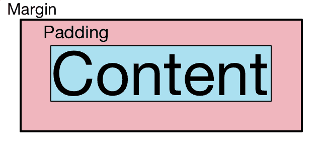
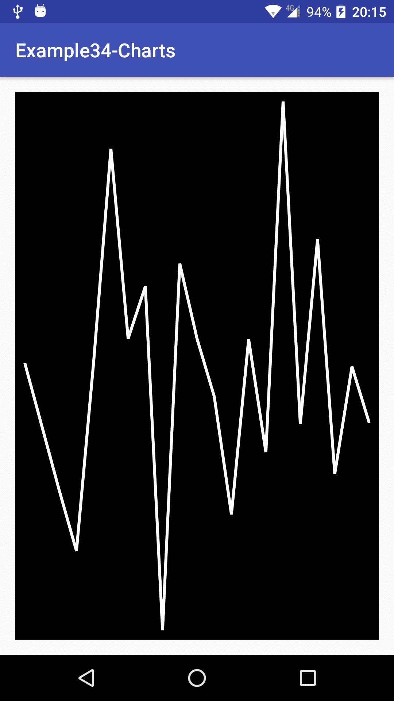
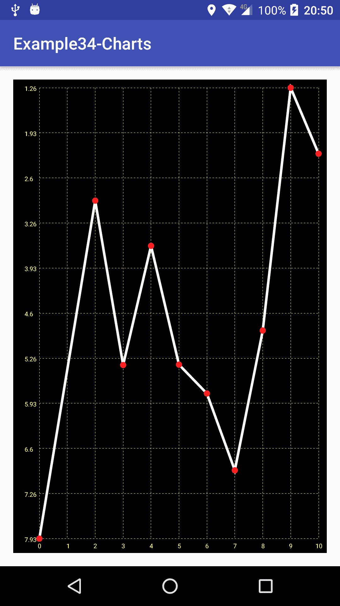

# 十、构建图表组件

在前一章中，我们看到了如何构建一个复杂的自定义视图，它结合了我们在本书中介绍的所有内容。它包括一些渲染代码，使用了第三方库，有触摸交互和动画，我们简要地讨论了性能考虑。这是一个相当完整的自定义视图示例，但不是唯一的一个。在本章中，我们将构建另一个复杂的自定义视图。一步一步，我们将建立一个图表定制视图来绘制我们可以嵌入到我们的安卓应用中的图表。我们将从构建一个非常基本的实现开始，并在此过程中添加额外的特性和功能。更详细地，我们将看到:

*   构建基本图表组件
*   如何考虑边距和填充
*   使用路径改进渲染
*   更新和增长我们的数据集
*   呈现附加功能和自定义

# 构建基本的图表自定义视图

最有可能的是，在某个时候，我们将不得不在安卓应用中绘制一些图表。它可以是静态图表，这并不有趣，因为它可以简单地被图像代替，或者它可以是动态图表，允许用户交互和对数据变化的反应。最后一种情况是，我们可以使用自定义视图绘制实时图形，添加多个数据源，甚至制作动画。让我们从构建一个非常简单的自定义视图开始，稍后我们将在其中添加更多功能。

# 边距和填充

与任何普通视图一样，我们的自定义视图将受制于布局管理器的边距和视图的填充。我们不应该太担心边距值，因为布局管理器会直接处理它们，并透明地修改自定义视图可用的大小。我们必须考虑的值是填充值。如下图所示，边距是布局管理器在自定义视图前后添加的空间，填充是视图边界和内容本身之间的内部空间:



我们的观点是适当地管理这些填充。为此，我们可以直接使用与`canvas`不同的`getPadding`方法，如`getPaddingTop()`、`getPaddingBottom()`、`getPaddingStart()`等。使用填充值，我们应该在我们的`onDraw()`方法上相应地调整渲染区域:

```java
protected void onDraw(Canvas canvas) {
    int startPadding = getPaddingStart();
    int topPadding = getPaddingTop();

    int width = canvas.getWidth() - startPadding - getPaddingEnd();
    int height = canvas.getHeight() - topPadding - getPaddingBottom();
}
```

在这段代码中，我们存储了`Canvas`的左边和最上面的点，它们分别是起始和顶部填充值。我们必须小心这个句子，因为开始填充可能不是左填充。如果我们查看文档，我们会发现同时有`getPaddingStart()`、`getPaddingEnd()`、`getPaddingLeft()`和`getPaddingRight()`。例如，如果我们的设备配置为**从右向左** ( **RTL** )模式，则开始填充可以是右侧填充。如果我们想同时支持 LTR 和 RTL 设备，我们必须小心这些细节。在这个具体的例子中，我们将通过使用视图中可用的`getLayoutDirection()`方法检测布局方向，在 RTL 的支持下构建它。但是首先，让我们关注一个非常简单的实现。

# 基本实现

我们的基本实现将非常简单。让我们从创建类及其构造函数开始:

```java
public class Chart extends View {
    private Paint linePaint;

    public Chart(Context context, AttributeSet attrs) {
        super(context, attrs);
        linePaint = new Paint();
        linePaint.setAntiAlias(true);
        linePaint.setColor(0xffffffff);
        linePaint.setStrokeWidth(8.f);
        linePaint.setStyle(Paint.Style.STROKE);
    }
}
```

我们已经在构造器上初始化了一个`Paint`对象，但是这次我们将样式设置为`Paint.Style.STROKE`，因为我们只对画线感兴趣。现在让我们添加一个方法，这样使用自定义视图的人就可以设置要呈现的数据:

```java
private float[] dataPoints;
private float minValue;
private float maxValue;
private float verticalDelta;

public void setDataPoints(float[] originalData) {
    dataPoints = new float[originalData.length];
    minValue = Float.MAX_VALUE;
    maxValue = Float.MIN_VALUE;
    for (int i = 0; i< dataPoints.length; i++) {
        dataPoints[i] = originalData[i];
        if (dataPoints[i] <minValue) minValue = dataPoints[i];
        if (dataPoints[i] >maxValue) maxValue = dataPoints[i];
    }

    verticalDelta = maxValue - minValue;
    postInvalidate();
}
```

我们正在制作原始数据阵列的副本，因为我们无法控制它，它可能会在没有预先警告的情况下发生变化。稍后，我们将看到如何改进这种行为并适应数据集的变化。

我们还计算了数组上的最大值和最小值以及它们之间的差异。这将允许我们获得这些数字的相对比例，并根据需要将它们缩小或放大到 0 到 1 的比例，这对于根据我们的视图高度调整渲染将非常方便。

现在我们有了数据，我们可以实现我们的`onDraw()`方法:

```java
@Override
protected void onDraw(Canvas canvas) {
    canvas.drawARGB(255,0 ,0 ,0);

    float leftPadding = getPaddingLeft();
    float topPadding = getPaddingTop();

    float width = canvas.getWidth() - leftPadding - getPaddingRight();
    float height = canvas.getHeight() - topPadding -
    getPaddingBottom();

    float lastX = getPaddingStart();
    float lastY = height * ((dataPoints[0] - minValue) / verticalDelta)
    + topPadding;

    for (int i = 1; i < dataPoints.length; i++) {
        float y = height * ((dataPoints[i] - minValue) / verticalDelta)
        + topPadding;
        float x = width * (((float) i + 1) / dataPoints.length) +
        leftPadding;

        canvas.drawLine(lastX, lastY, x, y, linePaint);
        lastX = x;
        lastY = y;
    }
}
```

为了尽可能简单，目前，我们用`canvas.drawARGB(255, 0, 0, 0)`绘制一个黑色背景，然后通过从总宽度和总高度中减去填充来计算`Canvas`上的可用尺寸。

我们还为所有点平均分割水平空间，并垂直缩放它们以使用整个可用空间。当我们计算出数据集的最小值和最大值之间的差值时，我们可以通过减去该数值的最小值，然后除以差值或`verticalDelta`来将这些数值缩放到`0`到`1`的范围内，作为我们在这里使用的变量。

有了这些计算，我们只需要跟踪以前的值，以便能够从旧点到新点画一条线。这里，我们将最后的`x`和`y`坐标分别存储在`lastX`和`lastY`变量中，并在每个循环结束时更新它们。

# 路径的优化和改进

我们实际上可以预先计算我们在`onDraw()`方法上所做的这些操作，因为我们不需要每次在屏幕上绘制图表时都这样做。我们可以在`setDataPoints()`处进行，这是我们自定义视图中唯一可以更改或替换数据集的点:

```java
public void setDataPoints(float[] originalData) {
    dataPoints = new float[originalData.length];

    float minValue = Float.MAX_VALUE;
    float maxValue = Float.MIN_VALUE;
    for (int i = 0; i < dataPoints.length; i++) {
        dataPoints[i] = originalData[i];
        if (dataPoints[i] < minValue) minValue = dataPoints[i];
        if (dataPoints[i] > maxValue) maxValue = dataPoints[i];
    }

    float verticalDelta = maxValue - minValue;

    for (int i = 0; i < dataPoints.length; i++) {
        dataPoints[i] = (dataPoints[i] - minValue) / verticalDelta;
    }

    postInvalidate();
}
```

现在，我们可以简化我们的`onDraw()`方法，因为我们可以安全地假设我们的数据集将始终在`0`和`1`之间:

```java
@Override
protected void onDraw(Canvas canvas) {
    canvas.drawARGB(255,0 ,0 ,0);

    float leftPadding = getPaddingLeft();
    float topPadding = getPaddingTop();

    float width = canvas.getWidth() - leftPadding - getPaddingRight();
    float height = canvas.getHeight() - topPadding -
    getPaddingBottom();

    float lastX = getPaddingStart();
    float lastY = height * dataPoints[0] + topPadding;
    for (int i = 1; i < dataPoints.length; i++) {
        float y = height * dataPoints[i] + topPadding;
        float x = width * (((float) i) / dataPoints.length) +
        leftPadding;

        canvas.drawLine(lastX, lastY, x, y, linePaint);

        lastX = x;
        lastY = y;
    }
}
```

但是我们可以更进一步，把线条画转换成`Path`:

```java
private Path graphPath; 

@Override
protected void onDraw(Canvas canvas) {
    canvas.drawARGB(255,0 ,0 ,0);

    float leftPadding = getPaddingLeft();
    float topPadding = getPaddingTop();

    float width = canvas.getWidth() - leftPadding - getPaddingRight();
    float height = canvas.getHeight() - topPadding - 
    getPaddingBottom();

    if (graphPath == null) {
        graphPath = new Path();

        graphPath.moveTo(leftPadding, height * dataPoints[0] +
        topPadding);

        for (int i = 1; i < dataPoints.length; i++) {
            float y = height * dataPoints[i] + topPadding;
            float x = width * (((float) i + 1) / dataPoints.length) +
            leftPadding;

            graphPath.lineTo(x, y);
        }
    }

    canvas.drawPath(graphPath, linePaint);
}

```

第一次调用`onDraw()`方法时，它将生成一个`Path`，其中包含从一点到另一点的所有线。该图也将缩放至`canvas`尺寸。我们现在唯一的问题是，它不会自动调整到`canvas`的大小变化，或者如果我们的图形数据被更新。让我们看看如何修复它。

首先，我们必须声明一个`boolean`标志来决定是否要重新生成路径，并声明两个变量来保存自定义视图的最后一个宽度和高度:

```java
private boolean regenerate; 
private float lastWidth; 
private float lastHeight; 
```

在我们的类构造函数中，我们必须创建一个`Path`的实例。稍后，我们将调用 reset 方法来生成一个新的`Path`，而不是用 null 进行检查并创建一个新的实例，但是以这种方式重用对象实例:

```java
graphPath = new Path(); 
lastWidth = -1; 
lastHeight = -1; 
```

在`setDataPoints()`上，我们必须在呼叫`postInvalidate`之前将`regenerate`设置为真。在我们的`onDraw()`方法中，我们必须添加额外的检查来检测`canvas`大小何时变化:

```java
if (lastWidth != width || lastHeight != height) {
    regenerate = true;

    lastWidth = width;
    lastHeight = height;
}
```

正如我们刚刚提到的，我们将检查`boolean`标志的值来重新生成`Path`，而不是用 null 进行检查:

```java
if (regenerate) {
    graphPath.reset();
    graphPath.moveTo(leftPadding, height * dataPoints[0] + topPadding);

    for (int i = 1; i < dataPoints.length; i++) {
        float y = height * dataPoints[i] + topPadding;
        float x = width * (((float) i + 1) / dataPoints.length) +
        leftPadding;

        graphPath.lineTo(x, y);
    }

    regenerate = false;
}
```

# 背景线条和细节

让我们把它添加到一个安卓项目中来看看结果。首先让我们创建一个非常简单的布局文件:

```java
<?xml version="1.0" encoding="utf-8"?>
<LinearLayout xmlns:android="http://schemas.android.com/apk/res/android"
    xmlns:tools="http://schemas.android.com/tools"
    android:layout_width="match_parent"
    android:layout_height="match_parent"
    xmlns:app="http://schemas.android.com/apk/res-auto"
    tools:context="com.rrafols.packt.chart.MainActivity">

    <com.rrafols.packt.chart.Chart
        android:layout_margin="16dp"
        android:padding="10dp"
        android:id="@+id/chart_view"
        android:layout_width="match_parent"
        android:layout_height="match_parent" />

</LinearLayout>
```

让我们创建一个空的活动，只将这个布局文件设置为内容视图，并为我们的图表组件生成一些随机数据来呈现:

```java

@Override
protected void onCreate(Bundle savedInstanceState) {
   super.onCreate(savedInstanceState);
   setContentView(R.layout.activity_main);

   Chart chart = (Chart) findViewById(R.id.chart_view);

   float[] data = new float[20];
   for (int i = 0; i < data.length; i++) {
       data[i] = (float) Math.random() * 10.f;
   }

   chart.setDataPoints(data);
}
```

如果我们运行这个示例，我们将看到以下屏幕:



好了，我们已经完成了一个简单的实现，但是让我们添加一些细节。我们将从在每个数据点上添加一个小点开始，以提高清晰度。让我们在类构造器上为此创建一个新的`Paint`对象:

```java
circlePaint = new Paint(); 
circlePaint.setAntiAlias(true); 
circlePaint.setColor(0xffff2020); 
circlePaint.setStyle(Paint.Style.FILL); 
```

现在，一种方法是创建一个额外的路径，在每个数据点上画小圆。使用与我们对直线路径相同的方法，我们将在类构造函数上创建`circlePath`的实例，并在需要重新生成时重置它。当我们计算直线的坐标时，我们可以将它们用作圆的位置:

```java
@Override
protected void onDraw(Canvas canvas) {
    canvas.drawARGB(255,0 ,0 ,0);

    float leftPadding = getPaddingLeft();
    float topPadding = getPaddingTop();

    float width = canvas.getWidth() - leftPadding - getPaddingRight();
    float height = canvas.getHeight() - topPadding -
    getPaddingBottom();

    if (lastWidth != width || lastHeight != height) {

        regenerate = true;

        lastWidth = width;
        lastHeight = height;
    }

    if (regenerate) {
        circlePath.reset();
        graphPath.reset();

        float x = leftPadding;
        float y = height * dataPoints[0] + topPadding;

        graphPath.moveTo(x, y);
        circlePath.addCircle(x, y, 10, Path.Direction.CW);

        for (int i = 1; i < dataPoints.length; i++) {
            y = height * dataPoints[i] + topPadding;
            x = width * (((float) i + 1) / dataPoints.length) +
            leftPadding;

            graphPath.lineTo(x, y);
            circlePath.addCircle(x, y, 10, Path.Direction.CW);
        }

        regenerate = false;
    }

    canvas.drawPath(graphPath, linePaint);
    canvas.drawPath(circlePath, circlePaint);
}
```

在这个例子中，我们已经将圆的半径硬编码为`10`，只是比线的厚度大一点:`8`，但是我们将在本章后面讨论定制。

如果我们现在运行这个示例，我们将看到与之前版本的不同之处:


为了添加更多的视觉参考，让我们也添加一些背景线条。由于它将使用不同的设置绘制，让我们首先创建一个新的`Paint`对象:

```java
backgroundPaint = new Paint(); 
backgroundPaint.setColor(0xffBBBB40); 
backgroundPaint.setStyle(Paint.Style.STROKE); 
backgroundPaint.setPathEffect(new DashPathEffect(new float[] {5, 5}, 0)); 
```

现在，让我们修改`onDraw()`方法，用背景线也生成一个新的`Path`:

```java
@Override
protected void onDraw(Canvas canvas) {
    canvas.drawARGB(255,0 ,0 ,0);

    float leftPadding = getPaddingLeft();
    float topPadding = getPaddingTop();

    float width = canvas.getWidth() - leftPadding - getPaddingRight();
    float height = canvas.getHeight() - topPadding -
    getPaddingBottom();

    if (lastWidth != width || lastHeight != height) {
        regenerate = true;

        lastWidth = width;
        lastHeight = height;
    }

    if (regenerate) {
        circlePath.reset();
        graphPath.reset();
        backgroundPath.reset();

 for (int i = 0; i <= dataPoints.length; i++) {
 float xl = width * (((float) i) / dataPoints.length) +
 leftPadding;
 backgroundPath.moveTo(xl, topPadding);
 backgroundPath.lineTo(xl, topPadding + height);
 }

 for (int i = 0; i <= 10; i++) {
 float yl = ((float) i / 10.f) * height + topPadding;
 backgroundPath.moveTo(leftPadding, yl);
 backgroundPath.lineTo(leftPadding + width, yl);
 }

        float x = leftPadding;
        float y = height * dataPoints[0] + topPadding;

        graphPath.moveTo(x, y);
        circlePath.addCircle(x, y, 10, Path.Direction.CW);

        for (int i = 1; i < dataPoints.length; i++) {
            x = width * (((float) i + 1) / dataPoints.length) + 
           leftPadding;
            y = height * dataPoints[i] + topPadding;

            graphPath.lineTo(x, y);
            circlePath.addCircle(x, y, 10, Path.Direction.CW);
        }

        regenerate = false;
    }

    canvas.drawPath(backgroundPath, backgroundPaint);
    canvas.drawPath(graphPath, linePaint);
    canvas.drawPath(circlePath, circlePaint);
}
```

在这里，我们同时创建水平线和垂直线。水平线将被创建在相同的点，将有一个数据点。对于垂直线，我们不会遵循同样的原则，我们只会在我们的`Canvas`的顶部和底部之间均匀地画出 10 条垂直线。现在执行我们的示例，我们将获得类似于以下屏幕的内容:


没关系，但是我们仍然缺少一些参考点。让我们画一些水平和垂直的标签。

首先，让我们创建一个标签数组，并创建一个方法让任何使用这个自定义视图的人设置它们:

```java
private String[] labels; 

public void setLabels(String[] labels) {
    this.labels = labels;
}

```

如果没有设置，我们可以不画任何东西或者自己生成它们。在本例中，我们将使用数组索引自动生成它们:

```java
if (labels == null) {
     labels = new String[dataPoints.length + 1];
     for (int i = 0; i < labels.length; i++) {
         labels[i] = "" + i;
     }
 }
```

为了测量文本，使其居中，我们将重用一个`Rect`对象。让我们创建并实例化它:

```java
private Rect textBoundaries = new Rect(); 
```

现在，我们可以在`onDraw()`方法中添加以下代码来绘制底部标签，数据集中的每个点一个标签:

```java
for (int i = 0; i <= dataPoints.length; i++) {
    float xl = width * (((float) i) / dataPoints.length) + leftPadding;
    backgroundPaint.getTextBounds(labels[i], 0, labels[i].length(),
    textBoundaries);
    canvas.drawText(labels[i], 
        xl - (textBoundaries.width() / 2), 
        height + topPadding + backgroundPaint.getTextSize() * 1.5f, 
        backgroundPaint);
}
```

我们还调整了图表的总高度，为标签增加了一些空间:

```java
float height = canvas.getHeight() - topPadding - getPaddingBottom() 
        - backgroundPaint.getTextSize() + 0.5f; 
```

让我们也画一个侧边图例，指示点的值和比例。当我们绘制一组预定义的垂直线时，我们只需要计算这些值。我们必须将这些值从 0 到 1 的范围转换回它们的原始范围和特定值。

我们必须根据标签的大小来调整宽度和图形的初始左点。另外，让我们计算侧标签的最大宽度:

```java
float maxLabelWidth = 0.f;

for (int i = 0; i <= 10; i++) {
    float step = ((float) i / 10.f);
    float value = step * verticalDelta + minValue;
    verticalLabels[i] = decimalFormat.format(value);
    backgroundPaint.getTextBounds(verticalLabels[i], 0,
    verticalLabels[i].length(), textBoundaries);
    if (textBoundaries.width() > maxLabelWidth) {
        maxLabelWidth = textBoundaries.width();
    }
}
```

我们还使用了一个`DecimalFormat`实例来格式化浮点值。我们用以下模式创建了这个`DecimalFormat`:

```java
decimalFormat = new DecimalFormat("#.##"); 
```

此外，我们将标签存储在一个数组中，以避免每次绘制视图时重新生成它们。利用存储在`maxLabelWidth`变量中的最大标签宽度，我们可以调整填充:

```java
float labelLeftPadding = getPaddingLeft() + maxLabelWidth * 0.25f; 
float leftPadding = getPaddingLeft() + maxLabelWidth * 1.5f; 
```

我们仍将使用`leftPadding`渲染所有对象，使用`labelLeftPadding`渲染标签。我们增加了最大标签的尺寸和额外的 *50%* 的填充，在绘制标签时将分布在标签的前后。出于这个原因，标签将被渲染一个额外的`maxLabelWidth`填充的 *25%* ，因此在标签的末端和图形的开始之间将有另一个 *25%* 的空间。

我们只需迭代数组并计算正确的垂直位置，就可以轻松绘制垂直标签:

```java
for (int i = 0; i <= 10; i++) {
    float step = ((float) i / 10.f);
    float yl = step * height + topPadding- (backgroundPaint.ascent() +
    backgroundPaint.descent()) * 0.5f;
    canvas.drawText(verticalLabels[i],
        labelLeftPadding, 
        yl, 
        backgroundPaint);
}
```

为了使文本在垂直坐标上居中，我们使用当前字体上升和下降之间的平均值。

如果我们现在运行这个例子，我们将有一个更详细的图表视图:



在本章的前面，我们说过我们将为 RTL 和 LTR 设备提供支持。在此图表视图中，如果设备布局配置为 RTL，图例在屏幕右侧会感觉更自然。让我们快速实现这一变化:

```java
float labelLeftPadding = getPaddingLeft() + maxLabelWidth * 0.25f; 
float leftPadding = getPaddingLeft() + maxLabelWidth * 1.5f; 
float rightPadding = getPaddingRight(); 
float topPadding = getPaddingTop(); 

float width = canvas.getWidth() - leftPadding - rightPadding; 
float height = canvas.getHeight() - topPadding - getPaddingBottom() 
        - backgroundPaint.getTextSize() + 0.5f; 

if (getLayoutDirection() == LAYOUT_DIRECTION_RTL) { 
    leftPadding = getPaddingEnd(); 
    labelLeftPadding = leftPadding + width + maxLabelWidth * 0.25f; 
} 
```

我们唯一要做的改变是检查布局方向是否为`LAYOUT_DIRECTION_RTL`，并更改`leftPadding`和`labelLeftPadding`来更新绘制图形和标签的位置。

# 自定义

在上一章中，我们已经看到了如何向自定义视图添加参数。在本章构建的图形自定义视图中，我们可以配置例如颜色、线条粗细、点的大小等，但是我们将关注其他类型的自定义，例如反转垂直轴，以及启用或禁用底部和侧面标签或图形图例的渲染。与之前的配置相比，这些将需要一些额外的代码调整和特定的实现。

让我们从允许垂直轴反转开始。我们的默认实现将在图表的顶部呈现较小的值，在底部呈现较大的值。这可能不是预期的结果，所以让我们添加一种反转轴的方法:

```java
private boolean invertVerticalAxis;

public void setInvertVerticalAxis(boolean invertVerticalAxis) {
    this.invertVerticalAxis = invertVerticalAxis;
    regenerate = true;
    postInvalidate();
}
```

然后，我们只需更改标签的生成方式，并反转数据点的值(如果适用)。要更改标签的生成，我们只需更新步骤的顺序即可。不是从`0`到`1`取一个数，而是反过来从`1`到`0`取一个数:

```java
float maxLabelWidth = 0.f;
if (regenerate) {
    for (int i = 0; i <= 10; i++) {
        float step;

        if (!invertVerticalAxis) {
 step = ((float) i / 10.f);
 } else {
 step = ((float) (10 - i)) / 10.f;
 }

        float value = step * verticalDelta + minValue;
        verticalLabels[i] = decimalFormat.format(value);
        backgroundPaint.getTextBounds(verticalLabels[i], 0,
        verticalLabels[i].length(), textBoundaries);
        if (textBoundaries.width() > maxLabelWidth) {
            maxLabelWidth = textBoundaries.width();
        }
    }
}
```

要获得数据点的倒排值，如果需要，根据标志的值，让我们添加一个新方法来实现这一点:

```java
private float getDataPoint(int i) { 
    float data = dataPoints[i]; 
    return invertVerticalAxis ? 1.f - data : data; 
} 
```

现在，我们应该使用这个方法，而不是直接从数组中获取数据点，因为如果需要，它会透明地反转数字。

前面已经提到，我们还增加了`setLabels()`方法，所以标签也可以外部定制。

我们还可以添加一个`boolean`标志来允许或阻止绘制图例和背景线:

```java
private boolean drawLegend;

public void setDrawLegend(boolean drawLegend) {
    this.drawLegend = drawLegend;
    regenerate = true;
    postInvalidate();
}
```

在绘制背景线和标签之前，只需检查该标志的状态。

参见 GitHub 存储库中`Example34-Charts`文件夹中的完整示例。

# 添加高级功能

我们已经构建了一个图表定制视图的简单实现。但是我们需要一些更多的特性，否则我们的定制视图可能会感觉有点静态或者不是很有用。我们无法构建所有我们可能想到或可能需要的功能。此外，我们应该注意不要构建瑞士军刀自定义视图，因为它可能会变得难以维护，并可能会影响自定义视图的性能。

# 实时更新

在我们自定义视图的第一个简单实现中，我们创建了一个方法来设置数据点，但是我们不能修改或更新数据。让我们实现一些快速变化，以便能够动态地添加点。在这个实现中，我们直接在`setDataPoints()`方法上将数值调整为 0 到 1 的比例。由于我们将提供一种添加新数据值的方法，我们可能会获得原始最小值和最大值之外的值，从而使我们之前计算的比例无效。

让我们首先将数据存储在集合中，而不是数组中，这样我们就可以轻松地添加新值:

```java
private ArrayList<Float> dataPoints;

public void setDataPoints(float[] originalData) {
    ArrayList<Float> array = new ArrayList<>();
    for (float data : originalData) {
        array.add(data);
    }

    setDataPoints(array);
}

public void setDataPoints(ArrayList<Float> originalData) {
    dataPoints = new ArrayList<Float>();
    dataPoints.addAll(originalData);

    adjustDataRange();
}
```

我们将数据存储在`ArrayList`中，并且我们已经修改了`setDataPoints()`方法以便能够这样做。此外，我们还创建了`adjustDataRange()`方法来重新计算数据范围，并触发数据再生和视图重绘:

```java
private void adjustDataRange() {
    minValue = Float.MAX_VALUE;
    maxValue = Float.MIN_VALUE;
    for (int i = 0; i < dataPoints.size(); i++) {
        if (dataPoints.get(i) < minValue) minValue = dataPoints.get(i);
        if (dataPoints.get(i) > maxValue) maxValue = dataPoints.get(i);
    }

    verticalDelta = maxValue - minValue;

    regenerate = true;
    postInvalidate();
}
```

`addValue()`方法的实现相当简单。我们将新数据添加到`ArrayList`中，如果它在当前范围内，我们就触发图形的重新生成和视图的重新绘制。如果超出当前范围，我们调用`adjustDataRange()`方法将所有数据调整到新范围:

```java
public void addValue(float data) {
    dataPoints.add(data);

    if (data < minValue || data > maxValue) {
        adjustDataRange();
    } else {
        regenerate = true;
        postInvalidate();
    }
}
```

我们只需要修改`getDataPoint()`方法，将数据调整到`0`到`1`范围:

```java
private float getDataPoint(int i) { 
    float data = (dataPoints.get(i) - minValue) / verticalDelta; 
    return invertVerticalAxis ? 1.f - data : data; 
} 
```

如果我们运行这个例子，我们可以看到我们可以向图中添加新的点，它会自动调整。要完全改变或更新数据，必须调用方法`setDataPoints()`。

# 多个数据集

有时，我们希望显示多个图表来比较它们，或者简单地同时显示多个数据集。让我们做一些修改，以允许在我们的图形自定义视图中同时显示两个图形。它可以进一步扩展以支持更多的图形，但是让我们将其限制为两个，以简化本例中的逻辑。

首先，我们需要为每个图形创建不同的绘制和路径对象。我们将创建数组来存储它们，因为以后迭代和呈现它们会更容易。例如，我们可以为每个图形创建几个不同颜色的 Paint 对象:

```java
linePaint = new Paint[2]; 
linePaint[0] = new Paint(); 
linePaint[0].setAntiAlias(true); 
linePaint[0].setColor(0xffffffff); 
linePaint[0].setStrokeWidth(8.f); 
linePaint[0].setStyle(Paint.Style.STROKE); 

linePaint[1] = new Paint(); 
linePaint[1].setAntiAlias(true); 
linePaint[1].setColor(0xff4040ff); 
linePaint[1].setStrokeWidth(8.f); 
linePaint[1].setStyle(Paint.Style.STROKE); 
circlePaint = new Paint[2]; 
circlePaint[0] = new Paint(); 
circlePaint[0].setAntiAlias(true); 
circlePaint[0].setColor(0xffff2020); 
circlePaint[0].setStyle(Paint.Style.FILL);  
circlePaint[1] = new Paint(); 
circlePaint[1].setAntiAlias(true); 
circlePaint[1].setColor(0xff20ff20); 
circlePaint[1].setStyle(Paint.Style.FILL); 
```

实际上，一次又一次地设置相同的参数需要做大量的工作，所以我们可以使用另一个来自`Paint`的构造函数，它从一个已经存在的`Paint`对象中复制属性:

```java
linePaint = new Paint[2]; 
linePaint[0] = new Paint(); 
linePaint[0].setAntiAlias(true); 
linePaint[0].setColor(0xffffffff); 
linePaint[0].setStrokeWidth(8.f); 
linePaint[0].setStyle(Paint.Style.STROKE);

linePaint[1] = new Paint(linePaint[0]); 
linePaint[1].setColor(0xff4040ff); 

circlePaint = new Paint[2]; 
circlePaint[0] = new Paint(); 
circlePaint[0].setAntiAlias(true); 
circlePaint[0].setColor(0xffff2020); 
circlePaint[0].setStyle(Paint.Style.FILL); 

circlePaint[1] = new Paint(circlePaint[0]); 
circlePaint[1].setColor(0xff20ff20); 
```

此外，`Path`对象和数据存储:

```java
graphPath = new Path[2]; 
graphPath[0] = new Path(); 
graphPath[1] = new Path(); 

circlePath = new Path[2]; 
circlePath[0] = new Path(); 
circlePath[1] = new Path(); 

dataPoints = (ArrayList<Float>[]) new ArrayList[2]; 
```

我们还需要一种机制来将数据添加到特定的数据集:

```java
public void setDataPoints(ArrayList<Float> originalData, int index) {
    dataPoints[index] = new ArrayList<Float>();
    dataPoints[index].addAll(originalData);

    adjustDataRange();
}
```

由于我们将有不同的数据集，我们必须计算所有数据集的最小值和最大值。我们将在每个图表上使用相同的比例，以便更容易进行比较:

```java
private void adjustDataRange() {
    minValue = Float.MAX_VALUE;
    maxValue = Float.MIN_VALUE;
    for (int j = 0; j < dataPoints.length; j++) {
        for (int i = 0; dataPoints[j] != null && i <
        dataPoints[j].size(); i++) {
            if (dataPoints[j].get(i) < minValue) minValue =
            dataPoints[j].get(i);
            if (dataPoints[j].get(i) > maxValue) maxValue =
            dataPoints[j].get(i);
        }
    }

    verticalDelta = maxValue - minValue;

    regenerate = true;
    postInvalidate();
}
```

最后，我们需要更新`getDataPoint()`方法，以允许我们从不同的数据集获取数据:

```java
private float getDataPoint(int i, int index) { 
    float data = (dataPoints[index].get(i) - minValue) / verticalDelta; 
    return invertVerticalAxis ? 1.f - data : data; 
} 
```

通过所有这些方法，我们可以更新我们的路径生成代码来生成多个`Path` s。如果没有定义该图的数据集，它将不会生成`Path`。

```java
for (int j = 0; j < 2; j++) {
    if (dataPoints[j] != null) {
        float x = leftPadding;
        float y = height * getDataPoint(0, j) + topPadding;

        graphPath[j].moveTo(x, y);
        circlePath[j].addCircle(x, y, 10, Path.Direction.CW);

        for (int i = 1; i < dataPoints[j].size(); i++) {
            x = width * (((float) i + 1) / dataPoints[j].size()) + 
            leftPadding;
            y = height * getDataPoint(i, j) + topPadding;

            graphPath[j].lineTo(x, y);
            circlePath[j].addCircle(x, y, 10, Path.Direction.CW);
        }
    }
}
```

渲染代码，它只是迭代所有生成的`Path` s，并用它们对应的`Paint`对象绘制它们:

```java
for (int j = 0; j < graphPath.length; j++) {
    canvas.drawPath(graphPath[j], linePaint[j]);
    canvas.drawPath(circlePath[j], circlePaint[j]);
}
```

如果我们用两组随机数据运行这个示例，我们将看到类似于以下屏幕的内容:


# 缩放和滚动

我们可以在自定义视图中实现的另一个有趣的特性是缩放和滚动的能力。就像我们在上一章中所做的那样，我们将使用安卓的`ScaleDetector`类来检测捏手势，并在我们的自定义视图中更新缩放。

实现将与前一章大不相同。在这种情况下，我们将用一种更简单的方法来做。当我们想要缩放一切时，我们将只应用`canvas`变换，而不是再次重新生成缩放的`Path`对象，但是首先，让我们实现手势检测器，并添加滚动和动画属性的能力。

我们几乎可以复制我们在以前的自定义 EPG 视图中用于制作变量逻辑动画和检查我们是否还有未完成的动画的相同方法:

```java
private boolean missingAnimations() {
    if (Math.abs(scrollXTarget - scrollX) > ANIM_THRESHOLD) 
        return true;

    if (Math.abs(scrollYTarget - scrollY) > ANIM_THRESHOLD)
        return true;

    return false;
}

private void animateLogic() {
    long currentTime = SystemClock.elapsedRealtime();
    accTime += currentTime - timeStart;
    timeStart = currentTime;

    while (accTime > TIME_THRESHOLD) {
        scrollX += (scrollXTarget - scrollX) / 4.f;
        scrollY += (scrollYTarget - scrollY) / 4.f;
        accTime -= TIME_THRESHOLD;
    }

    float factor = ((float) accTime) / TIME_THRESHOLD;
    float nextScrollX = scrollX + (scrollXTarget - scrollX) / 4.f;
    float nextScrollY = scrollY + (scrollYTarget - scrollY) / 4.f;

    frScrollX = scrollX * (1.f - factor) + nextScrollX * factor;
    frScrollY = scrollY * (1.f - factor) + nextScrollY * factor;
}
```

我们还可以添加用于检查拖动事件的代码，将触摸事件发送到比例检测器，并根据拖动量滚动屏幕:

```java
@Override
public boolean onTouchEvent(MotionEvent event) {
    scaleDetector.onTouchEvent(event);

    if (zooming) {
        invalidate();
        zooming = false;
        return true;
    }

    switch(event.getAction()) {
        case MotionEvent.ACTION_DOWN:
            dragX = event.getX();
            dragY = event.getY();

            getParent().requestDisallowInterceptTouchEvent(true);
            dragged = false;
            return true;

        case MotionEvent.ACTION_UP:
            getParent().requestDisallowInterceptTouchEvent(false);
            return true;

        case MotionEvent.ACTION_MOVE:
            float newX = event.getX();
            float newY = event.getY();

            scrollScreen(dragX - newX, dragY - newY);

            dragX = newX;
            dragY = newY;
            dragged = true;
            return true;
        default:
            return false;
    }
}

private void scrollScreen(float dx, float dy) {
    scrollXTarget += dx;
    scrollYTarget += dy;

    if (scrollXTarget < 0) scrollXTarget = 0;
    if (scrollYTarget < 0) scrollYTarget = 0;

    if (scrollXTarget > getWidth() * scale - getWidth()) {
        scrollXTarget = getWidth() * scale - getWidth();
    }

    if (scrollYTarget > getHeight() * scale - getHeight()) {
        scrollYTarget = getHeight() * scale - getHeight();
    }

    invalidate();
}
```

我们已经定义了一个名为 scale 的变量，它将控制缩放的数量，我们正在对我们的图形定制视图进行缩放。现在我们来写一下`scaleDetector`的实现:

```java
scaleDetector = new ScaleGestureDetector(context, new ScaleGestureDetector.SimpleOnScaleGestureListener() {
    private float focusX;
    private float focusY;
    private float scrollCorrectionX = 0.f;
    private float scrollCorrectionY = 0.f;

    @Override
    public boolean onScaleBegin(ScaleGestureDetector detector) {
        zooming = true;
        focusX = detector.getFocusX();
        focusY = detector.getFocusY();
        scrollCorrectionX = focusX * scale - scrollXTarget;
        scrollCorrectionY = focusY * scale - scrollYTarget;
        return true;
    }

    public boolean onScale(ScaleGestureDetector detector) {
        scale *= detector.getScaleFactor();
        scale = Math.max(1.f, Math.min(scale, 2.f));

        float currentX = focusX * scale - scrollXTarget;
        float currentY = focusY * scale - scrollYTarget;

        scrollXTarget += currentX - scrollCorrectionX;
        scrollYTarget += currentY - scrollCorrectionY;

        invalidate();
        return true;
    }

    @Override
    public void onScaleEnd(ScaleGestureDetector detector) {
        zooming = true;
    }
});
```

我们还实现了一个滚动校正机制，以保持缩放位置尽可能居中。在这种情况下，我们必须在水平轴和垂直轴上实现它。该算法背后的主要思想是计算手势聚焦点的水平和垂直位置，并在改变缩放时，调整滚动位置以使其保持在同一位置。

现在，我们的`onDraw()`方法将简单地从下面开始:

```java
animateLogic(); 

canvas.save(); 

canvas.translate(-frScrollX, -frScrollY); 
canvas.scale(scale, scale); 
```

我们需要通过调用`animateLogic()`来检查和处理动画周期，然后让我们表现正常并保存我们的`canvas`状态，通过滚动值`frScrollX`和`frScrollY`应用转换，并通过`scale`变量缩放整个`canvas`。

我们将呈现的所有内容都将被滚动位置所取代，并根据缩放变量的值进行缩放。在完成该方法之前，我们必须恢复我们的`canvas`并且如果不是所有的属性动画都已经完成，则触发新的重绘循环:

```java
canvas.restore(); 
if (missingAnimations()) invalidate(); 
```

参见 GitHub 存储库中`Example35-Charts`文件夹中的完整示例源代码。

# 摘要

在本章中，我们已经看到了如何在我们的安卓应用中构建图表自定义视图来绘制图表。我们还快速介绍了如何管理填充、RTL / LTR 支持，最后我们通过支持多个数据集或添加缩放和滚动功能，为定制视图增加了一些复杂性。

此外，我们实现这个定制视图的方式；使用独立的数据范围并根据屏幕动态调整，意味着它将自动调整到任何屏幕分辨率，或者例如，方向变化。这通常是一种很好的做法，在几个设备上测试我们的自定义视图时，可以避免很多问题。此外，让我们在屏幕上绘制的所有内容的大小取决于屏幕密度，就像我们在前面的示例中所做的那样，这将使便携性变得更加容易。

在下一章中，我们将展示如何使用我们在前几章中介绍的 3D 渲染功能来构建自定义视图。