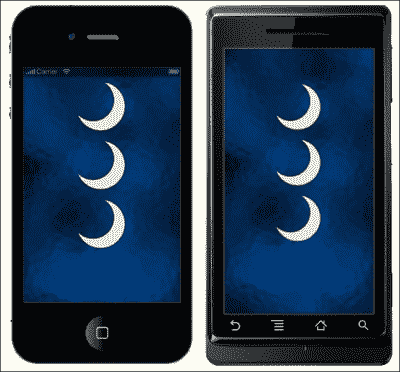
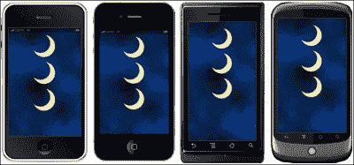
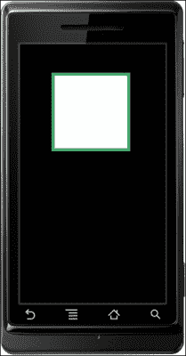
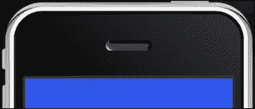
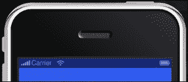
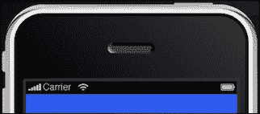

# 第二章：Lua 快速入门与 Corona 框架

> *Lua 是用于在 Corona SDK 上进行开发的编程语言。到目前为止，你已经学会了如何使用主要资源来运行 SDK 和其他开发工具，在移动设备上创建应用程序。现在我们已经涉足编写几行代码让程序运行，让我们深入到基础中，这将使你更好地了解 Lua 的能力。*

在本章中，你将学习如何：

+   在脚本中应用变量

+   使用数据结构来构建表

+   使用显示对象进行操作

+   使用对象方法和参数实现函数

+   优化你的工作流程

那么让我们开始吧。

# Lua 来拯救

Lua 是游戏编程的行业标准。它类似于 JavaScript 和 Flash 的 ActionScript。任何在这些语言中做过脚本编写的人几乎可以立即过渡到 Lua。

Lua 在创建各种应用程序和游戏中都很有用。由于它易于嵌入、执行速度快和学习曲线平缓，许多游戏程序员发现 Lua 是一种方便的脚本语言。《魔兽世界》中到处都在使用它。它还被 Electronic Arts、Rovio、ngmoco 和 Tapulous 在如《愤怒的小鸟》、《敲击复仇》、《餐厅大亨》等游戏中使用。

有关 Lua 的更多信息，请参考[`www.lua.org`](http://www.lua.org)。

# 有价值的变量

与许多脚本语言一样，Lua 也有变量。你可以将变量视为存储值的东西。当你在变量中应用一个值时，你可以使用相同的变量名来引用它。

一个应用程序由注释、块、语句和变量组成。**注释**永远不会被处理，但它被包含在内是为了解释一个语句或块的目的。**块**是一组语句的集合。**语句**提供关于需要执行哪些操作和计算的指令；**变量**存储这些计算的结果。在变量中设置值称为**赋值**。

Lua 使用三种类型的变量，如下所示：

+   全局变量

+   局部变量

+   表字段（属性）

变量占用内存空间，这在各种移动设备上可能是有限的。当一个变量不再需要时，最好将其值设置为 nil，这样它可以被快速清理。

## 全局变量

全局变量可以在每个作用域中访问，并且可以从任何地方修改。术语“作用域”用于描述一组变量可访问的区域。你不需要声明全局变量。在你为其赋值时它就会被创建：

```kt
myVariable = 10
print( myVariable ) -- prints the number 10
```

## 局部变量

局部变量从局部作用域访问，通常从函数或代码块中调用。当我们创建一个块时，我们正在创建一个变量可以存在的作用域或一系列按顺序执行的语句。当引用一个变量时，Lua 必须找到该变量。局部化变量有助于加快查找过程，提高代码性能。使用 local 语句，它声明了一个局部变量：

```kt
local i = 5 -- local variable
```

下面的代码行展示了如何在块中声明一个局部变量：

```kt
x = 10    -- global 'x' variable
local i = 1

while i <= 10 do
   local x = i * 2  -- a local 'x' variable for the while block
   print( x )       -- 2, 4, 6, 8, 10 ... 20
   i = i + 1
end

print( x )  -- prints 10 from global x
```

## 表字段（属性）

表字段是通过索引唯一访问的一组变量。数组可以用数字和字符串索引，或者任何属于 Lua 的值，除了 `nil`。你使用整数或字符串索引到数组来为字段赋值。当索引是字符串时，该字段称为属性。所有属性都可以使用点操作符（`x.y`）或字符串（`x["y"]`）来索引表。结果是一样的：

```kt
x = { y="Monday" }  -- create table 
print( x.y )  -- "Monday"
z = "Tuesday"    -- assign a new value to property "Tuesday"
print( z )  -- "Tuesday"
x.z = 20  -- create a new property 
print( x.z )  -- 20
print( x["z"] )  -- 20
```

关于表的更多信息将在后面的*表*一节中讨论。

你可能已经注意到，在前面的示例代码中的某些行中有额外的文本。这些就是你所称的注释。注释以双连字符 `--` 开头，但不能放在字符串内部。它们一直持续到行尾。块注释也是可用的。注释掉一个块的一个常见技巧是用 `--[[` 和 `]]` 包围它。

下面是如何注释一行代码的示例：

```kt
a = 2
--print(a)    -- 2
```

这是一个块注释的示例：

```kt
--[[
k = 50
print(k)    -- 50
--]]
```

# 赋值约定

变量命名有规则。变量以字母或下划线开头，除了字母、下划线或数字外不能包含其他任何字符。变量名还不能是 Lua 的以下保留字：

+   `and`

+   `break`

+   `do`

+   `else`

+   `elseif`

+   `end`

+   `false`

+   `for`

+   `function`

+   `if`

+   `in`

+   `local`

+   `nil`

+   `not`

+   `or`

+   `repeat`

+   `return`

+   `then`

+   `true`

+   `until`

+   `while`

以下是有效的变量：

+   x

+   X

+   ABC

+   _abc

+   test_01

+   myGroup

以下是不合法的变量：

+   `function`

+   my-variable

+   123

### 注意

Lua 也是一个大小写敏感的语言。例如，`else` 是一个保留字，但 Else 和 ELSE 是两个不同的有效名称。

# 值的类型

Lua 是一种动态类型的语言。在 Lua 语言中没有定义变量类型。这使得每个值都可以携带自己的类型。

正如你所注意到的，值可以存储在变量中。它们可以操作以生成任何类型的值。这也允许你将参数传递给其他函数，并将它们作为结果返回。

你将处理的值的基本类型如下：

+   **Nil**：这是唯一一个值为 `nil` 的类型。任何未初始化的变量都有 `nil` 作为其值。像全局变量一样，默认是 `nil`，可以被赋值为 `nil` 以删除它。

+   **布尔值**：这种类型有两个值：`false` 和 `true`。你会注意到，条件表达式将 `false` 和 `nil` 视为假，其他任何值视为 `true`。

+   **数字**：这些代表实数（双精度浮点数）。

+   **字符串**：这是一系列字符。允许 8 位字符和嵌入的零。

+   **表**：这些是 Lua 中的数据结构。它们通过关联数组实现，这是一个不仅可以使用数字索引，还可以使用字符串或其他任何值（除了`nil`）索引的数组（关于这一点，本章后面会详细介绍）。

+   **函数**：这些被称为 Lua 中的一等值。通常，函数可以存储在变量中，作为参数传递给其他函数，并作为结果返回。

# 行动时间——使用代码块打印值

让我们试一试，看看 Lua 语言有多强大。我们开始了解变量是如何工作的，以及当你给它们赋值时会发生什么。如果你有一个带有多个值的变量会怎样？Lua 如何区分它们？我们将使用 Corona 终端，这样我们就可以在终端框中看到输出的值。在这个过程中，你还会学习到其他编程技术。我们在这项练习中也会提到代码块。Lua 中执行单元被称为**代码块**。代码块是按顺序执行的一块代码。按照以下步骤开始学习 Lua：

如果你记得，在前面的章节中，你学习了如何为 Hello World 应用程序创建自己的项目文件夹和`main.lua`文件。

1.  在你的桌面上创建一个新的项目文件夹，并将其命名为`Variables`。

1.  打开你喜欢的文本编辑器，并将其保存为`Variables`项目文件夹中的`main.lua`。

1.  创建以下变量：

    ```kt
    local x = 10 -- Local to the chunk
    local i = 1  -- Local to the chunk        
    ```

1.  在`while`循环中加入以下内容：

    ```kt
    while (i<=x) do
      local x = i  -- Local to the "do" body
      print(x)       -- Will print out numbers 1 through 10 
      i = i + 1
    end
    ```

1.  创建一个表示另一个局部体的`if`语句：

    ```kt
    if i < 20 then
      local x          -- Local to the "then" body
      x = 20
      print(x + 5)  -- 25
    else
      print(x)         -- This line will never execute since the above "then" body is already true
    end

    print(x)  -- 10
    ```

1.  保存你的脚本。

1.  启动 Corona 终端。确保你看到 Corona SDK 屏幕和终端窗口弹出。

1.  导航到`Variables`项目文件夹，并在模拟器中打开你的`main.lua`文件。你会注意到模拟器中的设备是空白的，但如果你查看终端窗口，会看到代码输出的结果，如下所示：

    ```kt
    1
    2
    3
    4
    5
    6
    7
    8
    9
    10
    25
    10

    ```

## *刚才发生了什么？*

创建的前两个变量是每个代码块外的局部变量。注意在`while`循环的开始部分，`i <= x`指的是第 1 行和第 2 行的变量。`while`循环内的`local x = i`语句只对`do`体局部有效，并不等同于`local x = 10`。`while`循环运行 10 次，每次递增一并输出值。

`if`语句会对比`i < 20`，此时`i`等于 11，并使用另一个在`then`体内的局部变量`local x`。因为语句为真，`x`等于 20 并输出`x + 5`的值，即`25`。

最后一行代码 `print(x)` 没有附加到 `while` 循环或 `if` 语句中的任何代码块。因此，它指的是 `local x = 10` 并在终端窗口输出 10 的值。这可能看起来有些混淆，但理解 Lua 中局部变量和全局变量如何工作是很重要的。

# 表达式

**表达式**是代表值的实体。它可以包括数字常量、字符串、变量名、一元和二元运算以及函数调用。

## 算术运算符

`+`、`-`、`*`、`/`、`%` 和 `^` 被称为算术运算符。

这是一个二元算术运算符的例子：

```kt
t = 2*(2-5.5)/13+26
print(t)  -- 25.461538461538
```

这是一个模运算（除法余数）运算符的例子：

```kt
m = 18%4
print(m)  -- 2
```

运算符强大之处的一个例子如下：

```kt
n = 7²
print(n)  -- 49
```

## 关系运算符

关系运算符总是返回 false 或 true，并询问是或否的问题。关系运算符有 `<`、`>`、`<=`、`>=`、`==`、`~=`。

`==` 运算符用于测试相等性，而 `~=` 运算符用于测试不等性。如果值类型不同，结果为假。否则，Lua 根据类型比较值。数字和字符串以常规方式比较。只要两个这样的值被认为是相等的，表和函数就通过引用比较，只有当它们是同一个对象时才相等。当创建新对象时，新对象与之前存在的对象是不同的。

这里有一些关系运算符的例子。它们将显示布尔结果，不能与字符串拼接：

```kt
print(0 > 1)  --false
print(4 > 2)  --true
print(1 >= 1)  --true
print(1 >= 1.5)  --false
print(0 == 0)  --true
print(3 == 2)  --false
print(2 ~= 2)  -- false
print(0 ~= 2)  -- true
```

## 逻辑运算符

Lua 中的逻辑运算符有 `and`、`or` 和 `not`。所有逻辑运算符将 `false` 和 `nil` 视为假，其他任何值视为真。

`and` 运算符如果其值为 `false` 或 `nil`，则返回第一个参数；否则，返回第二个参数。`or` 运算符如果其值不是 `nil` 和 `false`，则返回第一个参数；否则，返回第二个参数。`and` 和 `or` 都使用短路评估；这意味着只有必要时才会评估第二个操作数。以下是一些逻辑运算符的例子：

```kt
print(10 and 20)      -- 20
print(nil and 1)      -- nil
print(false and 1)    -- false
print(10 or 20)       -- 10
print(false or 1)     -- 1
```

`not` 运算符总是返回 true 或 false：

```kt
print(not nil)      -- true
print(not true)    -- false
print(not 2)        -- false
```

## 连接

Lua 中的字符串连接运算符由两个点表示，即"`..`"。它将两个值作为操作数并将它们拼接在一起。如果其操作数中的任何一个为数字，则也会被转换成字符串。以下是一些连接运算符的例子：

```kt
print("Hello " .. "World")  -- Hello World

myString = "Hello"
print(myString .. " World")   -- Hello World
```

## 长度运算符

`#` 长度运算符用于测量字符串的长度或表的大小。字符串的长度就是它包含的字符数。一个字符被认为是一个字节。以下是一些长度运算符的例子：

```kt
print(#"*") --1
print(#"\n") --1
print(#"hello") --5
myName = "Jane Doe"
print(#myName) --8
```

## 优先级

下表显示了 Lua 中的运算符优先级，从最高到最低优先级：

+   `^`

+   `not`、`#`、`-`（一元）

+   `*`、`/`

+   `+`、`-`

+   `..`

+   `<`、`>`、`<=`、`>=`、`~=`、`==`

+   `and`

+   `or`

所有的二元运算符都是左结合的，除了`^`指数和`..`连接运算符，它们是右结合的。你可以使用括号来改变表达式的优先级。

在两个相同优先级的操作数争夺操作数的情况下，操作数属于左侧的操作符：

```kt
print(5 + 4 – 2) -- This returns the number 7
```

前一个表达式显示了加法和减法运算符，它们的优先级相等。第二个元素（数字`4`）属于加法运算符，因此表达式从数学上评估如下：

```kt
print((5 + 4) – 2) -- This returns the number 7
```

让我们关注基于优先级的优先规则。以下是一个示例：

```kt
print (7 + 3 * 9) -- This returns the number 34
```

一个没有经验的程序员可能会认为，如果从前到后评估，前一个示例的值是 90。正确的值是 34，因为乘法比加法的优先级高，所以它首先执行。为同一表达式添加括号将使其更容易阅读：

```kt
print (7 + (3 * 9)) -- This returns the number 34
```

# 字符串

在本章前面，你看到了一些使用字符序列的代码示例。这些字符序列称为**字符串**。字符串可以包含任何字符，包括数值。

## 引用字符串

有三种方式来引用字符串：使用双引号、使用单引号以及使用方括号。

### 注意

在引用字符串时，请确保代码中只使用直引号，而不是弯引号；否则，它将无法编译。

双引号字符`"`标记字符串的开始和结束。以下是一个示例：

```kt
print("This is my string.")  -- This is my string.
```

你也可以使用单引号字符`'`来引用字符串。单引号与双引号的作用相同，不同之处在于单引号字符串可以包含双引号。以下是一个示例：

```kt
print('This is another string.')  -- This is another string.

print('She said, "Hello!" ')  -- She said, "Hello!"
```

最后，使用一对方括号也可以引用字符串。它们主要用于当双引号或单引号不能使用时的字符串。没有很多这样的情况，但它们可以完成任务：

```kt
print([[Is it 'this' or "that?"]]) -- Is it 'this' or "that?"
```

# 动手时间——让我们充分使用字符串

我们开始熟悉几段代码以及它们之间的相互作用。让我们看看当我们添加一些使用字符串的表达式时会发生什么，以及它们与在终端中打印的普通字符串有何不同：

1.  在你的桌面上创建一个新的项目文件夹，并将其命名为`Working With Strings`。

1.  在你的文本编辑器中创建一个新的`main.lua`文件，并将其保存到你的文件夹中。

1.  输入以下几行（代码中不要包含行号，它们仅用于行参考）：

    ```kt
    1 print("This is a string!") -- This is a string!
    2 print("15" + 1) -- Returns the value 16
    ```

1.  添加以下变量。注意它使用了相同的变量名：

    ```kt
    3 myVar = 28
    4 print(myVar)  -- Returns 28

    5 myVar = "twenty-eight"
    6 print(myVar) -- Returns twenty-eight
    ```

1.  让我们添加一些带有字符串值的变量，并使用不同的运算符进行比较：

    ```kt
    7 Name1, Phone = "John Doe", "123-456-7890"
    8 Name2 = "John Doe"

    9 print(Name1, Phone) -- John Doe  123-456-7890
    10 print(Name1 == Phone) -- false
    11 print(Name1 <= Phone) -- false
    12 print(Name1 == Name2) -- true
    ```

1.  保存你的脚本并在 Corona 中启动你的项目。在终端窗口中观察结果：

    ```kt
    This is a string!
    16
    28
    twenty-eight
    John Doe  123-456-7890
    false
    false
    true

    ```

## *刚才发生了什么？*

你可以看到第 1 行只是一个普通的字符串，字符被打印出来。在第 2 行，注意数字 `15` 在字符串中，然后与字符串外的数字 `1` 相加。Lua 在运行时提供数字和字符串之间的自动转换。对字符串应用数值运算会尝试将字符串转换为数字。

在使用变量时，你可以使用同一个变量，并让它们在不同时间包含字符串和数字，如第 3 行和第 5 行（`myVar = 28` 和 `myVar = "twenty-eight"`）。

在最后一段代码（第 7-12 行）中，我们使用关系运算符比较了不同的变量名。首先，我们打印了 `Name1` 和 `Phone` 的字符串。接下来的行比较了 `Name1`、`Name2` 和 `Phone`。当两个字符串具有完全相同的字符顺序时，它们被认为是相同的字符串并且相等。当你查看 `print(Name1 == Phone)` 和 `print(Name1 <= Phone)` 时，这些语句返回 `false`，因为它们是根据 ASCII 顺序。数字在字母之前，比较时被视为较小。在 `print(Name1 == Name2)` 中，两个变量包含相同的字符，因此它返回 `true`。

## 动手实践——进一步操作字符串

字符串很容易处理，因为它们只是字符序列。尝试根据前面的示例进行修改，创建你自己的表达式。

1.  创建一些带有数值的变量，再创建一组带有数值字符串的变量。使用关系运算符比较这些值，然后将结果打印出来。

1.  使用连接运算符，将几个字符串或数字组合在一起，并使它们均匀地分隔开。在终端窗口中打印结果。

# 表

表是 Lua 中特有的数据结构。它们可以表示数组、列表、集合、记录、图等。Lua 中的表类似于关联数组。关联数组可以使用任何类型的值进行索引，不仅仅是数字。表高效地实现所有这些结构。例如，可以通过使用整数索引表来实现数组。数组没有固定的大小，但会根据需要增长。初始化数组时，其大小是间接定义的。

这是一个如何构建表的例子：

```kt
1 a = {}    -- create a table with reference to "a"
2 b = "y"
3 a[b] = 10    -- new entry, with key="y" and value=10
4 a[20] = "Monday"  -- new entry, with key=20 and value="Monday"
5 print(a["y"])    -- 10
6 b = 20
7 print(a[b])     -- "Monday"
8 c = "hello"     -- new value assigned to "hello" property
9 print( c )    -- "hello"
```

你会注意到第 5 行中的 `a["y"]` 正在从第 3 行索引值。在第 7 行，`a[b]` 使用变量 `b` 的新值并将数值 `20` 索引到字符串 `"Monday"` 上。最后一行 `c` 与之前的变量无关，其唯一的值是字符串 `"hello"`。

## 将表作为数组传递

表的键可以是连续的整数，从 1 开始。它们可以被制作成数组（或列表）：

```kt
colors =  {
[1] = "Green", 
[2] = "Blue", 
[3] = "Yellow", 
[4] = "Orange", 
[5] = "Red"
}
print(colors[4]) -- Orange
```

下面展示了一种更快、更方便的编写表构造函数来构建数组的方法，该方法不需要写出每个整数键：

```kt
colors = {"Green", "Blue", "Yellow", "Orange", "Red"}
print(colors[4]) -- Orange
```

## 更改表中的内容

在处理表时，你可以修改或删除表中已有的值，也可以添加新值。这可以通过赋值语句完成。以下示例创建了一个包含三个人及其最喜欢的饮料类型的表。你可以进行赋值以更改一个人的饮料，向表中添加新的人员-饮料配对，以及移除现有的人员-饮料配对：

```kt
drinks = {Jim = "orange juice", Matt = "soda", Jackie = "milk"}
drinks.Jackie = "lemonade" -- A change.
drinks.Anne = "water" -- An addition.
drinks.Jim = nil -- A removal.

print(drinks.Jackie, drinks.Anne, drinks.Matt, drinks.Jim)
-- lemonade water soda nil
```

`drinks.Jackie = "lemonade"`覆盖了`drinks.Jackie = "milk"`的原始值。

`drinks.Anne = "water"`这行代码为表格添加了一个新的键值对。在这行代码之前，`drinks.Anne`的值是 nil。

由于没有对其进行修改，`drinks.Matt = "soda"`的值保持不变。

`drinks.Jim = nil`用`nil`覆盖了`drinks.Jim = "orange juice"`的原始值。它从表格中移除了`Jim`键。

## 填充表

填充表的方法是从一个空表开始，逐一添加内容。我们将使用构造函数，这些是创建和初始化表的表达式。最简单的构造函数是空构造函数，`{}`：

```kt
myNumbers = {} -- Empty table constructor

for i = 1, 5 do
  myNumbers[i] = i 
end

for i = 1, 5 do
print("This is number " .. myNumbers[i])
end
```

以下是终端的输出结果：

```kt
--This is number 1
--This is number 2
--This is number 3
--This is number 4
--This is number 5

```

前面的示例表明`myNumbers = {}`是一个空表构造器。创建了一个`for`循环，并调用`myNumbers[i]`五次，从数字 1 开始。每次调用时，它都会增加 1，然后被打印出来。

# 对象

表和函数是对象；变量实际上并不包含这些值，只包含对它们的引用。表也用于所谓的面向对象编程。可以收集变量和操作这些变量的方法到对象中。这样的值称为**对象**，其函数称为**方法**。在 Corona 中，我们将更多地关注显示对象，因为它们对游戏开发至关重要。

## 显示对象

屏幕上显示的任何内容都是由显示对象制成的。在 Corona 中，你在模拟器中看到的资源都是显示对象的实例。你可能已经看到过形状、图像和文本，这些都是显示对象的形式。当你创建这些对象时，你将能够对它们进行动画处理，将它们变成背景，使用触摸事件与它们互动，等等。

显示对象是通过调用一个称为工厂函数的函数来创建的。每种类型的显示对象都有一个特定的工厂函数。例如，`display.newCircle()`创建一个矢量对象。

显示对象的实例行为类似于 Lua 表。这使得你可以在不与系统分配的属性和方法名称发生冲突的情况下，向对象添加自己的属性。

## 显示属性

点运算符用于访问属性。显示对象共享以下属性：

+   `object.alpha`：这是对象的透明度。0 表示完全透明，1.0 表示不透明。默认值为 1.0。

+   `object.height`：这是在本地坐标系中的高度。

+   `object.isVisible`：这个属性控制对象是否在屏幕上可见。True 表示可见，false 表示不可见。默认值为 true。

+   `object.isHitTestable`：即使对象不可见，这也允许对象继续接收击中事件。如果为 true，无论可见性如何，对象都会接收击中事件；如果为 false，则只有可见对象会发送事件。默认为 false。

+   `object.parent`：这是一个只读属性，返回对象的父对象。

+   `object.rotation`：这是当前的旋转角度（以度为单位）。可以是负数或正数。默认值为 0。

+   `object.contentBounds`：这是一个表格，包含屏幕坐标中的`xMin`、`xMax`、`yMin`和`yMax`属性。它通常用于将组中的对象映射到屏幕坐标。

+   `object.contentHeight`：这是屏幕坐标中的高度。

+   `object.contentWidth`：这是屏幕坐标中的宽度。

+   `object.width`：这是局部坐标中的宽度。

+   `object.x`：这指定了对象相对于父对象的*x*位置（在局部坐标中）——确切地说是相对于父对象的原点。它提供了对象的参考点相对于父对象的*x*位置。改变这个值将会在*x*方向移动对象。

+   `object.anchorX`：这指定了对象的对齐位置相对于父对象原点的*x*位置。锚点范围从 0.0 到 1.0。默认情况下，新对象的锚点设置为 0.5。

+   `object.xScale`：获取或设置*x*缩放因子。值为 0.5 会将对象在*x*方向缩放到 50%。缩放围绕对象的参考点进行。大多数显示对象的默认参考点是中心。

+   `object.y`：这指定了对象相对于父对象的*y*位置（在局部坐标中）——确切地说是相对于父对象的原点。

+   `object.anchorY`：这指定了对象的对齐位置相对于父对象原点的*y*位置。锚点范围从 0.0 到 1.0。默认情况下，新对象的锚点设置为 0.5。

+   `object.yScale`：获取或设置*y*缩放因子。值为 0.5 会将对象在*y*方向缩放到 50%。缩放围绕对象的锚点进行。大多数显示对象的默认参考点是中心。

## 对象方法

Corona 可以创建显示对象，将对象方法作为属性存储。有两种方法可以实现：使用点操作符（"."）或使用冒号操作符（":"）。这两种方式都是创建对象方法的有效方式。

这是点操作符的一个例子：

```kt
object = display.newRect(110, 100, 50, 50)
object.setFillColor(1.0, 1.0, 1.0)
object.translate( object, 10, 10 )
```

这是冒号操作符的一个例子：

```kt
object = display.newRect(110, 100, 50, 50)
object:setFillColor(1.0, 1.0, 1.0)
object:translate( 10, 10 )
```

使用点操作符调用对象方法的第一个参数会传递给对象。冒号操作符方法只是创建函数的快捷方式，涉及到的输入更少。

显示对象共享以下方法：

+   `object:rotate(deltaAngle)`或`object.rotate(object, deltaAngle)`：这实际上将`deltaAngle`（以度为单位）添加到当前的旋转属性中。

+   `object:scale(sx, sy)` 或 `object.scale(object, sx, sy)`：这有效地使用 `sx` 和 `sy` 分别乘以 `xScale` 和 `yScale` 属性。如果当前的 `xScale` 和 `yScale` 值为 0.5，而 `sx` 和 `sy` 也是 0.5，那么结果的比例将是 `xScale` 和 `yScale` 的 0.25。这将对象从原始大小的 50%缩放到 25%。

+   `object:translate(deltaX, deltaY)` 或 `object.translate(object, deltaX, deltaY)`：这将有效地将 `deltaX` 和 `deltaY` 分别加到 `x` 和 `y` 属性上。这将把对象从当前位置移动。

+   `object:removeSelf()` 或 `object.removeSelf(object)`：这移除了显示对象并释放其内存，假设没有其他引用它。这相当于在同一个显示对象上调用 `group:remove(IndexOrChild)`，但语法更简单。`removeSelf()` 语法也支持在其他情况下使用，例如在物理中移除物理关节。

# 图像

Corona 应用程序中使用了许多艺术资源图像。你会注意到，位图图像对象是一种显示对象类型。

## 加载图像

使用 `display.newImage(filename [, baseDirectory] [, left, top])`，将返回一个图像对象。图像数据是从你为图像指定的文件名中加载的，并在 `system.ResourceDirectory` 中查找该文件。支持的图像文件类型有 `.png`（仅限 PNG-24 或更高）和 `.jpg` 文件。避免高 `.jpg` 压缩，因为它可能会在设备上加载时间更长。`.png` 文件的质量比 `.jpg` 文件好，用于显示透明图像。`.jpg` 文件不能保存透明图像。

## 图像自动缩放

`display.newImage()` 的默认行为是自动缩放大图像。这是为了节省纹理内存。然而，有时你可能不希望图像自动缩放，参数列表中有一个可选的布尔标志可以手动控制这一点。

要覆盖自动缩放并在其全分辨率下显示图像，请使用可选的 `isFullResolution` 参数。默认情况下，它是 false，但如果你指定为 true，则新图像以其全分辨率加载：

```kt
display.newImage( [parentGroup,] filename [, baseDirectory] [, x, y] [,isFullResolution] )
```

限制和已知问题如下：

+   不支持索引 PNG 图像文件。

+   当前不支持灰度图像；图像必须是 RGB 格式。

+   如果图像大于设备可能的最大纹理尺寸，图像仍将被自动缩放。这通常是 2048 x 2048 像素（iPad）对于较新、速度更快的设备来说会更大。

+   如果你多次重新加载同一图像，后续调用 `display.newImage` 会忽略 `isFullResolution` 参数，并采用第一次传递的值。换句话说，你第一次加载图像文件的方式会影响下一次加载同一文件时的自动缩放设置。这是因为 Corona 通过自动复用已经加载的纹理来节省纹理内存。因此，你可以多次使用相同的图像，而不会消耗额外的纹理内存。

有关 Corona SDK 文档的更多信息可以在 Corona 的官方网站上找到，网址为 [`coronalabs.com`](http://coronalabs.com)。

# 动手操作时间——在屏幕上放置图像

我们终于要进入本章的视觉吸引部分，开始通过图像添加显示对象。现在我们不需要参考终端窗口。因此，让我们专注于模拟器屏幕。我们将通过执行以下步骤来创建一个背景图像和一些美术资源：

1.  首先，在桌面上创建一个新的项目文件夹，并将其命名为 `Display Objects`。

1.  在 `Chapter 2 Resources` 文件夹中，将 `glassbg.png` 和 `moon.png` 图像文件以及 `config.lua` 文件复制到你的 `Display Objects` 项目文件夹中。

1.  启动你的文本编辑器，为当前项目创建一个新的 `main.lua` 文件。

1.  编写以下几行代码：

    ```kt
    local centerX = display.contentCenterX
    local centerY = display.contentCenterY

    local background = display.newImage( "glassbg.png", centerX, centerY, true)
    local image01 = display.newImage( "moon.png", 160, 80 )

    local image02 = display.newImage( "moon.png" )
    image02.x = 160; image02.y = 200

    image03 = display.newImage( "moon.png" )
    image03.x = 160; image03.y = 320
    ```

    背景显示对象应该包含项目文件夹中背景图像的文件名。例如，如果背景图像文件名为 `glassbg.png`，那么你可以像这样显示图像：

    ```kt
    local background = display.newImage( "glassbg.png", centerX, centerY, true)
    ```

    使用 `image02.x = 160; image02.y = 200` 与以下几行代码是等效的：

    ```kt
    image02.x = 160
    image02.y = 200
    ```

    分号（`;`）表示语句的结束，是可选的。它使得在单行中分隔两个或多个语句变得更加容易，也避免了在代码中添加多余的行。

1.  保存你的脚本并在模拟器中启动你的项目。

    ### 注意

    如果你是在 Mac OS X 上使用 Corona SDK，默认设备是 iPhone。如果你是在 Windows 上使用，默认设备是 Droid。

1.  你应该会看到一个背景图像和三个相同的图像显示对象，如下屏幕所示。显示结果将根据你用于模拟的设备而有所不同。

`image01`、`image02` 和 `image03` 变量的显示对象应包含 `moon.png` 文件名。代码中的文件名区分大小写，因此请确保你按照项目文件夹中显示的格式准确书写。

## *刚才发生了什么？*

当前，`background` 使用 `contentCenterX` 和 `contentCenterY` 被缩放以适应设备屏幕的高度和宽度。由于没有应用顶部或左侧（*x* 或 *y*）坐标，图像在其本地原点居中。由于我们在显示对象中指定了 `true`，它也被设置为全分辨率。

当你在模拟器中观察`image01`、`image02`和`image03`的位置时，它们实际上是垂直对齐的，尽管`image01`与`image02`/`image03`的脚本样式编写不同。这是因为`image01`的坐标基于显示对象的（左，上）坐标。你可以选择性地指定图像的左上角位于坐标（左，上）；如果你没有提供两个坐标，图像将围绕其本地原点居中。

`image02`和`image03`的位置是从显示对象的本地原点指定的，并通过设备屏幕的*x*和*y*属性的本地值定位。本地原点位于图像的中心；参考点初始化为此点。由于我们没有为`image02`和`image03`应用（左，上）值，因此进一步访问*x*或*y*属性将参考图像的中心。

现在，你可能已经注意到 iPhone 4 的输出看起来很好，但 Droid 的输出显示背景图像以全分辨率显示，而其他对象则位于屏幕下方。我们可以看到我们指定的所有对象都在那里，但缩放比例不对。这是因为每个 iOS 和 Android 设备的屏幕分辨率都不同。iPhone 4 的屏幕分辨率为 640 x 960 像素，而 Droid 的屏幕分辨率为 480 x 854 像素。在一个类型的设备上看起来可能很好，但在另一个设备上可能不会完全相同。别担心，在接下来的几节中，我们将讨论使用一个`config.lua`文件来解决这个问题。

## 尝试英雄——调整显示对象属性

既然你知道如何将图像添加到设备屏幕，尝试测试其他显示属性。尝试以下任何一项：

+   更改`image01`、`image02`和`image03`显示对象的所有*x*和*y*坐标

+   选择任何显示对象并更改其旋转

+   更改单个显示对象的可视性

如果你不确定如何进行上述调整，请参考本章前面提到的显示属性。

# 运行时配置

所有项目文件不仅包含一个`main.lua`文件，还包含根据项目需要而定的其他`.lua`和相关资源。一些 Corona 项目使用`config.lua`文件配置，该文件编译到你的项目中，并在运行时访问。这使得你可以同时指定动态内容缩放、动态内容对齐、动态图像分辨率、帧率控制和抗锯齿，以便在每种类型的设备上显示类似的输出。

## 动态内容缩放

Corona 允许你指定你打算针对的屏幕尺寸。这是通过一个叫做`config.lua`的文件来完成的。你将能够根据设备屏幕尺寸的大小，为你的应用程序缩放资源。

应该使用以下值来缩放内容：

+   `width`（数字）：这是原始目标设备在纵向模式下的屏幕分辨率宽度

+   `height`（数字）：这是原始目标设备在纵向模式下的屏幕分辨率高度。

+   `scale`（字符串）：这是以下值的自动缩放类型：

    +   `letterbox`：这种缩放方式尽可能均匀地放大内容。

    +   `zoomEven`：这种缩放方式均匀地放大内容以填满屏幕，同时保持宽高比。

    +   `zoomStretch`：这种缩放方式非均匀地放大内容以填满屏幕，并会垂直或水平拉伸。

    ### 注意

    `zoomStretch`值在处理 Android 设备缩放时效果很好，因为它们有许多不同的屏幕分辨率。

## 动态内容对齐

默认情况下，动态缩放的内容已经居中。你可能会遇到不希望内容居中的情况。例如 iPhone 3G 和 Droid 具有完全不同的屏幕分辨率。为了使 Droid 上显示的内容与 iPhone 3G 相似，需要调整对齐方式，使内容填满整个屏幕，而不留下任何空白的黑色屏幕空间。对齐方式如下：

+   `xAlign`：这是一个指定*x*方向对齐的字符串。可以使用以下值：

    +   `left`

    +   `center`（默认）

    +   `right`

+   `yAlign`：这是一个指定*y*方向对齐的字符串。可以使用以下值：

    +   `top`

    +   `center`（默认）

    +   `bottom`

## 动态图像分辨率

Corona 允许你为更高分辨率的设备替换更高分辨率的图片版本，而无需更改布局代码。如果要在具有不同屏幕分辨率的多个设备上构建，这是一个需要考虑的情况。

你想要显示高分辨率图片的一个例子是在 iPhone 4 上，其分辨率为 640 x 960 像素。它是早期 iOS 设备（如 iPhone 3GS，分辨率为 320 x 480 像素）分辨率的的两倍。将 iPhone 3GS 的内容放大以适应 iPhone 4 屏幕是可行的，但图片不会那么清晰，在设备上看起来会有些模糊。

通过在文件名末尾（但在句号和文件扩展名之前）添加`@2x`后缀，可以为 iPhone 4 替换更高分辨率的图片。例如，如果你的图片文件名是`myImage.png`，那么更高分辨率的文件名应该是`myImage@2x.png`。

在你的`config.lua`文件中，需要添加一个名为`imageSuffix`的表格，以使图像命名约定和图像分辨率生效。`config.lua`文件位于你的项目文件夹中，该文件夹存储了所有的`.lua`文件和图像文件。请看以下示例：

```kt
application =
{
  content =
  {
    width = 320,
    height = 480,
    scale = "letterbox",

    imageSuffix =
    {
       ["@2x"] = 2,
    },
  },
}
```

当调用你的显示对象时，使用`display.newImageRect( [parentGroup,] filename [, baseDirectory] w, h)`而不是`display.newImage()`。目标高度和宽度需要设置为你的基础图像的尺寸。

## 帧率控制

默认帧率为 30 fps（每秒帧数）。Fps 指的是游戏中图像刷新的速度。30 fps 是移动游戏的标准，特别是对于较旧的设备。当你添加了 fps 键时，可以将其设置为 60 fps。使用 60 fps 会使你的应用程序运行更加流畅。在运行动画或碰撞检测时，你可以轻松地检测到动作的逼真流畅性。

# 行动时间 – 在多个设备上缩放显示对象

在我们的 `Display Objects` 项目中，我们在模拟器中留下了一个背景图像和三个类似的显示对象未显示。在不同的设备上运行项目时，坐标和分辨率大小与 iPhone 最兼容。在为 iOS 和 Android 平台上的多个设备构建应用程序时，我们可以使用编译到项目中并在运行时访问的 `config.lua` 文件进行配置。那么，让我们开始吧！

1.  在你的文本编辑器中，创建一个新文件并写下以下几行：

    ```kt
    application =
    {
      content =
      {
        width = 320,
        height = 480,
        scale = "letterbox",
        xAlign = "left",
        yAlign = "top"
      },
    }
    ```

1.  在你的 `Display Objects` 项目文件夹中将脚本保存为 `config.lua`。

1.  对于 Mac 用户，在 Corona 下以 iPhone 设备启动你的应用程序。完成此操作后，在 Corona 模拟器菜单栏下，选择 **Window** | **View As** | **iPhone 4**。你会注意到显示对象完美地适应屏幕，并且没有出现任何空黑的空白。

1.  Windows 用户，在 Corona 下以 Droid 设备启动你的应用程序。你会注意到所有内容都被适当地缩放和对齐。在 Corona 模拟器菜单栏下，选择 **Window** | **View As** | **NexusOne**。观察内容布局与 Droid 的相似之处。在以下截图中，从左到右，你可以看到 iPhone 3GS、iPhone 4、Droid 和 NexusOne：

## *刚才发生了什么？*

你现在已经学会了一种方法，可以在 iOS 和 Android 上的多种设备上轻松配置显示内容。内容缩放功能对于多屏幕开发很有用。如果你查看我们创建的 `config.lua` 文件，`width = 320` 和 `height = 480`。这是内容最初针对的分辨率大小。在本例中，它是 iPhone 3G。由于我们使用了 `scale = "letterbox"`，它使得内容尽可能均匀地放大，同时仍然在屏幕上显示全部内容。

我们还设置了 `xAlign = "left"` 和 `yAlign = "top"`。这填补了 Droid 设备上特别显示的空黑屏幕空间。默认情况下，内容缩放是在中心的，因此将内容对齐到屏幕的左上角将消除额外的屏幕空间。

# 动态分辨率图像

之前，我们提到了动态图像分辨率。iOS 设备就是这种情况的一个完美例子。Corona 能够在同一个项目文件中使用基本图像（针对 3GS 及以下设备）和双倍分辨率图像（针对拥有视网膜显示屏的 iPhone 4），你的双倍分辨率图像可以无需修改代码，直接切换到高端 iOS 设备上。这将使得你的构建能够支持旧设备，并让你处理更复杂的多屏幕部署情况。你会注意到，动态图像分辨率与动态内容缩放是协同工作的。

使用这行代码 `display.newImageRect( [parentGroup,] filename [, baseDirectory] w, h)`，可以调用你的动态分辨率图像。

在这里，`w` 指的是图像的内容*宽度*，而 `h` 指的是图像的内容*高度*。

这是一个示例：

```kt
myImage = display.newImageRect( "image.png", 128, 128 )
```

请记住，这两个值代表基本图像的大小，*不是*图像在屏幕上的位置。你必须在代码中定义基本大小，这样 Corona 才知道如何渲染更高分辨率的替代图像。你的项目文件夹内容将按如下方式设置：

```kt
My New Project/    name of your project folder
  Icon.png         required for iPhone/iPod/iPad
  Icon@2x.png      required for iPhone/iPod with Retina display
  main.lua
  config.lua
  myImage.png      Base image (Ex. Resolution 128 x 128 pixels)
  myImage@2x.png   Double resolution image (Ex. Resolution 256 x 256 pixels)
```

在创建双倍分辨率图像时，请确保它是基本图像大小的*两倍*。在创建显示资源时，最好从双倍分辨率图像开始。Corona 允许你选择自己的图像命名模式。`@2x` 是一个可以使用的约定示例，但你也可以根据个人偏好选择命名后缀。现在，我们将使用 `@2x` 后缀，因为它可以区分双分辨率引用。创建双倍分辨率图像时，请包含 `@2x` 后缀进行命名。取相同的图像，将其大小调整为原始大小的 50%，然后使用不包含 `@2x` 后缀的相同文件名。

其他命名后缀的例子可能如下所示：

+   @2

+   -2

+   -two

如本章前面所述，你需要在 `config.lua` 文件中的 `imageSuffix` 表中为你的双倍分辨率图像定义图像后缀。你设置的内容缩放比例将允许 Corona 确定当前屏幕与基本内容尺寸之间的比例。以下示例使用 `@2x` 后缀来定义双倍分辨率图像：

```kt
application =
{
  content =
  {
    width = 320,
    height = 480,
    scale = "letterbox",

    imageSuffix =
    {
      ["@2x"] = 2,
    },
  },
}
```

## 是时候来一些形状了。

创建显示对象的另一种方式是使用矢量对象。你可以使用矢量对象来创建如下形状的矩形、圆角矩形和圆形：

+   `display.newRect([parentGroup,] x, y, width, height)`: 这个函数用于创建一个由宽度和高度确定的矩形。`x` 和 `y` 值决定了矩形的中心坐标。局部原点位于矩形的中心，锚点初始化为此局部原点。

+   `display.newRoundedRect([parentGroup,] x, y, width, height, cornerRadius)`: 这将创建一个宽度和高度的圆角矩形。`x`和`y`值决定了矩形的中心坐标。局部原点位于矩形的中心，锚点初始化为此局部原点。您可以使用`cornerRadius`来圆滑角。

+   `display.newCircle([parentGroup,] xCenter, yCenter, radius)`: 这将创建一个以`xCenter`，`yCenter`为中心的半径的圆。

### 应用笔触宽度、填充颜色和笔触颜色

所有矢量对象都可以使用笔触进行勾勒。您可以使用以下方法设置笔触宽度、填充颜色和笔触颜色：

+   `object.strokeWidth`: 这创建笔触宽度，以像素为单位

+   `object:setFillColor(red, green, blue, alpha)`: 我们可以使用 0 到 1 之间的 RGB 代码。`alpha`参数是可选的，默认值为 1.0。

+   `object:setStrokeColor(red, green, blue, alpha)`: 我们可以使用 0 到 255 之间的 RGB 代码。`alpha`参数是可选的，默认值为 1.0。

下面是使用笔触显示矢量对象的示例：

```kt
local rect = display.newRect(160, 130, 150, 150)
rect:setFillColor(1.0, 1.0, 1.0) 
rect:setStrokeColor(0.1, 0.6, 0.2) 
rect.strokeWidth = 5
```

您将在模拟器上获得与以下图像相似的输出：



## 文本，文本，文本

在第一章，*开始使用 Corona SDK*中，我们使用文本显示对象创建了 Hello World 应用程序。让我们详细了解一下文本如何在屏幕上实现：

+   `display.newText( [parentGroup,] text, x, y, font, fontSize)`方法使用`x`和`y`值创建文本对象。默认情况下没有文本颜色。在`font`参数中，应用库中的任何字体名称。`fontSize`参数显示文本的大小。

+   如果您不想应用字体名称，可以使用以下一些默认常量：

    +   `native.systemFont`

    +   `native.systemFontBold`

### 应用颜色和字符串值

在文本显示对象中可以设置或检索大小、颜色和文本字段：

+   `object.size`: 这是文本的大小。

+   `object:setFillColor(red, green, blue, alpha)`: 我们可以使用 0 到 1 之间的 RGB 代码。`alpha`参数是可选的，默认值为 1.0。

+   `object.text`: 这包含文本对象的文本。它允许您更新测试对象的字符串值。

# 函数是什么？

函数可以执行一个过程或计算并返回值。我们可以将函数调用作为语句，也可以将其作为表达式使用。您还可以将对象方法作为函数使用。您知道函数可以是变量。表可以使用这些变量将它们作为属性存储。

函数是 Lua 中最重要的抽象手段。我们经常使用的一个函数是`print`。在以下示例中，`print`函数被告诉执行一个数据块——`"My favorite number is 8"`字符串：

```kt
print("My favorite number is 8") -- My favorite number is 8
```

另一种表述方式是，`print`函数被调用时带有一个参数。`print`函数是 Lua 语言众多内置函数中的一个，但几乎你编写的任何程序都会涉及定义自己的函数。

## 定义一个函数

当尝试定义一个函数时，你必须给它一个名字，当你想要返回一个值时可以调用这个名字。然后，你需要创建一个语句或语句块来输出值，并在完成定义后为函数应用`end`。以下是一个示例：

```kt
function myName()
  print("My name is Jane.")
end

myName()  -- My name is Jane.
```

注意，函数名为`myName`，它被用来调用`print("My name is Jane.")`函数定义中的内容。

对定义函数的一个扩展如下：

```kt
function myName(Name)
  print("My name is " .. Name .. ".")
end

myName("Jane")  -- My name is Jane.
myName("Cory")  -- My name is Cory.
myName("Diane")  -- My name is Diane.
```

新的`myName`函数有一个使用`Name`变量的参数。`"My name is "`字符串与`Name`连接，然后以句号作为打印结果。当调用函数时，我们使用了三个不同的名字作为参数，并为每一行打印了一个新的自定义名称。

## 更多显示功能

在 Corona 中，你可以改变设备上状态栏的外观。这是代码中的一行设置，一旦你启动应用程序就会生效。你可以使用`display.setStatusBar(mode)`方法来改变状态栏的外观。这将在 iOS 设备（iPad、iPhone 和 iPod Touch）和 Android 2.x 设备上隐藏或改变状态栏的外观。Android 3.x 设备不受支持。

参数模式应该是以下之一：

+   `display.HiddenStatusBar`：若要隐藏状态栏，你可以在代码开始处使用以下这行代码：

    ```kt
    display.setStatusBar(display.HiddenStatusBar)
    ```

    在以下截图中，你可以看到状态栏已被隐藏：

    

+   `display.DefaultStatusBar`：若要显示默认状态栏，你可以在代码开始处使用以下这行代码：

    ```kt
    display.setStatusBar(display.DefaultStatusBar)
    ```

    代码将显示默认状态栏，如下截图所示：

    

+   `display.TranslucentStatusBar`：若要显示半透明状态栏，你可以在代码开始处使用以下这行代码：

    ```kt
    display.setStatusBar(display.TranslucentStatusBar)
    ```

    半透明状态栏将如下截图所示：

    

+   `display.DarkStatusBar`：若要显示深色状态栏，你可以在代码开始处使用以下这行代码：

    ```kt
    display.setStatusBar(display.DarkStatusBar)
    ```

    以下截图是深色状态栏：

    

### 内容大小属性

当你想要获取设备上的显示信息时，可以使用内容大小属性来返回值。这些属性如下：

+   `display.contentWidth`：这会返回内容原始宽度的像素值。默认情况下，这将是屏幕宽度。

+   `display.contentHeight`：这会返回内容原始高度的像素值。默认情况下，这将是屏幕高度。

+   `display.viewableContentWidth`：这是一个只读属性，包含视图屏幕区域的宽度（以像素为单位），在原始内容的坐标系内。访问这个属性将显示内容是如何被查看的，无论你是在纵向还是横向模式。以下是一个示例：

    ```kt
    print(display.viewableContentWidth)
    ```

+   `display.viewableContentHeight`：这是一个只读属性，包含视图屏幕区域的高度（以像素为单位），在原始内容的坐标系内。访问这个属性将显示内容是如何被查看的，无论你是在纵向还是横向模式。以下是一个示例：

    ```kt
    print(display.viewableContentHeight)
    ```

+   `display.statusBarHeight`：这是一个只读属性，表示状态栏的高度（以像素为单位，仅在 iOS 设备上有效）。以下是一个示例：

    ```kt
    print(display.statusBarHeight)
    ```

# 优化你的工作流程

到目前为止，我们已经接触了 Lua 编程中的一些基本要点以及 Corona SDK 中使用的术语。一旦你开始开发交互式应用程序，准备在 App Store 或 Android 市场上销售，你需要注意你的设计选择以及它们如何影响应用程序的性能。这意味着要考虑你的移动设备在处理应用程序时使用的内存量。以下是一些如果你刚开始接触 Corona SDK 需要注意的事项。

## 高效使用内存

在我们早期的例子中，有时在代码中使用了全局变量。像这样的情况是个例外，因为示例没有包含大量的函数、循环调用或显示对象。一旦你开始构建一个与函数调用和众多显示对象高度相关的游戏，局部变量将提高应用程序的性能，并放置在栈上，以便 Lua 可以更快地接口它们。

以下代码将导致内存泄漏：

```kt
-- myImage is a global variable
myImage = display.newImage( "image.png" )
myImage.x = 160;  myImage.y = 240

-- A touch listener to remove object
local removeBody = function( event )
  local t = event.target
  local phase = event.phase

  if "began" == phase then
    -- variable "myImage" still exists even if it's not displayed
    t:removeSelf() -- Destroy object
  end

  -- Stop further propagation of touch event
  return true
end

myImage:addEventListener( "touch", removeBody )
```

前面的代码在`myImage`被触摸后将其从显示层次结构中移除。唯一的问题是，由于`myImage`变量仍然引用它，`myImage`使用的内存会泄漏。由于`myImage`是一个全局变量，它引用的显示对象即使不在屏幕上显示也不会被释放。

与全局变量不同，局部化变量可以帮助加快显示对象的查找过程。它也只存在于定义它的代码块或片段中。在以下代码中使用局部变量将完全移除对象并释放内存：

```kt
-- myImage is a local variable
local myImage = display.newImage( "image.png" )
myImage.x = 160;  myImage.y = 240

-- A touch listener to remove object
local removeBody = function( event )
  local t = event.target
  local phase = event.phase

  if "began" == phase then
    t:removeSelf() -- Destroy object
    t = nil
  end

  -- Stop further propagation of touch event
  return true
end

myImage:addEventListener( "touch", removeBody )
```

# 优化你的显示图像

优化你的图像文件大小非常重要。使用全屏图像可能会影响应用程序的性能。它们需要更长的时间在设备上加载，并且消耗大量的纹理内存。当应用程序消耗大量内存时，在大多数情况下它会被迫退出。

iOS 设备在可用内存大小上有所不同，具体取决于以下设备中的哪一个：

+   iPhone 3GS、iPad 和拥有 256 MB RAM 的 iTouch 3G/4G

+   iPhone 4/4S、iPad 2、iPad Mini 和拥有 512 MB RAM 的 iTouch 5G

+   iPhone 5/5S/6, 6 Plus, iPad 3G, 以及 1 GB RAM 的 iPad 4G

例如，在 iPhone 3GS 上，纹理内存应保持在 25 MB 以下，以免出现性能问题，如减慢应用程序速度甚至强制退出。iPad 2 在这方面可以更宽松，因为它有更多的可用内存。

### 注意

有关为 iOS 设备应用内存警告，请参考 [`docs.coronalabs.com/api/event/memoryWarning/index.html`](http://docs.coronalabs.com/api/event/memoryWarning/index.html)。

对于 Android 设备，大约有 24 MB 的内存限制。因此，了解你的场景中有多少显示对象以及当你的应用程序不再需要它们时如何管理它们是非常重要的。

当你不再需要在屏幕上显示一个图像时，请使用以下代码：

```kt
image.parent:remove( image ) -- remove image from hierarchy
```

或者，你也可以使用以下代码行：

```kt
image:removeSelf( ) -- same as above
```

如果你想要在应用程序的生命周期内完全移除一个图像，请在你的 `image.parent:remove( image )` 或 `image:removeSelf()` 代码后包含以下行：

```kt
image = nil
```

在应用程序中保持低内存使用可以防止崩溃并提高性能。有关优化的更多信息，请访问 [`developer.coronalabs.com/content/performance-and-optimization`](http://developer.coronalabs.com/content/performance-and-optimization)。

## 快速测验 - Lua 基础

Q1. 以下哪项是值？

1.  数字

1.  nil

1.  字符串

1.  所有以上选项

Q2. 哪个关系运算符是错误的？

1.  `print(0 == 0)`

1.  `print(3 >= 2)`

1.  `print(2 ~= 2)`

1.  `print(0 ~= 2)`

Q3. 在 *x* 方向缩放对象的正确方法是什么？

1.  `object.scaleX`

1.  `object.xscale`

1.  `object.Xscale`

1.  `object.xScale`

# 总结

本章讨论了 Lua 编程的部分内容，这将为你开始创建自己的 Corona 应用程序铺平道路。随着你继续使用 Lua，你会开始更好地理解术语。最终，你会发现新的编程解决方案，这将有利于你的开发过程。

你到目前为止学到的技能包括以下内容：

+   创建变量并赋值

+   使用运算符建立表达式

+   使用 Corona 终端输出或打印结果

+   使用表来构建列表、数组、集合等

+   在模拟器中添加显示对象

+   配置你的应用程序构建以在不同的移动设备上工作

+   实现动态分辨率图像

+   创建函数以运行代码块

这一部分确实有很多内容需要消化。关于 Lua 的还有很多信息我们没有涉及到，但你已经学到了足够多的知识来开始。有关在 Lua 中编程的更多信息，你可以参考 [`www.lua.org/pil/index.html`](http://www.lua.org/pil/index.html) 或 Corona 网站上的资源部分 [`www.coronalabs.com/resources/`](http://www.coronalabs.com/resources/)。

在下一章中，我们将开始制作我们的第一个游戏——打砖块！你将亲身体验在 Corona 中创建游戏框架，并应用所有必要的资源来开发一款移动游戏。你会惊讶地发现创建一个游戏竟然如此迅速和简单。
