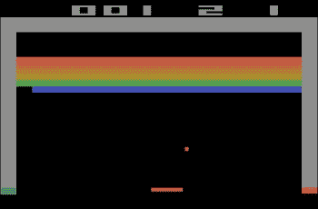
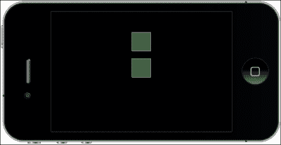
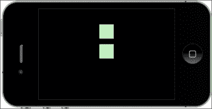
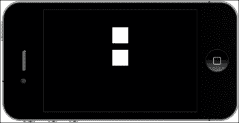
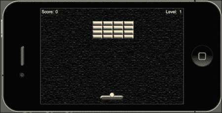

# 第三章：制作我们的第一个游戏 - 破坏者

> *到目前为止，我们已经学习了 Lua 编程中的一些重要基础，并在 Corona 模拟器中应用了一些代码。了解术语只是学习如何创建应用程序的一小部分。我们需要更进一层，亲身体验从开始到结束构建一个项目的全过程。我们将通过从零开始创建我们的第一个游戏来实现这一点。这将推动你进一步理解更大的代码块，并应用一些游戏逻辑来创建一个功能性的游戏。*

到本章结束时，你将理解：

+   如何在 Corona 项目中构建游戏文件结构

+   如何为游戏创建变量

+   如何向屏幕添加游戏对象

+   如何创建警告信息

+   如何显示得分和关卡数字

让我们开始享受乐趣！

# 破坏者 - 重温旧式游戏

在过去几十年里，你可能已经见过许多破坏者的版本，尤其是在雅达利时代。为了让你对这款游戏有一个大致的了解，以下是 Big Fish Games 关于破坏者历史的简要编辑：[`www.bigfishgames.com/blog/the-history-of-breakout/`](http://www.bigfishgames.com/blog/the-history-of-breakout/)。以下截图是破坏者游戏的示例：



在游戏屏幕上，有几列砖块放置在屏幕顶部附近。一个球在屏幕上移动，从屏幕顶部和侧壁弹回。当击中砖块时，球会弹开，砖块被摧毁。当球触碰到屏幕底部时，玩家将输掉这一轮。为了防止这种情况发生，玩家有一个可移动的挡板来将球弹起，保持游戏进行。

我们将使用触摸事件和加速度计来创建一个克隆版本，玩家将控制挡板的活动。我们将为球添加一些物理效果，使其能在屏幕上弹跳。

在下一章中，我们将添加游戏对象的活动、碰撞检测、计分以及胜利/失败条件。现在，我们要专注于如何设置破坏者游戏模板。

# 理解 Corona 物理 API

Corona 使向游戏中添加物理效果变得方便，尤其是如果你以前从未处理过这类工作。这个引擎使用 Box2D，只需几行代码就可以将其集成到你的应用程序中，而这通常需要更多的设置。

在 Corona 中使用物理引擎相当简单。你使用显示对象并在代码中将它们设置为物理实体。图像、精灵和矢量形状可以被转化为物理对象。这对于可视化你想要在创建的环境中对象如何反应非常有帮助。你可以立即看到结果，而不是猜测它们在物理世界中可能的行为。

## 设置物理世界

在你的应用程序中使物理引擎可用需要以下这行代码：

```kt
local physics = require "physics"
```

### 启动、暂停和停止物理引擎

有三个主要函数会影响物理模拟。以下是启动、暂停和停止物理引擎的命令：

+   `physics.start()`：这将启动或恢复物理环境。通常在应用程序开始时激活，使物理实体生效。

+   `physics.pause()`：这会暂时停止物理引擎。

+   `physics.stop()`：这基本上完全销毁物理世界。

### physics.setGravity

此函数用于设置全局重力向量的 x 和 y 参数，单位为每秒平方米（加速度单位）。默认值为 (0, 9.8)，以模拟标准的地球重力，指向 *y* 轴的下方。其语法为 `physics.setGravity(gx, gy)`：

```kt
physics.setGravity( 0, 9.8 ): Standard Earth gravity
```

### physics.getGravity

此函数返回全局重力向量的 x 和 y 参数，单位为每秒平方厘米（加速度单位）。

语法为 `gx, gy = physics.getGravity()`。

### 基于倾斜的重力

当你应用了 `physics.setGravity(gx, gy)` 和加速度计 API，实现基于倾斜的动态重力是简单的。以下是创建基于倾斜功能的示例：

```kt
function movePaddle(event)

  paddle.x = display.contentCenterX - (display.contentCenterX * (event.yGravity*3))

end

Runtime:addEventListener( "accelerometer", movePaddle )
```

Corona 模拟器中没有加速度计；必须创建设备构建才能看到效果。

### physics.setScale

此函数设置内部每米像素比率，用于在屏幕上的 Corona 坐标和模拟物理坐标之间转换。这应该在实例化任何物理对象之前完成。

默认缩放值为 30。对于分辨率较高的设备，如 iPad、Android 或 iPhone 4，你可能希望将此值增加到 60 或更多。

语法为 `physics.setScale(value)`：

```kt
physics.setScale( 60 )
```

### physics.setDrawMode

物理引擎有三种渲染模式。这可以在任何时候更改。

语法为 `physics.setDrawMode(mode)`。三种渲染模式分别为：

+   `physics.setDrawMode("debug")`：此模式仅显示碰撞引擎轮廓，如下面的截图所示：

+   `physics.setDrawMode("hybrid")`：此模式在正常 Corona 对象上叠加碰撞轮廓，如下面的截图所示：

+   `physics.setDrawMode("normal")`：此模式是默认的 Corona 渲染器，没有碰撞轮廓：

物理数据使用颜色编码的矢量图形显示，反映了不同的对象类型和属性：

+   **橙色**：用于表示动态物理实体（默认实体类型）

+   **深蓝色**：用于表示运动学物理实体

+   **绿色**：用于表示静态物理实体，如地面或墙壁

+   **灰色**：用于表示因缺乏活动而处于 *休眠* 状态的实体

+   **浅蓝色**：用于表示关节

### physics.setPositionIterations

这个函数设置了引擎位置计算的精确度。默认值是 `8`，意味着引擎将每帧为每个对象进行八次位置近似迭代，但这会增加处理器的参与度，因此需要小心处理，因为它可能会减慢应用程序的运行。

语法是 `physics.setPositionIterations(值)`：

```kt
physics.setPositionIterations(16)
```

### `physics.setVelocityIterations`

这个函数设置了引擎速度计算的精确度。默认值是 3，意味着引擎将每帧为每个对象进行三次速度近似迭代。然而，这将增加处理器的参与度，因此需要小心处理，因为它可能会减慢应用程序的运行。

语法是 `physics.setVelocityIterations(值)`：

```kt
physics.setVelocityIterations( 6 )
```

# 配置应用程序

本教程兼容 iOS 和 Android 设备。图形设计已调整以适应两个平台的多种屏幕尺寸。

## 构建配置

默认情况下，所有设备屏幕上显示的项目都以竖屏模式展示。我们将特别在横屏模式下创建这个游戏，因此我们需要更改一些构建设置并配置屏幕上所有项目的显示方式。在横屏模式下玩游戏实际上会增加更多玩家互动，因为挡板将有更多的屏幕空间移动，球体的空中时间也会减少。

# 动手时间——添加 `build.settings` 文件

构建时属性可以在可选的 `build.settings` 文件中提供，该文件使用 Lua 语法。`build.settings` 文件用于设置应用程序的屏幕方向和自动旋转行为以及各种特定平台的构建参数。要在你的项目文件夹中添加 `build.settings` 文件，请执行以下步骤：

1.  在你的桌面上创建一个名为 `Breakout` 的新项目文件夹。

1.  在你偏好的文本编辑器中，创建一个名为 `build.settings` 的新文件，并将其保存在你的项目文件夹中。

1.  输入以下几行：

    ```kt
    settings =
    {
      orientation =
      {
        default = "landscapeRight",
        supported = { "landscapeLeft", "landscapeRight" },
      }
    }
    ```

1.  保存并关闭文件。`build.settings` 文件已完成。

## *刚才发生了什么？*

默认方向设置决定了设备上的初始启动方向以及 Corona 模拟器的初始方向。

默认方向不会影响 Android 设备。方向初始化为设备的实际方向（除非只指定了一个方向）。另外，唯一支持的方向是 `landscapeRight` 和 `portrait`。在设备上，你可以切换到 `landscapeRight` 或 `landscapeLeft`，但操作系统只报告一种横屏模式，而 Corona 的方向事件选择 `landscapeRight`。

我们创建这个应用程序是为了支持`landscapeRight`的横屏方向。我们将这个方向设置为默认值，这样它就不会切换到`landscapeLeft`或任何`portrait`模式。在 iOS 设备上工作时，如果在启动应用程序之前没有设置`build.settings`，它将进入默认的竖屏模式。

## 动态缩放

Corona 可以针对 iOS 和 Android 多个设备构建应用程序，显示不同分辨率的各种艺术资源。Corona 可以根据你的起始分辨率向上或向下缩放。它还可以在需要时替换高分辨率的图像文件，确保你的应用程序在所有设备上清晰锐利。

# 动手时间——添加`config.lua`文件

如果没有指定内容大小，返回的内容宽度和高度将与设备的物理屏幕宽度和高度相同。如果在`config.lua`中指定了不同的内容宽度和高度，内容宽度和高度将采用这些值。要在你的项目文件夹中添加`config.lua`文件，请执行以下步骤：

1.  在你的文本编辑器中，创建一个名为`config.lua`的新文件，并将其保存到你的项目文件夹中。

1.  输入以下几行：

    ```kt
    application =
    {
      content =
      {
        width = 320,
        height = 480, 
        scale = "letterbox",
        fps = 60,
      },
    }
    ```

1.  保存并关闭你的文件。

## *刚才发生了什么？*

内容宽度和高度允许你选择一个与物理设备屏幕尺寸无关的虚拟屏幕尺寸。我们将尺寸设置为针对 iPhone 3GS，因为它在 iOS 和 Android 平台的大多数设备上显示的是常见的尺寸之一。

这个应用程序使用的缩放比例设置为`letterbox`。它将尽可能统一放大内容，同时仍然在屏幕上显示所有内容。

我们将`fps`设置为`60`。默认情况下，帧率是 30 fps。在这个应用程序中，这将使球的移动看起来更快，便于我们方便地提高速度。我们可以将帧率拉伸到 60 fps，这是 Corona 允许的最大值。

# 构建应用程序

现在我们已经将应用程序配置为横屏模式，并设置显示内容在多个设备上缩放，我们准备开始设计游戏。在我们开始为游戏编写代码之前，我们需要添加一些将在屏幕上显示的艺术资源。你可以在`第三章资源`文件夹中找到它们。你可以从 Packt Publishing 网站下载伴随这本书的项目文件。以下是你需要添加到你的`Breakout`项目文件夹中的文件：

+   `alertBox.png`

+   `bg.png`

+   `mmScreen.png`

+   `ball.png`

+   `paddle.png`

+   `brick.png`

+   `playbtn.png`

## 显示组

我们将在游戏中介绍一个重要的功能 `display.newGroup()`。显示组允许你添加和移除子显示对象，并收集相关的显示对象。最初，组中没有子对象。本地原点位于父对象的原点；锚点初始化为此本地原点。你可以轻松地将显示对象组织在单独的组中，并通过组名称引用它们。例如，在 Breakout 中，我们将**标题**屏幕和**播放**按钮等菜单项组合在一个名为 `menuScreenGroup` 的组中。每次我们访问 `menuScreenGroup`，显示组中包含的任何显示对象都将被处理。

### display.newGroup()

这个函数创建了一个组，你可以在其中添加和移除子显示对象。

语法是 `display.newGroup()`。

例如：

```kt
local rect = display.newRect(0, 0, 150, 150)
rect:setFillColor(1, 1, 1)

local myGroup = display.newGroup()
myGroup:insert(rect)
```

## 使用系统函数

我们在本章中将要介绍的系统函数将返回有关系统（设备信息和当前方向）的信息，并控制系统函数（启用多点触控和控制空闲时间、加速度计和 GPS）。我们将使用以下系统函数返回应用程序将运行的环境信息以及加速度计事件的响应频率。

### system.getInfo()

这个函数返回有关应用程序正在运行上的系统的信息。

语法是 `system.getInfo(param)`:

```kt
print(system.getInfo("name")) -- display the deviceID
```

参数的有效值如下：

+   `"name"`: 这将返回设备的型号名称。例如，在 iTouch 上，这将是出现在 iTunes 中的手机名称，如"Pat's iTouch"。

+   `"model"`: 这将返回设备类型。包括以下内容：

    +   iPhone

    +   iPad

    +   iPhone 模拟器

    +   Nexus One

    +   Droid

    +   myTouch

    +   Galaxy Tab

+   `"deviceID"`: 这将返回设备的哈希编码设备 ID。

+   `"environment"`: 这将返回应用程序正在运行的环境。包括以下内容：

    +   `"simulator"`: Corona 模拟器

    +   `"device"`: iOS, Android 设备以及 Xcode 模拟器

+   `"platformName"`: 这将返回平台名称（操作系统名称），可以是以下任何一个：

    +   Mac OS X (Corona 模拟器在 Mac 上)

    +   Win (Corona 模拟器在 Windows 上)

    +   iPhone OS (所有 iOS 设备)

    +   Android (所有 Android 设备)

+   `"platformVersion"`: 这将返回平台版本的字符串表示。

+   `"build"`: 这将返回 Corona 构建字符串。

+   `"textureMemoryUsed"`: 这将返回纹理内存使用量（字节）。

+   `"maxTextureSize"`: 这将返回设备支持的最大纹理宽度或高度。

+   `"architectureInfo"`: 这将返回描述你正在运行的设备底层 CPU 架构的字符串。

### system.setAccelerometerInterval()

此函数设置加速度计事件的频率。在 iPhone 上，最低频率为 10 Hz，最高为 100 Hz。加速度计事件对电池的消耗很大，因此只有在你需要更快响应时，比如在游戏中，才增加频率。尽可能降低频率以节省电池寿命。

语法是 `system.setAccelerometerInterval( frequency )`：

```kt
system.setAccelerometerInterval( 75 )
```

该函数设置样本间隔，单位为赫兹。赫兹是每秒的周期数，即每秒要进行的测量次数。如果你将频率设置为 75，那么系统将每秒进行 75 次测量。

在将 `第三章` 的 `Resources` 文件夹中的资源添加到你的项目文件夹后，我们将开始编写一些代码！

# 动手操作——为游戏创建变量

为了启动任何应用程序，我们需要创建一个 `main.lua` 文件。这在第二章 *Lua 速成与 Corona 框架* 中讨论过，当时我们使用了一些示例代码并通过模拟器运行了它。

当游戏完成时，代码将相应地在你的 `main.lua` 文件中构建：

+   必要的类（例如，`physics` 或 `ui`）

+   变量和常量

+   主函数

+   对象方法

+   调用主函数（必须始终调用，否则你的应用程序将无法运行）

将代码组织成前面的结构是一种保持事物有序和高效运行应用程序的好习惯。

在本节中，我们将介绍一个显示组，该显示组将展示主菜单屏幕和一个**播放**按钮，用户可以通过与该按钮互动进入主游戏屏幕。游戏中的所有元素，如挡板、球、砖块对象以及抬头显示元素，都是在玩家与**播放**按钮互动后出现的。我们还将介绍胜利和失败的条件，这些条件将被称作`alertDisplayGroup`。所有这些游戏元素都将在代码开始时初始化。

1.  在你的文本编辑器中创建一个新的 `main.lua` 文件，并将其保存到项目文件夹中。

1.  我们将隐藏状态栏（特别是针对 iOS 设备）并加载物理引擎。Corona 使用的是已经内置在 SDK 中的 Box2D 引擎：

    ```kt
    display.setStatusBar(display.HiddenStatusBar)

    local physics = require "physics"
    physics.start()
    physics.setGravity(0, 0)

    system.setAccelerometerInterval(100)
    ```

    ### 注意

    有关 Corona 物理 API 的更多信息可以在 Corona 网站找到，地址是[`docs.coronalabs.com/guide/physics/physicsSetup/index.html`](http://docs.coronalabs.com/guide/physics/physicsSetup/index.html)。

    Corona SDK 中使用的 Box2D 物理引擎是由 Blizzard Entertainment 的 Erin Catto 编写的。关于 Box2D 的更多信息可以在[`box2d.org/manual.pdf`](http://box2d.org/manual.pdf)找到。

1.  添加菜单屏幕对象：

    ```kt
    local menuScreenGroup  -- display.newGroup()
    local mmScreen
    local playBtn
    ```

1.  添加游戏屏幕对象：

    ```kt
    local background
    local paddle
    local brick
    local ball
    ```

1.  添加分数和等级的 HUD 元素：

    ```kt
    local scoreText
    local scoreNum
    local levelText
    local levelNum
    ```

    ### 注意

    HUD 也被称为抬头显示。它是在游戏屏幕上视觉化表示角色信息的方法。

1.  接下来，我们将添加用于胜利/失败条件的警告显示组：

    ```kt
    local alertDisplayGroup    -- display.newGroup()
    local alertBox
    local conditionDisplay
    local messageText
    ```

1.  以下变量保存了砖块显示组、得分、球速度和游戏内事件的值：

    ```kt
    local _W = display.contentWidth / 2
    local _H = display.contentHeight / 2
    local bricks = display.newGroup()
    local brickWidth = 35
    local brickHeight = 15
    local row
    local column
    local score = 0
    local scoreIncrease = 100
    local currentLevel
    local vx = 3
    local vy = -3
    local gameEvent = ""
    ```

1.  加速度计事件只能在设备上测试，因此我们将通过调用 `"simulator"` 环境为桨添加一个触摸事件变量。这样我们可以在 Corona 模拟器中测试桨的运动。如果你在设备上测试应用程序，桨上的触摸和加速度计事件监听器不会发生冲突：

    ```kt
    local isSimulator = "simulator" == system.getInfo("environment")
    ```

1.  最后，加入 `main()` 函数。这将启动我们的应用程序：

    ```kt
    function main()

    end

    --[[
    This empty space will hold other functions and methods to run the application
    ]]--

    main()
    ```

## *刚才发生了什么？*

`display.setStatusBar(display.HiddenStatusBar)` 方法仅适用于 iOS 设备。它隐藏了设备上状态栏的外观。

我们为这个游戏添加的新 Corona API 是物理引擎。我们将为主要的游戏对象（桨、球和砖块）添加物理参数以进行碰撞检测。设置 `setGravity(0,0)` 将允许球在游戏场内自由弹跳。

`local menuScreenGroup`、`local alertDisplayGroup` 和 `local bricks` 对象都是显示组的类型，我们可以通过它们来分离和组织显示对象。例如，`local menuScreenGroup` 专门用于主菜单屏幕上出现的对象。因此，它们可以作为一个组被移除，而不是单个对象。

某些已添加的变量已经具有应用于特定游戏对象的值。球体已经使用 `local vx = 3` 和 `local vy = -3` 设置了速度。x 和 y 速度决定了球在游戏屏幕上的移动方式。根据球与对象碰撞的位置，球将沿着连续的路径移动。`brickWidth` 和 `brickHeight` 对象具有在应用程序的整个过程中保持恒定的值，因此我们可以将砖块对象在屏幕上均匀排列。

`local gameEvent = " "` 将存储游戏事件，如 `"win"`、`"lose"` 和 `"finished"`。当函数检查游戏状态是否有这些事件之一时，它将在屏幕上显示适当的状态。

我们还加入了一些系统函数。我们创建了 `local isSimulator = "simulator" == system.getInfo("environment")` 以返回有关运行应用程序的系统的信息。这将用于桨触控事件，以便我们可以在模拟器中测试应用程序。如果将构建移植到设备上，你只能使用加速度计来移动桨。模拟器无法测试加速度计事件。另一个系统函数是 `system.setAccelerometerInterval( 100 )`。它设置了加速度计事件的频率。iPhone 上的最低频率是 10 Hz，最高是 100 Hz。

`main()`空函数集将开始显示层次结构。可以把它看作是一个故事板。你首先看到的是介绍，然后中间发生一些动作，告诉你主要内容是什么。在这种情况下，主要内容是游戏玩法。你最后看到的是某种结尾或闭合，将故事联系在一起。结尾是在关卡结束时显示的胜负条件。

# 理解事件和监听器

事件被发送到监听者，由移动屏幕上的触摸、点击、加速度计等执行。函数或对象可以作为事件监听器。当事件发生时，监听器将被调用，并通过一个表示事件的表进行通知。所有事件都将有一个标识事件类型的属性名。

## 注册事件

显示对象和全局运行时对象可以作为事件监听器。你可以使用以下对象方法添加和移除事件监听器：

+   `object:addEventListener()`: 这将一个监听器添加到对象的监听器列表中。当命名的事件发生时，将调用监听器，并提供一个表示事件的表。

+   `object:removeEventListener()`: 这将指定的监听器从对象监听器列表中移除，使其不再接收与指定事件对应的事件通知。

在以下示例中，一个图像显示对象注册以接收触摸事件。触摸事件不会全局广播。注册了事件并在其下方的显示对象将成为接收事件的候选对象：

```kt
local playBtn = display.newImage("playbtn.png")
playBtn.name = "playbutton"

local function listener(event)
  if event.target.name == "playbutton" then

    print("The button was touched.")

end
end

playBtn:addEventListener("touch", listener )
```

运行时事件由系统发送，会广播给所有监听者。以下是注册`enterFrame`事件的一个例子：

```kt
local playBtn = display.newImage("playbtn.png") 

local function listener(event) 
  print("The button appeared.")
end

Runtime:addEventListener("enterFrame", listener )
```

## 运行时事件

我们正在创建的应用程序使用了运行时事件。运行时事件没有特定的目标，只发送到全局运行时。它们广播给所有注册的监听者。

运行时事件由系统发送，会广播给所有监听者。以下是注册`enterFrame`事件的一个例子：

```kt
local playBtn = display.newImage("playbtn.png")

local function listener(event)
  print("The button appeared.")
end

Runtime:addEventListener("enterFrame", listener )
```

以下事件都有字符串名称，并将应用于 Breakout 游戏。

### enterFrame

`enterFrame`事件在应用程序的帧间隔发生。它们只发送到全局运行时对象。例如，如果帧率是 30 fps，那么它将大约每秒发生 30 次。

此事件中可用的属性如下：

+   `event.name`是字符串`"enterFrame"`

+   `event.time`是自应用程序开始以来的毫秒数

### 加速度计

加速度计事件允许你检测移动并确定设备相对于重力的方向。这些事件只发送到支持加速度计的设备。它们只发送到全局运行时对象。

此事件可用的属性如下：

+   `event.name`是字符串`"accelerometer"`

+   `event.xGravity`是*x*方向上的重力加速度

+   `event.yGravity` 是 *y* 方向的由重力引起的加速度。

+   `event.zGravity` 是 *z* 方向的由重力引起的加速度。

+   `event.xInstant` 是 *x* 方向的瞬时加速度。

+   `event.yInstant` 是 *y* 方向的瞬时加速度。

+   `event.zInstant` 是 *z* 方向的瞬时加速度。

+   `event.isShake` 是当用户摇动设备时为真。

## 触摸事件（Touch events）

当用户的手指触摸屏幕时，会生成一个命中事件并将其派发到显示层次结构中的显示对象。只有与屏幕上手指位置相交的对象才可能接收到事件。

### 单点触摸（Touch，single touch）

触摸事件是一种特殊的命中事件。当用户的手指触摸屏幕时，它们开始了一系列具有不同阶段的触摸事件。

+   `event.name` 是字符串 `"touch"`。

+   `event.x` 是触摸点在屏幕坐标中的 *x* 位置。

+   `event.y` 是触摸点在屏幕坐标中的 *y* 位置。

+   `event.xStart` 是触摸序列 `"began"` 阶段的 *x* 位置。

+   `event.yStart` 是触摸序列 `"began"` 阶段的 *y* 位置。

+   `event.phase` 是一个字符串，用于标识事件在触摸序列中的哪个阶段发生：

    +   `"began"`：这表示手指触摸了屏幕。

    +   `"moved"`：这表示手指在屏幕上移动。

    +   `"ended"`：这表示手指从屏幕上抬起。

    +   `"cancelled"`：这表示系统取消了触摸的跟踪。

### 轻击（tap）

当用户触摸屏幕时，它会生成一个命中事件。该事件被派发到显示层次结构中的显示对象。这与触摸事件类似，不同之处在于事件回调中提供了点击次数（轻击次数），并且不使用事件阶段。事件 API 如下：

+   `event.name` 是字符串 `"tap"`。

+   `event.numTaps` 返回屏幕上的轻击次数。

+   `event.x` 是轻击在屏幕坐标中的 *x* 位置。

+   `event.y` 是触摸点在屏幕坐标中的 *y* 位置。

# 过渡（Transitions）

在本章中，我们将介绍 `transition.to()` 和 `transition.from()`：

+   `transition.to()`：这会随着时间的推移，使用 `easing` 过渡动画显示对象的属性。

    语法为 `handle = transition.to( target, params )`。

+   `transition.from()`：这与 `transition.to()` 类似，不同之处在于起始属性值在函数参数表中指定，最终值是在调用之前目标中的相应属性值。语法为 `handle = transition.from( target, params )`。

    使用的参数如下：

    +   `target`：这是过渡动画的目标显示对象。

    +   `params`：这是一个指定将进行动画的显示对象属性以及以下一个或多个可选的非动画属性的表：

        +   `params.time`：这指定了过渡的持续时间（以毫秒为单位）。默认情况下，持续时间为 500 毫秒（0.5 秒）。

        +   `params.transition`：默认为`easing.linear`。

        +   `params.delay`：这指定了补间开始前延迟的毫秒数（默认为无）。

        +   `params.delta`：这是一个布尔值，指定非控制参数是作为最终结束值还是作为值的变化来解释。默认为`nil`，即假。

        +   `params.onStart`：这是一个在补间开始之前调用的函数或表监听器。

        +   `params.onComplete`：这是一个在补间完成后调用的函数或表监听器。

例如：

```kt
_W = display.contentWidth
_H = display.contentHeight

local square = display.newRect( 0, 0, 100, 100 )
square:setFillColor( 1, 1, 1 )
square.x = _W/2; square.y = _H/2

local square2 = display.newRect( 0, 0, 50, 50 )
square2:setFillColor( 1, 1, 1 )
square2.x = _W/2; square2.y = _H/2

transition.to( square, { time=1500, x=250, y=400 } )
transition.from( square2, { time=1500, x=275, y=0 } )
```

前面的示例展示了两个显示对象如何在设备屏幕上过渡空间。从当前位置开始，`square`显示对象将在 1500 毫秒内移动到新的位置`x = 250`和`y = 400`。`square2`显示对象将从`x = 275`和`y = 0`的位置在 1500 毫秒内过渡到其初始位置。

# 创建菜单屏幕

拥有菜单屏幕可以让玩家在应用程序的不同部分之间过渡。通常，游戏会从显示游戏标题的某种屏幕开始，并带有一个标有**播放**或**开始**的交互式用户界面按钮，让玩家选择玩游戏。在任何移动应用程序中，在过渡到主要内容之前都有一个菜单屏幕是标准的。

# 行动时间——添加主菜单屏幕

主菜单界面将是玩家在应用程序启动后与菜单系统交互的第一个东西。这是介绍游戏标题并让玩家了解他们将面对的游戏环境类型的好方法。我们肯定不希望玩家在没有适当通知的情况下突然跳入应用程序。当玩家启动应用程序时，让他们为即将到来的内容做好准备是很重要的。

1.  我们将创建一个名为`mainMenu()`的函数来介绍标题屏幕。所以，在`function main()`结束后，加入以下几行：

    ```kt
    function mainMenu()  

    end
    ```

1.  我们将向这个函数中添加一个显示组和两个显示对象。一个显示对象是将代表主菜单屏幕的图像，另一个是一个名为**播放**的 UI 按钮。将它们添加到`function mainMenu()`内部：

    ```kt
      menuScreenGroup = display.newGroup()

      mmScreen = display.newImage("mmScreen.png", 0, 0, true)
      mmScreen.x = _W
      mmScreen.y = _H

      playBtn = display.newImage("playbtn.png")
      playBtn.anchorX = 0.5; playBtn.anchorY = 0.5  
      playBtn.x = _W; playBtn.y = _H + 50
      playBtn.name = "playbutton"

      menuScreenGroup:insert(mmScreen)
      menuScreenGroup:insert(playBtn)
    ```

1.  记得那个空的`main()`函数集吗？我们需要在其中调用`mainMenu()`。整个函数应该像这样：

    ```kt
    function main()
      mainMenu()
    end 
    ```

1.  在`mainMenu()`函数之后，我们将创建另一个名为`loadGame()`的函数。这个函数将初始化来自`playbtn`的事件以过渡到主游戏屏幕。事件将改变`menuScreenGroup`的 alpha 为`0`，使其在屏幕上不可见。通过调用`addGameScreen()`函数完成过渡（将在本章的*行动时间——添加游戏对象*部分讨论`addGameScreen()`）：

    ```kt
    function loadGame(event)
      if event.target.name == "playbutton" then

        transition.to(menuScreenGroup,{time = 0, alpha=0, onComplete = addGameScreen})

        playBtn:removeEventListener("tap", loadGame)
      end
    end
    ```

1.  接下来，我们需要为`playBtn`添加一个事件监听器，这样当它被点击时，就会调用`loadGame()`函数。在`mainMenu()`函数中的最后一个方法后添加以下这行代码：

    ```kt
    playBtn:addEventListener("tap", loadGame)
    ```

1.  在模拟器中运行项目。你应该会看到主菜单屏幕显示**Breakout**和**Play**按钮。

## *刚才发生了什么？*

创建一个主菜单屏幕只需要几块代码。对于`loadGame(event)`，我们传递了一个名为`event`的参数。当调用`if`语句时，它取`playbutton`，它引用显示对象`playBtn`，并检查它是否为真。既然如此，`menuScreenGroup`将从舞台中移除并在`addGameScreen()`函数中被调用。同时，`playBtn`的事件监听器将从场景中移除。

## 动手试试——创建帮助屏幕

目前，菜单系统的设计是设置成从主菜单屏幕过渡到游戏玩法屏幕。你可以选择扩展菜单屏幕，而不必立即跳转到游戏中。可以在主菜单屏幕之后添加的一个额外功能是帮助菜单屏幕，它向玩家解释如何玩游戏。

在你喜欢的图像编辑程序中创建一个新的图像，并写出如何进行游戏的步骤。然后你可以创建一个名为**Next**的新按钮，并将这两个艺术资源添加到你的项目文件夹中。在你的代码中，你将必须为你的**Next**按钮创建一个新的函数和事件监听器，它会过渡到游戏玩法屏幕。

# 创建游戏玩法场景

现在我们已经有一个菜单系统在位，我们可以开始处理应用程序的游戏玩法元素。我们将开始添加玩家将与之互动的所有主要游戏对象。在添加游戏对象时需要注意的一件事是它们在屏幕上的位置。考虑到这个游戏将在横屏模式下进行，我们必须记住在*x*方向上有足够的空间，而在*y*方向上的空间较少。根据游戏的原始设计，屏幕底部的墙壁会导致玩家失去关卡或转向，如果球落在这个区域。因此，如果我们要确定一个放置挡板对象的位置，我们不会将其设置在屏幕顶部附近。让挡板尽可能靠近屏幕底部以更好地保护球更有意义。

# 动手时间——添加游戏对象

让我们添加玩家在游戏玩法中会看到的显示对象：

1.  在`loadGame()`函数之后，我们将创建另一个函数，用于在屏幕上显示所有游戏对象。以下几行将显示为这个教程创建的艺术资源：

    ```kt
    function addGameScreen()

      background = display.newImage("bg.png", 0, 0, true )
      background.x = _W 
      background.y = _H

      paddle = display.newImage("paddle.png")
      paddle.x = 240; paddle.y = 300
      paddle.name = "paddle"

      ball = display.newImage("ball.png")
      ball.x = 240; ball.y = 290
      ball.name = "ball"
    ```

1.  接下来，我们将添加在游戏中显示分数和关卡编号的文本：

    ```kt
      scoreText = display.newText("Score:", 25, 10, "Arial", 14)
      scoreText:setFillColor( 1, 1, 1 )

      scoreNum = display.newText("0", 54, 10, "Arial", 14)
      scoreNum: setFillColor( 1, 1, 1 )

      levelText = display.newText("Level:", 440, 10, "Arial", 14)
      levelText:setFillColor( 1, 1, 1 )

      levelNum = display.newText("1", 470, 10, "Arial", 14)
      levelNum:setFillColor( 1, 1, 1 )
    ```

1.  为了构建第一个游戏关卡，我们将调用`gameLevel1()`函数，该函数将在本章后面解释。别忘了用`end`结束`addGameScreen()`函数：

    ```kt
      gameLevel1() 

    end
    ```

## *刚才发生了什么？*

`addGameScreen()` 函数显示游戏过程中出现的所有游戏对象。我们从本章提供的美工资源中添加了 `background`、`paddle` 和 `ball` 显示对象。

我们在游戏屏幕顶部添加了分数和等级的文本。`scoreNum` 最初设置为 `0`。在下一章，我们将讨论当砖块碰撞时如何更新分数。`levelNum` 从 1 开始，完成等级后更新，并进入下一个等级。

我们通过调用 `gameLevel1()` 来结束函数，这将在下一节中实现，以开始第一关。

# 是时候行动了——构建砖块。

砖块是我们需要为这个应用程序添加的最后一个游戏对象。我们将为这个游戏创建两个不同的等级，每个等级的砖块布局都不同于另一个：

1.  我们将要为第一关创建一个函数。让我们创建一个新函数 `gameLevel1()`。我们还将 `currentLevel` 设置为 `1`，因为应用程序从第一关开始。然后，我们将添加 `bricks` 显示组并将其设置为 `toFront()`，使其在游戏背景前显示：

    ```kt
    function gameLevel1()

      currentLevel = 1

      bricks:toFront()
    ```

    `object:toFront()` 方法将目标对象移动到其父组 (`object.parent`) 的视觉最前方。在这种情况下，我们将 `bricks` 组设置为游戏过程中最前端的显示组，使其在背景图片前方显示。

1.  接下来，添加一些局部变量，以显示屏幕上将显示多少行和列的砖块，以及每个砖块在游戏场中的位置：

    ```kt
      local numOfRows = 4
      local numOfColumns = 4
      local brickPlacement = {x = (_W) - (brickWidth * numOfColumns ) / 2  + 20, y = 50}
    ```

1.  创建双重 `for` 循环，一个用于 `numOfRows`，另一个用于 `numOfColumns`。根据其宽度、高度以及 `numOfRows` 和 `numOfColumns` 的对应数字创建一个砖块实例。本章提供了砖块显示对象的美工资源。然后，使用 `end` 结束函数：

    ```kt
      for row = 0, numOfRows - 1 do
        for column = 0, numOfColumns - 1 do

          local brick = display.newImage("brick.png")
          brick.name = "brick"
          brick.x = brickPlacement.x + (column * brickWidth)
          brick.y = brickPlacement.y + (row * brickHeight)
          physics.addBody(brick, "static", {density = 1, friction = 0, bounce = 0})
          bricks.insert(bricks, brick)

        end
      end
    end
    ```

1.  第二关的设置与第一关的排列类似。代码几乎相同，除了我们新的函数名为 `gameLevel2()`，`currentLevel` 设置为 `2`，并且 `numOfRows` 和 `numOfColumns` 的值不同。在 `gameLevel1()` 函数后添加以下代码块：

    ```kt
    function gameLevel2()

      currentLevel = 2

      bricks:toFront()

      local numOfRows = 5
      local numOfColumns = 8
      local brickPlacement = {x = (_W) - (brickWidth * numOfColumns ) / 2  + 20, y = 50}

      for row = 0, numOfRows - 1 do
        for column = 0, numOfColumns - 1 do

          -- Create a brick
          local brick = display.newImage("brick.png")
          brick.name = "brick"
          brick.x = brickPlacement.x + (column * brickWidth)
          brick.y = brickPlacement.y + (row * brickHeight)
          physics.addBody(brick, "static", {density = 1, friction = 0, bounce = 0})
          bricks.insert(bricks, brick)

        end
      end
    end
    ```

1.  保存你的文件并重新启动模拟器。你将能够与 **Play** 按钮互动，并从主菜单屏幕过渡到游戏屏幕。你将在屏幕上看到第一关的游戏布局。

## *刚才发生了什么？*

`bricks` 显示组被设置为 `bricks:toFront()`。这意味着除了 `background`、`paddle` 和 `ball` 显示对象之外，该组将始终位于显示层次结构的前面。

`gameLevel1()`方法为游戏场地中显示的砖块对象数量设定了固定值。它们将基于设备外壳的`contentWidth`居中，并在 y 方向上设置为`50`。通过`brickPlacement`将砖块组放置在左上角附近，占据屏幕中间位置，并减去所有砖块对象总宽度的一半。然后在 x 方向上再加上 20 个像素，使其与挡板居中。

我们为`numOfRows`和`numOfColumns`创建了双层`for`循环，从屏幕左上角开始创建砖块对象。

请注意，`brick`显示对象被命名为`brick`。只需记住，在调用对象时，不能像使用`brick`那样使用`brick`。`brick`对象是`brick`的一个实例。它仅当调用事件参数时作为字符串使用，例如：

```kt
if event.other.name == "brick" and ball.x + ball.width * 0.5 < event.other.x + event.other.width * 0.5 then
        vx = -vx 
elseif event.other.name == "brick" and ball.x + ball.width * 0.5 >= event.other.x + event.other.width * 0.5 then
        vx = vx 
end
```

`brick`的物理体被设置为`"static"`，因此它不会受到重力下拉的影响。然后，通过`bricks.insert(bricks, brick)`将其添加到`bricks`组中。

## 做一个尝试英雄——专注于平台游戏

在完成本章和下一章后，请随意重新设计显示图像，以便关注特定平台。例如，你可以轻松地将代码转换为兼容所有 iOS 设备。这可以通过将显示对象转换为`display.newImageRect( [parentGroup,] filename [, baseDirectory] w, h )`来实现，这样你就可以替换具有更大屏幕尺寸的设备（如 iPhone 5/Samsung Galaxy S5）上的图像尺寸。请记住，你将不得不调整配置设置以应用这些更改。这涉及到在你的`config.lua`文件中添加独特的图像后缀（或你喜欢的后缀命名约定）。

# 红色警报！

在每个游戏中，当主要动作结束时，都会有一种消息告诉你进度状态。对于这个应用程序，我们需要一种方法让玩家知道他们是否赢得或输掉了一轮，他们如何再次玩，或者游戏何时正式完成。

# 是时候采取行动了——显示游戏消息

让我们设置一些胜利/失败的提示，以便我们可以显示游戏中发生的事件：

1.  创建一个名为`alertScreen()`的新函数，并传递两个名为`title`和`message`的参数。添加一个新的显示对象`alertbox`，并使用`easing.outExpo`使其从`xScale`和`yScale`为 0.5 的过渡效果：

    ```kt
    function alertScreen(title, message)

      alertBox = display.newImage("alertBox.png")
      alertBox.x = 240; alertBox.y = 160

      transition.from(alertBox, {time = 500, xScale = 0.5, yScale = 0.5, transition = easing.outExpo})
    ```

1.  将`title`参数存储在名为`conditionDisplay`的文本对象中：

    ```kt
      conditionDisplay = display.newText(title, 0, 0, "Arial", 38)
      conditionDisplay:setFillColor( 1, 1, 1 )
      conditionDisplay.xScale = 0.5
      conditionDisplay.yScale = 0.5
      conditionDisplay.anchorX = 0.5
      conditionDisplay.x =  display.contentCenterX
      conditionDisplay.y = display.contentCenterY - 15
    ```

1.  将`message`参数存储在名为`messageText`的文本对象中：

    ```kt
      messageText = display.newText(message, 0, 0, "Arial", 24)
      messageText:setFillColor( 1, 1, 1 )
      messageText.xScale = 0.5
      messageText.yScale = 0.5
      messageText.anchorX = 0.5  
      messageText.x = display.contentCenterX
      messageText.y = display.contentCenterY + 15
    ```

1.  创建一个新的显示组，名为`alertDisplayGroup`，并将所有对象插入到该组中。关闭函数：

    ```kt
      alertDisplayGroup = display.newGroup()
      alertDisplayGroup:insert(alertBox)
      alertDisplayGroup:insert(conditionDisplay)
      alertDisplayGroup:insert(messageText)
    end
    ```

1.  保存你的文件并在模拟器中运行项目。**Play**按钮的功能仍然会进入**Level: 1**的游戏玩法屏幕。目前，所有对象都没有任何移动。我们将在下一章添加触摸事件、球体移动和碰撞。所有游戏对象应如以下截图所示布局：

## *刚才发生了什么？*

我们已经为游戏设置了警报系统，但在我们添加更多游戏功能使游戏对象动起来之前，它目前还不能操作。下一章将展示`alertScreen()`函数如何传递两个参数，`title`和`message`。当满足条件后，`alertBox`显示对象会作为警报文本的背景弹出。当`alertBox`弹出时，它会从 0.5 的`xScale`和`yScale`过渡到全图像大小，耗时 500 毫秒。这基本上相当于半秒钟。

`conditionDisplay`对象传递`title`参数。这将显示**You Win**或**You Lose**的文本。

`messageText`对象传递`message`参数。当达到某个条件后，带有此参数的文本会显示如**Play Again**或**Continue**的消息。

此函数中的所有对象都将被插入到`alertDisplayGroup = display.newGroup()`中。它们在舞台上出现和消失时，会作为一个整体而不是单独的对象。

在模拟器中运行代码时，如果终端窗口出现错误，务必检查导致错误的行。有时，一个简单的字母大小写错误，甚至是一个缺失的逗号或引号，都可能导致你的应用无法在模拟器中运行。请留意这些常见错误，它们很容易被忽视。

你可以参考`第三章`文件夹中的`Breakout – Part 1`文件夹，了解本教程前半部分代码的设置。

## 小测验——构建一个游戏

Q1\. 在你的代码中添加物理引擎时，哪些函数可以添加到你的应用程序中？

1.  `physics.start()`

1.  `physics.pause()`

1.  `physics.stop()`

1.  以上都不对

Q2\. 添加事件监听器以下哪个是正确的？

1.  `button:addeventlistener("touch", listener)`

1.  `button:AddEventListener("touch", listener)`

1.  `button:addEventListener(touch, listener)`

1.  `button:addEventListener("touch", listener)`

Q3\. 以下显示对象正确过渡到`x = 300`，`y = 150`，并将 alpha 改为 0.5，耗时 2 秒的方式是？

```kt
local square = display.newRect( 0, 0, 50, 50 )
square:setFillColor( 1, 1, 1 )
square.x = 100 square2.y = 300
```

1.  `transition.to( square, { time=2000, x=300, y=150, alpha=0.5 })`

1.  `transition.from( square, { time=2000, x=300, y=150, alpha=0.5 })`

1.  `transition.to( square, { time=2, x=300, y=150, alpha=0.5 })`

1.  以上都不对

# 总结

我们已经完成了这个游戏教程的前半部分。正确理解如何构建 Corona 项目结构，可以让你的代码更有组织性，更好地追踪你的资源。我们已经尝试处理了与游戏中所需的小部分逻辑相关的代码块，这些代码块使得应用程序能够运行。

到目前为止，我们已经完成了：

+   指定了在 Android 和 iOS 设备上显示内容的构建配置

+   介绍了将在应用程序中运行的主要变量和常量

+   实例化了物理引擎，并开始将其应用到需要物理体的游戏对象上

+   创建了从菜单到游戏玩屏幕的过渡

+   向屏幕添加了显示对象和游戏信息

到目前为止我们已经完成了很多工作，包括在编码应用程序的过程中学习了一个新的 API，这已经是一个相当大的成就了。在游戏能够完全功能之前，我们还有很多内容需要添加。

在下一章中，我们将完成这个游戏教程的后半部分。我们将处理挡板、球、砖块和墙壁对象的碰撞检测。同时，我们还将学习如何在移除场景中的砖块时更新得分，并激活我们的赢/输条件。我们已经进入最后的冲刺阶段，让我们继续前进！
