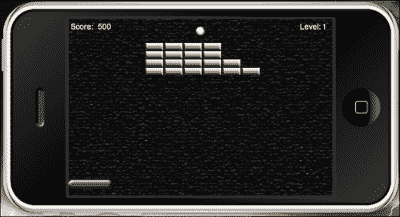
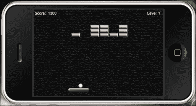
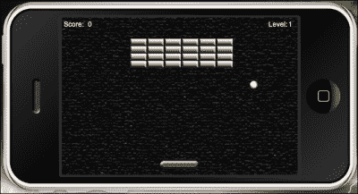
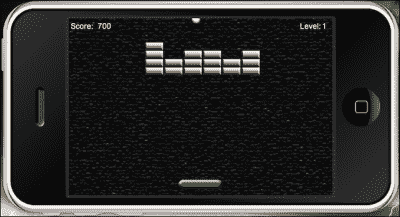
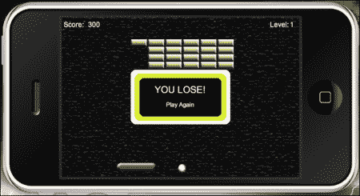

# 第四章：游戏控制

> *到目前为止，我们在上一章完成了游戏的前半部分。我们通过向屏幕引入游戏对象来开发项目的初始结构。目前，挡板和球体的移动是无效的，但在模拟器中显示的所有内容都根据原始游戏设计进行了缩放。完成本教程的最后阶段是添加游戏中将发生的所有动作，包括对象移动和更新得分。*

在本章中，我们将涵盖以下主题：

+   使用触摸事件和加速度计移动挡板

+   场景中所有游戏对象之间的碰撞检测

+   在碰撞检测时移除对象

+   在屏幕边界内球体的移动

+   计算得分

+   胜利和失败条件

最后阶段！我们能行！

# 向上移动

如果你认为让对象在屏幕上出现很有趣，那么等到你看到它们移动时！`Breakout`游戏的主要目标是保持球在挡板位置之上以保持游戏进行，并让它与所有砖块碰撞以完成关卡。让悬念持续的是对球在游戏屏幕周围移动的期待。如果没有在游戏对象上添加物理边界以对碰撞检测做出反应，这是不可能的。

# 让我们变得更加物理化

在上一章中，我们讨论了如何将物理引擎集成到代码中。我们还开始为砖块对象实现物理实体，现在，我们需要对其他活动游戏对象（如挡板和球）做同样的处理。让我们继续后半部分的教程。我们将继续使用`Breakout`项目文件夹中的`main.lua`文件。

## physics.addBody()

Corona 显示对象可以用一行代码变成模拟的物理对象。以下信息解释了不同的物理实体形式：

+   如果没有指定形状信息，显示对象将采用原始图像的实际矩形边界来创建物理实体。例如，如果一个显示对象是 100x100 像素，那么这将是物理实体的实际大小。

+   如果指定了一个形状，那么实体的边界将遵循该形状提供的多边形。形状坐标必须按顺时针顺序定义，且结果形状只能是凸的。

+   如果指定了半径，那么实体边界将是圆形的，以用于创建物理实体的显示对象的中心为中心。

一个实体形状是一个相对于显示对象中心的本地（x,y）坐标表。

实体形状的语法如下：

+   圆形形状：

    ```kt
    physics.addBody(object, [bodyType,] {density=d, friction=f, bounce=b [,radius=r]})
    ```

+   多边形形状：

    ```kt
    physics.addBody(object, [bodyType,] {density=d, friction=f, bounce=b [,shape=s]})
    ```

以下是实体形状的示例：

+   圆形实体：

    ```kt
    local ball = display.newImage("ball.png")
    physics.addBody( ball, "dynamic" { density = 1.0, friction = 0.3, bounce = 0.2, radius = 25 } )
    ```

+   多边形实体：

    ```kt
    local rectangle = display.newImage("rectangle.png")
    rectangleShape = { -6,-48, 6,-48, 6,48, -6,48 }
    physics.addBody( rectangle, { density=2.0, friction=0.5, bounce=0.2, shape=rectangleShape } )
    ```

现在，我们将讨论前面方法的相关参数：

+   `对象`：这是一个显示对象。

+   `bodyType`：这是一个字符串，用于指定身体类型是可选的。它在第一个身体元素之前使用一个字符串参数。可能的类型是`"static"`（静态）、`"dynamic"`（动态）和`"kinematic"`（动力学）。如果未指定值，默认类型是`"dynamic"`。让我们来谈谈这些类型：

    +   静态物体除非在代码中手动移动，否则不会移动，它们也不会相互交互；静态物体的例子包括弹球机的地面或墙壁。

    +   动态物体受重力和与其他物体类型的碰撞影响。

    +   动力学物体受力的影响，但不受重力影响，因此你通常应该将可拖动的物体设置为动力学物体，至少在拖动事件期间是这样。

+   `Density`：这是一个数值，通过乘以物体形状的面积来确定质量。它基于水的标准值 1.0。较轻的材料（如木材）的密度低于 1.0，而较重的材料（如石头）的密度则高于 1.0。默认值为`1.0`。

+   `Friction`：这是一个数值。可以是任何非负值；0 表示没有摩擦力，1.0 表示相当强的摩擦力。默认值为`0.3`。

+   `Bounce`：这是一个数值，决定了物体碰撞后返回的速度。默认值为`0.2`。

+   `Radius`：这是一个数值。这是边界圆的半径，单位为像素。

+   `Shape`：这是一个数值。它是形状顶点的表格形式的形状值，即{x1, y1, x2, y2, …, xn, yn}，例如`rectangleShape = { -6,-48, 6,-48, 6,48, -6,48 }`。坐标必须按顺时针顺序定义，且结果形状必须是凸的。物理引擎假设物体的(0,0)点是物体的中心。一个*负 x*坐标将位于物体中心的左侧，而*负 y*坐标将位于物体中心的顶部。

# 动手时间——为挡板和球启动物理效果。

目前，我们的显示对象相当静止。为了让游戏开始，我们必须为挡板和球激活物理效果，以发生碰撞检测。执行以下步骤：

1.  在`gameLevel1()`函数之上，创建一个名为`startGame()`的新函数：

    ```kt
    function startGame()
    ```

1.  添加以下几行代码来为挡板和球实例化物理效果：

    ```kt
      physics.addBody(paddle, "static", {density = 1, friction = 0, bounce = 0})
      physics.addBody(ball, "dynamic", {density = 1, friction = 0, bounce = 0})
    ```

1.  创建一个事件监听器，使用背景显示对象来移除`startGame()`的`"tap"`事件。使用`end`关闭函数：

    ```kt
      background:removeEventListener("tap", startGame)
    end
    ```

1.  在上一章中我们创建的`addGameScreen()`函数里，需要在调用`gameLevel1()`函数之后添加以下这行代码。这样，当触摸背景时，就会开始实际的游戏：

    ```kt
      background:addEventListener("tap", startGame)
    ```

## *刚才发生了什么？*

挡板对象有一个`"static"`（静态）的物体类型，所以它不会受到任何与之相撞的碰撞影响。

球对象有一个`"dynamic"`（动态）的物体类型，因为我们需要它受到屏幕上由于墙壁边界、砖块和挡板造成的方向改变而产生的碰撞影响。

`startGame()`函数中从背景移除了事件监听器；这样它就不会影响游戏中应用的其他触摸事件。

# 挡板移动

让挡板左右移动是必须完成的关键动作之一。游戏设计的一部分是防止球到达屏幕底部。我们将把模拟器中的挡板移动与加速度计分离。在模拟器中的移动使我们能够通过触摸事件进行测试，因为加速度计动作无法在模拟器中测试。

# 动作时间——在模拟器中拖动挡板

目前，挡板根本不会移动。没有设置允许挡板在屏幕上左右移动的坐标。所以让我们通过执行以下步骤来创建它们：

1.  在`addGameScreen()`函数下方，创建一个名为`dragPaddle(event)`的新函数：

    ```kt
    function dragPaddle(event)
    ```

1.  接下来，我们将关注在游戏屏幕边界内左右移动挡板。添加以下代码块以在模拟器中启用挡板移动，然后关闭函数。添加此代码块的原因是模拟器不支持加速度计事件：

    ```kt
      if isSimulator then

        if event.phase == "began" then
          moveX = event.x - paddle.x
        elseif event.phase == "moved" then
          paddle.x = event.x - moveX
        end

        if((paddle.x - paddle.width * 0.5) < 0) then
          paddle.x = paddle.width * 0.5
        elseif((paddle.x + paddle.width * 0.5) > display.contentWidth) then
          paddle.x = display.contentWidth - paddle.width * 0.5
        end

      end

    end
    ```

查看以下图像，预测球与砖块和挡板碰撞后球将向何处移动：



## *刚才发生了什么？*

我们创建了一个仅在模拟器中起作用的拖动事件函数。对于`if event.phase == "began"`，已经对挡板进行了触摸事件。在`elseif event.phase == "moved"`，已经对挡板从原始位置移动的触摸事件进行了处理。

为了防止挡板移动超过墙壁边界，当挡板碰到坐标时，`paddle.x`在*x*方向上不会小于`0`。当挡板滑向屏幕右侧时，`paddle.x`在*x*方向上不会大于`display.contentWidth`。

由于代码应该适用于 iOS 和 Android 设备上所有屏幕尺寸，因此没有指定屏幕右侧的坐标。这两个平台具有不同的屏幕分辨率，所以`display.contentWidth`考虑到了这一点。

# 动作时间——使用加速度计移动挡板

如前所述，加速度计事件无法在模拟器中测试。它们仅在将游戏构建上传到设备以查看结果时才起作用。挡板移动将保持在关卡*x*轴上的墙壁边界内。要移动挡板，请按照以下步骤操作：

1.  在`dragPaddle()`函数下方，创建一个名为`movePaddle(event)`的新函数：

    ```kt
    function movePaddle(event)
    ```

1.  使用`yGravity`添加加速度计移动。它提供了*y*方向上的重力加速度：

    ```kt
      paddle.x = display.contentCenterX - (display.contentCenterX * (event.yGravity*3))
    ```

1.  添加关卡墙壁边界并在函数末尾关闭：

    ```kt
      if((paddle.x - paddle.width * 0.5) < 0) then
        paddle.x = paddle.width * 0.5
      elseif((paddle.x + paddle.width * 0.5) > display.contentWidth) then
        paddle.x = display.contentWidth - paddle.width * 0.5
      end
    end
    ```

## *刚才发生了什么？*

要使加速度计移动在设备上工作，我们必须使用`yGravity`。

### 注意事项

当使用`xGravity`和`yGravity`时，加速度计事件基于竖屏刻度。当显示对象被指定为横屏模式时，`xGravity`和`yGravity`的值会交换，以补偿事件正常工作。

我们对挡板应用了与`function dragPaddle()`中相同的代码：

```kt
  if((paddle.x - paddle.width * 0.5) < 0) then
    paddle.x = paddle.width * 0.5
  elseif((paddle.x + paddle.width * 0.5) > display.contentWidth) then
    paddle.x = display.contentWidth - paddle.width * 0.5
  end
```

这仍然可以防止挡板越过任何墙壁边界。

# 球与挡板的碰撞

每次球与挡板碰撞时，其运动都必须流畅。这意味着在游戏场的所有侧面都要有适当的方向改变。

# 动手时间——让球反弹到挡板上

我们将检查球击中了挡板的哪一侧，以选择它接下来将移动的一侧。让运动跟随任何方向打击，就像在真实环境中一样，这很重要。每次与挡板碰撞，我们都要确保球向上移动。为此，请按照以下步骤操作：

1.  在`movePaddle()`函数后创建一个名为`bounce()`的新函数，用于处理球：

    ```kt
    function bounce()
    ```

1.  在*y*方向上添加一个值为`-3`的速度。这将使球向上移动：

    ```kt
      vy = -3
    ```

1.  检查`paddle`和`ball`对象之间的碰撞，并关闭函数：

    ```kt
      if((ball.x + ball.width * 0.5) < paddle.x) then
        vx = -vx
      elseif((ball.x + ball.width * 0.5) >= paddle.x) then
        vx = vx
      end
    end
    ```

## *刚才发生了什么？*

当球与挡板碰撞时，其运动取决于球接触挡板的哪一侧。在`if`语句的第一部分，球在*x*方向上向 0 移动。`if`语句的最后部分显示了球在*x*方向上向屏幕的另一侧移动。

# 从场景中移除对象

设备上的资源是有限的。我们希望它们能像桌面一样强大，拥有如此多的内存，但现在还没有达到这个水平。这就是为什么当您在应用程序中不再使用显示对象时，从显示层次结构中移除它们很重要的原因。这有助于通过减少内存消耗来提高整体系统性能，并消除不必要的绘制。

当创建显示对象时，默认会添加到显示层次结构的根对象中。这个对象是一种特殊的组对象，称为**舞台**对象。

为了防止对象在屏幕上渲染，需要将其从场景中移除。需要明确地从其父对象中移除该对象。这将对象从显示层次结构中移除。可以通过以下方式完成：

```kt
myImage.parent:remove( myImage ) -- remove myImage from hierarchy
```

或者，可以使用以下代码行完成此操作：

```kt
myImage:removeSelf( ) -- same as above
```

这并不会释放显示对象所有的内存。为了确保显示对象被正确移除，我们需要消除所有对其的变量引用。

## 变量引用

即使显示对象已从层次结构中移除，但在某些情况下，对象仍然存在。为此，我们将属性设置为`nil`：

```kt
local ball = display.newImage("ball.png")
local myTimer = 3

function time()
  myTimer = myTimer - 1
  print(myTimer)

  if myTimer == 0 then 

    ball:removeSelf()
    ball = nil

  end
end

timer.performWithDelay( 1000, time, myTimer )
```

# 一砖一瓦

游戏中的砖块是主要的障碍物，因为必须清除它们才能进入下一轮。在这个版本的打砖块游戏中，玩家必须一次性摧毁所有砖块。如果做不到这一点，则需要从当前关卡的开始处重新开始。

# 行动时间——移除砖块

当球与砖块碰撞时，我们将使用与挡板相同的技术来确定球的路径。当击中砖块时，我们需要找出哪块砖被触碰，然后将其从舞台和砖块组中移除。每移除一块砖，分数增加 100 分。分数将从`score`常数中取出，并作为文本添加到当前分数中。要移除游戏中的砖块，请按照以下步骤操作：

1.  在`gameLevel2()`函数下方，创建一个名为`removeBrick(event)`的函数：

    ```kt
    function removeBrick(event)
    ```

1.  使用`if`语句检查球击中砖块的哪一侧。在检查事件时，我们将事件引用到对象名称`"brick"`。这是我们给`brick`显示对象起的名字：

    ```kt
      if event.other.name == "brick" and ball.x + ball.width * 0.5 < event.other.x + event.other.width * 0.5 then
        vx = -vx 
      elseif event.other.name == "brick" and ball.x + ball.width * 0.5 >= event.other.x + event.other.width * 0.5 then
        vx = vx 
      end
    ```

1.  添加以下`if`语句，当球与砖块碰撞时，从场景中移除砖块。碰撞发生后，将`score`增加 1。将`scoreNum`初始化为取分数的值，并将其乘以`scoreIncrease`：

    ```kt
      if event.other.name == "brick" then
        vy = vy * -1
        event.other:removeSelf()
        event.other = nil
        bricks.numChildren = bricks.numChildren - 1

        score = score + 1
        scoreNum.text = score * scoreIncrease
        scoreNum.anchorX = 0
        scoreNum.x = 54 
      end
    ```

1.  当关卡中的所有砖块被摧毁时，创建一个`if`语句，弹出胜利条件的警告屏幕，并将`gameEvent`字符串设置为`"win"`；

    ```kt
      if bricks.numChildren < 0 then
        alertScreen("YOU WIN!", "Continue")
        gameEvent = "win"
      end
    ```

1.  使用`end`关闭函数：

    ```kt
    end
    ```

以下是球与挡板碰撞的截图：



## *刚才发生了什么？*

如果你记得上一章的内容，我们给`brick`对象起了一个名为`"brick"`的名字。

当球击中砖块的左侧时，它会向左移动。当球击中砖块的右侧时，它会向右移动。每个对象的宽度被视为整体，以计算球移动的方向。

当砖块被击中时，球会向上弹起（即*y*方向）。球与每块砖碰撞后，砖块会从场景中移除，并从内存中销毁。

`bricks.numChildren – 1`语句从最初开始的总砖块数中减去计数。每当移除一块砖，分数增加 100 分。每当击中砖块时，`scoreNum`文本对象会更新分数。

当所有砖块都被移除时，警告屏幕会弹出通知玩家已经赢得关卡。我们还设置`gameEvent`等于`"win"`，这将在另一个函数中使用，以将事件过渡到新场景。

# 方向变化

除了球与挡板相对运动之外，另一个因素是球与墙壁边界的碰撞状态。当发生碰撞时，球会以相反的方向改变其移动方向。每个动作都有相应的反应，就像现实世界中的物理一样。

# 动作时间——更新球的位置

球需要以连续的运动移动，不受重力影响。我们需要考虑侧墙以及顶底墙壁。当球在任何边界上发生碰撞时，*x*和*y*方向的速度必须反射回来。我们需要设置坐标，以便球只能通过并在穿过挡板区域以下时发出警告。让我们执行以下步骤：

1.  在`removeBrick(event)`函数下方创建一个名为`function updateBall()`的新函数：

    ```kt
    function updateBall()
    ```

1.  添加球的移动：

    ```kt
      ball.x = ball.x + vx
      ball.y = ball.y + vy
    ```

1.  添加球在*x*方向上的移动：

    ```kt
      if ball.x < 0 or ball.x + ball.width > display.contentWidth then
        vx = -vx
      end
    ```

    下面的截图展示了球在*x*方向上的移动：

    

1.  添加球在*y*方向上的移动：

    ```kt
      if ball.y < 0 then 
        vy = -vy 
      end
    ```

    下面的截图展示了球在*y*方向上的移动：

    

1.  添加球与游戏屏幕底部碰撞时的移动。创建失败警告屏幕并设置一个`"lose"`的游戏事件。使用`end`结束函数：

    ```kt
      if ball.y + ball.height > paddle.y + paddle.height then 
        alertScreen("YOU LOSE!", "Play Again") gameEvent = "lose" 
      end
    end
    ```

    下面的截图显示了当球与游戏屏幕底部碰撞时出现的失败警告屏幕：

    

## *刚才发生了什么？*

球移动的每个位置，当它撞击墙壁时都需要改变方向。每当球撞击侧墙，我们使用`vx = -vx`。当球撞击顶部边界时，使用`vy = -vy`。唯一球不会反射相反方向的情况是它撞击屏幕底部。

警告屏幕显示了失败条件，这强调了玩家需要再次游戏。`gameEvent = "lose"`的声明将在另一个`if`语句中使用，以重置当前关卡。

# 转换关卡

当出现胜利或失败的条件时，游戏需要一种方式来转换到下一个关卡或重复当前关卡。主要游戏对象必须被重置到起始位置，并且重新绘制砖块。这与游戏开始时的想法基本相同。

# 动作时间——重置和改变关卡

我们需要创建一些函数来设置游戏中的第一关和第二关。如果一个关卡需要重玩，只能访问用户在当前关卡中失败的那一关。以下是转换关卡之间的步骤：

1.  创建一个名为`changeLevel1()`的新函数。这将被放置在`updateBall()`函数下方：

    ```kt
    function changeLevel1()
    ```

1.  当玩家输掉一轮游戏时，清除`bricks`组，然后重置它们：

    ```kt
      bricks:removeSelf()

      bricks.numChildren = 0
      bricks = display.newGroup()
    ```

1.  移除`alertDisplayGroup`：

    ```kt
      alertBox:removeEventListener("tap", restart)
      alertDisplayGroup:removeSelf()
      alertDisplayGroup = nil
    ```

1.  重置`ball`和`paddle`的位置：

    ```kt
      ball.x = (display.contentWidth * 0.5) - (ball.width * 0.5)
      ball.y = (paddle.y - paddle.height) - (ball.height * 0.5) -2

      paddle.x = display.contentWidth * 0.5
    ```

1.  重新绘制当前关卡的砖块：

    ```kt
    gameLevel1()
    ```

1.  在`background`对象上添加一个`startGame()`的事件监听器，并结束此函数：

    ```kt
      background:addEventListener("tap", startGame)
    end
    ```

1.  接下来，创建一个名为`changeLevel2()`的新函数。应用与`changeLevel1()`相同的代码，但确保为`gameLevel2()`重绘砖块：

    ```kt
    function changeLevel2()

      bricks:removeSelf()

      bricks.numChildren = 0
      bricks = display.newGroup()

      alertBox:removeEventListener("tap", restart)
      alertDisplayGroup:removeSelf()
      alertDisplayGroup = nil

      ball.x = (display.contentWidth * 0.5) - (ball.width * 0.5)
      ball.y = (paddle.y - paddle.height) - (ball.height * 0.5) -2

      paddle.x = display.contentWidth * 0.5

     gameLevel2() -- Redraw bricks for level 2

      background:addEventListener("tap", startGame)
    end
    ```

## *刚才发生了什么？*

当需要重置或更改关卡时，必须从屏幕上清除显示对象。在这种情况下，我们使用`bricks:removeSelf()`移除了`bricks`组。

当任何提示屏幕弹出时，无论是赢还是输，整个`alertDisplayGroup`在重置时也会被移除。`ball`和`paddle`对象会被设置回起始位置。

`gameLevel1()`函数被调用，以重绘第一关的砖块。该函数负责`brick`显示对象和`bricks`组的初始设置。

`background`对象再次使用事件监听器调用`startGame()`函数。当需要设置第二关时，使用与`changeLevel1()`函数相同的程序，但是调用`changeLevel2()`和`gameLevel2()`来重绘砖块。

## 尝试英雄——添加更多关卡。

目前，游戏只有两个关卡。要扩展这个游戏，可以添加更多的关卡。它们可以使用与`gameLevel1()`和`gameLevel2()`相同的逻辑来创建，通过调整用于创建砖块行和列的数字。你需要创建一个新的函数来重置关卡。我们可以使用与`changeLevel1()`和`changeLevel2()`相同的方法来重新创建并重置关卡。

# 有赢就有输。

没有什么比期待胜利更令人兴奋了。直到你犯了一个小错误，导致你必须重新开始。别担心，这并不是世界末日；你总是可以再次尝试并从错误中学习，以打败这一关卡。

游戏事件，如胜负条件，会提示玩家他们的进度。游戏必须有某种方式指导玩家下一步需要采取什么行动来重玩关卡或进入下一关。

# 是时候制定胜负条件了。

为了让游戏中的任何提示出现，我们需要为每个关卡中可能出现的每一种情况创建一些`if`语句。当这种情况发生时，分数需要重置回零。要制定胜负条件，请按照以下步骤操作：

1.  在`alertScreen()`函数下面，创建一个名为`restart()`的新函数：

    ```kt
    function restart()
    ```

1.  为在完成第一关并过渡到第二关时创建一个游戏胜利的`if`语句：

    ```kt
      if gameEvent == "win" and currentLevel == 1 then
        currentLevel = currentLevel + 1
        changeLevel2()
        levelNum.text = tostring(currentLevel)
    ```

    ### 注意

    `tostring()`方法将任何参数转换为字符串。在前面示例中，当发生`"win"`游戏事件时，`currentLevel`的值从`1`变为`2`。该值将转换为字符串格式，以便`levelNum`文本对象可以在屏幕上显示第二关的数字。

1.  为在完成第二关时创建一个游戏胜利的`elseif`语句，并在通知玩家游戏已完成时：

    ```kt
      elseif gameEvent == "win" and currentLevel == 2 then
        alertScreen("  Game Over", "  Congratulations!")
        gameEvent = "completed"
    ```

1.  在第一级中为`"lose"`游戏事件添加另一个`elseif`语句。将分数重置为零，重新开始第一级：

    ```kt
      elseif gameEvent == "lose" and currentLevel == 1 then
        score = 0
        scoreNum.text = "0"
        changeLevel1()
    ```

1.  为第二级的`"lose"`游戏事件添加另一个`elseif`语句。将分数重置为零，重新开始第二级：

    ```kt
      elseif gameEvent == "lose" and currentLevel == 2 then
        score = 0
        scoreNum.text = "0"
        changeLevel2()
    ```

1.  最后，为`gameEvent = "completed"`添加另一个`elseif`语句。用`end`结束函数：

    ```kt
      elseif gameEvent == "completed" then
        alertBox:removeEventListener("tap", restart)
      end
    end
    ```

1.  现在，我们需要回溯并在`alertScreen()`函数中使用`alertBox`对象添加一个事件监听器。我们将它添加到函数底部。这将激活`restart()`函数：

    ```kt
      alertBox:addEventListener("tap", restart)
    ```

## *刚才发生了什么？*

`restart()`函数检查游戏过程中发生的所有`gameEvent`和`currentLevel`变量。当一个游戏事件检查到`"win"`字符串时，它也会继续执行下面的语句，看哪个为真。例如，如果玩家赢了且当前在第一级，那么玩家将进入第二级。

如果玩家输了，`gameEvent == "lose"`变为真，代码会检查玩家在哪个级别输掉。无论玩家在哪个级别输掉，分数都会重置为 0，并且玩家所在的当前级别将重新设置。

# 激活事件监听器

这个游戏中的事件监听器基本上控制了物体的运动开关。我们已经编写了执行游戏对象动作的函数来运行级别。现在是时候通过特定类型的事件来激活它们了。正如你在前一章注意到的，我们可以向显示对象添加事件监听器，或者让它们全局运行。

## 碰撞事件

物理引擎中的碰撞事件通过 Corona 的事件监听器模型发生。有三个新的事件类型，如下所示：

+   `"collision"`：此事件包括`"began"`和`"ended"`阶段，分别表示初次接触和接触断开时刻。这些阶段适用于正常的两物体碰撞和物体传感器碰撞。如果你没有实现`"collision"`监听器，此事件将不会触发。

+   `"preCollision"`：这是一个在物体开始交互之前触发的事件类型。根据你的游戏逻辑，你可能希望检测此事件并有条件地覆盖碰撞。它也可能导致每个接触点多次报告，影响应用程序的性能。

+   `"postCollision"`：这是一个在物体交互后立即触发的事件类型。这是唯一一个报告碰撞力的事件。如果你没有实现`"postCollision"`监听器，此事件将不会触发。

碰撞事件在对象对之间报告，可以通过运行时监听器全局检测，或者在对象内部使用表监听器本地检测。

### 全局碰撞监听器

当作为运行时事件检测时，每个碰撞事件包括`event.object1`，其中包含涉及到的 Corona 显示对象的表 ID。

这是一个例子：

```kt
local physics = require "physics"
physics.start()

local box1 = display.newImage( "box.png" )
physics.addBody( box1, "dynamic", { density = 1.0, friction = 0.3, bounce = 0.2 } )
box1.myName = "Box 1"

local box2 = display.newImage( "box.png", 0, 350)
physics.addBody( box2, "static", { density = 1.0, friction = 0.3, bounce = 0.2 } )
box2.myName = "Box 2"

local function onCollision( event )
  if event.phase == "began" and event.object1.myName == "Box 1" then

    print( "Collision made." )

  end
end

Runtime:addEventListener( "collision", onCollision )

```

### 本地碰撞监听器

当在对象内部使用表监听器检测时，每个碰撞事件都包括`event.other`，其中包含参与碰撞的另一个显示对象的表 ID。

这是一个示例：

```kt
local physics = require "physics"
physics.start()

local box1 = display.newImage( "box.png" )
physics.addBody( box1, "dynamic", { density = 1.0, friction = 0.3, bounce = 0.2 } )
box1.myName = "Box 1"

local box2 = display.newImage( "box.png", 0, 350)
physics.addBody( box2, "static", { density = 1.0, friction = 0.3, bounce = 0.2 } )
box2.myName = "Box 2"

local function onCollision( self, event )
  if event.phase == "began" and self.myName == "Box 1" then

    print( "Collision made." )

  end
end

box1.collision = onCollision
box1:addEventListener( "collision", box1 )

box2.collision = onCollision
box2:addEventListener( "collision", box2 )

```

# 行动时间——添加游戏监听器

对于我们为游戏对象创建的许多功能，我们需要激活事件监听器，以便它们能够运行代码，并在游戏停止时禁用它们。要添加游戏监听器，请按照以下步骤操作：

1.  为了完成这个游戏，我们需要创建的最后一个函数叫做`gameListeners()`，它还将有一个名为`event`的参数。这应该在`gameLevel2()`函数之后直接添加：

    ```kt
    function gameListeners(event)
    ```

1.  添加以下事件监听器，它们将使用`if`语句在应用程序中启动多个事件：

    ```kt
      if event == "add" then
        Runtime:addEventListener("accelerometer", movePaddle)
        Runtime:addEventListener("enterFrame", updateBall)
        paddle:addEventListener("collision", bounce)
        ball:addEventListener("collision", removeBrick)
        paddle:addEventListener("touch", dragPaddle)
    ```

1.  接下来，我们将为事件监听器添加一个`elseif`语句，以移除事件并关闭函数：

    ```kt
      elseif event == "remove" then
        Runtime:removeEventListener("accelerometer", movePaddle)
        Runtime:removeEventListener("enterFrame", updateBall)
        paddle:removeEventListener("collision", bounce)
        ball:removeEventListener("collision", removeBrick)
        paddle:removeEventListener("touch", dragPaddle)

      end
    end
    ```

1.  为了使`function gameListeners()`正常工作，我们需要在`startGame()`函数中使用参数中的`"add"`字符串对其进行实例化。将其放在函数末尾之前：

    ```kt
      gameListeners("add")
    ```

1.  在`alertScreen()`函数中，将`"remove"`字符串添加到参数中，并将其放在函数开始处：

    ```kt
      gameListeners("remove")
    ```

1.  所有代码都已经编写完成！继续在模拟器中运行游戏。该应用程序也适用于设备。为你正在开发的设备制作一个符合所需尺寸的简单图标图像。编译构建并在你的设备上运行。

## *刚才发生了什么？*

对于`event`参数，有两个`if`语句集：`"add"`和`"remove"`。

这个函数中的所有事件监听器在使游戏运行方面都起着重要作用。`"accelerometer"`和`"enterframe"`事件被用作运行时事件，因为它们没有特定的目标。

`挡板`和`球`对象都具有`"collision"`事件，在任何对象接触时都会执行其功能。

`"touch"`事件允许用户触摸并拖动挡板，使其在模拟器中来回移动。

请注意，当`event == "remove"`时，它会移除游戏中所有活动的事件监听器。当游戏开始时，`gameListeners("add")`会被激活。当达到胜利或失败条件时，`gameListeners("remove")`会被激活。

## 尝试一下吧——让我们将一切颠倒过来

如果我们决定将游戏上下颠倒，也就是说，将挡板放置在屏幕顶部附近，球在挡板下方，砖块组靠近屏幕底部，该怎么办？

你需要考虑的事情如下：

+   现在顶部墙壁是你必须防止球进入的区域

+   当球与砖块碰撞时，*y*方向是球移动的方向

+   当球与底部墙壁碰撞时，它必须从底部墙壁反射回来

如你所见，在将值从负数切换到正数以及反之之前，有一些事情需要考虑。在创建这个新变体时，请确保验证你的逻辑，并确保它是有意义的。

# 结果出来了！

让我们总结一下你所做的工作，确保你的游戏中已经包含了所有内容。你也可以参考`Chapter 4`文件夹中的`Breakout Final`文件夹，查看最终的代码。你确保了在游戏中引入了必要的变量。你还初始化了启动游戏玩的`main()`函数。实现了一个主菜单屏幕，带有游戏标题和一个播放按钮。

接下来，你将`menuScreenGroup`从屏幕上移开，加载主游戏区域。添加了游戏的主要显示对象，如挡板、球和砖块。分数和关卡数作为 UI 元素显示并在游戏过程中更新。还添加了模拟器和加速度计中的挡板移动以及挡板和球的碰撞检测。

在游戏开始时添加了挡板和球的物理属性。为两个关卡创建了砖块布局。你还在游戏对象需要激活时添加了事件监听器，并在游戏结束时移除。

每当球与砖块碰撞，砖块就会从场景中移除。球的方向变化在每次与墙壁、挡板或砖块碰撞后都会更新。每当出现赢或输的条件时，所有游戏对象都会重置，以便开始当前或新关卡。

当发生某个条件时，会弹出一个警告屏幕，通知玩家发生了什么。触发警告的显示对象是在一个函数中创建的。最后，创建了赢和输的参数，以确定是否需要重玩当前关卡，玩家是否进入下一关，或者游戏是否已经完成。

注意大小写敏感的变量和函数，以免遇到错误。同时，确保你没有遗漏代码中所需的标点符号。这些容易被忽视。如果在模拟器中遇到错误，请参考终端窗口中的错误引用。

## 小测验——使用游戏控制

Q1. 你应该如何正确地从舞台中移除一个显示对象？

1.  `remove()`

1.  `object: remove()`

1.  `object:removeSelf()`

    `object = nil`

1.  以上都不是。

Q2. 将以下显示对象转换为物理对象正确的方法是什么？

```kt
local ball = display.newImage("ball.png")
```

1.  `physics.addBody( ball, { density=2.0, friction=0.5, bounce=0.2,radius = 25 })`

1.  `physics.addBody( ball, "dynamic", { density=2.0, friction=0.5, bounce=0.2,radius = 15 } )`

1.  `1and 2`.（这一行似乎不完整，但按照要求保留原文）

1.  以上都不是。

Q3. 在以下函数中，`"began"`一词的最佳解释是什么？

```kt
local function onCollision( event )
  if event.phase == "began" and event.object1.myName == "Box 1" then

    print( "Collision made." )

  end
end
```

1.  手指在屏幕上移动。

1.  一个手指从屏幕上抬起。

1.  系统取消了开始触摸的跟踪。

1.  一个手指触摸了屏幕。

# 总结

恭喜你！你已经完成了你的第一个游戏制作！你应当为自己感到非常骄傲。现在，你已经体验到了使用 Corona SDK 制作应用程序有多么简单。只需几百行代码就能制作一个应用程序。

在本章中，我们完成了以下工作：

+   为挡板添加了触摸事件移动

+   引入了加速度计功能

+   为所有受影响的游戏对象实现了碰撞事件监听器

+   当游戏屏幕不再需要对象时，从内存中移除它们

+   将球的移动实现为物理对象

+   更新了每次砖块碰撞的计分板

+   学习了如何处理胜利和失败的条件

最后两章并没有那么糟糕，不是吗？随着你继续使用 Lua 编程，你会越来越熟悉工作流程。只要你不断进步并与不同的游戏框架合作，理解起来肯定会更加容易。

下一章将介绍另一个肯定会吸引你注意的游戏。你将为你的显示对象创建动画精灵表。这对视觉来说是不是很棒？
