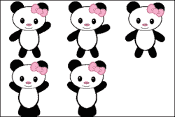
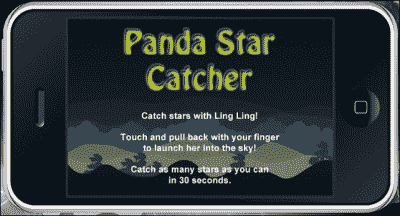
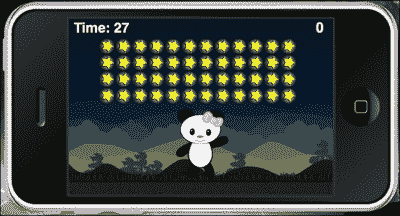
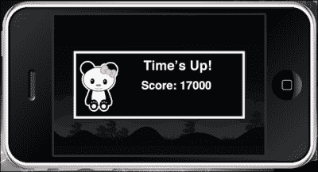
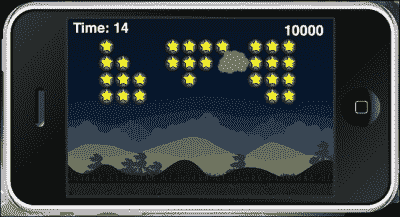
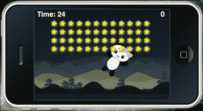

# 第五章：动画我们的游戏

> *在我们移动游戏开发的旅程中，我们已经开始了很好的起步。我们已经经历了大量的编程，从游戏逻辑到在屏幕上显示对象。Corona SDK 最强大的功能之一就是任何显示对象都可以被动画化。这是对 Corona 提供的灵活图形模型的证明。*
> 
> *动画为游戏中的用户体验增添了大量的角色。这是通过生成一系列帧来实现的，这些帧从一帧平滑地演变到下一帧。我们将学习这项技能并将其应用于将要创建的新游戏。*

在本章中，我们将：

+   使用动作和过渡进行操作

+   使用图像表进行动画

+   为显示对象创建一个游戏循环

+   构建我们的下一个游戏框架

让我们开始动画吧！

# 熊猫星星捕手

本节将创建我们的第二个游戏，名为熊猫星星捕手。主要角色是一只名叫玲玲的熊猫，它需要被发射到空中，并在计时器耗尽之前捕捉尽可能多的星星。熊猫将会有动画效果，每个行动过程都有不同的动作，例如发射前的设置和空中的动作。还将应用弹弓机制将玲玲发射到空中。你可能已经在如*愤怒的小鸟*和*城堡破坏者*之类的游戏中见过类似的功能。

# 让我们来让一切动起来

我们在第三章中介绍了过渡，并简要地接触了它。让我们更详细地了解。

## 过渡效果

过渡库允许你通过一行代码创建动画，通过允许你补间显示对象的一个或多个属性。我们在第三章中讨论了过渡的基础，*创建我们的第一个游戏 - 破坏者*。

这可以通过`transition.to`方法实现，它接收一个显示对象和一个包含控制参数的表。控制参数指定动画的持续时间以及显示对象的属性的最终值。属性的中间值由可选的缓动函数确定，该函数也作为控制参数指定。

`transition.to()` 方法使用“缓动”算法，随时间动画显示对象的属性。

语法是 `handle = transition.to( target, params )`。

返回函数是一个对象。参数如下：

+   `target`：这是一个将成为过渡目标的对象。这包括显示对象。

+   `params`：这是一个指定要动画显示对象的属性的表，以及以下一个或多个可选的非动画属性：

    +   `params.time`：这指定了过渡的持续时间（以毫秒为单位）。默认情况下，持续时间为 500 毫秒（0.5 秒）。

    +   `params.transition`: 默认情况下，此参数为 `easing.linear`。

    +   `params.delay`: 此参数指定了补间动画开始前的延迟时间（默认为无延迟），单位为毫秒。

    +   `params.delta`: 这是一个布尔值，指定非控制参数是作为最终结束值还是作为值的改变量来解释。默认为 `nil`，即 false。

    +   `params.onStart`: 这是一个在补间动画开始前调用的函数或表监听器。

    +   `params.onComplete`: 这是一个在补间动画完成后调用的函数或表监听器。

## 缓动函数

缓动库是过渡库使用的一系列插值函数的集合。例如，打开抽屉的动作，最初是快速移动，然后在停止之前进行缓慢精确的移动。以下是几个缓动示例：

+   `easing.linear(t, tMax, start, delta)`: 此函数定义了一个没有加速度的恒定运动

+   `easing.inQuad(t, tMax, start, delta)`: 此函数在过渡中对动画属性值进行二次插值运算

+   `easing.outQuad(t, tMax, start, delta)`: 此函数一开始速度很快，然后在执行过程中减速至零速度

+   `easing.inOutQuad(t, tMax, start, delta)`: 此函数从零速度开始动画，加速然后减速至零速度

+   `easing.inExpo(t, tMax, start, delta)`: 此函数从零速度开始，然后在执行过程中逐渐加速

+   `easing.outExpo(t, tMax, start, delta)`: 此函数一开始速度很快，然后在执行过程中减速至零速度

+   `easing.inOutExpo(t, tMax, start, delta)`: 此函数从零速度开始，使用指数缓动方程加速然后减速至零速度

你可以创建自己的缓动函数来在起始值和最终值之间插值。函数的参数定义如下：

+   `t`: 这是过渡开始后的毫秒数时间

+   `tMax`: 这是过渡的持续时间

+   `start`: 这是起始值

+   `delta`: 这是值的改变量（最终值 = `start` + `delta`）

例如：

```kt
local square = display.newRect( 0, 0, 50, 50 )
square:setFillColor( 1,1,1 )
square.x = 50; square.y = 100

local square2 = display.newRect( 0, 0, 50, 50 )
square2:setFillColor( 1,1,1 )
square2.x = 50; square2.y = 300

transition.to( square, { time=1500, x=250, y=0 } )
transition.from( square2, { time=1500, x=250, y=0, transition = easing.outExpo } )
```

# 定时函数的价值

使用可以在稍后调用的函数，在组织应用程序中游戏对象出现的时间时可能很有帮助。定时器库将允许我们及时处理函数。

## 定时器

定时器函数使你能够选择一个特定的延迟（以毫秒为单位）来触发事件。

+   `timer.performWithDelay(delay, listener [, iterations])`: 此函数在指定的延迟毫秒数后调用监听器，并返回一个句柄对象，你可以通过传递给 `timer.cancel()` 来取消定时器，防止在调用监听器之前触发。例如：

    ```kt
    local function myEvent()
      print( "myEvent called" )
    end
    timer.performWithDelay( 1000, myEvent )
    ```

+   `timer.cancel(timerId)`: 这取消了使用 `timer.performWithDelay()` 初始化的定时器操作。参数如下：

    +   `timerId`: 这是通过调用 `timer.performWithDelay()` 返回的对象句柄。例如：

        ```kt
        local count = 0

        local function myEvent()
          count = count + 1
          print( count )

          if count >= 3 then
            timer.cancel( myTimerID ) -- Cancels myTimerID
            end
          end
        ```

+   `timer.pause(timerId)`: 这将暂停使用`timer.performWithDelay()`启动的定时器对象。参数如下：

    +   `timerId`: 这是来自`timer.performWithDelay()`的定时器 ID 对象。例如：

        ```kt
        local count = 0

        local function myEvent()
          count = count + 1
          print( count )

          if count >= 5 then
            timer.pause( myTimerID ) -- Pauses myTimerID
            end
        end

        myTimerID = timer.performWithDelay(1000, myEvent, 0)
        ```

+   `timer.resume(timerId)`: 这将恢复使用`timer.pause(timerId)`暂停的定时器。参数如下：

    +   `timerID`: 这是来自`timer.performWithDelay()`的定时器 ID。例如：

        ```kt
        local function myEvent()
          print( "myEvent called" )
        end

        myTimerID = timer.performWithDelay( 3000, myEvent )  -- wait 3 seconds

        result = timer.pause( myTimerID ) -- Pauses myTimerID
        print( "Time paused at " .. result )

        result = timer.resume( myTimerID ) -- Resumes myTimerID
        print( "Time resumed at " .. result )
        ```

# 什么是图像表？

Corona SDK 包括一个图像表功能，用于构建动画精灵（也称为精灵表）。

### 注意

有关图像表的更多信息，请参考以下链接：[`docs.coronalabs.com/guide/media/imageSheets/index.html`](http://docs.coronalabs.com/guide/media/imageSheets/index.html)。

图像表是节省纹理内存的有效方式。建议在复杂的角色动画或涉及大量动画类型时使用。

图像表需要更多的编码和更高级的设置。它们需要构建一个大型动画帧表。

# 这是精灵狂热！

图像表是将多个帧编译成单个纹理图像的 2D 动画。这是一种节省纹理内存的有效方式。它对移动设备有益，并最小化加载时间。

## 图像表 API

`graphics.newImageSheet`函数创建一个新的图像表。参考以下代码：

```kt
graphics.newImageSheet( filename, [baseDir, ] options )
```

例如，图像表中的帧数假定为`floor(imageWidth/frameWidth) * floor(imageHeight/frameHeight)`。第一帧放置在左上角位置，从左到右读取，并在适用的情况下继续下一行。以下图像表有五个 128 x 128 像素的帧。整个图像表图像是 384 像素 x 256 像素。如果要在 Corona 中集成，一个示例方法将如下所示：

```kt
local options =
{
  width = 128,
  height = 128,
  numFrames = 5,
  sheetContentWidth=384, 
  sheetContentHeight=256
}
local sheet = graphics.newImageSheet( "mySheet.png", options )
```



`display.newSprite(imageSheet, sequenceData)`函数从一个图像表中创建一个新的精灵。精灵定义了属于同一个角色或其他移动资产的帧集合，然后可以将其细分为不同的动画序列以供播放。`sequenceData`参数是你设置的一系列动画序列数组。序列可以在多个精灵对象之间共享。以下是一些示例：

+   单序列（连续帧）：

    ```kt
    local sequenceData =
    {
      name="run", start=1, count=5, time=200, loopCount=0
    }

    local myCharacter = display.newSprite(imageSheet, sequenceData)
    ```

+   单序列（非连续帧）：

    ```kt
    local sequenceData =
    {
      name="jump", 
      frames= { 6, 7, 8 }, 
      time=200,
      loopCount=0
    }

    local myCharacter = display.newSprite(imageSheet, sequenceData)
    ```

+   多序列（连续和非连续帧）：

    ```kt
    local sequenceData =
    {
      { name="run", start=1, count=5, time=200 },
      {name="jump", frames= { 6, 7, 8 }, time=200, loopCount=0 }
    }

    local myCharacter = display.newSprite(imageSheet, sequenceData)
    ```

+   `object:pause()`: 这将暂停当前动画。帧将保持在当前显示的帧。

+   `object:play()`: 这将从当前帧开始播放动画序列。

+   `object:setFrame()`: 这在当前加载的序列中设置帧。

+   `object:setSequence()`: 这通过名称加载一个动画序列。

# 游戏时间！

既然我们已经学会了如何设置图像表，那么让我们尝试将它们应用到`Panda Star Catcher`中！你可以从 Packt Publishing 网站下载伴随这本书的项目文件。在`Chapter 5`文件夹中有一个名为`Panda Star Catcher`的项目文件夹。它已经为你设置了`config.lua`和`build.settings`文件。文件夹中还包括了美术资源。从第三章，*构建我们的第一个游戏——Breakout*和第四章，*游戏控制*，你可能已经注意到构建和运行时的配置有类似的设置。本教程适用于 iOS 和 Android 设备。项目文件夹中包含的图形已经设计好，可以在两个平台上正确显示。游戏的欢迎屏幕将如下所示：



# 动手时间——设置变量

让我们先介绍运行游戏所需的所有变量：

1.  创建一个全新的`main.lua`文件，并将其添加到`Panda Star Catcher`项目文件夹中。

1.  让我们从设备上隐藏状态栏，并设置游戏中所需的所有变量：

    ```kt
    display.setStatusBar( display.HiddenStatusBar ) -- Hides the status bar in iOS only

    -- Display groups
    local hudGroup = display.newGroup() -- Displays the HUD
    local gameGroup = display.newGroup()
    local levelGroup = display.newGroup()
    local stars = display.newGroup() -- Displays the stars

    -- Modules
    local physics = require ("physics")

    local mCeil = math.ceil
    local mAtan2 = math.atan2
    local mPi = math.pi
    local mSqrt = math.sqrt

    -- Game Objects
    local background
    local ground
    local powerShot
    local arrow
    local panda
    local poof
    local starGone
    local scoreText
    local gameOverDisplay

    -- Variables
    local gameIsActive = false
    local waitingForNewRound
    local restartTimer
    local counter
    local timerInfo 
    local numSeconds = 30 -- Time the round starts at
    local counterSize = 50
    local gameScore = 0 -- Round starts at a score of 0
    local starWidth = 30
    local starHeight = 30
    ```

## *刚才发生了什么？*

在应用程序开始时，我们隐藏了状态栏。这仅适用于 iOS 设备。有四个不同的组设置，它们在游戏中都扮演着重要的角色。

注意`gameIsActive`设置为`false`。这使我们能够激活应用程序的属性，以便在显示对象需要停止动画、出现在屏幕上并受触摸事件影响时影响回合。

代码开始部分也设置了计时器的元素。将`numSeconds`设置为`30`表示回合将倒计时多少秒。`starWidth`和`starHeight`描述了对象的尺寸。

# 让我们开始这一轮

在游戏屏幕上的熊猫发射之前，我们需要先加载熊猫。熊猫将从屏幕底部过渡并在屏幕上移，然后才能发生触摸事件。

# 动手时间——开始游戏

现在，我们需要为熊猫设置一个屏幕外的位置，并让它过渡到起始发射位置，以便用户可以与之互动。

1.  添加变量后，创建一个名为`startNewRound()`的新局部函数，并添加一个`if`语句来初始化`panda`对象进入场景：

    ```kt
    local startNewRound = function()
      if panda then
    ```

1.  在`startNewRound()`内添加一个名为`activateRound()`的新局部函数。设置屏幕上`panda`显示对象的起始位置，并添加`ground:toFront()`，使地面出现在熊猫角色前面：

    ```kt
      local activateRound = function()

        waitingForNewRound = false

        if restartTimer then
          timer.cancel( restartTimer )
        end

        ground:toFront()
        panda.x = 240
        panda.y = 300
        panda.rotation = 0
        panda.isVisible = true
    ```

1.  创建另一个名为`pandaLoaded()`的局部函数。将`gameIsActive`设置为`true`，并将`panda`对象的空气和击打属性设置为`false`。添加`panda:toFront()`，使其在屏幕上所有其他游戏对象的前面，并将身体类型设置为`"static"`：

    ```kt
        local pandaLoaded = function()

          gameIsActive = true
          panda.inAir = false
          panda.isHit = false
          panda:toFront()

          panda.bodyType = "static"

        end
    ```

1.  在 1,000 毫秒内将熊猫过渡到`y=225`。当补间动画完成后，使用`onComplete`命令调用`pandaLoaded()`函数。使用`end`关闭`activateRound()`函数，并调用它。关闭`panda`的`if`语句和`startNewRound()`函数，使用`end`：

    ```kt
        transition.to( panda, { time=1000, y=225, onComplete=pandaLoaded } )
        end

        activateRound()

      end
    end
    ```

    

## *刚才发生了什么？*

当关卡被激活时，熊猫被放置在地面以下，在玩家可见之前。对于`pandaLoaded()`，游戏通过`gameIsActive = true`激活，熊猫准备好被玩家发射。熊猫从地面过渡到屏幕上可以被访问的区域。

# 嘭！消失了！

在一轮结束后，熊猫需要从舞台上消失。我们不是让它消失在空气中，而是当它与屏幕上的任何物体发生碰撞时，添加一个“poof”效果。

# 行动时间——在舞台上重新加载熊猫

当熊猫在空中停留一定时间或碰到屏幕外的任何边界区域时，它将变成一股烟雾。当与屏幕边缘或地面发生碰撞事件时，熊猫将被“poof”图像替换。为了使“poof”效果起作用，必须关闭熊猫的可见属性。当发生碰撞后，需要将熊猫重新加载到屏幕上，同时游戏仍然激活。

1.  创建一个名为`callNewRound()`的局部函数。包括一个名为`isGameOver`的局部变量，并将其设置为`false`：

    ```kt
    local callNewRound = function()
      local isGameOver = false
    ```

1.  在当前函数内，创建一个名为`pandaGone()`的新局部函数。为熊猫添加新属性，使其不再在游戏舞台上显示：

    ```kt
      local pandaGone = function()

        panda:setLinearVelocity( 0, 0 )
        panda.bodyType = "static"
        panda.isVisible = false
        panda.rotation = 0

        poof.x = panda.x; poof.y = panda.y
        poof.alpha = 0
        poof.isVisible = true
    ```

1.  为`poof`对象添加一个名为`fadePoof()`的新函数。使用`onComplete`命令，设置`time`为`50`和`alpha`为`1`进行过渡。让`poof`对象在`time`设置为`100`和`alpha`设置为`0`时淡出。关闭`pandaGone()`函数，并使用`timer.performWithDelay`调用它：

    ```kt
        local fadePoof = function()
           transition.to( poof, { time=100, alpha=0 } )
        end
        transition.to( poof, { time=50, alpha=1.0, onComplete=fadePoof } )

        restartTimer = timer.performWithDelay( 300, function()
           waitingForNewRound = true; 
           end, 1)

      end

      local poofTimer = timer.performWithDelay( 500, pandaGone, 1 )
    ```

1.  当`isGameOver`仍为`false`时，为`startNewRound()`添加`timer.performWithDelay`方法。关闭`callNewRound()`函数：

    ```kt
      if isGameOver == false then
        restartTimer = timer.performWithDelay(1500, startNewRound, 1)
      end
    end
    ```

## *刚才发生了什么？*

当熊猫不再在屏幕上显示且倒计时仍在进行时，将开始新一轮。当`isGameOver`仍为`false`时，通过调用`startNewRound()`重新加载熊猫。

熊猫碰撞通过`pandaGone()`发生。通过应用`panda.isVisible = false`，所有物理属性都变为不活跃。

烟雾正好在熊猫消失的地方出现。当`poof.x = panda.x; poof.y = panda.y`时，会发生这种情况。通过`fadePoof()`，`poof`短暂可见。一旦它淡出，新一轮即将到来，将`waitingForNewRound`设置为`true`。

# 赚取一些分数

当熊猫捕捉到天空中的任何星星时，都会获得分数。游戏是在计时器上进行的，所以玩家的任务是尽可能在时间耗尽前捕捉更多星星。让我们积累一些分数吧！

# 行动时间——跟踪分数

分数通过名为`scoreNum`的参数更新，并在游戏进行时显示。分数是通过`gameScore`接收的。

1.  下一个要创建的函数名为`setScore`，带有一个名为`scoreNum`的参数：

    ```kt
    local setScore = function( scoreNum )
    ```

1.  使用名为`newScore`的局部变量并将其设置为`scoreNum`。设置`gameScore = newScore`。为`gameScore`提供一个`if`语句，以便在游戏进行时将分数设置为 0：

    ```kt
      local newScore = scoreNum
      gameScore = newScore

      if gameScore < 0 then gameScore = 0; end
    ```

1.  添加`scoreText`显示对象，并将其设置为等于`gameScore`。关闭函数：

    ```kt
      scoreText.text = gameScore
      scoreText.xScale = 0.5; scoreText.yScale = 0.5
      scoreText.x = (480 - (scoreText.contentWidth * 0.5)) - 15
      scoreText.y = 20
    end
    ```

## *刚才发生了什么？*

对于`setScore = function(scoreNum)`函数，我们设置了一个名为`scoreNum`的参数。`scoreNum`参数会通过`local newScore`持续更新游戏分数。`newScore`将通过`gameScore`更新，这是计分的基础。同时，在游戏中，`scoreText`会显示`gameScore`的值。

# 当游戏结束时

这场游戏没有输家，每个人都是赢家！在计时器耗尽前，尽可能多地收集星星，你的肾上腺素仍会激增。当一切结束时，我们还需要通知大家时间已到。

# 行动时间——显示游戏结束屏幕

我们需要设置游戏结束屏幕，并在本回合结束时显示玩家获得的最终得分：

1.  创建一个名为`callGameOver()`的新局部函数：

    ```kt
    local callGameOver = function()
    ```

1.  将`gameIsActive`设置为`false`并暂停物理引擎。从舞台中移除`panda`和`stars`对象：

    ```kt
      gameIsActive = false
      physics.pause()

      panda:removeSelf()
      panda = nil
      stars:removeSelf()
      stars = nil
    ```

1.  显示游戏结束对象并将它们插入到`hudGroup`组中。使用`transition.to`方法在屏幕上显示游戏结束对象：

    ```kt
      local shade = display.newRect( 0, 0, 480, 320 )
      shade:setFillColor( 0, 0, 0, 0.5)
      shade.x = display.contentCenterX
      shade.y = display.contentCenterY

      gameOverDisplay = display.newImage( "gameOverScreen.png")
      gameOverDisplay.x = 240; gameOverDisplay.y = 160
      gameOverDisplay.alpha = 0

      hudGroup:insert( shade )
      hudGroup:insert( gameOverDisplay )

      transition.to( shade, { time=200 } )
      transition.to( gameOverDisplay, { time=500, alpha=1 } )
    ```

1.  使用名为`newScore`的局部变量更新最终得分。将`counter`和`scoreText`的`isVisible`设置为`false`。再次引入`scoreText`以在设备屏幕的另一位置显示最终得分。关闭函数：

    ```kt
      local newScore = gameScore
      setScore( newScore )

      counter.isVisible = false

      scoreText.isVisible = false
      scoreText.text = "Score: " .. gameScore
      scoreText.xScale = 0.5; scoreText.yScale = 0.5
      scoreText.x = 280
      scoreText.y = 160
      scoreText:toFront()
      timer.performWithDelay( 1000, function() scoreText.isVisible = true; end, 1 )

    end
    ```

    

## *刚才发生了什么？*

当时间耗尽或所有星星被收集时，`callGameOver()`方法会显示游戏结束屏幕。我们将`gameIsActive`设置为`false`并暂停所有物理效果，这样熊猫就不能通过任何屏幕触摸来移动了。然后从场景中移除熊猫和星星。通过`transition.to`使`shade`和`gameOverDisplay`对象可见，这样它就会通知玩家本回合已经结束。最终得分将在回合结束时在`gameOverDisplay`对象前显示。

# 背景展示

熊猫在游戏中需要一个关于其所在位置的通用设置。让我们设置背景和地面对象。

# 行动时间——添加背景元素

1.  将 `background` 和 `ground` 显示对象添加到 `drawBackground()` 函数中。将这些对象插入到名为 `gameGroup` 的组中：

    ```kt
    local drawBackground = function()

      background = display.newImage( "background.png" )
      background.x = 240; background.y = 160

      gameGroup:insert( background )

      ground = display.newImage( "ground.png" )
      ground.x = 240; ground.y = 300

      local groundShape = { -240,-18, 240,-18, 240,18, -240,18 }
      physics.addBody( ground, "static", { density=1.0, bounce=0, friction=0.5, shape=groundShape } )

      gameGroup:insert( ground )

    end
    ```

## *刚才发生了什么？*

`background` 和 `ground` 显示对象被放置在 `drawBackground()` 函数中。`ground` 对象有一个自定义的物理形状，它的大小与原始显示对象不同。所以如果熊猫碰巧撞到地面，它会与之碰撞，但不会穿过。

# 注意！

在游戏开始之前，我们需要了解如何操作游戏控制。幸运的是，我们将添加一个帮助屏幕，解释如何进行游戏。还需要显示**抬头显示**（**HUD**），以便玩家了解剩余时间以及他们积累了多少分。

# 行动时间——显示计时器和得分

让我们设置在游戏中需要显示的帮助屏幕和 HUD 元素：

1.  创建一个名为 `hud()` 的新本地函数：

    ```kt
    local hud = function()
    ```

1.  在游戏开始时显示 `helpText` 10 秒钟。通过向左滑动并设置可见性为 `false` 来过渡它。将 `helpText` 添加到 `hudGroup` 组中：

    ```kt
      local helpText = display.newImage("help.png")
      helpText.x = 240; helpText.y = 160
      helpText.isVisible = true
      hudGroup:insert( helpText )

      timer.performWithDelay( 10000, function() helpText.isVisible = false; end, 1 )

      transition.to( helpText, { delay=9000, time=1000, x=-320, transition=easing.inOutExpo })
    ```

1.  在屏幕顶部附近显示 `counter` 和 `scoreText`。也将 `scoreText` 添加到 `hudGroup` 组中。使用 `end` 结束函数：

    ```kt
      counter = display.newText( "Time: " .. tostring(numSeconds), 0, 0, "Helvetica-Bold", counterSize )
      counter:setFillColor( 1, 1, 1 )
      counter.xScale = 0.5; counter.yScale = 0.5
      counter.x = 60; counter.y = 15 
      counter.alpha = 0

      transition.to( counter, { delay=9000, time=1000, alpha=1, transition=easing.inOutExpo })

      hudGroup:insert( counter )

      scoreText = display.newText( "0", 470, 22, "Helvetica-Bold", 52 )
      scoreText: setFillColor( 1, 1, 1 )--> white
      scoreText.text = gameScore
      scoreText.xScale = 0.5; scoreText.yScale = 0.5
      scoreText.x = (480 - (scoreText.contentWidth * 0.5)) - 15
      scoreText.y = 15
      scoreText.alpha = 0

      transition.to( scoreText, { delay=9000, time=1000, alpha=1, transition=easing.inOutExpo })

      hudGroup:insert( scoreText )

    end
    ```

## *刚才发生了什么？*

`helpText` 对象在游戏开始前出现，并在主设备显示上停留 9 秒钟，然后在 1 秒内沿 *x* 方向过渡到 -320。这是通过 `transition.to( helpText, { delay=9000, time=1000, x=-320, transition=easing.inOutExpo })` 实现的。

`counter` 对象显示 `"Time: " .. tostring(numSeconds)`，其中 `numSeconds` 表示从 30 开始倒数的秒数。它位于屏幕左上角附近。

`scoreText` 对象显示 `gameScore`，并且每次星星碰撞都会更新。这将被放置在屏幕的右上角。`local hud = function()` 中的所有对象都插入到 `hudGroup` 中。

# 一次又一次

这个游戏有一个定时器，玩家需要在它用完之前尽可能多地捕捉星星。我们将在帮助文本离开舞台后立即开始倒计时。

# 行动时间——设置定时器

我们需要创建几个函数，激活倒计时并在游戏结束时停止在 0 秒：

1.  使用名为 `myTimer()` 的本地函数为游戏设置定时器倒计时：

    ```kt
    local myTimer = function()
    ```

1.  将定时器倒计时的秒数增加 1。使用 `counter` 文本对象，通过 `numSeconds` 显示时间。在终端窗口中输出 `numSeconds` 来查看倒计时：

    ```kt
      numSeconds = numSeconds - 1
      counter.text = "Time: " .. tostring( numSeconds )
      print(numSeconds)
    ```

1.  创建一个 `if` 语句，用于当定时器用完或所有星星消失时。在块内，取消定时器并调用 `callGameOver()` 来结束这一轮。使用 `end` 结束 `myTimer()` 函数。

    ```kt
      if numSeconds < 1 or stars.numChildren <= 0 then
        timer.cancel(timerInfo)
        panda:pause()
        restartTimer = timer.performWithDelay( 300, function() callGameOver(); end, 1 )
      end

    end
    ```

1.  使用名为`startTimer()`的新局部函数启动`myTimer()`函数。这将开始游戏玩法开始时的倒计时：

    ```kt
    local startTimer = function()
      print("Start Timer")
      timerInfo = timer.performWithDelay( 1000, myTimer, 0 )
    end
    ```

## *刚才发生了什么？*

主要的计时器函数在`myTimer()`中。我们使用`numSeconds = numSeconds – 1`来倒数秒数。秒数将在`counter`显示对象中更新。`print(numSeconds)`将在终端窗口中更新，以查看倒计时在代码内部运行的速度。

当时间耗尽或所有星星都被收集时，将创建一个`if`语句来检查是否有任何参数为真。当任何语句评估为真时，计时器停止倒数，熊猫动画暂停，并调用`callGameOver()`函数。这将调用显示游戏结束屏幕的函数。

计时器通过`local startTimer = function()`以每 1,000 毫秒的速度启动倒计时，这相当于 1 秒。

# 它如此发光

熊猫需要另一个元素来显示发射它到天空所需的力量。我们将添加一个微妙的类似发光的显示对象来表示这一点。

# 动作时间——制作能量射击

我们需要为`powerShot`创建一个单独的函数，以便在熊猫准备发射时调用：

1.  通过名为`createPowerShot()`的新局部函数显示`powerShot`对象。将其插入到`gameGroup`组中：

    ```kt
    local createPowerShot = function()
      powerShot = display.newImage( "glow.png" )
      powerShot.xScale = 1.0; powerShot.yScale = 1.0
      powerShot.isVisible = false

      gameGroup:insert( powerShot )
    end
    ```

## *刚才发生了什么？*

通过`createPowerShot()`函数创建`powerShot`对象，并在熊猫准备发射时调用。

# 熊猫！

在屏幕上看到动画的东西将会很激动人心。我们的主角将为游戏玩法中应用的每个动作指定动画。

# 动作时间——创建熊猫角色

我们需要设置熊猫的碰撞事件，并相应地为其设置动画，使用图像表：

1.  我们需要创建一个局部函数来处理熊猫的碰撞和触摸事件。我们将它称为`createPanda()`：

    ```kt
    local createPanda = function()
    ```

1.  当熊猫与星星碰撞时，使用带有参数`self`和`event`的`onPandaCollision()`。每次与星星或屏幕边缘发生碰撞时，使用`callNewRound()`重新加载`panda`：

    ```kt
      local onPandaCollision = function( self, event )
        if event.phase == "began" then

          if panda.isHit == false then

            panda.isHit = true

            if event.other.myName == "star" then
              callNewRound( true, "yes" )
            else
              callNewRound( true, "no" )
            end

            if event.other.myName == "wall" then
              callNewRound( true, "yes" )
            else
              callNewRound( true, "no" )
            end

            elseif panda.isHit then
              return true
            end
        end
      end
    ```

1.  创建一个方向箭头，允许用户瞄准发射熊猫的区域。将其插入到`gameGroup`组中：

    ```kt
      arrow = display.newImage( "arrow.png" )
      arrow.x = 240; arrow.y = 225
      arrow.isVisible = false

      gameGroup:insert( arrow )
    ```

1.  创建一个具有三种不同动画序列（称为`"set"`、`"crouch"`和`"air"`）的熊猫图像表：

    ```kt
      local sheetData = { width=128, height=128, numFrames=5, sheetContentWidth=384, sheetContentHeight=256 }
      local sheet = graphics.newImageSheet( "pandaSprite.png", sheetData )

      local sequenceData = 
      {
        { name="set", start=1, count=2, time=200 }, 
        { name="crouch", start=3, count= 1, time=1 }, 
        { name="air", start=4, count=2, time=100 }  
      }

      panda = display.newSprite( sheet, sequenceData )

      panda:setSequence("set")
      panda:play()
    ```

1.  在熊猫发射到空中之前，为其添加以下属性：

    ```kt
      panda.x = 240; panda.y = 225
      panda.isVisible = false

      panda.isReady = false
      panda.inAir = false
      panda.isHit = false
      panda.isBullet = true
      panda.trailNum = 0

      panda.radius = 12
      physics.addBody( panda, "static", { density=1.0, bounce=0.4, friction=0.15, radius=panda.radius } )
      panda.rotation = 0
    ```

1.  使用`"collision"`为`panda`设置碰撞，并应用事件监听器：

    ```kt
      panda.collision = onPandaCollision
      panda:addEventListener( "collision", panda )
    ```

1.  创建`poof`对象：

    ```kt
      poof = display.newImage( "poof.png" )
      poof.alpha = 1.0
      poof.isVisible = false
    ```

1.  将`panda`和`poof`对象插入到`gameGroup`组中。关闭函数：

    ```kt
      gameGroup:insert( panda )
      gameGroup:insert( poof )
    end
    ```

1.  我们需要滚动到`activateRound()`函数，并为熊猫添加`"set"`动画序列：

    ```kt
      panda:setSequence("set")
      panda:play()
    ```

## *刚才发生了什么？*

熊猫发生的碰撞事件从`if event.phase == "began"`开始。通过几个`if`语句的情况，熊猫在屏幕上重新加载。当熊猫向舞台的右侧、左侧或顶部发射离开屏幕时，`event.other.myName == "star"`将调用新一轮。

熊猫的图片表有三个动画组。它们被称为`"set"`、`"air"`和`"crouch"`。图片表总共有五个帧。

在发射前设置熊猫的物理属性。身体类型设置为`"static"`，在空中时将改变。

熊猫的碰撞事件通过`panda:addEventListener( "collision", panda )`调用。

图片表设置好后，需要在`activateRound()`函数中添加`"set"`动画以启动移动。

# 星空。

星星在游戏中扮演着重要角色。它们是熊猫在倒计时结束前为了获得分数必须克服的主要障碍。

# 是时候行动了——创建星星碰撞。

星星碰撞需要被创建并从舞台移除，以便玩家可以累积分数。

1.  为星星碰撞创建一个名为`onStarCollision()`的函数，并带有`self`和`event`参数：

    ```kt
    local onStarCollision = function( self, event )
    ```

1.  添加`if`语句，当发生碰撞时，从游戏屏幕上移除`stars`子项。每次从屏幕上移除一个星星，分数增加 500。用`end`关闭函数：

    ```kt
      if event.phase == "began" and self.isHit == false then

        self.isHit = true
        print( "star destroyed!")
        self.isVisible = false

        stars.numChildren = stars.numChildren - 1

        if stars.numChildren < 0 then
          stars.numChildren = 0
        end

        self.parent:remove( self )
        self = nil

        local newScore = gameScore + 500
        setScore( newScore )
      end
    end
    ```

    

## *刚才发生了什么？*

星星碰撞在第一次接触时发生，条件是`if event.phase == "began"`和`self.isHit == false`，假设星星还没有被熊猫触碰。通过`self.parent:remove( self )`和`self = nil`，星星从屏幕上移除。分数通过`gameScore`增加 500，并更新为`setScore = (scoreNum)`。

## 尝试英雄——跟踪星星计数。

尝试跟踪游戏过程中熊猫捕捉到的星星数量。逻辑与创建游戏分数类似。每次捕捉到的星星都需要在每次碰撞时增加 1。星星计数放在`onStarCollision()`函数中。需要创建一个新的函数和方法来显示星星计数的文本，并且每次计数更改时都要更新。

# 屏幕触摸。

熊猫需要通过创建类似弹弓的发射机制来穿越游戏场地，以到达星星。力量在推动熊猫上升的过程中将发挥重要作用。

# 是时候行动了——发射熊猫。

让我们为熊猫添加一个触摸事件，使其向星星弹射。`powerShot`对象将帮助玩家可视化在熊猫起飞前需要施加多大的力量。

1.  为熊猫实现触摸事件。创建一个名为`onScreenTouch()`的局部函数，带有事件参数：

    ```kt
    local onScreenTouch = function( event )
    ```

1.  当启动`gameIsActive`时，添加一个`if`语句，用于当触摸事件开始时，通过使用`event.phase ==` `"began"`。在此事件期间，使用“蹲下”动画集来准备`panda`的发射：

    ```kt
      if gameIsActive then
        if event.phase == "began" and panda.inAir == false then

          panda.y = 225
          panda.isReady = true
          powerShot.isVisible = true
          powerShot.alpha = 0.75
          powerShot.x = panda.x; powerShot.y = panda.y
          powerShot.xScale = 0.1; powerShot.yScale = 0.1

          arrow.isVisible = true

          panda:setSequence("crouch")
          panda:play()
    ```

1.  添加一个`elseif`语句，用于当触摸事件结束时，通过使用`event.phase == "ended"`。创建一个名为`fling()`的新局部函数，它将在发射`panda`向`star`对象时保存`panda`的属性。应用一个与触摸事件拖动方向相反的力。当触摸事件从角色处拉远时，向外扩展`powerShot`显示对象的大小：

    ```kt
        elseif event.phase == "ended" and panda.isReady then

          local fling = function()
            powerShot.isVisible = false
            arrow.isVisible = false

            local x = event.x
            local y = event.y
            local xForce = (panda.x-x) * 4
            local yForce = (panda.y-y) * 4

            panda:setSequence("air")
            panda:play()

            panda.bodyType = "dynamic"
            panda:applyForce( xForce, yForce, panda.x, panda.y )
            panda.isReady = false
            panda.inAir = true

          end

        transition.to( powerShot, { time=175, xScale=0.1, yScale=0.1, onComplete=fling} )

        end

        if powerShot.isVisible == true then

          local xOffset = panda.x
          local yOffset = panda.y

          local distanceBetween = mCeil(mSqrt( ((event.y - yOffset) ^ 2) + ((event.x - xOffset) ^ 2) ))

          powerShot.xScale = -distanceBetween * 0.02
          powerShot.yScale = -distanceBetween * 0.02

          local angleBetween = mCeil(mAtan2( (event.y - yOffset), (event.x - xOffset) ) * 180 / mPi) + 90

          panda.rotation = angleBetween + 180
          arrow.rotation = panda.rotation
        end

      end
    end
    ```

    

## *刚才发生了什么？*

一旦游戏激活并在屏幕上加载了熊猫，就可以启动一个触摸事件来发射熊猫。熊猫将从“静态”物理状态变为“动态”物理状态。`powerShot`显示对象的大小随着事件触摸将熊猫拉得越远而增加。

熊猫发射的力由`local fling = function()`应用。发射力由`xForce`和`yForce`产生。熊猫对象通过`panda:applyForce( xForce, yForce, panda.x, panda.y )`推进。注意，身体类型变为“动态”，这样重力就可以影响对象。

# 组织显示对象

当设置好回合后，需要重新排列游戏对象的显示层次结构。最重要的对象显示在屏幕前方。

# 行动时间——重新排序层次

1.  需要创建一个新的局部函数`reorderLayers()`，以在游戏进行时组织屏幕上对象的显示层次结构：

    ```kt
    local reorderLayers = function()

      gameGroup:insert( levelGroup )
      ground:toFront()
      panda:toFront()
      poof:toFront()
      hudGroup:toFront()

    end
    ```

## *刚才发生了什么？*

`gameGroup`、`hudGroup`和其他显示对象在游戏屏幕的显示层次结构中重新组织。最重要的对象被设置在前面，而最不重要的对象在后面。

# 创建星星

天空背景需要填满星星，这样熊猫就能捕捉到尽可能多的星星。

# 行动时间——在关卡中创建星星

我们需要在游戏中添加星星的布局，并使它们移动，以添加一些效果来显示它们是活跃的。需要应用一个碰撞事件，当熊猫与它们相撞时，将它们移除。

1.  创建一个名为`createStars()`的新函数，并通过`for`循环布置`star`对象。添加一个`"collision"`事件，该事件会被`onStarCollision()`调用，以在星星被熊猫击中时移除它们。让星星每 10 秒向前和向后旋转 1,080 度和-1,080 度，这将使星星前后旋转三个完整的周期。为屏幕左右两侧创建墙壁：

    ```kt
    local createStars = function()

      local numOfRows = 4
      local numOfColumns = 12
      local starPlacement = {x = (display.contentWidth  * 0.5) - (starWidth * numOfColumns ) / 2  + 10, y = 50}

      for row = 0, numOfRows - 1 do
        for column = 0, numOfColumns - 1 do

          -- Create a star
          local star = display.newImage("star.png")
          star.name = "star"
          star.isHit = false
          star.x = starPlacement.x + (column * starWidth)
          star.y = starPlacement.y + (row * starHeight)
          physics.addBody(star, "static", {density = 1, friction = 0, bounce = 0, isSensor = true})
          stars.insert(stars, star)

          star.collision = onStarCollision
          star:addEventListener( "collision", star )

          local function starAnimation()
            local starRotation = function()
              transition.to( star, { time=10000, rotation = 1080, onComplete=starAnimation })
            end

            transition.to( star, { time=10000, rotation = -1080, onComplete=starRotation })
          end

          starAnimation()

        end
      end

      local leftWall  = display.newRect (0, 0, 0, display.contentHeight)
      leftWall.name = "wall"

      local rightWall = display.newRect (display.contentWidth, 0, 0, display.contentHeight)
        rightWall.name = "wall"

        physics.addBody (leftWall, "static", {bounce = 0.0, friction = 10})
        physics.addBody (rightWall, "static", {bounce = 0.0, friction = 10})

        reorderLayers()
    end
    ```

## *刚才发生了什么？*

屏幕上显示的星星数量由 `numOfRows` 和 `numOfColumns` 设置。一个 `for` 循环用于显示每个单独的星星对象，并将其放置在 `stars` 组中。通过 `onStarCollision()` 的事件监听器检测 `star` 的碰撞。

`leftWall` 和 `rightWall` 对象也有物理属性，并将考虑与熊猫的碰撞检测。

星星通过 `starAnimation()` 和 `starRotation()` 进行动画处理。每个函数轮流旋转每个星星对象 10 秒钟（10,000 毫秒），在 1,080 度和-1,080 度之间交替。

# 开始游戏

游戏从倒计时开始时启动，熊猫被加载到屏幕上。一旦熊猫在屏幕上设定，玩家需要迅速瞄准并发射它，以便立即重新加载熊猫。

# 动手时间——初始化游戏

要运行游戏，需要初始化物理和剩余的游戏功能。所有游戏动作都需要延迟，直到帮助屏幕离开舞台。

1.  通过创建一个名为 `gameInit()` 的新函数来启动游戏，该函数将包含物理属性并在舞台上激活显示对象：

    ```kt
    local gameInit = function()
      physics.start( true )
      physics.setGravity( 0, 9.8 )

      drawBackground()
      createPowerShot()
      createPanda()
      createStars()
      hud()
    ```

1.  添加一个 `Runtime` 事件监听器，使用 `"touch"` 来 `onScreenTouch()`：

    ```kt
      Runtime:addEventListener( "touch", onScreenTouch )
    ```

1.  让关卡和计时器在 10 秒后开始，这样用户就有时间阅读帮助文本。关闭函数并通过 `gameInit()` 开始游戏：

    ```kt
      local roundTimer = timer.performWithDelay( 10000, function() startNewRound(); end, 1 )
      local gameTimer = timer.performWithDelay( 10000, function() startTimer(); end, 1 )
    end

    gameInit()
    ```

所有代码都完成了！在模拟器中运行游戏，亲自看看它是如何工作的。如果出现错误，请确保检查代码中是否有任何拼写错误。

## *刚才发生了什么？*

通过 `gameInit()` 初始化一轮游戏。此时运行物理引擎和剩余的函数。同时添加 `onScreenTouch()` 的事件监听器。通过 `timer.performWithDelay` 在启动应用程序 10 秒后初始化 `startNewRound()` 和 `startTimer()` 函数。

## 小测验——动画图形

Q1. 正确暂停图像表的动画的方法是什么？

1.  `object:stop()`

1.  `object:pause()`

1.  `object:dispose()`

1.  以上都不正确

Q2. 如何让动画序列永远循环？

1.  `local sequenceData =`

    ```kt
     {
     name="run", start=1, count=5, time=100, loopCount=1 
     }

    ```

1.  `local sequenceData =`

    ```kt
     {
     name="run", start=1, count=5, time=100, loopCount=0 
     }

    ```

1.  `local sequenceData =`

    ```kt
     {
     name="run", start=1, count=5, time=100, loopCount=-1
     }

    ```

1.  `local sequenceData =`

    ```kt
     {
     name="run", start=1, count=5, time=100, loopCount=100
     }

    ```

Q3. 如何创建一个新的图像表？

1.  `myCharacter = display.newSprite(sequenceData)`

1.  `myCharacter = display.newSprite(imageSheet, sequenceData)`

1.  `myCharacter = sprite.newSpriteSheet("myImage.png", frameWidth, frameHeight)`

1.  以上都不正确

# 概括

我们的第二款游戏《熊猫星星捕手》终于完成了！我们现在对编写更多函数和不同类型的游戏逻辑有了很好的掌握，而且我们还掌握了动画制作！干的漂亮！

在本章中，我们完成了以下工作：

+   更深入地了解了过渡，并应用了缓动技术

+   理解了图像表和精灵动画

+   为需要在屏幕上连续重新加载的显示对象创建了一个游戏循环

+   对一个显示对象施加力，使其向指定方向推进

+   添加了一个碰撞事件，用以从一个显示对象切换到另一个显示对象

我们在整整一个章节中完成了一个游戏的制作！使用 Corona SDK 进行开发是如此简单和快速上手。即便创建一个简单的游戏，也无需编写成千上万行代码。

在下一章中，我们将学习创建游戏、音效和音乐的另一个重要元素！这将是一段美妙的旅程。
