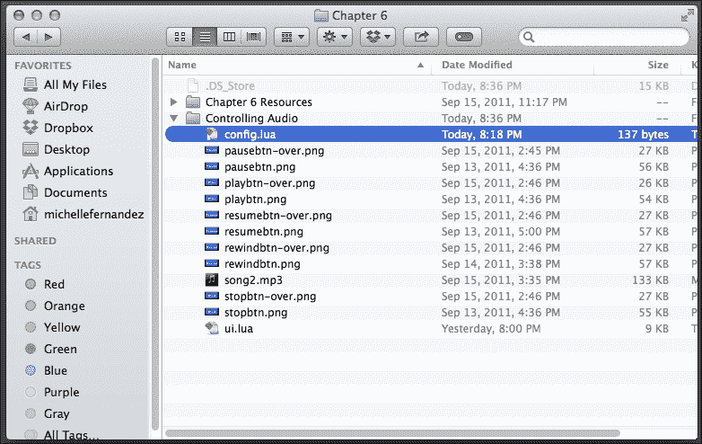
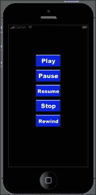

# 第六章：播放声音和音乐

> *我们在日常生活中遇到的几乎所有类型的媒体中都能听到声音效果和音乐。许多著名游戏如*《吃豆人》*、*《愤怒的小鸟》*和*《水果忍者》*仅凭它们的主题音乐或声音效果就能被识别出来。除了我们在游戏中看到的视觉图像，声音帮助影响故事情节中传达的情绪和/或游戏过程中的氛围。与游戏主题相关的优质声音效果和音乐，有助于给体验带来真实感。*

在本章中，你将学习如何为你的应用程序添加声音效果和音乐。在前面章节中创建 Breakout 和 Panda Star Catcher 时，你已经掌握了视觉吸引力。现在，让我们为我们的耳朵提升感官体验！

你将要学习的主要内容包括：

+   加载、播放和循环音频

+   了解如何播放、暂停、恢复、倒带和停止音频

+   内存管理（处理音频）

+   音量控制

+   性能和编码技巧

让我们创造更多的魔法！

# Corona 音频系统

Corona 音频系统具有先进的**开放音频库**（**OpenAL**）功能。OpenAL 专为高效渲染多通道三维定位音频而设计。OpenAL 的一般功能编码在源对象、音频缓冲区和单一监听器中。源对象包含指向缓冲区的指针、声音的速度、位置和方向，以及声音的强度。缓冲区包含 PCM 格式的音频数据，可以是 8 位或 16 位，单声道或立体声格式。监听器对象包含监听者的速度、位置和方向，以及应用于所有声音的总增益。

### 注意

想要了解更多关于 Corona 音频系统的信息，你可以访问[`developer.coronalabs.com/partner/audionotes`](http://developer.coronalabs.com/partner/audionotes)。关于 OpenAL 的一般信息可以在[`www.openal.org`](http://www.openal.org)找到。

## 声音格式

以下是与 iOS 和安卓平台兼容的声音格式：

+   所有平台都支持 16 位、小端、线性的`.wav`格式文件

+   iOS 支持`.mp3`、`.aif`、`.caf`和`.aac`格式

+   Mac 模拟器支持`.mp3`、`.aif`、`.caf`、`.ogg`和`.aac`格式

+   Windows 模拟器支持`.mp3`和`.ogg`格式

+   安卓支持`.mp3`和`.ogg`格式

## 安卓上的声音文件名限制

在 Android 构建时，文件扩展名被忽略，因此无论扩展名如何，文件都被视为相同。目前的解决办法是更改文件名以区分扩展名。请参阅以下列出的示例：

+   `tap_aac.aac`

+   `tap_aif.aif`

+   `tap_caf.caf`

+   `tap_mp3.mp3`

+   `tap_ogg.ogg`

## 单声道声音效果最佳

使用单声道声音比立体声声音节省一半的内存。由于 Corona 音频系统使用 OpenAL，它只会对单声道声音应用空间化/3D 效果。OpenAL 不对立体声样本应用 3D 效果。

## 同时播放的最大通道数

可以运行的最大通道数为 32，这使得最多可以同时播放 32 个不同的声音。在你的代码中查看结果通道数的 API 是 `audio.totalChannels`。

# 是时候播放音乐了

音频可以通过以下两种不同的方式加载：

+   `loadSound()`: 这会将整个声音预加载到内存中

+   `loadStream()`: 这会分小块读取声音以节省内存，准备播放

## audio.loadSound()

`audio.loadSound()`函数将整个文件完全加载到内存中，并返回对音频数据的引用。完全加载到内存中的文件可以重复使用、播放，并同时在多个通道上共享。因此，你只需要加载文件的单一实例。在游戏中用作音效的声音将属于这一类。

语法为 `audio.loadSound(audiofileName [, baseDir ])`。

参数如下：

+   `audiofileName`: 这指定了你想要加载的音频文件的名称。支持的文件格式取决于运行该文件的平台。

+   `baseDir`: 默认情况下，声音文件应位于应用程序资源目录中。如果声音文件位于应用程序文档目录中，请使用 `system.DocumentsDirectory`。

例如：

+   `tapSound = audio.loadSound("tap.wav")`

+   `smokeSound = audio.loadSound("smoke.mp3")`

## audio.loadStream()

`audio.loadStream()`函数用于加载一个文件，以流的形式读取。流式文件是分小块读取的，以最小化内存使用。对于体积大、时长长的文件，这种方式非常理想。这些文件不能同时在多个通道间共享。如果需要，你必须加载该文件的多个实例。

语法为 `audio.loadStream( audioFileName [, baseDir ] )`

参数如下：

+   `audiofileName`: 这指定了你想要加载的音频文件的名称。支持的文件格式取决于运行该文件的平台。

+   `baseDir`: 默认情况下，声音文件应位于应用程序资源目录中。如果声音文件位于应用程序文档目录中，请使用 `system.DocumentsDirectory`。

例如：

+   `music1 = audio.loadStream("song1.mp3")`

+   `music2 = audio.loadStream("song2.wav")`

## audio.play()

`audio.play()`函数在通道上播放由音频句柄指定的音频。如果没有指定通道，将自动为你选择一个可用通道。函数返回音频播放的通道号。

语法为 `audio.play( audioHandle [, options ] )`

参数如下：

+   `audioHandle`: 这是你想播放的音频数据

+   `options`：这是播放的附加选项，格式为表。

`options` 的参数：

+   `channel`：这个选项允许你选择希望音频播放的通道号。从 1 到最大通道数 32 都是有效的通道。如果你指定 0 或省略，系统将自动为你选择通道。

+   `loops`：这个选项允许你选择音频循环的次数。0 表示不循环，意味着声音将播放一次并不循环。-1 表示系统将无限循环样本。

+   `duration`：这个选项以毫秒为单位，它将使系统播放指定时间的音频。

+   `fadein`：这个选项以毫秒为单位，它将使声音从最小通道音量开始播放，并在指定毫秒数内过渡到正常通道音量。

+   `onComplete`：这是一个回调函数，当播放结束时将被调用。`onComplete` 回调函数会传递一个事件参数。

例如：

```kt
backgroundMusic = audio.loadStream("backgroundMusic.mp3")
backgroundMusicChannel = audio.play( backgroundMusic, { channel=1, loops=-1, fadein=5000 }  )  
-- play the background music on channel 1, loop infinitely, and fadein over 5 seconds
```

## 循环

高度压缩的格式，如 MP3、AAC 和 Ogg Vorbis，可能会移除音频样本末端的采样点，可能会破坏正确循环的剪辑。如果你在播放过程中遇到循环间隙，请尝试使用 WAV（兼容 iOS 和 Android）。确保你的引导和结束点干净清晰。

## 同时播放

通过 `loadSound()` 加载的声音可以在多个通道上同时播放。例如，你可以如下加载一个音效：

```kt
bellSound = audio.loadSound("bell.wav")
```

如果你想要为多个对象产生各种铃声，你可以这么做。音频引擎经过高度优化，可以处理这种情况。使用相同的句柄调用 `audio.play()`，次数可达最大通道数（32 次）：

```kt
audio.play(bellSound)
audio.play(bellSound)
audio.play(bellSound)
```

# 动手操作时间 – 播放音频

我们将学习声音效果和音乐在 Corona 中的实现方式，以了解它实际是如何工作的。要播放音频，请按照以下步骤操作：

1.  在你的桌面上创建一个名为 `Playing Audio` 的新项目文件夹。

1.  在 `Chapter 6 Resources` 文件夹中，将 `ring.wav` 和 `song1.mp3` 声音文件复制到你的项目文件夹中，并创建一个新的 `main.lua` 文件。你可以从 Packt Publishing 网站下载伴随这本书的项目文件。

1.  使用 `loadSound()` 和 `loadStream()` 预加载以下音频：

    ```kt
    ringSound = audio.loadSound( "ring.wav" )
    backgroundSound = audio.loadStream( "song1.mp3" )
    ```

1.  将 `backgroundSound` 设置为通道 1，无限循环，并在 3 秒后淡入：

    ```kt
    mySong = audio.play( backgroundSound, { channel=1, loops=-1, fadein=3000 }  )
    ```

1.  添加 `ringSound` 并播放一次：

    ```kt
    myRingSound = audio.play( ringSound )
    ```

1.  保存项目并在 Corona 模拟器中运行，以听取结果。

## *刚才发生了什么？*

对于仅是短音效的音频，我们使用 `audio.loadSound()` 来准备声音。对于大小较大或时长较长的音频，使用 `audio.loadStream()`。

`backgroundSound` 文件设置为通道 1，并在开始播放 3 秒后淡入。`loops = -1` 表示文件将无限循环从开始到结束。

## 尝试英雄 – 延迟重复音频

如你所见，加载和播放音频真的很简单。只需两行代码就可以播放一个简单的声音。让我们看看你是否能把它提升一个档次。

使用 `ring.wav` 文件并通过 `loadSound()` 加载它。创建一个播放音频的函数。让声音每 2 秒播放一次，重复五次。

# 是时候掌控一切了

现在我们可以在模拟器中播放它们，因此我们有能力控制我们的声音。回想一下卡带播放器的日子，它有暂停、停止和倒带等功能。Corona 的音频 API 库也可以做到这一点。

## audio.stop()

`audio.stop()` 函数会停止通道上的播放并清除通道，以便可以再次播放。

语法为 `audio.stop( [channel] )` 或 `audio.stop( [ { channel = c } ] )`。

不带参数会停止所有活动通道。`channel` 参数指定要停止的通道。指定 0 会停止所有通道。

## audio.pause()

`audio.pause()` 函数会在通道上暂停播放。这对没有播放的通道没有影响。

语法为 `audio.pause( [channel] )` 或 `audio.pause( [ {channel = c} ] )`。

不带参数会暂停所有活动通道。`channel` 参数指定要暂停的通道。指定 0 会暂停所有通道。

## audio.resume()

`audio.resume()` 函数会恢复暂停的通道上的播放。这对没有暂停的通道没有影响。

语法为 `audio.pause( [channel] )` 或 `audio.pause( [ {channel = c} ] )`。

不带参数会恢复所有暂停的通道。`channel` 参数指定要恢复的通道。指定 0 会恢复所有通道。

## audio.rewind()

`audio.rewind()` 函数会将音频倒带到活动通道或直接在音频句柄上的开始位置。

语法为 `audio.rewind( [, audioHandle ] [, { channel=c } ] )`。

参数如下：

+   `audioHandle`：`audioHandle` 参数允许你倒带所需的数据。它最适合用 `audio.loadStream()` 加载的音频。不要尝试与 `channel` 参数在同一调用中使用。

+   `channel`：`channel` 参数允许你选择要应用倒带操作的通道。它最适合用 `audio.loadSound()` 加载的音频。不要尝试与 `audioHandle` 参数在同一调用中使用。

# 行动时间 – 控制音频

让我们通过创建用户界面按钮来模拟我们自己的小音乐播放器，以下面的方式控制音频调用：

1.  在 `Chapter 6` 文件夹中，将 `Controlling Audio` 项目文件夹复制到你的桌面。你会注意到有几个艺术资源，一个 `ui.lua` 库，一个 `config.lua` 文件，以及一个 `song2.mp3` 文件。你可以从 Packt Publishing 网站下载本书附带的的项目文件。

1.  在同一个项目文件夹中，创建一个全新的 `main.lua` 文件。

1.  通过 `loadStream()` 加载音频文件，将其命名为 `music`，并调用 UI 库。还在一个名为 `myMusic` 的局部变量中添加它：

    ```kt
    local ui = require("ui")
    local music = audio.loadStream( "song2.mp3" ) local myMusicChannel
    ```

1.  创建一个名为 `onPlayTouch()` 的局部函数，带有一个 `event` 参数以播放音频文件。添加一个包含 `event.phase == "release"` 的 `if` 语句，以便在按钮释放时开始播放音乐。将 `playBtn` 显示对象作为一个新的 UI 按钮应用：

    ```kt
    local onPlayTouch = function( event )
      if event.phase == "release" then
        myMusicChannel = audio.play( music, { loops=-1 }  )
      end
    end

    playBtn = ui.newButton{
      defaultSrc = "playbtn.png",
      defaultX = 100,
      defaultY = 50,
      overSrc = "playbtn-over.png",
      overX = 100,
      overY = 50,
      onEvent = onPlayTouch,
      id = "PlayButton",
      text = "",
      font = "Helvetica",
      size = 16,
      emboss = false
    }

    playBtn.x = 160; playBtn.y = 100
    ```

1.  创建一个名为 `onPauseTouch()` 的局部函数，带有一个 `event` 参数以暂停音频文件。当 `event.phase == "release"` 时添加一个 `if` 语句，以便音乐暂停。将 `pauseBtn` 显示对象作为一个新的 UI 按钮应用：

    ```kt
    local onPauseTouch = function( event )
      if event.phase == "release" then
        audio.pause( myMusicChannel )
        print("pause")
      end
    end

    pauseBtn = ui.newButton{
      defaultSrc = "pausebtn.png",
      defaultX = 100,
      defaultY = 50,
      overSrc = "pausebtn-over.png",
      overX = 100,
      overY = 50,
      onEvent = onPauseTouch,
      id = "PauseButton",
      text = "",
      font = "Helvetica",
      size = 16,
      emboss = false
    }

    pauseBtn.x = 160; pauseBtn.y = 160
    ```

1.  添加一个名为 `onResumeTouch()` 的局部函数，带有一个 `event` 参数以恢复音频文件。当 `event.phase == "release"` 时添加一个 `if` 语句，以便音乐恢复。将 `resumeBtn` 显示对象作为一个新的 UI 按钮应用：

    ```kt
    local onResumeTouch = function( event )
      if event.phase == "release" then
        audio.resume( myMusicChannel )
        print("resume")
      end
    end

    resumeBtn = ui.newButton{
      defaultSrc = "resumebtn.png",
      defaultX = 100,
      defaultY = 50,
      overSrc = "resumebtn-over.png",
      overX = 100,
      overY = 50,
      onEvent = onResumeTouch,
      id = "ResumeButton",
      text = "",
      font = "Helvetica",
      size = 16,
      emboss = false
    }

    resumeBtn.x = 160; resumeBtn.y = 220
    ```

1.  添加一个名为 `onStopTouch()` 的局部函数，带有一个 `event` 参数以停止音频文件。当 `event.phase == "release"` 时创建一个 `if` 语句，以便音乐停止。将 `stopBtn` 显示对象作为一个新的 UI 按钮应用：

    ```kt
    local onStopTouch = function( event )
      if event.phase == "release" then
        audio.stop() 
        print("stop")

      end
    end

    stopBtn = ui.newButton{
      defaultSrc = "stopbtn.png",
      defaultX = 100,
      defaultY = 50,
      overSrc = "stopbtn-over.png",
      overX = 100,
      overY = 50,
      onEvent = onStopTouch,
      id = "StopButton",
      text = "",
      font = "Helvetica",
      size = 16,
      emboss = false
    }

    stopBtn.x = 160; stopBtn.y = 280
    ```

1.  添加一个名为 `onRewindTouch()` 的局部函数，带有一个 `event` 参数以倒带音频文件。当 `event.phase == "release"` 时创建一个 `if` 语句，以便音乐倒带到曲目开头。将 `rewindBtn` 显示对象作为一个新的 UI 按钮应用：

    ```kt
    local onRewindTouch = function( event )
      if event.phase == "release" then
        audio.rewind( myMusicChannel )
        print("rewind")
      end
    end

    rewindBtn = ui.newButton{
      defaultSrc = "rewindbtn.png",
      defaultX = 100,
      defaultY = 50,
      overSrc = "rewindbtn-over.png",
      overX = 100,
      overY = 50,
      onEvent = onRewindTouch,
      id = "RewindButton",
      text = "",
      font = "Helvetica",
      size = 16,
      emboss = false
    }

    rewindBtn.x = 160; rewindBtn.y = 340
    ```

1.  保存你的项目并在模拟器中运行。现在你已经创建了一个功能齐全的媒体播放器！！

## *刚才发生了什么？*

我们通过调用 `require("ui")` 为我们的用户界面按钮添加了一个 UI 库。这会在按钮被按下时产生按下时的外观。

创建了各种功能来运行每个按钮。它们如下：

+   `onPlayTouch()`：当用户按下按钮触发事件时，调用 `myMusicChannel = audio.play( music, { loops=-1 } )`

+   `onPauseTouch()`：当按下按钮时，调用 `audio.pause( myMusicChannel )` 暂停歌曲

+   `onResumeTouch()`：如果歌曲已经被暂停，调用 `audio.resume( myMusicChannel )` 恢复歌曲

+   `onStopTouch()`：如果歌曲当前正在播放，调用 `audio.stop()` 停止音频

+   `onRewindTouch()`：调用 `audio.rewind( myMusicChannel )` 将歌曲倒带到曲目开头。

### 注意

当一首歌曲被暂停时，只有按下**恢复**按钮才会继续播放。当按下**暂停**按钮时，**播放**按钮将不起作用。

# 内存管理

当你完全完成音频文件时，调用 `audio.dispose()` 非常重要。这样做可以让你回收内存。

## audio.dispose()

`audio.dispose()` 函数释放与句柄关联的音频内存。

语法是 `audio.dispose( audioHandle )`。

参数如下：

+   `audioHandle`：由你想要释放的 `audio.loadSound()` 或 `audio.loadStream()` 函数返回的句柄。

    ### 提示

    在释放内存后，你一定不能使用该句柄。当尝试释放音频时，音频不应该在任何通道上播放或暂停。

例如：

```kt
mySound = audio.loadSound( "sound1.wav" )
myMusic = audio.loadStream( "music.mp3" )

audio.dispose( mySound )
audio.dispose( myMusic )

mySound = nil
myMusic = nil
```

## 尝试英雄——处理音频

你刚刚学会了如何正确处理音频文件，以便在应用程序中回收内存。尝试以下操作：

+   加载你的音频文件，并让它播放指定的时间。创建一个函数，当调用`onComplete`命令时处理文件。

+   在`控制音频`项目文件中，在`onStopTouch()`函数中处理音频。

# 音频更改

音频系统还具备更改音频音量的最小和最大状态的能力，以及在需要时淡入淡出音频。

## 音量控制

音频的音量可以设置为 0 到 1.0 之间的值。此设置可以在扩展声音播放之前或播放期间的任何时间调整。

### audio.setVolume()

`audio.setVolume`函数设置音量。

语法是 `audio.setVolume( volume [, [options] ] ) -- 成功后，应返回 true`。

参数如下：

+   `volume`：这允许你设置想要应用的音量级别。有效的数字范围从 0.0 到 1.0，其中 1.0 是最大音量值。默认音量基于你的设备铃声音量，并会有所不同。

+   `options`：这是一个支持你想要设置音量的通道号的表。你可以设置 1 到 32 之间的任何通道的音量。指定 0 以将音量应用到所有通道。完全省略此参数将设置主音量，这与通道音量不同。

例如：

+   `audio.setVolume( 0.75 ) -- 设置主音量`

+   `audio.setVolume( 0.5, { channel=2 } ) -- 设置通道音量，相对于主通道音量缩放`

### audio.setMinVolume()

`audio.setMinVolume()`函数将最小音量限制在设定的值上。任何低于最小音量的音量将以最小音量级别播放。

语法是 `audio.setMinVolume( volume, options )`。

参数如下：

+   `volume`：这允许你设置想要应用的新最小音量级别。有效的数字范围从 0.0 到 1.0，其中 1.0 是最大音量值。

+   `options`：这是一个支持你想要设置最小音量的单一关键字通道号的表。1 到最小通道数是有效的通道。指定 0 以将最小音量应用到所有通道。

示例如下：

```kt
audio.setMinVolume( 0.10, { channel=1 } ) -- set the min volume on channel 1
```

### audio.setMaxVolume()

`audio.setMaxVolume()`函数将最大音量限制在设定的值上。任何超过最大音量的音量将以最大音量级别播放。

语法是 `audio.setMaxVolume( volume, options )`。

参数如下：

+   `volume`：这允许你设置想要应用的新最大音量级别。有效的数字范围从 0.0 到 1.0，其中 1.0 是最大值。

+   `options`：这是一个支持单个键为你要设置最大音量的通道号的表。1 到最大通道数都是有效的通道。指定 0 将把最大音量应用到所有通道。

示例如下：

```kt
audio.setMaxVolume( 0.9, { channel=1 } ) -- set the max volume on channel 1
```

### audio.getVolume()

`audio.getVolume()`函数可以获取特定通道或主音量的音量。

语法为 `audio.getVolume( { channel=c } )`。

参数如下：

+   `channel`：设置你想要获取音量的通道号。有效的通道号最多可以有 32 个。指定 0 将返回所有通道的平均音量。完全省略此参数将获取主音量，这与通道音量不同。

以下是一些示例：

+   `masterVolume = audio.getVolume() -- 获取主音量`

+   `channel1Volume = audio.getVolume( { channel=1 } ) -- 获取通道 1 的音量`

### audio.getMinVolume()

`audio.getMinVolume()`函数可以获取特定通道的最小音量。

语法为 `audio.getMinVolume( { channel=c } )`。

参数如下：

+   `channel`：设置你想要获取最小音量的通道号。有效的通道号最多可以有 32 个。指定 0 将返回所有通道的平均最小音量。

示例如下：

```kt
channel1MinVolume = audio.getMinVolume( { channel=1 } ) -- get the min volume on channel 1
```

### audio.getMaxVolume()

`audio.getMaxVolume()`函数可以获取特定通道的最大音量。

语法为 `audio.getMaxVolume( { channel=c } )`。

参数如下：

+   `channel`：设置你想要获取最大音量的通道号。有效的通道号最多可以有 32 个。指定 0 将返回所有通道的平均音量。

示例如下：

```kt
channel1MaxVolume = audio.getMaxVolume( { channel=1 } ) -- get the max volume on channel 1
```

## 淡入淡出音频

你可以在任何音频开始播放时淡入音量，但也有其他控制方法。

### audio.fade()

`audio.fade()`函数会在指定的时间内将播放中的声音淡入到指定的音量。淡出完成后，音频将继续播放。

语法为 `audio.fade( [ { [channel=c] [, time=t] [, volume=v] } ] )`。

参数如下：

+   `channel`：设置你想要淡入的通道号。1 到最大通道数都是有效的通道。指定 0 将把淡入应用到所有通道。

+   `time`：设置从现在开始，你希望音频淡出并停止的时间量。省略此参数将调用默认的淡出时间，即 1,000 毫秒。

+   `volume`：设置你想要改变淡入的目标音量。有效的数值为 0.0 到 1.0，其中 1.0 是最大音量。如果省略此参数，默认值为 0.0。

请看以下示例：

```kt
audio.fade({ channel=1, time=3000, volume=0.5 } )
```

### audio.fadeOut()

`audio.fadeOut()`函数会在指定的时间内停止播放声音，并淡出到最小音量。在时间结束时音频将停止，通道将被释放。

语法为 `audio.fadeOut( [ { [channel=c] [, time=t] } ] )`。

参数如下：

+   `channel`：设置你要淡出的通道号。1 到最大通道数都是有效的通道。指定 0 以对所有通道应用淡出。

+   `time`：此参数设置从现在开始音频淡出并停止的时间长度。省略此参数将调用默认的淡出时间，即 1,000 毫秒。

示例如下：

```kt
audio.fadeOut({ channel=1, time=5000 } )
```

# 性能提示

在为你的游戏创建高质量音频时，可以参考这里提到的有用说明。

## 预加载阶段

最好在应用程序启动时预加载你经常使用的文件。虽然`loadStream()`通常很快，但`loadSound()`可能需要一段时间，因为它必须在需要时立即加载并解码整个文件。通常，你不想在应用程序需要流畅运行事件的部分调用`loadSound()`，比如在游戏玩法中。

## audioPlayFrequency

在`config.lua`文件中，你可以指定一个名为`audioPlayFrequency`的字段：

```kt
application =
{
  content =
  {
    width = 480,
    height = 960,
    scale = "letterbox",
    audioPlayFrequency = 22050
  },
}
```

这告诉 OpenAL 系统应以什么采样率进行混音和播放。为了获得最佳效果，此设置不应高于实际需求。例如，如果你不需要超过 22,050 Hz 的播放质量，就将其设置为 22,050。这样可以产生高质量的语音录音或中等质量的乐曲录音。如果你确实需要高音质，那么将其设置为 44,100 以在播放时产生类似音频 CD 的质量。

当你设置了此参数时，最好将所有音频文件编码为相同的频率。支持的值有 11,025、22,050 和 44,100。

## 专利和版税

对于高度压缩的格式，如 MP3 和 AAC，AAC 是更好的选择。AAC 是 MPEG 集团官方指定的 MP3 的继承者。如果你分发任何东西，可能需要关心 MP3 的专利和版税问题。你可能需要咨询律师以获得指导。当 AAC 被批准时，同意分发时不需要版税。如果你偏好使用 AAC 而非 MP3，这里有一个关于如何将 MP3 转换为 AAC 或你喜欢的任何文件格式的教程，可以在[`support.apple.com/kb/ht1550`](http://support.apple.com/kb/ht1550)查看。

Ogg Vorbis 是一种无版税和无专利的格式。然而，这种格式在 iOS 设备上不支持。

### 注意

关于音频格式的更多信息可以在[`www.nch.com.au/acm/formats.html`](http://www.nch.com.au/acm/formats.html)找到。移动开发者 Ray Wenderlich 也有一篇关于音频文件和数据格式的教程，可以在[`www.raywenderlich.com/204/audio-101-for-iphone-developers-file-and-data-formats`](http://www.raywenderlich.com/204/audio-101-for-iphone-developers-file-and-data-formats)查看。

## 音频小测验

Q1. 清除内存中音频文件的正确方法是什么？

1.  `audio.pause()`

1.  `audio.stop()`

1.  `audio.dispose()`

1.  `audio.fadeOut()`

Q2. 应用程序中可以同时播放多少个音频通道？

1.  10

1.  18

1.  25

1.  32

Q3. 你如何使音频文件无限循环？

1.  `loops = -1`

1.  `loops = 0`

1.  `loops = 1`

1.  以上都不对

# 总结

现在你已经了解了在 Corona SDK 中使用音频文件的重要方面。现在，你可以开始为你的游戏添加自己的声音效果和音乐，甚至可以添加到之前章节中你制作的任何示例中。这样做，你将为用户增加另一部分体验，这将吸引玩家进入你创造的环境。

到目前为止，你已经学会了如何：

+   使用`loadSound()`和`loadStream()`预加载和播放声音效果及音乐

+   在音频系统 API 下控制暂停、恢复、停止和倒带音乐轨道的音频功能

+   当音频不再使用时，从内存中释放

+   调整音频文件中的音量

在下一章中，你将结合到目前为止所学的所有内容来创建本书中的最终游戏。你还将学习目前市场上流行的移动游戏中实现物理对象和碰撞机制的其他方法。更多令人兴奋的学习内容在等着你。让我们加油！
