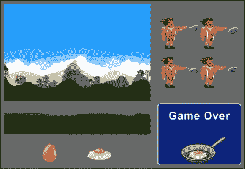
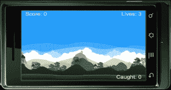
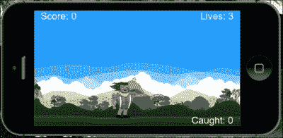
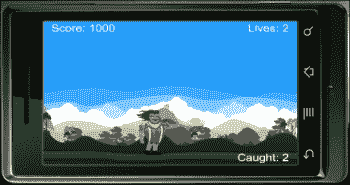
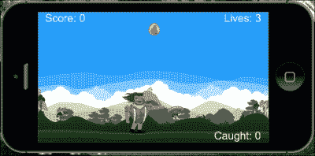
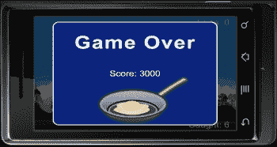

# 第七章：物理现象——下落物体

> *关于如何使用显示对象整合物理引擎，有许多不同的方法。到目前为止，我们已经研究了移除碰撞物体、通过舞台区域移动物体以及通过施加力对抗重力来发射物体等方法，仅举几例。现在，我们将探索另一种允许重力控制环境的机制。我们接下来要创建的游戏涉及下落的物理物体。*

在本章中，我们将：

+   与更多物理实体合作

+   定制身体构建

+   跟踪被捕捉的物体

+   处理碰撞后的事件

+   创建下落的物体

在这一章中，让我们再创建一个有趣简单的游戏。开始行动吧！

# 创建我们的新游戏——蛋落

迄今为止的每一步都教会了我们更多关于 iOS/Android 设备上的游戏开发知识。在这个新的环节中，我们的游戏将包含音效，这将增强游戏中的感官体验。

### 提示

确保你使用的是 Corona SDK 的最新稳定版本。

我们将要创建的新游戏叫做蛋落。玩家控制主角，一个拿着平底锅的伐木工。在游戏过程中，蛋从天空中开始下落，伐木工的工作是用他的平底锅接住鸡蛋，不让它们掉到地上。每个被接住的蛋可以获得 500 分。玩家开始时有三个生命值。当一个蛋没有击中平底锅而是掉到地上时，就会失去一个生命值。当所有三个生命值都失去时，游戏结束。

在开始新的游戏项目时，请确保从`Chapter 7`文件夹中获取`Egg` `Drop`文件。你可以从 Packt Publishing 网站[`www.packtpub.com/`](http://www.packtpub.com/)下载本书附带的工程文件。其中包含了为你构建的所有必要文件，比如`build.settings`、`config.lua`、音频文件以及游戏所需的艺术资源。然后你需要在项目文件夹中创建一个新的`main.lua`文件，再开始编码。



## 初始变量

这将是我们第一个完整的游戏设置，其中充满了显著的 Corona SDK 特性。我们将把我们迄今为止学到的关于变量、显示对象、物理引擎、触摸/加速度计事件和音频的基础知识结合起来。Corona 的许多 API 都易于使用和理解。这表明即使只有基本的编程知识甚至没有编程知识，也能快速学习 Corona。

# 动手操作——设置变量

让我们开始介绍我们将要用来创建游戏的变量。将会有显示对象和整数的组合来进行计数；我们还需要预加载游戏过程中使用的主要音效。按照步骤声明所有必需的变量：

1.  隐藏状态栏并在`display.newGroup()`组中添加名为`gameGroup`的组：

    ```kt
        display.setStatusBar( display.HiddenStatusBar )
        local gameGroup = display.newGroup()
    ```

1.  在游戏中包含外部模块：

    ```kt
        local physics = require "physics"
    ```

1.  添加显示对象：

    ```kt
        local background
        local ground
        local charObject
        local friedEgg
        local scoreText
        local eggText
        local livesText
        local shade
        local gameOverScreen
    ```

1.  添加变量：

    ```kt
        local gameIsActive = false
        local startDrop -- Timer object
        local gameLives = 3
        local gameScore = 0
        local eggCount = 0
        local mRand = math.random
    ```

1.  创建鸡蛋的边界和密度：

    ```kt
        local eggDensity = 1.0
        local eggShape = { -12,-13, 12,-13, 12,13, -12,13 }
        local panShape = { 15,-13, 65,-13, 65,13, 15,13 }
    ```

1.  设置加速度计和音频：

    ```kt
        system.setAccelerometerInterval( 100 )
        local eggCaughtSound = audio.loadSound( "friedEgg.wav" )
        local gameOverSound = audio.loadSound( "gameOver.wav" )
    ```

## *刚才发生了什么？*

我们继续创建类似于 Panda Star Catcher 游戏中变量的设置。通过将它们按组别、显示对象、音频等分类组织，效率会更高。

展示的许多变量都有指定的整数，以满足游戏玩法的目标。这包括像`gameLives` `=` `3`和`eggCount` `=` `0`这样的值。

## 控制主角

加速度计事件最好在游戏的主要范围内工作。它使你能够查看游戏环境的全部，而不必与屏幕上的触摸交互。必要的触摸事件对于像暂停、菜单、播放等用户界面按钮来说是有意义的。

# 动手时间——移动角色

鸡蛋将从天空的不同区域掉落到屏幕上。让我们准备让主角移动到屏幕上所有潜在的区域：

1.  创建一个名为`moveChar()`的新本地函数，并带有`event`参数：

    ```kt
    local moveChar = function(event)
    ```

1.  为角色添加加速度计移动：

    ```kt
      charObject.x = display.contentCenterX - (display.contentCenterX* (event.yGravity*3))
    ```

1.  创建角色在屏幕上移动的边界。这使得角色能够保持在游戏屏幕内，不会超出屏幕外的边界：

    ```kt
      if((charObject.x - charObject.width * 0.5) < 0) then charObject.x = charObject.width * 0.5
      elseif((charObject.x + charObject.width * 0.5) > display.contentWidth) then
      charObject.x = display.contentWidth - charObject.width * 0.5
      end
    end
    ```

## *刚才发生了什么？*

为了让加速度计移动与设备一起工作，我们必须使用`yGravity`。

### 注意

当相应地使用`xGravity`和`yGravity`时，加速度计事件基于竖屏比例。当显示对象被指定为横屏模式时，`xGravity`和`yGravity`的值会交换，以补偿事件正常工作。

注意，在第 3 步的代码中，防止了`charObject`显示对象越过任何墙边界。

## 动手英雄——添加触摸事件

角色目前由加速度计控制。控制角色的另一个选项是通过触摸事件。尝试将事件监听器替换为`"touch"`，并使用事件参数，以便触摸事件正常工作。

如果你记得我们在第三章，*打造我们的第一款游戏 – Breakout*和第四章，*游戏控制*中是如何将挡板移动与 Breakout 游戏结合在一起的，对于模拟器来说，这个过程应该非常相似。

## 更新得分

当更新得分时，它会引用我们的文本显示对象，并将数值转换为字符串。

这是一个示例：

```kt
gameScore = 100
scoreText = display.newText( "Score: " .. gameScore, 0, 0, "Arial", 45 )
scoreText:setTextColor( 1, 1, 1)
scoreText.x = 160; scoreText.y = 100
```

在上一个示例中，你会注意到我们将值`100`设置给了`gameScore`。在接下来的`scoreText`行中，使用了`gameScore`来连接"`Score:` "字符串和`gameScore`的值。这样做可以通过`scoreText`以字符串格式显示`gameScore`的值。

# 动手时间——设置得分

谁不喜欢友好的竞争呢？我们对前面章节中制作的游戏的计分板很熟悉。因此，我们对跟踪得分并不陌生。执行以下步骤来设置得分：

1.  创建一个名为`setScore()`的局部函数，它有一个名为`scoreNum`的参数：

    ```kt
        local setScore = function( scoreNum )
    ```

1.  设置变量以计算得分：

    ```kt
          local newScore = scoreNum
          gameScore = newScore
          if gameScore < 0 then gameScore = 0; end
    ```

1.  当在游戏玩法中获得分数时更新得分，并关闭函数：

    ```kt
          scoreText.text = "Score: " .. gameScore
          scoreText.xScale = 0.5; scoreText.yScale = 0.5
          scoreText.x = (scoreText.contentWidth * 0.5) + 15
          scoreText.y = 15
        end
    ```

## *刚才发生了什么？*

当在任何函数内调用`setScore(scoreNum)`时，它将引用使用`gameScore`变量的所有方法。假设在应用程序开始时`gameScore` `=` `0`，则该值会增加到`gameScore`设置的数量。

在`scoreText.text` `=` `"Score: " .. gameScore`中，`"Score: "`是在游戏过程中在设备上显示的字符串。`gameScore`变量获取赋予变量的当前值并将其显示为字符串。

## 显示游戏环境

为显示对象设置逻辑环境可以帮助玩家想象主角与环境之间的关系。由于我们的主角是伐木工人，将他在一个森林或完全专注于自然的环境中设置是有意义的。

# 动手操作——绘制背景

在本节中，我们将屏幕用环境显示对象填充。这包括我们的背景和地面对象，我们还可以为地面添加物理元素，以便我们可以为其指定碰撞事件。要绘制背景，请执行以下步骤：

1.  创建一个名为`drawBackground()`的局部函数：

    ```kt
        local drawBackground = function()
    ```

1.  添加背景图像：

    ```kt
          background = display.newImageRect( "bg.png", 480, 320 )
          background.x = 240; background.y = 160
          gameGroup:insert( background )
    ```

1.  添加地面元素并创建地面物理边界。关闭函数：

    ```kt
          ground = display.newImageRect( "grass.png", 480, 75 )
          ground.x = 240; ground.y = 325
          ground.myName = "ground"
          local groundShape = { -285,-18, 285,-18, 285,18, -285,18}
          physics.addBody( ground, "static", { density=1.0, bounce=0, friction=0.5, shape=groundShape } )
          gameGroup:insert( ground )
        end
    ```

## *刚才发生了什么？*

`background`和`ground`显示对象被放置在名为`drawBackground()`的函数中。由于我们对一些图像进行了动态缩放，因此使用了`display.newImageRect()`函数。地面显示对象有一个自定义的物理形状，其大小与原始显示对象不同。

我们的`background`对象被居中到设备屏幕区域的尺寸中，并插入到`gameGroup`。

`ground`显示对象被放置在显示区域的底部附近。通过`ground.myName` `=` `"ground"`为其分配一个名称。我们将在后面使用名称`"ground"`来确定碰撞事件。通过`groundShape`为地面创建了一个自定义的物理边界。这使得地面的主体可以影响显示对象的指定尺寸。当初始化`physics.addBody()`时，我们使用了`groundShape`作为形状参数。接下来，将`ground`也设置为`gameGroup`。

## 显示抬头显示器

在游戏中，**抬头显示**（**HUD**）是用于视觉上向玩家传递信息的方法。在许多游戏中，常见的信息包括健康/生命值、时间、武器、菜单、地图等。这使玩家在游戏过程中对当前发生的事情保持警惕。在跟踪生命值时，你希望知道在角色用完继续游戏的机会之前还剩下多少生命值。

# 行动时间——设计 HUD

尽管我们希望玩家的游戏体验愉快，但显示的信息必须与游戏相关，并且要策略性地放置，以免干扰主要游戏区域。因此，在设计 HUD 时，请执行以下步骤：

1.  创建一个名为 `hud()` 的新本地函数：

    ```kt
        local hud = function()
    ```

1.  显示在游戏过程中捕获的鸡蛋的文本：

    ```kt
          eggText = display.newText( "Caught: " .. eggCount, 0, 0, "Arial", 45 )
          eggText:setTextColor( 1, 1, 1 )
          eggText.xScale = 0.5; eggText.yScale = 0.5
          eggText.x = (480 - (eggText.contentWidth * 0.5)) - 15
          eggText.y = 305
          gameGroup:insert( eggText )
    ```

1.  添加跟踪生命值的文本：

    ```kt
          livesText = display.newText( "Lives: " .. gameLives, 0, 0, "Arial", 45 )
          livesText:setTextColor( 1, 1, 1 )--> white
          livesText.xScale = 0.5; livesText.yScale = 0.5  --> for clear retina display text
          livesText.x = (480 - (livesText.contentWidth * 0.5)) - 15
          livesText.y = 15
          gameGroup:insert( livesText )
    ```

1.  添加分数的文本并关闭函数：

    ```kt
          scoreText = display.newText( "Score: " .. gameScore, 0, 0, "Arial", 45 )
          scoreText:setTextColor( 1, 1, 1 )--> white
          scoreText.xScale = 0.5; scoreText.yScale = 0.5  --> for clear retina display text
          scoreText.x = (scoreText.contentWidth * 0.5) + 15
          scoreText.y = 15
          gameGroup:insert( scoreText )
        end
    ```

    

## *刚才发生了什么？*

`eggText` 显示对象可以在屏幕的右下角找到。它在游戏过程中对用户仍然可见，同时又不占据主要焦点。注意 `eggText = display.newText( "Caught: " .. eggCount, 0, 0, "Arial", 45 )` 将在值更新时引用 `eggCount`。

`livesText` 显示对象的设置与 `eggText` 类似。它被放置在屏幕的右上角附近。由于这个对象在游戏中非常重要，它的位置相当突出。它位于一个可以从背景中注意到并且在游戏中可以参考的区域。当 `gameLives` 更新时，`livesText` 显示对象会减少数字。

`scoreText` 的初始设置在 `hud()` 函数中开始。它被放置在屏幕的左上角，与 `livesText` 相对。

## 创建游戏生命值

如果游戏中没有后果，那么完成主要目标就没有紧迫感。为了保持玩家在游戏中的参与度，引入一些具有挑战性的元素将保持竞争性和兴奋感。在游戏中添加后果为玩家创造紧张感，并给他们更多保持生存的动力。

# 行动时间——计算生命值

跟踪游戏中的剩余生命值，让玩家了解游戏结束还有多久。为了计算游戏中剩余的生命值，请执行以下步骤：

1.  设置一个名为 `livesCount()` 的函数：

    ```kt
        local livesCount = function()
    ```

1.  每次生命值减少时，显示生命值的文本：

    ```kt
          gameLives = gameLives - 1
          livesText.text = "Lives: " .. gameLives
          livesText.xScale = 0.5; livesText.yScale = 0.5  --> for clear retina display text
          livesText.x = (480 - (livesText.contentWidth * 0.5)) - 15
          livesText.y = 15
          print(gameLives .. " eggs left")
          if gameLives < 1 then
            callGameOver()
          end
        end
    ```

## *刚才发生了什么？*

`livesCount()`函数是一个单独的函数，用于更新`gameLives`。它确保你注意到`gameLives = gameLives – 1`。这减少了代码开始时实例化的设定值。当`gameLives`的值发生变化时，它通过`livesText`显示更新。在函数末尾使用`print`语句，在终端窗口中跟踪计数。

当`gameLives < 1`时，将调用`callGameOver()`函数，并显示游戏结束元素。

## 动手试试看——为游戏生命值添加图像

目前，游戏在屏幕上使用显示文本来显示游戏进行期间还剩下多少生命值。使 HUD 显示更具吸引力的方法之一是创建/添加与游戏相关的小图标，例如鸡蛋或煎锅。

需要创建三个独立的显示对象，并有序地放置，以便当生命值被扣除时，对象的透明度降低到 0.5。

需要创建一个方法，以便当游戏生命值降至零时，所有三个显示对象都会受到影响。

## 介绍主角

我们的主角将在游戏过程中对每个应用的动作进行动画处理。我们还将创建一个复杂的身体构造，因为其碰撞点的焦点将放在角色持有的物体上，而不是整个身体。

### 复杂身体构造

也可以从多个元素构建身体。每个身体元素都是一个单独的多边形形状，具有自己的物理属性。

由于 Box2D 中的碰撞多边形必须是凸面，因此任何具有凹形状的游戏对象都必须通过附加多个身体元素来构建。

复杂身体的构造函数与简单多边形身体的构造函数相同，不同之处在于它有不止一个身体元素列表：

```kt
physics.addBody( displayObject, [bodyType,] bodyElement1, [bodyElement2, ...] )
```

每个身体元素可能都有自己的物理属性，以及其碰撞边界的形状定义。以下是一个示例：

```kt
local hexagon = display.newImage("hexagon.png")
hexagon.x = hexagon.contentWidth
hexagon.y = hexagon.contentHeight
hexagonShape = { -20,-40, 20, -40, 40, 0, 20,40, -20,40, -40,0 }
physics.addBody( hexagon, "static", { density = 1.0, friction = 0.8, bounce = 0.3, shape=hexagonShape } )
```

与更简单的情况一样，`bodyType`属性是可选的，如果没有指定，将默认为`"dynamic"`。

# 动手操作——创建角色

主角是用一个精灵表创建的，需要设置以查看它提供的动画。其他将出现的显示图像包括当与物理对象发生碰撞时出现的破裂鸡蛋。要创建角色，请执行以下步骤：

1.  创建一个名为`createChar()`的新局部函数：

    ```kt
        local createChar = function()
    ```

1.  为主角创建精灵表：

    ```kt
    local sheetData = { width=128, height=128, numFrames=4, sheetContentWidth=256, sheetContentHeight=256 }
    local sheet = graphics.newImageSheet( "charSprite.png", sheetData )

        local sequenceData = 
        {
          { name="move", start=1, count=4, time=400 } 
        }

        charObject = display.newSprite( sheet, sequenceData )
        charObject:setSequence("move")
        charObject:play()
    ```

1.  设置主角的起始位置和物理属性：

    ```kt
        charObject.x = 240; charObject.y = 250
        physics.addBody( charObject, "static", { density=1.0, bounce=0.4, friction=0.15, shape=panShape } )
        charObject.rotation = 0
        charObject.isHit = false -- When object is not hit
        charObject.myName = "character"
    ```

1.  在鸡蛋发生碰撞后添加过渡图像：

    ```kt
        friedEgg = display.newImageRect( "friedEgg.png", 40, 23 )
        friedEgg.alpha = 1.0
        friedEgg.isVisible = false
        gameGroup:insert( charObject )
        gameGroup:insert( friedEgg )
      end
    ```

    

## *刚才发生了什么？*

所引用的图像集被称为`sheetData`，它从`"charSprite.png"`中获取前`4`帧动画。我们创建了一个名为`"move"`的动画集。每次调用`"move"`时，都会从第`1`帧开始播放，每`400`毫秒播放从开始的前`4`帧。

主显示对象称为`charObject`，它具有`sheetData`的特征。当它调用`setSequence("move")`时，执行`play()`命令时会播放该动画序列。

对角色物理身体的一个重要更改是，它的主要碰撞点将指向动画中使用的煎锅。角色身体上的任何碰撞检测都不会被读取。`charObject`显示对象被赋予一个名为`"character"`的名字，这将用于检测与掉落鸡蛋的碰撞。

我们还在这个函数中放置了煎蛋，为碰撞做准备。

## 添加后碰撞

我们要确保当一个对象与另一个对象交互后，紧接着就会发生一个事件类型。在碰撞后的瞬间，我们可以确认两个对象之间的碰撞力。这有助于我们确定被销毁的对象是受到一定力量的完全撞击。

### 碰撞处理

请注意您处理 Box2D 物理引擎的方式。如果 Corona 代码在碰撞过程中尝试修改仍在碰撞中的对象，Box2D 将会崩溃，因为 Box2D 仍在对它们进行迭代数学计算。

为了防止碰撞检测时立即发生崩溃，不要让碰撞立即发生。

在碰撞过程中，请勿修改/创建/销毁物理对象，以防止程序崩溃。

如果您需要在碰撞后修改/创建/销毁一个对象，您的碰撞处理程序应设置一个标志或添加一个时间延迟，以便稍后使用`timer.performWithDelay()`进行更改。

## 刚体属性

许多原生的 Box2D 方法已经被简化为显示对象的点属性。以下示例显示，一个名为`newBody`的刚体是使用其中一个构造方法创建的。

### body.isAwake

这是一个表示当前唤醒状态的布尔值。默认情况下，当所有刚体在几秒钟内没有交互时，它们会自动*进入* *休眠*状态。刚体停止模拟，直到某种碰撞或其他交互唤醒它们。

这是一个示例：

```kt
newBody.isAwake = true
local object = newBody.isAwake
```

### body.isBodyActive

这是一个表示刚体激活状态的布尔值。非激活状态的刚体不会被销毁，但它们会从模拟中移除，并停止与其他刚体的交互。

这是一个示例：

```kt
newBody.isBodyActive = true
local object = newBody.isBodyActive
```

### body.isBullet

这是一个将刚体视为*子弹*的布尔值。子弹将受到连续碰撞检测。默认值为`false`。

这是一个示例：

```kt
newBody.isBullet = true
local object = newBody.isBullet
```

### body.isSensor

这是一个布尔属性，用于设置整个物体中的`isSensor`属性。传感器可以穿过其他物体而不是反弹，但能检测到一些碰撞。这个属性作用于所有物体元素，并将覆盖元素本身的任何`isSensor`设置。

这是一个示例：

```kt
newBody.isSensor = true
```

### body.isSleepingAllowed

这是一个布尔值，用于设置一个物体是否允许进入休眠状态。醒着的物体在比如倾斜重力的情况下很有用，因为休眠的物体不会对全球重力变化做出反应。默认值为`true`。

这是一个示例：

```kt
newBody.isSleepingAllowed = true
local object = newBody.isSleepingAllowed
```

### body.isFixedRotation

这是一个布尔值，用于设置一个物体的旋转是否应该被锁定，即使物体即将加载或受到偏心力的作用。默认值为`false`。

这是一个示例：

```kt
newBody.isFixedRotation = true
local object = newBody.isFixedRotation
```

### body.angularVelocity

这是当前旋转速度的值，单位为每秒度数。

这是一个示例：

```kt
newBody.angularVelocity = 50
local myVelocity = newBody.angularVelocity
```

### body.linearDamping

这是用于控制物体线性运动阻尼的值。这是角速度随时间减少的速率。默认值为零。

这是一个示例：

```kt
newBody.linearDamping = 5
local object = newBody.linearDamping
```

### body.angularDamping

这是用于控制物体旋转阻尼的值。默认值为零。

这是一个示例：

```kt
newBody.angularDamping = 5
local object = newBody.angularDamping
```

### body.bodyType

这是一个字符串值，用于设置模拟的物理物体的类型。可用的值有`"static"`、`"dynamic"`和`"kinematic"`，具体解释如下：

+   `static`（静止）物体不会移动也不会相互影响。静止物体的例子包括地面或迷宫的墙壁。

+   `dynamic`（动态）物体受重力影响，也会与其他类型的物体发生碰撞。

+   `kinematic`（运动学）物体受力影响但不受重力影响。那些可拖动的物体在拖动事件期间应该被设置为`"kinematic"`。

默认的物体类型是`"dynamic"`。

这是一个示例：

```kt
newBody.bodyType = "kinematic"
local currentBodyType = newBody.bodyType
```

# 行动时间——创建鸡蛋碰撞

在我们之前创建的示例游戏中已经处理过碰撞。处理碰撞后的事件需要引入力来完成碰撞后的动作：

1.  创建一个名为`onEggCollision()`的新局部函数，它有两个参数，分别名为`self`和`event`：

    ```kt
        local onEggCollision = function( self, event )
    ```

1.  当力大于`1`时创建一个`if`语句，并包含`not` `self.isHit`。加入`eggCaughtSound`音效：

    ```kt
          if event.force > 1 and not self.isHit then
            audio.play( eggCaughtSound )
    ```

1.  使`self`变得不可见且不活跃，并用`friedEgg`显示对象替换它：

    ```kt
            self.isHit = true
            print( "Egg destroyed!")
            self.isVisible = false
            friedEgg.x = self.x; friedEgg.y = self.y
            friedEgg.alpha = 0
            friedEgg.isVisible = true
    ```

1.  创建一个函数，通过使用`onComplete`命令将`friedEgg`显示对象过渡并使其在舞台上淡出：

    ```kt
            local fadeEgg = function()
              transition.to( friedEgg, { time=500, alpha=0 } )
            end
            transition.to( friedEgg, { time=50, alpha=1.0, onComplete=fadeEgg } )
            self.parent:remove( self )
            self = nil
    ```

1.  使用`if event.other.myName == "character"`，当主角接住鸡蛋时更新`eggCount`。并且，每次碰撞增加`gameScore` `500`分。如果鸡蛋掉到地上，使用`elseif event.other.myName == "ground"`并通过`livesCount()`减少生命值：

    ```kt
            if event.other.myName == "character" then
              eggCount = eggCount + 1
              eggText.text = "Caught: " .. eggCount
              eggText.xScale = 0.5; eggText.yScale = 0.5  --> for clear retina display text
              eggText.x = (480 - (eggText.contentWidth * 0.5)) - 15
              eggText.y = 305
              print("egg caught")
              local newScore = gameScore + 500
              setScore( newScore )
            elseif event.other.myName == "ground" then
              livesCount()
              print("ground hit")
            end
          end
        end
    ```

    

## *刚才发生了什么？*

使用 `onEggCollision( self, event )` 函数，我们通过 `if` 语句设置条件为 `event.force > 1` 且 `not self.isHit`。当两个语句都返回 `true` 时，播放鸡蛋的声音效果。碰撞发生后，从天空中落下的初始鸡蛋从场景中移除，并在同一位置使用 `friedEgg` 显示对象替换，通过 `friedEgg.x = self.x; friedEgg.y = self.y` 实现。

`fadeEgg()` 函数通过 `transition.to( eggCrack, { time=50, alpha=1.0, onComplete=fadeCrack } )` 在 `50` 毫秒内使新替换的鸡蛋对象出现，然后通过 `onComplete` 命令，使用 `transition.to( eggCrack, { time=500, alpha=0 } )` 将对象返回到不可见状态。

当从 `event.other.myName` 调用 `"character"` 名称时，分配给该名称的每次碰撞都会使 `eggCount + 1`。因此，`eggText` 使用 `eggCount` 的值进行更新。`setScore( newScore )` 语句在每次与 `"character"` 发生碰撞时将分数增加 `500`。当与 `"ground"` 发生碰撞时，调用 `livesCount()` 函数，该函数将生命值减去 `1`。

## 使显示对象下落

我们将通过学习如何将物理对象添加到场景中，并让它们在游戏中的随机区域下落，来应用主要资源（鸡蛋对象）。物理引擎将考虑我们为鸡蛋显示对象创建的动态物理体。

# 行动时间——添加鸡蛋对象

想象一个充满下落鸡蛋的世界。这并不完全现实，但在这个游戏中，我们将创建这个元素。至少，我们将确保重力和现实世界物理被应用。要添加鸡蛋对象，请执行以下步骤：

1.  创建一个名为 `eggDrop()` 的新本地函数：

    ```kt
        local eggDrop = function()
    ```

1.  添加 `egg` 显示对象的属性：

    ```kt
          local egg = display.newImageRect( "egg.png", 26, 30 )
          egg.x = 240 + mRand( 120 ); egg.y = -100
          egg.isHit = false
          physics.addBody( egg, "dynamic",{ density=eggDensity, bounce=0, friction=0.5, shape=eggShape } )
          egg.isFixedRotation = true
          gameGroup:insert( egg )
    ```

1.  为 `egg` 显示对象添加 `postCollision` 事件：

    ```kt
          egg.postCollision = onEggCollision
          egg:addEventListener( "postCollision", egg )
        end
    ```

    

## *刚才发生了什么？*

我们用 `240 + mRand( 120 )` 设置了 `egg` 的 `x` 值。`mRand` 函数等于 `math.random`，这将允许鸡蛋在从 *x* 方向的 50 开始的 `120` 像素区域内随机位置出现。

确保在碰撞事件正确应用时 `egg.isHit = false` 是至关重要的。物理体设置为 `"dynamic"` 以便它对重力作出反应并使对象下落。我们创建的鸡蛋有一个自定义的密度和形状，这在代码开始时就已经设置好了。

为了让碰撞生效，最后一个重要的细节是使用 `egg.postCollision = onEggCollision` 将 `egg` 对象添加到 `onEggCollision()` 函数中，然后让事件监听器通过 `egg:addEventListener( "postCollision", egg )` 使用 `"postCollision"` 事件。

# 行动时间——使鸡蛋降落

我们将执行鸡蛋的计时器，以便它们可以开始在屏幕上降落。要使鸡蛋降落，请执行以下步骤：

1.  创建一个名为`eggTimer()`的局部函数，并使用`timer.performWithDelay`每 1 秒（1000 毫秒）重复投放一个鸡蛋。使用`eggDrop()`来激活下落：

    ```kt
        local eggTimer = function()
          startDrop = timer.performWithDelay( 1000, eggDrop, 0 )
        end
    ```

1.  在`onEggCollision()`函数的第一个`if`语句内，使用`timerID`和`startDrop`变量取消计时器。然后添加`if gameLives < 1`语句以停止鸡蛋下落：

    ```kt
          if gameLives < 1 then
            timer.cancel( startDrop )
            print("timer cancelled")
          end
    ```

## *刚才发生了什么？*

为了让鸡蛋从天空中开始下落，我们创建了一个名为`eggTimer()`的函数。它通过`startDrop = timer.performWithDelay( 1000, eggDrop, 0 )`每隔 1000 毫秒（1 秒）无限次地激活`eggDrop()`函数，让一个鸡蛋下落。

回到`onEggCollision()`，我们要检查`gameLives`是否已经小于`1`。当这个语句为真时，鸡蛋将停止下落。这是通过`timer.cancel( startDrop )`实现的。我们在`eggTimer()`中设置的`timerID`就是`startDrop`。

## 结束游戏玩法

每个游戏的开始总有一个结局，无论是简单的*胜利*或*失败*，还是仅仅是一个*游戏结束*；所有这些都给玩家一个结束感。通知玩家这些事件很重要，这样他们才能反思所获得的成就。

# 行动时间——调用游戏结束

我们将确保当游戏结束显示屏幕弹出时，当前正在移动的任何显示对象停止移动，并且事件监听器被停用。除了我们的游戏结束屏幕的视觉显示外，我们还将添加一个声音通知，这将帮助触发事件。要结束游戏，请执行以下步骤：

1.  创建一个名为`callGameOver()`的新局部函数，并将其放在`setScore()`函数之后，`drawBackground()`函数之前：

    ```kt
        local callGameOver = function()
    ```

1.  当游戏结束显示弹窗时引入声音效果。将`gameIsActive`设置为`false`并在游戏中暂停物理效果：

    ```kt
          audio.play( gameOverSound )
          gameIsActive = false
          physics.pause()
    ```

1.  创建一个覆盖当前背景的阴影：

    ```kt
          shade = display.newRect( 0, 0, 570, 320 )
          shade:setFillColor( 0, 0, 0 )
          shade.x = 240; shade.y = 160
          shade.alpha = 0  -- Getting shade ready to display at game end
    ```

1.  显示游戏结束窗口并重申最终得分：

    ```kt
          gameOverScreen = display.newImageRect( "gameOver.png", 400, 300 )
          local newScore = gameScore
          setScore( newScore )
          gameOverScreen.x = 240; gameOverScreen.y = 160
          gameOverScreen.alpha = 0
          gameGroup:insert( shade )
          gameGroup:insert( gameOverScreen )
          transition.to( shade, { time=200, alpha=0.65 } )
          transition.to( gameOverScreen, { time=500, alpha=1 } )
    ```

1.  在游戏结束屏幕上显示得分：

    ```kt
          scoreText.isVisible = false
          scoreText.text = "Score: " .. gameScore
          scoreText.xScale = 0.5; scoreText.yScale = 0.5  --> for clear retina display text
          scoreText.x = 240
          scoreText.y = 160
          scoreText:toFront()  -- Moves to front of current display group
          timer.performWithDelay( 0,
            function() scoreText.isVisible = true; end, 1 )
        end
    ```

    

## *刚才发生了什么？*

我们的`gameOver()`函数触发了我们在代码开始时预加载的`gameOverSound`声音效果。我们确保通过`gameIsActive = false`禁用任何事件，比如加速度计的运动。

在这个时候，我们的显示对象元素会出现在`shade`、`gameOverScreen`和`scoreText`中。

如果你注意到，当游戏玩法结束时，`scoreText`通过`scoreText.isVisible = false`消失，然后在屏幕的另一区域使用`timer.performWithDelay( 0, function() scoreText.isVisible = true; end, 1 )`重新出现。

## 开始游戏

我们将激活所有剩余的函数，并让它们相应地运行。

# 行动时间——激活游戏

所有游戏玩法元素设置好后，是时候通过以下步骤启动应用程序了：

1.  创建一个名为`gameActivate()`的新局部函数，并插入`gameIsActive = true`。将此函数放在`moveChar()`函数上方：

    ```kt
        local gameActivate = function()
          gameIsActive = true
        end
    ```

1.  通过创建一个名为`gameStart()`的新函数来初始化所有游戏动作：

    ```kt
        local gameStart = function()
    ```

1.  启动物理属性并为下落物体设置重力：

    ```kt
          physics.start( true )
          physics.setGravity( 0, 9.8 )
    ```

1.  激活所有实例化的函数。为`charObject`添加事件监听器，使用`"accelerometer"`事件监听`moveChar()`函数：

    ```kt
          drawBackground()
          createChar()
          eggTimer()
          hud()
          gameActivate()
          Runtime:addEventListener("accelerometer", moveChar)
        end
    ```

1.  实例化`gameStart()`函数并返回`gameGroup`组：

    ```kt
        gameStart()
        return gameGroup
    ```

## *刚才发生了什么？*

如果你记得，在我们的代码开始时，我们设置了`gameIsActive = false`。现在我们将通过`gameActivate()`函数改变这个状态，使`gameIsActive = true`。我们让`gameStart()`函数应用所有初始游戏元素。这包括物理引擎和重力的启动。同时，我们取所有函数的余数并初始化它们。

一旦所有函数被激活，需要返回`gameGroup`，以便在游戏进行时显示所有显示对象。

为了确保你的显示对象的物理对象边界位于正确位置，在`gameStart()`函数中使用`physics.setDrawMode( "hybrid" )`。

## 小测验 - 动画图形

问题 1. 什么可以检索或设置文本对象的文本字符串？

1.  `object.text`

1.  `object.size`

1.  `object:setTextColor()`

1.  以上都不是

问题 2. 什么函数将任何参数转换成字符串？

1.  `tonumber()`

1.  `print()`

1.  `tostring()`

1.  `nil`

问题 3. 哪种体型受到重力和与其他体型碰撞的影响？

1.  动态

1.  动力学

1.  静态

1.  以上都不是

# 总结

我们的应用程序的游戏玩法构建现在已完成。现在我们熟悉了使用物理引擎的各种方式，这表明使用 Box2D 设计涉及物理体的其他游戏是多么容易。

我们现在对以下内容有了更好的了解：

+   应用动态和静态物理体的使用

+   为我们的显示对象的物理属性构建自定义形状

+   使用给定变量的值跟踪捕获的对象数量

+   使用后碰撞来切换图像

在下一章中，我们将通过使用 Composer API 创建多功能菜单屏幕来完成游戏体验。你还将学习如何添加暂停动作，保存高分以及了解有关数据保存和卸载文件更多信息。

使用 Corona SDK 帮助我们以最少的时间设计和开发游戏。让我们继续为我们的游戏添加最后的润色！
