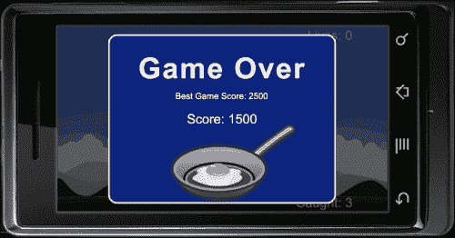
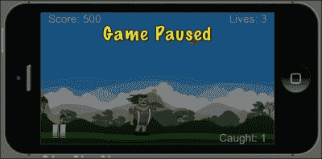
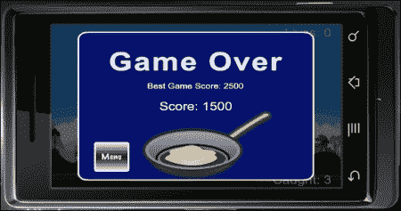
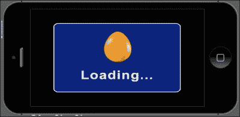
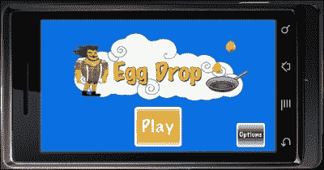
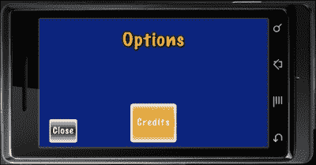

# 第八章：操作编排器

> *我们已经将游戏 Egg Drop 进行了探索，创建了游戏物理以反应碰撞检测并跟踪其他有用的数据，如生命值和积分系统。我们还处理了自定义物理实体，并为我们的显示对象创建了名称，这些名称适用于游戏分数计数。*

接下来，我们将添加一个菜单系统，其中包括游戏介绍，游戏中应用暂停菜单，并在游戏结束时保存高分。

我们正在完成一个应用程序，它具备了发布到 App Store 和 Google Play Store 所需的必要元素。

在本章中，我们将：

+   保存和加载高分

+   添加暂停菜单

+   使用 Composer API 管理场景

+   添加加载屏幕

+   添加主菜单、选项菜单和制作人员屏幕

那么，让我们开始吧！

# 继续鸡蛋掉落游戏（Egg Drop）

我们已经完成了 Egg Drop 的主要游戏部分，作为我们应用程序的基础。现在，是时候让我们加入如何在游戏中途暂停动作以及保存高分的方法了。我们还将添加一些新场景，帮助我们轻松快速地介绍和过渡到游戏。

在`第八章`的`Resources`文件夹中，获取所有图像和文件资源，并将它们复制到当前的`Egg Drop`项目文件夹中。你可以从 Packt Publishing 网站下载伴随这本书的项目文件。我们将使用这些文件为我们的游戏添加最后的润色。

# 数据保存

保存文件信息在游戏开发的许多方面都有应用。我们用它来保存高分和游戏设置，如声音开关、锁定/解锁关卡等。这些功能并非必须，但既然它们很好，也许你希望在应用程序中包含它们。

在 Corona SDK 中，应用程序是沙盒化的；这意味着你的文件（应用程序图片、数据和个人偏好设置）存储在一个其他应用程序无法访问的位置。你的文件将驻留在特定于应用程序的目录中，用于文档、资源或临时文件。这个限制与你在 Mac 或 PC 上编程时的文件有关，而不是设备上的文件。

## BeebeGames 类用于保存和加载值

我们将使用由 Jonathan Beebe 创建的 BeebeGames 类。它提供了许多简单且实用的游戏功能。其中一些值得注意的功能包括一种简单保存和加载数据的方法，我们可以将其加入到我们的游戏中。关于 BeebeGames 类的更多文档可以在`第八章`文件夹中找到。

### 注意

你还可以参考[`github.com/lewisNotestine/luaCorona/blob/master/justATest/code/beebegames.lua`](https://github.com/lewisNotestine/luaCorona/blob/master/justATest/code/beebegames.lua)，以跟踪类的更新。

如果你想将来使用它们，可以查看其他与动画、过渡、定时器等相关的方法。现在，我们将专注于可以使用这些方法轻松地为我们的游戏保存和加载值。

下面是一个保存和加载值的示例：

```kt
-- Public Method: saveValue() --> save single-line file (replace contents)

function saveValue( strFilename, strValue )
  -- will save specified value to specified file
  local theFile = strFilename
  local theValue = strValue

  local path = system.pathForFile( theFile, system.DocumentsDirectory)

  -- io.open opens a file at path. returns nil if no file found
  -- "w+": update mode, all previous data is erased
  local file = io.open( path, "w+" )
  if file then
  -- write game score to the text file
  file:write( theValue )
  io.close( file )
  end
end

-- Public Method: loadValue() --> load single-line file and store it into variable

function loadValue( strFilename )
  -- will load specified file, or create new file if it doesn't exist

  local theFile = strFilename

  local path = system.pathForFile( theFile, system.DocumentsDirectory)

  -- io.open opens a file at path. returns nil if no file found
  -- "r": read mode
  local file = io.open( path, "r" )
  if file then
    -- read all contents of file into a string
    -- "*a": reads the whole file, starting at the current position
    local contents = file:read( "*a" )
    io.close( file )
    return contents
  else
    -- create file b/c it doesn't exist yet
    -- "w": write mode
    file = io.open( path, "w" )
    file:write( "0" )
    io.close( file )
    return "0"
  end
end
```

## 获取文件的路径

这些文件的路径对于你的应用程序来说是唯一的。要创建文件路径，你可以使用`system.pathForFile`函数。这个函数会生成一个绝对路径到应用程序的图标文件，以应用程序的资源目录作为`Icon.png`的基础目录：

```kt
local path = system.pathForFile( "Icon.png", system.ResourceDirectory)
```

通常，你的文件必须位于三个可能的基础目录之一：

+   `system.DocumentsDirectory`：这应该用于需要在应用程序会话之间持久存在的文件。

+   `system.TemporaryDirectory`：这是一个临时目录。写入这个目录的文件不能保证在后续的应用程序会话中存在。它们可能存在，也可能不存在。

+   `system.ResourceDirectory`：这是所有应用程序资源的目录。注意，你不应该在这个目录中创建、修改或添加文件。

### 注意

关于文件的更多信息可以在[`docs.coronalabs.com/api/library/system/index.html`](http://docs.coronalabs.com/api/library/system/index.html)找到。

## 读取文件

要读取文件，使用`io`库。这个库允许你管理文件，给定一个绝对路径。

## 写入文件

要写入文件，你可以按照很多与读取文件相同的步骤进行。不同的是，你不是使用读取方法，而是将数据（字符串或数字）写入文件。

# 是时候行动了——保存和加载最高分

当**游戏结束**屏幕显示时，我们将保存并加载最终得分和最高分值。为此，执行以下步骤：

1.  打开为 Egg Drop 创建的`main.lua`文件。我们将继续使用同一个文件，并添加更多代码以及对游戏的新的修改。

1.  在代码顶部，所有其他初始化变量的位置加入两个新的变量，`local highScoreText`和`local highScore`：

    ```kt
    local highScoreText
    local highScore
    ```

1.  在预加载的音频文件后引入`saveValue()`函数：

    ```kt
      local saveValue = function( strFilename, strValue )
        -- will save specified value to specified file
        local theFile = strFilename
        local theValue = strValue

        local path = system.pathForFile( theFile, system.DocumentsDirectory )

        -- io.open opens a file at path. returns nil if no file found
        local file = io.open( path, "w+" )
        if file then
          -- write game score to the text file
          file:write( theValue )
          io.close( file )
        end
      end
    ```

1.  加入`loadValue()`函数：

    ```kt
      local loadValue = function( strFilename )
        -- will load specified file, or create new file if it doesn't exist

        local theFile = strFilename

        local path = system.pathForFile( theFile, system.DocumentsDirectory )

        -- io.open opens a file at path. returns nil if no file found
        local file = io.open( path, "r" )
        if file then
          -- read all contents of file into a string
          local contents = file:read( "*a" )
          io.close( file )
          return contents
         else
          -- create file b/c it doesn't exist yet
          file = io.open( path, "w" )
          file:write( "0" )
          io.close( file )
           return "0"
        end
      end
    ```

1.  在`callGameOver()`函数的最后，创建一个`if`语句来比较`gameScore`和`highScore`。使用`saveValue()`函数保存最高分：

    ```kt
        if gameScore > highScore then
          highScore = gameScore
          local highScoreFilename = "highScore.data"
          saveValue( highScoreFilename, tostring(highScore) )
        end
    ```

1.  接下来，在同一个`callGameOver()`函数中加入`highScoreText`显示文本，以便在游戏结束时显示最高分：

    ```kt
        highScoreText = display.newText( "Best Game Score: " .. tostring( highScore ), 0, 0, "Arial", 30 )
        highScoreText:setTextColor( 1, 1, 1 )	
        highScoreText.xScale = 0.5; highScoreText.yScale = 0.5
        highScoreText.x = 240
        highScoreText.y = 120

        gameGroup:insert( highScoreText )
    ```

1.  在`gameStart()`函数的最后，使用`loadValue()`函数加载最高分：

    ```kt
          local highScoreFilename = "highScore.data"
          local loadedHighScore = loadValue( highScoreFilename )

          highScore = tonumber(loadedHighScore)
    ```

    

## *刚才发生了什么？*

在游戏级别初始化了`saveValue()`和`loadValue()`函数后，我们创建了一个`if`语句来比较`gameScore`（游戏进行时的当前得分）和`highScore`（迄今为止获得过的最高得分）。当`gameScore`的结果更高时，它就会替换保存的`highScore`数据。

为了保存这个值，需要创建一个数据文件。我们创建了一个名为`local highScoreFilename = "highscore.data"`的变量。我们使用`highScoreFilename`作为参数调用了`saveValue()`函数。`tostring(highScore)`参数会将`highScore`的数值转换为字符串。

当**游戏结束**屏幕可见时，`highScoreText`会显示从`highScore`保存的值，位于达到的`gameScore`上方。添加高分可以激励玩家争取最高分，并增加游戏的重复可玩性。

在`gameStart()`函数中，重要的是要在游戏开始时加载`highScore.data`的值。使用我们创建的用来保存`highScore`的同一个数据文件，我们也可以在游戏中加载这个值。为了加载这个值，`local highScore`调用`loadValue(highScoreFileName)`。这会从`highScore.data`获取信息。为了得到这个值，`tonumber(loadedHighScore)`将其从字符串转换为整数，并可以用来显示`highScore`的值。

# 暂停游戏

你是否曾在玩游戏时突然需要去洗手间或者手抽筋？显然，这些情况都需要你暂时将注意力从游戏进度上转移，并且需要暂时停止当前动作来处理这些需求。这时暂停按钮就显得非常方便，这样你就可以在那一刻停止动作，并在准备好再次游戏时从停止的地方继续。

# 动作时间——暂停游戏

这不仅仅是制作一个按钮；还包括通过执行以下步骤暂停屏幕上的所有动作，包括物理效果和计时器：

1.  在代码开始部分初始化其他变量时，添加`local pauseBtn`和`local pauseBG`变量。在脚本顶部`gameOverSound`之后预加载`btnSound`音频：

    ```kt
    -- Place near other game variables
    local pauseBtn
    local pauseBG

    -- Place after gameOverSound
    local btnSound = audio.loadSound( "btnSound.wav" )
    ```

1.  在`hud()`函数内，在`scoreText`部分之后创建另一个函数，用于运行暂停按钮的事件。调用`onPauseTouch(event)`函数。通过将`gameIsActive`设置为`false`来暂停游戏中的物理效果，并让暂停元素在屏幕上显示：

    ```kt
        local onPauseTouch = function( event )
          if event.phase == "release" and pauseBtn.isActive then
            audio.play( btnSound )

            -- Pause the game

            if gameIsActive then

              gameIsActive = false
              physics.pause()

              local function pauseGame()
                timer.pause( startDrop )
                print("timer has been paused")
              end
              timer.performWithDelay(1, pauseGame)

              -- SHADE
              if not shade then
                shade = display.newRect( 0, 0, 570, 380 )
                shade:setFillColor( 0, 0, 0 )
                shade.x = 240; shade.y = 160
                gameGroup:insert( shade )
              end
              shade.alpha = 0.5

              -- SHOW MENU BUTTON
              if pauseBG then
                pauseBG.isVisible = true
                pauseBG.isActive = true
                pauseBG:toFront()
              end

              pauseBtn:toFront()
    ```

1.  当游戏取消暂停时，让物理效果再次激活，并移除所有暂停显示对象：

    ```kt
              else

                if shade then
                  display.remove( shade )
                  shade = nil
                end

                if pauseBG then
                  pauseBG.isVisible = false
                  pauseBG.isActive = false
                end

                gameIsActive = true
                physics.start()

                local function resumeGame()
                timer.resume( startDrop )
                print("timer has been resumed")
              end
              timer.performWithDelay(1, resumeGame)

            end
          end
        end
    ```

1.  在`onPauseTouch()`函数后添加`pauseBtn` UI 按钮和`pauseBG`显示对象：

    ```kt
        pauseBtn = ui.newButton{
          defaultSrc = "pausebtn.png",
          defaultX = 44,
          defaultY = 44,
          overSrc = "pausebtn-over.png",
          overX = 44,
          overY = 44,
          onEvent = onPauseTouch,
          id = "PauseButton",
          text = "",
          font = "Helvetica",
          textColor = { 255, 255, 255, 255 },
          size = 16,
          emboss = false
        }

        pauseBtn.x = 38; pauseBtn.y = 288
        pauseBtn.isVisible = false
        pauseBtn.isActive = false

        gameGroup:insert( pauseBtn )

        pauseBG = display.newImageRect( "pauseoverlay.png", 480, 320 )
        pauseBG.x = 240; pauseBG.y = 160
        pauseBG.isVisible = false
        pauseBG.isActive = false

        gameGroup:insert( pauseBG )
    ```

1.  为了让`pauseBtn`在游戏过程中显示，需要在`gameActivate()`函数中使其可见并激活：

    ```kt
        pauseBtn.isVisible = true
        pauseBtn.isActive = true
    ```

1.  游戏结束时，在`callGameOver()`函数中禁用`pauseBtn`，将代码放在`physics.pause()`行之后：

    ```kt
        pauseBtn.isVisible = false
        pauseBtn.isActive = false
    ```

    

## *刚才发生了什么？*

我们创建了`onPauseTouch(event)`函数，以控制游戏过程中发生的所有暂停事件。为了暂停游戏中的所有动作，我们将`gameIsActive`的布尔值改为`false`，并使用`physics.pause()`函数停止所有正在下落的鸡蛋。接下来，`startDrop`的计时器暂停，只要暂停功能仍然有效，从天空中下落的鸡蛋就不会随时间累积。

当按下暂停按钮时，会出现一个名为`shade`的略微透明的覆盖层。这将分散玩家对游戏场景的注意力，并让用户区分游戏是否处于非活动状态。

**游戏暂停**横幅也会在屏幕顶部显示，通过设置为可见和活动状态。`pauseBG`对象通过`pauseBG:toFront()`被推到显示层次结构的前面。

为了取消暂停游戏，我们反向执行了暂停显示项出现的过程。当`pauseBtn`第二次被按下时，通过`display.remove(shade); shade = nil`移除`shade`。`pauseBG.isVisible`和`pauseBG.isActive`属性都被设置为`false`。

记住我们之前将`gameIsActive`设置为`false`，现在是将它设回`true`的时候了。这也意味着通过`physics.start()`恢复物理效果。计时器通过`resumeGame()`本地函数恢复，并在函数中调用`timer.resume(startDrop)`。

`pauseBtn`和`pauseBG`显示对象被插入到`if`语句块的末尾。一旦游戏可以玩，`pauseBtn`对象就会显示为可见和活动状态。当**游戏结束**屏幕出现时，它是不可见和非活动的，这样当游戏结束时就不会有其他触摸事件干扰。

# Composer API

Composer API 为开发者提供了一个简单的解决方案，用于控制具有或不具有过渡效果的场景。这是一个很棒的场景管理库，可以显示菜单系统，甚至管理游戏中的多个关卡。Composer 还附带多种过渡效果。更多信息可以在 Corona 文档中找到，地址是[`docs.coronalabs.com/api/library/composer/index.html`](http://docs.coronalabs.com/api/library/composer/index.html)。

我们的场景管理与在[`docs.coronalabs.com/api/library/composer/index.html#scene-template`](http://docs.coronalabs.com/api/library/composer/index.html#scene-template)展示的场景模板相似。

## 使用 Composer API 进行游戏开发

你可能会好奇我们如何将 Composer 应用于 Egg Drop。这真的很简单。我们只需修改游戏代码中的一些行，使其与 Composer 兼容，并为游戏开始前应用的菜单系统创建一些新场景。

# 动手时间——修改游戏文件

我们将当前的`main.lua`文件重命名为`maingame.lua`，并在游戏代码中添加一些额外的行。确保在`Egg Drop`项目文件夹中*更改*文件名。按照以下步骤重命名文件：

1.  删除代码顶部附近的以下行。我们将在本章后面创建的另一个场景中隐藏状态栏。`gameGroup`显示组将被修改以适应 Composer 参数：

    ```kt
    display.setStatusBar( display.HiddenStatusBar )
    local gameGroup = display.newGroup()
    ```

1.  在代码的最顶部，通过添加`local composer = require( "composer" )`和`local scene = composer.newScene()`来实现 Composer，这样我们就可以调用场景事件：

    ```kt
    local composer = require( "composer" )
    local scene = composer.newScene()
    ```

1.  在`local loadValue = function( strFilename )`之后，在`create()`事件中添加。我们还将重新添加我们的`gameGroup`显示组，但位于场景的 view 属性下。同时，加入`composer.removeScene( "loadgame" )`。本章后面将介绍`"loadgame"`场景：

    ```kt
    -- Called when the scene's view does not exist:
    function scene:create ( event )
      local gameGroup = self.view

      -- completely remove loadgame's view
      composer.removeScene( "loadgame" )

      print( "\nmaingame: create event")
    end
    ```

1.  在`create()`事件之后，创建`show()`事件，并将其放在`gameActivate()`函数之前。`show()`事件将过渡我们所有的游戏玩法功能到屏幕上。同时，也将`gameGroup`包含在场景的 view 属性中：

    ```kt
    -- Called immediately after scene has moved onscreen:
    function scene:show( event )
      local gameGroup = self.view
    ```

1.  在`gameStart()`函数之后，删除`return gameGroup`行：

    ```kt
    return gameGroup -- Code will not run if this line is not removed 
    ```

1.  接下来，用`end`关闭`function scene: show( event )`：

    ```kt
      print( "maingame: show event" )

    end
    ```

1.  创建`hide()`和`destroy()`事件：

    ```kt
    -- Called when scene is about to move offscreen:
    function scene:hide( event )

      print( "maingame: hide event" )

    end

    -- Called prior to the removal of scene's "view" (display group)
    function scene:destroy( event )

      print( "destroying maingame's view" )

    end 
    ```

1.  最后，为所有场景事件创建事件监听器，并在代码末尾添加`return scene`：

    ```kt
    -- "create" event is dispatched if scene's view does not exist
    scene:addEventListener( "create", scene )

    -- "show" event is dispatched whenever scene transition has finished
    scene:addEventListener( "show", scene )

    -- "hide" event is dispatched before next scene's transition begins
    scene:addEventListener( "hide", scene )

    -- "destroy" event is dispatched before view is unloaded, which can be
    scene:addEventListener( "destroy", scene )

    return scene 
    ```

## *刚才发生了什么？*

使用 Composer API 将帮助我们更容易、更快速地过渡场景。每次你想将一个新场景加载到视图中时，需要添加`require("composer")`。`local scene = composer.newScene()`声明将允许我们调用场景事件，`create()`，`show()`，`hide()`，和`destroy()`。

在游戏代码的最后，我们为所有场景事件和`return scene`添加了事件监听器。

使用 Composer 管理每个场景的格式将与前面的代码类似。大部分游戏代码将在`create()`和`show()`事件显示场景时派发。当你想要清理或卸载监听器、音频、资源等时，将使用`hide()`和`destroy()`事件。

# 组织游戏

我们习惯于将`main.lua`作为我们的主源文件，以显示游戏代码的每个细节。现在是时候通过 Composer API 有效地组织它了。

# 行动时间——添加新的 main.lua 文件

使用 Composer 时，我们的`main.lua`文件仍然至关重要，因为它是 Corona SDK 启动模拟器中的应用程序时首先要查看的内容。我们将添加一些代码行，这些代码行将改变我们游戏的场景：

1.  创建一个名为`main.lua`的新文件，并将其重新添加到我们的状态栏中：

    ```kt
    display.setStatusBar( display.HiddenStatusBar )
    ```

1.  导入 Composer 并加载名为`loadmainmenu`的第一个场景。我们将在接下来的几节中创建这个场景：

    ```kt
    -- require controller module
    local composer = require ( "composer" )

    -- load first screen
    composer.gotoScene( "loadmainmenu" )
    ```

## *刚才发生了什么？*

为了在应用程序中整合 Composer，我们调用了`local composer = require ( "composer" )`模块。场景将使用`composer.gotoScene( "loadmainmenu" )`进行更改，这是一个引导用户进入主菜单屏幕的加载屏幕。

# 新的游戏过渡

既然我们已经介绍了 Composer API，我们可以应用一些期待已久的过渡效果，这将对我们的游戏有所帮助。一种方法是游戏结束后退出游戏。

# 动手时间——游戏结束后切换屏幕

既然我们已经重命名了游戏文件，让我们添加一个场景过渡，这样游戏结束后就不会停留在**游戏结束**屏幕了。要更改屏幕，请执行以下步骤：

1.  在我们的`maingame.lua`文件中，加入一个名为`local menuBtn`的新变量，其他所有变量都在代码开始时初始化。在`callGameOver()`函数内，在`highScoreText`代码之后添加以下几行：

    ```kt
        local onMenuTouch = function( event )
          if event.phase == "release" then
            audio.play( btnSound )
            composer.gotoScene( "mainmenu", "fade", 500  )

          end
        end

        menuBtn = ui.newButton{
          defaultSrc = "menubtn.png",
          defaultX = 60,
          defaultY = 60,
          overSrc = "menubtn-over.png",
          overX = 60,
          overY = 60,
          onEvent = onMenuTouch,
          id = "MenuButton",
          text = "",
          -- Can use any font available per platform
          font = "Helvetica",   
          textColor = { 255, 255, 255, 255 },
          size = 16,
          emboss = false
        }

        menuBtn.x = 100; menuBtn.y = 260

        gameGroup:insert( menuBtn )
    ```

    

## *刚才发生了什么？*

为了从游戏结束屏幕过渡出去，我们创建了一个菜单按钮来更改场景。在`onMenuTouch()`函数中，在按钮释放时，我们调用了`composer.gotoScene( "mainmenu", "fade", 500 )`。这将允许应用程序在 500 毫秒内使用淡入淡出效果过渡到主菜单，我们将在本章后面创建这个效果。

## 动手英雄——重新开始游戏

既然你已经充分了解 Composer API 如何与更改场景以及使用 UI 按钮在它们之间过渡，那么何不创建一个按钮，在游戏结束屏幕出现后重新开始游戏呢？到目前为止，该应用程序允许用户在游戏结束时返回菜单屏幕。

在`callGameOver()`函数内，需要创建一个新的本地函数，该函数将使用 UI 按钮系统运行事件，通过 Composer 更改场景。注意，如果你当前已经在该场景中，则不能再次调用同一场景。

# 创建一个加载屏幕

加载屏幕提供了程序正在加载过程中的反馈。这有助于告知用户下一个屏幕正在加载，这样他们就不会认为应用程序已经崩溃了，尤其是如果下一个屏幕正在加载大量数据时。

# 动手时间——添加加载屏幕

我们将在应用程序启动和游戏关卡开始之前放置加载屏幕。这告诉用户更多内容或信息即将到来。

1.  在你的项目文件夹中创建一个名为`loadmainmenu.lua`的新文件。

1.  导入 Composer 并在其中加入`composer.newScene()`函数：

    ```kt
    local composer = require( "composer" )
    local scene = composer.newScene()
    ```

1.  创建两个名为`myTimer`和`loadingImage`的本地变量。加入`create()`事件和一个`sceneGroup`显示组：

    ```kt
    local myTimer
    local loadingImage

    -- Called when the scene's view does not exist:
    function scene:create( event )
      local sceneGroup = self.view

      print( "\nloadmainmenu: create event" )
    end
    ```

1.  创建`show()`事件并加入一个`sceneGroup`显示组：

    ```kt
      -- Called immediately after scene has moved onscreen:
    function scene:show( event )
      local sceneGroup = self.view

      print( "loadmainmenu: show event" )
    ```

1.  引入`loadingImage`显示对象：

    ```kt
      loadingImage = display.newImageRect( "loading.png", 480, 320)
      loadingImage.x = 240; loadingImage.y = 160
      sceneGroup:insert( loadingImage )
    ```

1.  创建另一个名为`goToMenu()`的本地函数，并调用`composer.gotoScene( "mainmenu", "zoomOutInFadeRotate", 500 )`以将场景更改为`"mainmenu"`：

    ```kt
        local goToMenu = function()
          composer.gotoScene( "mainmenu", "zoomOutInFadeRotate", 500)
        end
    ```

1.  使用`timer`函数，每 1,000 毫秒调用一次`goToMenu()`。使用`myTimer`计时器 ID 定义它。使用`end`结束`show()`事件：

    ```kt
        myTimer = timer.performWithDelay( 1000, goToMenu, 1 )
      end
    ```

1.  调用`hide()`和`destroy()`事件。在`hide()`事件中，取消`myTimer`：

    ```kt
    -- Called when scene is about to move offscreen:
    function scene:hide()

      if myTimer then timer.cancel( myTimer ); end

      print( "loadmainmenu: hide event" )

    end

    -- Called prior to the removal of scene's "view" (display group)
    function scene:destroy( event )

      print( "destroying loadmainmenu's view" )
    end
    ```

1.  为所有场景事件和`return scene`添加事件监听器。保存并关闭文件：

    ```kt
    -- "create" event is dispatched if scene's view does not exist
    scene:addEventListener( "create", scene )

    -- "show" event is dispatched whenever scene transition has finished
    scene:addEventListener( "show", scene )

    -- "hide" event is dispatched before next scene's transition begins
    scene:addEventListener( "hide", scene )

    -- "destroy" event is dispatched before view is unloaded, which can be
    scene:addEventListener( "destroy", scene )

    return scene
    ```

1.  在你的项目文件夹中创建一个名为`loadgame.lua`的新文件。我们将制作一个在游戏场景`maingame.lua`之前出现的加载屏幕。使用`composer.gotoScene( "maingame", "flipFadeOutIn", 500 )`进行场景过渡。保存并关闭你的文件：

    ```kt
    local composer = require( "composer" )
    local scene = composer.newScene()

    local myTimer
    local loadingImage

    -- Called when the scene's view does not exist:
    function scene:create( event )
      local sceneGroup = self.view

      -- completely remove mainmenu
      composer.removeScene( "mainmenu" )

      print( "\nloadgame: create event" )
    end

    -- Called immediately after scene has moved onscreen:
    function scene:show( event )
      local sceneGroup = self.view

      print( "loadgame: show event" )

      loadingImage = display.newImageRect( "loading.png", 480, 320)
      loadingImage.x = 240; loadingImage.y = 160
      sceneGroup:insert( loadingImage )

      local changeScene = function()
        composer.gotoScene( "maingame", "flipFadeOutIn", 500 )
      end
      myTimer = timer.performWithDelay( 1000, changeScene, 1 )

    end

    -- Called when scene is about to move offscreen:
    function scene:hide()

      if myTimer then timer.cancel( myTimer ); end

      print( "loadgame: hide event" )

    end

    -- Called prior to the removal of scene's "view" (display group)
    function scene:destroy( event )

      print( "destroying loadgame's view" )
    end

    -- "create" event is dispatched if scene's view does not exist
    scene:addEventListener( "create", scene )

    -- "show" event is dispatched whenever scene transition has finished
    scene:addEventListener( "show", scene )

    -- "hide" event is dispatched before next scene's transition begins
    scene:addEventListener( "hide", scene )

    -- "destroy" event is dispatched before view is unloaded, which can be
    scene:addEventListener( "destroy", scene )

    return scene
    ```

    

## *刚才发生了什么？*

在`loadmainmenu.lua`文件中，一旦`loadingImage`被添加到屏幕上，我们就创建了`goToMenu()`函数，以将场景更改为`"mainmenu"`，并使用`"zoomOutInFadeRotate"`过渡，让加载屏幕图像在淡出至背景时缩小并旋转。`myTimer = timer.performWithDelay( 1000, goToMenu, 1 )`语句在 1,000 毫秒（一秒）后执行该函数，并且只运行一次。这足够时间查看图像并让它淡出。

所有显示对象通过`function scene:show( event )`进入场景。`loadingImage`对象被放置在`sceneGroup`中。为了确保场景更改后没有定时器在运行，`myTimer`在`function scene:hide()`下使用`timer.cancel(myTimer)`停止运行。

`loadgame.lua`的代码与`loadmainmenu.lua`类似。对于这个文件，Composer 将场景过渡到`maingame.lua`，即游戏玩法文件。

# 创建主菜单

主菜单或标题屏幕是玩家在玩游戏之前看到的第一印象之一。它通常显示与实际游戏相关的小图像或风景片段，并显示应用程序的标题。

有一些如**开始**或**播放**的按钮，鼓励玩家如果他们选择的话进入游戏，还有一些次要的按钮如**选项**查看设置和其他信息。

# 行动时间 - 添加主菜单

我们将通过引入游戏标题和**播放**和**选项**按钮来创建游戏的前端，这些按钮将在应用程序的不同场景中轻松过渡。

1.  创建一个名为`mainmenu.lua`的新文件，并导入 Composer 和 UI 模块，`composer.newScene()`函数，以及定时器和音频的变量：

    ```kt
    local composer = require( "composer" )
    local scene = Composer.newScene()

    local ui = require("ui")

    local btnAnim

    local btnSound = audio.loadSound( "btnSound.wav" )
    ```

1.  创建`create()`事件。添加`composer.removeScene( "maingame" )`和`composer.removeScene( "options" )`行，这将移除`"maingame"`和`"options"`场景。可以在玩家从主游戏屏幕过渡并返回主菜单屏幕后移除`"maingame"`。可以在玩家从选项屏幕过渡并返回主菜单屏幕后移除`"options"`：

    ```kt
    -- Called when the scene's view does not exist:
    function scene:create( event )
      local sceneGroup = self.view

      -- completely remove maingame and options
      composer.removeScene( "maingame" )
      composer.removeScene( "options" )

      print( "\nmainmenu: create event" )
    end
    ```

1.  在`show()`事件中添加`backgroundImage`显示对象；

    ```kt
    -- Called immediately after scene has moved onscreen:
    function scene:show( event )
      local sceneGroup = self.view

      print( "mainmenu: show event" )

      local backgroundImage = display.newImageRect( "mainMenuBG.png", 480, 320 )
      backgroundImage.x = 240; backgroundImage.y = 160
      sceneGroup:insert( backgroundImage )
    ```

1.  引入`playBtn`显示对象，并创建一个名为`onPlayTouch(event)`的函数，该函数使用`composer.gotoScene()`将场景更改为`"loadgame"`。使用`"fade"`效果进行场景变换：

    ```kt
      local playBtn

      local onPlayTouch = function( event )
        if event.phase == "release" then

          audio.play( btnSound )
          composer.gotoScene( "loadgame", "fade", 300  )

        end
      end

      playBtn = ui.newButton{
        defaultSrc = "playbtn.png",
        defaultX = 100,
        defaultY = 100,
        overSrc = "playbtn-over.png",
        overX = 100,
        overY = 100,
        onEvent = onPlayTouch,
        id = "PlayButton",
        text = "",
        font = "Helvetica",
        textColor = { 255, 255, 255, 255 },
        size = 16,
        emboss = false
      }

      playBtn.x = 240; playBtn.y = 440
        sceneGroup:insert( playBtn )
    ```

1.  使用`easing.inOutExpo`过渡，在 500 毫秒内将`playBtn`显示对象转换到 y=260 的位置。通过`btnAnim`进行初始化：

    ```kt
    btnAnim = transition.to( playBtn, { time=1000, y=260, transition=easing.inOutExpo } )
    ```

1.  引入`optBtn`显示对象，并创建一个名为`onOptionsTouch(event)`的函数。使用`composer.gotoScene()`以`"crossFade"`效果将场景过渡到`"options"`：

    ```kt
    local optBtn

      local onOptionsTouch = function( event )
        if event.phase == "release" then

          audio.play( btnSound )
          composer.gotoScene( "options", "crossFade", 300)

        end
      end

      optBtn = ui.newButton{
        defaultSrc = "optbtn.png",
        defaultX = 60,
        defaultY = 60,
        overSrc = "optbtn-over.png",
        overX = 60,
        overY = 60,
        onEvent = onOptionsTouch,
        id = "OptionsButton",
        text = "",
        font = "Helvetica",
        textColor = { 255, 255, 255, 255 },
        size = 16,
        emboss = false
      }
      optBtn.x = 430; optBtn.y = 440
      sceneGroup:insert( optBtn )
    ```

1.  使用`easing.inOutExpo`过渡，在 500 毫秒内将`optBtn`显示对象转换到`y = 280`的位置。通过`btnAnim`进行初始化。使用`end`结束`scene:show( event )`函数：

    ```kt
      btnAnim = transition.to( optBtn, { time=1000, y=280, transition=easing.inOutExpo } )

    end
    ```

1.  创建`hide()`事件并取消`btnAnim`过渡。同时，创建`destroy()`事件：

    ```kt
    -- Called when scene is about to move offscreen:
    function scene:hide()

      if btnAnim then transition.cancel( btnAnim ); end

      print( "mainmenu: hide event" )

    end

    -- Called prior to the removal of scene's "view" (display group)
    function scene:destroy( event )

      print( "destroying mainmenu's view" )
    end
    ```

1.  为所有场景事件和`return scene`添加事件监听器。保存并关闭你的文件：

    ```kt
    -- "create" event is dispatched if scene's view does not exist
    scene:addEventListener( "create", scene )

    -- "show" event is dispatched whenever scene transition has finished
    scene:addEventListener( "show", scene )

    -- "hide" event is dispatched before next scene's transition begins
    scene:addEventListener( "hide", scene )

    -- "destroy" event is dispatched before view is unloaded, which can be
    scene:addEventListener( "destroy", scene )

    return scene
    ```

    

## *刚才发生了什么？*

在主菜单屏幕上，我们添加了一个显示游戏标题和**播放**及**选项**按钮的图像。此时的**选项**按钮还不起作用。`onPlayTouch()`函数将场景过渡到`"loadgame"`。这将改变到`loadgame.lua`场景。**播放**按钮位于`x = 240`; `y = 440`（居中和屏幕外）。当场景加载时，`playBtn`过渡到`y = 260`，因此它会从屏幕底部向上弹出，耗时 1000 毫秒。

**选项**按钮执行类似操作。`optBtn`对象放置在舞台右侧，并在 500 毫秒内弹出至`y = 280`。

`btnAnim`过渡通过`scene:hide()`函数中的`transition.cancel( btnAnim )`被取消。每次更改场景时清理定时器、过渡和事件监听器，以防止应用程序中可能发生的内存泄漏，这是非常重要的。

# 创建一个选项菜单

选项菜单允许用户在游戏中更改各种设置或包含无法在主菜单中显示的其他信息。游戏可以拥有许多选项，也可能只有几个。有时，选项菜单也可以称为设置菜单，为玩家的体验提供相同类型的自定义。

# 行动时间 - 添加一个选项菜单

我们将通过主菜单添加一个可以访问的选项菜单。我们将添加一个新的 UI 按钮，名为**积分**，一旦按下，它将引导用户进入积分屏幕。要添加选项菜单，请执行以下步骤：

1.  创建一个名为`options.lua`的新文件，并导入 Composer 和 UI 模块，`composer.newScene()`函数，以及定时器和音频的变量：

    ```kt
    local composer = require( "composer" )
    local scene = composer.newScene()

    local ui = require("ui")

    local btnAnim

    local btnSound = audio.loadSound( "btnSound.wav" )
    ```

1.  创建`create()`事件。加入`composer.removeScene( "mainmenu" )`，这将移除`"mainmenu"`场景。这会在玩家从主菜单屏幕过渡到选项屏幕后发生。接下来，加入`composer.removeScene( "creditsScreen" )`。这将会在玩家从积分屏幕返回到选项屏幕后移除`"creditsScreen"`：

    ```kt
    -- Called when the scene's view does not exist:
    function scene:create( event )
      local sceneGroup = self.view

      -- completely remove mainmenu and creditsScreen
      composer.removeScene( "mainmenu" )
      composer.removeScene( "creditsScreen" )

      print( "\noptions: create event" )
    end
    ```

1.  添加`show()`事件和`backgroundImage`显示对象：

    ```kt
    -- Called immediately after scene has moved onscreen:
    function scene:show( event )
      local sceneGroup = self.view

      print( "options: show event" )

      local backgroundImage = display.newImageRect( "optionsBG.png", 480, 320 )
      backgroundImage.x = 240; backgroundImage.y = 160
      sceneGroup:insert( backgroundImage )
    ```

1.  为信用屏幕创建一个按钮。在 1000 毫秒内使用`easing.inOutExpo`过渡将`creditsBtn`显示对象过渡到`y = 260`。通过`btnAnim`初始化它：

    ```kt
      local creditsBtn

      local onCreditsTouch = function( event )
        if event.phase == "release" then

          audio.play( btnSound )
          Composer.gotoScene( "creditsScreen", "crossFade", 300 )

        end
      end

      creditsBtn = ui.newButton{
        defaultSrc = "creditsbtn.png",
        defaultX = 100,
        defaultY = 100,
        overSrc = "creditsbtn-over.png",
        overX = 100,
        overY = 100,
        onEvent = onCreditsTouch,
        id = "CreditsButton",
        text = "",
        font = "Helvetica",
        textColor = { 255, 255, 255, 255 },
        size = 16,
        emboss = false
      }

      creditsBtn.x = 240; creditsBtn.y = 440
      sceneGroup:insert( creditsBtn )

      btnAnim = transition.to( creditsBtn, { time=1000, y=260, transition=easing.inOutExpo } )
    ```

1.  创建一个加载主菜单的**关闭**按钮。通过`end`结束`scene:show( event )`：

    ```kt
      local closeBtn

      local onCloseTouch = function( event )
        if event.phase == "release" then
          audio.play( tapSound )
          composer.gotoScene( "mainmenu", "zoomInOutFadeRotate", 500 ) 
        end
      end

      closeBtn = ui.newButton{
        defaultSrc = "closebtn.png",
        defaultX = 60,
        defaultY = 60,
        overSrc = "closebtn-over.png",
        overX = 60,
        overY = 60,
        onEvent = onCloseTouch,
        id = "CloseButton",
        text = "",
        font = "Helvetica",
        textColor = { 255, 255, 255, 255 },
        size = 16,
        emboss = false
      }

      closeBtn.x = 50; closeBtn.y = 280
      sceneGroup:insert( closeBtn ) 
    end
    ```

1.  创建`hide()`事件并取消`btnAnim`过渡。同时，创建`destroy()`事件。为所有场景事件和`return scene`语句添加事件监听器。保存并关闭你的文件：

    ```kt
    -- Called when scene is about to move offscreen:
    function scene:hide()

      if btnAnim then transition.cancel( btnAnim ); end

      print( "options: hide event" )

    end

    -- Called prior to the removal of scene's "view" (display group)
    function scene:destroy( event )

      print( "destroying options's view" )
    end

    -- "create" event is dispatched if scene's view does not exist
    scene:addEventListener( "create", scene )

    -- "show" event is dispatched whenever scene transition has finished
    scene:addEventListener( "show", scene )

    -- "hide" event is dispatched before next scene's transition begins
    scene:addEventListener( "hide", scene )

    -- "destroy" event is dispatched before view is unloaded, which can be
    scene:addEventListener( "destroy", scene )	

    return scene
    ```

    

## *刚才发生了什么？*

在这个场景中，`creditsBtn`的操作方式与创建主菜单类似。此时的**信用**按钮尚不可用。在`onCreditsTouch()`函数中，场景过渡到`"creditsScreen"`并使用`"crossFade"`作为效果。当场景加载时，`creditsBtn`从屏幕外位置过渡到 y=260，耗时 1,000 毫秒。

为这个场景创建了一个**关闭**按钮，以便用户有一个返回上一个屏幕的方法。通过`onCloseTouch()`函数，当释放`closeBtn`时，Composer 将场景更改为`"mainmenu"`。按下关闭按钮时，将显示主菜单屏幕。`scene:hide()`函数取消了`btnAnim`过渡。

# 创建信用屏幕

信用屏幕通常会显示并列出参与游戏制作的所有人员。它还可以包括感谢某些个人和程序的信息，这些程序用于创建最终项目。

# 行动时间 – 添加信用屏幕

我们将要创建的信用屏幕将基于一个触摸事件，该事件从引入它的上一个屏幕过渡回来。要添加信用屏幕，请执行以下步骤：

1.  创建一个名为`creditsScreen.lua`的新文件，并导入 Composer、`composer.newScene()`函数和`backgroundImage`变量：

    ```kt
    local composer = require( "composer" )
    local scene = composer.newScene()

    local backgroundImage
    ```

1.  创建`create()`事件。添加`composer.removeScene("options")`行，这将移除`"options"`场景。这将在玩家从选项屏幕过渡到信用屏幕后发生：

    ```kt
    -- Called when the scene's view does not exist:
    function scene:create( event )
      local sceneGroup = self.view

      -- completely remove options
      composer.removeScene( "options" )

      print( "\ncreditsScreen: create event" )
    end
    ```

1.  添加`show()`事件和`backgroundImage`显示对象：

    ```kt
    -- Called immediately after scene has moved onscreen:
    function scene:show( event )
      local sceneGroup = self.view

      print( "creditsScreen: show event" )

      backgroundImage = display.newImageRect( "creditsScreen.png", 480, 320 )
      backgroundImage.x = 240; backgroundImage.y = 160
      sceneGroup:insert( backgroundImage )
    ```

1.  创建一个名为`changeToOptions()`的本地函数，带有一个事件参数。让该函数通过在`backgroundImage`上的触摸事件，使用 Composer 将场景改回选项屏幕。通过`end`结束`scene:show(event)`函数：

    ```kt
      local changeToOptions = function( event )
        if event.phase == "began" then

          composer.gotoScene( "options", "crossFade", 300  )

        end
      end

      backgroundImage:addEventListener( "touch", changeToOptions)
    end
    ```

1.  创建`hide()`和`destroy()`事件。为所有场景事件和`return scene`语句添加事件监听器。保存并关闭你的文件：

    ```kt
    -- Called when scene is about to move offscreen:
    function scene:hide()

      print( "creditsScreen: hide event" )

    end

    -- Called prior to the removal of scene's "view" (display group)
    function scene:destroy( event )

      print( "destroying creditsScreen's view" )
    end

    -- "create" event is dispatched if scene's view does not exist
    scene:addEventListener( "create", scene )

    -- "show" event is dispatched whenever scene transition has finished
    scene:addEventListener( "show", scene )

    -- "hide" event is dispatched before next scene's transition begins
    scene:addEventListener( "hide", scene )

    -- "destroy" event is dispatched before view is unloaded, which can be
    scene:addEventListener( "destroy", scene )

    return scene
    ```

    

## *刚才发生了什么？*

信用屏幕与事件监听器一起工作。`changeToOptions(event)`函数将告诉 Composer 使用`composer.gotoScene( "options", "crossFade", 500 )`更改场景为 `"options"`。在函数的末尾，`backgroundImage`将在屏幕被触摸时激活事件监听器。`backgroundImage`对象在`scene:show( event )`函数下的`sceneGroup`中插入。现在，Egg Drop 完全可以通过 Composer 操作。在模拟器中运行游戏。你将能够过渡到我们在本章中创建的所有场景，还可以玩游戏。

## 尝试英雄——添加更多关卡

现在，Egg Drop 已经完成，并且拥有一个工作的菜单系统，通过创建更多关卡来挑战自己。为了添加额外的关卡位置，将需要增加一些小的修改。在更改场景时请记得应用 Composer。

尝试创建以下内容：

+   关卡选择屏幕

+   添加额外关卡的关卡编号按钮

在创建新关卡时，请参考`maingame.lua`中显示的格式。新关卡可以通过改变蛋从天而降的速度间隔来改变，或者也许可以通过添加其他游戏资源来躲避以免受到惩罚。有如此多的可能性可以在这个游戏框架中添加你自己的创意。试一试吧！

## 小测验——游戏过渡和场景

Q1. 你调用哪个函数使用 Composer 更改场景？

1.  `composer()`

1.  `composer.gotoScene()`

1.  `composer(changeScene)`

1.  以上都不是

Q2. 有哪个函数可以将任何参数转换成数字或 nil？

1.  `tonumber()`

1.  `print()`

1.  `tostring()`

1.  `nil`

Q3. 你如何暂停一个计时器？

1.  `timer.cancel()`

1.  `physics.pause()`

1.  `timer.pause( timerID )`

1.  以上都不是

Q4. 你如何恢复一个计时器？

1.  `resume()`

1.  `timer.resume( timerID )`

1.  `timer.performWithDelay()`

1.  以上都不是

# 总结

恭喜你！我们已经完成了一个完整的游戏，可以进入 App Store 或 Google Play 商店。当然，我们不会使用这个确切的游戏，但你已经学到了足够多的知识去创造一个。在如此短的时间内完成游戏框架是一个了不起的成就，尤其是创造出如此简单的东西。

在本章中你学会了以下技能：

+   使用 saveValue()和 loadValue()保存高分

+   理解如何暂停物理/计时器

+   显示暂停菜单

+   使用 Composer API 更改场景

+   使用加载屏幕在场景间创建过渡

+   使用主菜单介绍游戏标题和子菜单

在本章中，我们已经取得了重要的里程碑。我们在之前章节中讨论的所有内容都被应用到了这个示例游戏中。关于它最好的事情是，我们花了不到一天的开发时间来编写代码。而艺术资源则是另一回事了。

我们还需要学习更多关于 Corona SDK 的功能。在下一章中，我们将详细探讨如何为高分辨率设备优化游戏资源。我们还将了解如何通过应用程序在 Facebook 和 Twitter 上发布消息。
