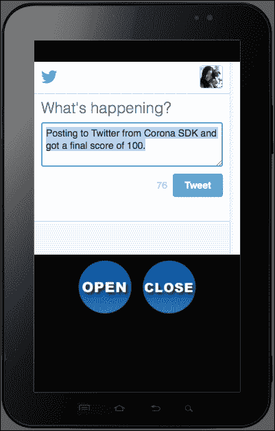
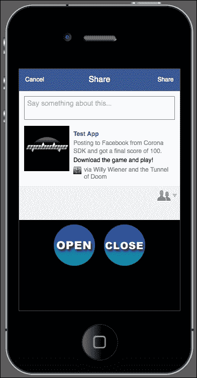
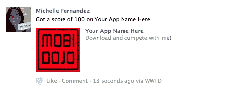

# 第九章：处理多设备和网络应用

> *允许您的应用程序与社交网络集成是推广您成品的好方法。许多游戏允许玩家上传他们的高分并与其他玩相同游戏的人分享。有些提供需要成功完成才能解锁成就的挑战。社交网络增强了游戏体验并为开发者提供了很好的曝光机会。*

由于我们越来越习惯编程，我们还将更详细地介绍构建配置。理解配置设备构建的重要性对跨平台开发至关重要。这是 Corona SDK 可以轻松地在 iOS 和 Android 设备上处理的能力。

在本章中，我们将学习以下主题：

+   重新访问配置设置

+   发布消息到 Twitter

+   发布消息到 Facebook

让我们添加这些最后的润色！

# 返回配置

在第二章中简要讨论了构建设置和运行时配置，*Lua 速成课程和 Corona 框架*。让我们深入了解如何处理在 iOS 和 Android 平台上工作的各种设备的具体细节。

## 构建配置

有多种方法可以处理设备方向，以匹配您的游戏设计所需的设置。

### 方向支持（iOS）

有时您希望原生用户界面（UI）元素自动旋转或以特定方式定向，但同时也需要在 Corona 中保持固定的坐标系统。

要锁定 Corona 的方向同时允许原生 iPhone UI 元素旋转，可以在 `build.settings` 中添加以下内容参数：

```kt
settings =
{
  orientation =
  {
 default = "portrait",
 content = "portrait",
    supported =
    {
      "landscapeLeft", "landscapeRight", "portrait", "portraitUpsideDown",
    },
  },
}
```

要将 Corona 的内部坐标系统锁定为纵向同时将 iPhone UI 元素锁定为横向，您可以在 `build.settings` 中执行以下操作：

```kt
settings =
{
  orientation =
  {
 default ="landscapeRight",
 content = "portrait",
    supported =
    {
      "landscapeRight", "landscapeLeft",
    },
  },
}
```

### 方向支持（安卓）

安卓平台支持纵向和横向方向。方向 *portraitUpsideDown* 在某些安卓设备上可能不可用。此外，目前安卓设备不支持自动旋转。默认方向不会影响安卓设备。方向初始化为设备的实际方向（除非只指定了一个方向）。

下面是一个针对安卓的 `build.settings` 文件的示例（您也可以在同一个文件中组合安卓和 iPhone 设置）：

```kt
settings =
{
  android =
  {
    versionCode = "2",
    versionName = "2.0"

    usesPermissions =
    {
      "android.permission.INTERNET",
    },
  },

  orientation =
  {
    default = "portrait"
  },
}
```

### 版本代码和版本名称（安卓）

`versionCode` 和 `versionName` 字段可以在 `build.settings` 中的可选 `"android"` 表中设置。

如果在`build.settings`文件中没有设置，`versionCode`字段默认为`"1"`，而`versionName`字段默认为`"1.0"`。当将应用程序的更新版本提交到 Google Play 商店时，也必须更新`versionCode`和`versionName`字段。`versionCode`的所有版本号都必须是整数。`versionCode`字段不能包含任何小数，而`versionName`字段可以包含小数。

想要了解更多信息，请查看[`developer.android.com/guide/topics/manifest/manifest-element.html#vcode`](http://developer.android.com/guide/topics/manifest/manifest-element.html#vcode)中的*android:versionCode*和*android:versionName*。

### 注意

`versionCode`属性是一个内部数字，用于在 Google Play 商店中区分应用程序版本。它与 Corona 构建对话框提供的版本不同。`versionName`属性是向用户显示的版本号。

### 应用权限（Android）

可以使用可选的`"usesPermissions"`表来指定权限，使用的是在 Android 清单参考中给出的字符串值：[`developer.android.com/reference/android/Manifest.permission.html`](http://developer.android.com/reference/android/Manifest.permission.html)。

开发者应该使用符合他们应用程序需求的权限。例如，如果需要网络访问，就需要设置互联网权限。

### 注意

想要了解更多关于 Corona SDK 中应用的`android.permission`键的信息，请参考[`docs.coronalabs.com/guide/distribution/buildSettings/index.html#permissions`](http://docs.coronalabs.com/guide/distribution/buildSettings/index.html#permissions)。

## 更简单的层次内容缩放

如果你在`config.lua`文件中从未处理过，那么在多个设备上调整内容大小有时可能会让人感到沮丧。有许多不同的屏幕尺寸。例如，iPhone 5 的尺寸为 640 x 1136 像素，iPad 2 的尺寸为 768 x 1024 像素，Droid 的尺寸为 480 x 854 像素，三星 Galaxy 平板的尺寸为 600 x 1024 像素等。由于图像大小限制，内存可能会很容易耗尽。

在设置你的`config.lua`时，就像我们在前面的章节中所做的那样，我们将内容设置为`width = 320`，`height = 480`，以及`scale = "letterbox"`。如果为 Android 设备构建，`"zoomStretch"`最适合于适应该平台上不同的屏幕尺寸。这为 iOS 和 Android 创建了一个共同的构建，并展示了足够大的显示图像以适应各种屏幕尺寸。

如果你想要先为更大的屏幕尺寸进行缩放，然后再缩小，请使用 iPad 2 的屏幕尺寸。你的`config.lua`文件将类似于以下代码：

```kt
application =
{
  content =
  {
    width = 768,
    height = 1024,
    scale = "letterbox"
  }
}
```

虽然前面的例子是缩放内容的另一种解决方案，但重要的是要记住，较大（高分辨率）图像涉及的纹理内存限制。像 iPad 带 Retina 显示屏、iPhone 5s 和三星 Galaxy Tab 4 平板电脑这样的设备可以很好地处理这个问题，但 iPhone 4s 和更旧的设备可用的纹理内存要少得多，无法处理大图形。

解决这个潜在问题的方法之一是使用动态图像解析，以替换更适合低端设备和高端设备的资源。我们将在本节的后面更详细地讨论这个话题。

### 两全其美的方案

你可能已经注意到，我们在示例应用中使用的某些背景图像被缩放到了 380 x 570。这个尺寸恰好能填满 iOS 和 Android 所有常见设备的整个屏幕。更重要的是，它是任何设备上高低分辨率图像的折中方案。

为了让你的内容尽可能均匀地显示，以下设置必须相应地进行：

`config.lua`的设置如下：

```kt
application =
{
  content =
  {
    width = 320,
    height = 480,
    scale = "letterbox"
  }
}
```

在包含显示图像的任何文件中，典型的背景会如下所示：

```kt
local backgroundImage = display.newImage( "bg.png", true )
backgroundImage.x = display.contentCenterX
backgroundImage.y = display.contentCenterY
```

任何尺寸为 320 x 480 的内容都被认为是焦点区域。区域之外的内容将被裁剪，但在任何设备上都会用内容填满屏幕。

## 动态图像选择的深层含义

我们知道我们可以交换用于较小设备（iPhone 4s）和较大设备（iPhone 6 和 Kindle Fire HD）的基本图像。在尝试在同一个构建中缩放多个设备时，会发生这种情况。

针对 iOS 和 Android 设备，有一个文件命名方案可供使用。了解如何处理受提议设备影响的资源的缩放，是成功的一半。我们将需要定义 Corona 需要解决哪个分辨率比例，以便访问它们所指向的资源。

使用`display.newImageRect( [parentGroup,] filename [, baseDirectory] w, h )`这行代码将调用你的动态分辨率图像。

通常，我们在项目中为 iOS 设备调用更高分辨率图像时使用`["@2x"] = 2`：

```kt
application =
{
  content =
  {
    width = 320,
    height = 480,
    scale = "letterbox",

    imageSuffix =
    {
      ["@2x"] = 2,
    },
  },
}
```

前面的例子只适用于 iPhone 4s 和 iPad 2，因为它超出了这两台设备的基本尺寸 320 x 480。如果我们想要让 Droid 2 也能访问，那么比例阈值将是 1.5。对于像三星 Galaxy 平板电脑这样的 Android 平板来说，比例阈值是 1.875。那么我们如何得出这些数字呢？简单。取高端设备的宽度，除以 320（基本尺寸）。例如，Droid 2 的尺寸是 480 x 854。将 480 除以 320，等于 1.5。

三星 Galaxy Tab 4 平板电脑的尺寸是 800 x 1280。将 800 除以 320，等于 2.5。

如果尝试在同一个项目中管理 iOS 和 Android 设备，你可以在`config.lua`中更改你的`imageSuffix`，如下代码所示：

```kt
    imageSuffix =
    {
 ["@2x"] = 1.5, -- this will handle most Android devices such as the Droid 2, Nexus, Galaxy Tablet, etc...
    }
```

或者，你可以使用以下代码：

```kt
    imageSuffix =
    {
 ["@2x"] = 2.5, -- this will handle the Galaxy Tab 4 and similar sized devices
    }
```

使用前面任一示例将触发提议的安卓设备显示更高分辨率的图像。

`imageSuffix` 字符串不一定非要是 `"@2x"`；它可以是像 `"@2"`，`"_lrg"`，甚至是 `"-2x"` 这样的任何东西。只要你的更高分辨率图像在主图像名称后具有预期的后缀，它就能正常工作。

## 高分辨率精灵表

高分辨率精灵表的处理方式与动态图像选择不同。虽然你可以继续使用相同的命名约定来区分你的高分辨率图像和基本图像，但图像将无法在引用精灵表时使用 `display.newImageRect()`。

如果你的 `config.lua` 文件中当前的内容缩放设置为 `width = 320`，`height = 480`，以及 `scale = "letterbox"`，那么以下设备的缩放输出将展示如下：

+   `iPhone = 1`

+   `iPhone 4s = 0.5`

+   `Droid 2 = 0.666666668653488`

+   `iPad 2 = 0.46875`

应用与 iPhone 尺寸相匹配的基本精灵表将显示清晰锐利的图像。当相同的精灵表应用于 iPhone 4 时，显示将匹配设备的内容缩放，但精灵表在边缘处看起来会有些像素化和模糊。使用 `display.contentScaleX` 并调用一些方法将为你解决这个问题。注意 `displayScale < 1` 将根据前述设备比例访问高分辨率精灵表：

```kt
    local sheetData 
    local myObject

 local displayScale = display.contentScaleX –- scales sprite sheets down
 if displayScale < 1 then –- pertains to all high-res devices

      sheetData = { width=256, height=256, numFrames=4, sheetContentWidth=512, sheetContentHeight=512 }
    else
      sheetData = { width=128, height=128, numFrames=4, sheetContentWidth=256, sheetContentHeight=256 }
    end

    local sheet = graphics.newImageSheet( "charSprite.png", sheetData)

    local sequenceData = 
    {
      { name="move", start=1, count=4, time=400 } 
    }

    myObject = = display.newSprite( sheet, sequenceData )

 if displayScale < 1 then --scale the high-res sprite sheet if you're on a high-res device.
      myObject.xScale = .5; myObject.yScale = .5
    end

    myObject.x = display.contentWidth / 2
    myObject.y = display.contentHeight / 2

    myObject.x = 150; myObject.y = 195

    myObject: setSequence("move")
    myObject:play()
```

# 应用网络化

当你完成主要游戏框架的开发后，如果决定这样做，考虑如何将其网络化是很有好处的。

在我们生活的某个时刻，我们所有人都使用过某种网络工具，比如 Twitter 或 Facebook。你可能现在正在使用这些应用程序，但重点是，你可以从其他用户那里阅读关于新游戏发布的更新，或者有人传播下载游戏并与他们竞争的消息。你可以成为他们谈论的那个游戏的开发者！

在你的游戏中融入网络机制不必是一件麻烦事。只需几行代码就能让它工作。

## 发布到 Twitter

推推推……Twitter 是一个网络工具，能让你接触到吸引你兴趣的最新信息。它还是一个分享你业务信息，当然还有你的游戏的好工具。通过推广你的应用，接触游戏开发受众。

那些想要将帖子分享到 Twitter 的用户需要先在[`twitter.com/`](http://twitter.com/)创建一个账户，并确保他们已经登录。

# 行动时间——将 Twitter 加入你的应用

我们将通过 UI 按钮访问网络服务，在我们的应用中实现 Twitter 功能。

1.  在`Chapter 9`文件夹中，将`Twitter Web Pop-Up`项目文件夹复制到你的桌面。所有需要的配置、库和资源都已包含。你可以从 Packt Publishing 网站下载伴随这本书的项目文件。

1.  创建一个新的`main.lua`文件并将其保存到项目文件夹中。

1.  在代码开始时设置以下变量：

    ```kt
    display.setStatusBar( display.HiddenStatusBar )

    local ui = require("ui")

    local openBtn
    local closeBtn
    local score = 100
    ```

1.  创建一个名为`onOpenTouch()`的本地函数，带有事件参数。添加一个`if`语句，以便事件接收一个`"release"`动作：

    ```kt
    local onOpenTouch = function( event )
      if event.phase == "release" then
    ```

1.  使用名为`message`的局部变量，添加以下字符串语句并拼接`score`：

    ```kt
    local message = "Posting to Twitter from Corona SDK and got a final score of " ..score.. "."
    ```

1.  添加`local myString`并应用`string.gsub()`对`message`进行处理，替换空格实例：

    ```kt
    local myString = string.gsub(message, "( )", "%%20")
    ```

1.  引入链接到 Twitter 账户的`native.showWebPopup()`函数。将`myString`拼接进来以包含预加载的消息。关闭函数：

    ```kt
        native.showWebPopup(0, 0, 320, 300, "http://twitter.com/intent/tweet?text="..myString)

      end
    end
    ```

1.  设置`openBtn` UI 函数：

    ```kt
      openBtn = ui.newButton{
      defaultSrc = "openbtn.png",
      defaultX = 90,
      defaultY = 90,
      overSrc = "openbtn-over.png",
      overX = 90,
      overY = 90,
      onEvent = onOpenTouch,
    }

    openBtn.x = 110; openBtn.y = 350
    ```

1.  创建一个名为`onCloseTouch()`的本地函数，带有`event`参数。添加一个`if`语句，其中`event.phase == "release"`以激活`native.cancelWebPopup()`：

    ```kt
    local onCloseTouch = function( event )
      if event.phase == "release" then    

        native.cancelWebPopup()    

      end
    end
    ```

1.  设置`closeBtn` UI 函数：

    ```kt
      closeBtn = ui.newButton{
      defaultSrc = "closebtn.png",
      defaultX = 90,
      defaultY = 90,
      overSrc = "closebtn-over.png",
      overX = 90,
      overY = 90,
      onEvent = onCloseTouch,
    }

    closeBtn.x = 210; closeBtn.y = 350
    ```

1.  保存文件并在模拟器中运行项目。确保你连接到互联网以查看结果。

    ### 注意

    如果你当前没有登录你的 Twitter 账户，你将被要求在查看我们代码中的推文结果之前登录。

    

## *刚才发生了什么？*

在代码的顶部，我们设置了一个变量`local score = 100`。这将在我们的 Twitter 消息中使用。

在`onOpenTouch(event)`函数中，当释放`openBtn`时将加载一个网页弹窗。要发布的文本以字符串格式显示在变量`local message`下。你会注意到我们将`score`拼接到字符串中，以便在消息发布时显示其值。

`local myString`和`string.gsub()`用于替换字符串中模式指示的所有实例。在这种情况下，它取消息中的字符串，并搜索每个单词之间的每个空格，并将其替换为`%20`。`%20`编码 URL 参数以表示空格。额外的`%`充当转义字符。

`native.showWebPopup()`函数以 320 x 300 的尺寸显示，这大约是设备屏幕尺寸的一半。添加显示 Twitter 消息对话框的 URL 并拼接`myString`。

当网页弹窗不再需要使用并需要关闭时，`closeBtn`会调用`onCloseTouch(event)`。这将传递参数`"release"`给`event`，并调用`native.cancelWebPopup()`。这个特定的函数将会关闭当前的网页弹窗。

## 发布到 Facebook

另一个可以用来分享关于你的游戏信息的社交网络工具是 Facebook。你可以轻松地自定义一个帖子来链接关于你的游戏的信息，或者分享关于高分的消息，并鼓励其他用户下载。

为了在 Facebook 上发布消息，你需要登录到你的 Facebook 账户或创建一个账户，网址为 [`www.facebook.com/`](https://www.facebook.com/)。你还需要从 Facebook 开发者网站 [`developers.facebook.com/`](https://developers.facebook.com/) 获取一个 App ID。App ID 是你站点的唯一标识符，它决定了用户与应用页面/网站之间适当的安全级别。

创建 App ID 后，你还需要编辑应用信息，并选择应用与 Facebook 的集成方式。这里有几个选项，如网站、原生 iOS 应用和原生 Android 应用等。网站集成必须选中，并填写有效的 URL，以便 Facebook 在处理涉及网页弹窗的帖子时重定向到指定 URL。

# 行动时间——将 Facebook 添加到你的应用中

类似于我们的 Twitter 示例，我们也将通过网页弹窗整合 Facebook 帖子：

1.  在 `Chapter 9` 文件夹中，将 `Facebook Web Pop-Up` 项目文件夹复制到你的桌面。所有需要的配置、库和资源都已包含在内。你可以从 Packt Publishing 网站下载伴随本书的项目文件。

1.  创建一个新的 `main.lua` 文件并将其保存到项目文件夹中。

1.  在代码开始处设置以下变量：

    ```kt
    display.setStatusBar( display.HiddenStatusBar )

    local ui = require("ui")

    local openBtn
    local closeBtn
    local score = 100
    ```

1.  创建一个名为 `onOpenTouch()` 的局部函数，并带有一个事件参数。当事件接收到 `"release"` 动作时，添加一个 `if` 语句：

    ```kt
    local onOpenTouch = function( event )
      if event.phase == "release" then
    ```

1.  添加以下局部变量，包括我们将在 Facebook 帖子中实施的字符串：

    ```kt
     local appId = "0123456789" -- Your personal FB App ID from the facebook developer's website

        local message1 = "Your App Name Here"
        local message2 = "Posting to Facebook from Corona SDK and got a final score of " ..score.. "."
        local message3 = "Download the game and play!"

        local myString1 = string.gsub(message1, "( )", "%%20")
        local myString2 = string.gsub(message2, "( )", "%%20")
        local myString3 = string.gsub(message3, "( )", "%%20")
    ```

1.  引入连接到 Facebook 账户的本地网页弹窗功能。包括 Facebook 对话框参数，用于重定向你首选网站的 URL，以触摸模式连接到你的应用 URL 的显示，以及展示你的应用图标或公司标志的图片 URL。使用字符串方法连接所有变量以输出所有消息。关闭函数。在 `openBtn` UI 函数中加入。你需要将以下所有 URL 信息替换为你自己的：

    ```kt
    native.showWebPopup(0, 0, 320, 300, "http://www.facebook.com/dialog/feed?app_id=" .. appId .. "&redirect_uri=http://www.yourwebsite.com&display=touch&link=http://www.yourgamelink.com&picture=http://www.yourwebsite.com/image.png&name=" ..myString1.. "&caption=" ..myString2.. "&description=".. myString3)  

      end
    end

      openBtn = ui.newButton{
      defaultSrc = "openbtn.png",
      defaultX = 90,
      defaultY = 90,
      overSrc = "openbtn-over.png",
      overX = 90,
      overY = 90,
      onEvent = onOpenTouch,
    }
    openBtn.x = 110; openBtn.y = 350
    ```

    ### 注意

    关于 Facebook 对话框的更多信息可以在 Facebook 开发者网站找到，网址为 [`developers.facebook.com/docs/reference/dialogs/`](http://developers.facebook.com/docs/reference/dialogs/)。

1.  创建一个名为 `onCloseTouch()` 的局部函数，并带有一个事件参数。添加一个 `if` 语句，判断 `event.phase == "release"` 以激活 `native.cancelWebPopup()`。设置 `closeBtn` UI 函数：

    ```kt
    local onCloseTouch = function( event )
      if event.phase == "release" then    

        native.cancelWebPopup()    

      end
    end

      closeBtn = ui.newButton{
      defaultSrc = "closebtn.png",
      defaultX = 90,
      defaultY = 90,
      overSrc = "closebtn-over.png",
      overX = 90,
      overY = 90,
      onEvent = onCloseTouch,
    }

    closeBtn.x = 210; closeBtn.y = 350
    ```

1.  保存文件并在模拟器中运行项目。确保你已连接到互联网并登录你的 Facebook 账户以查看结果。

## *刚才发生了什么？*

在 `onOpenTouch(event)` 函数内部，当按下并释放 `openBtn` 时会调用几个变量。注意 `local appId` 表示你在 Facebook Developers 网站上创建应用后可以获得的数字字符串。

`message1`、`message2` 和 `message3` 是显示信息帖子的字符串。`myString1`、`myString2` 和 `myString3` 用于替换 `message1`、`message2` 和 `message3` 中指定的空格。

`native.showWebPopup()` 函数以 320 x 300 的尺寸显示，并将对话框 URL 呈现给 Facebook。以下参数相应地显示：

+   `app_id`：这是你在 Facebook Developer 网站上创建的唯一 ID。例如，`"1234567"`。

+   `redirect_uri`：用户在对话框上点击按钮后重定向的 URL。这是参数中必需的。

+   `display`：这显示渲染对话框的模式。

+   `touch`：这用于如 iPhone 和 Android 这样的智能手机设备。这使对话框屏幕适应较小的尺寸。

+   `link`：这是帖子附带的链接。

+   `picture`：这是帖子图片的 URL。

+   `name`：这是链接附件的名称。

+   `caption`：这是链接的标题（显示在链接名称下方）。

+   `description`：这是链接的描述（显示在链接标题下方）。

当网页弹窗不再需要并需要关闭时，`closeBtn` 会调用 `onCloseTouch(event)`。这将使用事件参数 `"release"` 并调用 `native.cancelWebPopup()`。这个特定的函数将关闭当前的网页弹窗。

# Facebook Connect

这个库提供了一系列通过官方 Facebook Connect 接口访问 [`www.facebook.com`](http://www.facebook.com) 的功能。

# 动手操作时间——使用 Facebook Connect 发布分数。

Facebook Connect 是另一种使用原生 Facebook UI 功能在墙贴上发布信息的方式。我们将创建一种不同的方法来将消息和分数发布到新闻源。为了了解 Facebook Connect 的工作方式，你需要将构建加载到设备上查看结果。它不会在模拟器中运行。

1.  在 `Chapter 9` 文件夹中，将 `Facebook Connect` 项目文件夹复制到你的桌面。所有需要的配置、库和资源都已包含在内。你可以从 Packt Publishing 网站下载伴随这本书的项目文件。

1.  创建一个名为 `main.lua` 的新文件并将其保存到项目文件夹中。

1.  在代码开始时设置以下变量：

    ```kt
    display.setStatusBar( display.HiddenStatusBar )

    local ui = require("ui")
    local facebook = require "facebook"

    local fbBtn
    local score = 100
    ```

1.  创建一个名为 `onFBTouch()` 的本地函数，带有一个事件参数。添加一个包含 `event.phase == release` 的 `if` 语句。同时，以字符串格式包含你的 Facebook 应用 ID：

    ```kt
    local onFBTouch = function( event )
      if event.phase == "release" then    

     local fbAppID = "0123456789" -- Your FB App ID from facebook developer's panel

    ```

1.  在 `onFBTouch(event)` 内部创建另一个本地函数，名为 `facebookListener()`，同样带有一个事件参数。包含一个引用 `"session" == event.type` 的 `if` 语句：

    ```kt
        local facebookListener = function( event )
          if ( "session" == event.type ) then
    ```

1.  在另一个 `if` 语句中添加 `"login"` 等于 `event.phase` 的条件。包含一个名为 `theMessage` 的局部变量，以显示你想要与其他 Facebook 用户分享的消息：

    ```kt
            if ( "login" == event.phase ) then  

              local theMessage = "Got a score of " .. score .. " on Your App Name Here!"  
    ```

1.  添加 `facebook.request()` 函数，它将在用户的 Facebook 墙上发布以下消息。在 `facebookListener(event)` 函数中用 `end` 关闭任何剩余的 `if` 语句：

    ```kt
              facebook.request( "me/feed", "POST", {
                message=theMessage,
                name="Your App Name Here",
                caption="Download and compete with me!",
                link="http://itunes.apple.com/us/app/your-app-name/id382456881?mt=8",
                picture="http://www.yoursite.com/yourimage.png"} )
            end
          end
        end
    ```

    ### 注意

    `link` 参数展示了一个 iOS 应用的 URL。你可以将 URL 指向类似 `https://play.google.com/store/apps/details?id=com.yourcompany.yourappname` 的 Android 应用或你选择的任何通用网站 URL。

1.  调用 `facebook.login()` 函数，其中包括你的 App ID、监听器和在用户 Facebook 墙上发布的权限。关闭 `onFBTouch(event)` 函数的其余部分：

    ```kt
        facebook.login(fbAppID, facebookListener, {"publish_actions"})

      end
    end
    ```

1.  启用 `fbBtn` UI 功能并保存你的文件：

    ```kt
    fbBtn = ui.newButton{
      defaultSrc = "facebookbtn.png",
      defaultX = 100,
      defaultY = 100,
      overSrc = "facebookbtn-over.png",
      overX = 100,
      overY = 100,
      onEvent = onFBTouch,
    }

    fbBtn.x = 160; fbBtn.y = 160
    ```

1.  为 iOS 或 Android 创建一个新的设备构建。将构建加载到你的设备上并运行应用程序。在你能看到应用程序的结果之前，系统会要求你登录到你的 Facebook 账户。

## *刚才发生了什么？*

需要完成的最重要的任务之一是 `require "facebook"` 以便 Facebook API 能够工作。我们还创建了一个名为 `score` 的局部变量，其值为 100。

`onFBTouch(event)` 函数将在 `fbBtn` 的 `"release"` 上初始化事件参数。在函数中，`fbAppID` 以字符串格式包含字符。这将是一组你必须在 Facebook 开发者网站上获取的独特数字。当你在该网站上创建应用页面时，系统会为你创建 App ID。

另一个函数 `facebookListener(event)` 被创建，它将初始化所有的 `fbConnect` 事件。包含 `("login" == event.phase)` 的 `if` 语句将通过 `"me/feed", "POST"` 请求在你的动态中发布一条消息。该动态包含以下内容：

+   `message=theMessage`：这指的是属于变量的字符串。它还连接分数，因此也会显示值。

+   `name`：这是一条包含你的应用名称或主题的消息。

+   `caption`：这是一条简短的吸引其他用户关注玩游戏的宣传信息。

+   `link`：这提供了从 App Store 或 Google Play Store 下载游戏的 URL。

+   `picture`：这是一个包含你的应用图标或游戏视觉表示的图片 URL。

设置参数后，`facebook.login()` 将引用 `fbAppID` 和 `facebookListener()` 以查看是否使用了有效的应用程序 ID 在 Facebook 上发布。成功后，将通过 `"publish_actions"` 发布帖子。

## 尝试成为英雄——创建一个对话框

看看你能否弄清楚如何使用 Facebook Connect 显示一个对话框，并使用前面示例中展示的相同设置。以下行将显示为：

```kt
facebook.showDialog( {action="stream.publish"} )
```

现在，查看代码中可以访问`facebook.showDialog()`的位置。这是发布消息到 Facebook 的另一种方式。

## 小测验——处理社交网络

Q1.哪个特定的 API 可以缩小高分辨率精灵表？

1.  `object.xScale`

1.  `display.contentScaleX`

1.  `object.xReference`

1.  以上都不正确

Q2.允许在 Facebook 上在用户墙上发布的内容的发布权限叫什么？

1.  `"publish_stream"`

1.  `"publish_actions"`

1.  `"post"`

1.  `"post_listener"`

Q3. `facebook.login()`需要哪些参数？

1.  `appId`

1.  `listener`

1.  `permissions`

1.  所有以上选项

# 总结

我们已经涵盖了关于增强配置设置以及将当今媒体中最受欢迎的三个社交网络整合到我们的应用中的多个领域。

我们还深入了解了以下内容：

+   构建设置

+   动态内容缩放和动态图像分辨率

+   高分辨率精灵表

+   将消息推送到 Twitter 和 Facebook

在下一章中，我们将详细介绍如何将我们的游戏提交到 App Store 和 Google Play Store。你绝对不想错过这个！
