# 第十章：优化、测试和发布你的游戏

> *将游戏开发到完成阶段是一项伟大的成就。这离与全世界分享又近了一步，这样其他人就可以玩你新开发的游戏了。使用 Corona SDK 创建游戏的好处在于，你可以选择为 iOS 和/或 Android 构建游戏。你需要确保应用程序准备好提交，以便可以在你开发的移动平台上发布。我们将详细介绍准备游戏发布所需的过程。*

### 注意

这里使用的应用程序界面经常更新；然而，无论你使用的是哪种界面，你都能完成所有步骤。

在本章中，我们将涵盖以下主题：

+   提高应用程序的性能

+   为 App Store 设置分发供应配置文件

+   在 iTunes Connect 中管理应用程序信息

+   学习如何将应用程序提交到 App Store 的应用程序加载器

+   为 Android 签名应用程序

+   学习如何将应用程序提交到 Google Play 商店

# 理解内存效率

在开发应用程序时，你应该始终考虑你的设计选择如何影响应用程序的性能。尽管计算能力和内存有所提升，但设备内存仍然有其限制。设备内的性能和优化不仅能实现更快的响应时间，还能帮助最小化内存使用并最大化电池寿命。如何检查内存使用的示例链接可以在[`gist.github.com/JesterXL/5615023`](https://gist.github.com/JesterXL/5615023)找到。

内存是移动设备上重要的资源。当消耗过多内存时，设备可能会在你最意想不到的时候强制退出你的应用程序。以下是在开发过程中需要注意的一些事项：

+   **消除内存泄漏**：允许内存泄漏存在意味着你的应用程序中有多余的已使用内存，这些内存占据了宝贵的空间。尽管 Lua 有自动内存管理，但你的代码中仍然可能出现内存泄漏。例如，当你向应用程序中引入全局变量时，你需要告诉 Lua 何时不再需要这些变量，以便释放内存。这可以通过在代码中使用`nil`来实现（`myVariable = nil`）。

+   **显示图像的文件大小应尽可能小**：你可能希望在场景中拥有许多显示图像，但它们可能会占用过多的纹理内存。精灵表（Sprite sheets）可能会对应用程序的内存造成负担。它们应尽可能方便地创建得较小，并具有清晰展示动画的适当数量的帧数。对于所有你已显示的项目，规划出哪些元素始终在你的背景和前景中。如果可以将多个图像组合在一起，使它们不移动，那么就这样做。这将有助于在添加多个显示图像时节省内存。

+   **不要一次性加载所有资源**：避免在需要之前加载资源文件。这将有助于节省内存，并防止应用程序在尝试一次性加载过多内容时崩溃。

+   **从显示层次结构中移除对象**：创建显示对象时，它会隐式地添加到显示层次结构中。当你不再需要显示对象时，应该将其从显示层次结构中移除，特别是当对象包含图像时。这可以通过 `display.remove( myImage ); myImage = nil` 或 `myImage:removeSelf()` 来实现。

    这里有一个例子：

    ```kt
    local box = display.newRect( 0, 50, 100, 100)
    box:setFillColor( 1, 1, 1)
    box.alpha = 1

    local function removeBox()
      if box.alpha == 1 then
        print("box removed")
        display.remove( box )
        box = nil
      end
    end
    timer.performWithDelay( 1000, removeBox, 1 ) -- Runs timer to 1000 milliseconds before calling the block within removeBox()
    ```

+   **声音文件应尽可能小**：使用免费程序，如 Audacity，或你偏爱的音频软件来压缩音乐或音效，并为设备构建。最好将未处理的音频与压缩后的音频进行比较，以听出质量上的差异。这将帮助你确定在音频质量和文件大小之间的良好折中。

## 图形

如果你没有注意同时使用的图片的大小和数量，显示图片会占用大量的纹理内存。

### 分组对象

如果多个对象的属性设置为相同的值，最好将对象添加到组中，然后修改组的属性。这将使编码变得更容易，同时也优化了你的动画。

### 在不使用动画时关闭它们

当不需要或在使它们不可见时，很容易忘记停止后台运行的动画。

当你包含如 `"enterFrame"` 的监听器，且监听器下注册的对象被设置为 `.isVisible = false` 时，即使屏幕上看不到，它仍会在后台运行。确保在不必要时移除监听器。

### 优化图片大小

当你的应用包含大文件大小，尤其是全屏图片时，由于加载所需时间，应用程序的响应速度会变慢，而且还会占用大量内存。在使用大图片时，尽量使用图像编辑工具（如 Photoshop 或 ImageOptim([`imageoptim.com`](https://imageoptim.com)）压缩文件大小。这将帮助你减少文件体积，避免应用延迟带来的困扰。长期来看，压缩大图片尺寸是有益的。如果图片是背景，可以考虑切换到平铺图像。

# 分发 iOS 应用程序

当你的游戏最终调试完成，接下来要做什么呢？假设你已经注册了 iOS 开发者计划，那么在将应用程序提交到 App Store 之前，需要遵循一些指导原则。

## 准备你的应用图标

根据您的应用程序为哪些 iOS 设备开发，应用程序图标需要各种尺寸和命名约定。您可以在苹果开发者网站的[iOS 人机界面指南](https://developer.apple.com/library/ios/documentation/UserExperience/Conceptual/MobileHIG/AppIcons.html#//apple_ref/doc/uid/TP40006556-CH19-SW1)中的**图标和图像设计**部分的**应用图标**子节找到最新信息。

以下是应用程序图标的要求，也需要采用非交错式的`.png`格式：

+   `iTunesArtwork@2x`：这是一张 1024 x 1024 像素的图片。这张图片需要移除`.png`扩展名。

+   `Icon-60@2x.png`：这是一张 120 x 120 像素的图片，用于 Retina iPhone。

+   `Icon-60@3x.png`：这是一张 180 x 180 像素的图片，用于 iPhone 6 Plus。

+   `Icon-76.png`：这是一张 76 x 76 像素的图片，用于 iPad。

+   `Icon-76@2x.png`：这是一张 152 x 152 像素的图片，用于 Retina iPad。

+   `Icon-Small-40.png`：这是一张 40 x 40 像素的图片，用于 iPad 2 和 iPad mini 搜索。

+   `Icon-Small-40@2.png`：这是一张 80 x 80 像素的图片，用于 Retina iPhone/iPad 搜索。

+   `Icon-Small-40@3x.png`：这是一张 120 x 120 像素的图片，用于 iPhone 6 Plus 搜索。

+   `Icon-Small.png`：这是一张 29 x 29 像素的图片，用于 iPad 2 和 iPad mini 设置。

+   `Icon-Small@2x.png`：这是一张 58 x 58 像素的图片，用于 Retina iPhone/iPad 设置。

+   `Icon-Small@3x.png`：这是一张 87 x 87 像素的图片，用于 iPhone 6 Plus 设置。

在您的`build.settings`文件中，您需要包含您应用程序支持的所有设备的图标引用。以下是如果您创建通用构建，如何设置文件的示例：

```kt
settings =
{
  orientation =
  {
    default = "landscapeRight", 
  },

  iphone =
    {
       plist =
       {
         CFBundleIconFiles = {
           "Icon-60@2x.png",
           "Icon-60@3x.png",
           "Icon-76.png",
           "Icon-76@2x.png",
           "Icon-Small-40.png",
           "Icon-Small-40@2x.png",
           "Icon-Small-40@3x.png",
           "Icon-Small.png",
           "Icon-Small@2x.png",
           "Icon-Small@3x.png",
         },

       },
    },

}
```

您不需要在`plist`中包含`iTunesArtwork@2x`图片，但请确保将其插入到应用程序的基础项目文件夹中。

# 是时候行动了——为 App Store 设置您的分发证书和配置文件。

我们一直专注于创建开发证书和配置文件，以便在设备上测试和调试我们的应用程序。现在，我们需要创建它们的分发版本，以便提交 iOS 应用程序。请注意，苹果公司可能会随时更改其网站的设计。因此，如果步骤和屏幕截图不匹配，请不要感到沮丧：

1.  登录到你的 Apple 开发者账户，然后进入**证书、标识符和配置文件**。点击**App IDs**。在右上角选择**+**图标创建新的 App ID，并创建与应用程序相关的描述以便于识别。如果你在开发过程中已经使用了一个现有的 App ID，可以跳过这一步。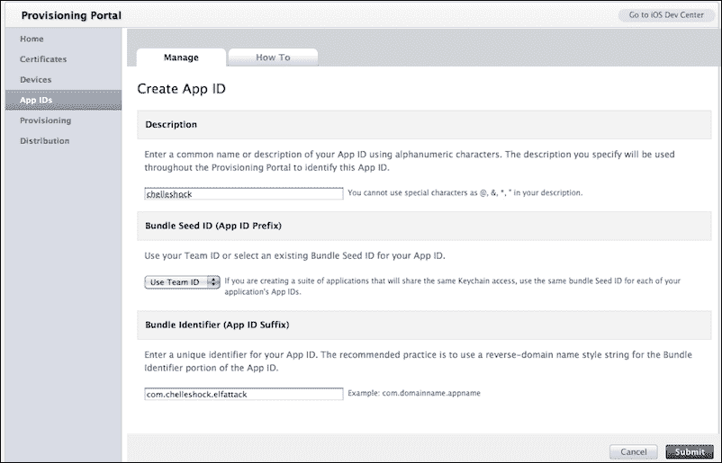

1.  在**配置文件**下点击**分发**。选择**分发**部分下的**+**按钮，然后选择**App Store**。按下**继续**。

1.  选择你希望与文件关联的 App ID，并点击**继续**。接下来，选择将与你配置文件关联的证书，并点击**继续**。

1.  为你的配置文件提供一个名称，并选择**生成**按钮。

1.  在下一个屏幕上，点击**下载**按钮，然后双击文件将其安装在你的机器上。

## *刚才发生了什么？*

你使用的 App ID 对于标识你将要提交的应用至关重要。最好使用独特的反向域名风格字符串。确保为 Corona 应用创建明确的 App ID。不要使用通配符 App ID。

为了在 App Store 上分发，你需要创建一个 App Store 分发配置文件和一个生产证书。任何开发配置文件都不会被接受。这个过程与创建开发配置文件和开发证书类似。

你可以在 Apple 开发者网站上的[`developer.apple.com/ios/manage/distribution/index.action`](https://developer.apple.com/ios/manage/distribution/index.action)（如果你还没有登录，系统会要求你登录到你的 Apple 开发者账户）和 Corona Labs 网站上的[`docs.coronalabs.com/guide/distribution/iOSBuild/index.html`](http://docs.coronalabs.com/guide/distribution/iOSBuild/index.html)找到更多关于分发配置文件的信息。

# iTunes Connect

iTunes Connect 是一套基于网络的工具，允许你提交和管理在 App Store 上分发的应用程序。在 iTunes Connect 中，你将能够检查合同的状态；设置你的税务和银行信息；获取销售和财务报告；请求促销代码；以及管理用户、应用程序、元数据和你的应用内购买目录。

## 合同、税务和银行

如果你打算出售你的应用，你需要有一个付费的商业协议，以便它可以被发布到 App Store。你将需要申请一个关于 iOS 付费应用的合同。所有这些都可以通过 iTunes Connect 下的**合同**、**税务**和**银行**链接完成。

当请求合同时，要注意可能发生的问题，比如苹果首次处理你的信息时产生的延迟，或在 iTunes Connect 中更改当前联系信息时（例如，如果你搬到不同的地点，更改地址）的问题。你有责任定期联系苹果支持，确保合同中的信息始终是最新的。

# 行动时间——在 iTunes Connect 中管理你的应用

我们现在将介绍如何在 iTunes Connect 中设置应用信息。任何关于用户账户、合同和银行的其他信息，你可以在[`developer.apple.com/app-store/review/`](https://developer.apple.com/app-store/review/)找到。

1.  在 [`itunesconnect.apple.com/`](http://itunesconnect.apple.com/) 登录 iTunes Connect。你的登录信息与你的 iOS 开发者账户相同。登录后，选择**管理你的应用**。点击**添加新应用**按钮。**应用名称**是你的应用的名称。**SKU 编号**是应用唯一的字母数字标识符。**捆绑 ID**是在 iOS 供应门户中创建的那个。填写信息并点击**继续**：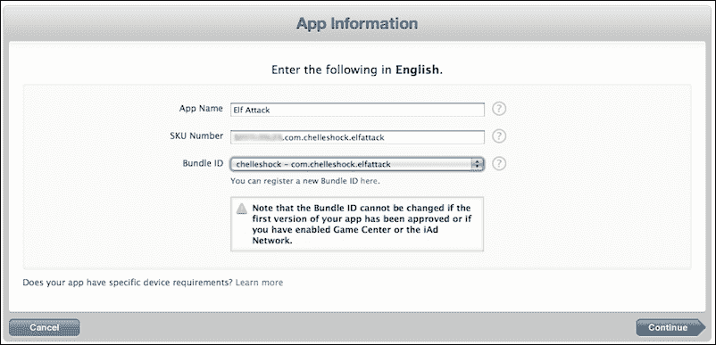

1.  下一步是选择你希望应用在 App Store 上线的时间和想要的**价格层级**。有一个可选的**对教育机构打折**复选框。这只适用于那些希望为教育机构同时购买多份应用副本时打折的情况。完成后，点击**继续**：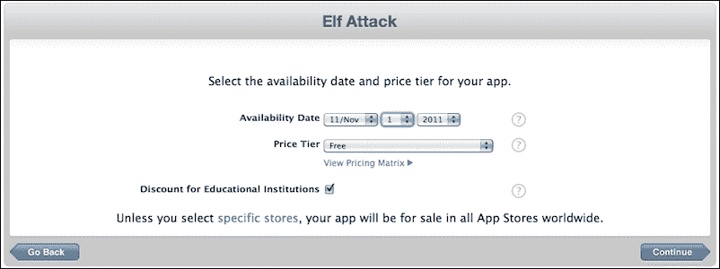

1.  接下来，填写关于你应用的**元数据**部分。这包括版本号、游戏描述、分类、与应用相关的关键词、版权、联系方式和支持网址：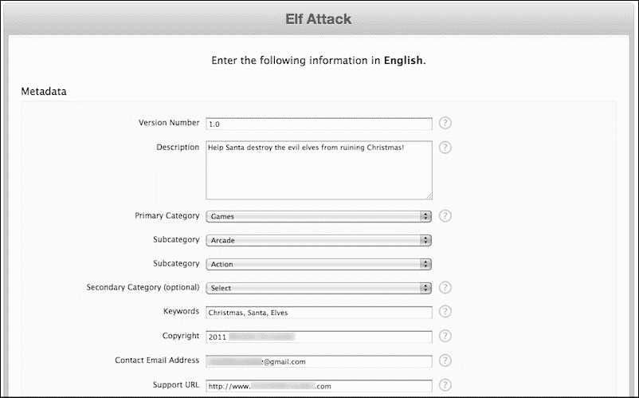

1.  **评级**部分基于你的应用内容。对于每个描述，选择最能描述你应用频率的级别。某些内容类型会导致自动拒绝，比如应用中描绘的现实暴力或针对个人或团体的个人攻击。你可以了解更多关于*App Store 审核指南*的信息，请访问[`developer.apple.com/appstore/resources/approval/guidelines.html`](https://developer.apple.com/appstore/resources/approval/guidelines.html)。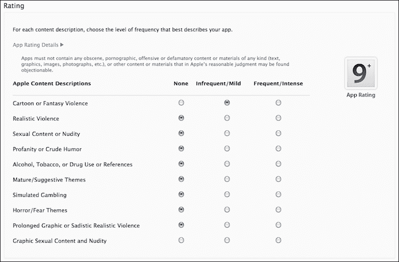

1.  如前文**上传**部分所述，你需要一个大型应用图标版本，即 iPhone/iPod Touch 截图和 iPad 截图（如果应用在 iPad 上运行）。

1.  你将看到一个关于你的应用程序信息的页面摘要。检查显示的信息是否正确，然后点击**完成**：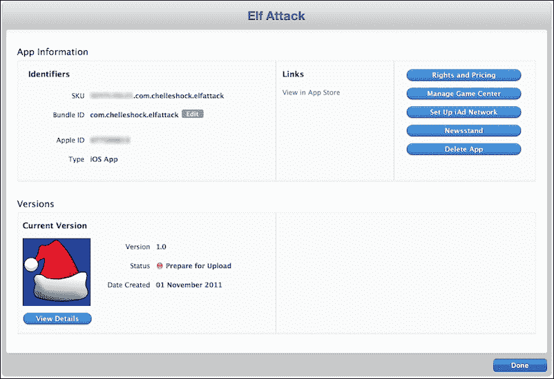

1.  你将被送回到版本详细信息页面。注意一个写着**准备上传二进制文件**的按钮。点击该按钮，你将需要回答关于**出口** **合规性**的几个问题。完成后，你将获得通过**应用程序** **加载器**上传二进制文件的权利。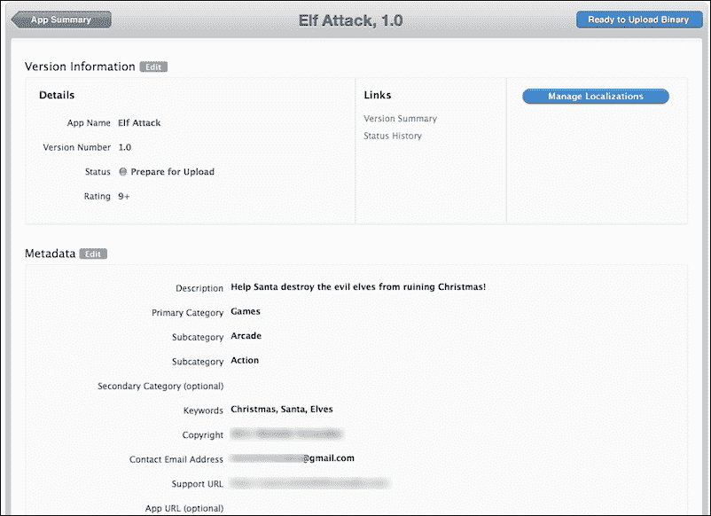

## *刚才发生了什么？*

iTunes Connect 是你在此后管理应用程序并分发到 App Store 的地方。你想要展示关于应用程序的每一块信息都是通过 iTunes Connect 完成的。

一旦进入**应用程序信息**部分，请确保你的**SKU 编号**是唯一的，并且与你的应用程序相关，这样你以后可以识别它。同时，确保你为应用程序指定的**捆绑** **ID**是正确的。

在**权利和定价**部分，应用程序的可用性控制了当你提交的应用一旦获得批准，你希望它何时上线。设置一个从提交日期起几周后的日期是一个好选择。只要提交没有问题，从**审核中**到**准备销售**的审核过程可能需要几天到几周的时间。价格层级是你为应用程序设置价格的地方，也可以设置为**免费**。你可以点击**查看定价矩阵**来确定你希望出售应用程序的价格。

**元数据**部分的信息是用户在 App Store 中将看到的内容。**评级**部分与 Apple 内容描述有关。确保将频率级别选择得尽可能接近你的应用程序内容。

**上传**部分是你添加 1024 x 1024 像素的应用程序图标和视觉上最适合你应用程序的截图的地方。确保你提供正确的图片尺寸。当你回到**应用程序信息**屏幕后，你会注意到状态显示为**准备上传**。当你在**版本详细信息**页面上点击**准备上传二进制文件**按钮时，你将回答关于**出口合规性**的问题。之后不久，状态将变为**等待上传**。

有关 iTunes Connect 的更多信息可以在 [`developer.apple.com/library/ios/iTunesConnectGuide`](http://developer.apple.com/library/ios/iTunesConnectGuide) 找到。

# 在 Corona 中构建用于分发的 iOS 应用程序

我们已经进入了将您的 iOS 应用程序提交到 App Store 的最后阶段。假设您已经测试了您的应用程序，并使用开发配置文件进行了调试，那么您现在可以创建一个分发构建，这将生成您应用程序的二进制 ZIP 文件。

# 是时候行动了——构建您的应用程序并将其上传到应用程序加载器。

是时候创建最终的 iOS 分发游戏构建，并将其上传到应用程序加载器，以便在苹果公司的审查下进行审核。

1.  启动 Corona 模拟器，导航到应用程序项目文件夹，并运行它。前往 Corona 模拟器的菜单栏，然后选择**文件** | **构建** | **iOS**。填写您的所有应用程序详细信息。确保您的**应用程序名称**和**版本**字段与您的 iTunes Connect 账户中显示的内容相匹配。选择**设备**以构建应用程序包。接下来，从**支持设备**下拉菜单中选择您的应用程序所针对的目标设备（iPhone 或 iPad）。在**代码签名身份**下拉菜单下，选择您在 iOS 配置门户中创建的**分发** **配置文件**选项。在**保存到文件夹**部分，点击**浏览**并选择您希望保存应用程序的位置。完成后点击**构建**按钮：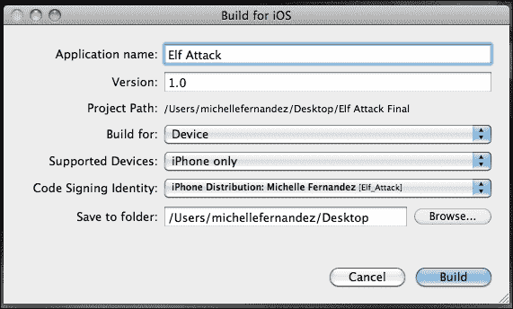

1.  当构建完成后，您将看到显示您的应用程序已准备好分发的界面。选择**上传到 App Store**按钮。

1.  当**欢迎使用应用程序加载器**窗口弹出时，使用您的 iTunes Connect 信息登录。然后您将被带到另一个窗口，窗口中有**交付您的 App**或**创建新包**选项。选择**交付您的 App**。下一个窗口显示一个下拉菜单；选择您将提交的应用程序的名称，然后点击**下一步**按钮。

1.  在 iTunes Connect 中显示的可用应用程序信息。验证其正确无误后，点击**选择**按钮。

1.  点击省略号（**…**）按钮，在提交之前替换当前文件，然后选择**发送**按钮。

1.  应用程序加载器将开始将您应用程序的二进制文件提交到 App Store。

1.  如果您的二进制文件上传成功，您将收到确认您的应用程序已送达 App Store 的消息。当您的应用程序进入审查、准备销售、上线等状态时，您可以在 iTunes Connect 中检查应用程序的状态。每次应用程序状态发生变化时，都会向您发送电子邮件。就是这样！这就是您如何将应用程序提交到 App Store 的方法！

1.  当你的应用经过审核并获得 App Store 批准后，你可以进入 iTunes Connect，如果批准时间早于你提出的发布日期，可以调整可用日期。你的应用将立即在 App Store 上线：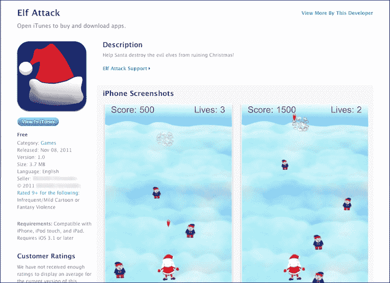

## *刚才发生了什么？*

当你在**代码签名标识**下构建你的应用时，重要的是选择为你分发构建创建的分发配置文件。在你的构建编译完成后，你可以启动 Application Loader。确保你已经安装了 Xcode。在选择**上传到 App Store**按钮后，Application Loader 将立即启动。

当你处于 Application Loader 中时，一旦你将二进制信息加载到 iTunes Connect，应用的名字就会显示在下拉菜单中。当你交付应用时，从你保存文件的地点选择压缩后的二进制文件。

文件上传后，确认窗口会出现，同时一封电子邮件会发送到分配给你 Apple 账户的 Apple ID。你的二进制文件将在 iTunes Connect 中显示为**等待审核**状态。

完成所有这些步骤后，你现在知道如何将 iOS 应用提交到 App Store 了。万岁！

## 尝试英雄——制作一个通用的 iOS 构建版本。

如果你只为 iPhone 开发了应用，尝试也实现一个 iPad 版本，这样它就可以成为一个通用构建版本。利用你在前面章节中学到的知识，使用你的 `build.settings` 和 `config.lua` 文件调整你的应用程序大小。同时，也不要忘记你的应用图标的要求。这可谓是一石二鸟！

# Google Play 商店

Google Play 商店是一个发布平台，可以帮助你宣传、销售和向全球用户分发你的 Android 应用。

要注册成为 Google Play 开发者并开始发布应用，请访问 Google Play Android 开发者控制台发布商网站。你可以在[`play.google.com/apps/publish/`](https://play.google.com/apps/publish/)注册一个账户。

## 创建启动器图标

启动器图标是代表你应用程序的图形。启动器图标由应用程序使用，并出现在用户的桌面上。它们也可以用来在应用程序中表示快捷方式。这些与为 iOS 应用程序创建的图标类似。以下是启动器图标的要求，也需要是 32 位 `.png` 格式：

+   `Icon-ldpi.png`：这是一张 120 dpi 的 36 x 36 像素图像，用于低密度屏幕。

+   `Icon-mdpi.png`：这是一张 160 dpi 的 48 x 48 像素图像，用于中等密度的屏幕。

+   `Icon-hdpi.png`：这是一张 240 dpi 的 72 x 72 像素图像，用于高密度屏幕。

+   `Icon-xhdpi.png`：这是一张 320 dpi 的 96 x 96 像素图像，用于超高密度屏幕。

+   `Icon-xxhdpi.png`：这是一个 144 x 144 像素，480 dpi 的图像，用于 xx 高密度屏幕。

+   `Icon-xxxhdpi.png`：这是一个 192 x 192 像素，640 dpi 的图像，用于 xxx 高密度屏幕。

启动器图标需要在构建应用程序时放置在你的项目文件夹中。Google Play 商店还要求你有一个 512 x 512 像素的图标版本，可以在上传构建时在开发者控制台上传。关于启动器图标的更多信息，请访问[`developer.android.com/guide/practices/ui_guidelines/icon_design_launcher.html`](http://developer.android.com/guide/practices/ui_guidelines/icon_design_launcher.html)。

# 行动时间——为 Google Play 商店签名你的应用

安卓系统要求所有安装的应用程序都必须使用持有私钥的证书进行数字签名。安卓系统使用证书来识别应用程序的作者，并在应用程序之间建立信任关系。证书不用于控制用户可以安装哪些应用程序。证书不需要由证书颁发机构签名；它可以自签名。证书可以在 Mac 或 Windows 系统上签名。

1.  在 Mac 上，前往**应用程序** | **实用工具** | **终端**。在 Windows 上，前往**开始菜单** | **所有程序** | **附件** | **命令提示符**。使用`keytool`命令，加入以下行并按下*回车*：

    ```kt
    keytool -genkey -v -keystore my-release-key.keystore -alias aliasname -keyalg RSA -validity 999999

    ```

    ### 注意

    将`my-release-key`替换为你的应用程序名称，将`aliasname`替换为相似或相同的别名。另外，如果你在`999999`之后添加任何额外的数字（即额外的 9），应用程序将显示为损坏。

    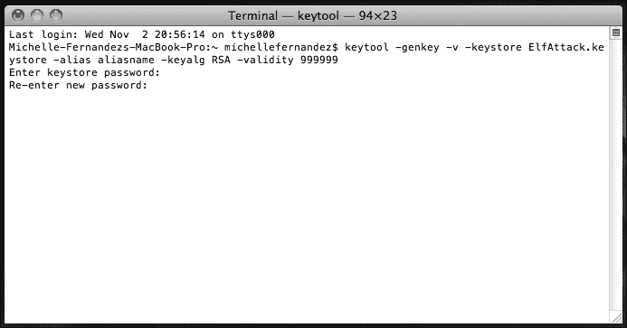

1.  系统会要求你输入一个密钥库密码。从这里，你将创建一个独特的密码，作为开发者你必须想出一个。系统会要求你重新输入它。接下来会被问及的问题将涉及到你的开发者/公司信息、位置等。全部填写。一旦填写了所需信息，你就生成了一个用于签名你的 Android 构建的关键。关于应用签名的更多信息，请访问[`developer.android.com/tools/publishing/app-signing.html`](http://developer.android.com/tools/publishing/app-signing.html)。

1.  启动 Corona 模拟器，导航到应用程序项目文件夹并运行它。前往 Corona 模拟器的菜单栏，然后选择**文件** | **构建** | **Android**。填写与你的应用程序相关的**应用名称**、**版本代码**和**版本名称**。使用 Java 方案指定一个**包**名称。从**目标应用商店**菜单中选择**Google Play**。在**密钥库**下，选择**浏览**按钮来定位你签名的私钥，然后从下拉菜单中选择你为发布构建生成的密钥。系统会提示你输入在`keytool`命令中用于签名应用程序的密钥库密码。在**密钥别名**下，从下拉菜单中选择你为密钥创建的别名名称，并在提示时输入密码。选择**浏览**按钮来选择应用程序构建的位置。完成后选择**构建**按钮：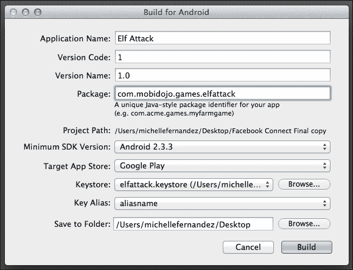

## *刚才发生了什么？*

`keytool`命令会生成一个名为`my-release-key.keystore`的密钥库文件。密钥库和密钥由你输入的密码保护。密钥库包含一个单一密钥，有效期为 999999 天。别名是你在签名应用程序时稍后用来指代此密钥库的名称。

你的密钥库密码是你在 Corona 中构建应用程序时创建并必须记住的内容。如果你想要为别名名称使用不同的密码，将有一个选项。当你在终端或命令提示符中时，可以按*Enter*使用相同的密码。

当你在 Corona 中创建构建时，请确保你的版本号是一个没有特殊字符的整数。此外，你还需要确保你的`build.settings`文件中包含了`versionCode`。这个数字将与你的版本号相同。更多信息请参考第九章，*处理多设备和网络应用*。

你的构建中的 Java 方案是域名反转，加上你的产品/公司名称，再加上你的应用名称，例如，`com.mycompany.games.mygame`。

当你使用你的私钥构建应用程序，并选择了一个别名名称后，`.apk`文件将被创建，并准备好发布到 Google Play 商店。

# 行动时间——向 Google Play 商店提交应用

我们将使用开发者控制台。这是创建开发者资料以发布到 Google Play 商店的地方。

1.  登录到开发者控制台后，点击 Android 图标并选择标有**添加新应用**的按钮。你将看到一个弹出窗口，允许你上传你的构建版本。从下拉菜单中选择你的默认语言，并在**标题**下输入你的应用名称。点击**上传 APK**按钮进入下一页。行动时间 – 向 Google Play 商店提交应用

1.  点击**将你的第一个 APK 上传到生产环境**，然后点击**浏览文件**以找到你的应用的`.apk`文件。选择**打开**按钮以上传你的文件。行动时间 – 向 Google Play 商店提交应用

1.  上传`.apk`文件后，选择**商店列表**标签。填写你应用的相关信息，包括**标题**、**简短描述**和**完整描述**：行动时间 – 向 Google Play 商店提交应用

1.  在图形资产部分，添加你的应用屏幕截图。至少需要两张截图才能提交你的应用。其他需要的强制性图形包括**高分辨率图标**和**功能图形**。

1.  分类、联系详情和隐私政策部分需要处理。确保你完成这些部分，并在转到下一个标签之前点击页面顶部的**保存**按钮。

1.  选择**定价与分销**标签。选择与应用相关的信息。定价默认设置为**免费**。如果你想制作付费版本，你必须与 Google Checkout 设置一个商家账户。完成后点击**保存**：行动时间 – 向 Google Play 商店提交应用

1.  填写完所有与应用相关的信息后，请确保 APK、商店列表和定价与分销标签旁边有绿色的勾选标记。

1.  最后，点击**准备发布**按钮，并在下拉菜单中选择**发布此应用**。恭喜你！你刚刚将你的应用发布到了 Google Play 商店！！行动时间 – 向 Google Play 商店提交应用

## *刚才发生了什么？*

开发者控制台页面展示了一个简单的分步流程，指导你如何发布`.apk`文件。

发布应用所需的资产在每部分旁边显示了可接受的分辨率和图像类型。包括促销图形、功能图形和促销视频是可选的，但为了你的最佳利益，最好为你的应用页面添加足够的实质内容。这将使它吸引潜在客户。

完成所有与应用相关的信息后，确保保存你的进度。选择**发布此应用**菜单后，你就完成了！你应该能在你发布后的小时内看到你的应用在 Google Play 商店中。

## 尝试英雄 – 添加更多促销信息

Google Play 商店为你提供了许多推广应用程序的方式。可以从开发者控制台添加额外的资源。尝试以下方法：

+   添加宣传图像作为展示你应用程序的市场推广工具。

+   添加一个功能图像。

+   创建你的应用程序的宣传视频。像 YouTube 这样的网站是分享你的游戏预告片的好方式。

## 小测验 - 发布应用程序

Q1. 创建 iOS 分发配置文件时，你需要使用哪种分发方法？

1.  开发

1.  应用商店

1.  Ad hoc

1.  以上都不是

Q2. 你在哪里查看提交的 iOS 应用程序的状态？

1.  iTunes Connect

1.  iOS 配置门户

1.  应用程序加载器

1.  以上都不是

Q3. 为 Google Play 商店构建应用程序需要什么？

1.  使用 `keytool` 命令创建一个私钥

1.  使用调试密钥为你的应用程序签名

1.  使用你的私钥为应用程序签名

1.  a 和 c

# 总结

通过本章的学习，我们已经完成了一个巨大的里程碑。我们不仅学会了如何提交到一个，而是两个主要的应用市场！最终，将你的应用程序发布到 App Store 和 Google Play 商店并不那么可怕。

我们已经涵盖了以下主题：

+   内存效率的重要性

+   创建用于向 App Store 分发的配置文件

+   管理 iTunes Connect

+   向应用程序加载器提交二进制文件

+   为 Android 应用程序签署发布构建

+   向 Google Play 商店提交 `.apk` 文件

在下一章中，我们将看看 iOS 平台的 Apple iTunes 商店中的应用内购买。
