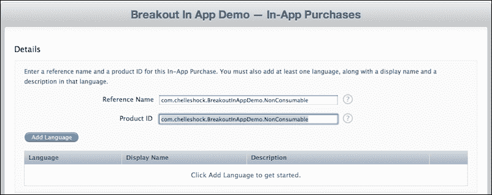
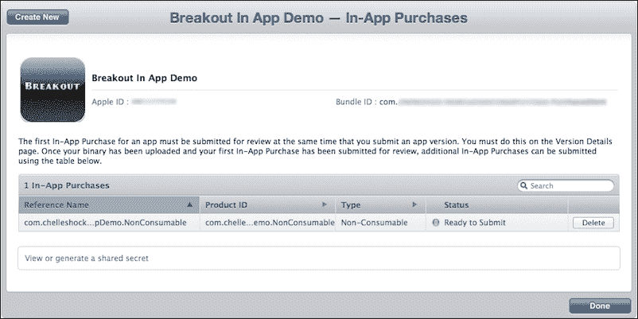
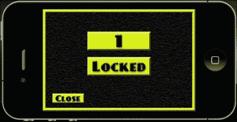
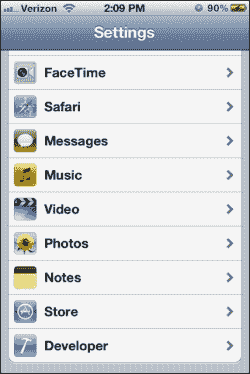
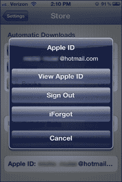
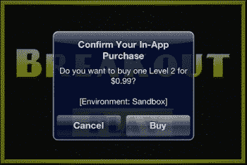
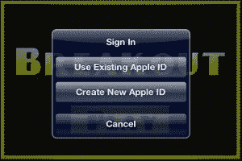
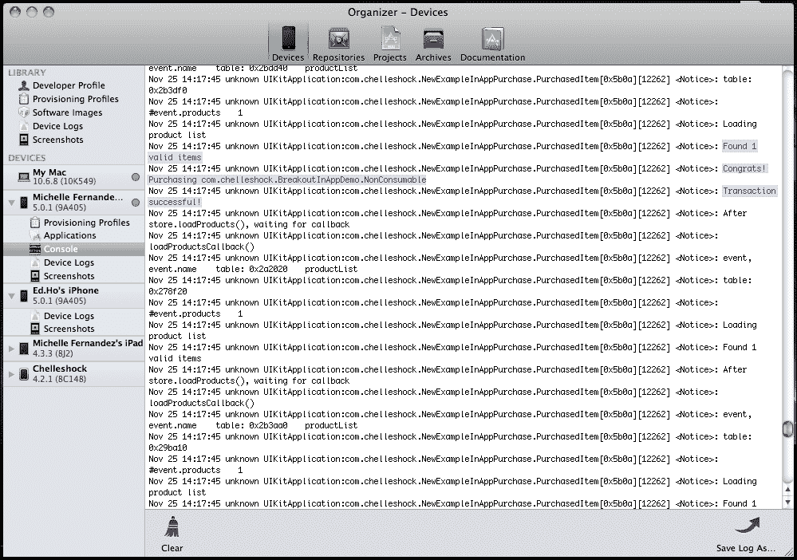
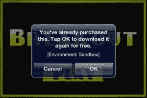

# 第十一章：实现 应用内购买

> *应用内购买是开发者可以选择使用的一个功能，可以直接在应用中嵌入商店。有时，你可能希望扩展当前游戏的一些功能，以保持玩家的兴趣。现在就是你的机会，也许还能让你的口袋里收入更多！*

本章仅关注 iOS 平台上 Apple iTunes Store 的应用内购买。希望在应用中实现应用内购买的 Android 开发者可以参考相关内容。iOS 和 Android 的应用内购买设置方式类似。但是，在 `build.settings` 文件和代码中需要设置一些不同之处。

### 注意

这里使用的应用程序界面经常更新。但无论你使用的是哪种界面，你都能完成所有步骤。

我们将在本章介绍以下内容：

+   消耗性、非消耗性和订阅购买

+   进行交易

+   恢复已购项目

+   初始化 Corona 的商店模块

+   在设备上创建和测试应用内购买

准备，设定，出发！

# 应用内购买的奇妙之处

实施应用内购买的目的在于为应用添加应用内支付功能，以收取增强功能或游戏内可使用的额外内容的费用。以下是将此功能融入应用的选择：

+   提供除默认内容之外的全新关卡包进行游戏的应用

+   允许你通过购买虚拟货币在游戏过程中创建或建立新资产的高级游戏

+   添加额外的角色或特殊能力提升以增强游戏元素

以下是一些可以使用应用内购买实现的示例。

应用内购买允许用户在应用程序内购买额外内容。App Store 只管理交易信息。开发者不能使用 App Store 传送内容。因此，你可以在发布应用时捆绑内容（购买后即可解锁），或者如果你希望传送内容，需要自己设计下载数据的系统。

## 应用内购买的类型

你可以在应用中使用几种不同的应用内购买类型。

### 注意

你可以在 Apple 网站上找到更多关于应用内购买的信息，地址为[`developer.apple.com/library/ios/documentation/LanguagesUtilities/Conceptual/iTunesConnectInAppPurchase_Guide/Chapters/CreatingInAppPurchaseProducts.html`](https://developer.apple.com/library/ios/documentation/LanguagesUtilities/Conceptual/iTunesConnectInAppPurchase_Guide/Chapters/CreatingInAppPurchaseProducts.html)。

+   **消耗性**：这些是用户每次需要该物品时都必须购买的产品。它们通常是单次服务，如在需要支付建造建筑物的供应品的游戏中使用的货币。

+   **非消耗性**：这些是用户只需购买一次的产品。这些可能是游戏中的附加关卡包。

+   **自动续订订阅**：这些产品允许用户购买一定时间内的应用内内容。一个自动续订订阅的例子是一份利用 iOS 内置的自动续订功能的杂志或报纸。

+   **免费订阅**：这些用于在 Newsstand 中放置免费订阅内容。一旦用户注册了免费订阅，它将在与该用户 Apple ID 相关联的所有设备上可用。请注意，免费订阅不会过期，并且只能在启用 Newsstand 的应用中提供。

+   **非续订订阅**：与自动续订订阅类似，这些是非续订订阅，要求用户在订阅到期时每次都进行续订。你的应用必须包含识别到期发生的代码。还必须提示用户购买新的订阅。自动续订订阅则省略了这些步骤。

# Corona 的商店模块

在你的应用程序中应用应用内购买可能是一个相当令人困惑和繁琐的过程。与 Corona 集成需要调用商店模块：

```kt
store = require("store")
```

商店模块已经整合到 Corona API 中，类似于 Facebook 和游戏网络。你可以在 [`docs.coronalabs.com/daily/guide/monetization/IAP/index.html`](http://docs.coronalabs.com/daily/guide/monetization/IAP/index.html) 了解更多关于 Corona 商店模块的信息。

## store.init()

在处理应用程序中的商店交易时，必须调用 `store.init()` 函数。它激活了应用内购买，并允许你使用指定的监听函数接收回调：

```kt
store.init( listener )
```

这里唯一的参数是 `listener`。它是一个处理交易回调事件的功能函数。

以下代码块确定了在应用内购买过程中可能发生的交易状态。四种不同的状态分别是：购买、恢复、取消和失败：

```kt
function transactionCallback( event )
  local transaction = event.transaction
  if transaction.state == "purchased" then
    print("Transaction successful!")
    print("productIdentifier", transaction.productIdentifier)
    print("receipt", transaction.receipt)
    print("transactionIdentifier", transaction.identifier)
    print("date", transaction.date)

    elseif  transaction.state == "restored" then
    print("Transaction restored (from previous session)")
    print("productIdentifier", transaction.productIdentifier)
    print("receipt", transaction.receipt)
    print("transactionIdentifier", transaction.identifier)
    print("date", transaction.date)
    print("originalReceipt", transaction.originalReceipt)
    print("originalTransactionIdentifier", transaction.originalIdentifier)
    print("originalDate", transaction.originalDate)

    elseif transaction.state == "cancelled" then
    print("User cancelled transaction")

    elseif transaction.state == "failed" then
    print("Transaction failed, type:", transaction.errorType, transaction.errorString)

    else
    print("unknown event")
    end

    -- Once we are done with a transaction, call this to tell the store
    -- we are done with the transaction.
    -- If you are providing downloadable content, wait to call this until
    -- after the download completes.
    store.finishTransaction( transaction )
end

store.init( "apple", transactionCallback )
```

### event.transaction

`event.transaction` 对象包含了交易信息。

交易对象支持以下只读属性：

+   `"state"`：这是一个字符串，包含交易的状态。有效的值有 `"purchased"`、`"restored"`、`"cancelled"` 和 `"failed"`。

+   `"productIdentifier"`：这是与交易关联的产品标识符。

+   `"receipt"`：这是从 App Store 返回的唯一收据。它以十六进制字符串的形式返回。

+   `"signature"`：这是一个用于验证购买的有效字符串。对于 Google Play，它由 `"inapp_signature"` 返回。在 iOS 中，它返回 `nil`。

+   `"identifier"`：这是从 App Store 返回的唯一交易标识符。它是一个字符串。

+   `"date"`：这是交易发生的日期。

+   `"originalReceipt"`：这是从 App Store 原始购买尝试返回的唯一收据。它主要在恢复的情况下相关。它以十六进制字符串的形式返回。

+   `"originalIdentifier"`：这是从商店原始购买尝试返回的唯一交易标识符。这在恢复的情况下最为相关。它是一个字符串。

+   `"originalDate"`：这是原始交易的日期。这在恢复的情况下最为相关。

+   `"errorType"`：这是状态为`"failed"`时发生的错误类型（一个字符串）。

+   `"errorString"`：这是在`"failed"`情况下出现问题的描述性错误信息。

## store.loadProducts()

`store.loadProducts()`函数获取有关待售商品的信息。这包括每件商品的价格、名称和描述：

```kt
store.loadProducts( arrayOfProductIdentifiers, listener )
```

它的参数如下：

+   `arrayOfProductIdentifiers`：这是一个数组，每个元素包含你想要了解的应用内产品产品 ID 的字符串。

+   `listener`：这是一个回调函数，当商店完成获取产品信息时被调用

以下代码块显示了应用中可用的产品列表。可以通过`loadProductsCallback()`函数获取产品信息，并判断其有效或无效：

```kt
-- Contains your Product ID's set in iTunes Connect
local listOfProducts = 
{
  "com.mycompany.InAppPurchaseExample.Consumable",
  "com.mycompany.InAppPurchaseExample.NonConsumable",
  "com.mycompany.InAppPurchaseExample.Subscription",
}

function loadProductsCallback ( event )
  print("showing valid products", #event.products)
  for i=1, #event.products do
    print(event.products[i].title)
    print(event.products[i].description)
    print(event.products[i].price)
    print(event.products[i].productIdentifier)
  end

  print("showing invalidProducts", #event.invalidProducts)
    for i=1, #event.invalidProducts do
      print(event.invalidProducts[i])
end
end

store.loadProducts( listOfProducts, loadProductsCallback )
```

### event.products

当`store.loadProducts()`返回请求的产品列表时，可以通过`event.products`属性访问产品信息数组。

产品信息，如标题、描述、价格和产品标识符，包含在表格中：

```kt
event.products
```

`event.products`数组中的每个条目支持以下字段：

+   `title`：这是项目的本地化名称

+   `description`：这是项目的本地化描述

+   `price`：这是项目的价格（作为一个数字）

+   `productIdentifier`：这是产品标识符

### event.invalidProducts

当`store.loadProducts()`返回其请求的产品列表时，任何你请求的不可售产品将以数组形式返回。你可以通过`event.invalidProducts`属性访问无效产品的数组。

这是一个 Lua 数组，包含从`store.loadProducts()`请求的产品标识符字符串：

```kt
event.invalidProducts
```

## store.canMakePurchases

`store.canMakePurchases`函数如果允许购买则返回 true，否则返回 false。Corona 的 API 可以检查是否可以进行购买。iOS 设备提供了一个禁用购买的设置。这可以用来避免意外购买应用。

```kt
    if store.canMakePurchases then
      store.purchase( listOfProducts )
    else
      print("Store purchases are not available")
    end
```

## store.purchase()

`store.purchase()`函数启动对提供的产品列表的购买交易。

这个函数将向商店发送购买请求。当商店处理完交易后，将在`store.init()`中指定的监听器将被调用：

```kt
store.purchase( arrayOfProducts )
```

它唯一的参数是`arrayOfProducts`，一个指定你想要购买的产品数组：

```kt
store.purchase{ "com.mycompany.InAppPurchaseExample.Consumable"}
```

## store.finishTransaction()

这个函数通知应用商店交易已完成。

在你完成事务处理后，必须在该事务对象上调用`store.finishTransaction()`。如果你不这样做，App Store 会认为你的事务被中断，并会在下次应用程序启动时尝试恢复它。

语法：

```kt
store.finishTransaction( transaction )
```

参数：

事务：属于你想标记为完成的事务的`transaction`对象。

示例：

```kt
store.finishTransaction( transaction )
```

## store.restore()

任何之前购买的项目，如果从设备上清除或升级到新设备，都可以在用户的账户上恢复，无需再次为产品付费。`store.restore()` API 会启动这个过程。通过使用`store.init()`注册的`transactionCallback`监听器，可以恢复事务。事务状态将是`"restored"`，然后你的应用程序可以使用事务对象的`"originalReceipt"`、`"originalIdentifier"`和`"originalDate"`字段。

```kt
store.restore()
```

该代码块将通过`transactionCallback()`函数运行，并确定之前是否从应用程序购买过产品。如果结果为真，`store.restore()`将启动获取产品的过程，而无需让用户再次付费：

```kt
function transactionCallback( event )
  local transaction = event.transaction
  if transaction.state == "purchased" then
    print("Transaction successful!")
    print("productIdentifier", transaction.productIdentifier)
    print("receipt", transaction.receipt)
    print("transactionIdentifier", transaction.identifier)
    print("date", transaction.date)

  elseif  transaction.state == "restored" then
    print("Transaction restored (from previous session)")
    print("productIdentifier", transaction.productIdentifier)
    print("receipt", transaction.receipt)
    print("transactionIdentifier", transaction.identifier)
    print("date", transaction.date)
    print("originalReceipt", transaction.originalReceipt)
    print("originalTransactionIdentifier", transaction.originalIdentifier)
    print("originalDate", transaction.originalDate)

  elseif transaction.state == "cancelled" then
      print("User cancelled transaction")

  elseif transaction.state == "failed" then
    print("Transaction failed, type:", transaction.errorType, transaction.errorString)

  else
    print("unknown event")
  end

  -- Once we are done with a transaction, call this to tell the store
  -- we are done with the transaction.
  -- If you are providing downloadable content, wait to call this until
  -- after the download completes.
  store.finishTransaction( transaction )
end

store.init( transactionCallback )
store.restore()
```

# 创建应用内购买

在继续之前，请确保你知道如何从 iOS 配置门户创建 App ID 和分发配置文件。还要确保你知道如何在 iTunes Connect 中管理新应用程序。如果你不确定，请参考第十章，*优化、测试和发布你的游戏*，了解更多信息。在创建应用内购买之前，以下是你应用中需要准备的事项：

+   为你的应用已经制作好的分发证书。

+   为你的应用程序指定一个显式的 App ID，例如，`com.companyname.appname`。不要使用通配符（星号："*"）。为了使用应用内购买功能，捆绑 ID 需要完全唯一。

+   一个临时分发配置文件（用于测试应用内购买）。当你准备提交带有应用内购买的应用程序时，需要一个 App Store 分发配置文件。创建应用内购买

+   你的应用程序信息必须在 iTunes Connect 中设置。在创建或测试应用内购买时，你不需要上传你的二进制文件。

+   确保你已经与苹果公司签订了有效的 iOS 付费应用程序合同。如果没有，你需要在 iTunes Connect 主页上的**合同、税务和银行信息**中申请。你需要提供你的银行和税务信息，以便在应用中提供应用内购买。

# 动手操作——在 iTunes Connect 中创建应用内购买

我们将通过 iTunes Connect 实现应用内购买，并在示例应用程序中创建一个将调用事务的场景。让我们创建将在应用内购买中使用的产品 ID：

1.  登录到 iTunes Connect。在首页上，选择**管理您的应用程序**。选择您计划添加应用内购买的应用程序。

1.  当您在应用概览页面时，点击**管理应用内购买**按钮，然后在左上角点击**创建新购买项目**按钮。![行动时间——在 iTunes Connect 中创建应用内购买]

1.  您将看到一个页面，该页面显示了您可以创建的应用内购买类型概览。在本例中，选择了**非消耗性**。我们将创建一个只需购买一次的产品。

1.  在下一个页面，您需要填写有关产品的信息。这些信息适用于消耗性、非消耗性和非续订订阅的应用内购买。为您的产品填写**参考名称**和**产品 ID**字段。产品 ID 需要是一个唯一的标识符，可以是字母和数字的任意组合（例如，`com.companyname.appname.productid`）。

    ### 注意

    自动续订订阅需要您生成一个共享密钥。如果您要在应用中使用自动续订订阅，请在**管理应用内购买**页面上，点击**查看或生成共享密钥**链接。您将被带到生成共享密钥的页面。点击**生成**按钮。共享密钥将显示 32 个随机生成的字母数字字符。当您选择自动续订订阅时，与其他应用内购买类型的不同之处在于，您必须选择产品之间自动续订的持续时间。有关自动续订订阅的更多信息，请访问[`developer.apple.com/library/ios/iTunesConnectGuide`](http://developer.apple.com/library/ios/iTunesConnectGuide)。

    

1.  点击**添加语言**按钮。选择将用于应用内购买的语言。为您的产品添加一个显示名称和简短描述。完成后，点击**保存**按钮。![行动时间——在 iTunes Connect 中创建应用内购买]

1.  在**定价和可用性**部分，确保**已清除销售**选项选择为**是**。在**价格层级**下拉菜单中，选择您计划销售应用内购买的价格。在本例中，选择了**层级 1**。在**审核截图**部分，您需要上传应用内购买的截图。如果您在临时版本上进行测试，则无需截图。当您准备分发时，需要上传截图以便在提交审核时对应用内购买进行审查。完成后点击**保存**按钮。![行动时间——在 iTunes Connect 中创建应用内购买]

1.  你将在下一页看到你创建的应用内购买的摘要。如果所有信息看起来都正确，请点击**完成**按钮。

## *刚才发生了什么？*

添加新的应用内购买是一个非常简单的过程。交易过程中将调用产品 ID 中包含的信息。管理应用内购买类型完全取决于你想在游戏中销售的产品类型。这个例子展示了购买/解锁游戏中一个新级别的非消耗性产品的目的。这对于想要销售关卡包的用户来说是一个常见场景。

你的应用程序不需要完成就可以测试应用内购买。需要做的是在 iTunes Connect 中设置你的应用程序信息，这样你就可以管理应用内购买的功能。

# 动手时间——使用 Corona 商店模块创建应用内购买

既然我们在 iTunes Connect 中为应用内购买设置了产品 ID，我们就可以在应用中实现它，以购买我们将要销售的产品。创建了一个 Breakout 的示例菜单应用，以演示如何在应用程序内购买关卡。该应用在关卡选择屏幕上包含两个级别。第一个默认可用。第二个被锁定，只能通过支付 0.99 美元来解锁。我们将创建一个关卡选择屏幕，使其按此方式操作：

1.  在`第十一章`文件夹中，将`Breakout 应用内购买演示`项目文件夹复制到你的桌面。你可以从 Packt Publishing 网站下载伴随这本书的项目文件。你会注意到，配置、库、资源和`.lua`文件都已包含。

1.  创建一个新的`levelselect.lua`文件并将其保存到项目文件夹中。

1.  使用以下变量和保存/加载函数设置场景。最重要的变量是`local store = require("store")`，它调用应用内购买的商店模块：

    ```kt
    local composer = require( "composer" )
    local scene = composer.newScene()

    local ui = require("ui")
    local movieclip = require( "movieclip" )
    local store = require("store")

    ---------------------------------------------------------------------------------
    -- BEGINNING OF YOUR IMPLEMENTATION
    ---------------------------------------------------------------------------------

    local menuTimer

    -- AUDIO
    local tapSound = audio.loadSound( "tapsound.wav" )

    --***************************************************

    -- saveValue() --> used for saving high score, etc.

    --***************************************************
    local saveValue = function( strFilename, strValue )
      -- will save specified value to specified file
      local theFile = strFilename
      local theValue = strValue

      local path = system.pathForFile( theFile, system.DocumentsDirectory )

      -- io.open opens a file at path. returns nil if no file found
      local file = io.open( path, "w+" )
      if file then
        -- write game score to the text file
        file:write( theValue )
        io.close( file )
      end
    end

    --***************************************************

    -- loadValue() --> load saved value from file (returns loaded value as string)

    --***************************************************
    local loadValue = function( strFilename )
      -- will load specified file, or create new file if it doesn't exist

      local theFile = strFilename

      local path = system.pathForFile( theFile, system.DocumentsDirectory )

      -- io.open opens a file at path. returns nil if no file found
      local file = io.open( path, "r" )
      if file then
        -- read all contents of file into a string
        local contents = file:read( "*a" )
        io.close( file )
        return contents
      else
        -- create file b/c it doesn't exist yet
        file = io.open( path, "w" )
        file:write( "0" )
        io.close( file )
        return "0"
      end
    end

    -- DATA SAVING
    local level2Unlocked = 1
    local level2Filename = "level2.data"
    local loadedLevel2Unlocked = loadValue( level2Filename )
    ```

1.  创建一个`create()`事件，并移除`"mainmenu"`、`"level1"`和`"level2"`场景：

    ```kt
    -- Called when the scene's view does not exist:
    function scene:create( event )
      local sceneGroup = self.view

      -- completely remove maingame and options
      composer.removeScene( "mainmenu" )
      composer.removeScene( "level1" )
      composer.removeScene( "level2" )

      print( "\nlevelselect: create event" )
    end
    ```

1.  接下来，创建一个`show()`事件和一个数组，其中包含设置为 iTunes Connect 中应用内购买的**产品 ID**的字符串：

    ```kt
    function scene:show( event )
      local sceneGroup = self.view

      print( "levelselect: show event" )

      local listOfProducts = 
      {
        -- These Product IDs must already be set up in your store
        -- Replace Product ID with a valid one from iTunes Connect
        "com.companyname.appname.NonConsumable", -- Non Consumable In-App Purchase
      }
    ```

1.  为`validProducts`和`invalidProducts`添加一个本地空表。创建一个名为`unpackValidProducts()`的本地函数，检查有效的和无效的产品 ID：

    ```kt
      local validProducts = {} 
        local invalidProducts = {}

        local unpackValidProducts = function()
            print ("Loading product list")
            if not validProducts then
                native.showAlert( "In-App features not available", "initStore() failed", { "OK" } )
            else
              print( "Found " .. #validProducts .. " valid items ")
                for i=1, #invalidProducts do
                  -- Debug:  display the product info 
                    native.showAlert( "Item " .. invalidProducts[i] .. " is invalid.",{ "OK" } )
                    print("Item " .. invalidProducts[i] .. " is invalid.")
                end

            end
        end
    ```

1.  创建一个名为`loadProductsCallback()`的本地函数，带有一个`event`参数。设置处理程序以使用打印语句接收产品信息：

    ```kt
      local loadProductsCallback = function( event )
        -- Debug info for testing
            print("loadProductsCallback()")
            print("event, event.name", event, event.name)
            print(event.products)
            print("#event.products", #event.products)

            validProducts = event.products
            invalidProducts = event.invalidProducts    
            unpackValidProducts ()
        end
    ```

1.  创建一个名为 `transactionCallback()` 的局部函数，带有 `event` 参数。为每个 `transaction.state` 事件可能发生的结果添加几种情况。当商店完成交易时，在函数结束前调用 `store.finishTransaction(event.transaction)`。设置另一个名为 `setUpStore()` 的局部函数，带有 `event` 参数，以调用 `store.loadProducts(listOfProducts, loadProductsCallback)`：

    ```kt
      local transactionCallback = function( event )
        if event.transaction.state == "purchased" then 
          print("Transaction successful!")
            saveValue( level2Filename, tostring(level2Unlocked) 
        elseif event.transcation.state == "restored" then 
          print("productIdentifier", event.transaction.productIdentifier)
          print("receipt", event.transaction.receipt)
          print("transactionIdentifier", event.transaction.transactionIdentifier)
          print("date", event.transaction.date)
          print("originalReceipt", event.transaction.originalReceipt)
        elseif event.transaction.state == "cancelled" then
          print("Transaction cancelled by user.")
        elseif event.transaction.state == "failed" then
          print("Transaction failed, type: ", event.transaction.errorType, event.transaction.errorString)
          local alert = native.showAlert("Failed ", infoString,{ "OK" })
        else
          print("Unknown event")
          local alert = native.showAlert("Unknown ", infoString,{ "OK" })
        end
        -- Tell the store we are done with the transaction.
        store.finishTransaction( event.transaction )
        end

        local setupMyStore = function(event)
          store.loadProducts( listOfProducts, loadProductsCallback)
          print ("After store.loadProducts(), waiting for callback")
        end
    ```

1.  设置背景和关卡**1**按钮的显示对象：

    ```kt
      local backgroundImage = display.newImageRect( "levelSelectScreen.png", 480, 320 )
      backgroundImage.x = 240; backgroundImage.y = 160
      sceneGroup:insert( backgroundImage )

      local level1Btn = movieclip.newAnim({"level1btn.png"}, 200, 60)
      level1Btn.x = 240; level1Btn.y = 100
      sceneGroup:insert( level1Btn )

      local function level1touch( event )
        if event.phase == "ended" then
          audio.play( tapSound )
          composer.gotoScene( "loadlevel1", "fade", 300  )
        end
      end
      level1Btn:addEventListener( "touch", level1touch )
      level1Btn:stopAtFrame(1)
    ```

1.  设置关卡**2**按钮的位置：

    ```kt
      -- LEVEL 2
      local level2Btn = movieclip.newAnim({"levelLocked.png","level2btn.png"}, 200, 60)
      level2Btn.x = 240; level2Btn.y = 180
      sceneGroup:insert( level2Btn )
    ```

1.  使用局部函数 `onBuyLevel2Touch(event)` 并创建一个 `if` 语句，检查 `event.phase == ended and level2Unlocked ~= tonumber(loadedLevel2Unlocked)`，以便场景切换到 `mainmenu.lua`：

    ```kt
      local onBuyLevel2Touch = function( event )
        if event.phase == "ended" and level2Unlocked ~= tonumber(loadedLevel2Unlocked) then
          audio.play( tapSound )
          composer.gotoScene( "mainmenu", "fade", 300  )
    ```

1.  在同一个 `if` 语句中，创建一个名为 `buyLevel2()` 的局部函数，带有 `product` 参数，以调用 `store.purchase()` 函数：

    ```kt
        local buyLevel2 = function ( product ) 
          print ("Congrats! Purchasing " ..product)

         -- Purchase the item
          if store.canMakePurchases then 
            store.purchase( {validProducts[1]} ) 
          else
            native.showAlert("Store purchases are not available, please try again later",  { "OK" } ) – Will occur only due to phone setting/account restrictions
          end 
        end 
        -- Enter your product ID here
         -- Replace Product ID with a valid one from iTunes Connect
     buyLevel2("com.companyname.appname.NonConsumable")

    ```

1.  添加一个 `elseif` 语句，以检查在交易完成后，是否已购买并解锁了关卡 2：

    ```kt
        elseif event.phase == "ended" and level2Unlocked == tonumber(loadedLevel2Unlocked) then
          audio.play( tapSound )
          composer.gotoScene( "loadlevel2", "fade", 300  )
        end
      end
      level2Btn:addEventListener( "touch", onBuyLevel2Touch )

      if level2Unlocked == tonumber(loadedLevel2Unlocked) then
        level2Btn:stopAtFrame(2)
      end
    ```

1.  使用 `store.init()` 激活应用内购买，并将 `transactionCallback()` 作为参数调用。同时以 500 毫秒的定时器调用 `setupMyStore()`：

    ```kt
      store.init( "apple", transactionCallback) 
        timer.performWithDelay (500, setupMyStore)
    ```

1.  创建一个**关闭**的 UI 按钮，以及一个名为 `onCloseTouch()` 的局部函数，带有事件参数。让该函数在释放**关闭**按钮时，切换到 `loadmainmenu.lua` 场景。使用 `end` 结束 `enterScene()` 事件：

    ```kt
      local closeBtn

      local onCloseTouch = function( event )
        if event.phase == "release" then

          audio.play( tapSound )
          composer.gotoScene( "loadmainmenu", "fade", 300  )

        end
      end

      closeBtn = ui.newButton{
        defaultSrc = "closebtn.png",
        defaultX = 100,
        defaultY = 30,
        overSrc = "closebtn.png",
        overX = 105,
        overY = 35,
        onEvent = onCloseTouch,
        id = "CloseButton",
        text = "",
        font = "Helvetica",
        textColor = { 255, 255, 255, 255 },
        size = 16,
        emboss = false
      }

      closeBtn.x = 80; closeBtn.y = 280
      closeBtn.isVisible = false
      sceneGroup:insert( closeBtn )

      menuTimer = timer.performWithDelay( 200, function() closeBtn.isVisible = true; end, 1 )

    end
    ```

1.  创建 `hide()` 和 `destroy()` 事件。在 `hide()` 事件中，取消 `menuTimer` 定时器。为场景事件添加所有事件监听器并 `return scene`：

    ```kt
    -- Called when scene is about to move offscreen:
    function scene:hide()

      if menuTimer then timer.cancel( menuTimer ); end

        print( "levelselect: hide event" )

      end

    -- Called prior to the removal of scene's "view" (display group)
    function scene:destroy( event )

      print( "destroying levelselect's view" )
    end

    -- "create" event is dispatched if scene's view does not exist
    scene:addEventListener( "create", scene )

    -- "show" event is dispatched whenever scene transition has finished
    scene:addEventListener( "show", scene )

    -- "hide" event is dispatched before next scene's transition begins
    scene:addEventListener( "hide", scene )

    -- "destroy" event is dispatched before view is unloaded, which can be
    scene:addEventListener( "destroy", scene )

    return scene
    ```

1.  保存文件，并在 Corona 模拟器中运行项目。当你点击**播放**按钮时，你会在关卡选择屏幕上注意到一个**1**按钮和一个**锁定**按钮。当你按下**锁定**按钮时，它会调用商店进行交易。你会在终端中注意到一条打印语句，显示正在参考哪个**产品 ID**进行购买。完整的内购功能无法在模拟器中测试。你将需要创建一个发行版本，并在 iOS 设备上上传以在商店中发起购买。

## *刚才发生了什么？*

在此示例中，我们使用了 BeebeGames 类中的 `saveValue()` 和 `loadValue()` 函数，来实现如何通过电影剪辑作为按钮，使我们的锁定关卡从锁定模式转变为解锁模式。`local listOfProducts` 中的数组以字符串格式显示**产品 ID**。在此示例中，产品 ID 需要是一种非消耗性应用内购买类型，并且必须在 iTunes Connect 中已存在。

`unpackValidProducts()`函数检查应用内购买中有多少有效和无效的商品。`loadProductsCallback()`函数接收商店中的产品信息。`transactionCallback(event)`函数检查每种状态：`"purchased"`，`"restored"`，`"cancelled"`和`"failed"`。在应用内购买中实现`"purchased"`状态时，会调用`saveValue()`函数来更改`level2.data`的值。交易完成后，需要调用`store.finishTransaction(event.transaction)`来告诉商店你的购买已经完成。

`setupMyStore(event)`函数调用`store.loadProducts(listOfProducts, loadProductsCallback)`并检查应用程序中可用的产品 ID（或 IDs）。一旦`store.init(transactionCallback)`初始化并调用`setupMyStore()`，事件就会被处理。

`onBuyLevel2Touch(event)`函数允许我们检查是否已为锁定级别进行了应用内购买。当用户能够购买并接受应用内购买时，将处理交易，`level2Unlocked`的值将与`tonumber(loadedLevel2Unlocked)`相匹配。`buyLevel2(product)`函数一旦产品 ID 返回有效，就会使用`store.purchase()`验证购买的商品。

应用内购买完成后，屏幕会过渡到主菜单，允许**锁定**按钮变为级别**2**的按钮。一旦按钮变为帧 2，级别 2 就可以访问了。

## 尝试英雄——处理多个产品 ID

既然你知道如何为单一产品创建应用内购买，尝试为同一应用程序添加多个产品。场景是开放式的。

你可以添加以下内容：

+   更多可供购买的级别

+   如果你的游戏有主角，可以设置多种角色供用户扮演。

+   为你的应用程序添加新的背景场景

你如何处理商店的新产品完全由你决定。

# 测试应用内购买

你需要确保购买能够正确进行。苹果提供了一个沙盒环境，允许你测试应用内购买。沙盒环境与 App Store 使用相同的模型，但不会处理实际支付。交易会返回，就像支付已经成功处理一样。在提交给苹果审核之前，测试应用内购买在沙盒环境中是必须的。

在沙盒环境中测试时，你需要创建一个与当前 iTunes Connect 账户不同的独立用户测试账户。在沙盒环境中测试你的商店时，不允许使用你的当前账户。

## 用户测试账户

当您登录到您的 iTunes Connect 账户时，您需要从主页选择**管理用户**链接。在**选择用户类型**页面选择**测试用户**。添加一个新用户，并确保测试账户使用的电子邮件地址没有与其他任何 Apple 账户关联。所有测试账户在测试应用内购买时只应在测试环境中使用。当所有信息填写完毕后，点击**保存**按钮。

创建用户测试账户后，您需要确保在设备的**商店**设置中已登出您的 Apple 账户。这将防止在测试应用内购买时使用非测试账户。当应用内购买沙盒提示时，您只能登录到您的用户测试账户以测试应用程序。在启动应用程序之前，不要登录到您的测试账户。这将防止它使您的测试账户无效。

# 行动时间 – 使用 Breakout 应用内购买演示测试应用内购买

在您可以在 iOS 设备上测试应用内购买之前，请确保您在 iTunes Connect 中有一个测试用户账户。同时，请确保您使用临时分发配置文件为要测试应用内购买功能的应用创建了一个分发构建。如果您按照本章前面的所有步骤操作，通过商店进行购买测试将相应地顺利进行：

1.  在 Corona 模拟器中，创建 Breakout 应用内购买演示的分发构建。一旦构建完成编译，将构建上传到您的 iOS 设备。

1.  保持设备与您的机器连接，并启动 Xcode。从工具栏中，转到**窗口** | **组织者**。一旦进入**组织者**，在**设备**部分选择已连接的设备，然后选择**控制台**。这将允许您检查设备上的控制台输出，以捕获代码中的调试信息（即打印语句）以及任何应用程序崩溃。

1.  在启动应用程序之前，您需要在设备上选择**设置**图标。向上滚动直到看到**商店**图标并选择它。

1.  如果您已登录 iTunes 商店账户，请登出，这样您就可以在沙盒环境中测试应用内购买。

1.  从您的设备上启动 Breakout 应用内购买演示。选择**播放**按钮，然后选择**锁定**按钮。屏幕将转回主菜单，并弹出一个窗口以确认您的应用内购买。按下**确定**继续购买。

1.  接下来，你将看到一个窗口，提示你使用 Apple ID 登录。在这里，你需要使用在 iTunes Connect 中创建的测试用户账户登录。不要使用用于登录 iTunes Connect 的实际 Apple 账户。

1.  登录后，再次选择**播放**按钮。你会注意到**2**按钮已经被解锁。选择它后，你将可以访问那个场景。

1.  退出应用程序并参考控制台。你会注意到来自设备的输出和你的代码中一些熟悉的打印语句。控制台日志显示了用于应用内购买的产品 ID，并通知你它是否有效以及交易是否成功。

1.  如果你想要确保应用内购买确实有效，请从你的设备上删除应用程序，并退出你的测试用户账户。上传同样的版本到你的设备上——无需创建新的版本。启动应用程序并重新运行应用内购买。使用同样的测试用户账户登录。你应该会看到一个弹出窗口，提示你已经购买了该产品，并询问你是否希望再次免费下载。收到通知意味着你的应用内购买成功了。

## *刚才发生了什么？*

正确遵循应用内购买测试步骤非常重要。为了确保你在沙盒环境中获得准确的结果，从**商店**设置中退出你的 Apple 账户是整个流程的关键。

启动应用程序并通过按下锁定按钮调用商店功能后，你会注意到应用内购买的商品的显示名称和价格。如果你正确实现，它应该与你在 iTunes Connect 中创建的内容相匹配。

使用在 iTunes Connect 中创建的测试用户账户登录后，假设苹果服务器端没有问题或设备连接没有问题，交易应该能够顺利进行，不会出现任何错误。在关卡选择屏幕上的第 2 级将会被解锁并可以访问。恭喜你！你已经创建了一个应用内购买（In-App Purchase）。

## 动手试试——使用其他类型的应用内购买英雄*（注：此处"Have a go hero"可能指的是一种鼓励尝试的挑战，直译可能不太通顺，故保留原文，仅将"using other In-App Purchase types"翻译为“使用其他类型的应用内购买”）*。

在 Breakout In-App Purchase Demo 中，我们更关注非消耗性应用内购买。尝试将消耗性、自动续订或非续订订阅与你自己应用整合。

那些包含消耗性产品的应用是那些在免费游戏环境中需要货币购买或建造物品的游戏。订阅产品可以针对那些永不结束且不断更新新关卡的游戏，或者可能需要在线服务器在多人环境中交互的游戏。看看您能想出什么！

## 关于应用内购买的小测验。

Q1. 非消耗性购买是什么？

1.  用户只需购买一次的产品。

1.  用户每次需要该项物品时都需要购买的产品。

1.  允许用户购买一定时间期限内容的产品。

1.  用户每次到期都需要续订的订阅。

Q2. 关于测试应用内购买，以下哪个是正确的？

1.  您需要始终登录到您的账户。

1.  您的 Apple 账户用于测试应用内购买。

1.  当在应用内购买沙盒中提示时，登录您的用户测试账户。

1.  以上都不是。

Q3. 测试应用内购买必须使用哪种配置文件？

1.  开发配置文件。

1.  Ad Hoc 分发配置文件。

1.  App Store 分发配置文件。

1.  以上都不是。

# 总结。

我们终于看到了隧道尽头的光明。至此，您应该对如何在您的游戏中实现应用内购买有了初步了解。这是一个非常耗时的过程，需要组织、设置代码，并在沙盒环境中测试准确的购买。

本章节中讲解了以下内容：

+   如何在 iTunes Connect 中为应用内购买设置产品 ID。

+   使用 Corona 的商店模块实现购买项目。

+   在 iTunes Connect 中添加测试用户账户。

+   在设备上测试应用内购买。

掌握应用内购买的概念可能需要一些时间。最好研究示例代码，并查看与 Corona 的商店模块相关的功能。

请查看苹果的*应用内购买编程指南*：[`developer.apple.com/library/ios/documentation/NetworkingInternet/Conceptual/StoreKitGuide/StoreKitGuide.pdf`](https://developer.apple.com/library/ios/documentation/NetworkingInternet/Conceptual/StoreKitGuide/StoreKitGuide.pdf)，以及 Corona Labs 网站 API 参考部分中的应用内购买，了解更多关于此话题的参考资料。

经过 11 章的学习，我们已经到了这本书的结尾。现在，您已经获得了足够的知识来创建自己的应用程序，并在 Apple App Store 或 Google Play Store 中销售。希望您获得的所有信息都能有所帮助。我期待听到您使用 Corona SDK 开发的游戏！
