# 第四章：在 UDOO 上的安装

为了继续我们的探索，我们需要建立一个实际的系统来操作。在本章中，我们将：

+   从源代码为 UDOO 构建 Android 4.3

+   使用我们的启动镜像刷写 SD 卡

+   在捕获日志的同时让 UDOO 运行

+   建立与 UDOO 的 `adb` 连接

+   重新构建带有 SELinux 支持的内核

+   验证我们的 SELinux UDOO 镜像是否按预期工作

我们将从公开可用的 UDOO Android 4.3 Jelly Bean 源代码开始，可以从[`www.udoo.org/downloads/`](http://www.udoo.org/downloads/)下载。假设你已经有一个 UDOO 并确认它是可用的。建议你按照 UDOO 网站上的说明，使用 Android 4.3 预构建的镜像作为初步测试（更多信息，请参考[`www.udoo.org/getting-started/`](http://www.udoo.org/getting-started/)）。

你还需要一个适合使用 Android 和 UDOO 的开发系统，但这个细节超出了本章的范围。附录中提供了一个标准 Ubuntu Linux 12.04 系统的设置详情，以确保你有最大的可能性成功复制本书中的工作。

# 获取源代码

让我们从下载前文给出的链接中的 Android 4.3 Jellybean 源代码开始这项练习，并使用以下命令将下载的文件解压到工作空间中：

```kt
$ mkdir ~/udoo && cd ~/udoo
$ tar -xavf ~/Downloads/UDOO_Android_4.3_Source_v2.0.tar.gz

```

完成这些后，你应该查看以下 URL 上的 UDOO 文档和 Android 源代码构建说明：

+   [`www.elinux.org/UDOO_compile_android_4-2-2_from_sources`](http://www.elinux.org/UDOO_compile_android_4-2-2_from_sources)

+   [`source.android.com/source/initializing.html`](http://source.android.com/source/initializing.html)

前一个 URL 提供的说明讨论了如何使用 Open JDK 7 构建 Android。然而，这些说明适用于当前发布的 Android（L 预览版）并不完全相关。对于 Android 4.3，你必须使用 Oracle Java 6 进行构建，Oracle 已经将 Java 6 归档，可以在[`www.oracle.com/technetwork/java/javasebusiness/downloads/java-archive-downloads-javase6-419409.html`](http://www.oracle.com/technetwork/java/javasebusiness/downloads/java-archive-downloads-javase6-419409.html)找到。

假设你已经有了附录中详细描述的系统的副本，*开发环境*。该附录，除了其他事项，还指导你设置 Oracle Java 6 作为你唯一的 Java 实例。然而，对于那些希望从现有系统中工作的人，特别是那些拥有多个 Java SDK 的人，请记住，在阅读本书的其余部分时，你需要确保你的系统在使用 Oracle Java 6 工具。

通过切换到你的 UDOO 源代码树的根目录并执行以下命令来完成环境设置：

```kt
$ . setup udoo-eng

```

配置完环境后，我们需要构建`bootloader`：

```kt
$ cd bootable/bootloader/uboot-imx
$ ./compile.sh -c

```

将会出现一个图形菜单。确保设置如下：

+   **DDR 大小**：选择 1 吉字节，总线大小 64，激活 CS \ 1（256Mx4）

+   **主板类型**：选择 UDOO

+   **CPU 类型**：根据你拥有的系统选择四核或双核选项。我们碰巧使用的是四核系统。

+   **操作系统类型**：选择**Android**

+   **环境设备**：必须选择**SD/MMC**

+   **额外选项**：应选择**清理**（**CLEAN**）

+   **编译器选项**：在这里可以选择工具链的路径；只需采用默认设置

下面的截图展示了前一个命令显示的图形菜单：

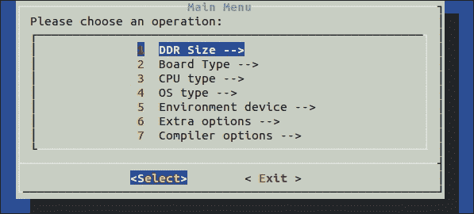

退出时，请确保保存。然后开始编译：

```kt
$ ./compile.sh 
Board type selected: UDOO
CPU Type: QUAD/DUAL
OS type: Android
...
/home/bookuser/udoo/prebuilts/gcc/linux-x86/arm/arm-eabi-4.6/bin/arm-eabi-objcopy -O srec u-boot u-boot.srec
/home/bookuser/udoo/prebuilts/gcc/linux-x86/arm/arm-eabi-4.6/bin/arm-eabi-objcopy --gap-fill=0xff -O binary u-boot u-boot.bin

```

为了保险起见，使用`ls u-boot.bin`验证你的构建是否成功，以确保现在存在`bootloader`镜像。现在，使用以下命令构建 Android：

```kt
$ croot
$ make –j4 2>&1 | tee logz

```

第一个命令是 Android 设置脚本中引入的内容，可以让我们返回到项目树的根目录。第二个命令`make`构建系统。大多数情况下，你应该将`j`的选项设置为 CPU/核心数的两倍。由于你们许多人可能使用的是双核机器，我们将使用`–j4`。例如，这本书的其中一位作者使用 8 个 CPU 核心，并使用`-j16`标志。文件重定向和`tee`命令将构建输出捕获到一个文件中。这对于帮助调试构建问题非常重要。这个构建过程，根据你的系统，可能需要很长时间。在之前提到的 8 核系统（16GB 内存）上，这需要超过 35 分钟。在其他系统上，我们经历过超过 3 小时的构建时间。

在这种情况下，捕获日志证明非常有用。构建以错误结束，通过搜索日志中的`error`，我们找到了以下内容：

```kt
$ grep error logz 
...
external/mtd-utils/mkfs.ubifs/mkfs.ubifs.h:48:23: fatal error: uuid/uuid.h: No such file or directory
external/mtd-utils/mkfs.ubifs/mkfs.ubifs.h:48:23: fatal error: uuid/uuid.h: No such file or directory
external/mtd-utils/mkfs.ubifs/mkfs.ubifs.h:48:23: fatal error: uuid/uuid.h: No such file or directory
...

```

通过评估这些错误，我们发现缺少了`uuid`和`lzo1x`的头文件。我们还可以打开 Android 的 makefile，`external/mtd-utils/mkfs.ubifs/Android.mk`，从行`LOCAL_LDLIBS:= -lz -llzo2 -lm -luuid -m64`确定可能涉及的库。搜索揭示了我们缺少的特定 Ubuntu 包；我们将安装它们并重新构建。搜索字符串末尾的`$`字符确保我们只得到以`uuid/uuid.h`结尾的结果。没有它，我们可能会匹配以`.html`或`.hpp`结尾的文件：

$ sudo apt-file search -x "uuid/uuid.h$"

```kt
uuid-dev: /usr/include/uuid/uuid.h
$ sudo apt-get install uuid-dev
$ make –j4 2>&1 | tee logz

```

成功的构建应该产生一些类似以下的最终输出：

```kt
...
Running: mkuserimg.sh out/target/product/udoo/system out/target/product/udoo/obj/PACKAGING/systemimage_intermediates/system.img ext4 system 293601280 out/target/product/udoo/root/file_contexts
Install system fs image: out/target/product/udoo/system.img
out/target/product/udoo/system.img+out/target/product/udoo/obj/PACKAGING/recovery_patch_intermediates/recovery_from_boot.p maxsize=299747712 blocksize=4224 total=294120167 reserve=3028608

```

# 在 SD 卡上刷新镜像

当`bootloader`、Android 用户空间和 Linux 内核构建完成后，是时候插入 SD 卡并刷入镜像了。将 SD 卡插入你的主机电脑，并确保它未被挂载。在 Ubuntu 中，可移动媒体会被自动挂载，因此你需要找到你的 U 盘的`/dev/sd*`设备，并执行`umount`命令。在本文剩余部分，我们将使用`/dev/sdd`作为 U 盘，但重要的是要使用适合你系统的正确设备。如果你之前使用这张 SD 卡安装过 UDOO，这张卡将包含多个分区，所以你可能会看到多次挂载`/dev/sdd<num>`：

```kt
$ mount | grep sdd
/dev/sdd7 on /media/vender type ext4 (rw,nosuid,nodev,uhelper=udisks)
/dev/sdd4 on /media/data type ext4 (rw,nosuid,nodev,uhelper=udisks)
/dev/sdd5 on /media/57f8f4bc-abf4-655f-bf67-946fc0f9f25b type ext4 (rw,nosuid,nodev,uhelper=udisks)
/dev/sdd6 on /media/cache type ext4 (rw,nosuid,nodev,uhelper=udisks)
$ sudo bash -c "umount /dev/sdd4 && umount /dev/sdd5 && umount /dev/sdd6 && umount /dev/sdd7"

```

一旦 SD 卡被正确卸载，我们可以刷入我们的镜像：

```kt
$ sudo -E ./make_sd.sh /dev/sdd

```

### 提示

你必须在`sudo`中使用`-E`参数以保留 Android 构建中导出的所有变量。你必须处于构建 Android 的同一个终端会话中。否则你会看到错误`No OUT export variable found! Setup not called in advance…`。

完成此操作后（这将需要一段时间），重要的是使用命令`sudo sync`将块设备缓存刷新回磁盘。然后，你可以取出 SD 卡，将其插入 UDOO 并启动！

# UDOO 串行和 Android 调试桥

既然 UDOO 正在启动到 Android，我们希望确保我们也能通过串行端口以及**Android 调试桥**（**adb**）访问它。你需要适合你系统的 UDOO 串行驱动程序。有关 Mac、Linux 和 Windows 的详细信息可以在

[`www.udoo.org/ProjectsAndTutorials/connecting-via-serial-cable/`](http://www.udoo.org/ProjectsAndTutorials/connecting-via-serial-cable/)。

串行端口是系统将使用的第一种通信方式，它由`bootloader`初始化。它是调试你稍后可能遇到的任何内核或系统问题的关键链接。它还用于配置 USB 端口，以便通过 CN3（UDOO 上的 USB OTG 端口）进行`adb`连接。为了配置端口，我们需要配置并使用 minicom 将 shell 连接到设备。首先，将一根 micro USB 线从 CN6（靠近电源按钮的 micro USB 端口）连接到主机。接下来，让我们通过查看`dmesg`中的 TTY 通过 USB 的连接信息来查找串行连接。

```kt
$ sudo dmesg | tail -n 5
[ 9019.090058] usb 4-1: Manufacturer: Silicon Labs
[ 9019.090061] usb 4-1: SerialNumber: 0078AEDB
[ 9019.096089] cp210x 4-1:1.0: cp210x converter detected
[ 9019.208023] usb 4-1: reset full-speed USB device number 4 using uhci_hcd
[ 9019.359172] usb 4-1: cp210x converter now attached to ttyUSB0

```

我们的 TTY 终端在最后一行。让我们通过它使用`minicom`进行连接：

```kt
$ sudo minicom -sw

```

选择**串行端口设置**，输入`a`，将**串行设备**更改为`/dev/ttyUSB0`，并输入`f`以关闭硬件流控制：

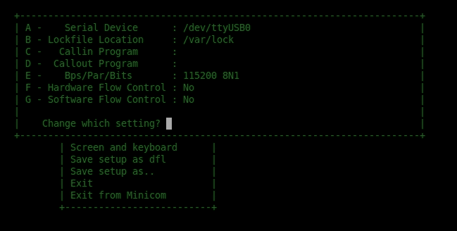

要退出，请按*回车键*，选择**保存设置和 DFL**，然后选择**从 Minicom 退出**，并按*回车键*。现在运行`minicom`以连接到你的 UDOO，并观察它启动：

```kt
$ sudo minicom -w

```

如果设备启动并运行，你将得到一个友好的 root shell：

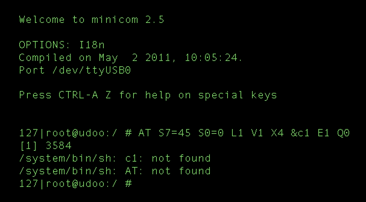

如果它正在启动，你会看到日志。只需等待 root shell 提示：

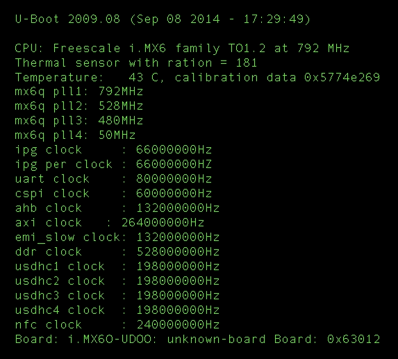

现在我们需要翻转一些 GPIO 引脚，将 CN3 micro USB 设置为调试模式：

```kt
root@udoo:/ # echo 0 > /sys/class/gpio/gpio203/value 
root@udoo:/ # echo 0 > /sys/class/gpio/gpio128/value 

```

然后，通过移除并重新插入 J16 跳线，重置使用该总线的 SAM3X8E 处理器。现在从宿主到 CN3 连接一根 micro USB 线缆。你现在应该能看到一个 USB 设备以及`adb`：

```kt
$ lsusb
Bus 001 Device 009: ID 18d1:4e42 Google Inc.
$ adb devices
List of devices attached 
0123456789ABCDEF  offline

```

当 UDOO Android 端出现提示时，你需要选择**允许 USB 调试**。当你这样做时，设备应该从离线状态变为在线状态；这样你就可以使用`adb`。

现在测试连接并通过`adb`获取截图：

```kt
$ adb shell
root@udoo:/ # 
$ adb shell screencap -p | perl -pe 's/\x0D\x0A/\x0A/g' > screen.png

```

这是一张截图：

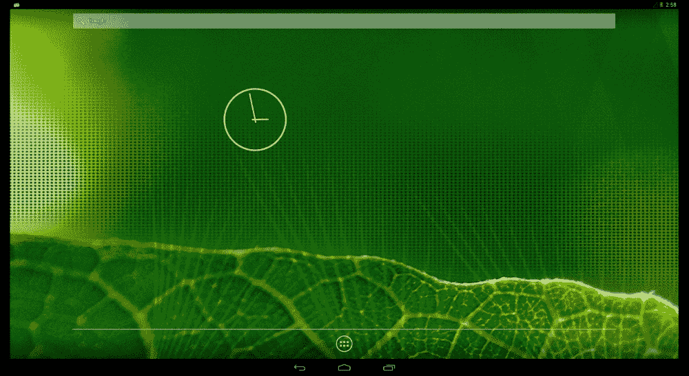

在此阶段，我们拥有了一个可用的开发系统。我们通过串行控制台拥有了早期的启动日志和救援 shell。我们还拥有一个`adb`桥接，通过它我们可以使用标准的 Android 调试工具！现在要做的就是用 SELinux 来增强这个系统的安全性！

# 翻转开关

既然我们现在要在 UDOO 上启用 SELinux，我们需要确认它没有被开启。做到这一点的方法是检查`/proc`文件系统中的已知`filesystem`类型。SELinux 有自己的伪文件系统，所以如果它被启用了，我们应该能在列表中看到它：

```kt
$ adb shell cat /proc/filesystems
nodev  sysfs
nodev  rootfs
nodev  bdev
nodev  proc
nodev  cgroup
nodev  cpuset
nodev  tmpfs
nodev  debugfs
nodev  sockfs
nodev  pipefs
nodev  anon_inodefs
nodev  rpc_pipefs
nodev  devpts
 ext3
 ext2
 ext4
 cramfs
nodev  ramfs
 vfat
 msdos
nodev  nfs
nodev  jffs2
nodev  fuse
 fuseblk
nodev  fusectl
nodev  mtd_inodefs
nodev  ubifs

```

这里没有发现 SELinux 的踪迹，因此让我们找到内核配置并将其开启。从`~/udoo/kernel_imx`目录执行这个命令，最终你会看到一个图形化编辑界面：

```kt
$ make menuconfig

```

首先，你需要启用**审计支持**，因为这是 SELinux 的依赖项。在**通用设置** | **审计支持**下，启用**审计支持**和**启用系统调用审计**。使用上下箭头键来高亮一个条目，并按空格键启用它。当一个项目被启用时，你会在它旁边看到一个星号（*****）：

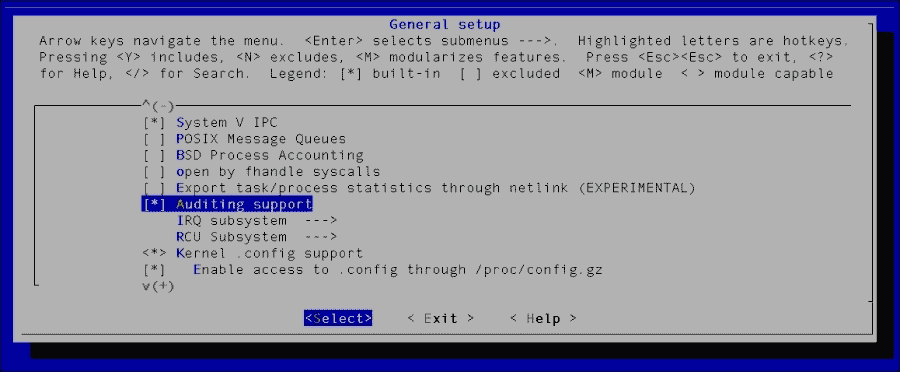

通过选择**退出**回到主菜单...这并不是很直观。进入**文件系统**菜单，对于三个文件系统中的每一个——**Ext2**、**Ext3**和**Ext4**，确保启用了**扩展属性**和**安全标签**。然后，通过选择**退出**回到主菜单：

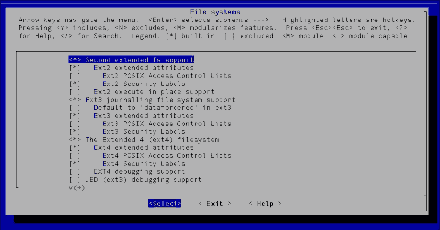

从那个屏幕退出回到主菜单，然后转到**安全选项**。一旦进入**安全选项**子菜单，启用**启用不同的安全模型**和**套接字和网络安全性钩子**选项：

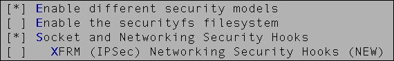

启用这些之后，会出现更多选项。启用**NSA SELinux 支持**并确保从以下截图中复制其他的选择和值：

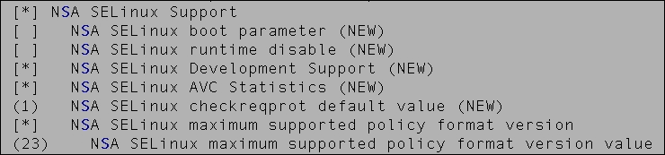

最后，将**默认安全模块**设置为 SELinux：


一旦你选择**默认安全模块**，一个新的窗口将出现，从中你可以选择**SELinux**。通过选择**退出**退出配置菜单，直到你被要求保存新的配置：

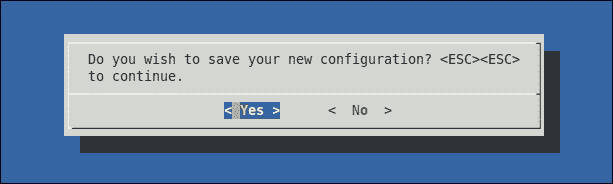

保存新的配置并将这些更改写入原始内核配置文件。否则，在后续构建时它将被覆盖。为此，我们需要找出在默认构建中使用了哪个配置文件，这是我们之前在使用`make menuconfig`制作我们自己的配置之前构建的：

```kt
$ grep defconfig logz make -C kernel_imx imx6_udoo_android_defconfig ARCH=arm CROSS_COMPILE=`pwd`/prebuilts/gcc/linux-x86/arm/arm-eabi-4.6/bin/arm-eabi-

```

你可以看到`imx6_udoo_android_defconfig`被用作默认配置。复制你的自定义配置并再次构建：

```kt
$ cp .config arch/arm/configs/imx6_udoo_android_defconfig
$ croot
$ make –j4 bootimage 2>&1 | tee logz

```

快速检查日志文件以验证 SELinux 实际上是否已构建到内核中，这总是一个好主意：

```kt
$ grep -i selinux logz 
HOSTCC scripts/selinux/mdp/mdp
HOSTCC scripts/selinux/genheaders/genheaders
GEN security/selinux/flask.h security/selinux/av_permissions.h
CC security/selinux/avc.o
...

```

现在，使用支持 SELinux 的构建内核，将 SD 卡插入主机并运行以下命令：

```kt
$ sudo -E ./make_sd.sh /dev/sdd
$ sudo sync

```

### 提示

不要忘记像之前一样从 SD 卡卸载任何自动挂载的分区。

将 SD 卡插入 UDOO 并启动它。你应该会像之前一样在串行控制台看到日志：

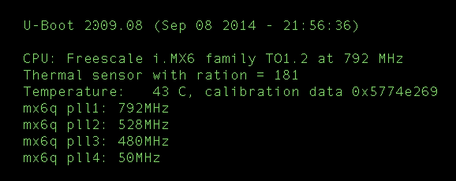

最终，串行连接应该能让我们进入根 shell。

# 它是活的

我们如何知道我们已经成功在内核中启用了 SELinux？在本章早些时候，你运行了命令`adb shell cat /proc/filesystems`。我们将做同样的事情并寻找一个名为`selinuxfs`的新文件系统。如果它存在，那就表明我们已经成功启用了 SELinux。在串行终端运行以下命令：

```kt
# cat /proc/filesystems | grep selinux 
nodev selinuxfs

```

我们可以看到`selinuxfs`是存在的！另一种常见的做法是检查`dmesg`中是否有任何 SELinux 的输出。为此，通过串行终端执行以下命令：

```kt
# dmesg | grep -i selinux
<6>SELinux: Initializing.
<7>SELinux: Starting in permissive mode
<7>SELinux: Registering netfilter hooks
<3>SELinux: policydb version 26 does not match my version range 15-23
<4>SELinux: Could not load policy: Invalid argument

```

# 概述

这是一个非常令人兴奋的章节。你学会了如何在内核配置中启用 SELinux，启动“安全”系统，以及如何验证其存在。我们还了解了如何为 UDOO 刷写和构建通用镜像以及如何通过串行和`adb`连接到它。在接下来的章节中，我们将重点介绍如何使用 SE for Android 功能使 UDOO 可用。
