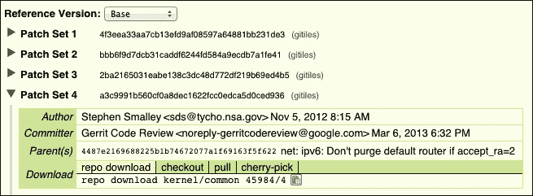

# 第七章：利用审计日志

到目前为止，我们已经看到 AVC 记录或 SELinux 拒绝消息在`dmesg`中出现，但`dmesg`是一个循环内存缓冲区，它可能会因为你的内核有多啰嗦而频繁翻滚。通过使用审计内核子系统，我们可以将这些消息路由到用户空间并将它们记录到磁盘上。在桌面上，执行这项工作的守护进程被称为`auditd`。`auditd`的最小端口在 NSA 分支中维护，但它尚未正式合并到 AOSP 中。由于我们正在 Android 4.3 上工作，我们将使用来自 NSA 分支的`auditd`版本。截至 2014 年 4 月 7 日的正式合并版本可以在[`android-review.googlesource.com/#/c/89645/`](https://android-review.googlesource.com/#/c/89645/)找到。它是在`logd`中实现的，并在[`android-review.googlesource.com/#/c/83526/`](https://android-review.googlesource.com/#/c/83526/)合并。

在本章中，我们将：

+   使用快速发展的 SE 更新我们的系统，为**Android 开源社区**（**AOSP**）

+   调查审计子系统的工作原理

+   学习阅读 SELinux 审计日志并开始编写策略

+   观察与日志相关的上下文

所有的 LSM 都应该将它们的日志信息记录到审计子系统中。审计子系统可以将这些信息通过`printk`路由到内核循环缓冲区，或者如果有的话，路由到用户空间的审计守护进程。内核和用户空间日志守护进程通过`AUDIT_NETLINK`套接字进行通信。我们将在本章中进一步剖析这个接口。

最后，审计子系统在发生策略违规时具有打印全面记录的能力。虽然你不需要这个功能来启用和操作 SELinux，但它可以让你更轻松。要启用这个系统，你必须使用`auditd`，因为`logd`目前不支持这个功能。你需要使用`CONFIG_AUDITSYSCALL=y`构建你的内核，并在`/data/misc/audit/`中放置一个`audit.rules`文件。在你按照以下说明补丁你的树之后，阅读`system/core/auditd/README`。

不幸的是，UDOO 内核版本 3.0.35 不支持`CONFIG_AUDITSYSCALL`。位于[`git.kernel.org/cgit/linux/kernel/git/stable/linux-stable.git/commit/?id=29ef73b7a823b77a7cd0bdd7d7cded3fb6c2587b`](https://git.kernel.org/cgit/linux/kernel/git/stable/linux-stable.git/commit/?id=29ef73b7a823b77a7cd0bdd7d7cded3fb6c2587b)的补丁应该能够启用支持。然而，在 UDOO 上，它导致了一个我们无法追踪的死锁。

# 升级——大量的补丁

虽然谷歌发布的 Android 4.3 支持 SE for Android，但在审计方面仍然有限制。将此功能带入更易用状态的最简单方法之一是从国家安全局（NSA）的 SE for Android 4.3 分支获取一些项目的补丁。在这里，社区已经开发和部署了许多在 4.3 时间框架内未合并的更高级功能。

NSA 在[`bitbucket.org/seandroid/`](https://bitbucket.org/seandroid/)维护着仓库。项目众多，因此确定使用哪个项目以及哪个分支可能会让人望而却步。找到它们的方法是逐个查看每个项目，并找到具有`SEAndroid-4.3`分支的项目。由于我们不构建 AOSP 设备，因此无需深入设备树。这样的项目列表如下：

+   [`bitbucket.org/seandroid/system-core`](https://bitbucket.org/seandroid/system-core)

+   [`bitbucket.org/seandroid/frameworks-base`](https://bitbucket.org/seandroid/frameworks-base)

+   [`bitbucket.org/seandroid/external-libselinux`](https://bitbucket.org/seandroid/external-libselinux)

+   [`bitbucket.org/seandroid/build`](https://bitbucket.org/seandroid/build)

+   [`bitbucket.org/seandroid/frameworks-native`](https://bitbucket.org/seandroid/frameworks-native)

我们还可以安全地跳过`sepolicy`，因为我们已经将其更新到最前沿，但内核有点棘手。我们需要来自 kernel-common（[`bitbucket.org/seandroid/kernel-common`](https://bitbucket.org/seandroid/kernel-common)）的更改和 binder 补丁（[`android-review.googlesource.com/#/c/45984/`](https://android-review.googlesource.com/#/c/45984/)），可以按如下方式获取：

```kt
$ mkdir ~/sepatches
$ cd ~/sepatches
$ git clone https://bitbucket.org/seandroid/system-core.git
$ git clone https://bitbucket.org/seandroid/frameworks-base.git
$ git clone https://bitbucket.org/seandroid/external-libselinux.git
$ git clone https://bitbucket.org/seandroid/build.git
$ git clone https://bitbucket.org/seandroid/frameworks-native.git

```

我们可以先通过查看`build/core/build_id.mk`文件，以及使用网页[`source.android.com/source/build-numbers.html`](https://source.android.com/source/build-numbers.html)进行查询，来确定我们需要修补的确切版本。

文件显示`BUILD_ID`是`JSS15J`，查询结果显示我们正在使用`android-4.3_r2.1`版本为 UDOO 工作。

对于到目前为止下载的每个项目，通过运行命令`git checkout origin/seandroid-4.3_r2`生成补丁。最后，执行`git format-patch origin/jb-mr2.0-release`。由于没有`4.3._r2.1`分支，我们使用`r2`。

对于这些补丁中的每一个，你需要从对应的`udoo/<project>`文件夹中在树形结构中应用它们。重要的是，需要按照数字顺序为每个项目应用补丁，从`0001*`补丁开始，然后是`0002*`，依此类推。以下是为`system-core`项目应用第一个补丁的示例。请注意，这些 Git 仓库使用连字符代替源树中的斜杠；因此`frameworks-base`对应于`frameworks/base`。

首先，生成补丁：

```kt
$ cd sepatches/system-core
$ git checkout origin/seandroid-4.3_r2
$ git format-patch origin/jb-mr2.0-release

```

按如下方式应用第一个补丁：

```kt
$ cd <udoo_root>/system/core
$ patch -p1 < ~/sepatches/system-core/0001-Add-writable-data-space-for-radio.patch 
patching file rootdir/init.rc
Reversed (or previously applied) patch detected! Assume -R? [n] 

```

### 注意

注意对于 UDOO 来说，在`frameworks/base`中不要应用高于`0005`编号的补丁。对于其他项目，你应该应用所有补丁。

注意错误。一旦你看到这个，就按*Ctrl* + *C*退出补丁过程。Git 树并不完美，因此一些补丁已经存在于 UDOO 源码中。补丁命令会通知我们，并且当有警告时，我们可以通过取消它们（用*Ctrl* + *C*）来跳过这些补丁。继续检查补丁，取消已经应用的，并修复任何失败的部分。在补丁用户空间后，强烈建议你构建一次以确保没有任何东西被破坏。

一旦用户空间完全打上补丁，我们需要对内核进行补丁处理。首先使用`git clone https://bitbucket.org/seandroid/kernel-common.git`命令从 Bitbucket 克隆 kernel-common 项目。我们将使用与其他项目相同的方法对内核进行补丁处理，除了 binder 补丁。通过查看提到的 binder 补丁链接[`android-review.googlesource.com/#/c/45984/`](https://android-review.googlesource.com/#/c/45984/)，我们发现 Git SHA 哈希是`a3c9991b560cf0a8dec1622fcc0edca5d0ced936`，如下截图中的**补丁集 4**参考字段所示：



然后，我们可以为这个 SHA 哈希生成补丁：

```kt
$ git format-patch -1 a3c9991b560cf0a8dec1622fcc0edca5d0ced936
0001-Add-security-hooks-to-binder-and-implement-the-hooks.patch

```

然后，像之前一样使用补丁命令应用该补丁。补丁有一个头文件包含的失败块；只需像其他一样使用拒绝文件修复它。当你构建时，你会在内核中得到这个错误。

```kt
security/selinux/hooks.c:1846:9: error: variable 'sad' has initializer but incomplete type
security/selinux/hooks.c:1846:28: error: storage size of 'sad' isn't known

```

去掉这一行以及所有相关引用。这是在 3.0 内核中做出的一个更改：

```kt
struct selinux_audit_data sad = {0,};
ad.selinux_audit_data = &sad;
```

### 注意

我们通过查看原始 3.0 补丁找出了这个问题，这些补丁可以在以下链接找到：

[`bitbucket.org/seandroid/kernel-omap/commits/59bc19226c746f479edc2acca9a41f60669cbe82?at=seandroid-omap-tuna-3.0`](https://bitbucket.org/seandroid/kernel-omap/commits/59bc19226c746f479edc2acca9a41f60669cbe82?at=seandroid-omap-tuna-3.0)

如你所知，UDOO 使用自定义的`init.rc`。我们需要将任何对`init.rc`的更改添加到 UDOO 实际使用的那个文件中。所有可以修改`init.rc`的补丁都会在 system-core 项目中，特别是这些：

+   `0003-Auditd-initial-commit.patch`

+   `0007-Handle-policy-reloads-within-ueventd-rather-than-res.patch`

+   `0009-Allow-system-UID-to-set-enforcing-and-booleans.patch`

去找这些补丁中对`init.rc`的更改，并使用同样的补丁技术将它们应用到`device/fsl/imx6/etc/init.rc`中。

# 审计系统

在上一节中，我们做了很多补丁工作；其目的是为了启用在 Android 及其依赖项上完成的审核集成工作。这些补丁还修复了一些代码中的错误，并且非常重要地启用了 SELinux/LSM binder 挂钩和政策控制。

Linux 中的审计系统被 LSMs 用来打印拒绝记录，以及收集非常详尽和完整的事件记录。无论何时，当 LSM 打印消息时，它都会传播到审计子系统并打印出来。然而，如果启用了审计子系统，那么你将获得与拒绝相关的更多上下文信息。审计子系统甚至支持加载规则来观察这些情况。例如，你可以观察所有对`/system`的写入操作，这些操作并非由系统 UID 执行。

## `auditd`守护进程

`auditd`守护进程或服务在用户空间运行，并通过 NETLINK 套接字监听审计子系统。守护进程注册自己以接收内核消息，并且可以通过此套接字加载审计规则。一旦注册，`auditd`守护进程就会接收到所有审计事件。`auditd`守护进程被最小化移植，并且曾经尝试将其主线化到 Android 中，但后来被拒绝。然而，`auditd`已被多个 OEM（如三星）以及 NSA 的 4.3 分支使用。后来将记录放入 logcat 的替代方法被合并到 Android 中（更多信息，请参考[`android-review.googlesource.com/89645`](https://android-review.googlesource.com/89645)）。

之前，我们在`dmesg`中看到了来自 SELinux 的 AVC 拒绝消息。这个问题在于，当有大量拒绝或内核通信频繁时，循环内存日志容易发生翻转。使用`auditd`，所有消息都会发送到守护进程，并写入`/data/misc/audit/audit.log`文件。这个日志文件，即本文中的`audit.log`，可能在设备启动时存在，并轮换到`/data/misc/audit/audit.old`文件，即`audit.old`。守护进程将恢复到新的`audit.log`文件中记录。当超过大小阈值`AUDITD_MAX_LOG_FILE_SIZEKB`（在编译时在`system/core/auditd/Android.mk`文件中设置）时，会发生轮换事件。这个阈值通常是 1000 KB，但可以在设备的`makefile`中更改。此外，使用`kill`发送`SIGHUP`也会导致轮换，如下例所示。

验证守护进程正在运行并获取其 PID：

```kt
root@udoo:/ # ps -Z | grep audit
u:r:auditd:s0 audit 2281 1 /system/bin/auditd
u:r:kernel:s0 root 2293 2 kauditd

```

验证只存在一个日志文件：

```kt
root@udoo:/ # ls -la /data/misc/audit/
-rw-r----- audit system 79173 1970-01-02 00:19 audit.log

```

轮换日志：

```kt
root@udoo:/ # kill -SIGHUP 2281

```

验证`audit.old`：

```kt
root@udoo:/ # ls -la /data/misc/audit/
-rw-r----- audit system 319 1970-01-02 00:20 audit.log
-rw-r----- audit system 79173 1970-01-02 00:19 audit.old

```

## `auditd`内部机制

由于 Linux 桌面版的`auditd`和`libaudit`代码采用 GPL 许可证，因此针对 Android 进行了重写，并在 Apache 许可证下发布。重写工作是最小化的，因此你只会找到为实现守护进程所必需的函数。不过，功能和头文件接口应该保持一致。

`auditd`守护进程的生命周期始于`system/core/auditd.c`中的`main()`函数。它迅速将权限从 root UID 更改为特殊的`auditd` UID。这样做时，它保留了`CAPSYS_AUDIT`，这是使用`AUDIT` NETLINK 套接字所需的 DAC 能力检查。它通过调用`drop_privileges_or_die()`来实现这一点。从那里，它使用`getopt()`进行一些选项解析，最终我们到达了审计特定的调用，第一个调用是使用`audit_open()`打开 NETLINK 套接字。这个函数简单地调用`socket(PF_NETLINK, SOCK_RAW, NETLINK_AUDIT)`，它打开到 NETLINK 套接字的文件描述符。打开套接字后，守护进程通过调用`audit_log_open(const char *logfile, const char *rotatefile, size_t threshold)`来打开对`audit.log`的句柄。这个函数检查`audit.log`文件是否存在，如果存在，将其重命名为`audit.old`。然后创建一个新的空日志文件来记录数据。

下一步是将守护进程注册到审计子系统，这样它就知道要向谁发送消息。通过设置守护进程的 PID，你可以确保只有这个守护进程会收到消息。由于 NETLINK 可以支持许多读取者，你不会希望一个"流氓`auditd`"读取这些消息。说到这一点，守护进程调用`audit_set_pid(audit_fd, getpid(), WAIT_YES)`，其中`audit_fd`来自`audit_open()`的 NETLINK 套接字，`getpid()`返回守护进程的 PID，`WAIT_YES`使守护进程阻塞直到操作完成。接下来，守护进程通过调用`audit_set_enabled(audit_fd, 1)`启用审计子系统的先进功能，并通过`audit_rules_read_and_add(audit_fd, AUDITD_RULES_FILE)`向审计子系统添加规则。这个函数从该文件读取规则，格式化一些结构，并将这些结构发送到内核。

`audit_set_enabled()`和`audit_rules_read_and_add()`只有在内核构建时带有`CONFIG_AUDITSYSCALL`时才有效。在此之后，守护进程检查是否指定了`-k`选项。`-k`选项告诉`auditd`在`dmesg`中查找任何错过的审计记录。它这样做是因为在捕获审计记录之前，环形缓冲区溢出与用户空间启动许多服务、生成审计事件和政策违规之间存在竞争。本质上，这有助于将早期启动的审计事件合并到相同的日志文件中。

在此之后，守护进程进入一个循环，从 NETLINK 套接字读取，格式化消息，并将其写入日志文件。它通过使用`poll()`等待 NETLINK 套接字上的 IO 来开始这个循环。如果`poll()`以错误退出，循环继续检查`quit`变量。如果引发`EINTR`，则在信号处理程序中将循环保护变量`quit`设置为`true`，守护进程退出。如果`poll()`在 NETLINK 上有数据，守护进程调用`audit_get_reply(audit_fd, &rep, GET_REPLY_BLOCKING, 0)`，通过`rep`参数获取一个`audit_reply`结构体。然后它将`audit_reply`结构体（带有格式化）写入`audit.log`文件，使用`audit_log_write(alog, "type=%d msg=%.*s\n", rep.type, rep.len, rep.msg.data)`。它这样做直到引发`EINTR`，此时守护进程退出。

当守护进程退出时，它会清除已注册到内核的 PID（`audit_set_pid(audit_fd, 0)`），通过`audit_close()`关闭审计套接字（实际上只是系统调用，`close(audit_fd)`），并使用`audit_log_close()`关闭`audit.log`。`audit_log_*`函数家族不是审计 GPLed 接口的一部分，是一种自定义写入方式。

当谷歌将`auditd`移植到 Android 的`logd`基础架构时，它使用了守护进程`main()`使用的相同函数和库代码，并将其包装到`logd`中。然而，谷歌并没有采用`audit_set_enabled()`和`audit_rules_read_and_add()`函数。

# 解释 SELinux 拒绝日志

SELinux 拒绝信息会被路由到内核审计子系统，到`auditd`，最终到达`audit.log`和`audit.old`。由于日志位于`audit.log`中，让我们通过`adb`拉取这个文件，并仔细查看它。

在主机上运行以下命令，确保已启用`adb`：

```kt
$ adb pull /data/misc/audit/audit.log

```

现在，让我们跟踪那个文件，查找这些行：

```kt
$ tail audit.log
...
type=1400 msg=audit(88526.980:312): avc: denied { getattr } for pid=3083 comm="adbd" path="/data/misc/audit/audit.log" dev=mmcblk0p4 ino=42 scontext=u:r:adbd:s0 tcontext=u:object_r:audit_log:s0 tclass=file
type=1400 msg=audit(88527.030:313): avc: denied { read } for pid=3083 comm="adbd" name="audit.log" dev=mmcblk0p4 ino=42 scontext=u:r:adbd:s0 tcontext=u:object_r:audit_log:s0 tclass=file
type=1400 msg=audit(88527.030:314): avc: denied { open } for pid=3083 comm="adbd" name="audit.log" dev=mmcblk0p4 ino=42 scontext=u:r:adbd:s0 tcontext=u:object_r:audit_log:s0 tclass=file

```

这里的记录由两个主要部分组成：`type`和`msg`。`type`字段指示了消息的类型。类型为 1400 的消息是 AVC 消息，即 SELinux 拒绝消息（还有其他类型）。前述策略的`msg`（消息的简称）部分包含我们需要分析的部分。

我们最后执行的命令是 `adb pull /data/misc/audit/aduit.log`，正如你所见，在`audit.log`文件的末尾我们有几处`adb`策略违规。让我们先从这个事件开始查看：

```kt
type=1400 msg=audit(88526.980:312): avc: denied { getattr } for pid=3083 comm="adbd" path="/data/misc/audit/audit.log" dev=mmcblk0p4 ino=42 scontext=u:r:adbd:s0 tcontext=u:object_r:audit_log:s0 tclass=file

```

我们可以看到`comm`字段是`adbd`。然而，相信这个值并不明智，因为它可以使用`prctl()`接口从用户空间进行控制。它只能被视为一个提示。最好的验证方法是使用`ps -Z`检查 PID：

```kt
# ps -Z | grep adbd
u:r:adbd:s0 root 3083 1 /sbin/adbd

```

在验证守护进程后，我们现在可以更详细地检查这个消息。消息由以下字段组成（可选字段由`*`标识）：

+   `avc: denied`：这部分将始终发生，表示它是一个拒绝记录。

+   `{ permission }`：这是被拒绝的权限，在本例中是`getattr`。

+   `for`：这将始终被打印出来，使输出可读。

+   `Path*`：这是可选字段，包含有关对象路径的信息。它只对文件系统访问拒绝有意义。

+   `dev*`：这是可选字段，用于标识挂载文件系统的块设备。它只对文件系统访问拒绝有意义。

+   `ino*`：这是文件的可选 inode。Linux 中只有匿名文件会打印 inode。它只对文件系统访问拒绝有意义。

+   `tclass`：这是对象的目标类，在我们的案例中是`file`。

在这一点上，我们需要从非常精炼的层面理解拒绝记录中的`msg`部分在告诉我们什么。它说的是 Android 调试桥接守护进程想要在我们的策略文件上调用`getattr`。在下面几个事件中，我们还会看到它还想要`read`和`open`。这是运行`adb pull`的副作用。`getattr`权限拒绝来自`stat()`系统调用，而`read/open`则来自`read()`和`open()`系统调用。如果你想要在策略中允许这一点，这将是基于你的威胁模型的安全决策，你应该添加：

```kt
allow adbd audit_log:file { getattr read open };

```

或者，使用`global_macros`中定义的宏集合：

```kt
allow adbd audit_log:file r_file_perms;

```

大多数时候，你应该使用`global_macros`中定义的宏进行文件权限访问。通常，逐个添加它们非常耗时且繁琐。宏将权限分组在一个与读、写、执行 DAC 权限类似的环境中。例如，如果你给它`open`和`read`，那么源域在某个时刻可能需要 stat 文件。所以，`r_file_perms`宏已经包含了这些权限。

你应该将此规则添加到`external/sepolicy/adbd.te`中。`.te`文件（也称为`type enforcement`文件）是按源上下文组织的，因此请确保将其添加到正确的文件中。我们不推荐添加此允许规则——没有合法的理由让`adbd`需要访问审计日志——我们可以通过`dontaudit`规则安全地忽略这些：

```kt
dontaudit adbd audit_log:file r_file_perms;

```

`dontaudit`规则是一个策略声明，表示不要审计（打印）符合此规则的拒绝操作。

如果你不确定该怎么办，最好的建议是利用 SE for Android、SELinux 和 audit 的邮件列表。只需确保信息与特定邮件列表主题相关即可。

存在一个名为`audit2allow`的工具，可以帮助你编写策略允许规则。然而，它只是一个工具，可能会被误用。它将策略文件转换为策略的允许规则：

```kt
$ cat audit.log | audit2allow 
#============= adbd ==============
allow adbd audit_log:file { read getattr open };

```

`audit2allow`工具不知道宏，也不清楚你是否真的想要将此允许规则添加到策略文件中。只有策略作者才能做出这个决定。

还有一个名为`fixup.py`的工具，用于启用`r_file_*`宏映射。你可以在[`bitbucket.org/billcroberts/fixup/overview`](https://bitbucket.org/billcroberts/fixup/overview)获取此工具。下载后，使其可执行，并将其放在你的可执行路径中的某个位置：

```kt
$ chmod a+x fixup.py
$ cat audit.log | audit2allow | fixup.py 
#============= adbd ==============
allow adbd audit_log:file r_file_perms;

```

# 上下文

从最简单的意义上说，编写策略只是识别策略违规并添加适当的允许规则到策略文件的活动。然而，为了使 SELinux 有效，源和目标上下文必须正确。如果它们不正确，允许规则就没有意义。

你可能首先遇到的是目标类型未标记的拒绝问题。在这种情况下，需要设置适当的目标标签（参考第十一章，*标签属性*）。此外，进程标签可能也会出错。多个进程可能属于一个域，除非通过策略明确操作，否则子进程会继承父进程的域。然而，在 Android 中，具有多个进程的域是非常有限的。你永远不会在`init`、`system_server`、`adbd`、`auditd`、`debuggerd`、`dhcp`、`servicemanager`、`vold`、`netd`、`surfaceflinger`、`drmserver`、`mediaserver`、`installd`、`keystore`、`sdcardd`、`wpa`和`zygote`域中看到多个进程。

在以下域中看到多个进程是可以的：

+   `system_app`

+   `untrusted_app`

+   `platform_app`

+   `shared_app`

+   `media_app`

+   `

+   `isolated_app`

+   `shell`

在已发布的设备上，不应该在`su`、`recovery`和`init_shell`域中运行任何东西。下表提供了域到预期可执行文件和量度的完整映射：

| 域 | 可执行文件 | 量度 (N) |
| --- | --- | --- |
| `u:r:init:s0` | `/init` | `N == 1` |
| `u:r:ueventd:s0` | `/sbin/ueventd` | `N == 1` |
| `u:r:healthd:s0` | `/sbin/healthd` | `N == 1` |
| `u:r:servicemanager:s0` | `/system/bin/servicemanager` | `N == 1` |
| `u:r:vold:s0` | `/system/bin/vold` | `N == 1` |
| `u:r:netd:s0` | `/system/bin/netd` | `N == 1` |
| `u:r:debuggerd:s0` | `/system/bin/debuggerd, /system/bin/debuggerd64` | `N == 1` |
| `u:r:surfaceflinger:s0` | `/system/bin/surfaceflinger` | `N == 1` |
| `u:r:zygote:s0` | `zygote, zygote64` | `N == 1` |
| `u:r:drmserver:s0` | `/system/bin/drmserver` | `N == 1` |
| `u:r:mediaserver:s0` | `/system/bin/mediaserver` | `N >= 1` |
| `u:r:installd:s0` | `/system/bin/installd` | `N == 1` |
| `u:r:keystore:s0` | `/system/bin/keystore` | `N == 1` |
| `u:r:system_server:s0` | `system_server` | `N ==1` |
| `u:r:sdcardd:s0` | `/system/bin/sdcard` | `N >=1` |
| `u:r:watchdogd:s0` | `/sbin/watchdogd` | `N >=0 && N < 2` |
| `u:r:wpa:s0` | `/system/bin/wpa_supplicant` | `N >=0 && N < 2` |
| `u:r:init_shell:s0` | `null` | `N == 0` |
| `u:r:recovery:s0` | `null` | `N == 0` |
| `u:r:su:s0` | `null` | `N == 0` |

已经编写了几个围绕此问题的**兼容性测试套件**（**CTS**）测试，并提交到了 AOSP，地址为[`android-review.googlesource.com/#/c/82861/`](https://android-review.googlesource.com/#/c/82861/)。

根据一个好的策略应该具备的这些通用断言，我们来评估我们的策略。

首先，我们将检查未标记的对象。从主机上，使用`adb pull`获取的`audit.log`文件：

```kt
$ cat audit.log | grep unlabeled
...
type=1400 msg=audit(86527.670:341): avc: denied { rename } for pid=3206 comm="pool-1-thread-1" name="com.android.settings_preferences.xml" dev=mmcblk0p4 ino=129664 scontext=u:r:system_app:s0 tcontext=u:object_r:unlabeled:s0 tclass=file
...

```

看起来我们有一些文件和其他东西没有正确标记；我们将在第十一章 *标签属性* 中解决这些问题。现在，让我们检查那些不应该有多个进程的域，并在这些域中找到不适当的二进制文件（参考之前的表格以获取完整的映射。）

Init：

```kt
$ adb shell ps -Z | grep u:r:init:s0
u:r:init:s0 root 1 0 /init
u:r:init:s0 root 2267 1 /sbin/watchdogd

```

Zygote：

```kt
$ adb shell ps -Z | grep u:r:zygote:s0
u:r:zygote:s0 root 2285 1 zygote
$ adb shell ps -Z | grep u:r:init_shell
u:r:init_shell:s0 root 2278 1 /system/bin/sh
… through all domains

```

在进行这项工作后，我们发现了一些问题，因为某些进程正在`init_shell`域中运行，而`watchdogd`在`init`域中。这些必须得到纠正。

# 概述

编写`sepolicy`相对简单，编写好的策略则是一门艺术。它要求策略作者理解系统和`allow`规则的含义。策略本身是一种元编程语言，这种语言控制用户空间和内核如何协同工作，与任何程序类似，策略可以针对特定的用途进行架构设计。策略可能过于宽松（基本上无用），或者非常严格，在不破坏已正常工作部分的情况下难以更改。

一个好的策略需要保持系统预期功能的正常运行，因此对 Android 内的所有系统进行彻底测试是至关重要的。CTS 在锻炼 Android 方面非常有帮助，但它通常并不能覆盖所有情况；建议进行用户测试。在下一章中，我们将介绍文件系统和文件系统对象如何获得其安全标签，以及我们如何更改它们。稍后，我们将介绍如何使用 CTS 作为一个工具来测试系统，并对预期行为生成策略违规。
