# 第一章：准备使用 Android：开发环境和项目设置

本章将涵盖以下内容：

+   使用 Flash Professional CS5.5 开发 Android 应用程序

+   使用 Flash Professional CS5.5 针对 AIR for Android 进行开发

+   使用 Flash Builder 4.5 开发 Android 应用程序

+   使 Flash Builder 4 或 Flex Builder 能够访问 Flex Mobile SDK

+   使用 Flash Builder 4 及以下版本开发 Android 应用程序

+   使用 Powerflasher FDT 4.2 开发 Android 应用程序

+   使 Powerflasher FDT 4.1 能够访问 Flex Mobile SDK

+   使用 Powerflasher FDT 4.1 及以下版本开发 Android 应用程序

+   将标准 Flex 项目转换为 Flex Mobile 项目

+   在 Windows 上配置 AIR SDK 以打包 Android 应用程序

+   在 Linux 或 Mac OS 上配置 AIR SDK 以打包 Android 应用程序

# 引言

有许多**IDE（集成开发环境）**可用于为 Android 设备开发 Flash 平台项目。我们将关注一些最受欢迎的：Adobe Flash Professional、Adobe Flash Builder 和 Powerflasher FDT。本章将包括针对每个 IDE 启动新 Android 项目的食谱，以及关于工作流程和工具集的最大化利用。您将学习如何配置每个环境以开发 Android 操作系统。

Flash Builder 和 FDT 以及 Flex 框架为 Android 开发提供了最多的支持，因为有一个简化的工作流程、控件集合和容器，特别是使用 Adobe AIR for Android 作为开发平台开发移动 Android 项目时。

Flash Professional 提供了一些工作流程工具，但主要的好处在于对环境的潜在熟悉，以及生成不依赖于 Flex 框架的项目。这个 IDE 由于其开放性，常用于游戏开发。

对于纯粹主义者或替代 IDE 的用户，也可以使用免费的 AIR SDK 工具通过命令行界面生成 Android 应用程序。

# 使用 Flash Professional CS5.5 开发 Android 应用程序（注意：重复内容不翻译）

Flash Professional 是构建比基于 Flex 的应用程序更轻量级的 Android 应用程序的一个不错的选择。与包含在 Flash Builder 等 IDE 中的流程相比，Flash Professional 的流程并不那么健壮，但根据开发的应用程序，它可能是更合适的选择。

Flash Professional CS5.5 已经内置了针对 Android 开发的所有必要工具！

## 如何操作…

在 Flash Professional CS5.5 中设置一个 AIR for Android 项目非常直接：

1.  我们首先会在 Flash Professional 欢迎屏幕的**创建新项目**部分选择**AIR for Android**来创建一个新项目：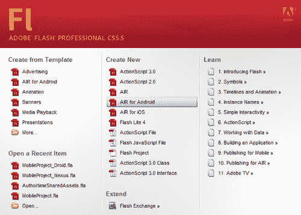

1.  然后，我们可以通过查看**属性**面板下的文档属性来确认我们正在针对 Android 的 AIR：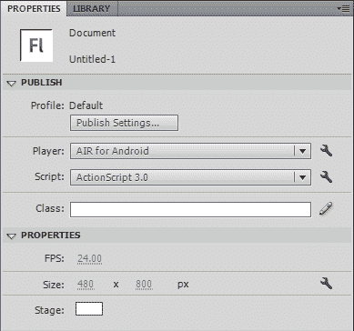

1.  我们还可以通过选择**AIR for Android**作为**播放器**选项，修改现有的 Flash 文档以针对 Android。

1.  现在，只需像平常一样构建你的 Flash 项目即可。Adobe 使使用 Flash Professional CS5.5 针对 Android 的过程变得非常轻松。

## 工作原理…

使用 Flash Professional CS5.5，我们拥有比以往任何时候都多的编译器选项。按照前一部分所述步骤操作，可以确保通过向发布设置中添加一些针对 Android 的特定编译器选项，使你的项目能够以桌面 Flash Player 或桌面 AIR 为目标，转而针对 Android 的 AIR。

## 还有更多…

如果针对 Android 的移动 Flash Player 开发，我们将不需要为 AIR 运行时配置任何内容。要针对 Flash Player，我们只需牢记移动 Android 设备固有的限制和差异。

# 使用 Flash Professional CS5.5 针对 Android 的 AIR

Flash Professional 是构建比基于 Flex 的对应产品更轻量级 Android 应用程序的一个不错的选择。与包含在像 Flash Builder 这样的 IDE 中的工作流程相比，Flash Professional 的情况并不那么健壮，但根据开发中的应用程序，它可能是更合适的选择。

## 如何操作…

使用 Flash Professional 针对 Android 的 AIR 有两种方法：

1.  首先，在 Flash Professional 欢迎屏幕的**从模板创建**部分选择**AIR for Android**创建一个新项目：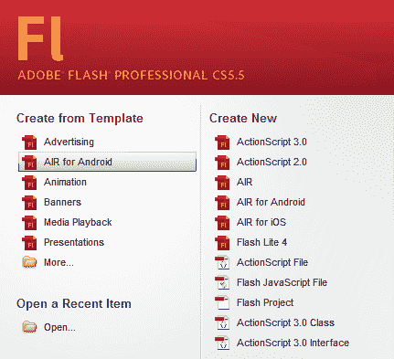

1.  这将提供几个针对**AIR for Android**的模板供选择。为你设备选择合适的模板：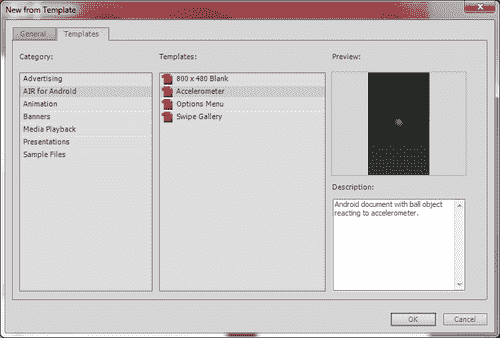

1.  或者，创建一个新的 ActionScript 3.0 项目，并通过转到**文件 | 发布设置**打开你的发布设置。

1.  这将打开一个对话框，允许你选择目标平台。在这种情况下，我们要选择**AIR Android**作为适当的**播放器**：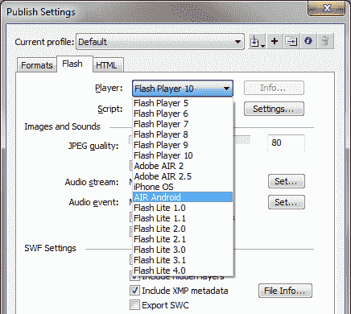

1.  现在，你将能够调整针对 Android 的**应用程序**和**安装程序设置**，并将项目编译成`.apk`文件。

## 工作原理…

使用 Flash Professional 的最新版本，我们拥有比以往任何时候都多的编译器选项。按照上述步骤操作，可以确保通过向发布设置中添加一些针对 Android 的特定编译器选项，使你的项目能够以桌面 Flash Player 或桌面 AIR 为目标，转而针对 Android 的 AIR。

## 还有更多…

如果针对 Android 的移动 Flash Player 开发，我们将不需要为 AIR 运行时配置任何内容。要针对 Flash Player，我们只需牢记移动 Android 设备固有的限制和差异。

## 另请参阅…

若要了解更多关于使用 Flash Professional 编译针对 Android 应用程序的 AIR 的信息，你将需要参考第十一章，*最终考虑：应用程序编译与分发*。

# 使用 Flash Builder 4.5 开发安卓应用程序

Flash Builder 4.5 已经配备了开始使用 ActionScript 或移动 Flex 框架开发移动应用程序所需的一切。对于那些不熟悉 ActionScript 和 Flex 之间区别的人来说，基本上，Flex 框架提供了一套预配置的组件、布局和数据控制，用于构建 Flash 应用程序，而单独使用 ActionScript 时，则必须从头开始编写所有内容。Flex 4.5 包括移动特性，如针对设备运行优化过的组件皮肤、新的`ViewNavigator`应用程序类型，该类型专为移动体验量身定制，并包括对移动优化组件集的触摸和手势支持。

## 如何操作…

作为正常的 ActionScript 项目或 Flex 项目，我们必须明确创建一个 ActionScript 移动项目或 Flex 移动项目：

1.  在 Flash Builder 的**包资源管理器**中，右键点击某个空白区域并选择**新建 | Flex 移动项目**或**新建 | ActionScript 移动项目**。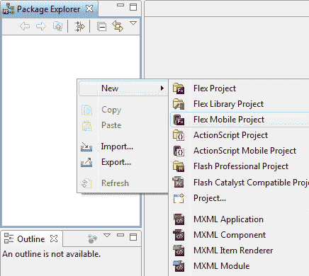

1.  然后，我们将为移动项目命名，并选择 Flash Builder 应在本地机器上存储项目文件的位置。

1.  下一步允许我们选择目标平台，在本例中是**谷歌安卓**，并定义使用哪个应用程序模板（如果你正在使用移动 Flex 框架）。我们还可以通过**初始视图标题**输入设置默认的`View`名称。

1.  此外，我们还将选择应用程序是否根据设备倾斜来自动重新定位，通过**自动重新定位**选项。我们可以选择通过选中**全屏**复选框来以全屏显示应用程序。

1.  在此屏幕上要做的最后一个选择是，通过选择**为不同屏幕密度自动缩放应用程序**复选框并选择适当的应用程序 DPI 设置，来确定我们是否希望移动组件中使用密度感知皮肤。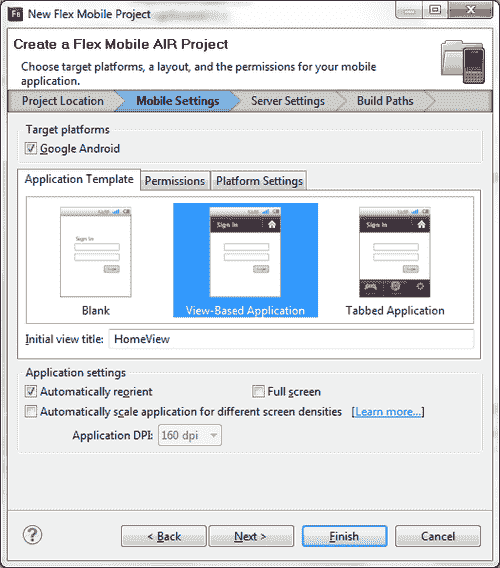

1.  项目设置的其他部分实际上与 Flash Builder 中的任何其他项目都一样。

## 它是如何工作的…

在 Flash Builder 中设置新项目时的选择决定了哪些库会被导入并在应用程序中使用。定义一个移动应用程序不仅会包括针对移动设备的具体组件皮肤，还会限制我们使用不适合此类用途的组件。我们还可以完全访问移动特定的应用程序结构，如移动`ViewNavigator`、`ActionBar`或`TabBar`。这些对移动 Flex 框架的补充可以大大加快有状态移动 Android 应用程序的开发，因为它们处理的是应用程序结构、导航控制和布局。

## 另请参阅…

你实际上可以使用之前版本的 Flash Builder 来编译 Android 应用程序的 AIR。查看下一个指南，*使 Flash Builder 4 或 Flex Builder 能够访问 Flex Mobile SDKs*，以获取这方面的示例。

# 使 Flash Builder 4 或 Flex Builder 能够访问 Flex Mobile SDKs

你不一定需要最新版本的 Flash Builder 来编写 Android 应用程序。本指南将展示如何将最新的 Flex SDK 集成到较旧版本的 Flash Builder（甚至是 Flex Builder）中，以利用移动框架的改进。

### 注意

尽管我们将能够使用新的组件集和为 Android 简化的结构，但许多工作流增强，如支持新的移动应用程序视图结构、优化具有触摸和手势支持的组件皮肤以及在新版 Flash Builder 中找到的其他便利功能，将无法使用，我们将不得不使用 AIR SDK 和命令行工具编译应用程序以供分发。

## 如何操作…

以下步骤用于配置旧版本的 Flash Builder 以进行 Android 开发：

1.  访问 Adobe 开源网站 [`opensource.adobe.com/`](http://opensource.adobe.com/)，找到最新的 Flex SDK 构建版本。

1.  下载最新 Adobe Flex SDK 的`ZIP`文件并将其解压到硬盘上你能够记住的位置，例如`C:\SDKs\Flex`。

1.  启动 Flash Builder，前往**窗口 | 首选项**。

1.  向下滚动至**Flash Builder**菜单项，选择**Installed Flex SDKs**。你现在将看到 Flash Builder 中当前可用的每个 SDK 列表：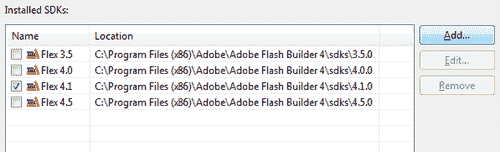

1.  点击标记为**Add**的按钮，浏览到你最近下载的 Flex SDK 的位置。

1.  为对话框提供一个有意义的名称并点击**OK**。例如，`Flex 4.5`。如果我们想要非常具体，可以始终使用完整的构建名称，如：`Flex 4.5.0.16076`。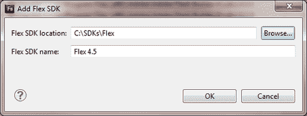

1.  现在`Flex 4.5` SDK 可以在你的应用程序中使用。要在项目中使用它，只需在创建新项目或在现有项目中修改**Flex Compiler**属性时选择此 SDK 即可。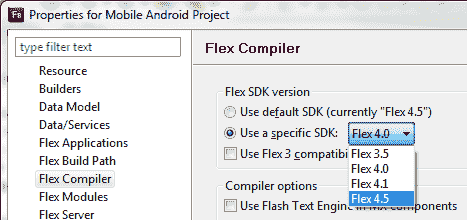

## 工作原理…

在 Flash Builder 中使用较新的 Flex SDK 版本，使我们能够访问移动主题选项和其他特定 API，这些 API 在之前的 SDK 版本中是不可用的。这也会将移动类暴露给代码提示和其他 IDE 工作流构建。

## 还有更多内容...

如果更改项目中使用的 Flex SDK 版本，我们可能会因为框架从版本到版本之间的变化而收到许多警告或错误。只需通过项目文件，并纠正**问题**面板中出现的每个警告或错误，以解决任何问题。

如果开发针对 Android 上 Flash Player 的项目，你只需要注意设备和操作系统的限制。

## 另请参阅...

需要特别注意的是，Flash Builder 4.5 之前的版本将不包括编译项目到`.APK`（Android 应用程序文件扩展名）的能力，你需要使用免费提供的 AIR SDK 来编译你的项目。有关如何执行此操作的信息，请参见第十一章。

还值得一提，虽然你可以使用较旧的 Flash Builder 版本为 Android 开发应用程序，但你将无法获得较新版本提供的许多好处，例如代码补全。

# 使用 Flash Builder 4 及以下版本开发 Android 应用程序

在 Flash Builder 4 中开发移动 Android 应用程序，我们需要配置 Flash Builder 以访问移动 Flex SDK。如果你还没有以这种方式配置 Flash Builder 或 Flex Builder，请参阅之前的菜谱。

## 如何操作...

在 Flash Builder 4.5 之前的版本中并没有内置特定的移动工作流程或工具。通过采取以下步骤，我们可以确保项目将是移动兼容的：

1.  在 Flash Builder 中，右键点击**包资源管理器**面板并选择**新建 | Flex 项目**。或者，我们可以选择**ActionScript 项目**，但这不会包括任何移动端的好处，因为实际的 Flex SDK 组件将不会被使用。然而，值得注意的是，由于 ActionScript 项目不依赖于如此重的框架，它们通常会比 Flex 项目表现得更好。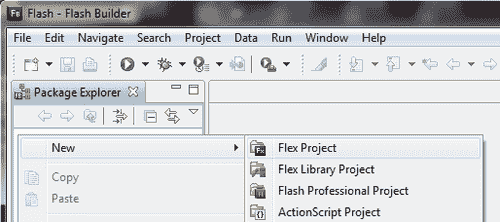

1.  将会出现**新建 Flex 项目**对话框，在对话框中你需要提供一个**项目名称**，并选择是创建面向**Web**还是**Desktop**的项目。如果这个项目将编译为 AIR for Android，我们需要确保选择**Desktop**，因为这种应用程序类型将针对 Adobe AIR 运行时。如果创建一个面向浏览器中 Flash Player 的项目，我们将选择**Web**。

1.  在选择**桌面**时，我们还需要确保为 Android 项目选择了一个移动增强版的 Flex SDK。Flex 4.5 及其以上版本包含了开发健壮 Android 应用程序所需的一切功能。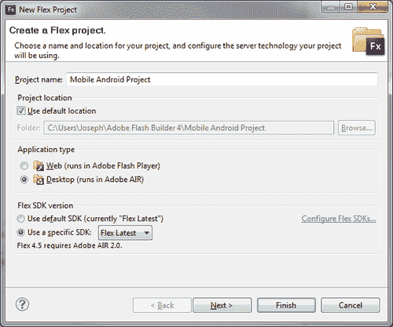

1.  我们必须做的最后一件事是确保项目将使用移动版的 Flex SWCs。为了在项目的主容器中声明 `<s:ViewNavigatorApplication>` 或 `<s:TabbedViewNavigatorApplication>`，必须能够访问这些特定的 SWCs，否则 Flash Builder 会报告错误。

1.  **新建 Flex 项目**对话框的最后一部分允许我们确保包含移动 SWCs。您会注意到 `mobilecomponents.swc` 并未包含在我们的项目中。选择标签为 **库路径** 的选项卡，并点击标签为 **添加 SWC:** 的按钮。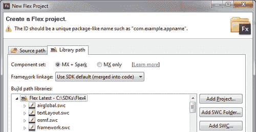

1.  当出现**添加 SWC**对话框时，浏览到所选 Flex SDK 的位置。假设我们将 SDK 解压到 `C:\SDKs\Flex4`，我们现在将浏览到 `C:\SDKs\Flex\frameworks\libs\mobile`，选择 `mobilecomponents.swc` 文件，并点击**打开**。这将向我们的应用程序添加对移动组件的支持。

1.  完成项目设置。我们现在能够使用移动特定的容器和控制组件，而不会收到 Flash Builder 的错误，但我们必须进行一些调整才能正确编译应用程序。

1.  在项目中找到 AIR 描述符文件。它通常被命名为类似 `{MyProject}-app.xml` 的名称，并位于项目根目录。打开这个文件，将 `<visible>` 属性更改为 **true**。如果该节点已被注释掉，可能需要取消注释。

1.  在**包资源管理器**中右键点击项目，并选择**属性**。

1.  选择**Flex 编译器**菜单选项，并在**附加编译参数**中添加以下内容：`theme=C:\{SDK Location}\frameworks\themes\Mobile\mobile.swc`

1.  最后，将主应用程序文件的根节点从 `<s:Application>` 切换到 `<s:ViewNavigatorApplication>`。我们现在可以使用移动 Flex 框架组件来编写和编译应用程序。

## 工作原理…

在 Flash Builder 中指定我们要创建的项目类型时，IDE 会自动提供 Flex 框架的某些部分，以便我们可以使用项目所需的所有组件。Flash Builder 4 及其早期版本没有附带任何移动版的 Flex SDK，并且不提供针对 Android 项目的流程。因此，我们必须明确告诉 Flash Builder 使用这些额外的框架组件。

前一节步骤中提到的应用程序描述符文件用于以各种方式配置 AIR 应用程序：设置初始窗口属性、Chrome 属性，甚至系统图标。

## 另请参阅…

需要注意的是，Flash Builder 4.5 之前的版本将不包括将项目编译为 .APK（Android 应用程序文件扩展名）的能力，你将需要使用免费提供的 AIR SDK 编译你的项目。有关如何执行此操作的信息，请参阅 第十一章。

值得一提的是，尽管你可以使用旧版本的 Flash Builder 开发 Android 应用程序，但你将无法获得新版本提供的大部分好处，例如代码补全功能。

# 使 Powerflasher FDT 4.1 能够访问 Flex Mobile SDK

Powerflasher FDT 是一个越来越受欢迎的 Flash 平台项目开发环境。FDT 4 配备了开始开发 ActionScript 和 Flex 应用程序所需的一切，但 FDT 4.1 及以下版本不支持任何移动工作流程，也不包含支持移动的 Flex SDK。

## 如何操作…

配置 Powerflasher FDT 4 以进行 Android 开发的步骤很少：

1.  访问 Adobe 开源网站 [`opensource.adobe.com/`](http://opensource.adobe.com/)，找到最新版本的 Flex SDK。

1.  下载最新 Adobe Flex SDK 的 `ZIP` 文件，并将其解压到硬盘上你容易记住的位置，例如 `C:\SDKs\Flex`。

1.  启动 **FDT** 并转到 **窗口 | 首选项**。

1.  滚动到 **FDT** 菜单项，选择 **已安装的 SDK**。你现在可以看到当前你复制的 FD 中可用的每个 SDK 的列表：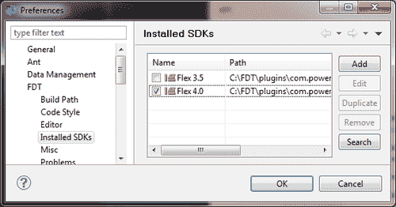

1.  点击标有 **添加** 的按钮，浏览到你最近下载的 Flex SDK 的位置。

1.  为对话框提供一个有意义的名称，然后点击 **确定**。例如，`Flex 4.5:`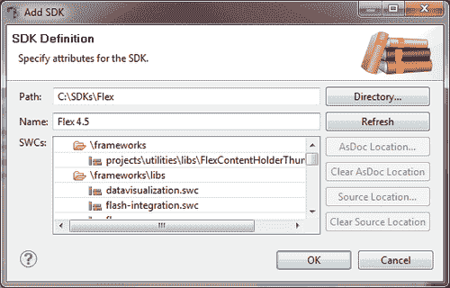

1.  现在，`Flex 4.5` SDK 可用于你的应用程序。要在项目中使用它，只需在创建新项目或在现有项目中修改 **Flex 编译器** 属性时选择此 SDK：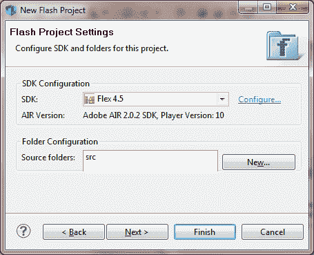

## 它的工作原理…

Powerflasher FDT 4 是一个基于 Eclipse 的 IDE（与 Flash Builder 类似），采用了很多相同的方法来扩展应用程序和添加 SDK 包。在 FDT 中使用较新版本的 Flex SDK 可以让我们访问移动主题选项和其他在之前 SDK 版本中不可用的特定 API。

## 另请参阅…

需要注意的是，Flash Builder 4.5 之前的版本将不包括将项目编译为 `.APK`（Android 应用程序文件扩展名）的能力，你将需要使用免费提供的 AIR SDK 编译你的项目。有关如何执行此操作的信息，请参阅 第十一章。

值得一提的是，虽然你可以使用 Flash Builder 的旧版本为 Android 开发应用程序，但你将无法获得新版本提供的一些好处，例如代码补全。

# 使用 Powerflasher FDT 4.1 及以下版本开发 Android 应用程序

要在 FDT 4.1 中开发移动 Android 应用程序，我们将需要配置 FDT 以启用对移动 Flex SDK 的访问。如果你还没有以这种方式配置 FDT，请参阅前面的菜谱。

## 如何操作…

在 FDT 4.2 之前的版本中，没有特定的移动工作流或工具。通过执行以下步骤，我们可以确保项目将具有移动兼容性：

1.  在 FDT 中，右键点击**Flash Explorer**面板，选择**新建 | 新建 Flash 项目：**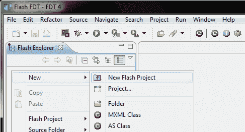

1.  将会出现**新建 Flash 项目**对话框，你必须在其中提供**项目名称**，并选择是使用**ActionScript 3**还是**Flex**创建项目。我们需要确保选择**Flex 4**，因为这包括 Spark 组件，如果使用适当版本的 Flex SDK，它们可以是移动友好的。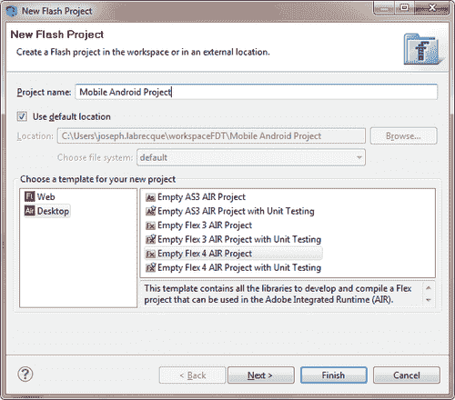

1.  下一个部分将允许我们选择一个特定的 Flex SDK 用于我们的项目。我们应该为 Android 项目选择一个增强移动版的 Flex SDK。Flex 4.5 及以上版本包括我们开始开发健壮的 Android 应用程序所需的一切。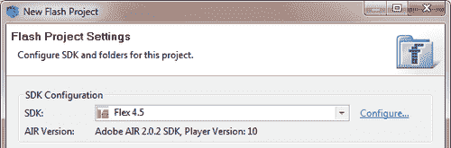

1.  我们必须做的最后一件事是确保移动版的 Flex SWC 将在我们的项目中使用。为了声明项目的主要容器为`<s:ViewNavigatorApplication>`或`<s:TabbedViewNavigatorApplication>`，这些特定的 SWC 必须是可访问的，否则 FDT 将报告错误。

1.  下一个部分允许我们确保包含移动 SWC。选择标签为**SDK Library**的选项卡，然后点击标签为**选择 SWCs**的按钮

1.  你会注意到`mobile\mobilecomponents.swc`没有包含在我们的项目中。选中此 SWC 旁边的复选框，然后按**确定**按钮继续：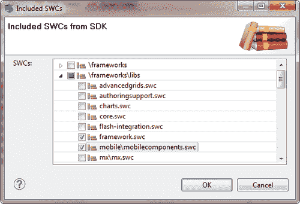

1.  现在，我们将能够使用特定的移动容器和控制组件，而不会从 FDT 收到错误。

## 工作原理…

在 FDT 中指定我们想要创建的项目类型时，程序会自动提供 Flex 框架的某些部分，以便我们可以使用项目所需的所有组件。FDT 4.1 及更早版本不附带任何支持移动设备的 Flex SDK，也不提供 Android 项目的相关工作流。因此，我们必须明确告诉 FDT 使用以下额外的框架组件：

+   **ViewNavigatorApplication：**这包括一个`ViewNavigator`堆栈结构，我们可以将不同的视图推送到堆栈顶部，并向用户展示最顶层的视图。

+   **TabbedViewNavigatorApplication：** 这包括在应用程序内拥有多个`ViewNavigator`堆栈的能力，通过`TabBar`用户界面元素进行控制。

## 另请参阅…

需要注意的是，Flash Builder 4.5 之前的版本将无法将项目编译为`.APK`（Android 应用文件扩展名），你需要使用免费提供的 AIR SDK 来编译项目。有关如何执行此操作的信息，请参阅第十一章。

还值得一提的是，虽然你可以使用较旧版本的 Flash Builder 开发 Android 应用程序，但你将无法获得较新版本提供的大部分好处，例如代码补全功能。

# 将标准 Flex 项目转换为 Flex Mobile 项目

目前在 Flash Builder（或 FDT）中没有工作流可以将现有应用程序转换为移动 Android 应用程序。根据被转换应用程序的复杂程度和 Flex 的版本，这项转换任务可能从非常简单到异常复杂不等。在本教程中，我们将使用基本的 Flex 结构演示一个更简单的示例。

## 如何操作…

创建一个新的移动项目，并将所有必要的文件复制到其中，保留用于移动项目的代码部分，并修改任何不支持的组件。

在此示例中，我们将使用一个简单的 Flex 项目，该项目针对桌面 AIR，目前只包含一个按钮组件：

```kt
<?xml version="1.0" encoding="utf-8"?>
<s:WindowedApplication 

>
<s:Button x="10" y="10" width="300" height="200" label="Button"/>
</s:WindowedApplication>

```

要将此项目转换为新的 Flex Mobile 项目，请执行以下步骤：

1.  菜单中选择**文件 | 新建 | Flex Mobile 项目**。

1.  为项目设置对话框提供有关新移动项目的详细信息。

    ### 注意

    项目不能与环境中任何现有项目的名称相同。

1.  从原始项目中的项目文件夹中复制所有文件到这个新的移动项目中，不包括项目描述文件`({myApp }.xml)`和`Default Application`文件。

1.  现在，将旧`Default Application`文件中的所有内容复制并粘贴到与你的移动项目一起创建的`Default Application`文件中。一旦复制完成，右键点击主应用程序文件并选择**设为默认应用程序**。

1.  将所有`<s:WindowedApplication>`的实例更改为`<s:ViewNavigatorApplication>`（或者，`<s:TabbedViewNavigatorApplication>`）。

    ### 注意

    与标准的 AIR `<s:WindowedApplication>`一样，项目中只能存在一个`<s:ViewNavigatorApplication>`或`<s:TabbedViewNavigatorApplication>`实例。

1.  查看你的**问题**面板，以了解是否需要进一步修改。

1.  如果你没有使用任何旧的 Halo 组件（mx 命名空间），建议你为打开的`<s:ViewNavigatorApplication>`标签删除命名空间声明。

1.  向 `<s:ViewNavigatorApplication>` 标签添加一个 `firstView` 属性。这应该指向当你设置移动项目时自动创建的 `View`。

1.  由于可视化 UI 元素不能直接位于 `<s:ViewNavigatorApplication />` 节点内，我们必须将 `<s:Button />` 实例包裹在 `<fx:Declarations>` </fx:Declarations> 标签集中，或者将其移动到特定的 View 中。

### 提示

**下载示例代码**

你可以从你的[`www.PacktPub.com`](http://www.PacktPub.com)账户下载你所购买的所有 Packt 图书的示例代码文件。如果你在其他地方购买了这本书，可以访问[`www.PacktPub.com/support`](http://www.PacktPub.com/support)注册，我们会将文件直接通过电子邮件发送给你。

你的`Default Application`文件现在应如下所示：

```kt
<?xml version="1.0" encoding="utf-8"?>
<s:ViewNavigatorApplication 
 firstView="views.MobileFlexProjectHomeView">
<fx:Declarations>
<s:Button x="10" y="10" width="447" height="106" label="Button"/>
</fx:Declarations>
</s:ViewNavigatorApplication>

```

此外，此应用程序的视图可能如下所示：

```kt
<?xml version="1.0" encoding="utf-8"?>
<s:View 
 title="MobileFlexProjectHomeView ">
</s:View>

```

有关 Flex Mobile 项目的结构信息，请查看以下资源：[`opensource.adobe.com/wiki/display/flexsdk/Developer+Documentation`](http://opensource.adobe.com/wiki/display/flexsdk/Developer+Documentation)。

## 工作原理…

使用 Flex 时，你的应用程序的根标签在很大程度上决定了整个项目可用的 API 和结构。确保我们选择正确的根标签对于项目的目标平台和能力非常重要。对于在 Android 上的 AIR，我们将使用 `ViewNavigatorApplication` 或 `TabbedViewNavigatorApplication`。桌面应用程序将使用 Application 或 `WindowedApplication` 标签。如果你使用 Flex 构建的 Flash 内容要在浏览器中的 Flash Player 部署，无论是在移动端还是桌面端，你都会为你的项目使用一个直接的 `Application` 标签。

## 更多信息…

如果你不想处理大量转换，并且只是开始一个将同时在桌面和移动端共享相同代码库的新项目，那么你可能考虑使用 Flex Library 项目，以允许不同的项目共享相同的底层代码库。

阅读 Flex 4 库使用说明文档：[`help.adobe.com/en_US/flashbuilder/using/WS6f97d7caa66ef6eb1e63e3d11b6c4d0d21-7fe6.html`](http://help.adobe.com/en_US/flashbuilder/using/WS6f97d7caa66ef6eb1e63e3d11b6c4d0d21-7fe6.html)。

# 在 Windows 上配置 AIR SDK 以打包适用于 Android 应用的 AIR

如果我们使用开源的 AIR **SDK（软件开发工具包）**与另一个 IDE 或甚至在简单的文本编辑器中编辑我们的项目，我们仍然可以通过命令行工具编译适用于 Android 分发的应用程序。

## 如何操作…

如果您还没有 Adobe AIR SDK，您必须首先从[`www.adobe.com/products/air/sdk/`](http://www.adobe.com/products/air/sdk/)下载，并将其文件解压到硬盘上的一个目录中，例如`C:\SDKs\AIR`。您还必须在操作系统中设置一个指向 AIR SDK 下的`bin`目录的`PATH`变量。

如果您使用的是 Windows 系统，请通过以下步骤设置环境变量：

1.  打开**系统属性**对话框。有多种方式可以进入这个对话框，最直接的方法是右键点击**我的电脑**，然后选择**属性**。

1.  从左侧菜单中选择**高级系统设置**。

1.  点击此窗口底部的按钮，上面写着**环境变量**

1.  在此窗口中点击**PATH**变量，并选择**编辑：**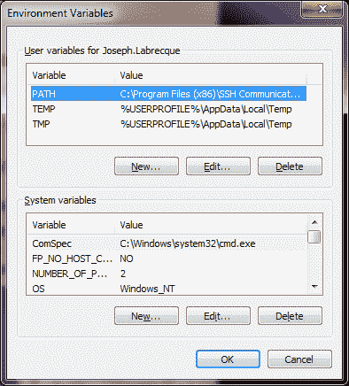

1.  现在，只需将您的`bin`目录的位置添加到变量集合中：如果变量值列表中的最后一个条目没有以分号结束，您必须在每个新条目前添加一个。例如：`C:\SDKs\AIR\bin`。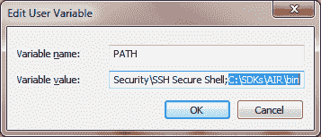

1.  这样应该就设置好了。点击几次**确定**，然后打开命令提示符以验证我们是否正确设置了。输入`adt -version`并按下**回车**。如果一切正常，ADT 会返回一个类似`adt version "2.5.0.00000"`这样的版本字符串。

## 工作原理…

在操作系统中设置一个`PATH`变量，这样我们就可以在系统的任何位置调用 AIR Android 编译器 ADT，而无需遍历文件目录并指定长路径名。

## 参见以下内容…

如果使用 Linux 或 Mac 操作系统，您也可以在终端内设置特定的环境变量。有关示例，请参阅下一食谱《在 Linux 或 Mac OS 上配置 AIR SDK 以打包 Android 应用程序的 AIR》。

# 在 Linux 或 Mac OS 上配置 AIR SDK 以打包 Android 应用程序的 AIR

如果我们使用开源的 AIR SDK 与其他 IDE 配合使用，甚至是在简单的文本编辑器中编辑我们的项目，我们仍然可以通过命令行工具编译在 Android 上分发的应用程序。

## 如何操作…

如果您还没有 Adobe AIR SDK，您必须首先从[`www.adobe.com/products/air/sdk/`](http://www.adobe.com/products/air/sdk/)下载，并将其文件解压到硬盘上的一个目录中：例如`/home/joseph/SDKs/AIR`。您还必须在操作系统的启动脚本中设置一个指向 AIR SDK 下的`bin`目录的`PATH`变量。

我们将通过以下步骤设置环境变量：

1.  打开**终端**。

1.  现在，我们必须创建 shell 配置文件。在终端窗口中输入以下内容：在 Mac 上输入`cat >> .bash_profile`，在 Ubuntu 上输入`cat >> .bashrc`（每个 Linux 发行版对于启动脚本可能有各自的命名约定）。

1.  接下来，输入 `export PATH=$PATH:/home/joseph/SDKs/AIR/bin` 来设置 `PATH` 变量，使其指向 AIR 开发工具的 bin 目录。按下 *Enter*。

1.  输入 *Ctrl+Shift+D* 以结束此进程。

1.  现在我们将检查是否所有内容都已适当地添加。在 **终端** 中输入 `cat .bashrc` 并按下 *Enter*。您应该会看到返回的 `PATH` 命令：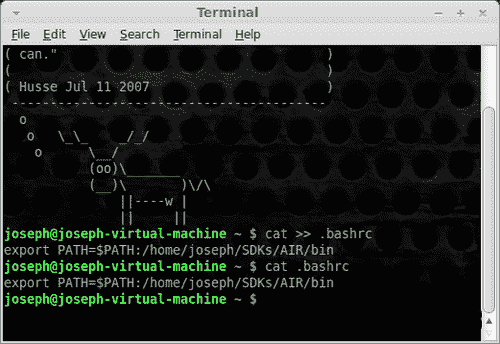

1.  您可能需要登出您的个人资料，然后再重新登录，以便系统获取新的环境变量。

1.  在重新登录您的个人资料后，再次打开 **终端**。

1.  在终端中输入 `echo $PATH` 并按下 *Enter*。这应该会显示 `PATH` 变量中包含的所有内容，包括我们的 AIR `bin` 目录的位置。

1.  这样应该就可以了。我们现在将验证是否正确设置了 AIR SDK。输入 `adt -version` 并按下 *Enter*。如果一切正常，ADT 将返回一个类似 `adt version "2.5.0.00000"` 的版本字符串！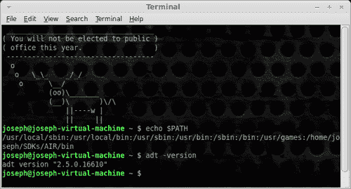

## 它是如何工作的…

在操作系统中设置 PATH 变量，使我们能够从系统的任何位置调用 AIR Android 编译器 ADT，而无需遍历文件目录并指定长路径名。

## 另请参阅…

请注意，您可能需要登出您的会话，然后再重新登录，以便新的 `PATH` 变量生效。如果使用的是 Windows 操作系统，您也可以设置特定的环境变量。有关此示例，请参阅前面的食谱，*在 Windows 上配置 AIR SDK 以打包适用于 Android 应用的 AIR*。
