# 第二章：交互体验：多点触控、手势和其他输入

本章节将涵盖以下内容：

+   检测支持的设备输入类型

+   检测设备是否支持多点触控

+   验证常见交互的具体手势支持

+   使用手势放大显示对象

+   使用手势平移显示对象

+   使用手势滑动显示对象

+   使用手势旋转显示对象

+   访问原始触摸点数据

+   基于触摸点数据创建自定义手势

+   模拟安卓长按交互

+   程序化地调用虚拟键盘

+   应对安卓软键盘交互

+   应对轨迹球和 D-Pad 事件

# 引言

通过触摸和手势与设备交互的能力是移动计算突出的特点之一，Flash 平台在安卓上完全支持多点触控和手势。本章将介绍拦截和响应用户交互的不同方式，无论是通过简单的触摸点还是复杂的手势，以及更传统的物理和虚拟键盘输入。在移动安卓设备上充分利用这一点对于流畅的体验至关重要。

本章节中的所有示例均表示为纯 ActionScript 3 类，不依赖于外部库或 Flex 框架。因此，我们可以将这些示例应用到我们希望的任何 IDE 中。

# 检测支持的设备输入类型

安卓设备上有多种输入类型可供选择，根据我们正在从事的项目，可能需要验证特定设备是否支持预期的用户交互模式。幸运的是，有许多 ActionScript 类可以帮助我们发现设备在用户输入方面的功能。

## 如何操作...

我们需要使用内部类来检测是否支持多点触控：

1.  首先，将以下类导入到项目中，以便检查各种设备上的输入类型：

    ```kt
    import flash.display.Sprite;
    import flash.display.Stage;
    import flash.display.StageAlign;
    import flash.display.StageScaleMode;
    import flash.system.Capabilities;
    import flash.system.TouchscreenType;
    import flash.text.TextField;
    import flash.text.TextFormat;
    import flash.ui.Keyboard;
    import flash.ui.KeyboardType;
    import flash.ui.Mouse;

    ```

1.  声明一个 `TextField` 和 `TextFormat` 对象，以允许在设备上输出可见内容：

    ```kt
    private var traceField:TextField;
    private var traceFormat:TextFormat;

    ```

1.  我们现在将设置 `TextField`，应用 `TextFormat`，并将其添加到 `DisplayList` 中。这里，我们创建一个方法来执行所有这些操作：

    ```kt
    protected function setupTextField():void {
    traceFormat = new TextFormat();
    traceFormat.bold = true;
    traceFormat.font = "_sans";
    traceFormat.size = 32;
    traceFormat.align = "center";
    traceFormat.color = 0x333333;
    traceField = new TextField();
    traceField.defaultTextFormat = traceFormat;
    traceField.selectable = false;
    traceField.mouseEnabled = false;
    traceField.width = stage.stageWidth;
    traceField.height = stage.stageHeight;
    addChild(traceField);
    }

    ```

1.  现在，我们将简单地通过检查这些类调用一系列属性返回的数据。以下示例中，我们是在以下方法中执行此操作：

    ```kt
    protected function checkInputTypes():void {
    traceField.appendText("Touch Screen Type: " + flash.system.Capabilities.touchscreenType + "\n");
    traceField.appendText("Mouse Cursor: " + flash.ui.Mouse. supportsCursor + "\n");
    traceField.appendText("Physical Keyboard Type: " + flash. ui.Keyboard.physicalKeyboardType + "\n");
    traceField.appendText("Virtual Keyboard: " + flash.ui.Keyboard. hasVirtualKeyboard + "\n");
    }

    ```

1.  结果将类似于以下内容：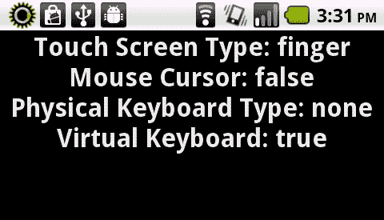

## 工作原理...

当调用时，Flash 平台运行时能够报告某些设备功能。报告的数据将允许我们根据运行时检测到的输入类型定制用户体验。

以下是四种可以报告的输入类型的基本概述：

`flash.system.Capabilities.touchscreenType`

调用此方法将返回一个`String`常量，值为`FINGER`、`STYLUS`或`NONE`。它告诉我们设备上是否支持某种形式的直接屏幕交互，如果是，是哪种形式。在 Android 设备上，这将始终返回`FINGER`。

`flash.ui.Mouse.supportsCursor`

调用此方法将返回一个`Boolean`值，为`true`或`false`。它简单地告诉我们设备上是否有持久鼠标光标。在 Android 设备上，这很可能会始终返回`false`。

`flash.ui.Keyboard.physicalKeyboardType`

调用此方法将返回一个`String`常量，值为`ALPHANUMERIC`、`KEYPAD`或`NONE`。它告诉我们设备上是否有某种专用的物理键盘，如果有，是哪种类型。在 Android 设备上，这很可能会始终返回`NONE`，尽管某些 Android 型号确实有物理键盘。

`flash.ui.Keyboard.hasVirtualKeyboard`

调用此方法将返回一个`Boolean`值，为`true`或`false`。它简单地告诉我们设备上是否有虚拟（软件）键盘。在 Android 设备上，这很可能会始终返回`true`。

# 检测设备是否支持多点触控

在针对 Android 操作系统的项目开发中，确保设备实际上支持多点触控总是一个好主意。在 Android 手机上，这可能总是如此，但 Google TV 或 AIR for TV 设备呢？其中许多也是基于 Android 的，但大多数电视根本没有触摸控制。永远不要假设任何设备的功能。

## 如何操作...

我们需要使用内部类来检测是否支持多点触控。

1.  首先，将以下类导入到你的项目中：

    ```kt
    import flash.display.StageScaleMode;
    import flash.display.StageAlign;
    import flash.display.Stage;
    import flash.display.Sprite;
    import flash.text.TextField;
    import flash.text.TextFormat;
    import flash.ui.Multitouch;

    ```

1.  声明一个`TextField`和`TextFormat`对象，以允许在设备上可见输出：

    ```kt
    private var traceField:TextField;
    private var traceFormat:TextFormat;

    ```

1.  我们现在将设置我们的`TextField`，应用一个`TextFormat`，并将其添加到`DisplayList`中。这里，我们创建一个方法来执行所有这些操作：

    ```kt
    protected function setupTextField():void {
    traceFormat = new TextFormat();
    traceFormat.bold = true;
    traceFormat.font = "_sans";
    traceFormat.size = 44;
    traceFormat.align = "center";
    traceFormat.color = 0x333333;
    traceField = new TextField();
    traceField.defaultTextFormat = traceFormat;
    traceField.selectable = false;
    traceField.mouseEnabled = false;
    traceField.width = stage.stageWidth;
    traceField.height = stage.stageHeight;
    addChild(traceField);
    }

    ```

1.  然后，只需调用`Multitouch.supportsGestureEvents`和`Multitouch.supportsTouchEvents`，即可检查这些功能，如下面的方法所示：

    ```kt
    protected function checkMultitouch():void {
    traceField.appendText(String("Gestures: " + Multitouch.supportsGestureEvents) + "\n");
    traceField.appendText(String("Touch: " + Multitouch.supportsTouchEvents));
    }

    ```

1.  这些属性中的每一个都将返回一个`Boolean`值，`true`或`false`，表示设备支持，如下所示：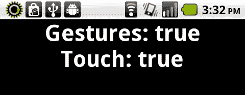

## 工作原理...

检测设备是否支持触摸或手势事件将决定作为开发者的你，在细化用户体验方面有多少自由度。如果这些项目中的任何一个返回为 false，那么就需要你（如果可能的话）提供一种替代方式让用户与应用程序交互。这通常是通过`Mouse`事件完成的：

+   **触摸事件：**如单指轻触等基本交互。

+   **手势事件：**更复杂的用户交互解释，如捏合、缩放、滑动、平移等。

## 还有更多...

需要注意的是，尽管特定设备可能支持手势事件或触摸事件，但在使用 Flash 平台工具时，我们必须将`Multitouch.inputMode`明确设置为其中之一。

# 验证常见交互中特定手势的支持

在处理 Android 设备时，触摸和手势是用户与设备交互的主要机制。如果我们想在 Flash Player 和 AIR 中使用一些预定义的手势，可以按照以下方式操作。

## 如何操作...

要发现设备支持哪些特定的手势，执行以下操作：

1.  首先，将以下类导入到你的项目中：

    ```kt
    import flash.display.StageScaleMode;
    import flash.display.StageAlign;
    import flash.display.Stage;
    import flash.display.Sprite;
    import flash.text.TextField;
    import flash.text.TextFormat;
    import flash.ui.Multitouch;
    import flash.ui.MultitouchInputMode;

    ```

1.  声明一个`TextField`和`TextFormat`对象，以允许在设备上输出可见内容：

    ```kt
    private var traceField:TextField;
    private var traceFormat:TextFormat;

    ```

1.  我们现在将设置我们的`TextField`，应用`TextFormat`，并将其添加到`DisplayList`中。在这里，我们创建一个方法来执行所有这些操作：

    ```kt
    protected function setupTextField():void {
    traceFormat = new TextFormat();
    traceFormat.bold = true;
    traceFormat.font = "_sans";
    traceFormat.size = 44;
    traceFormat.align = "center";
    traceFormat.color = 0x333333;
    traceField = new TextField();
    traceField.defaultTextFormat = traceFormat;
    traceField.selectable = false;
    traceField.mouseEnabled = false;
    traceField.width = stage.stageWidth;
    traceField.height = stage.stageHeight;
    addChild(traceField);
    }

    ```

1.  使用以下命令为多触控 API 设置特定的输入模式以支持手势：

    ```kt
    Multitouch.inputMode = MultitouchInputMode.GESTURE;

    ```

1.  调用`Multitouch.supportedGestures`将返回一个包含设备上 Flash 支持的所有手势名称的`String`对象`Vector`：

    ```kt
    var supportedGestures:Vector.<String> = Multitouch.supportedGestures;

    ```

1.  然后，我们可以寻找特定的手势或手势集进行监听，或者在必要时退回到其他交互事件。

    ```kt
    for(var i:int=0; i < supportedGestures.length; ++i) {
    trace(supportedGestures[i]);
    }

    ```

1.  我们可以在一个方法内执行所有这些必要功能：

    ```kt
    protected function checkGestures():void {
    Multitouch.inputMode = MultitouchInputMode.GESTURE;
    if(Multitouch.supportedGestures){
    var supportedGestures:Vector.<String> = Multitouch.supportedGestures;
    for(var i:int=0; i <supportedGestures.length; ++i) {
    traceField.appendText(supportedGestures[i] + "\n");
    }
    }else{
    traceField.appendText("no gesture support!");
    }
    }

    ```

1.  结果将类似于以下所示：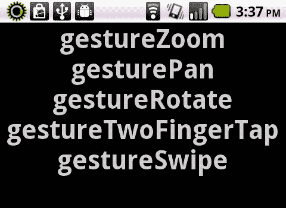

## 工作原理...

Flash 播放器和 AIR 在为 Android 开发者提炼信息至关键细节方面做得非常出色。了解特定设备支持哪些手势，将使我们能够为应用程序定制事件交互，并在必要时提供后备交互。

## 还有更多...

在我们的示例类中，我们还通过`Multitouch.supportedGestures`检查以确保至少支持一些手势。如果设备确实提供了手势支持，我们可能需要向用户提供警告，解释应用程序由于硬件限制可能无法达到最佳性能。

除了在`flash.events.TransformGestureEvent`包中包含的更常见的诸如缩放、滑动、旋转和平移等手势之外，还有其他较少见的手势，如双指轻触，可以在`flash.events.GestureEvent`和`flash.events.PressAndTapGestureEvent`类中找到。如果设备支持，所有这些都将由`Multitouch.supportedGestures`引用。

# 使用手势放大显示对象

捏合和拉扯是在支持多触控输入的触摸屏上经常使用的手势。将两个手指靠近会缩小对象，而将两个手指分开会使对象在设备上变大。

## 如何操作...

本示例在一个`Shape`对象内使用`Graphics` API 绘制一个正方形，将其添加到`Stage`中，然后为缩放手势事件设置监听器，以适当缩放`Shape`：

1.  首先，将以下类导入到你的项目中：

    ```kt
    import flash.display.StageScaleMode;
    import flash.display.StageAlign;
    import flash.display.Stage;
    import flash.display.Sprite;
    import flash.display.Shape;
    import flash.events.TransformGestureEvent;
    import flash.ui.Multitouch;
    import flash.ui.MultitouchInputMode;

    ```

1.  声明一个`Shape`对象，我们将在其上执行手势操作：

    ```kt
    private var box:Shape;

    ```

1.  接下来，构建一个方法来处理我们的`Sprite`的创建并将其添加到`DisplayList`中：

    ```kt
    protected function setupBox():void {
    box = new Shape();
    box.graphics.beginFill(0xFFFFFF, 1);
    box.x = stage.stageWidth/2;
    box.y = stage.stageHeight/2;
    box.graphics.drawRect(-150,-150,300,300);
    box.graphics.endFill();
    addChild(box);
    }

    ```

1.  将多触点 API 的特定输入模式设置为支持触摸输入，通过将`Multitouch.inputMode`设置为`MultitouchInputMode.TOUCH_POINT`常量，并注册`GESTURE_ZOOM`事件的事件监听器。在这种情况下，每当应用程序检测到缩放手势时，`onZoom`方法将被触发：

    ```kt
    protected function setupTouchEvents():void {
    Multitouch.inputMode = MultitouchInputMode.GESTURE;
    stage.addEventListener(TransformGestureEvent. GESTURE_ZOOM, onZoom);
    }

    ```

1.  为了使用捏合和缩放的接受行为，我们可以根据事件监听器返回的缩放因子调整舞台上对象的缩放比例。

    ```kt
    protected function onZoom(e:TransformGestureEvent):void {
    box.scaleX *= e.scaleX;
    box.scaleY *= e.scaleY;
    }

    ```

1.  结果手势将以以下方式影响我们的视觉对象：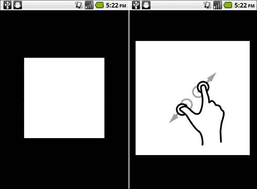

### 注意

插图由 Gestureworks 提供（www.gestureworks.com）。

## 工作原理...

由于我们将`Multitouch.inputMode`设置为通过`MultitouchInputMode.GESTURE`的手势，因此我们能够监听并响应一系列预定义的手势。在这个例子中，我们监听`TransformGestureEvent.GESTURE_ZOOM`事件，以便设置我们的`Shape`对象的缩放比例。通过将当前的缩放属性与事件报告的缩放值相乘，我们可以根据这个手势调整对象的缩放比例。

## 还有更多内容...

请注意，我们绘制正方形的方式是将`Shape`的注册点位于可见`Shape`的中心。我们这样做很重要，因为`DisplayObject`将基于注册点和变换点进行放大和缩小。

在使用 Flash Professional 中的绘图工具时，请确保将你的`MovieClip`符号的注册点设置为居中，以便正确工作。

## 另请参阅...

`TransformGestureEvent.GESTURE_ZOOM`只是我们在使用 Flash Platform 运行时和 Android 设备时可以使用的四个主要变换手势之一。参考以下食谱以获取这些手势的完整概述：

+   *使用手势平移显示对象*

+   *使用手势滑动显示对象*

+   *使用手势旋转显示对象*

# 使用手势平移显示对象

平移`DisplayObject`是通过同时用两个手指触摸屏幕，然后沿着我们想要平移对象的屏幕方向移动两个手指来完成的。这通常用于占据比屏幕更大的对象，或者已经放大到只有部分在给定时间内在屏幕上可见的对象。

## 如何操作...

这个例子使用`Graphics` API 在`Shape`对象内绘制一个正方形，将其添加到`Stage`中，然后为平移手势事件设置监听器，以适当缩放`Shape`。

1.  首先，将以下类导入到你的项目中：

    ```kt
    import flash.display.StageScaleMode;
    import flash.display.StageAlign;
    import flash.display.Stage;
    import flash.display.Sprite;
    import flash.display.Shape;
    import flash.events.TransformGestureEvent;
    import flash.ui.Multitouch;
    import flash.ui.MultitouchInputMode;

    ```

1.  声明一个`Shape`对象，我们将在这个对象上执行手势操作：

    ```kt
    private var box:Shape;

    ```

1.  接下来，构建一个方法来处理我们的`Shape`的创建并将其添加到`DisplayList`中。我们特别努力确保我们的`Shape`比屏幕大得多，以便可以有效地进行平移：

    ```kt
    protected function setupBox():void {
    box = new Shape();
    box.graphics.beginFill(0xFFFFFF, 1);
    box.x = stage.stageWidth/2;
    box.y = stage.stageHeight/2;
    box.graphics.drawRect(-150,-150,300,300);
    box.graphics.endFill();
    box.graphics.lineStyle(10, 0x440000, 1);
    box.graphics.moveTo(0, -800);
    box.graphics.lineTo(0, 800);
    box.graphics.moveTo(-800, 0);
    box.graphics.lineTo(800, 0);
    addChild(box);
    }

    ```

1.  设置特定的输入模式以支持多点触控 API 的触摸输入，通过将`Multitouch.inputMode`设置为`MultitouchInputMode.TOUCH_POINT`常量，并注册`GESTURE_PAN`事件的事件监听器。在这种情况下，每当应用程序检测到缩放手势时，`onPan`方法将被触发：

    ```kt
    protected function setupTouchEvents():void {
    Multitouch.inputMode = MultitouchInputMode.GESTURE;
    stage.addEventListener(TransformGestureEvent. GESTURE_PAN, onPan);
    }

    ```

1.  我们现在可以响应我们的平移事件返回的数据。在这个例子中，我们只是根据平移偏移数据简单地改变了`Shape`的 x 和 y 位置：

    ```kt
    protected function onPan(e:TransformGestureEvent):void {
    box.x += e.offsetX;
    box.y += e.offsetY;
    }

    ```

1.  结果手势将以以下方式影响我们的视觉对象：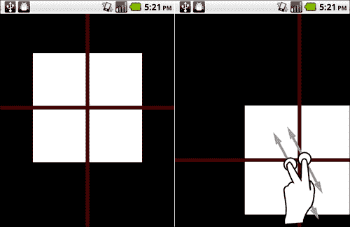

### 注意

图形由 Gestureworks 提供（www.gestureworks.com）。

## 工作原理...

由于我们将`Multitouch.inputMode`设置为通过`MultitouchInputMode.GESTURE`的手势，因此我们能够监听并响应一系列预定义的手势。在这个例子中，我们监听`TransformGestureEvent.GESTURE_PAN`事件，以便改变我们的`Shape`对象的 x 和 y 位置。通过调整我们的`Shape`的坐标通过报告的偏移数据，我们可以按照用户期望的方式调整对象的位置。

## 还有更多...

请注意，在某些设备上执行此操作通常很困难（因为你必须同时用两个手指触摸屏幕），而其他设备可能根本不支持它。作为后备，我们总是可以使用`startDrag()`和`stopDrag()`方法来模拟平移。 

## 另请参阅...

`TransformGestureEvent.GESTURE_PAN`只是我们在使用 Flash Platform 运行时和 Android 设备时可以使用的一组四个主要转换手势之一。参考以下食谱以获取这些手势的完整概述：

+   *使用手势缩放 DisplayObject*

+   *使用手势滑动显示对象*

+   *使用手势旋转显示对象*

# 使用手势滑动显示对象

滑动是 Android 设备上最常见的动作之一，并且有充分的理由。无论是快速翻阅一系列照片，还是在应用程序的状态之间移动，滑动手势都是用户所期望的。通过简单地触摸屏幕并在相反的方向快速向上、下、左或右滑动，即可完成滑动动作。

## 如何操作...

这个例子在`Shape`对象内使用`Graphics` API 绘制一个正方形，将其添加到`Stage`中，然后设置一个监听器来监听滑动手势事件，以便根据滑动的方向将`Shape`实例移动到屏幕边缘：

1.  首先，将以下类导入到你的项目中：

    ```kt
    import flash.display.StageScaleMode;
    import flash.display.StageAlign;
    import flash.display.Stage;
    import flash.display.Sprite;
    import flash.display.Shape;
    import flash.events.TransformGestureEvent;
    import flash.ui.Multitouch;
    import flash.ui.MultitouchInputMode;

    ```

1.  声明一个`Shape`对象，我们将对其执行手势操作：

    ```kt
    private var box:Shape;

    ```

1.  接下来，构建一个方法来处理我们的`Shape`的创建并将其添加到`DisplayList`中：

    ```kt
    protected function setupBox():void {
    box = new Shape();
    box.graphics.beginFill(0xFFFFFF, 1);
    box.x = stage.stageWidth/2;
    box.y = stage.stageHeight/2;
    box.graphics.drawRect(-150,-150,300,300);
    box.graphics.endFill();
    addChild(box);
    }

    ```

1.  将多触点 API 的特定输入模式设置为支持触摸输入，通过将`Multitouch.inputMode`设置为`MultitouchInputMode.TOUCH_POINT`常量，并注册`TransformGestureEvent.GESTURE_SWIPE`事件的事件监听器：

    ```kt
    protected function setupTouchEvents():void {
    Multitouch.inputMode = MultitouchInputMode.GESTURE;
    stage.addEventListener(TransformGestureEvent. GESTURE_SWIPE, onSwipe);
    }

    ```

1.  我们现在可以响应滑动事件返回的数据。在这种情况下，我们只是根据滑动偏移数据简单地移动`Shape`的 x 和 y 位置：

    ```kt
    protected function onSwipe(e:TransformGestureEvent):void {
    switch(e.offsetX){
    case 1:{
    box.x = stage.stageWidth - (box.width/2);
    break;
    }
    case -1:{
    box.x = box.width/2;
    break;
    }
    }
    switch(e.offsetY){
    case 1:{
    box.y = stage.stageHeight - (box.height/2);
    break;
    }
    case -1:{
    box.y = box.height/2;
    break;
    }
    }
    }

    ```

1.  结果手势将以以下方式影响我们的视觉对象：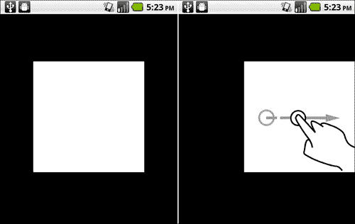

### 注意

提供的手势图由 Gestureworks（www.gestureworks.com）提供。

## 工作原理...

由于我们将`Multitouch.inputMode`设置为通过`MultitouchInputMode.GESTURE`的手势，因此我们能够监听并响应许多预定义的手势。在这个例子中，我们监听`TransformGestureEvent.GESTURE_SWIPE`事件，以便改变我们的`Shape`对象的 x 和 y 位置。通过调整`Shape`的坐标，通过报告的偏移数据，我们可以按照用户期望的方式调整对象的位置。

通过这个例子我们可以看到，事件监听器返回的`offsetX`和`offsetY`值将分别是 1 或-1。这使得我们很容易确定注册的手势方向：

+   **向上滑动：** offsetY = -1

+   **向下滑动：** offsetY = 1

+   **向左滑动：** offsetX = -1

+   **向右滑动：** offsetX = 1

## 还有更多内容...

在响应滑动事件时，可能需要提供一些过渡动画，使用内置的补间机制或外部补间引擎。有许多优秀的 ActionScript 补间引擎作为开源软件免费提供。这些引擎与某些手势结合使用，可以为应用程序用户提供更愉快的使用体验。

我们可以考虑在应用程序中使用以下流行的补间引擎：

**TweenLite：**[`www.greensock.com/tweenlite/`](http://www.greensock.com/tweenlite/)

**GTween：**[`www.gskinner.com/libraries/gtween/`](http://www.gskinner.com/libraries/gtween/)

## 另请参阅...

`TransformGestureEvent.GESTURE_SWIPE`只是我们在使用 Flash Platform 运行时和 Android 设备时可用的一组四个主要转换手势之一。参考以下食谱以获取这些手势的完整概述：

+   *使用手势放大显示对象*

+   *使用手势平移显示对象*

+   *使用手势旋转显示对象*

# 使用手势旋转显示对象

旋转是通过在物体的不同点按住两个手指，然后一个手指绕另一个手指顺时针或逆时针移动来完成的。这将导致屏幕上的物体旋转。旋转可以与平移和缩放手势结合使用，为用户提供对图像或其他`DisplayObject`的完全控制。

## 如何操作...

这个例子在`Shape`对象内使用`Graphics` API 绘制一个正方形，将其添加到`Stage`，然后设置一个监听器来监听`Rotate`手势事件，以便围绕其注册点适当地旋转`Shape`实例：

1.  首先，将以下类导入到你的项目中：

    ```kt
    import flash.display.StageScaleMode;
    import flash.display.StageAlign;
    import flash.display.Stage;
    import flash.display.Sprite;
    import flash.display.Shape;
    import flash.events.TransformGestureEvent;
    import flash.ui.Multitouch;
    import flash.ui.MultitouchInputMode;

    ```

1.  声明一个`Shape`对象，我们将对其执行手势操作：

    ```kt
    private var box:Shape;

    ```

1.  接下来，构建一个方法来处理我们的`Shape`的创建并将其添加到`DisplayList`中。

    ```kt
    protected function setupBox():void {
    box = new Shape();
    box.graphics.beginFill(0xFFFFFF, 1);
    box.x = stage.stageWidth/2;
    box.y = stage.stageHeight/2;
    box.graphics.drawRect(-150,-150,300,300);
    box.graphics.endFill();
    addChild(box);
    }

    ```

1.  将多触点 API 的特定输入模式设置为支持触摸输入，通过将`Multitouch.inputMode`设置为`MultitouchInputMode.TOUCH_POINT`常量，并为`GESTURE_ROTATE`事件注册一个事件监听器。在这种情况下，每当应用程序检测到旋转手势时，都会触发`onRotate`方法：

    ```kt
    protected function setupTouchEvents():void {
    Multitouch.inputMode = MultitouchInputMode.GESTURE; stage.addEventListener(TransformGestureEvent.GESTURE_ROTATE, onRotate);
    }

    ```

1.  我们现在可以响应旋转事件返回的数据。在这个例子中，我们只是将从事件监听器返回的`rotation`值简单地赋给我们的`Shape`的`rotation`参数，以执行适当的旋转：

    ```kt
    protected function onRotate(e:TransformGestureEvent):void {
    box.rotation += e.rotation;
    }

    ```

1.  结果手势将以以下方式影响我们的视觉对象：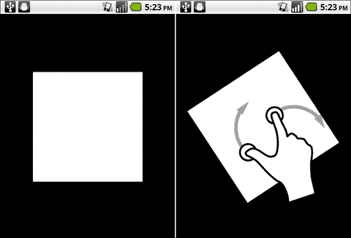

### 注意

提供的手势图由 Gestureworks (www.gestureworks.com)提供。

## 工作原理...

由于我们将`Multitouch.inputMode`设置为通过`MultitouchInputMode.GESTURE`的手势，因此我们能够监听并响应一系列预定义的手势。在这个例子中，我们正在监听`TransformGestureEvent.GESTURE_ROTATE`事件，以便将返回的`rotation`值赋给我们的`Shape`对象。

在大多数情况下，实际上无需对此数据进行进一步计算，但我们可以通过允许（例如）一个`DisplayObject`的旋转影响另一个`DisplayObject`的旋转，甚至影响`Stage`上的多个`DisplayObjects`的旋转，来进行更高级的旋转交互。

## 还有更多...

请注意，我们是以这种方式绘制正方形，使得`Shape`的注册点位于可见`Shape`的中心。我们这样做很重要，因为`DisplayObject`将基于注册点和变换点进行旋转。

在使用 Flash Professional 的绘图工具时，请确保将你的`MovieClip`符号的注册点设置为居中，以便正确工作。

## 另请参阅...

`TransformGestureEvent.GESTURE_ROTATE`只是我们在使用 Flash Platform 运行时和 Android 设备时可以使用的一组四个主要变换手势之一。参考以下食谱以获取这些手势的完整概述：

+   *使用手势放大显示对象*

+   *使用手势平移显示对象*

+   *使用手势滑动显示对象*

# 访问原始触摸点数据

有时 Flash Player 和 AIR 内置的预定义手势对于某些应用程序交互来说是不够的。这个示例将演示如何通过 Flash Player 或 AIR API 访问操作系统报告的原始触摸数据。

## 如何操作...

要在项目中读取原始触摸数据，请执行以下步骤：

1.  首先，将以下类导入到你的项目中：

    ```kt
    import flash.display.StageScaleMode;
    import flash.display.StageAlign;
    import flash.display.Stage;
    import flash.display.Sprite;
    import flash.events.TouchEvent;
    import flash.text.TextField;
    import flash.text.TextFormat;
    import flash.ui.Multitouch;
    import flash.ui.MultitouchInputMode;

    ```

1.  声明一个`TextField`和一个`TextFormat`对象，以允许在设备上可见输出：

    ```kt
    private var traceField:TextField;
    private var traceFormat:TextFormat;

    ```

1.  我们现在将设置我们的`TextField`，应用一个`TextFormat`，并将其添加到`DisplayList`中。这里，我们创建一个方法来执行所有这些操作：

    ```kt
    protected function setupTextField():void {
    traceFormat = new TextFormat();
    traceFormat.bold = true;
    traceFormat.font = "_sans";
    traceFormat.size = 44;
    traceFormat.align = "left";
    traceFormat.color = 0x333333;
    traceField = new TextField();
    traceField.defaultTextFormat = traceFormat;
    traceField.selectable = false;
    traceField.mouseEnabled = false;
    traceField.width = stage.stageWidth;
    traceField.height = stage.stageHeight;
    addChild(traceField);
    }

    ```

1.  设置多触摸 API 的特定输入模式以支持触摸输入，通过将`Multitouch.inputMode`设置为`MultitouchInputMode.TOUCH_POINT`常量。我们还在以下方法中为`TouchEvent`数据注册一组监听器：

    ```kt
    protected function setupTouchEvents():void {
    Multitouch.inputMode = MultitouchInputMode.TOUCH_POINT;
    stage.addEventListener(TouchEvent.TOUCH_MOVE, touchMove);
    stage.addEventListener(TouchEvent.TOUCH_END, touchEnd);
    }

    ```

1.  为了在每次触摸交互结束后清除我们的`TextField`，我们将构建以下函数：

    ```kt
    protected function touchEnd(e:TouchEvent):void {
    traceField.text = "";
    }

    ```

1.  然后，我们可以从触摸事件中读取各种属性以某种方式解释。可以从返回的事件对象中派生出压力、坐标、大小等事件：

    ```kt
    protected function touchMove(e:TouchEvent):void {
    traceField.text = "";
    traceField.appendText("Primary: " + e.isPrimaryTouchPoint + "\n");
    traceField.appendText("LocalX: " + e.localX + "\n");
    traceField.appendText("LocalY: " + e.localY + "\n");
    traceField.appendText("Pressure: " + e.pressure + "\n");
    traceField.appendText("SizeX: " + e.sizeX + "\n");
    traceField.appendText("SizeY: " + e.sizeY + "\n");
    traceField.appendText("StageX: " + e.stageX + "\n");
    traceField.appendText("StageY: " + e.stageY + "\n");
    traceField.appendText("TPID: " + e.touchPointID + "\n");
    }

    ```

1.  结果将类似于以下所示：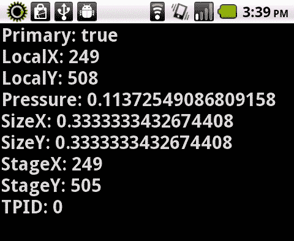

## 工作原理...

设备中注册的每个触摸点都关联有一系列特定的属性。通过注册一组监听器来检测这些交互，我们可以读取这些数据，应用程序也可以做出适当的反应。在我们的示例中，我们只是通过`TextField`显示这些值，但这正是构建压力敏感的游戏机制或其他自定义手势所需的确切数据。

请注意，在一个允许多于一个触摸点的设备上，我们可以使用同一个监听器读取两个触摸点的数据。多个触摸点通过舞台上的位置和`touchPointID`来区分。在设计复杂手势时，或者当我们需要精确地跟踪每个触摸点时，我们会使用这些 ID 来区分触摸点。

## 还有更多...

需要注意的是，当`Multitouch.inputMode`设置为`MultitouchInputMode.TOUCH_POINT`时，我们将无法利用 Flash Player 和 AIR 通过简化手势 API 提供的预定义手势。将`Multitouch.inputMode`设置为`MultitouchInputMode.GESTURE`将允许我们在应用程序中使用常见的预定义手势事件。

# 基于触摸点数据创建自定义手势

使用原始触摸数据，我们可以定义自定义手势以开发应用程序中使用的独特交互。我们通过基于原始触摸事件传递的数据进行计算来实现这一点。

## 如何操作...

在此示例中，我们将创建一个对角线滑动手势，它可以返回四个独立的值，让我们知道对角线滑动的方向。

1.  首先，将以下类导入到你的项目中：

    ```kt
    import flash.display.Shape;
    import flash.display.Sprite;
    import flash.display.Stage;
    import flash.display.StageAlign;
    import flash.display.StageScaleMode;
    import flash.events.TouchEvent;
    import flash.text.TextField;
    import flash.text.TextFormat;
    import flash.ui.Multitouch;
    import flash.ui.MultitouchInputMode;

    ```

1.  声明一个`TextField`和一个`TextFormat`对象，以允许在设备上可见文本输出：

    ```kt
    private var traceField:TextField;
    private var traceFormat:TextFormat;

    ```

1.  我们将设置两个附加对象以帮助跟踪我们的手势，一个名为`drawArea`的`Shape`通过图形 API 绘制手势，以及`trackBeginObject`，这是一个简单的对象，我们可以使用它来保存我们的初始触摸坐标以与触摸结束时的坐标进行比较：

    ```kt
    private var drawArea:Shape;
    private var trackBeginObject:Object;

    ```

1.  现在，我们将设置我们的`TextField`，应用一个`TextFormat`，并将其添加到`DisplayList`中。这里，我们创建一个方法来执行所有这些操作：

    ```kt
    protected function setupTextField():void {
    traceFormat = new TextFormat();
    traceFormat.bold = true;
    traceFormat.font = "_sans";
    traceFormat.size = 32;
    traceFormat.align = "center";
    traceFormat.color = 0x333333;
    traceField = new TextField();
    traceField.defaultTextFormat = traceFormat;
    traceField.selectable = false;
    traceField.mouseEnabled = false;
    traceField.width = stage.stageWidth;
    traceField.height = stage.stageHeight;
    addChild(traceField);
    }

    ```

1.  接下来，我们将在其中设置我们的`Shape`，并使用`Graphics` API 绘制手势：

    ```kt
    protected function setupDrawArea():void {
    drawArea = new Shape();
    addChild(drawArea);
    }

    ```

1.  通过将`Multitouch.inputMode`设置为`MultitouchInputMode.TOUCH_POINT`常量，为多触控 API 设置特定的输入模式以支持触摸输入。在这个例子中，我们将注册一组监听器来检测`Stage`上的触摸移动。这将有助于为我们的手势跟踪提供视觉反馈，并保存我们的初始触摸坐标以与触摸结束时的坐标进行比较。

1.  我们也将通过同样的方法初始化我们的跟踪`Object`：

    ```kt
    protected function setupTouchEvents():void {
    Multitouch.inputMode = MultitouchInputMode.TOUCH_POINT;
    trackBeginObject = new Object();
    stage.addEventListener(TouchEvent.TOUCH_BEGIN, touchBegin);
    stage.addEventListener(TouchEvent.TOUCH_MOVE, touchMove);
    stage.addEventListener(TouchEvent.TOUCH_END, touchEnd);
    }

    ```

1.  构造一个名为`touchBegin`的方法，以初始化我们手势的开始并保存坐标数据以供稍后比较。我们将确保注册的触摸点是通过测试`TouchEvent.isPrimaryTouchPoint`布尔属性来确定是可能是多个触摸中的第一个触摸点。

    ```kt
    protected function touchBegin(e:TouchEvent):void {
    if(e.isPrimaryTouchPoint){
    drawArea.graphics.clear();
    drawArea.graphics.lineStyle(20, 0xFFFFFF, 0.8);
    trackBeginObject.x = e.stageX;
    trackBeginObject.y = e.stageY;
    drawArea.graphics.moveTo(e.stageX, e.stageY);
    }
    }

    ```

1.  构造另一个名为`touchMove`的方法，以接受触摸移动数据并绘制我们的视觉反馈：

    ```kt
    protected function touchMove(e:TouchEvent):void {
    if(e.isPrimaryTouchPoint){
    drawArea.graphics.lineTo(e.stageX, e.stageY);
    }
    }

    ```

1.  构造一个名为`touchEnd`的最终方法，通过我们之前保存的`trackBeginObject`将结束触摸数据坐标与开始时的坐标进行比较，然后确定它是什么样的手势。在这种情况下，我们将结果作为`String`输出到之前创建的`TextField`中：

    ```kt
    protected function touchEnd(e:TouchEvent):void {
    if(e.isPrimaryTouchPoint){
    if(e.stageX > trackBeginObject.x && e.stageY > trackBeginObject.y){
    traceField.text = "Diagonal Gesture: TL -> BR";
    }elseif(e.stageX < trackBeginObject.x && e.stageY > trackBeginObject.y){
    traceField.text = "Diagonal Gesture: TR -> BL";
    }elseif(e.stageX < trackBeginObject.x && e.stageY < trackBeginObject.y){
    traceField.text = "Diagonal Gesture: BR -> TL";
    }elseif(e.stageX > trackBeginObject.x && e.stageY < trackBeginObject.y){
    traceField.text = "Diagonal Gesture: BL -> TR";
    }
    }
    }

    ```

1.  结果将类似于以下所示：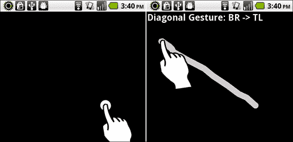

### 注意

图形由 Gestureworks 提供（www.gestureworks.com）。

## 工作原理...

由于我们可以访问所有原始触摸点数据，因此我们可以利用常规 ActionScript 元素（如`Object, Vector`或`Array`实例）从开始到结束追踪触摸交互的生命周期。根据追踪的数据，例如坐标位置，触摸压力等，我们可以进行计算并确定交互是否合格为我们想要跟踪的手势。

在我们前面的例子中，我们对合格手势的判断相当宽松。为了更加严格，我们还可以计算不同触摸点的距离，甚至追踪从触摸开始到触摸结束的时间，以确保手势正是我们要寻找的，因此是用户有意的。

## 还有更多...

实际上，有许多手势库可以作为 Flash Player 和 AIR 运行时的内置手势库的替代品。快速进行网络搜索应该可以让我们访问到这些库，其中许多是免费的开放源码软件。最受欢迎的第三方手势库是`Gesture Works`，可以从[`gestureworks.com/`](http://gestureworks.com/)下载。

# 模拟 Android 长按交互

Android 操作系统中内置的最有用的交互之一是长按。当用户轻触特定区域并持续几秒钟而不释放时，就会实现这一功能。虽然 Flash Player 和 Android 的 AIR 都没有将长按交互作为多点触控手势事件库的一部分，但通过这两个运行时模拟这一交互是相当简单的。

## 如何操作...

我们将通过使用 ActionScript `Timer`对象以及`TouchPoint`事件来模拟 Android 的长按交互。

1.  首先，将以下类导入到您的项目中：

    ```kt
    import flash.display.StageScaleMode;
    import flash.display.StageAlign;
    import flash.display.Stage;
    import flash.display.Sprite;
    import flash.events.TimerEvent;
    import flash.events.TouchEvent;
    import flash.geom.Rectangle;
    import flash.ui.Multitouch;
    import flash.ui.MultitouchInputMode;
    import flash.utils.Timer;

    ```

1.  声明一个`Sprite`对象，我们将在其上进行长按操作，以及一个`Timer`对象：

    ```kt
    private var box:Sprite;
    private var lpTimer:Timer;

    ```

1.  设置我们的`Timer`对象以测量注册长按所需的时间；在这个例子中，是 1000 毫秒。此外，我们现在注册一个监听器，以检测`Timer`周期是否完成：

    ```kt
    protected function setupTimer():void {
    lpTimer = new Timer(1000,1);
    lpTimer.addEventListener(TimerEvent.TIMER_COMPLETE, timerEnd);
    }

    ```

1.  接下来，构建一个方法来处理我们`Sprite`的创建并将其添加到`DisplayList`中：

    ```kt
    protected function setupBox():void {
    box = new Sprite();
    box.graphics.beginFill(0xFFFFFF, 1);
    box.x = stage.stageWidth/2;
    box.y = stage.stageHeight/2;
    box.graphics.drawRect(-100,-100,200,200);
    box.graphics.endFill();
    addChild(box);
    }

    ```

1.  将多点触控 APIs 的特定输入模式设置为支持触摸输入，通过将`Multitouch.inputMode`设置为`MultitouchInputMode.TOUCH_POINT`常量。为了模拟长按，我们必须在每次触摸交互的开始通过`TouchEvent.TOUCH_BEGIN`启动一个定时器。当触发`TouchEvent.TOUCH_END`或其他触摸取消事件时，将停止`Timer`，重置我们的“长按”。

    ```kt
    protected function setupTouchEvents():void {
    Multitouch.inputMode = MultitouchInputMode.TOUCH_POINT;
    box.addEventListener(TouchEvent.TOUCH_BEGIN, touchBegin);
    box.addEventListener(TouchEvent.TOUCH_END, touchEnd);
    box.addEventListener(TouchEvent.TOUCH_OUT, touchEnd);
    box.addEventListener(TouchEvent.TOUCH_ROLL_OUT, touchEnd);
    }

    ```

1.  构造一个方法，在触摸交互开始时修改我们的`Sprite`。我们将稍微放大`Sprite`并改变 alpha 属性以表示已激活某些功能。此时，我们通过`Timer`开始测量长按：

    ```kt
    protected function touchBegin(e:TouchEvent):void {
    box.scaleX += 0.1;
    box.scaleY += 0.1;
    box.alpha = 0.8;
    lpTimer.start();
    }

    ```

1.  `Timer`被设置为在 1000 毫秒后完成一次触发。在这个触发点上，我们可以在应用程序内执行必要的操作。在这个例子中，我们使我们的`Sprite`可以被拖拽：

    ```kt
    protected function timerEnd(e:TimerEvent):void {
    var dragBounds:Rectangle = new Rectangle(box.width/2, box.height/2, stage.stageWidth-box.width, stage.stageHeight-box.height);
    box.startDrag(true, dragBounds);
    }

    ```

1.  触摸结束时应该停止我们的`Timer`并取消与我们的`Sprite`发生的任何拖拽事件。在这里，我们将`Sprite`的`scale`和`alpha`恢复到静止状态：

    ```kt
    protected function touchEnd(e:TouchEvent):void {
    lpTimer.stop();
    box.stopDrag();
    box.scaleX = 1;
    box.scaleY = 1;
    box.alpha = 1;
    }

    ```

1.  结果手势将以以下方式影响我们的视觉对象：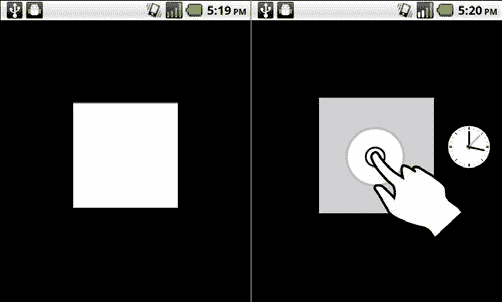

### 注意

插图由 Gestureworks 提供（www.gestureworks.com）。

## 工作原理...

我们的示例需要按住一秒钟来触发函数调用，这导致一个`Shape`对象可以在`Stage`上拖动。这是通过监听`TOUCH_BEGIN`事件，然后监控`Timer`来判断这是否是有意的长按交互来实现的。如果一秒钟内没有`TOUCH_END`事件，那么我们就让`Shape`可拖动。一旦触发`Timer`，我们就修改了`Shape`的缩放和透明度，以表示它现在是一个可拖动的对象。释放`Shape`将完成这个交互。

## 还有更多...

长按功能最常见的用途是重新定位某些视觉元素，正如我们在这里所做的那样，或者唤起菜单操作，因为安卓用户非常习惯于在设备上使用这种类型的交互。

# 程序化唤起虚拟键盘

在大多数情况下，只需将焦点放在文本输入字段上就会唤起虚拟键盘。失去焦点将关闭虚拟键盘。也许我们需要应用程序在没有用户交互的情况下这样做，或者在某些应用状态进入时立即这样做以方便用户。

## 如何操作...

我们配置了一个`Shape`，通过分配给它的`Tap`触摸事件来切换安卓虚拟键盘的开启和关闭。

1.  首先，将以下类导入到您的项目中：

    ```kt
    import flash.display.Sprite;
    import flash.display.Stage;
    import flash.display.StageAlign;
    import flash.display.StageScaleMode;
    import flash.events.SoftKeyboardEvent;
    import flash.events.TouchEvent;
    import flash.text.TextField;
    import flash.text.TextFormat;
    import flash.ui.Multitouch;
    import flash.ui.MultitouchInputMode;

    ```

1.  声明一个`Shape`以及一个`TextField`和`TextFormat`对象。这些将用于交互和视觉反馈。

    ```kt
    private var tapBox:Sprite;
    private var tapBoxField:TextField;
    private var tapBoxFormat:TextFormat;

    ```

1.  接下来，构建一个方法来处理我们`Sprite`的创建并将其添加到`DisplayList`中。点击这个`Sprite`将允许我们唤起或隐藏虚拟键盘。我们还将构建一个`TextField`和相关的`TextFormat`对象在`Sprite`内，以允许我们向用户提供有状态的消息。

    ```kt
    protected function setupBox():void {
    tapBox = new Sprite();
    tapBox.graphics.beginFill(0xFFFFFF, 1);
    tapBox.x = stage.stageWidth/2;
    tapBox.y = stage.stageHeight/2 - 200;
    tapBox.graphics.drawRect(-200,-100,400,160);
    tapBox.graphics.endFill();
    tapBoxFormat = new TextFormat();
    tapBoxFormat.bold = true;
    tapBoxFormat.font = "_sans";
    tapBoxFormat.size = 42;
    tapBoxFormat.align = "center";
    tapBoxFormat.color = 0x333333;
    tapBoxField = new TextField();
    tapBoxField.defaultTextFormat = tapBoxFormat;
    tapBoxField.selectable = false;
    tapBoxField.mouseEnabled = false;
    tapBoxField.multiline = true;
    tapBoxField.wordWrap = true;
    tapBoxField.width = tapBox.width;
    tapBoxField.height = tapBox.height;
    tapBoxField.x = -200;
    tapBoxField.y = -80;
    tapBoxField.text = "Tap to Toggle Virtual Keyboard";
    tapBox.addChild(tapBoxField);
    addChild(tapBox);
    }

    ```

1.  通过将`Multitouch.inputMode`设置为`MultitouchInputMode.TOUCH_POINT`常量，为多点触控 API 设置特定的输入模式以支持触摸输入，并在`DisplayObject`上注册一个事件监听器，这将用于触发安卓虚拟键盘的激活和停用。在这种情况下，是一个`TouchEvent.TOUCH_TAP`事件。触摸点击相当于鼠标点击事件。我们还可以为一系列虚拟键盘事件注册多个监听器。为了让`DisplayObject`能够唤起虚拟键盘，我们需要将其`needsSoftKeyboard`属性设置为`true`。在这里注册的`SoftKeyboardEvent`监听器是可选的。

    ```kt
    protected function setupTouchEvents():void {
    Multitouch.inputMode = MultitouchInputMode.TOUCH_POINT;
    tapBox.needsSoftKeyboard = true;
    tapBox.addEventListener(TouchEvent.TOUCH_TAP, touchTap);
    tapBox.addEventListener (SoftKeyboardEvent. SOFT_KEYBOARD_ACTIVATING, vkActivating);
    tapBox.addEventListener(SoftKeyboardEvent. SOFT_KEYBOARD_ACTIVATE, vkActivate);
    tapBox.addEventListener(SoftKeyboardEvent. SOFT_KEYBOARD_DEACTIVATE, vkDeactivate);
    }

    ```

1.  为了使用前面定义的`SoftKeyboardEvent`监听器，我们必须创建各种方法，在检测到每次活动时执行。这样，我们可以在激活过程中监听、与虚拟键盘交互，甚至阻止某些事件触发，或者在检测到虚拟键盘完全完成激活或停用时进行拦截。

    ```kt
    protected function vkActivating(e:SoftKeyboardEvent):void {
    trace("Virtual Keyboard ACTIVATING");
    }
    protected function vkActivate(e:SoftKeyboardEvent):void {
    trace("Virtual Keyboard ACTIVATED");
    }
    protected function vkDeactivate(e:SoftKeyboardEvent):void {
    trace("Virtual Keyboard DEACTIVATED");
    }

    ```

1.  要调用虚拟键盘，我们只需在 `DisplayObject` 上调用 `requestSoftKeyboard()`，其 `needsSoftKeyboard` 属性已设置为 `true`。在这里，我们检查 `needsSoftKeyboard` 是否设置为 true，并据此切换此属性。

    ```kt
    protected function touchTap(e:TouchEvent):void {
    if(tapBox.needsSoftKeyboard == true){
    tapBox.requestSoftKeyboard();
    tapBoxField.text = "Virtual Keyboard is Up";
    tapBox.needsSoftKeyboard = false;
    }else{
    tapBox.needsSoftKeyboard = true;
    tapBoxField.text = "Virtual Keyboard is Down";
    }
    }

    ```

1.  要关闭虚拟键盘，用户需要点击一个 `DisplayObject`，其 `needsSoftKeyboard` 属性已设置为 `false`。

1.  结果将类似于以下所示：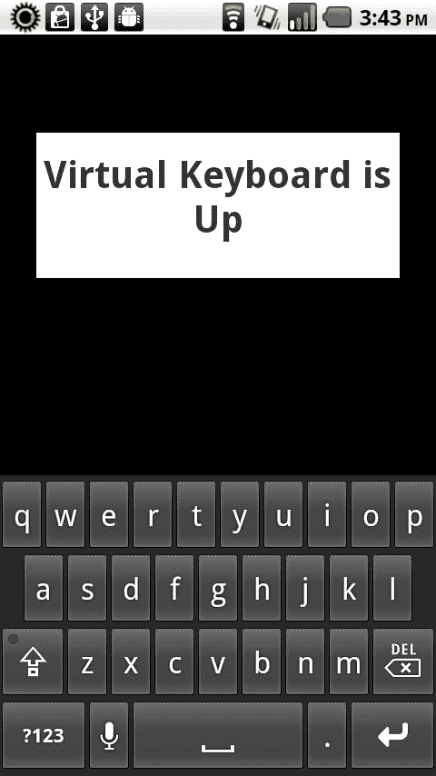

## 它是如何工作的...

为了通过 ActionScript 调用 Android 虚拟键盘，我们必须将交互式 `DisplayObjects.needsSoftKeyboard` 属性设置为 `true`。这将允许我们注册一个轻触监听器，并在触发轻触事件时调用 `requestSoftKeyboard()`，在屏幕上显示虚拟键盘。

点击任何 `needsSoftKeyboard` 属性设置为 `false`（默认状态）的 `DisplayObject` 将关闭虚拟键盘。在我们的前一个示例中，我们将此属性从 `true` 切换到 `false`，以便 `DisplayObject` 作为切换控件。

## 还有更多...

虽然使用 `SoftKeyboardEvent` 类通过 ActionScript 激活或关闭 Android 虚拟键盘并不是必须的，但它包含在示例类中，因为它允许我们使用一组额外的监听器函数来响应这些事件。

# 响应 Android 软键交互

AIR for Android 不包括支持调用通常出现在屏幕底部的原生操作系统选项菜单。但是，有一些方法可以模拟原生行为，我们将在本节中探讨这些方法。

在 Android 上，`back` 按钮的正常行为是通过应用程序状态向后退，直到回到主界面。再次按下 `back` 按钮将退出应用程序。默认情况下，AIR for Android 应用程序也具有这种行为。如果我们想覆盖这个默认行为，我们必须设置一个机制来拦截此交互并阻止它。

## 如何操作...

我们可以通过标准的 ActionScript 事件监听器响应软键事件。

1.  首先，将以下类导入到您的项目中：

    ```kt
    import flash.display.Sprite;
    import flash.display.Stage;
    import flash.display.StageAlign;
    import flash.display.StageScaleMode;
    import flash.events.KeyboardEvent;
    import flash.text.TextField;
    import flash.text.TextFormat;
    import flash.ui.Keyboard;

    ```

1.  声明一个 `TextField` 和 `TextFormat` 对象，以允许在设备上显示可见输出：

    ```kt
    private var traceField:TextField;
    private var traceFormat:TextFormat;

    ```

1.  然后，我们将设置我们的 `TextField`，应用 `TextFormat`，并将其添加到 `DisplayList` 中。在这里，我们创建一个方法来执行所有这些操作：

    ```kt
    protected function setupTextField():void {
    traceFormat = new TextFormat();
    traceFormat.bold = true;
    traceFormat.font = "_sans";
    traceFormat.size = 32;
    traceFormat.align = "center";
    traceFormat.color = 0x333333;
    traceField = new TextField();
    traceField.defaultTextFormat = traceFormat;
    traceField.selectable = false;
    traceField.mouseEnabled = false;
    traceField.width = stage.stageWidth;
    traceField.height = stage.stageHeight;
    addChild(traceField);
    }

    ```

1.  现在，我们需要在 `Stage` 上设置一个事件监听器来响应键盘按键：

    ```kt
    protected function registerListeners():void {
    stage.addEventListener(KeyboardEvent.KEY_DOWN, keyDown);
    }

    ```

1.  然后，我们将在 `keyDown` 方法中编写一个 switch/case 语句，以对特定的软键事件执行不同的操作。在这种情况下，我们将特定菜单项的名称输出到我们的 `TextField`：

    ```kt
    protected function keyDown(e:KeyboardEvent):void {
    var key:uint = e.keyCode;
    traceField.text = key + " pressed!\n";
    switch(key){
    case Keyboard.BACK:{
    e.preventDefault();
    traceField.appendText("Keyboard.BACK");
    break;
    }
    case Keyboard.MENU:{
    traceField.appendText("Keyboard.MENU");
    break;
    }
    case Keyboard.SEARCH:{
    traceField.appendText("Keyboard.SEARCH");
    break;
    }
    }
    }

    ```

1.  结果将类似于以下所示：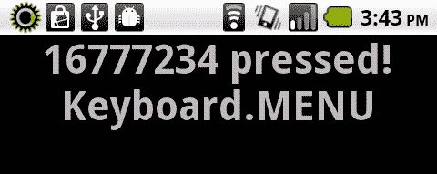

## 它是如何工作的...

我们像为物理或虚拟键盘注册监听器一样，为这些 Android 设备软键注册监听器。如果使用 AIR for Android 开发 Android 应用程序，我们还可以通过`Keyboard`类访问`BACK, MENU`和`SEARCH`常量。

注册键盘`keyDown`监听器，然后通过 switch/case 语句响应特定的键值，使我们能够适当地响应用户交互。例如，如果检测到`MENU`软键的交互，我们可以显示一个选项菜单。

## 还有更多...

Android 设备上还有一个`HOME`软键。这个按键无法通过 ActionScript 捕获，因为它仅用于从任何打开的应用程序返回用户到 Android 主屏幕。

### 注意

当我们想要取消`BACK`键的默认 Android 行为时，必须使用`keyDown`事件，因为`keyUp`事件将触发得太晚，根本无法捕获。

# 响应轨迹球和 D-Pad 事件

一些 Android 设备具有我们可以利用的额外物理输入。例如，摩托罗拉 Droid 有一个滑盖键盘，包括一个方向性的 D-pad，而 HTC Nexus One 有一个内置的轨迹球控制。

## 如何操作...

我们可以通过标准的 ActionScript 事件监听器响应轨迹球和 D-pad 事件。

1.  首先，将以下类导入到您的项目中：

    ```kt
    import flash.display.Shape;
    import flash.display.Sprite;
    import flash.display.Stage;
    import flash.display.StageAlign;
    import flash.display.StageScaleMode;
    import flash.events.KeyboardEvent;
    import flash.text.TextField;
    import flash.text.TextFormat;
    import flash.ui.Keyboard;

    ```

1.  声明一个`Shape`以及一个`TextField`和`TextFormat`对象。这些将用于交互和视觉反馈。

    ```kt
    private var traceField:TextField;
    private var traceFormat:TextFormat;
    private var box:Shape;

    ```

1.  然后，我们将设置我们的`TextField`，应用`TextFormat`，并将其添加到`DisplayList`中。在这里，我们创建一个方法来执行所有这些操作：

    ```kt
    protected function setupTextField():void {
    traceFormat = new TextFormat();
    traceFormat.bold = true;
    traceFormat.font = "_sans";
    traceFormat.size = 32;
    traceFormat.align = "center";
    traceFormat.color = 0x333333;
    traceField = new TextField();
    traceField.defaultTextFormat = traceFormat;
    traceField.selectable = false;
    traceField.mouseEnabled = false;
    traceField.width = stage.stageWidth;
    traceField.height = stage.stageHeight;
    addChild(traceField);
    }

    ```

1.  接下来，构建一个方法来处理我们的`Shape`的创建并将其添加到`DisplayList`中。

    ```kt
    protected function setupBox():void {
    box = new Shape();
    box.graphics.beginFill(0xFFFFFF, 1);
    box.x = stage.stageWidth/2;
    box.y = stage.stageHeight/2;
    box.graphics.drawRect(-100,-100,200,200);
    box.graphics.endFill();
    addChild(box);
    }

    ```

1.  在`Stage`上设置一个事件监听器，以响应键盘按键：

    ```kt
    protected function registerListeners():void {
    stage.addEventListener(KeyboardEvent.KEY_DOWN, keyDown);
    }

    ```

1.  现在，我们只需要编写一个 switch/case 语句，以响应 D-pad/轨迹球事件执行不同的动作。在这种情况下，我们改变`Shape`的位置，并将`keyCode`输出到`TextField`：

    ```kt
    protected function keyDown(e:KeyboardEvent):void {
    var key:uint = e.keyCode;
    traceField.text = key + " pressed!";
    switch(key){
    case Keyboard.UP:{
    box.y -= 20;
    break;
    }
    case Keyboard.DOWN:{
    box.y += 20;
    break;
    }
    case Keyboard.LEFT:{
    box.x -= 20;
    break;
    }
    case Keyboard.RIGHT:{
    box.x += 20;
    break;
    }
    case Keyboard.ENTER:{
    box.x = stage.stageWidth/2;
    box.y = stage.stageHeight/2;
    break;
    }
    }
    }

    ```

1.  结果将类似于以下所示：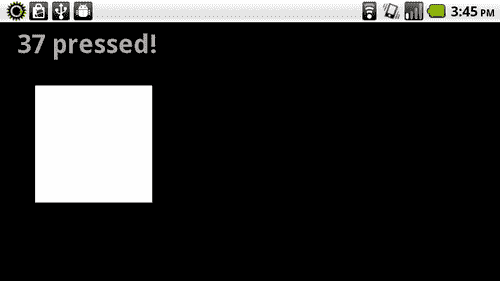

## 工作原理...

我们像注册物理键盘上的`Keyboard.UP, Keyboard.DOWN, Keyboard.LEFT, Keyboard.RIGHT`以及`Keyboard.ENTER`键一样，为这些特殊控件注册监听器。在这个例子中，我们根据 D-pad/轨迹球被按下，在每个方向上移动目标`Shape`并重置位置。我们还将`keyCode`值输出到文本字段中。

## 还有更多...

需要注意的是，大多数 Android 设备没有这种专门的输入机制。如果我们注册了映射到这些键的事件，我们应始终提供一种替代方案。
