# 第三章：空间移动：加速度计和地理定位传感器

本章节将涵盖以下内容：

+   检测 Android 设备是否支持加速度计

+   检测 Android 设备在 3D 空间中的移动

+   调整加速度计传感器更新间隔

+   通过加速度计传感器更新显示对象位置

+   根据设备倾斜在竖屏和横屏之间切换

+   检测设备是否支持地理定位传感器

+   检测用户是否禁用了地理定位传感器

+   获取设备地理定位传感器数据

+   调整地理定位传感器更新间隔

+   通过地理坐标获取地图数据

# 引言

Android 设备不仅配备了触摸面板、虚拟键盘和其他输入机制，还包括用于检测 3D 空间变化的加速度计传感器，以及细粒度（卫星）和粗粒度（三角测量）的地理定位。本章将探讨如何在基于 Flash 平台的 Android 应用中有意义地利用这些传感器。

本章中的所有内容都表示为纯 ActionScript 3 类，并不依赖于外部库或 Flex 框架。因此，我们可以将这些示例用于我们希望的任何 IDE 中。

# 检测 Android 设备是否支持加速度计

在针对 Android 操作系统开发项目时，确保设备支持某些传感器（如加速度计）总是一个好主意。在 Android 手机的情况下，这可能总是如此，但我们绝不能假设任何设备的功能。

## 如何实现...

我们需要使用加速度计 API 类来检测是否支持加速度计：

1.  首先，将以下类导入到你的项目中：

    ```kt
    import flash.display.StageScaleMode;
    import flash.display.StageAlign;
    import flash.display.Stage;
    import flash.display.Sprite;
    import flash.text.TextField;
    import flash.text.TextFormat;
    import flash.sensors.Accelerometer;

    ```

1.  声明一个`TextField`和`TextFormat`对象对，以允许在设备上输出可见内容：

    ```kt
    private var traceField:TextField;
    private var traceFormat:TextFormat;

    ```

1.  我们现在将设置我们的`TextField`，应用`TextFormat`，并将其添加到`DisplayList`中。这里，我们创建一个方法来执行所有这些操作：

    ```kt
    protected function setupTextField():void {
    traceFormat = new TextFormat();
    traceFormat.bold = true;
    traceFormat.font = "_sans";
    traceFormat.size = 44;
    traceFormat.align = "center";
    traceFormat.color = 0x333333;
    traceField = new TextField();
    traceField.defaultTextFormat = traceFormat;
    traceField.selectable = false;
    traceField.mouseEnabled = false;
    traceField.width = stage.stageWidth;
    traceField.height = stage.stageHeight;
    addChild(traceField);
    }

    ```

1.  然后，只需调用`Accelerometer.isSupported`来确认对此功能的支持：

    ```kt
    protected function checkAccelerometer():void {
    traceField.appendText("Accelerometer: " + Accelerometer.isSupported + "\n");
    }

    ```

1.  此调用将返回一个布尔值`true`或`false`，表示设备对此传感器的支持情况：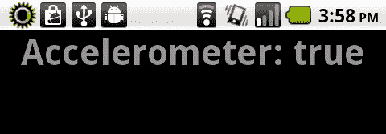

## 工作原理...

检测设备是否包含加速度计传感器将决定用户是否能有效利用依赖于此类数据的应用程序。如果我们的查询返回为 false，那么我们有责任通知用户或提供某种替代方式，以从设备收集加速度数据作为互动形式。

# 检测 Android 设备在 3D 空间中的移动

`Accelerometer`类与设备的动作传感器协同工作，在设备在 3D 空间移动时测量并报告运动和加速度坐标。为了测量这些数据并对这些测量做出反应，我们必须执行某些操作，以便在我们的应用程序中收集加速度数据。

## 如何操作...

我们需要使用某些 ActionScript 类，以便监控加速度传感器的反馈：

1.  首先，将以下类导入到你的项目中：

    ```kt
    import flash.display.Sprite;
    import flash.display.Stage;
    import flash.display.StageAlign;
    import flash.display.StageScaleMode;
    import flash.events.AccelerometerEvent;
    import flash.sensors.Accelerometer;
    import flash.text.TextField;
    import flash.text.TextFormat;

    ```

1.  声明一个`TextField`和一个`TextFormat`对象对，以便在设备上输出可见内容，以及一个`Accelerometer`对象：

    ```kt
    private var traceField:TextField;
    private var traceFormat:TextFormat;
    private var accelerometer:Accelerometer;

    ```

1.  我们现在将设置我们的`TextField`，应用一个`TextFormat`，并将其添加到`DisplayList`中。在这里，我们创建一个方法来执行所有这些操作：

    ```kt
    protected function setupTextField():void {
    traceFormat = new TextFormat();
    traceFormat.bold = true;
    traceFormat.font = "_sans";
    traceFormat.size = 44;
    traceFormat.align = "center";
    traceFormat.color = 0x333333;
    traceField = new TextField();
    traceField.defaultTextFormat = traceFormat;
    traceField.selectable = false;
    traceField.mouseEnabled = false;
    traceField.width = stage.stageWidth;
    traceField.height = stage.stageHeight;
    addChild(traceField);
    }

    ```

1.  我们现在必须实例化一个`Accelerometer`对象，以便注册一个`AccelerometerEvent`监听器。在这种情况下，我们将它调用一个名为`movementDetected`的函数。我们还首先检查设备是否支持`Accelerometer API`，通过检查`Accelerometer.isSupported`属性：

    ```kt
    protected function registerListeners():void {
    if(Accelerometer.isSupported) {
    accelerometer = new Accelerometer();
    accelerometer.addEventListener(AccelerometerEvent.UPDATE, movementDetected);
    }else{
    traceField.text = "Accelerometer not supported!";
    }
    }

    ```

1.  我们现在能够通过`movementDetected`方法监控并响应设备移动：

    ```kt
    protected function movementDetected(e:AccelerometerEvent):void {
    traceField.text = "";
    traceField.appendText("Time: " + e.timestamp + "\n");
    traceField.appendText("X: " + e.accelerationX + "\n");
    traceField.appendText("Y: " + e.accelerationY + "\n");
    traceField.appendText("Z: " + e.accelerationZ + "\n");
    }

    ```

1.  输出将类似于这样：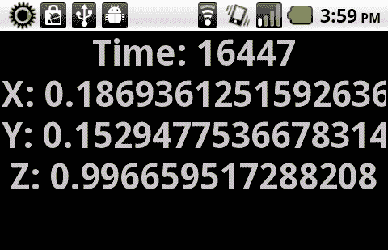

## 它的工作原理...

通过注册一个事件监听器到`AccelerometerEvent.UPDATE`，我们能够检测到 Android 设备上的动作传感器报告的变化。有四个属性通过此事件报告回来：`accelerationX, accelerationY, accelerationZ`和`timestamp`。

+   `accelerationX:` 一个`Number`类型的值，它测量沿着 x 轴的加速度，当设备直立放置时，x 轴从左到右。当设备向右移动时，表示为正加速度。向左移动则表示为负数。

+   `accelerationY:` 一个`Number`类型的值，它测量沿着 y 轴的加速度，当设备直立放置时，y 轴从下到上。当设备向上移动时，表示为正加速度。向下移动则表示为负数。

+   `accelerationZ:` 一个`Number`类型的值，它测量沿着 z 轴的加速度，z 轴垂直于设备表面。当设备移动使得表面朝向天空时，表示为正加速度。将表面定位在地面上方角度时，将表示为负数。

+   `timestamp:` 一个`int`类型的值，它测量自应用程序初始化以来经过的毫秒数。这可以用来随时间跟踪更新事件。

## 还有更多...

加速度传感器在创建基于平衡的 Android 游戏时经常被使用，例如让一个球基于设备倾斜通过迷宫，但我们也可以以任何我们想要的方式来使用这些数据，以监测空间、倾斜或基于其他动作的变化。

# 调整加速度传感器更新间隔

虽然大多数应用程序可能默认的加速度计传感器更新间隔就足够了，但如果我们要针对特定目的加快或减慢这个间隔该怎么办？

## 如何操作...

我们需要使用`Accelerometer`类中包含的方法来更改加速度计传感器更新间隔：

1.  首先，将以下类导入到您的项目中：

    ```kt
    import flash.display.Sprite;
    import flash.display.Stage;
    import flash.display.StageAlign;
    import flash.display.StageScaleMode;
    import flash.events.AccelerometerEvent;
    import flash.events.TouchEvent;
    import flash.sensors.Accelerometer;
    import flash.text.TextField;
    import flash.text.TextFormat;
    import flash.ui.Multitouch;
    import flash.ui.MultitouchInputMode;

    ```

1.  我们现在将声明一些要在示例中使用的对象。首先，一个`TextField`和一个`TextFormat`对象对，以便在设备上允许可见输出，以及一个`Accelerometer`对象。

1.  然后，我们还需要使用一个`Number`来跟踪我们的间隔量。

1.  还需要两个`Sprite`对象供用户与之交互。

    ```kt
    private var traceField:TextField;
    private var traceFormat:TextFormat;
    private var accelerometer:Accelerometer;
    private var accelerometerInterval:Number;
    private var boxUp:Sprite;
    private var boxDown:Sprite;

    ```

1.  我们现在将设置`TextField`，应用`TextFormat`，并将其添加到`DisplayList`中。这里，我们创建一个方法来执行所有这些操作：

    ```kt
    protected function setupTextField():void {
    traceFormat = new TextFormat();
    traceFormat.bold = true;
    traceFormat.font = "_sans";
    traceFormat.size = 44;
    traceFormat.align = "center";
    traceFormat.color = 0xFFFFFF;
    traceField = new TextField();
    traceField.defaultTextFormat = traceFormat;
    traceField.selectable = false;
    traceField.mouseEnabled = false;
    traceField.width = stage.stageWidth;
    traceField.height = stage.stageHeight;
    addChild(traceField);
    }

    ```

1.  为了通过触摸检测用户输入，我们将创建两个`Sprite`实例并将每个实例添加到`Stage`中。为了在我们与这些对象注册的任何事件监听器中区分`Sprite`实例，我们将为每个`Sprite`提供一个唯一的`name`属性：

    ```kt
    protected function setupBoxes():void {
    boxUp = new Sprite();
    boxUp.name = "boxUp";
    boxUp.graphics.beginFill(0xFFFFFF, 1);
    boxUp.x = 20;
    boxUp.y = stage.stageHeight/2;
    boxUp.graphics.drawRect(0,0,100,80);
    boxUp.graphics.endFill();
    addChild(boxUp);
    boxDown = new Sprite();
    boxDown.name = "boxDown";
    boxDown.graphics.beginFill(0xFFFFFF, 1);
    boxDown.x = stage.stageWidth - 120;
    boxDown.y = stage.stageHeight/2;
    boxDown.graphics.drawRect(0,0,100,80);
    boxDown.graphics.endFill();
    addChild(boxDown);
    }

    ```

1.  首先，我们还要检查设备是否实际支持加速度计 API，通过检查`Accelerometer.isSupported`属性。

1.  然后，我们需要将多点触控 API 的特定输入模式设置为通过将`Multitouch.inputMode`设置为`MultitouchInputMode.TOUCH_POINT`常量来支持触摸输入。

1.  每个 Sprite 将注册一个`TouchEvent.TOUCH_TAP`监听器，这样它就能够通过触摸轻敲来调用一个方法来改变更新间隔。

1.  现在，我们可以实例化一个`Accelerometer`对象并调用`setRequestedUpdateInterval`方法，此方法调用需要传入以毫秒为单位的间隔。

1.  我们还将注册一个事件监听器以响应任何设备移动：

    ```kt
    protected function registerListeners():void {
    if(Accelerometer.isSupported) {
    Multitouch.inputMode = MultitouchInputMode.TOUCH_POINT;
    boxUp.addEventListener(TouchEvent.TOUCH_TAP, shiftInterval);
    boxDown.addEventListener(TouchEvent.TOUCH_TAP, shiftInterval);
    accelerometer = new Accelerometer();
    accelerometerInterval = 100;
    accelerometer.setRequestedUpdateInterval (accelerometerInterval);
    accelerometer.addEventListener(AccelerometerEvent.UPDATE, movementDetected);
    }else{
    traceField.text = "Accelerometer not supported!";
    }
    }

    ```

1.  我们的`shiftInterval`方法现在将响应我们创建的两个`Sprite`框拦截的任何触摸轻敲。我们将检查每个`Sprite`被赋予的`name`属性，并相应地调整`accelerometerInterval`：

    ```kt
    protected function shiftInterval(e:TouchEvent):void {
    switch(e.target.name){
    case "boxUp":{
    accelerometerInterval += 100;
    break;
    }
    case "boxDown":{
    accelerometerInterval -= 100;
    break;
    }
    }
    if(accelerometerInterval < 0){
    accelerometerInterval = 0;
    }
    accelerometer.setRequestedUpdateInterval(accelerometerInterval);
    }

    ```

1.  加速度计传感器更新间隔现在将调用以下函数，该函数将通过我们的`TextField`输出检测到的移动和间隔数据：

    ```kt
    protected function movementDetected(e:AccelerometerEvent):void {
    traceField.text = "Interval: " + accelerometerInterval + "\n\n";
    traceField.appendText("Time: " + e.timestamp + "\n");
    traceField.appendText("X: " + e.accelerationX + "\n");
    traceField.appendText("Y: " + e.accelerationY + "\n");
    traceField.appendText("Z: " + e.accelerationZ + "\n");
    }

    ```

1.  结果将类似于以下内容：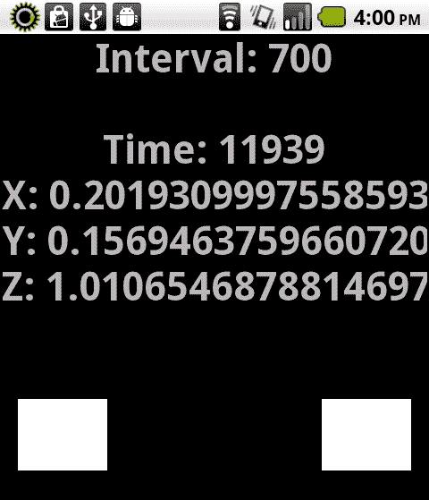

## 工作原理...

通过`setRequestedUpdateInterval()`设置加速度计更新间隔，我们能够根据特定应用程序中的情况调整此间隔。在前面演示类中，我们渲染了两个作为增加和减少`TouchEvent.TOUCH_TAP`事件受体的`Sprites`。轻敲这些`DisplayObjects`将会增加或减少加速度计更新间隔，这个间隔通过屏幕上的`TextField`进行监控。

## 还有更多内容...

请注意，默认的加速度传感器更新间隔取决于运行我们应用程序的设备。这种策略也可以用来尝试平衡不同设备间的间隔。

# 通过加速度事件更新显示对象位置

创建 Android 设备上的各种游戏或应用程序时可以使用加速度传感器。这种数据更频繁的用途之一是响应加速度更新事件数据，更新 `Stage` 上 `DisplayObject` 的位置。

## 如何操作...

我们需要使用某些 ActionScript 类，以便通过 `DisplayObject` 实例监听加速度反馈。在这个例子中，我们将使用一个简单的 `Shape` 对象，根据这些数据改变其位置：

1.  首先，将以下类导入到你的项目中：

    ```kt
    import flash.display.Shape;
    import flash.display.Sprite;
    import flash.display.Stage;
    import flash.display.StageAlign;
    import flash.display.StageScaleMode;
    import flash.events.AccelerometerEvent;
    import flash.sensors.Accelerometer;
    import flash.text.TextField;
    import flash.text.TextFormat;

    ```

1.  我们现在将声明一些要在示例中使用的对象。首先，一个 `TextField` 和 `TextFormat` 对象对，以及一个 `Shape` 以便在设备上显示输出。

1.  我们还必须声明一个 `Accelerometer` 对象，以便监听和响应设备移动：

    ```kt
    private var traceField:TextField;
    private var traceFormat:TextFormat;
    private var box:Shape;
    private var accelerometer:Accelerometer;

    ```

1.  我们现在将设置 `TextField`，应用 `TextFormat`，并将其添加到 `DisplayList` 中。这里，我们创建一个方法来执行所有这些操作：

    ```kt
    protected function setupTextField():void {
    traceFormat = new TextFormat();
    traceFormat.bold = true;
    traceFormat.font = "_sans";
    traceFormat.size = 44;
    traceFormat.align = "center";
    traceFormat.color = 0xFFFFFF;
    traceField = new TextField();
    traceField.defaultTextFormat = traceFormat;
    traceField.selectable = false;
    traceField.mouseEnabled = false;
    traceField.width = stage.stageWidth;
    traceField.height = stage.stageHeight;
    addChild(traceField);
    }

    ```

1.  创建一个名为 `box` 的新 `Shape` 对象，使用 `Graphics` API 绘制一个矩形，并将其添加到 `Stage` 上：

    ```kt
    protected function setupBox():void {
    box = new Shape();
    box.graphics.beginFill(0xFFFFFF, 1);
    box.x = stage.stageWidth/2;
    box.y = stage.stageHeight/2;
    box.graphics.drawRect(-100,-100,200,200);
    box.graphics.endFill();
    addChild(box);
    }

    ```

1.  我们现在必须实例化一个 `Accelerometer` 对象，以便注册一个 `AccelerometerEvent` 监听器。在这种情况下，我们将让它调用一个名为 `movementDetected` 的函数。我们还要首先检查设备是否支持 Accelerometer API，通过检查 `Accelerometer.isSupported` 属性：

    ```kt
    protected function registerListeners():void {
    if(Accelerometer.isSupported) {
    accelerometer = new Accelerometer();
    accelerometer.addEventListener(AccelerometerEvent.UPDATE, movementDetected);
    }else{
    traceField.text = "Accelerometer not supported!";
    }
    }

    ```

1.  现在，我们可以通过调整 `Shape` 对象的 x 和 y 坐标，通过 `movementDetected` 方法监听和响应设备移动，基于 `AccelerometerEvent.UPDATE` 事件报告的 `accelerationX` 和 `accelerationY` 数据。

1.  在以下函数中，我们将执行一系列检查，以确保当设备倾斜时 `Shape` 不会移出 `Stage`。我们还将输出 `Sprite` 的 x 和 y 属性到一个 `TextField`

    ```kt
    protected function movementDetected(e:AccelerometerEvent):void {
    traceField.text = "";
    var speed:Number = 20;
    if(box.x > box.width/2){
    box.x -= Math.floor(e.accelerationX*speed);
    }else{
    box.x = box.width/2;
    }
    if(box.x < stage.stageWidth-(box.width/2)){
    box.x -= Math.floor(e.accelerationX*speed);
    }else{
    box.x = stage.stageWidth-(box.width/2);
    }
    if(box.y > box.height/2){
    box.y += Math.floor(e.accelerationY*speed);
    }else{
    box.y = box.height/2;
    }
    if(box.y < stage.stageHeight-(box.height/2)){
    box.y += Math.floor(e.accelerationY*speed);
    }else{
    box.y = stage.stageHeight-(box.height/2);
    }
    traceField.appendText("box.x: " + box.x + "\n");
    traceField.appendText("box.y: " + box.y + "\n");
    }

    ```

1.  结果输出将类似于以下内容：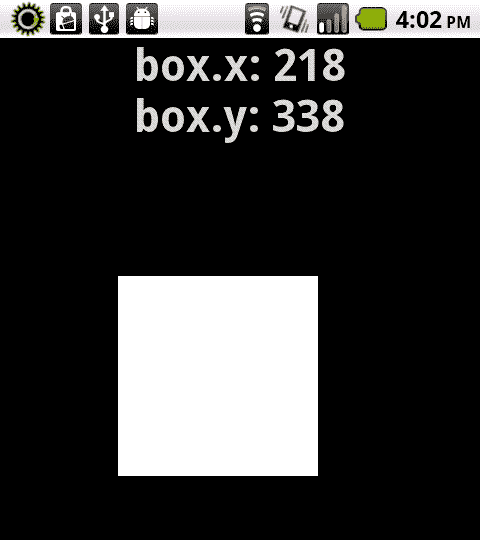

## 工作原理...

通过注册 `AccelerometerEvent.UPDATE` 事件监听器，我们可以检测到 Android 设备上运动传感器报告的变化。使用 ActionScript，我们可以对这些运动和倾斜的变化做出响应，如代码示例所示，根据报告的传感器数据在屏幕上移动 `DisplayObject`。

在示例中，我们不仅在屏幕上移动 `Shape` 对象，同时通过多个条件语句考虑对象的宽度、高度和检测到的屏幕尺寸，确保形状不会离开屏幕。

# 根据设备倾斜切换横屏和竖屏

大多数 Android 设备允许用户以纵向和横向视图交互。当设备以 y 轴从上到下对齐时，启用纵向模式；而通过将设备持握以 y 轴从左到右测量时，启用横向模式。通过使用加速度计传感器报告的数据，我们可以知道这些移动何时发生并在我们的应用程序内响应该移动。

## 如何操作...

我们需要使用`Accelerometer` API 来检测设备旋转和倾斜：

1.  首先，将以下类导入到你的项目中：

    ```kt
    import flash.display.Sprite;
    import flash.display.Stage;
    import flash.display.StageAlign;
    import flash.display.StageScaleMode;
    import flash.events.AccelerometerEvent;
    import flash.sensors.Accelerometer;
    import flash.text.TextField;
    import flash.text.TextFormat;

    ```

1.  我们现在将声明一些在示例中要使用的对象。首先，一个`TextField`和`TextFormat`对象对，以允许在设备上输出可见内容。

1.  我们还必须声明一个`Accelerometer`对象，以便监控并响应用户设备的移动：

    ```kt
    private var traceField:TextField;
    private var traceFormat:TextFormat;
    private var accelerometer:Accelerometer;

    ```

1.  现在，我们将设置我们的`TextField`，应用一个`TextFormat`，并将其添加到`DisplayList`中。这里，我们创建一个方法来执行所有这些操作：

    ```kt
    protected function setupTextField():void {
    traceFormat = new TextFormat();
    traceFormat.bold = true;
    traceFormat.font = "_sans";
    traceFormat.size = 44;
    traceFormat.align = "center";
    traceFormat.color = 0xFFFFFF;
    traceField = new TextField();
    traceField.defaultTextFormat = traceFormat;
    traceField.selectable = false;
    traceField.mouseEnabled = false;
    traceField.width = stage.stageWidth;
    traceField.height = stage.stageHeight;
    addChild(traceField);
    }

    ```

1.  然后，我们必须创建一个`Accelerometer`实例，并为其分配一个类型为`AccelerometerEvent.UPDATE`的事件监听器。每当检测到加速度计数据发生变化时，这将触发`movementDetected`方法。我们还首先检查设备是否实际支持加速度计 API，通过检查`Accelerometer.isSupported`属性：

    ```kt
    protected function registerListeners():void {
    if(Accelerometer.isSupported) {
    accelerometer = new Accelerometer();
    accelerometer.addEventListener(AccelerometerEvent.UPDATE, movementDetected);
    }else{
    traceField.text = "Accelerometer not supported!";
    }
    }

    ```

1.  在我们的`movementDetected`方法中，我们只需监控传感器报告的加速度数据，并相应地调整我们的应用程序。我们还将输出数据到我们的`TextField`以监控设备移动：

    ```kt
    protected function movementDetected(e:AccelerometerEvent):void {
    traceField.text = "";
    traceField.appendText("Time: " + e.timestamp + "\n");
    traceField.appendText("X: " + e.accelerationX + "\n");
    traceField.appendText("Y: " + e.accelerationY + "\n");
    traceField.appendText("Z: " + e.accelerationZ + "\n");
    if(e.accelerationY > 0.5){
    traceField.appendText("\n\n\nPORTRAIT");
    }else{
    traceField.appendText("\n\n\nLANDSCAPE");
    }
    }

    ```

1.  结果将类似于以下这样：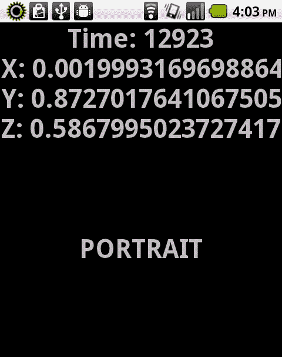

## 工作原理...

当我们的应用程序检测到加速度移动时，`movementDetected`方法将报告有关设备`x, y`和`z`轴的数据。如果我们监控所报告的加速度值，我们可以以考虑垂直方向的方式响应用户设备的倾斜，从而知道是否需要调整`Stage`上的元素以适应纵向或横向观看。

## 还有更多内容...

在这个示例中，我们使用纯 ActionScript 来检测加速度计传感器数据并响应该数据。在开发应用程序时使用移动 Flex 框架，通过在**Flex Mobile Project**设置中选择**Mobile Settings**对话框中的**Automatically reorient**（自动重新定向）选项，我们可以让框架处理设备方向。

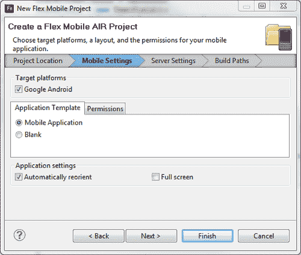

## 另请参阅...

第六章，*结构适应性：处理设备布局和缩放*，也包含有关使用其他检测方法适应设备方向变化的信息。

# 检测设备是否支持地理定位传感器

在针对 Android 操作系统开发项目时，确保某些传感器（如地理定位传感器）实际上在设备上得到支持总是一个好主意。在 Android 设备的情况下，这可能总是如此，但我们绝不应假设任何设备的功能。

## 如何操作...

我们需要使用内部类来检测地理定位 API 是否得到支持：

1.  首先，将以下类导入到您的项目中：

    ```kt
    import flash.display.StageScaleMode;
    import flash.display.StageAlign;
    import flash.display.Stage;
    import flash.display.Sprite;
    import flash.text.TextField;
    import flash.text.TextFormat;
    import flash.sensors.Geolocation;

    ```

1.  声明一个`TextField`和`TextFormat`对象对，以允许在设备上可见输出：

    ```kt
    private var traceField:TextField;
    private var traceFormat:TextFormat;

    ```

1.  我们现在将设置我们的`TextField`，应用一个`TextFormat`，并将`TextField`添加到`DisplayList`中。在这里，我们创建一个方法来执行所有这些操作：

    ```kt
    protected function setupTextField():void {
    traceFormat = new TextFormat();
    traceFormat.bold = true;
    traceFormat.font = "_sans";
    traceFormat.size = 44;
    traceFormat.align = "center";
    traceFormat.color = 0x333333;
    traceField = new TextField();
    traceField.defaultTextFormat = traceFormat;
    traceField.selectable = false;
    traceField.mouseEnabled = false;
    traceField.width = stage.stageWidth;
    traceField.height = stage.stageHeight;
    addChild(traceField);
    }

    ```

1.  然后，只需调用`Geolocation.isSupported`以确认对此功能的的支持：

    ```kt
    protected function checkGeolocation():void {
    traceField.appendText("Geolocation: " + Geolocation.isSupported);
    }

    ```

1.  此调用将返回一个布尔值`true`或`false`，表示设备是否支持此传感器。此结果将输出到我们创建的`TextField`中：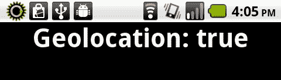

## 工作原理...

检测设备是否包含地理定位传感器将决定用户是否可以有效利用依赖于此类数据的应用程序。如果我们的查询返回为 false，那么由我们来通知用户或提供某种替代方式来收集此类数据。这通常由用户手动输入特定位置数据来处理。

## 另请参阅…

应用开发者必须通过一个 Android 清单文件请求地理定位传感器的可用性。为了让我们的应用程序使用这些传感器，必须在清单文件中声明权限。更多信息请参见第九章，*清单保证：安全与 Android 权限*。

检测用户是否已禁用地理定位传感器

有许多原因可能导致 Android 地理定位传感器在我们的应用程序中不可用。用户可能为了节省电池寿命而关闭了此传感器，或者也许是我们作为开发者没有通过 Android 清单文件提供足够的权限以允许地理定位访问。无论如何，检查并如果传感器被禁用，以友好的提示回应是一个好主意。

## 如何操作...

我们需要检查`Geolocation`类中包含的`muted`属性：

1.  首先，将以下类导入到您的项目中：

    ```kt
    import flash.display.Sprite;
    import flash.display.Stage;
    import flash.display.StageAlign;
    import flash.display.StageScaleMode;
    import flash.events.StatusEvent;
    import flash.sensors.Geolocation;
    import flash.text.TextField;
    import flash.text.TextFormat;

    ```

1.  声明一个`TextField`和`TextFormat`对象对，以允许在设备上可见输出以及一个`Geolocation`对象：

    ```kt
    private var traceField:TextField;
    private var traceFormat:TextFormat;
    private var geo:Geolocation;

    ```

1.  我们现在将设置我们的`TextField`，应用一个`TextFormat`，并将`TextField`添加到`DisplayList`中。在这里，我们创建一个方法来执行所有这些操作：

    ```kt
    protected function setupTextField():void {
    traceFormat = new TextFormat();
    traceFormat.bold = true;
    traceFormat.font = "_sans";
    traceFormat.size = 44;
    traceFormat.align = "center";
    traceFormat.color = 0x333333;
    traceField = new TextField();
    traceField.defaultTextFormat = traceFormat;
    traceField.selectable = false;
    traceField.mouseEnabled = false;
    traceField.width = stage.stageWidth;
    traceField.height = stage.stageHeight;
    addChild(traceField);
    }

    ```

1.  现在，我们必须实例化一个`Geolocation`实例，并注册一个事件监听器，以确定在应用程序运行期间地理定位是否被禁用。

    ### 注意

    现在我们已经定义了一个`Geolocation`实例，我们也可以随时简单地检查`muted`属性。

    ```kt
    protected function registerListeners():void {
    geo = new Geolocation();
    geo.addEventListener(StatusEvent.STATUS, checkGeolocationMuted);
    traceField.appendText("Geolocation Disabled? \n\n" + geo.muted);
    }

    ```

1.  一旦我们调用了这个方法，检查 muted 属性。如果这返回`true`，我们可以访问设备地理位置传感器；如果返回`false`，那么我们知道传感器已被禁用：

    ```kt
    protected function checkGeolocationMuted(e:StatusEvent):void {
    traceField.appendText("Geolocation Disabled? \n\n" + geo.muted);
    }

    ```

1.  结果将显示在设备屏幕上，如下截图所示：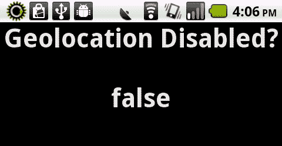

# 工作原理...

一旦我们构建了一个`Geolocation`实例，我们就可以访问该类的`muted`属性。通过检查`Geolocation`对象的`muted`属性，我们可以在应用程序中禁用地理位置功能，提示用户手动输入他们的位置，或者简单地通知用户必须启用设备上的地理位置传感器才能继续。

# 还有更多...

如我们的示例所示，`Geolocation`对象可以注册一个`status`事件，当`muted`属性发生变化时会提醒我们。我们可以使用它在应用程序运行时检测属性变化并相应地作出响应。

# 另请参阅…

应用程序开发者必须通过 Android 清单文件请求地理位置传感器的可用性。为了让我们的应用程序使用这些传感器，必须在清单文件中声明权限。更多信息请参见第九章。

# 获取设备地理位置传感器数据

`Geolocation`类可以用来揭示一组完整的属性，用于在全球范围内跟踪设备位置。这对于地图、天气、旅行和其他位置感知应用程序很有用。为了测量这些数据并对这些测量做出反应，我们必须执行某些操作。

## 如何操作...

我们需要使用某些 ActionScript 类来允许监控地理位置反馈：

1.  首先，将以下类导入到您的项目中：

    ```kt
    import flash.display.Sprite;
    import flash.display.Stage;
    import flash.display.StageAlign;
    import flash.display.StageScaleMode;
    import flash.events.GeolocationEvent;
    import flash.sensors.Geolocation;
    import flash.text.TextField;
    import flash.text.TextFormat;

    ```

1.  声明一个`TextField`和`TextFormat`对象对，允许设备上可见输出，以及一个`Geolocation`对象：

    ```kt
    private var traceField:TextField;
    private var traceFormat:TextFormat;
    private var geolocation:Geolocation;

    ```

1.  我们现在将设置我们的`TextField`，应用`TextFormat`，并将`TextField`添加到`DisplayList`中。这里，我们创建一个方法来执行所有这些操作：

    ```kt
    protected function setupTextField():void {
    traceFormat = new TextFormat();
    traceFormat.bold = true;
    traceFormat.font = "_sans";
    traceFormat.size = 44;
    traceFormat.align = "center";
    traceFormat.color = 0x333333;
    traceField = new TextField();
    traceField.defaultTextFormat = traceFormat;
    traceField.selectable = false;
    traceField.mouseEnabled = false;
    traceField.width = stage.stageWidth;
    traceField.height = stage.stageHeight;
    addChild(traceField);
    }

    ```

1.  我们现在必须实例化一个`Geolocation`对象，以注册一个`GeolocationEvent`监听器。在这种情况下，我们将调用一个名为`geolocationUpdate`的函数。我们还首先检查设备上是否实际支持 Geolocation API，通过检查`Geolocation.isSupported`属性：

    ```kt
    protected function registerListeners():void {
    if(Geolocation.isSupported) {
    geolocation = new Geolocation();
    geolocation.addEventListener(GeolocationEvent.UPDATE, geolocationUpdate);
    }else{
    traceField.text = "Geolocation not supported!";
    }
    }

    ```

1.  我们现在能够通过`geolocationUpdate`方法监控并响应用户移动设备。在这种情况下，我们将收集到的数据输出到一个`TextField`：

    ```kt
    protected function geolocationUpdate(e:GeolocationEvent):void {
    traceField.text = "";
    traceField.appendText("altitude: " + e.altitude + "\n");
    traceField.appendText("heading: " + e.heading + "\n");
    traceField.appendText("horizontal accuracy: " + e.horizontalAccuracy + "\n");
    traceField.appendText("latitude: " + e.latitude + "\n");
    traceField.appendText("longitude: " + e.longitude + "\n");
    traceField.appendText("speed: " + e.speed + "\n");
    traceField.appendText("timestamp: " + e.timestamp + "\n");
    traceField.appendText("vertical accuracy: " + e.verticalAccuracy);
    }

    ```

1.  输出将如下所示：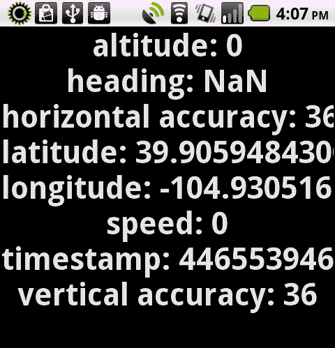

## 工作原理...

通过注册一个事件监听器到`GeolocationEvent.UPDATE`，我们能够检测到 Android 设备上报的地理传感器变化。请注意，并不是每个 Android 设备都能报告所有这些属性；这将取决于所使用的设备。通过这个事件报告回的共有八个可能的属性：`altitude, heading, horizontalAccuracy, latitude, longitude, speed, timestamp`和`verticalAccuracy`。

+   `altitude:` 一个`Number`类型的值，表示当前的海拔高度，以米为单位。

+   `heading:` 一个`Number`类型的值，表示移动的方向，以度为单位。

+   `horizontalAccuracy:` 一个`Number`类型的值，表示传感器测量的水平精度，以米为单位。

+   `latitude:` 一个`Number`类型的值，表示当前设备的纬度，以度为单位。

+   `longitude:` 一个`Number`类型的值，表示当前设备的经度，以度为单位。

+   `speed:` 一个`Number`类型的值，表示每秒的速度，以米为单位。

+   `timestamp:` 一个`int`类型的值，表示自应用程序初始化以来的毫秒数。

+   `verticalAccuracy:` 一个`Number`类型的值，表示传感器测量的垂直精度，以米为单位。

# 调整地理传感器更新间隔

尽管大多数应用程序可能默认的地理传感器更新间隔就足够了，但如果我们想为特定目的加快或减慢这个间隔呢？

## 如何操作...

我们需要使用`Geolocation`类中包含的方法来更改地理传感器更新间隔：

1.  首先，将以下类导入到你的项目中：

    ```kt
    import flash.display.Sprite;
    import flash.display.Stage;
    import flash.display.StageAlign;
    import flash.display.StageScaleMode;
    import flash.events.GeolocationEvent;
    import flash.events.TouchEvent;
    import flash.sensors.Geolocation;
    import flash.text.TextField;
    import flash.text.TextFormat;
    import flash.ui.Multitouch;
    import flash.ui.MultitouchInputMode;

    ```

1.  我们现在将声明一些在示例中要使用的对象。首先是一个`TextField`和一个`TextFormat`对象，以便在设备上允许可见输出，以及一个`Geolocation`对象。

1.  然后，我们还需要使用一个`Number`来跟踪我们的间隔量。还需要两个`Sprite`对象供用户交互。

    ```kt
    private var traceField:TextField;
    private var traceFormat:TextFormat;
    private var geolocation:Geolocation;
    private var geolocationInterval:Number;
    private var boxUp:Sprite;
    private var boxDown:Sprite;

    ```

1.  我们现在将设置我们的`TextField`，应用一个`TextFormat`，并将`TextField`添加到`DisplayList`中。这里，我们创建一个方法来执行所有这些操作：

    ```kt
    protected function setupTextField():void {
    traceFormat = new TextFormat();
    traceFormat.bold = true;
    traceFormat.font = "_sans";
    traceFormat.size = 44;
    traceFormat.align = "center";
    traceFormat.color = 0x333333;
    traceField = new TextField();
    traceField.defaultTextFormat = traceFormat;
    traceField.selectable = false;
    traceField.mouseEnabled = false;
    traceField.width = stage.stageWidth;
    traceField.height = stage.stageHeight;
    addChild(traceField);
    }

    ```

1.  为了检测用户的触摸输入，我们将创建两个`Sprite`实例并将它们各自添加到`Stage`中。为了在注册这些对象的事件监听器中区分`Sprite`实例，我们将为每个`Sprite`提供一个唯一的名称属性：

    ```kt
    protected function setupBoxes():void {
    boxUp = new Sprite();
    boxUp.name = "boxUp";
    boxUp.graphics.beginFill(0xFFFFFF, 0.6);
    boxUp.x = 20;
    boxUp.y = stage.stageHeight/2;
    boxUp.graphics.drawRect(0,0,100,80);
    boxUp.graphics.endFill();
    addChild(boxUp);
    boxDown = new Sprite();
    boxDown.name = "boxDown";
    boxDown.graphics.beginFill(0xFFFFFF, 0.6);
    boxDown.x = stage.stageWidth - 120;
    boxDown.y = stage.stageHeight/2;
    boxDown.graphics.drawRect(0,0,100,80);
    boxDown.graphics.endFill();
    addChild(boxDown);
    }

    ```

1.  我们首先检查设备是否实际支持 Geolocation API，通过检查`Geolocation.isSupported`属性。

1.  我们还需要将多点触控 APIs 的特定输入模式设置为支持触摸输入，通过将`Multitouch.inputMode`设置为`MultitouchInputMode.TOUCH_POINT`常量。每个`Sprite`将注册一个`TouchEvent.TOUCH_TAP`监听器，这样它就能够通过触摸点击来调用一个方法，以改变更新间隔。

1.  现在，我们还可以实例化一个`Geolocation`对象并调用`setRequestedUpdateInterval`方法，该方法需要传递一个以毫秒为单位的间隔到方法调用中。

1.  我们将注册一个事件监听器以响应任何设备移动：

    ```kt
    protected function registerListeners():void {
    if(Geolocation.isSupported) {
    Multitouch.inputMode = MultitouchInputMode.TOUCH_POINT;
    boxUp.addEventListener(TouchEvent.TOUCH_TAP, shiftInterval);
    boxDown.addEventListener(TouchEvent.TOUCH_TAP, shiftInterval);
    geolocation = new Geolocation();
    geolocationInterval = 100;
    geolocation.setRequestedUpdateInterval(geolocationInterval);
    geolocation.addEventListener(GeolocationEvent.UPDATE, geolocationUpdate);
    }else{
    traceField.text = "Geolocation not supported!";
    }
    }

    ```

1.  我们的`shiftInterval`方法现在将响应我们创建的两个`Sprite`框拦截的任何触摸点击。我们将检查每个`Sprite`被赋予了什么名称属性，并相应地调整`accelerometerInterval`：

    ```kt
    protected function shiftInterval(e:TouchEvent):void {
    switch(e.target.name){
    case "boxUp":{
    geolocationInterval += 100;
    break;
    }
    case "boxDown":{
    geolocationInterval -= 100;
    break;
    }
    }
    if(geolocationInterval < 0){
    geolocationInterval = 0;
    }
    geolocation.setRequestedUpdateInterval(geolocationInterval);
    }

    ```

1.  现在地理传感器更新间隔将会调用以下函数，该函数将通过我们的`TextField`输出检测到的移动和间隔数据：

    ```kt
    protected function geolocationUpdate(e:GeolocationEvent):void {
    traceField.text = "Interval: " + geolocationInterval + "\n\n";
    traceField.appendText("altitude: " + e.altitude + "\n");
    traceField.appendText("heading: " + e.heading + "\n");
    traceField.appendText("horizontal accuracy: " + e.horizontalAccuracy + "\n");
    traceField.appendText("latitude: " + e.latitude + "\n");
    traceField.appendText("longitude: " + e.longitude + "\n");
    traceField.appendText("speed: " + e.speed + "\n");
    traceField.appendText("timestamp: " + e.timestamp + "\n");
    traceField.appendText("vertical accuracy: " + e.verticalAccuracy);
    }

    ```

1.  结果将类似于以下截图：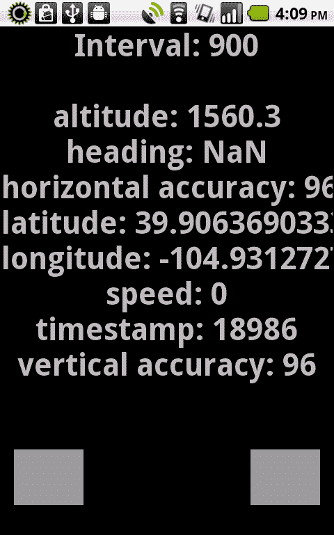

## 工作原理...

通过`setRequestedUpdateInterval()`设置地理定位更新间隔，我们能够根据特定应用程序中的情况调整此间隔。在前一节的`demonstration`类中，我们渲染了两个作为增加和减少`TouchEvent.TOUCH_TAP`事件受体的`Sprites`。点击这些`DisplayObjects`将会增加或减少地理定位更新间隔，这通过屏幕上的`TextField`进行监控。

## 还有更多...

请注意，默认的地理定位传感器更新间隔取决于运行我们应用程序的设备。这种策略也可以用来尝试平衡不同设备之间的间隔。然而，有些事情完全在我们的控制之外。例如，如果用户深处建筑物内并且 GPS 信号差，更新间隔实际上可能超过一分钟。应考虑此类各种因素。

# 通过地理坐标获取地图数据

使用地理坐标获取地图是 ActionScript 地理定位 API 的基本用途之一。在本教程中，我们将研究如何使用 Google 地图 API for Flash 在舞台上渲染地图，并基于设备地理传感器报告的纬度和经度坐标生成标记。

## 准备中...

在开始本教程之前，我们需要采取几个步骤。这些步骤将准备我们的项目与适当的代码库，并允许我们访问 Google 地图服务：

1.  首先，我们必须从[`code.google.com/apis/maps/documentation/flash/`](http://code.google.com/apis/maps/documentation/flash/)下载 Google 地图 API for Flash。

1.  该软件包将包括两个独立的`.swc`文件。一个用于 Flex，另一个用于 ActionScript 项目。在此示例中，我们将提取纯`AS3 .swc`到本地硬盘。

1.  从同一个 URL（在第一点）点击阅读**注册 Google 地图 API 密钥**的链接以生成 API 密钥并注册一个 URL。完成此示例你需要这两样东西。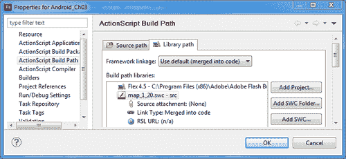

1.  现在，通过在 Flash Builder 中通过**ActionScript Build Path**属性对话框添加`.swc`（你也可以直接将`.swc`拖到`libs`目录中），或者在 Flash Professional 中通过**Advanced ActionScript Properties**对话框，将 Google Maps SDK 包含到你的开发环境中：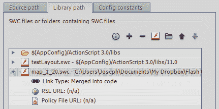

1.  现在我们准备进行食谱操作。

## 如何操作...

我们需要创建我们的地图`DisplayObject`，为`Geolocation` API 更新生成事件监听器，并根据我们当前的位置调整地图属性：

1.  首先，将以下类导入到你的项目中：

    ```kt
    import flash.display.Sprite;
    import flash.display.Stage;
    import flash.display.StageAlign;
    import flash.display.StageScaleMode;
    import flash.events.GeolocationEvent;
    import flash.geom.Point;
    import flash.sensors.Geolocation;
    import flash.text.TextField;
    import flash.text.TextFormat;

    ```

1.  接下来，我们希望导入 Google Maps SDK 中包含的许多类。这些类允许我们在`Stage`上渲染`Map`，监听特定于地图的事件，并在我们当前的位置渲染`Marker`：

    ```kt
    import com.google.maps.LatLng;
    import com.google.maps.Map;
    import com.google.maps.MapEvent;
    import com.google.maps.MapType;
    import com.google.maps.overlays.Marker;

    ```

1.  我们现在将创建一些在本示例中要使用的对象引用。首先，一个`TextField`和`TextFormat`对象对，以便在设备上允许可见输出，以及一个`Geolocation`对象。

1.  然后，我们还需要使用`Map`和`LatLng`对象来渲染我们位置的地图：

    ```kt
    private var traceField:TextField;
    private var traceFormat:TextFormat;
    private var geolocation:Geolocation;
    private var map:Map;
    private var coordinates:LatLng;

    ```

1.  现在我们准备通过传递我们在注册 Google 时设置好的 API 密钥和 URL 来创建我们的`Map`，并将`Map`添加到显示列表中：

    ```kt
    protected function setupMap():void {
    map = new Map();
    map.key = "{GOOGLE_MAPS_API_KEY}";
    map.url = "{APP_URL}";
    map.sensor = "true";
    map.setSize(new Point(stage.stageWidth, stage.stageHeight));
    addChild(map);
    }

    ```

1.  我们现在将设置我们的`TextField`，应用`TextFormat`，并将`TextField`添加到`DisplayList`中。在这里，我们创建一个方法来执行所有这些操作：

    ```kt
    protected function setupTextField():void {
    traceFormat = new TextFormat();
    traceFormat.bold = true;
    traceFormat.font = "_sans";
    traceFormat.size = 44;
    traceFormat.align = "center";
    traceFormat.color = 0x333333;
    traceField = new TextField();
    traceField.defaultTextFormat = traceFormat;
    traceField.selectable = false;
    traceField.mouseEnabled = false;
    traceField.width = stage.stageWidth;
    traceField.height = stage.stageHeight;
    addChild(traceField);
    }

    ```

1.  重要的是，我们需要为地理位置更新和`Map`完成事件注册监听器，这样我们才能读取坐标数据，并知道我们的`Map`何时准备好交互。我们还首先检查设备是否实际支持 Geolocation API，通过检查`Geolocation.isSupported`属性来实现：

    ```kt
    protected function registerListeners():void {
    if(Geolocation.isSupported) {
    geolocation = new Geolocation();
    geolocation.addEventListener(GeolocationEvent.UPDATE, geolocationUpdate);
    map.addEventListener(MapEvent.MAP_READY, mapReady);
    }else{
    traceField.text = "Geolocation not supported!";
    }
    }

    ```

1.  由于地理位置更新是在本地处理的，这很可能是我们的第一个事件监听器被触发。我们将通过此事件从设备地理位置传感器提供的数据中获取`longitude`（经度）和`latitude`（纬度），并由此创建一个`LatLong`对象，在初始化时将其输入到`Map`中：

    ```kt
    protected function geolocationUpdate(e:GeolocationEvent):void {
    traceField.text = "";
    traceField.appendText("latitude:\n" + e.latitude + "\n\n");
    traceField.appendText("longitude:\n" + e.longitude);
    coordinates = new LatLng(e.latitude, e.longitude);
    }

    ```

1.  一旦我们的`mapReady`监听器方法触发，我们就已经有了通过`Map`显示我们当前坐标的必要坐标信息，同时在这个精确的位置渲染一个简单的`Marker`：

    ```kt
    protected function mapReady(e:MapEvent):void {
    map.setCenter(coordinates, 16, MapType.NORMAL_MAP_TYPE);
    var marker:Marker = new Marker(map.getCenter());
    map.addOverlay(marker);
    }

    ```

1.  结果将类似于这样：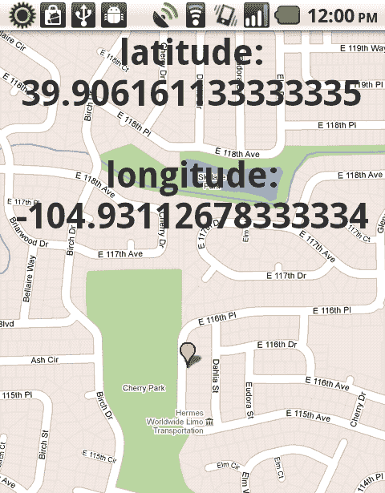

## 它的工作原理...

通过接入像 Google Maps 这样的地图服务，我们可以监听本地设备地理位置更新，并将必要的数据输入到地图服务中以执行众多任务。

在这个例子中，我们只是将`Map`中心对准设备坐标，并在`Map`上放置一个`Marker`覆盖层。每次使用这类服务时，彻底阅读文档了解服务的可能性和限制总是一个好主意。

`url` 属性应设置为在线位置，其中描述了应用程序的目的和范围，根据谷歌的要求。

### 注意事项

我们将 `Map` 实例的 `sensor` 属性设置为 `true`。如果 `Map` 是基于谷歌设备地理位置传感器反应数据，这是必需的。如果我们只是允许用户输入坐标并通过这种方式调整 `Map` 的位置，我们会将 `sensor` 属性设置为 `false`。

## 还有更多...

在这个案例中，我们使用了谷歌地图 API 的 Flash 版本。它相当健壮，但您可能希望使用其他地图系统，如 Yahoo! 地图、MapQuest 或其他服务。这是没问题的，因为它们都需要类似的信息；只是具体的 API 设置会有所不同。
