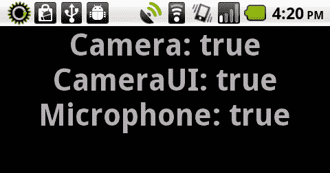
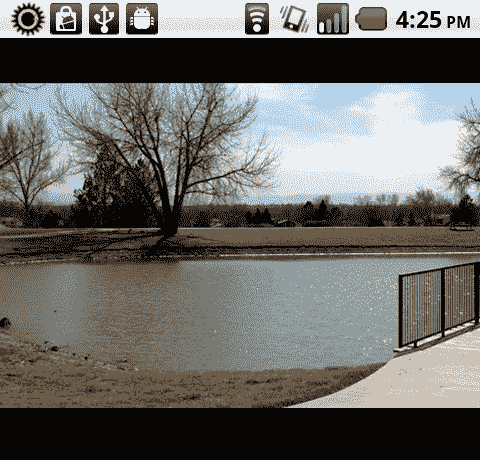
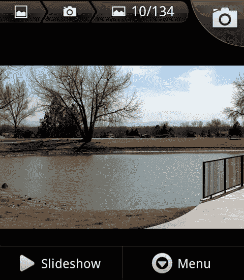
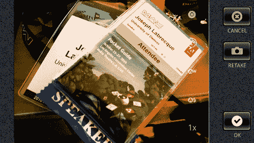
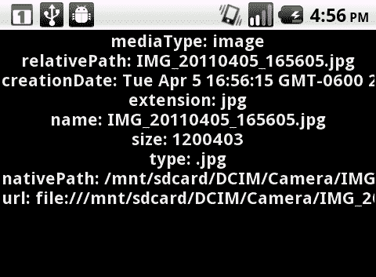
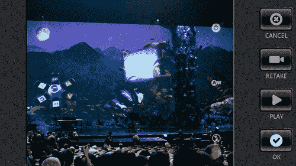
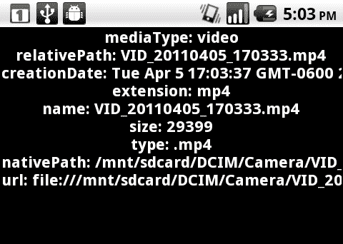
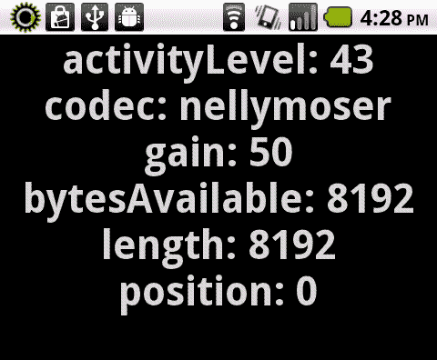

# 第四章：视觉和音频输入：相机和麦克风访问

本章将涵盖以下内容：

+   检测相机和麦克风支持

+   使用传统相机 API 保存捕捉到的图像

+   使用移动设备 CameraUI API 保存捕捉到的照片

+   使用移动设备 CameraUI API 保存捕捉到的视频

+   使用设备麦克风监控音频样本数据

+   记录麦克风音频样本数据

# 引言

相机和麦克风是大多数移动设备和 Android 设备上的标准配件。本章将涵盖从访问相机和拍照，录制视频数据，以及从设备麦克风捕获原始音频并将其编码为 WAV 或 MP3 以便在其他平台和系统上使用的一切内容。

本章中的所有示例都表示为纯 ActionScript 3 类，并且不依赖于外部库或 Flex 框架。因此，我们可以使用我们希望的任何 IDE 中的这些示例。

# 检测相机和麦克风支持

几乎所有的 Android 设备都配备了用于捕捉静态图像和视频的相机硬件。现在许多设备都拥有前后置摄像头。了解默认设备相机是否可通过我们的应用程序使用非常重要。我们绝不能假设某些硬件的可用性，无论它们在设备中多么普遍。

同样，当捕捉视频或音频数据时，我们也需要确保能够访问设备麦克风。

## 如何操作...

我们将确定我们的 Android 设备上可用的音频和视频 API：

1.  首先，将以下类导入到您的项目中：

    ```kt
    import flash.display.Sprite;
    import flash.display.Stage;
    import flash.display.StageAlign;
    import flash.display.StageScaleMode;
    import flash.media.Camera;
    import flash.media.CameraUI;
    import flash.media.Microphone;
    import flash.text.TextField;
    import flash.text.TextFormat;

    ```

1.  声明一个`TextField`和`TextFormat`对象对，以允许在设备上可见输出：

    ```kt
    private var traceField:TextField;
    private var traceFormat:TextFormat;

    ```

1.  我们现在将设置我们的`TextField`，应用`TextFormat`，并将`TextField`添加到`DisplayList`中。这里，我们创建一个方法来执行所有这些操作：

    ```kt
    protected function setupTextField():void {
    traceFormat = new TextFormat();
    traceFormat.bold = true;
    traceFormat.font = "_sans";
    traceFormat.size = 44;
    traceFormat.align = "center";
    traceFormat.color = 0x333333;
    traceField = new TextField();
    traceField.defaultTextFormat = traceFormat;
    traceField.selectable = false;
    traceField.mouseEnabled = false;
    traceField.width = stage.stageWidth;
    traceField.height = stage.stageHeight;
    addChild(traceField);
    }

    ```

1.  现在，我们必须检查这些对象的`isSupported`属性。我们在这里创建一个方法来对所有三个进行检查，并将结果写入`TextField：`

    ```kt
    protected function checkCamera():void {
    traceField.appendText("Camera: " + Camera.isSupported + "\n");
    traceField.appendText("CameraUI: " + CameraUI.isSupported + "\n");
    traceField.appendText("Microphone: " + Microphone.isSupported + "\n");
    }

    ```

1.  我们现在知道特定设备的视频和音频输入功能，并可以相应地做出反应：

## 工作原理...

这三个类都拥有一个属性`isSupported`，我们可以随时调用它来验证在特定 Android 设备上的支持情况。传统的`Camera`和针对移动设备的`CameraUI`都指的是同一硬件相机，但它们是处理闪光灯与相机本身交互的完全不同的类，因为`CameraUI`依赖于设备默认相机应用程序完成所有捕捉工作，而`Camera`仅在 Flash 环境中工作。

### 注意

以这种方式也支持传统的`Microphone`对象。

## 还有更多...

需要注意的是，尽管许多 Android 设备配备了不止一个摄像头，但只有主摄像头（和麦克风）会对我们的应用程序可见。随着 Android 的发展，可能会增加对多个摄像头和其他传感器的支持。

# 使用传统的摄像头 API 保存捕捉到的图像

当通过 Flash 播放器为网页编写应用程序，或者为桌面应用使用 AIR 时，我们可以通过 ActionScript 访问`Camera`类。这使得我们可以访问连接到我们使用的任何机器上的不同摄像头。在 Android 上，我们仍然可以使用`Camera`类来访问设备上的默认摄像头，并获取它提供的视频流用于各种事情。在本例中，我们将简单地从`Camera`的输入中抓取一个静态图像，并将其保存到 Android 的`CameraRoll`中。

## 如何操作...

我们将构建一个`Video`对象来绑定`Camera`的流，并使用`BitmapData`方法捕获并保存我们渲染的图像，使用移动设备的`CameraRoll` API：

1.  至少，我们需要将以下类导入到我们的项目中：

    ```kt
    import flash.display.BitmapData;
    import flash.display.Sprite;
    import flash.display.Stage;
    import flash.display.StageAlign;
    import flash.display.StageScaleMode;
    import flash.events.TouchEvent;
    import flash.media.Camera;
    import flash.media.CameraRoll;
    import flash.media.Video;
    import flash.ui.Multitouch;
    import flash.ui.MultitouchInputMode;

    ```

1.  现在我们必须声明进行摄像头访问和文件引用所需的实例对象：

    ```kt
    private var video:Video;
    private var camera:Camera;
    private var capture:BitmapData;
    private var cameraRoll:CameraRoll;
    private var videoHolder:Sprite;

    ```

1.  初始化一个`Video`对象，传入所需的宽度和高度，并将其添加到`DisplayList`：

    ```kt
    protected function setupVideo():void {
    videoHolder = new Sprite();
    videoHolder.x = stage.stageWidth/2;
    videoHolder.y = stage.stageHeight/2;
    video = new Video(360, 480);
    videoHolder.addChild(video);
    video.x = -180;
    video.y = -240;
    videoHolder.rotation = 90;
    addChild(videoHolder);
    }

    ```

1.  初始化一个`Camera`对象，并使用`setMode`方法来指定宽度、高度和每秒帧数，然后再将`Camera`附加到`DisplayList`上的`Video`：

    ```kt
    protected function setupCamera():void {
    camera = Camera.getCamera();
    camera.setMode(480, 360, 24);
    video.attachCamera(camera);
    }

    ```

1.  我们现在将在`Stage`上注册一个类型为`TOUCH_TAP`的`TouchEvent`监听器。这将使用户可以通过点击设备屏幕来捕获摄像头显示的快照：

    ```kt
    protected function registerListeners():void {
    Multitouch.inputMode = MultitouchInputMode.TOUCH_POINT;
    stage.addEventListener(TouchEvent.TOUCH_TAP, saveImage);
    }

    ```

1.  要从摄像头输入中捕获图像，我们将初始化我们的`BitmapData`对象，使其与`Video`对象的宽度和高度相匹配，并使用`draw`方法将`Video`的像素转换为`BitmapData`。

1.  要将我们获取的图像保存到设备上，我们必须初始化一个`CameraRoll`对象，并调用`addBitmapData()`，传入我们使用`Video`对象像素创建的`BitmapData`对象。我们还将确定此设备是否支持`addBitmapData()`方法，通过验证`CameraRoll.supportsAddBitmapData`是否等于`true`：

    ```kt
    protected function saveImage(e:TouchEvent):void {
    capture = new BitmapData(360, 480);
    capture.draw(video);
    cameraRoll = new CameraRoll();
    if(CameraRoll.supportsAddBitmapData){
    cameraRoll.addBitmapData(capture);
    }
    }

    ```

    

1.  如果我们现在检查我们的 Android 图库，我们会找到保存的图像：

## 工作原理...

这大部分操作与在桌面上的正常 Flash 平台开发完全相同。将一个`Camera`附加到一个`Video`上，将`Video`添加到`DisplayList`，然后根据你的特定应用程序进行需要的操作。在本例中，我们只是简单地捕获显示的`BitmapData`作为图像。

然而，`CameraRoll`类是特定于移动应用开发的，因为它总是指的是设备相机存储所产生照片的目录。如果你想要将这些图片保存在不同的目录中，我们可以使用`File`或`FileReference`对象来实现，但这需要用户进行更多操作。

注意，在使用`Camera`类时，相机的硬件方向是横屏的。我们可以通过将应用限制为横屏模式，或者像我们在示例类中所做的那样通过旋转和额外的操作来处理这个问题。在这种情况下，我们使用了`videoHolder.rotation`对图像应用了 90 度旋转，以在读取`BitmapData`时考虑这个偏移。具体应用如何处理，可能不需要这样做。

## 还有更多...

传统 Camera 对象的其他用例包括将视频流发送到 Flash Media Server 进行直播，增强现实应用，或者实时点对点聊天。

## 另请参阅...

为了访问相机和存储，我们需要添加一些 Android 权限，分别是`CAMERA`和`WRITE_EXTERNAL_STORAGE`。关于如何进行，请参考第十一章，*最终考虑：应用程序编译和分发*。

# 使用移动端 CameraUI API 保存捕获的照片

使用新的`CameraUI` API（在移动 AIR SDK 中可用），我们可以执行与正常`Camera` API 不同的捕获过程。`Mobile CameraUI`类将利用默认的 Android 相机应用程序以及我们的自定义应用程序来捕获一张照片。

## 如何操作...

我们将设置一个`CameraUI`对象来调用原生的 Android 相机来捕获一张照片：

1.  首先，将以下类导入到你的项目中：

    ```kt
    import flash.display.Sprite;
    import flash.display.StageAlign;
    import flash.display.StageScaleMode;
    import flash.events.Event;
    import flash.events.MediaEvent;
    import flash.events.TouchEvent;
    import flash.media.CameraUI;
    import flash.media.MediaType;
    import flash.media.MediaPromise;
    import flash.ui.Multitouch;
    import flash.ui.MultitouchInputMode;
    import flash.text.TextField;
    import flash.text.TextFormat;

    ```

1.  声明一个`TextField`和`TextFormat`对象对，以便在设备上显示输出。这个示例还需要声明一个`CameraUI`对象：

    ```kt
    private var camera:CameraUI;
    private var traceField:TextField;
    private var traceFormat:TextFormat;

    ```

1.  我们现在将设置我们的`TextField`，应用`TextFormat`，并将`TextField`添加到`DisplayList`中。这里，我们创建一个方法来执行所有这些操作：

    ```kt
    protected function setupTextField():void {
    traceFormat = new TextFormat();
    traceFormat.bold = true;
    traceFormat.font = "_sans";
    traceFormat.size = 22;
    traceFormat.align = "center";
    traceFormat.color = 0xFFFFFF;
    traceField = newTextField();
    traceField.defaultTextFormat = traceFormat;
    traceField.selectable = false;
    traceField.mouseEnabled = false;
    traceField.width = stage.stageWidth;
    traceField.height = stage.stageHeight;
    addChild(traceField);
    }

    ```

1.  实例化一个新的`CameraUI`实例，它将用于启动设备相机应用程序，并将文件信息返回给我们。如果某个特定设备不支持`CameraUI`对象，则会向我们的`TextField`输出一条消息表示这一点：

    ```kt
    protected function setupCamera():void {
    if(CameraUI.isSupported) {
    camera = new CameraUI();
    registerListeners();
    }else{
    traceField.appendText("CameraUI is not supported...");
    }
    }

    ```

1.  在`CameraUI`对象上添加一个事件监听器，这样我们就可以知道捕获何时完成。我们还将为`Stage`注册一个触摸事件来启动捕获：

    ```kt
    protected function registerListeners():void {
    Multitouch.inputMode = MultitouchInputMode.TOUCH_POINT;
    camera.addEventListener(MediaEvent.COMPLETE, photoReady);
    stage.addEventListener(TouchEvent.TOUCH_TAP, launchCamera);
    }

    ```

1.  要在 Android 设备上使用默认的相机应用，我们需要调用`launch`方法，并传入`MediaType.IMAGE`常量以指定我们希望拍摄一张照片：

    ```kt
    protected function launchCamera(e:TouchEvent):void {
    camera.launch(MediaType.IMAGE);
    }

    ```

1.  现在，默认的安卓相机将初始化，允许用户拍摄照片。用户点击**确定**后，焦点将返回到我们的应用程序。

1.  最后，一旦我们完成捕获过程，将触发一个类型为`MediaEvent.COMPLETE`的事件，调用我们的`photoReady`方法。从中我们可以确定有关我们捕获的照片的某些细节。

    ```kt
    protected function photoReady(e:MediaEvent):void {
    var promise:MediaPromise = e.data;
    traceField.appendText("mediaType: " + promise.mediaType + "\n");
    traceField.appendText("relativePath: " + promise.relativePath + "\n");
    traceField.appendText("creationDate: " + promise.file.creationDate + "\n");
    traceField.appendText("extension: " + promise.file.extension + "\n");
    traceField.appendText("name: " + promise.file.name + "\n");
    traceField.appendText("size: " + promise.file.size + "\n");
    traceField.appendText("type: " + promise.file.type + "\n");
    traceField.appendText("nativePath: " + promise.file.nativePath + "\n");
    traceField.appendText("url: " + promise.file.url + "\n");
    }

    ```

1.  输出将类似于这样：

## 工作原理...

调用`CameraUI.launch`方法将请求安卓设备打开默认的相机应用程序，并允许用户拍照。在完成捕获过程并确认捕获的照片后，焦点将返回到我们的应用程序，同时返回包含在`MediaEvent.COMPLETE`事件对象中的一组关于新文件的数据。

在这一点上，我们的应用程序可以对返回的数据执行各种操作，甚至可以在应用程序中打开文件，假设文件类型可以被运行时加载和显示。

## 还有更多内容...

如果设备没有挂载存储卡，则默认的相机应用程序将不会加载。还需要注意的是，如果在捕获过程中设备内存不足，安卓可能会在过程完成前终止我们的应用程序。

## 另请参阅...

我们将在第五章讨论通过 AIR for Android 应用程序显示图像：*富媒体展示：处理图像、视频和音频。*

# 使用移动 CameraUI API 保存捕获的视频

使用新的`CameraUI` API（在移动 AIR SDK 中可用），我们可以执行与正常`Camera` API 不同的捕获过程。移动`CameraUI`类将利用默认的安卓相机应用程序，以及我们的自定义应用程序来捕获视频。

## 如何操作...

我们将设置一个`CameraUI`对象来调用原生的安卓相机以捕获视频：

1.  首先，将以下类导入到您的项目中：

    ```kt
    import flash.display.Sprite;
    import flash.display.StageAlign;
    import flash.display.StageScaleMode;
    import flash.events.Event;
    import flash.events.MediaEvent;
    import flash.events.TouchEvent;
    import flash.media.CameraUI;
    import flash.media.MediaPromise;
    import flash.media.MediaType;
    import flash.text.TextField;
    import flash.text.TextFormat;
    import flash.ui.Multitouch;
    import flash.ui.MultitouchInputMode;

    ```

1.  声明一个`TextField`和`TextFormat`对象对，以允许在设备上可见输出。对于此示例，还必须声明一个`CameraUI`对象：

    ```kt
    private var camera:CameraUI;
    private var traceField:TextField;
    private var traceFormat:TextFormat;

    ```

1.  我们现在将设置我们的`TextField`，应用一个`TextFormat`，并将`TextField`添加到`DisplayList`中。在这里，我们创建一个方法来执行所有这些操作：

    ```kt
    protected function setupTextField():void {
    traceFormat = new TextFormat();
    traceFormat.bold = true;
    traceFormat.font = "_sans";
    traceFormat.size = 22;
    traceFormat.align = "center";
    traceFormat.color = 0xFFFFFF;
    traceField = new TextField();
    traceField.defaultTextFormat = traceFormat;
    traceField.selectable = false;
    traceField.mouseEnabled = false;
    traceField.width = stage.stageWidth;
    traceField.height = stage.stageHeight;
    addChild(traceField);
    }

    ```

1.  实例化一个新的`CameraUI`实例，它将用于启动设备相机应用程序并将文件信息返回给我们。如果特定设备不支持`CameraUI`对象，则会在我们的`TextField`中输出一条消息指示这一点。

    ```kt
    protected function setupCamera():void {
    if(CameraUI.isSupported) {
    camera = new CameraUI();
    registerListeners();
    }else{
    traceField.appendText("CameraUI is not supported...");
    }
    }

    ```

1.  向`CameraUI`对象添加一个事件监听器，以便我们知道捕获何时完成。我们还将向`Stage`注册一个触摸事件来启动捕获：

    ```kt
    protected function registerListeners():void {
    Multitouch.inputMode = MultitouchInputMode.TOUCH_POINT;
    camera.addEventListener(MediaEvent.COMPLETE, videoReady);
    stage.addEventListener(TouchEvent.TOUCH_TAP, launchCamera);
    }

    ```

1.  为了在安卓设备上使用默认相机应用程序，我们需要调用`launch`方法，并传入`MediaType.VIDEO`常量以指定我们希望捕获视频文件：

    ```kt
    protected function launchCamera(e:TouchEvent):void {
    camera.launch(MediaType.VIDEO);
    }

    ```

1.  现在，默认的安卓相机将初始化，允许用户拍摄一些视频。当用户点击**确定**后，焦点将返回到我们的应用程序：

1.  最后，一旦我们完成捕获过程，将触发一个类型为`MediaEvent.COMPLETE`的事件，调用我们的`videoReady`方法。从中我们可以了解有关捕获的视频文件的某些详细信息：

    ```kt
    protected function videoReady(e:MediaEvent):void {
    var promise:MediaPromise = e.data;
    traceField.appendText("mediaType: " + promise.mediaType + "\n");
    traceField.appendText("relativePath: " + promise.relativePath + "\n");
    traceField.appendText("creationDate: " + promise.file.creationDate + "\n");
    traceField.appendText("extension: " + promise.file.extension + "\n");
    traceField.appendText("name: " + promise.file.name + "\n");
    traceField.appendText("size: " + promise.file.size + "\n");
    traceField.appendText("type: " + promise.file.type + "\n");
    traceField.appendText("nativePath: " + promise.file.nativePath + "\n");
    traceField.appendText("url: " + promise.file.url + "\n");
    }

    ```

1.  输出将类似于这样：

## 工作原理...

调用`CameraUI.launch`方法将请求安卓设备打开默认的相机应用程序，并允许用户捕获一些视频。在完成捕获过程并确认捕获的视频文件后，焦点将连同包含在`MediaEvent.COMPLETE`事件对象中的一组新文件数据一起返回到我们的应用程序。

在这一点上，我们的应用程序可以对返回的数据执行各种操作，甚至可以在应用程序中打开文件，假设文件类型可以被运行时加载和显示。这对于视频来说非常重要，因为某些设备将使用各种编解码器来编码捕获的视频，并非所有这些编解码器都与 Flash 平台兼容。

## 还有更多...

如果设备没有挂载存储卡，则默认相机应用程序将无法加载。还需要注意的是，如果在捕获过程中设备内存不足，安卓可能会在过程完成前终止我们的应用程序。

此外，除了`MediaEvent.COMPLETE`，我们还可以在类似过程中使用许多其他事件。例如，注册一个类型为`Event.CANCEL`的事件监听器，以响应用户取消视频保存。

## 另请参阅...

我们将在第五章中讨论通过 AIR for Android 应用程序播放视频文件。

# 使用设备麦克风监控音频样本数据

通过监控从安卓设备麦克风通过 ActionScript `Microphone` API 返回的样本数据，我们可以收集有关正在捕获的声音的许多信息，并在我们的应用程序内执行响应。这种输入可以用于实用程序、学习模块，甚至游戏。

## 如何操作...

我们将设置一个事件监听器，以响应通过`Microphone` API 报告的样本数据：

1.  首先，将以下类导入到您的项目中：

    ```kt
    import flash.display.Sprite;
    import flash.display.Stage;
    import flash.display.StageAlign;
    import flash.display.StageScaleMode;
    import flash.events.SampleDataEvent;
    import flash.media.Microphone;
    import flash.text.TextField;
    import flash.text.TextFormat;

    ```

1.  声明一个`TextField`和`TextFormat`对象对，以允许在设备上可见输出。本示例还需要声明一个`Microphone`对象：

    ```kt
    private var mic:Microphone;
    private var traceField:TextField;
    private var traceFormat:TextFormat;

    ```

1.  我们现在将设置`TextField`，应用`TextFormat`，并将`TextField`添加到`DisplayList`中。这里，我们创建一个方法来执行所有这些操作：

    ```kt
    protected function setupTextField():void {
    traceFormat = new TextFormat();
    traceFormat.bold = true;
    traceFormat.font = "_sans";
    traceFormat.size = 44;
    traceFormat.align = "center";
    traceFormat.color = 0x333333;
    traceField = new TextField();
    traceField.defaultTextFormat = traceFormat;
    traceField.selectable = false;
    traceField.mouseEnabled = false;
    traceField.width = stage.stageWidth;
    traceField.height = stage.stageHeight;
    addChild(traceField);
    }

    ```

1.  现在，我们必须实例化我们的`Microphone`对象，并根据我们的需求和偏好调整`codec, rate, silenceLevel`等来设置它。这里我们使用`setSilenceLevel()`来确定应用程序应视为“声音”的最小输入水平，并将`rate`属性设置为**44**，表示我们将以 44kHz 的速率捕获音频数据。将`setLoopBack()`属性设置为 false 将防止捕获的音频通过设备扬声器播放：

    ```kt
    protected function setupMic():void {
    mic = Microphone.getMicrophone();
    mic.setSilenceLevel(0);
    mic.rate = 44;
    mic.setLoopBack(false);
    }

    ```

1.  一旦我们实例化了`Microphone`对象，我们就可以注册各种事件监听器。在这个例子中，我们将监控来自设备麦克风的音频采样数据，因此我们需要为`SampleDataEvent.SAMPLE_DATA`常量注册我们的监听器：

    ```kt
    protected function registerListeners():void {
    mic.addEventListener(SampleDataEvent.SAMPLE_DATA, onMicData);
    }

    ```

1.  由于`Microphone` API 从 Android 设备输入生成采样数据，我们现在可以通过多种方式对此做出响应，因为我们能够访问有关`Microphone`对象本身的信息，更重要的是，我们可以访问采样字节，从而执行许多高级操作：

    ```kt
    public function onMicData(e:SampleDataEvent):void {
    traceField.text = "";
    traceField.appendText("activityLevel: " + e.target.activityLevel + "\n");
    traceField.appendText("codec: " + e.target.codec + "\n");
    traceField.appendText("gain: " + e.target.gain + "\n");
    traceField.appendText("bytesAvailable: " + e.data.bytesAvailable + "\n");
    traceField.appendText("length: " + e.data.length + "\n");
    traceField.appendText("position: " + e.data.position + "\n");
    }

    ```

1.  输出将类似于这样。前三个值来自`Microphone`本身，后三个来自`Microphone`采样数据：

## 它是如何工作的...

当我们实例化一个`Microphone`对象并注册一个`SampleDataEvent.SAMPLE_DATA`事件监听器时，我们可以轻松监控 Android 设备麦克风的各项属性以及正在收集的相关采样数据。然后我们可以以多种方式对这些数据做出响应。一个例子是依据`Microphone.activityLevel`属性在`Stage`上移动对象。另一个例子是将采样数据写入`ByteArray`以便稍后分析。

### 所有这些属性意味着什么？

+   `activityLevel:` 这是一个表示接收到的声音量的测量值

+   `codec:` 这表示正在使用的编解码器：Nellymoser 或 Speex

+   `gain:` 这是麦克风为声音信号提供的增强量

+   `bytesAvailable:` 这揭示了从当前位置到采样数据`byteArray`末尾的字节数量

+   `length:` 让我们知道采样数据`byteArray`的总长度

+   `position:` 这是我们的采样数据`byteArray`中的当前位置，以字节为单位

## 另请参阅...

为了访问麦克风，我们需要添加一些 Android 权限以`RECORD_AUDIO`。有关如何进行此操作的信息，请参考第十一章。

# 记录麦克风音频采样数据

对于开发者来说，使用从 Android 麦克风收集的音频采样数据最基础的事情之一，就是捕获数据并在应用程序中以某种方式使用它。本教程将演示如何保存和回放捕获的麦克风音频采样数据。

## 如何操作...

我们将使用一个事件监听器来响应通过`Microphone` API 报告的样本数据，通过将捕获的音频数据写入`ByteArray`，然后通过`Sound`对象在内部播放：

1.  首先，将以下类导入到你的项目中：

    ```kt
    import flash.display.Sprite;
    import flash.display.Stage;
    import flash.display.StageAlign;
    import flash.display.StageScaleMode;
    import flash.events.SampleDataEvent;
    import flash.events.TouchEvent;
    import flash.media.Microphone;
    import flash.media.Sound;
    import flash.media.SoundChannel;
    import flash.utils.ByteArray;
    import flash.ui.Multitouch;
    import flash.ui.MultitouchInputMode;
    import flash.text.TextField;
    import flash.text.TextFormat;

    ```

1.  声明一个`TextField`和`TextFormat`对象对，以便在设备上输出可见内容。这个例子还需要声明一个`Microphone`对象。为了存储和播放样本数据，我们还需要声明一个`ByteArray`，以及一个`Sound`和`SoundChannel`对：

    ```kt
    private var mic:Microphone;
    private var micRec:ByteArray;
    private var output:Sound;
    private var outputChannel:SoundChannel;
    private var traceField:TextField;
    private var traceFormat:TextFormat;

    ```

1.  我们现在将设置`TextField`，应用`TextFormat`，并将`TextField`添加到`DisplayList`中。这里，我们创建一个方法来执行所有这些操作：

    ```kt
    protected function setupTextField():void {
    traceFormat = new TextFormat();
    traceFormat.bold = true;
    traceFormat.font = "_sans";
    traceFormat.size = 44;
    traceFormat.align = "center";
    traceFormat.color = 0x333333;
    traceField = new TextField();
    traceField.defaultTextFormat = traceFormat;
    traceField.selectable = false;
    traceField.mouseEnabled = false;
    traceField.width = stage.stageWidth;
    traceField.height = stage.stageHeight;
    addChild(traceField);
    }

    ```

1.  然后，实例化一个`Microphone`对象，并根据我们的需求和偏好调整`codec`、`rate`、`silenceLevel`等来设置它。这里我们使用`setSilenceLevel()`来确定应用程序应考虑的最小输入级别作为“声音”，并将`rate`属性设置为**44**，表示我们将以 44kHz 的速率捕获音频数据。将`setLoopBack()`属性设置为 false 将防止捕获的音频通过设备扬声器播放。我们还将实例化一个`ByteArray`来保存所有拦截到的音频样本：

    ```kt
    protected function setupMic():void {
    mic = Microphone.getMicrophone();
    mic.setSilenceLevel(0);
    mic.rate = 44;
    mic.setLoopBack(false);
    micRec = new ByteArray();
    }

    ```

1.  一旦我们实例化了`Microphone`和`ByteArray`对象，我们就可以注册一个事件监听器来启用触摸交互。一个简单的轻触就足够了：

    ```kt
    protected function registerListeners():void {
    Multitouch.inputMode = MultitouchInputMode.TOUCH_POINT;
    stage.addEventListener(TouchEvent.TOUCH_TAP, startRecording);
    traceField.text = "Tap to Record";
    }

    ```

1.  一旦用户启动录音，我们将监控来自设备麦克风的音频样本数据，因此需要为`SampleDataEvent.SAMPLE_DATA`常量注册我们的监听器：

    ```kt
    protected function startRecording(e:TouchEvent):void {
    stage.removeEventListener(TouchEvent.TOUCH_TAP, startRecording);
    stage.addEventListener(TouchEvent.TOUCH_TAP, stopRecording);
    mic.addEventListener(SampleDataEvent.SAMPLE_DATA, onMicData);
    traceField.text = "Recording Audio \nTap to Stop";
    }

    ```

1.  由于`Microphone` API 从 Android 设备输入生成样本数据，我们可以访问音频样本数据字节，我们可以将其写入`ByteArray`以供以后使用：

    ```kt
    protected function onMicData(e:SampleDataEvent):void {
    micRec.writeBytes(e.data);
    }

    ```

1.  要停止录音，我们需要从`Microphone`对象中移除`SampleDataEvent.SAMPLE_DATA`事件监听器：

    ```kt
    protected function stopRecording(e:TouchEvent):void {
    mic.removeEventListener(SampleDataEvent.SAMPLE_DATA, onMicData);
    stage.removeEventListener(TouchEvent.TOUCH_TAP, stopRecording);
    stage.addEventListener(TouchEvent.TOUCH_TAP, playBackAudio);
    traceField.text = "Tap to Playback";
    }

    ```

1.  为了准备播放，我们将实例化一个新的`Sound`对象，并在其上注册一个`SampleDataEvent.SAMPLE_DATA`事件，就像我们之前对`Microphone`对象所做的那样。我们还将实例化一个`SoundChannel`对象，并调用我们`Sound`对象的`play()`方法来播放捕获的`Microphone`音频：

    ```kt
    protected function playBackAudio(e:TouchEvent):void {
    stage.removeEventListener(TouchEvent.TOUCH_TAP, playBackAudio);
    micRec.position = 0;
    output = new Sound();
    output.addEventListener(SampleDataEvent.SAMPLE_DATA, onSampleDataRequest);
    outputChannel = output.play();
    traceField.text = "Playing Audio";
    }

    ```

1.  当我们对`Sound`对象调用`play()`方法时，它将从名为`onSampleDataRequest`的方法中开始收集生成的样本数据。我们现在需要创建这个方法，并让它遍历我们之前写入`ByteArray`对象的字节，这实际上是我们的捕获过程的反操作。

1.  为了在应用程序中提供适当的播放，我们必须提供 2048 到 8192 个样本数据。建议尽可能使用更多的样本，但这还取决于采样频率。

    ### 注意

    请注意，我们在同一个循环中两次调用`writeFloat()`，因为我们需要将数据表示为立体声对，每个通道一个。

1.  在本例中使用 `writeBytes()` 时，我们实际上是通过 `SampleDataEvent` 和 `Sound` 对象将声音数据输出，从而使应用程序能够产生声音：

    ```kt
    protected function onSampleDataRequest(e:SampleDataEvent):void {
    var out:ByteArray = new ByteArray();
    for(var i:int = 0; i < 8192 && micRec.bytesAvailable; i++ ) {
    var micsamp:Number = micRec.readFloat();
    // left channel
    out.writeFloat(micsamp);
    // right channel
    out.writeFloat(micsamp);
    }
    e.data.writeBytes(out);
    }

    ```

1.  输出到我们的 `TextField` 的内容将根据当前应用程序状态的变化而变化：

## 工作原理...

当我们实例化一个 `Microphone` 对象并注册一个 `SampleDataEvent.SAMPLE_DATA` 事件监听器时，我们可以轻松监控相关样本数据的收集，并将这些数据写入 `ByteArray` 以便稍后播放。随着新样本的到来，更多的数据被添加到 `ByteArray` 中，随着时间的推移构建声音数据。

通过向 `Sound` 对象注册 `SampleDataEvent.SAMPLE_DATA` 事件监听器，我们指示它在我们调用 `play()` 时主动寻找由特定方法生成的音频数据。在我们的示例中，我们遍历构建的 `ByteArray`并通过此方法将音频数据输出，通过 `Sound` 对象和相关联的 `SoundChannel` 实际播放录制的音频。

## 另请参阅...

ActionScript 中字节的使用是一个复杂的主题。要了解更多关于这个话题的信息，我们推荐 Thibault Imbert 的书 *"你能用字节做什么？"*，该书可在[`www.bytearray.org/?p=711`](http://www.bytearray.org/?p=711)免费获取。

想要阅读关于音频文件播放的配方，请查看第五章。有关将捕获的音频数据保存到 Android 设备的信息，请参考第八章： *丰富访问：文件系统和本地数据库*。
