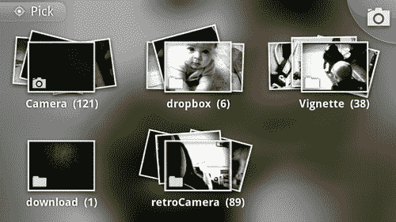
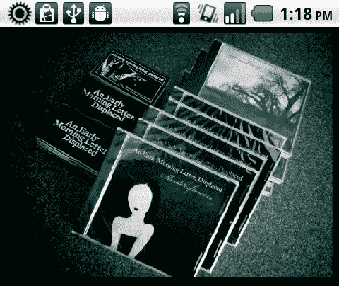
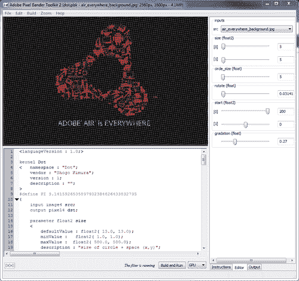
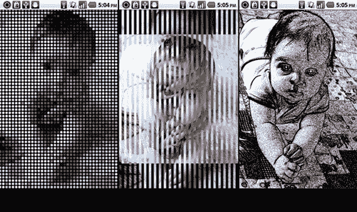
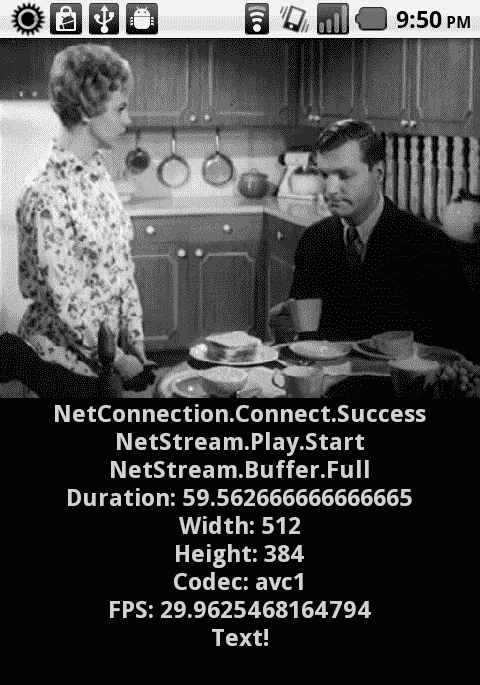
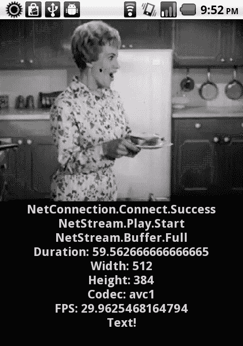
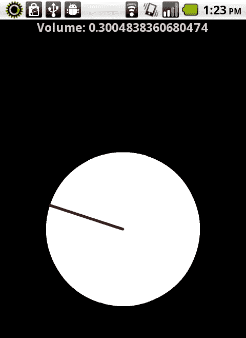
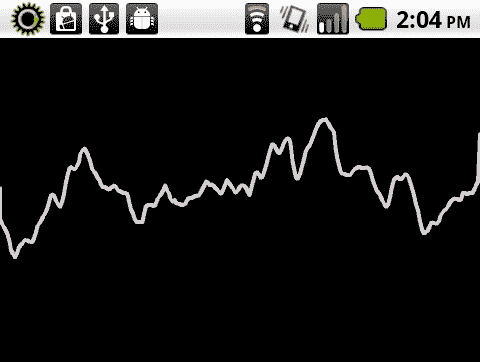

# 第五章：富媒体展示：处理图像、视频和音频

本章节将涵盖以下食谱：

+   从设备 cameraRoll 加载照片

+   将 Pixel Bender 着色器效果应用于加载的图像

+   从本地文件系统或通过 HTTP 播放视频文件

+   通过 RTMP 播放远程视频文件

+   从本地文件系统或通过 HTTP 播放音频文件

+   生成音频频谱可视化器

+   为您的应用程序生成音频音调

# 引言

本章节将包含多种展示图像数据和播放视频及音频流的食谱。这些食谱中包括的例子演示了从设备相机库加载图像的能力，对加载的图像应用 Pixel Bender 着色器，通过不同协议播放音频和视频，以及从声音生成视觉数据和原始声音数据。

Flash 平台作为全球领先的视频分发平台而闻名。在以下几页中，我们将看到这种体验和影响力绝不仅限于桌面和基于浏览器的计算。随着 AIR 2.6 和 Flash Player 10.2 中提供的 StageVideo 等新功能，Flash 正在成为在保持设备电池寿命的同时提供更佳用户体验的更强大的视频交付平台。

# 从设备 cameraRoll 加载照片

安卓操作系统有一个中央存储库，用于存储用户可能安装的各种相机应用程序捕获的照片。AIR for Android 中提供了 API，允许 Flash 开发者专门针对这个存储库进行操作，并在应用程序中显示。

## 如何操作...

我们必须使用移动`CameraRoll` API 直接浏览到设备相机胶卷，并选择一张照片以显示：

1.  首先，将以下类导入到您的项目中：

    ```kt
    import flash.display.Loader;
    import flash.display.Sprite;
    import flash.display.StageAlign;
    import flash.display.StageScaleMode;
    import flash.events.Event;
    import flash.events.MediaEvent;
    import flash.events.TouchEvent;
    import flash.filesystem.File;
    import flash.media.CameraRoll;
    import flash.media.MediaPromise;
    import flash.ui.Multitouch;
    import flash.ui.MultitouchInputMode;

    ```

1.  声明一个`CameraRoll`对象和一个`Loader`，用于在选定照片后显示照片：

    ```kt
    private var loader:Loader;
    private var cameraRoll:CameraRoll;

    ```

1.  我们将创建我们的`Loader`对象，将其添加到`Stage`中，并注册一个事件监听器，以便在照片加载后适当缩放：

    ```kt
    protected function setupLoader():void {
    loader = new Loader();
    loader.contentLoaderInfo.addEventListener(Event.COMPLETE, sizePhoto);
    stage.addChild(loader);
    }

    ```

1.  对于`CameraRoll`本身，我们需要做的就是实例化它，然后添加一个事件监听器，以便在用户选择要显示的照片时触发。我们应该始终检查设备是否支持`CameraRoll.browseForImage()`，通过检查`supportsBrowseForImage`属性：

    ```kt
    protected function setupCameraRoll():void {
    if(CameraRoll.supportsBrowseForImage){
    cameraRoll = new CameraRoll();
    cameraRoll.addEventListener(MediaEvent.SELECT, imageSelected);
    registerListeners();
    }else{
    trace("CameraRoll does not support browse for image!");
    }
    }

    ```

1.  我们现在将在`Stage`上注册一个类型为`TOUCH_TAP`的`TouchEvent`监听器。这将使用户能够通过轻敲设备屏幕来调用浏览对话框，从`CameraRoll`中选择照片。

    ### 注意

    我们将`Multitouch.inputMode`设置为`MultitouchInputMode.TOUCH_POINT`常量，以便我们的应用程序接受触摸事件。

    ```kt
    protected function registerListeners():void {
    Multitouch.inputMode = MultitouchInputMode.TOUCH_POINT;
    stage.addEventListener(TouchEvent.TOUCH_TAP, loadFromCameraRoll);
    }

    ```

1.  一旦从用户交互中调用了以下方法，我们就可以对我们之前设置的`CameraRoll`对象调用`browseForImage()`方法。这将打开 Android 设备上的默认图库应用，允许用户从他们的收藏中选择一张照片。如果设备上有不止一个图库应用，用户将首先通过一个原生的 Android 对话框选择在这个事件中使用哪一个。我们的应用将失去焦点，这由操作系统处理，一旦做出选择，就会返回到我们的应用。

    ```kt
    protected function loadFromCameraRoll(e:TouchEvent):void {
    cameraRoll.browseForImage();
    }

    ```

1.  在这里，我们可以看到 Android 上的默认图库应用。用户可以在做出选择之前花尽可能多的时间浏览各种收藏和照片。

1.  当用户在原生的 Android 图库应用中进行了有效的选择后，焦点将返回到我们的应用，并返回一个包含`MediaPromise`对象的事件。`Loader`类有一个特定的方法`loadFilePromise()`，专门用于这类操作。现在我们将`MediaPromise`通过这个方法传递。

    ```kt
    protected function imageSelected(e:MediaEvent):void {
    var promise:MediaPromise = e.data;
    loader.loadFilePromise(promise);
    }

    ```

1.  一旦我们使用`loadFilePromise()`将`MediaPromise`对象传递给`Loader`，它将被加载到`Stage`上。在这里，我们将执行一个额外的操作，调整`Loader`的大小以适应我们的`Stage`的约束条件。

    ```kt
    protected function sizePhoto(e:Event):void {
    loader.width = stage.stageWidth;
    loader.scaleY = loader.scaleX;
    }

    ```

1.  加载到`Stage`上的结果图像将如下所示：

# 工作原理…

ActionScript 的`CameraRoll` API 专门针对 Android 设备上的照片存储位置。每当用户进行一些交互，调用我们应用中的`CameraRoll.browseForImage()`方法时，默认的 Android 图库应用将启动，允许用户从他们的收藏中选择一个图像文件。

一旦用户在图库应用中选择了照片，他们将被返回到我们的 AIR for Android 应用，并带有一个`MediaPromise`对象，通过这个对象我们可以确定文件的一些信息，甚至可以直接将照片加载到我们的应用中。

# 还有更多…

在这个例子中，我们探讨了如何从`CameraRoll`将图像加载到`Stage`上的`Loader`中。当然，一旦照片被加载，我们可以对它进行很多操作。关于这方面的例子，请看下一个食谱：*对已加载的图像应用 Pixel Bender 着色器效果*。

# 对已加载的图像应用 Pixel Bender 着色器效果

一旦我们将视觉对象加载到我们的应用程序中，由于这一切都是基于 Flash 的，我们可以进行各种强大的视觉操作。在这个例子中，我们将从本地文件系统加载一个预先选择的照片，然后对其应用各种 Pixel Bender 着色器，极大地改变它的外观。

## 准备工作…

本食谱使用了 Pixel Bender 着色器。你可以在 Adobe Exchange 下载`.pbj`文件，或者创建自己的文件。

如果你决定编写自己的 Pixel Bender 内核，可以从[`www.adobe.com/devnet/pixelbender.html`](http://www.adobe.com/devnet/pixelbender.html)免费下载 Pixel Bender 工具包，并使用它编译各种着色器，以便在 Flash 和 AIR 项目中使用。

该工具包允许你使用 Pixel Bender 内核语言（以前称为 Hydra）编写内核，并提供图像预览和分离属性操作的机制，这些可以暴露给 ActionScript。



要了解关于编写 Pixel Bender 着色器的良好资源，请查看位于[`www.adobe.com/devnet/pixelbender.html`](http://www.adobe.com/devnet/pixelbender.html)的文档。

在这个示例中，我们还引用了 Android 图像库中存在的照片，我们之前使用默认相机应用程序捕获的。你可以做同样的事情，或者将图像文件与应用程序一起打包以便后续引用。

## 如何操作…

我们现在将从本地设备存储中加载一个预定的图像，并对其应用多个 Pixel Bender 着色器：

1.  首先，将以下类导入到你的项目中：

    ```kt
    import flash.display.Loader;
    import flash.display.Shader;
    import flash.display.Sprite;
    import flash.display.StageAlign;
    import flash.display.StageScaleMode;
    import flash.events.Event;
    import flash.events.TouchEvent;
    import flash.filters.ShaderFilter;
    import flash.net.URLLoader;
    import flash.net.URLLoaderDataFormat;
    import flash.net.URLRequest;
    import flash.ui.Multitouch;
    import flash.ui.MultitouchInputMode;

    ```

1.  对于这个示例，我们首先需要声明许多不同的对象。我们将声明一个`String`常量来保存图像的路径和一个`Loader`，用于显示照片。`URLRequest`和`URLLoader`对象对将用于加载我们的`.pbj`文件。`Array`将用于保存我们将要加载的每个`.pbj`的名称。使用`int`来跟踪我们当前从`Array`集合中加载的着色器。最后，声明一个`Shader`和`ShaderFilter`对，以将加载的`.pbj`应用到我们的`Loader`上。

    ```kt
    private const photoURL:String = " {local file path or http address}";
    private var loader:Loader;
    private var urlRequest:URLRequest;
    private var urlLoader:URLLoader;
    private var pbjArray:Array;
    private var currentFilter:int;
    private var shader:Shader;
    private var shaderFilter:ShaderFilter;

    ```

1.  下一步是初始化我们的`Array`，并用我们将要加载到应用程序中的 Pixel Bender 着色器文件引用来填充它。这些文件可以通过 Adobe Exchange、网络上的其他位置获取，或者使用 Pixel Bender 工具包编写：

    ```kt
    protected function setupArray():void {
    pbjArray = new Array();
    pbjArray[0] = "dot.pbj";
    pbjArray[1] = "LineSlide.pbj";
    pbjArray[2] = "outline.pbj";
    }

    ```

1.  然后，我们创建`Loader`对象，将其添加到`Stage`中，并注册一个事件监听器，以便在照片加载后适当缩放：

    ```kt
    protected function setupLoader():void {
    loader = new Loader();
    loader.contentLoaderInfo.addEventListener(Event.COMPLETE, sizePhoto);
    stage.addChild(loader);
    }

    ```

1.  我们现在将为`Loader`注册一个类型为`TOUCH_TAP`的`TouchEvent`监听器。这将允许用户点击加载的图像以循环浏览各种 Pixel Bender 着色器。我们还设置`currentFilter int`为`0`，这将表示我们的`Array`中的第一个位置：

    ```kt
    protected function registerListeners():void {
    Multitouch.inputMode = MultitouchInputMode.TOUCH_POINT;
    loader.addEventListener(TouchEvent.TOUCH_TAP, loadShader);
    currentFilter = 0;
    }

    ```

1.  要将照片加载到`Loader`实例中以便在我们的应用程序中显示，我们将调用`load()`方法，并传入先前声明的`photoURL String`常量以及新的`URLRequest`：

    ```kt
    protected function loadPhotograph():void {
    loader.load(new URLRequest(photoURL));
    }

    ```

1.  文件加载后，我们将执行一个操作，调整`Loader`的大小以适应我们的`Stage`的约束：

    ```kt
    protected function sizePhoto(e:Event):void {
    loader.width = stage.stageWidth;
    loader.scaleY = loader.scaleX;
    }

    ```

1.  加载到`Stage`上的原始图像，在没有应用任何着色器的情况下，将如下所示：

1.  每当用户在`Loader`实例上执行触摸点击时，此方法将会执行。基本上，我们正在使用之前设置的着色器位置`Array`中的值来设置`URLRequest`，从已记录到`currentFilter`对象的当前索引中提取值。

1.  在我们调用`URLLoader.load()`方法之前，我们必须显式地将`dataFormat`属性设置为`URLLoaderDataFormat.BINARY`常量。这确保了当我们的文件加载时，它被视为二进制文件而不是文本。

1.  注册了一个`Event.COMPLETE`监听器，一旦着色器加载完毕，就会调用`applyFilter`方法。

1.  最后，我们可以递增我们的`currentFilter`值，或者将其设置回`0`，具体取决于我们在`Array`的长度上的位置：

    ```kt
    protected function loadShader(e:TouchEvent):void {
    urlRequest = new URLRequest(pbjArray[currentFilter]);
    urlLoader = new URLLoader();
    urlLoader.dataFormat = URLLoaderDataFormat.BINARY;
    urlLoader.addEventListener(Event.COMPLETE, applyFilter);
    urlLoader.load(urlRequest);
    if(currentFilter < pbjArray.length-1){
    currentFilter++;
    }else{
    currentFilter = 0;
    }
    }

    ```

1.  为了实际将加载的`.pbj`应用到我们的`Loader`上，我们首先将二进制数据分配给一个新的`Shader`对象。然后，这个对象通过`ShaderFilter`的构造函数传递，最后作为一个`Array`应用到我们的`Loader`的`filters`属性上。

    ```kt
    protected function applyFilter(e:Event):void {
    shader = new Shader(e.target.data);
    shaderFilter = new ShaderFilter(shader);
    loader.filters = [shaderFilter];
    }

    ```

1.  当用户点击图像时，我们会遍历可用的 Pixel Bender 着色器，并依次应用到加载的照片上。结果图像循环如下所示：

## 工作原理...

使用 Pixel Bender 着色器是在应用程序中进行强大视觉处理的一种简单直接的方式。在此配方中，我们将图像加载到`Loader`对象中，构建一个`.pbj`文件引用的`Array`，通过`URLLoader`传递。当用户与加载的图像交互时，我们将加载一个`.pbj`文件，并根据接收到的数据构建一个`Shader`。最后，我们可以基于此对象构建一个`ShaderFilter`，并通过`Loader.filters`属性将其传递给图像。

## 还有更多内容...

在此示例中，我们将探讨如何将图像加载到`Stage`上的`Loader`中，并在用户交互时应用 Pixel Bender 着色器。当然，你可以将这些着色器应用到任何你喜欢的`DisplayObject`上，包括视频！

要找到一个各种 Pixel Bender 文件用于此类示例的好地方，可以访问 Adobe Exchange。访问 Exchange 网站：[`www.adobe.com/exchange`](http://www.adobe.com/exchange)。

# 从本地文件系统或通过 HTTP 播放视频文件

在 Android 设备上，我们拥有完整的 Flash 播放器（和 Adobe AIR），因此视频文件的播放与在桌面上一样简单。主要考虑的是视频是否针对移动设备播放进行了优化。

## 准备工作...

此配方涉及播放与应用程序一起打包的视频文件。我们可以同样轻松地引用 HTTP 地址，甚至是 Android 设备上的本地存储，只要它是可以通过 Flash Platform 运行时播放的文件格式和编解码器。你需要提前准备这个文件。

## 如何操作...

我们将创建一个`Video`对象，将其添加到`Stage`中，并通过基本的`NetConnection`和`NetStream`对来流式传输文件：

1.  首先，将以下类导入到你的项目中：

    ```kt
    import flash.display.Sprite;
    import flash.display.StageAlign;
    import flash.display.StageScaleMode;
    import flash.events.NetStatusEvent;
    import flash.media.Video;
    import flash.net.NetConnection;
    import flash.net.NetStream;
    import flash.text.TextField;
    import flash.text.TextFormat;

    ```

1.  对于这个配方，我们首先需要声明许多不同的对象。在这种情况下，我们将一个视频文件与应用程序本身打包在一起；我们将声明一个引用这个文件的`String`常量。

1.  下一个对象集合与实际的视频流有关。声明一个`Video`对象以显示通过我们的本地`NetConnection`传入的`NetStream`数据。我们还将声明一个`Object`，以绑定特定的、必要的函数来进行视频播放。

1.  最后，我们将声明一个`TextField`和`TextFormat`对，以将文本消息传递到设备显示屏上：

    ```kt
    private const videoPath:String = "assets/test.m4v";
    private var video:Video;
    private var streamClient:Object;
    private var connection:NetConnection;
    private var stream:NetStream;
    private var traceField:TextField;
    private var traceFormat:TextFormat;

    ```

1.  现在，我们将设置我们的`TextField`，应用一个`TextFormat`，并将其添加到`DisplayList`中。这里，我们创建一个方法来为我们执行所有这些操作：

    ```kt
    protected function setupTextField():void {
    traceFormat = new TextFormat();
    traceFormat.bold = true;
    traceFormat.font = "_sans";
    traceFormat.size = 24;
    traceFormat.align = "center";
    traceFormat.color = 0xCCCCCC;
    traceField = new TextField();
    traceField.defaultTextFormat = traceFormat;
    traceField.selectable = false;
    traceField.mouseEnabled = false;
    traceField.width = stage.stageWidth;
    traceField.height = stage.stageHeight;
    addChild(traceField);
    }

    ```

1.  接下来，设置我们的视频连接；我们将创建一个名为`streamClient`的新对象，我们将使用它将一些辅助函数绑定到我们的流对象上。必须创建一个`Video`对象并将其添加到`DisplayList`中，以便用户实际查看视频流。最后，我们创建一个`NetConnection`，将`streamClient`分配给它的`client`属性，注册一个事件监听器以监控连接状态，然后调用`connect()`方法，传入`null`作为连接参数，因为在这个例子中我们没有使用任何类型的媒体服务器。

1.  我们可能并不总是希望将`Video.smoothing`属性设置为 true；在这种情况下，由于我们不确定视频的确切大小，我们将启用它以平滑通过缩放可能发生的任何潜在图像失真：

    ```kt
    protected function setupVideoConnection():void {
    streamClient = new Object();
    streamClient.onTextData = onTextData;
    streamClient.onMetaData = onMetaData;
    streamClient.onCuePoint = onCuePoint;
    video = new Video();
    video.smoothing = true;
    addChild(video);
    connection = new NetConnection();
    connection.client = streamClient;
    connection.addEventListener(NetStatusEvent.NET_STATUS, onNetStatus);
    connection.connect(null);
    }

    ```

1.  一旦我们确定`NetConnection`已成功连接，以下方法将从我们的`onNetStatus`函数中调用。在这个方法中，创建一个新的`NetStream`对象，通过我们的`NetConnection`流式传输视频。我们还将`streamClient`分配给`client`属性，并注册一个事件监听器以监控流状态。要通过我们的`Video`对象显示流，请使用`attachStream()`方法，并传入我们的`NetStream`对象。现在，只需调用`play()`方法，传入我们的`videoPath`常量，并指向视频文件位置：

    ```kt
    protected function connectStream():void {
    stream = new NetStream(connection);
    stream.addEventListener(NetStatusEvent.NET_STATUS, onNetStatus);
    stream.client = streamClient;
    video.attachNetStream(stream);
    stream.play(videoPath);
    }

    ```

1.  在以下代码片段中定义的`onNetStatus`方法，可以与我们的`NetStream`和`NetConnection`对象一起使用，以便根据返回的不同状态消息做出决策。在这个例子中，我们要么在`NetConnection`成功连接后触发`connectStream`方法，要么在确定`NetStream`播放成功后执行一些缩放和布局。

1.  要查看所有支持的 `NetStatusEvent` 信息代码的完整列表，请访问：[`help.adobe.com/en_US/FlashPlatform/reference/actionscript/3/flash/events/NetStatusEvent.html#info`](http://help.adobe.com/en_US/FlashPlatform/reference/actionscript/3/flash/events/NetStatusEvent.html#info)。

    ```kt
    protected function onNetStatus(e:NetStatusEvent):void {
    traceField.appendText(e.info.code + "\n");
    switch (e.info.code) {
    case "NetConnection.Connect.Success":
    connectStream();
    break;
    case "NetStream.Buffer.Full":
    video.width = stage.stageWidth;
    video.scaleY = video.scaleX;
    traceField.y = video.height;
    break;
    }
    }

    ```

1.  接下来的三个步骤包括绑定到 `NetConnection` 或 `NetStream` 的 `client` 属性的方法。这些方法必须是客户端对象的一部分，否则可能会抛出错误，因为它们是预期的方法。`onTextData` 方法在流式文件中遇到文本时触发：

    ```kt
    public function onTextData(info:Object):void {
    traceField.appendText("Text!\n");
    }

    ```

1.  `onMetaData` 方法在流元数据加载到应用程序中时触发。这为我们提供了许多有用的信息，如流宽度、高度和持续时间：

    ```kt
    public function onMetaData(info:Object):void {
    traceField.appendText("Duration: " + info.duration + "\n");
    traceField.appendText("Width: " + info.width + "\n");
    traceField.appendText("Height: " + info.height + "\n");
    traceField.appendText("Codec: " + info.videocodecid + "\n");
    traceField.appendText("FPS: " + info.videoframerate + "\n");
    }

    ```

1.  `onCuePoint` 方法在流式文件中遇到嵌入的提示点时触发：

    ```kt
    public function onCuePoint(info:Object):void {
    traceField.appendText("Cuepoint!\n");
    }

    ```

1.  结果应用程序的界面将类似于以下屏幕渲染：

## 工作原理…

整个工作流程与为桌面开发时的流程几乎完全相同。在 Flash 中播放视频时，我们首先必须为 `NetStream` 建立一个 `NetConnection`。一旦 `NetConnection` 连接，我们创建 `NetStream` 并将它们绑定在一起。将 `Video` 对象添加到 `Stage` 将使流可以在我们的设备上观看，只要我们将 `NetStream` 绑定到它上面。此时，我们可以通过简单地调用 `play()` 方法，在 `NetStream` 上播放我们希望的任何文件。

在处理 `NetConnection` 和 `NetStream` 时，我们总是需要创建一些辅助函数。这些函数包括注册事件监听器以检测特定状态事件，以及定义一个自定义的 `client` 属性以及关联的方法，这些方法将符合已建立的工作流程的预期。

## 还有更多…

在这个例子中，我们播放的是与应用程序打包在一起的视频文件。从设备图库播放视频文件也同样简单（假设用于压缩视频的编解码器由 Flash 和 AIR 支持），或者通过无线网络连接从可用位置渐进式地流式传输视频。

通过 Flash Player 或 AIR 播放的视频文件必须是 Flash Platform 运行时支持的类型。

有效的视频文件类型包括：

+   FLV

+   MP4

+   M4V

+   F4V

+   3GPP

Flash Platform 运行时支持 H.264 标准的每个级别和配置文件，并保持对 FLV 的完全支持。然而，针对 Android 推荐的分辨率如下：

+   **4:3 视频：** 640 × 480, 512 × 384, 480 × 360

+   **16:9 视频：** 640 × 360, 512 x 288, 480 × 272

当打包这样一个应用程序时，需要确保包含作为应用程序包一部分分发的文件，可以通过使用 GUI（如果您的 IDE 支持）或者在命令行编译过程中作为额外的文件包含它们。

# 通过 RTMP 播放远程视频流

除了可以通过本地文件系统或远程 HTTP 网络地址播放视频之外，我们还可以使用 Flash 媒体服务器和 RTMP 协议将视频文件流式传输到 Android 设备上。如果可以使用这样的流媒体服务器，那么在将视频部署到移动 Android 设备时可以充分利用它。

## 准备就绪…

本食谱涉及播放一个已经部署在 Flash 媒体服务器上的视频文件。如果你没有生产服务器的访问权限，实际上可以免费设置一个开发者版本的 FMS。想要了解更多关于通过**实时消息传递协议**（**RTMP**）流式传输视频的信息，你可以查看以下资源：[`www.adobe.com/products/flashmediaserver/`](http://www.adobe.com/products/flashmediaserver/)

## 如何操作…

我们将创建一个`Video`对象，将其添加到`Stage`中，并通过`NetConnection`和`NetStream`对通过 RTMP 流式传输文件：

1.  首先，将以下类导入到你的项目中：

    ```kt
    import flash.display.Sprite;
    import flash.display.StageAlign;
    import flash.display.StageScaleMode;
    import flash.events.NetStatusEvent;
    import flash.media.Video;
    import flash.net.NetConnection;
    import flash.net.NetStream;
    import flash.text.TextField;
    import flash.text.TextFormat;

    ```

1.  对于这个食谱，我们首先需要声明许多不同的对象。在这种情况下，我们使用 Flash 媒体服务器通过 RTMP 进行流式传输；我们将声明一个指向 FMS 应用程序路径的`String`常量。

1.  下一个对象集合与实际的视频流有关。声明一个`Video`对象以显示通过我们的本地`NetConnection`传入的`NetStream`数据。我们还将声明一个`Object`，以绑定特定必要的功能，用于视频播放。

1.  最后，我们将声明一个`TextField`和`TextFormat`对，将文本消息传递到设备显示屏上：

    ```kt
    private const fmsPath:String = "rtmp://fms/vod";
    private var video:Video;
    private var streamClient:Object;
    private var connection:NetConnection;
    private var stream:NetStream;
    private var traceField:TextField;
    private var traceFormat:TextFormat;

    ```

1.  我们现在将设置我们的`TextField`，应用`TextFormat`，并将其添加到`DisplayList`中。在这里，我们创建一个方法来执行所有这些操作：

    ```kt
    protected function setupTextField():void {
    traceFormat = new TextFormat();
    traceFormat.bold = true;
    traceFormat.font = "_sans";
    traceFormat.size = 24;
    traceFormat.align = "center";
    traceFormat.color = 0xCCCCCC;
    traceField = new TextField();
    traceField.defaultTextFormat = traceFormat;
    traceField.selectable = false;
    traceField.mouseEnabled = false;
    traceField.width = stage.stageWidth;
    traceField.height = stage.stageHeight;
    addChild(traceField);
    }

    ```

1.  现在设置我们的视频连接；我们将创建一个名为`streamClient`的新对象，我们将用它将一些辅助函数绑定到我们的流对象上。必须创建一个`Video`对象并将其添加到`DisplayList`中，以便用户实际查看视频流。

1.  最后，我们创建一个`NetConnection`，将其`client`属性分配给`streamClient`，注册一个事件监听器来监控连接状态，然后调用`connect()`方法，传入预定义的`fmsPath`常量作为连接参数。这是因为我们必须在继续之前连接到 Flash 媒体服务器上的这个应用程序实例。

    ```kt
    protected function setupVideoConnection():void {
    streamClient = new Object();
    streamClient.onBWDone = onTextData;
    streamClient.onTextData = onTextData;
    streamClient.onMetaData = onMetaData;
    streamClient.onCuePoint = onCuePoint;
    video = new Video();
    video.smoothing = true;
    addChild(video);
    connection = new NetConnection();
    connection.client = streamClient;
    connection.addEventListener(NetStatusEvent.NET_STATUS, onNetStatus);
    connection.connect(fmsPath);
    }

    ```

1.  一旦我们确定`NetConnection`成功连接，以下方法将从我们的`onNetStatus`函数中调用。在此方法中，创建一个新的`NetStream`对象，通过我们的`NetConnection`流式传输视频。我们还将`streamClient`分配给`client`属性，并注册事件监听器以监控流状态。

1.  要通过我们的`Video`对象显示流，请使用`attachStream()`方法，并传入我们的`NetStream`对象。

1.  现在，只需调用`play()`方法，传入一个标识特定流或文件的`String`，通过 RTMP 播放。你会注意到，由于我们使用基于 H.264 的文件格式，因此必须以`mp4:`为流名称前缀。如果是直播或通过 FLV 流式传输，则不需要前缀。

    ```kt
    protected function connectStream():void {
    stream = new NetStream(connection);
    stream.addEventListener(NetStatusEvent.NET_STATUS, onNetStatus);
    stream.client = streamClient;
    video.attachNetStream(stream);
    stream.play("mp4:test.m4v");
    }

    ```

1.  `onNetStatus`方法，如以下代码片段中定义的，可以与我们的`NetStream`和`NetConnection`对象一起使用，以便根据返回的不同状态消息做出决策。在这个例子中，我们要么在`NetConnection`成功连接后触发`connectStream`方法，要么在确定`NetStream`正在成功播放后执行一些缩放和布局操作：

    ```kt
    protected function onNetStatus(e:NetStatusEvent):void {
    traceField.appendText(e.info.code + "\n");
    switch (e.info.code) {
    case "NetConnection.Connect.Success":
    connectStream();
    break;
    case "NetStream.Buffer.Full":
    video.width = stage.stageWidth;
    video.scaleY = video.scaleX;
    traceField.y = video.height;
    break;
    }
    }

    ```

1.  下三个步骤包括绑定到`NetConnection`或`NetStream`的客户端属性的方法。这些方法必须作为客户端对象的一部分存在，否则可能会抛出错误，因为它们是预期的方法。`onBWDone`方法特别适用于通过 RTMP 传输的文件。它会在流媒体服务器完成对客户端可用带宽的估算后触发。

    ```kt
    public function onBWDone():void {
    traceField.appendText("BW Done!\n");
    }

    ```

1.  `onTextData`方法在流文件中遇到文本时触发。

    ```kt
    public function onTextData(info:Object):void {
    traceField.appendText("Text!\n");
    }

    ```

1.  `onMetaData`方法在流元数据加载到应用程序时触发。这为我们提供了许多有用的信息，如流宽度、高度和持续时间：

    ```kt
    public function onMetaData(info:Object):void {
    traceField.appendText("Duration: " + info.duration + "\n");
    traceField.appendText("Width: " + info.width + "\n");
    traceField.appendText("Height: " + info.height + "\n");
    traceField.appendText("Codec: " + info.videocodecid + "\n");
    traceField.appendText("FPS: " + info.videoframerate + "\n");
    }

    ```

1.  `onCuePoint`方法在流文件中遇到嵌入的提示点时触发：

    ```kt
    public function onCuePoint(info:Object):void {
    traceField.appendText("Cuepoint!\n");
    }

    ```

1.  生成的应用程序将类似于以下屏幕渲染：

## 它的工作原理…

在回放 RTMP 流时，我们首先必须为`NetStream`建立一个`NetConnection`以便传输。`NetConnection`将尝试连接到在 Flash 媒体服务器地址上定义的特定应用程序。一旦`NetConnection`连接，我们创建`NetStream`并将它们绑定在一起。将`Video`对象添加到`Stage`将使流可以在我们的设备上观看，只要我们将`NetStream`附加到它上面。此时，我们可以通过简单地调用`play()`方法，在`NetStream`上播放我们希望的任何文件。

在处理`NetConnection`和`NetStream`时，总是需要创建许多辅助函数。这些函数包括注册事件监听器以检测特定状态事件，以及定义一个自定义`client`属性和关联的方法，这些方法将由已建立的工作流程预期。

## 还有更多内容...

在此示例中，我们通过 Flash Media Server 在互联网上通过 RTMP 位置流式传输视频文件。你可以使用相同的技术通过 RTMP 流式传输音频文件，或者编写一个使用设备摄像头视频聊天应用程序。虽然这里我们演示了如何从零开始生成一个`Video`对象，但请记住，还有各种组件解决方案可供选择，例如随 Flash Professional 提供的`FLVPlayBack`控件以及 Flex 框架中的`VideoDisplay`和`VideoPlayer`组件。这项技术有着无限的可能性！

# 从本地文件系统或通过 HTTP 播放音频文件

通过 Android 设备上的 Flash Platform 运行时播放音频文件相当直接。我们可以指向与应用程序捆绑的文件，正如本配方所示，设备存储上的文件，或者远程网络连接上的文件。无论文件位于何处，播放都是通过相同的方式完成的。

## 如何操作...

我们必须将音频文件加载到`Sound`对象中，然后才能操作播放、音量、声道平衡等属性。在此配方中，我们将允许用户通过旋转一个基本的旋钮来控制音量：

1.  首先，将以下类导入到你的项目中：

    ```kt
    import flash.display.Sprite;
    import flash.display.StageAlign;
    import flash.display.StageScaleMode;
    import flash.events.TransformGestureEvent;
    import flash.media.Sound;
    import flash.media.SoundChannel;
    import flash.media.SoundTransform;
    import flash.net.URLRequest;
    import flash.text.TextField;
    import flash.text.TextFormat;
    import flash.ui.Multitouch;
    import flash.ui.MultitouchInputMode;

    ```

1.  对于这个配方，我们前端必须声明许多不同的对象。我们将从声音对象组开始，包括`Sound`、`SoundChannel`和`SoundTransform`。这些对象将允许我们完全控制此配方的音频。我们还将创建一个`Sprite`，作为用户交互点。最后，我们将声明一个`TextField`和`TextFormat`对，将文本消息传递到设备显示屏上：

    ```kt
    private var sound:Sound;
    private var channel:SoundChannel;
    private var sTransform:SoundTransform;
    private var dial:Sprite;
    private var traceField:TextField;
    private var traceFormat:TextFormat;

    ```

1.  我们现在将设置我们的`TextField`，应用一个`TextFormat`，并将其添加到`DisplayList`中。这里，我们创建一个方法来执行所有这些操作：

    ```kt
    protected function setupTextField():void {
    traceFormat = new TextFormat();
    traceFormat.bold = true;
    traceFormat.font = "_sans";
    traceFormat.size = 24;
    traceFormat.align = "center";
    traceFormat.color = 0xCCCCCC;
    traceField = new TextField();
    traceField.defaultTextFormat = traceFormat;
    traceField.selectable = false;
    traceField.mouseEnabled = false;
    traceField.width = stage.stageWidth;
    traceField.height = stage.stageHeight;
    addChild(traceField);
    }

    ```

1.  为了创建音量旋钮，我们将初始化一个新的`Sprite`对象，并使用`graphics` API 在其内部绘制一个旋钮的表示。然后，我们将这个`Sprite`添加到`Stage`中：

    ```kt
    protected function setupDial():void {
    dial = new Sprite();
    dial.graphics.beginFill(0xFFFFFF, 1);
    dial.x = stage.stageWidth/2;
    dial.y = stage.stageHeight/2;
    dial.graphics.drawCircle(0,0,150);
    dial.graphics.endFill();
    dial.graphics.lineStyle(5,0x440000);
    dial.graphics.moveTo(0, -150);
    dial.graphics.lineTo(0, 0);
    addChild(dial);
    }

    ```

1.  现在，我们将开始设置与音频相关的对象。初始化我们的`Sound`对象，并通过`URLRequest`将一个`MP3`文件加载到其中。

1.  接下来，我们将通过创建一个`SoundTransform`并将`0.5`作为`volume`值（在 ActionScript 中注册的范围是`0 - 1`）传递给音量，将声音的初始音量设置为 50%。

1.  为了播放`Sound`，我们将创建一个`SoundChannel`对象，将我们的`SoundTransform`分配给它的`soundTransform`属性，并通过`Sound.Play()`方法最终设置`SoundChannel`：

    ```kt
    protected function setupSound():void {
    sound = new Sound();
    sound.load(new URLRequest("assets/test.mp3"));
    sTransform = new SoundTransform(0.5, 0);
    channel = new SoundChannel();
    channel.soundTransform = sTransform;
    channel = sound.play();
    traceField.text = "Volume: " + sTransform.volume;
    }

    ```

1.  通过将`Multitouch.inputMode`设置为`MultitouchInputMode.GESTURE`常量，为多点触控 API 设置特定的输入模式以支持触摸输入。我们还将为`Sprite`注册一个`TransformGestureEvent.GESTURE_ROTATE`事件的监听器，以截获用户交互：

    ```kt
    protected function registerListeners():void {
    Multitouch.inputMode = MultitouchInputMode.GESTURE; dial.addEventListener(TransformGestureEvent. GESTURE_ROTATE, onRotate);
    }

    ```

1.  当用户旋转`Sprite`时，我们希望相应地调整播放音量。为了实现这一点，我们将根据手势事件收到的数据调整`Sprite`的旋转。然后我们可以将`Sprite`的旋转转换为一个有效的`音量数字`，并修改`SoundTransform`以反映这一点，这将提高或降低我们的音频音量：

    ```kt
    protected function onRotate(e:TransformGestureEvent):void {
    dial.rotation += e.rotation;
    sTransform.volume = (dial.rotation+180)/360;
    channel.soundTransform = sTransform;
    traceField.text = "Volume: " + sTransform.volume;
    }

    ```

1.  生成的应用程序将类似于以下屏幕渲染：

## 它是如何工作的…

我们通过`URLRequest`将音频文件加载到 ActionScript 中的`Sound`对象中，以便我们的应用程序可以使用它。通过调用`Sound`上的`play()`方法可以实现简单的播放，但我们通过将声音播放分配给`SoundChannel`对象可以保留更多的控制权，因为我们可以通过构建和分配`SoundTransform`对象来控制诸如立体声声像和音量等方面。在这个食谱中，我们修改了`SoundTransform`的音量，然后将其分配给正在播放我们`Sound`的`SoundChannel.soundTransform`属性，从而改变声音。

## 还有更多…

在这个例子中，我们播放的是与应用程序打包在一起的文件。从设备文件系统播放音频文件（假设 Flash 和 AIR 支持用于压缩音频的编解码器）或者通过 HTTP 从网络连接可访问的位置渐进式流式传输文件也同样简单。

通过 Flash Player 或 AIR 播放的音频文件必须是 Flash Platform 运行时支持的类型。

有效的音频格式包括：

+   FLV

+   MP3

+   AAC+

+   HE-AAC

+   AAC v1

+   AAC v2

当打包这样的应用程序时，需要确保包含作为应用程序包一部分分发的文件，如果你的 IDE 支持，可以通过 GUI 包含它们，或者在命令行编译过程中作为额外的文件包含。

# 生成音频频谱可视化器

在播放音频时能够生成某种视觉反馈对用户非常有用，因为他们将能够看到即使设备音量被静音或调低，播放仍在进行。从音频生成视觉在某些游戏中或在监控音频输入水平时也很有用。

## 如何操作…

我们将一个`MP3`文件加载到一个`Sound`对象中。通过使用`SoundMixer.computeSpectrum()`方法，我们可以访问实际正在播放的字节，并使用`Sprite graphics` API 用这些数据构建可视化：

1.  首先，将以下类导入到你的项目中：

    ```kt
    import flash.display.Sprite;
    import flash.display.StageAlign;
    import flash.display.StageScaleMode;
    import flash.events.TimerEvent;
    import flash.media.Sound;
    import flash.media.SoundChannel;
    import flash.media.SoundMixer;
    import flash.net.URLRequest;
    import flash.ui.Multitouch;
    import flash.ui.MultitouchInputMode;
    import flash.utils.ByteArray;
    import flash.utils.Timer;

    ```

1.  对于这个配方，我们首先需要声明许多不同的对象。我们将从`Sound`和`SoundChannel`声音对象对开始。这些对象将使我们能够完全控制这个配方的音频。我们还将创建一个`Sprite`对象，它将作为绘制音频频谱数据的画布。最后，我们将声明一个`Timer`，以便每隔几毫秒刷新声音频谱可视化：

    ```kt
    private var sound:Sound;
    private var channel:SoundChannel;
    private var spectrum:Sprite;
    private var timer:Timer;

    ```

1.  为了构建我们将绘制可视化元素的画布，我们必须初始化一个`Sprite`，在`graphics` API 上定义特定的线条样式，并将其添加到`Stage`上：

    ```kt
    protected function setupSpectrum():void {
    spectrum = new Sprite();
    addChild(spectrum);
    }

    ```

1.  我们将使用`Timer`来确定我们将在容器`Sprite`中刷新可视化的频率。在这种情况下，我们将它设置为每 100 毫秒触发一次`TIMER`事件，也就是每秒 10 次。

    ```kt
    protected function registerTimer():void {
    timer = new Timer(100);
    timer.addEventListener(TimerEvent.TIMER, onTimer);
    }

    ```

1.  现在我们将开始设置我们的音频相关对象。初始化我们的`Sound`并通过`URLRequest`加载一个`MP3`文件。为了播放`Sound`，我们将创建一个`SoundChannel`对象，将我们的`SoundTransform`分配给它的`soundTransForm`属性，并最终通过`Sound.Play()`方法设置`SoundChannel`。现在我们的`Sound`已经加载并准备就绪，我们可以开始运行我们的`Timer`。

    ```kt
    protected function setupSound():void {
    sound = new Sound();
    sound.load(new URLRequest("assets/test.mp3"));
    channel = new SoundChannel();
    channel = sound.play();
    timer.start();
    }

    ```

1.  最后，构建一个类似于以下的方法，该方法将从全局 Flash `SoundMixer`中提取字节数据，并使用`graphics` API 基于这些数据绘制可视化。我们首先初始化此方法中将要使用的几个变量，并运行`SoundMixer`类中的`computeSpectrum()`。这将用创建我们的视觉效果所需的所有声音样本数据填充我们的`ByteArray`。

1.  在遍历数据时，我们可以使用`graphics` API 在我们的`Sprite`容器中绘制线条、圆形或任何我们想要的内容。在这个例子中，我们绘制一系列线条以创建频谱可视化。由于这被设置为每 100 毫秒更新一次，因此它成为播放声音的持续变化的视觉指示器。

    ```kt
    protected function onTimer(e:TimerEvent):void {
    var a:Number = 0;
    var n:Number = 0;
    var i:int = 0;
    var ba:ByteArray = new ByteArray();
    SoundMixer.computeSpectrum(ba);
    spectrum.graphics.clear();
    spectrum.graphics.lineStyle(4, 0xFFFFFF, 0.8, false);
    spectrum.graphics.moveTo(0, (n/2)+150);
    for(i=0; i<=256; i++) {
    a = ba.readFloat();
    n = a*300;
    spectrum.graphics.lineTo(i*(stage.stageWidth/256), (n/2)+150);
    }
    spectrum.graphics.endFill();
    }

    ```

1.  结果应用程序将类似于以下屏幕渲染：

## 它的工作原理…

`SoundMixer`类提供了对`computeSpectrum()`方法的访问，该方法能够捕获通过 Flash Player 或 AIR 播放的任何声音的快照，并将其写入一个`ByteArray`对象。共有 512 个`Number`值写入`ByteArray`；前 256 个代表左声道，剩下的 256 个代表右声道。根据您需要的可视化类型，可能不需要全部 512 个值，正如本例所示。

为了生成确定使用图形 API 绘制线条位置的价值，我们使用`ByteArray.readFloat()`，它从字节数据流中读取一个 32 位的浮点值，并将其转换为一个`Number`。由于这个值表示该特定样本的具体声音数据，我们可以使用它通过图形 API 绘制一系列线条，形成我们的可见频谱。

## 还有更多…

你可以通过简单的搜索在网上找到大量的方法和公式。这种生成性可视化的可能性确实是无限的，但在决定将任何可视化引擎推进多远时，我们必须考虑到这些设备上低于正常的硬件规格。

# 为你的应用程序生成音频音调

在应用程序中打包大量的声音文件是一种包含音频的方法。另一种方法是运行时生成声音数据。在这个配方中，我们将生成一些简单的正弦音调，这些音调根据检测到的触摸压力而变化。

## 如何操作…

我们将探讨如何根据用户的触摸压力生成音频样本字节数据，并将其输入到`Sound`对象中以产生各种音调：

1.  首先，将以下类导入到你的项目中：

    ```kt
    import flash.display.Sprite;
    import flash.display.StageAlign;
    import flash.display.StageScaleMode;
    import flash.events.SampleDataEvent;
    import flash.events.TouchEvent;
    import flash.media.Sound;
    import flash.media.SoundChannel;
    import flash.ui.Multitouch;
    import flash.ui.MultitouchInputMode;
    import flash.utils.ByteArray;
    import flash.text.TextField;
    import flash.text.TextFormat;

    ```

1.  对于这个配方，我们首先必须声明多个不同的对象。我们将从由`Sound`和`SoundChannel`组成的声波对象对开始。这些对象将允许我们对这个配方的音频进行完全控制。我们还将创建一个`Number`，用来通过用户触摸获取压力信息。最后，我们将声明一个`TextField`和`TextFormat`对，用于在设备显示屏上传递文本消息：

    ```kt
    private var sound:Sound;
    private var channel:SoundChannel;
    private var touchPressure:Number;
    private var traceField:TextField;
    private var traceFormat:TextFormat;

    ```

1.  我们现在将设置我们的`TextField`，应用一个`TextFormat`，并将其添加到`DisplayList`中。这里，我们创建一个方法来执行所有这些操作：

    ```kt
    protected function setupTextField():void {
    traceFormat = new TextFormat();
    traceFormat.bold = true;
    traceFormat.font = "_sans";
    traceFormat.size = 24;
    traceFormat.align = "center";
    traceFormat.color = 0xCCCCCC;
    traceField = new TextField();
    traceField.defaultTextFormat = traceFormat;
    traceField.selectable = false;
    traceField.mouseEnabled = false;
    traceField.width = stage.stageWidth;
    traceField.height = stage.stageHeight;
    addChild(traceField);
    }

    ```

1.  现在我们将开始设置与音频相关的对象。初始化一个`Sound`和`SoundChannel`对象对。这些将在后面用来回放我们生成的音频数据：

    ```kt
    protected function setupSound():void {
    sound = new Sound();
    channel = new SoundChannel();
    }

    ```

1.  将多点触控 APIs 的特定输入模式设置为通过将`Multitouch.inputMode`设置为`MultitouchInputMode.TOUCH_POINT`常量来支持触摸输入。我们还将为`SampleDataEvent.SAMPLE_DATA`事件注册一个监听器，一旦我们通过先前建立的`SoundChannel`让`Sound`对象`play()`，这些请求就会开始。

    ```kt
    protected function registerListeners():void {
    Multitouch.inputMode = MultitouchInputMode.TOUCH_POINT;
    stage.addEventListener(TouchEvent.TOUCH_BEGIN, onTouch);
    sound.addEventListener(SampleDataEvent.SAMPLE_DATA, onSampleDataRequest);
    channel = sound.play();
    }

    ```

1.  每当检测到触摸事件时，我们将会通过以下方法来监控它。基本上，我们修改`touchPressure Number`，这将用于计算我们的正弦波生成：

    ```kt
    protected function onTouch(e:TouchEvent):void {
    touchPressure = e.pressure;
    traceField.text = "Pressure: " + touchPressure;
    }

    ```

1.  我们最后的方法将在当前播放的`Sound`对象请求新的样本数据以回放时执行。我们将使用`ByteArray.writeFloat()`方法将生成的音频数据发送回我们的`Sound`对象，在每个样本请求时进行回放：

    ```kt
    protected function onSampleDataRequest(e:SampleDataEvent):void {
    var out:ByteArray = new ByteArray();
    for( var i:int = 0 ; i < 8192; i++ ) { out.writeFloat(Math.sin((Number(i+e.position)/ Math.PI/2))*touchPressure);
    out.writeFloat(Math.sin((Number(i+e.position)/ Math.PI/2))*touchPressure);
    }
    e.data.writeBytes(out);
    }

    ```

1.  结果应用程序将根据通过触摸施加的压力量产生可变音调，并且应该类似于以下屏幕渲染：

## 它是如何工作的…

当注册了`SampleDataEvent`事件监听器的 ActionScript `Sound`对象在播放启动时，它将作为一个插座。我们必须通过一个函数提供样本数据，这个函数生成数据，并将样本传递给等待的`Sound`对象。样本的数量可以在 2048 到 8192 之间变化，在这种情况下，我们尽可能提供多的样本数据。Adobe 提供的生成正弦波的通用公式是：`Math.sin((Number(loopIndex+SampleDataEvent.position)/Math.PI/2))`乘以 0.25。由于我们是根据记录的触摸点压力修改公式，所以我们用这个记录的值来代替乘数。这改变了应用程序产生的音频输出。

## 还有更多内容...

对于更可控的生成声音库，存在 ActionScript 库，可以免费使用，或者根据库的不同可能需要付费。我建议查看一下[Sonoport](http://www.sonoport.com/)。
