# 第六章：结构适应性：处理设备布局和缩放

本章将涵盖以下内容：

+   检测可用的屏幕边界和分辨率

+   检测屏幕方向变化

+   在运行时跨设备缩放视觉元素

+   在 Flash Professional CS5.5 中基于舞台大小调整视觉元素

+   在 Flash Professional CS5.5 中使用项目面板

+   将 Flex 应用程序锁定为横屏或竖屏模式

+   定义一个空的 Flex 移动应用程序

+   定义一个基于视图的 Flex 移动应用程序

+   定义一个具有多个部分的 Flex 移动标签应用程序

+   在 Flex 移动应用程序中使用启动画面

+   在 Flex 移动项目中配置 ActionBar 以与 ViewNavigator 一起使用

+   在 Flex 移动项目中为单一视图隐藏 ActionBar 控件

+   在 Flex 移动项目中所有视图中隐藏 ActionBar 控件

# 简介

由于运行 Android 系统的硬件设备种类繁多，开发在不同分辨率下都能正确显示和运行的应用程序可能是一项挑战。幸运的是，Flash 平台非常适合这项工作。无论是使用 Flex SDK 中的默认布局机制，还是编写自己的布局和缩放逻辑，都有许多需要考虑的事项。

在本章中，我们将探讨在使用 Flex 框架进行移动应用程序开发时处理布局机制的问题，并探索纯 ActionScript 项目的各种注意事项。

# 检测可用的屏幕边界和分辨率

当为桌面或笔记本电脑制作应用程序时，我们不必过多考虑我们实际可用的屏幕空间，或者 **每英寸像素(PPI)** 分辨率。我们可以假设至少有一个 1024x768 的屏幕供我们使用，并且我们可以确定这是一个 72 PPI 的显示。对于移动设备来说，这一切都不同了。

对于移动设备显示屏，我们的应用程序基本上可以是全屏或几乎全屏；也就是说，除了通知栏。这些设备屏幕的大小可以从仅仅几像素到几百像素不等。然后，我们还必须考虑不同的宽高比以及屏幕肯定能显示 250 PPI 或更高的事实。我们必须有一套新的检查机制，以便根据设备进行应用程序布局的修改。

## 如何操作…

在运行时，我们可以监控许多设备功能，并通过调整屏幕上的各种视觉元素做出反应：

1.  首先，将以下类导入到您的项目中：

    ```kt
    import flash.display.Sprite;
    import flash.display.StageAlign;
    import flash.display.StageScaleMode;
    import flash.system.Capabilities;
    import flash.text.TextField;
    import flash.text.TextFormat;

    ```

1.  我们现在将声明一个`TextField`和`TextFormat`组合，以将文本消息传递到设备显示屏上：

    ```kt
    private var traceField:TextField;
    private var traceFormat:TextFormat;

    ```

1.  现在，我们将继续设置我们的 `TextField`，应用一个 `TextFormat`，并将其添加到 `DisplayList` 中。在这里，我们创建一个方法来为我们执行所有这些操作：

    ```kt
    protected function setupTextField():void {
    traceFormat = new TextFormat();
    traceFormat.bold = true;
    traceFormat.font = "_sans";
    traceFormat.size = 24;
    traceFormat.align = "center";
    traceFormat.color = 0xCCCCCC;
    traceField = new TextField();
    traceField.defaultTextFormat = traceFormat;
    traceField.selectable = false;
    traceField.mouseEnabled = false;
    traceField.width = stage.stageWidth;
    traceField.height = stage.stageHeight;
    addChild(traceField);
    }

    ```

1.  最后一步是创建一个方法来收集我们进行任何进一步布局修改或 UI 组件所需的所有数据。在这个例子中，我们读取`Stage.stageHeight`和`Stage.stageWidth`以获取可用区域。我们可以将其与`Capabilities.screenResolutionX`和`Capabilities.screenResolutionY`进行比较，以获取实际的显示分辨率。

1.  其他重要信息包括`Capabilities.touchscreenType`以确定触摸屏是预期使用手指还是触笔，`Capabilities.pixelAspectRatio`以获取像素宽高比（尽管这通常是 1:1），以及最重要的是我们使用`Capabilities.screenDPI`来发现显示器的 PPI 测量值：

    ```kt
    protected function readBounds():void {
    traceField.appendText("Stage Width: " + stage.stageWidth + "\n");
    traceField.appendText("Stage Height: " + stage.stageHeight + "\n");
    traceField.appendText("Pixel AR: " + Capabilities.pixelAspectRatio + "\n");
    traceField.appendText("Screen DPI: " + Capabilities.screenDPI + "\n");
    traceField.appendText("Touch Screen Type: " + Capabilities.touchscreenType + "\n");
    traceField.appendText("Screen Res X: " + Capabilities.screenResolutionX + "\n");
    traceField.appendText("Screen Res Y: " + Capabilities.screenResolutionY);
    }

    ```

1.  结果应用程序将显示如下截图所示：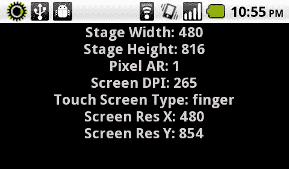

## 工作原理…

通过`flash.display.Stage`和`flash.system.Capabilities`类，我们可以了解很多关于应用程序正在运行的特定设备显示屏的信息，并让应用程序以某种方式对此作出反应。在这个例子中，我们将收集到的信息输出到一个`TextField`中，但这些数据也可以用来根据`Stage`分辨率调整视觉元素的位置、大小或布局。

# 检测屏幕方向变化

由于大多数 Android 设备至少有两种屏幕方向，即纵向和横向，因此在为这些设备开发时，了解当前的屏幕方向以正确显示应用程序用户界面元素是非常有用的。

## 如何操作…

我们将在我们的`Stage`上注册一个事件监听器，以监听`StageOrientationEvent`的变化：

1.  首先，将以下类导入到你的项目中：

    ```kt
    import flash.display.Sprite;
    import flash.display.StageAlign;
    import flash.display.StageOrientation;
    import flash.display.StageScaleMode;
    import flash.events.StageOrientationEvent;
    import flash.text.TextField;
    import flash.text.TextFormat;

    ```

1.  我们现在将声明一个`TextField`和`TextFormat`对，以将文本信息传递到设备显示屏上：

    ```kt
    private var traceField:TextField;
    private var traceFormat:TextFormat;

    ```

1.  现在，我们将继续设置我们的`TextField`，应用一个`TextFormat`，并将其添加到`DisplayList`中。这里，我们创建了一个方法来执行所有这些操作：

    ```kt
    protected function setupTextField():void {
    traceFormat = new TextFormat();
    traceFormat.bold = true;
    traceFormat.font = "_sans";
    traceFormat.size = 24;
    traceFormat.align = "center";
    traceFormat.color = 0xCCCCCC;
    traceField = new TextField();
    traceField.defaultTextFormat = traceFormat;
    traceField.selectable = false;
    traceField.mouseEnabled = false;
    traceField.width = stage.stageWidth;
    traceField.height = stage.stageHeight;
    addChild(traceField);
    }

    ```

1.  下一步将注册一个事件监听器，以检测屏幕方向的变化。我们通过在`Stage`上监听`StageOrientationEvent.ORIENTATION_CHANGE`事件来实现这一点：

    ```kt
    protected function registerListeners():void {
    stage.addEventListener(StageOrientationEvent.ORIENTATION_CHANGE, onOrientationChange);
    }

    ```

1.  当检测到`StageOrientationEvent.ORIENTATION_CHANGE`事件时，它将调用一个名为`onOrientationChange`的方法。我们将创建这个方法，并使用它将表示新方向的文本常量写入`TextField`。我们还将在此处调用一个方法来调整我们的布局：

    ```kt
    protected function onOrientationChange(e:StageOrientationEvent):void {
    traceField.appendText(e.afterOrientation+"\n");
    reformLayout();
    }

    ```

1.  最后，我们将使用`reformLayout`方法调整屏幕上的任何视觉组件以匹配我们新的`Stage`尺寸。这里，我们简单调整了我们的`TextField`对象的大小：

    ```kt
    protected function reformLayout():void {
    traceField.width = stage.stageWidth;
    traceField.height = stage.stageHeight;
    }

    ```

1.  结果应用程序将显示如下截图所示：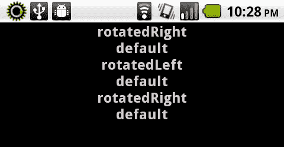

## 工作原理…

基本上，这是一个简单的事件监听器，与具有各种可能方向设置的设备相关联。我们在`Stage`上注册类型为`StageOrientationEvent.ORIENTATION_CHANGE`的事件监听器，并接收两个重要数据返回：`StageOrientationEvent.beforeOrientation`和`StageOrientationEvent.afterOrientation`。这些事件结果中包含的值将报告设备方向常量。

有四个可能被报告的常量：

1.  `StageOrientation.DEFAULT`

1.  `StageOrientation.ROTATED_LEFT`

1.  `StageOrientation.ROTATED_RIGHT`

1.  `StageOrientation.UPSIDE_DOWN`

再次强调，这些只是可能性。有些设备不支持这四个常量中的所有，因此我们必须谨慎，不能想当然。

## 还有更多内容…

实际上，有多种方法可以检测屏幕方向变化。一种是通过`Timer`监控`Stage.orientation`并相应地做出反应。另一种涉及测试`Accelerometer`值以检测方向变化。然而，使用`StageOrientationEvent`是最直接的方法，它为我们提供了事件触发前后的方向信息，这非常有用。

## 另请参阅…

若想了解如何通过`Accelerometer` API 完成类似任务，请参阅第三章，*空间移动：加速度计和地理定位传感器。*

# 在运行时跨设备缩放视觉元素

安卓设备间广泛的每英寸像素（PPI）测量和整体屏幕分辨率差异，使得在创建视觉元素时，特别是在制作交互式元素时，难以进行大小和布局决策。一般认为，一个半英寸的物理测量正方形是便于用户用指尖触摸的理想大小。在本教程中，我们将演示如何确保在设备间保持相同的物理规格。

## 如何操作…

我们将在屏幕上创建一些视觉元素，这些元素的大小基于检测到的设备显示 PPI 进行物理测量：

1.  首先，将以下类导入到你的项目中：

    ```kt
    import flash.display.Shape;
    import flash.display.Sprite;
    import flash.display.StageAlign;
    import flash.display.StageScaleMode;
    import flash.display.StageOrientation;
    import flash.events.StageOrientationEvent;
    import flash.system.Capabilities;

    ```

1.  下一步将是声明将在我们的应用程序中使用的一些对象。我们将创建三个`Shape`对象，用于演示这种特定的布局和大小调整技术。同时，我们还设置两个`Number`对象，用于在确定应用程序中的大小和位置时保存特定的测量值：

    ```kt
    private var boxTopLeft:Shape;
    private var boxTopRight:Shape;
    private var boxBottom:Shape;
    private var halfInch:Number;
    private var fullInch:Number;

    ```

1.  现在，我们必须将我们的视觉元素绘制到`Stage`上。如前所述，我们的目标是物理分辨率为半英寸作为最小测量值。因此，我们首先进行计算，以确定半英寸和一英寸在像素中的表示。

1.  我们将在左上角创建一个方块，在右上角创建另一个方块；每个方块都是半英寸见方，并根据可用的`Stagewidth`和`height`进行定位。在屏幕最底部将放置一个更大的方块，其宽度将延伸至`Stage`的整个宽度：

    ```kt
    protected function setupBoxes():void {
    halfInch = Capabilities.screenDPI * 0.5;
    fullInch = Capabilities.screenDPI * 1;
    boxTopLeft = new Shape();
    boxTopLeft.graphics.beginFill(0xFFFFFF, 1);
    boxTopLeft.x = 0;
    boxTopLeft.y = 0;
    boxTopLeft.graphics.drawRect(0, 0, halfInch, halfInch);
    boxTopLeft.graphics.endFill();
    addChild(boxTopLeft);
    boxTopRight = new Shape();
    boxTopRight.graphics.beginFill(0xFFFFFF, 1);
    boxTopRight.x = stage.stageWidth - halfInch;
    boxTopRight.y = 0;
    boxTopRight.graphics.drawRect(0, 0, halfInch, halfInch);
    boxTopRight.graphics.endFill();
    addChild(boxTopRight);
    boxBottom = new Shape();
    boxBottom.graphics.beginFill(0xFFFFFF, 1);
    boxBottom.x = 0;
    boxBottom.y = stage.stageHeight - fullInch;
    boxBottom.graphics.drawRect(0, 0, stage.stageWidth, fullInch);
    boxBottom.graphics.endFill();
    addChild(boxBottom);
    }

    ```

1.  在`Stage`上注册一个类型为`StageOrientationEvent.ORIENTATION_CHANGE`的事件监听器。这将检测设备方向变化并通知我们，以便我们可以适当地调整和重新定位视觉元素：

    ```kt
    protected function registerListeners():void { stage.addEventListener(StageOrientationEvent.ORIENTATION_CHANGE, onOrientationChange);
    }

    ```

1.  以下方法将在我们的应用程序检测到每次方向变化时触发。在这种情况下，我们并不太关心当前的实际方向是什么，但会重新定位（必要时重新调整大小）`Stage`上的任何视觉元素，以正确地重新排列屏幕。我们再次使用我们的数值测量来执行这些操作：

    ```kt
    protected function onOrientationChange(e:StageOrientationEvent):void {
    boxTopLeft.x = 0;
    boxTopLeft.y = 0;
    boxTopRight.x = stage.stageWidth - halfInch;
    boxTopRight.y = 0;
    boxBottom.x = 0;
    boxBottom.y = stage.stageHeight - fullInch;
    boxBottom.width = stage.stageWidth;
    }

    ```

1.  结果应用程序的显示将类似于我们在以下屏幕截图中所看到的：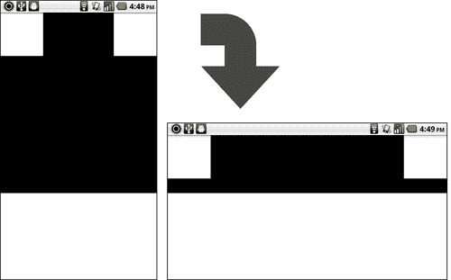

## 工作原理…

视觉组件大小调整的一个好方法是，将报告的`Capabilities.screenDPI`乘以您想要达到的任何物理尺寸。例如，如果我们想要确保某些触摸元素在设备上的宽度正好是半英寸，可以使用以下公式：

```kt
private var halfInch:Number = Capabilities.screenDPI * 0.5;

```

在此示例中，我们设置了一些变量，这些变量表示物理半英寸和全英寸的计算，然后在创建我们的元素进行布局和大小调整时应用这些变量。如果检测到设备方向发生变化，我们将根据新的`Stage`尺寸调整我们的布局，并适当地调整视觉元素的大小。由于两个顶部的`Shapes`是半英寸的方块，我们只需调整它们的`x`和`y`坐标，但底部的形状还需要在每次方向变化时调整其`width`以填满屏幕宽度。

# 在 Flash Professional CS5.5 中根据舞台大小调整视觉元素的缩放

Flash Professional CS5.5 引入了一项功能，使针对各种设备分辨率的目标定位变得更加容易，即当`Stage`大小调整时，Flash 能够重新调整和定位视觉元素。这使得我们可以轻松地修改针对特定分辨率和设备的 FLA 文件。

## 如何实现…

我们将展示如何使用**随舞台缩放内容**以针对不同的屏幕分辨率：

1.  在这里，我们看到一个针对 Nexus S 设备的**480x800**布局的演示应用程序。在**属性**面板中，点击**大小**控制旁边的扳手图标：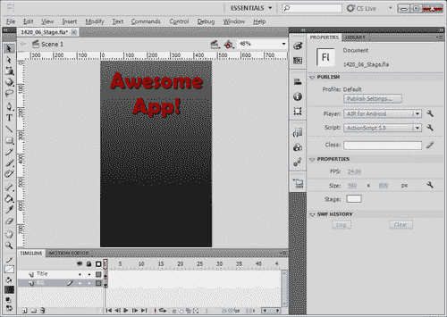

1.  我们希望调整显示分辨率以匹配 Droid2，因此我们将**文档设置**更改为反映**480x854**的显示分辨率以匹配此设备。此外，我们可以选择**随舞台缩放内容**，这将按比例缩放我们的视觉元素：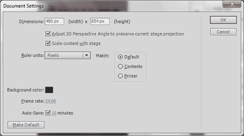

1.  点击**确定**按钮后，我们可以看到`舞台`已调整大小，我们的视觉元素现在位于`舞台`中心。由于我们只调整了应用程序的**高度**，视觉元素的布局会根据可以在**编辑 | 首选项 | 常规 | 缩放内容**中调整的设置重新定位。如果不清除这个复选框，元素会在缩放舞台并选择缩放内容时居中，如下所示。

1.  为了进一步演示，我们将调整`舞台`大小以匹配假想的 Android 平板设备的分辨率。在**属性**面板中，再次点击**大小**控制旁边的扳手图标：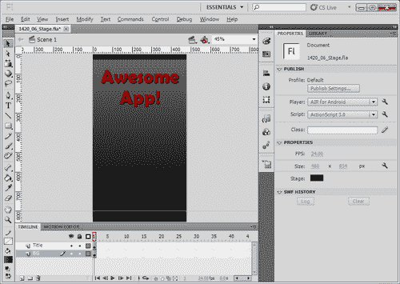

1.  我们假想的平板分辨率为**800x1000**，因此我们将再次调整宽度和高度设置，选择**随舞台缩放内容**，然后点击标记为**确定**的按钮：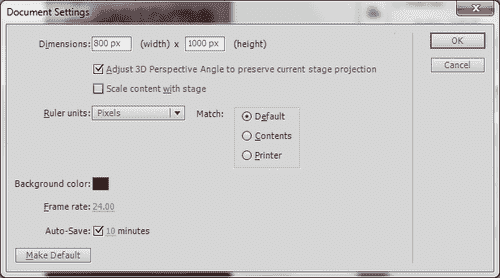

1.  新的缩放功能现在更加明显，我们可以通过参考最初标记我们初始分辨率的指南，查看应用程序资源被缩放的情况。在这个阶段，我们可以对应用程序布局进行进一步的调整，以确保在目标设备上显示的效果完全符合我们的预期：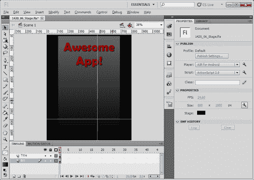

如果我们想要以视觉方式针对多个设备，可以使用此技术为每个设备构建一个 FLA 文件，并共享代码库。尽管许多设备可以使用完全相同的`.fla`生成的应用程序，但这取决于目标设备的分辨率以及我们想要对每个设备进行多少调整。

## 工作原理…

使用 Flash Professional CS5.5 及其以上版本，我们现在在调整`舞台`尺寸时，可以增加缩放`舞台`上内容的功能。这对于移动 Android 开发来说非常棒，因为设备间存在如此多的显示分辨率差异。缩放内容的能力使得 FLA 文档的布局调整变得迅速，当编译成`.APK`文件时，可以针对特定设备。

## 还有更多…

需要注意的是，我们视觉元素的缩放将始终以保持其原始宽高比的方式进行。如果新的宽高比与原始宽高比不同，将需要进一步调整以使布局适合我们针对的任何设备。

# 使用 Flash Professional CS5.5 中的项目面板

在 Flash Professional 中设计应用程序布局传统上一直很麻烦，因为它需要手动组织各种 FLA 文件，并通过代码和资产管理之间的某种机制来同步它们之间的更改。Flash Professional CS5.5 试图通过新的项目结构减轻这种负担，包括在项目文档之间共享作者时间的 Flash 库资产的能力。

## 如何操作…

我们将配置一个 Flash 项目，这将允许我们针对多个屏幕分辨率使用相同的共享资产池，跨设备针对的 FLAs：

1.  通过在欢迎屏幕上选择**创建新项目 | Flash 项目**打开**项目面板**，或者通过应用程序菜单中的**文件 | 新建** | **Flash 项目**创建一个新的 Flash Professional 项目：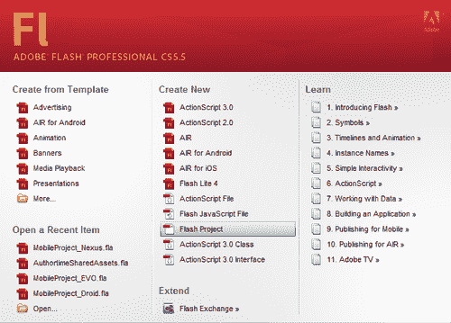

1.  将会出现**创建新项目**的面板，允许我们配置一个新的**Flash 项目**。我们将提供一个**项目名称**，定义一个用于存放项目文件的**根文件夹**，并选择一个**播放器**。在针对 Android 的 AIR 的情况下，我们一定要选择**AIR 2.6**或您希望针对的最新版本的 AIR：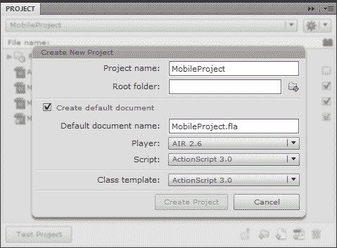

1.  Flash 项目结构允许我们在一个项目中定义多个不同的 FLA 文档，这些文档针对各种分辨率和布局。这里，例如，我们创建了针对 Droid、EVO 和 Nexus One 移动 Android 设备的具体文档。除了这些文档，我们还有一个`AuthortimeSharedAssets.fla`文件，这是 Flash Professional 自动为我们生成的。这将包含我们其他文档之间共享的任何资产。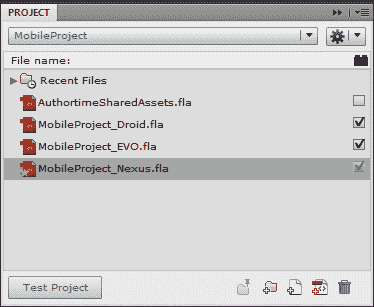

1.  现在，当我们设计和开发应用程序资产时，我们可以将每个资产标记为作者时间共享资产，这可以在所有文档之间链接，使得在这个特定项目中的资产管理比其他情况下更有组织。要将**库**资产标记为共享，只需点击它旁边的复选框：.jpg)

1.  在项目中将特定资产标记为在文档之间共享确实使其可共享，我们还必须确保在相关的文档中包含**库**资产，以便在特定设备文档中在作者时间内访问它。

1.  例如，如果我们有两个`.fla`文件，希望共享一个名为"RedBall"的 MovieClip 符号，我们首先在一个`.fla`中定义"RedBall"，并将其在库中标记为共享。这样会将符号放入我们的`AuthortimeSharedAssets.fla`文件中，但在我们实际将其引入第二个`.fla`的**库**之前，其他任何`.fla`都无法使用它。此时，在任何`.fla`中进行的任何修改都会因为项目中的共享资产链接而在这两个文件之间共享。

## 它的工作原理…

`AuthortimeSharedAssets.fla` 文件包含了所有跨多个 FLA 文件共享的 Flash **库** 资源。这使得我们可以在一个文件中修改共享资源，并且这些更改会影响到所有使用它的项目文档。通过多个针对不同目标分辨率布局的 FLA 文件，设计师在构建应用程序用户界面时具有极大的灵活性。所有这些界面元素通过这种新的项目结构链接起来，保持了工作的有序性和整洁性。

## 还有更多内容…

新的 Flash 项目面板及其相关项目结构不仅允许通过多个 FLA 文件进行作者时间资源共享和多设备定位，而且文件结构现在完全兼容 Flash Builder。这使得开发人员可以在 Flash Professional 中启动 Flash 项目，并通过在 Flash Builder 中导入项目文件夹继续编辑。

# 将 Flex 应用程序冻结为横向或纵向模式

有时我们希望将应用程序布局限制为特定的宽高比，横向或纵向。在使用 Flex 框架构建 Android 项目时，实现这一点非常简单。

## 如何操作…

我们可以通过修改 AIR 应用程序描述符文件来为我们的应用程序冻结特定的宽高比：

1.  默认情况下，当我们定义一个新的 Flex 移动项目时，会创建一个应用程序描述符 `XML` 文件。这个文件包括一个专门用于应用程序 `initialWindow` 配置的节点。它将类似于以下代码：

    ```kt
    <initialWindow>
    <autoOrients>true</autoOrients>
    <fullScreen>false</fullScreen>
    <visible>true</visible>
    <softKeyboardBehavior>none</softKeyboardBehavior>
    </initialWindow>

    ```

1.  我们希望以两种方式修改这个节点的内容。首先，将 `autoOrients` 标签设置为 `false`。这将防止应用程序在设备旋转时重新定位：

    ```kt
    <initialWindow>
    <autoOrients>false</autoOrients>
    <fullScreen>false</fullScreen>
    <visible>true</visible>
    <softKeyboardBehavior>none</softKeyboardBehavior>
    </initialWindow>

    ```

1.  现在，我们将添加一个 `aspectRatio` 标签，并为其赋予两个值之一，`landscape` 或 `portrait`：

    ```kt
    <initialWindow>
    <autoOrients>false</autoOrients>
    <aspectRatio>landscape</aspectRatio>
    <fullScreen>false</fullScreen>
    <visible>true</visible>
    <softKeyboardBehavior>none</softKeyboardBehavior>
    </initialWindow>

    ```

1.  当我们在设备上测试这个应用程序时，即使将其竖直持握，在纵向模式下，我们的应用程序仍然锁定为横向：.jpg)

## 工作原理…

应用程序描述符文件非常强大，因为它可以定义我们应用程序的许多元素，而无需编辑任何 MXML 或 ActionScript。在这个例子中，我们正在修改项目 `initialWindow` 节点内的标签；将 `autoOrients` 设置为 false 并添加一个 `aspectRation` 标签，将我们应用程序的宽高比设置为 `landscape` 或 `portrait`。进行这些编辑将确保无论用户如何旋转设备，我们的应用程序都在固定的宽高比下运行。

## 还有更多内容…

Flash Professional CS5.5 的用户会发现，他们可以通过 **AIR for Android 设置** 对话框轻松调整这些属性。可以从 **属性** 面板或从 **文件 | AIR for Android 设置** 访问：

.jpg)

## 另请参阅…

我们将在第九章中更深入地探讨应用程序描述符文件，*清单保证：安全性和安卓权限*。

# 定义一个空白 Flex 移动应用程序

在 Flash Builder 中创建一个**Flex 移动项目**时，它会附带许多默认视图和布局控件，包括 `ActionBar` 控件和 `ViewNavigator` 容器。这些控件对于许多类型的项目非常有用，但并非所有项目都会从这些额外结构中受益。有时从空白项目开始并逐步构建会更好。

## 如何操作…

定义一个空白 Flex 移动应用程序有两种方法。

在 Flash Builder 中创建一个**新的 Flex 移动项目**时：

1.  定义你的**项目位置**并点击**下一步**。

1.  现在，只需在**应用程序模板**区域选择**空白**，然后继续你的项目设置：.jpg)

第二种方法是修改现有的**Flex 移动项目**以移除某些移动相关结构：

1.  你的移动项目最初将包含以下 MXML：

    ```kt
    <?xml version="1.0" encoding="utf-8"?>
    <s:ViewNavigatorApplication xmlns:fx= "http://ns.adobe.com/mxml/2009"

    firstView="views.MainHomeView">
    </s:ViewNavigatorApplication>

    ```

1.  我们现在将以多种方式修改这部分内容。首先，将你的 `ViewNavigatorApplication` 标签更改为 `Application` 标签：

    ```kt
    <?xml version="1.0" encoding="utf-8"?>
    <s:Application 

    firstView="views.MainHomeView">
    </s:Application>

    ```

1.  移除代码中所有的 `View` 引用：

    ```kt
    <?xml version="1.0" encoding="utf-8"?>
    <s:Application 
    >
    </s:Application>

    ```

这两种方法都将创建一个空白 Flex 移动应用程序：

.jpg)

## 工作原理…

决定 Flex 移动项目中是否存在 `ActionBar` 和其他移动相关结构的是应用程序是否为 `spark.components.ViewNavigatorApplication` 或 `spark.components.TabbedViewNavigatorApplication` 类型。当你的 Flex 移动项目使用更传统的 `spark.components.Application` 时，`ActionBar, TabBar` 和 `ViewStack` 将不再存在于项目中或无法使用。

有关上述结构的更多信息，请查看接下来的几个食谱，其中描述了在启用了 `ViewNavigator` 的项目中工作的方法。

## 还有更多…

在一段时间后对 Flex 移动项目进行修改不是一个好主意，因为那时你可能会深深依赖于 `ViewStack`。

# 定义一个基于 Flex 移动视图的应用程序

基于视图的 Flex 移动应用程序为我们提供了许多非常有用的控件和容器，这些控件和容器专门针对移动应用程序开发的布局和结构。包括屏幕顶部的 `ActionBar` 和 `ViewNavigator` 控件。

## 如何操作…

创建基于 Flex 移动视图的应用程序有两种方法。

在 Flash Builder 中创建一个**新的 Flex 移动项目**时：

1.  定义你的**项目位置**并点击**下一步**。

1.  现在，只需在**应用程序模板**区域选择**基于视图的应用程序**，然后继续你的项目设置：.jpg)

第二种方法是修改现有的 Flex 项目，以添加某些与移动相关的结构：

1.  你的 Flex 项目最初将包含以下 MXML：

    ```kt
    <?xml version="1.0" encoding="utf-8"?>
    <s:Application 
    >
    </s:Application>

    ```

1.  我们现在将以几种方式修改这一点。首先，将你的`Application`标签更改为`ViewNavigatorApplication`标签：

    ```kt
    <?xml version="1.0" encoding="utf-8"?>
    <s:ViewNavigatorApplication 
    >
    </s:ViewNavigatorApplication>

    ```

1.  在当前项目源文件夹内创建一个名为`MainHomeView.mxml`的`View` MXML 文件，作为示例。在这种情况下，我们是在项目结构中的`views`包内创建它。重要的是要认识到每个`ViewNavigatorApplication`都包含任意数量的单个视图。一个`View`是一种可以通过`ViewNavigator`管理以展示或关闭移动 Flex 应用程序内各种“屏幕”的 Flex 容器类型：

    ```kt
    <?xml version="1.0" encoding="utf-8"?>
    <s:View 
     title="HomeView">
    </s:View>

    ```

1.  现在，我们必须将我们刚刚创建的文件指向`ViewNavigatorApplication`的`firstView`属性：

    ```kt
    <?xml version="1.0" encoding="utf-8"?>
    <s:ViewNavigatorApplication 

    firstView="views.MainHomeView">
    </s:ViewNavigatorApplication>

    ```

这两种方法都可以定义一个基于 Flex 移动视图的应用程序。

.jpg)

## 它是如何工作的…

决定`ActionBar`是否存在于 Flex 移动项目中的是应用程序是否为`spark.components.ViewNavigatorApplication`（或`spark.components.TabbedViewNavigatorApplication`）类型。通过将我们的应用程序定义为`ViewNavigatorApplication`，我们可以访问所有这些移动特定的结构和控件，包括强大的`ViewNavigator`，通过它我们可以管理所有的应用程序视图。

一个`View`定义了应用程序内的一个特定“屏幕”，用户在使用应用程序时可能会切换到许多不同的视图。我们可以通过`ViewNavigator`管理所有这些视图，当应用程序在使用时，它会自动为我们保存视图历史。因此，当用户与 Android 后退按钮互动时，可以重新访问之前的视图。

# 定义一个具有多个部分的 Flex 移动标签应用程序

使用 Flex 框架设置一个移动 Android 项目可以像我们想要的那么简单或复杂。超越`ViewNavigatorApplication`的一步是`TabbedViewNavigatorApplication`，它包括拥有多个内容部分的能力，每个部分都有自己的`ViewNavigator`和`View`集合。定义一个`TabbedViewNavigatorApplication`将允许我们访问`TabBar`。

## 如何操作…

配置 Flex 移动标签应用程序有两条路径。

在 Flash Builder 中创建一个**新的 Flex 移动项目**时：

1.  定义你的**项目位置**并点击**下一步 >**

1.  现在，只需在**应用程序模板**区域选择**标签式应用程序**，然后继续你的项目设置：.jpg)

第二种方法是修改现有的 Flex 项目，以添加某些与移动相关的结构：

1.  你的 Flex 项目最初将包含以下 MXML：

    ```kt
    <?xml version="1.0" encoding="utf-8"?>
    <s:Application 
    >
    </s:Application>

    ```

1.  我们现在将以几种方式修改这一点。首先，将你的`Application`标签更改为`TabbedViewNavigatorApplication`标签：

    ```kt
    <?xml version="1.0" encoding="utf-8"?>
    <s:TabbedViewNavigatorApplication 
    >
    </s:TabbedViewNavigatorApplication>

    ```

1.  在当前项目源文件夹内创建一组`View` MXML 文件。在本例中，我们将在项目结构中的`views`包内创建它们：

    TabOne.mxml：

    ```kt
    <?xml version="1.0" encoding="utf-8"?>
    <s:View 
     title="Tab One">
    <s:layout>
    <s:VerticalLayout paddingBottom="20" paddingLeft="20" paddingRight="20" paddingTop="20"/>
    </s:layout>
    <s:Label text="Tab View: #1" />
    </s:View>

    ```

    TabTwo.mxml：

    ```kt
    <?xml version="1.0" encoding="utf-8"?>
    <s:View 
     title="Tab Two">
    <s:layout>
    <s:VerticalLayout paddingBottom="20" paddingLeft="20" paddingRight="20" paddingTop="20"/>
    </s:layout>

    ```

    ```kt
    <s:Label text="Tab View: #2" />
    </s:View>

    ```

    TabThree.mxml：

    ```kt
    <?xml version="1.0" encoding="utf-8"?>
    <s:View 
     title="Tab Three">
    <s:layout>
    <s:VerticalLayout paddingBottom="20" paddingLeft="20" paddingRight="20" paddingTop="20"/>
    </s:layout>
    <s:Label text="Tab View: #3" />
    </s:View>

    ```

1.  现在，我们必须通过将一系列`ViewNavigator`声明嵌套在我们的`TabbedViewNavigatorApplication`结构中，来指向我们刚刚创建的文件。每个都将指向我们刚刚创建的独特`View` MXML 文件之一：

    ```kt
    <?xml version="1.0" encoding="utf-8"?>
    <s:TabbedViewNavigatorApplication 
    >
    <s:ViewNavigator label="Tab One" width="100%" height="100%" firstView="views.TabOne"/>
    <s:ViewNavigator label="Tab Two" width="100%" height="100%" firstView="views.TabTwo"/>
    <s:ViewNavigator label="Tab Three" width="100%" height="100%" firstView="views.TabThree"/>
    </s:TabbedViewNavigatorApplication>

    ```

这些方法中的任何一种都将定义一个 Flex 移动标签应用程序：

.jpg)

## 它是如何工作的…

在 Flex 移动项目中是否包含`TabBar`是由应用程序是否为`spark.components.TabbedViewNavigatorApplication`类型来定义的。当在 Flex 移动项目中使用更传统的`spark.components.Application`时，`TabBar`和`ViewStack`在项目中不再存在或可用。

## 还有更多…

需要注意的是，当使用`TabbedViewNavigator`时，每个标签都有自己专用的`ViewNavigator`，每个都有自己的视图堆栈。除非从其他来源（如共享数据池）获取，否则`ViewNavigotor`实例之间没有机制共享数据，这需要由开发人员定义。

# 在 Flex 移动应用程序中使用启动画面

安卓版的 Adobe AIR 是一个优秀的运行时环境，用于构建和分发安卓应用程序，但与原生开发相比，它有一些权衡。根据应用程序的大小，它可能需要几秒钟的时间为用户加载所有内容。移动 Flex 框架允许我们定义一个启动画面，让用户在启动应用程序时知道应用程序正在加载，并为整个体验增添一点额外的装饰。

## 如何操作…

我们将配置应用程序，在应用程序加载过程中显示启动画面：

1.  在定义 Flex 移动项目时，我们需要确保`ViewNavigatorApplication`或`TabbedViewNavigatorApplication`（取决于你的项目）是当前选定的 MXML 标签，并进入**设计**视图。

1.  接下来，我们将修改**属性**面板中**通用**区域内的几个设置。在这里，浏览到一个图像文件以嵌入**启动画面**，并将**启动画面缩放模式**设置为**无，信箱，拉伸**或**缩放**：.jpg)

1.  进入**源代码视图**，MXML 文档将如下所示：

    ```kt
    <?xml version="1.0" encoding="utf-8"?>
    <s:ViewNavigatorApplication 

    applicationDPI="240" firstView="views.SplashScreenHomeView"
    splashScreenImage="@Embed('assets/splash.png')"
    splashScreenScaleMode="stretch"
    title="Splash!">
    </s:ViewNavigatorApplication>

    ```

1.  当然，你可以从这里修改我们刚刚配置的任何设置，指向另一个文件进行嵌入或更改缩放模式。我们将在主应用程序标签中添加一个名为`splashScreenMinimumDisplayTime`的属性，并将其值设置为希望启动画面图像显示的最短持续时间（毫秒）：

    ```kt
    <?xml version="1.0" encoding="utf-8"?>
    <s:ViewNavigatorApplication 

    applicationDPI="240" firstView="views.SplashScreenHomeView"
    splashScreenImage="@Embed('AndroidSplash.png')"
    splashScreenScaleMode="stretch"
    splashScreenMinimumDisplayTime="2000"
    title="Splash!">
    </s:ViewNavigatorApplication>

    ```

1.  当用户在他们的设备上运行应用程序时，他们会看到一个精美的启动画面，标识应用程序并告知它们正在加载：.jpg)

## 工作原理…

在主应用程序文件上设置`splashScreenImage`属性，可以在用户加载应用程序时向其显示一个嵌入的自定义图像。添加`splashScreenMinimumDisplayTime`属性允许我们定义启动画面显示的最短时间（以毫秒为单位）。如果应用程序加载时间超过这个定义的时间，启动画面将根据需要继续显示。启动画面还可以通过设置`splashScreenScaleMode`属性接受特定的缩放模式行为：

+   将`splashScreenScaleMode`设置为`none`会以原始分辨率呈现我们定义的图像，不做任何修改。这可能无法接受，因为设备屏幕分辨率差异很大。

+   将`splashScreenScaleMode`设置为`letterbox`将把启动图像缩放到由设备显示分辨率定义的框架中，但在图像未覆盖的区域会显示空白填充。

+   将`splashScreenScaleMode`设置为`stretch`将拉伸定义的图像以适应由设备显示分辨率定义的框架，填充整个显示区域。由于图像可能不成比例地缩放，这种设置可能会导致一些失真。

+   将`splashScreenScaleMode`设置为`zoom`将把启动图像缩放到由设备显示分辨率定义的框架中，不允许任何填充。它将通过裁剪图像的某些部分来填充整个显示区域。这可能是不希望的，因为用户可能无法看到图像的某些部分。

例如：一个 480x800 像素的图像在 320x480 的设备显示屏上呈现时如下所示：

.jpg)

# 在 Flex 移动项目中配置 ActionBar，以便与 ViewNavigator 一起使用。

Flex 移动`ViewNavigatorApplication`和`TabbedViewNavigatorApplication`包含一个名为`ActionBar`的特殊控件，其中包含三个可编辑的子容器。我们可以通过修改项目文档中的 MXML 来定义这些子容器的内容。

## 如何操作…

修改文档 MXML 来自定义我们的`ActionBar`内容。在这个例子中，我们将定义一些交互式图像控件，并在应用程序`ViewStack`中提供一个丰富的标题图像。

1.  当我们第一次配置新的 Flex 移动项目时，主 MXML 文档将如下所示：

    ```kt
    <?xml version="1.0" encoding="utf-8"?>
    <s:ViewNavigatorApplication

    firstView="views.CustomActionBarHomeView">
    </s:ViewNavigatorApplication>

    ```

1.  `ActionBar`包含三个独立区域，我们可以在其中定义额外的控件，它们分别是`navigationContent`、`titleContent`和`actionContent`容器。.jpg)

1.  我们首先在我们的主应用程序 MXML 中定义一个`navigationContent`节点。在其中定义一个 Spark `Image`控件，嵌入一个导航图片，这将作为用户返回到我们应用程序“主页”屏幕的方式：

    ```kt
    <s:navigationContent>
    <s:Image source="@Embed('images/home.png')"/>
    </s:navigationContent>

    ```

1.  现在，定义`titleContent`容器，并在其中创建一个`Image`控件，嵌入作为我们应用程序标题的图片：

    ```kt
    <s:titleContent>
    <s:Image source="@Embed('images/title.png')"/>
    </s:titleContent>

    ```

1.  最后，定义一个`actionContent`节点，并在其中嵌入另一个图片，就像我们对`navigationContent`容器所做的那样。这将作为一个关闭按钮：

    ```kt
    <s:actionContent>
    <s:Image source="@Embed('images/close.png')"/>
    </s:actionContent>

    ```

1.  然后，我们将在 MXML 中设置一个`script`块，以包含我们将要编写的任何函数：

    ```kt
    <fx:Script>
    <![CDATA[
    ]]>
    </fx:Script>

    ```

1.  在我们的脚本块中定义一个方法，当用户按下`navigationContent`子级的`Image`时，通过调用`ViewNavigator.popToFirstView()`方法将用户返回到我们的初始`View`。

    ```kt
    private function goHome(e:MouseEvent):void {
    navigator.popToFirstView();
    }

    ```

1.  定义一个第二种方法，当用户按下`actionContent`子级的`Image`时退出应用程序：

    ```kt
    private function closeApp(e:MouseEvent):void {
    NativeApplication.nativeApplication.exit();
    }

    ```

1.  现在，我们将通过为每个交互式`ActionBarImage`控件分配点击事件来完成此示例，使用我们之前创建的方法注册它们：

    ```kt
    <s:navigationContent>
    <s:Image click="goHome(event)" source="@Embed('images/home.png')"/>
    </s:navigationContent>
    <s:actionContent>
    <s:Image click="closeApp(event)" source="@Embed('images/close.png')"/>
    </s:actionContent>

    ```

1.  我们还将以这种方式定义两个`View` mxml 文件，以便这些`ActionBar`控件对于此示例清晰起作用。初始`View`将包括一个按钮，以便使用`ViewNavigator.push()`方法导航到次要`View`。调用此方法时，我们只需传入对特定应用程序应允许用户交互的视图的引用。我们可以选择性地传入第二个参数，其中包含要传递给`View`的数据。

1.  从次要`View`，用户可以通过点击`ActionBar`上的退出`Image`退出应用程序，按 Android 返回按钮，或者点击`ActionBar`上的主页`Image`来调用`ViewNavigator.popToFirstView()`方法，返回到初始的应用程序状态：

    自定义 ActionBar 的 HomeView.mxml：

    ```kt
    <?xml version="1.0" encoding="utf-8"?>
    <s:View 
     title="Home View">
    <s:layout>
    <s:VerticalLayout paddingBottom="20" paddingLeft="20" paddingRight="20" paddingTop="20"/>
    </s:layout>
    <fx:Script>
    <![CDATA[
    protected function switchView():void {
    this.navigator.pushView(views.CustomActionBarSecondaryView);
    }
    ]]>
    </fx:Script>
    <s:Label text="Home View: Hit the EXIT icon to exit." />
    <s:Button label="Go to Secondary View" click="switchView()"/>
    </s:View>
    CustomActionBarSecondaryView.mxml
    <?xml version="1.0" encoding="utf-8"?>
    <s:View 
     title="Secondary View">
    <s:layout>
    <s:VerticalLayout paddingBottom="20" paddingLeft="20" paddingRight="20" paddingTop="20"/>
    </s:layout>
    <s:Label text="Secondary View: Hit the HOME icon to pop to the first view or the EXIT icon to exit." />
    </s:View>

    ```

1.  当我们在设备上运行应用程序时，**ActionBar**将如下显示：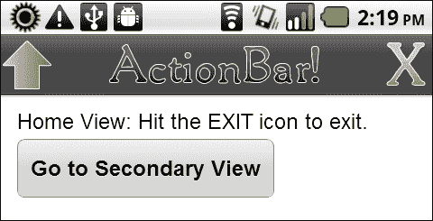

## 工作原理…

`Flex`移动端的`ActionBar`是一个优秀的结构元素，可以广泛应用于各种 Android 移动应用程序中。三个容器区域：`navigationContent`、`titleContent`和`actionContent`与其他 Flex 容器的行为类似。`ActionBar`中的内容及其功能实际上取决于应用程序开发人员，以及这对目标用户是否有意义。我们必须确保考虑可用的空间量以及这如何在不同设备间变化。

在处理`ViewNavigator`时，移动开发人员应该熟悉许多重要方法。我们在这里将简要提及它们。

`popToFirstView()`方法会移除`ViewNavigator`中除最底层视图外的所有视图，实质上是让应用程序返回到“主页”视图。`popView()`方法将当前视图从导航堆栈中弹出，向用户展示上一个视图。

`pushView()`方法将一个新的视图推送到`ViewNavigator`导航堆栈的顶部，使其成为当前视图。为此，必须将有效的`View`对象引用作为此方法的参数传入。

## 还有更多内容…

我们还可以通过在前一节中概述的`ViewNavigator`方法的最后一个参数中传递一个过渡引用来管理视图过渡。例如，如果我们想用翻转的立方体替换正常的滑动过渡，可以通过以下步骤实现：

1.  导入以下类：

    ```kt
    import spark.transitions.FlipViewTransition;
    import spark.transitions.FlipViewTransitionMode;
    import spark.transitions.ViewTransitionDirection;

    ```

1.  调用创建我们过渡的方法，并将其作为`ViewNavigator.popView()`的参数传递。创建过渡时，我们可以定义诸如持续时间、移动方向以及`ActionBar`控件是否与视图内容一起动画等事项：

    ```kt
    protected function removeViews():void {
    var androidTransition:FlipViewTransition = new FlipViewTransition();
    androidTransition.duration = 500;
    androidTransition.direction = ViewTransitionDirection.UP;
    androidTransition.transitionControlsWithContent = false;
    androidTransition.mode = FlipViewTransitionMode.CUBE;
    this.navigator.popView(androidTransition);
    }

    ```

在开发移动 Flex 项目时，我们可以探索许多不同的过渡类型。这仅是使用其中一种类型的方法示例。

# 在 Flex 移动项目的单个视图中隐藏 ActionBar 控件

您可能想使用`ViewNavigatorApplication`容器的`ViewNavigator`结构和功能，但只是想在特定应用程序视图中隐藏`ActionBar`。

## 如何操作…

将 View 的`actionBarVisible`属性设置为`true`。以下示例显示如何根据按钮点击为特定`View`打开和关闭`ActionBar`：

1.  定义一个新的基于 Flex 移动视图的应用程序：

    ```kt
    <?xml version="1.0" encoding="utf-8"?>
    <s:ViewNavigatorApplication 

    firstView="views.MainHomeView">
    </s:ViewNavigatorApplication>

    ```

1.  在一个`views`包中创建一个名为`MainHomeView.mxml`的新 MXML 文件，这将定义此应用程序的主要视图：

    ```kt
    <?xml version="1.0" encoding="utf-8"?>
    <s:View 
     title="HomeView">
    </s:View>

    ```

1.  在我们刚才创建的 MXML 文件中定义一个`Button`组件，这构成了我们的`ViewNavigatorApplicationfirstView:`：

    ```kt
    <s:Button x="10" y="10" label="Toggle"/>

    ```

1.  然后，我们将在 MXML 中设置一个`script`块，以包含我们将要编写的任何函数：

    ```kt
    <fx:Script>
    <![CDATA[
    ]]>
    </fx:Script>

    ```

1.  现在，创建一个名为`toggleActionBar`的函数，并在其中创建一个`if`语句，检查我们`View`的`actionBarVisible`属性是`true`还是`false`。根据当前的`Boolean`值，我们将切换到相反的值：

    ```kt
    protected function toggleActionBar():void {
    if(actionBarVisible){
    actionBarVisible = false;
    }else{
    actionBarVisible = true;
    }
    }

    ```

1.  最后，我们只需在`Button`组件上创建一个点击事件处理程序，以调用刚才创建的函数：

    ```kt
    <s:Button x="10" y="10" label="Toggle" click="toggleActionBar()"/>

    ```

1.  现在，这个`Button`可以在切换时打开和关闭`ActionBar`：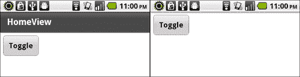

## 工作原理…

应用程序中的每个`View`都有一个`actionBarVisible`属性。设置`actionBarVisible = false`; 将隐藏特定`View`上的`ActionBar`控件。这实际上非常灵活，因为我们可以根据当前所在的`View`按需打开或关闭`ActionBar`控件。

## 还有更多内容…

我们从`View`中移除`ActionBar`控件的方法与从`TabbedViewNavigatorApplication`项目中移除`TabBar`的方法类似，通过设置以下内容：

```kt
tabbedNavigator.tabBar.visible = false;
tabbedNavigator.tabBar.includeInLayout

```
