# 第七章：本地交互：StageWebView 和 URI 处理程序

本章将涵盖以下食谱：

+   在默认的 Android 浏览器中打开网站

+   在应用程序内渲染网站

+   管理 StageWebView 历史记录

+   使用 StageWebView 和 ActionScript 加载广告

+   在 Flex 移动项目中使用 StageWebView 加载广告

+   从应用程序拨打电话

+   从应用程序发送短信

+   从应用程序调用 Google 地图

+   使用应用程序 URI 调用 Android 市场

+   从应用程序发送电子邮件

# 引言

传统上，Flash 平台开发者无法将 HTML 网站渲染为应用程序的一部分；随着 AIR for Android 中 StageWebView 的引入，这一切都改变了。本章包括关于这种机制与普通显示列表对象的不同之处，以及如何有效地使用它的小贴士。我们还将探讨 URI 处理功能，它允许我们接入 Android 设备上的本地应用程序，如网页浏览器、电子邮件客户端、地图和电话。

# 在默认的 Android 浏览器中打开网站

类似于桌面 Flash 和 AIR 应用程序，默认的系统 Web 浏览器可以通过 `flash.net` 包中的类在用户交互的基础上调用。在 Android 上，由于所有应用程序都占用一个完整的窗口，因此我们必须特别注意这可能会在用户与我们的应用程序交互时造成干扰。例如，当用户接到电话或短信必须退出应用程序时。

## 如何操作...

应用程序调用 `navigateToURL` 并传入一个新的 `URLRequest` 将打开默认的 Web 浏览器。在这个例子中，我们将在检测到 `TOUCH_TAP` 事件时打开一个网站：

1.  首先，将以下类导入到你的项目中：

    ```kt
    import flash.display.Sprite;
    import flash.display.StageAlign;
    import flash.display.StageScaleMode;
    import flash.events.TouchEvent;
    import flash.text.TextField;
    import flash.text.TextFormat;
    import flash.net.navigateToURL;
    import flash.net.URLRequest;
    import flash.ui.Multitouch;
    import flash.ui.MultitouchInputMode;

    ```

1.  我们现在将声明一个 `Sprite` 作为我们的交互元素，以及一个 `TextField` 和 `TextFormat` 对作为按钮标签：

    ```kt
    private var fauxButton:Sprite;
    private var traceField:TextField;
    private var traceFormat:TextFormat;

    ```

1.  现在，我们将继续设置我们的 `TextField`，应用一个 `TextFormat` 对象，并使用图形 API 构造一个具有简单背景填充的 `Sprite`。我们按钮构建的最后一步是将 `TextField` 添加到 `Sprite` 中，然后将 `Sprite` 添加到 `DisplayList` 中。在这里，我们创建一个方法来执行所有这些操作，并进行一些风格上的增强：

    ```kt
    protected function setupTextButton():void {
    traceFormat = new TextFormat();
    traceFormat.bold = true;
    traceFormat.font = "_sans";
    traceFormat.size = 42;
    traceFormat.align = "center";
    traceFormat.color = 0x333333;
    traceField = new TextField();
    traceField.defaultTextFormat = traceFormat;
    traceField.autoSize = "left";
    traceField.selectable = false;
    traceField.mouseEnabled = false;
    traceField.text = "Invoke Browser";
    traceField.x = 30;
    traceField.y = 25;
    fauxButton = new Sprite();
    fauxButton.addChild(traceField);
    fauxButton.graphics.beginFill(0xFFFFFF, 1);
    fauxButton.graphics.drawRect(0, 0, traceField.width+60, traceField.height+50);
    fauxButton.graphics.endFill();
    fauxButton.x = (stage.stageWidth/2) - (fauxButton.width/2);
    fauxButton.y = 60;
    addChild(fauxButton);
    }

    ```

1.  如果我们现在在设备上运行应用程序，交互式 `Sprite` 应如下所示：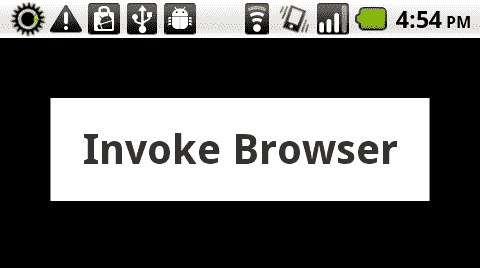

1.  我们现将 `Multitouch.inputMode` 设置为通过 `MultitouchInputMode.TOUCH_POINT` 常量响应原始触摸事件。在 `Sprite` 按钮上注册一个类型为 `TouchEvent.TOUCH_TAP` 的事件监听器。这将检测用户发起的任何触摸点击事件，并调用名为 `onTouchTap` 的方法，该方法包含我们的其余逻辑：

    ```kt
    protected function registerListeners():void {
    Multitouch.inputMode = MultitouchInputMode.TOUCH_POINT;
    fauxButton.addEventListener(TouchEvent.TOUCH_TAP, onTouchTap);
    }

    ```

1.  一旦检测到轻触，我们的`onTouchTap`方法将被触发，调用`navigateToURL`并传入一个包含我们想要从应用程序中打开的 HTTP 或 HTTPS 地址的`URLRequest`：

    ```kt
    protected function onTouchTap(e:TouchEvent):void {
    navigateToURL(newURLRequest("http://memoryspiral.com/"));
    }

    ```

1.  当我们在设备上运行应用程序时，只需轻触按钮就会调用原生的网络浏览器应用程序并加载我们的`URL 请求:`

## 工作原理...

当我们的应用程序用户轻触我们创建的交互式`Sprite`时，他们会离开我们的应用程序，进入默认的安卓网络浏览器，因为我们提供的 URL 通过网络加载，显示请求的网页。这是通过`navigateToURL`方法传递一个`URLRequest`实现的，这与我们在桌面应用程序中实现相同功能的方式非常相似。

## 还有更多...

虽然从我们的应用程序中调用 Android 网络浏览器可能非常有用，但能够将网页加载到应用程序中而不必在应用程序之间跳转则更有趣。当然，用户可以使用 Android 返回按钮从浏览器返回到我们的应用程序（如果它仍然打开），但还有方法可以确保更无缝的体验。接下来的几个食谱将描述如何实现这一点。

# 在应用程序中渲染网站

使用 Flash 内容，传统上不可能在应用程序中显示完全渲染的 HTML 网站。Adobe AIR 最初通过允许将网页加载到桌面应用程序中并仅通过桌面`HTMLLoader`类通过内部 AIR 构建的 web kit 渲染引擎来改变这一点。在 Android 上，AIR 允许我们通过使用`StageWebView`来做类似的事情。

## 如何操作...

我们将构建一个新的`StageWebView`实例，在移动 Android 应用程序中显示一个网页：

1.  首先，将以下类导入到你的项目中：

    ```kt
    import flash.display.Sprite;
    import flash.display.StageAlign;
    import flash.display.StageScaleMode;
    import flash.events.Event;
    import flash.events.TouchEvent;
    import flash.geom.Rectangle;
    import flash.media.StageWebView;
    import flash.net.URLRequest;
    import flash.net.navigateToURL;
    import flash.text.TextField;
    import flash.text.TextFormat;
    import flash.ui.Multitouch;
    import flash.ui.MultitouchInputMode;

    ```

1.  我们现在将声明一个`Sprite`作为我们的交互元素，以及一个`TextField`和`TextFormat`对作为按钮标签。此外，声明一个`StageWebView`实例以及一个`Rectangle`来定义我们的视口：

    ```kt
    private var fauxButton:Sprite;
    private var swv:StageWebView;
    private var swvRect:Rectangle;
    private var traceField:TextField;
    private var traceFormat:TextFormat;

    ```

1.  现在，我们将继续设置我们的`TextField`，应用一个`TextFormat`对象，并使用图形 API 构建一个具有简单背景填充的`Sprite`。按钮构建的最后一步是将`TextField`添加到我们的`Sprite`中，然后将`Sprite`添加到`DisplayList`中。这里，我们创建一个方法来为我们执行所有这些操作，并进行一些风格上的增强：

    ```kt
    protected function setupTextButton():void {
    traceFormat = new TextFormat();
    traceFormat.bold = true;
    traceFormat.font = "_sans";
    traceFormat.size = 42;
    traceFormat.align = "center";
    traceFormat.color = 0x333333;
    traceField = new TextField();
    traceField.defaultTextFormat = traceFormat;
    traceField.autoSize = "none";
    traceField.selectable = false;
    traceField.mouseEnabled = false;
    traceField.text = "Load Website";
    traceField.x = 30;
    traceField.y = 25;
    fauxButton = new Sprite();
    fauxButton.addChild(traceField);
    fauxButton.graphics.beginFill(0xFFFFFF, 1);
    fauxButton.graphics.drawRect(0, 0, traceField.width+60, traceField.height+50);
    fauxButton.graphics.endFill();
    fauxButton.x = (stage.stageWidth/2) - (fauxButton.width/2);
    fauxButton.y = 60;
    addChild(fauxButton);
    }

    ```

1.  创建一个方法来构建我们的`StageWebView`对象，通过定义一个新的`Rectangle`，设定我们希望`StageWebView`视口在应用程序中的位置和大小。在这个例子中，我们根据之前创建的`Sprite`的位置以及应用程序`Stage`的尺寸来确定我们的`Rectangle`的属性。

1.  在构造我们的 `StageWebView` 实例之前，通过调用 `StageWebView.isSupported` 来检查是否支持 `StageWebView` 是一个好习惯。实际上，要创建一个 `StageWebView` 对象，我们只需进行简单的实例化并将应用程序 `stage` 分配给 `StageWebView.stage`。现在，将先前构建的 `Rectangle` 分配给 `StageWebView viewport` 属性：

    ```kt
    protected function setupStageWebView():void {
    swvRect = new Rectangle(0,fauxButton.y+fauxButton. height+40,stage.stageWidth,stage. stageHeight-fauxButton.y+fauxButton.height+40);
    if(StageWebView.isSupported){
    swv = new StageWebView();
    swv.stage = this.stage;
    swv.viewPort = swvRect;
    }
    }

    ```

1.  如果我们现在在设备上运行应用程序，带有伴随 `StageWebView` 的交互式 `Sprite` 应如下所示：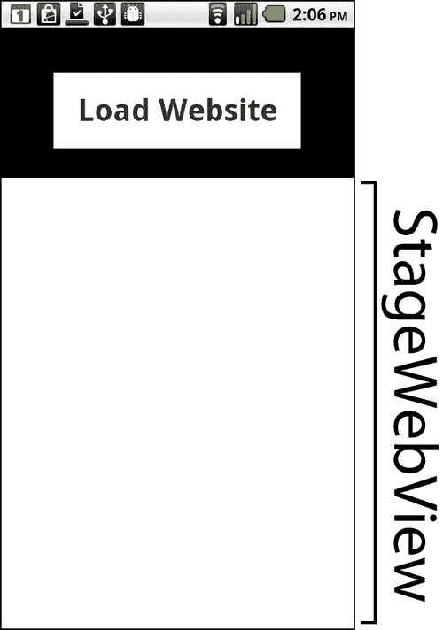

1.  我们现在将 `Multitouch.inputMode` 分配给通过 `MultitouchInputMode.TOUCH_POINT` 常量响应原始触摸事件。在 `Sprite` 按钮上注册一个类型为 `TouchEvent.TOUCH_TAP` 的事件监听器。这将检测用户发起的任何触摸点击事件，并调用名为 `onTouchTap` 的方法，该方法将实例化页面加载。我们还将为 `StageWebView` 对象注册一个类型为 `Event.COMPLETE` 的事件，以确定页面加载何时完成：

    ```kt
    protected function registerListeners():void {
    Multitouch.inputMode = MultitouchInputMode.TOUCH_POINT;
    fauxButton.addEventListener(TouchEvent.TOUCH_TAP, onTouchTap);
    swv.addEventListener(Event.COMPLETE, locationChanged);
    }

    ```

1.  当检测到触摸点击时，我们的 `onTouchTap` 方法将被触发，调用 `navigateToURL`；它将开始使用 `StageWebView.loadURL()` 加载网页，传入页面地址作为 `String` 参数：

    ```kt
    protected function onTouchTap(e:TouchEvent):void {
    swv.loadURL("http://memoryspiral.com/");
    }

    ```

1.  一旦页面加载完成，我们可以收集有关已加载内容的信息，例如页面 `title`。在这种情况下，我们将页面 `title` 分配给我们的 `TextField` 作为示例：

    ```kt
    protected function locationChanged(e:Event):void {
    traceField.text = e.target.title;
    }

    ```

1.  当网页完全加载后，生成的应用程序将如下所示：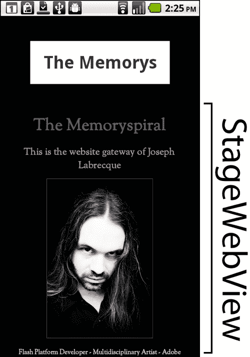

## 工作原理...

`StageWebView` 类将使用主机操作系统上的默认网页控件来渲染视口中显示的任何 HTML 内容。需要注意的是，`StageWebView` 并不是传统 Flash `DisplayList` 的一部分，不能像将视觉元素添加到 `DisplayList`（通过 `addChild()`）那样以常规方式添加到我们的应用程序中。

由于 `StageWebView` 不属于传统的 `DisplayList`，我们必须使用另一种方式来定义它在 `stage` 上的位置以及它将占用的空间。这是通过将 `Rectangle` 对象分配给 `StageWebView.viewPort` 属性来完成的。`StageWebView` 类还需要一个 `stage` 属性，将其分配给当前应用程序的 `stage`。只要这两个属性正确分配，视口就会出现在我们的应用程序中。

### 注意

由于 `StageWebView` 不是 `DisplayList` 的一部分，一旦我们使用完毕，应该始终对其调用 `dispose()` 方法，以便从应用程序中完全移除。

## 还有更多...

如前一部分所述，当调用`StageWebView`时，AIR for Android 将使用原生的 WebKit 渲染引擎。WebKit 被众多流行的网络浏览器使用，包括 Android 浏览器、Apple Safari 和 Google Chrome。值得注意的是：WebKit 实际上是 Adobe AIR 桌面运行时的一部分。关于 WebKit 的更多信息，请访问[`www.webkit.org/`](http://www.webkit.org/)。

# 管理 StageWebView 历史

在为 Android 开发应用程序时，AIR 允许我们通过使用 StageWebView 类来渲染完整的网站。我们还可以利用`StageWebView`实例的导航历史，并在应用程序中以不同的方式应用它。

## 如何操作...

一旦用户在我们的`StageWebView`实例中加载了一些页面，我们就可以通过导航历史前后导航：

1.  首先，将以下类导入到你的项目中：

    ```kt
    import flash.display.Sprite;
    import flash.display.StageAlign;
    import flash.display.StageScaleMode;
    import flash.events.Event;
    import flash.events.LocationChangeEvent;
    import flash.events.TouchEvent;
    import flash.geom.Rectangle;
    import flash.media.StageWebView;
    import flash.net.URLRequest;
    import flash.net.navigateToURL;
    import flash.text.TextField;
    import flash.text.TextFormat;
    import flash.ui.Multitouch;
    import flash.ui.MultitouchInputMode;

    ```

1.  我们现在将声明两个`Sprite`对象作为我们的交互元素，以及一个`TextField`和`TextFormat`对作为地址指示器。此外，声明一个`StageWebView`实例以及一个`Rectangle`来定义我们的视口：

    ```kt
    private var prevButton:Sprite;
    private var nextButton:Sprite;
    private var swv:StageWebView;
    private var swvRect:Rectangle;
    private var addressField:TextField;
    private var addressFormat:TextFormat;

    ```

1.  现在，我们将创建两个方法，用来构建我们的前进和后退历史控制，并将它们添加到`stage`上。为每个方法实例化一个新的`Sprite`，并添加一个唯一的`name`属性，指定交互的预期功能。我们稍后可以通过`touch tap`事件读取它，以确定哪个`Sprite`被点击。使用图形 API 绘制基本背景，并在将每个`Sprite`添加到`DisplayList`之前在`stage`上进行定位：

    ```kt
    protected function setupPrevButton():void {
    prevButton = new Sprite();
    prevButton.name = "prev";
    prevButton.graphics.beginFill(0xFFFFFF, 1);
    prevButton.graphics.drawRect(0, 0, 50, 50);
    prevButton.graphics.endFill();
    prevButton.x = 0;
    prevButton.y = 0;
    addChild(prevButton);
    }
    protected function setupNextButton():void {
    nextButton = new Sprite();
    nextButton.name = "next";
    nextButton.graphics.beginFill(0xFFFFFF, 1);
    nextButton.graphics.drawRect(0, 0, 50, 50);
    nextButton.graphics.endFill();
    nextButton.x = stage.stageWidth - 50;
    nextButton.y = 0;
    addChild(nextButton);
    }

    ```

1.  为了完成我们的地址指示器，我们继续设置我们的`TextField`并应用一个`TextFormat`对象。在这个例子中，我们将`TextField`在`stage`上居中（位于两个交互式`Sprites`之间）以模拟网络浏览器的地址栏。创建一个方法来执行所有这些操作以及一些样式增强，并将默认的**加载中**字符串分配给`TextField`，以让用户知道正在发生的事情。

    ```kt
    protected function setupAddressBar():void {
    addressFormat = new TextFormat();
    addressFormat.bold = true;
    addressFormat.font = "_sans";
    addressFormat.size = 26;
    addressFormat.align = "center";
    addressFormat.color = 0xFFFFFF;
    addressField = new TextField();
    addressField.defaultTextFormat = addressFormat;
    addressField.autoSize = "left";
    addressField.selectable = false;
    addressField.mouseEnabled = false;
    addressField.text = "Loading...";
    addressField.x = 60;
    addressField.y = 8;
    addChild(addressField);
    }

    ```

1.  创建一个方法来构建我们的`StageWebView`对象，通过定义一个新的`Rectangle`，设定我们希望`StageWebView`在应用程序中显示的位置和大小。在这个例子中，我们根据之前创建的`Sprite`和`TextField`对象的位置以及应用程序`Stage`的尺寸来确定我们`Rectangle`的属性。

1.  在构建我们的`StageWebView`实例之前，通过调用`StageWebView.is supported`来检查是否支持`StageWebView`是一个好习惯。实际上，要创建一个`StageWebView`对象，我们只需进行简单的实例化并将应用程序`stage`分配给`StageWebView.stage`。现在，将之前构建的`Rectangle`分配给`StageWebView`的`viewport`属性：

    ```kt
    protected function setupStageWebView():void {
    swvRect = new Rectangle(0,addressField.y+addressField.
    height+40,stage.stageWidth ,stage.stageHeight-addressField. y+addressField.height+40);
    if(StageWebView.isSupported){
    swv = new StageWebView();
    swv.stage = this.stage;
    swv.viewPort = swvRect;
    }
    }

    ```

1.  我们现在将`Multitouch.inputMode`设置为通过`MultitouchInputMode.TOUCH_POINT`常量响应原始触摸事件。在两个`Sprite`按钮上注册一个类型为`TouchEvent.TOUCH_TAP`的事件监听器。这将检测用户发起的任何触摸点击事件，并调用一个名为`onTouchTap`的方法，该方法将根据点击的`Sprite`决定是在导航历史中后退还是前进。我们还会在`StageWebView`对象上注册一个类型为`LocationChangeEvent.LOCATION_CHANGE`的事件，以确定页面加载何时完成。最后，我们可以调用`StageWebView.loadURL`，传入一个网页地址作为唯一参数。这将开始加载我们的默认位置：

    ```kt
    protected function registerListeners():void {
    Multitouch.inputMode = MultitouchInputMode.TOUCH_POINT;
    prevButton.addEventListener(TouchEvent.TOUCH_TAP, onTouchTap);
    nextButton.addEventListener(TouchEvent.TOUCH_TAP, onTouchTap);
    swv.addEventListener(LocationChangeEvent.LOCATION_CHANGE, locationChanged);
    swv.loadURL("http://memoryspiral.com/");
    }

    ```

1.  如果我们现在运行这个应用，我们会看到所有的交互元素都出现在舞台上，并且我们想要的网页会在`StageWebView`实例中渲染出来：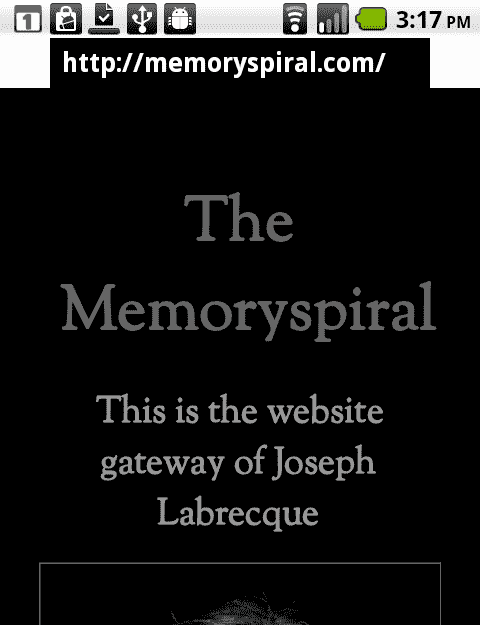

1.  当检测到`Sprite`交互时，我们通过检查实例化后直接提供的`name`属性来确定被点击的特定`Sprite`。这样，我们就知道是否应该使用`historyBack()`或`historyForward()`方法尝试通过历史记录向前或向后移动。为了检测我们是否真的可以这样做，我们可以首先检查设备上是否启用了后退或前进历史，如下面的代码片段所示：

    ```kt
    protected function onTouchTap(e:TouchEvent):void {
    switch(e.target.name){
    case "prev":
    if(swv.isHistoryBackEnabled){
    swv.historyBack();
    }
    break;
    case "next":
    if(swv.isHistoryForwardEnabled){
    swv.historyForward();
    }
    break;
    }
    }

    ```

1.  当我们`StageWebView`实例正在渲染的当前位置发生变化时，我们会像标准网络浏览器的地址栏一样，用当前的 URL 更新我们的`TextField`：

    ```kt
    protected function locationChanged(e:LocationChangeEvent):void {
    addressField.text = e.location;
    }

    ```

1.  用户现在可以通过点击各种超链接，在`StageWebView`的历史记录中前后导航，如下面的截图所示：

## 工作原理...

`StageWebView`类将使用主机操作系统上的默认网络控件来渲染视口中显示的任何 HTML。需要注意的是，`StageWebView`不是传统 Flash `DisplayList`的一部分，不能像将视觉元素添加到`DisplayList`（通过`addChild()`）那样以常规方式添加到我们的应用程序中。

要管理`StageWebView`的历史记录，我们可以使用`historyBack()`或`historyForward()`方法，在应用内沿着用户的历史记录进行导航。

### 注意

除非用户开始点击超链接并在`StageWebView`实例中实际进行导航，否则这两种方法不会执行任何操作。我们基本上是创建了一个小型的网络浏览器。

# 使用 StageWebView 通过 ActionScript 加载广告

使用 Flash 平台进行移动 Android 开发时，最受追捧的功能之一是在应用中包含来自如 Google AdSense 或 AdMob 等服务的广告。这使得开发者可以免费向用户分发应用程序，但仍然可以从应用内显示的广告中获得收入。

## 如何操作...

`StageWebView` 为移动应用开发开辟了众多可能性，其中之一就是能够在运行中的应用程序中加载基于 HTML 的广告。在以下示例中，我们将看看如何轻松管理这一点：

1.  首先，将以下类导入到你的项目中：

    ```kt
    import flash.display.Sprite;
    import flash.display.StageAlign;
    import flash.display.StageScaleMode;
    import flash.events.TimerEvent;
    import flash.geom.Rectangle;
    import flash.media.StageWebView;
    import flash.utils.Timer;

    ```

1.  我们现在将声明一个 `StageWebView` 实例以及一个 `Rectangle` 来定义我们的视口。最后，设置一个 `Timer`，作为刷新我们广告的机制。

    ```kt
    private var swv:StageWebView;
    private var swvRect:Rectangle;
    private var adTimer:Timer;

    ```

1.  创建一个方法来构建我们的 `StageWebView` 对象，通过定义一个新的 `Rectangle` 来确定 `StageWebView` 在应用中的位置和大小。在构建 `StageWebView` 实例之前，最好先调用 `StageWebView.isSupported` 来检查是否支持 `StageWebView`。

1.  实际上，要创建一个 `StageWebView` 对象，我们只需进行简单的实例化并将应用程序的 `stage` 赋值给 `StageWebView.stage`。现在，将之前构建的 `Rectangle` 赋值给 `StageWebView` 的 `viewport` 属性，或者使用 `loadURL()` 加载一个网页，传入页面地址作为 `String`：

    ```kt
    protected function setupStageWebView():void {
    swvRect = new Rectangle(0, 0, stage.StageWidth, 70);
    if(StageWebView.isSupported){
    swv = new StageWebView();
    swv.stage = this.stage;
    swv.viewPort = swvRect;
    swv.loadURL("http://memoryspiral.com/admob.html");
    }
    }

    ```

1.  如果我们还没有这样做，为了使其正确运行，我们必须在服务器上设置一个网页，以便与我们选择的广告服务进行接口交互。在这个例子中，我们使用 AdMob ([`www.admob.com/`](http://www.admob.com/))，因为广告针对的是移动网络和移动设备应用。

1.  这里有一个重要的事情，就是确保通过 CSS 将 `bodymargin` 和 `padding` 设置为 `0`，以避免广告周围出现任何空间。`StageWebView` 本质上只是运行 HTML，因此如果我们不稍作修改，默认的 HTML 渲染引擎（在 Android 中，这是 web Kit）将简单地通过其默认设置解释所有风格元素。

1.  你需要将 `pubid` 属性替换成你自己的，或者注册一个不同的广告服务。使用这个代码片段作为参考，创建你自己的 HTML 文件，并将其存储在服务器上，然后通过你的特定应用程序调用，正如这个例子中所做的那样：

    ```kt
    <html>
    <head>
    <style type="text/css">
    body {
    background-color: #333;
    margin: 0px;
    padding: 0px;
    }
    </style>
    </head>
    <body>
    <script type="text/javascript">
    var admob_vars = {pubid: 'xxxxxxxxxxx',bgcolor: '000000',text: 'FFFFFF',ama: false,test: true};
    </script>
    <script type="text/javascript" src="img/iadmob.js"></script>
    </body>
    </html>

    ```

1.  下一步是设置我们的 `Timer`，以每 10 秒更换一次广告。我们通过实例化一个新的 `Timer` 对象并传递 10000 毫秒（或者你选择的时间量）来实现这一点。现在，注册一个类型为 `TimerEvent.Timer` 的事件监听器，以便每次 `Timer` 达到 10 秒时触发我们构建的方法。要启动 `Timer`，我们调用 `Timer.start()`：

    ```kt
    protected function setupTimer():void {
    adTimer = new Timer(10000);
    adTimer.addEventListener(TimerEvent.TIMER, onTimer);
    adTimer.start();
    }

    ```

1.  剩下的就是创建我们的`onTimer`方法，以便每次`Timer`达到 10 秒时重新加载`StageWebView`实例。这将再次调用网络，下拉 HTML，从而重新调用广告服务脚本。

    ```kt
    protected function onTimer(e:TimerEvent):void {
    swv.reload();
    }

    ```

1.  每次我们的`Timer`触发时，页面都会刷新，揭示我们应用程序中的新广告：

## 工作原理...

`StageWebView`类将使用主机操作系统上的默认 Web 控件来渲染视口中显示的任何 HTML。需要注意的是，`StageWebView`不是传统 Flash `DisplayList`的一部分，不能像将视觉元素添加到`DisplayList`（通过`addChild()`）那样以常规方式添加到我们的应用程序中。

为了在应用程序中实际渲染广告，我们可以首先使用`loadURL()`加载一个网页，传入页面地址作为`String`。该地址应指向与我们所选择的广告服务接口的 HTML 文档，我们之前已经注册过。通常，这些服务会提供一个 JavaScript 代码块，让你放入你的 HTML 中，它会在页面加载时调用广告。要刷新我们的视口并加载新的广告，我们可以简单地调用`StageWebView.reload()`。在我们的示例中，我们使用`Timer`每 10 秒执行此操作。

## 更多内容...

尽管我们决定在本例中使用 AdMob，但开发者通常可以包括他们喜欢的任何广告系统。在以下屏幕截图中，我以完全相同的方式从 Google AdSense 获取广告。但您会注意到，使用正常版本的 AdSense（不使用移动内容单元）时，广告不会以智能方式适应屏幕。AdMob 专为移动设备设计，因此在这些情况下效果更好。将来，除了这里提到的两个广告提供商之外，应该还有许多新的机会。我们还必须记住，这些都是第三方服务，可能会随时更改。

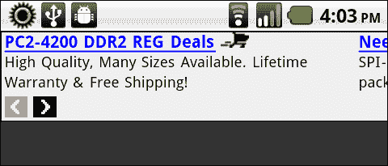

# 在 Flex 移动项目中使用 StageWebView 加载广告

由于`StageWebView`实例不是`DisplayList`的一部分，在`ViewNavigatorApplication`中使用它可能会出现感知上的问题。主要问题是`StageWebView`总是位于所有其他对象的顶层，并且无法与特定视图中的其他项目一起过渡。在本教程中，我们将研究这个问题，并展示一些应对`StageWebView`对象不规则行为的技术。

## 准备工作...

在本例中，我们将使用 Google AdSense 的**移动内容 | 广告单元**。您需要访问[`www.google.com/adsense/`](http://https://www.google.com/adsense/)注册 AdSense 账户，并配置一个**移动内容广告单元**：

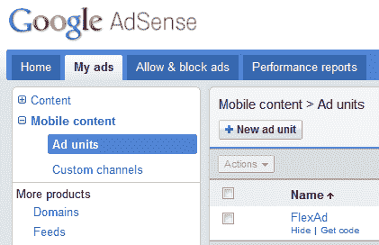

如果你已经有了 AdMob 账户（或其他服务），你可以选择使用它，或者甚至为本演示创建一个简单的广告。

## 如何操作...

我们将创建一个新的`ViewNavigatorApplication`，其中包含两个不同的视图，演示`StageWebView`如何存在于这个结构之外，如何从视图中移除`StageWebView`，并提供对额外广告服务系统的引用。

在这个例子中，将涉及多个文件；我们将通过不同的部分来组装它们，以便更清晰。

### 创建 HTML 文件以展示我们的广告

如果我们还没有这样做，为了使其正确工作，我们必须在服务器上设置一个网页以与 Google AdSense 进行接口。你可能希望将以下示例中的`client`属性替换为你自己的。使用这段代码作为参考，在服务器上创建你自己的 HTML 文件，并通过你的特定应用程序调用：

```kt
<html>
<head>
<style type="text/css">
body {
background-color: #333;
margin: 0px;
padding: 0px;
}
</style>
</head>
<body>
<script type="text/javascript"><!--
// XHTML should not attempt to parse these strings, declare them CDATA.
/* <![
CDATA[ */
window.googleAfmcRequest = {
client: 'your-id-goes-here',
format: '320x50_mb',
output: 'html',
slotname: '5725525764',
};
/* ]]> */
//--></script>
<script type="text/javascript" src="img/show_afmc_ads.js"></script>
</body>
</html>

```

### 为我们的 ViewNavigatorApplication 创建 MXML 文件

1.  首先，我们创建主应用程序文件，其根节点为`ViewNavigatorApplication`，以便利用它提供的基于视图的布局。如有需要，我们可以设置`applicationDPI`，并使用`firstView`属性引用初始`View`。我们将在本例稍后定义这个`View`。在继续之前，让我们注册一个名为`init()`的方法，以便在应用程序完成后执行：

    ```kt
    <?xml version="1.0" encoding="utf-8"?>
    <s:ViewNavigatorApplication 
     applicationDPI="160"
    firstView="views.FlexAdsHomeView" applicationComplete="init()">
    </s:ViewNavigatorApplication>

    ```

1.  创建一个脚本块以保存我们应用程序的所有 ActionScript 代码。进行此操作的代码将在另一个步骤中定义，以便更清晰。

    ```kt
    <fx:Script>
    <![
    CDATA[
    ]]>
    </fx:Script>

    ```

1.  现在，我们将在`ActionBar`中添加一些功能，具体来说是在`navigationContent`节点中添加两个`Button`控件。这两个`Button`控件将调用`ViewNavigator.pushView()`方法。这个方法接受一个`View`引用作为参数，当调用时，会将该`View`置于我们的视图栈顶部：

    ```kt
    <s:navigationContent>
    <s:Button label="V1" click="navigator.pushView(views.FlexAdsHomeView)"/>
    <s:Button label="V2" click="navigator.pushView(views.FlexAdsOtherView);"/>
    </s:navigationContent>

    ```

1.  现在，我们将为本例组装两个视图。在每个`View`中放置一个`Button`控件以及一个`click`事件处理程序，该处理程序将调用主应用程序文件中的方法以切换广告的显示和隐藏：

    FlexAdsHomeView.mxml

    ```kt
    <?xml version="1.0" encoding="utf-8"?>
    <s:View 

    title="Primary View" >
    <s:Button y="120" label="Toggle Ads" horizontalCenter="0" click="this.parentApplication.toggleAds()"/>
    </s:View>

    ```

    FlexAdsOtherView.mxml

    ```kt
    <?xml version="1.0" encoding="utf-8"?>
    <s:View 

    title="Secondary View">
    <s:Button y="120" label="Toggle Ads" horizontalCenter="0" click="this.parentApplication.toggleAds()"/>
    </s:View>

    ```

#### 生成 ActionScript 代码以连接所有内容

这段代码将存在于我们之前定义的主应用程序文件的`script`块中：

1.  首先，将以下类导入到项目中：

    ```kt
    import flash.events.TimerEvent;
    import flash.geom.Rectangle;
    import flash.media.StageWebView;
    import flash.utils.Timer;

    ```

1.  我们现在将声明一个`StageWebView`实例以及一个`Rectangle`以定义我们的视口。最后，设置一个`Timer`，它将作为刷新我们广告的机制：

    ```kt
    private var swv:StageWebView;
    private var swvRect:Rectangle;
    private var adTimer:Timer;

    ```

1.  设置前面提到的初始化函数，它将简单地调用我们将要构建的方法来设置`StageWebView`实例和我们的广告刷新`Timer`：

    ```kt
    protected function init():void {
    setupStageWebView();
    setupTimer();
    }

    ```

1.  创建一个方法来构建我们的`StageWebView`对象，通过定义一个新的`Rectangle`，设置我们希望`StageWebView`在应用程序中显示的位置和大小。在构建`StageWebView`实例之前，最好通过调用`StageWebView.isSupported`来检查是否支持`StageWebView`。

1.  实际上要创建一个`StageWebView`对象，我们只需简单地实例化并将其分配给应用程序的`stage`到`StageWebView.stage`。现在，将之前构建的`Rectangle`赋值给`StageWebView`的`viewport`属性，然后使用`loadURL()`加载一个网页，传入页面地址作为`String`：

    ```kt
    protected function setupStageWebView():void {
    swvRect = new Rectangle(0, 68, stage.stageWidth, 76);
    if(StageWebView.isSupported){
    swv = new StageWebView();
    swv.stage = this.stage;
    swv.viewPort = swvRect;
    swv.loadURL("http://memoryspiral.com/adsense.html");
    }
    }

    ```

1.  要从各个视图中切换广告的显示与隐藏，我们只需检查`StageWebView.viewPort`是否为`null`，根据这个结果，要么将其设置为一个`Rectangle`对象，要么赋值为`null`。如果`viewPort`为`null`，广告将不再对用户可见：

    ```kt
    public function toggleAds():void {
    if(swv.viewPort != null){
    swv.viewPort = null;
    }else{
    swv.viewPort = swvRect;
    }
    }

    ```

1.  下一步是设置我们的`Timer`，以每 8 秒更换一次广告。我们通过实例化一个新的`Timer`对象，传入 8000 毫秒（或您选择的时间量）来实现这一点。现在，注册一个类型为`TimerEvent.Timer`的事件监听器，以便每次`Timer`达到 8 秒时触发我们构建的方法。要启动`Timer`，我们调用`Timer.start()`：

    ```kt
    protected function setupTimer():void {
    adTimer = new Timer(8000);
    adTimer.addEventListener(TimerEvent.TIMER, onTimer);
    adTimer.start();
    }

    ```

1.  剩下的就是创建我们的`onTimer`方法，以便每次`Timer`达到 10 秒时重新加载`StageWebView`实例。这将再次调用网络，拉取 HTML，从而重新调用广告服务脚本：

    ```kt
    protected function onTimer(e:TimerEvent):void {
    swv.reload();
    }

    ```

1.  当运行应用程序时，广告将立即在`StageWebView`实例中显示，并且我们的初始`View`将呈现给用户。此时，用户可以与`ActionBar`交互，并在每个`View`之间切换。即使`View`内容随着应用程序`ViewNavigator`的切换而变化，`StageWebView`实例仍将保持原位。在任何时候，用户都可以通过任一`View`中的`Button`实例切换广告的显示与隐藏：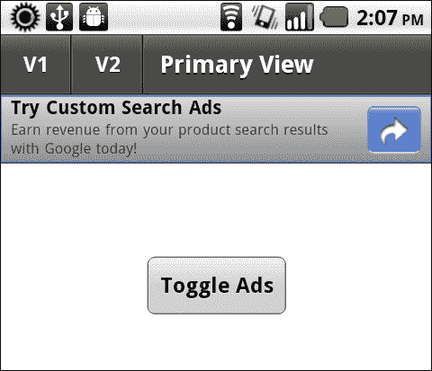

### 工作原理...

在`ViewNavigatorApplication`中使用`StageWebView`一开始可能会觉得有些麻烦，如果我们记住这个特定对象的限制，并以一种经过深思熟虑的方式管理`StageWebView`，那么创建一个可行的实现并不那么困难。

### 还有更多内容...

如果我们想完全从应用程序中移除一个`StageWebView`对象，我们可以调用`StageWebView.dispose()`，这将移除`StageWebView`对象，使其能被垃圾收集器处理。即使我们以这种方式移除`StageWebView`实例，如果需要，我们仍然可以创建一个新的实例。

# 从应用程序中拨打电话

由于 Android 操作系统具有众多出色的功能和强大的实力，很容易让人忘记这些设备首先是电话。在本教程中，我们将展示如何从应用内部调用本地 Android 电话工具，并传递一个要拨打的电话号码。

## 如何操作...

应用程序调用`navigateToURL`并传入带有正确`tel:` URI 的新`URLRequest`，将打开默认的电话应用，并加载指定的电话号码，准备拨号。在这个例子中，我们将在检测到`TOUCH_TAP`事件时执行此操作：

1.  首先，将以下类导入到您的项目中：

    ```kt
    import flash.display.Sprite;
    import flash.display.StageAlign;
    import flash.display.StageScaleMode;
    import flash.events.TouchEvent;
    import flash.text.TextField;
    import flash.text.TextFormat;
    import flash.net.navigateToURL;
    import flash.net.URLRequest;
    import flash.ui.Multitouch;
    import flash.ui.MultitouchInputMode;

    ```

1.  我们现在将声明一个`Sprite`作为我们的交互元素，以及一个`TextField`和`TextFormat`对，作为按钮标签：

    ```kt
    private var fauxButton:Sprite;
    private var traceField:TextField;
    private var traceFormat:TextFormat;

    ```

1.  现在，我们继续设置我们的`TextField`，应用一个`TextFormat`对象，并使用图形 API 构建一个具有简单背景填充的`Sprite`。我们按钮构建的最后一步是将`TextField`添加到我们的`Sprite`中，然后将`Sprite`添加到`DisplayList`中。这里，我们创建一个方法来为我们执行所有这些操作，并进行一些风格上的增强：

    ```kt
    protected function setupTextButton():void {
    traceFormat = new TextFormat();
    traceFormat.bold = true;
    traceFormat.font = "_sans";
    traceFormat.size = 42;
    traceFormat.align = "center";
    traceFormat.color = 0x333333;
    traceField = new TextField();
    traceField.defaultTextFormat = traceFormat;
    traceField.autoSize = "left";
    traceField.selectable = false;
    traceField.mouseEnabled = false;
    traceField.text = "Invoke Phone";
    traceField.x = 30;
    traceField.y = 25;
    fauxButton = new Sprite();
    fauxButton.addChild(traceField);
    fauxButton.graphics.beginFill(0xFFFFFF, 1);
    fauxButton.graphics.drawRect(0, 0, traceField.width+60, traceField.height+50);
    fauxButton.graphics.endFill();
    fauxButton.x = (stage.stageWidth/2) - (fauxButton.width/2);
    fauxButton.y = 60;
    addChild(fauxButton);
    }

    ```

1.  如果我们现在在设备上运行应用，交互式`Sprite`应该会如以下截图所示：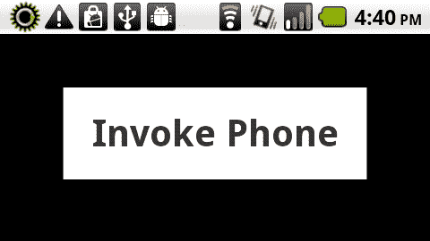

1.  我们现在将`Multitouch.inputMode`设置为通过`MultitouchInputMode.TOUCH_POINT`常量响应原始触摸事件。在`Sprite`按钮上注册一个类型为`TouchEvent.TOUCH_TAP`的事件监听器。这将检测用户发起的任何触摸点击事件，并调用一个名为`onTouchTap`的方法，其中包含我们剩余的逻辑：

    ```kt
    protected function registerListeners():void {
    Multitouch.inputMode = MultitouchInputMode.TOUCH_POINT;
    fauxButton.addEventListener(TouchEvent.TOUCH_TAP, onTouchTap);
    }

    ```

1.  当检测到一次触摸点击时，我们的`onTouchTap`方法将被触发，调用`navigateToURL`并传入一个包含`tel:` URI 前缀以及我们应用中想要拨打的电话号码的`URLRequest`：

    ```kt
    protected function onTouchTap(e:TouchEvent):void {
    navigateToURL(new URLRequest("tel:15555554385"));
    }

    ```

1.  当我们在设备上运行应用时，只需在按钮上简单触摸点击，就会调用本地电话应用，并显示我们指定的电话号码：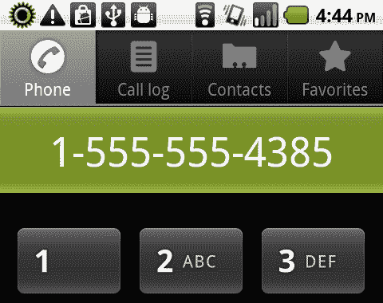

## 工作原理...

当我们的应用用户触摸点击我们创建的交互式`Sprite`时，他们会从我们的应用中跳转出来，进入默认的 Android 电话工具。这次调用还会提供一个电话号码，这是通过`navigateToURL`方法传递带有`tel:` URI 前缀的`URLRequest`来指定此通话的。

# 从应用中发送短信

在 Android 上使用 Flash，我们有能力通过`flash.net`包中的类根据用户交互调用原生的 Android 短信工具。不幸的是，我们无法为短信提供任何内容。在 Android 上，由于所有应用程序都占用一个完整的窗口，因此我们必须特别留意这可能会在用户与我们的应用程序交互时造成任何干扰。

## 如何操作...

应用程序调用`navigateToURL`并传入带有正确`sms:` URI 前缀的新`URLRequest`将打开默认的短信工具，并加载指定的电话号码，准备好发短信。在这个例子中，我们将在检测到`TOUCH_TAP`事件时执行此操作：

1.  首先，将以下类导入到你的项目中：

    ```kt
    import flash.display.Sprite;
    import flash.display.StageAlign;
    import flash.display.StageScaleMode;
    import flash.events.TouchEvent;
    import flash.text.TextField;
    import flash.text.TextFormat;
    import flash.net.navigateToURL;
    import flash.net.URLRequest;
    import flash.ui.Multitouch;
    import flash.ui.MultitouchInputMode;

    ```

1.  我们现在将声明一个`Sprite`作为我们的交互元素，以及一个`TextField`和`TextFormat`对作为按钮标签：

    ```kt
    private var fauxButton:Sprite;
    private var traceField:TextField;
    private var traceFormat:TextFormat;

    ```

1.  现在，我们将继续设置我们的`TextField`，应用一个`TextFormat`对象，并使用图形 API 构建一个带有简单背景填充的`Sprite`。我们按钮构建的最后一步是将`TextField`添加到我们的`Sprite`中，然后将`Sprite`添加到`DisplayList`中。在这里，我们创建了一个方法来执行所有这些操作，并进行一些风格上的增强：

    ```kt
    protected function setupTextButton():void {
    traceFormat = new TextFormat();
    traceFormat.bold = true;
    traceFormat.font = "_sans";
    traceFormat.size = 42;
    traceFormat.align = "center";
    traceFormat.color = 0x333333;
    traceField = new TextField();
    traceField.defaultTextFormat = traceFormat;
    traceField.autoSize = "left";
    traceField.selectable = false;
    traceField.mouseEnabled = false;
    traceField.text = "Invoke SMS";
    traceField.x = 30;
    traceField.y = 25;
    fauxButton = new Sprite();
    fauxButton.addChild(traceField);
    fauxButton.graphics.beginFill(0xFFFFFF, 1);
    fauxButton.graphics.drawRect(0, 0, traceField.width+60, traceField.height+50);
    fauxButton.graphics.endFill();
    fauxButton.x = (stage.stageWidth/2) - (fauxButton.width/2);
    fauxButton.y = 60;
    addChild(fauxButton);
    }

    ```

1.  如果我们现在在设备上运行应用程序，交互式`Sprite`应该如下所示：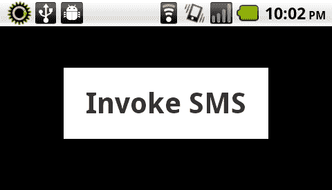

1.  我们现在将`Multitouch.inputMode`设置为通过常量`MultitouchInputMode.TOUCH_POINT`响应原始触摸事件。在`Sprite`按钮上注册一个类型为`TouchEvent.TOUCH_TAP`的事件监听器。这将检测用户发起的任何触摸点击事件，并调用名为`onTouchTap`的方法，其中包含我们的其余逻辑：

    ```kt
    protected function registerListeners():void {
    Multitouch.inputMode = MultitouchInputMode.TOUCH_POINT;
    fauxButton.addEventListener(TouchEvent.TOUCH_TAP, onTouchTap);
    }

    ```

1.  一旦检测到触摸点击，我们的`onTouchTap`方法将被触发，调用`navigateToURL`，并传入一个包含`tel:` URI 前缀以及我们想要从应用程序中拨打的电话号码的`URLRequest`：

    ```kt
    protected function onTouchTap(e:TouchEvent):void {
    navigateToURL(new URLRequest("sms:15555554385"));
    }

    ```

1.  在此阶段，我们将失去应用程序焦点，并显示 Android 短信工具，预先填充了我们想要的电话号码，并准备好撰写短信：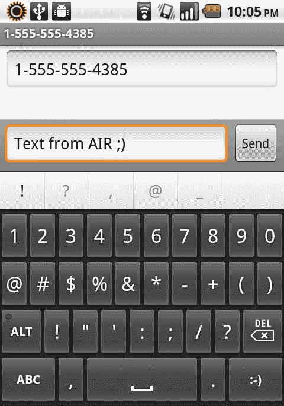

1.  最后，当我们点击**发送**，我们的短信将通过使用的电话号码发送给指定的收件人。在这个例子中，当然这不是一个真实的电话号码：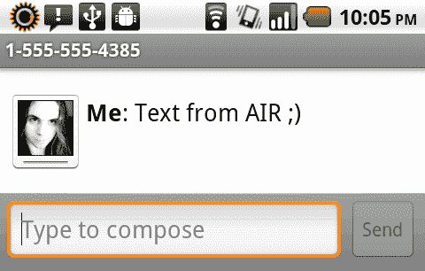

## 工作原理...

当我们的应用程序用户触摸点击我们创建的交互式`Sprite`时，他们会从我们的应用程序中退出，进入默认的 Android 短信工具。这次调用还提供了一个电话号码，这是通过`navigateToURL`方法传递带有`sms:` URI 前缀的`URLRequest`分配给这条短信的。这样，我们就可以轻松地让应用程序用户访问电话号码发短信，而无需他们输入数字序列。

# 从应用程序中调用谷歌地图

由于大多数安卓设备都是移动设备，开发者和用户都期望能够使用某种类型的地图。安卓操作系统由谷歌管理，该公司在网页上拥有悠久的优秀地图技术历史。这对于开发者来说非常棒，因为我们可以在安卓上的非常酷的地图应用程序上搭便车，并从我们的应用程序中传入各种坐标。

## 如何操作...

让应用程序检测设备的地理坐标，调用`navigateToURL`，并传入一个格式正确的 URL 的`URLRequest`以访问安卓地图应用程序：

1.  首先，将以下类导入到你的项目中：

    ```kt
    import flash.display.Sprite;
    import flash.display.StageAlign;
    import flash.display.StageScaleMode;
    import flash.events.TouchEvent;
    import flash.events.GeolocationEvent;
    import flash.text.TextField;
    import flash.text.TextFormat;
    import flash.net.navigateToURL;
    import flash.net.URLRequest;
    import flash.ui.Multitouch;
    import flash.ui.MultitouchInputMode;
    import flash.sensors.Geolocation;

    ```

1.  我们现在将声明一个`Sprite`作为我们的交互元素，以及一个`TextField`和`TextFormat`对作为按钮标签。我们将使用`Geolocation` API，因此为此目的声明一个对象，以及用于保存纬度和经度数据值的`Number`变量：

    ```kt
    private var fauxButton:Sprite;
    private var traceField:TextField;
    private var traceFormat:TextFormat;
    private var geo:Geolocation;
    private var longitude:Number;
    private var latitude:Number;

    ```

1.  现在，我们继续设置我们的`TextField`，应用一个`TextFormat`对象，并使用图形 API 构建一个带有简单背景填充的`Sprite`。构建按钮的最后一步是将`TextField`添加到我们的`Sprite`中，然后将`Sprite`添加到`DisplayList`中。在这里，我们创建一个方法来执行所有这些操作，并进行一些风格上的增强：

    ```kt
    protected function setupTextButton():void {
    traceFormat = new TextFormat();
    traceFormat.bold = true;
    traceFormat.font = "_sans";
    traceFormat.size = 42;
    traceFormat.align = "center";
    traceFormat.color = 0x333333;
    traceField = new TextField();
    traceField.defaultTextFormat = traceFormat;
    traceField.autoSize = "left";
    traceField.selectable = false;
    traceField.mouseEnabled = false;
    traceField.text = "Invoke Maps";
    traceField.x = 30;
    traceField.y = 25;
    fauxButton = new Sprite();
    fauxButton.addChild(traceField);
    fauxButton.graphics.beginFill(0xFFFFFF, 1);
    fauxButton.graphics.drawRect(0, 0, traceField.width+60, traceField.height+50);
    applicationGoogle maps, invokingfauxButton.graphics.endFill();
    fauxButton.x = (stage.stageWidth/2) - (fauxButton.width/2);
    fauxButton.y = 60;
    addChild(fauxButton);
    }

    ```

1.  如果我们现在在设备上运行应用程序，交互式`Sprite`应该会如以下截图所示显示：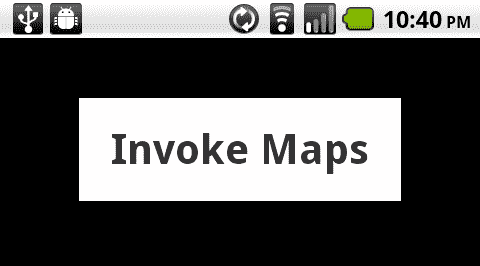

1.  我们现在将`Multitouch.inputMode`设置为通过`MultitouchInputMode.TOUCH_POINT`常量响应原始触摸事件。在`Sprite`按钮上注册一个类型为`TouchEvent.TOUCH_TAP`的事件监听器。这将检测用户发起的任何触摸点击事件，并调用一个名为`onTouchTap`的方法，其中包含我们剩余的逻辑：

    ```kt
    protected function registerListeners():void {
    Multitouch.inputMode = MultitouchInputMode.TOUCH_POINT;
    fauxButton.addEventListener(TouchEvent.TOUCH_TAP, onTouchTap);
    }

    ```

1.  在检测到触摸点击事件时，我们将设置一个`Geolocation`对象，并为它分配一个事件监听器，专门监听`GeolocationEvent.UPDATE`事件。我们将不再需要监听`TouchEvent.TOUCH_TAP`事件，因此可以移除它以允许垃圾回收：

    ```kt
    protected function onTouchTap(e:TouchEvent):void {
    fauxButton.removeEventListener(TouchEvent.TOUCH_TAP, onTouchTap);
    geo = newGeolocation();
    geo.addEventListener(GeolocationEvent.UPDATE, onGeoEvent);
    }

    ```

1.  一旦收集到`Geolocation`数据并将其报告回我们的应用程序，`onGeoEvent`方法将会触发，为我们提供需要传入到原生安卓地图应用程序的`longitude`和`latitude`数据。

1.  为了完成我们的流程，我们将调用`navigateToURL`，并传入一个包含`http://maps.google.com/` URL 的`URLRequest`，后面跟着一个查询字符串，其中包含来自我们的`Geolocation`更新事件数据的`latitude`和`longitude`值。既然我们现在有了所需的所有数据，可以移除`GeolocationEvent.UPDATE`事件监听器：

    ```kt
    protected function onGeoEvent(e:GeolocationEvent):void {
    geo.removeEventListener(GeolocationEvent.UPDATE, onGeoEvent);
    longitude = e.longitude;
    latitude = e.latitude;
    navigateToURL(new URLRequest("http://maps.google.com/?q="+ String(latitude)+", "+String(longitude)));
    }

    ```

1.  由于此示例中使用的 URI 前缀仅为 `http://`，因此一个模型对话框将出现在我们的应用程序上方，询问我们是否希望使用 **浏览器** 或 **地图** 应用程序打开 `URLRequest`。我们将选择 **地图**。勾选 **默认使用此操作** 复选框将防止将来出现此对话框：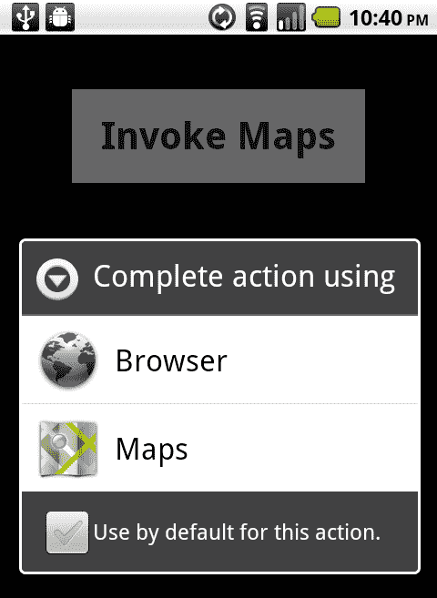

1.  最后，**地图** 应用程序将出现，并根据我们应用程序能够检测到的纬度和经度 Geolocation 坐标向用户展示视图：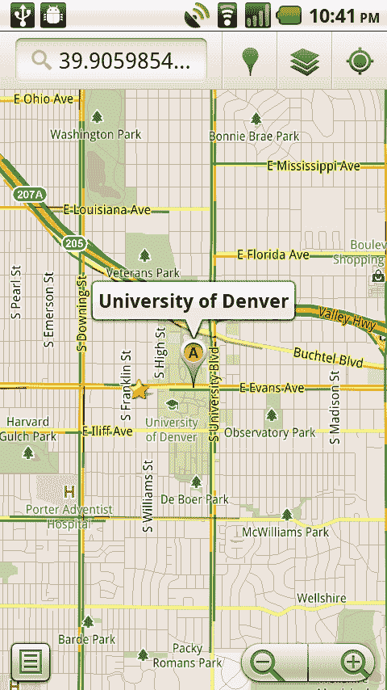

## 工作原理...

当我们应用程序的用户触摸点击我们创建的交互式 `Sprite` 时，我们会配置一个 `Geolocation` 对象来监听位置数据。一旦获取到这些数据，我们就可以通过 `navigateToURL` 方法传递带有 `http://` URI 前缀的 `URLRequest` 来召唤 `maps.google.com`。我们还添加了一个由收集的 `Geolocation` 纬度和经度数据形成的查询字符串，告诉 **地图** 应用程序在我们的地图上导航的确切坐标。

## 还有更多...

一种替代从设备传感器检测 `Geolocation` 数据的方法是在应用程序中存储各种坐标，然后向用户提供多个选择。这对于一个专门的餐厅应用程序很有用，例如，允许用户轻松在地图上查看位置。

# 使用应用程序 URI 调用 Android Market

Android Market 是 Android 平台独有的，有一个专门的应用程序，允许用户轻松搜索、查找并安装设备上的应用程序。Android 允许开发者通过传递特定的搜索词来利用 Market 应用程序。

## 如何操作...

我们将构建一个小应用程序来调用 `navigateToURL` 函数，并通过带有 `market:` URI 前缀的 `URLRequest` 对象传递一个预定义的搜索词。这将打开 Android Market 应用程序，并让它为我们执行搜索。在这个例子中，一旦检测到 `TOUCH_TAP` 事件，我们将打开一个新的请求：

1.  首先，将以下类导入到您的项目中：

    ```kt
    import flash.display.Sprite;
    import flash.display.StageAlign;
    import flash.display.StageScaleMode;
    import flash.events.TouchEvent;
    import flash.text.TextField;
    import flash.text.TextFormat;
    import flash.net.navigateToURL;
    import flash.net.URLRequest;
    import flash.ui.Multitouch;
    import flash.ui.MultitouchInputMode;

    ```

1.  我们现在将声明一个 `Sprite` 作为我们的交互元素，以及一个 `TextField` 和 `TextFormat` 对，作为按钮标签：

    ```kt
    private var fauxButton:Sprite;
    private var traceField:TextField;
    private var traceFormat:TextFormat;

    ```

1.  现在，我们继续设置我们的 `TextField`，应用一个 `TextFormat` 对象，并使用图形 API 构造一个具有简单背景填充的 `Sprite`。按钮构建的最后一步是将 `TextField` 添加到我们的 `Sprite` 中，然后将 `Sprite` 添加到 `DisplayList` 中。这里，我们创建了一个方法来执行所有这些操作，并进行一些样式增强：

    ```kt
    protected function setupTextButton():void {
    traceFormat = new TextFormat();
    traceFormat.bold = true;
    traceFormat.font = "_sans";
    traceFormat.size = 42;
    traceFormat.align = "center";
    traceFormat.color = 0x333333;
    traceField = new TextField();
    traceField.defaultTextFormat = traceFormat;
    traceField.autoSize = "left";
    traceField.selectable = false;
    traceField.mouseEnabled = false;
    traceField.text = "Invoke Market";
    traceField.x = 30;
    traceField.y = 25;
    fauxButton = new Sprite();
    fauxButton.addChild(traceField);
    fauxButton.graphics.beginFill(0xFFFFFF, 1);
    fauxButton.graphics.drawRect(0, 0, traceField.width+60, traceField.height+50);
    fauxButton.graphics.endFill();
    fauxButton.x = (stage.stageWidth/2) - (fauxButton.width/2);
    fauxButton.y = 60;
    addChild(fauxButton);
    }

    ```

1.  如果我们现在在设备上运行应用程序，交互式 `Sprite` 应该如以下屏幕截图所示出现：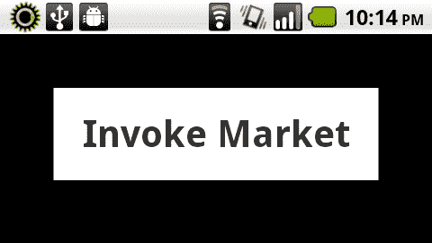

1.  现在，我们将`Multitouch.inputMode`设置为通过`MultitouchInputMode.TOUCH_POINT`常量响应原始触摸事件。在`Sprite`按钮上注册一个类型为`TouchEvent.TOUCH_TAP`的事件监听器。这将检测用户发起的任何触摸点击事件，并调用名为`onTouchTap`的方法，该方法包含我们的其余逻辑。

    ```kt
    protected function registerListeners():void {
    Multitouch.inputMode = MultitouchInputMode.TOUCH_POINT;
    fauxButton.addEventListener(TouchEvent.TOUCH_TAP, onTouchTap);
    }

    ```

1.  一旦检测到触摸点击，我们的`onTouchTap`方法将被触发，调用`navigateToURL`并传入带有`market:` URI 前缀的`URLRequest`，其中包含我们希望应用程序针对市场库存执行的搜索词：

    ```kt
    protected function onTouchTap(e:TouchEvent):void {
    navigateToURL(new URLRequest("market://search?q=Fractured Vision Media, LLC"));
    }

    ```

1.  当我们在设备上运行应用程序时，只需点击按钮，就会调用安卓市场应用程序，并针对我们传递的搜索词进行搜索：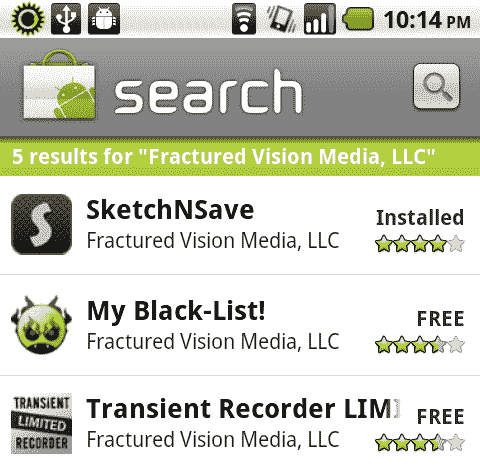

## 工作原理...

当我们的应用程序用户触摸点击我们所创建的交互式`Sprite`时，他们会从我们的应用程序中被带到安卓市场应用程序中，在那里会立即针对我们请求中指定的搜索词进行搜索。安卓市场应用程序会向用户展示当前库存中找到的所有应用程序。例如，传入我们应用程序的确切标题，将允许用户在应用程序内手动检查更新。传入我们的公司或开发者名称，则会显示我们提供给用户浏览的所有应用程序。

如果需要更具体的信息，还可以执行其他搜索查询。

要搜索特定的应用程序，我们可以使用以下格式：

```kt
navigateToURL(new URLRequest("market://search?q=pname:air.com.fracturedvisionmedia.SketchNSave"));v

```

要搜索特定的发布者，我们使用以下格式（注意我们在查询字符串中使用反斜杠"\"字符来转义引号）：

```kt
navigateToURL(new URLRequest("market://search?q=pub:\"Fractured Vision Media, LLC\""));

```

# 从应用程序发送电子邮件

类似于桌面 Flash 和 AIR 应用程序，基于用户交互，可以通过`flash.net`包中的类调用默认的系统电子邮件客户端。在 Android 上，由于所有应用程序都占用整个窗口，我们必须特别留意这可能会在用户与我们的应用程序交互时造成干扰。

## 如何操作...

当应用程序调用`navigateToURL`并通过带有`mailto:` URI 前缀的新`URLRequest`传递电子邮件地址时，将打开默认的电子邮件工具。在这个例子中，一旦检测到`TOUCH_TAP`事件，我们就会打开一封新的电子邮件：

1.  首先，将以下类导入到您的项目中：

    ```kt
    import flash.display.Sprite;
    import flash.display.StageAlign;
    import flash.display.StageScaleMode;
    import flash.events.TouchEvent;
    import flash.text.TextField;
    import flash.text.TextFormat;
    import flash.net.navigateToURL;
    import flash.net.URLRequest;
    import flash.ui.Multitouch;
    import flash.ui.MultitouchInputMode;

    ```

1.  我们现在将声明一个`Sprite`作为我们的交互元素，以及一个`TextField`和`TextFormat`对，作为按钮标签：

    ```kt
    private var fauxButton:Sprite;
    private var traceField:TextField;
    private var traceFormat:TextFormat;

    ```

1.  现在，我们将继续设置我们的`TextField`，应用一个`TextFormat`对象，并使用图形 API 构建一个具有简单背景填充的`Sprite`。我们按钮构建的最后一步是将`TextField`添加到我们的`Sprite`中，然后将`Sprite`添加到`DisplayList`。在这里，我们创建了一个方法来执行所有这些操作，并进行一些风格上的增强：

    ```kt
    protected function setupTextButton():void {
    traceFormat = new TextFormat();
    traceFormat.bold = true;
    traceFormat.font = "_sans";
    traceFormat.size = 42;
    traceFormat.align = "center";
    traceFormat.color = 0x333333;
    traceField = new TextField();
    traceField.defaultTextFormat = traceFormat;
    traceField.autoSize = "left";
    traceField.selectable = false;
    traceField.mouseEnabled = false;
    traceField.text = "Invoke Email";
    traceField.x = 30;
    applicatione-mail, sending fromtraceField.y = 25;
    fauxButton = new Sprite();
    fauxButton.addChild(traceField);
    fauxButton.graphics.beginFill(0xFFFFFF, 1);
    fauxButton.graphics.drawRect(0, 0, traceField.width+60, traceField.height+50);
    fauxButton.graphics.endFill();
    fauxButton.x = (stage.stageWidth/2) - (fauxButton.width/2);
    fauxButton.y = 60;
    addChild(fauxButton);
    }

    ```

1.  如果我们现在在设备上运行应用程序，交互式`Sprite`应该如下所示：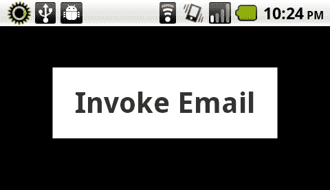

1.  我们现在将`Multitouch.inputMode`分配给通过`MultitouchInputMode.TOUCH_POINT`常量响应原始触摸事件。在`Sprite`按钮上注册一个类型为`TouchEvent.TOUCH_TAP`的事件监听器。这将检测用户发起的任何触摸点击事件，并调用一个名为`onTouchTap`的方法，其中包含我们的其余逻辑：

    ```kt
    protected function registerListeners():void {
    Multitouch.inputMode = MultitouchInputMode.TOUCH_POINT;
    fauxButton.addEventListener(TouchEvent.TOUCH_TAP, onTouchTap);
    }

    ```

1.  一旦检测到触摸点击，我们的`onTouchTap`方法将被触发，调用`navigateToURL`并传递带有`mailto:` URI 前缀的`URLRequest`，其中包含我们想要从应用程序中打开的电子邮件地址，如果需要，还可以包含一个主题参数：

    ```kt
    protected function onTouchTap(e:TouchEvent):void {
    navigateToURL(new URLRequest("mailto:info@fracturedvisionmedia. com?subject=Email%20From%20Adobe%20AIR%20on%20Android!"));
    }

    ```

1.  当我们在设备上运行应用程序时，只需简单地在按钮上触摸点击，就会调用本地电子邮件客户端，并用我们从应用程序传递的值填充它。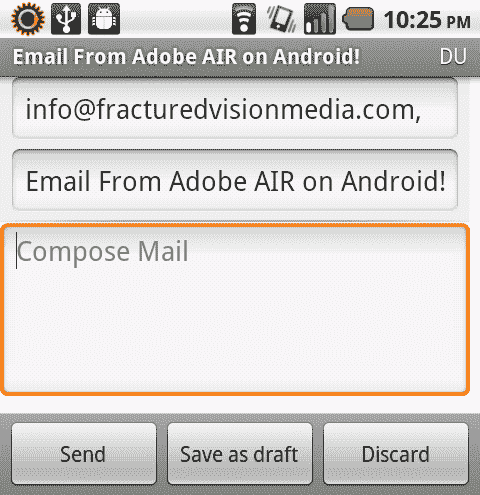

## 它是如何工作的...

当我们的应用程序用户触摸点击我们所创建的交互式`Sprite`时，他们会从我们的应用程序中被带出到默认的安卓电子邮件客户端。这是通过使用带有`mailto:` URI 前缀的`URLRequest`传递所需的电子邮件地址，并通过`navigateToURL`方法附加一系列参数来实现的，这与我们在桌面或网络应用程序中实现相同功能的方式非常相似。

## 还有更多...

当然，我们完全可以在内部处理电子邮件的应用程序中编写代码，就像在网页应用程序上一样。只要我们能够访问具有电子邮件功能的服务器，这对于某些应用程序来说可能是首选。
