# 第八章：丰富的访问：文件系统和本地数据库

本章将涵盖以下内容：

+   从设备存储中打开本地文件

+   将文件保存到设备存储

+   通过本地共享对象跨会话保存数据

+   使用 Flex 自动保存应用程序状态

+   创建本地 SQLite 数据库

+   提供默认的应用程序数据库

+   使用 FlexORM 自动化数据库任务

# 引言

许多文件系统属性在桌面和移动设备之间是共享的，但在处理应用程序状态保存以应对会话中断，或者简单地在会话之间保存数据时，Android 设备上有特定的使用场景。本章将介绍加载和保存单个文件、创建和管理本地数据库、处理本地共享对象以及使用移动 Flex 框架保存导航状态的技巧。

# 从设备存储中打开本地文件

通常，我们可能需要从应用程序存储或 Android 设备上的其他位置读取某些文件。在以下示例中，我们将对简单的文本文件执行此操作，但这也可用于读取各种文件，从图像数据到编码的`MP3`音频字节。

## 如何操作...

在应用程序中使用`flash.filesystem`包中的各种类来打开本地文件数据：

1.  首先，我们需要导入以下类：

    ```kt
    import flash.display.Sprite;
    import flash.display.StageAlign;
    import flash.display.StageScaleMode;
    import flash.events.Event;
    import flash.filesystem.File;
    import flash.filesystem.FileMode;
    import flash.filesystem.FileStream;
    import flash.text.TextField;
    import flash.text.TextFormat;

    ```

1.  我们现在开始定义一组在整个应用程序中使用的常量和变量。初始化一个`String`常量以保留文件路径，该路径将在示例中使用。我们还需要一个`File`和一个相应的`FileStream`以在应用程序中打开文本文件，以及一个`TextField`和`TextFormat`对作为我们的最终输出显示：

    ```kt
    private const PATH:String = "android.txt";
    private var file:File;
    private var stream:FileStream;
    private var traceField:TextField;
    private var traceFormat:TextFormat;

    ```

1.  现在，我们将继续设置我们的`TextField`，应用`TextFormat`，并将其添加到`DisplayList`中。这里，我们创建一个方法来执行所有这些操作：

    ```kt
    protected function setupTextField():void {
    traceFormat = new TextFormat();
    traceFormat.bold = true;
    traceFormat.font = "_sans";
    traceFormat.size = 24;
    traceFormat.align = "center";
    traceFormat.color = 0xCCCCCC;
    traceField = new TextField();
    traceField.defaultTextFormat = traceFormat;
    traceField.selectable = false;
    traceField.multiline = true;
    traceField.wordWrap = true;
    traceField.mouseEnabled = false;
    traceField.x = 20;
    traceField.y = 20;
    traceField.width = stage.stageWidth-40;
    traceField.height = stage.stageHeight-40;
    addChild(traceField);
    }

    ```

1.  实际上，为了在应用程序中打开文件，我们首先会实例化我们的`File`对象，并通过`File.applicationDirectory`将其分配给当前应用程序目录。然后，我们可以通过传递常量并使用`File.resolvePath()`方法指定该位置中的文件。

1.  此过程的第二部分涉及实例化一个`FileStream`，这将使我们能够执行余下的流程。在`FileStream`上注册一个类型为`Event.COMPLETE`的事件监听器。最后，调用`FileStream.openAsync()`，传入先前定义的`File`作为第一个参数，然后是`FileMode`。我们只是要读取这个文件的字节，因此使用`FileMode.READ`：

    ```kt
    protected function beginFileOpen():void {
    file = new File();
    file = File.applicationDirectory;
    file = file.resolvePath(path);
    stream = new FileStream();
    stream.addEventListener(Event.COMPLETE, fileOpened);
    stream.openAsync(file, FileMode.READ);
    }

    ```

1.  一旦`FileStream`完成了工作，我们的`fileOpened`方法将被触发，允许我们以纯文本（由`File.systemCharset`指定）读取`File`字节并将其分配给我们的`TextField`。每当我们完成与`FileStream`对象的操作时，我们必须调用它的`close()`方法：

    ```kt
    protected function fileOpened(e:Event):void {
    traceField.text = stream.readMultiByte(stream.bytesAvailable, File.systemCharset);
    stream.close();
    }

    ```

1.  当我们在设备上编译并运行应用程序时，它应该如下所示：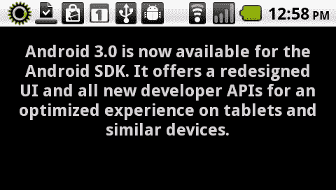

## 工作原理...

我们可以通过创建一个`File`引用，并通过`FileStream`打开该引用，在应用程序中打开一个文件。这个过程完成后，我们可以通过直接赋值或处理加载的字节来处理文件本身的内容。在这个例子中，我们读取文本文件的内容并将其输出到应用程序中的基本`TextField`。`FileStream`类有许多不同的方法和属性，可以更有效地用于不同类型的文件和处理过程。例如，我们在这里使用`FileStream.openAsync()`方法实际打开`FileStream`。我们同样也可以使用`FileStream.open()`方法，但使用`openAsync()`将允许我们使用事件监听器，以便我们可以自信地处理加载的数据。重要的是要阅读这些文档，并选择最适合您特定情况的操作。

我们可以使用`flash.filesystem.File`类的静态属性，快速访问各种存储位置。以下是这些属性的列表：

+   `File.applicationStorageDirectory:` 独特的应用程序存储目录[读写]

+   `File.applicationDirectory:` 应用程序安装目录[只读]

+   `File.desktopDirectory:` 映射到 SD 卡根目录[读写]

+   `File.documentsDirectory:` 映射到 SD 卡根目录[读写]

+   `File.userDirectory:` 映射到 SD 卡根目录[读写]

要全面了解`File`类，请参考 Adobe LiveDocs：

[`help.adobe.com/en_US/FlashPlatform/reference/actionscript/3/flash/filesystem/File.html`](http://help.adobe.com/en_US/FlashPlatform/reference/actionscript/3/flash/filesystem/File.html)

## 还有更多...

在这个例子中，我们打开了一个文本文件，但任何文件都可以以类似的方式打开和处理。然而，如果你没有良好的背景知识来了解这些文件是如何工作的，读取复杂文件类型的字节可能会非常困难，对于较大的文件，由于你可能对加载的字节执行了大量处理，在移动设备上这个过程可能会很慢。

# 将文件保存到设备存储

有多种方法可以将应用程序中的数据保存到本地设备存储中。音频、图像和文本数据都可以由用户创建，并保存到应用程序定义的位置，或者允许用户选择在 Android 设备中的特定位置保存文件。在这个例子中，我们将通过生成一个简单的文本文件来演示这一点。

## 如何操作...

我们将允许用户在我们的应用程序内选择基本文本文件的位置和名称，并将其保存到他们的 Android 设备上：

1.  首先，我们需要导入以下类：

    ```kt
    import flash.display.Sprite;
    import flash.display.StageAlign;
    import flash.display.StageScaleMode;
    import flash.events.Event;
    import flash.events.TouchEvent;
    import flash.filesystem.File;
    import flash.text.TextField;
    import flash.text.TextFormat;
    import flash.ui.Multitouch;
    import flash.ui.MultitouchInputMode;

    ```

1.  在这个应用程序中，我们需要声明多个对象。一个`String`常量将用于定义我们的文件名。接下来，我们声明一个`File`对象，最终用于将我们的文本文件保存到磁盘。一个`TextField`和`TextFormat`组合将把文本信息传递到设备显示上。最后，声明一个`Sprite`作为我们的交互元素，以及一个额外的`TextField`和`TextFormat`组合作为按钮标签：

    ```kt
    private const FILE_NAME:String = "airandroid.txt";
    private var file:File;
    private var traceField:TextField;
    private var traceFormat:TextFormat;
    private var fauxButton:Sprite;
    private var buttonField:TextField;
    private var buttonFormat:TextFormat;

    ```

1.  现在，我们将继续设置`TextField`，应用`TextFormat`，并将其添加到`DisplayList`中。这里，我们创建一个方法来为我们执行所有这些操作。确保将`TextField.type`设置为`input`，以允许用户输入！

    ```kt
    protected function setupTextField():void {
    traceFormat = new TextFormat();
    traceFormat.bold = true;
    traceFormat.font = "_sans";
    traceFormat.size = 44;
    traceFormat.align = "center";
    traceFormat.color = 0x000000;
    traceField = new TextField();
    traceField.defaultTextFormat = traceFormat;
    traceField.type = "input";
    traceField.border = true;
    traceField.multiline = true;
    traceField.wordWrap = true;
    traceField.background = true;
    traceField.border = true;
    traceField.x = 20;
    traceField.y = 20;
    traceField.width = stage.stageWidth-40;
    traceField.height = 250;
    addChild(traceField);
    }

    ```

1.  现在，我们将继续设置我们的`TextField`，应用一个`TextFormat`对象，并使用图形 API 构建一个带有简单背景填充的`Sprite`。我们按钮构建的最后一步是将`TextField`添加到我们的`Sprite`中，然后将`Sprite`添加到`DisplayList`中。这里，我们创建一个方法来为我们执行所有这些操作，并进行一些风格上的增强：

    ```kt
    protected function setupTextButton():void {
    buttonFormat = new TextFormat();
    buttonFormat.bold = true;
    buttonFormat.font = "_sans";
    buttonFormat.size = 42;
    buttonFormat.align = "center";
    buttonFormat.color = 0x333333;
    buttonField = new TextField();
    buttonField.defaultTextFormat = buttonFormat;
    buttonField.autoSize = "left";
    buttonField.selectable = false;
    buttonField.mouseEnabled = false;
    buttonField.text = "Save as File";
    buttonField.x = 30;
    buttonField.y = 25;
    fauxButton = new Sprite();
    fauxButton.addChild(buttonField);
    fauxButton.graphics.beginFill(0xFFFFFF, 1);
    fauxButton.graphics.drawRect(0, 0, buttonField.width+60, buttonField.height+50);
    fauxButton.graphics.endFill();
    fauxButton.x = (stage.stageWidth/2) (fauxButton.width/2);
    fauxButton.y = traceField.y+traceField.height+40;
    addChild(fauxButton);
    }

    ```

1.  如果我们运行应用程序，我们可以看到所有内容在显示上的布局情况。在这一点上，我们也可以自由编辑`TextField`，它作为我们文本文件的输入：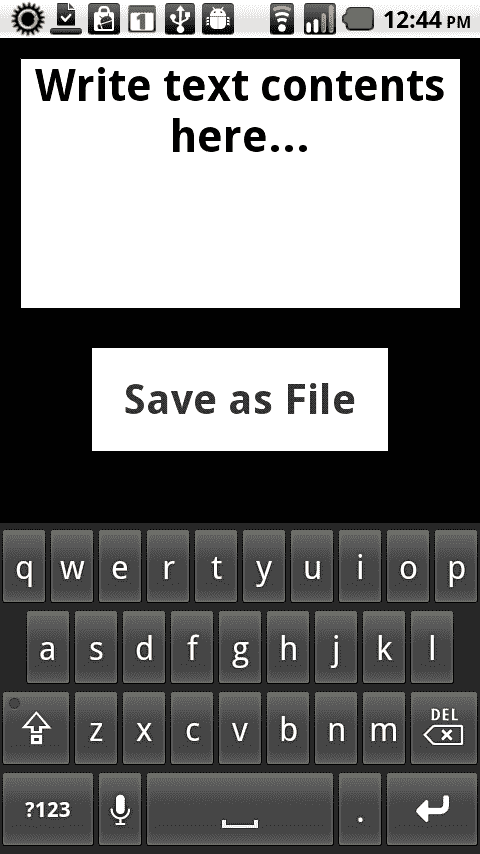

1.  我们现在将`Multitouch.inputMode`分配给通过`MultitouchInputMode.TOUCH_POINT`常量响应原始触摸事件。在`Sprite`按钮上注册一个类型为`TouchEvent.TOUCH_TAP`的事件监听器。这将检测用户发起的任何触摸轻触事件，并调用一个名为`onTouchTap`的方法，其中包含我们的其余逻辑：

    ```kt
    protected function registerListeners():void {
    Multitouch.inputMode = MultitouchInputMode.TOUCH_POINT;
    fauxButton.addEventListener(TouchEvent.TOUCH_TAP, onTouchTap);
    }

    ```

1.  当用户与应用程序交互并在按钮上轻触以将任何文本输入保存为文件时，将触发以下方法。在这个函数中，我们首先创建一个新的`File`对象，并在调用`File.save()`之前注册一个类型为`Event.COMPLETE`的事件监听器。`File.Save()`方法需要两个参数：要创建的文件内容以及文件名称：

    ```kt
    protected function onTouchTap(e:TouchEvent):void {
    file = new File();
    file.addEventListener(Event.COMPLETE, fileSaved);
    file.save(traceField.text, FILE_NAME);
    }

    ```

1.  一旦用户输入一些文本并点击按钮将其保存为文件，Android 将产生一个覆盖层，请求确认执行保存操作。此时，用户可以重命名文件或选择其他位置保存。默认情况下，文件保存在设备 SD 卡的根目录中。如果我们想避免保存对话框，可以采用`flash.filesystem.FileStream`类来实现：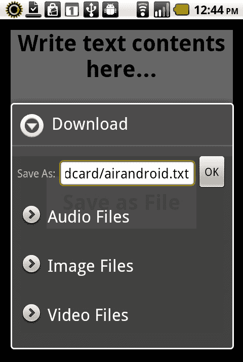

1.  保存成功完成后，我们可以移除事件监听器，清除输入的`TextField`并将按钮标签`TextField`更改为让用户知道一切已正确保存：

    ```kt
    protected function fileSaved(e:Event):void {
    fauxButton.removeEventListener(TouchEvent.TOUCH_TAP, onTouchTap);
    file.removeEventListener(Event.COMPLETE, fileSaved);
    traceField.text = "";
    buttonField.text = "File Saved!";
    }

    ```

1.  下图展示了用户在成功保存后将会看到的内容：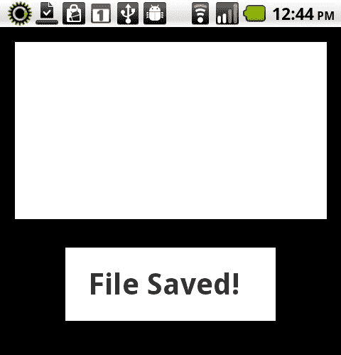

1.  用户现在可以使用文件浏览器或其他应用程序在默认的 Android 文本查看器中打开文本文件，如下面的截图所示：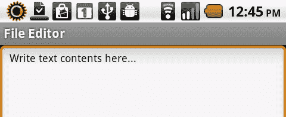

## 它是如何工作的...

将纯文本文件写入设备存储相当直接。这个过程涉及创建一个`File`对象，然后调用该对象的`save()`方法。使用此方法，我们传递要保存的文件内容以及所需的文件名。请注意，虽然在这种情况下我们传递的是简单文本，但我们也可以保存音频文件或图像形式的字节。如果我们需要对整个过程进行更多控制，我们还可以使用`FileStream`对象来设置各种编码，并以更多方式写入字节。使用`FileStream`还可以让我们将新信息追加到先前创建的文件中，并且避免了本例中出现的保存对话框。

## 还有更多...

您需要为任何写入本地文件的应用程序提供访问本地文件系统的权限，通过 Android 的清单文件进行设置。关于这方面的更多信息，请参见第九章，*清单保证：安全与 Android 权限。*

# 通过本地共享对象跨会话保存数据

共享对象在基于浏览器的 Flash 应用程序中已经使用了多年。它们有时被称为“Flash Cookies”或“超级 Cookies”，并提供与基于浏览器的普通 Cookies 类似的许多功能，但更适合 Flash 环境。通常，使用 Web 上的 Flash 应用程序保存此类数据需要明确的权限；然而，使用 AIR 使我们摆脱了这些限制中的许多。

## 如何操作...

创建一个本地`SharedObject`以在会话之间保存特定的应用程序数据。我们将使用一个交互式`Sprite`来直观地说明这一点：

1.  首先，我们需要导入以下类：

    ```kt
    import flash.display.Sprite;
    import flash.display.StageAlign;
    import flash.display.StageScaleMode;
    import flash.events.Event;
    import flash.events.TouchEvent;
    import flash.geom.Point;
    import flash.net.SharedObject;
    import flash.net.SharedObjectFlushStatus;
    import flash.text.TextField;
    import flash.text.TextFormat;
    import flash.ui.Multitouch;
    import flash.ui.MultitouchInputMode;

    ```

1.  然后，我们需要声明一些在此应用程序中使用的对象。声明一个 `SharedObject`，用于保存会话数据。`Point` 对象将用于将坐标写入 `SharedObject`。`Sprite` 将作为用户交互元素和此示例的视觉参考。最后，声明一个 `TextField` 和 `TextFormat` 对，用于在设备显示屏上传递文本消息。

    ```kt
    private var airSO:SharedObject;
    private var ballPoint:Point;
    private var ball:Sprite;
    private var traceField:TextField;
    private var traceFormat:TextFormat;

    ```

1.  现在，我们将继续设置我们的 `TextField`，应用 `TextFormat`，并将其添加到 `DisplayList` 中。在这里，我们创建一个方法来执行所有这些操作：

    ```kt
    protected function setupTextField():void {
    traceFormat = new TextFormat();
    traceFormat.bold = true;
    traceFormat.font = "_sans";
    traceFormat.size = 24;
    traceFormat.align = "center";
    traceFormat.color = 0xCCCCCC;
    traceField = new TextField();
    traceField.defaultTextFormat = traceFormat;
    traceField.selectable = false;
    traceField.multiline = true;
    traceField.wordWrap = true;
    traceField.mouseEnabled = false;
    traceField.x = 20;
    traceField.y = 20;
    traceField.width = stage.stageWidth-40;
    traceField.height = stage.stageHeight-40;
    addChild(traceField);
    }

    ```

1.  我们需要设置一个交互式对象，让用户根据触摸移动它，这个对象的坐标最终将在应用程序会话之间保留。让我们使用图形 API 创建一个基本的圆形 `Sprite`。

    ```kt
    protected function setupBall():void {
    ball = new Sprite();
    ball.graphics.beginFill(0xFFFFFF);
    ball.graphics.drawCircle(0, 0, 60);
    ball.graphics.endFill();
    ball.x = stage.stageWidth/2;
    ball.y = 260;
    addChild(ball);
    }

    ```

1.  在深入这个示例之前，我们必须对我们声明的 `SharedObject` 执行一些操作。首先，在我们的 `SharedObject` 实例上调用 `SharedObject.getLocal("airandroid")`。如果存在名为 `airandroid` 的 `SharedObject`，这将读取它；如果 `SharedObject` 尚不存在，这个调用将为我们创建它。

1.  现在，我们可以检查 `SharedObjectdata` 属性中是否存在 `ballPoint` 对象。如果是这样，这意味着我们之前已经完成了一个会话，可以将 `ballPoint x` 和 `y` 属性赋给我们的 `ballSprite`。

    ```kt
    protected function setupSharedObject():void {
    airSO = SharedObject.getLocal("airandroid");
    if(airSO.data.ballPoint != undefined){
    ball.x = airSO.data.ballPoint.x;
    ball.y = airSO.data.ballPoint.y;
    traceField.text = "Existing Shared Object!";
    }else{
    traceField.text = "No Shared Object Found!";
    }
    }

    ```

1.  当我们第一次运行应用程序时，我们会被告知没有检测到共享对象，并且球被放置在默认位置：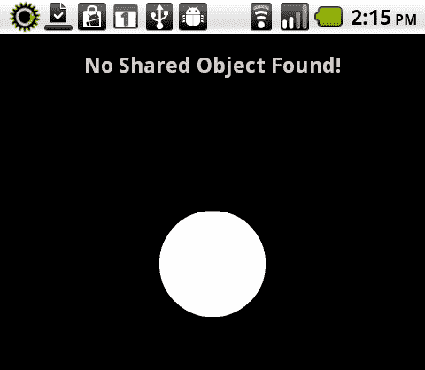

1.  我们现在将 `Multitouch.inputMode` 设置为通过 `MultitouchInputMode.TOUCH_POINT` 常量响应原始触摸事件。在圆形 `Sprite` 上注册两个类型为 `TouchEvent.TOUCH_MOVE` 和 `TouchEvent.TOUCH_END` 的事件监听器。这将检测用户发起的任何触摸事件，并调用特定方法来处理每一个。

    ```kt
    protected function registerListeners():void {
    Multitouch.inputMode = MultitouchInputMode.TOUCH_POINT;
    ball.addEventListener(TouchEvent.TOUCH_MOVE, onTouchMove);
    ball.addEventListener(TouchEvent.TOUCH_END, onTouchEnd);
    }

    ```

1.  当在我们的 `Sprite` 上检测到 `TouchEvent.TOUCH_MOVE` 事件时，`onTouchMove` 方法将被触发，使我们能够改变 `Sprite` 的 `x` 和 `y` 坐标，从而允许用户在 `Stage` 上拖动它。

    ```kt
    protected function onTouchMove(e:TouchEvent):void {
    ball.x = e.stageX;
    ball.y = e.stageY;
    }

    ```

1.  当我们的应用程序在 `Sprite` 对象上检测到 `TouchEvent.TOUCH_END` 事件时，我们将利用这个机会将 `Sprite x` 和 `y` 坐标包装在一个 `Point` 对象中，并将其赋值给我们的 `SharedObject`。为了执行这个操作，我们首先将 `Sprite` 坐标赋给我们的 `Point` 对象，然后将其赋给我们的 `SharedObjectdata` 属性。

1.  为了将 `SharedObject` 写入本地文件系统，我们必须调用 `SharedObject.flush()`。我们可以将 `flush()` 命令的返回值赋给一个 `String`，以便监控和响应其状态。在这个示例中，我们仅使用 switch/case 语句检查 `SharedObjectFlushStatus` 并在我们的 `TextField` 中写入一条消息，让用户知道正在发生的情况。

    ```kt
    protected function onTouchEnd(e:Event):void {
    ballPoint = new Point(ball.x, ball.y);
    airSO.data.ballPoint = ballPoint;
    var flushStatus:String;
    flushStatus = airSO.flush();
    if(flushStatus != null) {
    switch(flushStatus) {
    case SharedObjectFlushStatus.FLUSHED:
    traceField.text = "Ball location x:" + ball.x + "/y:" + ball.y + " saved!";
    break;
    default:
    traceField.text = "There was a problem :(";
    break;
    }
    }
    }

    ```

1.  用户现在可以通过触摸并移动球体来与球体互动。当用户停止与球体互动时，这些坐标会被保存到我们的本地共享对象中：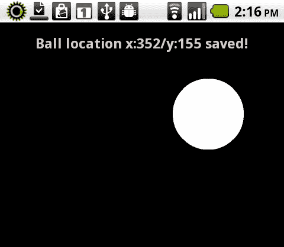

    ### 注意

    如果用户存在，并且在将来的某个时间再次打开应用程序，本地共享对象将被读取，并根据这些保留的数据重新定位球体。为了在设备上真正测试这一点，开发者需要使用 Android **设置**菜单下的应用程序管理功能来结束应用程序，或者使用第三方“任务杀手”以确保应用程序完全停止。

    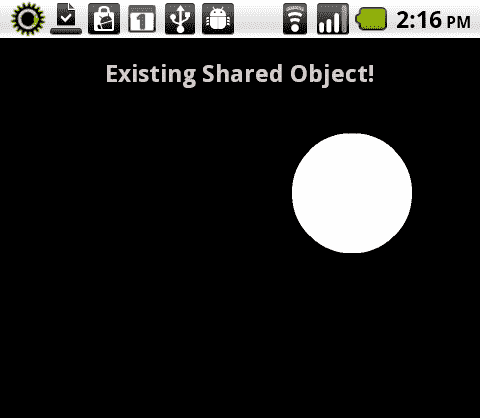

## 工作原理...

Flash 中的`SharedObject`与网络浏览器中使用的 cookie 实现非常相似。它最初在基于浏览器的 Flash 中实现，以便当开发人员希望跨用户会话保留小块数据时，能够提供类似的体验。幸运的是，这在 AIR 中同样有效，并可以作为我们 Android 应用程序中的简单存储使用。

要读取`SharedObject`，只需调用它的`getLocal()`方法，传入我们希望检索的`SharedObject`的名称。要保存`SharedObject`，我们为其分配新数据并调用`flush()`方法，该方法将把新信息保存到磁盘。

## 还有更多...

在这个实例中我们使用了一个本地`SharedObject`，但也可以根据需要将此类数据保存到本地或远程数据库、文本或 XML 文件，甚至使用远程`SharedObject`。

# 使用 Flex 自动存储应用程序状态

尽管很多时候我们需要在会话被其他设备功能（如来电）中断时存储特定的应用程序参数，但移动 Flex 框架确实提供了一定程度的会话保留，这可以自动为我们处理。

## 如何操作...

通过启用`persistNavigatorState`，指示 Flex 自动为我们保留应用程序状态：

1.  我们首先会创建一个新的移动 Flex 项目，其中包含两个视图，我们将其简称为`first`和`second`。初始的`ViewNavigatorApplication`文件将如下所示：

    ```kt
    <?xml version="1.0" encoding="utf-8"?>
    <s:ViewNavigatorApplication 
     firstView="views.first">
    </s:ViewNavigatorApplication>

    ```

1.  在我们的`first`视图中添加一个按钮，这将使我们能够从那里推送`second`视图：

    ```kt
    <s:Button label="Engage Second State" click="navigator.pushView(views.second);"/>

    ```

1.  在我们的`second`视图中添加一个按钮，允许我们返回到`first`视图。现在我们可以来回导航，构建我们的`ViewNavigator`历史记录：

    ```kt
    <s:Button label="Engage First State" click="navigator.pushView(views.first)"/>

    ```

1.  为了让 Flex 在会话被中断的情况下既保存我们的`ViewNavigator`历史记录，又保留我们在该历史记录中的当前位置，我们将修改`ViewNavigatorApplication`以包含一个名为`persistNavigatorState`的属性，并将其设置为`true`。我们还将声明一个`creationComplete`事件，它将调用一个名为`init()`的函数。我们将使用它来设置一些额外的功能：

    ```kt
    <?xml version="1.0" encoding="utf-8"?>
    <s:ViewNavigatorApplication 
     firstView="views.first"
    persistNavigatorState="true" creationComplete="init()">
    </s:ViewNavigatorApplication>

    ```

1.  在 MXML 中创建一个`Script`标签，并导入`FlexEvent`类：

    ```kt
    <fx:Script>
     <![CDATA[
     import mx.events.FlexEvent;
     ]]>
     </fx:Script>

    ```

1.  现在，我们必须声明我们的`init()`方法，该方法将在`creationComplete`时被调用。在这个方法中，我们将在应用程序上注册一个类型为`FlexEvent.NAVIGATOR_STATE_SAVING`的事件监听器：

    ```kt
    public function init():void {
    this.addEventListener(FlexEvent.NAVIGATOR_STATE_SAVING, stateSaving);
    }

    ```

1.  每当应用程序在退出时通过 Flex 持久化管理器开始保存应用程序状态时，我们的`stateSaving`方法将被触发，允许我们执行额外的操作，甚至可以在`FlexEvent`上调用`preventDefault()`，以便在退出之前让我们的逻辑接管。在开发和测试中，我们可以轻松在这个方法中设置断点，以便检查应用程序状态。

    ```kt
    protected function stateSaving(e:FlexEvent):void {
    // Interception Code
    }

    ```

1.  当我们编译并运行我们的应用程序时，它将显示在下个截图中所示的样子。从我们的第一个视图翻到第二个视图，并来回多次，将填充应用程序`ViewNavigator`的历史记录：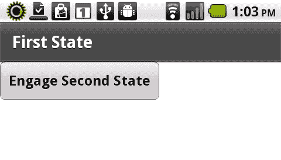

1.  如果应用程序会话被电话或其他事件中断，导航历史和当前视图将被保留。当再次运行应用程序时，用户将能够从中断发生的地方继续操作：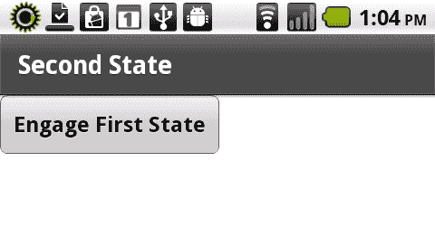

## 它的工作原理...

当使用移动 Flex 框架时，我们可以在应用程序中启用`persistNavigatorState`选项。这将自动保存我们的`ViewNavigator`历史记录，并记住在应用程序会话中断时我们正在交互的视图。它通过将会话信息保存到设备上的本地共享对象来实现这一点。保存的数据包括有关应用程序版本号、完整的导航堆栈和当前导航视图的信息。

此外，当应用程序开始退出时，我们可以拦截`FlexEvent.NAVIGATOR_STATE_SAVING`事件，并执行我们自己的期望操作，例如将关键应用程序数据保存到文件系统、本地共享对象，甚至是 SQLite 数据库。

# 创建本地 SQLite 数据库

Adobe AIR 从一开始就支持嵌入式 SQLite 数据库。这是我们在 Android 应用程序中存储结构化信息的最佳方式之一。SQLite 是一个软件库，它实现了一个自包含、无服务器、零配置、事务性的 SQL 数据库引擎。它创建的数据库文件就是单独的`.db`文件，可以通过网络传输、复制和删除，就像其他任何文件类型一样。

## 如何操作...

我们将创建一个带有本地 SQLite 数据库的移动应用程序，该程序可以使用 SQL 查询语言，允许用户添加新记录并基于这些条目运行简单查询：

1.  首先，导入这个示例所需的以下类：

    ```kt
    import flash.data.SQLConnection;
    import flash.data.SQLStatement;
    import flash.data.SQLResult;
    import flash.display.Sprite;
    import flash.display.StageAlign;
    import flash.display.StageScaleMode;
    import flash.events.Event;
    import flash.events.TouchEvent;
    import flash.filesystem.File;
    import flash.text.TextField;
    import flash.text.TextFormat;
    import flash.ui.Multitouch;
    import flash.ui.MultitouchInputMode;

    ```

1.  我们需要声明一些在此应用程序中使用的对象。一个`SQLConnection`将允许我们与本地 SQLite 数据库进行交互。第一个`TextField`和`TextFormat`对将作为用户输入的输入字段。另一个`TextField`和`TextFormat`对将把文本信息传递到设备显示屏上。最后，声明一个`Sprite`作为我们的交互元素，以及一个最后的`TextField`和`TextFormat`对作为按钮标签：

    ```kt
    private var sqlConnection:SQLConnection;
    private var itemField:TextField;
    private var itemFormat:TextFormat;
    private var fauxButton:Sprite;
    private var buttonField:TextField;
    private var buttonFormat:TextFormat;
    private var traceField:TextField;
    private var traceFormat:TextFormat;

    ```

1.  现在，我们继续设置我们的`TextField`，应用一个`TextFormat`，并将其添加到`DisplayList`中。这里，我们创建一个方法来执行所有这些操作。确保将`TextField.type`设置为`input`，以允许用户输入！

    ```kt
    protected function setupTextField():void {
    itemFormat = new TextFormat();
    itemFormat.bold = true;
    itemFormat.font = "_sans";
    itemFormat.size = 44;
    itemFormat.align = "center";
    itemFormat.color = 0x000000;
    itemField = new TextField();
    itemField.defaultTextFormat = itemFormat;
    itemField.type = "input";
    itemField.border = true;
    itemField.multiline = true;
    itemField.wordWrap = true;
    itemField.background = true;
    itemField.border = true;
    itemField.x = 20;
    itemField.y = 20;
    itemField.width = stage.stageWidth-40;
    itemField.height = 60;
    addChild(itemField);
    }

    ```

1.  对于我们的交互式`Sprite`，我们将设置一个`TextField`，应用一个`TextFormat`对象，并使用图形 API 构建一个具有简单背景填充的`Sprite`。构建按钮的最后一步是将`TextField`添加到我们的`Sprite`中，然后将`Sprite`添加到`DisplayList`中。这里，我们创建一个方法来执行所有这些操作，并进行一些样式增强：

    ```kt
    protected function setupTextButton():void {
    buttonFormat = new TextFormat();
    buttonFormat.bold = true;
    buttonFormat.font = "_sans";
    buttonFormat.size = 42;
    buttonFormat.align = "center";
    buttonFormat.color = 0x333333;
    buttonField = new TextField();
    buttonField.defaultTextFormat = buttonFormat;
    buttonField.autoSize = "left";
    buttonField.selectable = false;
    buttonField.mouseEnabled = false;
    buttonField.text = "Insert to DB";
    buttonField.x = 30;
    buttonField.y = 25;
    fauxButton = new Sprite();
    fauxButton.addChild(buttonField);
    fauxButton.graphics.beginFill(0xFFFFFF, 1);
    fauxButton.graphics.drawRect(0, 0, buttonField.width+60, buttonField.height+50);
    fauxButton.graphics.endFill();
    fauxButton.x = (stage.stageWidth/2) - (fauxButton.width/2);
    fauxButton.y = itemField.y+itemField.height+40;
    addChild(fauxButton);
    }

    ```

1.  我们最后的视觉元素包括另一个`TextField`和`TextFormat`对，用于在设备上显示数据库记录：

    ```kt
    protected function setupTraceField():void {
    traceFormat = new TextFormat();
    traceFormat.bold = true;
    traceFormat.font = "_sans";
    traceFormat.size = 24;
    traceFormat.align = "left";
    traceFormat.color = 0xCCCCCC;
    traceField = new TextField();
    traceField.defaultTextFormat = traceFormat;
    traceField.selectable = false;
    traceField.multiline = true;
    traceField.wordWrap = true;
    traceField.mouseEnabled = false;
    traceField.x = 20;
    traceField.y = fauxButton.y+fauxButton.height+40;
    traceField.width = stage.stageWidth-40;
    traceField.height =stage.stageHeight - traceField.y;
    addChild(traceField);
    }

    ```

1.  我们现在将`Multitouch.inputMode`分配为通过`MultitouchInputMode.TOUCH_POINT`常量响应原始触摸事件。在`Sprite`按钮上注册一个类型为`TouchEvent.TOUCH_TAP`的事件监听器。这将检测用户发起的任何触摸点击事件，并调用一个名为`onTouchTap`的方法来执行额外操作。

    ```kt
    protected function registerListeners():void {
    Multitouch.inputMode = MultitouchInputMode.TOUCH_POINT;
    fauxButton.addEventListener(TouchEvent.TOUCH_TAP, insertDBItem);
    }

    ```

1.  要创建应用程序数据库，我们首先需要初始化我们的`SQLConnection`对象，并将一个`File.db`引用传递给`SQLConnection.open()`方法以建立连接。如果数据库文件不存在，它将被自动创建。为了编写与数据库交互的 SQL 语法，我们必须初始化一个`SQLStatement`对象，并将我们建立的`SQLConnection`分配给`SQLStatement.sqlConnection`属性。此时，我们可以传入一个包含 SQL 语句的`String`到`SQLStatement.text`属性中，并调用`SQLConnection.execute()`实际执行语句。这个语法将在我们的数据库中创建一个包含两列`name`和`time`的表。如果表已经存在，该语句将被忽略：

    ```kt
    protected function createDB():void {
    sqlConnection = new SQLConnection();
    sqlConnection.open(File.applicationStorageDirectory. resolvePath("airandroid.db"));
    var sqlStatement:SQLStatement = new SQLStatement();
    sqlStatement.sqlConnection = sqlConnection;
    sqlStatement.text = "CREATE TABLE IF NOT EXISTS items (name TEXT, time TEXT)";
    sqlStatement.execute();
    getDBItems();
    }

    ```

1.  为了从数据库中检索现有记录，我们将再次初始化一个`SQLStatement`，并将已建立的`SQLConnection`分配给`SQLStatement.sqlConnection`属性。然后，我们会传入一个包含 SQL 语句的`String`到`SQLStatement.text`属性中，并调用`SQLConnection.execute()`从数据库中检索所有记录。

1.  要将返回的数据写入`TextField`，我们只需初始化一个新的`Array`来包含通过将`SQLStatement.getResult()`的`data`属性（它本身是一个`Array`）赋值给`Array`返回的记录。现在创建一个`for`循环来解析结果，将每条记录分配的各种属性输出到我们的`TextField`中。这将在 Android 设备上直观地展示查询结果：

    ```kt
    protected function getDBItems():void {
    traceField.text = "";
    var sqlStatement:SQLStatement = new SQLStatement();
    sqlStatement.sqlConnection = sqlConnection;
    sqlStatement.text = "SELECT * FROM items";
    sqlStatement.execute();
    var sqlArray:Array = new Array();
    var sqlResult:SQLResult = sqlStatement.getResult();
    if(sqlResult.data != null){
    sqlArray = sqlResult.data;
    }
    var itemCount:int = sqlArray.length;
    for(var i:int=0; i<itemCount; i++){
    traceField.appendText("NAME: " + sqlArray[i].name + "\n");
    traceField.appendText("DATE: " + sqlArray[i].time + "\n");
    traceField.appendText("\n");
    }
    }

    ```

1.  我们需要编写的最后一个方法是允许用户向数据库中插入记录。这大部分与我们之前两个方法中建立和执行`SQLStatement`对象的方式非常相似。然而，插入操作可能更加复杂和结构化，因此我们使用内置的`SQLStatement.parametersArray`来为我们的记录赋值。对于`name`值，我们从用户提供的输入`TextField`读取。为了生成一个时间戳来填充`time`的值，我们实例化一个新的`Date`对象并调用`toUTCString()`。执行这个完整形成的语句后，我们再次调用`getDBItems()`以返回新的数据库结果，让用户立即看到记录已被正确插入：

    ```kt
    protected function insertDBItem(e:TouchEvent):void {
    var date:Date = new Date();
    var sqlStatement:SQLStatement = new SQLStatement();
    sqlStatement.sqlConnection = sqlConnection;
    sqlStatement.text = "INSERT into items values(:name, :time)";
    sqlStatement.parameters[":name"] = itemField.text;
    sqlStatement.parameters[":time"] = date.toUTCString();
    sqlStatement.execute();
    getDBItems();
    itemField.text = "";
    }

    ```

1.  在我们的 Android 设备上运行应用程序，允许我们使用原生的虚拟键盘输入一个名字，并通过触摸点击**插入到数据库**按钮，这将在我们的数据库中创建一个由输入文本和当前时间戳组成的新条目。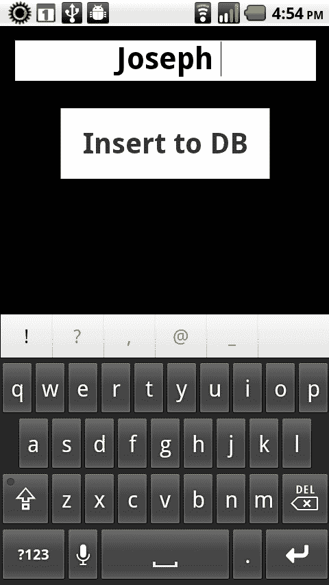

1.  每当我们向应用程序中输入一个新名字时，新条目就会被插入，并且会进行查询，将所有条目以及它们被插入时的时间戳输出到`TextField`中：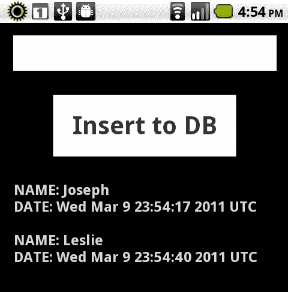

## 工作原理...

SQLite 是一个本地自包含的数据库，可以在 AIR for Android 应用程序中用于执行各种任务，从简单到复杂。为了使用这个功能，我们必须建立一个到设备上本地`.db`文件的`SQLConnection`。一旦建立这个连接，我们可以使用一组`SQLStatements`来执行表创建和管理任务，通过标准的 SQL 语法进行选择、插入和删除查询。在这个例子中，用户可以在应用程序存储目录下的数据库文件中插入记录并执行一般的选择查询。

在这个演示中，我们使用`flash.data.SQLStatement`来执行`INSERT`和`SELECT`操作。要进一步探索这一点以及相关类，我们请您参考 Adobe LiveDocs：

[`help.adobe.com/en_US/FlashPlatform/reference/actionscript/3/flash/data/SQLStatement.html`](http://help.adobe.com/en_US/FlashPlatform/reference/actionscript/3/flash/data/SQLStatement.html)

# 提供默认的应用程序数据库

允许用户直接或间接地向应用程序数据库中添加或删除项目，在多种场景下都非常有用。或许，我们希望用户从一个标准数据集开始操作，或者为用户提供一些默认设置以供日后操作？这些场景要求应用程序能够提供默认的数据库。在本教程中，我们将展示如何通过文件系统智能地处理这个问题。

## 准备工作...

在本教程中，我们将在应用程序目录中捆绑一个已经建立的 SQLite 数据库文件。如果您还没有可用的 SQLite 数据库文件，您可以使用本章中的其他教程来生成一个，或者使用任何一种可免费获得的机制来创建这些便携式的小型数据库文件。

## 如何操作...

我们将把一个默认的 SQLite 数据库与我们的应用程序打包在一起，检查是否存在用户定义的数据库，并在需要时向用户提供我们的默认数据库：

1.  首先，导入本示例所需以下类：

    ```kt
    import flash.data.SQLConnection;
    import flash.data.SQLStatement;
    import flash.display.Sprite;
    import flash.display.StageAlign;
    import flash.display.StageScaleMode;
    import flash.filesystem.File;
    import flash.text.TextField;
    import flash.text.TextFormat;

    ```

1.  在这个应用程序中，我们将需要声明几个对象。一个`SQLConnection`将允许我们与本地 SQLite 数据库交互，而`TextField`和`TextFormat`组合将把文本信息传递到设备显示屏上：

    ```kt
    private var sqlConnection:SQLConnection;
    private var traceField:TextField;
    private var traceFormat:TextFormat;

    ```

1.  现在，我们将设置我们的`TextField`，应用一个`TextFormat`，并将其添加到`DisplayList`中，同时进行一些风格上的增强。在这里，我们创建一个方法来执行所有这些操作：

    ```kt
    protected function setupTraceField():void {
    traceFormat = new TextFormat();
    traceFormat.bold = true;
    traceFormat.font = "_sans";
    traceFormat.size = 24;
    traceFormat.align = "left";
    traceFormat.color = 0xCCCCCC;
    traceField = new TextField();
    traceField.defaultTextFormat = traceFormat;
    traceField.selectable = false;
    traceField.multiline = true;
    traceField.wordWrap = true;
    traceField.mouseEnabled = false;
    traceField.x = 20;
    traceField.y = 20;
    traceField.width = stage.stageWidth-40;
    traceField.height = stage.stageHeight-40;
    addChild(traceField);
    }

    ```

1.  这个方法将在`TextField`建立后立即触发，因为我们将把复制过程中每一步完成的消息输出到这个视觉元素中。

1.  首先要确定应用程序数据库是否存在，这将决定我们是否需要复制默认数据库。为此，我们将实例化一个新的`File`对象，并引用应用程序安装目录中的名为`products.db`的文件。如果此文件不存在，我们必须创建另一个`File`对象，引用我们要复制文件到的文件名和位置。

1.  建立连接后，在源`File`上使用`File.copyTo()`方法，并传入目标`File`。如果一切顺利，现在应该在应用程序存储目录中有一个默认数据库的精确副本：

    ```kt
    protected function checkDefaultDB():void {
    traceField.appendText("Checking if DB exists...\n\n");
    var dbFile:File = File.applicationStorageDirectory;
    dbFile = dbFile.resolvePath("products.db");
    if(dbFile.exists){
    traceField.appendText("Application DB Okay!\n\n");
    }else{
    traceField.appendText("Application DB Missing!\n\n");
    traceField.appendText("Copying Default DB...\n\n");
    var sourceFile:File = File.applicationDirectory;
    sourceFile = sourceFile.resolvePath("default.db");
    var destination:File = File.applicationStorageDirectory;
    destination = destination.resolvePath("products.db");
    sourceFile.copyTo(destination, true);
    traceField.appendText("Database Copy Completed!\n\n");
    }
    connectDB();
    }

    ```

1.  要打开应用程序数据库，我们首先必须初始化我们的`SQLConnection`对象，并将`File.db`引用传递给`SQLConnection.open()`方法以建立连接。现在我们有了与新建复制的数据库的连接，我们调用`getDBItems()`方法来检索记录以供显示：

    ```kt
    protected function connectDB():void {
    sqlConnection = new SQLConnection();
    sqlConnection.open(File.applicationStorageDirectory. resolvePath("products.db"));
    getDBItems();
    }

    ```

1.  要从复制的数据库中检索所有记录，我们将初始化一个`SQLStatement`，并将建立的`SQLConnection`分配给`SQLStatement.sqlConnection`属性。然后，我们将 SQL 语句的`String`传递给`SQLStatement.text`属性，并调用`SQLConnection.execute()`从数据库中检索所有记录。

1.  要将返回的数据输出到`TextField`，我们只需初始化一个新的`Array`来包含返回的记录，通过将`SQLStatement.getResult()`的`data`属性（它本身是一个`Array`）分配给`Array`。现在创建一个`for`循环来解析结果，将每条记录分配的各种属性输出到我们的`TextField`。这将在 Android 设备上直观地显示查询结果。

    ```kt
    protected function getDBItems():void {
    traceField.appendText("Gathering items from application DB...\ n\n");
    var sqlStatement:SQLStatement = new SQLStatement();
    sqlStatement.sqlConnection = sqlConnection;
    sqlStatement.text = "SELECT * FROM Products";
    sqlStatement.execute();
    var sqlArray:Array = sqlStatement.getResult().data;
    var itemCount:int = sqlArray.length;
    traceField.appendText("Database Contains:\n");
    for(var i:int=0; i<itemCount; i++){
    traceField.appendText("PRODUCT: " + sqlArray[i].ProductName + "\n");
    }
    }

    ```

1.  应用程序首次运行时，在应用程序存储目录中找不到数据库。然后将默认数据库复制到预期位置，然后检索记录并显示给用户查看：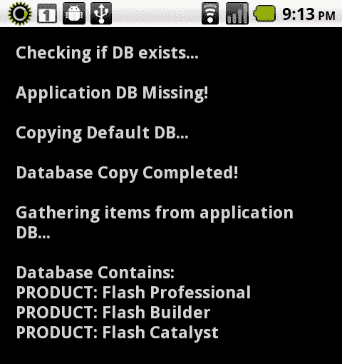

1.  如果用户后续运行此应用程序，数据库现在在预期位置，应用程序只需执行查询并显示记录，无需从一处位置复制文件到另一位置：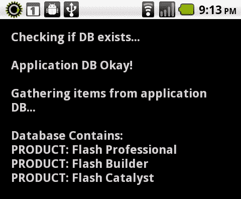

## 工作原理...

在此食谱中，我们使用`File`和`SQLConnection/SQLStatement`对象的组合来确定数据库是否存在，然后进行简单的查询和记录显示，或者使用`File.copyTo()`将文件从应用程序安装目录复制到应用程序存储目录的更复杂操作。此方法将复制作为初始参数传入的文件引用到指定位置。还有许多其他类似的文件操作方法。以下列出了一些这些方法：

+   `File.copyTo()：`将文件或目录复制到新位置

+   `File.moveTo()：`将文件或目录移动到新位置

+   `File.deleteFile()XE`"default application database:File.deleteFile()方法"：删除指定的文件

+   `File.createDirectory()：`创建目录以及所需的所有父目录

+   `File.deleteDirectory()：`删除指定的目录

要全面了解`File`类，请参考 Adobe LiveDocs：

[`help.adobe.com/en_US/FlashPlatform/reference/actionscript/3/flash/filesystem/File.html`](http://help.adobe.com/en_US/FlashPlatform/reference/actionscript/3/flash/filesystem/File.html)

数据库文件，仅仅是一个常规文件，可以通过 ActionScript 像其他任何文件一样轻松操作。但是，在这种情况下，了解应用程序是否有权限写入哪些目录是很重要的。例如，`File.applicationDirectory`是只读的。我们不能将文件写入此目录。

如果你需要一个工具来创建或管理 SQLite 数据库文件，你可能会对像 SQLite Database browser 这样的软件项目感兴趣，可以免费从[`sqlitebrowser.sourceforge.net/`](http://sqlitebrowser.sourceforge.net/)下载。

# 使用 FlexORM 自动化数据库任务

尽管我们确实可以通过支持的 SQLite 语法完全控制应用程序数据库，但有一些代码库可以使事情变得更容易。这样一个库叫做**FlexORM**，顾名思义，它只能在 Flex 项目中使用，因此纯 ActionScript 是不行的。

FlexORM 是一个对象关系映射框架，它避免了开发者在项目中编写任何数据库代码或 SQL。对象是持久的，任何数据库转换都由框架本身在幕后处理。

## 准备工作...

在准备这个应用程序示例时，你还需要采取一些额外的步骤来准备，因为涉及到获取 FlexORM 库并在项目中设置它的一些设置：

1.  首先，我们必须打开一个网络浏览器并前往[FlexORM 的项目页面](http://flexorm.riaforge.org/)。

1.  通过屏幕底部的`ZIP`包或通过 SVN 仓库下载文件。

1.  文件一旦在你的系统上，我们将想要导航到**trunk | flexorm | src**目录，并获取**src**下的所有内容。这是我们为了使用 FlexORM 而必须导入到 Flash Builder 中的包。

1.  创建一个新的移动 Flex 项目，并将文件从 Flex 项目**src**文件夹下的**src**拖拽过来。我们现在可以在我们的应用程序中使用**FlexORM**。

1.  你的项目将与下面截图显示的项目非常相似：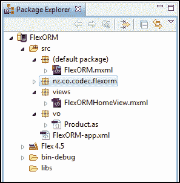

## 如何操作...

使用**FlexORM**框架，我们将定义一个持久对象结构，并通过一个简单的 Flex 移动项目管理对象条目的创建和删除：

1.  我们首先要在一个名为`vo` [值对象] 的包中创建一个名为`Product`的类。这将作为我们可绑定对象的声明，并且反映了我们将要从数据库中插入和读取的内容。使用特定于**FlexORM**的元数据，我们声明一个名为`Products`的表，其中有一个名为`id`的 ID 列和一个名为`ProductName`的附加列。这些对象作为我们实际表结构的接口，允许我们通过熟悉的面向对象范例来管理 SQL 命令：

    ```kt
    package vo {
    [Bindable]
    [Table(name="Products")]
    public class Product {
    [Id]public var id:int;
    [Column]public var ProductName:String;
    }
    }

    ```

1.  下一步将编写一个`ViewNavigatorApplication` MXML 文件作为我们的主应用程序文件。我们可以包含一个指向特定`View`的`firstView`属性，以及一个`applicationComplete`属性，它将调用一个初始化函数：

    ```kt
    <?xml version="1.0" encoding="utf-8"?>
    <s:ViewNavigatorApplication xmlns:fx= "http://ns.adobe.com/mxml/2009"
     firstView="views.FlexORMHomeView" applicationComplete="init()">
    </s:ViewNavigatorApplication>

    ```

1.  现在我们将声明一个`Script`块并执行一系列导入，这对于我们应用程序的这部分是必要的。我们从**FlexORM**只需要`EntityManager`。这是用于读取和写入我们数据库的内容。我们还必须导入与**FlexORM**一起使用的`vo`对象类以及用于保存产生的任何记录的`ArrayCollection`：

    ```kt
    <fx:Script>
    <![
    CDATA[
    import nz.co.codec.flexorm.EntityManager;
    import vo.Product;
    import mx.collections.ArrayCollection;
    ]]>
    </fx:Script>

    ```

1.  在这里，我们将实例化`EntityManager`和`ArrayCollection`以供应用程序使用。调用`EntityManager.getInstance()`将允许我们开始使用**FlexORM**：

    ```kt
    protected var entityManager:EntityManager = EntityManager.getInstance();
    [Bindable] public var productArrayCollection:ArrayCollection;

    ```

1.  我们必须定义在`ViewNavigatorApplication`标签中提到的初始化方法。在此方法内，使用`File`类引用要在应用程序存储目录中创建的数据库文件。创建一个新的`SQLConnection`，并用它打开先前定义的`File`引用。现在，可以将`SQLConnection`绑定到`EntityManager`的`sqlConnection`属性上，使我们能够使用**FlexORM**与数据库交互：

    ```kt
    protected function init():void {
    var databaseFile:File =
    File.applicationStorageDirectory.resolvePath("products.db");
    var connection:SQLConnection = new SQLConnection();
    connection.open(databaseFile);
    entityManager.sqlConnection = connection;
    loadProducts();
    }

    ```

1.  我们可以在任何时候调用此方法从数据库刷新我们的集合。只需在`EntityManager`上调用`findAll()`，并传入我们想要检索的类名，就可以从绑定到该类的表中返回所有记录：

    ```kt
    protected function loadProducts():void {
    productArrayCollection = entityManager.findAll(Product);
    productArrayCollection.refresh();
    }

    ```

1.  我们需要设置方法以插入和删除应用程序数据库中的记录。为了保存记录，我们会根据希望保存到的表创建一个基于类的对象。现在，我们将根据要为此插入写入值的字段为此类分配属性。在传入此对象的同时调用`EntityManager.save()`，将指示**FlexORM**在数据库中插入新记录：

    ```kt
    public function saveProduct(e:String):void {
    var ProductEntry:Product = new Product();
    ProductEntry.ProductName = e;
    entityManager.save(ProductEntry);
    loadProducts();
    }

    ```

1.  从数据库中删除记录同样简单。在传入集合中的对象时调用`EntityManager.remove()`，该对象与要从数据库中删除的特定记录相对应，这将确保**FlexORM**为我们删除真正的记录：

    ```kt
    public function deleteProduct(index:int):void {
    entityManager.remove(productArrayCollection.getItemAt(index));
    loadProducts();
    }

    ```

1.  现在构建我们的应用程序视图。创建一个新的`View` MXML 文件，并为其分配适合您特定项目视图的属性。在这种情况下，我们将其分配给带有一些宽大填充的`VerticalLayout`：

    ```kt
    <?xml version="1.0" encoding="utf-8"?>
    <s:View 
     title="Product Catalog">
    <s:layout>
    <s:VerticalLayout gap="20" paddingBottom="20" paddingLeft="20" paddingRight="20" paddingTop="20"/>
    </s:layout>
    </s:View>

    ```

1.  我们应用程序中用户可以与之交互的控件将包括一个用于输入的`TextInput`，一个用于提交的`Button`，以及一个用于显示我们所有数据库记录的`List`。我们将在按钮点击时调用一个名为`addProduct()`的函数，以及另一个名为`removeProduct()`的函数，该函数与我们的列表更改事件相关联。最后的修改是将我们的`ListdataProvider`绑定到主 MXML 文件中定义的`productArrayCollection`。

    ### 注意

    在此示例中，我们使用`parentApplication`作为方便。根据应用程序的结构，您可能不想这样做，因为它会在应用程序及其各个模块之间创建通常不希望的关系。

    ```kt
    <s:TextInput id="entry" width="100%"/>
    <s:Button click="addProduct(event)" width="100%" label="Insert New Product"/>
    <s:List id="productList" change="removeProduct(event)" dataProvider="{this.parentApplication.productArrayCollection}" labelField="ProductName" width="100%" height="100%"></s:List>

    ```

1.  创建一个`Script`块并导入我们的`List`变更事件正常触发所需的`IndexChangeEvent`类：

    ```kt
    <fx:Script>
    <![
    CDATA[
    import spark.events.IndexChangeEvent;
    ]]>
    </fx:Script>

    ```

1.  现在要做的只剩下创建一些本地函数，以便将信息传递给我们的主 MXML 文件，并执行本地清理任务。首先，我们为`Button`点击事件创建方法，该方法将数据传递给之前创建的`saveProduct()`方法。我们将输入的文本传递过去，然后清空`TextInput`以允许定义更多的记录：

    ```kt
    protected function addProduct(e:MouseEvent):void {
    this.parentApplication.saveProduct(entry.text);
    entry.text = "";
    }

    ```

1.  最后，编写一个函数来处理基于从`List`生成的变更事件删除记录。在`List`上检测到的任何索引变化都会将索引数据传递给之前创建的`deleteProduct()`方法。然后我们将`ListselectedIndex`设置为`-1`，表示没有选择任何项目：

    ```kt
    protected function removeProduct(e:IndexChangeEvent):void {
    this.parentApplication.deleteProduct(e.newIndex);
    productList.selectedIndex = -1;
    }

    ```

1.  当用户在设备上运行我们的应用程序时，他们能够通过原生的 Android 虚拟键盘输入数据。点击**插入新产品**按钮将把他们的信息添加到数据库中：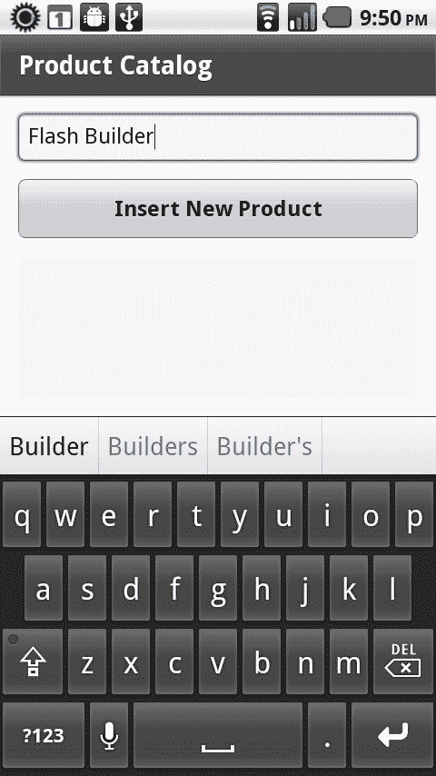

1.  用户将能够向数据库添加多条记录，并且它们会立即出现在`List`控件中。点击`List`中的某个项目将触发一个变更事件，从而相应地从应用程序数据库中删除对应的记录：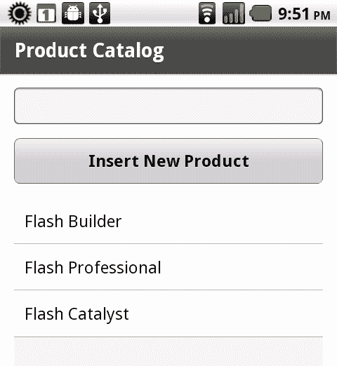

## 它的工作原理...

FlexORM 需要一些初始设置，以便在开发应用程序时以对我们有利的方式运行该框架，但一旦一切就绪，对于不那么复杂的数据库，它可以节省大量的时间。而 SQL 在语法或使用上与 ActionScript 完全不同。FlexORM 提供了一个接口，通过这个接口我们可以以面向对象的方式管理数据库记录，使用的语言与我们的应用程序其余部分使用的 ActionScript 相同！

## 还有更多...

FlexORM 对于简单的交易非常适用，但它并不完全支持 SQLite 提供的所有功能。例如，我们不能使用 FlexORM 创建和管理加密的数据库。对于这类特定活动，最好手写查询语句。
