# 第九章：清单保障：安全与 Android 权限

本章节将涵盖以下内容：

+   使用 Android Manifest 文件设置应用程序权限

+   防止设备屏幕变暗

+   建立 Android 自定义 URI 方案

+   预期 Android 兼容性筛选

+   指导应用程序安装到设备 SD 卡

+   加密本地 SQLite 数据库

# 引言

Android 有一个非常特定的权限和安全系统，基于清单文件声明，允许或限制应用程序访问各种设备功能。本章将详细介绍如何为你的 Flash 平台应用程序正确识别所需权限，以便利用 Android 市场筛选，应用本地应用程序数据库加密，以及其他有用的技巧！

# 使用 Android Manifest 文件设置应用程序权限

当用户选择在 Android 上安装应用程序时，他们总会收到关于应用程序将在其系统中拥有哪些权限的警告。从互联网访问到完整的地理位置、相机或外部存储权限；用户会明确知道应用程序在他们的系统上会拥有哪些权利。如果看起来应用程序请求的权限比实际需要的多，用户通常会拒绝安装并寻找其他可以完成所需任务的应用程序。只请求应用程序真正需要的权限非常重要，否则用户可能会对你和你提供的应用程序产生怀疑。

## 如何操作...

我们可以通过三种方式修改`Android Manifest`文件，为使用 Adobe AIR 编译应用程序时设置应用权限。

### 使用 Flash Professional：

在 AIR for Android 项目中，打开**属性**面板，点击**播放器**选择旁边的扳手图标：

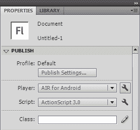

将会出现**Android 的 AIR 设置**对话框窗口。你将看到一个权限列表，可以选择为你的应用程序启用或禁用。只选中你的应用程序需要的权限，完成后点击**确定**。

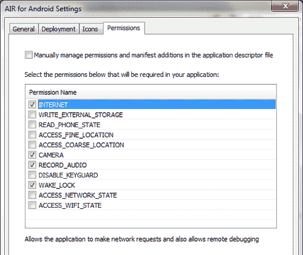

### 使用 Flash Builder：

1.  在 Flash Builder 中首次设置你的 AIR for Android 项目时，在**项目位置**区域定义所需的一切，然后点击**下一步**。

1.  你现在处于**新建 Flex 移动项目**对话框的**移动设置**区域。点击**权限**标签，确保已选择**Google Android**作为平台。你将看到一个权限列表，可以选择为你的应用程序启用或禁用。只选中你的应用程序需要的权限，然后继续你的项目设置：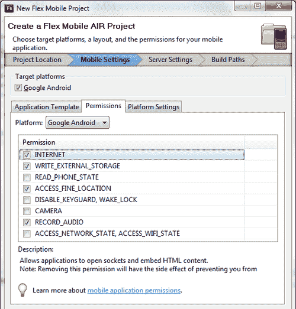

1.  在开始开发应用程序后，若要修改这些权限，只需打开 AIR 描述文件，按照下面几节的详细说明进行编辑。

### 使用简单的文本编辑器：

1.  在你的项目中找到 AIR 描述文件。它通常被命名为类似`{MyProject}-app.xml`的名称，位于项目根目录。

1.  浏览文件，寻找名为`<android>`的节点，在这个节点内会有一个名为`<manifestAdditions>`的节点，它包含一个名为`<manifest>`的子节点。本文档的这一部分包含了我们为 Android 应用程序设置权限所需的一切。

1.  我们需要做的就是注释掉或移除那些应用程序不需要的特定权限。例如，这个应用程序需要互联网、外部存储和相机访问权限。其他所有权限节点都使用标准的 XML 注释语法`<!-- {在此处注释} -->`进行注释。

    ```kt
    <uses-permission name="android.permission.INTERNET"/>
    <uses-permission name="android.permission.WRITE_EXTERNAL_STORAGE"/>
    <!--<uses-permission name="android.permission.READ_PHONE_STATE"/>-->
    <!--<uses-permission name="android.permission.ACCESS_FINE_LOCATION"/>-->
    <!--<uses-permission name="android.permission.DISABLE_KEYGUARD"/>-->
    <!--<uses-permission name="android.permission.WAKE_LOCK"/>-->
    <uses-permission name="android.permission.CAMERA"/>
    <!--<uses-permission name="android.permission.RECORD_AUDIO"/>-->
    <!--<uses-permission name="android.permission.ACCESS_NETWORK_STATE"/>-->
    <!--<uses-permission name="android.permission.ACCESS_WIFI_STATE"/>-->

    ```

### 工作原理如下...

在 AIR 描述文件中定义的权限将被用于创建一个 Android 清单文件，该文件将被打包进编译项目时产生的`.apk`文件中。这些权限限制并启用了应用程序，一旦安装在用户设备上，也会在安装前告知用户应用程序将获得哪些活动和资源的访问权限。为应用程序提供仅完成预期任务所需的权限非常重要。

以下是 Android 清单文档可能包含的权限列表：

+   `ACCESS_COARSE_LOCATION:` 允许`Geoloctaion`类访问 WIFI 和三角定位的基站位置数据。

+   `ACCESS_FINE_LOCATION:` 允许`Geolocation`类使用设备的 GPS 传感器。

+   `ACCESS_NETWORK_STATE:` 允许应用程序通过`NetworkInfo`类访问网络状态。

+   `ACCESS_WIFI_STATE:` 允许应用程序通过`NetworkInfo`类访问 WIFI 状态。

+   `CAMERA:` 允许应用程序访问设备摄像头。

+   `INTERNET:` 允许应用程序访问互联网并执行数据传输请求。

+   `READ_PHONE_STATE:` 允许应用程序在电话通话过程中静音音频。

+   `RECORD_AUDIO:` 允许应用程序访问麦克风以录制或监控音频数据。

+   `WAKE_LOCK:` 允许应用程序使用`SystemIdleMode`类防止设备进入休眠状态。（必须与`DISABLE_KEYGUARD`一起使用）

+   `DISABLE_KEYGUARD:` 允许应用程序使用`SystemIdleMode`类防止设备进入休眠状态。（必须与`WAKE_LOCK`一起使用）

+   `WRITE_EXTERNAL_STORAGE:` 允许应用程序写入外部存储。这部分存储通常是指设备的 SD 卡。

# 防止设备屏幕变暗

安卓操作系统会在经过一定时间后，降低亮度并最终关闭设备屏幕。这样做是为了节省电池寿命，因为显示屏幕是设备上的主要耗电项。对于大多数应用程序，如果用户正在与界面互动，那么这种互动将阻止屏幕变暗。然而，如果你的应用程序在长时间内不涉及用户互动，但用户正在观看或阅读屏幕上的内容，那么阻止屏幕变暗是合理的。

## 如何操作...

AIR 描述文件中有两个设置可以更改，以确保屏幕不会变暗。我们还将修改应用程序的属性来完成这个配方：

1.  在你的项目中找到 AIR 描述文件。它通常像`{MyProject}-app.xml`这样命名，位于项目根目录。

1.  浏览文件，寻找名为`<android>`的节点，在这个节点内会有一个名为`<manifestAdditions>`的节点，它包含一个名为`<manifest>`的子节点。本文档的这一部分包含了我们为 Android 应用程序设置权限所需的一切。

1.  我们需要确保以下两个节点存在于描述文件的这一部分中。请注意，启用这两个权限是允许应用程序通过`SystemIdleMode`类控制系统的必要条件。如有必要，请取消注释它们。

    ```kt
    <uses-permission android:name="android.permission.WAKE_LOCK" />
    <uses-permission android:name="android.permission.DISABLE_KEYGUARD" />

    ```

1.  在我们的应用程序中，我们将导入以下类：

    ```kt
    import flash.desktop.NativeApplication;
    import flash.desktop.SystemIdleMode;
    import flash.display.Sprite;
    import flash.display.StageAlign;
    import flash.display.StageScaleMode;
    import flash.text.TextField;
    import flash.text.TextFormat;

    ```

1.  声明一个`TextField`和`TextFormat`对，以向用户输出跟踪信息：

    ```kt
    private var traceField:TextField;
    private var traceFormat:TextFormat;

    ```

1.  现在，我们将通过将`SystemIdleMode.KEEP_AWAKE`常量赋值给`NativeApplication.nativeApplication.systemIdleMode`属性，为我们的应用程序设置系统空闲模式：

    ```kt
    protected function setIdleMode():void {
    NativeApplication.nativeApplication.systemIdleMode = SystemIdleMode.KEEP_AWAKE;
    }

    ```

1.  在这一点上，我们继续设置我们的`TextField`，应用`TextFormat`，并将其添加到`DisplayList`中。这里，我们创建一个方法来执行所有这些操作：

    ```kt
    protected function setupTraceField():void {
    device screenpreventing, from dimmingtraceFormat = new TextFormat();
    traceFormat.bold = true;
    traceFormat.font = "_sans";
    traceFormat.size = 24;
    traceFormat.align = "left";
    traceFormat.color = 0xCCCCCC;
    traceField = new TextField();
    traceField.defaultTextFormat = traceFormat;
    traceField.selectable = false;
    traceField.multiline = true;
    traceField.wordWrap = true;
    traceField.mouseEnabled = false;
    traceField.x = 20;
    traceField.y = 20
    traceField.width = stage.stageWidth-40;
    traceField.height = stage.stageHeight - traceField.y;
    addChild(traceField);
    }

    ```

1.  在这里，我们简单地将当前分配的系统空闲模式字符串输出到我们的`TextField`中，让用户知道设备不会进入休眠状态：

    ```kt
    protected function checkIdleMode():void {
    traceField.text = "System Idle Mode: " + NativeApplication. nativeApplication.systemIdleMode;
    }

    ```

1.  当应用程序在设备上运行时，**系统空闲模式**将被设置，结果将输出到我们的显示屏幕。用户可以将设备留置不管，只要需要，屏幕就不会变暗或锁定。在以下示例中，这个应用程序在五分钟内没有用户干预的情况下被允许运行：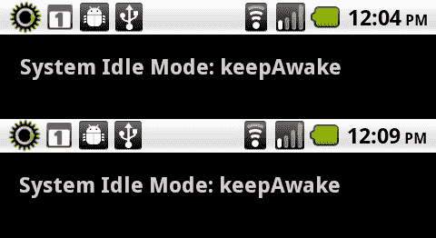

## 它是如何工作的...

为了使此功能正确工作，必须完成两件事，这两件事都是绝对必要的。首先，我们必须确保应用程序通过 Android 清单文件具有正确的权限。在 AIR 描述符文件中允许应用程序具有 `WAKE_LOCK` 和 `DISABLE_KEYGUARD` 权限将为我们完成此操作。第二部分涉及将 `NativeApplication.systemIdleMode` 属性设置为 `keepAwake`。最好使用 `SystemIdleMode.KEEP_AWAKE` 常量来完成此操作。确保满足这些条件将使应用程序能够保持设备显示屏亮起，并防止 Android 在设备空闲后锁定设备。

## 另请参阅...

在此食谱中，我们通过基本文本编辑器编辑了 AIR 描述符文件。有关在其他环境中设置这些权限的其他方法，请参阅之前的食谱。

# 建立 Android 自定义 URI 方案

Android 向 AIR 公开了许多有用的 URI 协议，用于标准操作，如映射、短信和电话。为我们应用程序定义自定义 URI 允许它从系统的任何地方调用：通过网页浏览器、电子邮件，甚至本地应用程序。自定义 URI 提供了调用 AIR 应用程序的一种替代方法。

## 如何操作...

我们将创建一个可以从设备网页浏览器使用自定义 URI 打开的应用程序。我们通过修改 AIR 描述符文件来定义 URI 意图设置：

1.  在您的项目中找到 AIR 描述符文件。它通常像 `{MyProject}-app.xml` 这样命名，位于项目根目录。

1.  浏览文件以查找名为 `<android>` 的节点；在此节点内将有一个名为 `<manifestAdditions>` 的节点，其中包含一个名为 `<manifest>` 的子节点。本文档的此部分包含设置我们 Android 应用程序权限所需的一切。

1.  我们现在将突出显示的 `<intent-filter>` 节点添加到我们的描述符文件中。定义我们 URI 的意图部分是 `<data android:scheme="fvm"/>`。这将使我们的应用程序能够使用 `fvm://` URI。请注意，本例中使用了 `"fvm"`；在根据此类示例编写应用程序时，我们可以自由地将此值更改为适合特定应用程序的任何值：

    ```kt
    <application android:enabled="true">
    <activity android:excludeFromRecents="false">
    <intent-filter>
    <action android:name="android.intent.action.MAIN"/>
    <category android:name="android.intent.category.LAUNCHER"/>
    </intent-filter>
    <intent-filter>
    <action android:name="android.intent.action.VIEW"/>
    <category android:name="android.intent.category.BROWSABLE"/>
    <category android:name="android.intent.category.DEFAULT"/>
    <data android:scheme="fvm"/>
    </intent-filter>
    </activity>
    </application>

    ```

1.  在我们的应用程序中，我们将导入以下类：

    ```kt
    import flash.desktop.NativeApplication;
    import flash.display.Sprite;
    import flash.display.StageAlign;
    import flash.display.StageScaleMode;
    import flash.events.InvokeEvent;
    import flash.text.TextField;
    import flash.text.TextFormat;

    ```

1.  声明一个 `TextField` 和 `TextFormat` 对，以向用户输出消息：

    ```kt
    private var traceField:TextField;
    private var traceFormat:TextFormat;

    ```

1.  在这一点上，我们将继续设置我们的 `TextField`，应用 `TextFormat`，并将其添加到 `DisplayList` 中。在这里，我们创建一个方法来执行所有这些操作：

    ```kt
    protected function setupTraceField():void {
    traceFormat = new TextFormat();
    traceFormat.bold = true;
    traceFormat.font = "_sans";
    traceFormat.size = 24;
    traceFormat.align = "left";
    traceFormat.color = 0xCCCCCC;
    traceField = new TextField();
    traceField.defaultTextFormat = traceFormat;
    traceField.selectable = false;
    traceField.multiline = true;
    traceField.wordWrap = true;
    traceField.mouseEnabled = false;
    traceField.x = 20;
    traceField.y = 40;
    traceField.width = stage.stageWidth-40;
    traceField.height =stage.stageHeight - traceField.y;
    addChild(traceField);
    }

    ```

1.  在 `NativeApplication` 上注册一个类型为 `InvokeEvent.INVOKE` 的事件监听器。这将检测用户使用我们定义的 URI 发起的任何应用程序调用事件：

    ```kt
    protected function registerListeners():void {
    NativeApplication.nativeApplication. addEventListener(InvokeEvent.INVOKE, onInvoke);
    }

    ```

1.  当应用程序从我们的 URI 打开时，将处理以下方法。我们可以从我们的调用事件中收集一定量的信息，比如 `reason` 属性。这个属性将具有 `"login"` 或 `"standard"` 的值。如果应用程序在系统登录时自动启动，该值将显示为 `"login"`。在 URI 调用的情况下，它将显示为 `"standard"`。我们还可以访问 `currentDirectory`。应用程序可能从文件系统内部调用，或者访问通过 URI 传递的任何 `arguments`。请注意，在从网络浏览器进行 URI 调用的这种情况下，`arguments` 属性将只包含所选链接的完整 URL。这是我们可以在启动时向应用程序传递数据的一种方式。

    ```kt
    protected function onInvoke(e:InvokeEvent):void {
    traceField.text = "";
    traceField.text = "Invoke Reason: " + e.reason + "\n"; traceField.appendText("Directory URL: " + e.currentDirectory. url + "\n\n");
    var args:Array = e.arguments;
    if (arguments.length > 0) {
    traceField.appendText("Message: " + args.toString() + "\n");
    }
    }

    ```

1.  对于这个例子，让我们设置一个简单的网页，其中包含一个使用我们定义的 `fvm:// URI:<a href="fvm://arg1=Hello&arg2=AIRAndroid">打开 AIR Android 应用!</a>` 的链接。如果用户已经安装了该应用程序并点击了这个链接，应用程序应该会打开，因为我们的 URI 意图在设备上已经注册了：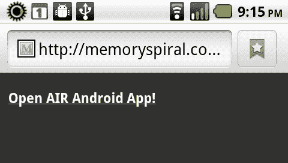

1.  一旦用户点击了使用我们定义的 URI 的链接，AIR 应用程序将会打开并检测到一个 `InvokeEvent`，在设备显示屏上显示以下信息。我们可以看到这里目录 URL 是空的，因为应用程序不是从设备文件系统中调用的：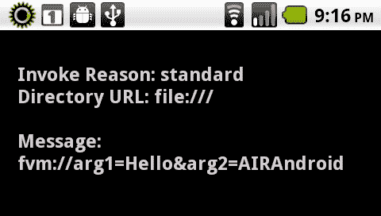

## 它的工作原理...

当我们在应用程序描述符文件中定义 URI 意图时，这会被编译到 Android 清单文件中，与应用程序一起安装到设备上。在设备上安装此应用程序会告知操作系统我们定义的 URI 意图。这使得操作系统知道特定的 URI，并指示在遇到该 URI 时打开应用程序。我们可以将 URI 放置在多个不同的位置，包括系统上的本地 Android 应用程序。这使得本地应用程序能够打开 AIR for Android 应用程序。在之前的示例中，我们将 URI 嵌入 HTML 中，并使用 Android 网络浏览器打开我们的应用程序。

## 另请参阅...

想要了解更多关于在 AIR for Android 中使用 URI 协议的信息，请查看 第七章，*本地交互：StageWebView 和 URI 处理器。*

# 预期 Android 兼容性筛选

根据特定应用程序中使用的 API，一些 Android 设备可能无法提供对预期传感器或硬件钩子的访问。如果用户下载了一个无法按预期工作的应用程序，这个用户将会感到沮丧，很可能会给我们一个差评，甚至可能是一条恶评。幸运的是，Android 市场可以代表我们进行一些筛选，以确保只有支持我们应用程序的设备才有下载和安装的选项。

## 如何操作...

修改 Android Manifest 文件，以指定我们的应用程序需要哪些特定特性：

1.  在你的项目中找到 AIR 描述文件。它通常被命名为类似`{MyProject}-app.xml`的名称，因为它位于项目根目录。

1.  浏览文件，查找名为`<android>`的节点；在这个节点内，会有一个名为`<manifestAdditions>`的节点，它包含一个名为`<manifest>`的子节点。文档的这一部分将包含我们需要声明 Android 应用程序兼容性的所有内容。

1.  我们将根据需求添加某些标签。查看以下信息布局，以确定你应该在 manifest 节点中为特定的特性依赖添加什么内容。设置`android:required="false"`可以使一个特性成为可选。

### 当使用 Android 摄像头的特性时：

```kt
<uses-feature android:name="android.hardware.camera" android:required="false"/>
<uses-feature android:name="android.hardware.camera.autofocus" android:required="false"/>
<uses-feature android:name="android.hardware.camera.flash" android:required="false"/>

```

### 当使用 Android 麦克风的特性时：

```kt
<uses-feature android:name="android.hardware.microphone" android:required="false"/>

```

### 当使用 Geolocation 传感器时：

```kt
<uses-feature android:name="android.hardware.location" android:required="false"/>
<uses-feature android:name="android.hardware.location.network" android:required="false"/>
<uses-feature android:name="android.hardware.location.gps" android:required="false"/>

```

### 当使用加速度传感器时：

```kt
<uses-feature android:name="android.hardware.accelerometer" android:required="false"/>

```

## 工作原理...

通过指定摄像头和麦克风的一些必需或可选特性，我们可以确保只有设备满足这些具体要求的用户才会被提供下载和安装我们应用程序的选项。我们通过修改 Android manifest 文件，通过向我们的 AIR 描述文件中添加内容来公开这些规范，如本食谱所示。使用这些修改编译我们的应用程序将确保这些规范与我们的`.APK`一起编码，并在我们的应用程序发布后通过 Android Market 公开。

## 另请参阅...

有关在 AIR for Android 中使用摄像头和麦克风的内容，请查看第四章，*视觉和音频输入：摄像头和麦克风访问*。

# 指示应用程序安装到设备 SD 卡

通过稍微修改我们 AIR 应用程序描述文件中的 Android manifest 指令，我们可以通知设备操作系统，如果可能，我们的应用程序应该安装在 SD 卡上，而不是内部存储。这将有助于将内部设备存储保留给操作系统和相关文件。

## 如何操作...

修改 Android Manifest 文件以确定安装位置选项：

1.  在你的项目中找到 AIR 描述文件。它通常被命名为类似`{MyProject}-app.xml`的名称，并且位于项目根目录。

1.  浏览文件，查找名为`<android>`的节点；在这个节点内，会有一个名为`<manifestAdditions>`的节点，其中包含一个名为`<manifest>`的子节点。

1.  我们将在`<manifest>`节点中添加`installLocation`属性。要设置应用程序由 Android 自行决定安装位置：

    ```kt
    <manifest android:installLocation="auto"/>

    ```

1.  要设置应用程序优先选择设备 SD 卡：

    ```kt
    <manifest android:installLocation="preferExternal"/>

    ```

    ### 注意

    不能保证设置`installLocation="preferExternal"`实际上会将应用程序安装到设备 SD 卡。

用户还可以通过以下步骤，如果允许的话，移动应用程序：

1.  首先，在设备上导航到安装了我们的 AIR 应用程序的**应用程序管理**屏幕。在大多数 Android 设备上，这个屏幕的位置是**设置 | 应用程序 | 管理应用程序**。现在从这个屏幕上选择你创建的 AIR 应用程序。

1.  要将应用程序移动到设备 SD 卡，只需点击标记为**移动到 SD 卡**的按钮：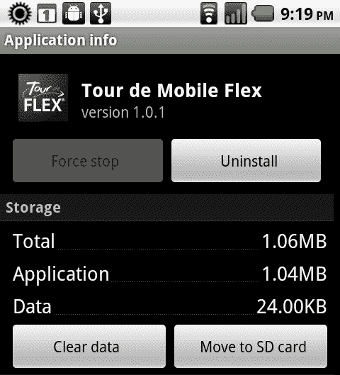

## 工作原理...

让用户在一定程度上选择应用程序的安装位置是一个好主意。在 Android 上，只有两个选项：设备存储区域或外部 SD 卡。考虑到大多数设备在外部 SD 卡上的存储空间比内部存储要多，最好是在 AIR 描述符文件中的清单节点上设置`android:installLocation="preferExternal"`，优先选择 SD 卡。尽管不能保证 Android 在安装我们的应用程序时会使用外部 SD 卡，但这至少会让系统知道该位置是首选的。Android 是否能够将应用程序安装到外部存储，主要取决于操作系统版本。一般来说，如果设备能够安装和运行适用于 Android 的 AIR 运行时，它应该具备这个功能。

正如我们之前所见，如果用户愿意，他们总是可以将应用程序从内部存储移动到外部存储，然后再移回来。同样值得注意的是：即使应用程序安装在设备的 SD 卡上，应用程序存储目录、本地共享对象和任何临时文件仍然会被写入内部存储。如果我们打算与我们的应用程序一起保存大量数据，那么我们将使用`File.documents`目录或`File.user`目录将这些数据存储在外部 SD 卡上。

## 参见...

有关本地文件系统的更多信息，请查看第八章，*丰富访问：文件系统和本地数据库*。

# 加密本地 SQLite 数据库

通常，本地 SQLite 数据库不需要任何安全或加密。然而，如果我们的应用程序包含存储在本地应用程序数据库文件中的敏感数据，我们会希望确保入侵者或小偷无法访问这些信息。幸运的是，我们可以加密在 Android 上可用的数据库，以确保即使用户的设备丢失或被盗，他们的私人信息仍然保持安全。

## 准备就绪...

为了正确加密数据库文件，我们需要使用一个加密库。在这个例子中，我们将使用位于[`code.google.com/p/as3crypto/`](http://code.google.com/p/as3crypto/)的 as3crypto 包。下载`.SWC`文件，跟随这个例子操作。

我们需要使`.SWC`在我们的项目中可用。根据所使用的工具不同，操作过程也会有所不同。

### 关于将.SWC 包包含到 Flash Builder 项目的说明

1.  在您的项目中，选择**文件**菜单，然后选择**属性**。

1.  在左侧列中，点击**ActionScript 构建路径**并选择**库路径**标签页。在这个屏幕中找到标记为**添加 SWC**的按钮并点击它。

1.  将会出现一个对话框窗口。选择**浏览到 SWC**选项，找到包含我们加密库的`.SWC`文件，然后点击**确定**。

1.  加密库现在将显示在此屏幕的**构建路径库**部分。确认这是正确的，并退出**属性**窗口。加密库现在可以在我们的移动 Android 项目中使用了：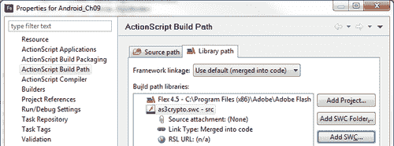

### 将.SWC 包包含到 Flash Professional 项目的操作指南

1.  在您的 Flash 项目中，导航到**属性**面板，点击**脚本**选择框旁边的扳手图标：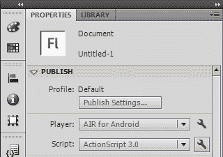

1.  这将打开**高级 ActionScript 3.0 设置**对话框窗口。选择**库路径**标签页。在这个屏幕中找到**浏览到 SWC 文件**的图标并点击它。它显示为一个白色和红色的盒子，是此屏幕上唯一不是灰度的图标：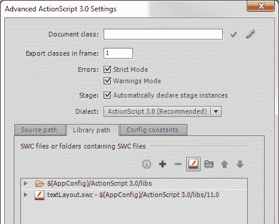

1.  将会出现一个**文件浏览**对话框窗口。找到包含我们加密库的`.SWC`文件，然后点击**确定**。

1.  加密库现在将显示在此屏幕的**库路径**部分。确认这是正确的，并退出**高级 ActionScript 3.0 设置**窗口。加密库现在可以在我们的移动 Android 项目中使用了：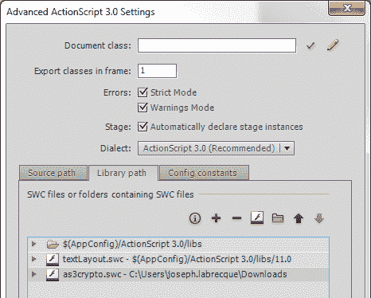

## 如何操作...

为了加密应用程序数据库，我们将声明一个密码，并使用外部加密库对其进行加密。这将用于创建和打开我们的数据库连接：

1.  在我们的应用程序中，我们将导入以下类。确保导入`MD5`类或等效类以进行正确的密钥加密：

    ```kt
    import com.hurlant.crypto.hash.MD5;
    import flash.data.SQLConnection;
    import flash.data.SQLMode;
    import flash.data.SQLStatement;
    import flash.display.Sprite;
    import flash.display.StageAlign;
    import flash.display.StageScaleMode;
    import flash.events.SQLEvent;
    import flash.filesystem.File;
    import flash.text.TextField;
    import flash.text.TextFormat;
    import flash.utils.ByteArray;

    ```

1.  我们现在必须声明一些在此应用程序中使用的对象。一个`String`常量将保存我们的纯文本密码以供稍后加密。通常，这会由用户提供，这里为了简单起见而硬编码。我们将需要一个`SQLConnection`来创建或打开我们的数据库文件，以及一组`ByteArray`对象和一个`MD5`对象来执行实际的加密。最后，我们声明一个`TextField`和`TextFormat`对，以向用户输出跟踪消息：

    ```kt
    private const pass:String = "AIR@ndr0idIsKo0l";
    private var sqlConnection:SQLConnection;
    private var encryptionPass:ByteArray;
    private var encryptionKey:ByteArray;
    private var md5:MD5;
    private var traceField:TextField;
    private var traceFormat:TextFormat;

    ```

1.  在这一点上，我们将继续设置我们的`TextField`，应用`TextFormat`，并将其添加到`DisplayList`以进行文本输出。这里，我们创建一个方法来执行所有这些操作：

    ```kt
    protected function setupTraceField():void {
    traceFormat = new TextFormat();
    traceFormat.bold = true;
    traceFormat.font = "_sans";
    traceFormat.size = 24;
    traceFormat.align = "left";
    traceFormat.color = 0xCCCCCC;
    traceField = new TextField();
    traceField.defaultTextFormat = traceFormat;
    traceField.selectable = false;
    traceField.multiline = true;
    traceField.wordWrap = true;
    traceField.mouseEnabled = false;
    traceField.x = 20;
    traceField.y = 40;
    traceField.width = stage.stageWidth-40;
    traceField.height =stage.stageHeight - traceField.y;
    addChild(traceField);
    }

    ```

1.  要执行我们数据库的加密，我们首先会实例化一个`ByteArray`并调用`writeUTFBytes()`方法，传递我们预定义的密码常量。这将把我们的`String`写入字节流。

1.  现在，实例化一个新的`MD5`对象以及另一个`ByteArray`，将`ByteArray`分配给`MD5.hash()`方法的结果，传递包含密码字节的先前的`ByteArray`。

1.  实例化一个`SQLConnection`并注册一个类型为`SQLEvent.OPEN`的事件监听器。这将在数据库成功创建或打开后触发一个事件。

1.  最后，调用`SQLConnection.open()`方法，传递数据库路径作为`File`对象，`SQLMode.CREATE`的打开模式常量，自动压缩`Boolean`，默认页面大小为 1024，以及对于此示例最重要的是，我们的 MD5 加密`ByteArray`：

    ```kt
    protected function encryptDB():void {
    encryptionPass = new ByteArray();
    encryptionPass.writeUTFBytes(pass);
    md5 = new MD5();
    encryptionKey = new ByteArray();
    encryptionKey = md5.hash(encryptionPass);
    sqlConnection = new SQLConnection();
    sqlConnection.addEventListener(SQLEvent.OPEN, dbOpened);
    sqlConnection.open(File.applicationStorageDirectory. resolvePath("encrypted.db"), SQLMode.CREATE, false, 1024, encryptionKey);
    }

    ```

1.  只要数据库成功创建（或打开）并验证加密有效，以下方法就会触发，将有关加密数据库的信息输出到我们的显示界面：

    ```kt
    protected function dbOpened(e:SQLEvent):void {
    traceField.appendText("Encrypted DB Created!\n\n");
    traceField.appendText("Pass: " + pass + "\n\n");
    traceField.appendText("Key: " + encryptionKey.toString());
    }

    ```

1.  当应用程序在我们的 Android 设备上运行时，它将如下所示。由于密钥是一个真正 MD5 加密的`ByteArray`，它在`TextField`中显示为乱码字符，因为它不再是明文`String`：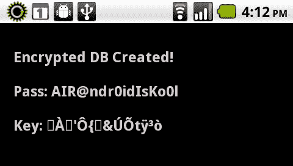

## 工作原理...

如果一个应用程序需要在数据库上进行加密，那么在创建我们的数据库时必须应用加密密钥。实现`SQLConnection.open()`或`SQLConnection.openAsync()`方法需要我们传递一个使用`as3Crypto`或类似加密库创建的加密`ByteArray`密钥。如果我们需要修改加密密钥，可以使用`SQLConnection.reencrypt()`来进行修改，以本食谱中演示的方式生成密钥。请注意，有效的加密密钥长度必须为 16 字节。

## 另请参阅...

要了解有关在 AIR for Android 中使用本地数据库的更多信息，请查看第八章，*丰富的访问：文件系统和本地数据库*。
