# 第十章：避免问题：调试和资源考虑

本章将涵盖以下内容：

+   使用 Flash Professional 调试应用程序

+   使用 Flash Builder 调试应用程序

+   使用设备 GPU 渲染应用程序元素

+   在设备中断事件发生时自动化应用程序关闭

+   使用设备后退按钮退出应用程序

+   监控应用程序中的内存使用和帧率

# 引言

由于 Android 是一个移动操作系统，因此在性能和用户体验优化方面提出了新的特定挑战。Flash 平台开发者在开发 AIR for Android 和移动 Flash Player 应用程序时必须考虑这一点。本章将提供调试和优化技术以及用户体验调整的概览，以使我们的 AIR for Android 应用程序尽可能良好地运行。

# 使用 Flash Professional 调试应用程序

使用 Flash Professional 调试 AIR for Android 应用程序与调试桌面 AIR 或 Flash 项目非常相似，但有一些值得注意的区别。

## 准备就绪…

请确保您的 AIR for Android 项目在 Flash Professional 中已打开，并且您的播放器是 AIR for Android。这可以通过**属性**面板进行验证：

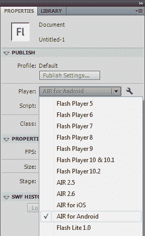

## 如何操作…

使用移动调试启动器或在通过 USB 连接的设备上进行调试：

1.  在应用程序菜单中，选择**调试**，并将鼠标悬停在标有**调试影片**的选项上。这将导致出现一个调试选项的子菜单：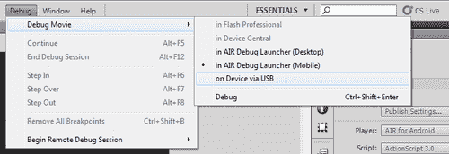

1.  当选择在**AIR 调试启动器（移动）**中调试时，Flash Professional 将切换到完整的调试控制台，并在设备调试器中启动应用程序。这对于在涉及多触控、加速度计或其他设备特定输入和传感器时快速调试应用程序非常有用。断点、跟踪语句和其他调试工具将完全与普通桌面项目中的功能一样。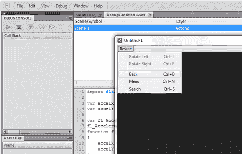

1.  一旦我们在调试播放器中完成了初步测试，并准备好通过 USB 在设备上进行调试，我们可以在**调试**菜单中切换到该选项。如果我们从未为此项目配置过 AIR for Android 设置，将出现一个对话框窗口，允许我们进行配置。在随后的调试会话中不应出现此窗口。确保在**Android 部署类型**下选择**调试**选项，并在**发布后**部分选择**安装并启动**选项。

1.  在此阶段，你会注意到有用于确定证书来签署你的应用程序的字段。要了解更多关于代码签名过程的信息，请参考第十一章，*最后的考虑：应用程序编译和分发*。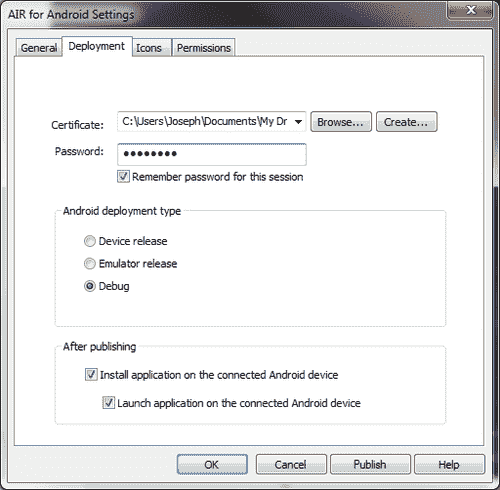

1.  在启动调试会话以在我们的设备上部署后，Flash Professional 将需要几秒钟来编译和部署应用程序。当应用程序开始在设备上加载时，AIR 将会启动一个小对话框，告诉我们它正在尝试连接到我们计算机上的调试器。一旦建立连接，窗口将消失，我们的完整应用程序将启动，使我们能够像平常一样进行测试和调试。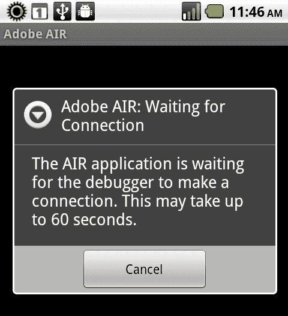

## 工作原理...

通过断点和变量检查来调试应用程序与使用任何 Flash 平台技术开发应用程序的课程相同。在使用 AIR for Android 时，我们需要处理外部硬件，并采取一些额外的步骤以确保我们能够在正常环境中进行调试，同时与在真实设备上运行的应用程序进行交互。本食谱展示了在我们当前工作流程中实现这一切所需步骤。

## 另请参阅...

若想了解更多关于使用 Flash Professional 进行项目设置的信息，你可以参考第一章，*准备使用 Android：开发环境和项目设置*。

# 使用 Flash Builder 调试应用程序

在 Flash Builder 中定义调试配置的能力是一个优秀的工作流程改进，我们在设置新的移动项目或准备测试我们工作了一段时间的项目时应该利用这一点。我们可以使用 Flash Builder 的**调试配置**面板为同一个项目设置多个配置。

## 如何操作…

我们将要探索**调试配置**面板，为我们的移动项目配置一组自定义的启动设置：

1.  选择一个移动项目，点击 Flash Builder 工具栏中**调试**按钮旁边的箭头。从菜单中选择**调试配置**选项。调试配置对话框窗口将会打开：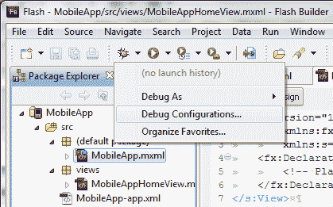

1.  双击左侧菜单中标记为**MobileApp**的条目，以编辑此选定项目的特定设置。从这个窗口，我们可以选择另一个要配置的项目，为项目指定默认的`Application`文件，设置一个`Target`平台（在我们的情况下是 Google Android），并配置一个`Launch`方法。如果在桌面上调试，我们还可以从各种设备配置文件中选择，甚至可以配置我们自己的。在下一个截图中，我们选择使用摩托罗拉 Droid 上的尺寸和分辨率进行调试：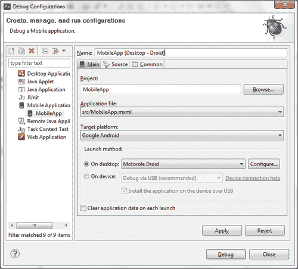

1.  如果有必要定义其他设备，我们可以点击**配置**按钮以启动**设备配置**屏幕，该屏幕允许我们导入设备配置文件，甚至添加我们自己的配置文件：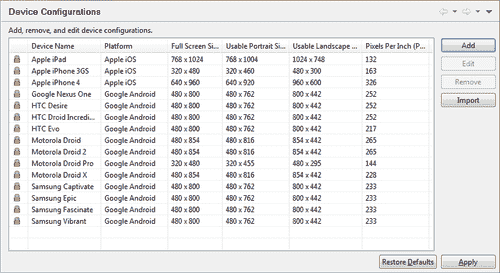

1.  添加自定义设备配置文件时，我们可以指定显示的宽度和高度以及支持的每英寸像素。Google Android 有一个标准平台 UI，根据制造商对标准显示元素进行的定制程度，在不同设备之间可能有所不同。例如，通知栏除非设备处于全屏模式，否则始终会出现。如果特定设备上的通知栏更高或更短，我们可以在这一步进行相应调整。

    ### 注意

    尽管这里可以模拟分辨率和 PPI，但除非开发机器具有多点触控界面，否则我们仍需要在实际设备上测试任何触摸或手势输入。当然，设备性能也不是模拟的一部分。

    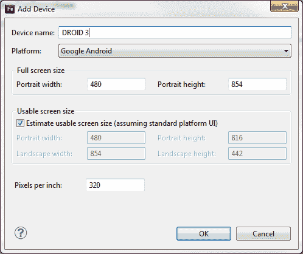

1.  当选择在实际物理硬件上调试时，我们可以选择通过 USB 或无线网络在设备上进行调试。USB 调试通常更为直接，大多数情况下推荐使用。在以下屏幕截图中，您可以看到我们已经为桌面调试定义了一个配置，以及一个用于通过 USB 连接的设备调试的配置：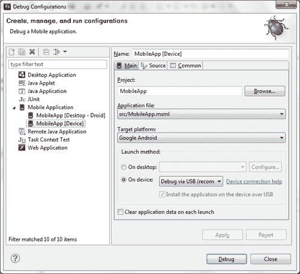

1.  完成后，点击**应用**然后**关闭**。我们现在可以通过 Flash Builder 调试图标或项目上下文菜单访问任何已定义的配置：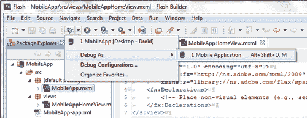

1.  一旦我们选择为项目启动调试会话，那么在桌面调试时，它将在 Flash Builder 移动调试播放器中打开；如果是 USB 设备调试，它将被编译、推送到设备并安装。对于设备调试会话，AIR 将启动一个小对话框，告知我们它正在尝试连接到计算机上的调试器。一旦建立连接，窗口将消失，我们的完整应用程序将启动，使我们能够正常测试和调试。

## 工作原理…

如果你选择在桌面上启动，你将能够在 Flash Builder 中进行本地调试。你也可以通过选择一系列配置文件来模拟各种 Android 设备。如果你想创建自己的配置文件，可以点击**配置**按钮。

当选择在设备上启动时，你也可以通过 Flash Builder 在设备上进行调试。这是迄今为止调试移动应用程序的最佳方式，因为它是在真正的 Android 硬件上进行测试的。

## 另请参阅...

有关使用 Flash Builder 进行项目设置的信息，你可以参考第一章，*准备使用 Android：开发环境和项目设置。*

# 使用设备 GPU 渲染应用程序元素

虽然较旧的 Android 设备必须依赖 CPU 来渲染移动 Adobe AIR 项目中的所有内容，但市场上许多较新的设备完全支持图形处理单元（GPU）渲染并提供必要的钩子让我们的应用程序利用这一点。本食谱将展示我们必须采取的必要步骤，以启用应用程序元素的 GPU 加速。

## 如何操作...

我们将修改 AIR 描述符文件中的设置，并使`DisplayObject`实例能够利用这些修改：

1.  在你的项目中找到 AIR 描述符文件。它通常被命名为类似`{MyProject}-app.xml`，并位于项目根目录。

1.  浏览文件，找到名为`<initialWindow>`的节点，位于本文档的开头部分。这个节点包含了许多关于我们应用程序窗口视觉方面的默认设置。

1.  我们现在必须找到名为`<renderMode>`的子节点。如果此节点不存在，我们可以轻松地在这里添加它。`renderMode`的值决定了应用是使用 CPU 还是 GPU 来渲染内容。应用程序`renderMode`有三个可能的值：

    +   **AUTO:** 应用将尝试使用设备 GPU 来渲染视觉显示对象：

        ```kt
        <renderMode>auto</renderMode>

        ```

    +   **GPU:** 应用将被锁定在 GPU 模式下。如果设备不支持 Adobe AIR 中的 GPU 渲染，将会出现问题：

        ```kt
        <renderMode>gpu</renderMode>

        ```

    +   **CPU:** 应用将使用设备 CPU 来渲染所有视觉显示对象。这是最安全的设置，但提供的优势最少：

        ```kt
        <renderMode>cpu</renderMode>

        ```

1.  现在，每当我们想在应用程序中的`DisplayObject`实例利用这一点时，我们必须将`DisplayObject`实例的`cacheAsBitmap`属性设置为`true`，并将`cacheAsBitmapMatrix`属性分配给一个新的 Matrix 对象。这将使这些单个对象通过设备 GPU 进行 2D 内容渲染。当在 2.5D 空间中使用对象时，它们将自动使用 GPU 进行渲染，不需要这些额外的设置。

    ```kt
    displayObject.cacheAsBitmap = true;
    displayObject.cacheAsBitmapMatrix =new Matrix();

    ```

### 它的工作原理...

在 AIR 描述符文件中将应用的`renderMode`设置为`gpu`将强制应用使用 GPU 渲染视觉对象。然而，不在 2.5D 空间中渲染的个别对象需要将`cacheAsBitmap`属性设置为`true`，并将`cacheAsBitmapMatix`属性分配给一个 Matrix 对象。当设置`renderMode`为`auto`时，应用将尝试通过 GPU 渲染这些对象，如果特定设备不支持 GPU 加速，则回退到 CPU 渲染。我们还可以将`renderMode`设置为`cpu`，这样会完全绕过 GPU 渲染，只通过 CPU 渲染所有内容。

当适当使用时，设置应用的`renderMode`可以显著提高应用内部视觉对象的渲染速度。重要的是要意识到许多设备可能无法通过 AIR for Android 获得完整的 GPU 支持，在这种情况下，强制使用 GPU 可能会对应用造成问题，甚至可能导致在某些特定设备上无法使用。在使用 GPU 时也存在一些限制，例如：不支持滤镜、PixelBender 混合以及各种标准的混合模式。

### 还有更多内容...

如果使用 Flash Professional，我们还可以通过 AIR 的**Android 设置**面板设置`渲染`模式。这可以通过**属性**面板访问。点击**播放器选择**旁边的扳手图标来配置这些设置。

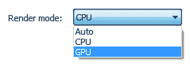

# 在设备中断事件时自动化应用关闭

当应用在 Android 设备上运行时，用户会话很可能因为电话来电或其他不可预见的事件而中断。当发生此类情况时，我们应该考虑是否应该退出应用并释放系统资源供其他任务使用。

## 如何操作...

我们将监听一个应用发出的停用事件并响应退出应用：

1.  首先，我们需要将以下类导入到我们的应用中：

    ```kt
    import flash.desktop.NativeApplication:
    import flash.display.Sprite;
    import flash.display.StageAlign;
    import flash.display.StageScaleMode;
    import flash.events.Event;

    ```

1.  我们必须在`NativeApplication.nativeApplication`对象上注册一个类型为`Event.DEACTIVATE`的事件监听器。当设备上发生电话来电或其他中断导致应用失去焦点时，将触发此事件：

    ```kt
    protected function registerListeners():void {
    NativeApplication.nativeApplication.addEventListener(Event. DEACTIVATE, appDeactivate);
    }

    ```

1.  在下面的函数中，我们将在`NativeApplication.nativeApplication`对象上调用`exit()`方法，完全关闭应用。这将释放资源供其他设备应用使用：

    ```kt
    protected function appDeactivate(e:Event):void {
    NativeApplication.nativeApplication.exit();
    }

    ```

### 工作原理...

我们希望在使用用户设备上的资源时，成为我们应用程序运行的良好管理者。有效的方法是确保在应用程序处于非活动状态时释放应用程序使用的任何内存。监听停用事件将允许我们知道何时有其他应用程序获得焦点。在这一点上，我们可以完全退出应用程序，释放用户当前正在使用的资源。

### 另请参阅…

在实际退出应用程序之前，我们有机会通过本地共享对象或本地数据库保存会话数据。有关如何执行此操作的信息，请查看第八章，*丰富的访问：文件系统和本地数据库。*

# 使用设备后退按钮退出应用程序

安卓设备通常在设备的一侧有一组四个软键，这些软键始终对用户可见。其中两个键涉及导航——后退和主页键。当用户激活某个事件，例如按下后退按钮时，我们应该考虑是否完全退出应用程序并释放系统资源以供其他任务使用。

### 注意

主页按钮将始终使用户返回到 Android 桌面，从而停用我们的应用程序。要了解如何在发生此类事件时关闭应用程序，请参阅之前的食谱。

## 如何操作...

我们将监听专用安卓后退按钮的按下，并在响应中退出应用程序：

1.  首先，我们需要将以下类导入到我们的应用程序中。

    ```kt
    import flash.desktop.NativeApplication;
    import flash.display.Sprite;
    import flash.display.StageAlign;
    import flash.display.StageScaleMode;
    import flash.events.KeyboardEvent;
    import flash.ui.Keyboard;

    ```

1.  我们必须在`NativeApplication.nativeApplication`对象上注册一个类型为`KeyboardEvent.KEY_DOWN`的事件监听器。当用户激活专用的安卓后退键时，此事件将被触发：

    ```kt
    protected function registerListeners():void {
    NativeApplication.nativeApplication. addEventListener(KeyboardEvent.KEY_DOWN, onBackPressed);
    }

    ```

当用户按下后退键时，我们将调用`NativeApplication.nativeApplication`对象的`exit()`方法，完全关闭应用程序。这将释放资源供其他设备应用程序使用：

```kt
protected function onBackPressed(e:KeyboardEvent):void {
if(e.keyCode == Keyboard.BACK){
NativeApplication.nativeApplication.exit();
}
}

```

## 工作原理...

我们希望在使用用户设备上的资源时，成为我们应用程序运行的良好管理者。有效的方法是确保在应用程序处于非活动状态时释放应用程序使用的任何内存。做到这一点的方法之一是监听键盘事件并拦截后退键的按下。在这一点上，我们可以完全退出应用程序，释放用户当前正在使用的资源。

根据我们应用程序的当前状态，我们可以选择是退出应用程序还是仅返回到某个之前的状态。在基于 Flex 的移动项目中执行此类操作时，我们可能只有在当前视图是我们应用程序中的初始视图`ViewNavigator`时才会退出应用程序。

## 还有更多…

通过使用`KeyboardEvent.preventDefault()`，也可以阻止安卓返回按钮执行任何操作：

```kt
protected function onBackPressed(e:KeyboardEvent):void {
if(e.keyCode == Keyboard.BACK){
KeyboardEvent.preventDefault();
}
}

```

## 另请参阅…

请注意，在实际退出应用程序之前，我们有机会通过本地共享对象或本地数据库保存任何会话数据。有关如何执行此操作的更多信息，请查看第八章，*丰富的访问：文件系统和本地数据库*。

# 监控应用程序中的内存使用和帧率

安卓设备通常与传统桌面或笔记本电脑相比，内存较少且 CPU 性能较弱。在构建安卓应用时，我们必须非常小心，以免创建出过于耗能的应用，导致帧率降至不可接受的水平或应用无响应。为了帮助我们排查和监控这些问题，我们可以跟踪运行中应用的内存消耗和计算出的帧率，以便相应地作出响应。

## 如何操作...

我们可以通过使用`flash.system`包以及`flash.utils.getTimer`类来监控许多系统属性，以计算当前应用程序的帧率：

1.  首先，我们需要将以下类导入到我们的应用程序中：

    ```kt
    import flash.display.Sprite;
    import flash.display.StageAlign;
    import flash.display.StageScaleMode;
    import flash.events.Event;
    import flash.system.Capabilities;
    import flash.system.System;
    import flash.text.TextField;
    import flash.text.TextFormat;
    import flash.utils.getTimer;

    ```

1.  我们需要声明一组`Number`对象来保存持久的计时值，以便计算应用程序的帧率。同时，声明一个`TextField`和`TextFormat`对，以向用户输出此和其他设备消息：

    ```kt
    private var prevTime:Number;
    private var numFrames:Number;
    private var frameRate:Number;
    private var traceField:TextField;
    private var traceFormat:TextFormat;

    ```

1.  在这一点上，我们继续设置我们的`TextField`，应用`TextFormat`，并将其添加到`DisplayList`中。这里，我们创建一个方法来执行所有这些操作：

    ```kt
    protected function setupTraceField():void {
    traceFormat = new TextFormat();
    traceFormat.bold = true;
    traceFormat.font = "_sans";
    traceFormat.size = 24;
    traceFormat.align = "left";
    traceFormat.color = 0xCCCCCC;
    traceField = new TextField();
    traceField.defaultTextFormat = traceFormat;
    traceField.selectable = false;
    traceField.multiline = true;
    traceField.wordWrap = true;
    traceField.mouseEnabled = false;
    traceField.x = 20;
    traceField.y = 40;
    traceField.width = stage.stageWidth-40;
    traceField.height = stage.stageHeight - traceField.y;
    addChild(traceField);
    }

    ```

1.  下一步包括创建处理我们帧率计算的机制。我们将`prevTimeNumber`设置为应用程序初始化后当前经过的毫秒数。我们还将`numFrames`变量设置为`0`。这为我们提供了一组基础数字。最后，我们在应用程序上注册一个`Event.ENTER_FRAME`类型的事件监听器，以定期为我们执行新的帧率计算：

    ```kt
    protected function registerListeners():void {
    prevTime = getTimer();
    numFrames = 0;
    this.addEventListener(Event.ENTER_FRAME, onEnterFrame);
    }

    ```

1.  这个冗长的方法会在每次进入帧时刷新我们`TextField`中的所有内容。首先，我们将输出一些关于 CPU 架构、制造商以及应用程序可用的内存的信息。在这一步中，内存是重要的部分。

1.  为了计算运行帧率，我们首先会递增我们的帧计数器，并再次获取从应用程序初始化开始经过的毫秒数。可以减去上一次读取的值，这样我们就得到了自上次运行此函数以来经过的时间。

1.  如果经过的时间超过 1000，那么已经过去了一秒钟，然后我们可以进行一些计算来确定我们实际每秒的帧数。我们将通过将本次循环中处理的帧数除以持有我们之前时间的变量乘以 1000，来获取每分钟的帧数。将上一个时间变量设置为当前经过的时间，并将我们的帧数重置为`0`，将开始一个新的周期：

    ```kt
    protected function onEnterFrame(e:Event):void {
    traceField.text = "CPU Arch: " + Capabilities.cpuArchitecture + "\n";
    traceField.appendText("Manufacturer: " + Capabilities. manufacturer + "\n");
    traceField.appendText("OS: " + Capabilities.os + "\n\n");
    traceField.appendText("Free Memory: " + System.freeMemory + "\n");
    traceField.appendText("Total Memory: " + System.totalMemory + "\n\n");
    numFrames++;
    var timeNow:Number = getTimer();
    var timePast:Number = timeNow - prevTime;
    if(timePast > 1000){
    var fpm:Number = numFrames/timePast;
    frameRate = Math.floor(fpm * 1000);
    prevTime = timeNow;
    numFrames = 0;
    }
    traceField.appendText("Framerate: " + frameRate);
    }

    ```

1.  当我们在设备上运行应用程序时，我们可以看到 CPU 和操作系统信息，以及内存使用情况和计算出的帧率：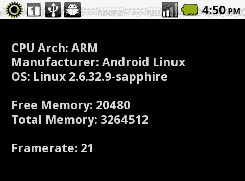

## 它的工作原理...

关于 CPU 和内存使用，可以通过 Capabilities 和 System 类访问大量信息。我们可以通过从`getTimer()`实用方法获取的数据计算实际 FPS，来获取有关当前帧率的更多信息。将这些信息综合使用，将为我们提供一组合理的数据，以确定应用程序在特定设备上的运行情况。然后，我们可以使用这些数据在应用程序运行时通过修改应用程序属性、改变我们渲染内容的方式，甚至提醒用户可能存在问题。

## 还有更多...

如果帧率变得太慢，我们可能需要考虑降低帧率，甚至降低应用程序的渲染质量以改善性能。这可以通过使用以下代码片段来完成：

```kt
this.stage.frameRate = 10;
this.stage.quality = StageQuality.LOW;

```

## 另请参阅...

我们还可以推荐使用像`Hi-ReS-Stats`这样的包，可以从[`github.com/mrdoob/Hi-ReS-Stats`](http://https://github.com/mrdoob/Hi-ReS-Stats)下载，并在移动 Android 应用程序上使用来监控资源使用情况。使用这个类将在我们的应用程序中生成一个图形覆盖层，以监控应用程序性能。
