# 第十一章：最后考虑：应用程序编译和分发

本章节将涵盖以下内容：

+   使用 Flash Professional 生成代码签名证书

+   使用 Flash Builder 生成代码签名证书

+   使用 FDT 生成代码签名证书

+   使用 AIR 开发工具生成代码签名证书

+   准备图标文件以供分发

+   使用 Flash Professional 编译应用程序

+   使用 Flash Builder 编译应用程序

+   使用 FDT 编译应用程序

+   使用 AIR 开发工具编译应用程序

+   将应用程序提交到 Android Market

# 简介

当将移动 Flash 应用程序（`.swf`）部署到 Web 上时，这个过程与桌面版非常相似；将你的 `.swf` 嵌入 HTML 容器中，就完成了。然而，将 AIR 应用程序部署到 Android Market 上则完全不同。在本章中，我们将了解如何准备一个应用程序以分发给 Android Market，生成适当的代码签名证书，以及编译和提交过程的相关细节。

# 使用 Flash Professional 生成代码签名证书

在 Android Market 上分发的应用程序必须使用 25 年有效期的代码签名证书进行数字签名。我们有多种不同的方法来生成 Android 应用程序的代码签名证书。在本食谱中，我们将演示如何使用 Flash Professional 生成此类证书。

## 如何操作...

在 Flash Professional 中，执行以下操作以创建自签名数字证书：

1.  打开一个针对 **AIR for Android** 的项目，打开 **属性** 面板，并点击 **播放器选择** 框旁边的扳手图标。这将打开 **AIR for Android 设置** 对话框：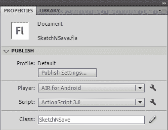

1.  在 **AIR for Android 设置** 对话框中，点击 **创建** 按钮以打开 **创建自签名数字证书** 对话窗口：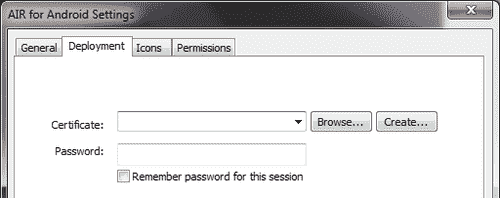

1.  当 **创建自签名数字证书** 对话框出现在我们面前时，我们将输入所需的信息并为证书选择名称和位置。正确输入所有信息后，我们将点击 **确定** 以便 Flash Professional 生成证书。确保在 **有效期** 输入框中输入 25 年，以适用于 Android：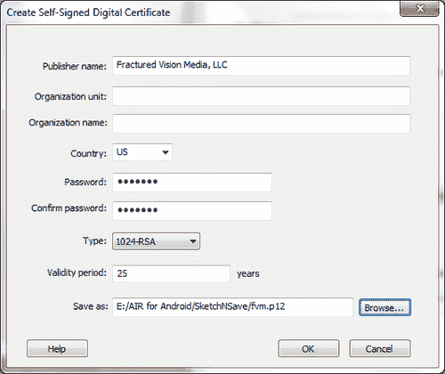

## 工作原理...

通过生成有效的数字代码签名证书，我们可以正确地为提交到 Android Market 的 Android 应用程序签名。Flash Professional 提供了一个简单的方法来生成适当的证书类型并将其应用于我们的分发应用程序。

# 使用 Flash Builder 生成代码签名证书

在 Android Market 上分发的应用程序必须使用 25 年有效期的代码签名证书进行数字签名。我们有多种不同的方法可以为 Android 应用程序生成代码签名证书。在本食谱中，我们将演示如何使用 Flash Builder 生成此类证书。

## 如何操作...

在 Flash Builder 中，执行以下操作以创建自签名数字证书：

1.  在**包资源管理器**中选择移动项目，进入**文件**菜单并选择**属性**。将为此项目显示**属性**对话框。

1.  在**属性**对话框中，根据所选项目的类型，向下滚动至**Flex 构建打包**或**ActionScript 构建打包**项，并选择**Google Android**。选择**数字签名**标签后，点击**创建**按钮以打开**创建自签名数字证书**对话框：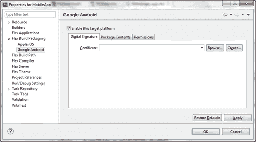

1.  现在需要做的就是输入所需信息并为证书选择名称和位置。正确输入所有信息后，我们将点击**确定**，让 Flash Builder 生成证书：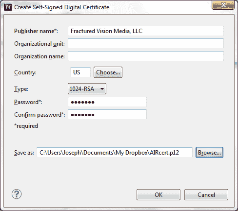

## 工作原理...

通过生成有效的数字代码签名证书，我们可以正确地为提交到 Android Market 的 Android 应用程序签名。Flash Professional 提供了一种简单的方法来生成适当的证书类型，并将其应用于我们分发的应用程序。

# 使用 FDT 生成代码签名证书

在 Android Market 上分发的应用程序必须使用 25 年有效期的代码签名证书进行数字签名。我们有多种不同的方法可以为 Android 应用程序生成代码签名证书。在本食谱中，我们将演示如何使用 PowerFlasher FDT 生成此类证书。

## 如何操作...

在 FDT 中，执行以下操作以创建自签名数字证书：

1.  点击顶部菜单中**运行**图标旁边的小箭头，并从出现的子菜单中选择**运行配置**。这将打开**运行配置**对话框：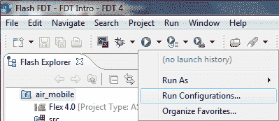

1.  打开**运行配置**对话框窗口，双击**FDT AIR 应用程序发布**菜单项以创建新配置。选择**证书**标签，并输入所需信息，为证书选择名称和位置。正确输入所有信息后，我们将点击**创建证书**，让 FDT 为我们生成证书：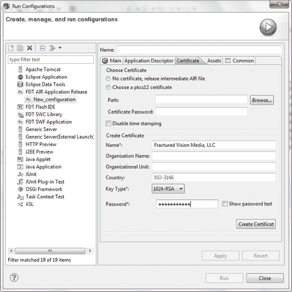

## 工作原理...

通过生成有效的数字代码签名证书，我们可以正确地为提交到 Android Market 的 Android 应用程序签名。FDT 提供了一种简单的方法来生成适当的证书类型，并将其应用于我们分发的应用程序。

# 使用 AIR 开发者工具生成代码签名证书

Android Market 上发布的应用程序必须使用 25 年代码签名证书进行数字签名。我们有多种方法可以生成 Android 应用程序的代码签名证书。在本食谱中，我们将演示如何使用 ADT 命令行工具生成此类证书。

## 准备中…

要了解如何在特定环境中配置 ADT，请查看第一章，*准备使用 Android：开发环境和项目设置。*

## 如何操作...

使用 ADT 命令行工具，执行以下操作以创建自签名的数字证书：

1.  对于此示例，我们将假设以下情况：

    ```kt
    Publisher Name: "Joseph Labrecque"
    Validity Period: 25 (years)
    Key Type: 1024-RSA
    PFX File: C:\Users\Joseph\Documents\airandroid.p12
    Password: airAndroidPass

    ```

1.  打开命令提示符或终端（取决于操作系统），并输入生成我们证书的命令字符串：

    ```kt
    adt -certificate -cn "Joseph Labrecque" -validityPeriod 25 1024-
    RSA C:\Users\Joseph\Documents\airandroid.p12 airAndroidPass

    ```

1.  ADT 实用程序现在将处理命令并完成证书生成过程。如果我们的命令有问题，ADT 将在这里打印错误信息，让我们知道出现了错误：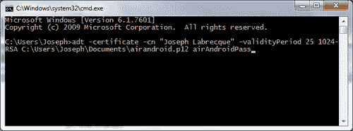

1.  现在，我们可以浏览到命令字符串中指定的位置来找到我们新创建的证书，并使用它来签署我们的 AIR for Android 应用程序：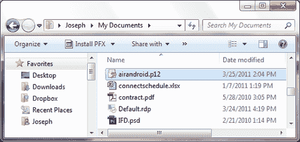

## 工作原理...

通过生成有效的数字代码签名证书，我们可以正确签署我们的 Android 应用程序以便提交到 Android Market。使用与 AIR SDK 捆绑的 ADT 工具，我们可以生成适合分发的适当证书类型。

# 准备分发图标文件

当我们为在 Android Market 上发布的应用程序编译应用程序时，我们必须包括一组标准图标图像以及我们的应用程序。这些图标的位置在我们的 AIR 应用程序描述符文件中定义。Android 期望一组三个图标：36x36、48x48 和 72x72。每个图标用于不同的屏幕密度，并且都应该包括为标准的 PNG 文件。

## 如何操作...

根据使用的工具不同，这项任务可以有不同的处理方式。我们将演示如何使用 Flash Professional CS5.5 在应用程序中包含这些图标，以及如何通过直接修改 AIR 应用程序描述符文件来实现。

### 使用 Flash Professional CS5.5

1.  打开一个针对**AIR for Android**的项目，打开**属性**面板，点击**播放器选择**框旁边的扳手图标。这将打开**AIR for Android 设置**对话框：

1.  在 **AIR for Android 设置** 对话框中，点击 **图标** 选项卡。要为我们的项目指定特定图标，我们只需在列表中选择每个图标条目，并通过使用文件夹和放大镜图标浏览来定位每个图标要使用的文件：

### 直接修改 AIR 描述符文件

1.  在您的项目中找到 AIR 描述符文件。它通常命名为类似 `{MyProject}-app.xml` 的名称，并位于项目根目录下。

1.  在本文档中浏览名为`<icon>`的节点。此节点包含许多与我们的应用程序窗口视觉方面相关的默认设置。如果它被注释掉了，我们必须在继续之前取消注释。

1.  我们现在必须确保在`<icon>`节点内存在以下三个子节点。确保我们的图标文件路径正确。如果它们不正确，在我们尝试编译此应用程序时编译器会告知我们：

    ```kt
    <image36x36>assets/icon_36.png</image36x36>
    <image48x48>assets/icon_48.png</image48x48>
    <image72x72>assets/icon_72.png</image72x72>

    ```

例如，以下是适用于 Android 应用程序的一组三个图标及其像素测量值：

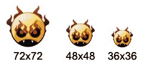

## 工作原理...

在 Android 应用程序包中包含一组图标对于通过 Android Market 分发应用程序至关重要。它还能在应用程序安装到设备上后为用户提供一个容易识别的视觉提示。花点时间设计一组真正能反映应用程序代表的图标。

## 还有更多...

如果应用程序要发布到 Android Market，我们还需要制作多种其他图像来正确地为我们的应用程序品牌。查看 Android Market 以了解当前需要哪些图像的详细信息，请访问[`market.android.com/`](http://https://market.android.com/)。

# 使用 Flash Professional 编译应用程序

将项目编译为 Android 发布版本 `.apk` 文件是在将应用程序分发到 Android Market 或其他渠道之前的最后一步。根据使用的工具不同，有许多方法可以做到这一点。在本食谱中，我们将使用 Flash Professional 中的工具来编译和打包我们的应用程序。

## 如何操作...

要从 Flash Professional 编译 `.apk`，我们将采取以下步骤：

1.  打开针对 **AIR for Android** 的项目，打开 **属性** 面板并点击 **发布设置** 按钮。这将打开 **发布设置** 对话框：

1.  我们可以在这里检查我们的设置，如果我们确定一切配置正确，甚至可以直接点击**发布**。要验证所有设置是否都已就绪以发布到 Android，请点击我们的**播放器选择**框的小扳手图标，它应该设置为**适用于 Android 的 AIR**。这将提供对**适用于 Android 的 AIR 设置**对话框的访问：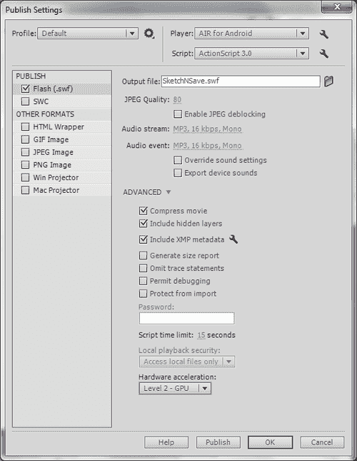

1.  打开**适用于 Android 的 AIR 设置**对话框后，我们可以验证我们的**特定配置**选项，然后再决定发布。**常规**标签包含许多重要输入，包括生成的`.apk`文件的路径、应用程序名称、版本、ID 和其他必需的配置设置。我们还可以选择包含除了编译的`.swf`和 AIR 描述文件之外的其他文件，例如外部图像资源。**图标**标签允许我们使用基本的 GUI 包含图标文件，而**权限**标签将允许我们设置特定于 Android 的应用程序权限。

    ### 注意

    这些设置都会修改应用程序描述文件，进而生成 Android 清单文档。我们可以将这些设置视为这些文件的图形用户界面。

1.  作为最后一步，点击**部署**标签：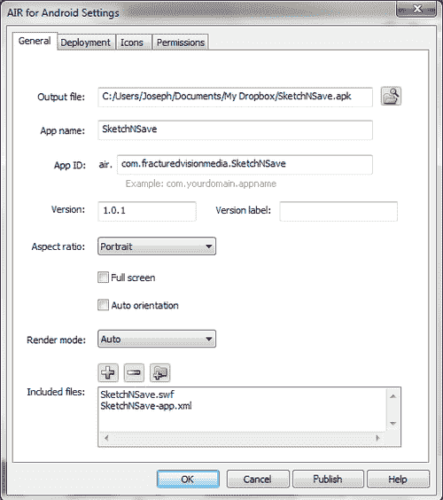

1.  在**部署**标签中存在一个部署类型设置，以及使用自签名证书为应用程序签名的机会。这非常重要，因为 Android 市场不接受未签名的应用程序或不符合 Android 市场条款设置要求的应用程序。

1.  一定要提供应用名称，用于用户在设备上安装后识别应用程序，以及一个唯一的应用 ID。`App ID`非常重要，因为这是 Android Market 中应用程序的主要标识符。为了使应用程序更新正常工作，它必须是唯一的，建议开发人员特别小心地使用反向域名表示法以保持这种唯一性。

1.  我们需要确保从选择获取 AIR 运行时的选项指示我们正在定位的具体分发市场。对于一般的 Android 市场，我们选择谷歌 Android 市场。此对话框还通过 Android 部署类型设置为我们提供了编译用于不同目的的应用程序版本的选择：

    +   **设备发布：**当我们想通过 Android 市场分发我们的应用程序时，需要选择的选项

    +   **模拟器发布：**生成与 Android SDK 模拟器和 AIR 运行时的模拟器版本兼容的发布版本

    +   **调试：**此选项生成专门用于调试应用程序的发布版本

1.  一旦我们对所有配置设置感到满意，我们可以退出到**发布设置**对话框并点击**发布**，或者直接在此处点击**发布**按钮。只要我们之前已经完成这些配置步骤，我们也可以使用 Flash Professional 中提供的传统发布方法。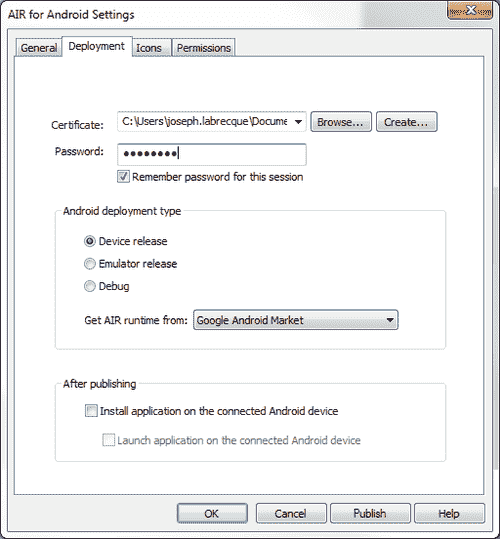

现在我们有一个完全编译、有效签名的`.apk`文件，准备进行分发。

## 工作原理...

我们通过 Flash Professional GUI 对话框更改的配置设置实际上是在幕后修改 AIR 描述符文件。一旦我们选择发布应用程序，Flash Professional 将使用此文件来编译并将所有内容打包成一个有效的`.apk`文件，以便在 Android Market 上分发。

# 使用 Flash Builder 编译应用程序

将项目编译为 Android 发布版本`.apk`文件是分发应用程序到 Android Market 或其他渠道之前的最后一步。根据使用的工具不同，有许多方法可以做到这一点。在本教程中，我们将使用 Flash Builder 中的工具来编译和打包我们的应用程序。

## 如何操作...

要从 Flash Builder 编译`.apk`，请执行以下步骤：

1.  在移动 ActionScript 或 Flex 项目中，导航到 Flash Builder 菜单，选择**项目**菜单项。这将显示一个包含多个选项的子菜单。从该菜单中，选择**导出发布构建**，打开**导出发布构建**对话框窗口：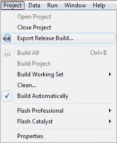

1.  在此窗口中，我们可以选择要执行发布构建的项目以及该项目中的具体应用程序，决定要定位的平台，指定构建的路径和文件名，以及选择要导出哪种类型的应用程序。对于 Android，我们将在每个目标平台上选择**签名包**。只要我们选择了**Google Android**作为目标平台，点击**下一步**后，这将打开**打包**设置对话框：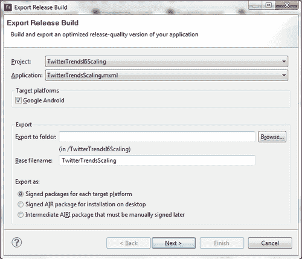

1.  现在，我们可以为构建配置一些高级属性。点击**包内容**标签，以验证构建中是否包含所有必需的文件。如果我们想打包其他文件，甚至排除某些资源，我们可以通过使用每个项目旁边的复选框来完成。点击**数字签名**标签以继续：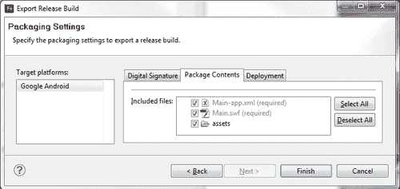

1.  最后的任务是选择一个签名证书，以便在 Android Market 上发布我们的应用程序时进行数字签名。选择一个证书并输入关联的密码。点击**完成**将执行构建，并将编译的`.apk`保存到我们之前选择的位置。如果我们愿意，可以通过**包内容**标签包含外部文件，并通过**部署**标签选择部署到任何连接的设备：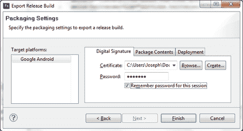

现在我们已经拥有一个完全编译、有效签名的`.apk`文件，准备进行分发。

## 工作原理...

Flash Builder 在导出项目的发布版本时提供了目标平台的概念。如果我们选择 Google Android 作为目标平台，我们会得到一些特定于 Android 的附加选项，我们可以根据特定项目的需求进行修改。额外的对话框元素允许我们将所有内容编译并打包成一个有效的`.apk`，准备在 Android Market 上发布。

# 使用 FDT 时编译应用程序

将项目编译为 Android 发布版本的`.apk`文件是在 Android Market 或其他渠道发布应用程序之前的最后一步。根据使用的工具不同，有许多方法可以做到这一点。在这个食谱中，我们将讨论在使用 Powerflasher FDT 编译和打包应用程序时可用的三种流行方法。

## 如何操作...

在撰写本文时，FDT 不支持直接与 Android 的 AIR 一起工作。然而，FDT 用户可以通过三种主要方法编译他们的项目以进行 Android 分发。

### 使用移动项目模板

FDT 社区制作了许多支持 Android 的 AIR 移动项目模板。这些模板适用于所有 FDT 项目使用的新模板系统，并为工作流程添加不同级别的功能。其中大多数还包括 ANT 脚本，使用 AIR 开发者工具编译`.apk`。

### 使用 ANT

迄今为止，这是编译 Android 项目最灵活的方法，因为它实际上与 IDE 无关，任何人都可以使用。ANT 随 FDT 的标准安装一起打包，网上社区有许多启动脚本可以部署 Android 的 AIR。若要开始使用 FDT 中的 ANT，请查看[`fdt.powerflasher.com/docs/FDT_Ant_Tasks`](http://fdt.powerflasher.com/docs/FDT_Ant_Tasks)。

### 通过 CLI 使用 ADT

最基本的方法是直接使用 FDT 开发一个移动项目，然后通过命令行界面使用 AIR 开发者工具将其打包成`.apk`。下一个食谱将详细介绍如何实现这一过程。

## 工作原理...

无论选择哪种方法，目标都是相同的——编译和打包所有内容到一个有效的 `.apk`，准备在 Android Market 上分发。FDT 的一个优点是它不限制开发者只能用一种特定的方式做事。在为 Android 生成发布版本时，我们有多种选择。

# 使用 AIR 开发者工具编译应用程序

将项目编译为 Android 发布版本 `.apk` 文件是分发应用程序到 Android Market 或其他渠道之前的最后一步。根据使用的工具不同，有许多方法可以做到这一点。在本教程中，我们将使用 **AIR 开发者工具** (**ADT**) 命令行实用程序来编译和打包我们的应用程序。

## 如何操作...

要使用 ADT 命令行工具从移动 AIR 项目编译 `.apk`，我们将执行以下步骤：

1.  在此示例中，我们将假定以下内容：

    +   **证书：** `android.p12`

    +   **期望的 APK：** `mobileAIR.apk`

    +   **AIR 描述符：** `mobileAIR\src\mobileAIR-app.xml`

    +   **SWF 文件：** `mobileAIR\src\mobileAIR.swf`

1.  打开命令提示符或终端（取决于操作系统），输入命令字符串以生成我们的证书。在这种情况下，我们将目标类型设置为 `.apk` 以进行发布构建。我们也可以将其设置为 apk-debug 以进行调试构建，或者设置为 apk-emulator 以在模拟器上安装：

    ```kt
    -package -target apk -storetype pkcs12 -keystore android.p12
    mobileAIR.apkmobileAIR\src\mobileAIR-app.xml mobileAIR\src\
    mobileAIR.swf

    ```

1.  其他文件，如资源或图标，可以在 .swf 条目之后包含，用空白分隔：

    ```kt
    -package -target apk -storetype pkcs12 -keystore android.p12
    mobileAIR.apkmobileAIR\src\mobileAIR-app.xml mobileAIR\src\
    mobileAIR.swf mobileAIR\src\assets\icon_32.pngmobileAIR\src\
    assets\icon_36.pngmobileAIR\src\assets\icon_72.png

    ```

1.  现在 ADT 实用程序将处理该命令并完成 `.apk` 编译过程。如果我们的命令有问题，ADT 将在这里打印错误信息，让我们知道出了问题。通常，如果出现问题，可能是 AIR 描述符文件有问题，或者预期输入文件的路径不正确。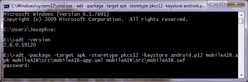

1.  现在，我们可以浏览到命令字符串中指定的结果位置，找到我们新创建的 `.apk` 文件，该文件可以直接安装在 Android 设备上，也可以通过 Android Market 进行分发：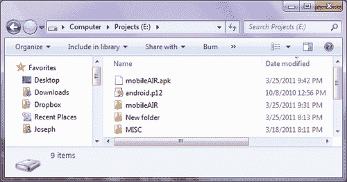

现在我们已经拥有一个完全编译、有效签名的 `.apk` 文件，准备进行分发。

## 工作原理...

假设我们已经正确配置了我们的应用程序，ADT 将为我们编译、签名并打包所有的项目文件到一个 `.apk` 中。ADT 有许多不同的实用程序和配置选项，可以对项目执行许多操作。请查看 [`help.adobe.com/en_US/air/build/`](http://help.adobe.com/en_US/air/build/) 并在菜单中选择 **AIR 开发者工具** (**ADT**) 以获取完整文档。

## 另请参阅…

要了解如何在特定环境中配置 ADT，请查看第一章，*准备使用 Android：开发环境和项目设置*。

# 将应用程序提交到 Android 市场

Google 使注册成为 Android 开发者和在 Android 市场上发布应用程序变得非常容易。这个指南将详细说明在编译完成`.apk`之后进行这些操作的必要步骤。

## 准备就绪...

在开发者能够向 Android 市场提交任何内容之前，必须创建一个开发者账户。这个过程可以在几分钟内完成，既简单又实惠。

要注册成为 Android 开发者：

1.  使用网络浏览器，前往 [`market.android.com/publish/signup`](http://market.android.com/publish/signup)。

1.  使用您的 Google 账户登录（或创建新账户）。

1.  填写注册表单并支付一次性的 25 美元设置费用。

1.  恭喜您成为 Android 开发者！

## 如何操作...

1.  1 将编译并签名的`.apk`文件上传到 Android 市场，以供全球分发。

1.  使用您的 Android 开发者凭据在[`market.android.com/publish/`](http://https://market.android.com/publish/)登录 Android 市场。

1.  点击右下角标有**上传应用程序：**的按钮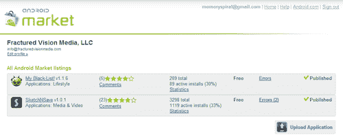

1.  现在展现给我们的是一个相当长的表单，它允许我们包含有关我们应用程序的各种信息。我们可以对应用程序进行分类，添加描述性和促销文本，更新发行说明，并选择是否向用户收费或允许免费下载。如果我们决定要求付费，我们必须首先通过此页面上提供的链接建立 Google 商家账户。

1.  除了文本条目和其他输入选择外，我们还有机会上传各种图片，这些图片将代表我们的应用程序在 Android 市场中的形象。具体的图片属性在此表单中有详细说明：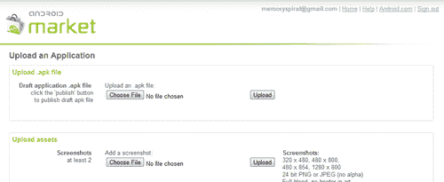

1.  在此页底部有三个按钮。我们可以点击**保存**以保存我们的应用程序资料以供以后编辑。点击**删除**按钮，将允许我们从 Android 市场完全移除一个应用程序。要发布我们的应用程序，我们将点击**发布**按钮。

### 注意

一旦发布应用程序，此按钮将显示为**取消发布**，如果用户已安装应用程序，则**删除**按钮将不再作为选项出现。


应用程序现在已发布到 Android 市场，可供全球数百万用户使用。

## 工作原理...

将应用程序上传并发布到 Android 市场，将允许用户下载并安装应用程序。我们对应用程序描述、版本信息以及相关图像资产拥有完全控制权。我们还能够从开发者区域跟踪评分和评论，并在必要时管理商家账户。发布到 Android 市场是即时的。没有像其他应用程序市场那样的审批和拒绝过程。

## 还有更多...

将应用程序更新到新版本比设置一个全新的应用程序简单得多：

1.  一旦进入安卓市场，点击现有应用程序的名称。这将允许你编辑与其相关的任何图片或文本。

1.  要实际发布应用程序的新版本，我们必须点击`[上传升级]`的链接。这将导致出现一组新的表单控件。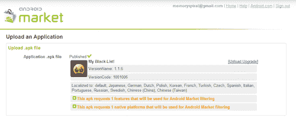

1.  点击**选择文件**并浏览新的`.apk`文件。现在点击**上传**将文件提交到谷歌服务器。

1.  新文件将被解析以获取版本信息并验证内容是否有效。对版本号、应用图标、请求的权限等所做的任何更改都将在草稿中反映出来。

1.  应用描述文件中定义的版本号必须高于之前提交的版本，以便进行有效的升级。如果需要，我们还可以在此页面对一般应用信息进行额外编辑。点击页面底部的**发布**，新版本将立即在安卓市场可用。
