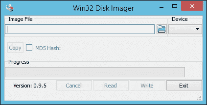
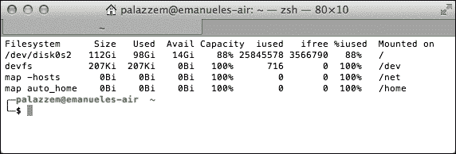
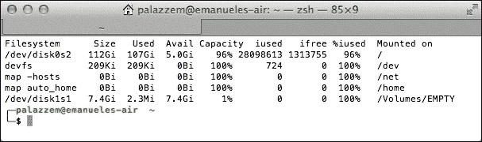
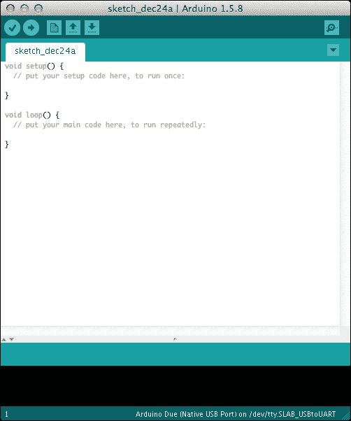
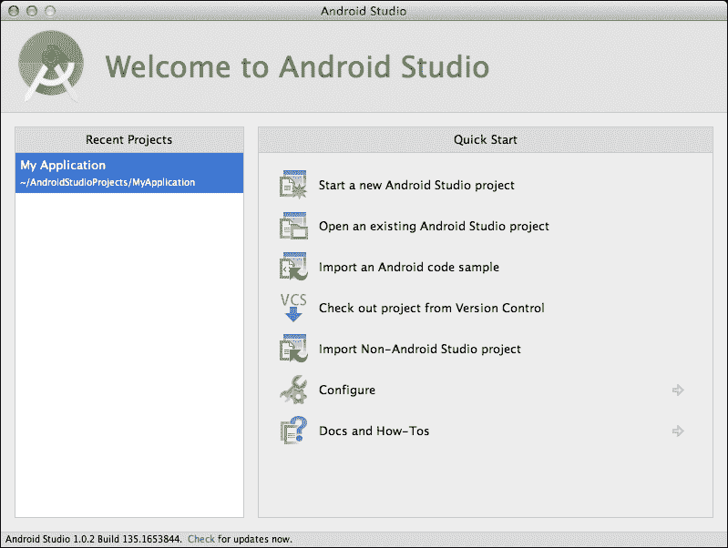
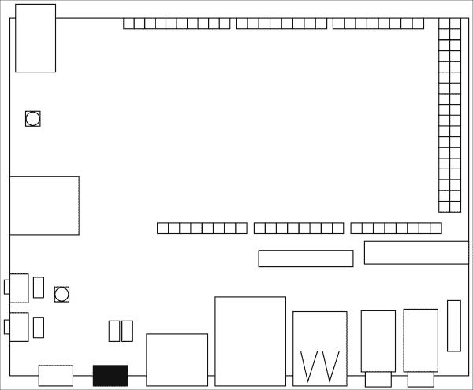

# 第一章：启动引擎

任何想法都应该从原型开始。不管是游戏、网络或移动应用程序，还是一般的软件组件，都无关紧要。每次我们想要向最终用户交付某些东西时，首先必须创建一个原型。这是最重要的一步，因为这时我们开始面临最初的困难，并且可能会改变我们项目的某些重要方面。

如果我们正在编写一个软件组件，第一个原型并不会太昂贵，因为我们需要的只是时间和热情。然而，当项目包含一些硬件部分时，这可能不适用，因为购买所有必需的组件可能过于昂贵。这一说法直到程序员、工程师和开源爱好者开始发布如**Arduino**之类的项目时才不再正确。

快速原型开发板使人们能够使用便宜或回收的旧组件来实现项目，再加上**自己动手**（**DIY**）的理念，使得一个遍布全球的巨大社区得以创建。这正是 UDOO 主板在创客社区中发挥重要作用的地方：硬件原型生态系统与传统编写软件应用程序的方式相结合，为交互式项目的创建提供了强大的组合。

在本章中，我们将更详细地探讨 UDOO 主板，重点关注开始时需要了解的重要元素。特别是，我们将涵盖以下内容：

+   探索 UDOO 平台及其主要特性

+   使用 Android 操作系统设置主板

+   为 Arduino 和 Android 配置开发环境

+   引导一个简单的 Android 应用程序

+   部署一个 Android 应用程序

# 介绍 UDOO 平台

UDOO 主板旨在为我们提供极大的灵活性，包括工具、编程语言以及构建第一个原型的环境。该主板的主要目标是参与物联网时代，这就是为什么内置 Atmel SAM3X8E ARM Cortex-M3 处理器成为其第一个构建块的原因。

这个处理器与 Arduino Due 主板所使用的相同，并且完全符合 Arduino 引脚布局。这一特性的结果是，该主板兼容所有 Arduino Due 屏蔽板以及大多数 Arduino Uno 屏蔽板，因此开发者可以转换和重用他们的旧程序和电路。

### 注意

UDOO 的 I/O 引脚是 3.3V 兼容的。例如，如果你使用的是一个 5V 供电的传感器，但其信号输出到 UDOO 引脚时为 3.3V，那么是可以的。另一方面，如果传感器以 5V 的信号输出到 UDOO，则会损坏你的主板。每次使用屏蔽或传感器时，请注意提供给 UDOO 引脚的输出电压。这一预防措施对于传统的 Arduino Due 主板同样适用。

第二个核心组件是强大的 Freescale i.MX 6 ARM Cortex-A9 处理器，有双核和四核版本。官方支持的操作系统是*UDOObuntu*，这是一个基于*Lubuntu 12.04 LTS armHF*的操作系统，出厂时预装了许多工具，可以快速上手。实际上，在第一次启动后，您就可以使用完全配置好的开发环境，直接在开发板上对板载 Arduino 进行编程。

尽管如此，使 UDOO 与其他开发板真正不同的是**对 Android 的支持**。凭借流畅的运行能力，这个操作系统对于新手或经验丰富的 Android 开发人员来说是一个巨大的机会，因为他们可以创建一种由 Android 用户界面、其强大的设计模式，甚至其他开发者的应用程序提供支持的新型真实世界应用程序。

### 注意

开发人员可以选择使用 Linux 操作系统编写他们的真实应用程序。在这种情况下，他们可以使用许多知名的编程语言编写 Web 服务或桌面应用程序，如 Python、Javascript（Node.js）、Php 和 Java。然而，我们将重点放在 Android 下的应用程序开发上。

最后一个核心组件与所有 I/O 组件相关。UDOO 可以配备内部 Wi-Fi 和千兆以太网，它们都可以被 Linux 和 Android 识别。它还提供**HDMI**（**高清晰度多媒体接口**）输出连接，并配有集成的**晶体管-晶体管逻辑**（**TTL**）到**低电压差分信号**（**LVDS**）扩展槽，以便开发人员可以连接外部 LVDS 触摸屏。

### 注意

在本书的学习过程中，我们假设您将通过 HDMI 线将 UDOO 连接到外部显示器。然而，如果您拥有一个外部 LVDS 面板，可以在本章的*我们的第一次运行*部分之前进行连接。为了让 Android 使用外部面板，您应该按照官方网站上的步骤进行操作，具体步骤可以在[`www.udoo.org/faq-items/how-do-i-set-up-my-lvds/`](http://www.udoo.org/faq-items/how-do-i-set-up-my-lvds/)找到。

另一个官方支持的重要组件是摄像头模块，它易于插入开发板，并可用于需要计算机视觉或图像分析的项目。最后一个集成组件是音频卡，通过外部麦克风可以实现完全功能的音频播放和录制。

这些组件的结合，加上互联网接入和许多 Android API，使我们有机会构建真实世界的应用程序，这些程序能够监听环境并与设备进行交互，一块可以参与*物联网*的板子。

# 下载和安装 Android

我们已经了解了一些可能用于开始构建惊人项目的 UDOO 组件列表。但是，在我们继续之前，我们需要配置我们的开发板以运行 Android 操作系统，还需要配置我们的开发环境，这样我们就可以开始编写并部署我们的第一个应用程序。

### 注意

在本书中构建的所有原型都是基于 Android KitKat 4.4.2，这是本书编写时支持的最新版本。在本书的学习过程中，你将构建许多项目，这些项目使用了**Android 支持库**以确保与 UDOO 开发板将支持的较新 Android 版本兼容。

UDOO 开发板没有内置存储或内置启动程序，因为它依赖于外部存储，即 microSD 卡，你可以在其中安装引导加载程序和兼容的操作系统。创建可启动 microSD 卡的最简单方法是下载并复制预编译的镜像，尽管也可以使用发布的二进制文件和内核源代码创建干净的操作系统。

[`www.udoo.org/downloads/`](http://www.udoo.org/downloads/)指向 UDOO 官方网站的下载页面，其中包含所有可用的预编译镜像的链接。

在 Linux 镜像中，我们可以找到并下载最新支持的 Android KitKat 4.4.2 版本。正如之前所述，UDOO 有两个不同版本，分别配备双核和四核处理器，因此我们必须根据所拥有的平台下载正确的版本。

## 从 Windows 安装

要从 Windows 安装 Android 镜像，你需要一些额外的工具来解压并将镜像复制到 microSD 卡中。下载的`.zip`文件是 7-Zip 压缩格式，因此你需要安装一个第三方解压缩程序，如 7-Zip。解压过程完成后，我们得到了一个未压缩的`.img`文件，可以将其复制到空卡上。

要将未压缩的镜像写入我们的 microSD 卡，请执行以下步骤：

1.  将你的 microSD 卡插入内置的插槽读取器或外部读卡器。

1.  使用`FAT32`文件系统格式化卡片。

1.  要将镜像写入 microSD 卡，我们需要使用 Win32DiskImager 工具。从以下链接下载：[`sourceforge.net/projects/win32diskimager/`](http://sourceforge.net/projects/win32diskimager/)。

1.  运行应用程序，但请记住，如果我们使用的是 Windows 7 或 Windows 8.x，我们必须右键点击`Win32DiskImager.exe`可执行文件，并确保从上下文菜单中选择**以管理员身份运行**的选项。

1.  Win32DiskImager 是一个使用低级别指令写入原始磁盘镜像的工具。这意味着你需要严格按照以下步骤操作，并确保你正确选择了输出设备。如果这个选项错了，你可能会丢失来自不想要存储内存的所有数据。

1.  应用程序启动后，你可以看到如下截图所示的主窗口：

1.  在应用程序的主窗口中，在**镜像文件**框内，选择之前解压的`.img`文件。

1.  准确地在**设备**下拉菜单中选择 microSD 驱动器，并记住如果我们选择了错误的驱动器，可能会破坏计算机硬盘上的所有数据。

1.  点击**写入**按钮，等待进程完成，以便在 microSD 卡中拥有可启动的 Android 操作系统。

## 从 Mac OS X 安装

要从 Mac OS X 安装 Android 镜像，我们需要一个第三方工具来解压下载的`.zip`文件，因为它采用 7-Zip 压缩格式，我们不能使用内置的解压缩软件。我们必须下载像 Keka 这样的软件，它可以在[`www.kekaosx.com/`](http://www.kekaosx.com/)免费获得。

如果我们喜欢 Mac OS X 终端，可以使用 Homebrew 包管理器，它可以在[`brew.sh/`](http://brew.sh/)找到。

在此情况下，从命令行，我们可以简单地安装`p7zip`包并使用`7za`工具按以下方式解压文件：

```kt
brew install p7zip
7za x [path_to_zip_file]

```

为了将未压缩的镜像写入我们的 microSD 卡，执行以下步骤：

1.  启动**终端**应用程序，进入我们下载并解压 Android 镜像文件的文件夹。假设该文件夹名为`Downloads`，我们可以输入以下命令：

    ```kt
    cd Downloads

    ```

1.  使用以下命令获取所有已挂载设备的列表：

    ```kt
    df -h

    ```

1.  所有系统和内部硬盘分区的列表将与以下截图类似：

1.  使用内置或外置读卡器连接 microSD 卡。

1.  通过系统已提供的磁盘工具应用程序格式化 microSD 卡。启动它，并从左侧列表中选择正确的磁盘。

1.  在窗口的主面板上，从顶部菜单选择**擦除**标签页，并在**格式**下拉菜单中选择**MS-DOS (FAT)**文件系统。准备好后，点击**擦除**按钮。

1.  从终端应用程序中，再次启动之前的命令：

    ```kt
    df –h

    ```

1.  挂载分区的列表已经改变，如下面的截图所示：

1.  我们可以假设在首次运行时缺少的设备是我们的 microSD 卡，因此我们必须记住**文件系统**列下的新值。如果你查看之前的截图，我们的分区名为`/dev/disk1s1`而不是`/dev/disk0s2`，因为那是我们的硬盘。

1.  找到正确的分区后，我们必须使用以下命令卸载它：

    ```kt
    sudo diskutil unmount /dev/[partition_name]

    ```

1.  为了将镜像写入 microSD 卡，我们必须找到原始磁盘设备，这样我们就可以擦除并将 Android 镜像写入卡中。假设之前找到的分区名为`/dev/disk1s1`，相关的原始磁盘将是`/dev/rdisk1`。

    ### 注意

    我们将要使用 `dd` 工具。这个命令使用低级指令写入原始磁盘镜像。这意味着你需要严格遵循以下步骤，并确保你选择了正确的磁盘设备，因为如果选择错误，你可能会因为不想要的存储而丢失所有数据。

1.  使用 `dd` 将之前解压的镜像写入 microSD 卡，命令如下：

    ```kt
    sudo dd bs=1m if=[udoo_image_name].img of=/dev/[raw_disk_name]

    ```

    之前命令的完整示例如下：

    ```kt
    sudo dd bs=1m if=[udoo_image_name].img of=/dev/rdisk1

    ```

1.  当我们执行命令时，看似没有任何反应，但实际上，`dd` 在后台写入 Android 镜像。一旦进程完成，它会输出传输字节的报告，如下例所示：

    ```kt
    6771+1 records in
    6771+1 records out
    7100656640 bytes transferred in 1395.441422 secs (5088466 bytes/sec)

    ```

1.  现在我们有了可启动的 Android 操作系统，我们可以使用以下命令弹出 microSD 卡：

    ```kt
    sudo diskutil eject /dev/[raw_disk_name]

    ```

## 从 Linux 安装

要从 Linux 安装 Android 镜像，我们需要一个第三方工具来解压下载的 `.zip` 文件。因为文件是使用 7-Zip 压缩格式，我们需要通过命令行使用发行版的包管理器安装 `p7zip` 包。然后我们可以使用 `7za` 工具解压文件，或者使用任何让你感到舒适的图形化解压缩工具。

我们可以通过以下步骤将未压缩的镜像写入我们的 microSD 卡：

1.  打开 Linux 终端，进入我们下载并解压 Android 镜像的文件夹。假设文件在我们的 `Downloads` 文件夹中，我们可以输入以下命令：

    ```kt
    cd Downloads

    ```

1.  使用内置或外置读卡器连接 microSD 卡。

1.  通过以下命令找到正确的设备名称：

    ```kt
    sudo fdisk -l | grep Disk

    ```

1.  输出是找到的所有设备的筛选列表，其中包含，例如：

    ```kt
    Disk /dev/sda: 160.0 GB, 160041885696 bytes
    Disk /dev/mapper/ubuntu--vg-root: 157.5 GB, 157454172160 bytes
    Disk /dev/sdb: 7948 MB, 7948206080 bytes

    ```

    在此例中，`/dev/sda` 是我们的硬盘，而 `/dev/sdb` 是我们的 microSD 卡。如果情况并非如此，且你使用的是内置读卡器，那么设备名称可能是 `/dev/mmcblk0`。

    找到正确的设备名称后，请记住，我们稍后会使用它。

1.  通过以下命令查找上述设备的所有已挂载分区：

    ```kt
    mount | grep [device_name]

    ```

1.  如果之前的命令产生了输出，找到输出中第一列可用的分区名称，并通过以下命令卸载列出的任何分区：

    ```kt
    sudo umount /dev/[partition_name]

    ```

    ### 注意

    `dd` 是一个使用低级指令写入原始磁盘镜像的工具。这意味着你需要严格遵循以下步骤，并确保你选择了正确的磁盘设备，因为如果选择错误，你可能会因为不想要的存储设备而丢失所有数据。

1.  使用 `dd` 命令将之前解压的镜像写入上述设备名称：

    ```kt
    sudo dd bs=1M if=[udoo_image_name].img of=/dev/[device_name]

    ```

    假设 `/dev/sdb` 是我们的 microSD 卡，以下是一个完整示例：

    ```kt
    sudo dd bs=1M if=[udoo_image_name].img of=/dev/sdb

    ```

1.  当我们执行命令时，看似没有任何反应，但实际上，`dd` 在后台写入镜像。进程完成后，它会输出传输字节的报告，如下所示：

    ```kt
    6771+1 records in
    6771+1 records out
    7100656640 bytes transferred in 1395.441422 secs (5088466 bytes/sec)

    ```

1.  现在我们有了可启动的 Android 操作系统，可以使用以下命令弹出 microSD 卡：

    ```kt
    sudo eject /dev/[device_name]

    ```

## 我们的首个运行

一旦我们有了可启动的 microSD 卡，我们可以将其插入 UDOO 主板，使用外部显示器或 LVDS 面板，并连接鼠标和键盘。打开电源后，会出现 Android 标志，当加载过程完成后，我们最终可以看到 Android 主界面。

# 设置开发环境

现在 UDOO 主板上的 Android 系统已经完全功能正常，是时候配置开发环境了。我们将要构建的每个项目都由两个不同的运行应用程序组成：第一个是物理应用程序，由一个能够通过 UDOO I/O 引脚控制外部电路的 Arduino 程序组成；第二个是在板上运行并处理用户界面的 Android 应用程序。

因为我们需要编写两个相互交互的不同应用程序，所以我们需要用两个不同的 IDE 配置开发环境。

## 安装和使用 Arduino IDE

在我们开始上传程序之前，需要安装 *microUSB 串行端口驱动程序*，以便我们可以正确与主板上的 Arduino 进行通信。与 **通用异步收发传输器** (**UART**) 相兼容的 USB 驱动程序，适用于板上的 CP210x 转换器，可以从以下链接下载

[`www.silabs.com/products/mcu/pages/usbtouartbridgevcpdrivers.aspx`](http://www.silabs.com/products/mcu/pages/usbtouartbridgevcpdrivers.aspx).

在这里，我们需要根据操作系统选择正确的版本。下载完成后，我们可以解压存档，并双击可执行文件进行安装。安装过程完成后，我们可能需要重启系统。

现在 microUSB 桥接驱动程序已经可以工作，从 Arduino 网站，我们需要下载 IDE 1.5x 测试版，因为目前，测试版是唯一支持 Arduino Due 主板的版本。链接 [`arduino.cc/en/Main/Software#toc3`](http://arduino.cc/en/Main/Software#toc3) 直接指向最新版本。

### 注意事项

为了上传新程序，UDOO 需要在上传前后分别从串行端口接收 ERASE 和 RESET 信号。在官方的 Arduino Due 主板上，这个操作是由集成的 ATmega16U2 微控制器执行的，而 UDOO 主板上缺少这个微控制器。Arduino IDE 将会处理这个过程，但如果你将来想使用另一个 IDE，你就需要自己处理。

### 在 Windows 中的安装

在 Windows 上安装时，我们有两种不同的选择：使用提供的安装程序或使用归档文件进行非管理员安装。如果我们选择使用安装程序，可以双击可执行文件。当安装程序询问我们想要安装哪些组件时，请确保选中所有的复选框。如果我们选择使用归档文件而不是安装程序，提取文件并将结果目录放入你的用户文件夹中。

### 在 Mac OS X 上安装

在 Mac OS X 上安装时，我们需要下载归档版本。如果我们运行的是大于 10.7 的 OS X 版本，可以下载 Java 7 版本。在其他情况下，或者如果你不确定，请下载 Java 6 版本。

下载完成后，我们需要双击归档文件以进行解压，然后将 Arduino 应用程序图标拖放到我们的 `Applications` 文件夹中。

### 在 Linux 上安装

在 Linux 上安装时，我们需要下载与我们 32 位或 64 位架构支持的归档版本。下载完成后，我们可以解压 IDE 并将其放入我们的 `home` 文件夹或其他你选择的文件夹中。

### 首次启动

既然我们已经完成了通信驱动和 IDE 的配置，并打上了正确的补丁，我们可以启动并查看如下截图所示的 Arduino IDE：



## 安装和使用 Android Studio

搭载 Android 操作系统的 UDOO 与其他传统 Android 设备类似。这意味着我们可以使用标准的工具链、构建系统和用于开发智能手机或平板应用程序的 IDE。目前，可用的工具链与两个主要的 IDE 相关：Eclipse 和 Android Studio。

Eclipse 是一个开源 IDE，拥有一个高级插件系统，可以轻松扩展其许多核心功能。这使得 Google 开发了**Android Development Tool**（**ADT**）插件，以创建一个集成开发环境，让开发者可以编写、调试和打包他们的 Android 应用程序。

Android Studio 是一个较新项目，2013 年 5 月发布了第一个测试版，而第一个稳定版本是在 2014 年 12 月发布的。基于知名的 Java IDE IntelliJ IDEA，它由 **Gradle** 构建系统提供支持，该系统结合了 **Ant** 的灵活性以及 **Maven** 的依赖管理。所有这些特点，加上越来越多的插件、最佳实践、**Google Cloud Platform**集成和第三方服务如 **Travis CI** 的集成，使得 Android Studio 成为未来项目开发的一个绝佳选择。

本书涵盖的所有 Android 项目都是使用 Android Studio 构建的，如果你是一个新手或经验丰富的 Android 开发者，且习惯使用 Eclipse，这可能是一个尝试新 Android Studio 的好机会。

首先需要从[`developer.android.com/sdk/`](https://developer.android.com/sdk/)下载适用于您操作系统的最新版 Android Studio。

当开始下载时，我们会重定向到与我们的操作系统相关的安装说明，当我们完成安装后，可以启动 IDE。在首次运行时，IDE 将进行所有必要的检查以获取并安装最新的可用 SDK、虚拟设备和构建系统，让您开始开发第一个应用程序。在**设置向导 - SDK 设置**页面，确保选择**Android SDK**和**Android Virtual Device**组件，然后点击**下一步**。在下一页中，您应该接受所有 Android 许可，然后点击**完成**。

安装完 IDE 后，我们可以启动 Android Studio。以下截图显示了未打开项目时的主窗口：



# 运行您的第一个 Android 应用程序

现在 Android 已经安装在我们的 UDOO 板上，所有开发环境都已配置，我们可以开始编写并部署我们的第一个 Android 应用程序。以下是其他开发者在开始深入研究新技术时的默认模式。我们将编写并部署一个简单的 Android 应用程序，该程序打印出 Hello World!。

为了启动我们的第一个项目，请执行以下步骤：

1.  在 Android Studio 的主窗口中，点击**开始一个新的 Android Studio 项目**。

1.  在**应用程序名称**字段中，输入`HelloWorld`；在**公司域名**中，写入您的域名或如果您目前没有的话，可以写`example.com`。然后点击**下一步**。

1.  在形态因素选择窗口中，选择**手机和平板**，并在**最低 SDK**中选择**API 19: Android 4.4 (KitKat)**。然后点击**下一步**。

1.  在添加活动页面，为了这个 hello world 应用程序的目的，选择**空白活动**选项并点击**下一步**。

1.  在**活动选项**页面，在**活动名称**中写入*HelloWorld*并点击**完成**。

    ### 提示

    在接下来的章节中，我们将从头开始创建应用程序，因此我们必须记住前面的步骤，因为在这本书中我们将多次重复这个过程。

现在 Android Studio 将开始下载所有 Gradle 需求，以准备我们的构建系统。当这个过程完成后，我们得到了第一个 HelloWorld 应用程序。

在不编写任何代码的情况下，我们已经创建了一个可部署的应用程序。现在，我们需要使用 microUSB 到 USB 电缆连接我们的 UDOO 板。如果我们查看一下主板，我们会看到两个不同的 microUSB 端口。左边的第一个端口，我们将在下一章中使用它，将我们的计算机连接到两个处理器的串行端口，因此我们可以使用它将 Arduino 程序上传到 UDOO 微控制器，或者我们可以使用它访问 Android 系统 shell。串行端口的激活通信取决于 J18 跳线的状态，是插入还是未插入。而右边的 microUSB 端口则将我们的计算机连接到运行 Android 的 i.MX 6 处理器，我们将使用它来上传我们的 Android 应用程序。你可以在 UDOO 官方网站上找到更多关于处理器通信的信息[`www.udoo.org/features/processors-communication/`](http://www.udoo.org/features/processors-communication/)。

为了将我们的计算机连接到 Android 操作系统以进行应用程序上传过程，我们需要使用下面截图中标有黑色的右侧 microUSB 端口：



就像在传统的 Android 应用程序中所做的那样，我们可以从顶部菜单点击**Run**（运行），然后点击**Run app**（运行应用）。此时，我们需要选择一个运行设备，但不幸的是，我们可用的设备列表是空的。这个问题是由于处理器间内部通信的方式导致的。

启动时间之后，两个处理器之间的连接已启用，插入 microUSB 电缆将不会产生任何效果。这是因为 Android 在与 Arduino 通信时并不使用内部 UART 串行端口。它使用的是**USB On-The-Go**（**OTG**）总线，允许设备充当主机，并让其他组件（如闪存驱动器、鼠标、键盘或 Arduino）通过它连接。

i.MX 6 处理器物理连接到 OTG 总线，而总线的另一端同时连接到 Arduino 和外部 microUSB 连接器。当前活动的连接可以通过软件控制的开关进行更改。当外部 OTG 端口启用时，Android 可以通过 microUSB 端口与外部计算机通信，但不能将任何数据发送回板载 Arduino。相反，当外部 OTG 端口禁用时，Android 可以与 Arduino 通信，但与计算机的连接会中断。

后者是我们的实际配置，我们需要切换 OTG 端口以启用与计算机的外部通信，完成应用程序部署。在 Android 系统中，我们必须进入**设置菜单**，选择**开发者选项**。在那里，我们需要勾选**启用外部 OTG 端口**的复选框。如果连接了 USB 线，会出现一个弹窗要求我们允许 USB 调试。如果是我们的主计算机，我们可能想要选择**始终允许此计算机**，然后点击**确定**。如果没有勾选这个选项，每次我们连接 UDOO 到计算机时都会显示弹窗。

### 注意事项

请记住，每次我们需要部署 Android 应用程序时，都需要启用外部 OTG 端口。相反，当我们的应用程序部署好，需要 Android 与 Arduino 通信时，我们需要禁用外部 OTG 端口。

现在，我们的计算机可以将 UDOO 板视为传统的 Android 设备，我们可以尝试再次部署我们的应用程序。这次，在**选择设备**对话框中，我们可以找到一个 Freescale UDOO Android 设备。选择它并点击**确定**。我们的首次部署完成，现在我们可以在连接的监视器上看到 HelloWorld 应用程序。

# 总结

在本章中，我们了解了一些 UDOO 的特性，这些特性使这块开发板与其他开发板区分开来。最大的区别之一是与 Android 平台的全面支持，这让我们能够在板上安装和配置最新支持的版本。

我们探索了开始开发实际应用所需的工具，并配置了我们的开发环境以编写 Android 应用程序和 Arduino 程序。

我们简要介绍了两个处理器之间如何通信以及如何切换 OTG 端口以启用外部访问，完成首次部署。在下一章中，我们将从零开始创建一个新的 Android 应用程序，能够使用并控制通过一套原型工具构建的物理设备。
