# 第二章：了解你的工具

如上一章所述，现实世界应用不仅仅是软件。它们由在物理世界中执行动作的简单或复杂电路组成。在我们开始构建第一个交互式项目之前，我们需要了解这些物理组件是如何工作的，这样我们才知道工具箱里有什么。

在本章中，我们将涵盖以下主题：

+   上传第一个 Arduino 程序

+   与 Arduino 建立连接

+   编写一个能作为控制器作用的 Android 应用

+   构建一个由 Android 控制的简单电路

# 介绍 Arduino Due 的功能

物理世界由我们以光、热、声音或运动形式感知的多种能量形式组成。当我们在驾车时，靠近交通灯，看到前方红灯亮起，我们会开始减速并停车。我们只是感知了一种光能形式，这使我们改变了活动，因为有人教过我们每个交通灯阶段的意义。

这种自然行为正是我们希望带到我们的交互式物理应用中的。我们使用的硬件设备叫做**传感器**，它们监听环境，并与其他硬件组件，即**执行器**协同工作，执行现实世界中的动作。然而，我们需要一个叫做**微控制器**的第三种元素，它使用连接的传感器和执行器来感知并改变周围环境，根据上传的程序进行操作。

板载的 Arduino Due 采用了最新的部件，并提供了一种连接外部电子组件的通用方式。它有 54 个数字 I/O 引脚，我们可以使用它们发送或接收数字信号。当我们想要从外部设备（如开关或按钮）收集输入时，这特别有用，同时我们可以发送数字信号以打开或关闭简单的组件。在下面的图表中，你可以看到所有的数字引脚都是黑色的：

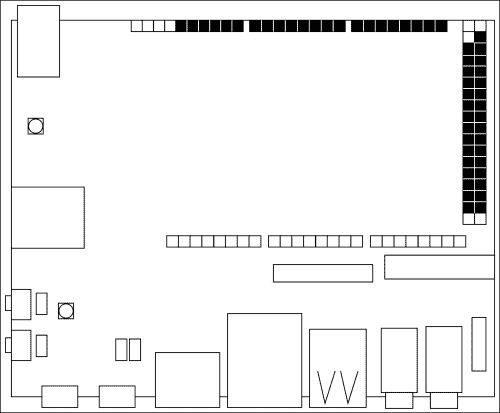

我们可以使用 12 个模拟输入，其 12 位分辨率可以读取 4096 个不同的值。当需要从传感器收集数据，并使用返回值作为程序改变物理设备行为的条件时，它们非常有用。读取值的良好例子与温度、光线或接近传感器相关。板子还提供了 2 个**数字至模拟转换器**（**DAC**），具有 12 位分辨率，当需要使用数字信号驱动模拟设备时，可以作为模拟输出使用。当你需要用你的设备创建音频输出时，使用 DAC I/O 引脚的一个好例子。在下面的图表中，你将找到所有模拟引脚都是黑色的，而 2 个 DAC 引脚是灰色的：

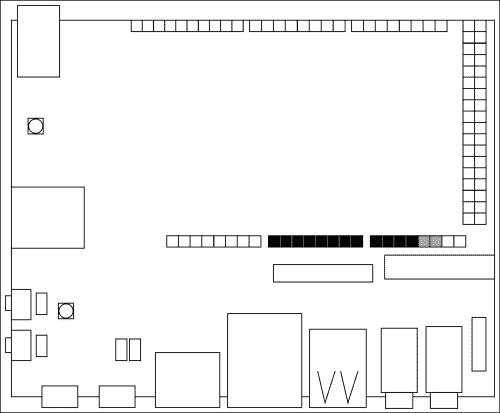

有了这些功能，我们就有了一切必要的工具来从我们的 Android 应用程序中控制小型设备。另一方面，我们也可以反过来利用，让连接的设备改变我们 Android 界面的行为。

然而，当 UDO 用于控制复杂的电路并且可能需要一个硬件驱动程序与它交互时，UDO 才能真正显示出其强大的功能。当我们打算回收我们已拥有的设备，如旧玩具，或者购买新设备如小型电动机器人或漫游车时，这可能会成为一种常见的方法。

构建硬件驱动程序是一项昂贵的任务，需要软件和电子方面的丰富经验。UDO 通过板载 Arduino 使这项任务变得简单，因为它重用了制造商社区构建的所有组件。我们可以通过将 UDO 与一个*盾板*结合来添加其他功能，这是一个可插拔的板，它实现了一个复杂的电路，包含了所有必需的硬件逻辑。好的例子包括兼容 Arduino 的 LCD 屏幕、蓝牙控制器以及控制连接电机的电机盾板，只需几行代码，无需构建外部电路。

## 上传第一个程序

既然我们已经了解了 UDO 板的主要组件和能力，我们可以开始编写并上传我们的第一个程序。我们必须牢记，尽管 SAM3X 是一个独立的处理器，但我们仍需要一个带有有效 UDO 镜像的工作 microSD 卡，否则 Arduino 编程器将无法工作。

就像之前为 Android 所做的那样，我们将编写一个简单的应用程序，在屏幕上打印“Hello World!”，此时不需要任何 Android 交互。在打开 Arduino IDE 之前，我们需要通过左侧的 microUSB 端口将板连接到我们的计算机，如下图所示：

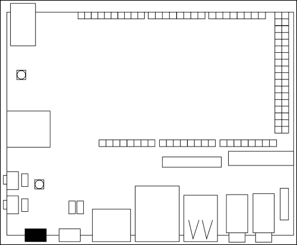

然而，这种连接不足以让 Arduino SAM3X 和我们的计算机之间进行正确的通信，因为这两个处理器都使用这个 microUSB 端口通过串行端口与连接的设备进行通信。一个内部物理开关在运行 Android 的 i.MX6 和 Arduino SAM3X 之间选择连接的处理器。

### 注意

这是一个不同的连接，不是前一章中使用的那个。它指的是串行端口，不应与用于部署 Android 应用程序的 OTG microUSB 端口混淆。

为了使我们的计算机和 SAM3X 之间能够连接，我们必须拔掉下图所示的物理**跳线 J18**：

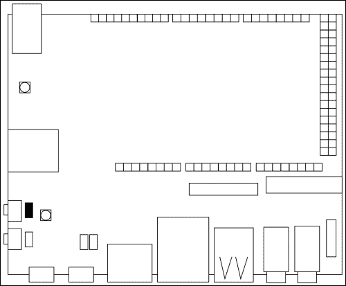

现在我们准备启动 Arduino IDE 并继续编写和上传我们的第一个程序。当 IDE 出现时，它将打开一个空程序。为 Arduino 编写的每个程序和代码都称为**草图**。Arduino 草图使用一组简化的 C/C++编写，如果您感兴趣，可以在[`arduino.cc/en/Reference/HomePage`](http://arduino.cc/en/Reference/HomePage)找到完整的参考资料。

初始草图包含以下两个函数：

+   `setup()`: 这在初始执行时被调用一次，我们在其中放置所有初始配置。

+   `loop()`: 这会在设备关闭之前不断被调用，它代表了我们草图的内核。

我们所有的草图都必须包含这两个函数，否则程序将无法工作。我们可以添加自己的函数以使代码更具可读性和可重用性，这样我们就可以遵循编程原则**不要重复自己**（**DRY**）。

### 注意

我们必须记住，我们是为一个最多有 512 KB 可用内存来存储代码的微控制器编写软件。此外，草图在运行时创建和操作变量的 96 KB SRAM 限制。对于复杂项目，我们应该始终优化代码以减少使用的内存，但为了本书的目的，我们编写代码使其更具可读性和易于实现。

要在屏幕上打印出“Hello World!”，我们需要编写一个向内置串行端口写入字符串的草图。这个草图可以通过以下简单步骤实现：

1.  在`setup()`函数中，以指定的每秒**比特数**（**波特**）初始化串行端口，如下所示：

    ```kt
    void setup() {
     Serial.begin(115200);
    }
    ```

    我们选择每秒`115200`波特率，因为板载的 Arduino Due 支持这个数据率。

    ### 提示

    **下载示例代码**

    您可以从您的账户下载您购买的所有 Packt 图书的示例代码文件，网址是[`www.packtpub.com`](http://www.packtpub.com)。如果您在别处购买了这本书，可以访问[`www.packtpub.com/support`](http://www.packtpub.com/support)注册，我们会将文件直接通过电子邮件发送给您。

1.  在主`loop()`函数中使用`println()`函数向串行端口写入：

    ```kt
    void loop() {
     Serial.println("Hello World!");
    }
    ```

    即使我们有上传我们项目的冲动，我们也必须记住`loop()`函数会不断被调用，这意味着我们可能会收到太多的“Hello World!”实例。一个好方法是添加一个`delay()`函数，这样 Arduino 在再次开始`loop()`函数之前会等待给定毫秒数。

1.  要每秒打印一句话，请添加以下突出显示的代码：

    ```kt
    void loop() {
     Serial.println("Hello World!");
     delay(1000);
    }
    ```

现在我们准备开始上传过程。这个过程包括两个阶段，首先编译我们的代码，然后上传到 SAM3X 处理器。如果我们上传两个不同的草图，最新的会覆盖第一个，因为我们一次只能加载和执行一个草图。

在这种情况下，我们需要配置 IDE，使其能够为连接到正确串行端口的正确电路板编程。点击**工具**，悬停在**电路板**上并选择**Arduino Due (编程端口)**。现在点击**工具**，悬停在**端口**上，并选择你配置的端口。正确的端口取决于你的操作系统，它们通常具有以下值：

+   在 Windows 中：编号最高的`COM`端口

+   在 Mac OS X 中：`/dev/tty.SLAB_USBtoUART`

+   在 Linux 中：`/dev/ttyUSB0`

要上传程序，请点击**文件**，然后点击**上传**，或者使用工具栏中可用的快捷方式。如果上传过程顺利，你将在窗口底部看到以下输出的记录器：

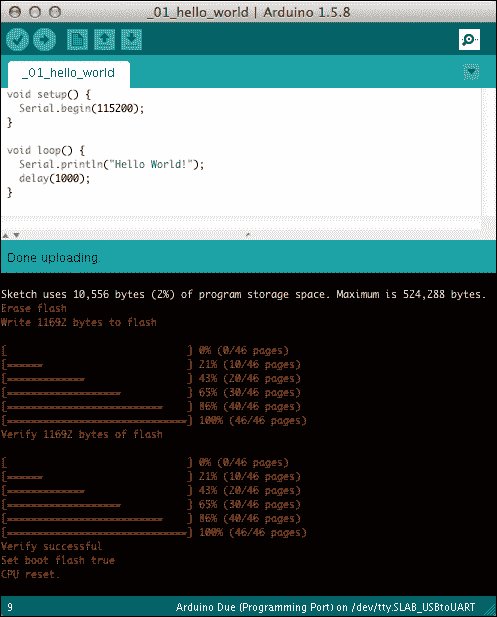

为了确保我们的第一个草图按预期工作，我们需要使用串行端口阅读器，而 Arduino IDE 提供了一个内置的串行监视器。点击**工具**，然后点击**串行监视器**，或者使用工具栏中可用的快捷方式。我们可能会看到一些奇怪的字符，这是因为串行监视器默认配置为以 9600 波特读取串行。在右下角的下拉菜单中，选择**115200 波特**以查看以下输出：

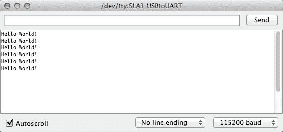

### 注意

使用`Serial.println()`函数可以通过串行端口发送数据。这并不是用来与 i.MX6 处理器通信的，但这是从电脑调试变量或草图流程的好方法。

当我们完成草图上传后，我们可以插入**J18 跳线**。现在我们知道如何部署 Android 应用程序和 Arduino 草图了，是时候从头开始构建我们的第一个项目了。

# 与现实世界的互动

我们第一个现实世界的原型应该是一个可以用来控制简单电子元件的 Android 应用程序。我们必须选择一个不太简单的东西，以便我们可以对其进行实验，同时也不要太复杂，以便我们可以深入了解所有主要概念，而不需要太多实现细节。一个好的起点是创建一个控制器，我们可以使用它来打开和关闭实际的**发光二极管**（**LED**）组件。

然而，在我们继续之前，我们必须了解如何创建 Android 应用程序和草图之间的通信。在部署过程中，我们通常会启用外部 OTG 端口，以便从电脑与 i.MX6 处理器通信。如果我们禁用这个选项，内部的开关会激活 i.MX6 和 SAM3X 处理器之间的双向通信。这是可能的，因为 Arduino Due 完全支持 USB OTG 连接，我们使用这个连接让 Android 和 Arduino 相互通信。

不幸的是，如果我们没有一个通信协议，上述软件开关并不十分有用。这就是**Accessory Development Kit**（**ADK**）发挥重要作用的地方。它是谷歌开发的参考实现，用于构建 Android 配件，并提供了一套软件库。UDOOboard 完全支持 ADK。通过将内部 Android API 与外部 Arduino 库相结合，我们可以轻松地使用这些功能发送命令和接收数据。这样，我们的 Android 将把我们的 Arduino 设备视为一个*Android 配件*，从而在应用程序和整个系统中支持这种连接。我们可以在[`developer.android.com/tools/adk/index.html`](http://developer.android.com/tools/adk/index.html)找到关于 ADK 的更多详细信息。

## 与 Arduino 通信

这个原型的第一步是开始一个新的草图，并从 Arduino 端设置初始连接。在我们空白的草图顶部，我们应该添加以下代码：

```kt
#include <adk.h>
#define BUFFSIZE 128
#define LED 2
```

`adk.h`头文件包含了所有我们需要的声明，用于许多实用工具和函数，例如初始化 ADK 连接，向 Android 发送硬件信息，以及两个处理器之间缓冲数据的读写。在上述代码中，我们还定义了两个*宏对象*，分别提供了读写缓冲区的最大尺寸以及用于打开和关闭 LED 的引脚。我们需要记住这个数字，因为稍后当我们连接第一个电子元件时会重新使用到它。

通过 ADK 使用的协议，Android 将 Arduino 识别为外部配件。为了将我们的配件与其他配件区分开来，Android 需要一个**配件描述符**，我们可以使用以下代码提供：

```kt
char accessoryName[] = "LED lamp";
char manufacturer[] = "Example, Inc.";
char model[] = "LedLamp";
char versionNumber[] = "0.1.0";
char serialNumber[] = "1";
char url[] = "http://www.example.com";
```

在这里，我们提供了关于配件名称、硬件制造商名称和模型唯一标识符的信息。除了这些原型描述符之外，我们还必须定义硬件版本和序列号，因为当我们将设备连接到 Android 应用程序时，这些信息是强烈需要的。实际上，`versionNumber`、`model`和`manufacturer`参数将与稍后我们提供给 Android 应用程序的值进行匹配，如果有不匹配的情况，我们的草图将不会被 Android 应用程序识别。通过这种方式，我们还可以在应用程序版本和硬件版本之间保持强绑定，以避免旧的 Android 应用程序错误地控制新的硬件发布。

### 注意

前面的描述符是 Android 应用程序识别草图和硬件所必需的。但是，请记住，这是良好*编程礼仪*的一部分，对于每个应用程序和原型，你都应该提供版本编号以及变更日志。在本书中，我们将使用**语义版本控制**，你可以访问[`semver.org`](http://semver.org)了解更多信息。

最后一个参数是`url`，Android 使用它将用户重定向到一个网站，在那里他们可以找到关于已连接配件的更多信息。每当 Android 找不到能够管理 Arduino 配件交互的已安装应用程序时，它都会显示该消息。

### 提示

在大多数情况下，将`url`参数设置为可以下载并安装打包的 Android 应用程序的链接是一个好主意。这样，如果缺少 Android 应用程序，我们就提供了一种快速获取和安装的方法，这对于将我们原型的原理图和草图分发给其他开发者尤其有用。你可以访问[`developer.android.com/tools/building/building-studio.html`](https://developer.android.com/tools/building/building-studio.html)了解更多关于如何使用 Android Studio 创建打包应用程序的信息。

为了完成 ADK 配置，我们必须在之前的声明下方添加以下代码：

```kt
uint8_t buffer[BUFFSIZE];
uint32_t bytesRead = 0;
USBHost Usb;
ADK adk(&Usb, manufacturer, model, accessoryName, versionNumber, url, serialNumber);
```

我们在读写操作期间声明了使用的`buffer`参数和一个`USBHost`对象。我们在主`loop()`函数中使用它来初始化连接，以便在发现过程中 Android 接收所有必要的信息。在最后一行，我们使用定义的值初始化 ADK 配件描述符。

要开始连接，我们需要将以下代码放入`loop()`函数中：

```kt
void loop(){
 Usb.Task();
 if (adk.isReady()) {
 // Do something
 }
}
```

`Usb.Task()`函数调用轮询连接的 USB 设备以获取它们状态更新，并等待 5 秒钟以查看是否有任何设备响应更新请求。当 Android 响应轮询时，我们使用条件语句评估`adk.isReady()`函数调用。当设备连接并准备好与 Android 通信时，它返回`True`，这样我们就能确切知道 Android 系统何时读取原型描述符以及何时通知已安装的应用程序连接了新的配件。

我们的初始配置已完成，现在可以将草图上传到电路板中。当草图上传完毕，我们禁用 OTG 外部端口时，Android 将发现正在运行的配件，然后显示一条消息，通知用户没有可用的应用程序可以与连接的 USB 配件一起工作。它还给了用户跟随所选 URL 的机会，如下面的屏幕截图所示：

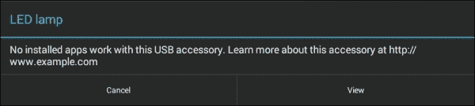

## 编写 Android 应用程序控制器

我们的第一块构建模块已经准备好了，但目前它还没有任何我们可以使用的物理执行器，也没有用户界面进行控制。因此，下一步是通过 Android Studio 创建我们的第二个 Android 项目，名为 **LEDLamp**。就像在第一个应用程序中所做的那样，记得选择 **API 级别 19** 和一个**空白活动**，我们可以将其称为 **LightSwitch**。

当活动编辑器出现时，最好更改用户界面的可视化预览，因为我们将使用监视器视图而不是普通的智能手机视图。我们可以通过应用程序屏幕右侧的**预览**标签页进行更改，并在上下文菜单中选择 **Android TV (720p)**。

因为我们需要一个非常简单的活动，所以我们需要使用以下步骤更改默认布局：

1.  在 `res/layout/activity_light_switch.xml` 文件中，将 `RelativeLayout` 参数更改为垂直的 `LinearLayout` 参数，如下所示的高亮代码：

    ```kt
    <LinearLayout

     android:orientation="vertical"
     android:layout_width="match_parent"
     android:layout_height="match_parent"
     android:paddingLeft="@dimen/activity_horizontal_margin"
     android:paddingRight="@dimen/activity_horizontal_margin"
     android:paddingTop="@dimen/activity_vertical_margin"
     android:paddingBottom="@dimen/activity_vertical_margin"
     tools:context=".LightSwitch">
    </LinearLayout>

    ```

1.  在前面的 `LinearLayout` 中，使用以下代码更改默认的 `TextView` 参数：

    ```kt
    <TextView
     android:layout_width="wrap_content"
     android:layout_height="wrap_content"
     android:textAppearance="@android:style/TextAppearance.Large"
     android:text="Available controlled devices"/>
    ```

    我们创建一个标题，并将其放置在布局顶部。在此视图下方，我们将放置所有可控制的设备，比如我们的第一个 LED。

1.  在前面的 `TextView` 下面添加以下 `Switch` 视图：

    ```kt
    <Switch
     android:layout_width="wrap_content"
     android:layout_height="wrap_content"
     android:text="LED 2"
     android:id="@+id/firstLed"/>
    ```

    为了保持用户界面简洁，我们需要一个按钮来控制 LED 的开关。为此，我们将使用一个开关按钮，这样我们就可以将动作发送到微控制器，同时提供 LED 实际状态的视觉反馈。

    ### 提示

    在我们的 Android 应用程序中，了解微控制器正在做什么的视觉反馈总是好的。这样，我们可以轻松知道草图的状态，这有助于我们查找异常。这特别是在实际设备没有给用户任何即时反馈时尤为重要。

没有进一步的自定义，以下是预期的用户界面截图：

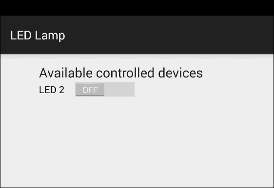

为了在电路板上尝试，我们可以像在前一章中那样进行应用程序部署，然后继续编写 ADK 通信逻辑。

## Android 配件开发套件

为了在我们的应用程序中启用 Android ADK，我们需要向 `AndroidManifest.xml` 文件添加一些配置。因为我们使用了 Android 系统的*特殊功能*，这依赖于可用的硬件，所以我们需要在 `manifest` 文件顶部添加以下声明：

```kt
<manifest

  package="me.palazzetti.ledlamp">

<uses-feature
android:name="android.hardware.usb.accessory"
android:required="true"/>

<!-- other declarations -->
</manifest>
```

当应用程序在系统中注册时，它应该声明能够响应在连接 USB 配件时引发的事件。为了实现这一点，我们需要向我们的 `LightSwitch` 活动声明中添加一个*意图过滤器*，如下所示的高亮代码：

```kt
<activity
 android:name=".LightSwitch"
 android:label="@string/app_name">
 <!-- other declarations -->

 <intent-filter>
 <action android:name=
 "android.hardware.usb.action.USB_ACCESSORY_ATTACHED"/>
 </intent-filter>
</activity>
```

Android 系统要求我们填写与之前在 Arduino 草图中的配件信息相同的配件信息。实际上，我们必须提供我们配件的制造商、型号和版本，为了保持组织性，我们可以创建`res/xml/`文件夹并在其中放入一个名为`usb_accessory_filter.xml`的 XML 文件。在这个文件中，我们可以添加以下代码：

```kt
<resources>
   <usb-accessory
    version="0.1.0"
    model="LampLed"
    manufacturer="Example, Inc."/>
</resources>
```

要将上述文件包含在 Android 清单中，只需在 USB 意图过滤器下方添加以下代码：

```kt
<activity
 android:name=".LightSwitch"
 android:label="@string/app_name">
 <!-- other declarations -->

 <meta-data
 android:name=
 "android.hardware.usb.action.USB_ACCESSORY_ATTACHED"
 android:resource="@xml/usb_accessory_filter"/>
 </activity>
```

既然我们的应用程序已经准备好进行发现过程，我们需要包含一些逻辑来建立连接并开始通过 ADK 发送数据。

### 注意

在这个原型中，我们将通过 Android 内部 API 使用 ADK。从第四章，*使用传感器聆听环境*开始，我们将通过一个外部库使用高级抽象，这将帮助我们更容易地实现项目，并且不需要任何样板代码。

下一步是将 ADK 的一些功能隔离在一个新的 Java 包中，以便更好地组织我们的工作。我们需要创建一个名为`adk`的新包，并在其中添加一个名为`Manager`的新类。在这个类中，我们需要使用从 Android `Context`参数中获取的`UsbManager`类、一个文件描述符和用于在 OTG 端口中写入数据的输出流。在`Manager`类中添加以下代码：

```kt
public class Manager {
 private UsbManagermUsbManager;
  private ParcelFileDescriptormParcelFileDescriptor;
  private FileOutputStreammFileOutputStream;

  public Manager(UsbManagerusbManager) {
  this.mUsbManager = usbManager;
  }
}
```

### 提示

Java 代码段需要在文件的顶部导入许多内容，为了更好的代码可读性，这些导入被故意省略了。然而，为了让一切按预期工作，我们需要编写它们并使用 Android Studio 中提供的自动补全功能。当你发现缺失导入时，只需将光标放在红色标记的语句上方，并按*Ctrl*+*Space*键。我们现在可以从建议框中选择正确的导入。

我们期望将`UsbManager`方法作为参数，因为我们无法访问 Android `Context`，我们稍后将从主活动中获取它。为了在 ADK 通信期间简化我们的工作，以下助手应该包含在我们的包装器中：

+   `openAccessory()`: 当找到设备时，它应该与设备建立连接

+   `closeAccessory()`: 如果有任何设备连接，它应该关闭并释放任何已使用的资源

+   `writeSerial()`: 当设备连接时，它应该通过已打开的流发送数据

第一个助手与配件建立连接并初始化相关输出流可以通过以下方法实现，我们应该将其添加到`Manager`类的底部：

```kt
public void openAccessory() {
 UsbAccessory[] accessoryList = mUsbManager.getAccessoryList();
  if (accessoryList != null &&accessoryList.length> 0) {
    try {
     mDescriptor = mUsbManager.openAccessory(accessoryList[0]);
     FileDescriptor file = mDescriptor.getFileDescriptor();
     mOutput = new FileOutputStream(file);
    }
   catch (Exception e) {
      // noop
    }
  }
}
```

我们使用存储的`UsbManager`对象来获取所有可用的配件。如果我们至少有一个配件，我们会打开它以初始化一个描述符和一个输出流，我们稍后将会使用它们向配件发送数据。为了关闭上述连接，我们可以按如下方式添加第二个助手：

```kt
public void closeAccessory() {
  if (mDescriptor != null) {
    try {
     mDescriptor.close();
    }
   catch (IOException e) {
      // noop
    }
  }
 mDescriptor = null;
}
```

如果我们已经打开了一个配件，我们使用创建的描述符来关闭激活的流，并从实例变量中释放引用。现在我们可以添加最新的写入助手，其中包括以下代码：

```kt
public void writeSerial(int value) {
  try {
   mOutput.write(value);
  }
 catch (IOException e) {
    // noop
  }
}
```

前面的方法将给定的`value`写入启用的输出流中。这样，如果连接了一个配件，我们使用输出流引用来写入 OTG 端口。

最后，我们需要在活动中创建一个`Manager`类的实例，这样我们就可以使用它来与 Arduino 打开通信。在`LightSwitch`活动的`onCreate`方法中，添加以下高亮代码：

```kt
public class LightSwitch extends ActionBarActivity{
 private Manager mManager;

  @Override
  protected void onCreate(Bundle savedInstanceState) {
   super.onCreate(savedInstanceState);
   setContentView(R.layout.activity_light_switch);
 mManager = new Manager(
 (UsbManager) getSystemService(Context.USB_SERVICE));
  }
}
```

我们正在查询系统中的 USB 服务，以便我们可以在`Manager`类中使用它来访问 USB 配件的状态和功能。我们将`Manager`类的引用存储在类内部，以便我们将来可以访问我们的助手函数。

一旦`Manager`类初始化完成，我们应该根据活动的开启和关闭来上下文地打开和关闭我们的配件。实际上，通常在活动的`onResume()`和`onPause()`回调中调用`openAccessory()`和`closeAccessory()`函数是个好主意。这样，我们可以确保在活动方法中使用 ADK 通信时，它已经被初始化。为了实现这个实现 ADK 通信的最后一块拼图，请在`onCreate()`成员函数下面添加以下方法：

```kt
@Override
protected void onResume() {
 super.onResume();
 mManager.openAccessory();
}

@Override
protected void onPause() {
 super.onPause();
 mManager.closeAccessory();
}
```

既然 Android 应用程序已经准备好了，我们可以继续部署，当我们禁用外部 OTG 端口时，会出现以下消息：

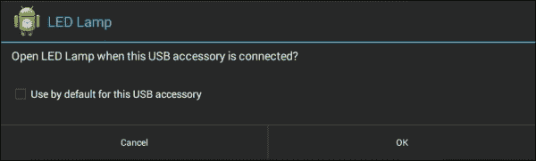

安卓系统已经发现了物理配件，并请求使用 LED Lamp 应用程序与之工作的权限。如果我们点击**确定**，应用程序将被打开。我们甚至可以将我们的应用程序设置为*默认*；这样，每当配件开始与 Android 系统通信时，我们的应用程序将立即启动。

# 快速原型设计电路

我们已经实现了 Android 和 Arduino 之间完全功能的通信，现在是时候构建一个真正的电路了。我们的目标是使用 Android 系统来开关一个 LED，这个问题既小又独立。然而，一开始，我们可以更有野心一些，不是打开一个 LED，而是可能想打开卧室的灯泡。那么，当我们能做得更有趣时，为什么要创建这样一个简单的项目呢？因为我们对项目进行**快速原型设计**。

快速原型制作是一组我们可以使用的技巧，以便尽快创建我们的工作项目。这非常有帮助，因为我们可以移除许多实现细节，比如产品设计，只专注于我们项目的核心。在我们的案例中，我们移除了所有与点亮灯泡相关的难题，比如使用晶体管、继电器和外部电池，我们专注于创建一个由 Android 系统供电的灯开关。当第一个原型开始工作时，我们可以逐步增加要求，直到实现最终项目。

## 使用面包板

为了继续我们的项目，我们应该创建一个电路原型。我们可以使用许多工具来实现这一目标，但在一开始，最重要的工具之一就是**面包板**。它可用于连接我们的电路板和其他电子组件，无需焊接。这允许我们在设计电路时进行实验，同时还可以将面包板用于其他项目。

下面是一个典型的面包板：

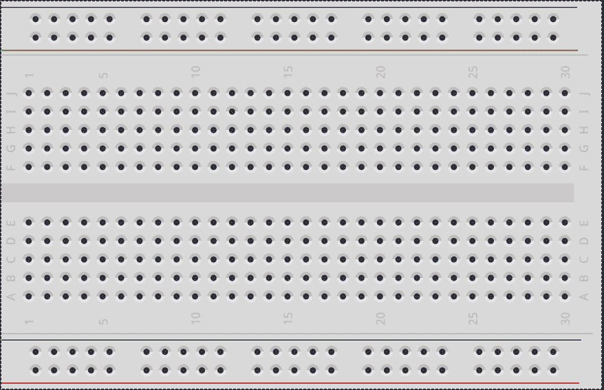

面包板由两个相同的部分组成，中间有一条水平行将两部分隔开，以断开两侧之间的任何连接。每一侧都包含一红一蓝两行，位于侧面的顶部或底部，它们代表*电源总线*。它们在整条水平线上是连接的，我们将使用它来连接 UDOOboard 的电源和地线。颜色通常用红色表示电源，蓝色表示地线，但请记住，这只是一种约定，你的面包板颜色可能会有所不同。

剩下的五条水平线是*原型区域*，这是我们连接设备的地方。与电源总线不同，这些线在垂直方向上是连接的，而水平线之间没有连接。例如，如果我们把一根**跳线**插入 A1 孔，金属条就会与从 B1 到 E1 的孔形成电气连接。另一方面，A2-E2 和 F1-J1 范围内的孔与我们的 A1-E1 列没有连接。

作为我们的第一个原型，我们打算使用面包板连接将 LED 连接到我们的 UDOOboard 上。然而，我们需要另一个叫做*电阻器*的电子组件。它通过电线对电流的通过产生阻力，这是必要的；否则，过多的电流可能会损坏组件。另一方面，如果我们提供过多的电阻，那么通过组件的电流将不足以使其工作。该组件的电阻以*欧姆*为单位测量，在我们的案例中，我们需要一个*220 欧姆*的电阻来正确地给 LED 供电。

现在我们需要将我们的组件连接到面包板上，正如我们在下面的电路中所看到的那样：

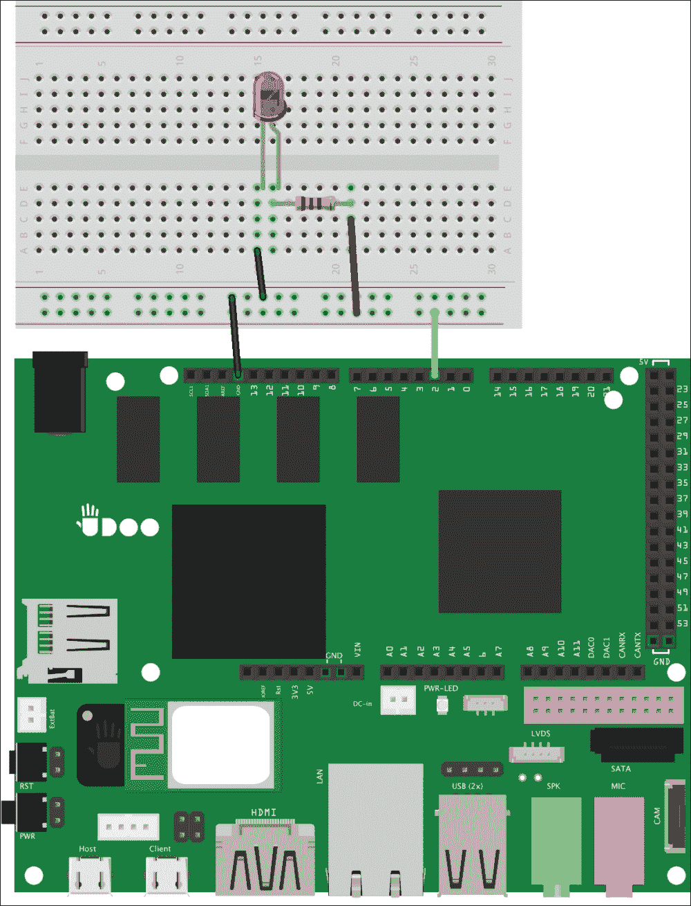

我们需要将引脚 2 连接到电源总线的正线，而地线则应连接到负线。然后我们将 LED 连接到原型区域，并在其*正极*前放置电阻。我们可以通过观察 LED 的*腿长*来区分其**极性**：较长的腿是正极，较短的腿是负极。记住这一点，我们可以将长腿连接到电阻上。为了闭合电路，我们只需将电阻连接到电源总线的正线，并将 LED 的负极连接到地线。这样我们就制作了我们的第一个电路。

### 注意

LED 应该关闭，但可能仍有一小部分电流流经它。这可能是由于我们的 Arduino 草图默认没有禁用引脚造成的。这种行为是安全的，我们将在下一节中处理这个问题。

## 与外部电路的交互

在这一点上，我们已经有了工作的通信和原型电路。我们应该实现的最后一步是从 Android 应用程序发送打开和关闭的信号，并在草图中解析并执行此命令。我们可以从我们的草图中开始，在其中我们需要配置引脚以作为输出引脚工作。这类配置是在`setup()`函数中完成的；在其中，我们应该添加以下代码：

```kt
void setup(){
 pinMode(LED, OUTPUT);
 digitalWrite(LED, LOW);
}
```

使用`pinMode()`函数，我们声明所选择的引脚将作为`OUTPUT`工作，这样我们就可以控制通过它的电流流动。因为我们之前定义了`LED`宏对象，它指的是引脚 2。`digitalWrite()`函数是 Arduino 语言的另一个抽象，我们使用它来允许或阻止电流流经所选择的引脚。在这种情况下，我们表示不应该有电流通过该引脚，因为在初始化步骤中，我们希望 LED 处于关闭状态。

因为 Android 应用程序将向我们发送一个只能具有`0`和`1`值的命令，我们需要一个函数来解析此命令，以便 Arduino 知道相关的动作是什么。为了实现这一点，我们可以在草图的底部简单地添加一个`executor()`函数，如下所示：

```kt
void executor(uint8_t command){
  switch(command) {
    case 0:
   digitalWrite(LED, LOW);
      break;
    case 1:
   digitalWrite(LED, HIGH);
      break;

    default:
      // noop
      break;
  }
}
```

我们正在创建一个解析`command`参数的开关。如果该值为`0`，Arduino 使用`digitalWrite()`函数关闭 LED；然而，如果值为`1`，它使用相同的函数打开 LED。在其它任何情况下，我们只需丢弃接收到的命令。

在这一点上，我们需要在`adk.isReady`条件下的主`loop()`函数中将事物组合在一起，如下所示：

```kt
if (adk.isReady()) {
 adk.read(&bytesRead, BUFFSIZE, buffer);
 if (bytesRead> 0){
 executor(buffer[0]);
 }
}
```

在主`loop()`函数期间，如果我们发现 ADK 连接，我们从通信通道读取任何消息，并通过`adk.read()`函数调用将结果写入我们的`buffer`变量。如果我们至少读取了 1 个字节，我们将字节数组的第一个值传递给`executor()`函数。完成此步骤后，我们可以将草图上传到 UDOOboard。

## 从 Android 发送命令

既然 UDOOS 已经准备好进行物理操作，我们就需要完成 Android 应用程序，并在`LightSwitch`类中实现命令发送。作为第一步，我们需要向我们的活动添加一个变量来存储 LED 的状态。在我们的类顶部，添加`mSwitchLed`声明：

```kt
private Manager mManager;
private booleanmSwitchLed = false;

```

需要做的最后一件事情是创建一个使用 ADK 写入包装器向 Arduino 发送命令的方法。在`onCreate()`方法下面，添加以下代码：

```kt
public void switchLight(View v) {
 mSwitchLed = !mSwitchLed;
 int command = mSwitchLed ? 1 : 0;
 mManager.writeSerial(command);
}
```

我们改变 LED 的状态，并从中创建`command`参数，该参数可能是`0`或`1`的值。然后我们使用`mManager`将命令写入 OTG 端口。为了完成应用程序，我们只需要将`switchLight`方法绑定到我们的视图上。在`activity_light_switch.xml`文件中，像下面这样为我们的开关按钮添加`onClick()`属性：

```kt
<Switch
 android:layout_width="wrap_content"
 android:layout_height="wrap_content"
 android:text="LED 2"
 android:id="@+id/firstLed"
 android:onClick="switchLight"/>

```

这是我们的最后一步，现在我们有了第一个真实世界的原型。现在我们可以将 Android 应用程序上传到 UDOOboard，并使用它来开关 LED。

# 概述

在本章中，你已经了解到了 UDOOS 一些与可用输入输出引脚相关的特性，以及两个处理器是如何通过内部串行总线连接在一起的。此外，在第一部分，我们编写并将我们的第一个草图部署到电路板上。

然后，我们深入探讨了通过 ADK 实现的通信机制，并编写了一个新的 Arduino 草图，能够通过内部 OTG 端口与 Android 建立通信。为 Android 做同样的事情，我们创建了一个简单的用户界面，在设备使用期间提供视觉反馈。我们还编写了 Android 应用程序中的包装器，以便轻松地公开常用的 ADK 方法来打开和关闭连接，以及写入通信通道。

在本章的最后，你学习了如何使用面包板快速原型电路，并构建了你的第一个使用 LED 和电阻的电路。然后，我们添加了所有必要的代码，从我们的 Android 应用程序发送开关信号，并从草图中接收并执行此命令。这是一个更复杂的 Hello World 应用程序，它确实有助于构建我们的第一个真实世界设备。

在下一章中，我们将扩展上述电路的调试功能，以便测试我们的硬件，看看设备是否有任何损坏的电子组件。
