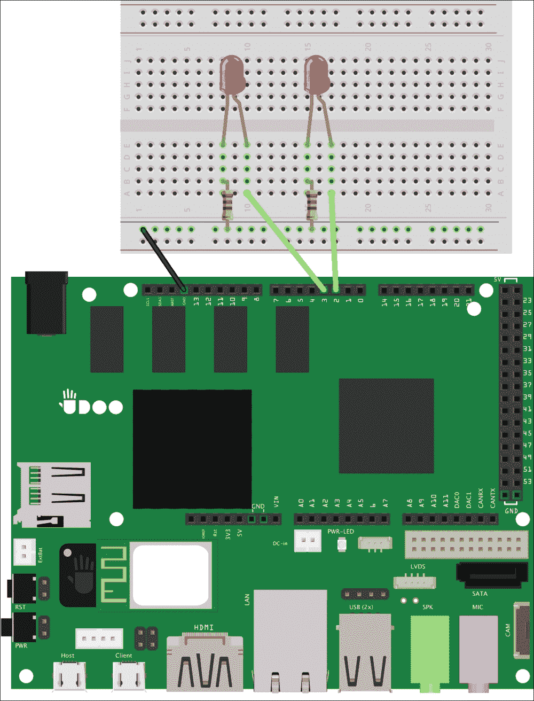
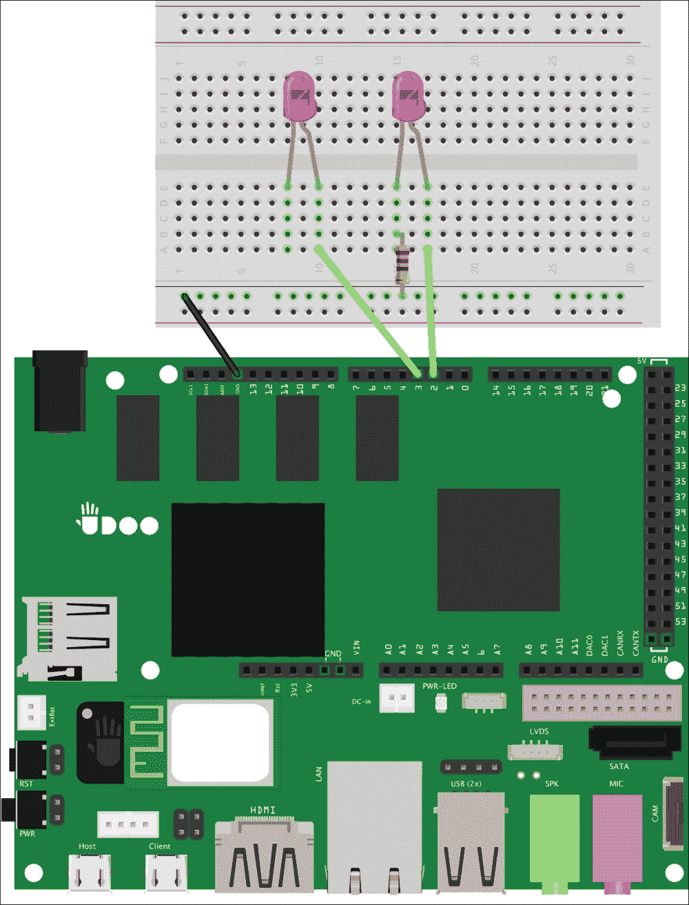
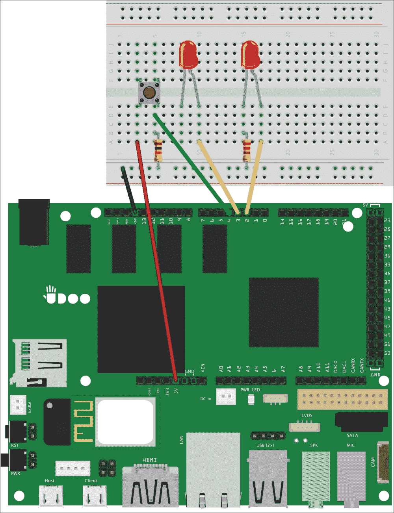

# 第三章：测试您的物理应用程序

软件开发过程中最重要的步骤之一是**测试**。当我们测试软件组件时，我们使用测试框架编写单元测试，也许还有集成测试，这有助于复现错误并检查我们应用程序的预期行为。在物理应用中，这一过程并不容易，因为我们需要测试我们的草图与硬件电路的交互情况。

我们将为 LedLamp 应用程序添加所有必要的功能，以实现一种简单的方法来查找电路中的异常，这样我们可以避免复杂的调试过程。

在本章中，我们将讨论以下主题：

+   关于电子元件和电路的更多细节

+   向电路添加组件，以便它们可以被草图测试

+   编写第一个用于电路调试的测试

+   从您的原型运行电路测试

# 构建可测试的电路

在编写安卓应用程序时，我们可能会使用内部测试框架编写仪器测试。通过它们，我们可以检查应用程序在安卓堆栈所有层面的行为，包括用户界面压力测试。然而，在我们的 UDOO 项目中，我们利用安卓与板载微控制器交互，以控制和收集物理设备的数据。当我们的安卓应用程序通过测试覆盖了良好特性，并且符合我们所有要求时，我们首先遇到的问题很可能与硬件故障和异常有关。

### 注意事项

在本书中，我们将不介绍安卓单元测试框架，因为它不是在硬件原型制作初期所必需的。但是，请记住，您应该学习如何编写安卓测试，因为要提高软件质量，这是必须的。您可以在官方文档中找到更多信息，地址是[`developer.android.com/training/activity-testing/index.html`](http://developer.android.com/training/activity-testing/index.html)。

在上一章中，我们使用了许多电子元件，比如 LED 和电阻，构建了我们的第一个原型，并编写了一个安卓应用程序作为设备控制器。这是一个很好的起点，因为我们已经拥有了一个可以添加其他功能的正常工作的设备。为了使电路简单，我们将从第一个 LED 独立添加另一个 LED，使我们的设备能够控制两个不同设备的开关。我们需要对 LedLamp 电路进行一些更改，以便将第二个 LED 连接到 UDOO 板上。请查看以下电路图：



要实现上述电路图，请采取以下步骤：

1.  从电源总线的正线断开连接，因为我们需要从不同的引脚控制不同的组件。

1.  保持地线连接到电源总线的负线，因为我们将所有的地线都连接在一起。

1.  使用两个*220 欧姆电阻器*将负极腿连接到负电源总线。

1.  将正极腿连接到 UDOOb 引脚 2 和 3。

在上一章中，我们将电阻器连接到正极腿，而现在我们连接负极腿。这两种配置都是正确的，因为当 LED 和电阻器串联连接时，电流将以相同的强度流过它们。我们可以发现，电路类似于高速公路，而汽车就像电荷。如果汽车遇到一个或多个路障，它们将从高速公路的每个点开始减速，而且不管它们距离路障是远是近。因此，即使电阻器位于电路末端，正确数量的电流仍会流过 LED。

既然电路包括了一个新的 LED，我们必须按照以下步骤更改我们的草图，使其符合我们的需求：

1.  在草图的顶部添加以下类似对象的宏：

    ```kt
    #define LED 2
    #define LED_TWO3

    ```

1.  在`setup()`函数中初始化新的 LED，如高亮代码所示：

    ```kt
    void setup(){
     pinMode(LED, OUTPUT);
     pinMode(LED_TWO, OUTPUT);
     digitalWrite(LED, LOW);
     digitalWrite(LED_TWO, LOW);
    }
    ```

1.  在`executor()`函数中添加以下代码，使新的 LED 模仿我们已经编程的第一个 LED 的行为：

    ```kt
    switch(command) {
     case 0:
       digitalWrite(LED, LOW);
       break;
     case 1:
       digitalWrite(LED, HIGH);
       break;
     case 2:
     digitalWrite(LED_TWO, LOW);
     break;
     case 3:
     digitalWrite(LED_TWO, HIGH);
     break;
     default:
      // noop
       break;
    }
    ```

1.  更改文件顶部的配件描述符，以更新草图版本：

    ```kt
    char versionNumber[] = "0.2.0";
    ```

更改版本号总是一个你应该注意的好习惯。在我们的案例中，这也是一个要求，因为我们必须通知 Android 硬件行为已经改变。正如你在第二章，*了解你的工具*中看到的，当 Android 和 Arduino 中定义的版本不匹配时，Android 应用程序将不会与微控制器通信，这防止了意外的行为，特别是在硬件更改时。实际上，如果我们再次部署新的草图，可以看到 Android 将找不到任何可用的应用程序来管理配件。

最后一步，让原型再次工作，是更新 Android 应用程序，从其用户界面和逻辑开始，使其能够管理新设备。为了实现这个目标，我们应该采取以下步骤：

1.  在`res/layout/activity_light_switch.xml`文件中，在`firstLed`声明下方添加一个新的开关按钮：

    ```kt
    <Switch
     android:layout_width="wrap_content"
     android:layout_height="wrap_content"
     android:text="LED 3"
     android:id="@+id/secondLed"
     android:onClick="switchLightTwo"/>
    ```

1.  在类的顶部`LightSwitch`活动中添加以下声明，以存储第二个 LED 的状态：

    ```kt
    private boolean mSwitchLed = false;
    private boolean mSwitchLedTwo = false;

    ```

1.  在`switchLight()`方法下方添加以下代码，根据草图开关案例控制第二个 LED：

    ```kt
    public void switchLightTwo(View v) {
     mSwitchLedTwo = !mSwitchLedTwo;
     int command = mSwitchLedTwo ? 3 : 2;
     mManager.writeSerial(command);
    }
    ```

1.  在`res/xml/`下的`usb_accessory_filter.xml`描述符文件中更新新的硬件版本：

    ```kt
    <resources>
     <usb-accessory
     version="0.2.0"
     model="LedLamp"
     manufacturer="Example, Inc."/>
    </resources>
    ```

我们正在匹配草图的版本，以便 Android 知道这个应用程序可以再次管理连接的配件。部署新应用程序后，我们可以使用原型来打开和关闭两个连接的 LED。

# 开发一个诊断模式。

拥有一个可工作的原型后，是时候添加一个功能来测试我们的电路了。即使我们很想动手写代码，但首先需要模拟一个物理损坏，这个损坏会在原型中引起故障。因为不想真正损坏我们的 LED 灯，我们可以更改电路元件来复现异常。

实际上，我们可以模拟连接到引脚 3 的电阻器一条腿断裂的情况。如果发生这种情况，电路会被切断，这会阻止电流流过 LED 灯。为了在面包板上复现这个问题，我们可以简单地移除第一个电阻器，如下一个图表中所示：



现在我们已经模拟了第一个硬件故障。如果我们打开 Android 应用程序并使用开关，可以看到第二个 LED 灯按预期工作，而第一个停止工作。然而，由于软件组件对内部发生的情况一无所知，所以它们没有注意到任何问题。如果出现这样的问题，我们会感到迷茫，因为我们在不知道应该将注意力集中在哪个部分来查找故障的情况下，开始进行软件和硬件调试。

当软件出现问题时，我们通常会使用调试器。不幸的是，当处理电路问题时，我们没有太多的工具，可能需要自己实现一些功能。一个好的起点是给原型添加一个功能，使其能够通过**诊断**模式自我调试。这个模式应该*模拟并模仿我们电路的真实行为*，但要以受控的方式进行。诊断模式对于识别原型中与软件错误无关的异常原因非常有帮助。

### 提示

诊断模式是我们寻找异常应该遵循的第一步。然而，当我们发现硬件故障时，应该开始使用其他工具，比如一个能够测量电压、电流和电阻的*万用表*。

在我们开始在草图上实现这个模式之前，需要连接一个*按钮*，我们将用它来启用诊断模式。我们需要将这个组件添加到我们的面包板上，如下一个图表的左侧部分所示：



按照图表所示，将组件添加到面包板的步骤如下：

1.  将按钮添加到面包板的中间，使得同一垂直线上的腿不要连接。

1.  将按钮的左腿连接到+5V 引脚。

1.  将按钮的右腿连接到引脚 4。

1.  将一个*10 KOhm*电阻的一侧连接到按钮的右腿，另一侧连接到电源总线的负线。

通过这些连接，当我们按下按钮时，我们从引脚 4 读取数字信号，因为*电流会选择电阻较小的路径*，就像水一样。在我们的案例中，机械开关将在+5V 和 4 引脚之间建立连接，并且由于这条路径的电阻远小于地线中的*10 KOhm*，UDOOb 将读取这个电压差并将其转换为数字信号。当开关打开时，唯一的路径是引脚 4 和地线，因此 UDOOb 不会读取到电压差。这使我们能够知道开关是否被按下。

## 编写第一个测试

既然我们已经有了一个物理硬件开关，我们需要在用户按下按钮时激活诊断模式。为了检测按钮按下，我们应该按照以下步骤更改草图：

1.  在 ADK 初始化之后，添加突出显示的声明：

    ```kt
    ADKadk(&Usb, manufacturer, model, accessoryName, versionNumber, url, serialNumber);
    int reading = LOW;
    int previous = LOW;
    long lastPress = 0;

    ```

    我们需要每次读取阶段的按钮状态，这样我们就可以在当前和之前的读取期间保存状态。`lastPress`变量将包含上次按下按钮的时间戳。我们将按钮状态设置为`LOW`，因为我们认为没有电流流过按钮，这意味着它没有被按下。

1.  在草图的顶部，定义以下类似对象的宏：

    ```kt
    #define LED_TWO3
    #define BUTTON 4
    #define DEBOUNCE 200

    ```

    我们设置按钮引脚 4 和 DEBOUNCE 值，该值表示在代码开始再次评估按钮按下之前应经过的毫秒数。使用这个阈值是必要的，因为它防止读取到错误的阳性结果。如果我们省略这部分，当按钮被按下时，草图将检测到数千次读数，因为 UDOOb 的读取阶段比我们松开按钮的反应要快。这个值称为**消抖阈值**。

1.  在`setup()`函数中按如下配置按钮引脚模式：

    ```kt
    pinMode(LED_TWO, OUTPUT);
    pinMode(BUTTON, INPUT);

    ```

1.  将`loop()`函数的内容移动到一个名为`readCommand()`的新函数中，使其与以下内容相匹配：

    ```kt
    void readCommand() {
     Usb.Task();
     if (adk.isReady()) {
       adk.read(&bytesRead, BUFFSIZE, buffer);
       if (bytesRead> 0) {
         executor(buffer[0]);
      }
     }
    }
    ```

1.  在空的`loop()`函数中，我们应该添加以下代码进行读取阶段：

    ```kt
    void loop(){
      // Reads the digital signal from the circuit
     reading = digitalRead(BUTTON);
      // Checks the button press if it's outside a
      // debounce threshold
     if (reading == HIGH && previous == LOW &&millis() - lastPress>DEBOUNCE) {
       lastPress = millis();
        // Visual effect prior to diagnostic activation
       digitalWrite(LED, HIGH);
       digitalWrite(LED_TWO, HIGH);
       delay(500);
       digitalWrite(LED, LOW);
       digitalWrite(LED_TWO, LOW);
       delay(500);
       startDiagnostic();
     }
     previous = reading;
     readCommand();
    }
    ```

    我们使用内置的`digitalRead()`函数存储按钮的值，该函数抽象了从所选引脚读取电压差的复杂性。然后，我们检查当前状态是否与之前不同，这样我们就能确定按钮正是在这一刻被按下。

    然而，我们还需要检查自按下按钮以来是否超过了消抖阈值。我们使用内置的`millis()`函数，它返回自 UDOOb 板开始当前程序以来的毫秒数。

    如果捕捉到按下按钮的事件，我们设置`lastPress`值，并提供视觉反馈以通知用户诊断模式即将启动。无论如何，我们都会保存先前的按钮状态，并继续执行标准操作。

    ### 提示

    有时诊断模式需要激活和停用阶段。在我们的案例中，我们简化了流程，使得诊断模式仅在按下按钮后运行一次。在其他项目中，我们可能需要一个更复杂的激活机制，可以将其隔离在独立函数中。

1.  作为最后一步，按照以下方式实现`startDiagnostic()`函数：

    ```kt
    void startDiagnostic() {
     // Turn on the first LED
     executor(1);
     delay(1000);
     executor(0);
     // Turn on the second LED
     executor(3);
     delay(1000);
     executor(2);
     // Turn on both
     executor(1);
     executor(3);
     delay(1000);
     executor(0);
     executor(2);
    }
    ```

    诊断功能应该模仿我们电路的所有或几乎所有可能的行为。在本例中，我们打开和关闭第一个和第二个 LED，作为最后的测试，我们同时为它们供电。在诊断模式下，使用内部函数来复现电路动作非常重要。这有助于我们测试`executor()`函数的输入，确保我们已经映射了 Android 应用程序发送的所有预期输入。

既然我们已经有了诊断功能，我们必须再次部署 LedLamp 草图，并按下按钮开始诊断。如预期的那样，由于虚拟损坏的电阻器，只有一个 LED 会亮起。现在我们可以重新连接电阻器，并启动诊断模式，以测试 LED 连接是否已修复。

# 总结

在本章中，我们深入探讨了硬件测试，以提高我们项目的质量。我们发现这个过程非常有价值，因为通过这种方法，我们可以将硬件故障与软件错误区分开来。

我们在之前的原型中添加了另一个 LED，以便我们可以从 Android 应用程序控制多个设备。然后，我们在其中一个电子组件中模拟了一个硬件故障，从电路中移除一个电阻器以产生一个受控的异常。这促使我们编写了自己的诊断模式，以便快速找到这类故障。

第一步是为我们的原型添加一个按钮，我们可以使用它来启动诊断模式，然后我们利用这个功能模拟所有可能的电路行为，以便轻松找到损坏的电阻器。

在下一章中，我们将从零开始构建一个新原型，它能够通过一组新的电子组件从环境中收集数据。我们还将编写一个 Android 应用程序，能够读取草图发送的这些值，并可视化处理后的数据。
