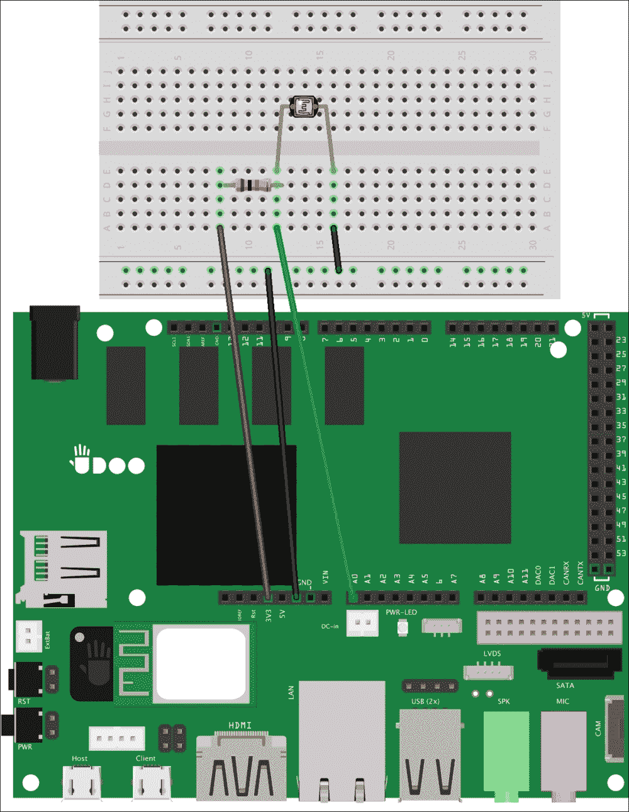
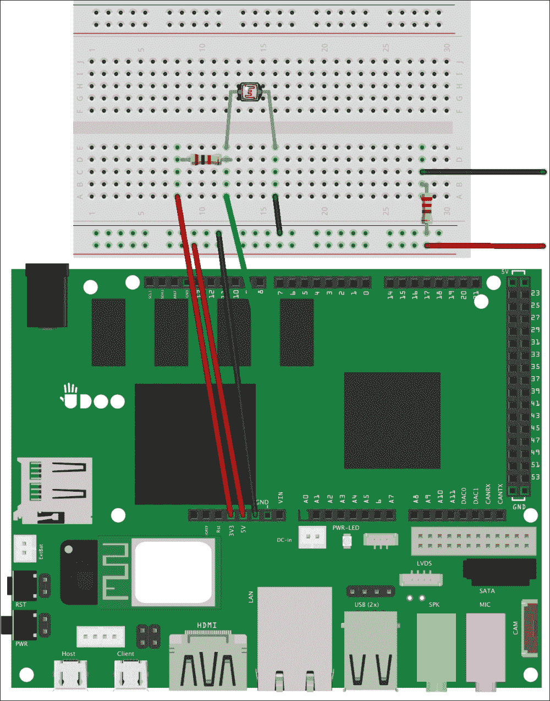
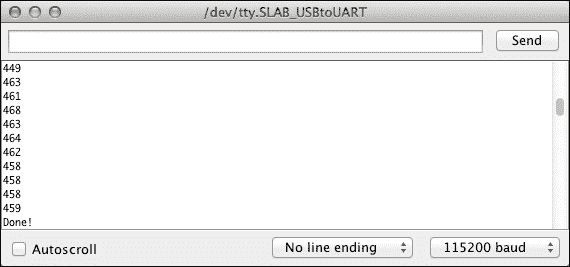
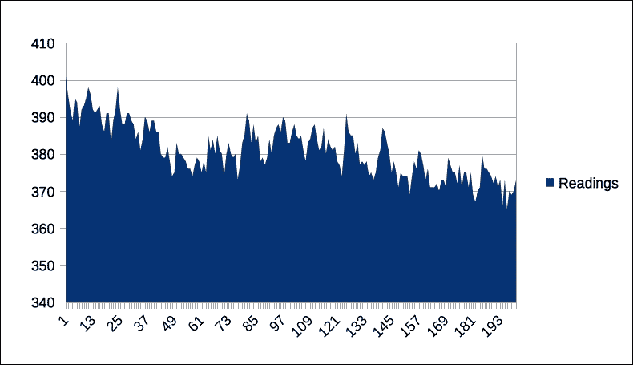
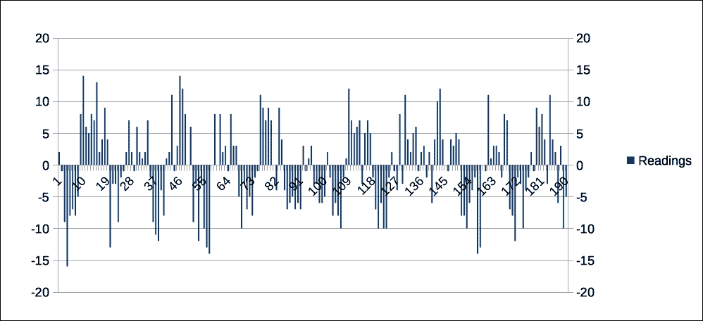
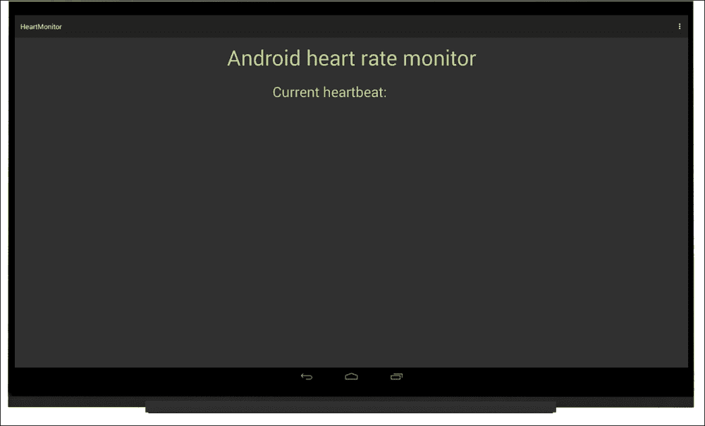
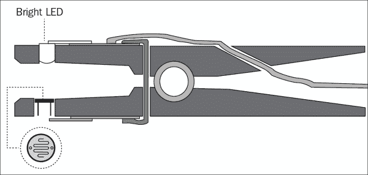

# 第四章：使用传感器倾听环境

当我们构建原型时，希望为最终用户提供最佳的交互体验。有时，我们构建的实际应用没有任何人为交互，但它们只是监听环境以收集数据并决定要做什么。无论我们的原型是什么，如果我们想要读取和理解人类行为或环境变化，我们需要使用一组新的电子组件：**传感器**。

每次我们构建物理应用时，都必须牢记，我们的项目越复杂，就越有可能需要添加传感器来实现所需的交互。

在本章中，我们将从零开始构建一个能够感知我们的心跳并将结果发布到我们的安卓应用程序中的真实应用。

在本章中，我们将涵盖以下主题：

+   使用环境传感器进行工作

+   构建心跳监测器

+   从传感器收集数据

+   从安卓应用程序展示收集的数据

# 使用环境传感器进行工作

在电子学中，传感器是构建来检测特定物质或粒子属性*任何变化*的组件。当发生任何变化时，传感器提供一个电压变化，可以改变其他电子组件的电流流动和行为。如果微控制器连接到传感器，它可以根据运行程序决定采取不同的行动。

传感器可以检测许多*属性*的变化，如热辐射、湿度、光线、无线电、声波等。当我们在项目中使用传感器时，必须选择一个特定的属性进行监听，然后需要读取并管理电压的变化。有时，为了执行检查，我们需要将这些电学变化转换为其他测量单位，如米或温度度数。在其他时候，我们可能会使用更复杂的传感器，这些传感器已经为我们完成了全部或部分的转换。例如，如果我们正在构建一个机器人探测器，可能需要使用传感器来检测与物体的距离，以避开任何房间障碍。在这种情况下，我们将使用基于雷达或声纳原理相似的*超声波传感器*。它发射高频声波并评估接收到的回声。通过分析发送和接收信号回声之间的时间间隔，我们可以确定与物体的距离。

实际上，在一个通用的草图中，我们读取的是从传感器收到信号回声之前经过的微秒数。为了使这些值更有用并找到正确的距离，我们可能需要在草图内部编写一个微秒到厘米或英寸的转换器。

然而，只有在我们了解传感器的工作原理以及信号每微秒传播了多少厘米或英寸的情况下，这才可能实现。幸运的是，我们可以从组件制造商发布的文档中找到这些信息，这个文档被称为**数据手册**。有了这些知识，我们可以轻松地将所有探测到的值转换为我们要寻找的内容。当我们完成本章的原型后，可以查看 URL [`arduino.cc/en/tutorial/ping`](http://arduino.cc/en/tutorial/ping)，其中包含了一个关于如何使用超声波传感器以及如何轻松地将检测到的信号转换为不同测量单位的示例。

# 构建心跳监测器

在前面的章节中，我们构建了第一个配备 LED 执行器的原型，用以改变周围环境，并通过内部 ADK 通信使 Android 应用程序控制 LED 的行为。我们已经看到传感器对于提高我们原型的交互性非常有帮助，我们可能想要将这项新功能添加到之前的项目中。实际上，由于我们使用的是一个能够发光的组件，我们可能会考虑添加一个外部光传感器，以便微控制器可以根据环境光线来开关 LED。

这只是一个关于如何使用光传感器的示例。实际上，我们必须牢记每个传感器都可以以不同的方式使用，我们的任务是要找到检测值与物理应用目标之间的相关性。我们绝不应该仅限于使用传感器的主要用途，正如我们将在心跳监测器中看到的那样。

## 创建带有光传感器的电路

与之前的原型类似，心跳监测器由两部分组成。第一部分是电路和草图，应该从光传感器收集数据并将其转换为代表**每分钟节拍数**（**bpm**）的值。第二部分是 Android 应用程序，它会在屏幕上显示我们心率计算出的值。

### 注意

即使这个原型可能取得不错的效果，但用自制的原型用于医疗原因是不可取的。光敏电阻仅用于演示，*不应*用于任何医疗目的。

对于这个物理应用，我们将使用**光敏电阻**作为光传感器的一部分。光敏电阻，也称为**光依赖电阻器**（**LDR**），其工作原理与之前原型中使用的传统电阻类似，但在提供的电阻方面略有不同。实际上，它的电阻根据测量的光照强度而变化，如果我们监测这个值，可以轻松计算出环境强度是在增加还是减少。我们还使用了一个*鲜红色*的 LED，它不同于之前使用的 LED，因为其亮度足以让光线透过我们的皮肤。

我们的目标是创建一个电路，我们可以将食指的一侧放在光敏电阻的顶部，另一侧是明亮的 LED。这样，一部分光线会穿过我们的手指，并被光敏电阻检测到。在每次心跳时，沿着动脉的血压力波会向外移动，增加我们的血量。当光线穿过我们的组织时，这种血量变化会改变落在传感器上的光线量。因此，当我们看到探测值中出现中等到高度变化时，这很可能是我们的心跳。

为了开始构建我们的原型，我们需要将光敏电阻放入面包板中，以便我们可以实现以下电路图：



按照以下步骤操作，以实现前面的电路图：

1.  光敏电阻的腿可能太长。使用电子元件剪钳将腿剪短，最多 1.5cm。这不是必须的，但可能会简化原型的使用。

1.  将 UDOO 的+3.3V 引脚连接到面包板的第一行。确保不要连接+5V 电源引脚，因为在连接过程中可能会损坏电路板。

1.  在电路板上放置一个*10 KOhm*电阻，并将其连接到+3.3V 引脚；我们还需要将另一端连接到模拟输入 A0 引脚。

1.  将光敏电阻连接到电阻和 A0 引脚的同一列；第二个引脚应连接到电源总线的负线。

    ### 提示

    光敏电阻的作用与其他电阻一样，所以在这一步我们连接哪一端并不重要，因为*它们没有极性*。

1.  将 UDOO 的地线连接到电源总线的负线。

通过这些步骤，我们构建了一个由两个电阻组成的**电压分压器**电路。这类电路根据电阻值产生一个输入电压的分数作为输出电压。这意味着，由于电阻值会随光照强度变化而变化，电压分压器输出的电压也会随光照变化。这样，电路板可以检测到这些变化，并将其转换为一个 0 到 1023 之间的数值。换句话说，当光敏电阻处于阴影中时，我们读取到一个高值；而当它处于光照中时，我们读取到一个低值。由于我们将*10 KOhm*电阻连接到+3.3V 引脚，我们可以认为这个电压分压器是使用了一个**上拉**电阻构建的。

### 提示

电压分压器在许多电子电路中经常使用。你可以在[`learn.sparkfun.com/tutorials/voltage-dividers`](https://learn.sparkfun.com/tutorials/voltage-dividers)找到关于这类电路其他应用的信息。

为了完成我们的原型，我们不得不将高亮 LED 添加到电路中。然而，因为我们需要将 LED 放在手指的另一侧，我们不能直接将组件连接到我们的面包板上，但我们需要使用一对*鳄鱼夹*。作为第一步，我们需要按照以下电路图扩展电路：



按照以下步骤实现前面的电路图：

1.  将 UDOOU +5V 电源引脚连接到电源总线的正线上。

1.  在面包板上添加一个*220 欧姆*电阻，并将一个引脚连接到电源总线的负线上。

1.  将电线连接器的一边接到*220 欧姆*电阻的另一引脚上。

1.  将电线连接器的一边接到电源总线的正线上。

1.  将第一个鳄鱼夹的一边连接到连接到电源总线正线的导线上。

1.  将第二个鳄鱼夹的一边连接到电阻器的导线上。

1.  将延长+5V 引脚的鳄鱼夹连接到 LED 的长腿上。

    ### 注意

    在进行下一步之前，请记住你正在使用一个非常亮的 LED。你应该避免将其直接对准你的眼睛。

1.  将延长电阻和接地连接的鳄鱼夹连接到 LED 的短腿上。

如果所有连接都设置好了，LED 应该会亮起，我们可以将其作为原型的一个活动部分。需要记住的一件事是，鳄鱼夹的金属端头*绝对不能相互接触*，否则电路将停止工作，一些组件可能因为*短路*而损坏。

# 从草图中收集数据

既然我们已经有一个工作的电路，我们应该开始编写草图以从光传感器收集数据。然后我们应该分析这些结果，考虑一个将读数转换为心跳计数的算法。我们应该开始一个新的草图，并添加以下步骤：

1.  在草图顶部添加以下声明：

    ```kt
    #define SENSOR A0
    #define HEARTBEAT_POLL_PERIOD50
    #define SECONDS 10
    constint TIMESLOTS = SECONDS * 1000 / HEARTBEAT_POLL_PERIOD;
    int sensorReading = 0;
    ```

    我们定义了一个类似对象的宏`SENSOR`，值为`A0`，这是我们将用于模拟读数的引脚。我们设置`HEARTBEAT_POLL_PERIOD`以指定微控制器在连续传感器读数之间应该等待多少毫秒。使用`SECONDS`参数，我们定义了在处理和估计心率之前应该过去多少秒。实际上，我们将`SECONDS`乘以`1000`将这个值转换为毫秒，然后除以`HEARTBEAT_POLL_PERIOD`参数来定义`TIMESLOTS`常数。这个变量定义了我们应该循环读取阶段多少次以收集估计心率所需正确数量的读数。这样，我们在每个`TIMESLOTS`周期进行一次读取，当周期结束时，我们计算心率。最后一个变量`sensorReading`用于在每次循环迭代中存储传感器读数。

1.  在`setup()`函数中，添加串行端口的初始化，以便我们可以在 UDOOboard 和计算机之间打开通信：

    ```kt
    void setup() {
     Serial.begin(115200);
    }
    ```

1.  在草图的底部添加以下函数，通过串行端口打印读取的值：

    ```kt
    void printRawData() {
     sensorReading = analogRead(SENSOR);
     Serial.println(sensorReading);
    }
    ```

    我们使用内置的`analogRead`函数从模拟输入引脚读取传入数据。因为这些引脚是只读的，我们不需要在`setup()`函数中进行进一步配置或更改输入分辨率。

    ### 提示

    有时我们可能需要更好的模拟读取分辨率，范围在 0 到 4095 之间，而不是 0 到 1023。在这种情况下，我们应该使用`analogReadResolution`参数来改变分辨率。我们可以在官方文档中找到更多关于模拟输入分辨率的信息，地址是[`arduino.cc/en/Reference/AnalogReadResolution`](http://arduino.cc/en/Reference/AnalogReadResolution)。

    当读取完成时，我们在串行端口打印结果，这样我们就可以通过 Arduino IDE 串行监视器读取这些值。

1.  在主`loop()`函数中，为每个读取时隙添加`printRawData()`函数调用：

    ```kt
    void loop() {
     for (int j = 0; j < TIMESLOTS; j++) {
     printRawData();
     delay(HEARTBEAT_POLL_PERIOD);
     }
     Serial.println("Done!");
     delay(1000);
    }
    ```

    我们进行`TIMESLOTS`迭代是为了在 10 秒内获取读数，如之前定义的。所有读数完成后，我们在串行端口打印一条消息，并在重新开始读取前等待一秒。

    ### 提示

    一秒的延迟和**完成！**的消息仅证明读取周期正在正确工作。我们稍后会移除它们。

配置完毕后，我们可以上传草图并继续我们的第一次实验。将食指的底部放在光电阻上，同时将 LED 放在另一侧。

### 提示

为了获得更精细的读数，如果光电阻和 LED 的接触部分是指关节和指甲之间的部分会更好。

开始实验时，点击**串行监视器**按钮，当草图打印出**完成！**的消息时，我们将看到如下截图所示的一些数值：



这些是我们心跳期间光传感器捕捉到的绝对值。如果我们把一个完整的 10 秒迭代复制粘贴到 Microsoft Excel、Libre Office Calc 或 Numbers 表格中，我们可以绘制一个折线图，以更易于理解的形式查看给定结果：



我们可以看到，数值随时间变化，当发生心跳时，光传感器检测到光强的变化，这一事件导致图表中产生一个峰值。换句话说，我们可以假设每个峰值都对应一次心跳。下一步是改进我们的草图，以近似和转换这些数值，因为我们应该尝试去除读数错误和假阳性。主要思想是在每次迭代后收集固定数量的样本，以存储这次读数和上一次读数之间的差值。如果我们随着时间的推移存储所有差值，我们可以轻松找到读数趋势，并识别出我们读取峰值的时候。为了改进我们的算法，我们需要执行以下步骤：

1.  在草图的顶部添加以下变量：

    ```kt
    #define SECONDS 10
    #define SAMPLES 10

    constint TIMESLOTS = SECONDS * 1000 / HEARTBEAT_POLL_PERIOD;

    int sensorReading = 0;
    int lastReading = 0;
    int readings[SAMPLES];
    int i = 0;
    int delta = 0;
    int totalReading = 0;

    ```

    我们设置用于计算增量差值的`SAMPLES`数量。然后使用`lastReading`、`i`和`delta`变量分别存储上一次读数、用于迭代`readings`数组的当前索引，以及与上一次读数的当前差值。然后我们定义一个累加器来存储当前的读数总和。

1.  在`setup`函数中初始化`readings`数组：

    ```kt
    void setup() {
     Serial.begin(115200);

     for (int j = 0; j < SAMPLES; j++) {
     readings[j] = 0;
     }
    }
    ```

1.  在草图的底部添加`collectReads()`函数：

    ```kt
    void collectReads() {
     sensorReading = analogRead(SENSOR);
      delta = sensorReading - lastReading;
     lastReading = sensorReading;
     totalReading = totalReading - readings[i] + delta;
      readings[i] = delta;
     i = (i + 1) % SAMPLES;
    }
    ```

    在第一部分，我们将读取当前值并计算与上一次读数的差值。然后我们使用当前的`totalReading`和`readings`数组中存储的上一个差值来累加这个差值。现在我们可以用新的`delta`对象更新当前索引的`readings`数组，该索引在最后一行递增，并通过*模运算符*保持在界限内。

1.  在主`loop()`函数中，用新的`collectReads()`函数替换`printRawData()`函数调用，然后打印累积的值：

    ```kt
    for (int j = 0; j < TIMESLOTS; j++) {
     collectReads();
     Serial.println(totalReading);
      delay(HEARTBEAT_POLL_PERIOD);
    }
    ```

进行这些增强后，我们可以上传新的草图，并像之前一样重复进行实验：

1.  将你的食指放在光电阻和 LED 之间。

1.  在 Arduino IDE 上点击**串行监视器**。

1.  完成一个完整的 10 秒迭代。

1.  将这些值复制并粘贴到之前的电子表格中，并绘制条形图。我们应该避免包含前八个读数，因为它们与第一次迭代有关，而此时`readings`数组尚未初始化。

收集到的值产生了如下图表：



在这些处理过的读数中，正负值之间会有波动，这种情况出现在我们攀登或下降之前看到的峰值时。有了这些知识，我们可以稍微改进一下算法，以便追踪攀登或下降阶段，并选择是丢弃读数还是将其计为一次心跳。要完成这部分，我们需要按照以下步骤添加以下代码：

1.  在草图的顶部添加这些声明：

    ```kt
    #define SECONDS 10
    #define POS_THRESHOLD 3
    #define NEG_THRESHOLD -3

    const int TIMESLOTS = SECONDS * 1000 / HEARTBEAT_POLL_PERIOD;
    const int PERMINUTE = 60 / SECONDS;
    int beats = 0;
    boolean hillClimb = false;

    ```

    我们定义了`POS_THRESHOLD`和`NEG_THRESHOLD`参数来设置我们丢弃值的区间边界，以避免误报。同时，我们还定义了一个`PERMINUTE`常数，以得知获取每分钟心跳数的乘数以及`beats`累加器。最后，我们设置了一个`hillClimb`变量，用来存储下一次读数是在上升阶段还是下降阶段。例如，`True`值意味着我们处于上升阶段。

1.  在草图的底部添加`findBeat()`函数：

    ```kt
    void findBeat() {
      if (totalReading<NEG_THRESHOLD) {
       hillClimb = true;
      }
      if ((totalReading>POS_THRESHOLD)&&hillClimb) {
       hillClimb = false;
        beats += 1;
      }
    }
    ```

    我们检查`totalReading`参数是否低于`NEG_THRESHOLD`参数，以确定我们是否处于峰值下降阶段。在这种情况下，我们将`hillClimb`变量设置为`True`。在最后的代码块中，我们检查是否超过了`POS_THRESHOLD`并且处于上升阶段。如果是这样，我们将`hillClimb`设置为`False`，并将此阶段变化计为一次心跳。如果我们查看之前的图表，通过前面的代码，我们可以轻松确定每次读数时我们处于哪个阶段，并且利用这些信息尽可能多地排除错误和误报。

1.  在草图的底部添加实用函数`calcHeartRate()`：

    ```kt
    int calcHeartRate() {
      return beats * PERMINUTE;
    }
    ```

1.  在主`loop()`函数中，添加以下代码以使用前面的函数，并在串行端口中打印心率及心跳数：

    ```kt
    for (int j = 0; j < TIMESLOTS; j++) {
     collectReads();
     findBeat();
      delay(HEARTBEAT_POLL_PERIOD);
    }
    Serial.print(calcHeartRate());
    Serial.print(" with: ");
    Serial.println(beats);
    beats = 0;
    delay(1000);
    ```

1.  再次上传草图并开始计算心跳。在串行监视器中，我们会注意到以下值：

    ```kt
    72 with: 12
    84 with: 14
    66 with: 11
    78 with: 13
    90 with: 15
    84 with: 14
    ```

对我们草图的最后改进是添加 ADK 功能，将计算出的心跳发送到我们的 Android 应用程序。在草图的顶部，添加以下*accessory descriptor*，它与我们之前原型中使用的基本相同：

```kt
#include <adk.h>
#define BUFFSIZE 128
char accessoryName[] = "Heartbeat monitor";
char manufacturer[] = "Example, Inc.";
char model[] = "HeartBeat";
char versionNumber[] = "0.1.0";
char serialNumber[] = "1";
char url[] = "http://www.example.com";
uint8_t buffer[BUFFSIZE];
uint32_tbytesRead = 0;
USBHostUsb;
ADKadk(&Usb, manufacturer, model, accessoryName, versionNumber, url, serialNumber);
```

作为最后一步，在主`loop()`函数中，将草图执行包裹在 ADK 通信中，并移除所有的串行打印以及最后的 1 秒延迟：

```kt
void loop() {
Usb.Task();
  if (adk.isReady()) {
    // Collect data
    for (int j = 0; j < TIMESLOTS; j++) {
      collectReads();
      findBeat();
      delay(HEARTBEAT_POLL_PERIOD);
    }
  buffer[0] = calcHeartRate();
 adk.write(1, buffer);
  beats = 0;
 }
}
```

这样，心率监测器将在 ADK 通信启动并运行时开始工作，我们将使用`adk.write()`函数将计算出的心率发送回 Android 应用程序。

# Android 用于数据可视化

既然我们的物理应用程序已经有了一个完全工作的电路，可以通过对光传感器的非常规使用来读取心率，我们应该用 Android 应用程序来完成原型设计。从 Android Studio 开始，启动一个名为*HeartMonitor*的新 Android 项目，使用**Android API 19**。在引导过程中，选择一个名为*Monitor*的**空白活动**。

我们从用户界面开始编写应用程序，并且需要思考和设计活动布局。为了这个应用程序的目的，我们编写了一个简单的布局，包含一个标题和一个文本组件，每次 Android 从草图中接收到心跳估算时，我们都会更新这个组件。这个布局可以通过以下步骤实现：

1.  在`res/values/`下的`styles.xml`文件中，添加这些颜色声明并替换标准主题：

    ```kt
    <color name="sulu">#CBE86B</color>
    <color name="bright_red">#A30006</color>

    <style name="AppTheme" parent="Theme.AppCompat">
    <!-- Customize your theme here. -->
    </style>
    ```

    `AppTheme`参数继承了`Theme.AppCompat`参数，它指的是 Android 支持库中可用的*Holo Dark*主题。我们还创建了绿色和红色，稍后将在我们的应用程序中使用。

1.  在`res/layout/`下的`activity_monitor.xml`文件中，用高亮显示的更改替换根布局：

    ```kt
    <LinearLayout

     android:orientation="vertical"
     android:layout_width="match_parent"
     android:layout_height="match_parent"
     android:paddingLeft="@dimen/activity_horizontal_margin"
     android:paddingRight="@dimen/activity_horizontal_margin"
     android:paddingTop="@dimen/activity_vertical_margin"
     android:paddingBottom="@dimen/activity_vertical_margin"
     tools:context=".Monitor">
    </LinearLayout>

    ```

1.  使用以下代码更改前一个布局中包含的`TextView`参数，以拥有一个更大的绿色标题，显示应用程序名称：

    ```kt
    <TextView
     android:text="Android heart rate monitor"
     android:gravity="center"
     android:textColor="@color/sulu"
     android:textSize="30sp"
     android:layout_width="match_parent"
     android:layout_height="wrap_content" />
    ```

1.  在根布局中嵌套一个新的`LinearLayout`：

    ```kt
    <LinearLayout
     android:layout_width="match_parent"
     android:layout_height="wrap_content"
     android:layout_marginTop="30sp"
     android:gravity="center">
    </LinearLayout>
    ```

    我们从上一个元素设置一个边距，使用所有可用空间将内部组件放置在居中位置。

1.  添加以下 TextView 以显示标签和占位符，占位符将包含计算出的每分钟节拍数：

    ```kt
    <TextView
     android:text="Current heartbeat: "
     android:textColor="@color/sulu"
     android:textSize="20sp"
     android:layout_width="wrap_content"
     android:layout_height="wrap_content"/>

    <TextView
     android:id="@+id/bpm"
     android:text="0 bpm"
     android:textColor="@color/bright_red"
     android:textSize="20sp"
     android:layout_width="wrap_content"
     android:layout_height="wrap_content"/>
    ```

1.  在活动类中获取小部件，以便在每次读取后更改它。在`Monitor`类的顶部添加以下声明：

    ```kt
    private TextViewmBpm;
    ```

1.  在`onCreate()`回调中通过高亮代码找到由`bpm`标识符标识的视图：

    ```kt
    @Override
    protected void onCreate(Bundle savedInstanceState) {
     super.onCreate(savedInstanceState);
     setContentView(R.layout.activity_monitor);
     mBpm = (TextView) findViewById(R.id.bpm);
    }
    ```

在没有进一步配置的情况下，以下是获得的布局：



现在应用程序布局已完成，我们可以继续设置 ADK 通信。

## 设置 ADKToolkit

就像我们对第一个原型所做的那样，我们需要重新编写所有的 ADK 类和方法以发送和接收数据。然而，由于软件开发的良好原则是“不要重复自己”（DRY），我们将使用一个外部库，它为所有需要的功能提供了高抽象。这个库被称为**ADKToolkit**，它是原生 ADK API 的封装，可以防止我们在每次开始新项目时重复代码。我们可以在[`docs.adktoolkit.org`](http://docs.adktoolkit.org)找到更多关于该库的信息和示例。

首先需要做的是将 ADKToolkit 库添加到应用程序依赖项中。在用 Android Studio 构建的项目中，有两个名为`build.gradle`的不同文件。这些文件包含了与 Gradle 构建系统相关的所有配置，其中一个与全局项目相关，另一个与我们正在构建的应用程序模块相关。尽管这两个文件都包含依赖项列表，但我们应该将库添加到位于`app`文件夹中的与应用程序模块相关的`build.gradle`文件中。如果我们使用 Android Studio 界面左侧可用的**Project**面板，必须双击**build.gradle (Module: app)**脚本。在这个文件中，我们需要在`dependencies`块中添加高亮显示的代码：

```kt
dependencies {
  compile fileTree(dir: 'libs', include: ['*.jar'])
 compile 'com.android.support:appcompat-v7:21.0.3'
 compile 'me.palazzetti:adktoolkit:0.3.0'
}
```

现在我们可以点击闪存消息中可用的**Sync Now**按钮，并等待 Gradle 完成同步过程，这个过程会自动下载 ADKToolkit 库。

正如在第二章，*了解你的工具*中所做的那样，我们应该更新 Android 清单文件，以注册具有正确意图过滤器和配件描述符的应用程序。要继续进行 ADK 配置，请遵循以下提醒：

1.  在`res/xml/`目录下创建配件过滤器文件`usb_accessory_filter.xml`，并使用以下代码：

    ```kt
    <resources>
     <usb-accessory
        version="0.1.0"
        model="HeartBeat"
        manufacturer="Example, Inc."/>
    </resources>
    ```

1.  在`AndroidManifest.xml`文件中添加 USB `<uses-feature>`标签。

1.  在`AndroidManifest.xml`文件的 Activity 块中，添加 ADK `<intent-filter>`和`<meta-data>`标签，以设置 USB 配件过滤器。

现在我们必须初始化 ADKToolkit 库以启用通信并开始读取处理后的数据。在`Monitor`类中，添加以下代码片段：

1.  在类的顶部声明`AdkManager`对象：

    ```kt
    private TextViewmBpm;
    private AdkManagermAdkManager;

    ```

1.  在`onCreate()`方法中添加`AdkManager`的初始化：

    ```kt
    mBpm = (TextView) findViewById(R.id.bpm);
    mAdkManager = new AdkManager(this);

    ```

    `AdkManager`是 ADKToolkit 库的主要类。为了初始化管理器实例，我们应该将当前上下文传递给它的构造函数，由于活动类从`Context`类继承，我们可以简单地使用`this`关键字传递实例。所有与 ADK 通信相关的功能都将通过`mAdkManager`实例来使用。

1.  重写`onResume()`和`onPause()`回调，以便在`Monitor`活动打开或关闭时开始和停止 ADK 连接：

    ```kt
    @Override
    protected void onResume() {
     super.onResume();
     mAdkManager.open();
    }

    @Override
     protected void onPause() {
     super.onPause();
     mAdkManager.close();
    }
    ```

    `mAdkManager`实例暴露了`close()`和`open()`方法，以便轻松控制配件连接。我们必须记住，在`onResume()`方法中打开 ADK 通信是一个要求，因为`AdkManager`的初始化不足以启用 Android 和 Arduino 之间的通道。

通过以上步骤，我们已经完成了 ADK 配置，现在可以开始编写接收草图数据的逻辑。

## 从 Android 进行连续数据读取

我们 Android 应用程序的主要概念是使用 ADKToolkit 对 UDOOboard 收集的数据进行连续读取。每次估算通过 OTG 串行端口写入时，我们需要读取这些值并更新 Android 用户界面，但在我们继续之前，我们需要对 Android 线程系统进行一些考虑。

当 Android 应用程序启动时，该应用程序的所有组件都在同一个进程和线程中运行。这称为**主线程**，它托管诸如当前前台`Activity`实例等其他组件。每当我们需要更新当前活动的任何视图时，我们应该在主线程中运行更新代码，否则应用程序将会崩溃。另一方面，我们必须记住，主线程中完成的任何操作都应该立即完成。如果我们的代码运行缓慢或执行阻塞操作（如 I/O），系统将会弹出**应用程序无响应**（**ANR**）对话框，因为主线程无法处理用户输入事件。

如果我们在主线程中运行连续读取，这种错误肯定会发生，因为我们应该在一个循环中查询光线传感器，这会导致每 10 秒发生阻塞 I/O 操作。因此，我们可以使用`ExecutorService`类来运行周期性的计划线程。在我们的案例中，我们将定义一个生命周期较短的线程，该线程将每隔 10 秒从上述调度程序中创建。

当计划线程从 OTG 串行端口读取数据完成后，它应该通过`Handler`类将接收到的消息传递给主线程。我们可以在官方 Android 文档中找到更多关于如何与主线程通信的信息和示例：

[在主线程中通信](https://developer.android.com/training/multiple-threads/communicate-ui.html)。

首先，我们应该通过以下步骤公开所有需要更新 Android 用户界面的方法：

1.  创建一个名为`OnDataChanges`的新 Java 接口，并添加以下方法：

    ```kt
    public interface OnDataChanges {
      void updateBpm(byte heartRate);
    }
    ```

    通过这段代码，我们定义了将在我们的`Handler`中使用的接口，以给定`heartRate`参数更新用户界面。

1.  在`Monitor`类中通过高亮代码实现接口：

    ```kt
    public class Monitor extends ActionBarActivity implements OnDataChanges {
      private TextViewmBpm;
      // ...
    ```

1.  在类的末尾编写以下代码，通过`updateBpm`方法更新 Android 用户界面：

    ```kt
    @Override
    public void updateBpm(byte heartRate) {
     mBpm.setText(String.format("%d bpm", heartRate));
    }
    ```

最后一个必需的步骤是实现我们的计划线程，从 Arduino 读取处理后的数据，并在用户界面中写入这些值。要完成这个最后的构建块，请执行以下步骤：

1.  在你的命名空间中创建一个名为`adk`的新包。

1.  在`adk`包中，添加一个名为`DataReader`的新类。

1.  在类的顶部，添加以下声明：

    ```kt
    private final static int HEARTBEAT_POLLING = 10000;
    private final static int HEARTBEAT_READ = 0;
    private AdkManager mAdkManager;
    private OnDataChanges mCaller;
    private ScheduledExecutorService mScheduler;
    private Handler mMainLoop;
    ```

    我们定义了心跳轮询时间和一个后面要使用的`int`变量，用于在我们的处理程序中识别发布的信息。我们还存储了`AdkManager`参数和`caller`活动的引用，分别用于 ADK 的`read`方法和`updateBpm`回调。然后我们定义了`ExecutorService`实现以及一个要附加到主线程的`Handler`。

1.  实现构造函数`DataReader`，以定义当主线程从后台线程接收到新消息时的处理消息代码。

    ```kt
    public DataReader(AdkManageradkManager, OnDataChangescaller) {
     this.mAdkManager = adkManager;
     this.mCaller = caller;
     mMainLoop = new Handler(Looper.getMainLooper()) {
        @Override
        public void handleMessage(Message message) {
          switch (message.what) {
            case HEARTBEAT_READ:
         mCaller.updateBpm((byte) message.obj);
              break;
          }
        }
      };
    }
    ```

    存储了`AdkManager`实例和`caller`活动引用之后，我们向应用程序的主 looper 附加一个新的`Handler`，该 looper 位于主线程中。我们应该重写`handleMessage`回调，以便检查用户定义的消息代码，以识别`HEARTBEAT_READ`消息。在这种情况下，我们使用接收到的`message`参数中附加的对象来调用`updateBpm`回调。

    ### 提示

    每个`Handler`都有自己消息代码的命名空间，因此你不需要担心你的`message.what`属性的可能值与其他处理程序发生冲突。

1.  在`DataReader`类的底部，添加以下实现了`Runnable`接口的私有类，以读取和发布传感器数据：

    ```kt
    private class SensorThread implements Runnable {
      @Override
      public void run() {
        // Read from ADK
       AdkMessage response = mAdkManager.read();
        // ADK response back to UI thread for update
        Message message = mMainLoop.obtainMessage(HEARTBEAT_READ, response.getByte());
       message.sendToTarget();
      }
    }
    ```

    当线程启动时，我们使用`AdkManager read`方法读取可用的数据。这个方法返回一个包含原始接收字节和一些用于解析响应的工具的`AdkMessage`实例；在我们的案例中，我们使用`getByte`方法获取第一个接收的字节。作为最后一步，我们应该通过主线程处理器发布收集到的值。然后我们使用`obtainMessage`方法创建一个`Message`实例，该方法将从处理器消息池中获取一条新消息。现在我们可以使用`sendToTarget`方法将消息派发给主线程。

1.  添加`DataReader start()`方法以启动定期生成线程的调度程序：

    ```kt
    public void start() {
      // Initialize threads
     SensorThread thread = new SensorThread();
      // Should start over and over publishing results

     Executors.newSingleThreadScheduledExecutor();
     mScheduler.scheduleAtFixedRate(thread, 0, HEARTBEAT_POLLING, TimeUnit.MILLISECONDS);
    }
    ```

    当我们从`Monitor`活动中调用这个方法时，`ExecutorService`参数将使用`newSingleThreadScheduledExecutor()`函数进行初始化。这将创建一个单线程的执行器，保证在任何给定时间执行的任务不会超过一个，尽管有轮询周期。作为最后一步，我们使用周期性调度程序每`HEARTBEAT_POLLING`毫秒运行一次我们的`SensorThread`。

1.  在`DataReader`类中添加`stop()`方法，以停止调度程序生成新线程。在我们的案例中，我们只需使用执行器的`shutdown()`方法：

    ```kt
    public void stop() {
      // Should stop the calling function
    mScheduler.shutdown();
    }
    ```

1.  现在我们应该回到`Monitor`类，在活动生命周期内启动和停止我们的线程调度程序。在`Monitor`类的顶部添加`DataReader`声明：

    ```kt
    private AdkManager mAdkManager;
    private DataReader mReader;

    ```

1.  在`onResume()`和`onPause()`活动的回调中启动和停止读取调度程序，正如以下高亮代码所示：

    ```kt
    @Override
    protected void onResume() {
     super.onResume();
     mAdkManager.open();
     mReader = new DataReader(mAdkManager, this);
     mReader.start();
    }
    @Override
    protected void onPause() {
     super.onPause();
     mReader.stop();
     mAdkManager.close();
    }
    ```

没有其他事情可做，我们的原型已经准备好部署。现在我们可以将食指放在光敏电阻和 LED 之间，同时查看 Android 应用程序，结果每 10 秒更新一次。

# 改进原型

即使原型获得了良好的结果，我们可能希望获得更准确的读数。为物理应用获得更好改进的一个方法是，为光敏电阻和明亮的 LED 提供一个更好的外壳。实际上，如果我们能够移除环境光线，并在读取时使这两个组件更加稳定，我们就能获得很大的改进。

实现此目标的一个好方法是使用一个容易获得的组件：*一个木制销钉*。我们可以一次性钻好销钉，使孔对齐。这样，我们可以将光敏电阻放在一个孔中，而 LED 在另一个孔中。其余的组件和面包板本身保持不变。以下插图显示了一个木制销钉，用于容纳这两个组件：



另一个改进是改变和调整草图中可用的算法参数。改变间隔和样本数量可能会获得更好的结果；然而，我们必须记住，这些更改也可能导致读数变得更糟。以下是我们可以更改的一些算法参数的集合：

```kt
#define SAMPLES 10
#define POS_THRESHOLD 3
#define NEG_THRESHOLD -3
#define HEARTBEAT_POLL_PERIOD 50
#define SECONDS 10
```

例如，如果我们发现光敏电阻在 50 毫秒的`HEARTBEAT_POLL_PERIOD`对象宏下工作效果不佳，我们可能会尝试使用更常见的时序，如 100 毫秒或 200 毫秒。

# 总结

在本章中，我们探讨了使用外部传感器来增强我们的物理应用功能。我们了解了传感器的工作原理，并查看了一个检测距离和物体接近程度的示例。

作为第一步，我们获取了一些关于心跳生物过程的信息，并发现了一个光敏电阻与一个明亮的 LED 如何帮助我们检测心率。我们使用第一个心率监测原型进行了一些初步实验，并收集了各种绝对值，我们后来将这些值绘制成图表。在初次分析后，我们发现每个峰值可能是一次心跳，这促使我们通过一个能够在选定间隔内计算读数差值的算法来增强读取阶段。

利用之前的数值，我们绘制了一张新图表，并发现我们应该检查相位变化以找到可能的心跳。实际上，我们最后的工作是添加一个功能，用于计算心率，并通过 ADK 通信协议将其发送回 Android 应用。

为了展示之前的结果，我们为 Android 应用创建了一个布局。我们配置并使用了 ADKToolkit 库以简化通信过程。通过一个`ScheduledExecutorService`实例，该实例启动短生命周期的线程进行数据采集，我们在自定义用户界面中设置了处理后的心率。在本章末尾，我们探讨了在进入下一章之前，如何通过一些建议来改进我们的工作原型。

在下一章中，我们将构建另一个物理应用，它将使用外部组件来控制 Android 应用。它将利用一些 Android 原生 API，以简单的方式实现一些没有复杂硬件和草图就无法完成的功能。
