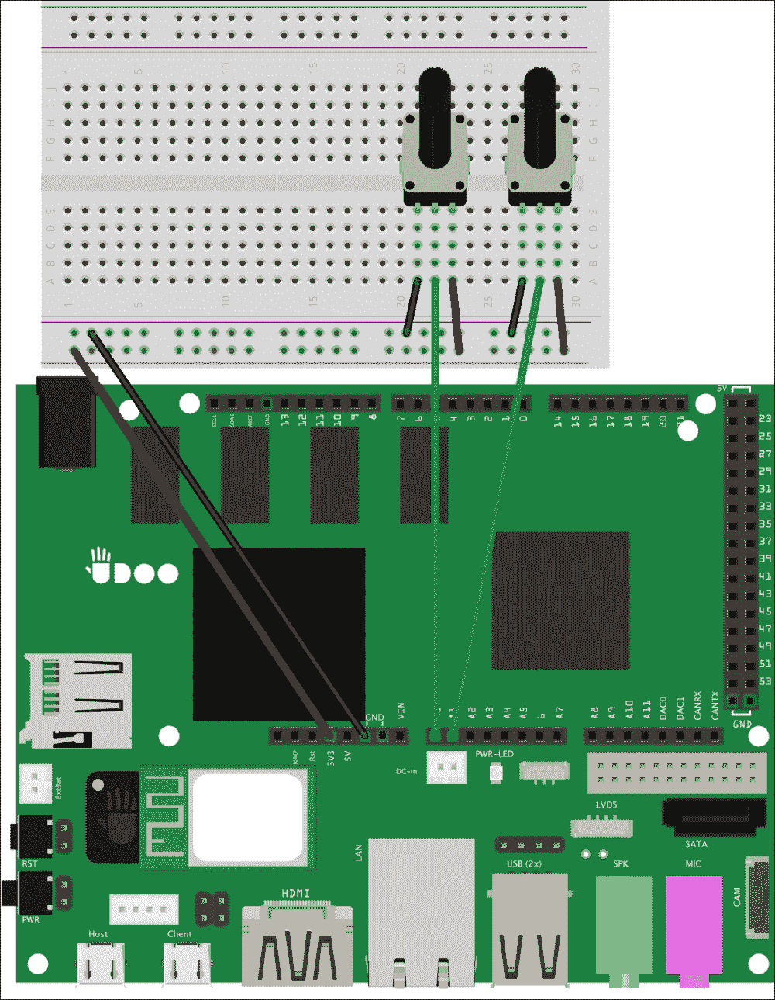
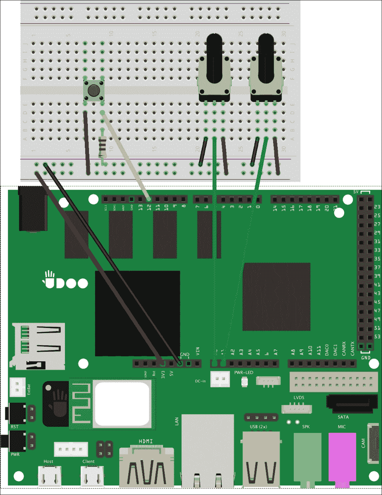
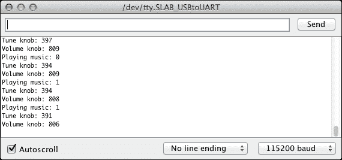
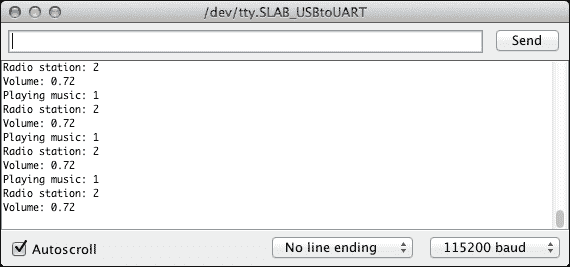
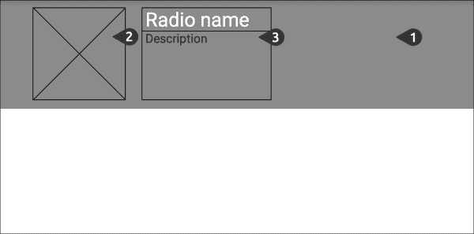
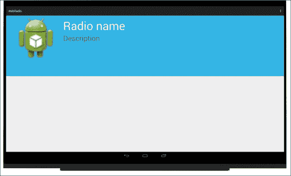

# 第五章：管理与物理组件的交互

电子设备改变了我们的生活。我们被许多看不见的物体所包围，它们收集并最终计算环境数据。正如我们在上一章所看到的，这些设备使用传感器来获取信息，并且我们可以在日常生活中找到它们，例如在我们的汽车中，当我们穿过超市的滑动门时，或者当我们回到家时。

我们可以从这些事物中汲取灵感，构建能够对环境和周围的人做出反应的惊人的物理应用。然而，如果我们的项目需要直接的与人交互，我们可能需要使用物理组件来管理这种交互。

本章的目标是构建一个使用内置 Android API 管理网络流的网络收音机，同时所有交互都由物理组件管理，就像旧式收音机一样。

在本章中，我们将涵盖以下主题：

+   管理用户交互

+   使用物理交互构建网络收音机

+   使用 Arduino 发送多个数据

+   编写用于音频流的 Android 应用程序

# 管理用户交互

区分交互式原型的其中一个方面是能够对用户的任何操作做出反应。正如我们在上一章所看到的，传感器是实现这一重要目标的最重要构建块之一。然而，有时我们希望提供一个物理交互，让用户能够通过双手改变应用程序的行为，尽管存在传感器。这些仍然广泛使用部分是简单的**机械**或**电子**组件，它们将模拟动作转换为微控制器可以用来改变程序流程的数字值。有许多我们可以用来与设备交互的组件：**按钮**、**开关按钮**、**操纵杆**、**扭钮**、**踏板**和**杠杆**，这些只是这类组件的例子。

扭钮是我们用来调整一些原型配置的组件。实际上，我们可以创建一个维护控制台，通过改变某些设备常数以避免新草图的重编译和上传阶段。在其他时候，扭钮用于直接操作，其使用是用户交互活动的积极部分。扭钮的常见用途与电器设备相关，例如音频设备中的音量控制。

另一个例子可能是与火星车有关，当我们希望为用户提供直接控制而不是依靠机器人自身的人工智能时。在这种情况下，我们可以使用一个按钮来方便地激活停止动作并切换到手动模式。例如，我们可以提供一个操纵杆，用于控制火星车的移动。

### 提示

按钮的一个使用例子与停止微控制器或原型所做的任何动作相关。这种按钮的使用称为**紧急停止**，在许多全自动且配备有活动部件的 DIY 项目中都会用到。

所有这些元素都有两个基本组件：**开关**和**电位计**。按钮是机械开关的好例子，它们可以关闭或打开电路，并通过微控制器引脚控制电流流。这样，我们可以根据检测到的电压激活电路的特定功能，就像在第三章，*测试您的物理应用*中所做的那样。

相反，电位计是电子元件，更像是电阻器。电子部分由三个终端腿组成，我们可以用不同的方式使用它们来改变电位计的目的。实际上，如果我们将一端和中间腿连接到一个组件，它就像一个**可变电阻器**。另一方面，如果我们使用所有三个终端，它就像一个可调节的**分压电路**。我们可以从一个方向转到另一个方向的电位计的*轴*，用于改变电阻器或分压电路的值。电位计应用的好例子有旋钮、操纵杆和吉他踏板。

# 带物理交互的构建网络收音机

微控制器并非为复杂工作而设计，因此我们需要小心地将项目的需求分配到正确的环境中。对于网络收音机，我们可以使用微控制器读取旋钮和开关，让 Android API 和 UDOO 强大的 CPU 处理其余工作。这将防止 Android 在读取硬件时分心，并防止微控制器因网络流和播放的复杂性而过载。

我们原型的第一部分是构建一个电路并编写一个草图，从两个电位计和一个按钮收集值：

+   我们使用第一个电位计来更改活动电台并增加或减少音量

+   我们使用物理按钮来控制收音机的播放

这样，我们就移除了所有通过 Android 用户界面进行的交互。

作为第一步，拿两个电位计并将它们连接到板上，这样我们就可以实现以下电路：



按照下面的步骤将电路连接到电位计，如前面的原理图所示：

1.  在你的面包板右侧放置两个电位计，因为我们需要在左侧的自由插槽中使用按钮。

1.  将 UDOO +3.3V 引脚连接到电源总线的正线。确保不要连接+5V 电源引脚，因为未来连接时可能会损坏模拟输入引脚。

1.  将 UDOO 地线连接到电源总线的负线。

1.  将第一个电位计的左端子连接到电源总线的负线。

    ### 提示

    电位计就像电阻一样，如果你连接了错误的正极端子，不会有任何区别。唯一的副作用是检测到的值将从[0-1023]范围变为[1023-0]。如果你注意到这一点，*请反转这些连接*。

1.  将第一个电位计的右端子连接到电源总线的正线。

1.  将中间端子连接到模拟输入 A0。

1.  对第二个电位计重复步骤 4、5、6，并将其中间端子连接到模拟输入 A1。

通过这个电路，我们使用两个电位计作为电压分压器，当我们转动轴时，微控制器注意到电压输出的变化，并将这个值转换成数值范围[0-1023]。这个电路与之前章节中构建的光传感器电路非常相似，但由于电位计已经在其包装内包含了一个电阻，我们不需要任何其他电子组件来保持其工作。

现在我们需要一个按钮来开始和停止播放。我们需要在面包板的左侧添加组件，并按以下方式连接到 UDOOboard：



按照给定的步骤连接组件，如前图所示：

1.  将按钮的左端子连接到电源总线的正线。

1.  使用 10 KOhm 电阻将右端子连接到电源总线的负线。

1.  将右端子连接到 UDOOboard 的 12 号引脚。

通过这个电路，我们可以使用 UDOOboard 的 12 号引脚读取按钮的值；当按下按钮时，我们可以改变微控制器的内部状态。

既然我们已经有了所有必需组件的电路，我们就必须开始一个新的草图，并准备一个函数来收集所有数据。草图的目标是准备一个包含*播放状态*、*音量*和*电台*的有序值的**三元组**。这种方法简化了稍后与 Android 应用程序通信时的工作。我们可以按照以下方式开始编写新草图：

1.  在草图顶部定义连接：

    ```kt
    #define RADIO_POLL_PERIOD 100
    #define PLAY_BUTTON 12
    #define KNOB_VOLUME A0
    #define KNOB_TUNER A1
    ```

    我们使用 12 号引脚作为播放按钮，A0 输入作为音量，A1 输入来切换当前电台。在这个项目中，我们设置了一个 100 毫秒的轮询时间，这对于物理组件和 Android 应用程序之间的快速交互是必需的。

1.  在之前的声明后添加以下变量：

    ```kt
    boolean playback = true;
    int buttonRead = LOW;
    int previousRead = LOW;
    int tuner = 0;
    int volume = 0;
    ```

    我们使用一个播放变量作为简单的状态指示器，以便草图知道收音机是否正在播放。由于我们正在构建一个依赖于物理交互的收音机，因此草图中的设备状态被认为是整个应用程序的*真实来源*，Android 应该信任这些值。我们还定义了其他变量来存储按钮和两个电位计的读数。

1.  在`setup()`函数中添加引脚模式，并打开串行通信：

    ```kt
    void setup() {
      pinMode(PLAY_BUTTON, INPUT);
      Serial.begin(115200);
    }
    ```

1.  在草图的底部创建一个`readData()`函数，在其中检测用户从物理组件的输入：

    ```kt
    void readData() {
      buttonRead = digitalRead(PLAY_BUTTON);
      if (buttonRead == HIGH && previousRead != buttonRead) {
        playback = !playback;
      }
      previousRead = buttonRead;
      tuner = analogRead(KNOB_TUNER);
      volume = analogRead(KNOB_VOLUME);
    }
    ```

    在第一部分，我们将按钮的值赋给`buttonRead`变量，以检查它是否被按下。同时，我们还将最后一次检测到的值存储在`previousRead`变量中，因为我们希望在连续读取时避免状态错误变化。这样，如果用户按住按钮，只会发生一次状态变化。

    在最后几行，我们进行`analogRead`调用，从两个电位计收集数据。

1.  在主`loop()`函数内调用`readData()`函数，并按以下方式打印收集的值：

    ```kt
    void loop() {
      readData();
      Serial.print("Playing music: ");
      Serial.println(playback);
      Serial.print("Radio station: ");
      Serial.println(tuner);
      Serial.print("Volume: ");
      Serial.println(volume);
      delay(RADIO_POLL_PERIOD);
    }
    ```

现在，我们可以将草图上传到我们的电路板上，并打开**串行监视器**，开始玩转旋钮和播放按钮。以下是预期输出的一个示例：



## 在发送之前规范化收集的数据

如我们所见，如果我们转动电位计的轴或按下播放按钮，我们的值会立即改变。这是一个非常好的起点，但现在我们需要转换这些数据，以便它们能被 Android 应用程序轻松使用。

因为我们想要管理五个广播电台，草图应该将调谐器的读数映射到[0-4]范围内的值。我们将在[0-1023]范围内创建固定间隔，这样当我们转动轴并通过一个间隔时，应更新活动的电台。为了实现这种映射，我们需要遵循以下步骤：

1.  在草图的顶部，添加突出显示的声明：

    ```kt
    #define KNOB_TUNER A1
    #define STATIONS 5
    #define MAX_ANALOG_READ 1024.0
    const float tunerInterval = MAX_ANALOG_READ / STATIONS;
    boolean playback = true;
    ```

    我们将管理的电台数量定义为`5`，并设置最大模拟读取值。这样，我们可以重用上面的类似对象的宏来定义`tunerInterval`常数，以将读数映射到正确的间隔。

1.  在草图的底部添加`mapStations()`函数：

    ```kt
    int mapStations(int analogValue) {
      int currentStation = analogValue / tunerInterval;
    }
    ```

    为了找到`currentStation`变量，我们将模拟读取值除以调谐器间隔。这样，我们可以确保返回的值被限制在[0-4]范围内。

使用前面的映射函数不足以让我们的收音机工作。另一个必要的步骤是转换音量值，因为 Android 使用[0.0-1.0]范围内的浮点数。因此，我们应该通过以下步骤规范化音量旋钮：

1.  在`mapStations()`函数下面添加此功能：

    ```kt
    float normalizeVolume(int analogValue) {
      return analogValue / MAX_ANALOG_READ;
    }
    ```

1.  更改主`loop()`函数，如下所示，以便我们可以检查是否所有值都正确转换：

    ```kt
    void loop() {
      readData();
      Serial.print("Playing music: ");
      Serial.println(playback);
      Serial.print("Radio station: ");
      Serial.println(mapStations(tuner));
      Serial.print("Volume: ");
      Serial.println(normalizeVolume(volume));
      delay(RADIO_POLL_PERIOD);
    }
    ```

1.  上传新的草图以查看以下截图显示的结果：

    ### 注意

    通过前面的步骤，我们从物理输入设备收集数据，并转换这些值以从旋钮计算当前的电台和收音机音量。然而，我们需要在 Android 应用程序中也放置这个逻辑，因为它应该为每个可能的电台映射相关的网络流媒体 URL。这意味着相同的逻辑被复制，这不是一个好方法，特别是如果我们将来需要添加新的频道。在这种情况下，我们的代码必须在两个应用程序中更改，并且我们应始终避免那些*容易出错*的情况。一个好方法是只使用微控制器报告输入，并让 Android 应用程序管理和转换接收到的原始数据。我们仅在本书的范围内使用这种方法，以帮助您更熟悉草图代码。

## 使用 Arduino 发送多个数据

在第四章《*使用传感器聆听环境*》中，我们需要发送由微控制器计算的一个字节。然而，在大多数常见情况下，我们需要从不同的传感器或物理组件读取数据，并且可能需要一次性将它们发送回 Android。在这个原型中，我们应该关注这一需求，因为微控制器必须读取所有三个值，并且只能通过一次 ADK 写入将它们发送回去。一个简单的方法是构建一个表示我们三元组的字符串，并使用逗号分隔这些值，格式为`<playback>,<volume>,<station>`。通过这种表示，我们得到以下值：

```kt
0,0.332768,2
1,0.951197,4
```

然后，我们可以在 ADK 缓冲区中写入收音机状态的*序列化*表示，并在 Android 应用程序中进行*反序列化*处理。

### 提示

我们可能会考虑实施或使用更复杂的通信协议，以将通用数据从 Arduino 传输到 Android，但我们应该始终牢记，在开始时，每个好主意都必须遵循**KISS 原则**：**保持简单**，**傻瓜**（一个由美国海军在 1960 年提出的设计原则）。因为软件越简单，它就越可能运行良好。

我们需要在草图的顶部编写配件描述符，如下所示的建议代码片段：

```kt
#include <adk.h>
#define BUFFSIZE 128
char accessoryName[] = "Web radio";
char manufacturer[] = "Example, Inc.";
char model[] = "WebRadio";
char versionNumber[] = "0.1.0";
char serialNumber[] = "1";
char url[] = "http://www.example.com";
uint8_t buffer[BUFFSIZE];
USBHost Usb;
ADK adk(&Usb, manufacturer, model, accessoryName, versionNumber, url, serialNumber);
```

我们还需要一个用于保存三元组的第二个缓冲区；我们可以在 ADK 缓冲区变量之前添加其声明，如下所示：

```kt
char triple[BUFFSIZE];
uint8_t buffer[BUFFSIZE];
```

在草图的底部，添加以下函数以在 ADK 缓冲区中写入三元组：

```kt
void writeBuffer(int playback, float volume, int station) {
  sprintf(triple, "%f,%f,%f", (float) playback, normalizeVolume(volume), (float) mapStations(station));
  memcpy(buffer, triple, BUFFSIZE);
}
```

`writeBuffer()`函数期望三个用于构建三元组的参数。为此，我们使用`sprintf()`函数将这些值写入中间`triple`缓冲区。在`sprintf()`函数调用中，我们还使用`normalizeVolume()`和`mapStations()`函数获取转换后的值。然后我们使用`memcpy()`函数将`triple`变量写入 ADK `buffer`。

### 注意

我们需要这个额外的步骤，因为我们不能将`triple`变量写入 ADK `buffer`中。`adk.write()`函数期望一个`unsigned char*`类型，而`triple`是`char*`类型。

既然 ADK 缓冲区包含了序列化的数据，我们就必须移除所有的`Serial`调用，并按以下方式重写主`loop()`函数：

```kt
void loop() {
  Usb.Task();
  if (adk.isReady()) {
    readData();
    writeBuffer(playback, volume, tuner);
    adk.write(BUFFSIZE, buffer);
  }
  delay(RADIO_POLL_PERIOD);
}
```

当 ADK 准备就绪时，我们从推按键和两个电位计中读取数据，然后将这些值序列化到一个三元组中，该三元组将被写入 ADK 输出缓冲区。一切准备就绪后，我们将记录的输入发送回 Android。

我们现在可以更新我们的草图，并使用 Android 应用程序完成原型。

# 从 Android 应用程序中流式传输音频

Android 操作系统提供了一组丰富的 UI 组件，这是所有物理应用的重要构建块。它们都是针对手机或平板交互的，这是一项杰出的改进，因为用户已经知道如何使用它们。然而，Android 不仅仅是一组 UI 组件，因为它允许许多 API 来实现常规任务。在我们的案例中，我们希望一个物理应用能够与 Web 服务交互，以打开和播放音频流。

如果没有 i.MX6 处理器和 Android 操作系统，这项任务将不可能轻松实现，但在我们的情况下，UDOO 开发板提供了我们所需要的一切。

## 设计 Android 用户界面

在 Android Studio 中，启动一个名为**WebRadio**的新应用，使用**Android API 19**。在引导过程中，选择一个名为**Radio**的**空白活动**。

我们的首要目标是改变默认布局，以一个简单但花哨的界面替代。主布局必须显示当前激活的广播电台，并提供不同的信息，如可选的图片——频道名称以及描述。在编写 Android 绘制用户界面所需的 XML 代码之前，我们应该规划工作以检测所需的组件。在下面的截图中，我们可以查看提供所有必需元素的用户界面草图：



上面的布局包括一个数字标记，定义了组件创建的顺序。根据此布局，我们应该按照以下顺序提供三个不同的视图：

1.  作为第一步，我们应该创建一个不同颜色的背景框架，以提供一个块，我们将把所有其他组件放入其中。

1.  尽管这是可选的，但我们可以准备一个框，如果可用的话，将用于显示电台频道图片。

1.  最后一个块包含两个不同的文本区域，第一个代表频道名称，而另一个代表频道描述。

使用这种布局设计，我们应该按照以下步骤继续操作，替换标准主题：

1.  在 `res/values/dimens.xml` 资源文件中，添加以下定义，为我们提供一些组件的尺寸，如背景框架高度和字体大小：

    ```kt
    <resources>
      <dimen name="activity_horizontal_margin">16dp</dimen>
      <dimen name="activity_vertical_margin">16dp</dimen>
      <dimen name="activity_frame_height">220dp</dimen>
      <dimen name="activity_image_square">180dp</dimen>
      <dimen name="layout_padding">50dp</dimen>
      <dimen name="title_size">40sp</dimen>
      <dimen name="description_size">25sp</dimen>
    </resources>
    ```

1.  在 `res/values/styles.xml` 资源文件中，添加背景框架和文本元素使用的以下颜色：

    ```kt
    <resources>
      <color name="picton_blue">#33B5E5</color>
      <color name="white">#FFFFFF</color>
      <style name="AppTheme" parent="Theme.AppCompat.Light.DarkActionBar">
      </style>
    </resources>
    ```

1.  在 `res/layout/` 下的 `activity_radio.xml` 文件中，用以下 `FrameLayout` 替换 `RelativeLayout` 以实现背景框架：

    ```kt
    <FrameLayout 

      android:layout_width="match_parent"
      android:layout_height="@dimen/activity_frame_height"
      android:paddingLeft="@dimen/activity_horizontal_margin"
      android:paddingRight="@dimen/activity_horizontal_margin"
      android:paddingTop="@dimen/activity_vertical_margin"
      android:paddingBottom="@dimen/activity_vertical_margin"
      android:background="@color/picton_blue"
      tools:context=".Radio">
    </FrameLayout>

    ```

    我们使用 `FrameLayout` 创建一个区域，该区域以定义的高度和背景色容纳所有其他组件。

1.  在上述 `FrameLayout` 参数中创建一个 `LinearLayout`：

    ```kt
    <LinearLayout
      android:orientation="horizontal"
      android:layout_width="match_parent"
      android:layout_height="match_parent">

        <ImageView
          android:id="@+id/radio_image"
          android:src="img/ic_launcher"
          android:layout_height="@dimen/activity_image_square"
          android:layout_width=
            "@dimen/activity_image_square" />

        <LinearLayout
          android:orientation="vertical"
          android:layout_marginLeft="@dimen/layout_padding"
          android:layout_width="match_parent"
          android:layout_height="match_parent">
        </LinearLayout>
    </LinearLayout>
    ```

    第一个 `LinearLayout` 将包含根据活动频道而变化的 `radio_image` `ImageView`。第二个 `LinearLayout` 用于容纳电台名称和描述。

1.  在第二个 `LinearLayout` 中添加以下视图：

    ```kt
    <TextView
      android:id="@+id/radio_name"
      android:text="Radio name"
      android:textColor="@color/white"
      android:textSize="@dimen/title_size"
      android:layout_width="wrap_content"
      android:layout_height="wrap_content" />

    <TextView
      android:id="@+id/radio_description"
      android:text="Description"
      android:textSize="@dimen/description_size"
      android:layout_width="wrap_content"
      android:layout_height="wrap_content" />
    ```

根据之前定义的样式，以下是获得的布局：



在我们继续逻辑实现之前，我们必须在 `onCreate()` 回调中通过以下步骤获取所有视图引用：

1.  在 `Radio` 类的顶部添加以下声明：

    ```kt
    private TextView mRadioName;
    private TextView mRadioDescription;
    private ImageView mRadioImage;
    ```

1.  在 `onCreate()` 回调的底部，添加高亮代码：

    ```kt
    setContentView(R.layout.activity_radio);
    mRadioName = (TextView) findViewById(R.id.radio_name);
    mRadioDescription = (TextView) findViewById(R.id.radio_description);
    mRadioImage = (ImageView) findViewById(R.id.radio_image);

    ```

现在布局已完成，我们可以继续进行 ADK 配置。

## 设置 ADK 工具包

在我们开始网络电台实现之前，我们首先应该像上一章一样配置 *ADKToolkit*。为了拥有可工作的 ADK 配置，请按照以下步骤操作：

1.  在 `app` 下的 `build.gradle` 文件中添加 *ADKToolkit* 库依赖。

1.  同步你的 Gradle 配置。

1.  在 `res/xml/` 下创建配件过滤器文件 `usb_accessory_filter.xml`，使用以下代码：

    ```kt
    <resources>
      <usb-accessory
       version="0.1.0"
       model="WebRadio"
       manufacturer="Example, Inc."/>
    </resources>
    ```

1.  在 `AndroidManifest.xml` 文件中添加 *USB accessory support* 选项要求和 *USB accessory intent filter* 选项。

1.  在 `Radio.java` 类文件中，在类的顶部声明 `AdkManager` 对象。

1.  在 `Radio` 活动类的 `onCreate` 方法中添加 `AdkManager` 初始化。

1.  重写 `onPause()` 和 `onResume()` 回调，根据活动生命周期来启动和停止 ADK 连接。

    ### 提示

    每次我们开始一个新项目时，都应该使用上述清单。最好将这些步骤写下来，确保我们的项目始终以此 ADK 配置开始。

1.  作为初始配置的最后一步，我们需要添加互联网访问权限，因为我们将使用网络流。在你的`AndroidManifest.xml`文件的 manifest 标签内添加以下权限：

    ```kt
    <uses-permission android:name="android.permission.INTERNET" />
    ```

## 更换网络电台

下一步是编写必要的 Android 代码以播放和停止配置的电台。我们需要正式化电台对象和一个实用程序类，该类抽象了内置媒体播放器的相同功能。以下是所需类的使用清单：

+   `Station`：正式定义音频频道，并包括标题、描述和电台图片，以及启动远程播放所需的流媒体 URL

+   `RadioManager`：在初始化期间配置所有可用的电台，并将所有管理播放和频道切换的通用方法抽象出来

我们从可以通过以下步骤实现的`Station`类开始：

1.  在我们的命名空间内创建一个名为`streaming`的新 Java 包。

1.  在新创建的 Java 包中创建`Station`类，并添加以下声明和类构造函数：

    ```kt
    private final static String STREAMING_BASE_URL = "https://streaming.jamendo.com/";
    private String title;
    private String description;
    private int imageId;
    public Station(String title, String description, int imageId) {
      this.title = title;
      this.description = description;
      this.imageId = imageId;
    }
    ```

    我们定义了我们将用于构建频道流媒体 URL 的第一部分。在这种情况下，我们将使用提供许多在**Creative Commons**许可下发布的音乐频道的**Jamendo**服务。如果你想获取更多信息，可以查看服务网站：

    [Jamendo 网站](https://www.jamendo.com)

    我们将使用的其他属性是电台的`title`和`description`属性以及 Android 资源标识符。

1.  在类的底部，以下获取器用于检索实例属性：

    ```kt
    public String getTitle() {
      return title;
    }
    public String getDescription() {
      return description;
    }
    public int getImageId() {
      return imageId;
    }
    public String getStreamUrl() {
      return STREAMING_BASE_URL + title;
    }
    ```

    在`getStreamUrl()`方法中，我们使用带有电台名称的基础 URL 来查找正确的音频流。

    ### 提示

    这个字符串连接与 Jamendo 服务的工作方式有关。如果你使用另一个服务或不想在 URL 构建时使用标题属性，你应该更改这个方法。

既然我们已经有了正式的`Station`类表示，我们需要定义一个能够管理 Android 播放的类。我们通过以下步骤实现`RadioManager`类：

1.  在`streaming`包中，创建`RadioManager`类，并在开始处添加以下声明：

    ```kt
    private static ArrayList<Station> mChannels;
    private static MediaPlayer mMediaPlayer;
    private static int mPlayback;
    private static int mIndex;
    private static Station mActiveStation;
    ```

    我们使用 Android 高级`MediaPlayer`对象来管理远程流媒体；我们使用一些状态变量，如当前活动电台及其数组索引和播放状态。我们将在`RadioManager`类初始化期间填充`mChannels` `ArrayList`对象，它将托管所有可用的音乐频道。

1.  在类的底部添加初始化方法，如下所示：

    ```kt
    public static void initialize() {
      // Prepare all stations object
      mChannels = new ArrayList();
      mChannels.add(new Station("JamPop", "Pop", R.drawable.ic_launcher));
      mChannels.add(new Station("JamClassical", "Classical", R.drawable.ic_launcher));
      mChannels.add(new Station("JamJazz", "Jazz", R.drawable.ic_launcher));
      mChannels.add(new Station("JamElectro", "Electronic", R.drawable.ic_launcher));
      mChannels.add(new Station("JamRock", "Rock", R.drawable.ic_launcher));
      // Initializes the MediaPlayer with listeners
      mMediaPlayer = new MediaPlayer();
      mMediaPlayer.setAudioStreamType(AudioManager.STREAM_MUSIC);
      mMediaPlayer.setOnPreparedListener(new MediaPlayer.OnPreparedListener() {
        @Override
        public void onPrepared(MediaPlayer mediaPlayer) {
          mediaPlayer.start();
        }
      });
    }
    ```

    在第一部分，我们根据之前的 `Station` 构造函数配置所有可用频道的列表。我们配置 `MediaPlayer` 对象，以便在 prepare 过程完成后立即开始网络流。

    ### 注意

    你可以在以下 URL 查找更多关于 Android `MediaPlayer` 类如何工作的信息：

    [`developer.android.com/reference/android/media/MediaPlayer.html`](http://developer.android.com/reference/android/media/MediaPlayer.html)。

1.  添加以下方法，以抽象播放和停止功能，防止代码重复：

    ```kt
    private static void stop() {
      mMediaPlayer.reset();
    }
    private static void play() {
      try {
        mMediaPlayer.setDataSource(mActiveStation.getStreamUrl());
        mMediaPlayer.prepareAsync();
      }
      catch (IOException e) {
        // noop
      }
    }
    ```

    当播放器停止时，我们必须重置媒体播放器对象，因为我们可能需要立即设置另一个数据源。`play` 方法设置当前激活频道的流媒体 URL 并开始一个非阻塞的 prepare 任务。

1.  添加以下公共方法，该方法改变播放状态：

    ```kt
    public static void playback(int value) {
      // If the playback status has changed
      if (value != mPlayback) {
        // Play or stop the playback
        if (value == 0) {
          stop();
        }
        else {
          play();
        }
        mPlayback = value;
      }
    }
    ```

    通过 ADK 的草图，我们的应用程序每隔 100 毫秒就会收到连续的数据，这提高了用户界面的响应性。然而，我们不想多次重复相同的命令，所以我们只有在收到的值与存储的值不同时才会执行操作。在第二部分，我们根据给定的参数选择开始或播放当前流。

1.  作为最后一步，我们需要一个方法来更改激活的频道。在类的底部添加以下代码：

    ```kt
    public static Station changeStation(int stationId) {
      Station station = null;
      if (stationId != mIndex) {
        mIndex = stationId;
        // Set the current station
        mActiveStation = mChannels.get(mIndex);
        station = mActiveStation;
        stop();
        if (mPlayback == 1) {
          play();
        }
      }
      return station;
    }
    ```

    正如我们之前所做的，如果收到的值与我们当前播放的值相同，我们避免更改频道。然后，我们更新当前频道并停止最后的流。这样，如果我们处于播放状态，我们可以安全地播放新的电台流。在任何情况下，我们返回选择的 `Station` 实例，如果频道没有变化则返回 `null`。

## 从物理设备读取输入

正如我们在上一章所做的，我们需要准备我们的应用程序，以使 ADK 缓冲区中用户输入的连续读取变得可用。正如之前所做，我们将创建一个 Java 接口，公开所需的方法以更新用户界面。我们可以通过以下步骤实现这一点：

1.  创建一个名为 `OnDataChanges` 的新 Java 接口，并添加以下方法：

    ```kt
    public interface OnDataChanges {
      void updateStation(Station station);
    }
    ```

1.  让 `Radio` 类通过高亮代码实现前面的接口：

    ```kt
    public class Radio extends ActionBarActivity implements OnDataChanges {
    ```

1.  在类的末尾实现接口代码，以更新 Android 用户界面：

    ```kt
    @Override
    public void updateStation(Station station) {
      mRadioName.setText(station.getTitle());
      mRadioDescription.setText(station.getDescription());
      mRadioImage.setImageResource(station.getImageId());
    }
    ```

    在这部分，我们根据 `station` 实例属性简单地更新所有视图。

最后一个必要的步骤是实现我们的计划线程，从微控制器读取处理过的数据，并一起更新 `MediaPlayer` 类的流和 Android 用户界面。要完成这最后一个构建块，请执行以下步骤：

1.  在你的命名空间中创建一个名为 `adk` 的新包。

1.  在 `adk` 包中，添加一个名为 `DataReader` 的新类。

1.  在类的顶部，添加以下声明：

    ```kt
    private final static int INPUT_POLLING = 100;
    private final static int STATION_UPDATE = 0;
    private AdkManager mAdkManager;
    private OnDataChanges mCaller;
    private ScheduledExecutorService mScheduler;
    private Handler mMainLoop;
    ```

    与前一章一样，我们定义主线程处理器使用的轮询时间和消息类型。我们还存储了`AdkManager`参数和调用活动的引用，分别用于 ADK 读取方法和`updateStation`函数的回调。然后我们定义了`ExecutorService`方法的实现以及主线程`Handler`。

1.  实现主线程从后台线程接收到新消息时设置消息处理器的`DataReader`构造函数：

    ```kt
    public DataReader(AdkManager adkManager, OnDataChanges caller) {
      this.mAdkManager = adkManager;
      this.mCaller = caller;
      mMainLoop = new Handler(Looper.getMainLooper()) {
        @Override
        public void handleMessage(Message message) {
          switch (message.what) {
            case STATION_UPDATE:
              mCaller.updateStation((Station) message.obj);
              break;
          }
        }
      };
    }
    ```

    我们存储`AdkManager`和`caller`活动的引用，然后设置一个附加到应用程序主循环的`Handler`。`handleMessage`回调检查消息代码以识别`STATION_UPDATE`消息。在这种情况下，我们调用`updateStation`方法并传递附加的对象。

1.  在`DataReader`类的底部，添加以下私有类，实现`Runnable`接口以读取和管理物理输入设备：

    ```kt
    private class InputThread implements Runnable {
      @Override
      public void run() {
        // Read from ADK
        AdkMessage response = mAdkManager.read();
        // Parse the response
        String[] collectedInputs = response.getString().split(",");
        int playback = (int) Float.parseFloat(collectedInputs[0]);
        int station = (int) Float.parseFloat(collectedInputs[2]);
        // Start radio and get the changed station
        RadioManager.playback(playback);
        Station currentStation = RadioManager.changeStation(station);
        // Updated station back to the main thread
        if (currentStation != null) {
          Message message = mMainLoop.obtainMessage(STATION_UPDATE, currentStation);
          message.sendToTarget();
        }
      }
    }
    ```

    线程启动时，我们使用`AdkManager`方法读取用户输入。然后我们从响应中获取原始字符串，并使用分割方法反序列化接收到的三元组。第一个位置指的是播放状态，我们在`RadioManager`类中使用它来启动或停止播放。第三个位置是激活的频道，我们将其传递给`changeStation`方法。根据之前的实现，如果`currentStation`变量没有改变，我们避免将消息发布到主线程，以防止无用的界面重绘。

1.  向`DataReader`类添加一个方法，以定期生成短生命周期的线程来启动调度程序：

    ```kt
    public void start() {
      // Initialize threads
      InputThread thread = new InputThread();
      // Should start over and over while publishing results
      mScheduler = Executors.newSingleThreadScheduledExecutor();
      mScheduler.scheduleAtFixedRate(thread, 0, INPUT_POLLING, TimeUnit.MILLISECONDS);
    }
    ```

    与上一个项目一样，我们使用一个调度程序，每次在`INPUT_POLLING`变量毫秒时生成一个单独的`InputThread`参数。

1.  在类的底部添加停止方法，通过执行器的`shutdown`方法停止调度程序生成新线程：

    ```kt
    public void stop() {
      mScheduler.shutdown();
    }
    ```

1.  现在，我们应该回到`Radio`类中，在活动生命周期内启动和停止调度程序。在`Radio`类的顶部添加`DataReader`方法声明：

    ```kt
    private AdkManager mAdkManager;
    private DataReader mReader;

    ```

1.  在活动创建时初始化`RadioManager`类和`DataReader`实例，通过以下高亮代码，你应该将其添加到`onCreate()`回调的底部：

    ```kt
    mRadioImage = (ImageView) findViewById(R.id.radio_image);
    RadioManager.initialize();
    mAdkManager = new AdkManager(this);
    mReader = new DataReader(mAdkManager, this);

    ```

1.  如高亮代码所示，在`onResume()`和`onPause()`活动的回调中启动和停止读取调度程序：

    ```kt
    @Override
    protected void onPause() {
      super.onPause();
      mReader.stop();
      mAdkManager.close();
    }

    @Override
    protected void onResume() {
      super.onResume();
      mAdkManager.open();
      mReader.start();
    }
    ```

完成这些步骤后，广播电台就完成了，我们可以将 Android 应用程序上传到 UDO0 板，并通过旋钮和按钮开始播放。

### 注意

因为我们没有处理网络错误，请确保 UDO0 已连接到互联网，并且你正在使用以太网或 Wi-Fi 网络适配器，否则应用程序将无法工作。

## 管理音频音量

在我们可以发布第一个广播原型之前，我们应该从 Android 应用程序管理音量旋钮。这部分非常简单，这要感谢`MediaPlayer`方法的 API，因为它公开了一个公共方法来改变激活流的音量。为了用音量管理器改进我们的项目，我们需要添加以下代码片段：

1.  在`RadioManager`类中，请在类顶部添加高亮的声明：

    ```kt
    private static Station mActiveStation;
    private static float mVolume = 1.0f;

    ```

1.  在`RadioManager`类的底部，添加以下公共方法：

    ```kt
    public static void setVolume(float volume) {
      if (Math.abs(mVolume - volume) > 0.05) {
        mVolume = volume;
        mMediaPlayer.setVolume(volume, volume);
      }
    }
    ```

    `setVolume`方法预期接收来自 Arduino 的浮点数作为参数，我们用它来改变`mMediaPlayer`实例的音量。然而，由于我们不希望因为微小的变化而改变音量，因此我们放弃了所有与之前记录的输入差异不大的请求。

1.  在`DataReader`类中编写的`InputThread`实现中添加音量解析和`setVolume`函数调用：

    ```kt
    float volume = Float.parseFloat(collectedInputs[1]);
    int station = (int) Float.parseFloat(collectedInputs [2]);
    RadioManager.playback(playback);
    RadioManager.setVolume(volume);

    ```

有了这最后一块，网络广播就完成了，我们可以继续进行最后的部署。现在，我们的用户可以使用旋钮和按钮与原型互动，控制应用程序的各个方面。

# 改进原型

在进一步讨论其他原型之前，我们应该考虑当发生一些意外事件时，我们如何改进我们的设备。一个好的起点是考虑错误处理，特别是当 Android 应用程序停止从外设接收数据时会发生什么。有许多方法可以防止错误操作，一个好的解决方案是在 Android 应用程序中包含一个默认行为，这些紧急情况下原型应该遵循。

我们本可以使用另一个周期性定时器，每次执行时增加一个变量。当`InputThread`实例完成一次成功的读取后，它应该重置上述变量。通过这种方式，我们可以监控停止接收用户输入的时间，根据这个时间，我们可能决定改变应用程序的行为。通过这个变量，例如，如果外设停止提供用户输入，我们可以停止广播播放，或者稍微降低音量。

关键点是，我们应始终为失败和成功设计我们的原型。大多数*如果发生*的问题在前端很容易融入，但后来很难添加。

# 总结

在本章中，您学习了当需要人机交互时，如何提高我们原型的质量。我们探索了一些常见的物理组件，它们可以用来改变或控制 Android 应用程序。通过强大的 Android API，我们构建了一个能够执行复杂任务如网络流传输的网络广播。

在第一部分，我们使用两个电位计和一个按钮构建了所需的电路。当通过串行监视器检查返回的值时，我们发现它们在这种格式下并不太有用，因此我们编写了映射和归一化函数。

我们继续为 Android 应用程序提供新的布局，但我们避免通过用户界面添加任何交互。我们编写了一个类来抽象化与内置媒体播放器的所有可能交互，这样我们可以轻松地在应用的任何部分控制这个组件。事实上，我们在后台任务中使用它，每当它读取用户输入时，它会立即改变收音机的状态。通过这种方式，我们启用了按钮来启动和停止播放，以及两个电位器来改变活动电台和音乐音量。

在下一章中，我们开始讨论家居自动化。我们从零开始设计一个新的原型，能够使用传感器数值和用户设置的组合来控制外部设备的开关。我们将利用其他 Android API 来存储应用的设置，并在稍后使用它们来修改应用流程。
