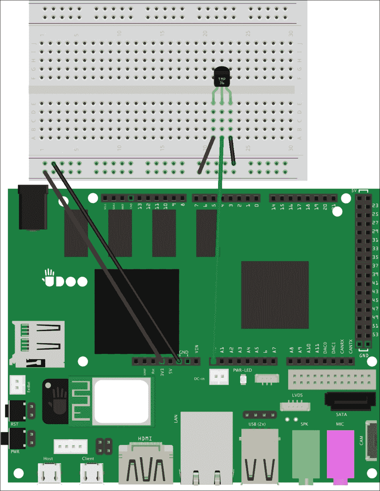
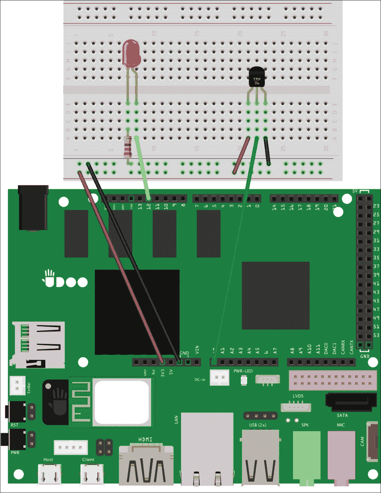
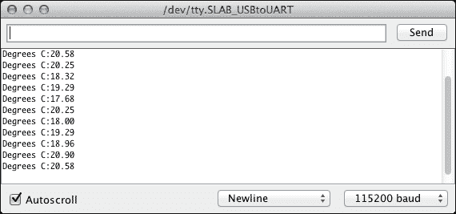
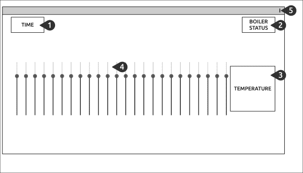
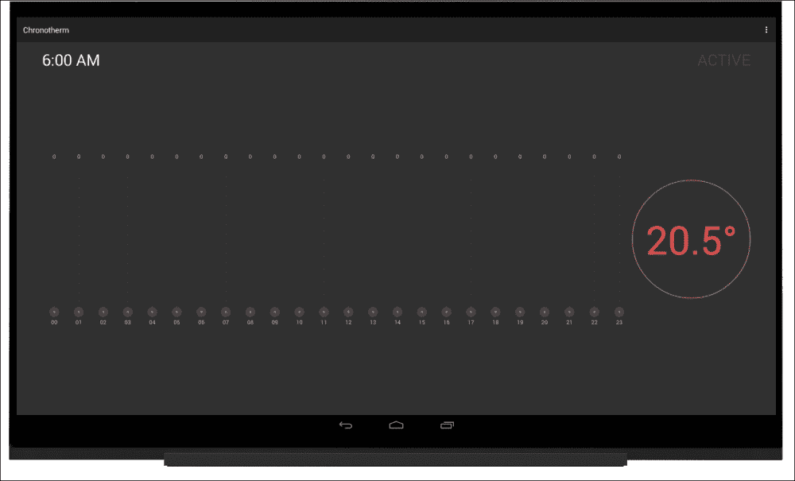
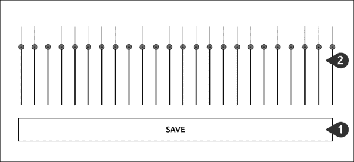
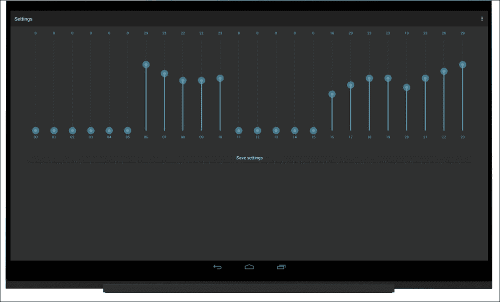

# 第六章：为智能家居构建 Chronotherm 电路

几十年来，控制家庭设备如灯光、恒温器和电器已经变得可能，甚至简单，通过自动和远程控制。一方面，这些自动化设备节省了人力和能源，但另一方面，即使是微小的调整对最终用户来说也不方便，因为他们需要对系统有很好的了解才能进行任何更改。

在过去几年中，由于缺乏标准或易于定制的解决方案，人们不愿采用**智能家居**技术。如今，情况正在发生变化，UDOO 等原型开发板在设计及构建**DIY**（**自己动手做**）自动化设备时发挥着重要作用。更妙的是，由于开源项目，这些平台易于扩展，并且可以被不同的设备控制，如个人电脑上的网络浏览器、手机和平板电脑。

在本章中，我们将涵盖以下主题：

+   探索智能家居的优势

+   构建一个 chronotherm 电路

+   发送数据与接收指令

+   编写 Chronotherm 安卓应用程序

# 智能家居

“智能家居”这个词相当通用，可能有多种不同的含义：控制环境灯光的定时器，响应来自外部的各种事件做出动作的智能系统，或者负责完成重复任务的编程设备。

这些都是智能家居的有效示例，因为它们共享同一个关键概念，使我们即使不在家也能管理家务和活动。智能家居设备通常在公共或私人网络上运行，以相互通信，以及与其他类型的设备如智能手机或平板电脑进行通信，接收指令或交换它们的状态信息。但当我们需要自动化简单的电器或电子元件，如灯泡时，该怎么办？解决这个问题的常见方法是通过开发一种**控制系统**设备，物理连接到我们想要管理的电器上；由于控制系统是一种智能家居设备，我们可以使用它来驱动它所连接的每个电器的行为。

如果我们在智能家居领域积累足够的经验，我们有可能开发并构建一个高端系统，用于我们自己的房子，这个系统足够灵活，可以轻松扩展，而不需要进一步的知识。

# 构建一个 chronotherm 电路

温控器主要由一个*控制单元*组成，负责检查环境温度是否低于预配置的设定点，如果是，则打开锅炉加热房间。这种行为很简单，但没有进一步的逻辑就不太有用。实际上，我们可以通过向温控器逻辑中添加*时间*参数来扩展此行为。这样，用户可以为每天每小时定义一个温度设定点，使温度检查更加智能。

### 注意

在这个原型中，控制单元是板载 Arduino，这是一个简化整体设计的实现细节。

这就是传统温控器的工作原理，为了实现它，我们应该：

+   构建带有温度传感器的电路

+   实现微控制器逻辑，以检查用户的设定点与当前温度

不幸的是，第二部分并不容易，因为用户的设定点应该存储在微控制器中，因此我们可以将这项任务委托给我们的安卓应用程序，通过在 microSD 卡中保存设置来实现。这种方法以下列方式解耦责任：

+   Arduino 草图：

    +   从温度传感器收集数据

    +   将检测到的温度发送到安卓

    +   期待一个安卓命令来启动或停止锅炉

+   安卓应用程序：

    +   管理用户交互

    +   实现用户设置，以存储每天每小时的温度设定点

    +   读取微控制器发送的温度

    +   实现逻辑以选择是否应该打开或关闭锅炉

    +   向微控制器发送命令以启动或停止锅炉

通过这个计划，我们可以依赖安卓用户界面组件轻松实现简洁且易用的界面，同时避免设置存储层的复杂性。

要开始构建原型，我们需要在我们的面包板上插入一个温度传感器，如*TMP36*，以获得以下电路：



以下是连接组件的逐步操作过程，如前图所示：

1.  将 TMP36 传感器放在面包板的右侧部分。

1.  将 UDOO 的+3.3V 引脚连接到电源总线的正极。确保不要连接+5V 电源引脚，因为未来连接时可能会损坏模拟输入引脚。

1.  将 UDOO 的地线连接到电源总线的负极。

1.  将 TMP36 传感器的左端连接到电源总线的正极。

    ### 提示

    使用封装传感器时，我们可以通过观察平整的部分来判断方向。使用这种方法来找到左端和右端。

1.  将 TMP36 传感器的右侧终端连接到电源总线的负极。

1.  将 TMP36 传感器的中间终端连接到模拟输入 A0。

这个封装的传感器非常容易使用，它不需要任何其他组件或电压分压器来为微控制器提供电压变化。现在我们应该继续从我们的电路管理锅炉点火。为了原型的需要，我们将用简单的 LED 替换锅炉执行器，就像我们在第二章，*了解你的工具*中所做的那样。这将使我们的电路更简单。

我们可以在面包板上添加一个 LED，以实现以下原理图：



以下是按照前述原理图连接组件的步骤：

1.  将 LED 放在面包板的左侧。

1.  将 LED 较长的终端（阳极）连接到 UDO 数字引脚 12。

1.  使用一个 220 欧姆的电阻，将 LED 较小的终端（阴极）连接到电源总线的负线上。

使用这个电路，我们拥有了从环境中收集数据和模拟锅炉点火所需的所有组件。现在我们需要打开 Arduino IDE 并开始一个新的草图。第一个目标是将检测到的温度检索并转换成方便的计量单位。为了实现这个目标，我们需要执行以下步骤：

1.  在草图的顶部定义这些类似对象宏和变量：

    ```kt
    #define TEMPERATURE_POLL_PERIOD 1000
    #define SENSOR A0
    #define BOILER 12
    int reading;
    ```

    我们定义了`SENSOR`对象来表示模拟引脚 A0，而`BOILER`对象与我们的数字引脚 12 相关联。我们还声明了一个`reading`变量，稍后用来存储当前检测到的温度。`TEMPERATURE_POLL_PERIOD`宏表示微控制器在两次读数之间等待的秒数，以及它通知 Android 应用程序检测到的温度之前等待的秒数。

1.  在`setup()`函数中，添加引脚模式声明并打开串行通信，如下所示：

    ```kt
    void setup() {
      pinMode(BOILER, OUTPUT);
      digitalWrite(BOILER, LOW);
      Serial.begin(115200);
    }
    ```

1.  在草图的底部，按照以下方式创建`convertToCelsius()`函数：

    ```kt
    float convertToCelsius(int value) {
      float voltage = (value / 1024.0) * 3.3;
      return (voltage - 0.5) * 100;
    }
    ```

    在这个函数中，我们期望一个传感器读数，并以*摄氏度*的形式返回它的表示。为此，我们使用了一些数学计算来确定实际检测到的电压是多少。因为 UDO 微控制器的模数转换器提供的值范围是[0-1023]，但我们想要计算从 0 到 3.3V 的范围，所以我们应该将值除以 1024.0，然后将结果乘以 3.3。

    我们在摄氏度转换中使用电压，因为如果我们阅读 TMP36 的数据表，我们会发现传感器每 10 毫伏的变化相当于 1 摄氏度的温度变化，这就是我们为什么将值乘以 100。我们还需要从电压中减去 0.5，因为此传感器可以处理 0 度以下的温度，而 0.5 是选择的偏移量。

    ### 提示

    这个函数可以将 TMP36 的读数轻松转换为摄氏度。如果你想使用其他计量单位，比如华氏度，或者你使用的是其他传感器或热敏电阻，那么你需要改变这个实现方式。

1.  在主`loop()`函数中，从传感器读取模拟信号并使用`loop()`函数打印转换后的结果：

    ```kt
    void loop() {
      reading = analogRead(SENSOR);
      Serial.print("Degrees C:");
      Serial.println(convertToCelsius(reading));
      delay(TEMPERATURE_POLL_PERIOD);
    }
    ```

如果我们上传草图并打开串行监视器，我们会注意到当前的室温。实际上，如果我们把手指放在传感器周围，我们会立即看到之前检测到的温度升高。以下屏幕截图是草图输出的一个示例：



## 发送数据和接收命令

下一步是像往常一样启用 ADK 通信，并且我们需要在草图顶部添加*配件描述符*代码，如下所示：

```kt
#include <adk.h>
#define BUFFSIZE 128
char accessoryName[] = "Chronotherm";
char manufacturer[] = "Example, Inc.";
char model[] = "Chronotherm";
char versionNumber[] = "0.1.0";
char serialNumber[] = "1";
char url[] = "http://www.example.com";
uint8_t buffer[BUFFSIZE];
uint32_t readBytes = 0;
USBHost Usb;
ADK adk(&Usb, manufacturer, model, accessoryName, versionNumber, url, serialNumber);
```

现在我们需要将检测到的浮点温度发送回 Android 应用程序，就像我们在第五章，*管理与物理组件的交互*中所做的那样。为了将缓冲区加载一个浮点数并通过内部总线发送该值，我们需要添加一个`writeToAdk()`辅助函数，代码如下：

```kt
void writeToAdk(float temperature) {
  char tempBuffer[BUFFSIZE];
  sprintf(tempBuffer, "%f", temperature);
  memcpy(buffer, tempBuffer, BUFFSIZE);
  adk.write(strlen(tempBuffer), buffer);
}
```

前面的函数期望从传感器读数转换而来的浮点温度。我们使用`sprintf()`函数调用填充一个临时缓冲区，然后使用`memcpy()`函数用`tempBuffer`变量替换 ADK 缓冲区内容。加载完成后，我们将缓冲区内容发送到 Android 应用程序。

在主`loop()`函数中，我们还需要监听 Android 发送的任何命令，这些命令描述了需要打开或关闭锅炉的需求。因此，我们需要像在第二章，*了解你的工具*中所做的那样创建一个执行器函数。然后，我们需要从 ADK 读取命令并将结果传递给执行器。为此，我们需要执行以下步骤：

1.  添加`executor()`函数，该函数读取一个命令并打开或关闭外部设备：

    ```kt
    void executor(uint8_t command) {
      switch(command) {
        case 0:
          digitalWrite(BOILER, LOW);
          break;
        case 1:
          digitalWrite(BOILER, HIGH);
          break;
        default:
          // noop
          break;
      }
    }
    ```

1.  添加`executeFromAdk()`函数，该函数从 ADK 读取命令并将其传递给前面的`executor()`函数：

    ```kt
    void executeFromAdk() {
      adk.read(&readBytes, BUFFSIZE, buffer);
      if (readBytes > 0){
        executor(buffer[0]);
      }
    }
    ```

如果我们查看本章开始时定义的计划，我们拥有 Arduino 草图所需的所有组件，因此我们可以使用以下代码在主`loop()`函数中将所有内容组合在一起：

```kt
void loop() {
  Usb.Task();
  if (adk.isReady()) {
    reading = analogRead(SENSOR);
    writeToAdk(convertToCelsius(reading));
    executeFromAdk();
    delay(DELAY);
  }
}
```

当 ADK 准备就绪时，我们读取传感器值，并将其摄氏度转换写入 ADK 缓冲区。然后我们期望从 ADK 接收一个命令，如果命令可用，我们就执行该命令，打开或关闭锅炉。现在草图完成了，我们可以继续编写 Chronotherm Android 应用程序。

# 通过 Android 管理恒温器

当我们通过 UDOO 平台构建物理应用程序时，要牢记我们可以利用 Android 组件和服务来提升项目质量。此外，与硬件相比，Android 的用户界面元素更加用户友好且易于维护。因此，我们将创建一个软件组件来管理温度设定点，而不是使用电位计。

要开始应用程序原型设计，请打开 Android Studio 并启动一个名为**Chronotherm**的新应用程序，使用 Android API 19。在引导过程中，选择一个名为*Overview*的**空白活动**。

## 设置 ADK 工具包

在我们开始应用程序布局之前，需要配置 ADKToolkit 以实现内部通信。请遵循以下提示以完成正确的配置：

1.  在`app/build.gradle`文件中添加*ADKToolkit*库依赖。

1.  同步你的 Gradle 配置。

1.  在`res/xml/`目录下创建配件过滤器文件`usb_accessory_filter.xml`，包含以下代码：

    ```kt
    <resources>
      <usb-accessory
        version="0.1.0"
        model="Chronotherm"
        manufacturer="Example, Inc."/>
    </resources>
    ```

1.  在`AndroidManifest.xml`文件中添加*USB 配件支持*选项要求和*USB 配件意图过滤器*选项。

1.  在`Overview.java`类文件中，在类的顶部声明`AdkManager`对象。

1.  在`Overview`活动类的`onCreate()`方法中添加`AdkManager`对象初始化。

1.  重写`onResume()`活动回调，在活动打开时启动 ADK 连接。在这个项目中，我们在`onPause()`回调中不关闭 ADK 连接，因为我们将使用两个不同的活动，并且连接应该保持活动状态。

在 ADK 通信启动并运行后，我们可以继续编写 Chronotherm 用户界面。

## 设计 Android 用户界面

下一步是设计 Chronotherm 应用程序的用户界面，以处理设定点管理以及适当的反馈。我们将通过编写两个不同职责的 Android 活动来实现这些要求：

+   一个*Overview*活动，显示当前时间、检测到的温度和当前锅炉状态。它应该包括一个小组件，显示用户每天每个小时的设定点。这些设定点用于决定是否打开或关闭锅炉。

+   一个*Settings*活动，用于更改每天每个小时的当前设定点。这个活动应该使用与`Overview`活动相同的组件来表示温度设定点。

我们从`Overview`活动以及温度设定点小组件开始实现。

### 编写 Overview 活动

这个活动应提供有关 Chronotherm 应用程序当前状态的所有详细信息。所有必需的组件在以下模拟图中总结，该图定义了创建组件的顺序：



第一步是更新活动布局，根据前面草图的建议，我们应该执行以下步骤：

1.  在布局的顶部，我们可以包含一个显示当前系统时间的`TextClock`视图。

1.  顶栏应该提供锅炉状态的反馈。我们可以添加一个灰色的`TextView`，带有**Active**文字，当锅炉开启时它会变成绿色。

1.  `Overview`主体必须提供当前检测到的温度。因为这是 Chronotherm 应用程序提供的最重要的细节之一，我们将通过使其比其他组件更大来强调这个值。

1.  在室内温度附近，我们将通过一系列垂直条形图创建一个小部件，以显示用户每天每个小时的设定点，从而展示当前激活的日程。在`Overview`活动中，这个小部件将保持只读模式，仅用于快速查看激活的程序。

1.  在活动操作栏中，我们应该提供一个菜单项，用于打开`Settings`活动。这个活动将用于在 Chronotherm 应用程序中存储设定点。

我们从顶部栏和检测到的温度组件开始实现`Overview`，要实现前面的布局，需要以下步骤：

1.  在`res/values/dimens.xml`文件中，添加以下高亮资源：

    ```kt
    <resources>
      <dimen name="activity_horizontal_margin">16dp</dimen>
      <dimen name="activity_vertical_margin">16dp</dimen>
      <dimen name="text_title">40sp</dimen>
      <dimen name="temperature">100sp</dimen>
      <dimen name="temperature_round">300dp</dimen>
      <dimen name="circle_round">120dp</dimen>
    </resources>
    ```

1.  在`res/values/styles.xml`文件中，添加以下资源，并更改`AppTheme parent`属性如下：

    ```kt
    <resources>
      <color name="mine_shaft">#444444</color>
      <color name="pistachio">#99CC00</color>
      <color name="coral_red">#FF4444</color>
      <style name="AppTheme" parent="Theme.AppCompat"></style>
    </resources>
    ```

1.  为了强调当前检测到的温度，我们可以创建一个圆形形状来包围温度值。要实现这一点，请在`res/drawable/`目录下创建`circle.xml`文件，并添加以下代码：

    ```kt
    <shape

      android:shape="oval">

      <stroke
        android:width="2dp"
        android:color="@color/coral_red"/>

      <size
        android:width="@dimen/circle_round"
        android:height="@dimen/circle_round"/>
    </shape>
    ```

1.  现在我们可以继续并在`res/layout/`目录下的`activity_overview.xml`文件中替换布局，使用以下高亮代码：

    ```kt
    <LinearLayout 

      android:orientation="vertical"
      android:layout_width="match_parent"
      android:layout_height="match_parent"
      android:paddingLeft="@dimen/activity_horizontal_margin"
      android:paddingRight="@dimen/activity_horizontal_margin"
      android:paddingTop="@dimen/activity_vertical_margin"
      android:paddingBottom="@dimen/activity_vertical_margin"
      tools:context=".Overview">
    </LinearLayout>

    ```

1.  在前面的`LinearLayout`中放置以下代码，以创建包含当前系统时间和锅炉状态的活动顶栏：

    ```kt
    <LinearLayout
      android:layout_width="match_parent"
      android:layout_height="wrap_content">

      <TextClock
        android:textSize="@dimen/text_title"
        android:layout_width="wrap_content"
        android:layout_height="wrap_content" />

      <TextView
        android:id="@+id/boiler_status"
        android:text="ACTIVE"
        android:gravity="end"
        android:textColor="@color/mine_shaft"
        android:textSize="@dimen/text_title"
        android:layout_width="match_parent"
        android:layout_height="wrap_content" />
    </LinearLayout>
    ```

1.  下一步是创建活动主体。它应该包含两个不同的项目：第一个是`LinearLayout`，我们将在活动的`onCreate()`回调中使用`LayoutInflater`类来填充设定点小部件；第二个是被我们之前创建的圆形形状包围的当前检测到的温度。在根`LinearLayout`中，嵌套以下元素：

    ```kt
    <LinearLayout
      android:orientation="horizontal"
      android:gravity="center"
      android:layout_width="match_parent"
      android:layout_height="match_parent">

      <LinearLayout
        android:id="@+id/view_container"
        android:gravity="center"
        android:orientation="horizontal"
        android:layout_width="0dp"
        android:layout_weight="1"
        android:layout_height="match_parent">
      </LinearLayout>

      <TextView
        android:id="@+id/temperature"
        android:text="20.5°"
        android:background="@drawable/circle"
        android:gravity="center"
        android:textColor="@color/coral_red"
        android:textSize="@dimen/temperature"
        android:layout_width="@dimen/temperature_round"
        android:layout_height="@dimen/temperature_round" />
    </LinearLayout>
    ```

1.  作为最后几步，在活动代码中存储所有视图引用。在`Overview`类的顶部，添加`temperature`和`boiler_status`视图的引用，使用以下高亮代码：

    ```kt
    private AdkManager mAdkManager;
    private TextView mTemperature;
    private TextView mStatus;

    ```

1.  在`Overview`的`onCreate()`回调中，使用以下代码获取引用：

    ```kt
    super.onCreate(savedInstanceState);
    setContentView(R.layout.activity_overview);
    mTemperature = (TextView) findViewById(R.id.temperature);
    mStatus = (TextView) findViewById(R.id.boiler_status);

    ```

这些步骤提供了一个部分布局，我们将通过添加设定点小部件和设置菜单项来完成它。

### 创建自定义 UI 组件

为了保持用户界面的精简、可用和直观，我们可以使用一组垂直条，例如音频均衡器，以便用户可以立即了解他们想要获得的房间温度趋势。安卓自带一个名为`SeekBar`的内置组件，我们可以使用它来选择温度设定点。不幸的是，此组件绘制了一个水平条，并且没有提供其垂直对应物；因此，我们将扩展其默认行为。

### 注意

安卓 API 11 及更高版本为 XML 中的每个组件添加了`rotate`属性。即使我们使用 270 度的旋转来获得一个垂直组件，我们也可能会遇到正确放置一个条旁边另一个条的问题。在这种情况下，我们最初对定制此组件的努力将简化我们后续的工作。

安卓为构建自定义 UI 元素提供了复杂和组件化的模型，我们可以在[`developer.android.com/guide/topics/ui/custom-components.html`](http://developer.android.com/guide/topics/ui/custom-components.html)深入了解更多细节。

`SeekBar`组件的自定义可以按以下方式进行组织：

1.  作为第一步，我们应该创建一个实现垂直滑动行为的`TemperatureBar`类。大部分的更改与继承`SeekBar`类有关，同时将组件的宽度与高度进行切换。

1.  小部件需要一个 XML 布局，以便从我们的代码中程序化地添加。因此，我们将创建一个包含`TemperatureBar`视图、所选度数和与条相关的小时的布局。

1.  当垂直条组件发生任何变化时，应更新度数。在这一步中，我们将创建一个监听器，将条的变化传播到度数组件，为用户提供适当的反馈。

1.  我们定制的包含`TemperatureBar`类、度数和小时视图的组件，应该为一天中的每个小时程序化地创建。我们将创建一个工具类，负责将组件布局膨胀 24 次，并添加适当的监听器。

我们开始编写垂直的`SeekBar`类，可以通过以下步骤实现：

1.  在您的命名空间中创建一个名为`widget`的新包。

1.  在新创建的包中，添加一个扩展`SeekBar`类实现的`TemperatureBar`类，同时定义默认的类构造函数，如下所示：

    ```kt
    public class TemperatureBar extends SeekBar {
      public TemperatureBar(Context context) {
        super(context);
      }
      public TemperatureBar(Context context, AttributeSet attrs) {
        super(context, attrs);
      }
      public TemperatureBar(Context context, AttributeSet attrs, int defStyle) {
        super(context, attrs, defStyle);
      }
    }
    ```

1.  继续实现`TemperatureBar`类，并在类的底部添加绘制和测量方法：

    ```kt
    @Override
    protected void onSizeChanged(int w, int h, int oldw, int oldh) {
      super.onSizeChanged(h, w, oldh, oldw);
    }

    @Override
    protected synchronized void onMeasure(int width, int height) {
      super.onMeasure(height, width);
      setMeasuredDimension(getMeasuredHeight(), getMeasuredWidth());
    }

    @Override
    protected void onDraw(Canvas c) {
      c.rotate(-90);
      c.translate(-getHeight(), 0);
      onSizeChanged(getWidth(), getHeight(), 0, 0);
      super.onDraw(c);
    }
    ```

    在第一个方法中，我们将小部件的宽度与高度进行切换，以便我们可以使用此参数来提供组件内容的准确测量。然后我们重写由安卓系统在组件绘制期间调用的`onDraw()`方法，通过对`SeekBar`画布应用平移并将其放置在垂直位置。作为最后一步，我们再次调用`onSizeChanged`回调以在画布平移后调整组件的大小。

1.  因为我们已经切换了条宽和高度，我们需要重写`onTouchEvent()`方法，以便在计算值时使用组件高度。在`TemperatureBar()`类的底部，添加以下回调：

    ```kt
    @Override
    public boolean onTouchEvent(MotionEvent event) {
      if (!isEnabled()) {
        return false;
      }
      switch (event.getAction()) {
        case MotionEvent.ACTION_DOWN:
        case MotionEvent.ACTION_MOVE:
        case MotionEvent.ACTION_UP:
          setProgress(getMax() - (int) (getMax() * event.getY() / getHeight()));
          onSizeChanged(getWidth(), getHeight(), 0, 0);
          break;
        case MotionEvent.ACTION_CANCEL:
          break;
      }
      return true;
    }
    ```

    使用前面的代码，我们每次在`ACTION_DOWN`、`ACTION_MOVE`或`ACTION_UP`方法事件发生时更新组件进度。由于本项目不需要其他行为，所以我们保留其余实现不变。

现在我们可以继续编写承载前一个组件以及度和小时的`TextView`的 XML 布局。通过以下步骤，我们可以实现一个从我们的工具类中填充的布局：

1.  在`res/values/`下的`dimens.xml`文件中添加`bar_height`声明，这样我们可以在需要时轻松地更改它：

    ```kt
    <dimen name="activity_horizontal_margin">16dp</dimen>
    <dimen name="activity_vertical_margin">16dp</dimen>
    <dimen name="bar_height">400dp</dimen>
    <dimen name="text_title">40sp</dimen>
    ```

1.  在`res/layout/`目录下创建`temperature_bar.xml`文件，其中包含小部件布局。在这个文件中，我们应该将此`LinearLayout`作为根元素添加：

    ```kt
    <LinearLayout 
      android:orientation="vertical"
      android:layout_width="0dp"
      android:layout_weight="1"
      android:layout_height="wrap_content">
    </LinearLayout>
    ```

1.  向前一个`LinearLayout`中包含以下组件：

    ```kt
    <TextView
      android:id="@+id/degrees"
      android:text="0"
      android:gravity="center"
      android:layout_width="match_parent"
      android:layout_height="match_parent" />

    <me.palazzetti.widget.TemperatureBar
      android:id="@+id/seekbar"
      android:max="40"
      android:layout_gravity="center"
      android:layout_width="wrap_content"
      android:layout_height="@dimen/bar_height" />

    <TextView
      android:id="@+id/time"
      android:text="00"
      android:gravity="center"
      android:layout_width="match_parent"
      android:layout_height="match_parent" />
    ```

    ### 提示

    始终将`me.palazzetti`命名空间替换为你的命名空间。

既然我们已经有了温度条组件和小部件布局，我们需要创建一个将`degrees`和`seekbar`视图绑定的绑定。通过以下步骤进行小部件实现：

1.  在`widget`包中创建`DegreeListener`类。

1.  前一个类应该实现`SeekBar`监听器，同时存储连接的`degrees`视图的引用。我们使用这个`TextView`引用来传播垂直条的价值：

    ```kt
    public class DegreeListener implements SeekBar.OnSeekBarChangeListener {
      private TextView mDegrees;
      public DegreeListener(TextView degrees) {
        mDegrees = degrees;
      }
    ```

1.  将进度值传播到`mDegrees`视图，覆盖`OnSeekBarChangeListener`接口所需的以下方法：

    ```kt
      @Override
      public void onProgressChanged(SeekBar seekBar, int progress, boolean b) {
        mDegrees.setText(String.valueOf(progress));
      }

      @Override
      public void onStartTrackingTouch(SeekBar seekBar) {}

      @Override
      public void onStopTrackingTouch(SeekBar seekBar) {}
    }
    ```

最后缺失的部分是提供一个工具类，用于初始化带有`DegreeListener`类的`TemperatureBar`类来填充小部件布局。该填充过程应针对一天的每个小时重复进行，并且需要引用小部件将被填充的布局。要完成实现，请按照以下步骤操作：

1.  在`widget`包中创建`TemperatureWidget`类。

1.  这个类应该公开一个静态的`addTo()`方法，该方法需要活动上下文、父元素以及是否应以只读模式创建垂直条。这样，我们可以将此小部件用于可视化和编辑。我们可以在以下代码片段中找到完整的实现：

    ```kt
    public class TemperatureWidget {
      private static final int BAR_NUMBER = 24;
      public static TemperatureBar[] addTo(Context ctx, ViewGroup parent, boolean enabled) {
        TemperatureBar[] bars = new TemperatureBar[BAR_NUMBER];
        for (int i = 0; i < BAR_NUMBER; i++) {
          View v = LayoutInflater.from(ctx).inflate(R.layout.temperature_bar, parent, false);
          TextView time = (TextView) v.findViewById(R.id.time);
          TextView degree = (TextView) v.findViewById(R.id.degrees);
          TemperatureBar bar = (TemperatureBar) v.findViewById(R.id.seekbar);
          time.setText(String.format("%02d", i));
          degree.setText(String.valueOf(0));
          bar.setOnSeekBarChangeListener(new DegreeListener(degree));
          bar.setProgress(0);
          bar.setEnabled(enabled);
          parent.addView(v, parent.getChildCount());
          bars[i] = bar;
        }
        return bars;
      }
    }
    ```

    在类的顶部，我们定义了生成的条形数的数量。在`addTo()`方法中，我们填充`temperature_bar`布局以创建条形对象的实例。然后，我们获取`time`、`degrees`和`seekbar`对象的所有引用，以便我们可以设置初始值并创建带有`degrees TextView`绑定的`DegreeListener`类。我们继续将小部件添加到`parent`节点，用当前创建的条形填充`bars`数组。最后一步，我们返回这个数组，以便调用活动可以使用它。

### 完成概览活动

设置点小部件现在已完成，我们可以继续在活动创建期间填充温度条。我们还将添加在活动菜单中启动`Settings`活动的操作。要完成`Overview`类，请按照以下步骤操作：

1.  在`Overview`的`onCreate()`回调中通过添加高亮代码来填充设置点小部件：

    ```kt
    super.onCreate(savedInstanceState);
    setContentView(R.layout.activity_overview);
    mTemperature = (TextView) findViewById(R.id.temperature);
    mStatus = (TextView) findViewById(R.id.boiler_status);
    ViewGroup container = (ViewGroup) findViewById(R.id.view_container);
    mBars = TemperatureWidget.addTo(this, container, false);

    ```

1.  处理操作栏菜单以启动`Settings`活动，按照以下方式更改`onOptionsItemSelected()`方法：

    ```kt
    @Override
    public boolean onOptionsItemSelected(MenuItem item) {
      int id = item.getItemId();
      if (id == R.id.action_settings) {
        Intent intent = new Intent(this, Settings.class);
        startActivity(intent);
        return true;
      }
      return super.onOptionsItemSelected(item);
    }
    ```

    ### 注意

    `Settings`活动目前不可用，我们将在下一节中创建它。

我们已经完成了`Overview`类的布局，以下是获得的结果截图：



### 编写设置活动

在实现我们的温控逻辑之前，下一步是创建一个`Settings`活动，以便在白天更改温度设置点。要启动新活动，请从窗口菜单中选择**文件**，然后选择**新建**以打开上下文菜单。在那里，选择**活动**，然后选择**空白活动**。这将打开一个新窗口，我们可以在**活动名称**中填写`Settings`，然后点击**完成**。

### 注意

即使我们可以使用带有同步首选项的内置设置模板，我们还是使用空白活动以尽可能简化这部分内容。

我们从以下草图开始设计活动布局，展示所有必需的组件：



首先需要更新活动布局，根据之前草图的建议，我们应该：

1.  添加一个**保存**按钮，该按钮将调用活动方法，保存从温度小部件中选择的设置点。

1.  在选择设置点期间，填充使用的温度小部件。

为了实现前面的布局，更新`res/layout/`下的`activity_settings.xml`文件，进行以下更改：

1.  使用以下`LinearLayout`替换根布局元素：

    ```kt
    <LinearLayout 

      android:orientation="vertical"
      android:layout_width="match_parent"
      android:layout_height="match_parent"
      android:paddingLeft="@dimen/activity_horizontal_margin"
      android:paddingRight="@dimen/activity_horizontal_margin"
      android:paddingTop="@dimen/activity_vertical_margin"
      android:paddingBottom="@dimen/activity_vertical_margin"
      tools:context="me.palazzetti.chronotherm.Settings">
    </LinearLayout>

    ```

1.  在前面的布局中，添加小部件占位符和**保存**按钮：

    ```kt
    <LinearLayout
      android:id="@+id/edit_container"
      android:orientation="horizontal"
      android:layout_width="match_parent"
      android:layout_height="wrap_content">
    </LinearLayout>

    <Button
      android:text="Save settings"
      android:layout_marginTop="50dp"
      android:layout_width="match_parent"
      android:layout_height="wrap_content" />
    ```

我们可以通过在`Settings`类中进行以下步骤，添加小部件初始化来完成活动：

1.  在`Settings`类顶部添加高亮变量：

    ```kt
    public class Settings extends ActionBarActivity {
      private TemperatureBar[] mBars;
      // ... 
    ```

1.  在`Settings`类的`onCreate()`方法中，添加高亮代码以填充设置点小部件：

    ```kt
    @Override
    protected void onCreate(Bundle savedInstanceState) {
      super.onCreate(savedInstanceState);
      setContentView(R.layout.activity_settings);
      ViewGroup container = (ViewGroup)   findViewById(R.id.edit_container);
      mBars = TemperatureWidget.addTo(this, container, true);
    }
    ```

如果我们再次上传 Android 应用程序，可以使用菜单选项打开`Settings`活动，如下截图所示：



Chronotherm 应用程序的界面已完成，我们可以继续处理用户设置存储层的管理。

## 管理用户的设定点

Chronotherm 应用程序的活动提供了必要的用户界面组件，以显示和更改用户的设定点。为了让它们工作，我们应该实现保存持久应用程序数据的逻辑。根据我们的需求，我们可以使用`SharedPreferences`类以键值对的形式存储基本数据，为整个应用程序提供设定点值。在这个项目中，我们将使用设定点小时作为键，选择的温度作为值。

### 注意事项

`SharedPreferences`类是 Android 框架提供的一种存储选项。如果在其他项目中我们需要不同的存储方式，可以查看 Android 官方文档：[developer.android.com/guide/topics/data/data-storage.html](http://developer.android.com/guide/topics/data/data-storage.html)。

### 从 Overview 活动中读取设定点

我们首先在`Overview`活动中实现一个方法，该方法读取存储的设定点并更新温度条数值。在活动创建期间，我们可以通过以下步骤读取用户的偏好设置：

1.  对于每个进度条，我们使用存储的值来设置进度。当没有找到设置时，我们使用`0`作为默认值。这个实现需要以下代码，我们应该将其添加到`Overview`类中：

    ```kt
    private void readPreferences() {
      SharedPreferences sharedPref = getSharedPreferences("__CHRONOTHERM__", Context.MODE_PRIVATE);
      for (int i = 0; i < mBars.length; i++) {
        int value = sharedPref.getInt(String.valueOf(i), 0);
        mBars[i].setProgress(value);
      }
    }
    ```

    我们打开应用程序的偏好设置，并使用一天中的小时作为键来更新每个条形图。相关的小时由`i`循环计数器间接表示。

1.  从`onResume()`活动回调中调用前面的方法，并添加高亮显示的代码：

    ```kt
    protected void onResume() {
      super.onResume();
      readPreferences();
      mAdkManager.open();
    }
    ```

通过这些步骤，我们在`Overview`活动中完成了设定点的管理，并将继续处理`Settings`活动。

### 从 Settings 活动中写入设定点

在`Settings`活动中，当用户点击**保存设置**按钮时，我们应该实现存储用户设定点的逻辑。此外，当活动创建时，我们必须加载先前存储的设定点，以便在用户开始更改偏好设置之前，向他们展示当前的时间表。为实现这些功能，我们可以按照以下步骤进行：

1.  与在`Overview`活动中所做的一样，我们需要加载设定点值并更新温度条。因为我们已经实现了这个功能，所以可以直接从`Overview`类将`readPreferences()`方法复制粘贴到`Settings`类中。

1.  在`Settings`类的底部添加以下代码以存储选定的设定点：

    ```kt
    public void savePreferences(View v) {
      SharedPreferences sharedPref = getSharedPreferences("chronotherm", Context.MODE_PRIVATE);
      SharedPreferences.Editor editor = sharedPref.edit();
      for (int i = 0; i < mBars.length; i ++) {
        editor.putInt(String.valueOf(i), mBars[i].getProgress());
      }
      editor.apply();
      this.finish();
    }
    ```

    在使用后台提交检索并存储所有设定点之后，我们关闭当前活动。

1.  在`res/layout/`下的`activity_settings.xml`布局文件中，更新保存按钮，使其在点击时调用前面的方法，如以下高亮代码所示：

    ```kt
    <Button
      android:onClick="savePreferences"
      android:text="Save settings"
      android:layout_marginTop="50dp"
      android:layout_width="match_parent"
      android:layout_height="wrap_content" />
    ```

这是实现 Chronotherm 应用程序接口和设置管理的最后一步。现在我们可以继续实现读取检测到的温度以及开启或关闭锅炉所需的逻辑。

## 与 Arduino 交互

我们的应用程序已准备好接收温度数据，检查是否应激活锅炉。整体设计是使用`ExecutorService`类，该类运行周期性的计划任务线程，并且应该：

1.  从 ADK 读取检测到的温度。

1.  更新锅炉状态，检查温度是否低于当前选择的设定点。

1.  将温度发送到主线程，以便它可以更新`temperature` `TextView`。

1.  向 Arduino 发送命令以开启或关闭锅炉。此任务应仅在当前锅炉状态自上一次任务执行以来发生变化时执行。在这种情况下，它还应将锅炉状态发送到主线程，以便它可以更新相关的`TextView`。

在我们开始线程实现之前，我们应该提供一个 Java 接口，它公开了更新活动用户界面所需的必要方法。我们可以通过以下步骤完成此操作：

1.  创建一个名为`OnDataChangeListener`的新 Java 接口，并添加以下代码片段：

    ```kt
    public interface OnDataChangeListener {
      void onTemperatureChanged(float temperature);
      void onBoilerChanged(boolean status);
    }
    ```

1.  使用高亮代码将前面的接口添加到`Overview`类：

    ```kt
    public class Overview extends ActionBarActivity implements OnDataChangeListener {
    ```

1.  通过编写更新当前温度和锅炉状态`TextViews`的代码来实现接口：

    ```kt
    @Override
    public void onTemperatureChanged(float temperature) {
      mTemperature.setText(String.format("%.1f°", temperature));
    }

    @Override
    public void onBoilerChanged(boolean status) {
      if (status) {
        mStatus.setTextColor(getResources().getColor(R.color.pistachio));
      }
      else {
        mStatus.setTextColor(getResources().getColor(R.color.mine_shaft));
      }
    }
    ```

现在我们可以继续实现先前解释的整体设计的计划任务线程：

1.  在您的命名空间中创建一个名为`adk`的新包。

1.  在`adk`包中，添加一个名为`DataReader`的新类。

1.  在类的顶部，添加以下声明：

    ```kt
    private final static int TEMPERATURE_POLLING = 1000;
    private final static int TEMPERATURE_UPDATED = 0;
    private final static int BOILER_UPDATED = 1;
    private AdkManager mAdkManager;
    private Context mContext;
    private OnDataChangeListener mCaller;
    private ScheduledExecutorService mSchedulerSensor;
    private Handler mMainLoop;
    boolean mBoilerStatus = false;
    ```

    我们定义了计划任务的轮询时间以及主线程处理器中使用的消息类型，以识别温度或锅炉更新。我们保存了`AdkManager`实例、活动上下文以及实现前一个接口的调用活动引用。然后，我们定义了将用于创建短生命周期的线程以读取传感器数据的`ExecutorService`实现。

1.  实现设置消息处理器的`DataReader`构造函数，当主线程从传感器线程接收到消息时：

    ```kt
    public DataReader(AdkManager adkManager, Context ctx, OnDataChangeListener caller) {
      this.mAdkManager = adkManager;
      this.mContext = ctx;
      this.mCaller = caller;
      mMainLoop = new Handler(Looper.getMainLooper()) {
        @Override
        public void handleMessage(Message message) {
          switch (message.what) {
            case TEMPERATURE_UPDATED:
              mCaller.onTemperatureChanged((float) message.obj);
              break;
            case BOILER_UPDATED:
              mCaller.onBoilerChanged((boolean) message.obj);
              break;
          }
        }
      };
    }
    ```

    我们保存所有必要的引用，然后定义主线程处理器。在处理器内部，我们使用`OnDataChangeListener`回调根据消息类型在视图中更新温度或锅炉状态。

1.  在`DataReader`构造函数的底部，添加以下实现了先前定义的整体设计的`Runnable`方法：

    ```kt
    private class SensorThread implements Runnable {
      @Override
      public void run() {
        Message message;
        // Reads from ADK and check boiler status
        AdkMessage response = mAdkManager.read();
        float temperature = response.getFloat();
        boolean status = isBelowSetpoint(temperature);
        // Updates temperature back to the main thread
        message = mMainLoop.obtainMessage(TEMPERATURE_UPDATED, temperature);
        message.sendToTarget();
        // Turns on/off the boiler and updates the status
        if (mBoilerStatus != status) {
          int adkCommand = status ? 1 : 0;
          mAdkManager.write(adkCommand);
          message = mMainLoop.obtainMessage(BOILER_UPDATED, status);
          message.sendToTarget();
          mBoilerStatus = status;
        }
      }
      private boolean isBelowSetpoint(float temperature) {
        SharedPreferences sharedPref = mContext.getSharedPreferences("__CHRONOTHERM__", Context.MODE_PRIVATE);
        int currentHour = Calendar.getInstance().get(Calendar.HOUR_OF_DAY);
        return temperature < sharedPref.getInt(String.valueOf(currentHour), 0);
      }
    }
    ```

    在这个实现中，我们创建了一个`isBelowSetpoint()`方法，用于检查当前小时的温度是否低于所选的设定点。我们从应用程序的共享偏好设置中获取这个值。

1.  向`DataReader`类添加一个方法，以定期创建短生命周期的线程来启动调度程序，如下所示：

    ```kt
    public void start() {
      // Start thread that listens to ADK
      SensorThread sensor = new SensorThread();
      mSchedulerSensor = Executors.newSingleThreadScheduledExecutor();
      mSchedulerSensor.scheduleAtFixedRate(sensor, 0, TEMPERATURE_POLLING, TimeUnit.MILLISECONDS);
    }
    ```

1.  在类的底部添加`stop()`方法，通过执行器的`shutdown()`方法停止调度程序创建新线程：

    ```kt
    public void stop() {
      mSchedulerSensor.shutdown();
    }
    ```

1.  现在，我们应该回到`Overview`类中，在活动生命周期内开始和停止调度程序。在`Overview`类的顶部添加`DataReader`声明：

    ```kt
    private AdkManager mAdkManager;
    private DataReader mReader;

    ```

1.  在`onCreate()`回调中初始化`DataReader`实例，通过以下突出显示的代码：

    ```kt
      mAdkManager = new AdkManager(this);
      mReader = new DataReader(mAdkManager, this, this);
    }
    ```

1.  在`onResume()`和`onPause()`活动的回调中开始和停止读取调度程序，如突出显示的代码所示：

    ```kt
    @Override
    protected void onPause() {
      super.onPause();
      mReader.stop();
    }

    @Override
    protected void onResume() {
      super.onResume();
      readPreferences();
      mAdkManager.open();
      mReader.start();
    }
    ```

UDOO 和 Android 之间的通信已经运行起来，我们恒温器的逻辑已经准备好激活和关闭锅炉。现在，我们可以再次上传 Android 应用程序，添加一些温度设置，并开始玩原型。我们已经完成了原型，最后缺少的任务是在`app/build.gradle`文件中将应用程序版本更新为`0.1.0`版本，如下面的代码所示：

```kt
defaultConfig {
  applicationId "me.palazzetti.chronotherm"
  minSdkVersion 19
  targetSdkVersion 21
  versionCode 1
  versionName "0.1.0"
}
```

# 改进原型

在本章中，我们做出了不同的设计决策，使恒温器的实现更加容易。尽管这个应用程序对于家庭自动化来说是一个很好的概念验证，但我们必须牢记，还需要做很多事情来提高原型的质量和可靠性。这个应用程序是一个经典场景，分别用 Android 应用程序和 Arduino 微控制器实现了**人机界面（HMI）**和**控制系统**。在这种场景中，自动化设计的一个基本原则是，即使在没有 HMI 部分的情况下，控制单元也应该能够做出*合理且安全的决策*。

在我们的案例中，我们解耦了责任，将打开或关闭锅炉的决定委托给 Android 应用程序。虽然这不是一个任务关键的系统，但这样的设计可能会导致如果 Android 应用程序崩溃，锅炉可能会永远保持开启状态。更好的解耦方式是只使用 HMI 显示反馈和存储用户的设定点，而改变锅炉状态的决定仍然留在控制单元中。这意味着，我们不应该向 Arduino 发送开或关的命令，而应该发送当前的设定点，该设定点将存储在微控制器的内存中。这样，控制单元可以根据最后收到的设定点做出安全的选择。

另一个我们可以作为练习考虑的改进是实施**滞后逻辑**。我们的恒温器设计为在检测到的温度超过或低于选定设定点时分别开启或关闭锅炉。这种行为应该得到改进，因为在这种设计中，当温度稳定在设定点周围时，恒温器将开始频繁地开启和关闭锅炉。我们可以在[控制系统的滞后逻辑应用](http://en.wikipedia.org/wiki/Hysteresis#Control_systems)中找到有关详细信息和建议。

# 总结

在本章中，我们探讨了智能家居领域以及如何使用 UDOO 解决一些日常任务。你了解了使用智能对象的优势，这些对象能够在你不在家时解决地点和时间问题。然后，我们规划了一个恒温器原型，通过传感器控制我们的客厅温度。为了使设备完全自动化，我们设计了一个用例，用户可以决定每天每个小时的温度设定点。

起初，我们使用温度传感器和 LED 构建了应用电路，模拟了锅炉。我们开始编写 Android 用户界面程序，自定义常规 UI 组件以更好地满足我们的需求。我们开始编写概述活动，显示当前时间、锅炉状态、当前室温以及全天选择的设定点的小部件。接着，我们继续编写设置活动，用于存储恒温器温度计划。作为最后一步，我们编写了一个计划任务线程，读取环境温度并根据检测到的温度与当前设定点匹配来开启或关闭锅炉。

在下一章中，我们将利用一系列强大的 Android API 扩展此原型，增加新功能以增强人与设备的交互。
