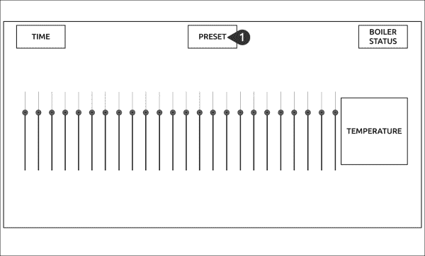
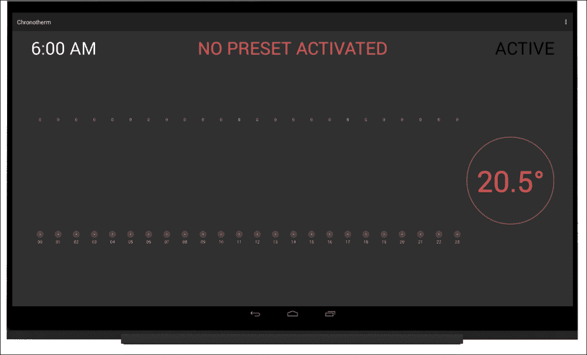

# 第七章：使用 Android API 进行人机交互

20 世纪 80 年代个人电脑的出现开启了一个新的挑战：让电脑和计算对业余爱好者、学生以及更广泛的技术爱好者有用和可用。这些人需要一个简单的方法来控制他们的机器，因此人机交互迅速成为一个开放的研究领域，旨在提高可用性，并导致了图形用户界面和新型输入设备的发展。在过去的十年中，诸如语音识别、语音合成、动作追踪等其他的交互模式在商业应用中被使用，这一巨大改进间接导致了电话、平板和眼镜等物体向新型智能设备的演变。

本章的目标是利用这些新的交互模式，使用 Android API 的一个子集来增强 Chronotherm 原型，增加一组新功能，使其变得更加智能。

在本章中，我们将涵盖以下主题：

+   利用 Android API 扩展原型

+   使用语音识别来控制我们的原型

+   通过语音合成向用户提供反馈

# 利用 Android API 扩展原型

Chronotherm 应用程序旨在当检测到的温度超过用户的温度设定点时启动锅炉。在之前的原型中，我们创建了一个设置页面，用户可以设置他们每天每个小时的偏好。我们可以扩展原型的行为，让用户能够存储不止一个设定点配置。这样，我们可以提供预设管理，用户可以根据不同的因素，如星期几或当前季节来激活。

在添加此功能时，我们必须牢记这并不是一个桌面应用程序，因此我们应避免创建一组新的令人眼花缭乱的界面。Chronotherm 应用程序可以部署在用户的家中，由于这些地方通常很安静，我们可以考虑使用**语音识别**来获取用户的输入。这种方法将消除创建或编辑存储预设的其他活动的需要。同时，我们必须考虑到在语音识别过程结束时我们需要提供反馈，以便用户知道他们的命令是否被接受。即使我们可以使用小弹窗或通知来解决此问题，但使用**语音合成**来向用户提供反馈可以带来更好的用户体验。

### 注意

语音识别和合成是可以用来为我们的应用程序提供新型交互的功能。然而，我们必须牢记，这些组件可能会为视障、身体障碍或听障人士带来严重的可访问性问题。每次我们想要创建一个好的项目时，都必须努力工作，以制作出既美观又可供每个人使用的应用程序。安卓通过**可访问性框架**为我们提供了很大帮助，因此，在未来的项目中，请记得遵循[`developer.android.com/guide/topics/ui/accessibility/index.html`](https://developer.android.com/guide/topics/ui/accessibility/index.html)上提供的所有最佳实践。

安卓 SDK 提供了一系列 API，我们可以用它们与安装的文字转语音服务和语音输入法进行交互，但是 UDOOU 盘自带的**原生安卓**并没有直接提供这些功能。为了让我们的代码工作，我们需要安装一个用于语音识别的应用程序，以及另一个实现文字转语音功能的应用。

例如，市场上几乎任何安卓设备都预装了作为**谷歌移动服务**套件一部分的这类应用程序。有关此主题的更多详细信息，请点击链接[`www.udoo.org/guide-how-to-install-gapps-on-udoo-running-android/`](http://www.udoo.org/guide-how-to-install-gapps-on-udoo-running-android/)。

# 改进用户设置

在我们继续实现语音识别服务之前，需要改变物理应用程序中设置存储的方式。目前，我们正在使用 Chronotherm 应用程序的共享偏好设置，我们在其中存储每个`SeekBar`类选择的设定点。根据新要求，这不再适合我们的应用程序，因为我们需要为每个预设持久化不同的设定点。此外，我们需要持久化当前激活的预设，所有这些变化都迫使我们设计一个新的用户界面以及一个新的设置系统。

我们可以通过以下截图来看看需要做出哪些改变：



第一步是更新我们的用户界面。根据上述草图的建议，我们应该：

1.  在布局顶部添加一个新的`TextView`，显示当前预设的名称。在加载活动时以及用户激活新预设时，应更改名称。

为了实现上述布局，更新`res/layout/`目录下的`activity_overview.xml`文件，在包含`TextClock`和`boiler_status`视图的头部`LinearLayout`中进行以下更改：

1.  更改`TextClock`视图，用高亮代码替换`layout_width`属性，并添加`layout_weight`属性：

    ```kt
    android:layout_width="0dp"
    android:layout_weight="1"

    ```

1.  按照上一步的操作，更改`boiler_status` `TextView`的布局：

    ```kt
    android:layout_width="0dp"
    android:layout_weight="1"

    ```

1.  在前一个组件之间添加以下`TextView`以显示激活的预设：

    ```kt
    <TextView
      android:id="@+id/current_preset"
      android:text="NO PRESET ACTIVATED"
      android:gravity="center"
      android:textColor="@color/coral_red"
      android:textSize="@dimen/text_title"
      android:layout_width="0dp"
      android:layout_weight="2"
      android:layout_height="match_parent" />
    ```

1.  在 `Overview` 类的顶部，使用高亮代码添加 `current_preset` 视图的引用：

    ```kt
    private TextView mCurrentPreset;
    private TextView mTemperature;
    private TextView mStatus;
    ```

1.  在 `Overview` 的 `onCreate` 回调中，使用以下代码获取视图引用：

    ```kt
    setContentView(R.layout.activity_overview);
    mCurrentPreset = (TextView) findViewById(R.id.current_preset);

    ```

下面的截图是通过前面的布局获得的：



## 存储预设配置

如先前讨论的，我们应该改变 Chronotherm 应用程序中用户设置点的存储和检索方式。想法是将对应用程序共享首选项的访问隔离在一个新的 `Preset` 类中，该类公开以下方法：

+   一个 `set()` 方法，用于保存与预设名称对应的设置点配置。设置点值数组被序列化为逗号分隔的字符串，并使用预设名称作为键进行保存。

+   一个 `get()` 方法，用于返回给定预设名称的存储设置点。设置点字符串被反序列化并作为值数组返回。

+   一个 `getCurrent()` 方法，用于返回最新激活预设的名称。

+   一个 `setCurrent()` 方法，用于将给定的预设名称提升为最新激活的预设。

要创建 `Preset` 类，请按照以下步骤操作：

1.  在 `chronotherm` 包中创建 `Preset` 类。

1.  在 `Preset` 类的顶部添加以下声明：

    ```kt
    private static final String SHARED_PREF = "__CHRONOTHERM__";
    private static final String CURRENT_PRESET = "__CURRENT__";
    private static final String NO_PRESET = "NO PRESET ACTIVATED";
    ```

    我们将前一章中使用的偏好设置名称放在一个名为 `SHARED_PREF` 的变量中。`CURRENT_PRESET` 键用于获取或设置当前使用的预设。`NO_PRESET` 赋值定义了在没有找到预设时返回的默认值。这处理了首次运行应用程序的情况，在没有找到预设时显示 **NO PRESET ACTIVATED** 屏幕。

1.  在 `Preset` 类的底部添加 `set()` 方法：

    ```kt
    public static void set(Context ctx, String name, ArrayList<Integer> values) {
      SharedPreferences sharedPref = ctx.getSharedPreferences(SHARED_PREF, Context.MODE_PRIVATE);
      SharedPreferences.Editor editor = sharedPref.edit();
      String serializedValues = TextUtils.join(",", values);
      editor.putString(name, serializedValues);
      editor.apply();
    }
    ```

    前面的方法期望 `values` 数组，该数组表示给定预设 `name` 变量的用户设置点。我们使用 `TextUtils` 类将值数组序列化为逗号分隔的字符串，同时使用预设 `name` 变量作为键。

1.  在 `Preset` 类的底部添加 `get()` 方法：

    ```kt
    public static ArrayList<Integer> get(Context ctx, String name) {
      ArrayList<Integer> values = new ArrayList<Integer>();
      SharedPreferences sharedPref = ctx.getSharedPreferences(SHARED_PREF, Context.MODE_PRIVATE);
  String serializedValues = sharedPref.getString(name, null);
      if (serializedValues != null) {
        for (String progress : serializedValues.split(",")) {
          values.add(Integer.valueOf(progress));
        }
      }
      return values;
    }
    ```

    我们用预设的 `name` 变量获取到的设置点填充 `values` 数组。我们知道这些值是以逗号分隔的序列化字符串，因此我们将其拆分并解析，将每个值添加到前面的数组中。如果我们没有找到与给定预设 `name` 变量相匹配的内容，我们将返回一个空数组。

1.  在类的底部添加 `getCurrent()` 方法，以返回当前激活的预设：

    ```kt
    public static String getCurrent(Context ctx) {
      String currentPreset;
      SharedPreferences sharedPref = ctx.getSharedPreferences(SHARED_PREF, Context.MODE_PRIVATE);
      currentPreset = sharedPref.getString(CURRENT_PRESET, NO_PRESET);
      return currentPreset;
    }
    ```

1.  在类的底部添加 `setCurrent()` 方法，以存储当前激活的预设：

    ```kt
    public static void setCurrent(Context ctx, String name) {
      SharedPreferences sharedPref = ctx.getSharedPreferences(SHARED_PREF, Context.MODE_PRIVATE);
      SharedPreferences.Editor editor = sharedPref.edit();
      editor.putString(CURRENT_PRESET, name);
      editor.apply();
    }
    ```

既然我们已经有了用户预设的正式表示，我们应该调整这两个活动以反映最新的变化。

## 在活动间使用预设

我们从`概览`活动开始，该活动应在活动恢复阶段加载当前预设。如果激活了预设，我们应该将`current_preset` `TextView`更改为预设名称。为实现此步骤，我们应该用以下代码替换`readPreferences`方法：

```kt
private void readPreferences() {
  String activatedPreset = Preset.getCurrent(this);
  mCurrentValues = Preset.get(this, activatedPreset);
  for (int i = 0; i < mCurrentValues.size(); i++) {
    mBars[i].setProgress(mCurrentValues.get(i));
  }
  mCurrentPreset.setText(activatedPreset.toUpperCase());
}
```

下一步是使`设置`活动适应以下步骤总结的新行为：

1.  当用户打开`设置`活动时，语音识别系统应该请求预设名称。

1.  如果找到给定的预设，我们应该加载预设的设定点，并更新所有温度条。当用户保存新偏好时，旧的设定点将被更新。

1.  如果未找到给定的预设，则无需更新温度条。当用户保存新偏好时，将使用给定的设定点存储新的预设条目。

我们仍然没有实现第一步所需的所有组件，因为我们缺少语音识别实现。与此同时，我们可以通过以下步骤更新此活动中的预设存储和检索方式：

1.  在类的顶部，添加突出显示的变量，该变量将存储识别的预设名称：

    ```kt
    private TemperatureBar[] mBars;
    private String mEditingPreset;

    ```

1.  在`设置`活动的`onCreate()`回调中，移除`readPreferences()`方法的调用。

1.  更新`readPreferences()`成员函数，使其加载给定预设名称（如果可用）的值，并返回表示是否找到此预设的值。我们可以通过以下代码实现此行为：

    ```kt
    private boolean readPreferences(String presetName) {
      boolean found;
      ArrayList<Integer> values;
      values = Preset.get(this, presetName);
      found = values.size() > 0;
      for (int i = 0; i < values.size(); i ++) {
        mBars[i].setProgress(values.get(i));
      }
      return found;
    }
    ```

1.  更新`savePreferences()`方法，使其使用`Preset`类来存储或更新给定的设定点：

    ```kt
    public void savePreferences(View v) {
      ArrayList<Integer> values = new ArrayList<Integer>();
      for (int i = 0; i < mBars.length; i++) {
        values.add(mBars[i].getProgress());
      }
      Preset.set(this, mEditingPreset, values);
      this.finish();
    }
    ```

通过这些步骤，我们在两个活动中都改变了预设管理。我们仍然需要完成`设置`活动，因为我们缺少识别阶段。我们将在实现语音识别后，稍后完成这些步骤。

在将 Chronotherm 应用程序适应新的预设管理的最后一步，是更改`SensorThread`参数中的温度检查。实际上，`isBelowSetpoint`方法应该检索与最后温度读数匹配的激活预设的此设定点的值。如果选择了任何预设，它应该默认关闭锅炉。我们可以通过用突出显示的代码更改`isBelowSetpoint`方法来实现此行为：

```kt
private boolean isBelowSetpoint(float temperature) {
  int currentHour = Calendar.getInstance().get(Calendar.HOUR_OF_DAY);
  String currentPreset = Preset.getCurrent(mContext);
  ArrayList<Integer> currentValues = Preset.get(mContext,   currentPreset);
  if (currentValues.size() > 0) {
    return temperature < currentValues.get(currentHour);
  }
  else {
    return false;
  }
}
```

这结束了`预设`配置过程，现在我们可以继续实现语音识别。

# 实现语音识别

既然我们的原型可以处理不同的预设，我们应该提供一种快速的方法，通过语音识别来更改、创建或编辑用户预设。管理语音识别的最简单方法之一是使用 Android 的`Intent`消息对象，将此操作委托给另一个应用程序组件。正如我们在本章开头所讨论的，如果我们安装并配置了一个符合要求的语音输入应用程序，Android 可以使用它进行语音识别。

主要目标是提供一个抽象类，供我们的活动扩展以管理识别回调，同时避免代码重复。整体设计如下：

+   我们应该为需要语音识别的活动提供一个通用接口。

+   我们应该提供一个`startRecognition()`方法，通过`Intent`对象启动识别活动。

+   我们应该实现`onActivityResult()`回调，当启动的活动完成语音识别时将调用此回调。在这个回调中，我们使用在语音识别过程中产生的所有结果中最好的一个。

    ### 注意

    作业委托是 Android 操作系统最有用的功能之一。如果你需要更多信息了解它的工作原理，请查看 Android 官方文档 [`developer.android.com/guide/components/intents-filters.html`](http://developer.android.com/guide/components/intents-filters.html)。

以下步骤可以实现重用语音识别能力的先前抽象：

1.  在`chronotherm`包中添加`IRecognitionListener`接口，定义`onRecognitionDone()`回调，用于将结果发送回调用活动。我们可以通过以下代码实现这一点：

    ```kt
    public interface IRecognitionListener {
      void onRecognitionDone(int requestCode, String bestMatch);
    }
    ```

1.  创建一个名为`voice`的新包，并添加一个名为`RecognizerActivity`的新抽象类。该类应定义如下：

    ```kt
    public abstract class RecognizerActivity extends ActionBarActivity implements IRecognitionListener {
    }
    ```

1.  添加一个公共方法来初始化识别阶段，并将获取结果的责任委托给以下代码：

    ```kt
    public void startRecognition(String what, int requestCode) {
      Intent intent = new Intent(RecognizerIntent.ACTION_RECOGNIZE_SPEECH);
      intent.putExtra(RecognizerIntent.EXTRA_LANGUAGE, "en-US");
      intent.putExtra(RecognizerIntent.EXTRA_PROMPT, what);
      startActivityForResult(intent, requestCode);
    }
    ```

    `requestCode`参数是识别`Intent`的标识符，由调用活动使用以正确识别结果以及如何处理它。`what`参数用于提供屏幕消息，如果外部应用程序支持的话。

1.  添加`onActivityResult()`回调以提取最佳结果，并通过通用接口将其传递给调用活动：

    ```kt
    @Override
    protected void onActivityResult(int requestCode, int resultCode, Intent data) {
      if (resultCode == RESULT_OK) {
        ArrayList<String> matches = data.getStringArrayListExtra(RecognizerIntent.EXTRA_RESULTS);
        this.onRecognitionDone(requestCode, matches.get(0));
      }
    }
    ```

## 使用语音识别添加或编辑预设

通过`RecognizerActivity`类，我们将繁重的工作委托给 Android 框架。根据活动的性质，我们应该以不同的方式处理结果。我们在活动创建阶段使用`Settings`活动开始使用语音输入，询问我们想要创建或编辑的预设名称。如果预设存在，我们应在保存过程中加载存储的设定点并更新它们。否则，我们应在偏好设置中创建新的记录。为了实现这种行为，请执行以下步骤：

1.  根据以下代码片段，从`Settings`类扩展`RecognizerActivity`：

    ```kt
    public class Settings extends RecognizerActivity {
      //...
    }
    ```

1.  声明我们将用于识别和处理识别结果的意图请求代码。在类的顶部，添加以下高亮代码：

    ```kt
    public class Settings extends RecognizerActivity {
      private static final int VOICE_SETTINGS = 1001;
      private TemperatureBar[] mBars;
      // ...
    }
    ```

1.  在`onCreate()`回调的底部，添加以下代码以尽快开始语音识别：

    ```kt
    mBars = TemperatureWidget.addTo(this, container, true);
    startRecognition("Choose the preset you want to edit", VOICE_SETTINGS);

    ```

1.  实现`onRecognitionDone()`回调，这是之前定义的`IRecognitionListener`接口所要求的，以处理识别意图返回的结果。在类的底部，添加以下代码：

    ```kt
    @Override
    public void onRecognitionDone(int requestCode, String bestMatch) {
      if (requestCode == VOICE_SETTINGS) {
        boolean result = readPreferences(bestMatch);
        mEditingPreset = bestMatch;
      }
    }
    ```

    如果识别与`VOICE_SETTINGS`意图代码相关，则将`bestMatch`参数传递给`readPreferences`参数，该参数加载并设置所有带有预设设定点的温度条。设置`mEditingPreset`变量，以便在保存过程中我们可以重用预设名称。

我们已经对`Settings`活动做了所有必要的更改，现在可以在`Overview`活动中使用语音识别来加载和设置激活的预设。

## 使用语音识别来更改激活的预设

既然用户可以存储不同的预设，我们就必须提供一种在`Overview`活动中更改激活的设定点的方法。之前，我们添加了一个显示当前预设名称的`TextView`类；为了保持界面简洁，我们可以使用这个组件来启动语音识别。用户可以通过当前流程更改激活的预设：

1.  当用户点击**TextView**选项时，系统应启动语音识别以获取预设名称。

1.  如果找到了预设，应该用用户选择的预设替换激活的预设，并更新`Overview`的温度条。

1.  如果找不到预设，则不应有任何反应。

要实现上述交互流程，请按照以下步骤进行：

1.  正如我们对`Settings`活动所做的那样，从`Overview`类扩展`RecognizerActivity`类，如下面的代码片段所示：

    ```kt
    public class Overview extends RecognizerActivity implements OnDataChangeListener {
      //...
    }
    ```

1.  声明我们将用来识别和处理识别结果的意图请求代码。在类的顶部，添加高亮代码：

    ```kt
    public class Overview extends RecognizerActivity implements OnDataChangeListener {
      public static final int VOICE_PRESET = 1000;
      private AdkManager mAdkManager;
      //...
    }
    ```

1.  在类的底部，添加一个方法来启动预设名称识别：

    ```kt
    public void changePreset(View v) {
      startRecognition("Choose the current preset", VOICE_PRESET);
    }
    ```

1.  实现`onRecognitionDone()`回调以处理识别意图返回的结果。在这个方法中，我们调用`setPreset()`成员函数来更新激活的预设并加载温度设定点，如果找到了给定的预设。在类的底部，添加以下代码：

    ```kt
    @Override
    public void onRecognitionDone(int requestCode, String bestMatch) {
      if (requestCode == VOICE_PRESET) {
        setPreset(bestMatch);
      }
    }
    ```

1.  实现`setPreset()`方法来处理最佳识别结果。在类的底部，添加以下代码：

    ```kt
    private void setPreset(String name) {
      ArrayList<Integer> values = Preset.get(this, name);
      if (values.size() > 0) {
        Preset.setCurrent(this, name);
        readPreferences();
      }
    }
    ```

1.  将启动语音识别的`changePreset()`方法与`TextView`组件连接起来。在`res/layout/`下的`activity_overview.xml`文件中，通过高亮代码使`current_preset`视图可点击：

    ```kt
    <TextView
      android:id="@+id/current_preset"
      android:clickable="true"
      android:onClick="changePreset"
      android:text="NO PRESET ACTIVATED"
      android:gravity="center"
      android:textColor="@color/coral_red"
      android:textSize="@dimen/text_title"
      android:layout_width="0dp"
      android:layout_weight="2"
      android:layout_height="match_parent" />
    ```

通过这一节，我们创建了一个抽象层来通过 Android 意图处理语音识别，并且更新了`Settings`和`Overview`活动以使用它。现在我们可以上传 Chronotherm 应用程序，并再次使用带有预设和语音识别功能的应用程序。

# 改进用户与语音合成的交互

即使 Chronotherm 应用程序工作正常，我们至少还有一件事要做：提供适当的反馈，让用户知道已采取的行动。实际上，这两个活动都没有提供关于识别输入的任何视觉反馈；因此，我们决定在初始设计中引入语音合成 API。

因为我们希望在不同的活动中共享合成过程，我们可以创建一个管理器，通过共同的初始化抽象合成 API。这个想法是提供一个类，它公开了一个方法，使用给定的字符串开始语音识别；我们按照以下步骤实现它：

1.  在`voice`包内创建`VoiceManager`类。

1.  使用以下代码初始化类：

    ```kt
    public class VoiceManager implements TextToSpeech.OnInitListener {
      private TextToSpeech mTts;
      //...
    }
    ```

    这个类实现了`OnInitListener`接口，该接口定义了在初始化`TextToSpeech`引擎后应调用的回调。我们存储当前的`TextToSpeech`实例，我们将在以下代码段中使用它作为一个变量。

1.  重写`onInit()`方法，使其在`TextToSpeech`实例服务初始化成功时设置美国地区：

    ```kt
    @Override
    public void onInit(int status) {
      if (status == TextToSpeech.SUCCESS) {
        mTts.setLanguage(Locale.US); 
      }
    }
    ```

1.  添加类构造函数，在其中使用给定的活动`Context`初始化文本转语音服务。在类内部，编写以下代码：

    ```kt
    public VoiceManager(Context ctx) {
      mTts = new TextToSpeech(ctx, this);
    }
    ```

1.  实现一个`speak()`方法，通过在类底部添加以下代码，将给定文本代理给`TextToSpeech`实例：

    ```kt
    public void speak(String textToSay) {
      mTts.speak(textToSay, TextToSpeech.QUEUE_ADD, null);
    }
    ```

    `TextToSpeech.speak`方法采用队列策略使其异步化。调用该方法时，合成请求会被添加到队列中，并在服务初始化后进行处理。队列模式可以作为 speak 方法的第二个参数进行定义。我们可以在以下链接找到关于文本转语音服务的更多信息：

    [`developer.android.com/reference/android/speech/tts/TextToSpeech.html`](http://developer.android.com/reference/android/speech/tts/TextToSpeech.html)

## 向用户提供反馈

我们现在应该调整我们的活动以使用前面类中实现的简单抽象。我们从`Overview`活动开始，初始化`VoiceManager`实例，并在`setPreset()`方法中使用它，以提供是否找到识别的预设的正确反馈。要在`Overview`活动中使用合成 API，请执行以下步骤：

1.  在类顶部，在变量声明之间添加高亮显示的代码：

    ```kt
    private DataReader mReader;
    private VoiceManager mVoice;

    ```

1.  在`onCreate()`回调的底部，按以下代码片段所示初始化`VoiceManager`实例：

    ```kt
    mReader = new DataReader(mAdkManager, this, this);
    mVoice = new VoiceManager(this);

    ```

1.  使用高亮显示的代码更新`setPreset()`方法，使其在预设激活期间调用合成 API 以提供反馈：

    ```kt
    private void setPreset(String name) {
      ArrayList<Integer> values = Preset.get(this, name);
      String textToSay;
      if (values.size() > 0) {
        Preset.setCurrent(this, name);
        readPreferences();
        textToSay = "Activated preset " + name;
      }
      else {
        textToSay = "Preset " + name + " not found!";
      }
      mVoice.speak(textToSay);
    }
    ```

原型几乎完成，我们只需要对`Settings`活动重复前面的步骤。在这个活动中，我们应该初始化`VoiceManager`参数，并在`onRecognitionDone()`回调中使用合成 API。在那里，我们应该告知用户识别的预设是什么，以及根据检索到的设定点，它是将被创建还是编辑。要在`Settings`活动中使用合成 API，请执行以下步骤：

1.  在类的顶部，按照高亮代码声明`VoiceManager`变量：

    ```kt
    private String mEditingPreset;
    private VoiceManager mVoice;

    ```

1.  在`onCreate()`回调的底部，初始化`VoiceManager`实例：

    ```kt
    mVoice = new VoiceManager(this);
    startRecognition("Choose the preset you want to edit", VOICE_SETTINGS);
    ```

1.  更新`onRecognitionDone()`回调，使其调用合成 API 以提供适当的反馈：

    ```kt
    @Override
    public void onRecognitionDone(int requestCode, String bestMatch) {
      if (requestCode == VOICE_SETTINGS) {
        String textToSay;
        boolean result = readPreferences(bestMatch);
        if (result) {
          textToSay = "Editing preset " + bestMatch;
        }
     else {
          textToSay = "Creating preset " + bestMatch;
        }
        mEditingPreset = bestMatch;
        mVoice.speak(textToSay);
      }
    }
    ```

我们已经完成了对原型的增强，加入了语音识别和合成功能。最后缺失的任务是再次上传应用程序，并检查一切是否如预期般工作。然后我们可以将 Chronotherm 应用程序在`app/build.gradle`文件中更新为`0.2.0`版本。

# 总结

在本章中，我们通过少量工作成功引入了许多功能。我们学会了如何利用语音识别和合成，制作一个精简且快速的用户界面。

我们开始了一段旅程，创造了一种新的存储用户预设的方法，这需要对活动和`SensorThread`温度检查进行重构。我们继续进行语音识别的第一个实现，并且为了简化我们的工作，我们创建了一个从`Settings`和`Overview`活动扩展的通用活动类。这使得我们能够抽象出一些常见行为，便于在不同的代码部分调用识别意图。

作为最后一步，我们准备了语音合成管理器，以便轻松使用 Android 的文本到语音引擎。实际上，我们使用这个组件在识别过程后，当用户更改设置和当前激活的预设时提供反馈。

在下一章中，我们将为 Chronotherm 应用程序添加网络功能，以便它能够检索天气预报数据；使用这些信息，我们将制作一个稍微更好的算法来决定是否打开或关闭我们的锅炉。
