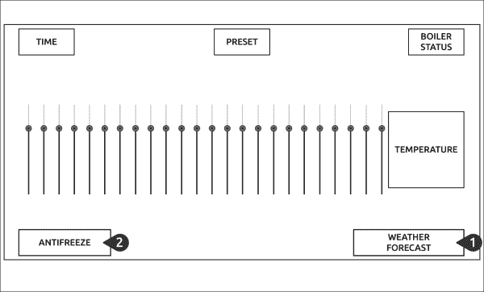
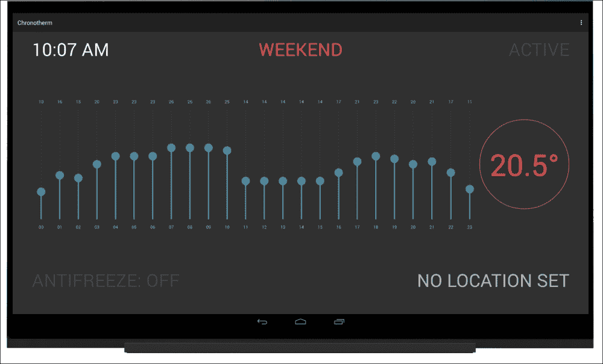
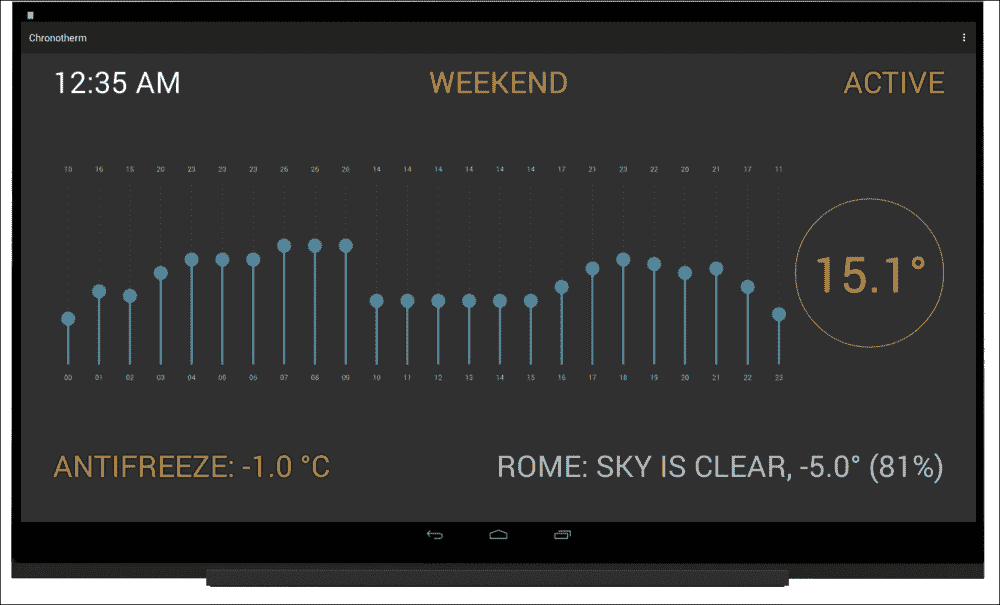

# 第八章：添加网络功能

在第六章，*为家庭自动化构建 Chronotherm*中，我们探讨了家庭自动化的定义，并且一步一步地构建了一个可以根据用户偏好程序化控制锅炉的原型。我们扩展了这个原型，提供了一个预设配置以存储不同的温度计划，并通过语音识别和合成改善了用户交互。

这一次，我们通过添加另一个利用网络功能从互联网收集数据的功能来增强 Chronotherm 应用程序。本章的目标是使我们的原型能够对无法通过连接的传感器轻松捕获的外部事件做出反应。

在本章中，我们将涵盖以下主题：

+   使用网络功能扩展 Chronotherm 应用程序

+   使用网络服务收集天气预报数据

+   使用收集的数据改变 Chronotherm 的行为

# 为 Chronotherm 扩展网络功能

Chronotherm 应用程序解决了一个具体问题。它每天在当前温度低于每个小时的配置设定点时开启锅炉。这个逻辑对于传统 Chronotherm 来说已经足够，但我们可以改进这种行为，使其考虑家庭温度与天气条件之间的密切关系。例如，在寒冷的日子里，内部温度通常下降得更快；如果我们在锅炉逻辑中包含这些信息，我们可以使我们的原型更加智能。

此外，如果天气真的很冷，我们的锅炉可能会因为内部的水结冰而停止工作。如果实现一个防冻功能，当外部温度降至一个定义值以下时，即使违背用户偏好，也会启动锅炉，这个问题就可以得到解决。这样的功能将处理用户不在家或夜间时的意外情况。

不幸的是，连接外部传感器并不容易，而且构建和使用无线热传感器可能过于复杂。然而，考虑到外部温度的重要性，我们必须找到一种方法来收集天气条件数据。由于 UDOOU Chronotherm 位于我们的家中，且很可能连接到互联网，我们可以从提供预报数据的网络服务中获取这些信息，在我们的计算中使用这些知识。这样，我们甚至可以添加完整的天气条件概览，在提供用户有用信息的同时改善用户界面。

根据之前提到的需求，我们可以按以下步骤组织我们的工作：

1.  实现一个模块，用于将我们的原型连接到天气预报的 REST API。

1.  定期收集并显示天气预报数据。

1.  编写将使用先前数据的锅炉防冻逻辑。

## 连接到 REST API

我们的工作从提供一个实现开始，以连接到 RESTful 网络服务。**REpresentational State Transfer** (**REST**) 是一种通常运行在 HTTP 协议之上的简单无状态架构风格。REST 背后的理念涉及将系统的状态作为我们可以操作的资源集合暴露出来，通过它们的名称或 ID 来定位它们。后端服务负责通过通常使用数据库服务器来持久化资源数据。

当客户端通过 HTTP 协议请求资源时，应用服务器从数据库服务器检索资源并发送回客户端，使用如 XML 或 JSON 的交换格式。暴露 REST API 可以极其容易地向移动客户端、浏览器扩展或任何需要访问和处理应用程序数据的软件提供数据。

在本章中，我们将仅使用 REST API 进行信息检索。如果您对 REST 架构有更多兴趣，请点击此链接 [`en.wikipedia.org/wiki/Representational_state_transfer`](http://en.wikipedia.org/wiki/Representational_state_transfer)。

在开始实现 API 连接器之前，我们应在 `AndroidManifest.xml` 文件中的 `<application>` 标签之前添加以下权限（以便在我们的应用程序中使用互联网）：

```kt
<uses-permission android:name="android.permission.INTERNET" />
```

然后，为了使我们的应用程序具备网络功能，我们必须创建一个对 `HttpURLConnection` 类的抽象，以便我们可以通过更简单的 API 使用外部服务。要为我们的应用程序创建一个连接器，请执行以下步骤：

1.  在名为 `http` 的新包中创建 `UrlConnector` 类。

1.  在类的顶部，添加以下声明以存储 `HttpURLConnection` 类实例：

    ```kt
    private HttpURLConnection mConnector;
    ```

1.  添加以下构造函数，我们将使用它来初始化请求参数：

    ```kt
    public UrlConnector(String encodedUrl) throws IOException {
      URL url = new URL(encodedUrl);
      mConnector = (HttpURLConnection) url.openConnection();
      mConnector.setReadTimeout(10000);
      mConnector.setConnectTimeout(15000);
    }
    ```

    我们期望一个 `encodedUrl` 参数作为参数，并使用它来初始化稍后用于打开连接的 URL 对象。然后，我们为读取和连接阶段设置超时，使用适合我们原型的值。

1.  添加一个泛型方法来设置我们请求的 HTTP 头：

    ```kt
    public void addHeader(String header, String content) {
      mConnector.setRequestProperty(header, content);
    }
    ```

1.  在 `get()` 方法下面添加以下代码片段，用于进行调用：

    ```kt
    public int get() throws IOException {
      mConnector.setRequestMethod("GET");
      return mConnector.getResponseCode();
    }
    ```

    对于 `mConnector` 实例，我们设置 `GET` 请求方法，返回响应的状态码。此状态码将用于检查请求是否成功或失败结束。

1.  添加以下 `getResponse()` 方法以从网络服务器连接获取结果：

    ```kt
    public String getResponse() throws IOException {
      BufferedReader readerBuffer = new BufferedReader(new InputStreamReader(mConnector.getInputStream()));
      StringBuilder response = new StringBuilder();
      String line;
      while ((line = readerBuffer.readLine()) != null) {
        response.append(line);
      }
      return response.toString();
    }
    ```

    我们使用 `mConnector` 实例的输入流创建一个缓冲阅读器，然后通过上述阅读器获取服务器发送的内容。当我们完成后，我们不进行任何修改直接返回字符串。

1.  创建一个 `disconnect()` 方法以关闭与服务器连接：

    ```kt
    public void disconnect() {
      mConnector.disconnect();
    }
    ```

`UrlConnector` 类简化了 HTTP 调用，这种实现足以连接到许多不使用任何认证流程的 Web 服务。在我们继续之前，我们必须选择一个提供天气预报数据的 Web 服务，我们将对其进行查询。为了我们原型的目的，我们将使用 OpenWeatherMap 服务，因为它提供了一个无需认证流程的免费层级，并且它也通过 REST API 提供。你可以在 [`openweathermap.org/`](http://openweathermap.org/) 或 [`openweathermap.org/current`](http://openweathermap.org/current) 了解更多关于该服务的信息，以及学习它们的 REST API 是如何构建的：

当我们调用上述 RESTful 服务时，我们应该解析 JSON 响应，使其在我们的应用程序中可用。这种方法可以通过一个知道响应结构并按照我们的需求进行解析的 Java 类来实现。实现需要以下步骤：

1.  在名为 `weather` 的新包中创建 `Weather` 类。

1.  在类的顶部，添加以下声明：

    ```kt
    private String mStatus;
    private double mTemperature;
    private int mHumidity;
    ```

    我们根据需要从给定的响应中声明变量。在我们的例子中，我们使用 `mStatus` 变量来存储天气状况，以便用户知道天气是晴朗还是多云。我们还使用 `mTemperature` 变量，这是我们第一个需求，以及 `mHumidity` 属性为用户提供额外信息。

1.  添加如下类构造函数：

    ```kt
    public Weather(JSONObject apiResults) throws JSONException, NullPointerException {
      mStatus = apiResults.getJSONArray("weather").getJSONObject(0).getString("description");
      mTemperature = convertTempKtoC(apiResults.getJSONObject("main").getDouble("temp"));
      mHumidity = apiResults.getJSONObject("main").getInt("humidity");
    }
    ```

    我们期望作为参数的 `JSONObject` 参数，是成功调用后的 API 结果。从这个对象中，我们获取 `weather` 字段的第一元素，并在 `JSONObject` 对象中获取 `description` 键的值。然后我们从 `main` 字段获取 `temperature` 变量的值；这应该传递给 `convertTempKtoC()` 函数，因为服务返回的值是以开尔文为单位的。最后一步是从同一个字段获取 `humidity` 参数。这段代码在 JSON 解析期间可能会引发一些异常，因此，如果构造函数抛出列表，我们会添加这些异常。

1.  添加 `convertTempKtoC()` 成员函数，该函数在构造函数中使用，用于将开尔文转换为摄氏度：

    ```kt
    private double convertTempKtoC(double temperature) {
      return temperature - 273.15;
    }
    ```

    ### 注意

    这只是一个示例；你可以使用你喜欢的任何温度单位。

1.  向 `Weather` 类添加以下获取器，以获取实例数据：

    ```kt
    public String getStatus() {
      return mStatus;
    }

    public double getTemperature() {
      return mTemperature;
    }

    public int getHumidity() {
      return mHumidity;
    }
    ```

既然我们已经有一个抽象的 HTTP 调用和 JSON 结果解析器，我们需要实现最后一个调用 REST API 并返回 `Weather` 实例的构建块。我们可以通过以下步骤实现这个实现：

1.  在 `weather` 包内创建 `WeatherApi` 类。

1.  在类的顶部，声明以下变量：

    ```kt
    private static final String BASE_URL = "http://api.openweathermap.org/data/2.5/weather";
    private static final String API_PARAM = "?q=%s&lang=%s";
    ```

    `BASE_URL`属性定义了我们调用以获取天气数据的端点。`API_PARAM`属性定义了使用的查询字符串，其中`q`参数是我们想要查询的位置，而`lang`参数要求服务器为给定的地区翻译结果。

1.  定义一个`static`方法以生成有效的请求 URL：

    ```kt
    private static String getUrl(String location) {
      String params = String.format(API_PARAM, location, Locale.US);
      return BASE_URL + params;
    }
    ```

    此方法期望一个`location`参数，与有效的位置一起生成`params`字符串。这样，它设置`q`和`lang`参数，然后返回与适当连接的`BASE_URL`属性。

1.  添加静态方法以进行 API 调用并返回`Weather`类的一个实例：

    ```kt
    public static Weather getForecast(String location) {
      JSONObject results = null;
      Weather weather = null;
      UrlConnector api;
      try {
        api = new UrlConnector(getUrl(location));
        api.addHeader("Content-Type", "application/json");
        // Do GET and grab tweets into a JSONArray
        int statusCode = api.get();
        if (statusCode == HttpURLConnection.HTTP_OK) {
          results = new JSONObject(api.getResponse());
          weather = new Weather(results);
        }
        else {
          // manage 30x, 40x, and 50x status codes
        }
        api.disconnect();
      }
      catch (IOException e) {
        // manage network errors
      }
      catch (JSONException e) {
        // manage response parsing errors
      }
      return weather;
    }
    ```

    此方法期望传入`location`参数，该参数被传递到我们之前看到的`getUrl()`方法，以生成应该查询的端点。通过`addHeader()`方法，我们将请求媒体类型定义为`application/json`参数，服务器使用它来推断我们请求的格式。我们使用正确配置了端点的`api`实例进行 HTTP 调用，检查状态码以确认成功。调用后，我们关闭连接，如果引发异常，则返回初始化的`Weather`实例或`null`引用。

    ### 提示

    在本节中，我们将处理不同的状态码，`IOException`异常和`JSONException`异常，这些异常分别在 API 调用未成功完成、发生网络错误或 API 调用响应解析错误时引发。每次在您的原型中处理异常时，请记住*错误绝不应该默默传递*。我们应该始终处理这些错误，并通过适当的反馈通知用户问题。

## 扩展 Android 用户界面

既然我们可以通过`WeatherApi`类收集天气预报数据，我们应该开始考虑用户交互。首先，我们应该询问用户的家庭位置，使用当前选定的位置和相关天气条件更新 Chronotherm 用户界面。其次，我们应该提供一个组件来设置一个防冻设定点，根据用户的偏好，该设定点可以被启用或禁用。

为了实现这两种交互，我们可以使用一个可点击的`TextView`对象，根据用户输入启动语音识别，正如我们在第七章《*使用 Android API 进行人机交互*》中所做的那样。所有必需的组件在以下模拟中都有总结：



第一步是更新`Overview`参数布局。按照前面的建议，我们应该：

+   添加*天气预报* `TextView`：每当短时线程使用`WeatherApi`类加载`Weather`实例时，此组件会发生变化。在这种情况下，它会显示当前位置、天气状况、温度和湿度。当用户点击此组件时，我们应该启动语音识别意图来获取用户的位置。

+   添加*防冻* `TextView`：当启用防冻功能时，此组件以绿色显示当前的防冻设定点；另一方面，当用户禁用防冻检查时，它会变成灰色。当用户点击此组件时，我们应该启动语音识别意图来获取用户的防冻设定点；如果启用了防冻，应该从用户的偏好设置中移除设定点。

我们开始处理可以实现的布局，更新`res/layout/`下的`activity_overview.xml`文件和`Overview`类，如下面的步骤所示：

1.  更改包含`view_container`和`temperature`视图的`LinearLayout`，使用以下高亮代码：

    ```kt
    <LinearLayout
      android:orientation="horizontal"
      android:gravity="center"
      android:layout_width="match_parent"
      android:layout_height="0dp"
      android:layout_weight="1">
    ```

1.  在之前的`LinearLayout`下方，添加以下布局，其中将包含两个`TextViews`：

    ```kt
    <LinearLayout
      android:orientation="horizontal"
      android:layout_width="match_parent"
      android:layout_height="0dp"
      android:layout_weight="0.2">
    </LinearLayout>
    ```

1.  在之前的容器中，使用以下代码添加*防冻*和*天气预报* `TextViews`：

    ```kt
    <TextView
      android:id="@+id/weather_antifreeze"
      android:clickable="true"
      android:onClick="changeAntifreeze"
      android:text="ANTIFREEZE: OFF"
      android:textColor="@color/mine_shaft"
      android:textSize="@dimen/text_title"
      android:layout_width="wrap_content"
      android:layout_height="match_parent"/>

    <TextView
      android:id="@+id/weather_status"
      android:clickable="true"
      android:onClick="changeLocation"
      android:text="NO LOCATION SET"
      android:textSize="@dimen/text_title"
      android:gravity="end"
      android:layout_height="match_parent"
      android:layout_width="0dp"
      android:layout_weight="1"/>
    ```

    在这两个组件中，我们定义了调用`changeAntifreeze`和`changeLocation`方法的`onClick`属性。这些成员函数实现了之前描述的交互，我们将在下一节继续实现它们。

1.  现在，我们应该继续处理`Overview`活动，实现更新两个`TextViews`的缺失代码。首先，在`Overview`类的顶部声明它们的引用：

    ```kt
    private TextView mCurrentPreset;
    private TextView mTemperature;
    private TextView mStatus;
    private TextView mWeatherStatus;
    private TextView mAntifreeze;

    ```

1.  在`onCreate()`活动方法中，用高亮代码获取这两个引用：

    ```kt
    setContentView(R.layout.activity_overview);
    mCurrentPreset = (TextView) findViewById(R.id.current_preset);
    mTemperature = (TextView) findViewById(R.id.temperature);
    mStatus = (TextView) findViewById(R.id.boiler_status);
    mWeatherStatus = (TextView) findViewById(R.id.weather_status);
    mAntifreeze = (TextView) findViewById(R.id.weather_antifreeze);

    ```

1.  因为短时线程应该更新`mWeatherStatus` `TextView`参数，我们必须在`OnDataChangeListener`参数接口中提供一个回调，该接口期待一个`Weather`实例。在`OnDataChangeListener`参数接口中添加高亮的方法：

    ```kt
    public interface OnDataChangeListener {
      void onTemperatureChanged(float temperature);
      void onBoilerChanged(boolean status);
      void onWeatherChanged(Weather weather);
    }
    ```

1.  作为最后一步，在`Overview`类的底部添加以下代码，实现`onWeatherChanged()`接口：

    ```kt
    @Override
    public void onWeatherChanged(Weather weather) {
      if (weather != null && weather.getStatus() != null) {
        String status = "%s: %s, %.1f° (%d%%)";
        status = String.format(status,
          Preset.getLocation(this).toUpperCase(),
          weather.getStatus().toUpperCase(),
          weather.getTemperature(),
          weather.getHumidity()
        );
        mWeatherStatus.setText(status);
      }
    else {
        mWeatherStatus.setText("NO LOCATION SET");
      }
    }
    ```

    如我们之前所讨论的，如果我们有一个`weather`实例，我们会用格式化的字符串更新`mWeatherStatus`属性，显示当前位置、天气状况、温度和湿度。

通过前面的更改，我们可以上传我们的 Chronotherm 应用程序。它的展示效果如下截图所示：



# 收集天气预报数据。

现在我们的应用程序用户界面已完成，我们可以继续实现存储用户位置并从 RESTful 网络服务获取天气数据的逻辑。此实现可以按照以下步骤组织：

1.  更新`Preset`类以存储用户的位置。

1.  当用户点击`weather_status` `TextView`参数时，处理语音识别结果。

1.  添加一个新的计划线程，获取天气数据并使用`onWeatherChanged()`回调更新用户界面。

我们开始更新`Preset`类，并按照以下步骤实现它：

1.  在类的顶部，添加高亮声明，用作存储和检索用户设置位置的键：

    ```kt
    private static final String CURRENT_PRESET = "__CURRENT__";
    private static final String CURRENT_LOCATION = "__LOCATION__";

    ```

1.  在类的底部，添加以下 setter 以存储给定的位置：

    ```kt
    public static void setLocation(Context ctx, String name) {
      SharedPreferences sharedPref = ctx.getSharedPreferences(SHARED_PREF, Context.MODE_PRIVATE);
      SharedPreferences.Editor editor = sharedPref.edit();
      editor.putString(CURRENT_LOCATION, name);
      editor.apply();
    }
    ```

1.  要检索存储的值，请添加以下 getter：

    ```kt
    public static String getLocation(Context ctx) {
      String location;
      SharedPreferences sharedPref = ctx.getSharedPreferences(SHARED_PREF, Context.MODE_PRIVATE);
      location = sharedPref.getString(CURRENT_LOCATION, null);
      return location;
    }
    ```

    通过`CURRENT_LOCATION`键，我们检索存储的位置，如果未设置，则返回`null`值。这样，我们涵盖了未设置位置时的首次运行，防止了任何无用的 API 调用。

现在我们可以继续更新应用程序的交互，通过语音识别来更改当前存储的位置。要完成这一步，请进行以下更改：

1.  在`Overview`类的顶部，添加高亮声明以定义新`Intent`结果的请求代码，该结果将请求用户的位置：

    ```kt
    public static final int VOICE_PRESET = 1000;
    public static final int VOICE_LOCATION = 1002;

    ```

1.  实现`weather_status`可点击视图使用的`changeLocation()`方法：

    ```kt
    public void changeLocation(View v) {
      startRecognition("Provide your location", VOICE_LOCATION);
    }
    ```

1.  实现一个成员函数，使用`Preset`类来设置当前位置，并为用户提供适当的反馈：

    ```kt
    private void setLocation(String location) {
      Preset.setLocation(this, location);
      mWeatherStatus.setText(location.toUpperCase() + ": WAITING DATA");
      mVoice.speak("Loading forecast data for " + location);
    }
    ```

    在应用程序的共享偏好设置中存储当前位置后，我们使用占位符消息更新`weather_status`视图，直到计划线程获取天气条件。

1.  在`onRecognitionDone()`回调中添加高亮代码，将`bestMatch`参数传递给上一个方法：

    ```kt
    if (requestCode == VOICE_PRESET) {
      setPreset(bestMatch);
    }
    else if (requestCode == VOICE_LOCATION) {
      setLocation(bestMatch);
    }

    ```

我们缺少的最后一个构建块是通过新的计划线程定期收集和显示天气预报数据。这最后一部分可以通过以下步骤更新`DataReader`类来实现：

1.  在类的顶部，添加高亮声明：

    ```kt
    private final static int TEMPERATURE_POLLING = 1000;
    private final static int WEATHER_POLLING = 5000;
    private final static int TEMPERATURE_UPDATED = 0;
    private final static int BOILER_UPDATED = 1;
    private final static int WEATHER_UPDATED = 2;
    private AdkManager mAdkManager;
    private Context mContext;
    private OnDataChangeListener mCaller;
    private ScheduledExecutorService mSchedulerSensor;
    private ScheduledExecutorService mSchedulerWeather;
    private Handler mMainLoop;
    private boolean mBoilerStatus = false;
    private Weather mWeather = null;

    ```

    ### 提示

    在前面的代码片段中，我们将天气线程轮询时间设置为 5 秒，但我们必须考虑到外部温度永远不会变化得这么快，因此创建太多对网络服务的查询是没有用的。我们仅为了测试目的选择了这个值；当原型准备好时，我们将需要设置更合理的时序。

1.  在类的底部，添加以下`Runnable`实现，用于收集天气数据并将`Weather`实例发布到主线程：

    ```kt
    private class WeatherThread implements Runnable {
      @Override
      public void run() {
        String location = Preset.getLocation(mContext);
        if (location != null) {
          mWeather = WeatherApi.getForecast(location);
          Message message = mMainLoop.obtainMessage(WEATHER_UPDATED, mWeather);
          message.sendToTarget();
        }
      }
    }
    ```

1.  在`start()`方法中添加新的调度器初始化，为天气数据获取生成短生命周期的线程，如高亮代码所示：

    ```kt
    public void start() {
      // Start thread that listens to ADK
      SensorThread sensor = new SensorThread();
      mSchedulerSensor = Executors.newSingleThreadScheduledExecutor();
      mSchedulerSensor.scheduleAtFixedRate(sensor, 0, TEMPERATURE_POLLING, TimeUnit.MILLISECONDS);
      // Start thread that updates weather forecast
      WeatherThread weather = new WeatherThread();
      mSchedulerWeather = Executors.  newSingleThreadScheduledExecutor();
      mSchedulerWeather.scheduleAtFixedRate(weather, 0,   WEATHER_POLLING, TimeUnit.MILLISECONDS);
    }
    ```

1.  停止之前的调度器，使用以下代码更改`stop()`方法：

    ```kt
    public void stop() {
      mSchedulerSensor.shutdown();
      mSchedulerWeather.shutdown();
    }
    ```

1.  更新主线程处理器，根据消息类型将`Weather`实例传递给适当的回调：

    ```kt
    case BOILER_UPDATED:
      mCaller.onBoilerChanged((boolean) message.obj);
      break;
    case WEATHER_UPDATED:
      mCaller.onWeatherChanged((Weather) message.obj);
      break;

    ```

现在我们有一个能够定期收集和显示天气数据的原型，我们可以将应用程序上传到 UDOOboard。当我们点击天气状态视图并通过语音识别输入我们的位置后，应用程序应该使用当前天气条件更新`Overview`界面。下一步是改进锅炉点火检查，添加防冻功能。

# 改进带有防冻检查的锅炉

既然天气预报已经可以获取并运行，我们可以继续实现防冻功能。为了实现之前讨论的交互和逻辑，我们应当：

1.  加强`Preset`类，存储用户的防冻设定点。在这个类中，我们应该提供两个实用工具来禁用防冻检查以及判断功能是否启用。

1.  在`Overview`活动中处理防冻功能，在选择设定点时更新用户界面。

1.  更新`SensorThread`类中的锅炉逻辑，以便在启用防冻检查时考虑在内。

我们通过以下步骤开始工作，更改`Preset`类：

1.  在类顶部，添加高亮声明：

    ```kt
    private static final String CURRENT_LOCATION = "__LOCATION__";
    private static final String CURRENT_ANTIFREEZE = "__ANTIFREEZE__";
    private static final float ANTIFREEZE_DISABLED = -Float.MAX_VALUE

    ```

    我们使用`ANTIFREEZE_DISABLED`属性作为一个不可能达到的默认温度。这样，我们可以匹配这个变量以判断防冻功能是否激活。

1.  在类底部添加以下 setter 来存储防冻设定点：

    ```kt
    public static void setAntifreeze(Context ctx, float temperature) {
      SharedPreferences sharedPref = ctx.getSharedPreferences(SHARED_PREF, Context.MODE_PRIVATE);
      SharedPreferences.Editor editor = sharedPref.edit();
      editor.putFloat(CURRENT_ANTIFREEZE, temperature);
      editor.apply();
    }
    ```

1.  与前一个方法保持一致，添加以下 getter 来检索防冻设定点：

    ```kt
    public static float getAntifreeze(Context ctx) {
      float temperature;
      SharedPreferences sharedPref = ctx.getSharedPreferences(SHARED_PREF, Context.MODE_PRIVATE);
      temperature = sharedPref.getFloat(CURRENT_ANTIFREEZE, ANTIFREEZE_DISABLED);
      return temperature;
    }
    ```

    采用这种方法，我们返回`CURRENT_ANTIFREEZE`键的值，如果未设置则返回`ANTIFREEZE_DISABLED`属性。

1.  添加以下方法来移除防冻设定点：

    ```kt
    public static void disableAntifreeze(Context ctx) {
      SharedPreferences sharedPref = ctx.getSharedPreferences(SHARED_PREF, Context.MODE_PRIVATE);
      SharedPreferences.Editor editor = sharedPref.edit();
      editor.remove(CURRENT_ANTIFREEZE);
      editor.apply();
    }
    ```

1.  添加以下实用程序，如果启用了防冻功能，则返回值：

    ```kt
    public static boolean antifreezeIsEnabled(Context ctx) {
      return getAntifreeze(ctx) != ANTIFREEZE_DISABLED;
    }
    ```

在下一步中，我们应在`Overview`活动中添加防冻功能，提供所有更新用户界面同时通过语音识别处理用户输入的方法。实现该功能需要以下步骤：

1.  在`Overview`类的顶部，添加`mFreeze`布尔值，指出当前是否激活了防冻检查：

    ```kt
    private TextView mWeatherStatus;
    private TextView mAntifreeze;
    private boolean mFreeze = false;

    ```

1.  在类底部，添加以下用于更新`Overview`布局的方法：

    ```kt
    public void updateAntifreeze() {
      float freezeTemperature = Preset.getAntifreeze(this);
      mFreeze = Preset.antifreezeIsEnabled(this);
      if (mFreeze) {
        String status = "ANTIFREEZE: %.1f °C";
        status = String.format(status, freezeTemperature);
        mAntifreeze.setText(status);
        mAntifreeze.setTextColor(getResources().getColor(R.color.pistachio));
      }
      else {
        mAntifreeze.setText("ANTIFREEZE: OFF");
        mAntifreeze.setTextColor(getResources().getColor(R.color.mine_shaft));
      }
    }
    ```

    作为第一步，我们从共享偏好设置中获取防冻温度，通过`antifreezeIsEnabled()`方法设置`mFreeze`布尔值。在这一点上，如果启用了防冻功能，我们会显示一个带有给定设定点的绿色信息；否则，我们会显示一个灰色信息，表明该功能已禁用。

1.  在`readPreferences()`成员函数的底部调用`updateAntifreeze()`方法，如高亮代码所示：

    ```kt
      // ...
      mCurrentPreset.setText(activatedPreset.toUpperCase());
      updateAntifreeze();
    }
    ```

既然我们已经有一个与存储的防冻设定点一起工作的布局，我们应该为用户提供语音识别和合成功能，以激活或关闭防冻检查。要实现这一实现，需要执行以下步骤：

1.  在`Overview`类的顶部，添加高亮的`Intent`请求码：

    ```kt
    public static final int VOICE_LOCATION = 1002;
    public static final int VOICE_ANTIFREEZE = 1003;

    ```

1.  添加`changeAntifreeze()`方法，以在用户点击`weather_antifreeze`视图时启用或禁用该功能：

    ```kt
    public void changeAntifreeze(View v) {
      if (mFreeze) {
        Preset.disableFreezeAlarm(this);
        updateAntifreeze();
        mVoice.speak("Antifreeze disabled");
      }
      else {
        startRecognition("Provide antifreeze degrees", VOICE_ANTIFREEZE);
      }
    }
    ```

1.  实现成员函数以启用并存储防冻设定点：

    ```kt
    private void enableAntifreeze(float temperature) {
      Preset.setAntifreeze(this, temperature);
      updateAntifreeze();
      mVoice.speak("Antifreeze set to " + temperature + " degrees");
    }
    ```

1.  将高亮代码添加到`onRecognitionDone()`回调中，将`bestMatch`属性传递给前面的方法：

    ```kt
    if (requestCode == VOICE_PRESET) {
      setPreset(bestMatch);
    }
    else if (requestCode == VOICE_LOCATION) {
      setLocation(bestMatch);
    }
    else if (requestCode == VOICE_ANTIFREEZE) {
      try {
        float temperature = Float.parseFloat(bestMatch);
        enableAntifreeze(temperature);
      }
      catch (NumberFormatException e) {
        mVoice.speak("Unrecognized number, " + bestMatch);
      }
    }

    ```

    如果识别意图与`VOICE_ANTIFREEZE`请求码相关，我们会尝试将`bestMatch`参数解析为浮点数，并将值传递给`enableAntifreeze()`方法。如果浮点解析失败，我们会通过语音合成提供适当的反馈。

Chronotherm 原型几乎完成；剩下的唯一任务是使用防冻功能改进锅炉逻辑。在`DataReader`类中，我们应在`isBelowSetpoint()`方法中添加以下高亮代码，使`SensorThread`类能够了解防冻设定点，如下所示：

```kt
private boolean isBelowSetpoint(float temperature) {
  int currentHour = Calendar.getInstance().get(Calendar.HOUR_OF_DAY);
  String currentPreset = Preset.getCurrent(mContext);
  ArrayList<Integer> currentValues = Preset.get(mContext, currentPreset);
  float antifreeze = Preset.getAntifreeze(mContext);
  if (mWeather != null && mWeather.getTemperature() < antifreeze) {
    return true;
  }
  if (currentValues.size() > 0) {
    return temperature < currentValues.get(currentHour);
  } else {
    return false;
  }
}
```

使用此代码，如果外部温度低于存储的防冻设定点，锅炉将不管用户的偏好而开启。如果此条件不发生，将继续默认行为。

原型已完成；通过天气预报数据，它保持了我们的房屋温暖，同时也消除了由于温度过低导致锅炉损坏的风险。我们可以上传应用程序，然后我们可以设置防冻温度。以下屏幕截图显示了预期的结果：



既然原型已经完成，我们可以在`app/build.gradle`文件中将 Chronotherm 应用程序更新为`0.3.0`版本。

# 概述

在本章中，我们了解到互联网对我们的设备有多么重要，这得益于它的大量数据和服务。我们发现，通过使用外部温度，我们的原型可以得到改进，而且在不改变电路的情况下，通过网络收集天气条件。

在第一部分，我们编写了一个通用连接器，这样我们可以不用做太多工作就能发出 HTTP 调用。然后我们使用这个组件实现了一个 RESTful 网络服务的部分抽象，能够获取给定位置的当前天气。我们在 Chronotherm 布局中添加了新元素以显示天气预报数据，并通过语音识别处理位置输入。

最后，我们决定将外部温度整合到我们的锅炉逻辑中。实际上，我们实现了防冻功能，当外部温度过低时，无论用户的偏好如何，都会开启锅炉。

这个原型是本书最后一次探讨 UDOO 板与 Android 操作系统提供的众多功能。然而，如果你对 Chronotherm 应用程序还有进一步的改进兴趣，你可以深入研究附加章节，*第九章*，*使用 MQTT 监控你的设备*，它介绍了*物联网*的主要概念和*MQTT 协议*，这些协议用于物理设备之间的数据交换。即使你的下一个项目使用的是另一个原型板或技术，我也希望你能找到有用的建议，并且享受我们一起完成的构建简单但互动的设备的工作。
