# 第一章：即时 Android 碎片化管理指南

欢迎阅读*即时 Android 碎片化管理指南*。

Android 开发者面临的最大挑战之一就是操作系统的碎片化。如果我们查看以下分布图，可以看到有三个主要版本的 Android OS——Froyo、Gingerbread 和 Ice Cream Sandwich (ICS)——每个版本都有自己的外观、行为和 API 库：

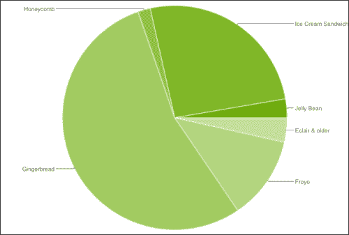

由于各个版本之间存在这些差异，编写能够在所有设备上无缝工作的应用程序可能会非常耗时耗力。本指南将为您提供一些现成的技术手段，以减轻压力，解决这些问题。

### 提示

**下载示例代码**

您可以从您的账户下载您购买的所有 Packt 图书的示例代码，访问地址为[`www.PacktPub.com`](http://www.PacktPub.com)。如果您在别处购买了这本书，可以访问[`www.PacktPub.com/support`](http://www.PacktPub.com/support)注册，我们会将文件直接通过电子邮件发送给您。

# 安装兼容性包（必须知道）

顾名思义，Support Library 支持在旧版本的 Android OS 上使用最新的 API。这使得许多最新功能，例如 Fragments，可以引入到早期的 OS 版本中。

更多信息可以在官方 Android 开发者网站的相应部分找到，地址为[`developer.android.com/tools/extras/support-library.html`](http://developer.android.com/tools/extras/support-library.html)。

## 准备就绪

在继续下一部分之前，您需要安装所有允许您编写、编译并将程序安装到您的 Android 设备或模拟器中的工具。

标准方式是安装 Android SDK，特别是为 Eclipse IDE 提供的 Android Developer Tool 插件。它提供了与 SDK 的集成和一整套帮助您开发的实用工具。

为了安装这个工具，请按照原始文档中的说明操作，您可以在[`developer.android.com/tools/help/adt.html`](http://developer.android.com/tools/help/adt.html)找到。

## 如何操作...

让我们安装这个库：

1.  从 Eclipse 启动 Android SDK 管理器，选择**窗口** | **Android SDK 管理器**，如下截图所示：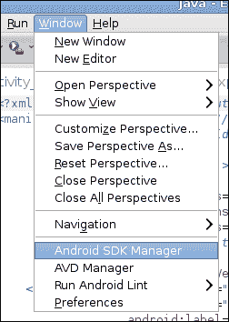

1.  您将看到一个所有可用软件包的列表（无论是否已安装）。向下滚动直到您到达**附加功能**部分，并选择**Android Support Library**；现在您可以点击右下角的**安装软件包**按钮，然后等待几分钟（具体时间取决于您的网络连接质量）：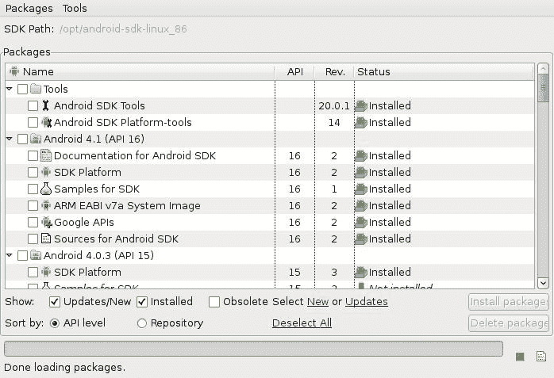

支持库文件将被下载到 Android SDK 文件夹中。要添加到项目的 JAR 文件位于`<AndroidSDK>\extras\android\support\v4\android-support-v4.jar`。

让我们从你的安卓项目中引用这个库：

1.  将支持库复制到项目根目录下的`libs`目录中（如果不存在，请创建它）。

1.  在 Eclipse 中打开你的项目，从**Package explorer**中选择与支持库对应的元素。右键点击并从菜单中选择**Build Path** | **Add to build path**。

1.  最后一步是检查设置是否正确。为此，向项目中添加以下导入，并验证 Eclipse 中是否有错误。

    ```kt
    import android.support.v4.app.FragmentActivity;
    ```

1.  构建项目：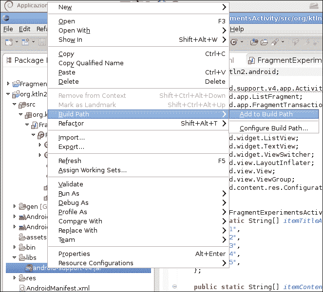

如果没有构建错误，那么一切正常。

## 它是如何工作的...

安卓应用程序首先是一个 Java 应用程序，和这类所有应用程序一样，它需要知道在代码中使用的类在哪里查找；这只需简单地将你选择的库添加到构建路径中即可。在 Java 中，通常通过`JAVAPATH`环境变量来指定库的路径，但由于 Eclipse 使用自己的系统，细节更为复杂，但概念是相同的。

## 还有更多...

现在我们来谈谈其他一些选项，或者可能是一些与这项任务相关的通用信息。

### API 级别

为了更好地理解兼容性包，了解一些安卓的历史是有帮助的。

安卓平台诞生于 2003 年，最初是由名为 Android Inc.的公司开发的，谷歌在 2005 年收购了这家公司。其直接竞争对手是苹果的 iOS 平台和 RIM 的黑莓系统。从技术上来说，其核心是一个使用 Linux 内核的操作系统，旨在安装在硬件差异很大的设备上（主要是移动设备，但现在也用于一般的嵌入式系统，例如采用修改版安卓 4.0 的游戏机 OUYA）。

和所有存在一段时间的软件一样，功能性发生了很多变化，也推出了许多版本，每个版本都对应一个甜点名称：

+   Apple Pie（API 级别 1）

+   Banana Bread（API 级别 2）

+   1.5 – Cupcake（API 级别 3）

+   1.6 – Donut（API 级别 4）

+   2.0-2.1x – Eclair（API 级别 5 至 7）

+   2.2 – Froyo（API 级别 8）

+   2.3 – Gingerbread（API 级别 9 和 10）

+   3.0-3.2 – Honeycomb（API 级别 11 至 13）

+   4.0 – Ice Cream Sandwich（API 级别 14 和 15）

+   4.1 – Jelly Bean（API 级别 16）

在许多其他软件项目中，名称以及主题都是按字母顺序排列的（另一个采用这种做法的项目是 Ubuntu 发行版）。

括号中写的**API 级别**是兼容性包的主要要点。软件的每个版本都会引入或移除功能及漏洞。在其生命周期内，安卓这样的操作系统旨在增加更多惊人的创新，同时避免破坏旧版本中预安装的应用程序，但也旨在通过一种技术过程，即**向后移植**，使这些旧版本也能使用相同的功能。

有关 API 级别的更多信息，请仔细阅读官方文档，地址为[`developer.android.com/guide/topics/manifest/uses-sdk-element.html#ApiLevels`](http://developer.android.com/guide/topics/manifest/uses-sdk-element.html#ApiLevels)。

接下来你将阅读的部分旨在通过回溯技术解决这些问题，特别是为了解决与 Android 操作系统 3.0 版本向后兼容的问题——这个版本名为 Honeycomb。

版本 3.0 最初旨在安装在平板电脑上，通常是在大屏幕设备上。Android 是一个从一开始就旨在用于不同特性设备的平台（想象一个系统，应用程序必须在 VGA 屏幕上可用，无论有无物理键盘，是否有摄像头等）；随着 3.0 版本的发布，所有这些功能都通过特定的 API 得到了改进，旨在扩展并简化应用程序开发，同时也为图形用户界面创建新的模式。

更重要的创新是引入了 Fragment 类。之前，在开发 Android 应用程序时唯一的主要类是 Activity，这个类为用户提供了一个屏幕以完成特定任务，但这粒度太粗，不足以在如平板这样大屏幕的应用程序中重复使用。随着 Fragment 类作为基本块的引入，现在可以创建响应式的移动设计；也就是说，根据上下文调整内容并优化块的位置，使用重新流动或每个 Fragment 在主 Activity 中的组合。

这些概念受到所谓的响应式网页设计的启发，开发者构建的网页能够适应视口的大小；关于这个主题的权威书籍是《响应式网页设计》，作者*Ethan Marcotte*。

如果这一切听起来有些复杂，请允许我举一个简单的例子，使用一个真实的应用程序。以下图片是同一应用程序（谷歌 Play，Android 市场）的两张不同屏幕分辨率的截图组合；你可以看到关于开发者和应用程序的信息在平板电脑版本中是并排放置的，而在手机版本中则是上下排列的。

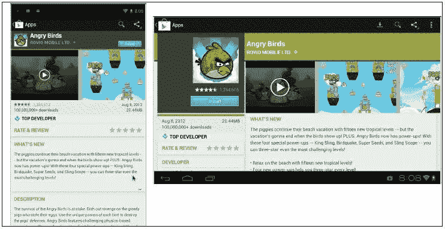

创建所谓的多窗格布局并非唯一可能；你可以根据计划拉伸、压缩、堆叠或展开 Fragment。在 Android 的网站上，设计部分有一份值得遵循的指南，地址为[`developer.android.com/design/patterns/multi-pane-layouts.html`](http://developer.android.com/design/patterns/multi-pane-layouts.html)。

Google 平台引入的另一个重要的 UI 模式是名为 ActionBar 的界面元素——位于应用程序顶部，其中最重要的菜单按钮可视化，以便轻松访问。

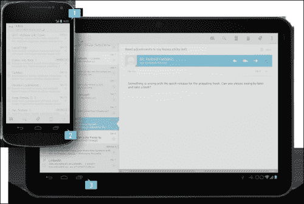

在操作栏中还提供了一个新的上下文菜单。例如，当一个列表中的一个或多个项目被选中（如 Gmail 应用程序）时，栏的外观会发生变化，并显示与所选项目可用的操作相关的新按钮。

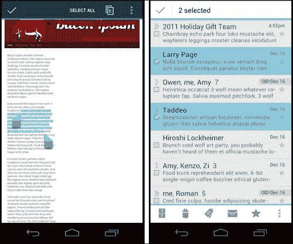

为了完整性，让我列举一下 Honeycomb 引入的其他新功能（如前所述，查阅官方文档以更好地理解它们）：

+   **复制和粘贴**：基于剪贴板框架

+   **加载器**：异步加载数据

+   **拖放**：允许在视图之间移动数据

+   **属性动画框架**：替代了旧的 Animation 包，允许对应用程序中的几乎所有内容进行动画处理

+   **硬件加速**：从 API 级别 11 开始，图形管道在硬件可用时会使用专用的硬件

+   支持加密存储

并不是这里列出的所有内容都通过 Support Library 进行向后移植。特别是，没有官方的方法以向后兼容的方式实现新的动画框架（尽管确实存在这样做的库）。

不幸的是，Support Library 并不支持所有这些旧版操作系统的功能。特别是，官方的 Google Support Library 不支持操作栏。

幸运的是，对于 Android 开发者来说，有一个名为 `ActionBarSherlock` 的开源项目，它出色地将 ActionBar API 带回到了 Android 1.6（API 级别 4）。我们将在 *ActionBar* 部分对此进行更多讨论。

# 碎片（应该了解）

这是最重要的部分。在这里，你将学习如何创建一个不仅与 API 级别 4 的旧版本向后兼容的 Android 应用程序，而且还能根据上下文显示内容。在正常大小的显示屏手机上，它只显示一个列表（单窗格配置），但是当有更大的屏幕可用时，也会显示所选内容的详细信息视图（多窗格配置）。

## 如何操作...

让我们开始创建一个由单个 Activity 和两个 Fragment 组成的简单应用程序。一个显示项目列表，另一个显示与选择相关的数据。

1.  导入所有必要的类：

    ```kt
    import android.content.*;
    import android.support.v4.app.*;
    import android.view.*;
    import android.widget.*;
    import android.os.Bundle;
    ```

1.  定义一个 Activity，包含所有代码，并从 Support Library 的 `FragmentActivity` 类继承：

    ```kt
    public class FragmentCompatibility extends FragmentActivity {
       ...
    }
    ```

1.  实现`onCreate()`方法，在这里我们将设置初始布局并做必要的管理工作：

    ```kt
    @Override
    public void onCreate(Bundle savedInstanceState) {
      super.onCreate(savedInstanceState);
      setContentView(R.layout.main);

      /*
      * There is the main_container view so we are not in multi paned
      * and we attach the fragment at runtime (we cannot modify lately
      * the fragment organization if it's defined in XML)
      */
      boolean isMultiPaned = (findViewById(R.id.main_container) == null);
      if (!isMultiPaned) {

        /*
        * If we are coming from a previous instance we don't
        * have to reattach the SmallListFragment.
        */
        if (savedInstanceState != null) {
          return;
        }
        SmallListFragment slf = new SmallListFragment();

        getSupportFragmentManager().beginTransaction()
        .add(R.id.main_container, slf).commit();
      }
    }
    ```

1.  使用 `ListFragment` 创建显示主选项列表的 Fragment：

    ```kt
        public static class SmallListFragment extends ListFragment {
              ….
        }
    ```

1.  为这个类实现 `onActivityCreate()` 方法，在这里我们设置列表的内容：

    ```kt
    @Override
    public void onActivityCreated(Bundle b) {
      super.onActivityCreated(b);
      setListAdapter(
        new ArrayAdapter<String>(getActivity(),
        android.R.layout.simple_list_item_1,
        itemTitleArray
        )
      );
      // First, we need to understand if is multi paned
      mIsMultiPaned = (getActivity().findViewById(R.id.main_container) == null);

    }
    ```

1.  实现 `onListItemClick()` 方法，该方法向用户显示选定的内容，更新相邻的片段或替换列表：

    ```kt
    @Override
    public void onListItemClick(ListView l, View v, int position, long id) {
        if (mIsMultiPaned) {
        //mDetail.updateContent(position);
        } else {
          SmallFragment sf = new SmallFragment();

          FragmentTransaction transaction =
          getActivity().getSupportFragmentManager().beginTransaction();
          transaction.replace(R.id.main_container, sf);
          transaction.addToBackStack(null);
          transaction.commit();
        }

      }
    }
    ```

1.  添加将显示详细信息的片段的定义：

    ```kt
        public static class SmallFragment extends Fragment {
          ...
        }
    ```

1.  实现 `onCreateView()` 方法，我们只需在这里简单展开一个表示片段内容的布局文件：

    ```kt
        public View onCreateView(
            LayoutInflater inflater,
            ViewGroup container,
            Bundle savedInstanceState) {
            View v = inflater.inflate(R.layout.simple, null);

            return v;
        }
    ```

现在是时候编写布局文件了。

1.  创建一个路径为 `res/layout/main.xml` 的文件，声明单一窗格的 UI：

    ```kt
    <?xml version="1.0" encoding="utf-8"?>
    <LinearLayout 
        android:id="@+id/main_container"
        android:layout_width="match_parent"
        android:layout_height="match_parent" >
        <FrameLayout
            android:id="@+id/detail_container"
            android:layout_width="0dp"
            android:layout_height="match_parent"
        />
    </LinearLayout>
    ```

1.  创建一个路径为 `res/layout-land/main.xml` 的文件，包含多窗格 UI：

    ```kt
    <?xml version="1.0" encoding="utf-8"?>
    <LinearLayout 
        android:orientation="horizontal"
        android:layout_width="match_parent"
        android:layout_height="match_parent" >
        <fragment android:name="org.ktln2.android.packt.FragmentCompatibility$SmallListFragment"
            android:id="@+id/list_fragment"
            android:layout_width="match_parent"
            android:layout_height="match_parent"
            android:layout_weight="1"
            />
        <fragment android:name="org.ktln2.android.packt.FragmentCompatibility$SmallFragment"
            android:id="@+id/detail_fragment"
            android:layout_width="match_parent"
            android:layout_height="match_parent"
            android:layout_weight="1"
            />
     </LinearLayout>
    ```

## 它的工作原理...

*如何实现...* 部分编写的代码的目的是创建一个能够根据上下文调整其内容，并且当然可以从任何装有从 API 级别 4 开始的 Android 版本的设备上启动的简单应用程序。

这可以通过使用兼容性包提供的特定自定义类 `FragmentActivity` 来实现；注意这一点，否则与片段相关的功能将无法正常工作。

代码创建了一个包含两个片段的单个活动。一个是来自简单数组的随机项目列表，另一个是非常简单的包含常量文本的片段。应用程序根据设备方向来组织布局。当设备处于横屏模式时，片段会并排显示，否则我们从仅显示列表的应用程序开始，然后在选择列表中的一个项目后，我们切换到详细信息，用另一个片段替换列表。

活动类的职责是管理显示的片段。有两种方法来管理片段：

+   **静态包含**：在 XML 中包含片段

+   **动态加载**：在运行时使用 `FragmentManager` 加载片段

这里需要注意的是，在 XML 中定义的片段在运行时不能通过 `FragmentManager` 移除，只有动态加载的片段可以被移除。这一点非常重要，可能会导致非常错误的行为或更糟的是；看起来工作正常，但在幕后它引入了一些非常讨厌的 bug（例如，多次出现的 UI 片段）。

### 注意

一个非常有用的工具是 Hierarchy Viewer，它包含在 SDK 中。这个工具在应用程序运行时以图形层次树的形式显示活动。`.bat` 文件可以在 `<SDK_ROOT\tools\hierarchyviewer.bat>` 找到。

让我解释一下 Android 的工作原理以及它是如何在状态转换之间保存 UI 状态的。

当活动暂停或销毁时，会发生状态转换，这种情况可能相当频繁，例如在电话通话期间（记住，Android 设备可能是电话）或设备方向改变时！

最后一种情况可能会让人感到惊讶，因为当应用程序看起来运行良好，但方向改变时却崩溃了。

这是因为改变方向几乎会从零开始销毁和重建 UI。系统提供了 `onSaveInstanceState()` 方法，该方法在 Activity 可能被销毁之前调用，并传递一个 `Bundle` 实例，我们可以在其中保存我们认为有价值以重新创建实际状态的所有内容。可以在 `onCreate()` 方法中恢复状态，系统会将同一个 `Bundle` 传递回来。

系统为已定义 ID 的 UI 元素保存状态，因此例如，如果我们有一个在 XML 中定义了关联 ID 的 `EditText` 方法，任何写入其中的文本都将在状态更改后保留下来。

在我们的代码中，我们选择用包含详细信息的 Fragment 来替换 `ListFragment`，但为了做到这一点，我们必须从一开始就程序化地创建它。但这里有一个微妙的要点；由于容器视图与一个 ID 相关联，它将保存之前状态的 `ListFragment`。因此，我们必须检查我们是否来自之前的状态，并且以防万一避免重新附加 Fragment；使用的代码如下：

```kt
if (savedInstanceState != null) {
    return;
}
```

如果我们处于竖屏模式，且没有之前的实例，我们可以简单地将 `ListFragment` 附加到 `FragmentManager` 上，并使用其方法。

### 注意

请注意，在使用普通的 Android API 时，`FragmentManager` 是通过 `getFragmentManager()` 获取的，而支持库必须通过 `getSupportFragmentManager()` 调用。

为了理解剩余的代码，我们必须掌握 Fragments 的生命周期，如下表所示：

| Fragment | Activity |
| --- | --- |
| `onAttach()``onCreate()` |   |
| `onCreateView()` | `onCreate()` |
| `onActivityCreated()` |   |
| `onStart()` | `onStart()` |
| `onResume()` | `onResume()` |
| `onPause()` | `onPause()` |
| `onStop()` | `onStop()` |
| `onDestroyView()` |   |
| `onDestroy()` | `onDestroy()` |
| `onDetach()` |   |

Activity 和其 Fragments 有着紧密的关系；现在对我们来说更重要的是创建时间，即 Activity 的 `onCreate()` 方法被调用的时候。如前所述，可以通过使用 Fragment 标签在 XML 布局中直接放置 Fragment，或者在运行时动态加载 Fragment。在所有情况下，Fragment 的 `onCreateView()` 方法必须返回此布局。

请注意，只有在 Activity 的 `onCreate()` 方法返回后，我们才能依赖内容视图层次结构的正确初始化。此时，将调用 Fragment 的 `onActivityCreate()` 方法。

## 还有更多...

现在让我们谈谈其他一些选项，或者可能是一些与这项任务相关的通用信息。

### 创建适应接口的上下文

当我们创建 Fragments 的两种可能的布局时，我们选择横屏和竖屏作为切换，但这并不是完全正确的方法。

我们非常清楚，通过将同一资源的不同版本（布局、图片等）放置在目录中，并通过在目录名称后附加一些特定限定符来标识资源必须使用的配置（在前一个示例中，使用 layout-land 作为目录名称，以指示设备在横屏方向上的配置），限定符可以混合在一起，但只能按照特定的顺序。

从 API 级别 13（即版本 3.2）开始，有两个新的限定符可用：

+   `w<N>dp`：此限定符指定了资源应使用的最小可用屏幕宽度（以 dp 为单位），由`<N>`值定义。此配置值将在横屏和竖屏之间切换时改变，以匹配当前的实际宽度。

+   `h<N>dp`：此限定符指定了资源应使用的最小可用屏幕高度（以 dp 为单位），由`<N>`值定义。此配置值将在横屏和竖屏之间切换时改变，以匹配当前的实际高度。

使用这些限定符，还可以在例如竖屏模式下屏幕宽度足够大的设备上使用扩展布局。如果我们决定在屏幕宽度为 600 dp 时进行切换，我们可以将扩展布局 XML 文件放置在名为`res/layout-w600dp/`的目录中。

在这些情况下有用的另一个技巧是在布局中使用`<include>`和`<merge>`标签。这样，我们可以只创建一个特定的布局文件，并从另一个文件中引用它，如果我们认为它应该是相等的。如果我们想使用`res/layout-w600dp/main.xml`作为我们的真实扩展布局，我们可以使用以下代码段从`res/layout-land/main.xml`中引用它：

```kt
<?xml version="1.0" encoding="utf-8"?>
<merge>
  <include layout="@layout/skeleton_extended"/>
</merge>
```

在这里，我们将其重命名为`skeleton_extended.xml`，即多窗格布局。

最后，关于管理主题，并尽可能使它们与版本无关。例如，如果我们想要使用浅色主题（默认为深色），特别是`Holo`主题（从 Honeycomb 开始包含在所有 Android OS 中的特定主题，对于运行 Android 4.0 及以上版本的 Android 设备是兼容性要求），对于 API 级别等于或大于 11 的设备，我们需要声明自定义主题。创建两个目录，一个路径为`res/values/`，另一个名为`res/values-v11/`。

在第一个目录中，创建包含以下内容的`styles.xml`文件：

```kt
<resources>
    <style
            name="AppTheme"
            parent="android:Theme.Light" />
</resources>
```

在另一个目录中，写入以下内容：

```kt
<resources>
    <style
            name="AppTheme"
            parent="android:Theme.Holo.Light" />
</resources>
```

最后，在`AndroidManifest.xml`文件中，将以下代码行作为`<application>`标签的属性插入：

```kt
android:theme="@style/AppTheme"
```

需要注意的是，这些考虑因素并不直接帮助向后兼容，但它们避免了因新设备而失去的可能性。

### 菜单

从 Honeycomb 版本开始，菜单的管理方式也有所不同。由于`ActionBar`的存在，现在可以将其上的一些菜单选项呈现出来，以便更容易访问。选择放置在 ActionBar 中的选项应遵循 FIT 方案——频繁、重要或典型。

因此，用于构建菜单的方法，即`OnCreateOptionsMenu()`，在存在操作栏的情况下，在 Activity 启动时被调用（在 Honeycomb 之前的设备上，这个函数只有在按下菜单按钮时才会被激活）。例如，我们可以在`res/menu/main.xml`路径下的文件中定义一个包含两个选项的简单菜单。

```kt
<?xml version="1.0" encoding="utf-8"?>
<menu >
    <item android:id="@+id/menu_new"
          android:title="New"
          android:showAsAction="ifRoom"/>
    <item android:id="@+id/help"
          android:title="Help" />
</menu>
```

由于我们在`showAsAction`属性中指定了`ifRoom`值，这个选项将被插入到 ActionBar 的右侧（如果有更多具有相同设置的选项，只有那些适合放入操作栏的选项才会显示，其余的将正常通过菜单按钮显示）。

在没有 ActionBar 的 Honeycomb 之前的设备上，所有选项都会通过常规菜单按钮正常显示。

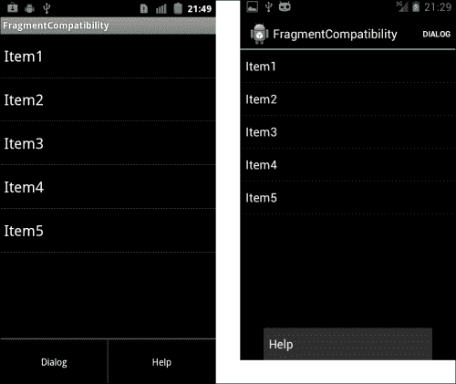

### 没有 UI 的 Fragments

由于 Fragment 是应用程序级别的组件，而不是 UI 级别的，因此可以实例化这些 Fragment，而无需将布局元素关联到它们。

我们通过`add(fragment, tag)`函数以编程方式实现这一点。

这是通过`FragmentTransaction`的实例可用的。`tag`参数是一个普通字符串（不要将此参数与`View`类中使用的标签混淆），然后可以使用`findFragmentByTag()`函数找到该 Fragment。

如果你在想为什么你要使用一个没有 UI 的 Fragment，请记住，以这种方式，当 UI 重新创建时（如在屏幕方向改变时），Fragment 不会被销毁。

### `minSdkVersion`和`targetSdkVersion`

由于细节决定成败，因此了解在`AndroidManifest.xml`中使用的`<uses-sdk>`标签中的变量作用非常重要，它表示应用程序与一个或多个 Android 平台版本的兼容性。

由于`minSdkVersion`的含义相当明显，让我引用一下`targetSdkVersion`的文档摘要：

> *这个属性通知系统你已经针对目标版本进行了测试，系统不应启用任何兼容性行为以保持你的应用程序与目标版本的前向兼容性。应用程序仍然可以在较旧的版本上运行（直至`minSdkVersion`）。*
> 
> *...如果平台的 API 级别高于你的应用程序声明的`targetSdkVersion`版本，系统可能会启用兼容性行为，以确保你的应用程序按照预期的方式继续工作。你可以通过指定`targetSdkVersion`以匹配运行它的平台的 API 级别来禁用这些兼容性行为。*

在我们的案例中，我们希望创建的应用程序可以从 API 级别 4 的设备上安装，并且我们特别希望使用 Honeycomb（即 API 级别 11）引入的功能，因此`AndroidManifest.xml`文件必须包含以下内容：

```kt
    <uses-sdk
        android:minSdkVersion="4"
        android:targetSdkVersion="11" />
```

对于 Eclipse 用户，可以在创建 Android 项目向导时最初设置这些值：

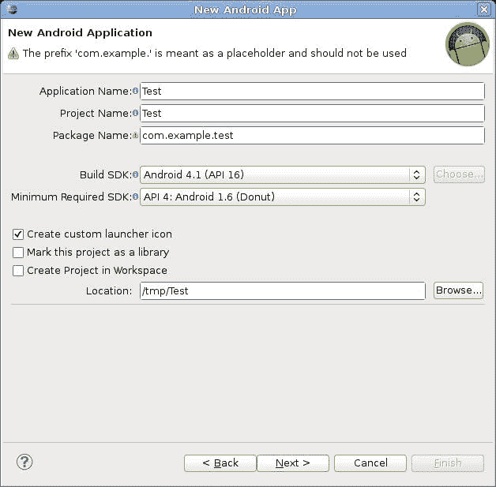

`targetSdkVersion`是**构建 SDK**，如所示对话框中设置的那样。

`maxSdkVersion`必须手动设置。

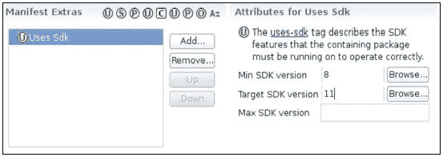

### 对话框

如代码所示，你可以清楚地看到一个特殊的片段类型，即`ListFragment`，它通过将项目绑定到数据源来显示项目列表，并在用户选择项目时公开事件处理程序。

支持库还提供了`FragmentDialog`类的向后兼容实现，用于显示，显然，对话框窗口。在文档中，它是这样解释的：

> *一个显示对话框窗口的片段，浮在其活动窗口的顶部。这个片段包含一个 Dialog 对象，它会根据片段的状态适当地显示。对话的控制（决定何时显示、隐藏、关闭它）应该通过这里的 API 来完成，而不是直接调用对话框。*

让我们编写一些示例代码，以展示这是如何工作的：

1.  导入用于创建对话框的普通类：

    ```kt
    import android.app.Dialog;
    import android.app.AlertDialog;
    ```

1.  创建一个扩展`FragmentDialog`的类：

    ```kt
        static public class DialogCompatibility extends DialogFragment {
         …
         }
    ```

1.  重写用于创建对话框的方法：

    ```kt
          @Override
          public Dialog onCreateDialog(Bundle savedInstanceState) {
          return new AlertDialog.Builder(getActivity())
          .setTitle("Fragment and dialog")
          .create();
        }
    ```

1.  在菜单资源文件中添加一个选项：

    ```kt
        <item android:id="@+id/menu_dialog"
              android:title="Dialog"
              android:showAsAction="ifRoom"
              />
    ```

1.  最后，在 Activity 类的`onOptionsItemSelected()`函数中添加以下代码片段，以调用此对话框：

    ```kt
      @Override
      public boolean onOptionsItemSelected(MenuItem item) {
        switch (item.getItemId()) {
          case R.id.menu_dialog:
          DialogCompatibility dc = new DialogCompatibility();
          DialogCompatibility.newInstance().show(getSupportFragmentManager(), "dialog");
          return true;
          default:
          return super.onOptionsItemSelected(item);
        }
      }
    ```

显然这是一个非常简单的例子，还有很多可以说，但这里留给读者作为一个练习（例如，如何将对话框嵌入到 Activity 中）。

### VERSION_CODES

并不是所有可能的问题都可以通过支持库来解决，因此有必要学习一些方法来管理不同版本间功能的不同可用性。

一种解决方案可能是创建不同的 APK，每个针对特定的 Android 版本，然后分别上传到 Android 市场；这并不是特别明智，因为它会导致大量的代码重复，并且维护起来非常困难。

一个更好的解决方案是在感兴趣的代码中创建分支，使用`if`语句并检查`VERSION_CODES`。这可以从`android.os.Build`包中访问，并且它列出了所有 Android 版本。为了在运行时检查实际版本，必须在`android.os.Build.VERSION`包中使用`SDK_INT`字段。

最后，我们应该编写一些类似于以下的代码：

```kt
if (android.os.Build.VERSION.SDK_INT => android.os.Build.VERSION_CODES.HONECOMB) {
   // ...
} else if (android.os.Build.VERSION.SDK_INT =>
android.os.Build.VERSION_CODES.GINGERBREAD){
     // ...
}
```

一种更复杂的方法是使用资源系统，以设置适当的布尔变量和感兴趣的价值。假设我们创建两个`values`文件，一个路径为`res/values/bools.xml`，内容如下：

```kt
<?xml version="1.0" encoding="utf-8"?>
<resources>
   <bool name="isHoneycomb">false</bool>
</resources>
```

另一个在路径`res/values-v11/bools.xml`中，内容如下：

```kt
<?xml version="1.0" encoding="utf-8"?>
<resources>
   <bool name="isHoneycomb">true</bool>
</resources>
```

在代码内部，可以通过简单的代码引用`isHoneycomb`变量，如下所示：

```kt
Resource r = getResources();
boolean isHoneycomb = r.getBoolean(R.bool.isHoneycomb)
```

这可以直接在代码中使用。

# Loader（应该知道）

在这个任务中，我们将展示一个名为`Loader`的类的使用，这个类专门用于在后台执行异步工作，以更新与应用程序相关的数据；在引入`Loader`和相关类之前，管理数据的唯一方式是使用游标和一些特定 Activity 类的 方法：

```kt
public void startManagingCursor(Cursor)
public Cursor managedQuery(Uri, String, String, String, String)
```

这种方法的问题是，这些调用是在主应用线程上进行的，可能会导致应用程序无响应，甚至可能引起可怕的 ANRs（应用程序无响应）！

在以下步骤中，我们将展示一个应用程序的代码，该程序通过向网页服务器发送 HTTP 请求从 Packt 的网站加载 RSS，显然这不能是瞬时的；这里就是使用`Loader`类的地方。所有这些都是通过支持库完成的；这样，应用程序将与以前的 Android 平台兼容。

## 如何操作...

让我们列出完成该任务所需的步骤：

1.  首先，包括必要的支持库类：

    ```kt
    import android.support.v4.app.FragmentActivity;
    import android.support.v4.app.*;
    import android.support.v4.content.*;
    ```

1.  定义一个通常继承`FragmentActivity`类的类，并定义创建 GUI 的`onCreate()`方法：

    ```kt
    public class LoaderCompatibilityApplication extends FragmentActivity {
        @Override
        public void onCreate(Bundle savedInstanceState) {
            super.onCreate(savedInstanceState);
            setContentView(R.layout.main);
        }
    }
    ```

1.  定义一个将显示所需数据的 Fragment。重要的是它实现了`LoaderManager.LoaderCallbacks`：

    ```kt
      static public class RSSFragment extends ListFragment
        implements LoaderManager.LoaderCallbacks<String[]> {
      }
    ```

1.  在其`onActivityCreated()`中实现适配器自己的数据，更重要的是，使用`LoaderManager`类的`initLoader()`方法调用 Loader：

    ```kt
      @Override
      public void onActivityCreated(Bundle savedInstance) {
        super.onActivityCreated(savedInstance);

        setListAdapter(
        new ArrayAdapter<String>(
        getActivity(),
        android.R.layout.simple_list_item_1,
        new String[]{}
        )
        );
        /*
        * Differently to what the documentation says,
        * append forceLoad() otherwise the Loader will not be called.
        */
        getLoaderManager().initLoader(0, null, this).forceLoad();
      }
    ```

1.  现在，是时候实现`LoaderManager.LoaderCallbacks`接口中定义的方法了：

    ```kt
      public RSSLoader onCreateLoader(int id, Bundle args) {
        return new RSSLoader(getActivity());
      }

      public void onLoaderReset(Loader<String[]> loader) {
      }

      public void onLoadFinished(Loader<String[]> loader, String[] data) {
        setListAdapter(
          new ArrayAdapter<String>(
            getActivity(),
            android.R.layout.simple_list_item_1,
            data
          )
        );
      }
    ```

1.  最后，定义`Loader`子类（有两个函数`doGet()`和`getNews()`，这里不显示；它们只是检索 XML 并将其转换成字符串数组）。特别是，实现`loadInBackground()`方法。读者必须注意，这里我们扩展了支持库中包含的`AsyncTaskLoader`类：

    ```kt
      static public class RSSLoader extends AsyncTaskLoader<String[]> {
        @Override
        public String[] loadInBackground() {
          String xml = "";
          String[] news;

          try {
            xml = doGet();
            news = getNews(xml);
          } catch (Exception e) {
            news = new String[] {e.getMessage()};
          }

          return news;
        }
      }
    ```

1.  添加一个简单的布局文件：

    ```kt
    <?xml version="1.0" encoding="utf-8"?>
    <LinearLayout 
        android:orientation="vertical"
        android:layout_width="fill_parent"
        android:layout_height="fill_parent"
        >
        <fragment   android:name="org.ktln2.android.packt.LoaderCompatibilityApplication$RSSFragment"
            android:id="@+id/rss_list"
            android:layout_width="fill_parent"
            android:layout_height="fill_parent"
            />
    </LinearLayout>
    ```

## 它是如何工作的...

上述代码段仅简化了 Fragment 类实例（Loader 所属）与 Loader 本身的同步。Fragment 首次通过其`initLoader()`方法查询`LoaderManager`时，将使用`onCreateLoader()`创建一个新的 Loader（如果已存在具有给定 ID 的 Loader，只需返回旧实例，而无需调用此方法）。

从现在开始，Loader 会跟随 Fragment 的状态（当 Fragment 停止时，它也会停止），并在数据准备好时调用`onLoadFinished()`方法。在上述示例中，列表使用在`loadInBackground()`中构建的包含`news`的数组进行更新。

## 还有更多内容...

现在我们来谈谈一些其他选项，或者可能是一些与这项任务相关的通用信息。

### 低级别

在底层，一个 Android 应用程序并不是一系列逐一执行的唯一指令块，而是由多个执行管道组成。这里的主要概念是进程和线程。当应用程序启动时，操作系统会创建一个进程（从技术上来说是一个 Linux 进程），每个组件都与这个进程关联。

与进程一起，还会创建一个名为`main`的执行线程。这是一个非常重要的线程，因为它负责将事件分派到适当的用户界面元素，并从它们接收事件。这个线程也被称为**UI 线程**。

需要注意的是，系统不会为每个元素创建一个单独的线程，而是为所有元素使用同一个 UI 线程。这对于应用程序的响应性来说可能是危险的，因为如果你执行一个密集型或耗时的操作，这将阻塞整个 UI。所有 Android 开发者都在努力避免出现**ANR**（**应用程序无响应**）消息，当 UI 超过 5 秒没有响应时会出现该消息。

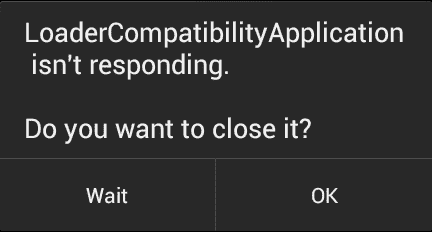

根据 Android 的文档，为了避免 ANR，只需遵循两条规则：

+   不要阻塞 UI 线程

+   不要在 UI 线程外部访问 Android UI 工具包。

这两条规则看似简单，但有一些细节必须明确。首先，让我向您展示使用名为`Thread`的类创建新线程的最简单方法。

这个类实现了定义了一个名为`run()`的单个方法的`Runnable`接口；当一个`Thread`的实例调用其自身的`start()`方法时，它会在后台启动在`run()`方法中定义的指令。这对于有 Java 编程经验的每个人来说都不是新事物；这是纯 Java，所以在所有 API 级别中都可以使用。

例如，如果我们想创建一个简单的任务，在不阻塞 UI 的情况下休眠 5 秒，我们可以使用以下代码段：

```kt
new Thread(new Runnable() {
  public void run() {
    this.sleep(5000);
  }
}).start();
```

一切都很清楚，但在一般情况下，我们希望与 UI 交互，比如更新进度条，显示错误，或者更改 UI 元素的外观；使用 Android 文档中的一个例子，我们可能会编写一段代码，通过使用远程 PNG 来更新一个`ImageView`：

```kt
public void onClick(View v) {

  new Thread(new Runnable() {

    public void run() {

      Bitmap b = loadImageFromNetwork("http://example.com/image.png");

      mImageView.setImageBitmap(b);
    }

  }).start();

}
```

一切看似正常，但运行这段代码后，会在应用程序的日志中显示一个臭名昭著的异常：

> *只有创建视图层次结构的原始线程才能触摸其视图。*

这是因为 `setImageBitmap()` 是在我们创建的线程中执行的，而不是在 UI 线程中，这违反了上面表达的第二个规则（这是不允许的，因为 UI 线程不是线程安全的，也就是说，不能保证并发访问一个元素不会导致问题）。

在我们解决这个问题之前，让我先向您展示一下 Android 系统引入的用于管理线程的最内层结构——`Looper` 和 `Handler` 类。

第一个类的实例简单地用于在一个线程中运行消息循环，该线程将由第二个类的实例处理。另一方面，`Handler` 实例管理线程之间的消息实例，但其执行上下文是它最初定义的线程。

为了理解，最好举一个复杂的例子，涉及两个通过消息进行通信的线程。假设我们有一个通用的 Activity 类，在它的 `onCreate()` 方法内部，我们定义了两个线程每隔 5 秒进行一次通信：

```kt
  new Thread(new Runnable() {
    @Override
    public void run() {
      Looper.prepare();

      mFirstHandler = new Handler() {
        @Override
        public void handleMessage(Message message) {
          android.util.Log.i(TAG, (String)message.obj);
        }
      };

      Looper.loop();
    }
  }).start();

    new Thread(new Runnable() {
    @Override
    public void run() {
      int cycle = 0;
      while (true) {
        try {
          Thread.sleep(5000);

          Message msg = mFirstHandler.obtainMessage();

          msg.obj = "Hi thread we are at " + cycle;
          mFirstHandler.sendMessage(msg);

          cycle++;
        } catch (java.lang.InterruptedException error) {
          android.util.Log.i(TAG, "error: " + error.getMessage());
        }
      }
    }
  }).start();
```

这就是代码运行时在 Eclipse 的线程面板中显示的样子：

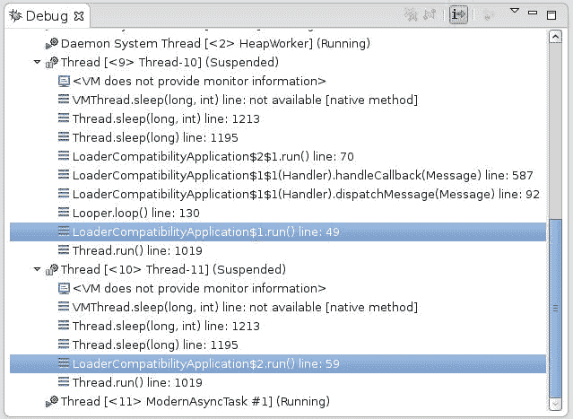

更有趣的是，还有可能将 `Runnable` 类排队在 `Handler` 类的原始线程中执行。除了 `sendMessage()`，还可以使用 `mFirstHandler.post()`，以 `Runnable` 类的定义作为参数。

要使用这些类，需要记住的一个基本点是，在线程的 `run()` 方法中调用 `Looper.prepare()` 和 `Looper.loop()`，并在它们之间编写与 `Handler` 类相关的代码——就是这样。

唯一一个已经定义了 Looper 的线程是 UI 线程，它提供了一些方法，以便在其内部发布 `Runnable` 类的实例。

现在，回到之前的问题，让我解释一下如何使用 `Runnable` 类来解决它；我们可以通过使用任何 `View` 都可用的实用方法来发布更新 UI 的代码，比如 `View.post(Runnable)` 方法。

现在，我们可以用以下代码替换导致问题的那一行：

```kt
            mImageView.post(new Runnable() {
                public void run() {
                    mImageView.setImageBitmap(bitmap);
                }
            });
```

`Looper` 和 `Handler` 非常重要，因为它们是系统的核心，更重要的是，它们从 API 级别 1 开始就可用，这使得它们成为编写 Android 应用程序的良好资源。

另一个重要的类，从 API 级别 3 开始可用，是 `AsyncTask`。如果您在后台线程上工作的应用程序中工作过，那么您可能已经使用过它，因为它是为此目的而设计的；它旨在简化线程的管理，避免 `Looper` 和 `Handler` 类的所有头痛和易出错的代码。

它的定义很特别。它使用泛型；也就是说，有一些用 `Params`、`Progress` 和 `Result` 表示的参数，它们标识了一些用于内部管理线程的函数签名。

特别是，`AsyncTask` 有四个方法如下：

+   `void onPreExecute()`: 它的角色是设置任务。

+   `protected Result doInBackground(Params...)`：这是`AsyncTask`类的核心，你的代码必须写在这里。在`onPreExecute()`结束后，会创建一个后台线程来执行这个函数。重要的是要记住，不要尝试从这个函数中更新 UI。使用`onProgressUpdate()`将更新发布回 UI。

+   `onProgressUpdate(Progress...)`：这用于以某种方式发布进度。

+   `onPostExecute(Result)`：这接收`doInBackground()`函数的结果。

除了`doInBackground()`函数之外，所有函数都在 UI 线程中执行，因此要记住不要在它们中执行耗时的工作。

如果我们想要复制下载远程 PNG 并用其更新`ImageView`的代码，我们应该编写如下所示的代码片段：

```kt
class PNGUpdate extends AsyncTask<URL, Integer, Long> {
  Bitmap mBitmap;
  ImageView mImageView;

  public PNGUpdate(ImageView iv) {
    mImageView = iv;
  }

  protected Long doInBackground(URL... urls) {
   int count = urls.length;
    for (int i = 0; i < count; i++) {
      mBitmap = loadImageFromNetwork(urls[i]);
    }

    return 0;
  }

  protected void onPostExecute(Long result) {
    mImageView.setImageBitmap(mBitmap);
  }
}
```

对于我们想要调用它的地方，我们必须插入一行，如下所示：

```kt
new PNGUpdate(myImageView).execute(pngURL)
```

你可能已经注意到，在初始步骤中，当我们定义我们的加载器时，我们继承了一个名为`AsyncTaskLoader`的类。它只是一个带有`AsyncTask`的加载器；这里的唯一区别是它在定义时不是三个参数，而只有一个，因为加载器不需要返回有关操作状态的信息（例如，不显示进度条）。

关于线程的串行/并行执行的最后一点说明：

> *最初引入时，AsyncTasks 在单个后台线程上串行执行。从 DONUT 开始，这被改为一个线程池，允许多个任务并行操作。从 HONEYCOMB 开始，为了防止常见的应用程序错误，任务在单个线程上执行。*
> 
> *如果你确实想要并行执行，可以使用 executeOnExecutor(java.util.concurrent.Executor, Object[]) 和 THREAD_POOL_EXECUTOR。*

### 加载器的一般结构

关于编写加载器的初步说明使用了简单的`AsyncTaskLoader`，这大大简化了开发人员的生活，为你创建了后台线程和 UI 线程之间的正确划分。

这很重要，主要是它避免了浪费时间在小的错误上，更重要的是，使代码更加模块化，避免重新发明轮子。然而，现在我们要重新发明轮子，以了解如何正确管理应用程序中的`Loader`类。

Loader 旨在与动态数据一起使用，其中重要的是要通知更新以便刷新 UI 的相关元素；为了通知我们的 Loader 底层数据已更改，我们将实现一个名为`RSSObservable`的类，该类控制 XML（表示 RSS）与上一个版本不同。需要注意的是，这是一个概念验证，并不打算在实际应用中使用。Loader 和 Observable 类都会下载 RSS，这会导致电池耗电（在某些情况下，你将为带宽付费）。

读完这段代码后，尝试将其与`AsyncTaskLoader`类的原始实现进行比较，你可以在 Android 的源代码文件`frameworks/base/core/java/android/content/AsyncTaskLoader.java`中找到。显然，我们不需要实现那里能找到的所有内容。

那么让我们来实现我们的自定义 Loader：

1.  导入所需的类：

    ```kt
    import android.content.Context;
    import android.support.v4.content.Loader;
    import android.os.AsyncTask;
    import java.util.Observer;
    import java.util.Observable;
    ```

1.  定义我们的自定义 Loader，扩展`Loader`类并指出实现了`Observer`接口：

    ```kt
    class RSSLowLevelLoader extends Loader<String[]> implements Observer {
        …
    }
    ```

1.  定义内部变量，它们将引用`Task`和`Observable`实例：

    ```kt
    private Task mTask = null;
    private RSSObservable mTimerObservable = null;
    ```

1.  在构造函数中定义所有需要初始化的内容，以确保类的正确运行。

    ```kt
    /*
     * Don't retain a reference to the context in the class since this
     * will / can cause a memory leak.
     */
        public RSSLowLevelLoader(Context context) {
            super(context);

            mTimerObservable = new RSSObservable();
            mTimerObservable.start(mURL);
            mTimerObservable.addObserver(this);
        }
    ```

1.  定义一个自定义的`AsyncTask`，返回你选择的数据；在其`doInBackground()`方法中，只需像前一个示例中那样操作。`onPostExecute()`通知`LoaderManager`任务已完成。

    ```kt
      private class Task extends AsyncTask<Void, Void, String[]> {
      @Override
        protected String[] doInBackground(Void... params) {
          String xml = "";
          String[] news = null;
          try {
            xml = RemoteHelper.doGet("http://www.packtpub.com/rss.xml");
            news = RemoteHelper.getNews(xml);
          } catch (java.lang.Exception e) {
            news = new String[] {e.getMessage()};
          }

          return news;
        }

        @Override
        protected void onPostExecute(String[] results) {
        // remember: deliverResult() must be called from the UI Thread
          RSSLowLevelLoader.this.deliverResult(results);
        }
      }
    ```

1.  现在实现可以在 Loader 上执行的主要动作的行为：

    ```kt
      @Override
      protected void onStartLoading() {
        if (takeContentChanged()) {
          forceLoad();
        }
      }
      @Override
      protected void onStopLoading() {
        if (mTask != null) {
          boolean result = mTask.cancel(false);
          android.util.Log.i(TAG, "onStopLoading() = " + result);

          mTask = null;
        }

      }
      @Override
      protected void onForceLoad() {
        android.util.Log.i(TAG, "onForceLoad()");
        super.onForceLoad();

        onStopLoading();

        mTask = new Task();
        mTask.execute();
      }

      @Override
      protected void onReset() {
        mTimerObservable.stop();
      }
    ```

1.  实现`deliverResult()`方法：

    ```kt
    @Override
    public void deliverResult(String[] data) {
      if (isReset()) {
        // if there is data to be garbage collected do it now
        return;
      }

      super.deliverResult(data);
    }
    ```

1.  编写`Observer`接口的回调：

    ```kt
      @Override
      public void update(Observable obs, Object data) {
        /*
        * The default implementation checks to see if the loader
        * is currently started; if so, it simply calls forceLoad().
        */
        onContentChanged();
      }
    ```

1.  编写一个表示`Observable`接口的类，在这里我们实现监控数据变化并通知我们的代码：

    ```kt
    public class RSSObservable extends Observable {
      private String mContents = "";
      private String mURL = null;
      private Timer mTimer = null;  

      public RSSObservable() {
        mTimer = new Timer();
      }

      private class InnerTimer extends TimerTask {
        @Override
        public void run() {

          String xml = "";
          try {
            xml = RemoteHelper.doGet(mURL);
          } catch (Exception e) {}
          if (xml != mContents) {
            RSSObservable.this.setChanged();
            RSSObservable.this.notifyObservers(null);

            mContents = xml;
          }
        }
      }

      public void start(String URL) {
        mURL = URL;
        mTimer.schedule(new InnerTimer(), 10000, 20000);
      }

      public void stop() {
         mTimer.cancel();
      }
    }
    ```

更复杂的一部分是理解 Loader 的底层流程。首先，它可能存在三种状态，如下所示：

+   `STARTED`：Loader 执行加载操作，并通过`onLoadFinished()`通知 Activity 类。

+   `STOPPED`：Loader 继续监听变化，但不可以交付结果。当相关的 Activity/Fragment 类停止时，通过`LoaderManager`调用`stopLoading()`来引发此状态。

+   `RESET`：Loader 不得监听变化、交付结果等。已收集的数据应该被垃圾回收。

这些状态中的每一个都可以从其他状态转换而来。

由于所有操作都是异步的，数据更新的通知可能会在状态不是`STARTED`时到达`Loader`实例；这解释了代码中存在的各种检查。

在前面的代码片段中引入了一件事，在`AsyncTaskLoader`示例中没有提到，那就是观察者/可观察对象设计模式。第一个被定义为一个接口，第二个作为一个类，两者都在`java.util`包中（从 API 级别 1 开始就可用，因此不会引起兼容性问题）。观察者通过`update()`方法接收更新通知，而可观察对象通过`addObserver()`方法注册一些观察者，当发生变化时通过`notifyObservers()`方法通知它们。

### 提示

**最后一点说明**

`cancelLoad()`在兼容性库的`Loader`类版本中不存在。

# ActionBar（应该知道）

兼容性包没有解决的一个问题是 ActionBar，这是从 Honeycomb 平台开始引入的一种新的 UI 模式。由于这是与 Android 生态系统集成的一个非常重要的元素，因此出现了一些替代方案，第一个来自 Google 本身，是一个名为 ActionBar Compatibility 的简单代码示例，你可以在 Android SDK 的`sample/`目录中找到。

我们将采用一种不同的方法，使用一个著名的开源项目，`ActionBarSherlock`。

## 准备就绪

这个库的代码在 SDK 中不可用，因此我们需要从其网站（[`actionbarsherlock.com/`](http://actionbarsherlock.com/)）下载。

你也可以从作者的`github`仓库下载；一旦下载了归档文件，你可以将其解压到你选择的目录中。

## 如何操作...

让我们在 Eclipse 中将`ActionBarSherlock`作为一个库包含进来，然后创建一个使用它的简单项目：

1.  打开 Eclipse 并创建一个新项目，导入你可以在`ActionBarSherlock`源代码的`libraries/`目录中找到的源文件。这可以通过选择**文件** | **新建** | **其他...**来完成。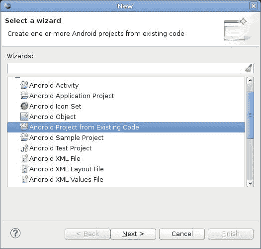

1.  打开你要使用库的项目（否则创建一个新的）。

1.  通过从包浏览器中选择项目，然后从主菜单中选择**项目** | **属性**，告诉 Eclipse 使用`ActionBarSherlock`库。将弹出一个对话框。现在从**Android**部分添加库：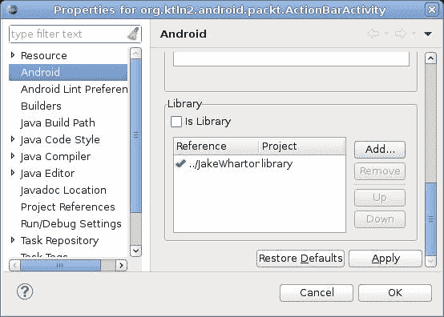

1.  在包含项目主 Activity 的文件中，导入所需的类：

    ```kt
    import com.actionbarsherlock.app.SherlockFragmentActivity;
    import com.actionbarsherlock.app.SherlockFragment;
    import com.actionbarsherlock.app.ActionBar;
    import com.actionbarsherlock.view.Menu;
    import com.actionbarsherlock.view.MenuItem;
    import com.actionbarsherlock.view.MenuInflater;
    ```

1.  实现`Activity`类，这里将使用 ActionBar，继承自`SherlockFragmentActivity`：

    ```kt
    public class ActionBarActivity extends SherlockFragmentActivity {
        …
    }
    ```

1.  在 Activity 的`onCreate()`方法中，配置 ActionBar：

    ```kt
        @Override
        public void onCreate(Bundle savedInstanceState) {
            super.onCreate(savedInstanceState);
            setContentView(R.layout.main);

            // if you wan to configure something
            // about ActionBar use this instance
            ActionBar ab = getSupportActionBar();
        }
    ```

1.  添加以下所需的代码片段以创建菜单选项：

    ```kt
        @Override
        public boolean onCreateOptionsMenu(Menu menu) {
            MenuInflater inflater = getSupportMenuInflater();
            inflater.inflate(R.menu.main, menu);

            return true;
        }
    ```

1.  使用所需的逻辑（这里我们只展示了一个简单的吐司通知）实现`Activity`类的`onOptionsItemSelected()`：

    ```kt
      @Override
      public boolean onOptionsItemSelected(MenuItem item) {
          switch (item.getItemId()) {
            default:
                Toast.makeText(this, "Hi!", 1000).show();
            }

          return super.onOptionsItemSelected(item);
        }
    ```

1.  在位于`res/menu/main.xml`的相关 XML 文件中定义你想要的菜单选项：

    ```kt
    <?xml version="1.0" encoding="utf-8"?>
    <menu >
        <item android:id="@+id/first"
              android:title="First"
              android:showAsAction="ifRoom"/>
        <item android:id="@+id/second"
              android:title="Second"
              android:showAsAction="ifRoom"/>
    </menu>
    ```

    

## 它是如何工作的...

使用这个外部库，我们允许应用程序实现 ActionBar UI 模式。`ActionBarSherlock`重新实现了在普通 Android 框架中可以找到的大部分核心类。要记住的一个简单规则是将单词 Sherlock 添加到任何感兴趣类的名称前。

由于记住哪些类属于这个库可能会有些棘手，让我列出这些类：

+   `com.actionbarsherlock.ActionBarSherlock`

+   `com.actionbarsherlock.app.ActionBar`

+   `com.actionbarsherlock.app.SherlockActivity`

+   `com.actionbarsherlock.app.SherlockDialogFragment`

+   `com.actionbarsherlock.app.SherlockExpandableListActivity`

+   `com.actionbarsherlock.app.SherlockFragment`

+   `com.actionbarsherlock.app.SherlockFragmentActivity`

+   `com.actionbarsherlock.app.SherlockListActivity`

+   `com.actionbarsherlock.app.SherlockListFragment`

+   `com.actionbarsherlock.app.SherlockPreferenceActivity`

+   `com.actionbarsherlock.view.ActionMode`

+   `com.actionbarsherlock.view.ActionProvider`

+   `com.actionbarsherlock.view.CollapsibleActionView`

+   `com.actionbarsherlock.view.Menu`

+   `com.actionbarsherlock.view.MenuInflater`

+   `com.actionbarsherlock.view.MenuItem`

+   `com.actionbarsherlock.view.SubMenu`

+   `com.actionbarsherlock.view.Window`

+   `com.actionbarsherlock.widget.ActivityChooserModel`

+   `com.actionbarsherlock.widget.ActivityChooserView`

+   `com.actionbarsherlock.widget.ShareActionProvider`

如果出现问题，请记得再次检查您是否使用了正确的类，而不是从支持库或原始框架中导入。

这个库努力与原始的 ActionBar 保持 API 兼容性。唯一需要记住的不同之处是将`getActionBar()`替换为`getSupportActionBar()`，并使用`getSupportMenuInflater()`代替`getMenuInflater()`。

`ActionBarSherlock`是建立在支持库之上的，因此为了获取`FragmentManager`，您必须使用`getSupportFragmentManager()`函数。

## 还有更多...

现在让我们谈谈其他一些选项，或者可能是一些与这项任务相关的通用信息。

ActionBar 不仅仅是一个*栏*，一个视觉元素，它也是通往许多新的 UI 功能的大门；在以下部分，我们将展示其中一些功能以及如何使用它们。

### 主页按钮

从一开始，Android 平台就提供了一个**返回**按钮，通过它可以实现在活动与应用程序之间的导航后退。为了允许更结构化的导航，引入了**向上**按钮，允许用户从不属于创建它的原始任务的活动中创建一个新任务（这并不完全正确，因为如果原始应用程序是相同的，则不会创建任务）。

例如，我们启动一个新闻阅读器，然后选择一个特定的新闻条目，通过电子邮件将其发送给我们的朋友进行分享；为此，我们会启动一个与新闻阅读器同一任务中的*电子邮件*应用。如果*电子邮件*应用有一个**向上**按钮，点击它将会以*电子邮件*应用的*主页* Activity 开始一个新任务。

通过**向上**按钮，我们在活动应用内获得分层导航。显然，在主 Activity 中不应该出现**向上**按钮，因为那里没有向上的导航。

为了在我们的代码中启用**向上**按钮，只需使用以下代码行激活它：

```kt
actionbarinstance.setDisplayHomeAsUpEnabled(true);
```

我们现在可以编写处理 ActionBar 左侧图标点击的代码。代码如下：

```kt
@Override
public boolean onOptionsItemSelected(MenuItem item) {
  switch (item.getItemId()) {

    case android.R.id.home:

    Intent intent = new Intent(this, MyOwnActivity.class);
    intent.addFlags(Intent.FLAG_ACTIVITY_CLEAR_TOP);
    startActivity(intent);

    return true;

    default:
    return super.onOptionsItemSelected(item);

  }
}
```

请记住，**向上**按钮在 ActionBar 上用标识符为 `android.R.id.home` 的控件表示。

### 操作视图

ActionBar 的另一种 UI 模式是**操作视图**。可以将一个特定的控件关联到一个操作项上。这里的控件是一个可以展开以占据 ActionBar 所有可用空间的视觉元素；在下面的代码中，我们将实现一个假的搜索条目——最初在 ActionBar 上只有**搜索**按钮：


选择此元素后，它将展开显示，如下面的屏幕截图所示：


1.  导入所需的类：

    ```kt
    import com.actionbarsherlock.view.MenuItem;
    import com.actionbarsherlock.view.MenuInflater;
    import android.widget.EditText;
    ```

1.  实现 `Activity` 类用于创建菜单的方法：

    ```kt
    @Override
    public boolean onCreateOptionsMenu(Menu menu) {
      MenuInflater inflater = getSupportMenuInflater();
      inflater.inflate(R.menu.main, menu);

      MenuItem menuItem = menu.findItem(R.id.search);
      menuItem.setOnActionExpandListener(new MenuItem.OnActionExpandListener() {
        @Override
        public boolean onMenuItemActionCollapse(MenuItem item) {
          return true;
        }

        @Override
        public boolean onMenuItemActionExpand(MenuItem item) {
          return true;
        }
      });
      EditText fakeSearchView = (EditText)menuItem.getActionView();

      return true;
    }
    ```

1.  定义带有操作视图的菜单的 XML 文件：

    ```kt
    <?xml version="1.0" encoding="utf-8"?>
    <menu >
      <item android:id="@+id/search"
        android:title="Search"
        android:showAsAction="always|collapseActionView"
         android:actionLayout="@layout/action_view"
        />
    </menu>
    ```

1.  在 `res/layout/action_view.xml` 文件中定义操作视图的布局：

    ```kt
    <?xml version="1.0" encoding="utf-8"?>
    <EditText 
        android:layout_width="fill_parent"
        android:layout_height="wrap_content"
        android:hint="Search"/>
    ```

本例模仿了 Android 文档中的示例，其中使用了 `SearchView` 类。这个类在 `ActionBarSherlock` 中不可用，但计划在将来的版本中可能包含。

有关此问题的更多信息，请关注 github 项目页面上的讨论：[`github.com/JakeWharton/ActionBarSherlock/issues/70`](https://github.com/JakeWharton/ActionBarSherlock/issues/70)。

### ShareActionProvider

对操作视图概念的扩展是**操作提供者**——一个不仅控制其外观，还扩展其控制的控件。Android 框架中可用的一个操作提供者是 `ShareActionProvider`，它允许我们通过显示带有一些分享目标的菜单轻松分享内容。

由于我们想要使用 `ActionBarSherlock` 保持向后兼容性，以下是实现此功能所需的步骤：

1.  导入所需的类：

    ```kt
    import com.actionbarsherlock.widget.ShareActionProvider;
    import android.content.Intent;
    ```

1.  将 `Intent` 附加到操作提供者：

    ```kt
      public boolean onCreateOptionsMenu(Menu menu) {
        // remember to use getSupportMenuInflater()
        MenuInflater inflater = getSupportMenuInflater();
        inflater.inflate(R.menu.main, menu);

        ShareActionProvider sap = (ShareActionProvider)menu.findItem(R.id.share).getActionProvider();
        // be cautious about the parameter otherwise the
        // menu can be empty
        Intent intent = new Intent(Intent.ACTION_SEND);
        intent.setType("text/plain");
        sap.setShareIntent(intent);

        return true;
      }
    ```

1.  定义 XML 文件：

    ```kt
    <?xml version="1.0" encoding="utf-8"?>
    <menu >
        <item android:id="@+id/share"
          android:title="Share"
          android:showAsAction="always"
          android:actionProviderClass="com.actionbarsherlock.widget.ShareActionProvider" />
    </menu>
    ```

在以下屏幕截图中，你可以看到菜单项的外观：

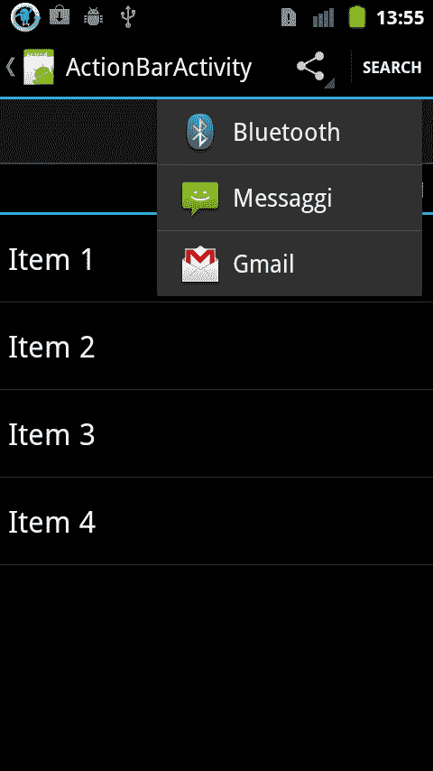

### 上下文操作栏

对特定元素（如列表项）进行简单快速操作的需求（例如，删除一个联系人）或将选定的文本复制到剪贴板，使得使用上下文操作栏变得很有用。操作栏的外观会发生变化，以便显示所需操作的特定菜单项。

现在，让我们看看如何向你的应用程序添加带有两个操作项的上下文操作栏：

1.  导入所有必要的库：

    ```kt
    import com.actionbarsherlock.app.SherlockFragmentActivity;
    import com.actionbarsherlock.view.ActionMode;
    ```

1.  实现`ActionMode`类的`Callback`接口；它将管理上下文菜单的生命周期：

    ```kt
    private ActionMode.Callback mActionModeCallback = new ActionMode.Callback() {

        // Called after startActionMode()
        @Override
        public boolean onCreateActionMode(ActionMode mode, Menu menu) {
        // Inflate a menu resource providing context menu items
        MenuInflater inflater = mode.getMenuInflater();
        inflater.inflate(R.menu.context_menu, menu);
        return true;
      }

      // Called each time the action mode is shown. Always called after onCreateActionMode, but
      // may be called multiple times if the mode is invalidated.
      @Override
      public boolean onPrepareActionMode(ActionMode mode, Menu menu) {
        return false; // Return false if nothing is done
      }

      // Called when the user selects a contextual menu item
      @Override
      public boolean onActionItemClicked(ActionMode mode, MenuItem item) {
        switch (item.getItemId()) {
          case R.id.action_1:
          mode.finish(); // Action picked, so close the CAB
          return true;
          default:
          return false;
        }
      }

      // Called when the user exits the action mode
      @Override
      public void onDestroyActionMode(ActionMode mode) {
      }
    };
    ```

1.  在所需的元素上附加一个监听器，该监听器将激活操作模式（在这个例子中，我们将它附加到列表项的`click`事件上）：

    ```kt
      getListView().setOnItemClickListener(new AdapterView.OnItemClickListener() {
        @Override
        public void onItemClick(AdapterView<?>parent, View view, int position, long id) {
          if (mActionMode != null) {
            return;
          }

        // Start the CAB using the ActionMode.Callback defined above
        ActionBarActivity.this.startActionMode(mActionModeCallback);
        view.setSelected(true);
        }
      });
    ```

1.  在 XML 文件中，像普通菜单一样定义上下文菜单布局：

    ```kt
    <?xml version="1.0" encoding="utf-8"?>
    <menu >
        <item android:id="@+id/action_1"
              android:title="Action 1" />
        <item android:id="@+id/action_2"
              android:title="Action 2" />
    </menu>
    ```

下面的屏幕截图显示了上下文菜单将如何出现：


请记住，**确定**按钮（栏中最左边的按钮）只是关闭上下文操作栏，系统会自动为你添加它。

这种机制的明显扩展是可以选择多个元素并对它们进行操作。这个功能是存在的，可能从 Honeycomb 开始，使用`AbsListView`类中的`MultiChoiceModeListener`接口。唯一的问题是它与`ActionBarSherlock`不兼容，因此如原始 Android 文档所暗示的，最好是退回到浮动上下文菜单。

### ViewPagerIndicator

让我们解释如何为你的应用程序创建一个更有趣的视觉布局，例如，我们经常看到的“滑动标签”UI 模式，在 Android Market 中使用。

这种 UI 模式允许用户通过简单的左右滑动，并在标签跟随滑动动作时显示标题，来在应用程序的各个部分之间切换（关于这种设计的更多技术信息，我建议你阅读一位 Android Market 设计师在[`www.pushing-pixels.org/2011/08/11/android-tips-and-tricks-swipey-tabs.html`](http://www.pushing-pixels.org/2011/08/11/android-tips-and-tricks-swipey-tabs.html)的帖子）。

为了实现这一点，我们需要从该项目的网页[`viewpagerindicator.com/`](http://viewpagerindicator.com/)下载另一个库。

将此库添加到我们项目的步骤与本章开始时显示的步骤相同。只需记住，库的路径是你提取它的位置。

现在，我们准备将`ViewPageIndicator`添加到你的应用程序中：

1.  导入正确的类：

    ```kt
    import com.actionbarsherlock.app.SherlockFragmentActivity;
    import com.actionbarsherlock.app.ActionBar;
    import android.support.v4.view.ViewPager;
    import com.viewpagerindicator.TitlePageIndicator;
    ```

1.  创建一个继承自`SherlockFragmentActivity`并实现`TabListener`接口的 Activity 类：

    ```kt
    public class ActionBarActivity extends SherlockFragmentActivity implements ActionBar.TabListener {
    …
    }
    ```

1.  在`onCreate()`方法中实现设置布局和配置 ActionBar；由于我们正在创建一个以标签驱动的应用程序，因此需要将导航模式设置为`NAVIGATION_MODE_TABS`：

    ```kt
      @Override
      public void onCreate(Bundle savedInstanceState) {
        super.onCreate(savedInstanceState);
        setContentView(R.layout.main);

        ActionBar ab = getSupportActionBar();
        ab.setNavigationMode(ActionBar.NAVIGATION_MODE_TABS);

        ViewPager pager = (ViewPager)findViewById(R.id.pager);
        pager.setAdapter(new TabsAdapter(getSupportFragmentManager()));

        //Bind the title indicator to the adapter
        TitlePageIndicator titleIndicator = (TitlePageIndicator)findViewById(R.id.titles);
        titleIndicator.setViewPager(pager);
      }
    ```

1.  创建一个 `FragmentPageAdapter` 类的子类，它将每个标签绑定到一个特定的片段（这里我们使用了一个名为 `DummyFragment` 的独特片段类，未实现，仅显示简单文本）：

    ```kt
      public class TabsAdapter extends FragmentPagerAdapter {
        public TabsAdapter(FragmentManager fm) {
          super(fm);
        }

        @Override
        public Fragment getItem(int position) {
          return new DummyFragment();
        }

        @Override
        public int getCount() {
          return 3;
        }

        @Override
        public CharSequence getPageTitle(int position) {
          return "Page " + position;
        }

      }
    ```

1.  在 Activity 类中实现 `TabListener` 接口，以响应将在标签上发生的事件：

    ```kt
      /*
      * TabListener interface's methods
      */
      public void onTabReselected(ActionBar.Tab tab, FragmentTransaction ft) {
      // User selected the already selected tab. Usually do nothing.
      }

      public void onTabUnselected(ActionBar.Tab tab, FragmentTransaction ft) {
      }

      public void onTabSelected(ActionBar.Tab tab, FragmentTransaction ft) {
      }
    ```

1.  定义一个使用 `TitlePageIndicator` 的布局（仔细检查用作标签的完全限定名称是否正确输入）：

    ```kt
    <?xml version="1.0" encoding="utf-8"?>
    <LinearLayout 
        android:orientation="vertical"
        android:layout_width="fill_parent"
        android:layout_height="fill_parent"
        >
        <com.viewpagerindicator.TitlePageIndicator
            android:id="@+id/titles"
            android:layout_height="wrap_content"
            android:layout_width="fill_parent" />
    <android.support.v4.view.ViewPager
        android:id="@+id/pager"
        android:layout_width="fill_parent"
        android:layout_height="wrap_content"
        />
    </LinearLayout>
    ```

我们得到的应用程序是将 `ViewPager` 类提供的不同片段插入到每个标签中，每个标签一个，而 `TitlePagerIndicator` 类在标签间切换时为我们提供了一个视觉特效。以下屏幕截图显示了标签部分在我们的应用程序中的外观（显然，无法在纸上展示动画）：


