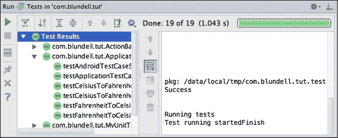
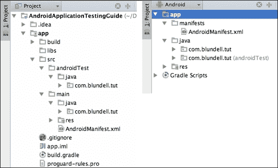
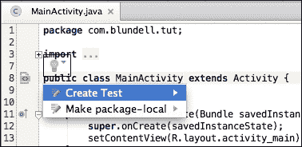

# 第一章。开始测试

首先，我会避免介绍安卓，因为它已经在很多书里介绍过了，我倾向于相信，如果你正在读一本涵盖这个更高级主题的书，你将已经开始安卓开发了。

我将回顾测试背后的主要概念，以及在安卓上部署测试策略可用的技术、框架和工具。

在这个概述之后，我们可以将学到的概念付诸实践。在本章中，我们将介绍:

*   设置在安卓系统上测试的基础设施
*   使用 JUnit 运行单元测试
*   创建安卓仪器测试项目
*   运行多个测试

我们将创建一个简单的安卓项目及其配套测试。主要的项目将是基本的，这样你可以集中精力测试组件。

我建议没有安卓测试经验的新开发人员阅读这本书。如果你对安卓项目有更多的经验，并且一直在使用测试技术，你可能会把这一章看作是对概念的修订或重申。

# 为什么、什么、如何、何时测试？

你要明白，早期的 bug 检测节省了大量的项目资源，降低了软件维护成本。这是为您的软件开发项目编写测试的最著名的原因。生产率的提高将很快显现出来。

另外，写作测试会让你对需求和需要解决的问题有更深的理解。你将无法为一个你不理解的软件编写测试。

这也是编写测试以清楚地理解遗留或第三方代码并拥有测试基础设施来自信地更改或更新代码库的方法背后的原因。

测试覆盖的代码越多，发现隐藏 bug 的可能性就越高。

如果在这个覆盖分析过程中，您发现您的代码的某些部分没有被执行，那么应该添加额外的测试来覆盖这个代码。

要在这个请求中提供帮助，请输入 Jacoco([http://www.eclemma.org/jacoco/](http://www.eclemma.org/jacoco/)，一个测量和报告 Java 代码覆盖率的开源工具包。它支持各种覆盖类型，如下所示:

*   班级
*   方法
*   街区
*   线条

覆盖率报告也可以以不同的输出格式获得。Jacoco 在某种程度上受到安卓框架的支持，可以构建一个 Jacoco 仪表化版本的安卓应用。

我们将在[第 9 章](9.html#page "Chapter 9. Alternative Testing Tactics")、*替代测试策略*中分析 Jacoco 在 Android 上的使用，以指导我们对代码进行全面测试。

此屏幕截图显示了 Jacoco 代码覆盖率报告如何显示为一个 HTML 文件，该文件在代码经过测试后显示绿色线条:


默认情况下，安卓工作室不支持 Jacoco gradle 插件；因此，您无法在 IDE 中看到代码覆盖率，因此代码覆盖率必须被视为单独的 HTML 报告。其他插件也有其他选择，比如亚特兰蒂斯的三叶草或者带有 EclEmma 的 Eclipse。

测试应该是自动化的，并且您应该在每次对代码进行更改或添加时运行一些或所有测试，以确保之前满足的所有条件仍然满足，并且新代码满足预期的测试。

这就引出了**持续集成**的介绍，将在[第五章](5.html#page "Chapter 5. Discovering Continuous Integration")、*发现持续集成*中详细讨论，实现测试和构建过程的自动化。

如果不使用自动化测试，实际上不可能将持续集成作为开发过程的一部分，并且很难确保更改不会破坏现有的代码。

当你接触代码库时，测试可以阻止你在已经完成的特性中引入新的 bug。这些回归很容易完成，测试是这种情况发生的障碍。此外，你现在可以在编译时，也就是你在开发的时候捕捉并发现问题，而不是在你的用户开始抱怨的时候收到反馈。

## 测试什么

严格来说，您应该测试代码中的每一条语句，但这也取决于不同的标准，可以简化为测试执行的主要路径或者只是一些关键方法。通常情况下，不需要测试一些不能被打破的东西；例如，测试 getters 和 setters 通常是没有意义的，因为您可能不会在自己的代码上测试 Java 编译器，编译器可能已经执行了它的测试。

除了您应该测试的特定于领域的功能领域之外，您还应该考虑安卓应用的其他一些领域。我们将在下面的章节中研究这些。

### 活动生命周期事件

您应该测试您的活动是否正确处理生命周期事件。

如果您的活动应在`onPause()`或`onDestroy()`事件期间保存其状态，并且随后能够在`onCreate(Bundle` `savedInstanceState)`中恢复该状态，则您应该能够再现和测试所有这些条件，并验证状态是否被正确保存和恢复。

还应该测试配置更改事件，因为其中一些事件会导致重新创建当前活动。您应该测试事件的处理是否正确，以及新创建的活动是否保留了以前的状态。即使设备轮换也会触发配置更改，因此您应该测试应用处理这些情况的能力。

### 数据库和文件系统操作

应该测试数据库和文件系统操作，以确保操作和任何错误都得到正确处理。这些操作应该在较低的系统级别、较高的级别通过`ContentProviders`或从应用本身进行隔离测试。

为了隔离测试这些组件，安卓在`android.test.mock`包中提供了一些模拟对象。一个简单的方法是将模拟作为真实对象的替代，在这里您可以更好地控制对象的行为。

### 设备的物理特性

在发送你的应用之前，你应该确保它可以运行的所有不同设备都被支持，或者至少你应该检测到不支持的情况并采取相关措施。

您应该测试的设备特性有:

*   网络能力
*   屏幕密度
*   屏幕分辨率
*   屏幕尺寸
*   传感器的可用性
*   键盘和其他输入设备
*   全球（卫星）定位系统
*   外部存储器

在这方面，安卓仿真器可以发挥重要的作用，因为实际上不可能访问所有具有所有可能的功能组合的设备，但是您可以为几乎每种情况配置仿真器。然而，如前所述，将您的最终测试留给真实用户运行应用的实际设备，这样您就可以从真实环境中获得反馈。

# 测试类型

测试在各种框架中进行，不同级别的支持来自安卓软件开发工具包和您选择的集成开发环境。目前，我们将专注于如何使用仪表化的安卓测试框架来测试安卓应用，该框架具有完整的 SDK 和 AVERAGE 支持，稍后，我们将讨论替代方案。

测试可以在开发过程中的任何时候实现，这取决于所采用的测试方法。然而，我们将在开发周期的早期阶段促进测试，甚至在完整的需求集已经被定义并且编码过程已经开始之前。

根据测试的代码，有几种类型的测试。无论其类型如何，测试都应该验证一个条件，并将该评估的结果作为指示其成功或失败的单个布尔值返回。

## 单元测试

单元测试是程序员为其他程序员编写的测试，他们应该隔离测试下的组件，并且能够以可重复的方式进行测试。这就是为什么单元测试和模拟对象通常放在一起的原因。您使用模拟对象将单元与其依赖项隔离开来，监控交互，并且能够重复测试任何次数。例如，如果您的测试从数据库中删除了一些数据，您可能不希望这些数据被实际删除，因此在下次运行测试时找不到。

JUnit 是安卓上单元测试的事实标准。这是一个用于自动化单元测试的简单开源框架，最初由 Erich Gamma 和 Kent Beck 编写。

Android 测试用例使用 JUnit 3(在即将发布的 Google 版本中，这将更改为 JUnit 4，但在撰写本文时，我们正在展示 JUnit 3 的示例)。这个版本没有注释，使用内省来检测测试。

一个典型的安卓操作的 JUnit 测试应该是这样的:

```java
public class MyUnitTestCase extends TestCase {

    public MyUnitTestCase() {
        super("testSomething");
    }

    public void testSomething() {
        fail("Test not implemented yet");
    }
}
```

### 类型

您可以从您在[http://www.packtpub.com](http://www.packtpub.com)的账户中下载您购买的所有 Packt 书籍的示例代码文件。如果您在其他地方购买了这本书，您可以访问[http://www.packtpub.com/support](http://www.packtpub.com/support)并注册，以便将文件直接通过电子邮件发送给您。

以下部分解释了可用于构建测试用例的组件。请注意，这些组件和使用测试用例的模式并不是单元测试所独有的，它们可以被部署到我们将在下面讨论的其他测试类型中。

### SEtuP()方法

调用此方法初始化夹具(夹具是测试及其周围的代码状态)。

覆盖它，您就有机会创建对象并初始化测试将使用的字段。值得注意的是，该设置发生在每次测试之前*。*

### 拆卸()方法

调用此方法来最终确定夹具。

覆盖它，您可以释放初始化或测试使用的资源。同样，这个方法在每次测试后都会被调用*。*

例如，您可以在这里释放数据库或关闭网络连接。

在你的测试方法之前和之后，你可以钩入更多的方法，但是这些方法很少被使用，当我们碰到它们的时候会解释。

### 试验方法之外

JUnit 的设计方式是一次构建整个测试实例树，然后在第二次构建中执行测试。因此，测试运行人员在测试执行期间持有对所有测试实例的强引用。这意味着，对于具有许多测试实例的非常大和非常长的测试运行，在整个测试运行之前，没有一个测试可以被垃圾收集。这在安卓系统中尤其重要，因为在有限的设备上进行测试时，除了测试超出设备限制之外，一些测试可能会失败，这不是因为固有的故障，而是因为运行应用所需的内存量。

因此，如果您在测试中分配外部或有限的资源，如`Services`或`ContentProviders`，您有责任释放这些资源。例如，在`tearDown()`方法中将一个对象显式设置为 null，允许它在整个测试运行结束之前被垃圾收集。

### 测试方法内部

所有名称以`test`开头的`public` `void`方法都将被视为测试。与 JUnit 4 相反，JUnit 3 不使用注释来发现测试；相反，它使用自省来找到他们的名字。安卓测试框架中有一些注释，比如`@SmallTest`、`@MediumTest`或者`@LargeTest`，它们不会把一个简单的方法变成一个测试，而是把它们组织成不同的类别。最终，您将能够使用测试运行程序为单个类别运行测试。

根据经验，用描述性的方式命名你的测试，并使用名词和被测试的条件。此外，记住测试异常和错误的值，而不是只测试阳性病例。

例如，一些有效的测试和命名可能是:

*   `testOnCreateValuesAreLoaded()`
*   `testGivenIllegalArgumentThenAConversionErrorIsThrown()`
*   `testConvertingInputToStringIsValid()`

在测试的执行过程中，应该将一些条件、副作用或方法返回与预期进行比较。为了简化这些操作，JUnit 提供了一套完整的`assert*`方法来比较测试的预期结果和运行后的实际结果，如果不满足条件就会抛出异常。然后，测试运行人员处理这些异常并给出结果。

这些方法被重载以支持不同的参数，包括:

*   `assertTrue()`
*   `assertFalse()`
*   `assertEquals()`
*   `assertNull()`
*   `assertNotNull()`
*   `assertSame()`
*   `assertNotSame()`
*   `fail()`

除了这些 JUnit assert 方法，Android 还在两个专门的类中扩展了 assert，提供了额外的测试:

*   `MoreAsserts`
*   `ViewAsserts`

#### 模拟物体

模拟对象是模拟对象，用于代替调用真实域对象来独立启用测试单元。

一般来说，这是为了验证是否调用了正确的方法，但是它们也有助于将您的测试与周围的代码隔离开来，并且能够独立运行测试并确保可重复性。

Android 测试框架支持模拟对象，您会发现在编写测试时非常有用。您需要提供一些依赖项来编译测试。还有在嘲讽时可以使用的外库。

`android.test.mock`包中安卓测试框架提供了几个类:

*   `MockApplication`
*   `MockContentProvider`
*   `MockContentResolver`
*   `MockContext`
*   `MockCursor`
*   `MockDialogInterface`
*   `MockPackageManager`
*   `MockResources`

几乎任何可以与您的活动交互的平台组件都可以通过实例化其中一个类来创建。

然而，它们不是真正的实现，而是存根，想法是您扩展这些类中的一个来创建一个真正的模拟对象，并覆盖您想要实现的方法。任何不覆盖的方法都会抛出`UnsupportedOperationException`。

## 整合测试

集成测试旨在测试单个组件协同工作的方式。已经独立进行单元测试的模块现在被组合在一起测试集成。

通常，安卓活动需要与系统基础设施进行一些集成才能运行。他们需要`ActivityManager`提供的活动生命周期，以及对资源、文件系统和数据库的访问。

同样的标准也适用于其他安卓组件，如`Services`或`ContentProviders`，它们需要与系统的其他部分进行交互以实现其职责。

在所有这些情况下，安卓测试框架都提供了专门的测试类，便于为这些组件创建测试。

### 用户界面测试

用户界面测试测试应用的视觉表现，例如对话框看起来如何，或者当对话框关闭时进行了哪些用户界面更改。

如果您的测试涉及到用户界面组件，应该特别注意。您可能已经知道，在安卓系统中，只有主线程才被允许改变用户界面。因此，一个特殊的注释`@UIThreadTest`被用来指示一个特定的测试应该在那个线程上运行，并且它将有能力改变用户界面。另一方面，如果您只想在 UI 线程上运行部分测试，您可以使用`Activity.runOnUiThread(Runnable` `r)`方法，该方法提供相应的`Runnable`，其中包含测试说明。

还提供了一个帮助类`TouchUtils`来帮助用户界面测试创建，允许生成以下事件发送给视图，例如:

*   点击
*   拖
*   长时间点击
*   卷起
*   轻敲，水龙头
*   触控

通过这些方法，您可以从测试中远程控制您的应用。此外，安卓最近推出了用于用户界面测试的浓缩咖啡，我们将在[第 3 章](3.html#page "Chapter 3. Baking with Testing Recipes")、*用测试食谱烘焙*中介绍这一点。

## 功能或验收测试

在敏捷软件开发中，功能或验收测试通常由业务和质量保证(QA)人员创建，并以业务领域语言表达。这些是断言用户故事或特性的完整性和正确性的高级测试。它们是通过业务客户、业务分析师、质量保证、测试人员和开发人员之间的协作来创建的。然而，业务客户(产品所有者)是这些测试的主要所有者。

一些框架和工具可以在这一领域有所帮助，比如葫芦( [http://calaba.sh](http://calaba.sh) )或者最值得注意的FitNesse([http://www.fitnesse.org](http://www.fitnesse.org))，它们在某种程度上可以很容易地集成到安卓开发过程中，并且会让你创建验收测试并检查它们的结果如下:


最近，在验收测试中，一个名为**行为驱动** **开发**的新趋势获得了一些流行，简单来说，它可以被理解为测试驱动开发的近亲。它旨在提供商业和技术人员之间的通用词汇，以增进相互了解。

行为驱动开发可以表示为基于三个原则的活动框架(更多信息可以在[http://behaviour-driven.org](http://behaviour-driven.org)找到):

*   业务和技术应该以同样的方式引用同一个系统
*   任何系统都应该对业务有一个确定的、可验证的价值
*   前期分析、设计和规划都有递减的回报

为了应用这些原则，业务人员通常会参与用高级语言编写测试用例场景，并使用诸如**j behavior**([http://jbehave.org](http://jbehave.org))之类的工具。在下面的例子中，这些场景被翻译成表达相同测试场景的 Java 代码。

### 测试用例场景

作为这种技术的说明，这里有一个过于简单的例子。

由产品所有者编写的场景如下:

```java
Given I'm using the Temperature Converter.
When I enter 100 into Celsius field.
Then I obtain 212 in Fahrenheit field.
```

它将被翻译成类似于:

```java
@Given("I am using the Temperature Converter")
public void createTemperatureConverter() {
    // do nothing this is syntactic sugar for readability
}

@When("I enter $celsius into Celsius field")
public void setCelsius(int celsius) {
    this.celsius = celsius;
}

@Then("I obtain $fahrenheit in Fahrenheit field")
public void testCelsiusToFahrenheit(int fahrenheit) {
    assertEquals(fahrenheit, 
                 TemperatureConverter.celsiusToFahrenheit(celsius));
}
```

这使得程序员和业务用户都可以说该领域的语言(在这种情况下是温度转换)，并且两者都能够将其与他们的日常工作联系起来。

## 性能测试

性能测试以可重复的方式测量组件的性能特征。如果应用的某个部分需要性能改进，最好的方法是来衡量引入变更前后的性能。

众所周知，过早优化弊大于利，因此最好清楚地了解您的更改对整体性能的影响。

安卓 2.2 中 **Dalvik JIT** 编译器的引入改变了一些在安卓开发中被广泛使用的优化模式。如今，安卓开发者网站上每一条关于性能提升的建议都有性能测试作为后盾。

## 系统测试

系统作为一个整体进行测试，并练习组件、软件和硬件之间的交互。通常，系统测试包括额外的测试类别，例如:

*   图形用户界面测试
*   烟雾测试
*   突变测试
*   性能测试
*   安装测试

### 安卓 Studio 等 IDE 支持

JUnit 完全受到 Android Studio 的支持，它让你可以创建经过测试的 Android 项目。此外，您可以在不离开集成开发环境的情况下(在某种程度上)运行测试并分析结果。

这也提供了更微妙的优势；能够从集成开发环境中运行测试允许您调试行为不正确的测试。

在下面的截图中，我们可以看到 AVERAGE 如何运行 **19 个单元测试**，耗时 1.043 秒，检测到 **0** **错误**和 **0** 故障 s。还会显示每个测试的名称及其持续时间。如果出现故障，**故障** **轨迹**会显示相关信息，如下图截图所示:



使用安卓开发工具插件的 Eclipse IDE 中也有安卓支持。

即使您不是在 IDE 中开发，也可以找到用 gradle 运行测试的支持(如果您不熟悉这个工具，请查看[http://gradle.org](http://gradle.org))。使用命令 `gradle connectedAndroidTest`运行测试。这将在连接的安卓设备上安装和运行调试版本的测试。

这其实和安卓工作室在引擎盖下使用的方法是一样的。尽管进行了选择性编译，但 average 将只运行 Gradle 命令来构建项目和运行测试。

# Java 测试框架

Java 测试框架是 Android 测试的中坚力量，有时候，你不用写 Android 特有的代码就可以脱身。这可能是一件好事，因为当我们继续我们的测试探索时，你会注意到我们将安卓框架测试部署到一个设备上，这影响了我们测试的速度，也就是说，我们从通过或失败中获得反馈的速度。

如果你以一种聪明的方式设计你的应用，你可以创建纯 Java 类，这些类可以在远离安卓的情况下进行测试。这样做的两个主要好处是提高了测试结果的反馈速度，而且，为了快速地将库和代码片段组合在一起以创建强大的测试套件，您可以利用其他程序员近十年的 Java 测试经验。

# 安卓测试框架

安卓提供了一个非常先进的测试框架，它扩展了行业标准的 JUnit 库，具有适合实现我们之前提到的所有测试策略和类型的特定特性。在某些情况下，需要额外的工具，但是在大多数情况下，这些工具的集成是简单明了的。

安卓测试环境最相关的关键特性包括:

*   JUnit 框架的安卓扩展，提供对安卓系统对象的访问
*   一个让测试控制和检查应用的工具框架
*   常用安卓系统对象的模拟版本
*   运行单一测试或测试套件的工具，有或没有仪器
*   支持在安卓工作室和命令行管理测试和测试项目

## 仪器仪表

仪器框架是测试框架的基础。仪器控制测试中的应用，并允许注入应用运行所需的模拟组件。例如，您可以在应用启动之前创建模拟上下文，并让应用使用它。

使用这种方法可以控制应用与周围环境的所有交互。您还可以将您的应用隔离在一个受限的环境中，以便能够预测强制某些方法返回值的结果，或者模拟`ContentProvider's`数据库甚至文件系统内容的持久不变数据的结果。

一个标准的安卓项目在一个名为`androidTest`的相关源文件夹中进行测试。这将创建一个单独的应用，在您的应用上运行测试。这里没有`AndroidManifest`，因为是自动生成的。仪器可以在你的`build.gradle`文件的安卓关闭中定制，这些变化反映在自动生成的`AndroidManifest`中。但是，如果选择不做任何更改，您仍然可以使用默认设置运行测试。

您可以更改的内容包括测试应用包名称、测试运行程序或如何切换性能测试功能:

```java
  testApplicationId "com.blundell.something.non.default"
  testInstrumentationRunner  "com.blundell.tut.CustomTestRunner"
  testHandleProfiling false
  testFunctionalTest true
  testCoverageEnabled true
```

这里，仪表包(`testApplicationId`)是主应用的不同包。如果您自己不更改，它将默认为添加了`.test`后缀的主应用包。

然后，声明 Instrumentation 测试运行器，如果您创建自定义注释以允许特殊行为，这将很有帮助；例如，每个测试在失败时运行两次。在不声明流道的情况下，使用默认的自定义流道`android.test.InstrumentationTestRunner`。

目前，`testHandleProfiling`和`testFunctionalTest`没有记录，也没有使用，所以当我们被告知如何处理这些时要小心。将`testCoverageEnabled`设置为真将允许您使用 Jacoco 收集代码覆盖率报告。我们稍后再谈这个。

此外，请注意，正在测试的应用和测试本身都是安装了相应 apk 的安卓应用。在内部，他们将共享相同的过程，因此可以访问相同的功能集。

当你运行一个测试应用时，**Activity****Manager**([http://developer . Android . com/intl/de/reference/Android/app/Activity Manager . html](http://developer.android.com/intl/de/reference/android/app/ActivityManager.html))使用插装框架启动和控制测试运行器，测试运行器反过来又使用插装关闭主应用的任何运行实例，启动测试应用，然后在相同的过程中启动主应用。这允许测试应用的各个方面直接与主应用一起工作。

## 【T0 度】

Gradle 是一个高级构建工具包，允许您管理依赖关系和定义自定义登录来构建您的项目。安卓构建的系统是在 Gradle 之上的一个插件，这给了你之前讨论的特定领域语言，比如设置`testInstrumentationRunner`。

使用 Gradle 的想法是，它允许您从命令行为机器构建您的安卓应用，而无需使用集成开发环境，如连续集成机器。此外，通过将 Gradle 第一次集成到 Android 工作室的项目构建中，您可以从 IDE 或命令行获得完全相同的定制构建配置。

其他好处包括能够定制和扩展构建过程；例如，每次您的 CI 构建您的项目时，您可以自动将测试版 APK 上传到 Google play 商店。您可以使用同一个项目创建多个具有不同功能的 apk，例如，一个版本针对应用购买中的GooglePlay，另一个版本针对亚马逊应用商店的硬币支付。

Gradle 和 Android Gradle 插件构成了一个强大的组合，因此，我们将在本书的其余示例中使用这个构建框架。

## 测试目标

在开发项目的发展过程中，您的测试将针对不同的设备。从仿真器上的简单性、灵活性和测试速度，到您打算在其上运行应用的特定设备上不可避免的最终测试，您应该能够在所有这些设备上运行应用。

还有一些中间情况，比如在本地 JVM 虚拟机上、开发计算机上、或**达尔维克**虚拟机或 Activity 上运行测试，这取决于具体情况。

每个案例都有它的优点和缺点，但好消息是你有所有这些可供选择的方法来运行你的测试。

模拟器可能是最强大的目标，因为您可以修改其配置中的几乎每个参数，以模拟不同的测试条件。最终，您的应用应该能够处理所有这些情况，因此提前发现问题比应用交付时要好得多。

真实设备是性能测试的要求，因为从模拟设备推断性能测量值有些困难。只有在使用真实设备时，您才会享受到真实的用户体验。在交付应用之前，应该测试渲染、滚动、抛出和其他情况。

# 创建安卓项目

我们将创建一个新的安卓项目。这是通过转到**文件** | **新项目**从“一旁”菜单完成的。这将引导我们通过所见即所得指南来创建一个项目。

在这种特殊情况下，我们使用以下值作为所需的组件名称(点击屏幕之间的**下一步**按钮):

*   应用名称:安卓应用测试指南
*   公司域名:blundell.com
*   外形:手机和平板电脑
*   最低软件开发工具包:17
*   添加活动:空白活动(使用默认名称)

下面的截图显示了表单编辑器的开始，供参考:


当您点击**完成**并创建应用时，它会自动在`app/src`目录下生成`androidTest`源文件夹，在这里您可以添加您的测试用例。

### 类型

或者，要为现有的 Gradle Android 项目创建 androidTest 文件夹，您可以选择 src 文件夹，然后转到**文件** | **新建** | **目录**。然后，在对话框提示中写入`androidTest/java`。当项目重建时，路径将自动添加，以便您可以创建测试。

## 包浏览器

创建我们的项目后，项目视图应该看起来像下面截图中显示的图像之一。这是因为 AVERAGE 有多种显示项目大纲的方式。在左边，我们可以注意到两个源目录的存在，一个是测试源的绿色，另一个是项目源的蓝色。在右边，我们有新的安卓项目视图，它试图通过压缩无用的和合并功能相似的文件夹来简化层次结构。

现在我们已经建立了基本的基础设施，是时候开始添加一些测试了，如下图所示:



现在没有什么可以测试的，但是当我们建立测试驱动开发规程的基础时，我们添加了一个虚拟测试来熟悉这项技术。

您的`AndroidApplicationTestingGuide`项目中的`src/androidTest/java`文件夹是添加测试的最佳位置。如果你真的想的话，你可以声明一个不同的文件夹，但是我们坚持默认设置。包装应与被测部件对应的包装相同。

现在，我们不关注测试的内容，而是关注这些测试的概念和位置。

## 创建测试用例

如前所述，我们正在项目的`src/androidTest/java`文件夹中创建我们的测试用例。

您可以通过右键单击包并选择新建来手动创建文件...| Java 类。然而，在这种特殊的情况下，我们将利用 AVERAGE 来创建我们的 JUnit 测试用例。打开被测类(本例中为 MainActivity)，将鼠标悬停在类名上，直到看到一个灯泡(或按下*Ctrl*/*Command*+`1`)。从出现的菜单中选择**创建测试**。



这些是我们在创建测试用例时应该输入的值:

*   **测试库** : JUnit 3
*   **类名称** : MainActivityTest
*   **超类** : junit.framework.TestCase
*   **目的地套餐** : com.blundell.tut
*   **超类** : junit.framework.TestCase
*   **生成**:不选择

在输入所有需要的值后，我们的 JUnit 测试用例创建对话框将如下所示。

正如您所看到的，您也可以检查类的一个方法来生成一个空的测试方法存根。这些存根方法在某些情况下可能有用，但是您必须考虑测试应该是行为驱动的过程，而不是方法驱动的过程。


我们测试的基础设施已经到位；剩下的就是添加一个虚拟测试，以验证一切都按预期进行。我们现在有了一个测试用例模板，所以下一步是开始完成它来满足我们的需求。为此，打开最近创建的测试类并添加`testSomething()`测试。

我们应该有这样的东西:

```java
package com.blundell.tut;

import android.test.suitebuilder.annotation.SmallTest;

import junit.framework.TestCase;

public class MainActivityTest extends TestCase {

    public MainActivityTest() {
        super("MainActivityTest");
    }

    @SmallTest
    public void testSomething() throws Exception {
        fail("Not implemented yet");
    }
}
```

### 类型

从命令行运行特定的测试需要无参数构造函数，稍后将使用 am instrumentation 进行解释。

该测试将始终失败，提示信息:**未** 执行**尚未**。为了做到这一点，我们将使用来自`junit.framework.Assert`类的 fail 方法，该方法使用给定的消息使测试失败。

## 测试注释

仔细观察测试定义，你可能会注意到我们使用`@SmallTest`注释来修饰测试，这是一种组织或分类我们的测试并分别运行它们的方法。

测试还可以使用其他注释，例如:

<colgroup class="calibre15"><col class="calibre16"> <col class="calibre16"></colgroup> 
| 

注释

 | 

描述

 |
| --- | --- |
| `@SmallTest` | 标记一个测试，该测试应该作为小测试的一部分运行。 |
| `@MediumTest` | 将标记为应作为中等测试的一部分运行的测试。 |
| `@LargeTest` | 标记一个测试，该测试应该作为大型测试的一部分运行。 |
| `@Smoke` | 标记测试，该测试应作为烟雾测试的一部分运行。`android.test.suitebuilder.SmokeTestSuiteBuilder`将使用该注释运行所有测试。 |
| `@FlakyTest` | 在`InstrumentationTestCase`类的测试方法中使用这个注释。当出现这种情况时，如果测试失败，则重新执行测试方法。执行总数由公差指定，默认为 1。这对于可能因随时间变化的外部条件而失败的测试非常有用。例如，要指定公差为 4，您可以用:`@FlakyTest(tolerance=4)`注释您的测试。 |
| `@UIThreadTest` | 在`InstrumentationTestCase`类的测试方法中使用这个注释。当这种情况出现时，测试方法在应用的主线程(或用户界面线程)上执行。由于检测方法可能不会在该注释出现时使用，因此如果您需要修改用户界面并访问同一测试中的检测，还可以使用其他技术。在这种情况下，您可以求助于`Activity.runOnUIThread()`方法，该方法允许您创建任何 Runnable，并从您的测试中在 UI 线程中运行它:

```java
mActivity.runOnUIThread(new Runnable() {
public void run() {
// do somethings
}
});
```

 |
| `@Suppress` | 在不应该包含在测试套件中的测试类或测试方法上使用这个注释。这个注释可以在类级别使用，在类级别，该类中没有任何方法包含在测试套件中，或者在方法级别，只排除一个方法或一组方法。 |

现在我们已经准备好了测试，是时候运行它们了，这就是我们接下来要做的。

## 运行测试

运行我们的测试有几种方式，我们在这里分析一下。

此外，正如前面关于注释的部分所提到的，测试可以根据情况进行分组或分类并一起运行。

### 运行安卓工作室的所有测试

如果您采用了作为开发环境，这可能是最简单的方法。这将运行包中的所有测试。

选择项目中的应用模块，然后进入**运行** | **(安卓图标)所有测试**。

如果没有找到合适的设备或仿真器，将要求您启动或连接一个。

然后运行测试，结果显示在运行透视图中，如下图所示:


在安卓 DDMS 视角下的 LogCat 视图中，还可以获得执行过程中产生的结果和消息的更详细视图，如下图所示:


### 从您的 IDE 运行单个测试用例

如果需要的话，有一个选项可以从 There 运行单个测试用例。打开测试所在的文件，右键点击想要运行的方法名，就像运行所有测试一样，选择**运行** | **(安卓图标)测试方法名**。

当您运行这个测试时，通常只会执行这个测试。在我们的例子中，我们只有一个测试，所以结果将类似于前面展示的截图。

### 注

像这样运行一个测试是一个快捷方式，它实际上为您创建了一个特定于该方法的运行配置。如果你想了解详情，从菜单中选择**运行** | **编辑配置**，在**安卓测试**下，你应该可以看到一个带有你刚刚执行的测试名称的配置。

### 从模拟器运行

模拟器使用的默认系统映像安装了开发工具应用，提供了几个方便的工具和设置。在这些工具中，我们可以找到一个相当长的列表，如下图所示:


现在，我们对**仪器**感兴趣，这是运行我们测试的方式。该应用列出了所有已安装的包，这些包定义了项目中的检测标记测试。我们可以通过基于包名选择测试来运行测试，如下图所示:


当测试以这种方式运行时，结果可以通过 DDMS / LogCat 看到，如前一节所述。

### 从命令行运行测试

最后，测试也可以从命令行运行。如果您想要自动化或编写流程脚本，这非常有用。

为了运行测试，我们使用 am 仪器命令(严格来说，am 命令和仪器子命令)，这允许我们运行指定包名和一些其他选项的仪器。

你可能想知道“am”代表什么。它是 Activity Manager 的缩写，Activity Manager 是系统服务器在启动过程开始时启动的内部 Android 基础架构的主要组件，负责管理活动及其生命周期。此外，正如我们在这里看到的，它还负责活动检测。

am 仪器命令的一般用法是:

```java
am instrument [flags] <COMPONENT> -r -e <NAME> <VALUE> -p <FILE>-w

```

下表总结了最常见的选项:

<colgroup class="calibre15"><col class="calibre16"> <col class="calibre16"></colgroup> 
| 

[计]选项

 | 

描述

 |
| --- | --- |
| `-r` | 打印原始结果。这对于收集原始性能数据非常有用。 |
| `-e <NAME> <VALUE>` | 按名称设置参数。我们将很快检查它的用法。这是一个通用选项参数，允许我们设置`<name, value>`对。 |
| `-p <FILE>` | 将分析数据写入外部文件。 |
| `-w` | 退出前等待仪器完成。这通常用在命令中。虽然不是强制性的，但它非常方便，否则，您将无法看到测试结果。 |

要调用 am 命令，我们将使用 adb shell 命令，或者，如果您已经有一个运行在模拟器或设备上的 shell，您可以直接在 shell 命令提示符下发出 am 命令。

### 运行所有测试

该命令行将打开 adb shell，然后运行除性能测试以外的所有测试:

```java
$: adb shell 
#: am instrument -w com.blundell.tut.test/android.test.InstrumentationTestRunner

com.blundell.tut.MainActivityTest:

```

`testSomething`故障:

```java
junit.framework.AssertionFailedError: Not implemented yet

at com.blundell.tut.MainActivityTest.testSomething(MainActivityTest.java:15)
at java.lang.reflect.Method.invokeNative(Native Method)
at android.test.AndroidTestRunner.runTest(AndroidTestRunner.java:191)
at android.test.AndroidTestRunner.runTest(AndroidTestRunner.java:176)
at android.test.InstrumentationTestRunner.onStart
 (InstrumentationTestRunner.java:554)
at android.app.Instrumentation$InstrumentationThread.run
 (Instrumentation.java:1701)

Test results for InstrumentationTestRunner=.F
Time: 0.002

FAILURES!!!
Tests run: 1,  Failures: 1,  Errors: 0

```

注意你用`–w`声明的包是你的仪器测试的包，不是被测应用的包。

### 从特定的测试用例运行测试

要运行特定测试用例中的所有测试，您可以使用:

```java
$: adb shell 
#: am instrument -w -e class com.blundell.tut.MainActivityTest com.blundell.tut.test/android.test.InstrumentationTestRunner

```

### 按名称运行特定测试

此外，我们可以选择在命令行中指定要运行的测试:

```java
$: adb shell 
#: am instrument -w -e class com.blundell.tut.MainActivityTest\#testSomething com.blundell.tut.test/android.test.InstrumentationTestRunner

```

这个测试不能以这种方式运行，除非我们的测试用例中有一个无参数构造函数；这就是我们之前添加它的原因。

### 按类别运行特定测试

如前所述，可以使用注释(Test Annotations)将测试分成不同的类别，您可以运行该类别中的所有测试。

可以将以下选项添加到命令行:

<colgroup class="calibre15"><col class="calibre16"> <col class="calibre16"></colgroup> 
| 

[计]选项

 | 

描述

 |
| --- | --- |
| `-e unit true` | 这个运行所有的单元测试。这些不是从`InstrumentationTestCase`衍生出来的测试(不是性能测试)。 |
| `-e func true` | 这个运行所有功能测试。这些是从`InstrumentationTestCase`衍生出来的测试。 |
| `-e perf true` | 这包括性能测试。 |
| `-e size {small &#124; medium &#124; large}` | 该根据添加到测试中的注释运行小型、中型或大型测试。 |
| `-e annotation <annotation-name>` | 这个运行用这个注释注释的测试。此选项与大小选项互斥。 |

在我们的例子中，我们用`@SmallTest`注释了测试方法`testSomething()`。所以这个测试被认为是在那个类别中，因此当我们指定测试大小为小的时候，它最终会和属于那个类别的其他测试一起运行。

该命令行将运行所有注释为`@SmallTest`的测试:

```java
$: adb shell 
#: am instrument -w -e size small com.blundell.tut.test/android.test.InstrumentationTestRunner

```

### 使用 Gradle 运行测试

您的 gradle build 脚本也可以帮助您运行测试，并且这个实际上会在引擎盖下执行前面的命令。Gradle 可以使用以下命令运行您的测试:

```java
gradle connectedAndroidTest

```

#### 创建自定义注释

如果您决定根据大小以外的标准对测试进行排序，可以创建自定义注释，然后在命令行中指定。

举个例子，假设我们想根据测试的重要性来安排测试，所以我们创建了一个注释`@VeryImportantTest`，我们将在我们编写测试的任何类中使用它(例如`MainActivityTest`):

```java
package com.blundell.tut;

/**
 * Marker interface to segregate important tests
 */
@Retention(RetentionPolicy.RUNTIME)
public @interface VeryImportantTest {
}
```

接下来，我们可以创建另一个测试并用`@VeryImportantTest`进行注释:

```java
@VeryImportantTest
public void testOtherStuff() {
fail("Also not implemented yet");
}
```

因此，正如我们之前提到的，我们可以在 am instrument 命令行中包含这个注释，以便只运行带注释的测试:

```java
$: adb shell 
#: am instrument -w -e annotation com.blundell.tut.VeryImportantTest com.blundell.tut.test/android.test. InstrumentationTestRunner

```

#### 运行性能测试

我们将在[第 8 章](8.html#page "Chapter 8. Testing and Profiling Performance")、*测试和性能分析*中查看性能测试的详细信息，但在这里，我们将介绍 am 仪器命令的可用选项。

要在测试运行中包含性能测试，您应该添加以下命令行选项:

*   `-e perf true`:这包括性能测试

#### 试运行

有时，您可能只需要知道将运行什么测试，而不是实际运行它们。

这是您需要添加到命令行的选项:

*   `-e log true`:显示要运行的测试，而不是正在运行的测试

如果您正在围绕测试编写脚本，或者可能正在构建其他工具，这将非常有用。

## 调试测试

你应该假设你的测试也可能有 bug。在这样的情况下，通常的调试技术适用，例如，通过 LogCat 添加消息。

如果需要更复杂的调试技术，应该将调试器附加到测试运行程序上。

为了做到这一点而不放弃 IDE 的便利性，也不需要记住难以记忆的命令行选项，您可以**调试运行**您的运行配置。因此，您可以在测试中设置断点并使用它。要切换断点，您可以在编辑器中选择所需的行，然后在空白处单击鼠标左键。

完成后，您将处于标准调试会话中，调试窗口应该可供您使用。

也可以从命令行调试您的测试；您可以使用代码指令等待调试器附加。我们不会使用这个命令；如果你想了解更多细节，可以在([http://developer . Android . com/reference/Android/test/instrumentationtestrunner . html](http://developer.android.com/reference/android/test/InstrumentationTestRunner.html))找到。

## 其他命令行选项

am 仪器命令接受除前面提到的以外的其他`<name, value>`对:

<colgroup class="calibre15"><col class="calibre16"> <col class="calibre16"></colgroup> 
| 

名字

 | 

价值

 |
| --- | --- |
| `debug` | `true`。在代码中设置断点。 |
| `package` | 这是测试应用中一个或几个包的完全限定的包名。 |
| `class` | 由测试运行人员执行的完全合格的测试用例类。可选地，这可以包括由散列(#)与类名分开的测试方法名。 |
| `coverage` | `true`。运行 EMMA 代码覆盖并将输出写入一个也可以指定的文件。我们将在[第 9 章](9.html#page "Chapter 9. Alternative Testing Tactics")、*备选测试策略*中深入探讨支持测试的 EMMA 代码覆盖的细节。 |

# 总结

我们已经回顾了安卓测试背后的主要技术和工具。掌握了这些知识，它将让我们开始我们的旅程，这样我们就可以开始在我们的软件开发项目中利用测试的好处。

到目前为止，我们已经访问了以下主题:

*   我们简要分析了测试的原因、内容、方式和时间。从今以后，我们将更加专注于探索方法，现在你给予了测试应有的重视。
*   我们列举了您在项目中需要的不同且最常见的测试类型，描述了我们可以依赖的一些工具，并提供了一个 JUnit 单元测试的介绍性示例，以更好地理解我们正在讨论的内容。
*   我们还用测试创建了我们的第一个安卓项目，使用了安卓工作室集成开发环境和 Gradle。
*   我们还创建了一个简单的测试类来测试我们项目中的活动。我们还没有添加任何有用的测试用例，但是添加那些简单的测试用例是为了验证我们的基础设施。
*   我们还从集成开发环境和命令行运行了这个简单的测试，以了解我们拥有的替代方案。在这个过程中，我们提到了活动管理器及其命令行化身 am。
*   我们创建了一个定制的注释来对我们的测试进行排序，并演示如何分离或区分测试套件。

在下一章中，我们将开始更详细地分析提到的技术、框架和工具，并提供它们的使用示例。