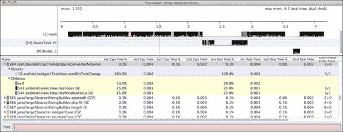
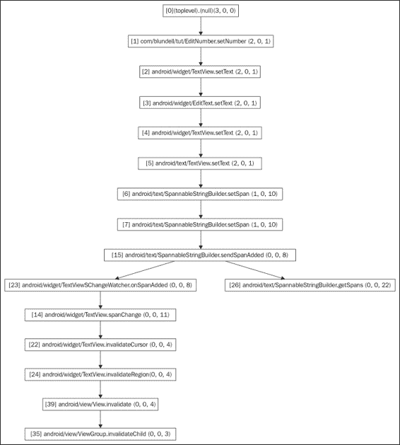
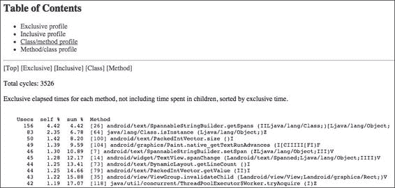

# 第八章。测试和分析性能

在前几章中，我们研究并开发了针对我们的安卓应用的测试。这些测试让我们根据一个规范来评估符合性，并允许我们通过二进制判断来确定软件是否按照这些规则正确运行，无论它是否符合绿色标准。如果所有的测试用例都通过了，这意味着我们的软件运行正常。如果其中一个测试用例失败了，软件需要修复。

在许多其他情况下，主要是在我们验证了软件符合所有这些规范之后，我们希望继续前进，并知道如何或以何种方式满足标准。同时，我们想知道系统在不同情况下的表现，以分析其他属性，如可用性、速度、响应时间和可靠性。

根据安卓开发者指南([http://developer.android.com/](http://developer.android.com/)，在设计我们的应用时，以下是最佳实践:

*   为性能而设计
*   响应性设计
*   为无缝设计

遵循这些最佳实践并从设计的一开始就考虑性能和响应性是极其重要的。由于我们的应用将在计算机能力有限的安卓设备上运行，因此一旦我们的应用构建完成，至少是部分构建完成，确定优化目标，然后应用性能测试(我们将很快讨论)可以给我们带来更大的收益。

唐纳德·克努特几年前推广了这一点:

> *“过早优化是万恶之源”。*

基于猜测、直觉甚至迷信的优化往往会在短期内干扰设计，在长期内干扰可读性和可维护性。相反，*微优化*是基于识别需要优化的瓶颈或热点，应用变化，然后再次对标评估优化的改进。因此，我们在这里关注的重点是衡量现有的性能和优化方案。

本章将介绍一系列与基准测试和分析相关的概念，如下所示:

*   传统的日志语句方法
*   创建安卓性能测试
*   使用分析工具
*   使用卡尺的微基准

# 叶老洛格法

有时候这个对于现实场景来说过于简单化了，但我并不是说在某些情况下它帮不上忙，主要是因为它的实现需要几分钟，而你只需要`logcat`文本输出来分析案例。如前几章所述，在您想要自动化过程或应用持续集成的情况下，这非常有用。

这个方法包括对一个方法(或它的一部分)计时，用两个时间度量包围它，并在最后记录差异:

```java
private static final boolean BENCHMARK_TEMPERATURE_CONVERSION = true;

@Override
public void onTextChanged(CharSequence input, int start, int before, int count) {
if (!destinationEditNumber.hasWindowFocus() 
  || destinationEditNumber.hasFocus() || input == null) {
     return;
}

String str = input.toString();
if ("".equals(str)) {
    destinationEditNumber.setText("");
    return;
}

long t0;
if (BENCHMARK_TEMPERATURE_CONVERSION) {
 t0 = System.currentTimeMillis();
}

try {
    double temp = Double.parseDouble(str);
    double result = (option == Option.C2F)
         ? TemperatureConverter.celsiusToFahrenheit(temp)
         : TemperatureConverter.fahrenheitToCelsius(temp);
    String resultString = String.format("%.2f", result);
    destinationEditNumber.setNumber(result);
    destinationEditNumber.setSelection(resultString.length());
} catch (NumberFormatException ignore) {
    // WARNING this is generated whilst numbers are being entered,
    // for example just a '-' 
    // so we don't want to show the error just yet
} catch (Exception e) {
    sourceEditNumber.setError("ERROR: " + e.getLocalizedMessage());
}

if (BENCHMARK_TEMPERATURE_CONVERSION) {
 long t = System.currentTimeMillis() - t0;
 Log.v(TAG, "TemperatureConversion took " + t 
 + " ms to complete.");
 }
}
```

这很简单。我们把握时代，记录差异。为此，我们使用`Log.v()`方法，运行应用时可以在 logcat 中看到输出。您可以通过将`true`或`false`设置为您在方法外部定义的`BENCHMARK_TEMPERATURE_CONVERSION`常数来控制该基准的执行。

当我们在 logcat 中将`BENCHMARK_TEMPERATURE_CONVERSION`常量设置为`true`来启动活动时，每次转换发生时，我们都会收到如下消息:

```java
TemperatureConversion took 5 ms to complete.
TemperatureConversion took 1 ms to complete.
TemperatureConversion took 5 ms to complete.

```

# 定时记录器

现在，比这个更好的是`android.util.TimingLogger`安卓类。`TimingLogger`对象可以帮助您为方法调用计时，而不必担心自己维护那些时间变量。它的准确度也比`System.currentTimeMillis()`高:

```java
private static final String TAG = "TemperatureTag";
@Override
public void onTextChanged(CharSequence input, int start, int before, int count) {
if (!destinationEditNumber.hasWindowFocus() 
|| destinationEditNumber.hasFocus() || input == null) {
           return;
        }

       String str = input.toString();
       if ("".equals(str)) {
         destinationEditNumber.setText("");
             return;
        }

 TimingLogger timings = new TimingLogger(TAG, "onTextChanged");
 timings.addSplit("starting conversion");

   try {
         double temp = Double.parseDouble(str);
  double result = (option == Option.C2F)
      ? TemperatureConverter.celsiusToFahrenheit(temp)
      : TemperatureConverter.fahrenheitToCelsius(temp);
  String resultString = String.format("%.2f", result);
         destinationEditNumber.setNumber(result);
         destinationEditNumber.setSelection(resultString.length());
} catch (NumberFormatException ignore) {
// WARNING this is generated whilst numbers are being entered,
       // for example just a '-' 
// so we don't want to show the error just yet
} catch (Exception e) {
sourceEditNumber.setError("ERROR: " + e.getLocalizedMessage());
}
timings.addSplit("finish conversion");
 timings.dumpToLog();
}
```

如果您现在启动应用，您会注意到您的日志中没有任何内容。这是因为`TimingLogger`需要您明确打开您定义的*标签*的记录。否则，方法调用将不起作用。从终端运行以下命令:

```java
adb shell setprop log.tag.TemperatureTag VERBOSE

```

### 类型

您可以使用`getprop`命令检查您的日志标签设置到什么级别:

`adb shell getprop log.tag.TemperatureTag`

您可以使用以下命令列出设备的所有其他属性:

`adb shell getprop`

现在，当我们启动应用时，每次转换完成时，我们都会收到如下消息:

```java
onTextChanged: begin
onTextChanged:      0 ms, starting conversion
onTextChanged:      2 ms, finish conversion
onTextChanged: end, 2 ms

```

您应该考虑的是，这些基准测试启用常量不应该在生产构建中启用，因为使用了其他公共常量，如`DEBUG`或`LOGD`。为了避免错误，您应该在您用于自动化构建的构建过程中集成这些常量值的验证，例如 Gradle。此外，就我个人而言，在构建交付生产之前，我会删除构建中的所有基准测试或验证日志——不是注释掉，而是删除。请记住，您总是可以在版本控制系统中、历史记录中或分支上再次找到它。

像这样记录代码执行的速度很简单，但是对于更复杂的性能问题，您可能希望使用更详细的技术，尽管更复杂。

# 安卓 SDK 中的性能测试

如果之前的添加日志语句的方法不适合你，那么从我们的应用中获取性能测试结果的方法是不同的。这就是所谓的剖析。

当运行检测代码时(就像我们的 Android 检测测试用例一样)，没有从 Android 应用获得性能测试结果的标准方法，因为 Android 测试使用的类隐藏在 Android SDK 中，并且只对系统应用可用，即作为主构建或系统映像的一部分构建的应用。这个策略对我们来说是不可用的，所以我们不会在这个方向上深入挖掘。相反，我们将关注其他可用的选择。

## 启动性能测试

这些测试基于一种类似于我们刚才讨论的方法，安卓系统使用它们来测试系统应用。这个想法是扩展`android.app.Instrumentation`来提供性能快照，自动创建一个我们甚至可以扩展来满足其他需求的框架。让我们用一个简单的例子来更好地理解这意味着什么。

### 创建启动性能基础工具

我们的第一步是扩展以提供我们需要的功能。我们正在使用一个名为`com.blundell.tut.launchperf`的新包来组织我们的测试:

```java
public class LaunchPerformanceBase extends Instrumentation {

    private static final String TAG = "LaunchPerformanceBase";

    protected Bundle results;
    protected Intent intent;

    public LaunchPerformanceBase() {
        this.results = new Bundle();
        this.intent = new Intent(Intent.ACTION_MAIN);
        this.intent.setFlags(Intent.FLAG_ACTIVITY_NEW_TASK);
        setAutomaticPerformanceSnapshots();
    }

    /**
     * Launches intent {@link #intent}, 
  * and waits for idle before returning.
     */
    protected void launchApp() {
        startActivitySync(intent);
        waitForIdleSync();
    }

    @Override
    public void finish(int resultCode, Bundle results) {
        Log.v(TAG, "Test results = " + results);
        super.finish(resultCode, results);
    }
}
```

我们在这里扩展`Instrumentation`。构造函数初始化了这个类中的两个字段:`results`和`intent`。最后，我们调用`setAutomaticPerformanceSnapshots()`方法，这是创建这个性能测试的关键。

`launchApp()`方法由负责启动所需的活动并等待返回。

`finish()`方法记录收到的结果，然后调用仪器的`finish()`。

### 创建温度转换实践运行性能类

该类设置意图调用`TemperatureConverterActivity`和提供`LaunchPerformanceBase`类提供的基础设施，以测试启动我们的活动的性能:

```java
public class TemperatureConverterActivityLaunchPerformance 
extends LaunchPerformanceBase {

    @Override
    public void onCreate(Bundle arguments) {
      super.onCreate(arguments);
      String className = "com.blundell.tut.TemperatureConverterActivity";
      intent.setClassName(BuildConfig.APPLICATION_ID, className);
      start();
    }

    @Override
    public void onStart() {
      super.onStart();
      launchApp();
      finish(Activity.RESULT_OK, results);
    }
}
```

这里，`onCreate()`按照安卓生命周期的要求调用`super.onCreate()`。然后设置意图，指定类名和包。然后调用仪器的一个方法`start()`。它创建并启动一个新线程来运行检测。这个新线程将调用`onStart()`，在这里您可以实现工具。

然后是`onStart()`执行，调用 `launchApp()`和`finish()`。

## 运行测试

为了能够运行这个测试，我们需要在`TemperatureConverter`项目的`Build.gradle`文件中定义具体的仪器。

这是我们必须添加到`app/build.gradle`中的代码片段:

```java
defaultConfig {
        // other code

        testInstrumentationRunner "com.blundell.tut.launchperf.TemperatureConverterActivityLaunchPerformance"
    }
```

一旦一切就绪，我们就可以开始运行测试了。

首先，安装包含这些更改的 APK。然后，我们有几个选项来运行测试，正如我们在前面几章中回顾的那样。在这种情况下，我们使用命令行，因为这是获取所有细节的最简单方法。如果您只连接了一台设备，请使用以下命令:

```java
$ adb shell am instrument -w com.blundell.tut.test/com.blundell.tut.launchperf.TermeratureConverterActivityLaunchPerformance

```

### 注

如果您想知道您的设备上安装了什么`Instrumentation`测试跑步者，您可以使用以下命令:

`adb shell pm list instrumentation`

我们在标准输出中收到该测试的一组结果:

```java
IINSTRUMENTATION_RESULT: other_pss=7866
INSTRUMENTATION_RESULT: global_alloc_count=4009
INSTRUMENTATION_RESULT: java_allocated=7271
INSTRUMENTATION_RESULT: execution_time=347
INSTRUMENTATION_RESULT: gc_invocation_count=0
INSTRUMENTATION_RESULT: native_pss=0
INSTRUMENTATION_RESULT: received_transactions=-1
INSTRUMENTATION_RESULT: other_shared_dirty=7128
INSTRUMENTATION_RESULT: native_shared_dirty=0
INSTRUMENTATION_RESULT: java_free=4845
INSTRUMENTATION_RESULT: java_size=12116
INSTRUMENTATION_RESULT: global_freed_size=155012
INSTRUMENTATION_RESULT: java_pss=1095
INSTRUMENTATION_RESULT: pre_sent_transactions=-1
INSTRUMENTATION_RESULT: java_private_dirty=884
INSTRUMENTATION_RESULT: pre_received_transactions=-1
INSTRUMENTATION_RESULT: other_private_dirty=6228
INSTRUMENTATION_RESULT: native_private_dirty=0
INSTRUMENTATION_RESULT: cpu_time=120
INSTRUMENTATION_RESULT: sent_transactions=-1
INSTRUMENTATION_RESULT: native_allocated=10430
INSTRUMENTATION_RESULT: java_shared_dirty=8360
INSTRUMENTATION_RESULT: global_freed_count=1949
INSTRUMENTATION_RESULT: native_free=14145
INSTRUMENTATION_RESULT: native_size=10430
INSTRUMENTATION_RESULT: global_alloc_size=372992
INSTRUMENTATION_CODE: -1
```

我们强调了我们感兴趣的两个值:`execution_time`和`cpu_time`。它们分别说明总执行时间和使用的 CPU 时间。

在仿真器上运行这个测试会增加错误测量的可能性，因为主机正在运行其他进程，这些进程也会占用 CPU，并且仿真器不一定代表一个真实硬件的性能。

不用说，在这种情况下以及任何其他测量随时间变化的事物的情况下，您应该使用测量策略并多次运行测试以获得不同的统计值，例如平均值或标准偏差。

# 使用 Traceview 和 dmtracedump 平台工具

安卓软件开发工具包在其各种工具中包括两个专门用于分析性能问题和配置文件，并潜在地确定应用优化的目标。安卓还为我们提供了 **达尔维克调试监控服务** ( **DDMS** )，将这些工具全部整理在一个地方。可以通过导航到**工具** | **安卓** | **设备监视器**或从带有命令监视器的命令行打开 DDMS。您可以使用方便的图形用户界面快捷方式在 DDMS 使用 Traceview 和其他工具。但是，在这里，我们将使用命令行选项，以便您可以理解图形用户界面背后的工具。

这些工具比其他工具有优势:通常，简单的任务不需要修改源代码。然而，对于更复杂的情况，需要一些补充，但是它们非常简单，我们很快就会看到。

如果你不需要精确的开始和停止追踪，你可以从命令行或者安卓工作室驱动它。例如，要从命令行开始跟踪，可以使用以下命令。如果您连接了多个设备，请记住添加带有`–s`的序列号:

```java
$ adb shell am start -n com.blundell.tut/.TemperatureConverterActivity
$ adb shell am profile com.blundell.tut start /mnt/sdcard/tc.trace

```

执行一些操作，例如在“摄氏度”字段中输入温度值以强制转换，然后运行以下命令:

```java
$ adb shell am profile com.blundell.tut stop
$ adb pull /mnt/sdcard/tc.trace /tmp/tc.trace
7681 KB/s (1051585 bytes in 0.133s)

$ traceview /tmp/tc.trace

```

否则，如果您需要更精确的分析开始时间，可以添加编程样式:

```java
@Override
public void onTextChanged(CharSequence input, int start, int before, int count) {
  if (!destinationEditNumber.hasWindowFocus() 
           || destinationEditNumber.hasFocus() || input == null) {
     return;
}

String str = input.toString();
if ("".equals(str)) {
   destinationEditNumber.setText("");
   return;
}

if (BENCHMARK_TEMPERATURE_CONVERSION) {
Debug.startMethodTracing();
}

try {
double temp = Double.parseDouble(str);
   double result = (option == Option.C2F)
      ? TemperatureConverter.celsiusToFahrenheit(temp) 
      : TemperatureConverter.fahrenheitToCelsius(temp);
String resultString = String.format("%.2f", result);
   destinationEditNumber.setNumber(result);
   destinationEditNumber.setSelection(resultString.length());
} catch (NumberFormatException ignore) {
// WARNING this is generated whilst numbers are being entered,
   // for example just a '-' 
// so we don't want to show the error just yet
} catch (Exception e) {
   sourceEditNumber.setError("ERROR: " + e.getLocalizedMessage());
}

 if (BENCHMARK_TEMPERATURE_CONVERSION) {
 Debug.stopMethodTracing();
 }
}
```

这将通过调用`Debug.startMethodTracing()`在 SD 卡上使用默认名称`dmtrace.trace`创建一个跟踪文件，该文件使用默认日志名称和缓冲区大小启动方法跟踪。完成后，我们打电话给`Debug.stopMethodTracing()`停止侧写。

### 注

请记住，启用概要分析确实会降低应用的执行速度，因此应该根据它们的相对权重而不是绝对值来解释结果。

为了能够写入 SD 卡，应用需要`android.permission.WRITE_EXTERNAL_STORAGE`权限才能添加到清单中。

对于使用 DDMS 的 Traceview，流通过 JDWP 连接直接发送到您的开发计算机，不需要权限。

您需要运行应用来获取跟踪文件。该文件需要拉至开发计算机使用`traceview`进行进一步分析:

```java
$ adb pull /mnt/sdcard/dmtrace.trace /tmp/dmtrace.trace
 8491 KB/s (120154 bytes in 0.013s)
$ traceview /tmp/dmtrace.trace

```

运行此命令后，将出现 traceview 的窗口，显示收集的所有信息，如下图所示:



窗口的顶部显示时间线面板和每个方法的彩色区域。时间沿着刻度向右增加。彩色行下面还有小线条，显示对所选方法的所有调用的范围。

我们分析了应用的一小部分，因此只有主线程在我们的进程中运行。在分析期间运行其他线程的情况下，也会显示此信息。例如，这表明系统执行了一个异步任务。

底部显示概要面板、执行的每个方法及其父子关系。我们称调用方法为**父母**，被调用方法为**子女**。单击时，方法会展开以显示其父级和子级。父母是紫色背景，孩子是黄色背景。

此外，以循环方式为方法选择的颜色显示在方法名称之前。

最后，在底部，有一个**查找:**字段，在这里我们可以输入一个过滤器来减少显示的信息量。例如，如果我们只对显示`com.blundell.tut`包中的方法感兴趣，我们应该输入`com/blundell/tut`。

单击一列将根据该列的升序或降序设置列表的顺序。

此表显示了可用的列及其说明:

<colgroup class="calibre15"><col class="calibre16"> <col class="calibre16"></colgroup> 
| 

圆柱

 | 

描述

 |
| --- | --- |
| 名字 | 方法的名称，包括它的包名，以我们刚才描述的形式，使用/(斜杠)作为分隔符。此外，还会显示参数和返回类型。 |
| 包括 Cpu 时间% | 方法使用的包含时间占总时间的百分比。这包括它所有的孩子。 |
| 包括 Cpu 时间 | 特定方法使用的包含时间，以毫秒为单位。这包括方法及其所有子对象。 |
| 不包括 Cpu 时间% | 方法使用的独占时间占总时间的百分比。这排除了它的所有子代。 |
| 不包括 Cpu 时间 | 独占时间，以毫秒为单位。这是在特定方法中花费的总时间。它排除了所有的孩子。 |
| 包括实时百分比 | 包含时间加上进程执行的等待时间的百分比(等待输入/输出)。 |
| 包括实时 | 包含时间加上流程执行的等待时间。 |
| 不包括实时% | 独占时间加上进程执行的等待时间的百分比(等待输入/输出)。 |
| 不包括实时 | 独占时间加上进程执行的等待时间。 |
| 呼叫+重复通话/总计 | 此列显示特定方法的调用次数和递归调用次数。与对此方法的调用总数相比的调用数。 |
| 中央处理器时间/呼叫 | 每次调用的时间，以毫秒为单位。 |

Traceview 上的最后一句话是警告:Traceview 当前禁用 JIT 编译器运行，这可能会导致 Traceview 将时间错误地分配给代码块，JIT 可能会赢回来。因此，在对 Traceview 数据进行更改后，必须确保在没有 Traceview 的情况下运行时，生成的代码实际上运行得更快。

# dmracedump

Dmtracedump 是 traceview 的替代品。它允许您使用已经收集的跟踪文件，以替代格式生成跟踪数据，包括 HTML 和调用堆栈图。后面的图是树形结构，树的每个节点代表堆栈中的一个调用。

您可以使用我们通过新命令从设备中提取的相同 traceview 文件:

```java
dmtracedump –t 40 –g dmtrace.png /tmp/dmtrace.trace 

```

运行 dmtracedump 时，如果得到**点命令未找到**错误且没有`*.png`文件输出，则表示需要安装 GraphViz。GraphViz 创建您的轨迹的可视化图形输出。你可以在[www.graphviz.org](http://www.graphviz.org)下载更多相关内容。一旦安装好了，你的错误就应该消失了。

生成的图形可能非常大，建议您传递一个详细但精确的跟踪文件，以便您的输出尽可能指向您的代码。或者，正如我们刚才所做的，您可以使用`–t`参数，以便您尝试只包含那些占用大量 CPU 时间的子节点(例如您的前台应用代码)。以下是我们输入温度转换时从跟踪中生成的图表片段:



要以 HTML 的形式查看您的跟踪数据，请运行以下命令:

```java
dmtracedump –h /tmp/dmtrace.trace > dmtrace.html

```

这种可选的 HTML 视图允许您浏览跟踪的细节并过滤每个调用的调用堆栈，其方式不同于原始 traceview GUI:



此表描述了可以与 dmtracedump 一起使用的额外的命令行参数:

<colgroup class="calibre15"><col class="calibre16"> <col class="calibre16"></colgroup> 
| 

命令

 | 

描述

 |
| --- | --- |
| `-d <trace-file-name>` | 与该跟踪文件进行比较，并打印差异。 |
| `-g <graph-out-file-name.png>` | 在此文件中生成图形。从技术上来说，它可能不会生成 PNG 图像，但是如果您将其命名为`something.png`，您可以打开文件查看图形。 |
| `-h` | 打开 HTML 输出。这将作为 HTML 代码打印在您的控制台上，因此请记住将此输出传输到一个文件，如`example.html`。 |
| `-o` | 转储跟踪文件而不是分析。 |
| `-s <trace-file-name>` | 可排序的 JavaScript 文件的位置的 URL 库(我不确定这个参数有什么用！[https://code.google.com/p/android/issues/detail?id=53468](https://code.google.com/p/android/issues/detail?id=53468)。 |
| `-t <percent>` | 在图中包含子节点的最小阈值(子节点的包含时间占父节点包含时间的百分比)。如果不使用此选项，默认阈值为 20%。 |

# 微基准

基准测试是运行计算机程序或操作的行为，以便以产生定量结果的方式比较操作，通常是通过对它们运行一组测试和试验。

基准可以分为以下两大类:

*   宏观基准
*   微基准

**macro benchmarks****的存在，是为了在处理器速度、单位时间浮点运算次数、图形和 3D 性能等特定领域对不同平台进行比较。它们通常用于硬件组件，但也可以用于测试软件特定的领域，如编译器优化或算法。**

 **与这些传统的宏基准相反，一个**微基准**试图测量一小段代码的性能，通常是一个单一的方法。在决定优化路径时，所获得的结果用于在提供相同功能的竞争实现之间进行选择。

这里的风险是微基准不同于你认为你正在测量的东西。从 2.2 版本的 Froyo 开始，这主要是在 JIT 编译器的情况下需要考虑的，就像安卓使用的那样。JIT 编译器编译和优化微基准的方式可能不同于应用中的相同代码。所以，做决定时要谨慎。

这与上一节中介绍的分析策略不同，因为这种方法不考虑整个应用，而是一次只考虑一个方法或算法。

## 卡尺微基准

**Caliper** 是谷歌的开源框架，用于编写、运行和查看微基准的结果。在 http://code.google.com/p/caliper[的](http://code.google.com/p/caliper)网站上有很多例子和教程。

卡尺在`developer.android.com`上背书，被谷歌用来衡量安卓编程语言本身的性能。我们正在这里探索它的基本用途，并将在下一章中介绍更多与安卓相关的用途。

它的中心思想是对方法进行基准测试，主要是了解它们的效率。我们可能会决定这是我们优化的目标，也许是在分析了通过 Traceview 分析应用提供的结果之后。

测径器基准使用注释来帮助您正确构建测试。基准测试的结构类似于 JUnit 测试。此前，卡尺在其惯例中反映了 JUnit3 例如，当测试必须以前缀`test`开始时，基准测试以前缀`time`开始。最新版本，就像 JUnit4 一样，JUnit 有`@Test`，卡尺用`@Benchmark`。然后，每个基准测试都接受一个 int 参数，通常命名为`reps`，指示方法内部代码基准测试的重复次数，该参数被一个计算重复次数的循环包围。

存在`setUp()`方法或`@Before`注释，并用作`@BeforeExperiment`。

### 对温度转换器进行基准测试

让我们从在我们的项目中创建一个新的 Java 模块开始。是的，这次不是安卓模块——只是 Java。

为了一致性，使用`com.blundell.tut`包装作为主包装。

在`/benchmark/build.gradle`文件中，在你的核心模块上给这个模块添加一个依赖项。这允许您访问温度转换器代码:

```java
compile project(':core').

```

另外，添加`Caliper`库作为依赖项；这是在 Maven central 上托管的。但是，在撰写本书的时候，谷歌发布的版本是 Caliper 1.0-beta-1，其中并没有包含我们刚刚讨论过的注释。我试着在 https://code.google.com/p/caliper/issues/detail?id=291 和 T2 戳他们来解决这个问题，如果你觉得有兴趣的话，就开始吧。因此，与此同时，另一个开发人员已经在他的包下向 Maven central 发布了 Caliper，以允许我们使用注释。这是您需要的导入:

```java
compile 'net.trajano.caliper:caliper:1.1.1'

```

创建包含我们的基准的`TemperatureConverterBenchmark`类:

```java
public class TemperatureConverterBenchmark {

  public static void main(String[] args) {
CaliperMain.main(CelsiusToFahrenheitBenchmark.class, args);
  }

  public static class CelsiusToFahrenheitBenchmark {

   private static final double MULTIPLIER = 10;
   @Param({"1", "10", "100"})
   int total;

   private List<Double> temperatures = new ArrayList<Double>();

   @BeforeExperiment
   public void setUp() {
      temperatures.clear();
      generateRandomTemperatures(total);
}

   private void generateRandomTemperatures(int total) {
       Random r = new Random(System.currentTimeMillis());
      for (int i = 0; i < total; i++) {
        double randomTemperature = MULTIPLIER * r.nextGaussian();
          temperatures.add(randomTemperature);
   }
   }

   @Benchmark
   public void timeCelsiusToFahrenheit(int reps) {
   for (int i = 0; i < reps; i++) {
         for (double t : temperatures) {
            TemperatureConverter.celsiusToFahrenheit(t);
         }
}
   }
   }
}
```

我们有一个类似于 JUnit 测试的`setUp()`方法，它使用`@BeforeExperiment`注释。它在运行基准之前运行。该方法初始化转换基准中使用的随机温度的集合。这个集合的大小是一个字段，在这里用`@Param`注释进行注释，以便卡尺知道它的存在。卡尺将允许我们在运行基准时提供该参数的值。然而，对于这个例子，我们给了参数一些默认值`"1", "10", "100"`。这意味着我们将至少有三个基准，一个，然后 10 个，然后 100 个温度值。

我们对伪随机温度使用高斯分布，因为这可以是用户现实的良好模型。

基准方法本身使用`@Benchmark`注释，以便卡尺可以识别和运行该方法，在这个`timeCelsiusToFahrenheit()`实例中。在这个方法中，我们循环作为方法参数传递给我们的重复次数，每次调用`TemperatureConverter.celsiusToFahrenheit()`转换，这是我们希望进行基准测试的方法。

### 运行卡尺

要运行卡尺，右键单击类，从菜单中选择并运行`TemperatureConverterBenchmark.main()`。如果您想从默认的`1, 10, 100`更改总参数，请编辑运行配置，并在程序参数字段中输入`–Dtotal=5,50,500`。

无论如何，这将运行基准测试，如果一切顺利，我们将看到结果:

```java
 Experiment selection: 
 Instruments:   [allocation, runtime]
 User parameters:   {total=[1, 10, 100]}
 Virtual machines:  [default]
 Selection type:    Full cartesian product

This selection yields 6 experiments.
Starting trial 1 of 6: {instrument=allocation, benchmarkMethod=timeCelsiusToFahrenheit, vm=default, parameters={total=1}}… Complete!
 bytes(B): min=32.00, 1st qu.=32.00, median=32.00, mean=32.00, 3rd qu.=32.00, max=32.00
 objects: min=1.00, 1st qu.=1.00, median=1.00, mean=1.00, 3rd qu.=1.00, max=1.00
….
Starting trial 6 of 6: {instrument=runtime, benchmarkMethod=timeCelsiusToFahrenheit, vm=default, parameters={total=100}}… Complete!
 runtime(ns): min=158.09, 1st qu.=159.52, median=161.16, mean=162.42, 3rd qu.=163.06, max=175.13
Execution complete: 1.420m.
Collected 81 measurements from:
 2 instrument(s)
 2 virtual machine(s)
 3 benchmark(s)
Results have been uploaded. View them at: https://microbenchmarks.appspot.com/runs/33dcd3fc-fde7-4a37-87d9-aa595b6c9224

```

为了帮助可视化这些结果，谷歌 app engine([http://microbenchmarks.appspot.com](http://microbenchmarks.appspot.com))上托管了一项服务，该服务接受您的结果数据，并让您以更好的方式可视化它。您可以在前面的输出中看到这个网址，结果已经发布。

如果您希望访问一套基准测试，或者随着时间的推移整理您的结果，您可以登录到该服务器并获得一个 API 密钥来帮助收集您的结果。一旦你获得了这个密钥，它应该放在你主目录的`~/.caliper/config.properties`文件中，下次你运行基准测试时，结果将链接到你的登录。

粘贴获得的 API 密钥后`config.properties`看起来像这个片段:

```java
# Caliper config file
# Run with --print-config to see all of the options being applied
# INSTRUMENT CONFIG
# instrument.micro.options.warmup=10s
# instrument.micro.options.timingInterval=500ms
# instrument.micro.options.reportedIntervals=7
# instrument.micro.options.maxRuntime=10s
# VM CONFIG
vm.args=-Xmx3g -Xms3g
# See the Caliper webapp to get a key so you can associate results with your account
results.upload.options.key=abc123-a123-123a-b123-a12312312
```

结果如下:


除了的运行速度，生成的网站还向您显示了用于运行测试的 JVM 的配置。蓝色和红色部分可扩展以查看更多属性，帮助您检测运行的环境何时实际影响报告的不同结果。

# 总结

在本章中，我们通过对代码进行基准测试和剖析，剖析了测试应用性能度量的可用替代方案。

本书撰写之时，安卓 SDK 应该提供的一些选项还没有提供，也没有办法实现安卓`PerformanceTestCases`，因为部分代码隐藏在 SDK 中。我们访问并分析了其他一些有效的选择。

在这些替代方案中，我们发现可以使用简单的日志语句或更复杂的代码来扩展检测。

随后，我们分析了分析备选方案，并描述和举例说明了`traceview`和`dmtracedump`的使用。

最后，你发现了卡尺，一个对安卓有本地支持的微基准测试工具。然而，我们介绍了它最基本的用法，并将更具体的安卓和达尔维克虚拟机用法推迟到下一章。

为了能够在下一章量化您的测试工作，我们将对代码执行覆盖率报告。我们还将介绍替代测试，并讨论安卓测试领域即将推出的新库和主题，希望能给你一些起点，让你在自己的测试旅程中探索和继续。**