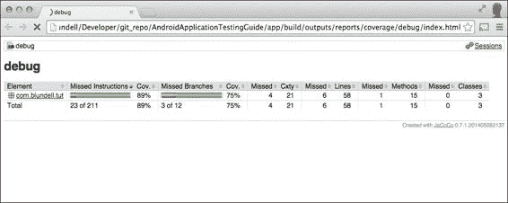
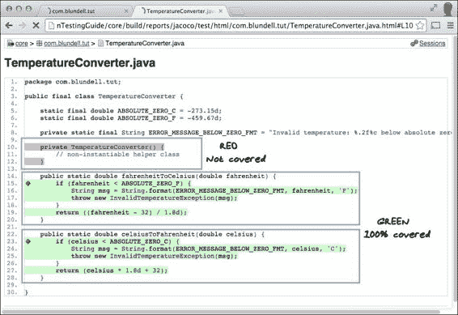

# 九、替代测试策略

到目前为止，我们已经分析了在我们的项目中实现测试的最常见和最容易的策略。然而，在我们的拼图中有一些缺失的部分，我们希望在这最后一章中覆盖它们。随着安卓工作室和 Gradle 的出现，安卓生态系统一直在向前开发。测试工具箱也一直在增加。在这方面，我们将看看一些第三方库，它们可以帮助我们扩展测试框架；比如用于在 JVM 上进行 Android 测试的 Robolectric，以及潜在的出血优势和未来的开发，比如 Fork 想象一下测试中的线程。

在本章中，我们将涵盖以下主题:

*   Jacoco 代码覆盖率
*   机器人学
*   在主机的 JVM 上测试
*   机器人
*   集会
*   勺子/叉子

# 代码覆盖率

也许安卓的致命弱点是缺乏文档，以及你必须访问多少地方才能获得你试图找到的完整版本，或者更糟糕的是，在许多情况下，官方文档是不正确的，或者没有更新以匹配当前版本。新的 Gradle 构建系统的文档在地面上非常少，这是大多数人在试图阅读代码覆盖率时开始的地方；所以让我们照亮几个黑暗的角落。

代码覆盖率是软件测试中使用的一个度量，它描述了测试套件实际测试的源代码数量，以及测试的程度，遵循一些标准。由于代码覆盖率直接检查代码，因此它是白盒测试的一种形式。

### 注

白盒测试(也称为透明盒测试、玻璃盒测试、透明盒测试和结构测试)是一种测试软件的方法，它测试应用的内部结构或工作方式，而不是其功能(比如黑盒测试)。

从几个可用的为 Java 提供代码覆盖率分析的工具来看，我们正在使用 Jacoco，这是一个开源的工具包，用于测量和报告 Android 项目支持的 Java 代码覆盖率。开始将它用于您自己的项目的基础设施已经存在，因此，最大限度地减少了实现它所需的工作量。Jacoco 取代了 EMMA 代码覆盖工具，同时从这一努力中吸取经验教训，并由同一个团队构建。

Jacoco 通过追求与众不同的特性组合，使自己与其他工具相区别；支持大规模企业软件开发，同时保持单个开发人员的工作快速迭代。这在一个安卓规模的项目中是至关重要的，Jacoco 在最好的情况下表现出色，为其提供了代码覆盖。

## Jacoco 特色

Java、安卓 Gradle 插件和 Gradle 构建系统都支持 Jacoco。根据本书发布时最新的 Jacoco 版本，转述其文档，最有特色的功能集如下:

*   Jacoco 可以离线(在加载之前)或动态(使用检测应用类加载器)检测覆盖率类。
*   支持的覆盖类型:类、方法、行、分支和指令。Jacoco 可以检测单个源代码行何时仅被部分覆盖。
*   覆盖率统计数据是在方法、类、包和“所有类”级别汇总的。
*   输出报表类型:纯文本、HTML、XML。所有报告类型都支持深入到用户控制的详细信息深度。HTML 报告支持源代码链接。
*   输出报告可以突出显示覆盖率低于用户提供的阈值的项目。
*   在不同的测试或测试运行中获得的覆盖率数据可以合并在一起。
*   Jacoco 不需要访问源代码，并且随着输入类中可用调试信息数量的减少而适度降级。
*   Jacoco 是比较快；添加插装的运行时开销很小(5%到 20%)，字节码插装器本身速度非常快(大部分受限于文件 I/O 速度)。每个 Java 类的内存开销是几百字节。

# 温度转换器代码覆盖范围

安卓 Gradle 插件支持开箱即用的 Jacoco 代码覆盖。该设置包括选择您想要获取覆盖报告的构建风格，以及选择您的 Jacoco 版本。我们希望检测我们的`debug`风格，这样我们就可以在不影响发布代码的情况下拥有覆盖率。在`android`闭包下，将这些行添加到您的`android/build.gradle`文件中:

```java
android {
  …
  buildTypes { 
        debug {
            testCoverageEnabled true
        }
      }

    jacoco {
        version = '0.7.2.201409121644'
    }
}
```

Jacoco 版本实际上不必在这里添加，但是，搭载 Android 的 Jacoco 发货版本目前落后于最新版本。最新版本的 Jacoco 覆盖率库可以在他们的 GitHub 页面上找到，位于[https://github.com/jacoco/jacoco](https://github.com/jacoco/jacoco)或 Maven central。因此，建议您明确版本。

## 生成代码覆盖率分析报告

您将需要一个仿真器运行，因为 Jacoco 仪器您的安卓测试，这些是在一个设备上运行，所以仿真器是合适的。测试完成后，会在设备上生成一个代码覆盖率报告，然后将它拉到您的本地机器上。如果您选择使用真实的设备而不是仿真器，它将需要根。否则，这种报告提取将失败，出现`Permission Denied`异常。

从命令行运行代码覆盖率，如下所示:

```java
$./gradlew build createDebugCoverageReport

```

或者，如果您有多种口味，也可以使用此命令:

```java
$./gradlew build connectedCheck

```

以下消息验证我们的测试已经运行并且覆盖率数据被检索:

```java
:app:connectedAndroidTest 
:app:createDebugCoverageReport 
:app:connectedCheck 

BUILD SUCCESSFUL

```

这已经在`/app/build/outputs/reports/coverage/debug/`目录内创建了报告文件。如果你使用多种口味，你的道路会略有不同。

现在，在我们继续之前，如果您还没有意识到，我们不仅已经为安卓应用模块生成了报告，而且我们的 Java `core`模块中也有代码。让我们也为此创建一个报告。

由于 Gradle 支持 Jacoco，我们只需要将 Jacoco 插件应用到我们的`code/build.gradle`文件中:

```java
apply plugin: 'jacoco''jacoco''jacoco''jacoco'''
```

更多的配置是可能的，与我们用于我们的安卓模块相同的关闭。可更改属性的详细信息可在【http://gradle.org/docs/current/userguide/jacoco_plugin.html】的 Gradle Jacoco 插件网站上找到。

现在，如果您运行`./gradlew`命令任务，您应该会看到一个新的生成的 Gradle 任务，`jacocoTestReport`。运行此任务为我们的核心模块生成代码覆盖率:

```java
$./gradlew jacocoTestReport 

```

这已经在`/core/build/reports/jacoco/test/`目录内创建了报告文件。

太棒了！现在我们有了`app`代码和`core`代码的代码覆盖率报告。

### 注

可以将这两个报告合并成一个文件。要做到这一点，您很可能必须使用 XML 输出。这是留给读者的一项任务，但是看看 Jacoco 网站和 Gradle 插件网站上的提示(之前已经做过了)。

让我们打开 `app`模块`index.html`显示覆盖率分析报告。



报告中提供的信息包括覆盖率度量，这种方法允许以自上而下的方式深入数据，从所有类开始，一直到单个方法和源代码行的级别(在 HTML 报告中)。

Jacoco 中代码覆盖的基本组成部分是基本块；所有其他类型的覆盖都是以某种方式从基本块覆盖中得到的。行覆盖主要用于链接到源代码。

此表描述了 Jacoco 覆盖报告中的重要信息:

<colgroup class="calibre15"><col class="calibre16"> <col class="calibre16"></colgroup> 
| 

标签

 | 

描述

 |
| --- | --- |
| 元素 | 类或包的名称。 |
| 遗漏的说明，覆盖范围 | 显示测试未涵盖的指令数量的视觉指示器(红色)，位于测试涵盖的指令百分比旁边。示例:`if(x = 1 && y = 2)`是两条指令，但只有一行代码。 |
| 遗漏的分支，覆盖范围 | 测试未覆盖的分支数量的视觉指示器(红色)，在覆盖的分支百分比旁边。把 if/else 语句想象成两个分支。方法中分支的数量是衡量其复杂性的一个很好的标准。 |
| 错过了，城市 | 错过的复杂路径(圈复杂度)的数量，仅次于总复杂度。复杂性路径被定义为字节码指令序列，没有任何跳转或跳转目标。向代码中添加一个分支(一个`if`语句)会添加两条路径(真或假)，从而使复杂性增加 1。但是，添加指令(`x = 1;`)不会增加复杂性。 |
| 错过，线路 | 除了总行数之外，没有被任何测试执行的行数。 |
| 错过，方法 | 错过的方法数，在方法总数旁边。这是一个基本的 Java 方法，由给定数量的基本路径组成。 |
| 缺课 | 没有单一测试的班级数量，仅次于班级总数。 |

我们可以从包向下钻取到类，钻取到具体的方法，覆盖的行用绿色表示，未覆盖的行用红色表示，部分覆盖的行用黄色表示。

这是**核心/** `TemperatureConverter`类的报告示例:



在这个报告中，我们可以看到`TemperatureConverter`类并没有 100%覆盖。当我们查看代码时，从来没有测试过的是构造函数。

你知道为什么吗？想一想。

是的，因为从不调用私有构造函数。这是一个根本不应该被实例化的实用程序类。

如果你能想象只用一个静态方法创建一个新的类，你就不会经常创建私有构造函数；它将被保留为不可见的默认公共构造函数。在这种情况下，我一直相当勤奋，写了这个私人构造器，因为我当时是一个好的童子军(现在仍然是！).

我们在这里不仅可以看到这种分析如何帮助我们测试代码和发现潜在的错误，还可以改进设计。

一旦我们认为这个私有构造函数是一段不运行测试的合理代码，我们就可以看到，即使这个类还没有 100%被覆盖，因此不是绿色的，我们也可以确信这个构造函数不会被任何其他类调用。

我认为一个非常重要的教训是:*100%的代码覆盖率不一定是你的目标*。了解您的领域和应用的体系结构，可以让您对代码覆盖率做出更加可及和现实的估计:

*   让您有信心更改代码而不产生任何影响
*   让你相信你被要求交付的产品就是你创造的产品

## 涵盖例外情况

继续我们对覆盖率报告的检查将引导我们发现另一个没有被我们当前测试使用的块。所讨论的区块是`app/TemperatureConverterActivity`中接下来的试捕区块中的最后一个捕获:

```java
try {
   double temp = Double.parseDouble(str);
   double result = (option == Option.C2F)
? TemperatureConverter.celsiusToFahrenheit(temp)
: TemperatureConverter.fahrenheitToCelsius(temp);
   String resultString = String.format("%.2f",",("%.("%."","," result);
   destinationEditNumber.setNumber(result);
   destinationEditNumber.setSelection(resultString.length());
} catch (NumberFormatException ignore) {
// WARNING this is generated whilst numbers are being entered,
   // for example just a -''''''
   // so we don'tdon'tdon'tdon't' want to show the error just yet
} catch (Exception e) {
sourceEditNumber.setError("ERROR: " + e.getLocalizedMessage());
}
```

首先，我们为什么要抓通用`Exception`？让我们更具体地说明我们期望处理的错误。这样我们就不会处理我们没有预料到的异常，而且如果有人阅读了代码，他们会明确知道我们在这里要做什么。

现在我们知道是什么代码导致我们没有完全的测试覆盖率，我们知道要编写什么测试来抛出这个异常并更新我们的测试套件和 Jacoco 报告:

```java
} catch (InvalidTemperatureException e) {
sourceEditNumber.setError("ERROR: " + e.getLocalizedMessage());
}
```

我们应该提供一个测试，或者更好的是一对测试，给定无效温度的每个温度单位一个测试，验证错误是否显示。以下是`TemperatureConverterActivityTests`中对摄氏情况的测试，你可以很容易的将其转换为提供华氏情况:

```java
public void testInvalidTemperatureInCelsius() throws Throwable {
        runTestOnUiThread(new Runnable() {
            @Override
            public void run() {
                celsiusInput.requestFocus();
            }
        });
        getInstrumentation().waitForIdleSync();

        // invalid temp less than ABSOLUTE_ZERO_C
        sendKeys("MINUS 3 8 0");");");");"

        String msg = "Expected celsius input to contain an error.";.";.";.";"
        assertNotNull(msg, celsiusInput.getError());
}
```

我们要求关注被测领域。正如我们之前所做的，我们应该通过在用户界面线程上使用 Runnable 来实现这一点，否则我们将收到一个异常。

然后设置无效温度，并检索错误消息以验证其不为空。再次运行端到端流程，我们可以证明路径现在已被覆盖，从而如预期那样为我们提供全部覆盖。

这是您应该遵循的迭代过程，以便将尽可能多的代码更改为绿色。如前所述，当代码行不是绿色时，只要您已经考虑了选项，并且仍然有信心在这条路径未经测试的情况下更改其他代码，那么这是可以的。

# 引入机器人

庞大的新兴机器人动物群中的一个组成部分是机器人世界(Robot ium)([)http://robotium.org](http://robotium.org)，这是一个为简化测试编写而创建的测试框架，只需要对测试中的应用有最少的了解。Robotium 主要面向为安卓应用编写强大且健壮的自动黑盒测试用例。它可以覆盖功能、系统和验收测试场景，甚至自动跨越同一个应用的多个安卓活动。Robotium 还可以用来测试我们没有源代码的应用，甚至是预装的应用。

让我们让机器人为`TemperatureConverter`创造一些新的测试。为了保持我们的测试有条不紊，我们在`TemperatureConverter`项目中的`androidTest`目录下创建了一个名为`com.blundell.tut.robotium`的新包。我们最初将测试`TemperatureConverterActivity`，称其为`TemperatureConverterActivityTests,`是合理的，尽管我们已经在另一个扩展`ActivityInstrumentationTestCase2`的包中有一个同名的类。毕竟，这个类也将包含相同活动的测试。

## 添加机器人

让我们将 Robotium 添加到我们的项目中，我们将只在测试用例中使用它，因此它应该在`testcase`类路径中。截至本文撰写之时，Robotium 的最新版本为 5.2.1。在`app/build.gradle`中，我们增加了以下内容:

```java
dependencies {

    ...

    androidTestCompile('com.jayway.android.robotium:robotium-solo:5.2.1')
}
```

## 创建测试用例

从前面的章节中，我们知道如果我们正在为一个应该连接到系统基础设施运行的活动创建测试用例，我们应该基于`ActivityInstrumentationTestCase2`，这就是我们将要做的。

### testFahrenheitToCelsiusConversion()测试

或多或少测试用例与其他基于仪器的测试具有相同的结构。主要区别是我们需要在测试`setUp(),`中实例化 Robotium 的 Solo，在`tearDown()`中清理 Robotium:

```java
public class TemperatureConverterActivityTests extends 
ActivityInstrumentationTestCase2<TemperatureConverterActivity> {

    private TemperatureConverterActivity activity;
    private Solo solo;

    public TemperatureConverterActivityTests() {
        super(TemperatureConverterActivity.class);
    }

    @Override
    protected void setUp() throws Exception {
        super.setUp();
        activity = getActivity();
        solo = new Solo(getInstrumentation(), activity);
    }

    @Override
    protected void tearDown() throws Exception {
        solo.finishOpenedActivities();
        super.tearDown();
    }
}
```

为了实例化 Solo，我们必须传递对`Instrumentation`类和被测活动的引用。

另一方面，为了清理 Solo，我们应该调用`finishOpenedActivities()`方法。这将完成 Solo，然后完成我们的活动，然后我们调用`super.tearDown()`。

Solo 提供了多种方法来驱动 UI 测试和一些断言。让我们从重新实现`testFahrenheitToCelsiusConversion()`开始，我们之前使用传统方法实现了`testFahrenheitToCelsiusConversion()`，但是在本例中使用了 Solo 工具:

```java
public void testFahrenheitToCelsiusConversion() {
solo.clearEditText(CELSIUS_INPUT);
   solo.clearEditText(FAHRENHEIT_INPUT);
   solo.clickOnEditText(FAHRENHEIT_INPUT);
   solo.enterText(FAHRENHEIT_INPUT, "32.5");
   solo.clickOnEditText(CELSIUS_INPUT);
   double f = 32.5;
   double expectedC = TemperatureConverter.fahrenheitToCelsius(f);
   double actualC = 
((EditNumber) solo.getEditText(CELSIUS_INPUT)).getNumber();
   double delta = Math.abs(expectedC - actualC);

   String msg = f + "F -> " + expectedC + "C "
     + """""but was " + actualC + "C (delta " + delta + ")";
   assertTrue(msg, delta < 0.005);
}
```

这是非常相似的，然而，你可能已经注意到的第一个区别是，在这种情况下，我们没有像我们之前在`setUp()`方法中那样获得对用户界面元素的引用，使用`findViewById()`来定位视图。然而，我们正在使用 Solo 的最大优势之一，即使用一些标准为我们定位视图。在这种情况下，标准是编辑文本出现的顺序。`solo.clearEditText(int index)`方法需要从`0`开始的屏幕位置的整数索引。因此，我们应该将这些常量添加到测试用例中，就像在我们的用户界面中，摄氏字段在上面，华氏在下面:

```java
  private static final int CELSIUS = 0;
  private static final int FAHRENHEIT = 1;
```

其他 Robotium 方法遵循相同的惯例，必要时我们会提供这些常量。这个测试和`com.blundell.tut.TemperatureConverterActivityTest,`中的测试非常相似，但是你可能已经注意到有细微的区别。Robotium 位于更高的层次，我们不必担心那么多内部构件或实现细节；例如，在我们之前的测试中，当我们调用`celciusInput.requestFocus()`来触发转换机制时，这里我们只是模拟用户所做的事情并发出一个`solo.clickOnEditText(CELSIUS)`。

我们合理地简化了测试，但是使用 Solo 的最大优势还在后面。

### 活动之间的测试

由于 Robotium位于更高的层次，我们不处理实现细节，所以当我们点击安卓小部件时，如果启动了一个新的 Activity，这不是我们的问题；我们只从 UI 的角度来看待这个案例。

在这里，我将从理论上讨论一些功能。如果您愿意，这还没有创建，而是留给用户作为下一步。

现在我们有了一个工作温度转换器，如果我们能让用户决定他们希望看到的转换小数位数，那就太好了。允许用户通过安卓对话框改变这个选项，听起来是一个明智的选择。

我们的目的是将小数位数首选项的值更改为 5，并验证更改是否实际发生。由于 Robotium 的高水平，这个测试是可读和可理解的，而实际上没有实现功能。这是一个实现这个特性的 BDD 方法的例子。

下面的代码片段说明了测试的细节:

```java
public final void testClickOptionMenuSavesDecimalPreference() {
int decimalPlaces = 5;
   String numberRegEx = "^[0-9]+$";

   solo.sendKey(Solo.MENU);
   solo.clickOnText("Preferences");
   solo.clickOnText("Decimal places");
   assertTrue(solo.searchText(numberRegEx));

   solo.clearEditText(DECIMAL_PLACES);
   assertFalse(solo.searchText(numberRegEx));

   solo.enterText(DECIMAL_PLACES, Integer.toString(decimalPlaces));
solo.clickOnButton("OK");
   solo.goBack();

   solo.sendKey(Solo.MENU);
   solo.clickOnText("Preferences");
   solo.clickOnText("Decimal places");
   assertTrue(solo.searchText(numberRegEx));

   int editTextDecimalPlaces = 
Integer.parseInt(solo.getEditText(DECIMAL_PLACES)
.getText().toString());
assertEquals(decimalPlaces, editTextDecimalPlaces);
}
```

关于共享首选项和选项菜单是如何实现的，没有血腥的细节。我们只测试它的功能。我们首先按下**菜单**键，然后点击**首选项**。

哇，我们刚刚指定了菜单项标题，就这样！

新的活动已经开始，但是我们不必担心实现细节。我们继续点击**小数**T2 位。

我们验证了某个字段包含一个数字，这个首选项的前一个值出现了。你还记得我说的正则表达式吗？它们总是以这样或那样的方式派上用场，以匹配任何十进制整数(任何数字后跟零或更多数字)。然后，我们清除该字段，并验证它实际上已被清除。

我们输入字符串，表示我们想要用作首选项的数字，在本例中为 5。点击**确定**按钮，偏好设置被保存。

最后，我们需要验证它确实发生了。相同的过程用于获取菜单和字段。最后，我们验证实际数字已经存在。

你可能想知道`DECIMAL_PLACES`是从哪里来的。我们之前为屏幕上的字段定义了`CELSIUS`和`FAHRENHEIT`索引常数，这是相同的情况，因为这将是我们应该在类中定义的第三个 EditText:

```java
  private static final int DECIMAL_PLACES = 2;
```

根据您的喜好，测试可以从您的集成开发环境或命令行运行。

# 在主机的 JVM 上进行测试

我们把这个主题留到了本章的最后，因为这似乎是安卓平台的*圣杯*。

安卓是基于一个名为 **达尔维克**的虚拟机，源自冰岛的一个村庄，针对有限的移动资源进行了优化，例如有限的内存和处理器速度。因此代表了一个移动设备，但肯定是一个非常不同的环境比我们的内存丰富和快速的主机计算机，通常有足够的内存和处理器速度享受。

通常，我们在模拟器或设备上运行应用和测试。这些目标的真实或模拟 CPU 速度要慢得多。因此，运行我们的测试是一项耗时的活动，主要是在我们的项目开始增长时。应用测试驱动开发技术迫使我们运行数百个测试来验证我们引入的每一个变更。

### 注

值得注意的是，这种技术只能在开发过程中作为一种变通方法来加快速度，它永远不应该取代真实平台上的最终测试，因为 Dalvik 和 JavaSE 运行时之间的不兼容性可能会影响测试的准确性。

我们的核心模块已经完成了一半。现在我们在 Java 世界中，可以自由地在 JVM 上运行我们的测试(并使用 JUnit4，很快就会出现在你身边的安卓系统中)。`app`安卓模块与核心 Java 模块之间存在单向依赖。允许我们在`core`模块中运行测试时，将自己从安卓测试的束缚、累赘中解放出来。

之后，我们应该会找到一种方法，让我们能够截取在仿真器或设备序列上运行的标准编译-德兴，并且能够直接在我们的主机上运行 Android。

## 比较性能增益

快速提醒运行这些纯 Java 测试与安卓测试相比速度提升。

区别很明显。没有仿真器启动，也没有任何设备通信，因此速度增益很重要。分析证据，我们可以找出这些差异。

在我的开发计算机上运行所有测试需要 0.005 秒；有些测试花费的时间很少，甚至没有计算在内，显示为 0.000 秒。

如果我将这些测试转移到我们的应用模块，并在模拟器上运行相同的测试，这将使巨大的差异显而易见。这些相同的测试运行时间为 0.443 秒，几乎要多出 100 倍，如果考虑每天运行数十次数百个测试，这是一个巨大的差异。

值得注意的是，除了速度提升之外，还有其他优势，它们是多年的 Java、工具、库和插件创建的可用性，包括几个模拟框架和代码分析工具。

## 给图片添加安卓

我们故意把安卓留在我们的图片之外。让我们分析一下如果我们在`core`中包含一个简单的安卓测试会发生什么。请记住，对于从SDK编译`android.jar`的安卓测试，它也应该被添加到模块的库中。

我们得到的是:

```java
java.lang.RuntimeException: Stub!
 at android.content.Context.<init>(Context.java:4)
 at android.content.ContextWrapper.<init>(ContextWrapper.java:5)
 at android.app.Application.<init>(Application.java:6)

```

### 注

将`android.jar`添加到核心的类路径中有点尴尬和冗长。这不是默认的事情。这是一件好事，因为它阻止了我们在内核中编写代码时意外使用安卓特定的类。

原因是`android.jar`只提供 API，不提供实现。所有方法都有相同的实现:

```java
throw new RuntimeException("Stub!");

```

如果我们想绕过这个限制，在安卓操作系统之外测试一些类，我们应该创建一个`android.jar`来模拟每个类。然而，我们也会发现安卓类子类的问题，比如`TemperatureConverterApplication`。这将是一项艰巨的任务和大量的工作，因此我们应该寻找另一种解决办法。

# 引入机器人

**robo electric**([http://robolectric.org](http://robolectric.org))是一个单元测试框架，拦截 Android 类的加载，重写方法体。Robolectric 重新定义了 Android 方法，使其返回默认值，如`null`、`0`或`false`。如果可用，它会将方法调用转发给影子对象，模仿安卓的行为。

提供了大量的阴影对象，但这还远远没有完全覆盖，然而，它正在不断改进。这也应该让你把它当作一个不断开发的开源项目，为此你应该准备好做出贡献，让它变得更好，但是也要谨慎地依赖它，因为你可能会发现你的测试需要的东西还没有实现。这绝不是要削弱它现有的前景。

## 安装电机

可以通过使用 Maven 中央存储库中最新的 Robolectric JAR 来安装 robo electric。在撰写本文时，最新版本是 2.4 版:

```java
testCompile 'org.robolectric:robolectric:2.4'
```

通常，添加一个依赖项就像这一行一样简单，但是，对于 Robolectric，需要一点小把戏才能让它与 Gradle 构建类型一起工作。

首先，机器人测试需要他们自己的模块来运行。这不是什么新鲜事。创建一个新的 Java 模块，我们称之为`robolectric-tests`。保持包装始终不变`com.blundell.tut`。现在，我们必须修改`robolectric-tests/build.gradle,`，这样我们就可以用机器人代替`android.jar`:

```java
def androidModuleName = ":app";
def flavor = "debug"

evaluationDependsOn(androidModuleName)

apply plugin: 'java'

dependencies {
    def androidModule = project(androidModuleName)
    testCompile project(path: androidModuleName, 
configuration: "${flavor}Compile")

    def debugVariant = androidModule.android.applicationVariants
.find({ it.name == flavor })
    testCompile debugVariant.javaCompile.classpath
    testCompile debugVariant.javaCompile.outputs.files
    testCompile files(
androidModule.plugins.findPlugin("com.android.application")
.getBootClasspath())

    testCompile 'junit:junit:4.12'
    testCompile 'org.robolectric:robolectric:2.4'
}
```

这是要接受的一大块配置，让我们将其分成几个步骤。

首先，我们为我们的安卓应用定义模块名，然后命名我们想要测试的风格。

类`EvaluationDependsOn`告诉 Gradle 确保我们的应用模块在我们的测试之前被评估，这从执行顺序上阻止了任何奇怪的错误。

接下来，我们按照常规为一个 java 项目应用 Java 插件。

依赖项闭包是我们将所有安卓依赖项添加到类路径中的地方。首先，我们添加我们模块的所选构建变体，`debug`，然后是类路径及其依赖项，同时确保我们的安卓插件有系统依赖项。

最后，我们应用 JUnit4 和 Robolectric 作为测试依赖项。

### 注

记住，如果您有多种产品风格和构建类型，那么这个配置需要完整的构建变体添加到脚本中。修改这个构建脚本非常简单。

## 添加资源

当运行您的测试时，Robolectric 会尝试查找您的`AndroidManifest.xml`，以便它可以为您的应用找到资源，并了解您的目标 SDK 版本以及其他属性。使用当前的 robo electric 版本和我们选择使用单独的模块，robo electric 无法找到您的资源或您的安卓清单。如果没有这个可选步骤，你仍然可以编写测试并获得反馈，但是当访问使用资源的类时，你可能会发现一些陌生感；例如，`R.string.hello_world,`将在您的控制台中获得如下消息:

```java
WARNING: No manifest file found at ./AndroidManifest.xml.Falling back to the Android OS resources only. To remove this warning, annotate your test class with @Config(manifest=Config.NONE).

```

这可以通过使用`@Config`注释按照它说的去做，或者创建一个指定清单位置的自定义测试运行程序，或者按照我们在这里选择的方式，创建一个配置文件并将其添加到您的类路径中来修复。在`robolectric-tests`模块中，创建文件夹`/src/test/resources,`并创建文件`org.robolectric.Config.properties`。这将包含我们的安卓清单位置；它还将包含我们的最低 SDK 版本，因为我们没有在我们的清单中声明这一点。它将包含以下内容:

```java
manifest=../app/src/main/AndroidManifest.xml
emulateSdk = 16
```

### 注

机器人试图在`AndroidManifest.xml`中查找你的最小 SDK。但是，使用 Gradle 构建系统，您不能在这里声明它，而是在`app/build.gradle`中声明它。

我们现在已经准备好创建一些机械测试！

## 写一些测试

我们将通过重现我们之前写的一些测试来了解“T4”。一个很好的例子是重写`EditNumber`测试。让我们创建一个新的`EditNumberTests`类，这次是在新创建的项目中，并从`TemperatureConverterTest`项目中的`EditNumberTests`类中复制测试:

```java
@RunWith(RobolectricTestRunner.class)
public class EditNumberTests {

  private static final double DELTA = 0.00001d;

  private EditNumber editNumber;
```

在前面的片段中，我们用`@RunWith`注释声明了测试运行器。然后我们定义了`editNumber`字段，来保存对`EditNumber`类的引用:

```java
    @Before
    public void setUp() throws Exception {
        editNumber = new EditNumber(Robolectric.application);
        editNumber.setFocusable(true);
    } 
```

这个片段包括通常的`setup()`方法。在`setUp()`方法中，我们创建了一个带有应用上下文的`EditNumber`，然后我们将其设置为可聚焦的。上下文用于创建视图，Robolectric 为我们处理了这一点:

```java
    @Test
    public final void testClear() {
        String value = "123.45";";";";"
        editNumber.setText(value);

        editNumber.clear();

        assertEquals("",  editNumber.getText().toString());
    }
    @Test
    public final void testSetNumber() {
        editNumber.setNumber(123.45);

        assertEquals("123.45", editNumber.getText().toString());
    }

    @Test
    public final void testGetNumber() {
        editNumber.setNumber(123.45);

        assertEquals(123.45, editNumber.getNumber(), DELTA);
    }
```

在最后一个片段中，我们有与前面例子的`EditNumber`测试相同的基本测试。

我们正在强调最重要的变化。第一个是通过使用注释`@RunWith`，指定将测试处理委托给的测试运行器 JUnit。在这种情况下，我们需要使用`RobolectricTestRunner.class`作为跑步者。然后我们创建一个`EditText`类，使用一个机器人上下文，因为这是一个没有一些帮助就不能被实例化的类。最后，一个`DELTA`值在`testGetNumber`中被指定为`assertEquals`，因为浮点数在 JUnit 4 中需要它。此外，我们添加了`@Test`注释，将该方法标记为测试。

原`EditNumberTests`中存在的其他测试方法无法实现，或者由于各种原因简单失败。比如我们之前提到的 robolecircular 类返回默认值，比如`null`、`0`、`false`等等，这就是`Editable.Factory.getInstance(),`返回 null 导致测试失败的情况；因为没有其他方法可以创建`Editable`对象，所以我们处于死胡同。

同样的，`EditNumber`设置的`InputFilter`是无功能的。创建一个期望某些行为的测试是徒劳的。

这些缺点的替代方案是创建`Shadow`类，但这需要改变机器人电源和创建`Robolectric.shadowOf()`方法。如果您有兴趣将此方法应用到您的测试中，您可以遵循的文档中描述了此过程。

识别出这些问题后，我们可以继续运行测试，它们将在主机的 JVM 中运行，不需要启动仿真器或设备或与之通信。

# 谷歌向阴影进军

出于某种原因，谷歌不喜欢机器人，他们从来没有承认它的工作原理，或者从来没有说过它是一个问题的解决方案。如果他们忽略了解决方案，那就意味着测试运行缓慢的问题不存在，对吧。他们似乎觉得 Robolectric 贬低了安卓，因此公开对它冷眼相待。通过忽视它的存在，偷偷把它推开，直到现在。

谷歌已经创建了我们之前所说的，一个带有默认方法实现的`android.jar`文件。这意味着在访问方法时不再有`stub!`错误。此外，他们已经从课程中移除了所有的`final`修改器，允许嘲讽框架有一个野外日。不幸的是，在撰写本文时，它是没有文档记录的。不意外！我不想给出使用步骤，因为虽然没有记录，但这些将会迅速改变。然而，我要说的是，如果谷歌做得对，那么这意味着对于前面描述的测试场景，robolecircuit 已经不在窗口之内，我们可以使用标准的安卓测试 SDK。同样的原理也适用，所以我认为如果你理解了机器人的工作原理，它仍然是有价值的。你可以把这种理解应用到我不能应用的未来。

# 介绍节

我们测试武器库的另一个武器是更好的测试断言。你有没有注意到有时失败测试的 stacktraces 是多么的不友好和/或神秘错误？他们很少给你关于真正失败的信息，你最终会感到困惑，不得不阅读整个源代码来弄清楚如何解决问题。

举个例子，看看这个断言:

```java
org.junit.Assert.assertEquals(3, myList.size());
```

我们断言某个任务之后的对象集合的大小为 3，请查看测试失败时的错误消息:

```java
java.lang.AssertionError: 
Expected :3
Actual   :2
```

好吧，那种有道理，但是有点抽象。我们的单子上少了什么？我将不得不再次运行测试来找出答案，或者我可以添加自定义错误消息:

```java
assertEquals("List not the correct size " + myList, 
3, myList.size());
```

给我错误信息:

```java
java.lang.AssertionError: List not the correct size [A, B] 
Expected :3
Actual   :2
```

这个错误信息要好得多。这表明我的名单中少了`C`。然而，回顾这个断言，它变得有点不可读。有时，乍看之下，它甚至可能看起来像我试图断言该初始字符串是否等于其他变量，参数排序根本没有帮助。如果我有另一个不那么容易实现`toString`的对象呢？我需要创建更多的自定义代码来打印一个漂亮的错误消息，可能会重复自己相当多的锅炉板错误消息。

别再担心了！看看我们如何用 Fest 做同样的断言:

```java
org.fest.assertions.api.assertThat(myList).hasSize(3);
```

现在，我们的错误消息看起来像:

```java
java.lang.AssertionError: expected size:<3> but was:<2> in:<['A', 'B'']>
```

很好，不需要我们额外的努力，我们就能得到一条错误消息，告诉我们列表中有什么，以及尺寸是如何区分的。同样回顾这个断言，它可读性更强，甚至使用流体接口进行编码也更容易。这提高了测试代码的可读性，加快了调试和测试修复的速度。

在做了这个改变之后，我开始意识到我们实际上可能想要测试列表的内容，但是由于 JUnit 断言的阻碍，我们没有打扰。再次向救援致敬:

```java
assertThat(myList).contains("A", ""B", ""C");
output: 
  java.lang.AssertionError: expecting:
<['A',]>
 to contain:
<['A', 'B', 'C']>
 but could not find:
<['C']>
```

想想我们如何用 JUnit 断言做到这一点，我想你会欣赏 Fest 的力量。

Fest 有多种风格，适用于不同库中的断言；其中包括 java 风格，如前所示，以及 Android 风格，它允许您在 Android 组件上进行流畅风格的接口断言，如 Views 和 Fragments。这里有一个 JUnit 断言可见性的例子，然后是 Fest:

```java
assertEquals(View.VISIBLE, layout.getVisibility());

assertThat(layout).isVisible();
```

向项目中添加任何一个库都只是另一个 Gradle 依赖项，最新版本可以在 Maven central 上找到。以下是 Java fest 的示例，这是编写本文时最新的示例:

```java
testCompile 'org'.easytesting:fest-assert-core:2.0M10'
```

### 注

请注意， Android Fest 已经被重新命名为 Assert-J，并根据您想要测试的内容被分成许多依赖项。断言将以完全相同的方式工作。更多作为依赖项添加的信息和说明可在[https://github.com/square/assertj-android](https://github.com/square/assertj-android)找到。

# 引入勺子

设备碎片化在安卓周围总是被谈论，这是你应该考虑的事情。不同设备和外形的数量意味着您真的需要确信您的应用在上述所有方面运行良好。勺子就在这里帮忙；勺子([http://square.github.io/spoon](http://square.github.io/spoon))是一个开源项目，它给你一个测试运行器，允许在所有连接的设备上并行运行仪器测试。它还允许您在测试运行时截图。这不仅加快了您的测试和反馈周期，还可以让您直观地看到测试哪里出错了。

勺子可以用这个依赖项添加到你的项目中:

```java
testCompile com.squareup.spoon:spoon-client:1.1.2
```

然后，您可以在测试中截取屏幕截图，这样当您还断言行为时，就可以看到应用的状态:

```java
Spoon.screenshot(activity, "max_celcius_to_fahrenheit");
```

如果您在断言之前拍摄截图，您可以使用截图来帮助您确定失败。另一个很酷的功能是勺子会将你一次测试的截图整理成一个动画 GIF。所以你可以观察事件的顺序。

然后使用以下命令从命令行运行 Spoon:

```java
$java -jar spoon-runner-1.1.2-jar-with-dependencies.jar \
 --apk androidApplicationTestGuide.apk \
--test-apk androidApplicationTestGuideTests.apk

```

### 注

你可以在`/build/`文件夹中找到你的 APK 文件。如果您需要更多关于以这种方式使用 APK 文件的信息，并从命令行进行测试，请回头看看[第 7 章](7.html#page "Chapter 7. Behavior-driven Development")、*行为驱动开发*。

# 引入叉

另一个幽默的名字为一个图书馆，但坚持下去的读者，这种相似性不仅仅是共现。在告诉你 Spoon 通过在所有连接的设备上并行运行你的所有仪器测试来加速你的测试是多么令人惊讶之后，Fork 来了，告诉你这个天真的调度(他们的话不是我的)，是你自己和你的 CI 的负担。Fork 可以更快地运行您的测试！

Fork 通过引入一个名为 **设备池**的概念来提高测试速度。简单来说，假设你有两台完全相同的设备，那就是两台运行安卓 5.0 的索尼 Xperia Z1s。Fork 将把你的测试套件分成两半，在每台设备上运行一半的测试。因此，它为您节省了 50%的测试运行速度(大致不包括预热/设置时间)。

这些设备池有不同的风格，例如 api 级别、最小宽度、平板设备或手动池，您可以在其中声明要使用的设备序列号。有关分叉任务的设备池和自定义参数的更多信息，可在[http://goo.gl/cIm6GQ](http://goo.gl/cIm6GQ)找到。

通过将插件添加到构建脚本并应用它，Fork 可以与 Gradle 一起使用:

```java
buildscript {
    dependencies {
        classpath 'com'.shazam.fork:fork-gradle-plugin:0.10.0'
    }
}

apply plugin: 'fork'
```

现在，您可以使用以下命令运行分叉测试，而不是正常的仪器测试:

```java
./gradlew fork
```

### 注

如果您的项目中有多种风格，您可以使用命令:**查看哪些分叉任务可用。/gradlew 任务| grep fork** 。

勺子和叉子是强大的工具，现在结合您对仪器测试、单元测试、基准测试和代码分析的知识，您可以构建一个健壮、信息化和全面的测试套件，这给了您编写安卓应用的信心和敏捷性。

# 总结

这一章比之前的章节稍微复杂一点，唯一的意图是面对现实情况和最先进的安卓测试。

我们首先通过 Jacoco 启用代码覆盖率，运行我们的测试，并获得详细的代码覆盖率分析报告。

然后，我们使用这个报告来改进我们的测试套件。编写测试来覆盖我们不知道的代码还没有被测试。这使我们进行了更好的测试，并且在某些情况下改进了被测项目的设计。

我们引入了 Robotium，这是一个非常有用的工具，可以方便地为我们的安卓应用创建测试用例，我们用它改进了一些测试。

然后我们分析了安卓测试中最热门的话题之一；在开发主机 JVM 上进行测试，优化并大大减少运行测试所需的时间。当我们在过程中应用测试驱动开发时，这是非常理想的。在这个范围内，我们分析了 Robolectric，并创建了一些测试作为演示，让您开始使用这些技术。

为了完善我们的知识，我们看了 Fest 和一些餐具，它们可以帮助我们进行更具表现力的测试，改善反馈，以及更强大的整体测试套件。

通过安卓测试的可用方法和工具，我们已经到达了旅程的终点。现在，您应该做好更充分的准备，开始将此应用到您自己的项目中。一旦您开始使用，结果就会显示出来。

最后，我希望你和我一样喜欢读这本书。

测试快乐！