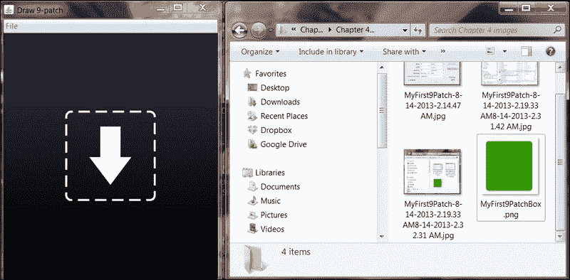
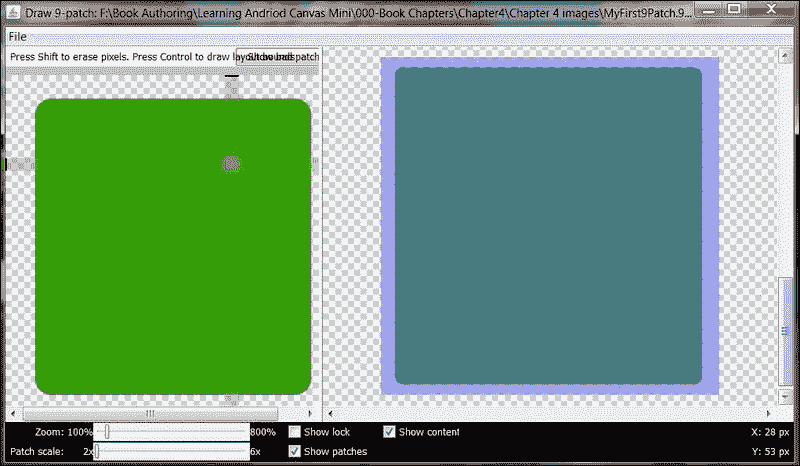
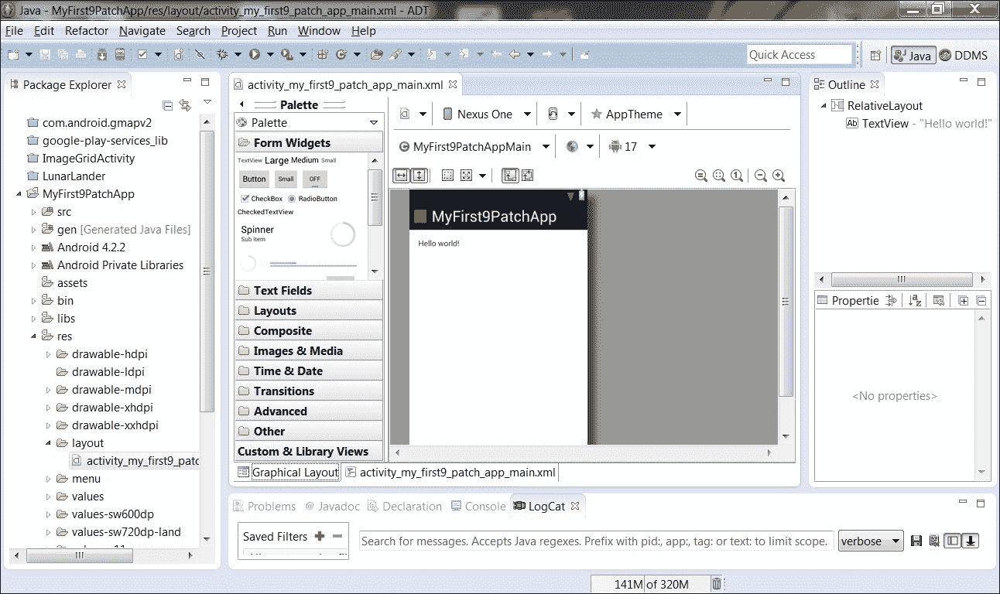
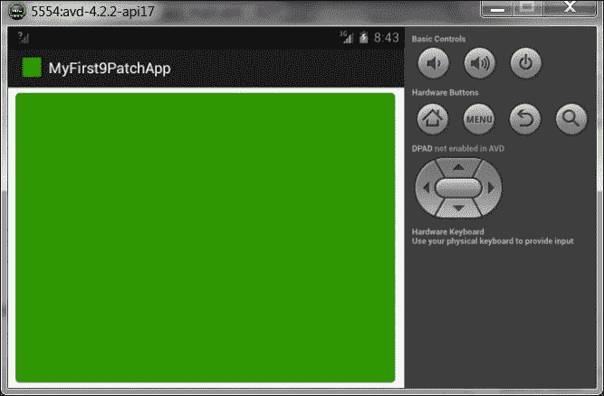

# 四、NinePatch 图像

在本章中，我们将了解 NinePatch 映像:它们是什么，它们的重要性，它们是如何创建的，如何使用，以及它们在我们的安卓应用中能产生什么样的影响。

NinePatch 图像很重要，因为我们希望以这样一种方式开发我们的布局，即如果方向发生变化或者我们的应用托管在不同分辨率的设备上，它可以进行调整。我们的应用布局需要足够灵活，以便根据不同设备的分辨率、屏幕大小和方向进行调整。NinePatch 图像是具有可拉伸区域的图像。可拉伸区域可以水平和垂直拉伸，以封装内部内容。最好的部分是，如果没有定义内容的宽度和高度，NinePatch 图像可以水平和垂直拉伸，以适应任何类型宽度和高度的各种内容。通常，NinePatch 图像用于不同类型的容器或视图的背景，这些容器或视图将承载某种内容。它可以在我们的应用中用作我们活动的背景，也可以仅用于形成带有一些文本的按钮的背景。Ninepatch 图像是具有额外 1 像素宽边框的普通 PNG 图像。有一点必须确定，NinePatch 映像必须与一起保存。`9.png`文件扩展名。

之所以称之为 NinePatch 图像，是因为允许可绘制对象以九个部分绘制图像。为了让这个想法变得清晰，请看下图:


在上图中，有可拉伸区域和不可拉伸区域。在 NinePatch 图像中，四个部分是可拉伸的；在前面的示例中，它们是第 **2** 、 **4** 、 **6** 和 **8 节。**四个部分将是不可拉伸的，在前面的例子中它们是部分 **1** 、 **3** 、 **7** 和 **9** 。最后一部分是将在两个方向上延伸的内容部分；在前面的例子中是第 **5** 节。

在可拉伸的段中， **2** 和 **8** 段将仅水平拉伸。第 **4** 和 **6** 段仅垂直拉伸。第 **5** 部分将水平和垂直拉伸，这是图形中容纳内容的主要部分。

这里有一点很重要，那就是没有必要像示例中所示的那样让补丁采用完全相同的样式。可以创建九个补丁映像，使补丁只能水平或垂直扩展；此外，它可以有比上述例子更多的补丁。

# 创建 9 补丁映像

要创建一个 NinePatch 镜像，安卓提供了一个非常简单的工具；然而，在我们使用该工具之前，我们需要知道使用该工具的需求。第一件事是，我们需要有我们的基础 PNG 图形文件，我们将转换为我们的第一个 NinePatch 图像。我们可以在任何图形编辑工具如 Photoshop 中创建我们的基本 PNG 图像。因此，我们将通过打开 Photoshop 并创建一个新的 PNG 图像来开始创建我们的基础 PNG 图像。

以下截图显示了 Photoshop 中的**新建**文件创建对话框:


我们计划创建一个绿色的盒子，稍后我们将把里面的内容转换成一个 NinePatch 图像。首先，我们将文件命名为`MyFirst9PatchBox`，并将**背景内容**设置为**透明**。点击**确定**我们会得到一个空画布。接下来我们将画一个盒子，里面是绿色，背景是透明的。

下面的截图显示了我们在 Photoshop 中绘制的绿色方框:


默认情况下 Photoshop 会将文件保存为 PSD 格式，但是我们会将文件保存为 PNG 格式，因为我们需要一个 PNG 文件来将其转换为 NinePatch 图像。或者，我们可以将文件保存为 web 这样创建的巴布亚新几内亚将更轻。这将提高整体应用性能。在我们的应用中使用许多重影会降低应用的性能。

为了从我们的绿框 PNG 文件中创建一个 NinePatch 图像，我们将在`Tools`文件夹中打开安卓软件开发工具包中提供的绘制 9 补丁工具。为此，我们将浏览到安卓软件开发工具包中的`Tools`文件夹，并找到`draw9patch.bat`文件。

文件的路径是`F:\Android\adt-bundle-windows-x86_64-20130219\adt-bundle-windows-x86_64-20130219\sdk\tools`，其中`F`是我的驱动器，安卓是`F`驱动器根目录下的一个文件夹，其余的在安卓文件夹中。下面的截图显示了`draw9patch` 工具的位置。


双击可以打开`draw9patch`工具。以下截图显示的是`draw9patch`工具，屏幕为空:


在下一步中，我们要么将我们的 PNG 基础图像拖放到`draw9patch`工具，要么在`draw9patch`工具中打开我们的 PNG 文件。

下面的截图并排显示了我们的基础 PNG 文件和`draw9patch`工具:



当我们在`draw9patch`工具中拖放或打开我们的基础 PNG 文件时，下面的截图就是我们将看到的:


右侧区域显示了我们将定义面片的绘图区域，即我们想要拉伸的区域和不想拉伸的区域。左侧窗格显示预览区域。

在下一步中，我们将定义我们的补丁。当我们在图像上移动光标时，我们会看到非常浅的水平线和垂直线。我们将拖动这些水平线和垂直线来定义我们的补丁。

下面的截图显示了我们定义的补丁:



浅绿色的垂直和水平区域向我们展示了我们定义的补丁，这些是可拉伸的部分。如果我们错误地定义了我们的补丁，那么当我们将内容放入其中时，它们将不会适当地伸展以捕获所有内容。这个工具显示我们是否有坏的补丁。左侧窗格右上角有一个名为**的按钮显示坏补丁**。点击它，它会显示我们的坏补丁，如果我们有坏补丁在我们的 9 补丁图像。

下面的截图显示了错误的补丁:


这些标有红色边框的补丁是不好的补丁，无法适当拉伸以捕获其中的全部内容。我这样做只是为了让大家明白一个糟糕的补丁会是什么样子。我们将调整我们的水平线和垂直线以获得合适的补丁，如果没有坏的补丁，我们将检查，然后我们将我们的文件保存为`MyFirst9Patch.9.png`；然后，我们就完成了第一个 NinePatch 映像的创建。

# 使用 9 补丁图像

我们将通过打开 Eclipse 并启动一个新的安卓项目来开始。我们将我们的项目命名为`MyFirst9PatchApp`。

以下截图显示了新应用的配置设置:


在向导的下一步中，我们将提供我们的基本 PNG 文件作为我们应用的图标。

以下屏幕截图显示了图标配置屏幕:


在下一步中，我们将我们的主要活动命名为`MyFirst9PatchAppMainActivity`。以下屏幕截图显示了主活动配置屏幕:


我们点击**完成**，完成向导的执行，来到我们应用的**设计**视图。下面的截图显示了我们应用的**设计**视图:



接下来我们要做的是将我们的 NinePatch 映像复制到我们项目的`res/drawable`文件夹中，这样我们就可以在代码中使用那个 NinePatch 映像。

接下来我们将打开我们主要活动的`activity_my_first9_patch_app_main.xml`文件，并将在代码中创建一个按钮。整个`Button`代码看起来像下面的代码片段:

```java
<Button
id="@+id/btnninepatch"
  android:layout_width="wrap_content"
  android:layout_height="wrap_content"
  android:layout_alignParentTop="true"
  android:layout_centerHorizontal="true"
  android:layout_marginTop="26dp"
  android:background="@drawable/myfirstninepatch"
  android:text="@string/buttonwith9patchimage"
  android:textSize="38sp" />
```

在前面的代码中，以下两行是最重要的:

```java
android:background="@drawable/myfirstninepatch"
android:text="@string/buttonwith9patchimage"

```

第一行显示按钮将使用哪个可绘制工具作为背景，第二行显示按钮上显示的内容。现在在前面的例子中，字符串名称是`buttonwith9patchimage`，它的值是**背景中有 9 个补丁图像的按钮，我们需要添加一些文本来使按钮背景扩展超过 3 行**。需要给按钮添加这么多文本是为了使其多行；这将使我们能够看到 NinePatch 图像的拉伸效果。

下面的屏幕截图显示了背景中带有拉伸的 NinePatch 图像的按钮:


到目前为止，很明显，我们将主要使用 NinePatch 图像来处理我们的背景图形；尤其是当我们不知道我们希望它包含的内容的宽度和高度时。所以接下来我们要做的是改变我们应用主要活动的整个背景。假设我们不喜欢我们活动的默认白色背景颜色，我们需要一个自定义背景。在前面的应用中，我们将从我们的 XML 文件中删除按钮代码，并将以下代码添加到`Layout`标签中。

```java
android:background="@drawable/myfirstninepatch"
```

前面的代码将使我们能够在整个活动中使用可拉伸的背景。这个标记的完整代码看起来像下面的代码片段:

```java
<RelativeLayout xmlns:android="http://schemas.android.com/apk/res/android"
    xmlns:tools="http://schemas.android.com/tools"
    android:layout_width="match_parent"
    android:layout_height="match_parent"
    android:paddingBottom="@dimen/activity_vertical_margin"
    android:paddingLeft="@dimen/activity_horizontal_margin"
    android:paddingRight="@dimen/activity_horizontal_margin"
    android:paddingTop="@dimen/activity_vertical_margin"
    android:background="@drawable/myfirstninepatch"
    tools:context=".MyFirst9PatchAppMainActivity" >  

</RelativeLayout>
```

当我们在模拟器中测试应用时，我们会看到:



在之前的图片中，我们可以看到我们的 NinePatch 框图像已经垂直和水平拉伸，以填充整个活动屏幕。这将为我们所有图形丰富的应用提供定制的可拉伸背景。

# 总结

在这一章中，我们了解了可以拉伸以填充它们所在的容器的图像。这些被称为 NinePatch 图像。我们了解了这些可拉伸图像的重要性、它们的架构以及对这些图像的基本理解。我们还学习了如何将简单的图像转换成这些可拉伸的图像，以及我们需要避免的常见错误。我们还学习了如何在我们的安卓应用中，在视图、控件或整个活动的背景中使用这些图像。在下一章中，我们将了解用户交互和图形，如触摸事件。