# 第一章： 开始测试

首先，我将避免介绍 Android，因为它在许多书中已经有所涉及，我倾向于相信，如果你正在阅读一本涵盖这个更高级话题的书，那么你已经开始了 Android 开发。

我将回顾测试背后的主要概念，以及部署在 Android 上的测试策略的技术、框架和工具。

在此概述之后，我们可以将所学到的概念付诸实践。在本章中，我们将涵盖以下内容：

+   在 Android 上设置测试的基础设施

+   使用 JUnit 运行单元测试

+   创建一个 Android 仪器测试项目

+   运行多个测试

我们将创建一个简单的 Android 项目及其伴随的测试。主项目将非常基础，以便你可以专注于测试组件。

我建议没有 Android 测试经验的新开发者阅读这本书。如果你在 Android 项目上有更多经验，并且已经在使用测试技术，你可以将这一章作为复习或对概念的再次确认。

# 为何、什么、如何以及何时进行测试？

你应该明白，早期发现错误可以节省大量的项目资源并降低软件维护成本。这是为你的软件开发项目编写测试的最佳已知原因。生产力的提高将很快显现。

此外，编写测试将使你更深入地理解需求和要解决的问题。对于你不理解的软件，你将无法为其编写测试。

这也是编写测试以清楚地理解遗留代码或第三方代码的方法背后的原因，以及拥有测试基础设施以自信地更改或更新代码库。

你的测试覆盖的代码越多，发现隐藏错误的可能性就越高。

如果在覆盖率分析期间，你发现你的代码某些部分没有被测试，应该添加额外的测试来覆盖这部分代码。

为了帮助实现这一要求，请使用 Jacoco（[`www.eclemma.org/jacoco/`](http://www.eclemma.org/jacoco/)），这是一个开源工具套件，用于测量和报告 Java 代码覆盖率。它支持以下各种覆盖率类型：

+   类

+   方法

+   块

+   行

覆盖率报告也可以以不同的输出格式获取。Jacoco 在某种程度上得到了 Android 框架的支持，并且可以构建一个 Android 应用程序的 Jacoco 检测版本。

我们将在第九章，*替代测试策略*中分析在 Android 上使用 Jacoco 的情况，以指导我们实现代码的全面测试覆盖。

此屏幕截图显示了一个 Jacoco 代码覆盖率报告，该报告显示为一个 HTML 文件，当代码经过测试时，显示为绿色行：

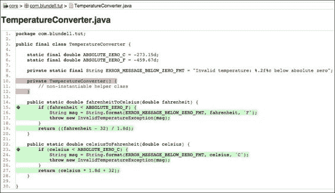

默认情况下，Android Studio 不支持 Jacoco gradle 插件；因此，你无法在 IDE 中看到代码覆盖率，所以代码覆盖率必须作为单独的 HTML 报告查看。其他插件，如 Atlassian 的 Clover 或带有 EclEmma 的 Eclipse，也提供了其他选项。

测试应当自动化，并且每次你对代码进行更改或添加时，都应该运行一些或全部的测试，以确保之前满足的所有条件仍然满足，并且新代码能够如预期那样通过测试。

这引导我们介绍了**持续集成**，这将在第五章《发现持续集成》中详细讨论，它使得测试和构建过程的自动化成为可能。

如果你没有使用自动化测试，实际上将无法把持续集成作为开发过程的一部分，并且很难确保更改不会破坏现有代码。

拥有测试可以防止你在接触代码库时，将新的错误引入已经完成的功能中。这些回归很容易发生，而测试是防止这种情况发生的屏障。此外，你现在可以在编译时捕捉和发现问题，即在你开发时，而不是在用户开始抱怨时收到反馈。 

## 应该测试什么

严格来说，你应该测试你的代码中的每一条语句，但这也取决于不同的标准，可以简化为测试执行的主路径或仅一些关键方法。通常，无需测试那些不可能出错的内容；例如，测试 getters 和 setters 通常没有意义，因为你可能不会在自己的代码上测试 Java 编译器，而且编译器已经执行了其测试。

除了你应该测试的特定于域的功能区域之外，还有一些其他需要考虑的 Android 应用程序区域。我们将在以下部分查看这些内容。

### 活动生命周期事件

你应该测试你的活动是否正确处理了生命周期事件。

如果你的活动需要在`onPause()`或`onDestroy()`事件期间保存其状态，并在之后的`onCreate(Bundle savedInstanceState)`中恢复它，那么你应该能够复现并测试所有这些条件，并验证状态是否正确保存和恢复。

也应该测试配置更改事件，因为其中一些事件会导致当前活动被重新创建。你应该测试事件处理是否正确，以及新创建的活动是否保持了之前的状态。配置更改甚至可以由设备旋转触发，因此你应该测试你的应用程序处理这些情况的能力。

### 数据库和文件系统操作

应该测试数据库和文件系统操作，以确保操作和任何错误都能被正确处理。这些操作应该在较低的操作系统级别孤立测试，通过`ContentProviders`在较高级别测试，或者直接从应用程序测试。

为了孤立测试这些组件，Android 在`android.test.mock`包中提供了一些模拟对象。简单来说，可以将模拟对象视为真实对象的直接替代品，在这里您可以更控制对象的行为。

### 设备的物理特性

在发布您的应用程序之前，您应该确保它可以在所有不同的设备上运行，或者至少应该检测到不受支持的情况并采取适当的措施。

您应该测试的设备特性包括：

+   网络功能

+   屏幕密度

+   屏幕分辨率

+   屏幕尺寸

+   传感器的可用性

+   键盘和其他输入设备

+   GPS

+   外部存储

在这方面，Android 模拟器可以发挥重要作用，因为实际上不可能访问到具有所有可能功能组合的所有设备，但您可以为几乎每种情况配置模拟器。然而，如前所述，将最终的测试留给实际设备，以便真实用户可以运行应用程序，从而从真实环境中获得反馈。

# 测试类型

测试拥有多种框架，它们获得来自 Android SDK 和您选择的 IDE 不同程度上的支持。现在，我们将集中讨论如何使用具有完全 SDK 和 ASide 支持的 instrumented Android 测试框架来测试 Android 应用，稍后，我们将讨论其他选择。

根据采用的测试方法，测试可以在开发过程的任何时间实施。然而，我们将提倡在开发周期的早期阶段进行测试，甚至在完整的需求集被定义和编码过程开始之前。

根据被测试的代码，有几种不同类型的测试。无论其类型如何，测试应该验证一个条件，并将此评估的结果作为一个单一的布尔值返回，以指示测试的成功或失败。

## 单元测试

单元测试是由程序员编写的，面向其他程序员的测试，它应该隔离被测试的组件，并能以一种可重复的方式进行测试。这就是为什么单元测试和模拟对象通常放在一起的原因。您使用模拟对象来隔离单元与其依赖项，监控交互，并能够多次重复测试。例如，如果您的测试从数据库中删除了一些数据，您可能不希望数据真的被删除，这样在下一次运行测试时数据就找不到了。

JUnit 是 Android 上单元测试的事实标准。它是一个简单的开源框架，用于自动化单元测试，最初由 Erich Gamma 和 Kent Beck 编写。

Android 测试用例使用 JUnit 3（这即将在即将发布的 Google 版本中更改为 JUnit 4，但截至本文撰写之时，我们展示的是使用 JUnit 3 的示例）。这个版本没有注解，并使用内省来检测测试。

一个典型的 Android 仪器化 JUnit 测试可能如下所示：

```kt
public class MyUnitTestCase extends TestCase {

    public MyUnitTestCase() {
        super("testSomething");
    }

    public void testSomething() {
        fail("Test not implemented yet");
    }
}
```

### 提示

你可以从你在[`www.packtpub.com`](http://www.packtpub.com)的账户下载你所购买的所有 Packt 书籍的示例代码文件。如果你在其他地方购买了这本书，可以访问[`www.packtpub.com/support`](http://www.packtpub.com/support)注册，我们会直接将文件通过电子邮件发送给你。

以下部分将解释可用于构建测试用例的组件。请注意，这些组件以及与测试用例工作的模式不仅限于单元测试，它们也可以用于后续部分将要讨论的其他测试类型。

### `setUp()`方法

此方法被调用来初始化测试夹具（测试夹具是指测试及其周围代码状态）。

重写此方法，你可以有机会创建对象并初始化测试中将要使用的字段。值得注意的是，此设置在*每个测试之前*发生。

### `tearDown()`方法

此方法被调用来最终确定测试夹具。

重写它，你可以释放初始化或测试中使用的资源。同样，此方法在*每个测试之后*被调用。

例如，你可以在该方法中释放数据库或关闭网络连接。

在你的测试方法之前和之后，还有更多可以挂钩的方法，但这些方法很少使用，我们将在遇到时进行解释。

### 测试方法外部

JUnit 设计的方式是在一次遍历中构建整个测试实例树，然后在第二次遍历中执行测试。因此，测试运行器在测试执行期间会保持对所有测试实例的强引用。这意味着在包含许多测试实例的大型和长时间测试运行中，所有测试在完整测试运行结束之前都不会被垃圾回收。这对于 Android 和在有限设备上进行测试尤为重要，因为有些测试可能不是因为内在的失败，而是因为运行应用程序及其测试所需的内存量超过了设备限制而失败。

因此，如果你在测试中分配了外部或有限资源，如`Services`或`ContentProviders`，你有责任释放这些资源。例如，在`tearDown()`方法中显式地将对象设置为 null，允许在完整测试运行结束之前对其进行垃圾回收。

### 测试方法内部

所有以`test`开头的`public` `void`方法都将被视为测试。与 JUnit 4 不同，JUnit 3 不使用注解来发现测试，而是通过内省来查找它们的名字。Android 测试框架中提供了一些注解，如`@SmallTest`、`@MediumTest`或`@LargeTest`，它们不会将一个简单方法转换为测试，而是将它们组织在不同的类别中。最终，你将能够使用测试运行器只运行单个类别的测试。

通常，按照经验法则，以描述性的方式命名你的测试，并使用名词和被测试的条件。同时，记得测试异常和错误值，而不仅仅是测试正面情况。

例如，一些有效的测试和命名可能为：

+   `testOnCreateValuesAreLoaded()`

+   `testGivenIllegalArgumentThenAConversionErrorIsThrown()`

+   `testConvertingInputToStringIsValid()`

在测试执行期间，应将某些条件、副作用或方法返回与预期进行比较。为了简化这些操作，JUnit 提供了一整套`assert*`方法，用于将测试的预期结果与运行后的实际结果进行比较，如果不满足条件，则抛出异常。然后，测试运行器处理这些异常并显示结果。

这些方法被重载以支持不同的参数，包括：

+   `assertTrue()`

+   `assertFalse()`

+   `assertEquals()`

+   `assertNull()`

+   `assertNotNull()`

+   `assertSame()`

+   `assertNotSame()`

+   `fail()`

除了这些 JUnit 断言方法，Android 在两个专门的类中扩展了 Assert，提供了额外的测试：

+   `MoreAsserts`

+   `ViewAsserts`

#### 模拟对象

模拟对象是代替调用真实领域对象以实现单独测试单元的模仿对象。

通常，这是为了验证是否调用了正确的方法，但它们也可以帮助你的测试与周围代码隔离，能够独立运行测试并确保可重复性。

Android 测试框架支持模拟对象，这在编写测试时非常有用。你需要提供一些依赖关系才能编译测试。还有一些外部库可以在模拟时使用。

Android 测试框架在`android.test.mock`包中提供了多个类：

+   `MockApplication`

+   `MockContentProvider`

+   `MockContentResolver`

+   `MockContext`

+   `MockCursor`

+   `MockDialogInterface`

+   `MockPackageManager`

+   `MockResources`

几乎平台中任何可能与你的 Activity 交互的组件都可以通过实例化这些类之一来创建。

然而，它们并不是真正的实现，而是存根。你需要扩展这些类之一来创建一个真正的模拟对象并覆盖你想实现的方法。任何你没有覆盖的方法将抛出`UnsupportedOperationException`。

## 集成测试

集成测试旨在测试各个组件一起工作的情况。已经独立进行单元测试的模块现在被组合在一起，以测试集成情况。

通常，Android 活动需要与系统基础设施集成才能运行。它们需要`ActivityManager`提供的活动生命周期，以及访问资源、文件系统和数据库。

同样的标准适用于其他需要与系统其他部分交互以完成任务的 Android 组件，如`Services`或`ContentProviders`。

在所有这些情况下，Android 测试框架提供了一些专门的测试类，便于为这些组件创建测试。

### 用户界面测试

用户界面测试检查应用程序的视觉表现，例如对话框的外观或当对话框被关闭时 UI 的变化。

如果你的测试涉及到 UI 组件，应该特别考虑。你可能已经知道，在 Android 中只允许主线程修改 UI。因此，使用特殊的注解`@UIThreadTest`来指示特定的测试应该在那个线程上运行，并且能够修改 UI。另一方面，如果你只想在 UI 线程上运行测试的部分内容，你可以使用`Activity.runOnUiThread(Runnable r)`方法，该方法提供了相应的`Runnable`，其中包含测试指令。

还提供了一个帮助类`TouchUtils`，以辅助 UI 测试的创建，允许生成以下事件发送到视图：

+   点击

+   拖动

+   长按

+   滚动

+   点击

+   触摸

通过这些方式，你实际上可以从测试中远程控制你的应用程序。另外，Android 最近引入了 Espresso 用于 UI 自动化测试，我们将在第三章*测试配方烘焙*中进行介绍。

## 功能测试或验收测试

在敏捷软件开发中，功能测试或验收测试通常由业务和质量管理（QA）人员创建，并使用业务领域语言表达。这些是高层次的测试，用于验证用户故事或功能的完整性和正确性。理想情况下，这些测试是通过业务客户、业务分析师、QA、测试人员和开发人员的协作创建的。然而，业务客户（产品所有者）是这些测试的主要所有者。

一些框架和工具可以在这个领域提供帮助，例如 Calabash（[`calaba.sh`](http://calaba.sh)）或特别值得一提的是 FitNesse（[`www.fitnesse.org`](http://www.fitnesse.org)），它们在一定程度上可以轻松集成到 Android 开发过程中，并允许你创建验收测试并检查结果如下：

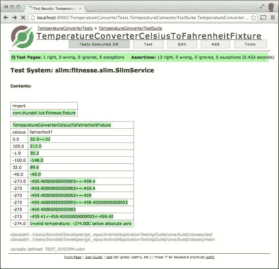

近期，在验收测试中，一种名为**行为驱动开发**（Behavior-driven Development）的新趋势逐渐流行起来。简而言之，它可以被视为测试驱动开发（Test-driven Development）的近亲。其目标是为商业和技术人员提供一个共同的词汇，以增加相互理解。

行为驱动开发可以表达为一个基于三个原则的活动框架（更多信息可以在 [`behaviour-driven.org`](http://behaviour-driven.org) 找到）：

+   商业和技术应当以相同的方式指代同一系统

+   任何系统都应该对商业有一个明确且可验证的价值

+   前期的分析、设计和规划，其回报都在递减

为了应用这些原则，商业人员通常会参与用高级语言编写测试案例场景，并使用如**jbehave**（[`jbehave.org`](http://jbehave.org)）之类的工具。在以下示例中，这些场景被翻译成了表达相同测试场景的 Java 代码。

### 测试案例场景

作为这项技术的说明，这里有一个过于简化的例子。

产品所有者编写的场景如下：

```kt
Given I'm using the Temperature Converter.
When I enter 100 into Celsius field.
Then I obtain 212 in Fahrenheit field.
```

它会被翻译成类似这样的东西：

```kt
@Given("I am using the Temperature Converter")
public void createTemperatureConverter() {
    // do nothing this is syntactic sugar for readability
}

@When("I enter $celsius into Celsius field")
public void setCelsius(int celsius) {
    this.celsius = celsius;
}

@Then("I obtain $fahrenheit in Fahrenheit field")
public void testCelsiusToFahrenheit(int fahrenheit) {
    assertEquals(fahrenheit, 
                 TemperatureConverter.celsiusToFahrenheit(celsius));
}
```

这使得程序员和商业用户都能够使用领域语言（在本例中是温度转换），并且都能够将其与日常工作联系起来。

## 性能测试

性能测试以可重复的方式测量组件的性能特性。如果应用程序的某些部分需要性能改进，最佳的方法是在引入更改前后测量性能。

众所周知，过早的优化弊大于利，因此最好清楚地了解你的更改对整体性能的影响。

Android 2.2 中引入的**Dalvik JIT**编译器改变了一些在 Android 开发中广泛使用的优化模式。如今，Android 开发者网站上关于性能改进的每一条建议都有性能测试作为支撑。

## 系统测试

系统作为一个整体进行测试，组件、软件和硬件之间的交互得到锻炼。通常，系统测试包括如下额外的测试类别：

+   GUI 测试

+   冒烟测试

+   变异测试

+   性能测试

+   安装测试

### Android Studio 和其他 IDE 支持

JUnit 完全得到 Android Studio 的支持，它允许你创建经过测试的 Android 项目。此外，你还可以在不离开 IDE 的情况下运行测试并分析结果（在一定程度上）。

这还提供了一个更微妙的优点；能够从 IDE 中运行测试，允许你调试那些行为不正确的测试。

在以下截图中，我们可以看到 ASide 运行了**19 个单元测试**，耗时 1.043 秒，检测到**0**个**错误**和**0**个**失败**。每个测试的名称及其持续时间也显示出来。如果出现失败，**失败** **追踪**将显示相关信息，如下面的截图所示：

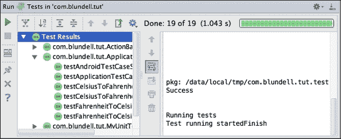

Eclipse IDE 也通过使用 Android Development Tools 插件支持安卓。

即使你不在 IDE 中开发，你也可以找到支持使用 gradle 运行测试的方法（如果你不熟悉这个工具，请查看[`gradle.org`](http://gradle.org)）。测试是通过使用命令`gradle connectedAndroidTest`运行的。这将安装并在连接的安卓设备上为调试版本运行测试。

这实际上与 Android Studio 在后台使用的方法相同。ASide 将运行 Gradle 命令来构建项目并运行测试，尽管是选择性编译。

# Java 测试框架

Java 测试框架是安卓测试的支柱，有时你可以不编写针对安卓特定的代码。这可以是一件好事，因为随着我们继续测试任务，你会注意到我们将安卓框架测试部署到设备上，这对我们测试的速度有影响，即我们从测试通过或失败中获取反馈的速度。

如果你巧妙地架构你的应用程序，你可以创建纯 Java 类，可以在脱离安卓的环境中进行隔离测试。这样做的两个主要好处是提高测试结果反馈的速度，并且可以快速将库和代码片段组合起来创建强大的测试套件，你可以利用其他程序员近十年的 Java 测试经验。

# 安卓测试框架

安卓提供了一个非常先进的测试框架，它扩展了行业标准 JUnit 库，具有适合实现我们之前提到的所有测试策略和类型的具体特性。在某些情况下，需要额外的工具，但大多数情况下，这些工具的集成是简单直接的。

安卓测试环境最相关的主要特性包括：

+   安卓扩展了 JUnit 框架，提供访问安卓系统对象的功能

+   一个允许测试控制和检查应用程序的仪器化框架

+   常用安卓系统对象的模拟版本

+   运行单个测试或测试套件的工具，可以选择是否使用仪器化

+   支持在 Android Studio 和命令行中管理和测试测试项目和测试

## 仪器化

仪器化框架是测试框架的基础。仪器化控制被测应用程序，并允许注入应用程序运行所需的模拟组件。例如，你可以在应用程序启动之前创建模拟上下文，并让应用程序使用它。

使用这种方法可以控制应用与周围环境的所有交互。你还可以在受限环境中隔离你的应用，以便能够预测某些方法返回的强制值，或者为 `ContentProvider` 的数据库甚至文件系统内容模拟持久且不变的数据。

一个标准的 Android 项目将在一个关联的源文件夹 `androidTest` 中拥有它的仪器测试，这创建了一个在应用上运行测试的独立应用。这里没有 `AndroidManifest`，因为它是自动生成的。你可以在 `build.gradle` 文件中的 Android 闭包内自定义仪器，这些更改将反映在自动生成的 `AndroidManifest` 中。但是，如果你选择不做任何更改，你仍然可以使用默认设置运行你的测试。

你可以更改的一些示例包括测试应用包名、你的测试运行器，或者如何切换性能测试特性：

```kt
  testApplicationId "com.blundell.something.non.default"
  testInstrumentationRunner  "com.blundell.tut.CustomTestRunner"
  testHandleProfiling false
  testFunctionalTest true
  testCoverageEnabled true
```

在这里，Instrumentation 包（`testApplicationId`）与主应用是不同的包。如果你不自己更改这个，它将默认使用你的主应用包，并在后面加上 `.test` 后缀。

然后，声明了仪器测试运行器，如果你创建自定义注释以允许特殊行为，这将很有帮助；例如，每次测试失败时运行两次。如果没有声明运行器，将使用默认的自定义运行器 `android.test.InstrumentationTestRunner`。

目前，`testHandleProfiling` 和 `testFunctionalTest` 尚未记录且未被使用，因此请留意当我们被告知可以如何使用这些功能时。将 `testCoverageEnabled` 设置为 true 将允许你使用 Jacoco 收集代码覆盖率报告。我们稍后会回到这个话题。

同时，请注意，被测试的应用和测试本身都是 Android 应用，并安装有相应的 APK。在内部，它们将共享同一个进程，因此可以访问相同的功能集。

当你运行一个测试应用时，**活动管理器**（[`developer.android.com/intl/de/reference/android/app/ActivityManager.html`](http://developer.android.com/intl/de/reference/android/app/ActivityManager.html)）使用仪器框架来启动和控制测试运行器，后者又使用仪器来关闭主应用的任何运行实例，启动测试应用，然后在同一进程中启动主应用。这使得测试应用的各个方面能够直接与主应用交互。

## Gradle

Gradle 是一个高级构建工具集，它允许你管理依赖项并定义自定义登录以构建你的项目。Android 构建系统是建立在 Gradle 之上的一个插件，正是它为你提供了前面讨论过的特定领域语言，例如设置 `testInstrumentationRunner`。

使用 Gradle 的理念是它允许你从命令行构建你的 Android 应用，而不需要使用 IDE，例如持续集成机器。此外，随着 Gradle 集成到 Android Studio 中的项目构建中，你从 IDE 或命令行获得完全相同的自定义构建配置。

其他好处包括能够自定义和扩展构建过程；例如，每次你的 CI 构建项目时，你可以自动将测试版 APK 上传到 Google Play 商店。你可以使用相同的项目创建具有不同功能的多个 APK，例如，一个针对 Google Play 应用内购买的版本，另一个针对亚马逊应用商店的硬币支付版本。

Gradle 和 Android Gradle 插件是一个强大的组合，因此，在本书的剩余示例中，我们将使用这个构建框架。

## 测试目标

在你的开发项目的发展过程中，你的测试将针对不同的设备。从在模拟器上的简单性、灵活性和测试速度，到不可避免地在特定设备上进行最终测试，你应当能够在所有这些设备上运行你的应用程序。

也有一些中间情况，例如在本地 JVM 虚拟机上、开发计算机上或根据情况在 **Dalvik** 虚拟机或活动上运行你的测试。

每种情况都有其优缺点，但好消息是，你有所有这些可用的选择来运行你的测试。

模拟器可能是最强大的目标，因为你几乎可以修改其配置中的每个参数来模拟不同的测试条件。最终，你的应用程序应该能够处理所有这些情况，所以最好提前发现这些问题，而不是在应用程序交付后再发现。

真实设备是性能测试的要求，因为从模拟设备中推断性能测量有些困难。只有在使用真实设备时，你才能享受到真实的用户体验。渲染、滚动、抛动和其他情况在交付应用程序之前应该被测试。

# 创建 Android 项目

我们将创建一个新的 Android 项目。这可以通过访问 ASide 菜单，选择**文件** | **新建项目**来完成。这将引导我们通过 wysiwyg 向导来创建项目。

在这个特定情况下，我们为所需的组件名称使用以下值（在屏幕间点击**下一步**按钮）：

+   应用程序名称：AndroidApplicationTestingGuide

+   公司域名：blundell.com

+   形式因素：手机和平板电脑

+   最小 SDK 版本：17

+   添加一个活动：空白活动（使用默认名称）

下面的截图显示了表单编辑器开始的参考：

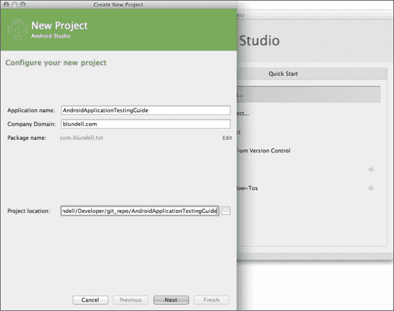

当你点击**完成**并且应用程序创建后，它将自动在`app/src`目录下生成`androidTest`源文件夹，你可以在这里添加你的仪器测试用例。

### 提示

或者，要为现有的 Gradle Android 项目创建一个 androidTest 文件夹，你可以选择 src 文件夹，然后转到**文件** | **新建** | **目录**。然后在对话框提示中写入`androidTest/java`。当项目重建时，该路径将自动添加，以便你可以创建测试。

## 包资源管理器

创建项目后，项目视图应该与以下截图所示的一个图像类似。这是因为 ASide 有多个展示项目大纲的方式。在左侧，我们可以注意到两个源目录的存在，一个用于测试源，显示为绿色，另一个用于项目源，显示为蓝色。在右侧，我们有新的 Android 项目视图，它试图通过压缩无用的和合并功能相似的文件夹来简化层次结构。

现在我们已经建立了基本的基础设施，是时候开始添加一些测试了，如下面的截图所示：

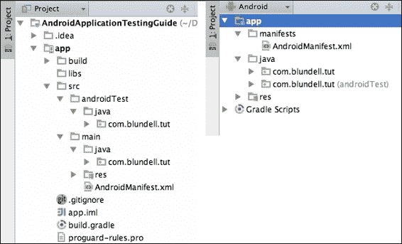

现在没有什么可以测试的，但当我们正在建立测试驱动开发（Test-driven Development）的基础时，我们添加了一个虚拟测试，只是为了熟悉这项技术。

在`AndroidApplicationTestingGuide`项目中的`src/androidTest/java`文件夹是添加测试的完美位置。如果你真的想要，可以声明一个不同的文件夹，但我们坚持使用默认设置。包应该与被测试组件的相应包相同。

目前，我们关注的是测试的概念和位置，而不是测试内容。

## 创建测试用例

如前所述，我们正在项目的`src/androidTest/java`文件夹中创建我们的测试用例。

你可以通过右键点击包并选择新建... | Java 类手动创建文件。然而，在这个特定的情况下，我们将利用 ASide 来创建我们的 JUnit 测试用例。打开待测试的类（在本例中，是 MainActivity），并在类名上悬停，直到你看到一个灯泡（或者按*Ctrl*/*Command* + `1`）。从出现的菜单中选择**创建测试**。

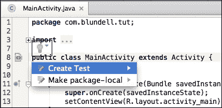

创建测试用例时，我们应该输入以下这些值：

+   **测试库**: JUnit 3

+   **类名**: MainActivityTest

+   **超类**: junit.framework.TestCase

+   **目标包**: com.blundell.tut

+   **超类**: junit.framework.TestCase

+   **生成**: 选择无

输入所有必需的值后，我们的 JUnit 测试用例创建对话框将如下所示。

如你所见，你也可以检查类的一个方法以生成一个空的测试方法存根。这些存根方法在某些情况下可能很有用，但你要考虑测试应该是一个行为驱动的过程，而不是一个方法驱动的过程。

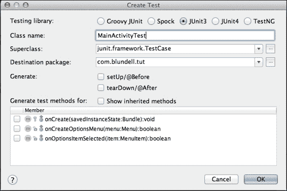

我们测试的基本基础设施已经就位；剩下的就是添加一个虚拟测试，以验证一切是否按预期工作。现在我们有了测试用例模板，下一步是开始完善它以满足我们的需求。为此，打开最近创建的测试类并添加`testSomething()`测试。

我们应该有类似这样的内容：

```kt
package com.blundell.tut;

import android.test.suitebuilder.annotation.SmallTest;

import junit.framework.TestCase;

public class MainActivityTest extends TestCase {

    public MainActivityTest() {
        super("MainActivityTest");
    }

    @SmallTest
    public void testSomething() throws Exception {
        fail("Not implemented yet");
    }
}
```

### 提示

无参数构造函数是运行从命令行指定的特定测试所必需的，稍后使用 am instrumentation 时会解释这一点。

这个测试将始终失败，并显示消息：**尚未实现**。为了做到这一点，我们将使用`junit.framework.Assert`类中的 fail 方法，该方法会使用给定的消息使测试失败。

## 测试注解

仔细查看测试定义，你可能会注意到我们使用了`@SmallTest`注解来装饰测试，这是一种组织或分类我们的测试并单独运行它们的方法。

还有一些其他测试可以使用的注解，例如：

| 注解 | 描述 |
| --- | --- |
| `@SmallTest` | 标记为作为小型测试的一部分运行的测试。 |
| `@MediumTest` | 标记为作为中型测试的一部分运行的测试。 |
| `@LargeTest` | 标记为作为大型测试的一部分运行的测试。 |
| `@Smoke` | 标记为作为冒烟测试的一部分运行的测试。`android.test.suitebuilder.SmokeTestSuiteBuilder`将运行所有带有此注解的测试。 |
| `@FlakyTest` | 在`InstrumentationTestCase`类的测试方法上使用此注解。当存在此注解时，如果测试失败，将重新执行测试方法。执行的总次数由容差指定，默认为 1。这对于可能因随时间变化的外部条件而失败的测试很有用。例如，要指定容差为 4，你可以使用以下注解：`@FlakyTest(tolerance=4)`。 |

| `@UIThreadTest` | 在`InstrumentationTestCase`类的测试方法上使用此注解。当存在此注解时，测试方法将在应用程序的主线程（或 UI 线程）上执行。由于在存在此注解时可能无法使用 instrumentation 方法，因此，例如，如果你需要在同一测试中修改 UI 并获取 instrumentation 的访问权限，则可以使用其他技术。在这种情况下，你可以使用`Activity.runOnUIThread()`方法，它允许你创建任何 Runnable 并在 UI 线程中从你的测试中运行它。|

```kt
mActivity.runOnUIThread(new Runnable() {
public void run() {
// do somethings
}
});
```

|

| `@Suppress` | 在不应该包含在测试套件中的测试类或测试方法上使用此注解。此注解可以用在类级别，这样该类中的所有方法都不会包含在测试套件中；或者用在方法级别，仅排除一个或一组方法。 |
| --- | --- |

既然我们已经有了测试用例，现在是时候运行它们了，接下来我们将要进行这一步。

## 运行测试

有多种运行我们的测试的方法，我们将在下面进行分析。

此外，如前文关于注解的部分所述，根据情况，测试可以分组或分类并一起运行。

### 从 Android Studio 运行所有测试

如果你已经采用 ASide 作为你的开发环境，这可能是最简单的方法。这将运行包中的所有测试。

在你的项目中选择应用模块，然后转到 **运行** | **(安卓图标) 所有测试**。

如果没有找到合适的设备或模拟器，系统会提示你启动或连接一个。

测试随后运行，结果会在运行视图中展示，如下面的屏幕截图所示：

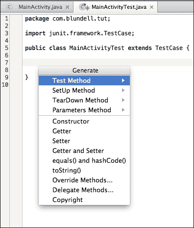

在 Android DDMS 视图中，也可以在 LogCat 视图中获得测试执行期间产生的结果和消息的更详细视图，如下面的屏幕截图所示：

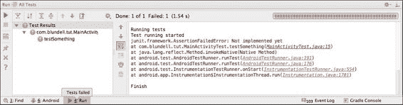

### 从你的 IDE 运行单个测试用例

如果你需要，也可以从 ASide 运行单个测试用例。打开存放测试的文件，右键点击你想要运行的方法名，就像运行所有测试一样，选择 **运行** | **(安卓图标) testMethodName**。

当你运行这个时，像往常一样，只有这个测试会被执行。在我们的例子中，我们只有一个测试，所以结果将类似于前面展示的屏幕截图。

### 注意

这样运行单个测试是一个快捷方式，实际上为你创建了一个针对该方法的特定运行配置。如果你想查看这方面的详细信息，从菜单中选择 **运行** | **编辑配置**，在 **Android 测试** 下，你应该能看到你刚刚执行的测试的配置名称。

### 从模拟器运行

模拟器使用的默认系统映像中安装了 Dev Tools 应用程序，提供了许多便捷的工具和设置。在这些工具中，我们可以找到一个相当长的列表，如下面的屏幕截图所示：

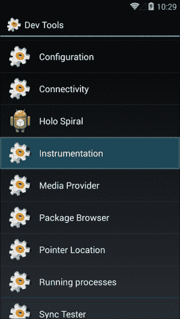

现在，我们关注的是**Instrumentation**，这是我们运行测试的方法。此应用程序列出了所有在项目中定义了 instrumentation 标签测试的已安装包。我们可以根据包名选择我们的测试，如下面的屏幕截图所示：

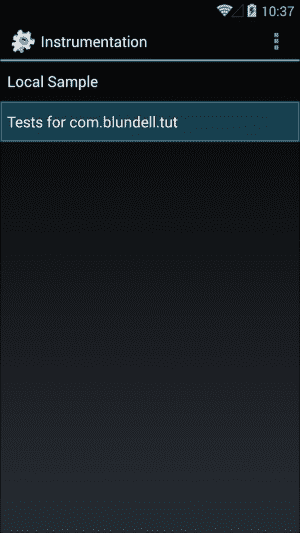

以这种方式运行测试时，结果可以通过 DDMS / LogCat 查看，如前一部分所述。

### 从命令行运行测试

最后，也可以从命令行运行测试。如果你想要自动化或脚本化这个过程，这很有用。

要运行测试，我们使用 am instrument 命令（严格来说，是 am 命令和 instrument 子命令），它允许我们通过指定包名和其他一些选项来运行测试。

你可能想知道“am”代表什么。它是 Activity Manager 的简称，是 Android 内部基础设施的主要组成部分，系统服务器在启动过程中启动它，并负责管理 Activities 及其生命周期。此外，如我们所见，它也负责 Activity 的测试。

am instrument 命令的一般用法是：

```kt
am instrument [flags] <COMPONENT> -r -e <NAME> <VALUE> -p <FILE>-w

```

下表总结了最常用的选项：

| 选项 | 描述 |
| --- | --- |
| `-r` | 打印原始结果。这有助于收集原始性能数据。 |
| `-e <NAME> <VALUE>` | 通过名称设置参数。我们很快就会讨论其用法。这是一个通用选项参数，允许我们设置`<名称, 值>`对。 |
| `-p <FILE>` | 将分析数据写入外部文件。 |
| `-w` | 在退出之前等待测试完成。这通常用于命令中。虽然不是强制性的，但非常有用，否则你将无法看到测试结果。 |

要调用 am 命令，我们将使用 adb shell 命令，或者如果你已经在模拟器或设备上运行了 shell，可以直接在 shell 命令提示符中发出 am 命令。

### 运行所有测试

此命令行将打开 adb shell，然后运行除性能测试之外的所有测试：

```kt
$: adb shell 
#: am instrument -w com.blundell.tut.test/android.test.InstrumentationTestRunner

com.blundell.tut.MainActivityTest:

```

`testSomething`的失败：

```kt
junit.framework.AssertionFailedError: Not implemented yet

at com.blundell.tut.MainActivityTest.testSomething(MainActivityTest.java:15)
at java.lang.reflect.Method.invokeNative(Native Method)
at android.test.AndroidTestRunner.runTest(AndroidTestRunner.java:191)
at android.test.AndroidTestRunner.runTest(AndroidTestRunner.java:176)
at android.test.InstrumentationTestRunner.onStart
 (InstrumentationTestRunner.java:554)
at android.app.Instrumentation$InstrumentationThread.run
 (Instrumentation.java:1701)

Test results for InstrumentationTestRunner=.F
Time: 0.002

FAILURES!!!
Tests run: 1,  Failures: 1,  Errors: 0

```

请注意，使用`–w`声明的包是你的测试包，而不是被测应用包。

### 从特定测试用例运行测试

要运行特定测试用例中的所有测试，你可以使用：

```kt
$: adb shell 
#: am instrument -w -e class com.blundell.tut.MainActivityTest com.blundell.tut.test/android.test.InstrumentationTestRunner

```

### 通过名称运行特定测试

此外，我们可以在命令行中指定要运行的测试：

```kt
$: adb shell 
#: am instrument -w -e class com.blundell.tut.MainActivityTest\#testSomething com.blundell.tut.test/android.test.InstrumentationTestRunner

```

除非我们的测试用例中有一个无参数构造函数，否则不能以这种方式运行此测试；这就是我们之前添加它的原因。

### 按类别运行特定测试

如前所述，可以使用注解（测试注解）将测试分组到不同的类别中，你可以运行此类别中的所有测试。

可以在命令行中添加以下选项：

| 选项 | 描述 |
| --- | --- |
| `-e unit true` | 这运行所有单元测试。这些测试不是从`InstrumentationTestCase`派生的（也不是性能测试）。 |
| `-e func true` | 这运行所有功能测试。这些测试是从`InstrumentationTestCase`派生的。 |
| `-e perf true` | 这包括性能测试。 |
| `-e size {small &#124; medium &#124; large}` | 这将根据添加到测试的注解运行小型、中型或大型测试。 |
| `-e annotation <注解名称>` | 这将运行带有此注解的测试。此选项与大小选项互斥。 |

在我们的示例中，我们将测试方法`testSomething()`用`@SmallTest`进行了注解。因此，这个测试被认为属于那个类别，并且当我们指定测试大小为小型时，最终会与其他属于同一类别的测试一起运行。

这个命令行将运行所有带有`@SmallTest`注解的测试：

```kt
$: adb shell 
#: am instrument -w -e size small com.blundell.tut.test/android.test.InstrumentationTestRunner

```

### 使用 Gradle 运行测试

你的 Gradle 构建脚本也可以帮助你运行测试，这实际上会在幕后执行前面的命令。Gradle 可以用以下命令运行你的测试：

```kt
gradle connectedAndroidTest

```

#### 创建自定义注解

如果你决定按照除大小之外的其他标准对测试进行排序，可以创建自定义注解，然后在命令行中指定。

例如，假设我们想根据测试的重要性来安排它们，因此我们创建了一个注解`@VeryImportantTest`，我们将在编写测试的任何类中使用它（例如`MainActivityTest`）：

```kt
package com.blundell.tut;

/**
 * Marker interface to segregate important tests
 */
@Retention(RetentionPolicy.RUNTIME)
public @interface VeryImportantTest {
}
```

接着，我们可以创建另一个测试并用`@VeryImportantTest`进行注解：

```kt
@VeryImportantTest
public void testOtherStuff() {
fail("Also not implemented yet");
}
```

因此，如我们之前提到的，我们可以将此注解包含在 am instrument 命令行中，只运行带注解的测试：

```kt
$: adb shell 
#: am instrument -w -e annotation com.blundell.tut.VeryImportantTest com.blundell.tut.test/android.test. InstrumentationTestRunner

```

#### 运行性能测试

我们将在第八章，*测试和性能分析*中回顾性能测试的细节，但在这里，我们将介绍 am instrument 命令可用的选项。

为了在测试运行中包含性能测试，你应该添加这个命令行选项：

+   `-e perf true`：这包括性能测试

#### 干运行

有时，你可能只需要知道将要运行哪些测试，而不是实际运行它们。

这是你需要添加到命令行的选项：

+   `-e log true`：这显示将要运行的测试，而不是实际运行它们。

如果你在编写测试脚本或可能构建其他工具，这会很有用。

## 调试测试

你应该假设你的测试也可能有错误。在这种情况下，适用常规的调试技术，例如，通过 LogCat 添加消息。

如果需要更复杂的调试技术，你应该将调试器附加到测试运行器上。

为了在不放弃 IDE 的便利性的同时做到这一点，并且不需要记住难以记忆的命令行选项，你可以**调试运行**你的运行配置。这样，你可以在测试中设置断点并使用它。要切换断点，你可以在编辑器中选择所需的行，并在边缘处左键点击。

完成后，你将进入一个标准的调试会话，调试窗口应该可供你使用。

从命令行调试测试也是可能的；你可以使用代码指令等待调试器附加。我们不使用这个命令；如果你需要更多详细信息，可以在([`developer.android.com/reference/android/test/InstrumentationTestRunner.html`](http://developer.android.com/reference/android/test/InstrumentationTestRunner.html))找到。

## 其他命令行选项

am instrument 命令接受除了前面提到的`<名称, 值>`对之外的其它对：

| 名称 | 值 |
| --- | --- |
| `debug` | `true`。在代码中设置断点。 |
| `package` | 这是测试应用中一个或多个完全限定包的名称。 |
| `class` | 一个由测试运行器执行的完全限定测试用例类。可选地，这可以包括由哈希(#)与类名分隔的测试方法名称。 |
| `coverage` | `true`。运行 EMMA 代码覆盖率，并将输出写入可以指定的文件中。我们将在第九章，*替代测试策略*中详细介绍如何为我们的测试支持 EMMA 代码覆盖率。 |

# 总结

我们已经回顾了 Android 测试背后的主要技术和工具。掌握了这些知识后，我们可以开始我们的旅程，以便在我们软件开发项目中利用测试的好处。

到目前为止，我们已经讨论了以下主题：

+   我们简要分析了测试的原因、内容、方法和时机。现在，既然你已经给予了测试应有的重视，我们将更专注于探索如何进行测试。

+   我们列举了在项目中可能需要的不同和最常见的测试类型，描述了一些我们可以依赖的测试工具箱中的工具，并提供了一个 JUnit 单元测试的介绍性示例，以便更好地理解我们正在讨论的内容。

+   我们还使用 Android Studio IDE 和 Gradle 创建了我们第一个带有测试的 Android 项目。

+   我们还创建了一个简单的测试类来测试项目中的 Activity。我们还没有添加任何有用的测试用例，但添加这些简单的用例是为了验证我们的基础设施。

+   我们还从 IDE 和命令行运行了这个简单的测试，以了解我们有哪些替代方案。在这个过程中，我们提到了活动管理器及其命令行化身 am。

+   我们创建了一个自定义注解来排序我们的测试，并演示如何分离或区分测试套件。

在下一章中，我们将更详细地分析提到的技术、框架和工具，并提供它们使用示例。
