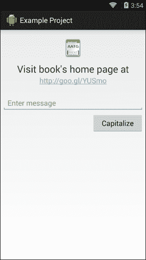

# 第二章：理解使用 Android SDK 进行测试

我们现在知道如何在 Android 项目中创建测试以及如何运行这些测试。现在是时候更深入地挖掘，以识别可用于创建更有用的测试的构建块。

在本章中，我们将涵盖以下主题：

+   常见断言

+   视图断言

+   其他断言类型

+   用于测试用户界面的辅助工具

+   模拟对象

+   检测

+   `TestCase`类层次结构

+   使用外部库

我们将分析这些组件，并在适用的情况下展示它们的使用示例。本章中的示例故意从包含它们的原始 Android 项目中分离出来。这样做是为了让您集中精力只关注所呈现的主题，尽管可以按照后面的说明下载包含在一个项目中的完整示例。现在，我们关注的是树木，而不是森林。

在呈现的示例中，我们将识别可重用的常见模式，这将帮助您为自己的项目创建测试。

# 演示应用程序

已经创建了一个非常简单的应用程序，以演示本章中一些测试的使用。该应用程序的源代码可以从 XXXXXXXXXXXX 下载。

下面的屏幕截图展示了这个应用程序的运行情况：



在阅读本章中的测试解释时，您可以随时参考提供的演示应用程序，以查看测试的实际效果。前面的简单应用程序有一个可点击的链接、文本输入、点击按钮和定义的布局 UI，我们可以逐一测试这些。

# 断言深入理解

断言是检查可以评估的条件的方法。如果条件不满足，断言方法将抛出异常，从而终止测试的执行。

JUnit API 包含了`Assert`类。这是所有`TestCase`类的基类，其中包含多种用于编写测试的断言方法。这些继承的方法用于测试各种条件，并且为了支持不同的参数类型而被重载。根据检查的条件，它们可以分为以下不同的组，例如：

+   `assertEquals`

+   `assertTrue`

+   `assertFalse`

+   `assertNull`

+   `assertNotNull`

+   `assertSame`

+   `assertNotSame`

+   `fail`

被测试的条件非常明显，通过方法名称可以轻松识别。可能需要关注的是`assertEquals()`和`assertSame()`。前者在对象上使用时，断言传递的参数对象通过调用对象的`equals()`方法是相等的。后者断言两个对象引用同一个对象。如果某些情况下，类没有实现`equals()`，那么`assertEquals()`和`assertSame()`将执行相同的操作。

当测试中的一个断言失败时，将抛出`AssertionFailedException`，这表示测试已经失败。

在开发过程中，有时您可能需要创建一个当时并未实现的测试。但是，您希望标记该测试的创建已推迟（我们在第一章，*开始测试*中添加了测试方法存根）。在这种情况下，您可以使用总是失败并使用自定义消息指明条件的`fail()`方法：

```kt
  public void testNotImplementedYet() {
    fail("Not implemented yet");
  }
```

然而，`fail()`还有另一个常见的用途值得一提。如果我们需要测试一个方法是否抛出异常，我们可以用 try-catch 块包围代码，并在没有抛出异常时强制失败。例如：

```kt
public void testShouldThrowException() {
    try {
      MyFirstProjectActivity.methodThatShouldThrowException();
      fail("Exception was not thrown");
    } catch ( Exception ex ) {
      // do nothing
    }
  }
```

### 注意

JUnit4 有一个注解`@Test(expected=Exception.class)`，这取代了在测试异常时使用`fail()`的需要。使用这个注解，只有当预期的异常被抛出时，测试才会通过。

## 自定义消息

值得知道的是，所有的`assert`方法都提供了一个包含自定义`String`消息的重载版本。如果断言失败，测试运行器将打印这个自定义消息，而不是默认消息。

这背后的前提是，有时，通用错误消息没有透露足够的信息，而且测试失败的原因并不明显。自定义消息在查看测试报告时可以极大地帮助轻松识别失败，因此强烈建议作为最佳实践使用这个版本。

以下是一个使用此建议的简单测试示例：

```kt
public void testMax() {
int a = 10;
int b = 20;

int actual = Math.max(a, b);

String failMsg = "Expected: " + b + " but was: " + actual;
assertEquals(failMsg, b, actual);
}
```

在前面的示例中，我们可以看到另一个实践，这将帮助您轻松组织和理解测试。这就是为保存实际值的变量使用明确的名称。

### 注意

还有其他一些库提供了更好的默认错误消息以及更流畅的测试界面。其中一个值得一看的是 Fest（[`code.google.com/p/fest/`](https://code.google.com/p/fest/)）。

## 静态导入

尽管基本的断言方法是从 Assert 基类继承而来的，但某些其他断言需要特定的导入。为了提高测试的可读性，有一个模式是从相应类静态导入断言方法。使用这种模式，而不是：

```kt
  public void testAlignment() {
 int margin = 0;
   ...
 android.test.ViewAsserts.assertRightAligned(errorMsg, editText, margin);
  }
```

我们可以通过添加静态导入来简化它：

```kt
import static android.test.ViewAsserts.assertRightAligned;

public void testAlignment() {
   int margin = 0;
 assertRightAligned(errorMsg, editText, margin);
}
```

# 视图断言

之前引入的断言处理了各种类型的参数，但它们仅用于测试简单条件或简单对象。

例如，我们有`assertEquals(short expected, short actual)`来测试`short`值，`assertEquals(int expected, int actual)`来测试整数值，`assertEquals(Object expected, Object actual)`来测试任何`Object`实例等。

通常，在 Android 中测试用户界面时，你会遇到更复杂的方法，这些方法主要与视图有关。在这方面，Android 提供了一个包含大量断言的类`android.test.ViewAsserts`（更多详情请见[`developer.android.com/reference/android/test/ViewAsserts.html`](http://developer.android.com/reference/android/test/ViewAsserts.html)），用于测试视图之间以及它们在屏幕上的绝对和相对位置关系。

这些方法也提供了重载以提供不同的条件。在断言中，我们可以找到以下内容：

+   `assertBaselineAligned`：此断言用于判断两个视图是否基于基线对齐，即它们的基线是否在同一 y 位置。

+   `assertBottomAligned`：此断言用于判断两个视图是否底部对齐，即它们的底部边缘是否在同一 y 位置。

+   `assertGroupContains`：此断言用于判断指定组是否包含一个特定的子视图，且仅包含一次。

+   `assertGroupIntegrity`：此断言用于判断指定组的完整性。子视图数量应大于等于 0，每个子视图都不应为空。

+   `assertGroupNotContains`：此断言用于判断指定组不包含特定的子视图。

+   `assertHasScreenCoordinates`：此断言用于判断一个视图在可见屏幕上是否有特定的 x 和 y 位置。

+   `assertHorizontalCenterAligned`：此断言用于判断测试视图相对于参考视图是否水平居中对齐。

+   `assertLeftAligned`：此断言用于判断两个视图是否左对齐，即它们的左侧边缘是否在同一 x 位置。也可以提供一个可选的边距。

+   `assertOffScreenAbove`：此断言用于判断指定视图是否位于可见屏幕上方。

+   `assertOffScreenBelow`：此断言用于判断指定视图是否位于可见屏幕下方。

+   `assertOnScreen`：此断言用于判断一个视图是否在屏幕上。

+   `assertRightAligned`：此断言用于判断两个视图是否右对齐，即它们的右侧边缘是否在同一 x 位置。也可以指定一个可选的边距。

+   `assertTopAligned`：此断言用于判断两个视图是否顶部对齐，即它们的顶部边缘是否在同一 y 位置。也可以指定一个可选的边距。

+   `assertVerticalCenterAligned`：此断言用于判断测试视图相对于参考视图是否垂直居中对齐。

下面的示例展示了如何使用`ViewAssertions`来测试用户界面布局：

```kt
  public void testUserInterfaceLayout() {
    int margin = 0;
    View origin = mActivity.getWindow().getDecorView();
    assertOnScreen(origin, editText);
    assertOnScreen(origin, button);
    assertRightAligned(editText, button, margin);
  }
```

`assertOnScreen`方法使用一个原点来查找请求的视图。在这种情况下，我们使用顶层窗口装饰视图。如果由于某些原因，你不需要在层次结构中那么高，或者这种方法不适用于你的测试，你可以在层次结构中使用另一个根视图，例如`View.getRootView()`，在我们的具体示例中，将是`editText.getRootView()`。

# 更多的断言

如果之前审查的断言似乎不足以满足您的测试需求，Android 框架中仍然包含另一个类，涵盖了其他情况。这个类是`MoreAsserts`（[`developer.android.com/reference/android/test/MoreAsserts.html`](http://developer.android.com/reference/android/test/MoreAsserts.html)）。

这些方法也支持不同的参数类型重载。在断言中，我们可以找到以下几种：

+   `assertAssignableFrom`：此断言一个对象可以分配给一个类。

+   `assertContainsRegex`：此断言预期的 Regex 匹配指定`String`的任何子字符串。如果不符合则使用指定的消息失败。

+   `assertContainsInAnyOrder`：此断言指定的`Iterable`包含精确预期的元素，但顺序不限。

+   `assertContainsInOrder`：此断言指定的`Iterable`包含精确预期的元素，并且顺序相同。

+   `assertEmpty`：此断言一个`Iterable`是空的。

+   `assertEquals`：这是针对一些 JUnit 断言中未涉及的`Collections`。

+   `assertMatchesRegex`：此断言指定的`Regex`必须完全匹配`String`，如果不匹配则提供消息失败。

+   `assertNotContainsRegex`：此断言指定的 Regex 不匹配指定 String 的任何子字符串，如果不匹配则提供消息失败。

+   `assertNotEmpty`：此断言一些在 JUnit 断言中未涉及的集合不是空的。

+   `assertNotMatchesRegex`：此断言指定的`Regex`不精确匹配指定的 String，如果匹配则提供消息失败。

+   `checkEqualsAndHashCodeMethods`：这是一个用于一次性测试`equals()`和`hashCode()`结果的工具。这测试应用在两个对象上的`equals()`是否与指定结果匹配。

下面的测试检查通过点击 UI 按钮调用的首字母大写方法在调用过程中是否出现错误：

```kt
@UiThreadTest
public void testNoErrorInCapitalization() {
String msg = "capitalize this text";
editText.setText(msg);

button.performClick();

String actual = editText.getText().toString();
String notExpectedRegexp = "(?i:ERROR)";
String errorMsg = "Capitalization error for " + actual;
assertNotContainsRegex(errorMsg, notExpectedRegexp, actual);
}
```

如果您不熟悉正则表达式，花些时间访问[`developer.android.com/reference/java/util/regex/package-summary.html`](http://developer.android.com/reference/java/util/regex/package-summary.html)，这是值得的！

在这个特定情况下，我们希望以不区分大小写的方式（为此设置标志`i`）匹配结果中包含的单词`ERROR`。也就是说，如果由于某种原因，在我们的应用程序中大小写不起作用，并且包含错误消息，我们可以使用这个断言检测这种情况。

### 注意

请注意，由于这是一个修改用户界面的测试，我们必须使用`@UiThreadTest`进行注解；否则，它将无法从不同的线程修改 UI，并且我们会收到以下异常：

```kt
INFO/TestRunner(610): ----- begin exception -----
INFO/TestRunner(610): android.view.ViewRoot$CalledFromWrongThreadException: Only the original thread that created a view hierarchy can touch its views.
INFO/TestRunner(610):     at android.view.ViewRoot.checkThread(ViewRoot.java:2932)
[...]
INFO/TestRunner(610):     at android.app.Instrumentation$InstrumentationThread.run(Instrumentation.java:1447)
INFO/TestRunner(610): ----- end exception -----
```

# TouchUtils 类

有时，在测试 UI 时，模拟不同类型的触摸事件会很有帮助。这些触摸事件可以通过多种方式生成，但可能使用`android.test.TouchUtils`是最简单的。这个类提供了可重用的方法，在从`InstrumentationTestCase`派生的测试用例中生成触摸事件。

这些特性方法允许与被测 UI 进行模拟交互。`TouchUtils`类提供了基础设施，以使用正确的 UI 或主线程注入事件，因此无需特殊处理，你也不需要在测试中使用`@UIThreadTest`注解。

TouchUtils 支持以下操作：

+   点击一个视图并释放

+   轻敲一个视图（触摸它并快速释放）

+   长点击一个视图

+   拖动屏幕

+   拖动视图

下面的测试代表了`TouchUtils`的典型使用方法：

```kt
    public void testListScrolling() {
        listView.scrollTo(0, 0);

        TouchUtils.dragQuarterScreenUp(this, activity); 
        int actualItemPosition = listView.getFirstVisiblePosition();

        assertTrue("Wrong position", actualItemPosition > 0);
    }
```

这个测试执行以下操作：

+   将列表重新定位到开始位置，以便从已知条件开始

+   滚动列表

+   检查第一个可见位置，以确认它是否正确滚动

即使是最复杂的 UI 也可以通过这种方式进行测试，它可以帮助你检测可能影响用户体验的各种条件。

# 模拟对象

我们在第一章《开始测试》中看到了 Android 测试框架提供的模拟对象，并评估了关于不使用真实对象将我们的测试与周围环境隔离开来的担忧。

下一章将介绍测试驱动开发（Test-driven Development），如果我们是测试驱动开发的纯粹主义者，我们可以讨论使用模拟对象的问题，更倾向于使用真实对象。Martin Fowler 在他的精彩文章《Mocks aren't stubs》中称这两种风格为经典的和模拟的测试驱动开发二分法，该文章可以在[`www.martinfowler.com/articles/mocksArentStubs.html`](http://www.martinfowler.com/articles/mocksArentStubs.html)在线阅读。

独立于这场讨论，我们将介绍模拟对象作为可用的构建块之一，因为有时在测试中使用模拟对象是推荐、可取、有用甚至不可避免的。

Android SDK 在子包`android.test.mock`中提供了以下类以帮助我们：

+   `MockApplication`：这是`Application`类的模拟实现。所有方法均不具备功能，并抛出`UnsupportedOperationException`。

+   `MockContentProvider`：这是`ContentProvider`的模拟实现。所有方法均不具备功能，并抛出`UnsupportedOperationException`。

+   `MockContentResolver`：这是`ContentResolver`类的模拟实现，它将测试代码与真实内容系统隔离开来。所有方法均不具备功能，并抛出`UnsupportedOperationException`。

+   `MockContext`：这是一个模拟上下文类，可以用来注入其他依赖项。所有方法均不具备功能，并抛出`UnsupportedOperationException`。

+   `MockCursor`：这是一个模拟的游标类，它将测试代码与实际的游标实现隔离开来。所有方法都是非功能性的，当使用时会抛出`UnsupportedOperationException`。

+   `MockDialogInterface`：这是`DialogInterface`类的模拟实现。所有方法都是非功能性的，当使用时会抛出`UnsupportedOperationException`。

+   `MockPackageManager`：这是`PackageManager`类的模拟实现。所有方法都是非功能性的，当使用时会抛出`UnsupportedOperationException`。

+   `MockResources`：这是一个模拟的`Resources`类。

所有这些类都具有非功能性的方法，当使用时将抛出`UnsupportedOperationException`。如果你需要使用其中一些方法，或者你发现你的测试因这个`Exception`而失败，你应该扩展这些基类之一并提供所需的功能。

## MockContext 概述

这个模拟可以用来将其他依赖项、模拟或监视器注入到被测试的类中。扩展这个类以提供你想要的行为，覆盖相应的方法。Android SDK 提供了一些预构建的模拟`Context`对象，每个对象都有单独的使用场景。

## IsolatedContext 类

在你的测试中，你可能会发现需要将正在测试的 Activity 与其他 Android 组件隔离开来，以防止不必要的交互。这可以是完全隔离，但有时，这种隔离避免了与其他组件的交互，为了让你的 Activity 仍然正确运行，需要与系统建立一些联系。

对于这些情况，Android SDK 提供了`android.test.IsolatedContext`，这是一个模拟的`Context`，它不仅阻止了与大部分底层系统的交互，还满足了与其他包或组件（如`Services`或`ContentProviders`）交互的需求。

## 文件和数据库操作的替代路径

在某些情况下，我们只需要能够为文件和数据库操作提供一条替代路径。例如，如果我们正在实际设备上测试应用程序，我们可能不希望影响现有的数据库，而是使用我们自己的测试数据。

这些情况可以利用另一个不属于`android.test.mock`子包，而是属于`android.test`的类，即`RenamingDelegatingContext`。

这个类允许我们通过在构造函数中指定的前缀来修改对文件和数据库的操作。所有其他操作都被委托给必须在构造函数中指定的委托上下文。

假设我们正在测试的`Activity`使用了一个我们想要控制的数据库，可能引入特殊内容或固定数据来驱动我们的测试，我们不想使用真实的文件。在这种情况下，我们创建一个`RenamingDelegatingContext`类，它指定了一个前缀，我们的未更改的 Activity 将使用这个前缀来创建任何文件。

例如，如果我们的 Activity 尝试访问一个名为`birthdays.txt`的文件，而我们提供了一个指定前缀`test`的`RenamingDelegatingContext`类，那么在测试时，这个相同的 Activity 将改为访问文件`testbirthdays.txt`。

## MockContentResolver 类

`MockContentResolver`类以非功能方式实现所有方法，如果你尝试使用它们，它会抛出`UnsupportedOperationException`异常。这个类的目的是将测试与真实内容隔离开来。

假设你的应用程序使用一个`ContentProvider`类来为你的 Activity 提供信息。你可以使用`ProviderTestCase2`为这个`ContentProvider`创建单元测试，我们稍后会进行分析，但是当我们尝试为 Activity 针对`ContentProvider`编写功能测试或集成测试时，就不太明显应该使用哪种测试用例。最明显的选择是`ActivityInstrumentationTestCase2`，尤其是如果你的功能测试模拟用户体验，因为你可能需要`sendKeys()`方法或类似的方法，而这些方法在这些测试中是可用的。

你可能遇到的第一个问题是，不清楚在哪里注入一个`MockContentResolver`以使你的测试能够使用`ContentProvider`的测试数据。也无法注入一个`MockContext`。

这个问题将在第三章，*使用测试配方烘焙*中得到解决，其中提供了更多细节。

# TestCase 基类

这是 JUnit 框架所有其他测试用例的基类。它实现了我们之前分析的示例中的基本方法（`setUp()`）。`TestCase`类还实现了`junit.framework.Test`接口，这意味着它可以作为一个 JUnit 测试来运行。

你的 Android 测试用例应该始终扩展`TestCase`或其子类。

## 默认构造函数

所有测试用例都需要一个默认构造函数，因为有时，根据使用的测试运行器，这是唯一被调用的构造函数，也用于序列化。

根据文档，这个方法不打算被“凡人”在没有调用`setName(String name)`的情况下使用。

因此，为了取悦众神，通常在这个构造函数中使用一个默认的测试用例名称，并在之后调用给定的名称构造函数：

```kt
public class MyTestCase extends TestCase {
 public MyTestCase() {
 this("MyTestCase Default Name");
 }

   public MyTestCase(String name) {
      super(name);
   }
}
```

### 提示

**下载示例代码**

你可以从你在[`www.packtpub.com`](http://www.packtpub.com)的账户下载你所购买的 Packt Publishing 书籍的所有示例代码文件。如果你在其他地方购买了这本书，可以访问[`www.packtpub.com/support`](http://www.packtpub.com/support)注册，文件会直接通过电子邮件发送给你。

## 给定名称构造函数

这个构造函数接受一个名称作为参数来标记测试用例。它将出现在测试报告中，并在你尝试确定失败的测试来自哪里时非常有帮助。

## `setName()`方法

有些扩展了`TestCase`的类没有提供给定名称的构造函数。在这种情况下，唯一的选择是调用`setName(String name)`。

# `AndroidTestCase`基类

这个类可以用作通用 Android 测试用例的基类。

当你需要访问 Android 资源、数据库或文件系统中的文件时，请使用它。上下文存储在此类的字段中，名为`mContext`，如果需要，可以在测试中使用，或者也可以使用`getContext()`方法。

基于此类的测试可以使用`Context.startActivity()`启动多个 Activity。

Android SDK 中有各种扩展了此基类的测试用例：

+   `ApplicationTestCase<T extends Application>`

+   `ProviderTestCase2<T extends ContentProvider>`

+   `ServiceTestCase<T extends Service>`

使用`AndroidTestCase` Java 类时，你继承了一些可以使用的基断言方法；让我们更详细地看看这些方法。

## `assertActivityRequiresPermission()`方法

此方法的签名如下：

```kt
public void assertActivityRequiresPermission(String packageName, String className, String permission)
```

### 描述

这个断言方法检查特定 Activity 的启动是否受到特定权限的保护。它需要以下三个参数：

+   `packageName`：这是一个指示要启动的活动包名的字符串

+   `className`：这是一个指示要启动的活动类的字符串

+   `permission`：这是一个包含要检查的权限的字符串

启动 Activity 后，预期会出现`SecurityException`，它指出错误消息中缺少所需的权限。此断言实际上并不处理活动的实例化，因此不需要 Instrumentation。

### 示例

这个测试检查`MyContactsActivity`活动中写入外部存储所需的`android.Manifest.permission.WRITE_EXTERNAL_STORAGE`权限：

```kt
public void testActivityPermission() {
  String pkg = "com.blundell.tut";
  String activity =  PKG + ".MyContactsActivity";
  String permission = android.Manifest.permission.CALL_PHONE;
  assertActivityRequiresPermission(pkg, activity, permission);
}
```

### 提示

总是使用`android.Manifest.permission`中描述权限的常量，而不是字符串，这样如果实现发生更改，你的代码仍然有效。

## `assertReadingContentUriRequiresPermission`方法

此方法的签名如下：

```kt
public void assertReadingContentUriRequiresPermission(Uri uri, String permission)
```

### 描述

这个断言方法检查从特定 URI 读取是否需要作为参数提供的权限。

它需要以下两个参数：

+   `uri`：这是需要查询权限的 Uri

+   `permission`：这是一个包含要查询的权限的字符串

如果生成了一个包含指定权限的`SecurityException`类，则此断言被验证。

### 示例

这个测试尝试读取联系人信息，并验证是否生成了正确的`SecurityException`：

```kt
  public void testReadingContacts() {
    Uri URI = ContactsContract.AUTHORITY_URI;
    String PERMISSION = android.Manifest.permission.READ_CONTACTS;
    assertReadingContentUriRequiresPermission(URI, PERMISSION);
  }
```

## `assertWritingContentUriRequiresPermission()`方法

此方法的签名如下：

```kt
public void assertWritingContentUriRequiresPermission (Uri uri, String permission)
```

### 描述

这个断言方法检查向特定`Uri`插入是否需要作为参数提供的权限。

它需要以下两个参数：

+   `uri`：这是需要查询权限的 Uri

+   `permission`：这是一个包含查询权限的字符串

如果生成了一个包含指定权限的`SecurityException`类，则此断言被验证。

### 示例

这个测试尝试写入联系人并验证是否生成了正确的`SecurityException`：

```kt
  public void testWritingContacts() {
  Uri uri = ContactsContract.AUTHORITY_URI;
   String permission = android.Manifest.permission.WRITE_CONTACTS;
  assertWritingContentUriRequiresPermission(uri, permission);
}
```

# Instrumentation（检测）

在应用程序代码运行之前，系统会实例化 Instrumentation，从而允许监控系统与应用之间的所有交互。

与许多其他 Android 应用组件一样，instrumentation 的实现是在`AndroidManifest.xml`文件中的`<instrumentation>`标签下描述的。然而，随着 Gradle 的出现，这一过程现已自动化，我们可以在应用的`build.gradle`文件中更改 instrumentation 的属性。测试的`AndroidManifest`文件将会自动生成：

```kt
defaultConfig {
  testApplicationId 'com.blundell.tut.tests'
testInstrumentationRunner  "android.test.InstrumentationTestRunner"
}
```

如果您没有声明前面代码中提到的值，则它们也是默认值，这意味着您不需要这些参数就可以开始编写测试。

`testApplicationId`属性定义了测试包的名称。默认情况下，它是测试包名称下的应用+ `tests`。您可以使用`testInstrumentationRunner`声明自定义测试运行器。如果您想以自定义方式运行测试，例如并行测试执行，这将非常有用。

开发中还有许多其他参数，我建议您关注 Google Gradle 插件网站（[`tools.android.com/tech-docs/new-build-system/user-guide`](http://tools.android.com/tech-docs/new-build-system/user-guide)）。

## `ActivityMonitor`内部类

如前所述，Instrumentation 类用于监控系统与应用程序或测试中的 Activities 之间的交互。内部类`Instrumentation.ActivityMonitor`允许监控应用程序内的单个 Activity。

### 示例

假设我们的 Activity 中有一个`TextView`，它包含一个 URL 并设置了自动链接属性：

```kt
  <TextView 
       android:id="@+id/link
       android:layout_width="match_parent"
    android:layout_height="wrap_content"
       android:text="@string/home"
    android:autoLink="web" " />
```

如果我们想验证点击超链接后是否正确跳转并调用了某个浏览器，我们可以创建如下测试：

```kt
  public void testFollowLink() {
        IntentFilter intentFilter = new IntentFilter(Intent.ACTION_VIEW);
        intentFilter.addDataScheme("http");
        intentFilter.addCategory(Intent.CATEGORY_BROWSABLE);

        Instrumentation inst = getInstrumentation();
        ActivityMonitor monitor = inst.addMonitor(intentFilter, null, false);
        TouchUtils.clickView(this, linkTextView);
        monitor.waitForActivityWithTimeout(3000);
        int monitorHits = monitor.getHits();
        inst.removeMonitor(monitor);

        assertEquals(1, monitorHits);
    } 
```

在这里，我们将执行以下操作：

1.  为那些会打开浏览器的意图创建一个`IntentFilter`。

1.  根据基于`IntentFilter`类的`Instrumentation`添加一个监控。

1.  点击超链接。

1.  等待活动（希望是浏览器）。

1.  验证监控点击次数是否增加。

1.  移除监控。

使用监控，我们可以测试与系统和其他 Activity 的最复杂的交互。这是创建集成测试的一个非常强大的工具。

# `InstrumentationTestCase`类

`InstrumentationTestCase`类是各种测试用例的直接或间接基类，这些测试用例可以访问 Instrumentation。以下是最重要的直接和间接子类的列表：

+   `ActivityTestCase`

+   `ProviderTestCase2<T extends ContentProvider>`

+   `SingleLaunchActivityTestCase<T extends Activity>`

+   `SyncBaseInstrumentation`

+   `ActivityInstrumentationTestCase2<T extends Activity>`

+   `ActivityUnitTestCase<T extends Activity>`

`InstrumentationTestCase`类在`android.test`包中，并扩展了`junit.framework.TestCase`，后者又扩展了`junit.framework.Assert`。

## `launchActivity`和`launchActivityWithIntent`方法

这些实用方法用于从测试中启动活动。如果没有使用第二个选项指定 Intent，将使用默认的 Intent：

```kt
public final T launchActivity (String pkg, Class<T> activityCls, Bundle extras)
```

### 注意

模板类参数`T`在`activityCls`中使用，并作为返回类型，将其使用限制为该类型的活动。

如果你需要指定一个自定义的 Intent，你可以使用以下代码，它还添加了`intent`参数：

```kt
public final T launchActivityWithIntent (String pkg, Class<T> activityCls, Intent intent)
```

## `sendKeys`和`sendRepeatedKeys`方法

在测试活动的 UI 时，你将需要模拟与基于 qwerty 的键盘或 DPAD 按钮的交互，以发送按键来完成字段、选择快捷方式或在不同的组件间导航。

这就是`sendKeys`和`sendRepeatedKeys`的不同用途。

`sendKeys`有一个接受整数值作为按键的版本。它们可以从`KeyEvent`类中定义的常量中获得。

例如，我们可以这样使用`sendKeys`方法：

```kt
    public void testSendKeyInts() {
        requestMessageInputFocus();
        sendKeys(
                KeyEvent.KEYCODE_H,
                KeyEvent.KEYCODE_E,
                KeyEvent.KEYCODE_E,
                KeyEvent.KEYCODE_E,
                KeyEvent.KEYCODE_Y,
                KeyEvent.KEYCODE_DPAD_DOWN,
                KeyEvent.KEYCODE_ENTER);
        String actual = messageInput.getText().toString();

        assertEquals("HEEEY", actual);
    }
```

在这里，我们发送`H`、`E`和`Y`字母键，然后使用它们的整数值发送`ENTER`键到被测试的活动。

或者，我们可以通过连接我们想要发送的按键来创建一个字符串，忽略`KEYCODE`前缀，并用最终被忽略的空格分隔它们：

```kt
      public void testSendKeyString() {
        requestMessageInputFocus();

        sendKeys("H 3*E Y DPAD_DOWN ENTER");
        String actual = messageInput.getText().toString();

        assertEquals("HEEEY", actual);
    }
```

在这个测试中，我们与前一个测试做了完全相同的事情，但我们使用了`String "H 3* EY DPAD_DOWN ENTER"`。请注意，`String`中的每个键都可以用重复因子前缀和`*`以及要重复的键。我们在前面的例子中使用了`3*E`，这与`E E E`相同，即字母`E`三次。

如果我们的测试需要发送重复的按键，还有一种专门为这种情况设计的替代方法：

```kt
public void testSendRepeatedKeys() {
        requestMessageInputFocus();

        sendRepeatedKeys(
                1, KeyEvent.KEYCODE_H,
                3, KeyEvent.KEYCODE_E,
                1, KeyEvent.KEYCODE_Y,
                1, KeyEvent.KEYCODE_DPAD_DOWN,
                1, KeyEvent.KEYCODE_ENTER);
        String actual = messageInput.getText().toString();

        assertEquals("HEEEY", actual);
    }
```

这是用另一种方式实现的相同测试。重复次数在每次按键前。

## `runTestOnUiThread`帮助方法

`runTestOnUiThread`方法是一个帮助方法，用于在 UI 线程上运行测试的一部分。我们在`requestMessageInputFocus()`方法内部使用了这个方法；这样我们可以在使用`Instrumentation.waitForIdleSync()`等待应用程序空闲之前，将焦点设置在我们的 EditText 上。此外，`runTestOnUiThread`方法会抛出异常，所以我们必须处理这种情况：

```kt
private void requestMessageInputFocus() {
        try {
            runTestOnUiThread(new Runnable() {
                @Override
                public void run() {
                    messageInput.requestFocus();
                }
            });
        } catch (Throwable throwable) {
            fail("Could not request focus.");
        }
        instrumentation.waitForIdleSync();
    }
```

如我们之前讨论的，若要在 UI 线程上运行测试，我们可以使用`@UiThreadTest`注解。然而，有时我们只需要将测试的部分内容在 UI 线程上运行，因为测试的其他部分不适合在 UI 线程上运行，例如数据库调用，或者我们使用其他提供 UI 线程基础设施的帮助方法，例如`TouchUtils`方法。

# ActivityTestCase 类

这主要是一个包含其他访问 Instrumentation 的测试用例的通用代码的类。

如果您正在实现特定行为的测试用例，而现有的替代方案不符合您的需求，可以使用这个类。这意味着除非您想为其他测试实现一个新的基类，否则您不太可能使用这个类。例如，考虑一个场景，谷歌推出一个新组件，而您想围绕它编写测试（如`SuperNewContentProvider`）。

如果情况不是这样，您可能会发现以下选项更适合您的需求：

+   `ActivityInstrumentationTestCase2<T extends Activity>`

+   `ActivityUnitTestCase<T extends Activity>`

抽象类`android.test.ActivityTestCase`扩展了`android.test.InstrumentationTestCase`，并为其他不同的测试用例（如`android.test.ActivityInstrumentationTestCase`，`android.test.ActivityInstrumentationTestCase2`和`android.test.ActivityUnitTestCase`）提供基类。

### 注意

`android.test.ActivityInstrumentationTestCase`测试用例自 Android API Level 3（Android 1.5）起已被弃用，不应用于新项目中。尽管它早已被弃用，但其自动导入的名称仍然很常见，因此要小心！

## scrubClass 方法

`scrubClass`方法是该类中的受保护方法之一：

```kt
protected void scrubClass(Class<?> testCaseClass)
```

它在之前讨论的几个测试用例实现中的`tearDown()`方法中被调用，以清理可能作为非静态内部类实例化的类变量，从而避免保留对它们的引用。

这是为了防止大型测试套件出现内存泄漏。

如果在访问这些类变量时遇到问题，将抛出`IllegalAccessException`。

# ActivityInstrumentationTestCase2 类

`ActivityInstrumentationTestCase2`类可能是您编写功能性 Android 测试用例最常使用的类。它提供了对单个 Activity 的功能测试。

这个类可以访问 Instrumentation，并通过调用`InstrumentationTestCase.launchActivity()`使用系统基础结构创建被测 Activity。创建后，可以操作和监控 Activity。

如果您需要在启动 Activity 之前提供自定义 Intent，可以在调用`getActivity()`之前使用`setActivityIntent(Intent intent)`注入一个 Intent。

这个测试用例对于测试通过用户界面的交互非常有用，因为可以注入事件以模拟用户行为。

## 构造函数

这个类只有一个公开的非弃用构造函数，如下所示：

```kt
ActivityInstrumentationTestCase2(Class<T> activityClass)
```

它应该使用与类模板参数相同的 Activity 类的 Activity 实例来调用。

## `setUp`方法

`setUp`方法是初始化测试案例字段和其他需要初始化的固定组件的确切位置。

这是一个示例，展示了您可能在测试用例中反复出现的某些模式：

```kt
 @Override
 protected void setUp() throws Exception {
   super.setUp();
   // this must be called before getActivity()
   // disabling touch mode allows for sending key events
   setActivityInitialTouchMode(false);

   activity = getActivity();
   instrumentation = getInstrumentation();
   linkTextView = (TextView) activity.findViewById(R.id.main_text_link);
   messageInput = (EditText) activity.findViewById(R.id.main_input_message);
   capitalizeButton = (Button) activity.findViewById(R.id.main_button_capitalize);
 } 
```

我们执行以下操作：

1.  调用超类方法。这是 JUnit 模式，在这里应该遵循以确保正确操作。

1.  禁用触摸模式。为了使其生效，这应该在 Activity 创建之前完成，通过调用`getActivity()`。它将测试中的 Activity 的初始触摸模式设置为禁用。触摸模式是 Android UI 的一个基本概念，在[`developer.android.com/guide/topics/ui/ui-events.html#TouchMode`](http://developer.android.com/guide/topics/ui/ui-events.html#TouchMode)中有讨论。

1.  使用`getActivity()`启动 Activity。

1.  获取 Instrumentation。我们能够访问 Instrumentation 是因为`ActivityInstrumentationTestCase2`继承了`InstrumentationTestCase`。

1.  查找 Views 并设置字段。在这些操作中，请注意使用的`R`类来自目标包，而不是测试包。

## `tearDown`方法

通常，这个方法会清理在`setUp`中初始化的内容。例如，如果您在测试之前创建了一个集成测试，设置了一个模拟 Web 服务器，那么您可能想在之后将其拆除以释放资源。

在此示例中，我们确保我们使用的对象被处置：

```kt
@Override  
protected void tearDown() throws Exception {
    super.tearDown();
      myObject.dispose();
}
```

# `ProviderTestCase2<T>`类

这是一个旨在测试`ContentProvider`类的测试用例。

`ProviderTestCase2`类也扩展了`AndroidTestCase`。类模板参数`T`表示正在测试的`ContentProvider`。此测试的实现使用了`IsolatedContext`和`MockContentResolver`，这些我们在本章前面介绍过的是模拟对象。

## 构造函数

这个类只有一个公开的非弃用构造函数。如下所示：

```kt
ProviderTestCase2(Class<T> providerClass, String providerAuthority)
```

应该使用与类模板参数相同的`ContentProvider`类的`ContentProvider`类实例来调用它。

第二个参数是提供程序的权限，通常在`ContentProvider`类中定义为`AUTHORITY`常量。

## 一个示例

这是一个典型的`ContentProvider`测试示例：

```kt
public void testQuery() {
    String segment = "dummySegment";
    Uri uri = Uri.withAppendedPath(MyProvider.CONTENT_URI, segment);
    Cursor c = provider.query(uri, null, null, null, null);
    try {
      int actual = c.getCount();

       assertEquals(2, actual);
    } finally {
        c.close();
  }
}
```

在此测试中，我们期望查询返回一个包含两行（这只是一个适用于您特定情况的行数示例）的 Cursor，并断言此条件。

通常，在`setUp`方法中，我们获取对示例中的`mProvider`提供者的引用，使用`getProvider()`。

有趣的是，由于这些测试使用了 `MockContentResolver` 和 `IsolatedContext`，实际的数据库内容并未受到影响，我们还可以运行像这样的破坏性测试：

```kt
public void testDeleteByIdDeletesCorrectNumberOfRows() {
    String segment = "dummySegment";
    Uri uri = Uri.withAppendedPath(MyProvider.CONTENT_URI, segment);

    int actual = provider.delete(uri, "_id = ?", new String[]{"1"});

    assertEquals(1, actual);
}
```

这个测试从数据库中删除了一些内容，但之后数据库会被恢复到初始内容，以免影响其他测试。

# `ServiceTestCase<T>`

这是一个专门用于测试服务的测试案例。这个类中还包括了锻炼服务生命周期的方法，如 `setupService`、`startService`、`bindService` 和 `shutDownService`。

## 构造函数

这个类只有一个公开的、未被弃用的构造函数。如下所示：

```kt
ServiceTestCase(Class<T> serviceClass)
```

它应该使用 `Service` 类的一个实例来调用，该实例与作为类模板参数的 `Service` 相同。

# `TestSuiteBuilder.FailedToCreateTests` 类

`TestSuiteBuilder.FailedToCreateTests` 类是一个特殊的 `TestCase` 类，用于指示在 `build()` 步骤期间发生的失败。也就是说，在测试套件创建期间，如果检测到错误，你会收到一个异常，如下所示，这表示构建测试套件失败：

```kt
INFO/TestRunner(1): java.lang.RuntimeException: Exception during suite construction
INFO/TestRunner(1):     at android.test.suitebuilder.TestSuiteBuilder$FailedToCreateTests.testSuiteConstructionFailed(TestSuiteBuilder.java:239)
INFO/TestRunner(1):     at java.lang.reflect.Method.invokeNative(Native Method)
[...]
INFO/TestRunner(1):     at android.test.InstrumentationTestRunner.onStart(InstrumentationTestRunner.java:520)
INFO/TestRunner(1):     at android.app.Instrumentation$InstrumentationThread.run(Instrumentation.java:1447)
```

# 在测试项目中使用库

你的 Android 项目可能需要一个外部 Java 库或 Android 库。现在，我们将解释如何将这些库整合到你的项目中，以便进行测试。请注意，以下内容解释了本地模块（Android 库）的使用方法，但同样的规则也适用于外部 JAR（Java 库）文件或外部 AAR（Android 库）文件。

假设在一个 Activity 中，我们正在从一个属于库的类中创建对象。为了我们的示例，假设这个库叫做 `dummyLibrary`，提到的类是 `Dummy`。

所以我们的 Activity 会像这样：

```kt
import com.blundell.dummylibrary.Dummy;

public class MyFirstProjectActivity extends Activity {
    private Dummy dummy;

    @Override
    public void onCreate(Bundle savedInstanceState) {
        super.onCreate(savedInstanceState);
        setContentView(R.layout.activity_main);

        final EditText messageInput = (EditText) findViewById(R.id.main_input_message);
        Button capitalizeButton = (Button) findViewById(R.id.main_button_capitalize);
        capitalizeButton.setOnClickListener(new OnClickListener() {
            @Override
            public void onClick(View v) {
                String input = messageInput.getText().toString();
                messageInput.setText(input.toUpperCase());
            }
        });

        dummy = new Dummy();
    }

    public Dummy getDummy() {
        return dummy;
    }

    public static void methodThatShouldThrowException() throws Exception {
        throw new Exception("This is an exception");
    }

}
```

这个库是一个 Android AAR 模块，因此应该按照常规方式添加到你的 `build.gradle` 依赖项中：

```kt
dependencies {
    compile project(':dummylibrary')
}
```

如果这是一个外部库，你会将 `project(':dummylibrary')` 替换为 `'com.external.lib:name:version'`。

现在，让我们创建一个简单的测试。根据我们以往的经验，我们知道如果需要测试一个 Activity，应该使用 `ActivityInstrumentationTestCase2`，这正是我们将要做的。我们的简单测试将如下所示：

```kt
public void testDummy() {
  assertNotNull(activity.getDummy());
}
```

前面的代码中的测试在第一次运行时通过了！注意，在不久前（Gradle 之前），测试甚至无法编译。我们不得不采取各种措施，将测试库添加到我们的 Android 测试项目中，或者使 JAR/AAR 文件可以从我们的主项目导出。现在是停下来反思 Gradle 和 Android Studio 强大功能的好时机，它们为我们免费提供了许多手动设置。

# 概述

我们研究了创建测试的最相关的构建块和可重用模式。在这个过程中，我们：

+   理解了 JUnit 测试中常见的断言

+   解释了 Android SDK 中找到的专业断言

+   探索了 Android 中的模拟对象及其在 Android 测试中的应用

+   示例展示了在 Android SDK 中可用的不同测试用例的使用方法

既然我们已经拥有了所有的构建模块，现在是时候开始创建越来越多的测试，以获得掌握这项技术所需的经验。

下一章将为您提供在 Android 上何时以及何处使用不同测试用例的示例。这将让我们在了解在具有特定测试场景时应采用何种测试方法方面拥有更广泛的专业知识。
