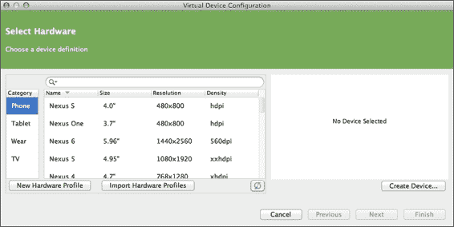
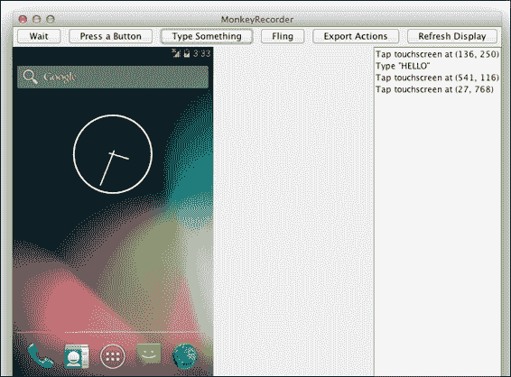

# 第四章：管理你的安卓测试环境

既然我们已经完全理解了可用的安卓测试 SDK，并且准备好了一系列测试食谱来断言和验证我们应用的行为，现在是提供不同的测试运行条件的时候了，探索其他测试，或者甚至手动使用应用程序来了解最终用户的体验会是什么样的。

在本章中，我们将涵盖：

+   创建安卓虚拟设备（AVD）为应用程序提供不同的条件和配置

+   了解在创建 AVD 时我们可以指定的不同配置

+   如何运行 AVD

+   如何创建无头模拟器

+   解锁屏幕以运行所有测试

+   模拟现实生活中的网络条件

+   使用 HAXM 加速你的 AVD

+   安卓虚拟设备的替代方案

+   运行猴子程序以生成发送到应用程序的事件

# 创建安卓虚拟设备

为了最大可能地检测到与应用程序运行设备相关的问题，你需要尽可能广泛的设备功能和配置覆盖。

虽然最终和结论性的测试应该总是在真实设备上运行，但随着设备和外形尺寸的不断增加，实际上你不可能拥有每种设备来进行测试。云中也有设备农场，可以在各种设备上进行测试（搜索`cloud device testing`），但有时，它们的成本超出了普通开发者的预算。安卓提供了一种方式，通过不同的 AVD 配置（一个模拟器）几乎逐字地模拟大量功能和配置，以方便不同的配置。

### 注意

本章中的所有示例都是在 OSX 10.9.4（Mavericks）32 位系统上运行，使用 Android SDK Tools 23.0.5 和安装的平台 4.4.2（API 20）。

要创建一个 AVD，你可以在终端使用`android avd`命令，或者在 Android Studio 内通过**工具** | **安卓** | **AVD 管理器**或其快捷图标。如果你从终端运行 AVD 管理器，你会得到一个与从 Android Studio 运行稍微不同的 GUI，但它们的功能相同。我们将使用 Android Studio 中的 AVD 管理器，因为这是最有可能的使用场景。

通过点击图标，你可以访问**AVD 管理器**。在这里，你按下**创建设备...**按钮来创建一个新的 AVD，会出现以下对话框：



现在，你可以为硬件选择一个配置手机（我们选择 Nexus 5），点击**下一步**，并选择一个安卓版本（KitKat x86）。再次点击**下一步**，你将看到设备的汇总信息。你可以点击**完成**，使用默认值创建 AVD。然而，如果你需要支持特定的配置，可以指定不同的硬件属性。我们将 AVD 名称改为`testdevice`。通过使用**显示高级设置**按钮，还可以访问更多属性。

可以设置广泛的属性。一些亮点包括：

+   RAM 大小/SD 卡大小

+   模拟或使用你的网络摄像头作为前后摄像头

+   改变网络速度/模拟延迟

设置比例也很有用，以便在类似于真实设备大小的窗口中测试你的应用程序。一个非常常见的错误是在至少是真实设备两倍大小的 AVD 窗口中测试应用程序，并使用鼠标指针，认为一切都没问题，然后在 5 或 6 英寸的物理设备屏幕上才意识到 UI 上的一些项目用手指是无法触摸的。

最后，反复在相同条件下测试你的应用程序也很有帮助。为了能够反复在相同条件下进行测试，有时删除之前会话中输入的所有信息会很有帮助。如果是这种情况，请确保取消勾选**存储快照以加快启动速度**，以便每次都能从零开始。

# 从命令行运行 AVD

如果我们可以从命令行运行不同的 AVD，或许还能自动化我们运行或脚本测试的方式，那不是很好吗？

通过将 AVD 从其 UI 窗口中释放出来，我们开启了一个全新的自动化和脚本编写可能性世界。

好的，让我们来探索这些选项。

## 无界面模拟器

当我们运行自动化测试且无人查看窗口，或者测试运行器和应用程序之间的交互非常快以至于几乎看不到任何内容时，无界面模拟器（不显示其 UI 窗口）就非常方便。

同时，值得注意的是，有时直到你看到屏幕上的交互，才能理解某些测试为什么会失败，因此在选择模拟器的运行模式时，请根据自身判断来决定。

在运行 AVD 时，我们可能会注意到它们的网络通信端口是在运行时分配的，从`5554`开始，每次增加`2`。这被用来命名模拟器并设置其序列号；例如，使用端口`5554`的模拟器成为`emulator-5554`。这在开发过程中运行 AVD 时非常有用，因为我们不需要关注端口分配。然而，如果我们同时运行多个模拟器，这可能会导致混淆，难以追踪哪个测试在哪个模拟器上运行。

在这些情况下，我们将指定手动端口以保持对特定 AVD 的控制。

通常，当我们同时在一个以上的模拟器上运行测试时，不仅想要分离窗口，还希望避免声音输出。我们也会为此添加选项。

启动我们刚刚创建的测试 AVD 的命令行如下，端口号必须是 5554 到 5584 之间的整数：

```kt
$ emulator -avd testdevice -no-window -no-audio -no-boot-anim -port 5580

```

我们现在可以检查设备是否在设备列表中：

```kt
$ adb devices
List of devices attached
emulator-5580  device

```

下一步是安装应用程序和测试：

```kt
$ adb -s emulator-5580 install YourApp.apk
347 KB/s (16632 bytes in 0.046s) : /data/local/tmp/YourApp.apk
Success
$ adb -s emulator-5580 install YourAppTests.apk
222 KB/s (16632 bytes in 0.072s)
 pkg: /data/local/tmp/YourAppTests.apk
Success

```

然后，我们可以使用指定的序列号在它上面运行测试：

```kt
$ adb -s emulator-5580 shell am instrument -w\ 
com.blundell.tut.test/android.test.InstrumentationTestRunner
com.blundell.tut.test.MyTests:......
com.blundell.tut.test.MyOtherTests:..........
Test results for InstrumentationTestRunner=..................
Time: 15.295
OK (20 tests)

```

## 禁用键盘锁

我们可以看到测试正在运行，而无需任何干预和访问模拟器 GUI。

有时，如果你以更标准的方式运行测试，例如从 IDE 启动的标准模拟器，可能会收到一些测试未失败的错误。在这种情况下，其中一个原因是模拟器可能被锁定在第一屏，我们需要解锁才能运行涉及 UI 的测试。

要解锁屏幕，你可以使用以下命令：

```kt
$ adb -s emulator-5580 emu event send EV_KEY:KEY_MENU:1 EV_KEY:KEY_MENU:0

```

锁屏也可以通过编程禁用。在仪器测试类中，你应当在 `setup()` 中添加以下代码，很可能是在此函数中：

```kt
 @Override
 public void setUp() throws Exception {
   Activity activity = getActivity();
   Window window = activity.getWindow();
   window.addFlags(WindowManager.LayoutParams.FLAG_DISMISS_KEYGUARD);
 }
```

这将为这些测试解除键盘锁，并且具有不需要任何额外安全权限或更改测试应用（已弃用的替代方法需要，见[`developer.android.com/reference/android/app/KeyguardManager.html`](http://developer.android.com/reference/android/app/KeyguardManager.html)）的优点。

## 清理

在某些情况下，你还需要清理在运行测试后启动的服务和进程。这防止后者的测试结果受到之前测试结束条件的影响。在这些情况下，最好从已知条件开始，释放所有已使用的内存，停止服务，重新加载资源，并重新启动进程，这可以通过热启动模拟器来实现：

```kt
$ adb -s emulator-5580 shell 'stop'; sleep 5; start'

```

这条命令行为我们打开模拟器的 shell，并运行停止和启动命令，正如人们所说，是将其关闭再重新打开。

这些命令的输出可以通过使用 `logcat` 命令来监控：

```kt
$ adb -s emulator-5580 logcat

```

你将看到如下信息：

```kt
D/AndroidRuntime(1):
D/AndroidRuntime(1): >>>>>>>>>> AndroidRuntime START <<<<<<<<<<
D/AndroidRuntime(1): CheckJNI is ON
D/AndroidRuntime(1): --- registering native functions ---
I/SamplingProfilerIntegration(1): Profiler is disabled.
I/Zygote  (1): Preloading classes...
I/ServiceManager(2): service 'connectivity''connectivity''connectivity''' died
I/ServiceManager(2): service 'throttle''throttle''throttle''' died
I/ServiceManager(2): service 'accessibility''accessibility''accessibility''' died

```

## 终止模拟器

当我们完成一个无头模拟器实例的工作后，我们开始使用之前提到的命令。我们使用以下命令行来杀死它：

```kt
$ adb -s emulator-5580 emu kill

```

这将阻止模拟器在主机计算机上释放已使用的资源并终止模拟器进程。

# 额外的模拟器配置

有时，我们需要测试的内容超出了创建或配置 AVD 时可以设置的选项范围。

其中一个情况可能是需要测试我们的应用程序在不同的地区设置下的表现。假设我们想要在设置为日语和日本的模拟器上测试我们的应用程序，就像是在日本手机上一样。

我们可以在模拟器命令行中传递这些属性。`-prop` 命令行选项允许我们设置可以在其中设置的任何属性：

```kt
$ emulator -avd testdevice -no-window -no-audio -no-boot-anim -port 5580   -prop persist.sys.language=ja -prop persist.sys.country=JP

```

为了验证我们的设置是否成功，我们可以使用 `getprop` 命令来验证它们，例如：

```kt
$ adb –s emulator-5580 shell "getprop persist.sys.language"
ja
$ adb –s emulator-5580 shell "getprop persist.sys.country"
JP

```

如果你想要在玩转持久设置后清除所有用户数据，你可以使用以下命令：

```kt
$ adb -s emulator-5580 emu kill
$ emulator -avd testdevice -no-window -no-audio -no-boot-anim -port 5580 -wipe-data

```

这之后，模拟器将会全新启动。

### 注意

更多关于设置模拟器硬件选项的可选属性信息，可以在[`developer.android.com/tools/devices/managing-avds-cmdline.html#hardwareopts`](http://developer.android.com/tools/devices/managing-avds-cmdline.html#hardwareopts)找到。

## 模拟网络条件

在不同的网络条件下进行测试至关重要，但往往被忽视。这可能导致误解，认为应用程序因为使用了不同速度和延迟的主机网络而表现出不同的行为。

Android 模拟器支持网络限速，例如，支持更慢的网络速度和更高的连接延迟。在创建 AVD 时可以选择，也可以随时通过命令行使用`-netspeed` `<speed>`和`-netdelay` `<delay>`选项在模拟器中进行设置。

支持的完整选项列表如下：

对于网络速度：

| 选项 | 描述 | 速度 [kbits/s] |
| --- | --- | --- |
| `-netspeed gsm` | GSM/CSD | 上传：14.4，下载：14.4 |
| `-netspeed hscsd` | HSCSD | 上传：14.4，下载：43.2 |
| `-netspeed gprs` | GPRS | 上传：40.0，下载：80.0 |
| `-netspeed edge` | EDGE/EGPRS | 上传：118.4，下载：236.8 |
| `-netspeed umts` | UMTS/3G | 上传：128.0，下载：1920.0 |
| `-netspeed hsdpa` | HSDPA | 上传：348.0，下载：14400.0 |
| `-netspeed full` | 无限制 | 上传：0.0，下载：0.0 |
| `-netspeed <num>` | 选择上传和下载速度 | 上传：如指定，下载：如指定 |
| `-netspeed <up>:<down>` | 选择单独的上传和下载速度 | 上传：指定速度，下载：指定速度 |

对于延迟：

| 选项 | 描述 | 延迟 [msec] |
| --- | --- | --- |
| `-netdelay` `gprs` | GPRS | 最小 150，最大 550 |
| `-netdelay` `edge` | EDGE/EGPRS | 最小 80，最大 400 |
| `-netdelay` `umts` | UMTS/3G | 最小 35，最大 200 |
| `-netdelay` `none` | 无延迟 | 最小 0，最大 0 |
| `-netdelay` `<num>` | 选择确切的延迟 | 延迟如指定 |
| `-netdelay` `<min>:<max>` | 选择最小和最大延迟 | 最小和最大延迟如指定 |

如果未指定值，模拟器将使用以下默认值：

+   默认网络速度为无限制

+   默认网络延迟为无延迟。

这是一个使用这些选项选择 GSM 网络速度 14.4 kbits/sec 和 GPRS 延迟 150 至 500 毫秒的模拟器示例：

```kt
$ emulator -avd testdevice -port 5580 -netspeed gsm -netdelay gprs

```

当模拟器运行时，你可以通过 Telnet 客户端内的 Android 控制台验证这些网络设置或交互式更改它们：

```kt
$ telnet localhost 5580
Trying 127.0.0.1...
Connected to localhost.
Escape character is '^]'.
Android Console: type 'help' for a list of commands
OK

```

连接之后，我们可以输入以下命令：

```kt
network status
Current network status:
 download speed:      14400 bits/s (1.8 KB/s)
 upload speed:        14400 bits/s (1.8 KB/s)
 minimum latency:  150 ms
 maximum latency:  550 ms
OK

```

你可以使用模拟器手动或自动测试使用网络服务的应用程序。

在某些情况下，这不仅涉及限制网络速度，还涉及更改 GPRS 连接的状态，以研究应用程序如何应对这些情况。要更改此状态，我们也可以在正在运行的模拟器中使用 Android 控制台。

例如，要从网络注销模拟器，我们可以使用：

```kt
$ telnet localhost 5580

```

在收到**OK**子提示后，我们可以通过发出以下命令将数据网络模式设置为未注册。这将关闭所有数据：

```kt
gsm data unregistered
OK
quit
Connection closed by foreign host.

```

在这种条件下测试应用程序后，你可以通过使用以下命令行再次连接它：

```kt
gsm data home
OK

```

要验证状态，你可以使用以下命令行：

```kt
gsm status
gsm voice state: home

gsm data state:  home

OK

```

# 使用 HAXM 加速你的 AVD

使用 Android 虚拟设备时，你会注意到它们并不是最响应灵敏的模拟器。这是因为 AVD 模拟器不支持硬件 GL，所以 GL 代码会被转换为 ARM 软件，并在由 QEMU（AVD 运行在顶层的托管虚拟机监控器）模拟的硬件上运行。Google 一直在解决这个问题，现在，高效使用宿主 GPU 正在提高速度（SDK 17）。在这个级别及以上的模拟器上，响应性已经得到了改善。

使用 Intel 的硬件加速执行管理器（HAXM）可以获得另一个速度提升。如果你的 AVD 运行 x86 架构，使用 HAXM 可以获得 5 到 10 倍的速度提升，因为它可以本地执行 CPU 命令。

HAXM 的工作原理是允许 CPU 命令在你的硬件上运行（即你的 Intel CPU），而在此之前，QEMU 会模拟 CPU，所有命令都是通过软件执行的，这就是原始架构为何笨拙的原因。

根据要求，你需要拥有支持 VT（虚拟化技术）的 Intel 处理器和一个基于 x86 的模拟器，最低 SDK 版本为 10（姜饼）。Intel 声称，从 2005 年开始的大多数 Intel 处理器都将支持 VT 卸载作为标准。

安装很简单；从 Android SDK 管理器的附加部分下载 HAXM，找到下载的文件，并按照安装程序说明操作。你可以通过从终端运行以下命令来确认安装成功：

```kt
kextstat | grep intel 

```

如果你收到包含`com.intel.kext.intelhaxm`的消息，说明你已经安装并可以运行你的快速 x86 模拟器了。你不需要做其他事情，只需确保你的 Android 模拟器的 CPU/ABI 是 x86，HAXM 就会在后台为你运行。

# AVD 的替代方案

Android 虚拟设备并不是你运行 Android 应用的唯一方式。现在有一些解决方案可供选择。在 Google 上快速搜索可以找到这个列表（我不在这里写出来，因为它们可能会很快过时）。我个人推荐的一个是 GenyMotion 模拟器。这是一个使用 x86 架构虚拟化来提高效率的 Android 模拟器。它比 AVD 运行得更快更流畅。缺点是它仅对个人使用免费，并且截至撰写本文时，它并不能模拟设备所有的传感器，但我知道他们正在忙于解决这个问题。

# 运行 monkey

你可能听说过无限猴子定理。这个定理指出，一个猴子在打字机上随机按键无限次，最终会打出一段给定的文本，比如威廉·莎士比亚的完整作品。Android 版本的这个定理则是说，一个在设备上产生随机触摸的猴子可能会在远少于无限的时间里让你的应用崩溃。

Android 特性中包含一个猴子应用（[`goo.gl/LSWg85`](http://goo.gl/LSWg85)），它会生成随机事件，而不是使用真正的猴子。

对我们的应用程序运行猴子以生成随机事件的最简单方法是：

```kt
$ adb -e shell monkey -p com.blundell.tut -v -v 1000

```

你将会接收到以下输出：

```kt
Events injected: 1000
:Sending rotation degree=0, persist=false
:Dropped: keys=0 pointers=4 trackballs=0 flips=0 rotations=0
## Network stats: elapsed time=2577ms (0ms mobile, 0ms wifi, 2577ms not connected)
// Monkey finished

```

猴子将只向指定的包（`-p`）发送事件，在这种情况下是 `com.blundell.tut`，以非常详细的方式（`-v` `-v`）。发送的事件数量将是 1000。

## 客户端-服务器猴子

另外一种运行猴子命令的方法。它也提供了一个客户端-服务器模型，最终允许创建控制发送哪些事件的脚本，并不只依赖于随机生成。

通常，猴子使用的端口是 `1080`，但如果你更喜欢，可以使用其他端口：

```kt
$ adb -e shell monkey -p com.blundell.tut --port 1080 &

```

然后，我们需要重定向模拟器的端口：

```kt
$ adb -e forward tcp:1080 tcp:1080

```

现在，我们准备发送事件。要手动执行，我们可以使用 Telnet 客户端：

```kt
$ telnet localhost 1080

```

建立连接后，我们可以输入特定的猴子命令：

```kt
tap 150 200
OK
```

最后，退出 telnet 命令。

如果我们需要反复测试应用程序，创建一个包含我们想要发送的命令的脚本会方便得多。一个猴子脚本可能如下所示：

```kt
# monkey
tap 200 200
type HelloWorld
tap 200 350
tap 200 200
press DEL
press DEL
press DEL
press DEL
press DEL
type Monkey 
tap 200 350

```

### 注意

monkey tap 的 API 是 `tap <x 像素位置> <y 像素位置>`。

因此，如果你运行的模拟器与记录猴子命令的分辨率不同，你可能会得到错误的触摸事件。

启动本章的示例应用后，我们可以运行这个脚本来测试用户界面。要启动应用，你可以使用模拟器窗口并点击其启动图标，或者使用命令行指定要启动的活动，如果模拟器是无头模式，这将是唯一的选择，如下所示：

```kt
$ adb shell am start -n com.blundell.tut/.MonkeyActivity

```

这在日志中由以下行通知：

```kt
Starting: Intent { cmp=com.blundell.tut/.MonkeyActivity}

```

应用程序启动后，你可以使用脚本和 `netcat` 实用工具发送事件：

```kt
$ nc localhost 1080 < ch_4_code_ex_10.txt

```

这会将脚本文件中的事件发送到模拟器。这些事件包括：

1.  触摸并选择编辑文本输入。

1.  输入 `Hello World`。

1.  点击按钮显示提示信息。

1.  再次触摸并选择编辑文本。

1.  删除其内容。

1.  输入 `Monkey`。

1.  点击按钮显示**Hello Monkey**的提示信息。

这样，可以创建包含触摸事件和按键按下的简单脚本。

# 使用 monkeyrunner 进行测试脚本编写

Monkey 的能力相当有限，流程控制的缺失限制了其仅能用于非常简单的场景。为了绕过这些限制，创建了一个名为 monkeyrunner 的新项目。尽管如此，这个名字几乎相同，导致大量的混淆，因为它们之间没有任何关联。

Monkeyrunner，已包含在最新版本的 Android SDK 中，是一个提供 API 的工具，用于编写外部控制 Android 设备或模拟器的脚本。

Monkeyrunner 构建于 Jython 之上 ([`jython.org/`](http://jython.org/))，这是 Python 编程语言的一个版本 ([`python.org/`](http://python.org/))，设计在 Java 平台上运行。

根据其文档，monkeyrunner 工具为 Android 测试提供了以下独特的功能。这些只是可以从 monkeyrunner 主页获取的完整功能列表、示例和参考文档的亮点 ([`developer.android.com/tools/help/monkeyrunner_concepts.html`](http://developer.android.com/tools/help/monkeyrunner_concepts.html))：

+   **多设备控制**：`monkeyrunner` API 可以在多个设备或模拟器上应用一个或多个测试套件。你可以物理连接所有设备或一次性启动所有模拟器（或两者兼有），然后以编程方式逐个连接到每个设备，并运行一个或多个测试。你也可以以编程方式启动模拟器配置，运行一个或多个测试，然后关闭模拟器。

+   **功能测试**：`monkeyrunner`可以运行一个 Android 应用的自动化从头到尾的测试。你提供通过按键或触摸事件输入的值，并以截图的形式查看结果。

+   **回归测试**：`monkeyrunner`可以通过运行应用并比较其输出截图与一组已知正确的截图来测试应用的稳定性。

+   **可扩展自动化**：由于`monkeyrunner`是一个 API 工具包，你可以开发一整套基于 Python 的模块和程序来控制 Android 设备。除了使用`monkeyrunner` API 本身，你还可以使用标准的 Python OS 和 subprocess 模块调用 Android 工具，如 Android 调试桥。你还可以向`monkeyrunner` API 添加自己的类。这在线文档的“使用插件扩展 monkeyrunner”部分有更详细的描述。

## 获取测试截图。

目前，monkeyrunner 最明显的用途之一是获取待测应用的截图以供进一步分析或比较。

可以通过以下步骤获取这些截图：

1.  导入所需的模块。

1.  与设备建立连接。

1.  检查设备是否已连接。

1.  启动活动。

1.  为活动启动添加一些延迟。

1.  输入'hello'。

1.  添加一些延迟以允许事件被处理。

1.  获取截图。

1.  将其保存到文件中。

1.  按**返回**退出活动。

以下是执行上述步骤所需的脚本代码：

```kt
#! /usr/bin/env monkeyrunner

import sys

# Imports the monkeyrunner modules used by this program
from com.android.monkeyrunner import MonkeyRunner, MonkeyDevice, MonkeyImage
# Connects to the current device, returning a MonkeyDevice object
device = MonkeyRunner.waitForConnection()

if not device:
    print >> sys.stderr, "Couldn't" "get connection"
    sys.exit(1)

device.startActivity(component='com'.blundell.tut/.MonkeyActivity')

MonkeyRunner.sleep(3.0)

device.type("hello")

# Takes a screenshot
MonkeyRunner.sleep(3.0)
result = device.takeSnapshot()

# Writes the screenshot to a file
result.writeToFile('/tmp/device.png')

device.press('KEYCODE_BACK', 'DOWN'_AND_UP')
```

脚本运行后，你可以在`/tmp/device.png`找到活动的截图。

## 记录和回放

如果你需要更简单的方法，无需手动创建这些脚本。为了简化这个过程，Android 源代码仓库中的 SDK 项目中包含的`monkey_recorder.py`脚本可以用来记录事件描述，这些描述稍后会被另一个名为`monkey_playback.py`的脚本解释。

从命令行运行`monkey_recorder.py`，你将看到这个用户界面：



这个界面有一个工具栏，工具栏上有按钮可以在记录的脚本中插入不同的命令：

| 按钮名 | 描述 |
| --- | --- |
| **等待** | 这表示需要等待多少秒。这个数字是通过一个对话框请求的。 |
| **按下按钮** | 这会发送**菜单**、**主页**、**最近应用**和**搜索**按钮。按下**向下**或**向上**事件。 |
| **输入内容** | 这会发送一个字符串。 |
| **滑动** | 这会在指定方向、距离和步数发送一个滑动事件。 |
| **导出动作** | 这会保存脚本。 |
| **刷新显示** | 这会刷新显示的截图副本。 |

完成脚本后，保存它，假设文件名为`script.mr`，然后你可以使用以下命令行重新运行它：

```kt
$ monkey_playback.py script.mr

```

现在，所有的事件都将被重新播放。

# 总结

在本章中，我们涵盖了所有将我们的应用程序及其测试暴露于广泛条件和配置的替代方案，从不同的屏幕尺寸，到设备（如相机或键盘）的可用性，再到模拟真实网络条件以检测我们应用程序中的问题。

我们还分析了所有可用的选项，以便能够在模拟器脱离窗口时远程控制它们。这为进行测试优先开发奠定了基础，我们将在第六章，*实践测试驱动开发*中回到这个话题。

我们讨论了 AVD 的速度，并看到了如何改进这一点，以及如何在 GenyMotion 和 HAXM 中查看模拟器选择。最后，介绍了一些脚本编写替代方案，并提供了一些入门示例。

在下一章中，我们将探索持续集成——一种依赖于自动运行所有测试套件以及配置、启动和停止模拟器以自动化完整构建过程的工作方式。
