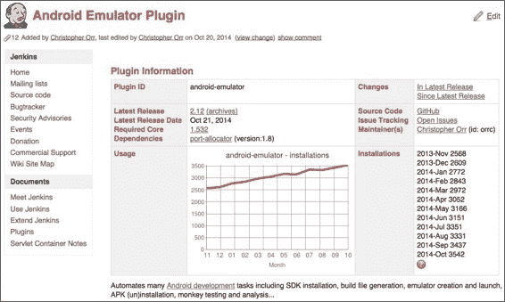
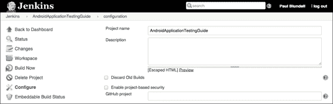
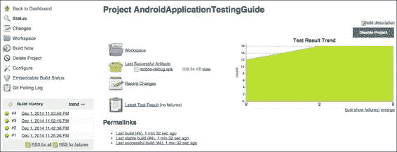
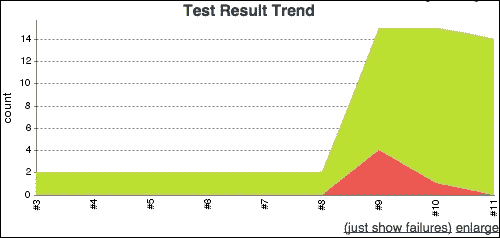
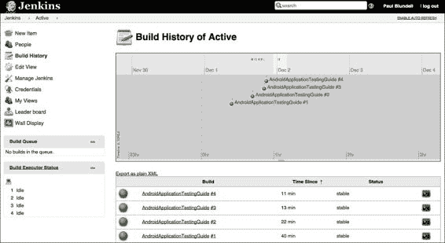

# 第五章：探索持续集成

**持续集成**是软件工程中的一种敏捷技术，旨在通过持续的应用集成和频繁的测试，而不是在开发周期结束时采用更传统的集成和测试方法，来提高软件质量并减少集成更改所需的时间。

持续集成已经得到了广泛的应用，商业工具和开源项目的激增是其成功的明显证明。这不难理解，因为任何在职业生涯中参与过使用传统方法的软件开发项目的人都可能经历过所谓的*集成地狱*，即集成更改所需的时间超过了做出更改的时间。这让你想起了什么？相反，持续集成是频繁且小步骤集成更改的做法。这些步骤是微不足道的，如果注意到错误，它如此之小以至于可以立即修复。最常见的做法是在每次提交到源代码仓库后触发构建过程。

这种实践还意味着除了源代码需要由版本控制系统（VCS）维护之外的其他要求：

+   构建应当通过运行单个命令来自动化。这个特性已经被如`make`和`ant`这样的工具支持了很长时间，并且最近也被`maven`和`gradle`支持。

+   构建应当自我测试，以确认新构建的软件符合开发者的预期。

+   构建工件和测试结果应当易于查找和查看。

当我们为 Android 项目编写测试时，我们希望利用持续集成。为了实现这一点，我们想要创建一个与传统 IDE 环境和 Android 构建工具共存模型，这样无论在 CI 环境箱、IDE 还是在手动环境下，我们都能运行和安装我们的应用。

在本章中，我们将讨论以下内容：

+   自动化构建过程

+   引入版本控制系统到流程中

+   使用 Jenkins 进行持续集成

+   自动化测试

在本章之后，你将能够将持续集成应用到你的项目中，无论项目规模大小，无论是雇佣数十名开发人员的中大型软件项目，还是你一个人编程。

### 注意

关于持续集成的原始文章是由 Martin Fowler 在 2000 年撰写的（[`www.martinfowler.com/articles/continuousIntegration.html`](http://www.martinfowler.com/articles/continuousIntegration.html)），描述了在一个大型软件项目上实施持续集成的经验。

# 使用 Gradle 手动构建 Android 应用程序

如果我们的目标是将在开发过程中整合**持续**的**集成**，那么第一步将是手动构建 Android 应用程序，因为我们可以将集成机器与手动构建技术相结合来自动化这一过程。

通过这种方式，我们打算保持项目与 IDE 和命令行构建过程兼容，这就是我们将要做的。自动化构建是一个很大的优势，它通过立即构建并最终显示项目中可能存在的错误，从而加快开发过程。在编辑生成中间类的资源或其他文件时，CI 是一个无价的工具；否则，在构建过程中一些简单的错误可能会发现得太晚。遵循“经常失败，快速失败”的格言是推荐的做法。

幸运的是，Android 支持使用现有工具进行手动构建，并且在同一项目中合并手动 IDE 构建和自动 CI 构建并不需要太多努力。在这种情况下，支持在 IDE 中使用 Gradle 手动构建。然而，像 Ant 这样不再默认支持的选项，以及 Maven 或 Make 等不支持开箱即用的选项也存在。

### 注意

Gradle 是构建自动化的演进。Gradle 将 Ant 的强大和灵活性以及 Maven 的依赖管理和约定融合成更有效的构建方式。

更多信息可以在其主页上找到，[`gradle.org/`](http://gradle.org/)。

在撰写本文时，基于 Android Gradle 的项目至少需要 Gradle 2.2 或更新版本。

值得注意的是，整个 Android 开源项目并非由 Gradle 构建，而是由极其复杂的 make 文件结构构建，这种方法甚至用于构建平台中包含的应用程序，如计算器、联系人、设置等。

使用 Android Studio 创建新项目时，模板项目已经使用 Gradle 进行构建。这意味着你从命令行手动构建项目。在项目根目录执行 `./gradlew tasks` 将提供可以运行的所有任务列表。最常用的任务如下表所示：

| 目标 | 描述 |
| --- | --- |
| `build` | 组装并测试此项目 |
| `clean` | 删除构建目录 |
| `tasks` | 显示可以从根项目 x 运行的任务（其中一些显示的任务可能属于子项目） |
| `installDebug` | 安装调试版本 |
| `installDebugTest` | 为调试版本安装测试版本 |
| `connectedAndroidTest` | 在连接的设备上为构建调试安装并运行测试 |
| `uninstallDebug` | 卸载调试版本 |

前缀为 `./gradlew` 的命令使用的是实际上包含在项目源代码中的 Gradle 安装。这称为 *gradle 包装器*。因此，你不需要在本地机器上安装 Gradle！但是，如果你在本地安装了 Gradle，所有使用包装器的命令都可以替换为 `./gradle`。如果有多台设备或模拟器连接到构建机器，这些命令将在它们上面全部运行/安装。这对于我们的 CI 设置来说非常棒，意味着我们可以在所有提供的设备上运行我们的测试，以便处理多种配置和 Android 版本。如果你出于其他原因只想在其中一个上安装，通过设备提供商 API 是可以实现的，但这超出了本书的范围。我鼓励你在 [`tools.android.com`](http://tools.android.com) 阅读更多内容，并查看广泛可用的 Gradle 插件，以帮助你完成这些工作。

现在我们可以运行这个命令来安装我们的应用程序：

```kt
$ ./gradlew installDebug

```

这是生成的输出开始和结束的部分：

```kt
Configuring > 3/3 projects
…
:app:assembleDebug 
:app:installDebug
Installing APK 'app'-debug.'apk' on 'emulator-5554'Installing APK 'app'-debug.'apk'on 'Samsung'Galaxy 'S4'
Installed on 2 devices.

BUILD SUCCESSFUL
Total time: 11.011 secs

```

运行前述提到的命令后，将执行以下步骤：

+   编译源代码，包括资源、AIDL 和 Java 文件

+   将编译的文件转换为原生的 Android 格式

+   打包和签名

+   安装到给定的设备或模拟器上

一旦我们安装了 APK，并且现在所有操作都从命令行进行，我们甚至可以启动如 `EspressoActivity` 的活动。使用 `am` `start` 命令和一个使用 `MAIN` 动作和我们感兴趣启动的活动作为组件的 Intent，我们可以创建如下命令行：

```kt
adb -s emulator-5554 shell am start -a android.intent.action.MAIN -n com.blundell.tut/.EspressoActivity

```

活动已经启动，你可以在模拟器中验证。现在要做的下一件事是安装我们应用程序的测试项目，然后使用命令行运行这些测试（如前几章所述）。最后，当它们完成后，我们应该卸载应用程序。如果你仔细阅读了命令列表，可能会注意到幸运的是，`connectedAndroidTest` Gradle 任务已经为我们完成了这些操作。

运行命令后，我们将获得测试结果。如果通过，输出如下所示：

```kt
:app:connectedAndroidTest
BUILD SUCCESSFUL
Total time: 9.812 secs

```

然而，如果它们失败了，输出将更加详细，并提供一个链接到文件，你可以查看完整的堆栈跟踪以及每个测试失败的原因：

```kt
:app:connectedAndroidTest
com.blundell.tut.ExampleEspressoTest > testClickingButtonShowsImage[emulator-5554]FAILED 
android.view.ViewRootImpl$CalledFromWrongThreadException: Only the original thread that created a view hierarchy can touch its views.
 at android.view.ViewRootImpl.checkThread(ViewRootImpl.java:6024)
FAILURE: Build failed with an exception.
* What went wrong:
Execution failed for task ':app:connectedAndroidTest.
> There were failing tests. See the report at: file:///AndroidApplicationTestingGuide/app/build/outputs/reports/androidTests/connected/index.html
…
BUILD FAILED
Total time: 15.532 secs.

```

我们通过调用一些简单的命令从命令行完成了一切操作，这正是我们想要做的，以便将这个过程引入持续集成流程。

# Git – 快速版本控制系统

**Git** 是一个免费且开源的分布式版本控制系统，旨在以速度和效率处理从小型到非常大型的各种项目。它非常容易设置，因此我强烈建议即使是个人项目也使用它。没有任何一个项目简单到无法从这个工具的应用中受益。你可以在 http://git-scm.com/ 找到信息和下载。

版本控制系统或**版本控制系统（VCS）**（也称为源代码管理或**SCM**）是涉及多个开发人员开发项目的不可避免元素，即使单人编码也是最佳实践。此外，尽管在没有 VCS 的情况下也可以应用持续集成（因为 VCS 不是 CI 的必要条件），但避免这样做并不是一个合理或推荐的做法。

在版本控制系统领域还有其他一些可能更传统的选择（见遗留系统），如 Subversion 或 CVS，如果你觉得更舒适，可以自由使用。否则，Git 被广泛应用于 Android 项目，托管谷歌自己的代码和示例，因此至少花时间了解基础知识是值得的。

说到这里，考虑到这是一个非常广泛的主题，足以证明其自身需要一本书（确实有一些好书关于这个主题），我们在这里讨论的是最基本的话题，并提供示例，以帮助那些还没有开始实践的人入门。

## 创建本地 Git 仓库

这些是最简单的命令，用于创建本地仓库并用我们项目的初始源代码填充它。在这个例子中，我们再次使用之前章节创建和使用的 `AndroidApplicationTestingGuide` 项目。我们复制了之前手动构建时使用的代码：

```kt
$ mkdir AndroidApplicationTestingGuide
$ cd AndroidApplicationTestingGuide
$ git init
$ cp -a <path/to/original>/AndroidApplicationTestingGuide/
$ gradlew clean
$ rm local.properties
$ git add .
$ git commit -m "Initial commit"

```

我们创建新的项目目录，初始化 Git 仓库，复制初始内容，清理并删除我们之前自动生成的文件，移除 `local.properties` 文件，将所有内容添加到仓库，并提交。

### 提示

`local.properties` 文件绝不能被检入版本控制系统，因为它包含特定于你本地配置的信息。你可能还想看看创建一个 `.gitignore` 文件。这个文件允许你定义哪些文件不被检入（例如自动生成的文件）。`.gitignore` 文件的示例可以在 [`github.com/github/gitignore`](https://github.com/github/gitignore) 找到。

在这一点上，我们的项目仓库包含了我们应用程序的初始源代码以及所有的测试。我们没有改变结构，所以项目仍然与我们 IDE 和 Gradle 兼容，以便我们继续本地开发、构建和持续集成。

下一步是让我们的项目在我们每次提交源代码更改后自动构建和测试。

# 使用 Jenkins 进行持续集成

**Jenkins** 是一款开源、可扩展的持续集成服务器，具有构建和测试软件项目或监控外部作业执行的能力。Jenkins 安装和配置简单，因此被广泛使用。这使得它成为学习持续集成的理想示例。

## 安装和配置 Jenkins

我们提到 Jenkins 的优点之一是易于安装，而且安装过程确实简单。从 [`jenkins-ci.org/`](http://jenkins-ci.org/) 下载你选择操作系统的原生包。所有主要的服务器和桌面操作系统都有原生包。在以下示例中，我们将使用版本 1.592。下载 `.war` 文件后，我们将运行它，因为这不需要管理员权限。

完成后，将 war 文件复制到选择的目录 `~/jenkins`，然后运行以下命令：

```kt
$ java -jar ~/jenkins/jenkins-1.592.war

```

这将展开并启动 Jenkins。

默认配置使用 `8080` 端口作为 HTTP 监听端口，因此将你的浏览器指向 `http://localhost:8080` 应该会显示 Jenkins 主页。如果需要，你可以通过访问 **管理 Jenkins** 屏幕来验证和更改 Jenkins 的操作参数。我们应该在此配置中添加所需的插件，以实现 Git 集成、使用 Gradle 构建、检查测试结果以及在构建过程中支持 Android 模拟器。这些插件分别是 **Git 插件**、**Gradle 插件**、**JUnit 插件** 和 **Android Emulator 插件**。

下面的屏幕截图展示了你可以通过 Jenkins 插件管理页面上的链接获取的插件信息：



安装并重新启动 Jenkins 后，这些插件就可以使用了。我们的下一步是创建构建项目所需的任务。

## 创建任务

让我们从 Jenkins 主页上的 **新建项目** 开始创建 AndroidApplicationTestingGuide 任务。以项目命名。可以创建不同类型的任务；在这种情况下，我们选择 **自由风格项目**，允许你将任何 SCM 连接到任何构建系统。

点击 **确定** 按钮后，你将看到具体的任务选项，如下表所述。这是任务属性页面顶部的如下内容：



**新建项目**屏幕中的所有选项都有关联的帮助文本，因此这里我们只解释需要输入的部分：

| 选项 | 描述 |
| --- | --- |
| 项目名称 | 给项目赋予的名称。 |
| 描述 | 可选描述。 |
| 丢弃旧构建 | 这可以帮助你通过管理构建记录（如控制台输出、构建工件等）的保留时间来节省磁盘消耗。 |
| 此构建是参数化的 | 这允许你配置传递给构建过程的参数，以创建参数化构建，例如，使用 `$ANDROID_HOME` 而不是硬编码路径。 |
| 源代码管理 也称为 VCS，项目的源代码在哪里？在这种情况下，我们使用 Git 和一个仓库，该仓库的 URL 是我们之前创建的仓库的绝对路径。例如，`/git-repo/AndroidApplicationTestingGuide`。 |
| 构建触发器 | 如何自动构建这个项目。在这种情况下，我们希望源代码的每次更改都触发自动构建，所以我们选择**轮询 SCM**。另一个选项是使用**定时构建**。这个特性主要用于将 Jenkins 作为`cron`的替代，对于持续构建软件项目来说并不理想。当人们第一次开始持续集成时，他们常常习惯于定期的构建，如每晚/每周，因此使用这个特性。然而，持续集成的要点是在做出更改后立即开始构建，以便为更改提供快速的反馈。这个选项可以用于长时间运行的构建，比如测试套件，可能在构建运行 1 小时时测试性能（将其配置为在午夜运行）。它还可以用于每晚或每周发布新版本。 |
| 计划 | 这个字段遵循`Cron`的语法（有一些小的差异）。具体来说，每行由五个由制表符或空格分隔的字段组成：`分钟 小时 天 月 星期几`。例如，如果我们想在每个小时的 30 分钟进行持续轮询，指定为：`30 * * * *`。查看文档以获取所有选项的完整解释。 |
| 构建环境 | 这个选项允许你为构建环境和可能在进行构建时运行的 Android 模拟器指定不同的选项。 |
| 构建 | 这个选项描述了构建步骤。我们选择**调用 Gradle 脚本**，因为我们重现了之前手动构建和测试项目的步骤。我们将选择**使用 Gradle 包装器**，这样我们的项目就不依赖于内置在 Gradle 版本的 CI 机器。然后，在**任务**框中，我们希望输入 `clean connectedAndroidTest`。 |
| 构建后操作 | 这些是在构建完成后我们可以执行的一系列操作。我们希望保存 APK 文件，因此我们启用**归档工件**，然后定义它们的路径为**要归档的文件**；在这个具体的情况下，它是 `**/*-debug.apk`。 |
| 保存 | 保存我们刚刚做的更改并完成构建任务创建。 |

既然我们的持续集成（CI）构建已经设置好了，有以下两个选项：

+   你可以使用**立即构建**来强制构建。

+   或者对源代码进行一些更改，使用 Git 提交，并等待它们被我们的轮询策略检测到。

无论哪种方式，我们都能构建我们的项目，并准备好工件以供其他用途，例如依赖项目或质量保证（QA）。不幸的是，如果你运行了 CI 构建，它会因为未连接设备而彻底失败。你可以选择连接一个真实设备，或者使用我们刚刚安装的 Android 模拟器插件。我们使用插件。在 Jenkins 中，转到我们刚刚创建的任务并点击**配置**。

| 选项 | 描述 |
| --- | --- |
| 构建环境 | 我们的目标是在模拟器上安装并运行测试。因此，对于我们的构建环境，我们使用 **Android Emulator 插件** 提供的设施。如果你希望在构建步骤执行之前自动启动你选择的 Android 模拟器，并在构建完成后停止模拟器，这将非常方便。你可以选择启动预定义的、现有的 Android 模拟器实例（AVD）。或者，插件可以自动在构建从机上创建一个新的模拟器，并在此处指定属性。在任何情况下，`logcat` 输出都将自动捕获并归档。选择 **使用属性运行模拟器**。然后，选择 **4.4** 作为 **Android OS 版本**，**320** DPI 作为 **屏幕密度**，以及 **WQVGA** 作为 **屏幕分辨率**。请随意实验并选择更适合你需求的选项。 |
| 常见模拟器选项 | 我们希望**在启动时重置模拟器状态**以清除用户数据并禁用**显示模拟器窗口**，这样就不会显示模拟器窗口。 |

配置并构建此项目后，我们将在目标模拟器上安装 APK 并运行测试。

## 获取 Android 测试结果

测试运行后，结果将保存为 XML 文件，位于项目构建文件夹内的 `/AndroidApplicationTestingGuides/app/build/outputs/androidTest-results/connected/`。

它们在那里对我们没有好处。如果我们能在 Jenkins 中读取我们的测试结果，并以漂亮的 HTML 格式显示它们，那就太好了；另一个 Jenkins 插件来拯救。JUnit 插件启用了一个构建后操作，询问你的 JUnit 报告存储在哪里，并将它们检索出来，以便在 Jenkins 的项目屏幕上轻松查看测试结果。在这种情况下，我们在作业配置页面也使用了构建后操作。 |

| 完成之前描述的所有步骤后，只剩下强制构建以查看结果。选项 | 描述 |
| --- | --- |
| 发布 JUnit 测试结果报告 | 当配置了此选项时，Jenkins 上的 JUnit 插件可以提供有关测试结果的实用信息，如历史测试结果趋势、用于查看测试报告的 Web UI、跟踪失败等。它需要一个正则表达式来查找 JUnit 结果文件。我建议使用 `**/TEST*.xml`。这个正则表达式应该匹配所有的 JUnit 测试结果，包括 Android 连接测试的结果；这里的研究赞誉归功于 Adam Brown。如果你更改了正则表达式，确保不要将任何非报告文件包含在此模式中。运行几个带有测试结果的构建后，你应该会开始看到一些趋势图表，显示测试的发展演变。 |

点击 **立即构建**，几分钟后，你将看到你的测试结果和统计数据以类似以下截图的方式显示：



从这里，我们可以轻松了解项目状态。点击**最新测试结果**，你可以看到有多少测试失败以及原因。你可以搜索失败的测试，还可以找到详尽的**错误信息**和**堆栈跟踪**选项。

通过评估不同的趋势来了解项目的演变也确实很有帮助，而 Jenkins 能够提供这类信息。每个项目都使用类似天气的图标展示当前趋势，从阳光明媚（项目健康度提高 80%）到雷暴（健康度低于 20%）。此外，对于每个项目，测试成功与失败比例的趋势演变也会在图表中显示。下面是失败的测试图表：



在这个例子中，我们可以看到在构建 9 时，有四个测试失败了，其中三个在构建 10 中修复，最后一个在构建 11 中修复。

为了看到项目状态如何通过强制失败而改变，让我们添加一个如下所示的失败测试。别忘了推送你的提交，以触发 CI 构建，如下所示：

```kt
  public final void testForceFailure() {
    fail("fail test is fail");
  }
```

另一个非常有趣且值得一提的功能是 Jenkins 能够保存和显示时间轴和构建时间趋势，如下面的截图所示：



这个页面展示了带有链接的构建历史，你可以通过这些链接查看每个特定构建的详细信息。现在我们不必担心太多，每当开发团队的成员将变更提交到仓库时，我们知道这些变更将立即集成，整个项目将被构建和测试。如果我们进一步配置 Jenkins，我们甚至可以通过电子邮件接收状态。为此，请在作业配置页面启用**电子邮件通知**，并输入所需的**收件人**。

# 总结

本章通过实际应用介绍了持续集成的概念，提供了有价值的信息，以便你尽快将其应用到项目中，无论项目规模大小，无论你是独立开发还是大型公司团队的一员。

所介绍的技术关注于 Android 项目的特性，维护并支持广泛使用的开发工具，如 Android Studio 和 Android Gradle 插件。

我们引入了现实世界中的示例和工具，这些工具来自丰富的开源武器库。我们使用 Gradle 自动化构建过程，使用 Git 创建一个简单的版本控制系统仓库来存储我们的源代码和管理变更，最后安装并配置了 Jenkins 作为我们选择的持续集成工具。

在 Jenkins 中，我们详细介绍了创建作业的过程，以自动化创建我们的 Android 应用程序及其测试，并强调了持续集成框与其设备/模拟器之间的关系。

最后，我们意识到了与安卓相关的测试结果，并实施了一项策略，以获得一个吸引人的界面来监视测试的运行、它们的结果和现有的趋势。

下一章将带领我们走上测试驱动开发的道路；你最终将开始理解为什么我在迄今为止的所有示例中都在谈论温度，这对于一个真实的项目来说非常重要。因此，建立持续集成设置非常完美，可以帮助我们编写优秀的代码，并相信我们的持续集成构建的 APK 已经准备好发布。
