# 第六章：实践测试驱动开发

本章介绍了**测试驱动开发**（**TDD**）的纪律。我们将从广义上的 TDD 实践开始，随后转移到与 Android 平台更相关的概念和技术。

这是一个代码密集的章节，所以准备好边阅读边输入，这将帮助你从提供的示例中获得最大收益。

在本章中，我们将学习以下主题：

+   引入并解释测试驱动开发（Test-driven Development）。

+   分析其优点。

+   引入一个现实生活中的例子。

+   通过编写测试来理解项目需求。

+   通过应用 TDD 在项目中不断发展。

+   获得一个完全符合要求的程序。

# 开始使用 TDD。

简而言之，测试驱动开发是边开发边编写测试的策略。这些测试用例是在预期将满足它们的代码之前编写的。

我们首先编写一个测试，然后编写满足这个测试编译所需的代码，接着实现测试规定的应有的行为。我们持续编写测试和实现，直到测试检查完所有期望行为的完整集合。

这与其他开发过程方法形成对比，那些方法是在所有编码完成后的末期编写测试。

提前编写满足它们的代码的测试具有以下优点：

+   测试以这样或那样的方式编写，而如果将测试留到开发末期，很可能会永远写不出来。

+   当开发者在编写代码时需要考虑测试时，他们会对自己工作的质量承担更多责任。

设计决策分小步进行，之后通过重构改进满足测试的代码。记住，这需要在测试运行的情况下进行，以确保预期行为没有回归。

测试驱动开发通常通过以下类似的图表来解释，以帮助我们理解这个过程：

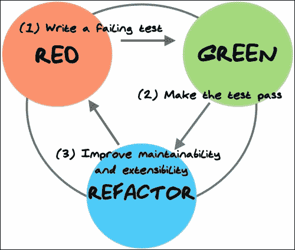

以下各节将详细展开与 TDD 相关的红、绿、重构循环的个别行动。

## 编写一个测试用例。

我们从编写一个测试用例开始开发过程。这显然是一个简单的过程，会在我们脑海中启动一些机制。毕竟，如果我们对问题领域及其细节没有清晰的理解，就不可能编写一些代码，测试它或不测试。通常，这一步会让你直接面对你不理解的问题方面，如果你想建模和编写代码，就需要掌握这些方面。

## 运行所有测试。

编写测试后，下一步是运行它，以及到目前为止我们编写的所有其他测试。在这里，拥有内置测试环境支持的 IDE 的重要性可能比其他情况下更加明显，可以大幅缩短开发时间。我们预期，首先，我们新编写的测试会失败，因为我们还没有编写任何代码。

为了完成我们的测试，我们编写额外的代码并做出设计决策。编写的额外代码是最少的，以使我们的测试能够编译。在这里请注意，不能编译就是失败。

当我们让测试编译并运行，如果测试失败了，那么我们会尝试编写最少的代码以使测试成功。这在目前听起来可能有些别扭，但本章接下来的代码示例将帮助你理解这个过程。

可选地，你可以先只运行新增加的测试，以节省一些时间，因为有时在模拟器上运行测试可能会相当慢。然后再运行整个测试套件，以验证一切是否仍然正常工作。我们不想在添加新功能时破坏代码中已有的任何功能。

## 重构代码

当测试成功时，我们会重构添加的代码，以保持其整洁、干净，并且是可维护和可扩展应用程序所需的最小代码量。

我们再次运行所有测试，以验证重构是否破坏了任何功能，如果测试再次通过且无需进一步重构，那么我们就完成了任务。

重构后运行测试是这种方法提供的一个非常安全的保障。如果我们重构算法时犯了错误，提取变量，引入参数，改变签名，或者无论重构机制是什么，这个测试基础设施都会发现问题。此外，如果某些重构或优化对每个可能的情况都不适用，我们可以通过作为测试用例表达的应用程序中的每个案例来验证它。

## TDD 的优点

就我个人而言，到目前为止看到的主要优点是它能快速让你专注于编程目标，而且不容易分心或急躁，在软件中实施那些永远不会被使用的选项（有时被称为镀金）。这种实施不必要功能的做法是浪费你宝贵的发展时间。正如你可能已经知道的，谨慎地管理这些资源可能是成功完成项目与否则之间的区别。

另一个优点是，你始终有一个安全网来保护你的更改。每次你更改一段代码时，只要有关联的测试验证条件没有改变，你就可以完全确定系统的其他部分没有受到影响。

请记住，TDD 不能随意应用于任何项目。我认为，像任何其他技术一样，你应该运用你的判断力和专业知识来识别它适用的地方和不适用的地方。始终记住：*没有银弹*。

## 理解需求

要能够编写关于任何主题的测试，我们首先应该了解被测试的主题，这意味着要分解你试图实现的要求。

我们提到，其中一个优点是你可以快速关注一个目标，而不是围绕需求这个庞大而难以克服的整体旋转。

将需求翻译成测试，并相互参照，可能是理解需求最佳方式，以确保所有需求都有实现和验证。此外，当需求发生变化（这在软件开发项目中非常常见）时，我们可以更改验证这些需求的测试，然后更改实现以确保所有内容都被正确理解和映射到代码中。

# 创建示例项目 - 温度转换器

你可能已经从迄今为止的一些代码片段中猜到了，我们的 TDD 示例将围绕一个极其简单的 Android 示例项目展开。它不试图展示所有花哨的 Android 功能，而是专注于测试，并逐步从测试中构建应用程序，应用之前学到的概念。

假设我们收到了一个开发 Android 温度转换应用程序的需求列表。虽然过于简化，但我们将按照正常步骤来开发此类应用程序。但是，在这种情况下，我们将在过程中引入测试驱动开发技术。

## 需求列表

通常（让我们诚实一点），需求列表非常模糊，有很多细节没有完全覆盖。

举个例子，假设我们收到了这个列表：

+   该应用程序将温度从摄氏度转换为华氏度，反之亦然。

+   用户界面提供了两个输入温度的字段；一个用于摄氏度，另一个用于华氏度。

+   当在一个字段中输入温度时，另一个字段会自动更新为转换后的值。

+   如果有错误，应向用户显示，最好使用相同的字段。

+   用户界面应保留一些空间用于屏幕键盘，以便在进行多次转换输入时简化应用程序的操作。

+   输入字段应从空开始

+   输入的值是带有两位小数的十进制值

+   数字右对齐

+   应用程序暂停后，最后输入的值应保持不变。

## 用户界面概念设计

假设我们从用户界面设计团队收到了这个概念性的用户界面设计（我现在就为我的缺乏想象力和技巧向所有设计师道歉）：

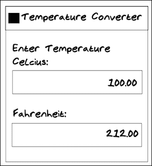

### 创建项目

我们的第一步是创建项目。现在，由于我们已经为前五个章节做过这个，我认为我不需要为你提供一步一步的指导。只需通过 Android Studio 新项目向导，选择带有你的包名的 Android 移动项目，加上其他样板文件，不要 Activity 模板。Android Studio 会自动为你创建一个示例`AndroidApplicationTestCase`。记住，如果你遇到困难，可以参考本书的代码附录。创建后，它应该看起来像这样：


现在，让我们快速创建一个名为`TemperatureConverterActivity`的新 Activity（我们没有使用模板生成器，因为它添加了很多现在不需要的代码），不要忘记将 Activity 添加到你的`AndroidManifest`文件中。狂热的 TDD 实践者现在可能正激动地挥舞着拳头，因为实际上你应该在测试中需要时才创建这个 Activity，但我同时也在尝试用一些熟悉的内容引导你。

# 创建一个 Java 模块

在这个模板项目之上，我们想要添加另一个代码模块。这将是一个仅 Java 的模块，并将作为我们主 Android 模块的依赖或库。

这里的想法有两方面。首先，它允许你将仅 Java 的代码（不依赖于 Android）分离出来，在一个大项目中，这可以是你的核心领域；运行你的应用程序的业务逻辑，重要的是你要模块化这部分，这样你就可以在不考虑 Android 的情况下工作。

其次，正如我们之前所说，拥有一个仅 Java 的模块，在测试时可以让你调用 Java 作为一门成熟编程语言的丰富历史。Java 模块的测试快速、简单、便捷。你可以为 JVM 编写 JUnit 测试，并在几毫秒内运行它们（我们将会这样做！）。

在 Android Studio 中，导航到**文件** | **新建模块**，这将弹出**创建新模块**对话框。在**更多模块**下，选择**Java 库**，然后点击**下一步**。给你的库命名为`core`，确保包名与你的 Android 应用程序相同，然后点击**完成**。最后一个界面应该看起来像这样：

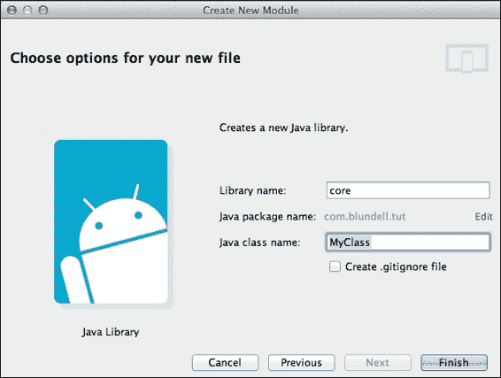

创建后，你需要从你的 Android `:app`模块添加单向依赖到`:core`模块。在`/app/build.gradle`中，添加对核心模块的依赖：

```kt
dependencies {
    compile fileTree(dir: 'libs', include: ['*.jar'])
    compile 'com.android.support:appcompat-v7:21.0.2'

    compile project(':core')
}
```

这允许我们从 Android 应用程序内部引用核心模块中的文件。

# 创建`TemperatureConverterActivityTests`类

通过选择主测试包名`com.blundell.tut.`继续创建第一个测试。这在 AndroidStudio 项目视图中的`src/androidTest/Java`下，或者在 AndroidStudio Android 视图中的`app/java/(androidTest)`下。然后在这里右键点击，选择**新建** | **Java 类**，将其命名为`TemperatureConverterActivityTests`。

创建类之后，我们需要将其转变为一个测试类。我们应该根据要测试的内容和方式来选择我们的超类。在第二章《*理解使用 Android SDK 的测试*》中，我们回顾了可用的选择。在尝试决定使用哪个超类时，可以将其作为参考。

在这个特定情况下，我们正在测试单个 Activity 并使用系统基础设施，因此，我们应该使用`ActivityInstrumentationTestCase2`。还请注意，由于`ActivityInstrumentationTestCase2`是一个泛型类，我们还需要模板参数。这是我们测试的 Activity，在我们的例子中，是`TemperatureConverterActivity`。

我们现在注意到，在运行之前需要修复类中的一些错误。否则，这些错误将阻止测试运行。

我们需要修复的问题在第二章《*理解使用 Android SDK 的测试*》中的*无参数构造函数*部分已经描述过。根据此模式，我们需要实现：

```kt
  public TemperatureConverterActivityTests() {
    this("TemperatureConverterActivityTests");
  }

  public TemperatureConverterActivityTests(String name) {
    super(TemperatureConverterActivity.class);
    setName(name);
  }
```

到目前为止，我们执行了以下步骤：

+   我们添加了一个无参数构造函数`TemperatureConverterActivityTests()`。从这个构造函数中，我们调用了需要名称作为参数的构造函数。

+   最后，在这个给定名称的构造函数中，我们调用了超构造函数并设置名称。

为了验证是否一切已经设置好并就位，你可以通过右键点击类，选择**运行** | **测试类的名称**来运行测试。目前还没有测试可运行，但至少我们可以验证支持我们测试的基础设施已经就位。它应该会以**未找到测试**警告失败。以下是运行测试类的步骤，以防你错过了：

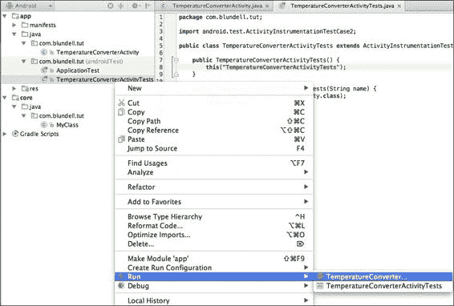

## 创建夹具

我们可以通过向`setup()`方法中添加测试所需的元素来开始创建测试夹具。在这种情况下，几乎不可避免的是要使用待测试的 Activity，因此让我们为此情况做好准备，并将其添加到夹具中：

```kt
@Override  
public void setUp() throws Exception {
    super.setUp();
    activity = getActivity();
}
```

引入上述代码后，使用 AndroidStudio 的重构工具创建`activity`字段以节省时间。（*F2*查看下一个错误，*Alt* + *Enter*快速修复，*Enter*创建字段，*Enter*再次确认字段类型，完成！）

`ActivityInstrumentationTestCase2.getActivity()`方法有一个副作用。如果测试的活动没有运行，它将被启动。如果我们在测试中多次将`getActivity()`作为简单的访问器，并且由于某种原因活动在测试完成前结束或崩溃，这可能会改变测试的意图。我们将会无意中重新启动活动，这就是为什么在测试中我们不鼓励使用`getActivity()`，而倾向于在夹具中拥有它，这样我们隐式地为每个测试重新启动活动。

## 创建用户界面

回到我们的测试驱动开发轨道，从我们简洁的需求列表中可以看出，分别有两个条目用于摄氏度和华氏度温度。因此，让我们将它们添加到我们的测试夹具中。

它们尚未存在，我们甚至还没有开始设计用户界面布局，但我们知道肯定需要有两个这样的条目。

这是你应该添加到`setUp()`方法中的代码： 

```kt
celsiusInput = (EditText)
  activity.findViewById(R.id.converter_celsius_input);
fahrenheitInput = (EditText)
  activity.findViewById(R.id.converter_fahrenheit_input);
```

有一些重要的事情需要注意：

+   我们选择名称`converter_celsius_input`，因为`converter_`是此字段（在`TemperatorConverter`活动中）的位置，`celsius_`是字段代表的内容，最后 input 是字段的行为方式。

+   我们使用`EditText`为我们的夹具定义字段

+   我们使用之前创建的活动通过 ID 查找视图

+   即使这些 ID 不存在，我们仍然在主项目中使用`R`类

## 测试用户界面组件的存在

一旦我们在`setUp()`方法中添加了它们，如前一部分所示，我们可以编写我们的第一个测试并检查视图的存在：

```kt
  public final void testHasInputFields() {
    assertNotNull(celsiusInput);
    assertNotNull(fahrenheitInput);
  }
```

我们还不能运行测试，因为我们必须先解决一些编译问题。我们应该修复`R`类中缺失的 ID。

创建了引用我们尚未拥有的用户界面元素和 ID 的测试夹具后，测试驱动开发范式要求我们添加所需的代码以满足我们的测试。我们应该做的第一件事是让测试编译，这样如果我们有测试未实现功能的测试，它们将失败。

## 获取定义的 ID

我们首先要定义用户界面元素在`R`类中的 ID，这样引用未定义常量`R.id.converter_celsius_input`和`R.id.converter_fahrenheit_input`产生的错误就会消失。

作为经验丰富的 Android 开发者，你将知道如何操作。不管怎样，我会为你提供一个复习。在布局编辑器中创建一个`activity_temperature_converter.xml`布局，并添加所需的用户界面组件，以得到类似于之前在*用户界面概念设计*部分介绍的设计，如下代码所示：

```kt
<?xml version="1.0" encoding="utf-8"?>
<LinearLayout 
  android:layout_width="match_parent"
  android:layout_height="match_parent"
  android:orientation="vertical">

  <TextView
    android:layout_width="match_parent"
    android:layout_height="wrap_content"
    android:layout_marginBottom="@dimen/margin"
    android:text="@string/message" />

  <<TextView
    android:id="@+id/converter_celsius_label"
    android:layout_width="wrap_content"
    android:layout_height="wrap_content"
    android:layout_marginStart="@dimen/margin"
    android:text="@string/celsius" />

  <EditText
    android:id="@+id/converter_celsius_input"
    android:layout_width="wrap_content"
    android:layout_height="wrap_content"
    android:layout_margin="@dimen/margin"  />

  <TextView
    android:id="@+id/converter_fahrenheit_label"
    android:layout_width="wrap_content"
    android:layout_height="wrap_content"
    android:layout_marginStart="@dimen/margin"
    android:text="@string/fahrenheit"  />

  <EditText
    android:id="@+id/converter_fahrenheit_input"
    android:layout_width="wrap_content"
    android:layout_height="wrap_content"
    android:layout_margin="@dimen/margin"  />
</LinearLayout>
```

这样做，我们让测试编译（别忘了添加字符串和尺寸），运行测试，它们通过了吗？不，它们不应该！你需要挂接你的新活动布局（我敢打赌你已经领先一步了）：

```kt
public class TemperatureConverterActivity extends Activity {
    @Override
    protected void onCreate(Bundle savedInstanceState) {
        super.onCreate(savedInstanceState);
        setContentView(R.layout.activity_temperature_converter);
    }
}
```

再次运行测试，你应该得到以下结果：

+   `testHasInputFields`测试成功

+   现在一切变绿了

测试输出的结果如下所示：

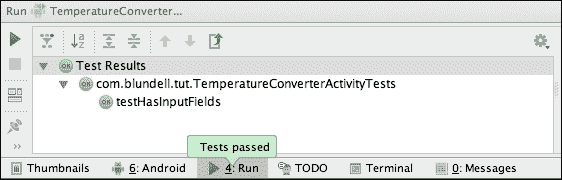

这清楚地意味着我们正在按照 TDD 的路线进行。

你可能也注意到了，我们在用户界面中添加了一些装饰性非功能性项目，我们没有测试（比如填充），主要是为了让我们的示例尽可能简单。在实际场景中，你可能还想为这些元素添加测试。

## 将需求翻译为测试

测试具有双重特性。它们验证我们代码的正确性，但在有时，特别是在 TDD 中，它们可以帮助我们理解设计并消化我们正在实现的内容。为了能够创建测试，我们需要了解我们正在处理的问题，如果我们不了解，我们至少应该有一个大致的问题轮廓，以便我们可以开始处理它。

在很多情况下，用户界面背后的需求并没有明确表达，但你应该能够从线框 UI 设计中理解它们。如果我们假设这是这种情况，那么我们可以通过首先编写我们的测试来抓住设计。

### 空字段

从我们的一项需求中，我们得到：输入字段应该从空开始。

为了在测试中表达这一点，我们可以编写以下内容：

```kt
    public void testFieldsShouldStartEmpty() {
        assertEquals("", celsiusInput.getText().toString());
        assertEquals("", fahrenheitInput.getText().toString());
    }
```

在这里，我们只需将字段的初始内容与空字符串进行比较。

这个测试立即通过，太好了！尽管 TDD 的一个原则是从红色测试开始，你可能想要做一个快速的正确性检查，为`EditText`的 XML 添加一些文本并运行测试，当它在你删除添加的文本后再次变红变绿时，你知道你的测试正在验证你期望的行为（而不是因为你不期望的副作用而变绿）。我们成功地将一个需求转换为测试，并通过获取测试结果来验证它。

### 视图属性

同样，我们可以验证组成我们布局的视图的其他属性。我们可以验证其他事项，例如：

+   字段（如预期出现在屏幕上）

+   字体大小

+   边距

+   屏幕对齐

让我们先验证字段是否在屏幕上：

```kt
    public void testFieldsOnScreen() {
        View origin = activity.getWindow().getDecorView();

        assertOnScreen(origin, celsiusInput);
        assertOnScreen(origin, fahrenheitInput);
    }
```

如前所述，我们从这里使用一个断言：`ViewAsserts`：`assertOnScreen`。

### 注意

静态导入及其最佳使用方式在第二章中进行了说明，*理解使用 Android SDK 的测试*。如果你之前没有做过，现在是时候了。

`assertOnScreen()`方法需要一个起点来寻找其他视图。在这种情况下，因为我们要从最高级别开始，我们使用`getDecorView()`，它获取包含标准窗口框架和装饰的顶级窗口视图，以及客户端内容。

通过运行这个测试，我们可以确保输入字段出现在屏幕上，正如 UI 设计所规定的那样。在某种程度上，我们已经知道具有这些特定 ID 的视图存在。也就是说，我们通过将视图添加到主布局中，使装置得以编译，但我们并不确定它们是否真的出现在屏幕上。因此，仅需要这个测试的存在，以确保将来不会改变这个条件。如果我们因为某些原因移除了其中一个字段，这个测试会告诉我们它缺失了，不符合 UI 设计。

继续我们的需求列表，我们应该测试视图是否按照我们期望的方式在布局中排列：

```kt
    public void testAlignment() {
        assertLeftAligned(celsiusLabel, celsiusInput);
        assertLeftAligned(fahrenheitLabel, fahrenheitInput);
        assertLeftAligned(celsiusInput, fahrenheitInput);
        assertRightAligned(celsiusInput, fahrenheitInput);
    }
```

我们继续使用`ViewAssert`中的断言——在这种情况下，使用`assertLeftAligned`和`assertRightAligned`。这些方法验证指定视图的对齐方式。为了运行这个测试，我们必须在`setUp()`方法中为标签 TextView 添加两个查找：

```kt
celsiusLabel = (TextView)
  activity.findViewById(R.id.converter_celsius_label);
fahrenheitLabel = (TextView)
  activity.findViewById(R.id.converter_fahrenheit_label);
```

我们默认使用的`LinearLayout`类以我们期望的方式排列字段。再次强调，虽然我们不需要向布局中添加任何东西以满足测试，但这将作为一个保护条件。

一旦我们验证它们正确对齐，我们应该验证它们是否覆盖了整个屏幕宽度，如原理图所指定。在这个例子中，只需验证`LayoutParams`具有正确的值就足够了：

```kt
    public void testCelciusInputFieldCoversEntireScreen() {
     LayoutParams lp;
     int expected = LayoutParams.MATCH_PARENT;
     lp = celsiusInput.getLayoutParams();  
     assertEquals("celsiusInput layout width is not MATCH_PARENT", expected, lp.width);
    }

    public void testFahrenheitInputFieldCoversEntireScreen() {
     LayoutParams lp;
     int expected = LayoutParams.MATCH_PARENT;
     lp = fahrenheitInput.getLayoutParams();
     assertEquals("fahrenheitInput layout width is not MATCH_PARENT", expected, lp.width);
    }
```

我们使用自定义信息以便在测试失败时轻松识别问题。

运行这个测试，我们得到以下信息，表明测试失败了：**AssertionFailedError: celsiusInput 布局宽度不是 MATCH_PARENT，预期：<-1> 但实际：<-2>**。

这引导我们到布局定义。我们必须将`layout_width`从 Celsius 和 Fahrenheit 字段更改为`match_parent`：

```kt
<EditText
    android:id="@+id/converter_celsius_input"
    android:layout_width="match_parent"
    android:layout_height="wrap_content"
    android:layout_margin="@dimen/margin"
    android:gravity="end|center_vertical" /> 
```

Fahrenheit 字段也是如此——更改完成后，我们重复这个循环，并再次运行测试，以验证现在它是否成功。

我们的方法开始显现。我们创建测试用以验证需求中描述的条件。如果条件不满足，我们就改变问题产生的原因，并再次运行测试，验证最新的更改是否解决了问题，或许更重要的是，这个更改没有破坏现有的代码。

接下来，让我们验证字体大小是否符合我们的要求：

```kt
    public void testFontSizes() {
        float pixelSize = 24f;
        assertEquals(pixelSize, celsiusLabel.getTextSize());
        assertEquals(pixelSize, fahrenheitLabel.getTextSize());
    }
```

在这种情况下，获取字段使用的字体大小就足够了。

默认字体大小不是`24px`，因此我们需要将其添加到我们的布局中。一个好的做法是将相应的尺寸添加到资源文件中，然后在布局中需要的地方使用它。所以，让我们在`res/values/dimens.xml`中添加`label_text_size`，值为`24sp`。然后在标签`celsius_label`和`fahrenheit_label`的`Text`大小属性中引用它。

现在，测试可能通过也可能不通过，这取决于你使用的设备或模拟器的分辨率。这是因为我们在测试中断言像素大小，但在`dimens.xml`中我们声明使用`sp`（与缩放无关的像素）。让我们加强这个测试。为了解决这个问题，我们可以在测试类中将`px`转换为`sp`，或者在测试中使用`sp`值。我选择在测试中使用`sp`，尽管你也可以为另一种方法争论：

```kt
    public void testFontSizes() {
        float pixelSize = getFloatPixelSize(R.dimen.label_text_size);

        assertEquals(pixelSize, celsiusLabel.getTextSize());
        assertEquals(pixelSize, fahrenheitLabel.getTextSize());
    }

    private float getFloatPixelSize(int dimensionResourceId) {
        return getActivity().getResources()
                 .getDimensionPixelSize(dimensionResourceId);
    }
```

最后，让我们验证边距是否按照用户界面设计中的描述进行了解释：

```kt
    public void testCelsiusInputMargins() {
        LinearLayout.LayoutParams lp =
(LinearLayout.LayoutParams) celsiusInput.getLayoutParams();

        assertEquals(getIntPixelSize(R.dimen.margin), lp.leftMargin);
        assertEquals(getIntPixelSize(R.dimen.margin), lp.rightMargin);
    }

    public void testFahrenheitInputMargins() {
        LinearLayout.LayoutParams lp =
(LinearLayout.LayoutParams) fahrenheitInput.getLayoutParams();

        assertEquals(getIntPixelSize(R.dimen.margin), lp.leftMargin);
        assertEquals(getIntPixelSize(R.dimen.margin), lp.rightMargin);
    }
```

这与之前的案例类似（我跳过了测试原始像素值的步骤）。我们需要在布局中添加边距。让我们在资源文件中添加边距尺寸，然后在布局中需要的地方引用它。在`res/values/dimens.xml`中将`margin`尺寸设置为`8dp`。然后，在`celsius`和`fahrenheit`两个字段的`layout_margin_start`属性以及标签的`start` `margin`中引用它。

获取从资源`dimen`中整数像素大小的`helper`方法，只是包装了之前讨论过的`float`方法：

```kt
    private int getIntPixelSize(int dimensionResourceId) {
        return (int) getFloatPixelSize(dimensionResourceId);
    }
```

还有一件事是剩下的，就是验证输入值的对齐（调整）。我们很快就会验证输入，只允许输入允许的值，但现在让我们关注对齐。意图是让小于整个字段的值右对齐并垂直居中：

```kt
public void testCelsiusInputJustification() {
  int expectedGravity = Gravity.END | Gravity.CENTER_VERTICAL;
  int actual = celsiusInput.getGravity();
  String errorMessage = String.format(
"Expected 0x%02x but was 0x%02x", expectedGravity, actual);
  assertEquals(errorMessage, expectedGravity, actual);
}

public void testFahrenheitInputJustification() {
  int expectedGravity = Gravity.END | Gravity.CENTER_VERTICAL;
  int actual = fahrenheitInput.getGravity();
  String errorMessage = String.format(
"Expected 0x%02x but was 0x%02x", expectedGravity, actual);
  assertEquals(errorMessage, expectedGravity, actual);
}
```

在这里，我们像往常一样验证`gravity`值。然而，我们使用自定义消息来帮助我们识别可能出错的值。由于`Gravity`类定义了几个常量，其值以十六进制表示更容易识别，我们在消息中将这些值转换为这种基数。

如果这个测试因为字段使用的默认重力而失败，那么剩下的就是改变它。转到布局定义并更改这些`gravity`值，以便测试成功。

这正是我们需要添加的内容：

```kt
android:gravity="end|center_vertical"
```

## 屏幕布局

现在，我们希望验证是否已经满足规定屏幕空间应保留足够空间以显示键盘的要求。

我们可以编写如下测试：

```kt
   public void testVirtualKeyboardSpaceReserved() {
        int expected = getIntPixelSize(R.dimen.keyboard_space);
        int actual = fahrenheitInput.getBottom();
String errorMessage = 
  "Space not reserved, expected " + expected + " actual " + actual;
        assertTrue(errorMessage, actual <= expected);
    }
```

这验证了屏幕上最后一个字段`fahrenheitInput`的实际位置是否不低于建议值。

我们可以再次运行测试，验证一切是否再次变绿。运行你的应用程序，你应该会有一个由测试支持的完整用户界面，如下截图所示：

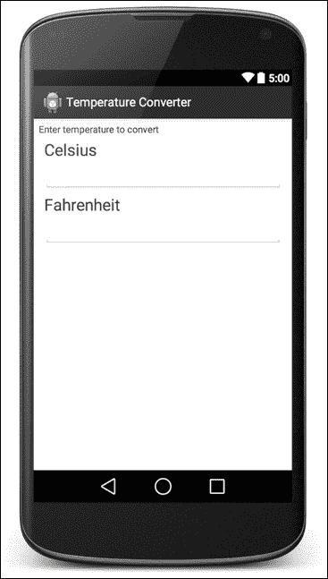

# 添加功能

用户界面已经就位。现在，我们可以开始添加一些基本功能。这些功能将包括处理实际温度转换的代码。

## 温度转换

从需求列表中，我们可以得到这个声明：在一个字段中输入一个温度时，另一个字段应自动更新为转换后的温度。

按照我们的计划，我们必须实现这个测试以验证正确功能的存在。我们的测试可能看起来像这样：

```kt
@UiThreadTest
public void testFahrenheitToCelsiusConversion() {
  celsiusInput.clear();
  fahrenheitInput.clear();
  fahrenheitInput.requestFocus();
  fahrenheitInput.setText("32.5");
  celsiusInput.requestFocus();
  double f = 32.5;
  double expectedC = TemperatureConverter.fahrenheitToCelsius(f);
  double actualC = celsiusInput.getNumber();
  double delta = Math.abs(expectedC - actualC);
  String msg = "" + f + "F -> " + expectedC + "C but was " 
    + actualC + "C (delta " + delta + ")";
  assertTrue(msg, delta < 0.005);
}
```

让我们一步一步地执行这个操作：

1.  首先，正如我们已经知道的，为了与 UI 交互并更改其值，我们应该在 UI 线程上运行测试，因此由于我们使用`EditText.setText`，测试被注解为`@UiThreadTest`。

1.  其次，我们使用一个专门的类来替换`EditText`，提供一些便捷方法，如`clear()`和`setNumber()`。这将改善我们的应用设计。

1.  接下来，我们调用一个名为`TemperatureConverter`的转换器，这是一个工具类，提供不同的方法来转换不同的温度单位，并使用不同的温度值类型。

1.  最后，由于我们将截断结果以在用户界面中以合适的格式呈现，我们应该与一个增量比较来断言转换值的准确性。

这样创建测试将迫使我们按照计划路径执行。我们的第一个目标是添加所需的方法和代码以使测试能够编译，然后满足测试的需求。

## EditNumber 类

在我们的主包中（不是在测试包中，也不是在`/androidTest/`下的那个），我们应该创建一个继承`EditText`的`EditNumber`类，因为我们需要扩展其功能。创建类后，我们需要更改测试类成员类型的字段类型：

```kt
public class TemperatureConverterActivityTests extends ActivityInstrumentationTestCase2<TemperatureConverterActivity> {

  private TemperatureConverterActivity activity;  
  private EditNumber celsiusInput;
  private EditNumber fahrenheitInput;
  private TextView celsiusLabel;
  private TextView fahrenheitLabel;
```

然后，更改测试中存在的任何强制类型转换。你的 IDE 会高亮这些代码；按下*F2*在类中找到它们。

在能够编译测试之前，我们还需要解决两个问题：

+   我们在`EditNumber`中仍然没有`clear()`和`setNumber()`方法

+   我们还没有`TemperatureConverter`工具类

在测试类的内部，我们可以使用 IDE 来帮助我们创建方法。再次按下*F2*，你应被带到**无法解析方法 clear()**的错误处。现在按下*Alt* + *Enter*，在`EditNumber`类型中创建`clear()`方法。`getNumber()`方法同理。

最后，我们必须创建`TemperatureConverter`类。这个类将包含摄氏度和华氏度的数学转换，不包含任何 Android 代码。因此，我们可以在`/core/`模块内创建此包。如先前讨论的，它将位于相同的包结构下，只是这个模块不知道 Android，因此我们可以编写运行速度更快的 JVM 测试。

### 提示

确保在核心模块中创建它，并且与你的主代码位于同一包下，而不是测试包。

下面是在核心模块中创建该类，以及我们应用程序当前状态的方法：


完成此操作后，在我们的测试中，创建了`fahrenheitToCelsius`方法。

这解决了我们之前的问题，并引导我们进行一个现在可以编译和运行的测试。是的，你将会看到红色的 Lint 错误，但这些并不是"编译"错误，因此测试仍然可以运行。（AndroidStudio 的智能程度实在是太高了。）

出乎意料的是，当我们运行测试时，它们会因为异常而失败：

```kt
java.lang.ClassCastException:
android.widget.EditText cannot be cast to com.blundell.tut.EditNumber
at com.blundell.tut.TemperatureConverterActivityTests.setUp(
TemperatureConverterActivityTests.java:36)
at android.test.AndroidTestRunner.runTest(
AndroidTestRunner.java:191)

```

这是因为我们更新了所有的 Java 文件以包含我们新创建的`EditNumber`类，但忘记了更改布局 XML。

让我们继续更新我们的 UI 定义：

```kt
<com.blundell.tut.EditNumber
    android:id="@+id/converter_celsius_input"
    android:layout_width="match_parent"
    android:layout_height="wrap_content"
    android:layout_margin="@dimen/margin"
    android:gravity="end|center_vertical" />
```

也就是说，我们用扩展原始`EditText`类的`com.blundell.tut.EditNumber`视图替换了原来的`EditText`类。

现在，我们再次运行测试，发现所有测试都通过了。

但等一下；我们在新的`EditNumber`类中还没有实现任何转换或处理值的方法，所有测试都顺利通过了。是的，它们通过了，因为我们的系统没有足够的限制，现有的限制仅仅相互抵消了。

在继续之前，让我们分析一下刚才发生了什么。我们的测试调用了`fahrenheitInput.setText("32.5")`方法来设置**华氏度**字段输入的温度，但我们的`EditNumber`类在输入文本时什么也不做，功能尚未实现。因此，**摄氏度**字段保持为空。

`expectedC`的值——预期的摄氏度温度，是通过调用`TemperatureConverter.fahrenheitToCelsius(f)`计算的，但这是一个空方法。在这种情况下，因为我们知道方法的返回类型，所以我们让它返回一个常数`0`。因此，`expectedC`变成了`0`。

然后，从用户界面获取转换的实际值。在这种情况下，从`EditNumber`调用`getNumber()`。但这个方法是自动生成的，为了满足其签名所施加的限制，它必须返回一个值，即`0`。

Δ值再次为`0`，由`Math.abs(expectedC - actualC)`计算得出。

最后，我们的断言`assertTrue(msg, delta < 0.005)`为`true`，因为`delta=0`满足了条件，测试通过。

那么，我们的方法有缺陷吗，因为它无法检测到这种情况？

不，完全不是，这里的问题是我们的限制不够，而这些限制被自动生成方法使用的默认值满足了。一种替代方法可能是对所有自动生成的方法抛出异常，比如`RuntimeException("尚未实现")`，以检测在未实现时使用它的情况。我们将在系统中增加足够的限制，以便轻松捕捉这种*双重零*条件。

## 温度转换器的单元测试

从我们之前经验来看，似乎默认实现的转换总是返回`0`，因此我们需要更健壮的东西。否则，我们的转换器只有在参数取 32F（32F == 0C）的值时才会返回有效的结果。

`TemperatureConverter` 类是一个与 Android 基础架构无关的实用类，因此一个标准的单元测试就足以测试它。

由于这是我们即将编写的第一个核心测试，我们需要进行一些设置。首先，从项目视图开始；在你的项目结构中，通过选择 **新建** | **目录** 并使用名称 `test` 在 `/core/src` 下创建一个 `test` 文件夹。在这个文件夹内，通过选择 **新建** | **目录** 并使用名称 `java` 创建一个 `java` 文件夹。由于 Gradle 的神奇之处，它会明白这是你想要添加测试的地方，文件夹应该会变成绿色（绿色表示该文件夹是测试类路径的一部分）。现在添加一个新的包，从技术上来说并不是新的，因为我们将再次使用 `com.blundell.tut`，通过选择 **新建** | **包** 并使用名称 `com/blundell/tut`。

现在，在我们新的文件夹和包中创建我们的测试。我们通过选择 **新建** | **Java 类** 并将其命名为 `TemperatureConverterTests` 来创建测试。你的项目现在应该看起来像这样：


让我们创建第一个测试，在 `TemperatureConverterTests` 内，按 *Ctrl* + *Enter* 弹出 **生成** 菜单，如下面的截图所示：

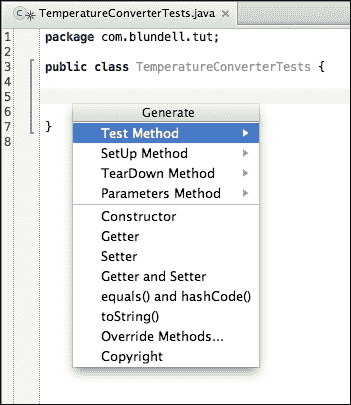

选择 **测试方法** 测试，然后选择 JUnit4 将为我们生成我们想要的测试模板方法，将其命名为 `testFahrenheitToCelsius()`。记住这个快捷方式，因为它在创建新测试时非常有用。一旦你生成了这个测试，你会注意到我们在 JUnit 4 导入的代码行上有编译错误。哎呀！我们忘记将 JUnit 库添加到我们核心模块的测试类路径中。打开 `/core/build.gradle` 文件，并添加 JUnit 依赖。你的核心 `build.gradle` 现在应该看起来像这样：

```kt
apply plugin: 'java''java'

dependencies {
    compile fileTree(dir: 'libs''libs', include: [''''*.jar'])

    testCompile 'junit'junit:junit:4.+''''
}
```

### 注意

注意，这里我们从 JUnit3 跳到了 JUnit4，主要区别在于我们现在可以使用注解来告诉我们的测试运行器，类中的哪些方法是测试方法。因此，从技术上讲，我们不再需要像 `testFooBar()` 那样以 `test` 开头的方法名，但为了在我们两者之间切换时保持清醒，我们还是会这样做（Android 对 JUnit4 的支持即将到来！）。

通过选择 **项目同步** 来进行项目同步，我们现在可以编译并准备编码。让我们开始编写测试：

```kt
@Test
public void testFahrenheitToCelsius() {
    for (double knownCelsius : conversionTable.keySet()) {
        double knownFahrenheit = conversionTable.get(knownCelsius);

        double resultCelsius =
TemperatureConverter.fahrenheitToCelsius(knownFahrenheit);

        double delta = Math.abs(resultCelsius - knownCelsius);
        String msg = knownFahrenheit + "F -> " + knownCelsius + "C"+ "but is " + resultCelsius;
        assertTrue(msg, delta < 0.0001);
     }
}
```

创建一个带有不同温度转换值的转换表，我们知道从其他来源驱动这个测试是一个好方法：

```kt
Map<Double, Double> conversionTable = new HashMap<Double, Double>() {
  // initialize (celsius, fahrenheit) pairs
  put(0.0, 32.0);
  put(100.0, 212.0);
  put(-1.0, 30.20);
  put(-100.0, -148.0);
  put(32.0, 89.60);
  put(-40.0, -40.0);
  put(-273.0, -459.40);
}};
```

要在核心模块中运行测试，我们可以右键点击项目视图中的文件，并选择 **运行**。正如截图也显示的那样，你可以使用快捷键 *Cmd* + *Shift* + *F10*：

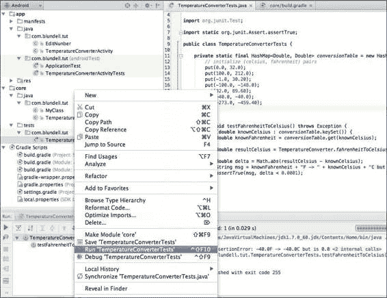

当这个测试运行时，我们验证它失败，并给我们留下这条轨迹：

```kt
java.lang.AssertionError: -40.0F -> -40.0C but is 0.0
 at org.junit.Assert.fail(Assert.java:88)
 at org.junit.Assert.assertTrue(Assert.java:41)
 at com.blundell.tut.TemperatureConverterTests.testFahrenheitToCelsius(TemperatureConverterTests.java:31).

```

### 注意

看看这些核心测试运行得多快！尽量将应用程序逻辑移到核心模块中，这样在进行测试驱动开发时，你可以利用这个速度。

好吧，这是我们预料之中的事情，因为我们的转换总是返回`0`。实现我们的转换时，我们发现我们需要一个`ABSOLUTE_ZERO_F`常量：

```kt
    private static final double ABSOLUTE_ZERO_F = -459.67d;

    private static final String ERROR_MESSAGE_BELOW_ZERO_FMT =       "Invalid temperature: %.2f%c below absolute zero";

    private TemperatureConverter() {
        // non-instantiable helper class
    }

    public static double fahrenheitToCelsius(double fahrenheit) {
        if (fahrenheit < ABSOLUTE_ZERO_F) {
            String msg = String.format(ERROR_MESSAGE_BELOW_ZERO_FMT,               fahrenheit, 'F''F');
            throw new InvalidTemperatureException(msg);
        }
        return ((fahrenheit - 32) / 1.8d);
    }
```

绝对零度是熵达到最小值的理论温度。根据热力学定律，要达到这个绝对零度的状态，系统应该与宇宙的其余部分隔离。因此，这是一个无法达到的状态。然而，按照国际协议，绝对零度定义为开尔文量表上的 0K，摄氏量表上的-273.15°C，或者华氏量表上的-459.67°F。

我们正在创建一个自定义异常`InvalidTemperatureException`，以指示在转换方法中提供有效温度失败。这个异常与 Android 无关，因此也可以放在我们的核心模块中。通过扩展`RuntimeException`来创建它：

```kt
public class InvalidTemperatureException extends RuntimeException {

  public InvalidTemperatureException(String msg) {
    super(msg);
  }

}
```

再次运行核心测试，我们发现`testFahrenheitToCelsius`测试成功了。因此，我们回到 Android 测试，运行这些测试发现`testFahrenheitToCelsiusConversion`测试失败了。这告诉我们，现在转换器类正确处理了转换，但 UI 处理这个转换仍然存在一些问题。

### 注意

不必对运行两个单独的测试类感到绝望。对你来说，选择运行哪些测试是常见的；这在进行 TDD 时部分是学习到的技能。但是，如果你愿意，可以编写自定义测试运行器来运行所有的测试。此外，使用 Gradle 运行`build connectedAndroidTest`将一次性运行所有测试，这建议在你认为完成了一个功能或想要提交到上游版本控制时执行。

仔细查看`testFahrenheitToCelsiusConversion`失败的追踪信息，可以发现有些地方在不应返回`0`的情况下仍然返回了`0`。

这提醒我们，我们仍然缺少一个合适的`EditNumber`实现。在继续实现上述方法之前，让我们创建相应的测试来验证我们正在实现的内容是否正确。

## `EditNumber`测试

从前一章可以确定，我们自定义视图测试的最佳基类是`AndroidTestCase`，因为我们需要一个模拟的`Context`类来创建自定义视图，但我们不需要系统基础结构。

创建`EditNumber`的测试，我们称之为`EditNumberTests`，并扩展`AndroidTestCase`。提醒一下，这位于应用模块下的`androidTest`路径中。

我们需要添加构造函数以反映我们之前识别的给定名称模式：

```kt
public EditNumberTests() {
 this("EditNumberTests");
 }

 public EditNumberTests(String name) {
 setName(name);
    }
```

下一步是创建测试夹具。在这种情况下，这是一个简单的`EditNumber`类，我们将对其进行测试：

```kt
    @Override
    protected void setUp() throws Exception {
        super.setUp();

        editNumber = new EditNumber(mContext);
        editNumber.setFocusable(true);
    }
```

模拟上下文是从`AndroidTestCase`类中受保护的字段`mContext`获取的（[`developer.android.com/reference/android/test/AndroidTestCase.html#mContext`](http://developer.android.com/reference/android/test/AndroidTestCase.html#mContext)）。

在`setUp`方法的最后，我们将`editNumber`设置为可聚焦的视图，这意味着它将能够获得焦点，因为它将参与许多模拟可能需要显式请求其焦点的 UI 的测试。

接下来，我们测试`testClear()`方法中所需`clear()`功能的正确实现：

```kt
@UiThreadTest
public void testClear() {
String value = "123.45";
          editNumber.setText(value);

          editNumber.clear();

          assertEquals("", editNumber.getText().toString());
} 
```

运行测试，我们验证它确实失败了：

```kt
junit.framework.ComparisonFailure: expected:<[]> but was:<[123.45]>
at com.blundell.tut.EditNumberTests.testClear(EditNumberTests.java:31)
at java.lang.reflect.Method.invokeNative(Native Method)
at android.test.AndroidTestRunner.runTest(AndroidTestRunner.java:191)

```

我们需要正确实现`EditNumber.clear()`。

这是一个简单的案例，只需将此实现添加到`EditNumber`中，我们就可以满足测试：

```kt
  public void clear() {
    setText("");
  }
```

运行测试并继续。我们将在`EditNumber`中添加一个新方法。这里，我们已经有了`getNumber()`，我们现在添加`setNumber()`以便稍后使用。现在让我们完成`testSetNumber()`实现的编写：

```kt
           public void testSetNumber() {

        editNumber.setNumber(123.45);

        assertEquals("123.45", editNumber.getText().toString());
    }
```

除非我们实现了类似于以下实现的`EditNumber.setNumber()`，否则会失败：

```kt
    private static final String DEFAULT_FORMAT = "%."%.2f";";

    public void setNumber(double number) {
        super.setText(String.format(DEFAULT_FORMAT, number));
    }
```

我们使用了一个常量`DEFAULT_FORMAT`来保存转换数字所需的格式。这可以稍后转换为属性，也可以在字段的 XML 布局定义中指定。

同样适用于`testGetNumber()`和`getNumber()`这一对：

```kt
      public void testGetNumber() {

        editNumber.setNumber(123.45);

        assertEquals(123.45, editNumber.getNumber());
    }
```

`getNumber()`方法如下所示：

```kt
    public double getNumber() {
        String number = getText().toString();
        if (TextUtils.isEmpty(number)) {
            return 0D;
        }
        return Double.valueOf(number);
    }
```

这些测试成功了，所以运行你的其他测试来看我们进行到哪一步；我在命令行中运行了`gradlew build cAT`命令来做到这一点。这运行了我们到目前为止编写的所有测试；但`testFahrenheitToCelsiusConversion()`失败了。我们已经有很多经过良好测试的代码，退一步，反思一下。

以下是我们 Android 测试的结果：

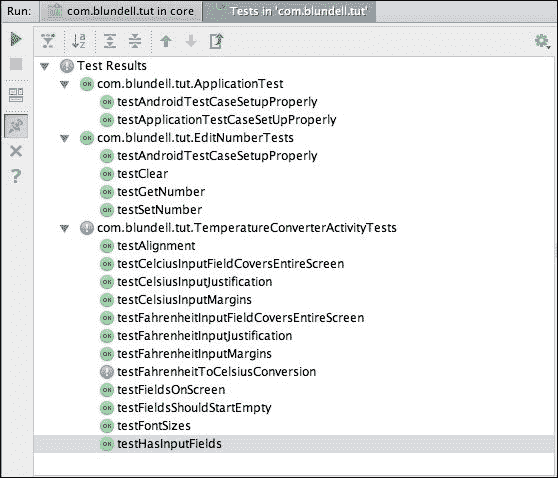

以下是我们核心的 Java 测试结果：

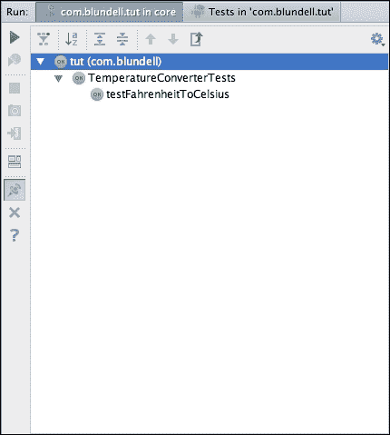

如果仔细分析`testFahrenheitToCelsiusConversion()`测试用例，你就能发现问题所在。

明白了吗？

我们的测试方法期望当焦点发生变化时自动进行转换，正如我们需求列表中指定的那样：“在一个字段中输入一个温度时，另一个字段会自动更新为转换后的值”。

记住，我们没有按钮或任何其他东西来转换温度值，所以一旦输入了值，转换应该是自动进行的。

这让我们回到了`TemperatureConverterActivity`类，以及它处理转换的方式。

## TemperatureChangeWatcher 类

实现不断更新另一个温度值所需行为的一种方式，是在原始值发生变化时通过`TextWatcher`。从文档中，我们可以理解`TextWatcher`是附加到`Editable`的类型的一个对象；当文本更改时，将调用其方法（[`developer.android.com/reference/android/text/TextWatcher.html`](http://developer.android.com/reference/android/text/TextWatcher.html)）。

这似乎是我们需要的。

我们将这个类实现为`TemperatureConverterActivity`的内部类。这样做的想法是，因为我们直接作用于 Activity 的 Views，将其作为内部类显示了这种关系，并且如果有人想要更改此 Activity 的布局，这会使关系变得清晰。如果你实现了最小的`TextWatcher`，你的 Activity 将如下所示：

```kt
public class TemperatureConverterActivity extends Activity {

    @Override
    protected void onCreate(Bundle savedInstanceState) {
        super.onCreate(savedInstanceState);
        setContentView(R.layout.activity_temperature_converter);
    }

    /**
     * Changes fields values when the text changes; applying the correlated conversion method.
     */
    static class TemperatureChangedWatcher implements TextWatcher {

        @Override
        public void beforeTextChanged(CharSequence s, int start, int count, int after) {

        }

        @Override
        public void onTextChanged(CharSequence s, int start, int before, int count) {

        }

        @Override
        public void afterTextChanged(Editable s) {
        }
    }
}
```

现在我们对最近创建的类进行一些添加后的代码如下：

```kt
/**
 * Changes fields values when the text changes;
 * applying the correlated conversion method.
 */
static class TemperatureChangedWatcher implements TextWatcher {

private final EditNumber sourceEditNumber;
private final EditNumber destinationEditNumber;
private final Option option;

private TemperatureChangedWatcher(Option option,
EditNumber source,
EditNumber destination) {
this.option = option;
   this.sourceEditNumber = source;
   this.destinationEditNumber = destination;
}

static TemperatureChangedWatcher newCelciusToFehrenheitWatcher(EditNumber source, EditNumber destination) {
return new TemperatureChangedWatcher(Option.C2F, source, destination);
}

static TemperatureChangedWatcher newFehrenheitToCelciusWatcher(EditNumber source, EditNumber destination) {
return new TemperatureChangedWatcher(Option.F2C, source, destination);
}

@Override
public void onTextChanged(CharSequence input, int start, int before, int count) {
if (!destinationEditNumber.hasWindowFocus()
|| destinationEditNumber.hasFocus()
|| input == null) {
       return;
}

   String str = input.toString();
   if ("".equals(str)) {
       destinationEditNumber.setText("");
          return;
}

   try {
      double temp = Double.parseDouble(str);
      double result = (option == Option.C2F)
? TemperatureConverter.celsiusToFahrenheit(temp)
: TemperatureConverter.fahrenheitToCelsius(temp);
    String resultString = String.format("%.2f", result);
    destinationEditNumber.setNumber(result);
    destinationEditNumber.setSelection(resultString.length());
   } catch (NumberFormatException ignore) {
      // WARNING this is generated whilst 
 // numbers are being entered,
 // for example just a '-' 
 // so we don''t want to show the error just yet
   } catch (Exception e) {
     sourceEditNumber.setError("ERROR: " + e.getLocalizedMessage());
   }
}

@Override
public void afterTextChanged(Editable editable) {
// not used
}

@Override
public void beforeTextChanged(CharSequence s, int start, int count, int after) {
// not used
}
}
```

我们将使用相同的`TemperatureChangeWatcher`实现，用于摄氏度和华氏度这两个字段；因此我们保留了作为源和目标字段以及更新它们值的操作的引用。为了指定此操作，我们引入了`enum`，它是纯 Java，因此可以放入核心模块中：

```kt
/**
 * C2F: celsiusToFahrenheit
 * F2C: fahrenheitToCelsius
 */
public enum Option {
    C2F, F2C
}
```

此操作在创建工厂方法中指定，并根据需要选择源和目标`EditNumber`。这样我们可以为不同的转换使用相同的观察者。

我们感兴趣的`TextWatcher`接口的方法是`onTextChanged`。只要文本发生变化，就会调用它。起初，我们避免潜在的循环，检查谁具有焦点，并在条件不满足时返回。

如果源为空，我们也应将目标字段设置为空字符串。

最后，我们尝试将调用相应转换方法得到的结果值设置到目标字段。我们根据需要标记错误，避免在转换被部分输入的数字调用时显示过早的错误。

我们需要在`TemperatureConverterActivity.onCreate()`中设置输入字段的监听器：

```kt
@Override
protected void onCreate(Bundle savedInstanceState) {
  super.onCreate(savedInstanceState);
  setContentView(R.layout.activity_temperature_converter);
  EditNumber celsiusEditNumber =
  (EditNumber) findViewById(R.id.converter_celsius_input); 
  EditNumber fahrenheitEditNumber =
  (EditNumber) findViewById(R.id.converter_fahrenheit_input);
  celsiusEditNumber
  .addTextChangedListener(
newCelciusToFehrenheitWatcher(celsiusEditNumber, fahrenheitEditNumber));

fahrenheitEditNumber
 .addTextChangedListener(
 newFehrenheitToCelciusWatcher(fahrenheitEditNumber, 
 celsiusEditNumber));
}
```

为了能够运行测试，我们应该编译它们。要编译，我们至少需要定义尚未定义的`celsiusToFahrenheit()`方法。

## 更多温度转换器测试

我们需要实现`celsiusToFahrenheit`，像往常一样，我们从测试开始。

这与其他转换方法`fahrenheitToCelsius`相当等效，我们可以使用在创建此测试时设计的基础架构：

```kt
@Test
    public void testCelsiusToFahrenheit() {
        for (double knownCelsius : conversionTable.keySet()) {
            double knownFahrenheit = conversionTable.get(knownCelsius);

            double resultFahrenheit = 
TemperatureConverter.celsiusToFahrenheit(knownCelsius);

            double delta = Math.abs(resultFahrenheit - knownFahrenheit);
            String msg = knownCelsius + "C -> " + knownFahrenheit + "F"
+ " but is " + resultFahrenheit;
            assertTrue(msg, delta < 0.0001);
        }
    }
```

我们使用转换表通过不同的转换来练习该方法，并验证误差小于预定义的增量。

然后，`TemperatureConverter`类中的相应转换实现如下：

```kt
    static final double ABSOLUTE_ZERO_C = -273.15d;

    public static double celsiusToFahrenheit(double celsius) {
        if (celsius < ABSOLUTE_ZERO_C) {
            String msg = String.format(
ERROR_MESSAGE_BELOW_ZERO_FMT, celsius, 'C');
            throw new InvalidTemperatureException(msg);
        }
        return (celsius * 1.8d + 32);
    }
```

现在，所有测试都通过了，但我们仍然没有测试所有常见条件。我的意思是，到目前为止我们只检查了正常路径。你应该检查是否正确生成了错误和异常，除了我们到目前为止创建的所有正常情况。

创建这个测试，以检查在转换中使用绝对零度以下的温度时，是否正确生成了异常：

```kt
    @Test(expected = InvalidTemperatureException.class)
    public void testExceptionForLessThanAbsoluteZeroF() {
        TemperatureConverter.fahrenheitToCelsius(ABSOLUTE_ZERO_F - 1);
    }
```

在这个测试中，我们递减绝对零度温度，以获得更小的值，然后尝试转换。我们在核心模块中编写了此测试，因此使用了 JUnit4，它允许我们使用注解来断言我们期望抛出异常。如果你想在 JUnit3 中做同样的事情，你不得不使用 try catch 块，并且如果代码没有进入 catch 块，则测试失败：

```kt
    @Test(expected = InvalidTemperatureException.class)
    public void testExceptionForLessThanAbsoluteZeroC() {
        TemperatureConverter.celsiusToFahrenheit(ABSOLUTE_ZERO_C - 1);
    }
```

同样地，我们测试当尝试转换涉及低于绝对零的摄氏度温度时，是否抛出了异常。

## 输入过滤器测试

另一个错误要求可能是：我们希望过滤掉转换工具接收到的输入，这样不会有垃圾到达这个点。

`EditNumber`类已经过滤了有效输入，否则将生成异常。我们可以通过在`TemperatureConverterActivityTests`中创建一个新测试来验证这个条件。我们选择这个类，因为我们是像真实用户一样向输入字段发送键：

```kt
public void testInputFilter() throws Throwable {
        runTestOnUiThread(new Runnable() {
            @Override
            public void run() {
                celsiusInput.requestFocus();
            }
        });
        getInstrumentation().waitForIdleSync();

        sendKeys("MINUS 1 PERIOD 2 PERIOD 3 PERIOD 4");
        double number = celsiusInput.getNumber();

        String msg = "-1.2.3.4 should be filtered to -1.234 " 
          + "but is " + number;
        assertEquals(msg, -1.234d, number);
    }
```

这个测试使用之前回顾的模式，请求将焦点移到摄氏度字段。这允许我们在 UI 线程中运行测试的一部分，并向视图发送键输入。发送的键是一个包含多个点的无效序列，这对于一个格式良好的十进制数是不被接受的。预期当过滤器启用时，这个序列将被过滤，只有有效字符到达字段。断言`celsiusInput.getNumber()`返回的值，在过滤后是我们所期望的。

要实现这个过滤器，我们需要向`EditNumber`添加`InputFilter`。因为应该将其添加到所有构造函数中，所以我们创建了一个额外的`init()`方法，从每个构造函数中调用它。为了实现我们的目标，我们使用了`DigitsKeyListener`的实例，接受数字、符号和十进制点如下：

```kt
   public EditNumber(Context context) {
        super(context);
        init();
   }
   public EditNumber(Context context, AttributeSet attrs) {
        super(context, attrs);
        init();
   }

   public EditNumber(Context context, AttributeSet attrs, int defStyle) {
        super(context, attrs, defStyle);
        init();
   }

   private void init() {
    // DigistKeyListener.getInstance(true, true)
    // returns an instance that accepts digits, sign and decimal point
    InputFilter[] filters =
      new InputFilter[]{DigitsKeyListener.getInstance(true, true)};
       setFilters(filters);
   }
```

这个`init`方法从每个构造函数中调用，这样如果这个视图是程序化使用或从 XML 中使用，我们仍然有我们的过滤器。

重新运行测试，我们可以验证所有测试都已通过，现在一切又都变绿了。

# 查看我们的最终应用程序

干得好！现在我们有了满足所有要求的应用程序。

在以下屏幕截图中，我们展示了这些要求中的一个，即检测尝试转换低于摄氏度绝对零温度(-1000.00C)的温度的企图：

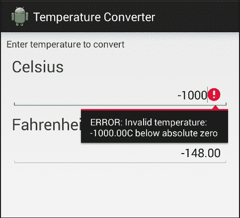

UI 遵循提供的指南；可以通过在相应单位字段中输入温度来进行转换。

回顾一下，这是我们已实现的需求列表：

+   应用程序可以在摄氏度和华氏度之间转换温度

+   用户界面提供了两个输入温度的字段，一个用于摄氏度，另一个用于华氏度

+   当在一个字段中输入一个温度时，另一个字段会自动更新为转换后的温度

+   如果有错误，应该向用户显示，可能使用相同的字段

+   用户界面中应保留一些空间用于屏幕键盘，以便在输入多个转换时简化应用程序的操作

+   输入字段应从空开始

+   输入的值是小数点后两位的十进制值

+   数字右对齐

更重要的是，我们现在可以确信应用程序不仅满足了需求，而且没有明显的问题或错误。我们通过分析测试结果，一步步解决问题，确保任何发现的错误一旦经过测试和修复，就不会再次出现。

# 总结

我们介绍了测试驱动开发，解释了其概念，并在一个潜在的实际问题中逐步应用它们。

我们从一个简洁的需求列表开始，描述了温度转换应用程序。

我们按照测试代码的顺序实现了每一个测试，以此满足需求。通过这种方式，我们实现了应用程序的行为及其展示，进行测试以确保我们设计的 UI 遵循规范。

由于有了测试，我们分析了运行它们的不同可能性。在上一章的基础上，现在我们的持续集成机器可以运行测试，以确保团队的任何更改仍然会产生一个经过良好测试的应用程序。

下一章将介绍行为驱动开发，并继续我们的目标：无错误的、经过良好测试的代码，这次的重点是行为和团队间的共识，即需求在整个团队中的意义。
