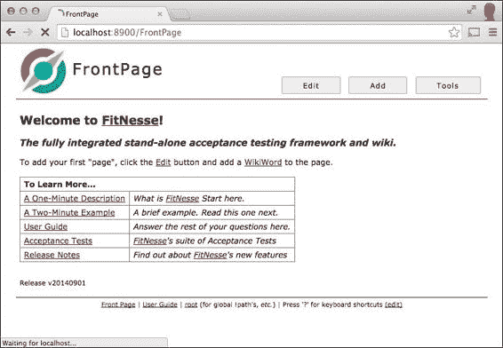
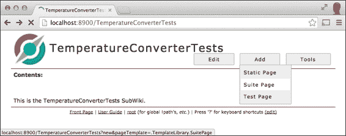
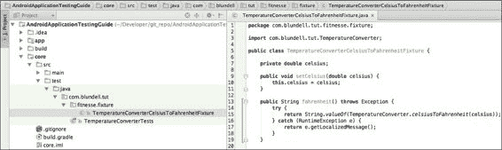
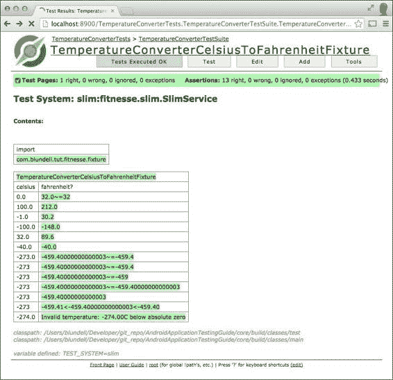
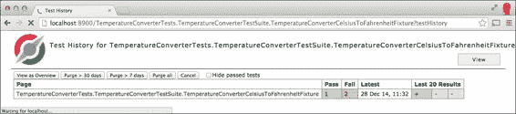
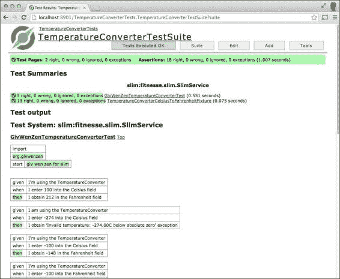

# 第七章：行为驱动开发

**行为驱动开发**（**BDD**）可以理解为**测试驱动开发**（**TDD**）和验收测试的发展和融合。这两种技术在前面的章节中都有讨论，所以在继续之前，您可能想回顾一下第一章，*开始测试*，以及第六章，*实践测试驱动开发*。

行为驱动开发（BDD）引入了一些新概念，例如使用通用词汇描述测试，以及在软件开发项目中包含业务参与者，如产品所有者或业务分析师。

我们之前已经接触过测试驱动开发，我们专注于将低级需求转换为可以推动我们开发过程的测试。行为驱动开发迫使我们关注更高级别的需求，通过使用特定的词汇，我们可以以可以进一步分析或评估的方式表达这些需求。有些人认为 BDD 只是正确执行的 TDD 的哲学。

我们将通过实例来探索这些概念，以便您可以得出自己的结论。

# 给定、当、然后

Given/When/Then 这些词汇是跨越业务和技术之间鸿沟的通用语言，正如在 [`behaviour-driven.org`](http://behaviour-driven.org) 所描述的，它们也可以被称为行为驱动开发无处不在的语言。该框架基于以下三个核心原则，我们在这里逐字重现：

+   业务和技术应该以相同的方式指代同一个系统。

+   任何系统都应该对业务有一个明确且可验证的价值。

+   前期的分析、设计和规划，都会有一个递减的回报。

行为驱动开发依赖于使用这个特定的词汇。此外，预先确定的需求表达格式允许工具解释和执行它们：

+   **给定**：这是描述在外部刺激接收之前的初始状态。

+   **当**：这是为了描述用户执行的关键动作。

+   **然后**：这是为了分析行动的结果。为了可观察，所执行的动作应该有一种结果。

# FitNesse

FitNesse 是一个软件开发协作工具，可用于管理 BDD 场景。严格来说，FitNesse 是一组工具，如下所述：

+   作为软件测试工具，FitNesse 是一个轻量级、开源的框架，允许团队协作。

+   它还是一个 Wiki，您可以轻松创建、编辑页面并共享信息。

+   一个网络服务器，因此它不需要额外的配置或管理权限来设置或配置。

从[`www.fitnesse.org`](http://www.fitnesse.org)下载 FitNesse 发行版。该发行版是一个 JAR 文件，在首次运行时自动安装。在这些示例中，我们使用了 FitNesse 独立版 20140901，但较新版本也应该可以工作。

## 从命令行运行 FitNesse

默认情况下，FitNesse 运行时监听 80 端口，因此要在非特权模式下运行，你应该在命令行上更改端口。在此示例中，我们使用`8900`：

```kt
$ java -jar fitnesse.jar -p 8900

```

这是我们运行命令时获得的输出：

```kt
Bootstrapping FitNesse, the fully integrated standalone wiki and acceptance testing framework.
root page: fitnesse.wiki.fs.FileSystemPage at ./FitNesseRoot#latest
logger: none
authenticator: fitnesse.authentication.PromiscuousAuthenticator
page factory: fitnesse.html.template.PageFactory
page theme: fitnesse_straight
Starting FitNesse on port: 8900

```

一旦运行，你可以将浏览器直接指向本地 FitNesse 服务器主页（`http://localhost:8900/FrontPage`），你将看到以下内容：



## 创建 TemperatureConverterTests 子维基

一旦 FitNesse 启动并运行，我们可以通过创建一个子维基来组织我们的测试。你可能已经熟悉维基概念。如果不是，维基是一个允许用户编辑和创建网页的网站。这种编辑过程是在浏览器内完成的，并使用一种大大简化过程的标记语言。

### 注意

你可以在可能是最著名的维基[`en.wikipedia.org/wiki/Wiki`](http://en.wikipedia.org/wiki/Wiki)上了解更多关于维基的信息。

尽管这种子维基组织不是强制性的，但强烈建议这样做，特别是如果你打算在多个项目中使用 FitNesse 进行验收测试。

最简化的过程之一是超链接创建，只需使用*驼峰命名*或*维基词*即可完成；即以大写字母开头并至少包含一个大写字母的单词。这个维基词将被转换成同名页面的超链接。

要创建**TemperatureConverterTests**子维基，我们只需点击 FitNesse 标志右侧的**编辑**按钮，编辑主页，添加以下内容：

```kt
| '''My Tests''' |
| TemperatureConverterTests | ''Temperature Converter Tests'' |
```

这通过使用"|"标记作为第一个字符和分隔列，向页面添加了一个新表格。

我们还添加了一列带有描述性注释的测试。这个注释通过使用两个单引号（''）包围变成斜体。这段文本将创建一个名为`TemperatureConverterTests`的维基链接。

按下**保存**，页面将被修改。

一旦页面显示，我们可以验证`TemperatureConverterTests`后面是否跟着一个**[?]**（问号），因为页面尚未创建，在我们点击它时将会创建。现在点击它，这将直接把我们带入新页面的编辑模式。我们可以添加一些注释以清楚地标识这个新创建的子维基主页：

```kt
!contents -R2 -g -p -f -h

This is the !-TemperatureConverterTests SubWiki-!.
```

这里，文本`TemperatureConverterTests` `SubWiki`通过使用`!-`和`-!`进行转义，以防止它被转换成另一个页面链接。

再次按下**保存**。

### 向子维基添加子页面

现在，我们通过使用页面标题旁边的**[添加]**链接来添加一个新子页面。

创建子页面有不同的选项，我们可以选择：

+   静态：这是一个普通的维基页面

+   套件：这是一个包含其他测试构成套件的页面

+   测试：这是一个包含测试的页面

我们将选择添加一个套件页面，并将其命名为`TemperatureConverterTestSuite`，如下截图所示：



点击**保存**后，这个页面就会被创建，并且自动作为链接添加到`TemperatureConverterTests`子维基中。

让我们跟随这个新创建的链接到达测试套件页面。

到这里后，使用**[添加]** | **[测试页面]**再添加一个子页面。这添加了一个测试页面，我们将它命名为`TemperatureConverterCelsiusToFahrenheitFixture`，因为这将会包含我们的夹具。这里的命名只是按照约定来组织我们的维基。

点击**保存**来完成操作。

### 添加验收测试夹具

直到现在，我们一直在创建维基页面。这并没有什么令人兴奋的！现在，我们将直接把验收测试夹具添加到页面中。确保你已经导航到新添加的页面`TemperatureConverterCelsiusToFahrenheitFixture`，点击**编辑**，并将`<test page>`替换为以下内容：

```kt
!contents

!|TemperatureConverterCelsiusToFahrenheitFixture          |
|celsius|fahrenheit?                                      |
|0.0    |~= 32                                            |
|100.0  |212.0                                            |
|-1.0   |30.2                                             |
|-100.0 |-148.0                                           |
|32.0   |89.6                                             |
|-40.0  |-40.0                                            |
|-273.0 |~= -459.4                                        |
|-273   |~= -459.4                                        |
|-273   |~= -459                                          |
|-273   |~= -459.40000000000003                           |
|-273   |-459.40000000000003                              |
|-273   |-459.41 < _ < -459.40                            |
|-274.0 |Invalid temperature: -274.00C below absolute zero|
```

这个表格为我们的测试特性定义了几个项目：

+   `TemperatureConverterCelsiusToFahrenheitFixture`：这是表格标题和测试夹具名称。

+   `celsius`：这是我们提供给测试作为输入值的列名。

+   `fahrenheit?`：这是我们期望作为转换结果的值的列名。问号表示这是一个结果值。

+   `~=`：这表示结果大约是这个值。

+   `< _ <`：这表示预期值在这个范围内。

+   `Invalid temperature`：低于绝对零度-274.00 摄氏度是失败的转换预期的值。

通过点击**保存**来保存这些内容。

### 添加支持测试类

如果我们按下**测试**按钮，这个按钮位于 FitNesse 标志下方（详细情况见下截图），我们将收到一个错误。在某种程度上这是预期的，因为我们还没有创建支持测试夹具。测试夹具将是一个非常简单的类，调用`TemperatureConverter`类的方法。

FitNesse 支持以下两种不同的测试系统：

+   **fit**：这是两种方法中较旧的一种，使用 HTML，在调用夹具之前解析

+   **slim**：这是较新的方法；所有的表格处理都在 FitNesse 内的 slim 运行器中完成

关于这些测试系统的更多信息可以在以下链接找到：[`fitnesse.org/FitNesse.UserGuide.WritingAcceptanceTests.TestSystems`](http://fitnesse.org/FitNesse.UserGuide.WritingAcceptanceTests.TestSystems)。

在这个例子中，我们通过在同一个页面内设置变量`TEST_SYSTEM`来使用 slim：

```kt
!define TEST_SYSTEM {slim}
```

现在，我们将要创建 slim 测试夹具。请记住，测试夹具是一个简单的类，它允许我们从 FitNesse 测试套件运行已经写好的温度转换代码。我们在现有项目`TemperatureConverter`的`core`模块内创建一个名为`com.blundell.tut.fitnesse.fixture`的新包。我们将在该包内创建夹具。

接下来，我们必须创建一个`TemperatureConverterCelsiusToFahrenheitFixture`类，这是我们在验收测试表中定义的：

```kt
public class TemperatureConverterCelsiusToFahrenheitFixture {
    private double celsius;
    public void setCelsius(double celsius) {
        this.celsius = celsius;
    }
    public String fahrenheit() throws Exception {
        try {
            double fahrenheit = TemperatureConverter
.celsiusToFahrenheit(celsius);
            return String.valueOf(fahrenheit);
        } catch (RuntimeException e) {
            return e.getLocalizedMessage();
        }
    }
}
```

作为提醒，完成后的样子应类似如下：



这个夹具应该委托给我们的真实代码，而不应该自己执行任何操作。我们决定从`fahrenheit()`返回`String`，这样我们就可以在同一个方法中返回`Exception`消息。

在此阶段，运行核心模块测试以确保你没有破坏任何东西（同时编译新创建的类以备后用）。

在 FitNesse 测试页面上，我们还应该定义测试所在的包。这允许在 FitNesse 中编写的测试能找到我们在 Android 项目中编写的测试夹具。在我们仍在编辑的同一页面中，添加：

```kt
|import|
|com.blundell.tut.fitnesse.fixture|
```

现在，我们将 Android 项目类文件添加到 FitNesse 测试的路径中。这允许 FitNesse 使用我们新编写的测试夹具和我们的`TemperatureConverter`；即测试中的代码。

```kt
!path /Users/blundell/AndroidApplicationTestingGuide/core/build/classes/test
!path /Users/blundell/AndroidApplicationTestingGuide/core/build/classes/main

```

### 注意

这应该适应你的系统路径。这里的重点是`/core/`之后的路径。这指向的是你的测试应用程序下编译的`*.class`文件的存放位置。注意，我们需要分别添加测试源和项目源。

完成这些步骤后，我们可以点击**测试**按钮运行测试，以下截图将反映结果：



我们可以通过它们的绿色来判断每个成功的测试，以及通过红色来判断失败的测试。在这个例子中，我们没有失败，所以一切都是绿色的。注意，它还显示了我们所声明的`classpath`和`TEST_SYSTEM`变量。

FitNesse 还有一个有用的功能，**测试历史**。所有测试运行和一定数量的结果会被保存一段时间，这样你可以在以后查看结果并进行比较，从而分析你的更改的演变。

你可以通过点击顶部菜单中**工具**下的列表底部的**测试** **历史**来访问此功能。

在以下屏幕截图中，我们可以看到最近 3 次测试运行的结果，其中 2 次失败，1 次成功。同时，通过点击**+**（加号）或**-**（减号）标志，你可以展开或折叠视图以显示或隐藏有关测试运行的详细信息：



# GivWenZen

GivWenZen 是一个框架，基于 FitNesse 和 Slim，允许用户利用行为驱动开发技术的表达方式，使用 **给定-当-那么** 词汇来描述测试。这些测试描述也使用 FitNesse 维基功能创建，即以纯文本表格形式在维基页面上表达测试。

这个想法简单直接，与我们之前使用 FitNesse 的工作一脉相承，但这次我们不是通过提供一个值表来编写验收测试，而是将使用行为驱动开发的三个神奇词汇 **给定-当-那么** 来描述我们的场景。

首先，让我们安装带有 GivWenZen 的 FitNesse。从其下载列表页面 [`goo.gl/o3Hlpo`](http://goo.gl/o3Hlpo) 下载完整发行版。解压后，GivWenZen JAR 的启动方式与 FitNesse 完全相同（因为它只是在顶部的一个修改）：

```kt
$ java -jar /lib/fitnesse.jar -p 8900

```

更多阅读、综合说明和示例可以在维基上找到，地址是 [`github.com/weswilliams/GivWenZen/wiki`](https://github.com/weswilliams/GivWenZen/wiki)。我们在这些示例中使用了 GivWenZen 1.0.3，但新版本应该也能工作。

GivWenZen 完整发行版包括了所有需要的依赖，包括 FitNesse，因此如果你之前运行过 FitNesse 示例，最好停止它，因为你必须使用不同的 JAR 文件来运行 GivWenZen。

启动后，将浏览器指向主页，你会看到一个熟悉的 FitNesse 首页，或者如果你像之前那样配置了端口，可以查看 `http://localhost:8900/GivWenZenTests` 的一些测试。你可以花些时间探索其中包含的示例。

## 创建测试场景

让我们为我们的温度转换器创建一个简单的场景，这样我们可以更好地理解给定-当-那么。

用纯英文句子表达，我们的场景将是：

*给定* 我正在使用温度转换器，*当* 我在摄氏度字段输入 100，*那么* 我在华氏度字段得到 212。

通过将这段内容添加到维基页面，其值将直接转换成 GivWenZen 场景：

```kt
-|script|
|given|I'm using the !-TemperatureConverter-!|
|when |I enter 100 into the Celsius field|
|then |I obtain 212 in the Fahrenheit field|
```

翻译非常直接。表格标题必须是 `script`，在这种情况下，前面有一个破折号 (-) 来隐藏它。然后每个 **给定-当-那么** 场景都放在一列中，谓词放在另一列。

在运行这个脚本之前，当整个页面被执行时，我们需要通过运行另一个脚本来初始化 GivWenZen。你通过将其添加到维基页面的顶部来实现这一点。

```kt
|import|
|org.givwenzen|
-|script|
|start|giv wen zen for slim|
```

我们还需要初始化类路径并为所有脚本添加相应的导入。通常，这在一个 **SetUp** 页面中完成，该页面在运行每个测试脚本之前执行（就像 JUnit 测试中的 `setUp()` 方法），但为了简单起见，我们将初始化添加到这个相同的页面：

```kt
!define TEST_SYSTEM {slim}

!path ./target/classes
!path ./target/examples
!path ./lib/clover-2.6.1.jar
!path ./lib/commons-logging.jar
!path ./lib/commons-vfs-1.0.jar
!path ./lib/dom4j-1.6.1.jar
!path ./lib/fitnesse.jar
!path ./lib/guava-18.0.jar
!path ./lib/javassist.jar
!path ./lib/log4j-1.2.9.jar
!path ./lib/slf4j-simple-1.5.6.jar
!path ./lib/slf4j-api-1.5.6.jar
!path ./givwenzen-20150106.jar
!path /Users/blundell/AndroidApplicationTestingGuide/core/build/classes/test
!path /Users/blundell/AndroidApplicationTestingGuide/core/build/classes/main
```

你需要更改最后两个路径变量以匹配你的 `TemperatureConverter` 项目；稍后你会明白为什么需要这些。

如果此时你点击**测试**按钮运行测试，你会收到以下信息：

```kt
__EXCEPTION__:org.givwenzen.DomainStepNotFoundException:

```

在表格的第二列中，我们的测试大纲保存了领域步骤，因此，出现了`DomainStepNotFound`异常。你需要一个步骤类，其中有一个带注解的方法与这个模式匹配："我正在使用 TemperatureConverter"。

这种错误的典型原因如下：

+   `StepClass`丢失了：这是我们的错误

+   `StepClass`缺少了`@DomainSteps`注解

+   `StepMethod`缺少了`@DomainStep`注解

+   `StepMethod`注解中有一个正则表达式，它与你当前编写的测试步骤不匹配

一个示例步骤类可能是这样的：

```kt
 @DomainSteps
 public class StepClass {
 @DomainStep("I'm using the TemperatureConverter")
 public void domainStep() {
 // TODO implement step by invoking your own code
 }
}

```

步骤类应该放在`bdd.steps`包或其子包中，或者你也可以定义自己的自定义包。这个包将位于我们应用程序的`/core/test/`模块中。如果你注意到了，在**setUp**页面上方，我们将我们的应用程序添加到了路径上，因此在我们构建项目后，可以找到这个 DomainStep。

为了在我们的项目中使用`@DomainStep(s)`注解，我们需要在项目的测试路径上放置 GivWenZen JAR。这可以通过将`givwenzen.jar`文件复制到`/core/libs`中来实现，或者更好的方式是在`build.gradle`中将其作为远程依赖添加：

```kt
testCompile 'com.github.bernerbits:givwenzen:1.0.6.1'
```

### 提示

你会注意到，这个`testCompile`依赖并不是官方的 GivWenZen 发布版本，而是有人复制了代码并上传了。目前这对我们来说没有影响，因为我们只使用了两个注解类（我知道在这个版本中它们是相同的），但值得记住，如果它作为远程依赖发布，我们应该恢复到原始的 GivWenZen 库。

根据小轮廓示例，在我们特定的案例中，`StepClass`的实现将是：

```kt
package bdd.steps.tc;

import com.blundell.tut.TemperatureConverter;

import org.givwenzen.annotations.DomainStep;
import org.givwenzen.annotations.DomainSteps;

@DomainSteps
public class TemperatureConverterSteps {

    private static final String CELSIUS = "Celsius";
    private static final String FAHRENHEIT = "Fahrenheit";
    private static final String UNIT_NAME 
= "(" + CELSIUS + "|" + FAHRENHEIT + ")";
    private static final String ANY_TEMPERATURE 
= "([-+]?\\d+(?:\\.\\d+)?)";

    private double inputTemperature = Double.NaN;

    @DomainStep("I(?: a|')m using the TemperatureConverter")
    public void createTemperatureConverter() {
        // do nothing
    }

    @DomainStep("I enter " + ANY_TEMPERATURE 
 + " into the " + UNIT_NAME + " field")
    public void setField(double inputTemperature, String unitName) {
        this.inputTemperature = inputTemperature;
    }

    @DomainStep("I obtain " + ANY_TEMPERATURE 
  + " in the " + UNIT_NAME + " field")
    public boolean verifyConversion(double expectedTemperature, String unitName) {
        double outputTemperature = convertInputInto(unitName);
        return Math.abs(outputTemperature - expectedTemperature) < 0.01D;
    }

    private double convertInputInto(String unitName) {
        double convertedInputTemperature;
        if (CELSIUS.equals(unitName)) {
            convertedInputTemperature = getCelsius();
        } else if (FAHRENHEIT.equals(unitName)) {
            convertedInputTemperature = getFahrenheit();
        } else {
            throw new RuntimeException("Unknown conversion unit" + unitName);
        }
        return convertedInputTemperature;
    }

    private double getCelsius() {
        return TemperatureConverter.fahrenheitToCelsius(inputTemperature);
    }

    private double getFahrenheit() {
        return TemperatureConverter.celsiusToFahrenheit(inputTemperature);
    }
}
```

在这个例子中，我们使用了`bdd.steps`的子包，因为默认情况下，GivWenZen 会在这个包层次结构中搜索步骤的实现。否则，需要额外的配置。

实现步骤的类应该用`@DomainSteps`注解，每个步骤的方法用`@DomainStep`注解。每个步骤方法注解接收一个字符串正则表达式作为参数。GivWenZen 使用这个正则表达式来匹配步骤。

例如，在我们的场景中，我们定义了这一步骤：

```kt
I enter 100 into the Celsius field
```

我们的注解如下：

```kt
@DomainStep("I enter " + ANY_TEMPERATURE 
  + " into the " + UNIT_NAME + " field")
```

这将匹配，并且由`ANY_TEMPERATURE`和`UNIT_NAME`定义的正则表达式组值将被获取，并提供给方法的参数`value`和`unitName`：

```kt
public void setField(double inputTemperature, String unitName) 
```

请记住，在上一章中我建议复习正则表达式，因为它们可能很有用。好吧，这可能是它们极其有用的地方之一。它允许灵活使用英语。在这里使用了 `I(?: a|'m)` 来允许 **I am** 和 **I'm**。在 `ANY_TEMPERATURE,` 中，我们匹配每个可能的温度值，包括可选的符号和小数点。因此 `UNIT_NAME` 匹配单位名称；即摄氏度或华氏度。

这些正则表达式用于构建 `@DomainStep` 注解参数。这些正则表达式中由 `()` 括号分隔的组被转换为方法参数。这就是 `setField()` 获取其参数的方式。

然后，我们有一个 `verifyConversion()` 方法，根据实际转换与预期转换是否在两位小数的差异内匹配，返回 true 或 false。

最后，我们有一些实际调用 `TemperatureConverter` 类中的转换方法的方法。

再次运行测试后，所有测试都通过了。我们可以通过分析输出消息来确认这一点：

```kt
Assertions: 1 right, 0 wrong, 0 ignored, 0 exceptions.

```

我们不仅应该为正常情况创建场景，还应该涵盖异常条件。比如，用纯文本来说，我们的场景是这样的：

### 注意

假设我正在使用温度转换器，当我将 `-274` 输入到摄氏度字段中时，我会得到一个 **无效温度：-274.00C 低于绝对零度** 的异常。

它可以转换成如下所示的 GivWenZen 表：

```kt
-|script|
|given|I am using the !-TemperatureConverter-!             |
|when |I enter -274 into the Celsius field                 |
|then |I obtain 'Invalid temperature: -274.00C below absolute zero' exception|
```

通过添加一个单一的支持步骤方法，我们将能够运行它。步骤方法可以这样实现：

```kt
    @DomainStep("I obtain '(Invalid temperature: " + ANY_TEMPERATURE + " C|F below absolute zero)' exception")
    public boolean verifyException(String message, String value, String unit) {
        try {
          if ( "C".equals(unit) ) {
            getFahrenheit();
          } else {
            getCelsius();
          }
        } catch (RuntimeException ex) {
          return ex.getMessage().contains(message);
        }
        return false;
      }
```

此方法从正则表达式中获取异常消息、温度值和单位。然后将其与实际的异常消息进行比较，以验证是否匹配。

### 注意

当你将 Java 代码添加到 `StepClass` 注解中时，不要忘记你需要重新编译该类，以便 FitNesse 可以使用新代码。这样做的一种方式是从 IDE 中运行你的 Java 测试，强制重新编译。

此外，我们可以创建其他场景，在这种情况下，将由现有的步骤方法支持。这些场景可能是：

```kt
-|script|
|given |I'm using the !-TemperatureConverter-!   |
|when  |I enter -100 into the Celsius field      |
|then  |I obtain -148 in the Fahrenheit field    |

-|script|
|given |I'm using the !-TemperatureConverter-!   |
|when  |I enter -100 into the Fahrenheit field   |
|then  |I obtain -73.33 in the Celsius field     |

-|script|
|given|I'm using the !-TemperatureConverter-!          |
|when |I enter -460 into the Fahrenheit field          |
|then |I obtain 'Invalid temperature: -460.00F below absolute zero' exception|
```

因为 GivWenZen 基于 FitNesse，我们可以自由地结合这两种方法，并将之前会话中的测试包含在同一个套件中。这样做，我们可以从套件页面运行整个套件，获得以下总体结果：



# 总结

在本章中，我们发现了行为驱动开发作为测试驱动开发（我们在前几章中检查过）的演变。

我们讨论了行为驱动开发背后的推动力。我们分析了作为基础的概念，探索了 Given-When-Then 词汇表的想法，并介绍了 FitNesse 和 Slim 作为部署测试的有用工具。

我们介绍了 GivWenZen，这是一个基于 FitNesse 的工具，它使我们能够创建近乎英文的、散文式场景，并对它们进行测试。

我们将这些技术和工具引入到了我们的示例 Android 项目中。然而，我们的测试对象仍然局限于可以在 JVM 下测试的，避免使用特定于 Android 的类和用户界面。我们将在第九章，*替代测试策略*中探索一些方法来克服这一限制。

下一章将讨论测试的另一面，专注于性能和剖析，这在我们应用程序按预期运行并符合我们的测试规范后，是一个自然而然的步骤。
