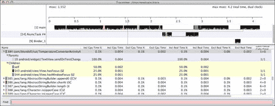
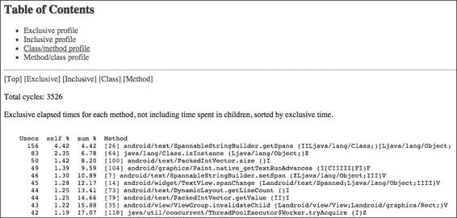
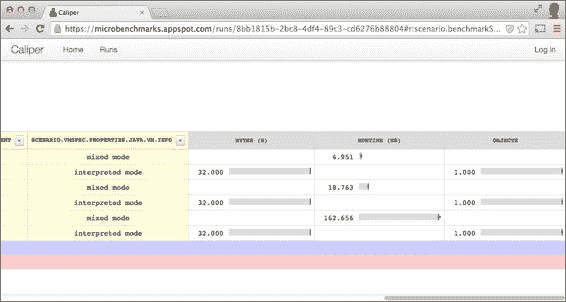

# 第八章：测试和性能分析

在前面的章节中，我们研究和开发了针对 Android 应用程序的测试。这些测试让我们能够根据规范评估合规性，并通过二进制的判断确定软件是否根据这些规则正确或错误地行为。如果所有测试用例通过，意味着我们的软件表现如预期。如果其中一个测试用例失败，则软件需要修复。

在许多其他情况下，主要在我们验证软件符合所有这些规范后，我们希望向前迈进，了解这些标准是如何满足的。同时，我们还想了解系统在不同情况下的表现，以分析其他属性，如可用性、速度、响应时间和可靠性。

根据 Android 开发者指南（[`developer.android.com/`](http://developer.android.com/)），在设计应用程序时以下是最佳实践：

+   性能设计

+   响应性设计

+   无缝设计

遵循这些最佳实践并从一开始的设计中考虑性能和响应性至关重要。由于我们的应用程序将在计算能力有限的 Android 设备上运行，因此在构建应用程序（至少是部分构建）后确定优化目标，并应用性能测试（我们将在后面讨论）可以为我们带来更大的收益。

多年前唐纳德·克努特普及了这一观点：

> *"过早优化是万恶之源"。*

基于猜测、直觉甚至迷信的优化，往往会在短期内影响设计，并在长期内影响可读性和可维护性。相反，*微优化*基于识别需要优化的瓶颈或热点，应用更改，然后再次进行基准测试以评估优化的改进。因此，我们在这里关注的是测量现有性能和优化替代方案。

本章将介绍一系列与基准测试和性能分析相关的概念，如下：

+   传统的日志语句方法

+   创建 Android 性能测试

+   使用性能分析工具

+   使用 Caliper 进行微基准测试

# 旧日志方法

有时，这对于现实生活场景来说过于简单，但我不想说它在某些情况下可能没有帮助，主要是因为其实施只需要几分钟，你只需要`logcat`文本输出就可以分析案例。在希望自动化流程或应用持续集成的场景中，这很方便，如前几章所述。

这种方法包括对方法（或其一部分）进行计时，在它前后各进行一次时间测量，并在最后记录差值：

```kt
private static final boolean BENCHMARK_TEMPERATURE_CONVERSION = true;

@Override
public void onTextChanged(CharSequence input, int start, int before, int count) {
if (!destinationEditNumber.hasWindowFocus() 
  || destinationEditNumber.hasFocus() || input == null) {
     return;
}

String str = input.toString();
if ("".equals(str)) {
    destinationEditNumber.setText("");
    return;
}

long t0;
if (BENCHMARK_TEMPERATURE_CONVERSION) {
 t0 = System.currentTimeMillis();
}

try {
    double temp = Double.parseDouble(str);
    double result = (option == Option.C2F)
         ? TemperatureConverter.celsiusToFahrenheit(temp)
         : TemperatureConverter.fahrenheitToCelsius(temp);
    String resultString = String.format("%.2f", result);
    destinationEditNumber.setNumber(result);
    destinationEditNumber.setSelection(resultString.length());
} catch (NumberFormatException ignore) {
    // WARNING this is generated whilst numbers are being entered,
    // for example just a '-' 
    // so we don't want to show the error just yet
} catch (Exception e) {
    sourceEditNumber.setError("ERROR: " + e.getLocalizedMessage());
}

if (BENCHMARK_TEMPERATURE_CONVERSION) {
 long t = System.currentTimeMillis() - t0;
 Log.v(TAG, "TemperatureConversion took " + t 
 + " ms to complete.");
 }
}
```

这非常直观。我们记录时间差。为此，我们使用`Log.v()`方法，并在运行应用程序时通过 logcat 查看输出。你可以通过设置你在外面定义的`BENCHMARK_TEMPERATURE_CONVERSION`常量为`true`或`false`来控制此基准测试的执行。

当我们设置`BENCHMARK_TEMPERATURE_CONVERSION`常量为`true`启动活动时，在 logcat 中，每次转换发生时，我们都会收到这样的消息：

```kt
TemperatureConversion took 5 ms to complete.
TemperatureConversion took 1 ms to complete.
TemperatureConversion took 5 ms to complete.

```

# 定时记录器

现在，比这更好的是`android.util.TimingLogger`安卓类。`TimingLogger`对象可以帮助你计时方法调用，而无需自己维护这些时间变量。它也比`System.currentTimeMillis()`有更高的准确度：

```kt
private static final String TAG = "TemperatureTag";
@Override
public void onTextChanged(CharSequence input, int start, int before, int count) {
if (!destinationEditNumber.hasWindowFocus() 
|| destinationEditNumber.hasFocus() || input == null) {
           return;
        }

       String str = input.toString();
       if ("".equals(str)) {
         destinationEditNumber.setText("");
             return;
        }

 TimingLogger timings = new TimingLogger(TAG, "onTextChanged");
 timings.addSplit("starting conversion");

   try {
         double temp = Double.parseDouble(str);
  double result = (option == Option.C2F)
      ? TemperatureConverter.celsiusToFahrenheit(temp)
      : TemperatureConverter.fahrenheitToCelsius(temp);
  String resultString = String.format("%.2f", result);
         destinationEditNumber.setNumber(result);
         destinationEditNumber.setSelection(resultString.length());
} catch (NumberFormatException ignore) {
// WARNING this is generated whilst numbers are being entered,
       // for example just a '-' 
// so we don't want to show the error just yet
} catch (Exception e) {
sourceEditNumber.setError("ERROR: " + e.getLocalizedMessage());
}
timings.addSplit("finish conversion");
 timings.dumpToLog();
}
```

如果你现在启动应用程序，你会注意到 logcat 中没有输出。这是因为`TimingLogger`需要你显式打开你定义的*标签*的日志记录。否则，方法调用将什么都不做。从终端运行以下命令：

```kt
adb shell setprop log.tag.TemperatureTag VERBOSE

```

### 提示

您可以使用`getprop`命令检查您的日志标签设置在什么级别：

`adb shell getprop log.tag.TemperatureTag`

你可以使用这个命令列出设备中的所有其他属性：

`adb shell getprop`

现在，当我们启动应用程序时，每次转换完成，我们都会收到这样的消息：

```kt
onTextChanged: begin
onTextChanged:      0 ms, starting conversion
onTextChanged:      2 ms, finish conversion
onTextChanged: end, 2 ms

```

你应该考虑的是，这些启用基准测试的常量不应该在生产版本中启用，就像使用其他常见常量，如`DEBUG`或`LOGD`一样。为了避免错误，你应该在用于自动化构建的构建过程中集成这些常量值的验证，例如 Gradle。此外，我个人会在构建发布到生产之前，删除所有基准测试或验证日志——不是注释掉，而是删除。记住，你总是可以在你的版本控制系统、历史记录或分支中找到它。

这样记录代码执行速度很简单，但对于更复杂的性能问题，你可能想要使用更详细（尽管更复杂）的技术。

# 安卓 SDK 的性能测试

如果之前添加日志声明的方法不适合你，还有其他方法可以从我们的应用程序获取性能测试结果。这种方法被称为分析。

当运行检测代码（就像我们的安卓检测测试用例）时，没有标准的方法从安卓应用程序获取性能测试结果，因为安卓测试使用的类在安卓 SDK 中是隐藏的，仅对系统应用程序可用，即作为主构建或系统映像的一部分构建的应用程序。这个策略对我们不可用，因此我们不会朝这个方向深入挖掘。相反，我们将关注其他可用的选择。

## 启动性能测试

这些测试基于我们刚才讨论的方法，Android 使用它们来测试系统应用程序。这个想法是扩展`android.app.Instrumentation`以提供性能快照，自动创建一个框架，我们甚至可以扩展它以满足其他需求。让我们通过一个简单的例子来更好地理解这意味着什么。

### 创建 LaunchPerformanceBase 检测

我们的第一步是扩展`Instrumentation`以提供我们需要的功能。我们使用了一个名为`com.blundell.tut.launchperf`的新包来组织我们的测试：

```kt
public class LaunchPerformanceBase extends Instrumentation {

    private static final String TAG = "LaunchPerformanceBase";

    protected Bundle results;
    protected Intent intent;

    public LaunchPerformanceBase() {
        this.results = new Bundle();
        this.intent = new Intent(Intent.ACTION_MAIN);
        this.intent.setFlags(Intent.FLAG_ACTIVITY_NEW_TASK);
        setAutomaticPerformanceSnapshots();
    }

    /**
     * Launches intent {@link #intent}, 
  * and waits for idle before returning.
     */
    protected void launchApp() {
        startActivitySync(intent);
        waitForIdleSync();
    }

    @Override
    public void finish(int resultCode, Bundle results) {
        Log.v(TAG, "Test results = " + results);
        super.finish(resultCode, results);
    }
}
```

我们在这里扩展了`Instrumentation`。构造函数初始化了此类中的两个字段：`results`和`intent`。最后，我们调用了`setAutomaticPerformanceSnapshots()`方法，这是创建此性能测试的关键。

`launchApp()`方法负责启动所需的 Activity 并在返回前等待。

`finish()`方法记录收到的结果，然后调用 Instrumentation 的`finish()`。

### 创建 TemperatureConverterActivityLaunchPerformance 类

这个类设置了 Intent 以调用`TemperatureConverterActivity`，并提供`LaunchPerformanceBase`类提供的架构以测试启动我们 Activity 的性能：

```kt
public class TemperatureConverterActivityLaunchPerformance 
extends LaunchPerformanceBase {

    @Override
    public void onCreate(Bundle arguments) {
      super.onCreate(arguments);
      String className = "com.blundell.tut.TemperatureConverterActivity";
      intent.setClassName(BuildConfig.APPLICATION_ID, className);
      start();
    }

    @Override
    public void onStart() {
      super.onStart();
      launchApp();
      finish(Activity.RESULT_OK, results);
    }
}
```

在这里，`onCreate()`按照 Android 生命周期调用`super.onCreate()`。然后设置了 Intent，指定了类名和包名。然后调用`Instrumentation`的一个方法`start()`。它创建并启动了一个新的线程以运行检测。这个新线程将调用`onStart()`，你可以在其中实现检测功能。

然后`onStart()`的实现遵循，调用`launchApp()`和`finish()`。

## 运行测试

```kt
app/build.gradle:
```

```kt
defaultConfig {
        // other code

        testInstrumentationRunner "com.blundell.tut.launchperf.TemperatureConverterActivityLaunchPerformance"
    }
```

一切准备就绪后，我们就可以开始运行测试了。

首先，安装包含这些更改的 APK。然后，正如我们在前面的章节中回顾的那样，我们有多种运行测试的选择。在这种情况下，我们使用命令行，因为这是获取所有细节的最简单方法。如果你只有一个设备连接，使用这个：

```kt
$ adb shell am instrument -w com.blundell.tut.test/com.blundell.tut.launchperf.TermeratureConverterActivityLaunchPerformance

```

### 注意

如果你曾经想知道你的设备上安装了哪些`Instrumentation`测试运行器，你可以使用这个命令：

`adb shell pm list instrumentation`

我们通过标准输出接收了此测试的结果集：

```kt
IINSTRUMENTATION_RESULT: other_pss=7866
INSTRUMENTATION_RESULT: global_alloc_count=4009
INSTRUMENTATION_RESULT: java_allocated=7271
INSTRUMENTATION_RESULT: execution_time=347
INSTRUMENTATION_RESULT: gc_invocation_count=0
INSTRUMENTATION_RESULT: native_pss=0
INSTRUMENTATION_RESULT: received_transactions=-1
INSTRUMENTATION_RESULT: other_shared_dirty=7128
INSTRUMENTATION_RESULT: native_shared_dirty=0
INSTRUMENTATION_RESULT: java_free=4845
INSTRUMENTATION_RESULT: java_size=12116
INSTRUMENTATION_RESULT: global_freed_size=155012
INSTRUMENTATION_RESULT: java_pss=1095
INSTRUMENTATION_RESULT: pre_sent_transactions=-1
INSTRUMENTATION_RESULT: java_private_dirty=884
INSTRUMENTATION_RESULT: pre_received_transactions=-1
INSTRUMENTATION_RESULT: other_private_dirty=6228
INSTRUMENTATION_RESULT: native_private_dirty=0
INSTRUMENTATION_RESULT: cpu_time=120
INSTRUMENTATION_RESULT: sent_transactions=-1
INSTRUMENTATION_RESULT: native_allocated=10430
INSTRUMENTATION_RESULT: java_shared_dirty=8360
INSTRUMENTATION_RESULT: global_freed_count=1949
INSTRUMENTATION_RESULT: native_free=14145
INSTRUMENTATION_RESULT: native_size=10430
INSTRUMENTATION_RESULT: global_alloc_size=372992
INSTRUMENTATION_CODE: -1
```

我们突出了我们感兴趣的两组值：`execution_time`和`cpu_time`。它们分别表示总执行时间和使用的 CPU 时间。

在模拟器上运行此测试可能会增加测量不准确的可能性，因为宿主计算机正在运行其他进程，这些进程也占用 CPU，而模拟器并不一定能代表真实硬件的性能。

不用说，在这种情况下以及任何其他随时间变化的情况中，你应该使用测量策略并多次运行测试以获得不同的统计值，如平均值或标准差。

# 使用 Traceview 和 dmtracedump 平台工具

Android SDK 在其众多工具中包含了两个专门用于分析性能问题和配置文件，并可能确定优化目标的工具。Android 还为我们提供了 **Dalvik 调试监控服务**（**DDMS**），它将所有这些工具集中在一个地方。DDMS 可以通过 Android Studio 导航到 **工具** | **Android** | **设备监控器** 打开，或者通过命令行使用 `monitor` 命令打开。你可以在 DDMS 中使用方便的 GUI 快捷方式使用 Traceview 和其他工具。然而，在这里，我们将使用命令行选项，以便你了解 GUI 背后的工具。

这些工具相较于其他替代品有一个优势：通常，对于简单的任务，无需修改源代码。然而，对于更复杂的情况，我们需要进行一些简单的添加，这一点我们很快就会看到。

如果你不需要精确控制追踪的开始和停止，可以通过命令行或 Android Studio 来操作。例如，要从命令行开始追踪，可以使用以下命令。如果连接了多个设备，记得使用 `-s` 添加序列号：

```kt
$ adb shell am start -n com.blundell.tut/.TemperatureConverterActivity
$ adb shell am profile com.blundell.tut start /mnt/sdcard/tc.trace

```

进行一些操作，比如在摄氏度字段中输入一个温度值以强制转换，然后运行以下命令：

```kt
$ adb shell am profile com.blundell.tut stop
$ adb pull /mnt/sdcard/tc.trace /tmp/tc.trace
7681 KB/s (1051585 bytes in 0.133s)

$ traceview /tmp/tc.trace

```

否则，如果你需要更精确地控制分析开始的时间，可以添加编程式的风格：

```kt
@Override
public void onTextChanged(CharSequence input, int start, int before, int count) {
  if (!destinationEditNumber.hasWindowFocus() 
           || destinationEditNumber.hasFocus() || input == null) {
     return;
}

String str = input.toString();
if ("".equals(str)) {
   destinationEditNumber.setText("");
   return;
}

if (BENCHMARK_TEMPERATURE_CONVERSION) {
Debug.startMethodTracing();
}

try {
double temp = Double.parseDouble(str);
   double result = (option == Option.C2F)
      ? TemperatureConverter.celsiusToFahrenheit(temp) 
      : TemperatureConverter.fahrenheitToCelsius(temp);
String resultString = String.format("%.2f", result);
   destinationEditNumber.setNumber(result);
   destinationEditNumber.setSelection(resultString.length());
} catch (NumberFormatException ignore) {
// WARNING this is generated whilst numbers are being entered,
   // for example just a '-' 
// so we don't want to show the error just yet
} catch (Exception e) {
   sourceEditNumber.setError("ERROR: " + e.getLocalizedMessage());
}

 if (BENCHMARK_TEMPERATURE_CONVERSION) {
 Debug.stopMethodTracing();
 }
}
```

这将创建一个追踪文件，默认名为 `dmtrace.trace`，在 SD 卡上通过调用 `Debug.startMethodTracing()` 来启动方法追踪，它使用默认的日志名称和缓冲区大小开始方法追踪。完成之后，我们调用 `Debug.stopMethodTracing()` 来停止分析。

### 注意

请记住，启用分析会大大减慢应用程序的执行速度，因此结果应该根据它们的相对权重来解释，而不是绝对值。

为了能够向 SD 卡写入数据，应用程序需要在清单文件中添加 `android.permission.WRITE_EXTERNAL_STORAGE` 权限。

使用 DDMS 进行 Traceview 时，数据流会通过 JDWP 连接直接发送到开发计算机，因此不需要该权限。

你需要运行应用程序以获取追踪文件。这个文件需要被拉取到开发计算机上，以便使用 `traceview` 进行进一步分析：

```kt
$ adb pull /mnt/sdcard/dmtrace.trace /tmp/dmtrace.trace
 8491 KB/s (120154 bytes in 0.013s)
$ traceview /tmp/dmtrace.trace

```

运行此命令后，Traceview 窗口会出现，显示所有收集到的信息，如截图所示：



窗口顶部显示了时间线面板以及每个方法的彩色区域。时间沿刻度向右增加。在彩色行下方还有小线条，显示了对选定方法的调用的范围。

我们对应用程序的一个小片段进行了分析，因此只有主线程在运行我们的进程。在其他线程在分析过程中运行的情况下，此信息也将显示。例如，这表明系统执行了一个 AsyncTask。

窗口底部显示了分析面板，执行了每个方法及其父子关系。我们将调用方法称为**父方法**，被调用的方法称为**子方法**。点击方法时，它会展开以显示其父方法和子方法。父方法显示为紫色背景，子方法显示为黄色背景。

此外，为方法选择的颜色（以循环方式完成）在方法名称之前显示。

最后，在底部有一个**查找：**字段，我们可以在其中输入筛选器以减少显示的信息量。例如，如果我们只想显示`com.blundell.tut`包中的方法，我们应该输入`com/blundell/tut`。

点击列标题将根据该列以升序或降序设置列表的顺序。

此表显示了可用的列及其描述：

| 列 | 描述 |
| --- | --- |
| 名称 | 方法的名称，包括其包名，正如我们刚才描述的那样，使用/（斜杠）作为分隔符。同时，显示参数和返回类型。 |
| 包含 CPU 时间百分比 | 方法使用的包含时间占总时间的百分比。这包括其所有子方法。 |
| 包含 CPU 时间 | 特定方法的包含时间，以毫秒为单位。这包括该方法及其所有子方法。 |
| 独占 CPU 时间百分比 | 方法使用的独占时间占总时间的百分比。这排除其所有子方法。 |
| 独占 CPU 时间 | 独占时间，以毫秒为单位。这是特定方法所花费的总时间。它不包括所有子方法。 |
| 包含实时百分比 | 进程执行时的包含时间加上等待时间占总时间的百分比（等待 I/O）。 |
| 包含实时 | 进程执行时的包含时间加上等待时间。 |
| 独占实时百分比 | 独占时间加上进程执行时的等待时间占总时间的百分比（等待 I/O）。 |
| 独占实时 | 独占时间加上进程执行时的等待时间。 |
| 调用+递归调用/总数 | 这一列显示了特定方法的调用次数和递归调用次数。与该方法收到的总调用次数进行比较。 |
| 每次调用 CPU 时间 | 每次调用的毫秒数时间。 |

关于 Traceview 的最后提醒是：目前 Traceview 禁止 JIT 编译器运行，这可能导致 Traceview 将时间误归到代码块，而 JIT 可能能够赢回这些时间。因此，在根据 Traceview 数据做出更改后，你一定要确保在未使用 Traceview 的情况下运行的实际代码能够更快。

# Dmtracedump

Dmtracedump 是 traceview 的替代品。它允许你使用已经收集的追踪文件，以替代格式生成追踪数据，包括 HTML，以及一个调用堆栈图。后者是树状结构，树的每个节点代表堆栈中的一个调用。

您可以使用我们从设备中提取的相同 traceview 文件，并使用以下新命令：

```kt
dmtracedump –t 40 –g dmtrace.png /tmp/dmtrace.trace 

```

要将你的追踪数据以 HTML 格式查看，请运行以下命令：

```kt
dmtracedump –h /tmp/dmtrace.trace > dmtrace.html

```

这个替代的 HTML 视图允许你以不同于原始 traceview GUI 的方式浏览追踪详情，并过滤每个调用的调用堆栈。



下表描述了您可以使用 dmtracedump 的额外命令行参数：

| 命令 | 描述 |
| --- | --- |
| `-d <trace-file-name>` | 与此追踪文件进行比较，并打印差异。 |
| `-g <graph-out-file-name.png>` | 在此文件中生成图表。从技术上来说，它可能不会生成 PNG 图片，但如果你将其命名为 `something.png`，你可以打开文件查看图表。 |
| `-h` | 开启 HTML 输出。这将在你的控制台以 HTML 代码形式打印，因此记得将此输出重定向到一个文件，例如 `example.html`。 |
| `-o` | 输出追踪文件，而不是进行性能分析。 |
| `-s <trace-file-name>` | 可排序 JavaScript 文件的 URL 路径基础（我不确定这个参数的用途！[`code.google.com/p/android/issues/detail?id=53468`](https://code.google.com/p/android/issues/detail?id=53468))。 |
| `-t <percent>` | 在图表中包含子节点的最小阈值（子节点的包含时间占父节点包含时间的百分比）。如果未使用此选项，则默认阈值为 20%。 |

# 微基准测试

基准测试是运行计算机程序或操作的行为，以便以产生定量结果的方式比较操作，通常是对它们进行一系列测试和试验。

基准测试可以组织为以下两大类：

+   宏基准测试

+   微基准测试

**宏基准测试**作为一种比较不同平台在特定领域（如处理器速度、每单位时间的浮点运算数量、图形和 3D 性能等）的手段而存在。它们通常用于硬件组件，但也可以用于测试软件特定领域，如编译器优化或算法。

与这些传统的宏观基准测试相对，**微基准测试**试图测量非常小段代码的性能，通常是一个单独的方法。获得的这些结果用于在选择提供相同功能的不同实现方案时决定优化路径。

这里的风险是，您可能测量到的微基准测试与您认为正在测量的内容不同。这是在使用 JIT 编译器的情况下主要需要考虑的问题，Android 从 2.2 Froyo 版本开始使用 JIT 编译器。JIT 编译器可能会以与应用程序中相同代码不同的方式编译和优化您的微基准测试。因此，在做出决定时要谨慎。

这与上一节引入的剖析策略不同，因为这种方法不考虑整个应用程序，而是一次只考虑一个方法或算法。

## Caliper 微基准测试

**Caliper**是谷歌的开源框架，用于编写、运行和查看微基准测试的结果。在[`code.google.com/p/caliper`](http://code.google.com/p/caliper)它的网站上有很多示例和教程。

`developer.android.com`上推荐了 Caliper，谷歌用它来衡量 Android 编程语言本身的性能。我们在这里探讨其基本用法，并在下一章介绍更多与 Android 相关的使用方法。

它的核心思想是基准测试方法，主要是为了了解它们的效率如何。我们可能会决定这是我们优化的目标，或许是在通过 Traceview 分析应用程序的剖析结果之后。

Caliper 基准测试使用注解来帮助您正确构建测试。基准测试的结构与 JUnit 测试类似。以前，Caliper 在约定上模仿 JUnit3；例如，测试必须以`test`为前缀，基准测试以`time`为前缀。在最新版本中，它类似于 JUnit4，JUnit 有`@Test`，Caliper 使用`@Benchmark`。每个基准测试都接受一个 int 参数，通常命名为`reps`，表示对方法内部代码进行基准测试的重复次数，该代码由一个循环包围，计算重复次数。

存在`setUp()`方法或`@Before`注解，用作`@BeforeExperiment`。

### 基准测试温度转换器

让我们从在项目中创建一个新的 Java 模块开始。是的，这次不是一个 Android 模块——只是 Java。

为了保持一致性，使用`com.blundell.tut`包作为主包。

在`/benchmark/build.gradle`文件中，将此模块的依赖项添加到您核心模块上。这样您就可以访问温度转换器代码：

```kt
compile project(':core').

```

同时，将`Caliper`库作为一个依赖项添加；这是托管在 Maven 中央的。然而，在撰写这本书的时候，谷歌发布的版本是 Caliper 1.0-beta-1，它不包括我们刚刚讨论的注解。我已经尝试在[`code.google.com/p/caliper/issues/detail?id=291`](https://code.google.com/p/caliper/issues/detail?id=291)上戳他们解决这个问题，如果你觉得有倾向，可以给那个问题加星。因此，与此同时，另一个开发者已经将 Caliper 发布到 Maven 中央的他的包下，以便我们可以使用注解。这是你需要导入的：

```kt
compile 'net.trajano.caliper:caliper:1.1.1'

```

创建一个包含我们基准测试的`TemperatureConverterBenchmark`类：

```kt
public class TemperatureConverterBenchmark {

  public static void main(String[] args) {
CaliperMain.main(CelsiusToFahrenheitBenchmark.class, args);
  }

  public static class CelsiusToFahrenheitBenchmark {

   private static final double MULTIPLIER = 10;
   @Param({"1", "10", "100"})
   int total;

   private List<Double> temperatures = new ArrayList<Double>();

   @BeforeExperiment
   public void setUp() {
      temperatures.clear();
      generateRandomTemperatures(total);
}

   private void generateRandomTemperatures(int total) {
       Random r = new Random(System.currentTimeMillis());
      for (int i = 0; i < total; i++) {
        double randomTemperature = MULTIPLIER * r.nextGaussian();
          temperatures.add(randomTemperature);
   }
   }

   @Benchmark
   public void timeCelsiusToFahrenheit(int reps) {
   for (int i = 0; i < reps; i++) {
         for (double t : temperatures) {
            TemperatureConverter.celsiusToFahrenheit(t);
         }
}
   }
   }
}
```

我们有一个类似于 JUnit 测试的`setUp()`方法，它使用`@BeforeExperiment`注解。它在运行基准测试之前执行。这个方法初始化一个用于转换基准测试的随机温度集合。这个集合的大小是一个字段，在这里用`@Param`注解，以便 Caliper 知道它的存在。当我们运行基准测试时，Caliper 将允许我们提供这个参数的值。但是，对于这个例子，我们给 param 一些默认值`"1", "10", "100"`。这意味着我们将至少有三个基准测试，分别是一个、然后是 10 个、最后是 100 个温度值。

我们使用高斯分布来生成伪随机温度，因为这可以是用户现实情况的一个很好的模型。

基准测试方法本身使用`@Benchmark`注解，以便 Caliper 可以识别并运行这个方法，在这个`timeCelsiusToFahrenheit()`实例中。在这个方法内部，我们根据传递给我们的方法参数进行循环，每次调用`TemperatureConverter.celsiusToFahrenheit()`转换方法，这是我们希望进行基准测试的方法。

### 运行 Caliper。

要运行 Caliper，请右键点击该类，从菜单中选择并运行`TemperatureConverterBenchmark.main()`。如果你想改变总参数的默认值`1, 10, 100`，请编辑运行配置，在程序参数字段中输入`–Dtotal=5,50,500`。

无论哪种方式，这都会运行基准测试，如果一切顺利，我们将看到结果：

```kt
 Experiment selection: 
 Instruments:   [allocation, runtime]
 User parameters:   {total=[1, 10, 100]}
 Virtual machines:  [default]
 Selection type:    Full cartesian product

This selection yields 6 experiments.
Starting trial 1 of 6: {instrument=allocation, benchmarkMethod=timeCelsiusToFahrenheit, vm=default, parameters={total=1}}… Complete!
 bytes(B): min=32.00, 1st qu.=32.00, median=32.00, mean=32.00, 3rd qu.=32.00, max=32.00
 objects: min=1.00, 1st qu.=1.00, median=1.00, mean=1.00, 3rd qu.=1.00, max=1.00
….
Starting trial 6 of 6: {instrument=runtime, benchmarkMethod=timeCelsiusToFahrenheit, vm=default, parameters={total=100}}… Complete!
 runtime(ns): min=158.09, 1st qu.=159.52, median=161.16, mean=162.42, 3rd qu.=163.06, max=175.13
Execution complete: 1.420m.
Collected 81 measurements from:
 2 instrument(s)
 2 virtual machine(s)
 3 benchmark(s)
Results have been uploaded. View them at: https://microbenchmarks.appspot.com/runs/33dcd3fc-fde7-4a37-87d9-aa595b6c9224

```

为了帮助可视化这些结果，有一个托管在 Google AppEngine 上的服务（[`microbenchmarks.appspot.com`](http://microbenchmarks.appspot.com)），它接受你的结果数据，并让你以更好的方式可视化它。你可以在前面的输出中看到这个 URL，结果已经发布在那里。

如果你希望访问一组基准测试套件，或者随着时间的推移收集你的结果，你可以登录这个服务器并获得一个 API 密钥，以帮助汇总你的结果。一旦你获得了这个密钥，它应该被放在你主目录下的`~/.caliper/config.properties`文件中，下次你运行基准测试时，结果将与你登录的账户关联。

在您粘贴获得到的 API 密钥后，`config.properties` 文件将看起来像下面这段代码：

```kt
# Caliper config file
# Run with --print-config to see all of the options being applied
# INSTRUMENT CONFIG
# instrument.micro.options.warmup=10s
# instrument.micro.options.timingInterval=500ms
# instrument.micro.options.reportedIntervals=7
# instrument.micro.options.maxRuntime=10s
# VM CONFIG
vm.args=-Xmx3g -Xms3g
# See the Caliper webapp to get a key so you can associate results with your account
results.upload.options.key=abc123-a123-123a-b123-a12312312
```

结果将如下所示：



除了运行速度，生成的网站还会显示用于运行测试的 JVM 配置。蓝色和红色部分可以展开以查看更多属性，帮助您检测实际运行环境是否在影响报告的不同结果。

# 总结

在本章中，我们通过基准测试和代码剖析，剖析了可用于测试应用程序性能指标的可用替代方案。

在撰写本书时，Android SDK 应提供的某些选项是不可用的，而且由于 SDK 中隐藏了一些代码，无法实现 Android `PerformanceTestCases`。

在这些替代方案中，我们发现可以使用简单的日志声明或更复杂的扩展了插桩的代码。

随后，我们分析了剖析的替代方案，并描述和示例了 `traceview` 和 `dmtracedump` 的使用。

最后，您了解了 Caliper，这是一个支持 Android 原生的微基准测试工具。然而，我们仅介绍了其最基本的使用方法，并将更具体的 Android 和 Dalvik VM 使用方法留待下一章介绍。

为了在下一章中能够量化您的测试工作，我们将对我们的代码执行覆盖报告。我们还将介绍替代测试方法，并讨论 Android 测试领域的新兴库和主题，希望这能给您提供一些探索和继续您测试旅程的起点。
