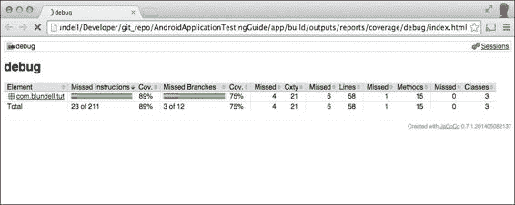
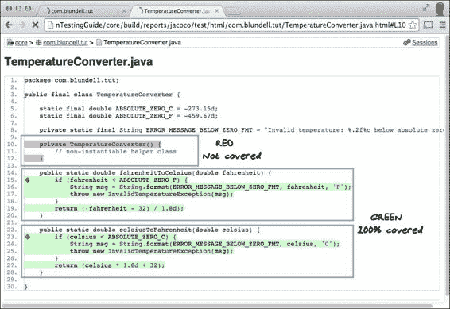

# 第九章：替代测试策略

到目前为止，我们已经分析了在项目中实施测试的最常见和最易获取的策略。然而，在我们的拼图中还缺少一些部分，我们希望在这最后一章中涵盖。随着 Android Studio 和 Gradle 的出现，Android 生态系统一直在向前发展。测试工具箱也总是在增加。在这一领域，我们将研究一些第三方库，它们可以帮助我们扩展测试框架；例如在 JVM 上为 Android 测试的 Robolectric，以及像 Fork 这样的潜在前沿和未来开发；想象一下为你的测试提供线程。

在本章中，我们将涵盖以下主题：

+   Jacoco 代码覆盖率

+   Robotium

+   在宿主 JVM 上进行测试

+   Robolectric

+   Fest

+   Spoon/Fork

# 代码覆盖率

或许 Android 的阿基里斯之踵就是文档的缺乏，以及为了找到完整版本的内容，你需要访问许多地方，或者更糟糕的是，在许多情况下，官方文档是错误的，或者没有更新以匹配当前版本。新 Gradle 构建系统的文档非常稀少，这正是大多数人尝试阅读代码覆盖率内容时的起点；那么，让我们点亮一些黑暗的角落。

代码覆盖率是软件测试中使用的一种度量，它描述了测试套件实际测试的源代码量，以及根据某些标准的程度。由于代码覆盖率直接检查代码，因此它是一种白盒测试形式。

### 注意

白盒测试（也称为透明盒测试、玻璃盒测试、结构测试），是一种测试软件的方法，它测试应用程序的内部结构或工作原理，而不是其功能（例如黑盒测试）。

在众多可用于提供 Java 代码覆盖率分析的工具体中，我们选择了 Jacoco，这是一个开源工具包，用于测量和报告 Java 代码覆盖率，并由 Android 项目提供支持。启动自己的项目使用它的基础设施已经就绪，因此，实现它所需的工作量最小化。Jacoco 取代了 EMMA 代码覆盖率工具，同时吸取了这一努力中学到的知识，并由同一团队构建。

Jacoco 通过独特的功能组合与其他工具区分开来；支持大规模企业软件开发，同时保持单个开发者的工作快速和迭代。这对于像 Android 这样规模的项目来说至关重要，Jacoco 在这方面表现得最为出色，为它提供了代码覆盖率。

## Jacoco 特性

Java、Android Gradle 插件和 Gradle 构建系统，都对 Jacoco 有原生支持。从本书发布时最新的 Jacoco 版本来看，引用其文档，最独特的功能集如下：

+   Jacoco 可以在离线（加载之前）或动态（使用检测应用程序类加载器）为覆盖率对类进行检测。

+   支持的覆盖率类型：类、方法、行、分支和指令。Jacoco 可以检测到单个源代码行是否仅被部分覆盖。

+   覆盖率统计数据在方法、类、包和“所有类”级别进行汇总。

+   输出报告类型：纯文本、HTML、XML。所有报告类型都支持根据用户控制的详细深度进行下钻。HTML 报告支持源代码链接。

+   输出报告可以突出显示低于用户提供的阈值的覆盖率项。

+   在不同的检测或测试运行中获取的覆盖率数据可以合并在一起。

+   Jacoco 不需要访问源代码，并且随着输入类中可用的调试信息减少，其性能会优雅地降级。

+   Jacoco 相对较快；添加检测的开销很小（5 到 20%），字节码检测器本身非常快（主要受文件 I/O 速度限制）。每个 Java 类的内存开销是几百字节。

# 温度转换器代码覆盖率

Android Gradle 插件开箱即支持 Jacoco 代码覆盖率。设置涉及选择您想要获取覆盖率报告的构建版本，并选择您的 Jacoco 版本。我们希望对 `debug` 版本进行检测，这样可以在不影响发布代码的情况下获得覆盖率。

```kt
android {
  …
  buildTypes { 
        debug {
            testCoverageEnabled true
        }
      }

    jacoco {
        version = '0.7.2.201409121644'
    }
}
```

实际上，这里并不需要添加 Jacoco 的版本信息，但是目前随 Android 附带的 Jacoco 版本落后于最新版本。可以在他们的 GitHub 页面 [`github.com/jacoco/jacoco`](https://github.com/jacoco/jacoco) 或 Maven 中央仓库找到最新版本的 Jacoco 覆盖率库。因此，建议明确指定版本。

## 生成代码覆盖率分析报告

您需要让模拟器运行，因为 Jacoco 会检测您的 Android 测试，这些测试在设备上运行，因此使用模拟器是合适的。测试完成后，设备上会生成一个代码覆盖率报告，然后将其拉取到您的本地机器上。如果您选择使用真实设备而不是模拟器，那么设备需要获得 root 权限。否则，报告拉取会因 `Permission Denied` 异常而失败。

从命令行运行代码覆盖率如下：

```kt
$./gradlew build createDebugCoverageReport

```

如果您有多个构建版本，也可以使用以下命令：

```kt
$./gradlew build connectedCheck

```

以下信息验证了我们的测试已经运行，并且覆盖率数据已被检索：

```kt
:app:connectedAndroidTest 
:app:createDebugCoverageReport 
:app:connectedCheck 

BUILD SUCCESSFUL

```

这将在 `/app/build/outputs/reports/coverage/debug/` 目录中创建报告文件。如果您使用多个构建版本，您的路径会略有不同。

在我们继续之前，如果您还没有意识到，我们不仅为 Android 应用模块生成了报告，我们的 Java `core` 模块中也有代码。我们也为这个模块创建一个报告。

由于 Gradle 支持 Jacoco，我们只需将 Jacoco 插件应用到我们的`code/build.gradle`文件中：

```kt
apply plugin: 'jacoco''jacoco''jacoco''jacoco'''
```

使用与我们 Android 模块相同的闭包，可以进行更多配置。可以在 Gradle Jacoco 插件网站找到可更改属性的详细信息，网址为[`gradle.org/docs/current/userguide/jacoco_plugin.html`](http://gradle.org/docs/current/userguide/jacoco_plugin.html)。

现在，如果你运行`./gradlew`命令任务，你应该会看到一个新生成的 Gradle 任务，`jacocoTestReport`。运行此任务为我们的核心模块生成代码覆盖率：

```kt
$./gradlew jacocoTestReport 

```

这已在`/core/build/reports/jacoco/test/`目录内创建了报告文件。

太棒了！现在我们既有`app`代码的覆盖率报告，也有`core`代码的覆盖率报告。

### 注意事项

可以将这两个报告合并为一个文件。你可能需要处理 XML 输出才能完成此操作。这留给读者作为一个任务，但可以在 Jacoco 网站和 Gradle 插件网站上寻找提示（这已经有人做过了）。

让我们打开`app`模块的`index.html`来显示覆盖率分析报告。



报告中呈现的信息包括覆盖率指标，这种方式允许以自上而下的方式深入数据，从所有类开始，一直到单个方法和源代码行（在 HTML 报告中）。

Jacoco 中代码覆盖率的基本组成部分是基本块；所有其他类型的覆盖率都是从基本块覆盖率派生出来的。行覆盖率主要用于链接到源代码。

此表描述了 Jacoco 覆盖率报告中的重要信息：

| 标签 | 描述 |
| --- | --- |
| 元素 | 类或包的名称。 |
| 未覆盖指令，覆盖率 | 一个视觉指示器，显示未通过测试覆盖的指令数量（红色显示），以及通过测试覆盖的指令百分比。例如：`if(x = 1 && y = 2)`将是两个指令但一行代码。 |
| 未覆盖分支，覆盖率 | 一个视觉指示器，显示未通过测试覆盖的分支数量（红色显示），以及覆盖的分支百分比。将 if/else 语句视为两个分支。一个方法中的分支数量是衡量其复杂度的一个好指标。 |
| 未覆盖，Cxty | 未覆盖的复杂路径（循环复杂度）数量，以及总的复杂度。一个复杂路径定义为一系列字节码指令，其中不包含任何跳转或跳转目标。在代码中添加一个分支（如一个`if`语句）将增加两个路径（真或假），因此复杂度会增加 1。然而，添加一个指令（如`x = 1;`）不会增加复杂度。 |
| 未覆盖，行数 | 任何测试未执行的行数，以及总行数。 |
| 未覆盖，方法 | 未覆盖的方法数量，以及总方法数量。这是一个由给定数量的基本路径组成的基本 Java 方法。 |
| 未覆盖，类 | 没有进行任何测试的类数量，以及总类数量。 |

我们可以从包深入到类，再到具体的方法，覆盖的行以绿色显示，未覆盖的行以红色显示，而部分覆盖的行以黄色显示。

这是对**core/** `TemperatureConverter`类的报告示例：



在这份报告中，我们可以看到类`TemperatureConverter`的测试覆盖率并不是 100%。当我们查看代码时，发现是构造函数从未被测试过。

你知道为什么吗？请思考一下。

是的，因为私有构造函数从未被调用。这是一个不应该被实例化的工具类。

如果你能够想象创建一个只有一个静态方法的类，你通常不会创建私有构造函数；它会保留为不可见的默认公共构造函数。在这种情况下，我相当勤勉地编写了这个私有构造函数，因为当时我是一个好童子军（现在仍然是！）。

我们可以看到，这种分析不仅帮助我们测试代码和查找潜在的 bug，还可以改进设计。

一旦我们认为这个私有构造函数是一段不需要运行测试的合理代码，现在我们可以看到，尽管类还没有达到 100%的覆盖率，因此不是绿色的，但我们确信这个构造函数不会被其他任何类调用。

我认为这里的一个非常重要的教训是；*100%的代码覆盖率不应该是你的目标*。理解你的领域和应用程序的架构，可以让你对代码覆盖率的估计更加可达和现实。

+   让你有信心改变代码而不会产生副作用。

+   让你相信，你被要求交付的产品，是你已经创建的产品。

## 覆盖异常情况。

继续检查覆盖率报告，我们会发现另一个未被当前测试执行的代码块。这个问题出现在`app/TemperatureConverterActivity`中的以下 try-catch 块的最后一个 catch 中：

```kt
try {
   double temp = Double.parseDouble(str);
   double result = (option == Option.C2F)
? TemperatureConverter.celsiusToFahrenheit(temp)
: TemperatureConverter.fahrenheitToCelsius(temp);
   String resultString = String.format("%.2f",",("%.("%."","," result);
   destinationEditNumber.setNumber(result);
   destinationEditNumber.setSelection(resultString.length());
} catch (NumberFormatException ignore) {
// WARNING this is generated whilst numbers are being entered,
   // for example just a -''''''
   // so we don'tdon'tdon'tdon't' want to show the error just yet
} catch (Exception e) {
sourceEditNumber.setError("ERROR: " + e.getLocalizedMessage());
}
```

首先，我们为什么要捕获通用的`Exception`？让我们将其更具体地针对我们期望处理的错误。这样我们就不会处理那些我们不期望的异常，而且如果有人阅读代码，他们会明确知道我们在这里试图做什么。

现在我们知道了导致我们测试覆盖率不全的代码，我们知道要编写哪些测试来抛出这个异常，并更新我们的测试套件和 Jacoco 报告。

```kt
} catch (InvalidTemperatureException e) {
sourceEditNumber.setError("ERROR: " + e.getLocalizedMessage());
}
```

我们应该提供一个测试，或者更好的是，对于每个温度单位都有一对测试，给定一个无效温度，验证错误是否显示。以下是 `TemperatureConverterActivityTests` 中的针对摄氏度情况的测试，你可以轻松地将其转换为提供华氏度情况：

```kt
public void testInvalidTemperatureInCelsius() throws Throwable {
        runTestOnUiThread(new Runnable() {
            @Override
            public void run() {
                celsiusInput.requestFocus();
            }
        });
        getInstrumentation().waitForIdleSync();

        // invalid temp less than ABSOLUTE_ZERO_C
        sendKeys("MINUS 3 8 0");");");");"

        String msg = "Expected celsius input to contain an error.";.";.";.";"
        assertNotNull(msg, celsiusInput.getError());
}
```

我们请求对测试字段进行焦点定位。像之前一样，我们应该通过在 UI 线程上使用 Runnable 来实现这一点，否则我们将收到异常。

然后设置无效温度并获取错误信息以验证它不为空。再次运行端到端流程，我们可以证实现在该路径已覆盖，实现了我们预期的完全覆盖。

这是你应该遵循的迭代过程，尽可能将代码改为绿色。如前所述，只要代码行不是绿色的，只要你考虑过选项并且仍然自信在未测试的路径中改变其他代码，那么这是可以的。

# 介绍 Robotium

在众多新兴的机器人生态中，Robotium ([`robotium.org`](http://robotium.org)) 是一个旨在简化测试编写的测试框架，它要求对被测应用有最少的了解。Robotium 主要定位于为 Android 应用编写强大且健壮的自动黑盒测试用例。它可以覆盖功能测试、系统测试和验收测试场景，甚至可以自动跨越同一应用中的多个 Android 活动。Robotium 也可以用来测试我们没有源代码的应用，甚至是预装的应用。

让我们开始使用 Robotium 为 `TemperatureConverter` 创建一些新的测试。为了使我们的测试更有条理，我们在 `TemperatureConverter` 项目的 `androidTest` 目录下创建了一个名为 `com.blundell.tut.robotium` 的新包。我们最初将测试 `TemperatureConverterActivity`，将其命名为 `TemperatureConverterActivityTests` 是合理的，尽管我们在另一个包中已经有了一个同名且也扩展了 `ActivityInstrumentationTestCase2` 的类。毕竟，这个类也将包含对此同一 Activity 的测试。

## 添加 Robotium

让我们在项目中添加 Robotium，我们只会在测试用例中使用它，所以它应该放在 `testcase` 类路径上。在撰写本文时，Robotium 的最新版本是 5.2.1。在 `app/build.gradle` 中，我们添加以下内容：

```kt
dependencies {

    ...

    androidTestCompile('com.jayway.android.robotium:robotium-solo:5.2.1')
}
```

## 创建测试用例

从前面的章节中我们知道，如果我们正在为需要连接到系统基础设施的 Activity 创建测试用例，我们应该基于 `ActivityInstrumentationTestCase2`，这也是我们将要做的。

### 测试 Fahrenheit 到 Celsius 转换的 testFahrenheitToCelsiusConversion()

大多数测试用例的结构与其他基于 Instrumentation 的测试类似。主要区别在于我们需要在测试的 `setUp()` 中实例化 Robotium 的 Solo，并在 `tearDown()` 中清理 Robotium：

```kt
public class TemperatureConverterActivityTests extends 
ActivityInstrumentationTestCase2<TemperatureConverterActivity> {

    private TemperatureConverterActivity activity;
    private Solo solo;

    public TemperatureConverterActivityTests() {
        super(TemperatureConverterActivity.class);
    }

    @Override
    protected void setUp() throws Exception {
        super.setUp();
        activity = getActivity();
        solo = new Solo(getInstrumentation(), activity);
    }

    @Override
    protected void tearDown() throws Exception {
        solo.finishOpenedActivities();
        super.tearDown();
    }
}
```

要实例化 Solo，我们必须传递对 `Instrumentation` 类和被测 Activity 的引用。

另一方面，为了清理 Solo，我们应该调用 `finishOpenedActivities()` 方法。这将结束 Solo 并完成我们的 Activity，然后我们调用 `super.tearDown()`。

Solo 提供了多种方法来驱动 UI 测试和一些断言。让我们从重新实现之前使用传统方法实现的 `testFahrenheitToCelsiusConversion()` 测试方法开始，但这次使用 Solo 的设施：

```kt
public void testFahrenheitToCelsiusConversion() {
solo.clearEditText(CELSIUS_INPUT);
   solo.clearEditText(FAHRENHEIT_INPUT);
   solo.clickOnEditText(FAHRENHEIT_INPUT);
   solo.enterText(FAHRENHEIT_INPUT, "32.5");
   solo.clickOnEditText(CELSIUS_INPUT);
   double f = 32.5;
   double expectedC = TemperatureConverter.fahrenheitToCelsius(f);
   double actualC = 
((EditNumber) solo.getEditText(CELSIUS_INPUT)).getNumber();
   double delta = Math.abs(expectedC - actualC);

   String msg = f + "F -> " + expectedC + "C "
     + """""but was " + actualC + "C (delta " + delta + ")";
   assertTrue(msg, delta < 0.005);
}
```

这非常相似，然而，你可能注意到的第一个不同之处是，在这种情况下，我们没有像之前在 `setUp()` 方法中那样获取 UI 元素的引用，使用 `findViewById()` 来定位视图。然而，我们正在使用 Solo 的最大优势之一，它使用某些标准为我们定位视图。在这种情况下，标准是 EditText 出现的顺序。`solo.clearEditText(int index)` 方法期望一个从 `0` 开始的屏幕位置的整数索引。因此，我们应该将这些常量添加到测试用例中，就像在我们的用户界面中，摄氏度字段在顶部，华氏度在下方：

```kt
  private static final int CELSIUS = 0;
  private static final int FAHRENHEIT = 1;
```

其他 Robotium 方法遵循相同的约定，我们在必要时提供这些常量。这个测试与 `com.blundell.tut.TemperatureConverterActivityTest` 中的测试非常相似，但你可能已经注意到有一个微妙的区别。Robotium 位于更高的层次，我们不必担心许多内部或实现细节；例如，在我们之前的测试中，我们调用 `celciusInput.requestFocus()` 来触发转换机制，而在这里，我们只需模拟用户的行为并发出 `solo.clickOnEditText(CELSIUS)`。

我们合理地简化了测试，但使用 Solo 的最大优势尚未到来。

### 在活动之间进行测试

由于 Robotium 位于更高层次，并且我们不处理实现细节，如果点击 Android 小部件时启动了新的 Activity，这并不是我们的问题；我们仅从 UI 的角度处理这种情况。

在这里，我将从理论上讨论一些功能。这尚未创建，留给用户作为进一步步骤，如果你愿意的话。

既然我们已经有一个工作的温度转换器，如果我们能让用户决定他们想要看到的小数位数，那就太好了。通过 Android 对话框让用户更改此选项听起来是一个明智的选择。

我们的目的是将小数位数偏好值更改为五位，并验证更改确实发生了。由于 Robotium 的高层次，这个测试在没有实际实现功能的情况下也是可读和可理解的。这是实现此功能的一种 BDD 方法的例子。

下面的代码片段展示了测试的细节：

```kt
public final void testClickOptionMenuSavesDecimalPreference() {
int decimalPlaces = 5;
   String numberRegEx = "^[0-9]+$";

   solo.sendKey(Solo.MENU);
   solo.clickOnText("Preferences");
   solo.clickOnText("Decimal places");
   assertTrue(solo.searchText(numberRegEx));

   solo.clearEditText(DECIMAL_PLACES);
   assertFalse(solo.searchText(numberRegEx));

   solo.enterText(DECIMAL_PLACES, Integer.toString(decimalPlaces));
solo.clickOnButton("OK");
   solo.goBack();

   solo.sendKey(Solo.MENU);
   solo.clickOnText("Preferences");
   solo.clickOnText("Decimal places");
   assertTrue(solo.searchText(numberRegEx));

   int editTextDecimalPlaces = 
Integer.parseInt(solo.getEditText(DECIMAL_PLACES)
.getText().toString());
assertEquals(decimalPlaces, editTextDecimalPlaces);
}
```

关于共享首选项和选项菜单如何实现，这里没有详细的介绍。我们只测试它的功能性。我们从按下**菜单**键并点击**首选项**开始。

哇，我们刚刚指定了菜单项标题，就完成了！

新的活动已经启动，但我们不必担心那个实现细节。我们继续点击 **小数位数**。

我们验证是否出现了一些包含数字的字段，即此首选项的前一个值。还记得我说的正则表达式吗？它们总会在某种程度上派上用场，来匹配任何十进制整数（任意数字后跟零个或多个数字）。然后，我们清除字段并验证它确实被清除了。

我们输入希望用作首选项的数字字符串，在这个例子中是 5。点击**确定**按钮，首选项即被保存。

最后，我们需要验证它实际上是否已经发生。使用相同的程序来获取菜单和字段。最后，我们验证实际的数字是否已经存在。

你可能会好奇 `DECIMAL_PLACES` 来自哪里。我们之前为屏幕上的字段定义了 `CELSIUS` 和 `FAHRENHEIT` 索引常量，这也是同样的情况，因为这将是我们类中应该定义的第三个 EditText。

```kt
  private static final int DECIMAL_PLACES = 2;
```

测试可以根据你的喜好从 IDE 或命令行运行。

# 在宿主的 JVM 上进行测试

我们将这个主题留到了本章的末尾，因为这看起来像是 Android 平台的*圣杯*。

Android 基于一个名为 **Dalvik** 的虚拟机，以冰岛的一个村庄命名，该虚拟机针对的是资源有限的移动设备，如内存和处理速度有限。因此，它代表了移动设备，但与我们的内存丰富、速度快的宿主计算机环境肯定大不相同，后者通常拥有充足的内存和处理速度来享受。

通常，我们会在模拟器或设备上运行我们的应用程序和测试。这些目标有一个更慢的真实或模拟 CPU。因此，运行我们的测试是一个耗时的活动，特别是当我们的项目开始增长时。应用测试驱动开发技术迫使我们运行数百个测试来验证我们引入的每一项更改。

### 注意

值得注意的是，这项技术只能在开发过程中作为权宜之计来提高速度，绝不能替代在真实平台上的最终测试，因为 Dalvik 和 JavaSE 运行时之间的不兼容可能会影响测试的准确性。

我们已经完成了核心模块创建的一半工作。现在我们处于 Java 世界，可以在 JVM 上自由运行我们的测试（很快就可以在附近的 Android 上使用 JUnit4）。`app` Android 模块对核心 Java 模块有一个单向依赖。这使得我们可以摆脱 Android 测试的束缚，在 `core` 模块中运行测试时不受其拖累。

后来，我们应该找出一种方法，允许我们拦截在模拟器或设备上标准编译-dexing-运行的序列，并能够直接在我们的主机电脑上运行安卓。

## 比较性能提升。

提醒一下，与安卓仪器测试相比，运行这些仅 Java 的测试所获得的速度提升。

区别很明显。没有模拟器的启动，或者任何设备通信，因此速度的提升是重要的。通过分析证据，我们可以找出这些差异。

在我的开发电脑上运行所有测试需要 0.005 秒；有些测试耗时如此之少，以至于它们甚至没有被计算在内，显示为 0.000 秒。

如果我将这些测试移动到我们的应用模块，并在模拟器上运行相同的测试，这将使巨大的差异变得明显。这些相同的测试运行了 0.443 秒，几乎慢了 100 倍，如果你考虑到每天要运行数百次测试，这是一个巨大的差异。

还值得注意的是，除了速度提升之外，还有其他优势，包括多年来的 Java 工具、库和插件创建，包括多个模拟框架和代码分析工具。

## 将安卓纳入考虑范围

我们有意将安卓排除在考虑范围之外。让我们分析一下，如果在`core`中包含一个简单的安卓测试会发生什么。请记住，为了编译来自 SDK 的`android.jar`，安卓测试也应该被添加到模块的库中。

下面是我们得到的结果：

```kt
java.lang.RuntimeException: Stub!
 at android.content.Context.<init>(Context.java:4)
 at android.content.ContextWrapper.<init>(ContextWrapper.java:5)
 at android.app.Application.<init>(Application.java:6)

```

### 注意

将`android.jar`添加到 core 的类路径稍微有些不协调且冗长。这不是默认会做的事情。这是一个好事，因为它阻止我们在编写核心代码时意外使用安卓特定的类。

原因在于`android.jar`只提供了 API，而不是实现。所有方法都有相同的实现：

```kt
throw new RuntimeException("Stub!");

```

如果我们想要绕过这个限制，以在安卓操作系统之外测试某些类，我们应该创建一个模拟每个类的`android.jar`。然而，我们也会发现对于安卓类的子类，如`TemperatureConverterApplication`，存在问题。这将是一项艰巨的任务，并且需要大量的工作，所以我们应该寻找另一个解决方案。

# 引入 Robolectric

**Robolectric**（[`robolectric.org`](http://robolectric.org)）是一个单元测试框架，它拦截安卓类的加载并重写方法体。Robolectric 重新定义了安卓方法，使它们返回默认值，如`null`、`0`或`false`。如果可能，它会将方法调用转发给影子对象，模仿安卓行为。

提供了大量的阴影对象，但这远未完全覆盖，然而，它正在不断改进。这也应该让你将其视为一个不断发展的开源项目，你应当准备好为使其更好而贡献，但也应谨慎依赖它，因为你可能会发现你测试所需的功能尚未实现。这绝不是为了贬低它现有的前景。

## 安装 Robolectric

可以通过使用 Maven 中央仓库中的最新 Robolectric JAR 来安装 Robolectric。在撰写本文时，最新的可用版本是 2.4：

```kt
testCompile 'org.robolectric:robolectric:2.4'
```

通常，添加依赖项只需这一行代码，但是，对于 Robolectric 来说，需要一些小技巧才能使其与 Gradle 构建类型一起工作。

首先，Robolectric 测试需要在其自己的模块中运行。这并不是什么新鲜事。创建一个新的 Java 模块，我们称之为 `robolectric-tests`。包名保持不变，始终为 `com.blundell.tut`。现在，我们必须修改 `robolectric-tests/build.gradle`，以便我们可以用 Robolectric 替换 `android.jar`：

```kt
def androidModuleName = ":app";
def flavor = "debug"

evaluationDependsOn(androidModuleName)

apply plugin: 'java'

dependencies {
    def androidModule = project(androidModuleName)
    testCompile project(path: androidModuleName, 
configuration: "${flavor}Compile")

    def debugVariant = androidModule.android.applicationVariants
.find({ it.name == flavor })
    testCompile debugVariant.javaCompile.classpath
    testCompile debugVariant.javaCompile.outputs.files
    testCompile files(
androidModule.plugins.findPlugin("com.android.application")
.getBootClasspath())

    testCompile 'junit:junit:4.12'
    testCompile 'org.robolectric:robolectric:2.4'
}
```

这是一大块需要理解的配置，让我们将其分解成步骤。

首先，我们为我们的 Android 应用定义模块名称，然后命名我们将要测试的版本。

`EvaluationDependsOn` 类告诉 Gradle 在执行我们的测试之前确保我们的应用程序模块被评估，这避免了因执行顺序的怪癖而出现任何奇怪的错误。

接下来，我们按照 Java 项目的正常约定应用 java 插件。

依赖项闭包是我们将所有 Android 依赖项添加到我们的类路径中的地方。首先，我们添加模块的选定构建变体 `debug`，然后是类路径及其依赖项，同时确保我们有来自 Android 插件的系统依赖项。

最后，我们将 JUnit4 和 Robolectric 作为测试依赖项应用。

### 注意

请记住，如果你有多个产品版本和构建类型，那么这个配置需要将完整的构建变体添加到脚本中。修改这个构建脚本将会非常简单直接。

## 添加资源

当你运行测试时，Robolectric 尝试查找你的 `AndroidManifest.xml` 以便它能为你的应用程序找到资源，并了解你的目标 SDK 版本等其他属性。由于当前 Robolectric 版本和我们对单独模块的选择，Robolectric 无法找到你的资源或你的 Android 清单。即使没有这一可选步骤，你仍然可以编写测试并获得反馈，但当你访问使用资源的类时，可能会遇到一些奇怪的现象；例如，`R.string.hello_world,` 在你的控制台可能会看到这样的信息：

```kt
WARNING: No manifest file found at ./AndroidManifest.xml.Falling back to the Android OS resources only. To remove this warning, annotate your test class with @Config(manifest=Config.NONE).

```

通过使用`@Config`注解按其说明操作，或者创建一个自定义测试运行器指定清单位置，或者像我们在这里选择的做法一样，创建一个配置文件并将其添加到你的类路径中，可以解决这个问题。在`robolectric-tests`模块内，创建文件夹`/src/test/resources`，并创建一个文件`org.robolectric.Config.properties`。这将包含我们的 Android 清单位置；它还将包含我们的最小 SDK 版本，因为我们在清单中没有声明这一点。它将包含以下内容：

```kt
manifest=../app/src/main/AndroidManifest.xml
emulateSdk = 16
```

### 注意

Robolectric 尝试在`AndroidManifest.xml`中查找你的最小 SDK。但是，在使用 Gradle 构建系统时，你不在那里声明，而是在`app/build.gradle`中声明。

我们现在已经设置好并准备编写一些 Robolectric 测试！

## 编写一些测试

我们将通过复现之前编写的一些测试来熟悉 Robolectric。一个好的例子是重写`EditNumber`测试。让我们在新建的项目中创建一个新的`EditNumberTests`类，并从`TemperatureConverterTest`项目中的`EditNumberTests`类复制测试：

```kt
@RunWith(RobolectricTestRunner.class)
public class EditNumberTests {

  private static final double DELTA = 0.00001d;

  private EditNumber editNumber;
```

```kt
@RunWith annotation. Then we defined the editNumber field, to hold the reference to the EditNumber class:
```

```kt
    @Before
    public void setUp() throws Exception {
        editNumber = new EditNumber(Robolectric.application);
        editNumber.setFocusable(true);
    } 
```

```kt
comprises the usual setup() method. In the setUp() method, we created an EditNumber with an application context, and then we set it as focusable. The context is used to create the view, and Robolectric handles this for us:
```

```kt
    @Test
    public final void testClear() {
        String value = "123.45";";";";"
        editNumber.setText(value);

        editNumber.clear();

        assertEquals("",  editNumber.getText().toString());
    }
    @Test
    public final void testSetNumber() {
        editNumber.setNumber(123.45);

        assertEquals("123.45", editNumber.getText().toString());
    }

    @Test
    public final void testGetNumber() {
        editNumber.setNumber(123.45);

        assertEquals(123.45, editNumber.getNumber(), DELTA);
    }
```

```kt
EditNumber tests of our previous examples.
```

我们强调最重要的变化。第一个是指定测试运行器 JUnit 的注解`@RunWith`，这将委托测试处理。在这种情况下，我们需要使用`RobolectricTestRunner.class`作为运行器。然后我们使用 Robolectric 上下文创建一个`EditText`类，因为这是一个没有帮助就无法实例化的类。最后，在`testGetNumber`中指定了`DELTA`值，因为 JUnit 4 中的浮点数需要它。此外，我们添加了`@Test`注解以将方法标记为测试。

原始`EditNumberTests`中存在的其他测试方法无法实现，或者由于各种原因简单地失败。例如，正如我们之前提到的，Robolectric 类返回默认值，如`null`、`0`、`false`等，`Editable.Factory.getInstance()`也是如此，它返回 null 并导致测试失败；因为没有其他创建`Editable`对象的方法，我们陷入了僵局。

同样，`EditNumber`设置的`InputFilter`是非功能的。创建一个期望某些行为的测试是徒劳的。

这些缺点的替代方法是创建`Shadow`类，但这需要修改 Robolectric 源代码并创建`Robolectric.shadowOf()`方法。如果你有兴趣将这种方法应用于你的测试，可以遵循文档中描述的此过程。

识别出这些问题后，我们可以继续运行测试，它们将在宿主的 JVM 中运行，无需启动或与模拟器或设备通信。

# 谷歌对阴影的进军

由于某种原因，谷歌并不*喜欢* Robolectric，他们从未承认它有效，也从未说过它是解决问题的方案。如果他们忽视这个解决方案，那么意味着缓慢运行的测试问题不存在，对吧。他们似乎觉得 Robolectric 有损于 Android，因此在某种程度上公开地对其冷淡。通过忽略其存在来暗中排挤它，直到现在。

谷歌创建了一个与我们之前所说的完全一样的 `android.jar` 文件，其中包含了默认方法实现。这意味着在访问方法时不再出现 `stub!` 错误。此外，他们已经从所有类中移除了 `final` 修饰符，让模拟框架有了很大的发挥空间。不幸的是，在撰写本文时，这个功能尚未记录在案。不足为奇！我不想给出使用步骤，因为虽然未记录在案，但这些内容会迅速变化。然而，我要说的是，如果谷歌做对了这件事，那么对于之前描述的测试场景，Robolectric 就不再需要，我们可以使用标准的 Android 测试 SDK。同样的原则将适用，因此我认为如果你了解 Robolectric 的工作原理，这仍然是有价值的。你可以将这种理解应用到未来，而我不能。

# 引入 Fest

我们测试武器库中的另一个工具是更好的测试断言。你有没有注意到，有时失败的测试堆栈跟踪非常不友好和/或神秘地错误？它们没有提供关于实际失败的有用信息，你最终会感到困惑，不得不阅读整个源代码以弄清楚如何解决问题。

以这个断言为例：

```kt
org.junit.Assert.assertEquals(3, myList.size());
```

我们断言在执行某个任务后，对象集合的大小为三个，看看测试失败时的错误信息：

```kt
java.lang.AssertionError: 
Expected :3
Actual   :2
```

好吧，这有点道理，但有点抽象。我们的列表中缺少哪一项？我得重新运行测试才能找出答案，或者我可以添加一个自定义错误信息：

```kt
assertEquals("List not the correct size " + myList, 
3, myList.size());
```

给我这样的错误信息：

```kt
java.lang.AssertionError: List not the correct size [A, B] 
Expected :3
Actual   :2
```

这个错误信息好多了。它显示我的列表中缺少了 `C`。但是，回顾一下这个断言，它的可读性越来越差。有时，一眼看去，我可能甚至会觉得我在尝试断言初始字符串是否等于其他变量，参数的顺序根本没有帮助。如果我有一个不容易实现 `toString` 的对象呢？我需要编写更多自定义代码来打印一个友好的错误信息，可能还会重复很多样板错误信息。

现在立刻停止所有担忧！看看我们如何使用 Fest 进行同样的断言：

```kt
org.fest.assertions.api.assertThat(myList).hasSize(3);
```

现在，我们的错误信息看起来像这样：

```kt
java.lang.AssertionError: expected size:<3> but was:<2> in:<['A', 'B'']>
```

很棒，我们没有额外付出努力，就得到了一个错误信息，它向我们展示了列表中的内容以及大小是如何区分的。回顾一下这个断言，它的可读性更强了，而且使用流畅的接口编码也变得更容易。这提高了我们测试代码的可读性，加快了调试和测试修复的速度。

在进行这个更改之后，我意识到我们实际上可能想要测试列表的内容，但由于 JUnit 断言的负担，我们没有这么做。再次，Fest 来拯救：

```kt
assertThat(myList).contains("A", ""B", ""C");
output: 
  java.lang.AssertionError: expecting:
<['A',]>
 to contain:
<['A', 'B', 'C']>
 but could not find:
<['C']>
```

想想如果我们用 JUnit 断言来做这件事，你就会更加欣赏 Fest 的强大。

Fest 提供了多种断言风格，适用于不同的库；这些包括前面展示的 Java 风格，以及允许你对 Android 组件（如视图和片段）进行流畅式界面断言的 Android 风格。以下是 JUnit 断言可见性的示例，然后是 Fest：

```kt
assertEquals(View.VISIBLE, layout.getVisibility());

assertThat(layout).isVisible();
```

将这些库添加到你的项目中，只需再添加一个 Gradle 依赖项，最新版本可以在 Maven 中央仓库找到。以下是 Java 版 Fest 的示例，截至撰写本文时的最新版本：

```kt
testCompile 'org'.easytesting:fest-assert-core:2.0M10'
```

### 注意

注意，Android Fest 已经更名为 Assert-J，并根据你的测试需求拆分为多个依赖项。断言的工作方式将完全相同。更多信息以及作为依赖项添加的说明可以在 [`github.com/square/assertj-android`](https://github.com/square/assertj-android) 找到。

# 介绍 Spoon

设备碎片化一直是 Android 的话题，这是你应该考虑的问题。不同设备和外形尺寸的数量意味着你真的需要确信你的应用程序在所有上述设备上都能良好运行。Spoon 正是为了帮助解决这个问题；Spoon ([`square.github.io/spoon`](http://square.github.io/spoon)) 是一个开源项目，提供了一个测试运行器，允许在所有连接的设备上并行运行仪器测试。它还允许你在测试运行时截图。这不仅加快了你的测试和反馈周期，还可能让你直观地看到测试出错的地方。

你可以通过添加以下依赖关系将 Spoon 加入到你的项目中：

```kt
testCompile com.squareup.spoon:spoon-client:1.1.2
```

然后，你可以在测试中截图，这样在断言行为的同时，你也可以看到应用程序的状态：

```kt
Spoon.screenshot(activity, "max_celcius_to_fahrenheit");
```

如果你在断言之前立即截图，可以利用这些截图帮助你确定失败的原因。另一个很酷的功能是，Spoon 会将一个测试中的所有截图合成为一张动画 GIF，这样你可以观看事件的发生顺序。

然后，你可以从命令行运行 Spoon，使用以下命令：

```kt
$java -jar spoon-runner-1.1.2-jar-with-dependencies.jar \
 --apk androidApplicationTestGuide.apk \
--test-apk androidApplicationTestGuideTests.apk

```

### 注意

你可以在 `/build/` 文件夹中找到你的 APK 文件。如果你需要更多关于这种使用 APK 文件的方式以及从命令行测试的信息，请回顾 第七章，*行为驱动开发*。

# 介绍 Fork

另一个带有幽默感的库名称，但读者请继续看下去，这种相似性并非巧合。在告诉了你 Spoon 如何通过在所有连接的设备上并行运行所有仪器测试来加速你的测试之后，现在来了 Fork，它告诉你这种天真的调度（他们的话，非我的）对你和你的 CI 来说是个负担。Fork 能让你更快地运行测试！

Fork 通过引入一个名为**设备池**的概念来提高你的测试速度。简单来说，想象一下你有两个完全相同的设备，都是运行 Android 5.0 的两台索尼 Xperia Z1。Fork 将获取你的测试套件并将其一分为二，在每个设备上运行一半的测试。因此，它能为你节省大约 50%的测试运行速度（大致不包括热身/设置时间）。

这些设备池有不同的类型，例如 api 级别、最小宽度、平板设备或手动池，你可以在其中声明你想使用的设备序列号。关于设备池和 fork 任务的定制参数的更多信息可以在[`goo.gl/cIm6GQ`](http://goo.gl/cIm6GQ)找到。

通过向你的构建脚本中添加插件并应用它，Fork 可以与 Gradle 一起使用：

```kt
buildscript {
    dependencies {
        classpath 'com'.shazam.fork:fork-gradle-plugin:0.10.0'
    }
}

apply plugin: 'fork'
```

现在，你可以使用以下命令运行 fork 测试，而不是你正常的仪器测试：

```kt
./gradlew fork
```

### 注意

如果你的项目中有多个 flavor，你可以使用以下命令查看可用的 fork 任务：**./gradlew tasks | grep fork**。

Spoon 和 Fork 是强大的工具，现在结合你对仪器测试、单元测试、基准测试和代码分析的知识，你可以构建一个健壮、信息丰富且全面的测试套件，在编写 Android 应用程序时，这能给你信心和灵活性。

# 总结

这一章比之前的章节要深入一些，唯一目的是面对现实情况和最先进的 Android 测试技术。

我们首先通过 Jacoco 启用代码覆盖率，运行我们的测试，并获得详细的代码覆盖率分析报告。

然后我们使用这个报告来改进我们的测试套件。编写测试来覆盖我们之前没有意识到的未测试的代码。这使我们得到了更好的测试，有时也改进了被测试项目的设计。

我们引入了 Robotium，这是一个非常有用的工具，可以简化我们 Android 应用程序测试用例的创建，并且我们用它改进了一些测试。

然后我们分析了 Android 测试中一个热门话题；在开发主机 JVM 上进行测试，优化并显著减少运行测试所需的时间。当我们把测试驱动开发应用到我们的流程中时，这是非常可取的。在这个范围内，我们分析了 Robolectric，并创建了一些测试作为演示，让你开始掌握这些技术。

为了完善我们的知识，我们了解了 Fest 和一些餐具，它们可以帮助我们进行更有表现力的测试，改进反馈，并使整个测试套件更加强大。

我们已经到达了通过 Android 测试的可用的方法和工具的旅程的终点。你现在应该为将这些应用到您自己的项目中做好更充分的准备。一旦开始使用它们，效果就会立即显现。

最后，我希望您阅读这本书的乐趣与我写作它时一样多。

祝测试愉快！
