# 第一章：开始使用 Android Canvas

在本章中，我们将了解有关 Android Canvas 的一些信息，为什么需要它，以及它提供了什么。我们将创建一个简单的 Android 应用程序，在屏幕上显示一张图片。我们将在模拟器上测试该应用程序。然后，我们将讨论应用程序的每个部分以及读者在使用 Android Canvas 时需要了解的事项。在本章结束时，读者将学会使用 Canvas 提供的一种简单技术创建一个基本的 Android 应用程序，以显示图片，并获得一些额外的信息和处理应用程序中图形的良好约定。

# Android Canvas

Android Canvas 为开发者提供了创建和修改 2D 图像和形状的能力。此外，Canvas 可用于创建和渲染我们自己的 2D 对象，因为此类提供了各种绘图方法。Canvas 还可以用来创建一些基本动画，比如逐帧动画，或者创建某些`Drawable`对象，例如带有纹理和形状的按钮，如圆形、椭圆形、正方形、多边形和线条。Android 还提供了硬件加速，以提高 Canvas 绘制的性能。现在我们知道我们要开发什么，为什么需要了解图形，我们的图形需求是什么，以及我们将使用什么。我们也知道 Android Canvas 是什么以及它为我们提供了什么。简而言之，Android Canvas 是我们所有问题的答案，因为它为我们的图形提供了所有正确的元素，以及一些基本动画来完成工作。对于 3D 图形，Android 提供了对 OpenGL 的支持；但在本书的范围内，我们不涉及 3D 图形，因此不会讨论 OpenGL。不过，感兴趣的读者可以查看[`developer.android.com/guide/topics/graphics/opengl.html`](http://developer.android.com/guide/topics/graphics/opengl.html)的详细信息。

# 我们的第一款 Android Canvas 应用程序

本部分我们的目标是创建一个非常简单的应用程序，用以在屏幕上显示一张图片。不要害怕，现在开始开发 Canvas 似乎为时尚早——确实如此——但我们的第一个应用程序不涉及任何编码或复杂的内容。我们将逐步完成创建应用程序的不同步骤。我们会了解 SDK 版本和可用的 API，以及我们将使用哪些内容。你可能会对我们执行的应用程序中的某些部分或步骤不理解，但每执行一步，我们都会解释该步骤中发生的情况。至此我们仅仅是讨论，让我们开始真正的工作吧。我们将从打开 Eclipse 并开始一个新的 Android 应用程序项目开始。为此，在 Eclipse 中，我们将导航至**文件** | **新建** | **Android Application Project**。

下面的截图展示了 Eclipse 中新建应用程序的窗口：

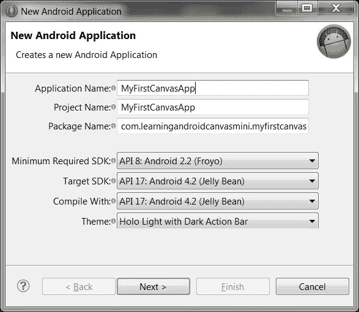

这是首先出现的屏幕。我们将应用命名为 `MyFirstCanvasApp`。

## 应用名称

**应用名称**将显示在**设置**中的**管理应用**列表里；如果我们把应用发布到**Play 商店**，同样的字符串也会在那里显示。因此，名称应当吸引人且有意义。

## 项目名称

**项目名称**仅由 Eclipse 使用，但它应该在 workspace 中是唯一的。它可以与应用名称相同。

## 包名称

**包名称**必须是应用的唯一标识符。它不会展示给用户，但应该在应用的整个生命周期中保持不变。包名称是用来识别同一应用的不同版本的依据。我们的包名称将是 `com.learningandroidcanvasmini.myfirstcanvasapp`。这种特定的语法不是定义包名称的硬性规定，但它是避免包名称冲突的好方法。例如，如果我们有两个应用具有完全相同的名称，如下：

+   `com.learningandroidcanvasmini.myfirstcanvasapp`

+   `com.learningandroidcanvasmini.myfirstcancasapp`

假设第一个应用只是一个简单的展示一些图片的应用，而第二个应用是一个带有自由手绘功能的简单绘图应用。如果我们想将它们发布到 Google Play 商店，将会发生包名称冲突，第二个应用将不允许发布，因为已经有一个完全相同名称的应用存在。有两种方法可以避免这种情况。第一，更改包名称，以避免包名称冲突，第二个应用被视为全新的应用。例如：

+   `com.learningcandroidcanvasmini.picdisplayapp`

+   `com.learningandroidcanvasmini.paintapp`

第二，我们可以保持包名称不变，但更改 `android:version` 代码和 `android:version` 名称。这样发布将会成功，给用户的感觉是第一个应用是核心应用（如 `myfirstcanvasapp` 1.0 版）而第二个应用是同一应用的更新版本（如 `myfirstcanvasapp` 2.0 版）。有关在 Google Play 商店发布应用的更多详情和更好理解，请参考链接 [`developer.android.com/distribute/googleplay/publish/preparing.html`](http://developer.android.com/distribute/googleplay/publish/preparing.html)。

## 最小可能的 SDK 版本

选择尽可能低的所需 SDK 意味着我们的应用程序能够在尽可能多的设备上运行，但局限性在于，如果我们选择一个非常低版本的 Android，将无法使用硬件加速，因为低版本的 Android 不支持硬件加速。如果我们不需要硬件加速，可以选择更低版本以覆盖更多设备，但如果我们使用的一些动画和图形可能需要硬件加速，就需要使用稍高版本的 Android。

## 目标 SDK

这是我们的应用程序能够工作的最高 API 级别，但应用程序通常是向前兼容的，即使所使用的 SDK 高于我们的目标 SDK，只要使用的库没有改变，应用程序也能工作。这是一个罕见的情况，但有时新版本中的一些库会发生变化，这会影响对不同类的方法和属性的调用，导致应用程序功能异常。这个属性通知系统我们已经针对目标 API 测试了应用程序，系统不应产生任何兼容性问题。此外，应用程序将向后兼容到最低所需 SDK。我们将选择最高的可用 SDK，因为我们不希望应用程序因缺少新功能（如缺少硬件加速）而显得过时。

## 主题

主题是最后一个选项。我们将保留此选项的默认选择，因为目前它并不重要。

之后，我们将点击**下一步**，随后会出现以下屏幕。这是**配置项目**的界面。

下面的截图展示了新应用程序的配置界面：

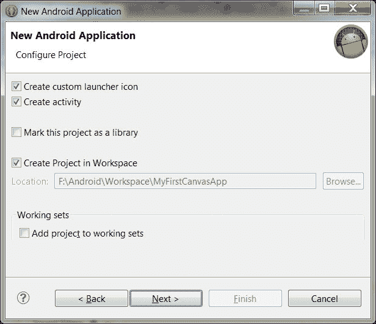

在这里，我们将检查是否需要自定义启动器图标。选择**创建活动**后，系统将自动为我们创建一个默认活动。同时配置创建项目的位置；通常是在我们的工作区。如果我们勾选了**创建自定义启动器图标**的复选框，点击**下一步**将带我们进入以下屏幕，即图标配置屏幕：

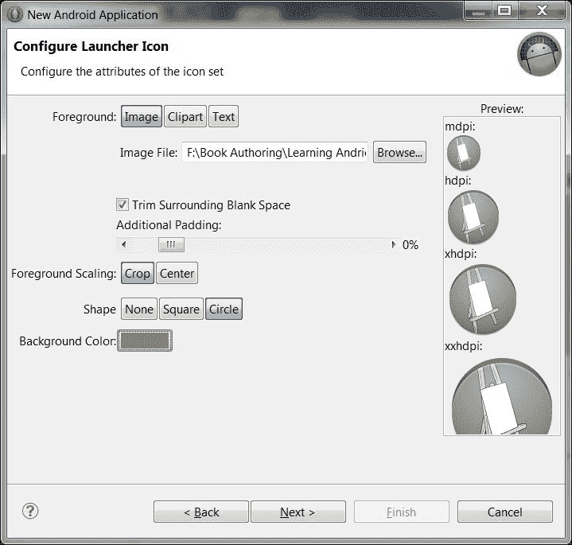

在这个界面上，我们将配置自定义启动器图标属性，比如它应该从哪里读取源图像的路径。我们将配置图标的前景、形状和背景颜色。点击**下一步**进入下一个屏幕。我们选择了一个从网上随机下载的 Canvas 图像作为我们的源图像。该图像为 PNG 格式。PNG 图像支持透明度，例如完全透明的图像或带有部分透明背景。选择**形状**为**圆形**，**背景颜色**为深灰色。其他选项是将形状设置为**方形**或**无**。关于图标更多详情，请参考链接：[`developer.android.com/design/style/iconography.html`](http://developer.android.com/design/style/iconography.html)。

表单右侧显示了不同大小的图像，上方分别写着**mdpi**、**hdpi**、**xhdpi**和**xxhdpi**；`dpi`是每英寸点数，`m`表示中等，`h`表示高。这些是我们图像的不同尺寸，用于不同的屏幕尺寸。安卓设备具有不同的屏幕尺寸和分辨率。如果我们希望我们的应用程序支持多种屏幕尺寸，从旧设备到新设备，我们应该收集一些关于它们的 dpis、屏幕尺寸、屏幕分辨率、屏幕密度等信息；由于我们在这里处理的是图形，我们应该了解它们。然而，我们将在本章的末尾讨论这个问题。

下面的截图显示了选择默认活动屏幕的过程：

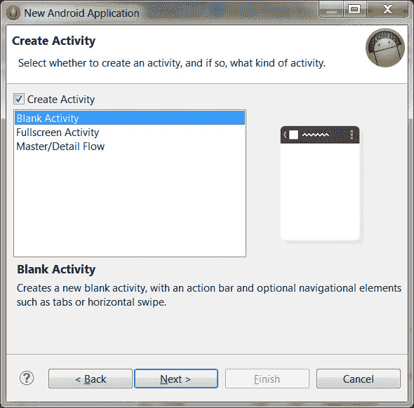

在这个表单上，向导为我们提供了创建应用程序的选项，可以选择**空白活动**、**全屏活动**或**主/细节流程**活动表单。我们将选择**空白活动**并点击**下一步**继续操作。现在，向导将带我们进入以下表单，即默认活动表单：

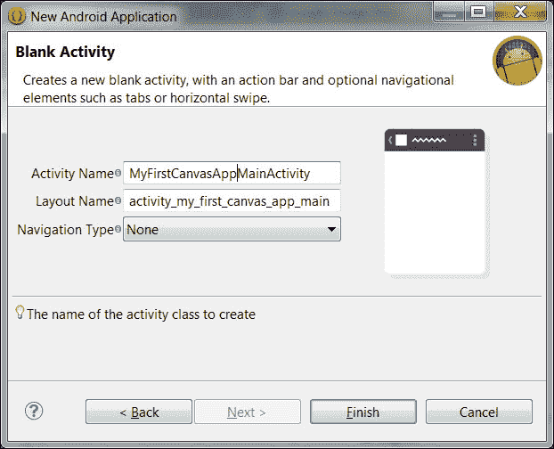

在此表单上，我们将把我们的活动命名为`MyFirstCanvasAppMainActivity`。**布局名称**将会自动为我们填充，而**导航类型**应选择为**无**，因为目前我们不希望应用程序中出现任何导航上的复杂性。

点击**完成**将关闭向导，我们将回到 Eclipse，屏幕显示如下截图所示，它显示我们的应用程序处于**设计**模式。以下截图显示了向导成功完成后，我们项目的第一次 Eclipse 视图：

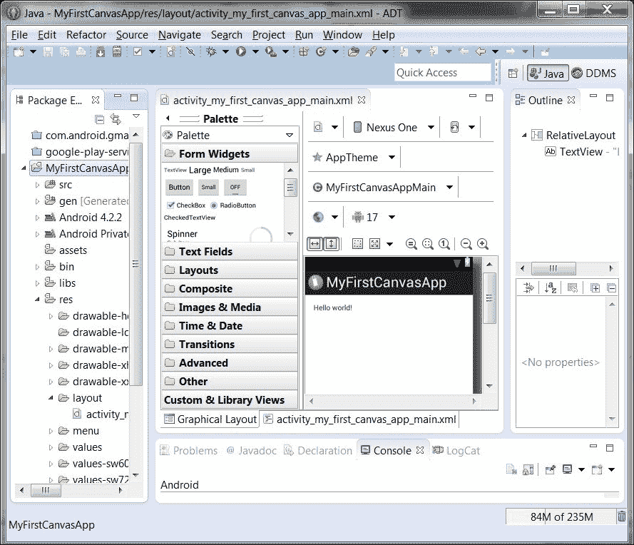

在这里，我们将在 AVD 管理器中创建一个**安卓虚拟设备**（**AVD**）以及我们的模拟器，配置目标 SDK 版本为 4.2.2 以测试我们的应用程序。为此，我们将在默认出现在左侧的**包资源管理器**面板中，对我们的项目右键点击。在出现的菜单中，我们将导航至**运行方式** | **运行配置**。在此窗口中，我们将在**安卓**标签下选择我们的项目。然后，我们将进入**目标**标签，选择我们之前创建的 AVD 来测试我们的应用程序，并点击**运行**。这将触发模拟器运行，我们的应用程序将显示在模拟器中，如下面的截图所示。

如果我们在模拟器上点击主键，然后点击菜单查看模拟器上安装的所有应用程序，我们会看到我们的自定义启动图标也出现在菜单中，如下面的截图所示。为了给我们的应用程序留下好印象，我们必须设计一个有吸引力且相关的图标。为此，可以使用 Photoshop 或其他图形设计工具。如果开发人员拥有实际设备并将其配置为在 Eclipse 中进行测试，则可以跳过此步骤。

下面的截图展示了第一个默认活动，显示**Hello world!**：

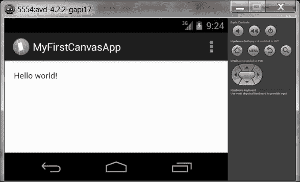

下面的截图展示了我们应用程序图标在从顶部数第四行：

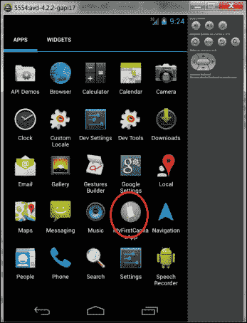

既然我们已经让第一个应用程序运行起来，我们将尝试了解 Eclipse 中项目的最重要部分。了解重要部分之后，我们将达到我们的目标；即在屏幕上显示一张图片。

# 开采我们的第一个应用程序

首先，在每一个 Android 应用程序中，有三个文件需要我们特别注意；如果不理解这三个文件，我们将无法开发 Android 应用。以下部分将讨论这些文件。

## 配置文件

每个 Android 应用程序中的主配置文件是`AndroidManifest.xml`。这是一个 XML 文件，可以在**Package Explorer**中的项目根目录看到。这是我们应用程序的主要配置文件，也是项目中最重要的文件之一。这个文件包含了应用程序包的信息，应用程序使用的最小和最大 SDK，应用程序中使用的活动以及应用程序运行或执行特定任务所需的权限。每当应用程序即将在 Android 设备上安装时，这个文件会向系统提供应用程序将需要的权限和资源以及其中使用的活动的所有详细信息。系统读取这个文件后，会知道应用程序的包名称，兼容的 SDK 是什么，应用程序包含哪些活动，以及应用程序运行或执行某些任务所需的权限。

## 布局文件

我们应用程序中的布局文件是`activity_my_first_canvas_app_main.xml`，位于`res`文件夹内的`layout`文件夹中。所以在**Package Explorer**中的完整路径是`res/layout/activity_my_first_canvas_app_main.xml`。这是一个 XML 文件，负责我们活动的布局以及应用程序中活动上出现的视图。其他活动可以使用相同的 XML 格式和相同的 XML 布局文件进行布局。

## 代码文件

我们应用程序中的主活动代码文件是`MyFirstCanvasAppMainActivity.java`。这是我们活动的编码文件，在这里编写所有的功能。这个文件位于项目中的包文件夹内，即在`src`文件夹中，所以在**Package Explorer**中的项目路径变为`src/com.learningandroidcanvasmini.myfirstcanvasapp/MyFirstCanvasAppMainActivity.java`。

下面的截图清晰地展示了这一点：

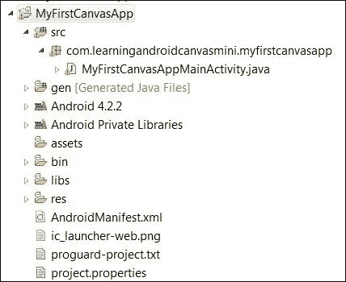

除了上述文件，我们还将讨论`res`文件夹。`res`文件夹包含以下`Drawable`文件夹：

+   `drawable-hdpi`

+   `drawable-ldpi`

+   `drawable-mdpi`

+   `drawable-xhdpi`

+   `drawable-xxhdpi`

下面的截图展示了我们`res`文件夹内的`drawable-xxhdpi`文件夹。这就是我们放置图标的地方。

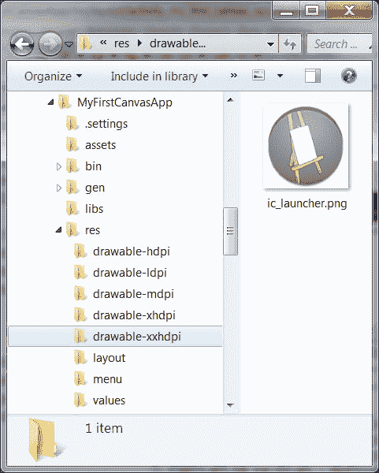

如果我们检查所有这些文件夹，会发现每个文件夹中都有一个名为`ic_launcher.png`的图像，实际上这是我们在创建应用时使用的 Canvas 图像。每个文件夹中的图像都是相同的，但大小不同。现在，假设我们想要在屏幕上显示原始的 Canvas 图像。我们将原始的 Canvas 图像复制到这些文件夹中的一个；假设我们将图像复制到`drawable-xhdpi`文件夹。在 Package Explorer 中刷新文件夹，然后转到显示**Hello world**字符串的活动**Design**视图。选择字符串并删除它。在 Palette 中，点击**Images & Media**展开它。在**Design**视图中将 ImageView 拖放到活动上。系统会弹出一个对话框，提示我们为拖放的活动选择 ImageView 的源图像。

下面的截图显示了提示我们在**Design**模式下拖放到活动上的 ImageView 选择源图像的对话框：

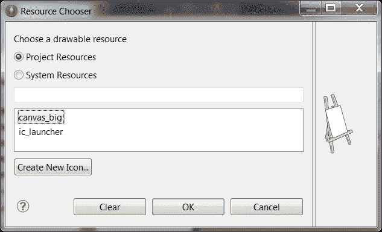

我们将选择 Canvas 图像并点击**确定**。我们的 Canvas 图像将显示在屏幕上。

以下屏幕显示了在**Design**模式下屏幕上显示的图像：

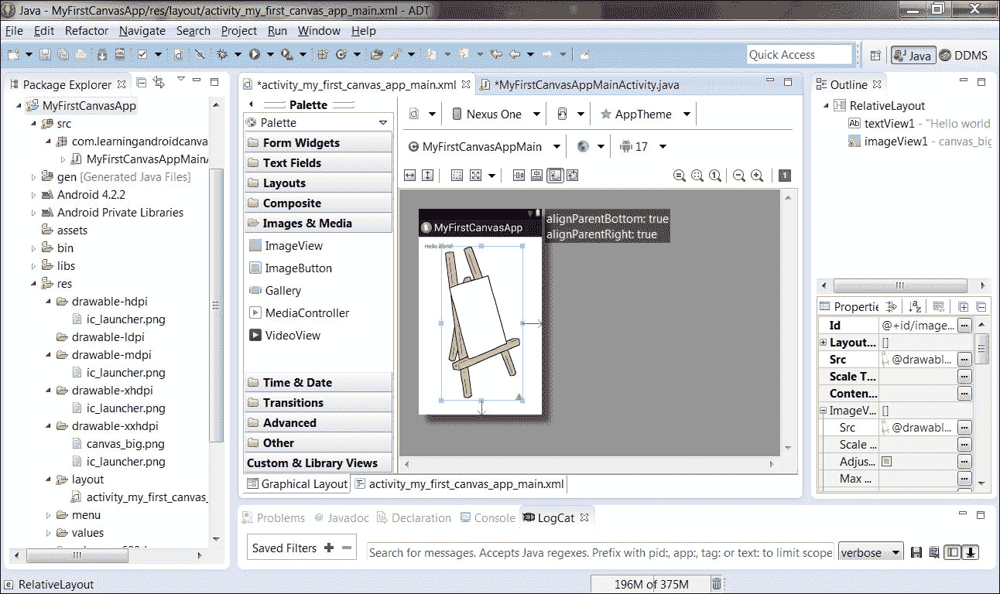

我们将运行应用程序。以下是在模拟器上得到的结果——我们的应用程序在用 Canvas 绘制的 ImageView 上显示图像：

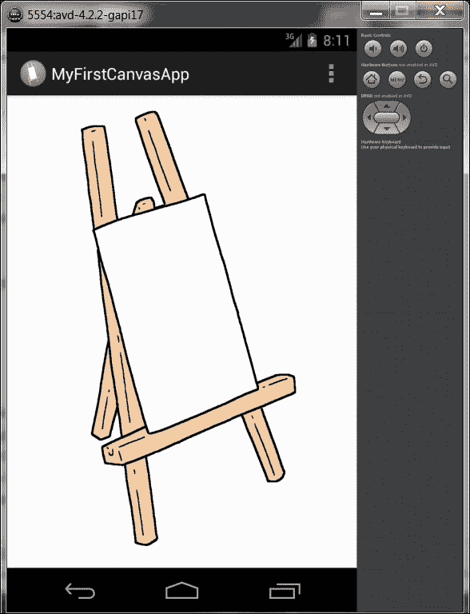

这是我们需要非常小心的事情：当我们在`res`文件夹中保存图像文件时，需要仔细重命名图像文件。尽管图像文件名在这个项目之外可能没有影响，但在 Eclipse 中，如果出现以下错误，图像文件名会给你带来错误：

+   包含空格的文件名；例如，`our canvas.png`：

    这将返回一个错误，并且不会在我们项目文件中的 Package Explorer 窗格中显示。包含除`_`和`.`以外的特殊字符的文件名也会返回错误，例如`our-canvas(1).png`。

    下面的截图显示了将会显示的错误：

    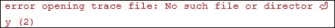

+   不以字母字符开头的文件名；例如，`886_1_Canvas.png`。这将返回一个错误。

命名图像文件的最佳约定是先用字母字符开头；之后可以包含数字。在特殊字符中只使用`_`和`.`；例如，`our_canvas_1.png`。这个文件名会被接受，我们也能在应用中使用这个图像。

我们已经完成了本章的目标，但如果我们不想让应用程序在不同屏幕尺寸和分辨率上的图形出现问题，我们需要了解一些额外的事情。如果我们希望应用程序支持多屏幕，我们需要了解以下内容：

+   **屏幕尺寸**：这是物理屏幕尺寸，通常以对角线英寸为单位测量。Android 对所有显示设备分为四组：小、正常、大和超大。

+   **屏幕密度**：这是每英寸的点数（dpi）。这是物理区域上的像素数量。这意味着一个 3 英寸的高密度屏幕将比一个 6 英寸的低密度屏幕拥有更多的像素。较低的 dpi 表示低密度屏幕，较高的 dpi 表示高密度屏幕。Android 有四个密度组：低、中、高和超高。这里就涉及到了`ldpi`、`hdpi`、`mdpi`、`xhdpi`。有关屏幕尺寸和密度的更多详细信息，请点击此链接：[`developer.android.com/guide/practices/screens_support.html`](http://developer.android.com/guide/practices/screens_support.html)。

+   **屏幕方向**：这是屏幕的方向。它可以是纵向或横向。我们需要注意这一点，因为不同的设备在不同的模式下运行，用户可以在运行时改变方向。因此，如果我们只设计其中一种，我们就必须锁定屏幕的方向。这样，即使用户旋转屏幕，我们 UI 的图形也会保持不变。最好为两种方向设计布局和图形。

# 总结

在本章中，我们学习了以下内容：

+   了解 Android Canvas 的必要性

+   什么是 Android Canvas 以及它为我们提供了什么

+   创建一个简单的应用程序，在屏幕上显示图像

+   了解我们第一个应用程序的重要文件和部分。

+   关于屏幕尺寸、密度和方向的更多信息

到本章结束时，读者将了解在 Android 中处理图形的基础知识。读者将能够创建一个简单的应用程序，在屏幕上显示图像，并对项目不同部分有一个基本的了解。他/她还将了解哪些文件用于什么目的以及在哪里找到它们。读者还将获得一些关于屏幕和密度的基本知识；因此，在设计应用程序中的图形时，读者将使用这些信息来更好地决定设计用户界面。

在下一章中，我们将讨论线程，它们的重要性，如何在 Canvas 中使用它们进行绘图，以及使用线程时应用程序的性能权衡。
