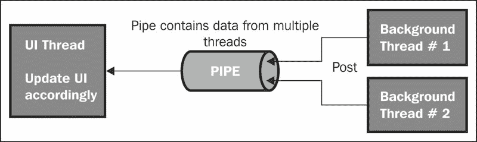

# 第二章：绘制线程

线程是可以由操作系统独立管理的最小指令序列。通常，在单个进程的单个线程中完成单个任务，但如果我们想改变正常行为，希望多个任务同时运行，我们将使用多线程。线程共享相同的进程资源，但独立执行。如果系统只有一个处理器，任务可能会看起来是同时处理的，但实际上并非如此。实际上，在一个处理器的情况下，处理线程的分配会从线程切换到线程，但切换非常快，以至于看起来像是同时处理的。如果系统有多个处理器，两个线程可以同时执行——彼此并行。多线程是一种执行模型，在单个进程中可以执行一个以上的线程。线程可以用多种方式使用，每种方式都有自己的重要性；例如，要么同时执行多个任务，要么如果需要在后台处理某些内容而让前端保持响应和活跃，就可以将负载从主线程移开。这是 Android 应用程序的理想情况，因为我们必须将尽可能多的负载从主线程移开，并保持前端响应和活跃。如果我们不这样做，保留消耗大量处理器能力和内存的重操作，应用程序可能会变得无响应，甚至要求我们强制关闭。

本章节的目标是清晰理解 Android 中的线程。我们不会深入探讨线程及其编码的细节，但会对 Android 中的线程有一个基本的了解。这有什么已知问题？在绘制和 Canvas 方面，Android 线程的重要性何在？我们将看到一个简单的代码结构，通过它我们希望任务在另一个线程上运行。

在 Android 中，所有应用都在单个线程上运行。所有指令按顺序执行，这意味着第二条指令不会在第一条完成之前开始。这个主线程也被称为**UI**（**用户界面**）线程，因为它负责在屏幕上绘制所有对象或视图，并处理所有事件，例如屏幕触摸和按钮点击。现在的问题是，如果我们有两个操作计划在同一个默认线程或 UI 线程中运行，而第一个操作需要很长时间才能完成，系统会要求用户强制关闭应用程序或等待进程完成。这种情况被称为**ANR**（**应用程序无响应**）。

# 绘制线程的需求

我们知道我们将要处理图像、绘图和其他图形处理，我们也知道它们对系统资源非常重。因此，我们希望在设计应用程序时非常谨慎，考虑到性能。如果我们忽略这一点，将所有的图像、位图、图形和其他图形处理项都放在默认的 UI 线程上会怎样呢？这是新 Android 开发者的工作方式——将所有内容都放在默认活动的代码中，意味着将整个负载放在 UI 线程上。默认活动是我们希望应用程序运行时首先加载的活动。UI 线程是我们应用程序的主要执行线程。这是大多数应用程序代码运行的地方。如`Activities`、`Services`、`ContentPorviders`和`BroadcastReceivers`等应用程序组件都在这个线程中创建。这种情况下会发生什么？即使我们的应用程序是地球上最有用、最吸引人的应用程序，它也撑不过一天。每次用户运行我们的应用程序，它最终都会变得没有响应。Play 商店上用户的几条愤怒评论，我们的应用程序就完了。我们将失去这个想法，因为到那时它已经是公开的，我们也会失去我们的观众。为了解决这个问题，我们将从主 UI 线程中移走所有繁重的工作和负载，放到另一个线程上。理想情况下，当它运行时，看起来所有的线程都在并行运行，但这仅在有多 CPU 的情况下。如果只有一个 CPU 但支持多线程，系统将决定启动哪个线程，停止哪个线程，但没有任何线程会被永久停止。因此，控制将在运行中的线程之间切换，看起来就像是所有线程都在并行运行。

# Android 中多线程的问题

我们将把耗时的资源密集型操作放在一个单独的线程上，但在 Android 中这会产生一个问题，那就是为什么不允许其他线程更新负责所有 UI 元素和处理过程的主 UI 线程。为了解决这个问题，我们需要将其与 UI 线程的当前状态同步。Android 提供了一个专门处理这个问题的类，它就是`AsyncTask`类。我们将在本章后面讨论这个问题。

# Thread 类

`Thread`和`Runnable`类是使我们能够使用多线程的基本类，它们的功能非常有限，但仍然为`AsyncTask`、`HandlerThread`、`IntentService.Thread`和`ThreadPoolExecuter`提供了基础。这些类能够自动管理线程，并可以并行运行多个线程。

下面是`Runnable`类的一个示例代码片段：

```kt
public class ImageReSize implements Runnable {
  public void run(){
    //the main functionality of the thread comes here
  }
}
```

如果我们希望线程在后台运行，我们将在前面提到的`run()`方法中添加以下这行代码：

```kt
Android.os.Process.setThreadPriority(Android.os.Process.THREAD_PRIORITY_BACKGROUND);
```

假设我们有我们的`Runnable`类。我们仍然无法在用户界面上显示任何内容，因为只有 UI 线程执行 UI 对象，如视图。在 UI 线程上运行的对象可以访问其他对象。现在，在我们的线程上运行的任务不在 UI 线程上，因此它们无法访问 UI 对象。为了使我们的任务能够访问 UI 线程上的 UI 对象，我们必须使用可以将在后台线程中的数据移动到 UI 线程的东西。如果一个线程在后台运行，并且需要更改 UI 上的内容，它本身无法做到这一点，但可以使用`runOnUiThread`提供的功能，这将使我们能够在主 UI 线程上运行后台线程中的代码。另外，我们可以选择使用`Handler`对象。

### 提示

**下载示例代码**

您可以从您的账户下载您购买的所有 Packt 图书的示例代码文件，访问地址为[`www.packtpub.com`](http://www.packtpub.com)。如果您在别处购买了这本书，可以访问[`www.packtpub.com/support`](http://www.packtpub.com/support)注册，我们会将文件直接通过电子邮件发送给您。

## 在 UI 线程上运行的 Handler 对象

要编写在 UI 线程上运行的`Handler`对象，首先应在 UI 线程上定义一个`Handler`对象，然后将数据存储在`Task`对象中。应该将对象的状态发送到对象层次结构的上层。完成这些操作后，应将数据移动到 UI 线程。我们这样做是为了实现在后台的另一个线程上运行任务，并在需要时与主 UI 线程通信以获得我们期望的输出。然而，这需要付出很多努力。



## AsyncTask

为了显著减少工作量和复杂性，Android 提供了`AsyncTask`类。这个类将我们的任务分配到后台的另一个线程上运行，并在需要时自动与 UI 线程通信，为我们节省了使用`Handler`对象的时间和精力。为了完成任务，我们将创建一个扩展`AsyncTask`的类，将我们的功能放入其中，并执行我们的应用程序。`AsyncTask`会为我们做很多工作。

# 概述

在本章中，我们了解了以下内容：

+   简单 Android 应用程序的线程结构

+   UI 线程的角色及其重要性

+   需要将耗用资源的操作从主 UI 线程中分离出来

+   非 UI 线程的局限性

+   如何使用`Handler`对象处理问题并与 UI 线程通信

+   实现`Runnable`接口的类的代码结构，使我们能够使用线程

+   Android 以`AsyncTask`类的形式提供给我们的功能；我们也了解到了它的重要性。

在下一章中，我们将学习`Drawable`类以及在 Canvas 上使用资源中的图像和 XML 进行绘图。同时还将介绍在`View`和`SurfaceView`上的绘图以及基本形状如圆形的绘制。
