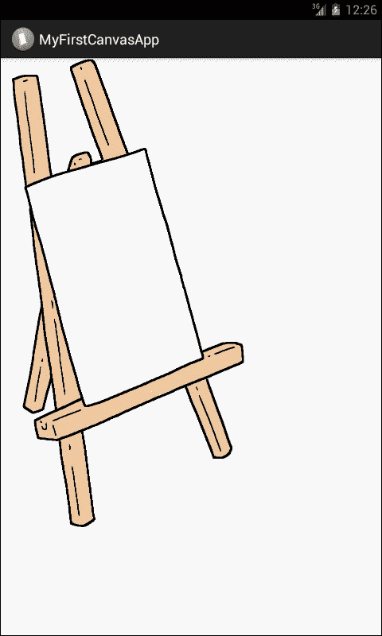
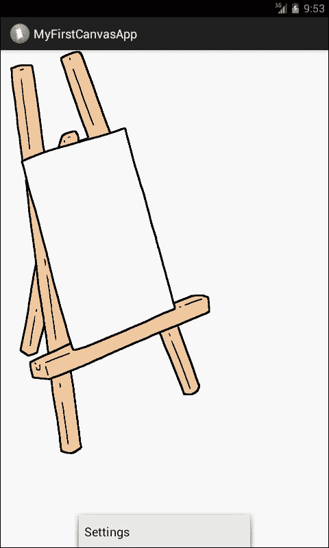
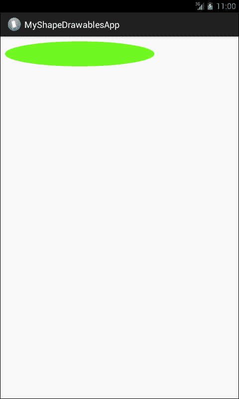

# 第三章：安卓画布中的绘制和可绘制资源

在本章中，我们的目标是了解以下内容：

+   在 Canvas 上绘制

+   在视图上绘制

+   在 SurfaceView 上绘制

+   可绘制资源

+   来自资源图片的可绘制资源

+   来自资源 XML 的可绘制资源

+   形状可绘制资源

安卓为我们提供了 2D 绘图 API，使我们能够在 Canvas 上绘制自定义图形。在处理 2D 绘图时，我们将在视图上绘制，或者直接在表面或 Canvas 上绘制。使用视图来处理图形时，绘制由系统的正常视图层次结构绘制过程处理。我们只需定义要在视图中插入的图形；其余的由系统自动完成。当使用直接在 Canvas 上绘制的方法时，我们必须手动调用合适的 Canvas 绘制方法，如`onDraw()`或`createBitmap()`。这种方法需要更多的努力和编码，并且稍微复杂一些，但我们能控制一切，比如动画以及通过代码控制绘制的尺寸、位置、颜色以及将绘制内容从当前位置移动到另一个位置的能力。`onDraw()`方法的实现可以在视图上的绘制部分看到，而`createBitmap()`的代码在*在 Canvas 上绘制*一节中展示。

如果我们处理的是静态图形——在应用程序执行期间不会动态变化的图形——或者我们处理的图形不是资源饥渴型的，因为我们不希望将应用程序性能置于风险之中，我们将使用在视图上绘制的方法。在视图上绘制可以用于设计具有静态图形和简单功能的引人注目的简单应用程序——简单的吸引人背景和按钮。使用主 UI 线程在视图上绘制是完全可以的，因为这些图形不会对应用程序的整体性能构成威胁。

当处理像游戏中那样动态变化的重型图形时，应该使用在 Canvas 上绘制的方法。在这种情况下，Canvas 会不断重绘自己以保持图形更新。我们可以在主 UI 线程上在 Canvas 上绘制，但是正如我们在第二章中尽可能详细讨论的那样，*绘制线程*，在处理重型、资源饥渴、动态变化的图形时，应用程序会持续重绘自己。最好使用单独的线程来绘制这些图形。将这样的图形保留在主 UI 线程上不会使它们进入无响应模式，而且经过如此努力工作后，我们肯定不会喜欢这种情况。因此，这个选择应该非常谨慎地做出。

# 在 Canvas 上绘制

`Canvas`是一个接口，一种媒介，它使我们能够实际访问表面，我们将用它来绘制图形。`Canvas`包含了绘制图形所需的所有必要方法。在`Canvas`上绘制的实际内部机制是，每当需要在`Canvas`上绘制任何内容时，它实际上是绘制在一个底层的空白位图图像上。默认情况下，这个位图是自动为我们提供的。但如果我们想使用一个新的`Canvas`，那么我们需要创建一个新的位图图像，然后再创建一个新的`Canvas`对象，同时将已创建的位图提供给`Canvas`类的构造函数。以下是一个示例代码的说明。最初，位图被绘制但不在屏幕上；它实际上是在内部`Canvas`的后台绘制的。但要将它带到前台，我们需要创建一个新的`Canvas`对象，并提供已创建的位图，以便在屏幕上绘制。

```kt
Bitmap ourNewBitmap = Bitmap.CreateBitmap(100,100,Bitmap.Config.ARGB_8888);
Canvas ourNewCanvas = new Canvas(ourNewBitmap);
```

## 在`View`上绘制

如果我们的应用程序不需要大量的系统资源或高帧率，我们应该使用`View.onDraw()`。在这种情况下，好处是系统会自动为`Canvas`提供其底层的位图。我们需要做的就是进行绘图调用，完成我们的绘图工作。

我们将通过扩展`View`类来创建我们的类，并在其中定义`onDraw()`方法。`onDraw()`方法是我们将在其中定义要在`Canvas`上绘制的内容的地方。Android 框架将调用`onDraw()`方法，要求我们的`View`绘制自己。

`onDraw()`方法将在需要时由 Android 框架调用；例如，每当我们的应用程序想要绘制自己时，都会调用这个方法。每当想要我们的`view`重绘自己时，我们必须调用`invalidate()`方法。这意味着，每当我们想要应用程序的视图重新绘制时，我们都会调用`invalidate()`方法，然后 Android 框架会为我们调用`onDraw()`方法。假设我们想要画一条线，那么代码可能如下所示：

```kt
class DrawView extends View {
  Paint paint = new Paint();
  public DrawView(Context context) {
    super(context);
    paint.setColor(Color.BLUE);
  }
  @Override
  public void onDraw(Canvas canvas) {
    super.onDraw(canvas);
    canvas.drawLine(10, 10, 90, 10, paint);
  }
}
```

在`onDraw()`方法内部，我们将使用`Canvas`类提供的各种设施，比如`Canvas`类提供的不同的绘图方法。我们还可以使用其他类的绘图方法。当我们的`onDraw()`方法完成了所有期望的功能后，Android 框架会在`Canvas`上为我们绘制一个位图。如果我们使用的是主 UI 线程，我们会调用`invalidate()`方法，但如果我们使用的是另一个线程，那么我们会调用`postInvalidate()`方法。

## 在`SurfaceView`上绘制

`View`类提供了一个子类`SurfaceView`，在`View`的层次结构中提供了一个专用的绘图表面。目标是使用一个辅助线程进行绘制，这样应用程序就不会等待资源空闲并准备好重绘。辅助线程可以访问`SurfaceView`对象，该对象具有使用自己的`Canvas`以自己的重绘频率进行绘制的功能。

我们将从创建一个扩展 `SurfaceView` 类的类开始。我们应该实现一个接口 `SurfaceHolder.Callback`。这个接口之所以重要，是因为它能在表面被创建、修改或销毁时提供给我们信息。当我们及时了解表面的创建、更改或销毁情况时，我们可以更好地决定何时开始绘图以及何时停止。在 `SurfaceView` 类中也可以定义将在 Canvas 上执行所有绘图工作的次要线程类。

为了获取信息，应该通过 `SurfaceHolder` 处理 `Surface` 对象，而不是直接处理。为此，我们将在初始化 `SurfaceView` 时调用 `getHolder()` 方法来获取 Holder。然后，我们会告诉 `SurfaceHolder` 对象我们希望接收所有回调；为此，我们将调用 `addCallBacks()`。此后，我们将重写 `SurfaceView` 类内的所有方法，以根据我们的功能完成我们的工作。

下一步是在第二个线程内部绘制表面的 Canvas；为此，我们将传递我们的 `SurfaceHandler` 对象到线程对象，并使用 `lockCanvas()` 方法获取 Canvas。这将为我们获取 Canvas，并将其仅对当前线程的绘图锁定。我们需要这样做，因为我们不希望有一个可以被另一个线程绘制的开放的 Canvas；如果出现这种情况，它将干扰我们在 Canvas 上的所有图形和绘图。当我们完成在 Canvas 上绘制图形后，我们将通过调用 `unlockCanvasAndPost()` 方法并传递我们的 Canvas 对象来解锁 Canvas。为了成功绘图，我们将需要重复重绘；因此，我们将根据需要重复锁定和解锁，表面将绘制 Canvas。

为了实现统一和平滑的图形动画，我们需要拥有 Canvas 的上一个状态；因此，我们将每次从 `SurfaceHolder` 对象中获取 Canvas，并且每次整个表面都应该重新绘制。如果我们不这样做，例如，没有绘制整个表面，上一个 Canvas 的绘图将会持续存在，这将破坏我们图形密集型应用程序的整体外观。

一个示例代码如下： 

```kt
class OurGameView extends SurfaceView implements SurfaceHolder.Callback {
  Thread thread = null;
  SurfaceHolder surfaceHolder;
  volatile boolean running = false;
  public void OurGameView (Context context) {
    super(context);
    surfaceHolder = getHolder();
  }

  public void onResumeOurGameView (){
    running = true;
    thread = new Thread(this);
    thread.start();
  }
    public void onPauseOurGameView(){
  boolean retry = true;
  running = false;
  while(retry){
    thread.join();
    retry = false;
  }

  public void run() {
  while(running){
    if(surfaceHolder.getSurface().isValid()){
      Canvas canvas = surfaceHolder.lockCanvas();
    //... actual drawing on canvas
      surfaceHolder.unlockCanvasAndPost(canvas);
      }
    }
  }
}
```

## Drawable 图形

Android 提供的二维图形和绘图库称为 **Drawable**。确切的包名是 `android.graphics.drawable`。这个包提供了绘制我们 2D 图形所需的所有类。

通常，`Drawable` 是可以绘制的抽象概念。Android 提供了许多扩展了 `Drawable` 类的类，以定义特殊的 Drawable 图形类型。完整的列表可以在 [`developer.android.com/reference/android/graphics/drawable/package-summary.html`](http://developer.android.com/reference/android/graphics/drawable/package-summary.html) 找到。

Drawable 可以通过三种方式定义和实例化：

+   从保存在我们项目的`资源`文件夹中的图片

+   从 XML 文件中

+   从普通的类构造函数中

在本书的背景下，我们只解释前两种方法。

## 从资源图片中的可绘制资源

这是向我们的应用程序添加图形的最快和最简单的方法。我们已经解释了项目中的不同重要文件夹，并在第一章《开始使用 Android 画布》中详细讨论了哪个文件夹包含什么类型的文件。在本章结束时，我们将知道如何将图片复制到`资源`文件夹中，以及在哪里找到`资源`文件夹。

我们将使用在第一章《开始使用 Android 画布》中已经复制的图片，该图片位于我们应用程序项目的`res/drawable`文件夹中。图片名为`lacm_5396_01_14.png`，确切位置在`res/drawable-xhdpi`。这里有一个重要点是，支持的格式有 PNG、JPEG 和 GIF。最理想的格式是 PNG，最不理想的是 GIF。每当我们把图片放在`res/drawable`文件夹中时，在构建过程中，图片将会使用无损压缩来节省系统内存；这个过程是自动的。压缩后的图片通常能保持相同的质量，但大小会小得多。如果我们不希望系统压缩我们的图片，我们应该将图片复制到`res/raw`文件夹中。

我们将使用第一章《开始使用 Android 画布》中的相同应用程序源代码来说明这一章节的内容。我们将打开我们的项目`MyFirstCanvasApp`。这是我们在进行任何更改之前的代码：

```kt
package com.learningandroidcanvasmini.myfirstcanvasapp;
import android.os.Bundle;
import android.app.Activity;
import android.view.Menu;
public class MyFirstCanvasAppMainActivity extends Activity {
  @Override
  protected void onCreate(Bundle savedInstanceState) {
    super.onCreate(savedInstanceState);
    setContentView(R.layout.activity_my_first_canvas_app_main);
  }
  @Override
  public boolean onCreateOptionsMenu(Menu menu) {
    // Inflate the menu; this adds items to the action bar if it //is present.
    getMenuInflater().inflate(R.menu.my_first_canvas_app_main,menu);
    return true;
  }
}
```

我们将在**设计**视图中打开我们的布局文件`activity_my_first_canvas_app_main.xml`。我们将删除在第一章《开始使用 Android 画布》中添加到活动中的**ImageView**对象。现在，我们将再次打开我们的代码文件，并逐步添加以下代码行到前面的代码中。在我们的主活动类中，我们将定义一个`LinearLayout`对象：

```kt
LinearLayout myLinearLayout;
```

这将是我们自定义的布局，我们想使用这段代码来显示图片。然后，在我们的主活动类中，我们将实例化`LinearLayout`对象：

```kt
myLinearLayout = new LinearLayout(this);
```

接下来，我们将向我们的文件中添加以下代码行：

```kt
ImageView MySecondImageView = new ImageView(this);
MySecondImageView.setImageResource(R.drawable.lacm_5396_01_14);
MySecondImageView.setAdjustViewBounds(true);
MySecondImageView.setLayoutParams(new ImageView.LayoutParams(LayoutParams.WRAP_CONTENT, LayoutParams.WRAP_CONTENT));
myLinearLayout.addView(MySecondImageView);
setContentView(myLinearLayout);
```

在前面的代码块中，首先我们定义了一个`ImageView`对象。然后我们设置我们希望`ImageView`对象显示的图像源。在下一行，我们调整了视图边界，使`ImageView`的边界与源图像的宽度和高度相匹配。`setLayoutParams`方法可以帮助我们将视图边界围绕图像内容，即使尺寸有差异。在此之后，我们将使用以下代码行将我们的`ImageView`控件提供给我们的自定义布局：

```kt
myLinearLayout.addView(MySecondImageView);
```

在最后一行，我们将活动的布局设置为我们的自定义布局。为此，我们将内容视图设置为我们的自定义布局：

```kt
setContentView(myLinearLayout);
```

现在，我们将在模拟器中测试我们的应用程序，然后我们将在模拟器屏幕上看到以下内容：



如果我们将此输出图像与在第一章，*Android Canvas 入门*中的活动屏幕上的图像进行比较，我们看到的区别并不大。我们在第一章，*Android Canvas 入门*中很容易地实现了相同的输出。那么，为什么我们还要经历所有这些复杂的编码来在本章中实现相同的输出呢？

我们之所以要经历所有这些艰难的工作和复杂的代码，是因为在第一章，*Android Canvas 入门*中，我们将`ImageView`对象硬编码为只显示我们在**设计**视图的**属性**标签中定义的一张图片。现在，当我们从**设计**视图中删除屏幕上的`ImageView`对象并开始编码时，那时在**设计**视图中屏幕上什么都没有。在前一个示例中我们所做的是创建我们自己的自定义布局，该布局将承载我们的图形和绘图。我们创建了一个`ImageView`对象，为其提供了源图像并设置了其他属性。稍后，我们将`ImageView`对象添加到我们的自定义布局中，最后，我们要求活动在没有自定义创建的布局和自动布局的情况下出现在屏幕上。这段代码为我们提供了保持图形应用程序动态的灵活性。我们可以通过我们的代码逻辑控制，为应用程序提供运行时图像。

完整的代码现在看起来像这样：

```kt
package com.learningandroidcanvasmini.myfirstcanvasapp;
import android.os.Bundle;
import android.app.Activity;
import android.view.Menu;
import android.widget.ImageView;
import android.widget.LinearLayout;

public class MyFirstCanvasAppMainActivity extends Activity {
  LinearLayout myLinearLayout;  
  @Override
  protected void onCreate(Bundle savedInstanceState) {
    super.onCreate(savedInstanceState);
    setContentView(R.layout.activity_my_first_canvas_app_main);
  myLinearLayout = new LinearLayout(this);
  ImageView MySecondImageView = new ImageView(this);
  MySecondImageView.setImageResource(R.drawable.lacm_5396_01_14);
  MySecondImageView.setAdjustViewBounds(true);
  MySecondImageView.setLayoutParams(new ImageView.LayoutParams(LayoutParams.WRAP_CONTENT, LayoutParams.WRAP_CONTENT));
  myLinearLayout.addView(MySecondImageView);
  setContentView(myLinearLayout);  
  }
  @Override
  public boolean onCreateOptionsMenu(Menu menu) {
    // Inflate the menu; this adds items to the action bar if it //is present.
    getMenuInflater().inflate(R.menu.my_first_canvas_app_main, menu);
    return true;
  }

}
```

如果我们希望我们的资源图像被视为一个`Drawable`，我们将从我们的资源图像创建一个`Drawable`对象：

```kt
Resources myRes = mContext.getResources();
Drawable myImage = myRes.getDrawable(R.drawable.5396_01_14);
```

在这里，我们需要了解的是，我们的`Resources`对象中的每个资源一次只能保持一个状态。如果我们正在两个不同实例中使用相同的资源图像，并且我们更新了一个实例的属性，第二个实例中的图像也会反映出这个变化。因此，每当我们处理`Drawable`对象的多个实例时，我们不是改变 Drawable 本身，而是可以创建补间动画。

## 来自资源 XML 的可绘制资源

对于那些对 Android 开发有一定背景的开发者来说，我们知道应用程序中的每个活动都有一个 XML 布局文件。在这个文件中，我们在活动中拖放的所有视图或控件都有一个定义的 XML 标记。因此，我们假设阅读这本书的开发者知道在为 Android 开发时用户界面是如何工作的。对象可以在 XML 中定义和初始化。如果我们处理的是那些属性不依赖于我们计划在代码中执行的操作的图形，或者图形可能是静态的，那么在 XML 中定义图形对象是一个好方法。一旦图形被实例化，其属性可以根据需要随时调整。

我们将在`res/drawable`中保存文件，在 XML 中定义 Drawable，并通过调用`Resouces.getDrawable()`获取 Drawable。这个方法将从我们的 XML 文件中获取资源 ID 作为参数。

为了举例说明，并了解哪些 Drawable 可以使用这种方法以及我们如何查看应用程序中自动创建的菜单，请注意前面代码中的`onCreateOptionMenu()`方法。当我们点击屏幕上的**菜单**按钮或从硬件键上点击时，我们在屏幕底部看到一个名为**设置**的小菜单。此时菜单没有功能。现在如果我们检查`onCreateOptionMenu()`的代码，我们看到一个对`inflate()`方法的调用。我们可以在 XML 中定义任何支持`inflate()`方法的 Drawable。前面提到的菜单就是这方面的一个简单例子。

**设置**菜单可以在以下屏幕截图中看到：



假设我们想要一个展开-折叠过渡的 Drawable，下面这段 XML 代码可以为我们完成这项工作。这段 XML 代码将被保存在`res/drawable expand_collapse.xml`文件中。

```kt
<transition 
>
  <item android:drawable="@drawable/image_expand">
    <item android:drawable="@drawable/image_collapse">
      </transition>

```

`expand`和`collapse`文件是我们保存在项目`drawable`文件夹中的两个不同的图像。现在为了使这个过渡工作，我们需要以下代码：

```kt
Resources myRes = mContext.getResources();
TransitionDrawable myTransition = (TransitionDrawable)
  res.getDrawable(R.drawable.expand_collapse);
ImageView myImage = (ImageView) findViewById(R.id.toggle_image);
  myImage.setImageDrawable(myTransition);

```

首先，我们从资源中创建了一个`resources`对象，并要求该对象从这些资源中获取所有内容（这些资源是我们保存在项目`res`文件夹子文件夹中的所有图片和 XML 文件）。然后，我们创建了一个`TransitionDrawable`对象，并要求该对象从`res/drawable`文件夹中获取`expand_collapse`文件。此后，我们将创建一个`ImageView`对象，它将获取另一个名为`toggle_image`的视图。在前面代码的最后一句中，我们将 Drawable 类型设置为已创建的过渡。

现在包含以下代码行将使过渡以每秒一次的速度运行：

```kt
myTransition.startTransition(1000);
```

关于这些过渡和动画，我们不会过多详述，因为动画本身就是一个非常庞大的主题。但是我可以解释一些在 Android 中处理图形时可以进行的关键类型的动画，让读者了解这个领域以及动画所涵盖的内容。Android 中的动画类型如下：

+   属性动画（Property animation）

+   视图动画（View animation）

+   可绘制动画（Drawable animation）

# 形状可绘制对象（Shape Drawables）

每当我们想在画布上动态或以编程方式绘制某些形状时，形状可绘制对象就显得非常方便。使用形状可绘制对象，我们可以绘制圆形以及所有圆形形式，如椭圆形、正方形、矩形和许多其他形状。为了解释形状可绘制对象，我们将以第一章，*开始使用 Android 画布*的方式启动一个新项目。我们将我们的项目命名为`MyShapeDrawablesApp`，并按照第一章使用空白起始活动进行相同的步骤。我们这项练习的目标是在屏幕上绘制一个带有某种颜色填充的椭圆形。

1.  为此，我们将在主活动类的结束括号之前添加另一个类。我们将我们的类命名为`MyCustomDrawableView`，它将扩展`View`类。

    ```kt
    public class MyCustomDrawableView extends View {.....
    ```

1.  在这个类的构造函数中，我们将定义我们的绘制。我们将定义一个`ShapeDrawable`对象，并向其构造函数提供`OvalShape()`方法作为参数以定义形状的类型：

    ```kt
    myDrawable = new ShapeDrawable(new OvalShape());
    ```

1.  接下来，我们将获取画笔对象并为我们的`ShapeDrawable`对象设置颜色：

    ```kt
    myDrawable.getPaint().setColor(0xff74fA23);
    ```

1.  之后，我们将定义要绘制的对象的尺寸。比方说我们想要绘制一个椭圆形。第一个`x, y`是它将开始的位置，接下来的则是椭圆的宽度和高度，如下所示：

    ```kt
    myDrawable.setBounds(x, y, x + width, y + height);
    ```

1.  在这一点上，我们将关闭构造函数，并为我们的对象定义`onDraw()`方法。在这个方法内部，我们将调用我们对象的`draw()`方法。

    ```kt
    protected void onDraw(Canvas canvas) {
      myDrawable.draw(canvas);
    }
    ```

1.  下一步将在主活动类中创建我们自定义类的对象，并将内容视图设置为我们的新自定义类：

    ```kt
    MyCustomDrawableView myCustomDrawableView;
    .
    .
    .
    myCustomDrawableView = new MyCustomDrawableView(this);

      setContentView(myCustomDrawableView);
    ```

1.  我们将在模拟器中运行应用程序。

1.  下面的截图显示了在画布上绘制的绿色椭圆形：

`MyShapeDrawablesMainActivity.java`文件的完整代码如下：

```kt
package com.learningandroidcanvasmini.myshapedrawablesapp;
import android.os.Bundle;
import android.app.Activity;
import android.content.Context;
import android.graphics.Canvas;
import android.graphics.drawable.ShapeDrawable;
import android.graphics.drawable.shapes.OvalShape;
import android.view.Menu;
import android.view.View;

public class MyShapeDrawablesMainActivity extends Activity {
  MyCustomDrawableView myCustomDrawableView;

  @Override
  protected void onCreate(Bundle savedInstanceState) {
    super.onCreate(savedInstanceState);
    setContentView(R.layout.activity_my_shape_drawables_main);

    myCustomDrawableView = new MyCustomDrawableView(this);
      setContentView(myCustomDrawableView);
  }
  @Override
  public boolean onCreateOptionsMenu(Menu menu) {
    // Inflate the menu; this adds items to the action bar if it is 
    //present.
    getMenuInflater().inflate(R.menu.my_shape_drawables_main, menu);
    return true;
  }

  public class MyCustomDrawableView extends View {
    private ShapeDrawable myDrawable;

    public MyCustomDrawableView(Context context) {
      super(context);

      int x = 10;
      int y = 10;
      int width = 300;
      int height = 50;

      myDrawable = new ShapeDrawable(new OvalShape());
      myDrawable.getPaint().setColor(0xff74fA23);
      myDrawable.setBounds(x, y, x + width, y + height);
    }

    protected void onDraw(Canvas canvas) {
      myDrawable.draw(canvas);
    }
  }

}
```

# 总结

在本章中，我们学习了`Canvas`类、它的方法、属性，以及如何使用它们进行绘图。我们还了解了`View`和`SurfaceView`类，并学会了如何使用这两个类进行绘图，以及在哪种情况下使用哪一个。我们也学习了`Drawables`以及使用它们绘图的不同方法，例如从资源中的图片或资源中的 XML 代码进行绘图，以及使用代码绘制形状。在处理 Shape Drawables 和在 Canvas 上绘图时，我们还看到了一个功能性的示例。两个示例应用程序的源代码都可以从*Packt Publishing*网站下载。在下一章中，我们将详细讨论 9-patch（也称为 NinePatch）图片。我们将开发一个使用 9-patch 图片的工作应用程序，并讨论它在设计我们移动应用程序布局中的重要性。
