# 第四章：NinePatch 图像

在本章中，我们将了解 NinePatch 图像：它们是什么，它们的重要性，如何创建它们，如何使用它们，以及它们可以在我们的 Android 应用程序中产生什么影响。

NinePatch 图像非常重要，因为我们希望以这样的方式开发我们的布局，即如果方向改变或者我们的应用程序在不同的分辨率设备上运行，它都可以调整。我们应用程序的布局需要足够灵活，以根据不同设备的分辨率、屏幕尺寸和方向进行调整。NinePatch 图像是具有可伸展区域的图像。这些可伸展区域可以水平和垂直伸展以包含内部内容。最好的部分是，如果内容的宽度和高度未定义，NinePatch 图像可以水平和垂直伸展以适应任何类型的宽度和高度的任何内容。通常，NinePatch 图像用于不同类型容器或视图的背景中，这些容器或视图将承载某种类型的内容。它可以作为我们应用程序中活动的背景，或者仅用于带文本的按钮的背景。Ninepatch 图像是带有额外 1 像素宽边框的普通 PNG 图像。必须确保一件事，NinePatch 图像必须保存为 `.9.png` 文件扩展名。

NinePatch 图像之所以这样称呼，是因为 Drawable 对象允许在九个区域中绘制图像。为了使这个概念清晰，请查看以下图表：

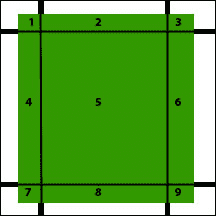

在上一个图表中，有可伸展和不可伸展的区域。在 NinePatch 图像中，四个部分将是可伸展的；在前面示例中它们是部分**2**，**4**，**6**和**8**。四个部分将不可伸展，在前面示例中它们是部分**1**，**3**，**7**和**9**。最后一部分是内容区域，将在两个方向上伸展；在之前的示例中它是部分**5**。

在可伸展的区域中，第**2**和**8**部分仅水平伸展。第**4**和**6**部分仅垂直伸展。第**5**部分将水平和垂直伸展，这是图形的主要部分，用于容纳内容。

这里重要的一点是，并不一定需要按照示例中显示的确切样式来设置补丁。NinePatch 图像可以创建为仅水平或垂直延伸的补丁；此外，它还可以拥有比提到的示例更多的补丁。

# 创建 NinePatch 图像

为了创建 NinePatch 图像，Android 提供了一个非常简单的工具；然而，在使用该工具之前，我们需要了解使用该工具的要求。首先，我们需要有一个基础的 PNG 图形文件，我们将把它转换成我们的第一个 NinePatch 图像。我们可以在任何图形编辑工具中创建我们的基础 PNG 图像，比如 Photoshop。因此，我们将通过打开 Photoshop 并创建一个新的 PNG 图像来开始创建我们的基础 PNG 图像。

下面的截图展示了 Photoshop 中**新建**文件对话框：

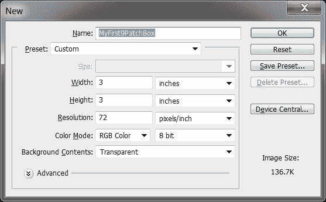

我们计划创建一个绿色的盒子，稍后会将盒子内的内容转换为 NinePatch 图像。首先，我们将文件命名为 `MyFirst9PatchBox` 并将 **背景内容** 设置为 **透明**。点击 **确定** 后，我们会得到一个空白画布。接下来，我们将在画布内绘制一个带有透明背景的绿色盒子。

下面的截图展示了我们在 Photoshop 中绘制的绿色盒子：

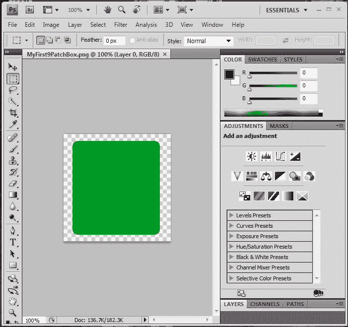

默认情况下，Photoshop 以 PSD 格式保存文件，但我们会以 PNG 格式保存文件，因为我们需要一个 PNG 文件来将其转换为 NinePatch 图像。或者，我们可以将文件保存为网页格式；这样创建的 PNG 文件会更小。这将提高应用程序的整体性能。在我们的应用程序中使用许多重量级的图像可能会降低应用程序的性能。

要从我们的绿色盒子 PNG 文件创建 NinePatch 图像，我们将打开 Android SDK 中 `Tools` 文件夹提供的 Draw 9-patch 工具。为此，我们将浏览到 Android SDK 中的 `Tools` 文件夹，并找到 `draw9patch.bat` 文件。

文件的路径为 `F:\Android\adt-bundle-windows-x86_64-20130219\adt-bundle-windows-x86_64-20130219\sdk\tools`，其中 `F` 是我的驱动器，Android 是 `F` 驱动器根目录下的一个文件夹，其余部分位于 Android 文件夹内。下面的截图展示了 `draw9patch` 工具的位置。

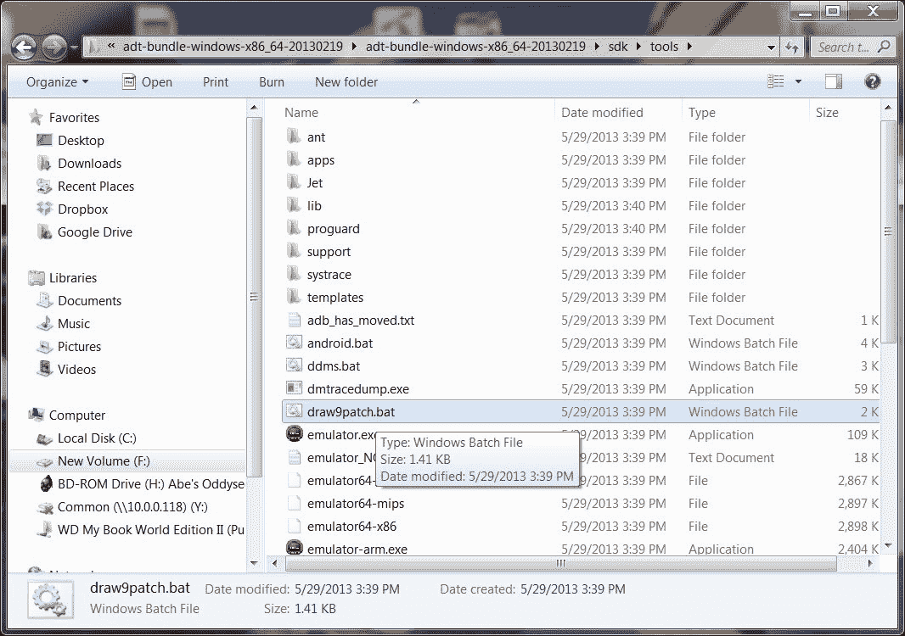

双击可以打开 `draw9patch` 工具。下面的截图展示了带有空屏幕的 `draw9patch` 工具：

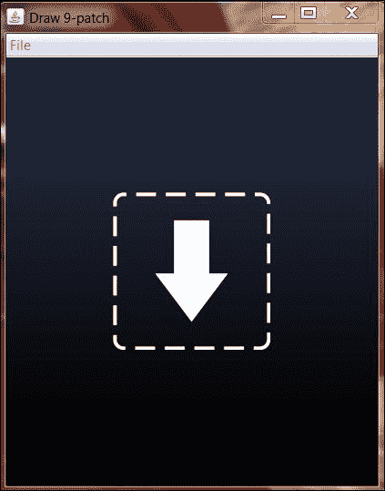

在下一步中，我们将把我们的 PNG 基础图像拖拽到 `draw9patch` 工具中，或者直接在 `draw9patch` 工具中打开我们的 PNG 文件。

下面的截图展示了我们的基础 PNG 文件和 `draw9patch` 工具并排显示：

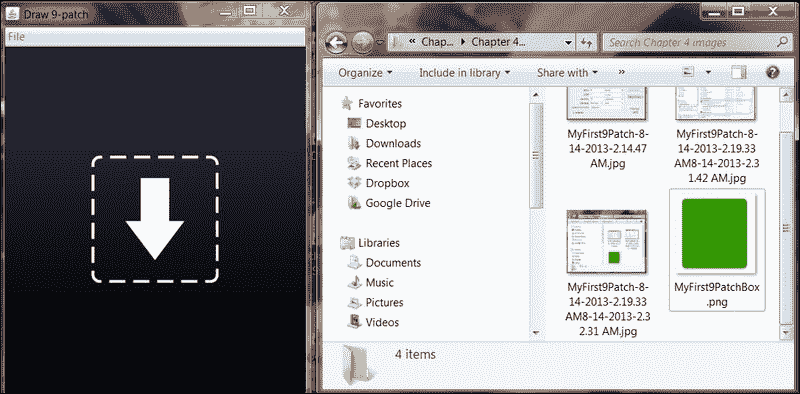

当我们将基础 PNG 文件拖拽或打开在 `draw9patch` 工具中时，我们会看到以下截图：

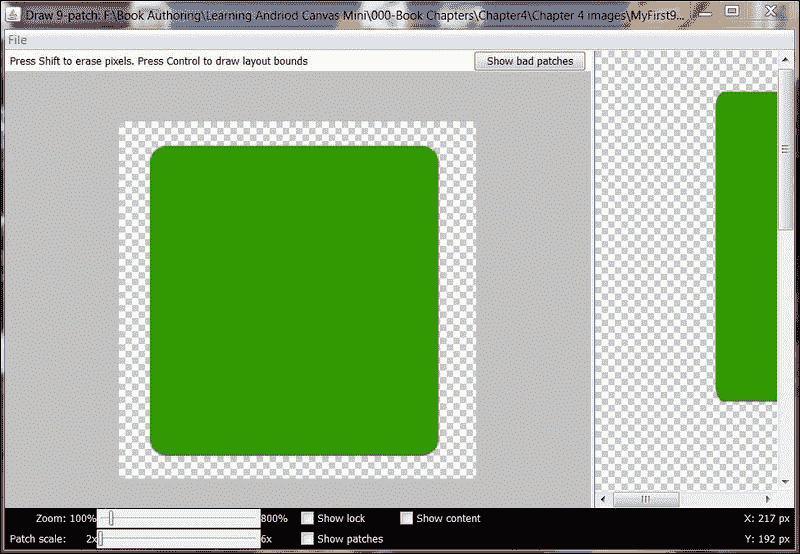

右侧区域显示了绘图区域，我们将在其中定义我们的补丁区域——需要拉伸的区域和不需要拉伸的区域。左侧窗格显示了预览区域。

在下一步中，我们将定义我们的补丁。当我们将光标移到图像上时，我们会看到非常浅的水平和垂直线。我们将拖动这些水平和垂直线来定义我们的补丁。

下面的截图显示了我们定义的补丁：

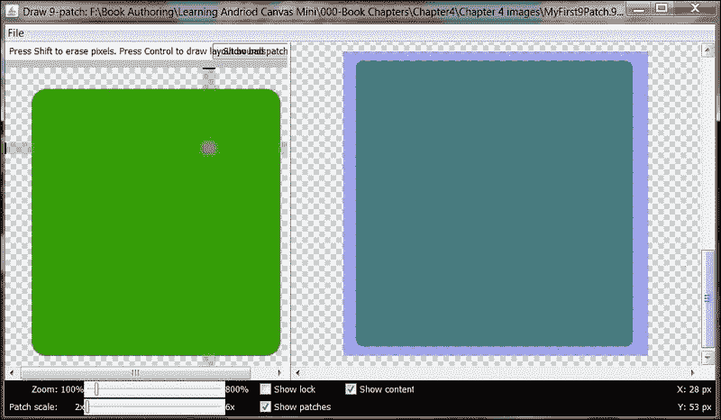

浅绿色垂直和水平区域显示了我们定义的补丁区域，这些是可拉伸的部分。如果我们错误地定义了补丁，那么当我们在其中放入内容时，它们将无法正确伸展以包含所有内容。这个工具会告诉我们是否有错误的补丁。在左侧窗格的右上角有一个名为**显示错误补丁**的按钮。点击它，如果我们的 9-patch 图像中有错误补丁，它会显示错误补丁。

下面的截图显示了错误补丁：

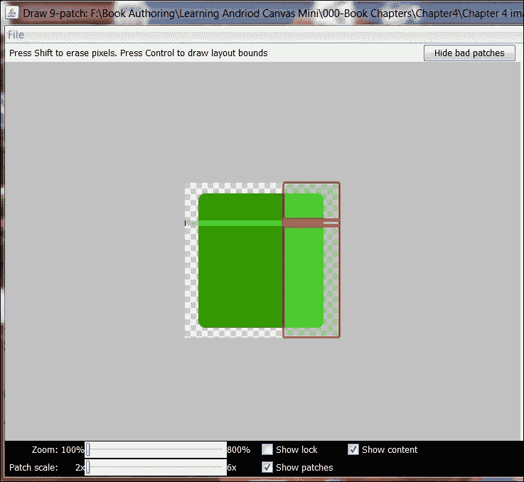

这些用红色边框标记的补丁是错误的补丁，它们不能正确伸展以包含其中的全部内容。我这样做只是为了清楚地说明错误补丁的外观。我们将调整水平和垂直线以获得正确的补丁，检查是否有错误补丁，然后我们将文件保存为`MyFirst9Patch.9.png`；这样我们就完成了第一个 NinePatch 图像的创建。

# 使用 NinePatch 图像

我们将从打开 Eclipse 并开始一个新的 Android 项目开始。我们将项目命名为`MyFirst9PatchApp`。

下面的截图显示了新应用程序的配置设置：

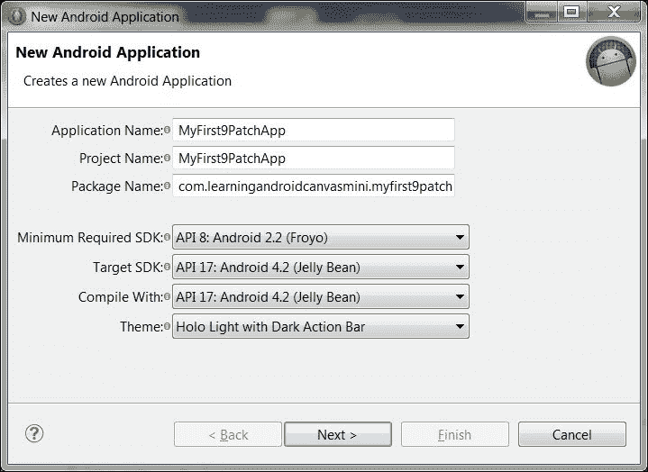

在向导的下一步中，我们将提供基础的 PNG 文件作为我们应用程序的图标。

下面的截图显示了图标配置屏幕：

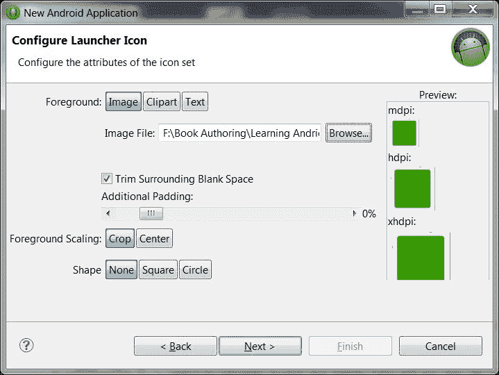

在下一步中，我们将主活动命名为`MyFirst9PatchAppMainActivity`。下面的截图显示了主活动配置屏幕：

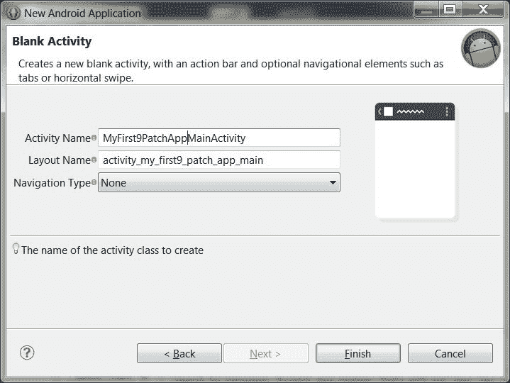

我们将点击**完成**，这会完成向导的执行，并进入我们应用程序的**设计**视图。下面的截图显示了应用程序的**设计**视图：

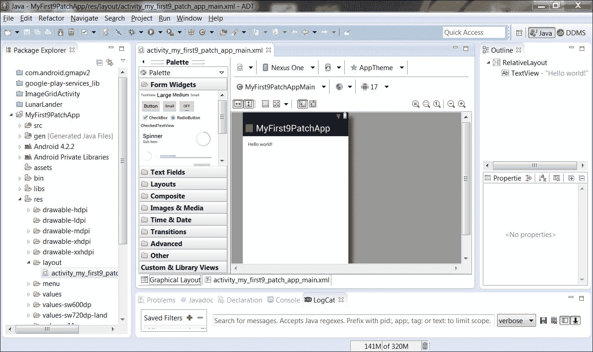

接下来我们要做的是将我们的 NinePatch 图像复制到项目的`res/drawable`文件夹中，这样我们就可以在代码中使用这个 NinePatch 图像了。

接下来，我们将打开主活动的`activity_my_first9_patch_app_main.xml`文件，并在代码中创建一个按钮。整个`Button`代码如下所示：

```kt
<Button
id="@+id/btnninepatch"
  android:layout_width="wrap_content"
  android:layout_height="wrap_content"
  android:layout_alignParentTop="true"
  android:layout_centerHorizontal="true"
  android:layout_marginTop="26dp"
  android:background="@drawable/myfirstninepatch"
  android:text="@string/buttonwith9patchimage"
  android:textSize="38sp" />
```

之前代码中以下两行是最重要的：

```kt
android:background="@drawable/myfirstninepatch"
android:text="@string/buttonwith9patchimage"

```

第一行显示了按钮将使用哪个 Drawable 工具作为其背景，第二行显示了按钮上要显示的文本内容。现在在上面的例子中，字符串名称是`buttonwith9patchimage`，它的值是**背景带有 9 Patch 图像的按钮**，并且我们需要添加更多文本以使按钮背景扩展超过 3 行。需要向按钮添加这么多文本是为了使其成为多行；这将使我们能够看到 NinePatch 图像的拉伸效果。

下面的屏幕截图显示了背景带有拉伸 NinePatch 图像的按钮：

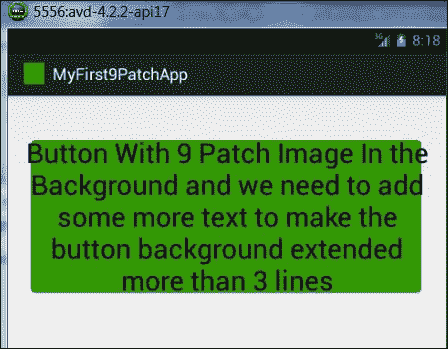

到目前为止，很明显，我们主要将使用 NinePatch 图像来处理背景图形；尤其是当我们不知道想要包含内容的宽度和高度时。接下来我们要做的是更改应用程序主活动的整个背景。比如说，我们不喜欢活动的默认白色背景，我们需要一个自定义背景。在前面提到的应用程序中，我们将从 XML 文件中删除按钮代码，并在`Layout`标签中添加以下代码。

```kt
android:background="@drawable/myfirstninepatch"
```

上面的代码将使我们能够为整个活动使用可拉伸的背景。此标签的完整代码如下所示：

```kt
<RelativeLayout 

    android:layout_width="match_parent"
    android:layout_height="match_parent"
    android:paddingBottom="@dimen/activity_vertical_margin"
    android:paddingLeft="@dimen/activity_horizontal_margin"
    android:paddingRight="@dimen/activity_horizontal_margin"
    android:paddingTop="@dimen/activity_vertical_margin"
    android:background="@drawable/myfirstninepatch"
    tools:context=".MyFirst9PatchAppMainActivity" >  

</RelativeLayout>
```

当我们在模拟器中测试应用程序时，我们会看到以下内容：

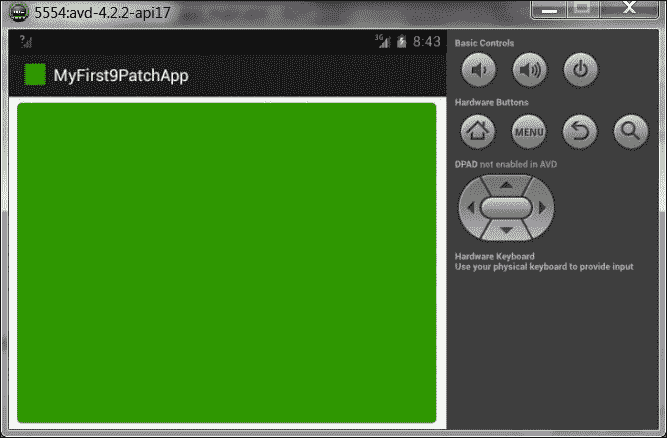

在前面的图片中，我们可以看到我们的 NinePatch 盒图像已经垂直和水平拉伸以填满整个活动屏幕。这将为我们所有图形丰富的应用程序提供一个自定义的可拉伸背景。

# 总结

在本章中，我们了解到了一种可以拉伸以填满其所在容器的图像，这就是所谓的 NinePatch 图像。我们学习了这些可拉伸图像的重要性、它们的架构以及这些图像的基本理解。我们还学会了如何将简单图像转换为这些可拉伸图像，以及需要避免的常见错误。我们也学习了如何在 Android 应用程序中使用这些图像作为视图、控件背景，或者整个活动的背景。在下一章中，我们将学习关于用户交互和图形，如触摸事件。
