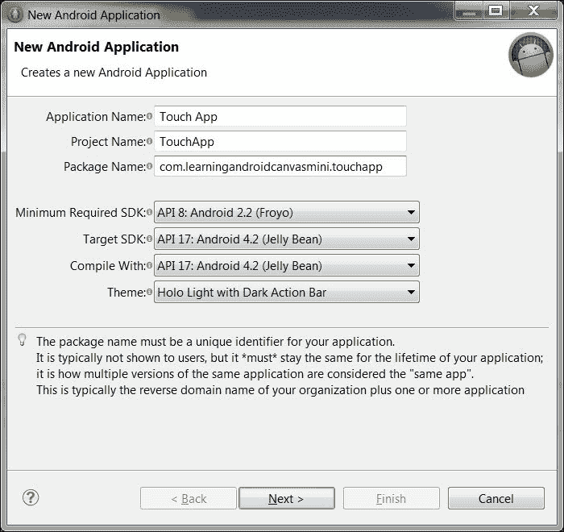
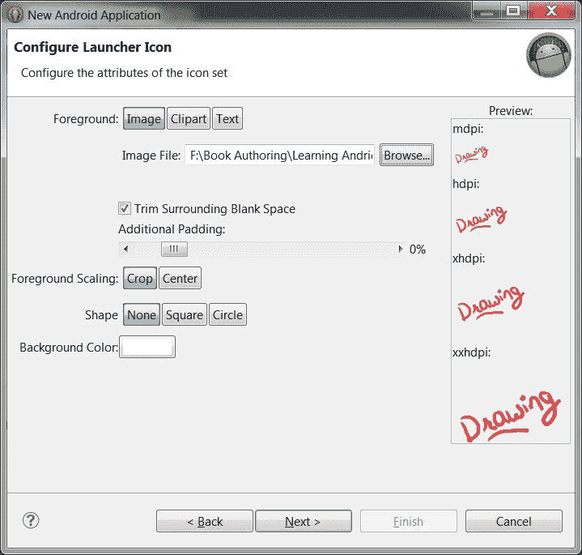
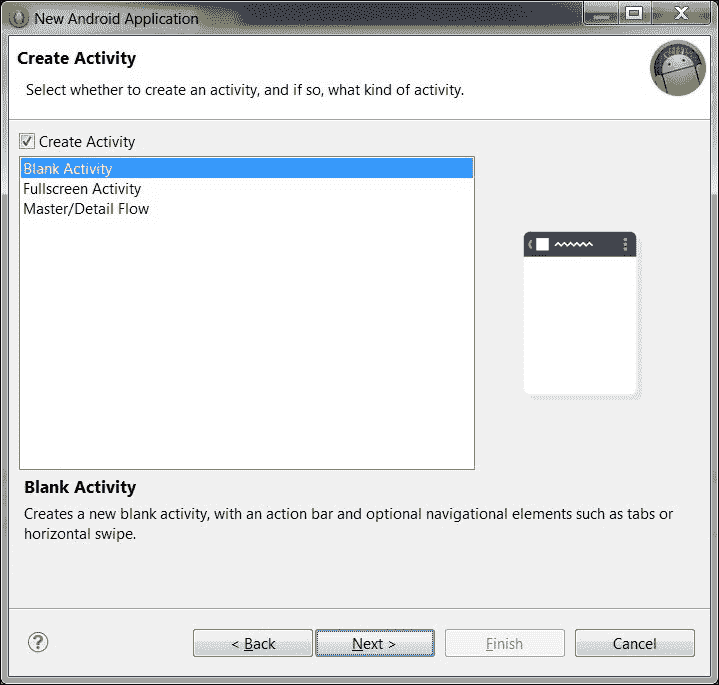
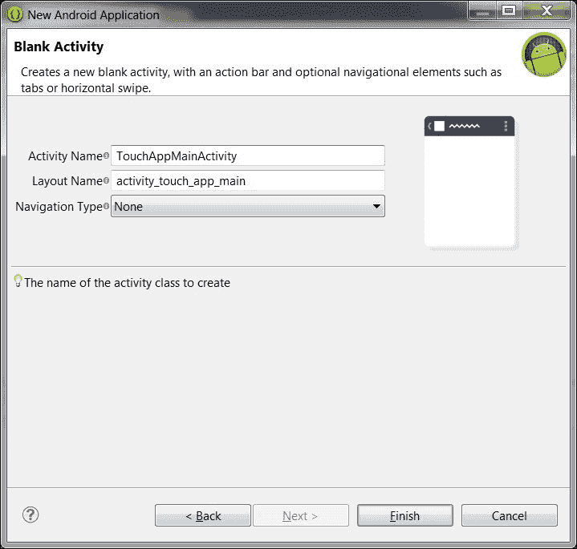
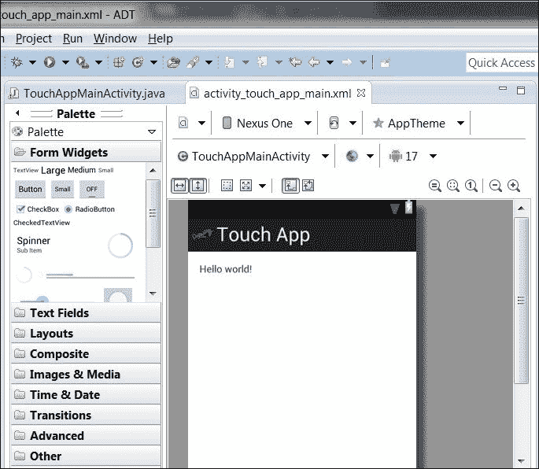
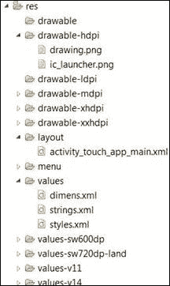
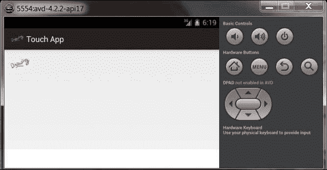
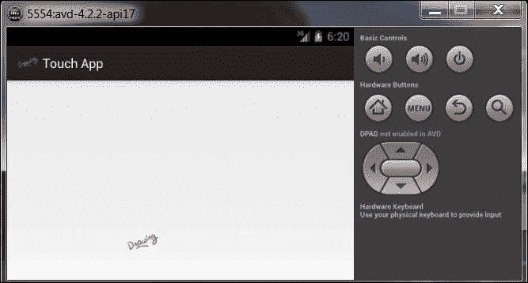

# 第五章：触摸事件和画布上的绘图

在本章中，我们将学习如何与应用程序进行交互，捕捉触摸事件并在画布上对这些触摸事件做出图形渲染。为了实现这个目标，我们将开发一个非常简单的 Android 应用程序，在屏幕上显示一个图像。应用程序的核心功能是，当我们点击或触摸图像并在屏幕上拖动它时，图像会随着我们的手指从当前位置被拖动。当我们释放触摸并抬起手指时，图像停止移动。换句话说，我们将触摸图像并保持按下状态，将图像从屏幕上的点 A 拖放到点 B。

# 一些背景知识

我们首先需要明白屏幕充满了被称为像素的点。水平点是`x`，垂直点是`y`。每当我们把一个对象放在屏幕上，它就在一个特定的`x, y`位置。比如说，如果对象在屏幕的左上角，那么它的位置就是`x = 0`和`y = 0`。

在编写代码时，我们将设置应用程序首次运行时图像的默认位置。默认位置将在屏幕的左上角。因此，我们将为图像位置设置`x = 0`和`y = 0`。这里最重要的时刻将是我们开始拖动图像时；每次触摸的`x, y`发生变化，我们都会将图像位置更新到触摸的当前位置。这样，它看起来就像我们从位置 A 拖动图像到位置 B。我们将首先监听触摸事件，然后捕获这些触摸事件来实现这一点。

之后，我们将捕获触摸的动作。动作是按下还是抬起？如果动作是按下，是否有移动？因为如果有移动且动作是按下，我们就需要进行拖动。

随着我们开发简单的应用程序并进行编码，将会有更多细节出现。

# 应用程序开发

我们将在 Eclipse 中创建一个名为`Touch App`的新项目。下面的截图显示了新 Android 应用程序向导的第一步：



下面的截图显示我们已经选择了一个自定义创建的 PNG 绘图文件作为我们应用程序的图标：



下面的截图显示我们需要从一个空白屏幕开始我们的项目，因为这是我们想要的游戏场所：



下面的截图是向导的最后一步，显示了我们已经创建了一个名为`TouchAppMainActivity`的默认主活动，并且其布局文件名已自动填充：



下面的截图显示我们的向导已经完成，现在我们有一个可工作的应用程序框架：



从这一点开始，我们首先会从屏幕上删除**Hello world!**文本，因为我们要让屏幕完全空白，只显示我们将要拖动的图像。

接下来，我们将在硬盘上浏览到项目的`res`文件夹，并创建一个名为`drawable`的新文件夹，如果它尚未创建或`res`文件夹中的任何可用文件夹都可以使用，例如`drawable-hdpi`。

然后，我们将`drawing.png`文件复制到那个文件夹中，并再次回到 Eclipse。我们将在包资源管理器中刷新项目文件。以下屏幕截图显示了`res`文件夹的最终状态：



## 我们的自定义视图类

我们将打开扩展了`Activity`类的`TouchAppMainActivity` Java 文件。在这个类中，我们将创建另一个类，其中包含我们所有的核心功能，并扩展`View`类：

```kt
public class TouchAppView extends View {
```

### 定义类属性和对象

在这个类中，我们将定义一些全局对象和变量，以便它们对所有类中的方法可见。首先，我们将定义一个`Paint`对象：

```kt
  private Paint paint = new Paint(Paint.ANTI_ALIAS_FLAG);
```

接着是屏幕上`x, y`点的变量：

```kt
  private float x, y;
```

下面是一个布尔变量，用于检查是否正在发生触摸事件：

```kt
  boolean touching = false;
```

此后，我们将定义一个`Bitmap`对象，并提供我们自定义的`drawing.png`文件作为其源，该文件我们已复制到项目资源的`drawable`文件夹中：

```kt
  Bitmap drawingPic = BitmapFactory.decodeResource(getResources(),R.drawable.drawing);
```

接下来是我们将用来设置屏幕上图像默认位置的变量。初始化值为`x, y`位置的`0, 0`，图像将显示在屏幕的左上角。稍后，当我们改变图像的位置时，这些变量的值将相应更新。

```kt
  int drawingPic_x = 0;
  int drawingPic_y = 0;
```

接下来，我们捕获显示图像的宽度和高度：

```kt
  int drawingPic_w = drawingPic.getWidth();
  int drawingPic_h = drawingPic.getHeight();
```

然后，我们将定义偏移变量。偏移变量定义了一个对象相对于另一个对象或位置的相关位置。

```kt
  int drawingPic_offsetx;
  int drawingPic_offsety;
```

下面只是一个布尔变量，用于检查触摸动作。默认设置为`false`。

```kt
  boolean dm_touched = false;
```

第一个布尔变量检查屏幕是否被触摸，第二个布尔变量检查在屏幕被触摸时，实际上触摸的是图像还是图像以外的其他点。

### 我们自定义视图类中的方法

现在，我们将以下四种方法添加到我们的类中：

+   构造函数

+   绘图方法

+   测量方法

+   触摸事件

### 构造函数

我们将定义构造函数，但暂时不会在其中放置任何功能。现在，我们只调用父级的上下文。

```kt
  public TouchAppView(Context context) {

    super(context);

  }
```

### 绘图方法

这是我们每次改变图像位置时为我们绘制位图图像的方法。我们希望旧的图像被移除，并在新的位置绘制相同的图像。

```kt
  protected void onDraw(Canvas canvas) {

    canvas.drawBitmap(drawingPic, drawingPic_x, drawingPic_y, paint);
  }
```

实际上，这个方法通过使用`drawingPic`作为源图像在画布上绘制位图。`drawingPic`是包含我们`drawing.png`图像的对象。它从初始化的变量中获取`x`和`y`点，其中`x`是要绘制的位图的左侧位置，`Y`是要绘制的位图的顶部位置。最后，`paint`对象将绘制位图，但如果我们使用源位图，此对象的值可以为 null。

### 测量方法

这是一个方法，它将告诉系统视图及其内容在垂直和水平方向上需要多少空间。我们可以不使用这个方法来完成这个应用程序；然而，提到它是必要的，因为当我们在更复杂的图形应用程序中工作时，这个方法可以提供有价值的信息。代码如下：

```kt
  protected void onMeasure(int widthMeasureSpec, int heightMeasureSpec) {
    setMeasuredDimension(MeasureSpec.getSize(widthMeasureSpec), MeasureSpec.getSize(heightMeasureSpec));
  }
```

### 触摸事件

我们将定义一个`onTouchEvent()`方法，该方法将接收一个动作作为参数。现在，动作可以是三种类型：移动、按下动作或按下按钮类型的动作，以及抬起动作或释放按钮类型的动作。我们将为这三种情况定义案例和功能，并将我们想要执行的操作逻辑整合到每种类型的动作中。

我们定义了`onTouchEvent()`方法：

```kt
  public boolean onTouchEvent(MotionEvent event) {
```

我们定义一个变量来存储动作值：

```kt
    int action = event.getAction();
```

### 注意

有关所有可用的属性和方法，可以访问以下链接：

[`developer.Android.com/reference/android/view/MotionEvent.html`](http://developer.Android.com/reference/android/view/MotionEvent.html)（链接内容不需要翻译，保留英文）

一个开关案例开始，它将获取动作并针对不同的场景进行检查，并根据每个动作执行操作，如下所示：

```kt
    switch(action){
```

如果动作是按下，将`x, y`值设置为当前事件的`x, y`位置，并将触摸变量设为`true`。

```kt
      case MotionEvent.ACTION_DOWN:
      x = event.getX();
      y = event.getY();
      touching = true;
```

现在检查动作是否为按下，并且触摸的是图像，因为我们不希望图像因为触摸屏幕其他地方而被拖动。在以下代码中，我们将通过初始值检查我们图像的垂直和水平位置以及图像的宽度和高度。如果完全相同且一切返回`true`，我们将`dm_touched`变量设为`true`。这意味着图像被触摸了。

```kt
      if((x > drawingPic_x) && (x < drawingPic_x+drawingPic_w) && (y > drawingPic_y) && (y < drawingPic_y+drawingPic_h)){
```

既然我们知道图像被触摸了，我们将根据新的`x, y`位置更新图像的`x, y`位置，即从当前地点发生的事件中获得的位置。

```kt
        drawingPic_offsetx = (int)x - drawingPic_x;
        drawingPic_offsety = (int)y - drawingPic_y;
        dm_touched = true;
      }

      break;
```

执行前面的代码一次后，执行第二个案例中提到的案例代码。`if`语句将执行，因为现在我们已经确认执行了一个触摸事件，并且触摸的区域实际上是我们的图像。现在检查`dm_touched`变量是否为`true`，然后更新图像的`x, y`位置。起初，第一个案例中的代码将不会执行，因为`dm_touched`变量为`false`。

```kt
      if(dm_touched){
        drawingPic_x = (int)x - drawingPic_offsetx;
        drawingPic_y = (int)y - drawingPic_offsety;
      }

      break;
```

如果动作是`MOVE`，则将之前定义的`x, y`变量值设置为当前事件的`x, y`值，并将触摸布尔变量设为`true`。

```kt
      case MotionEvent.ACTION_MOVE:
      x = event.getX();
      y = event.getY();
      touching = true;
```

如果情况是`ACTION_UP`，这意味着我们正在抬起手指。释放触摸将简单地将`touching`和`dm_touched`布尔变量设为`false`。

```kt
      case MotionEvent.ACTION_UP:
      default:
      dm_touched = false;
      touching = false;
    }
```

最后，我们将调用`invalidate()`方法，以便移除之前的绘图并在新参数下绘制全新的位图。

```kt
    invalidate();
    return true;
  }
}
```

## 我们的主活动类和最终输出

我们将进入主类`TouchAppMainActivity`的`onCreate()`方法。在`OnCreate`方法中，我们将添加以下代码：

```kt
setContentView(new TouchAppView(this));
```

这个方法为我们提供了使用当前活动界面的用户界面的功能。如果我们定义了一个自定义视图，但没有将其设置为我们的自定义视图类，那么我们的自定义视图将不会出现。所以一切看起来都正常且不会生成错误，但应用程序将无法按计划运行。`setContentView()`的重要性在于，它是负责显示基于 XML 的布局甚至动态布局的方法。通过调用这个方法并将我们的自定义视图类，即`TouchAppView`作为参数传入，我们使应用程序能够执行在`TouchAppView`类中编写的任何代码。

下面的屏幕截图显示了应用程序在模拟器中测试时的最终输出：



现在，我们将点击屏幕并保持按下状态，尝试用鼠标拖动图像。这将模拟触摸屏幕的操作；保持手指按下并在屏幕上从点 A 拖动图像到点 B。

下面的屏幕截图显示我们已经将图像从默认位置拖动到另一个位置：



# 总结

在本章中我们学到了以下内容：

+   为我们的图形应用程序创建一个自定义视图类

+   捕获触摸事件

+   识别在触摸屏幕时执行的操作以及可以执行的操作类型

+   我们对触摸事件执行的操作的响应功能

+   最后，我们将讨论如何在主活动类中实现这个自定义视图类

在下一章中，我们将汇总之前章节中学到的所有经验，并创建一个完整的程序，我们将在其中选择不同的颜色，并在画布上绘制我们自己的图形。这将是一个非常简单的类似画图的应用程序。
